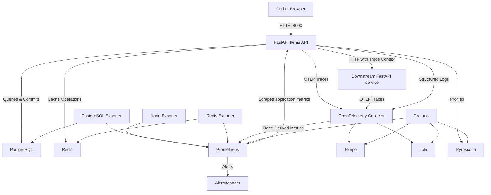

# Observable FastAPI Items API: 50-Lab Observability Platform

A hands-on repository for learning backend operations and observability using a real FastAPI application, PostgreSQL, Redis, Docker Compose, Prometheus, Grafana, Alertmanager, Loki, Tempo, Pyroscope, exporters, and focused OpenTelemetry instrumentation.

The repository contains the complete 50-lab curriculum under `labs/`. Labs are completed in numerical order and progressively activate the platform capabilities required for the current topic.

The curriculum contract is maintained in [`docs/50-lab-roadmap.md`](docs/50-lab-roadmap.md).

## Repository Overview

The application is a small Items API designed to provide realistic behavior for operational experiments without unnecessary business complexity.

Core application capabilities include:

- FastAPI CRUD endpoints for items.
- PostgreSQL as the authoritative data store.
- Redis cache-aside reads with TTL, invalidation, fallback, and graceful degradation.
- SQLAlchemy 2.x asynchronous sessions and Alembic migrations.
- Liveness and dependency-aware readiness endpoints.
- Structured JSON logging and request correlation IDs.
- Prometheus-format application metrics.
- Controlled diagnostic workload for telemetry exercises.

The observability platform includes:

- Prometheus for metrics, PromQL, recording rules, relabeling, alert rules, and TSDB exercises.
- Node Exporter for host-level USE monitoring.
- PostgreSQL Exporter and Redis Exporter for dependency-level metrics.
- Grafana for exploration, dashboards, drilldowns, and SLO views.
- Alertmanager for routing, grouping, inhibition, and silences.
- Loki for centralized logs and LogQL.
- OpenTelemetry SDK and Collector for log transport, distributed tracing, sampling, and trace-context correlation.
- Tempo for distributed traces, TraceQL, span metrics, service graphs, and exemplar workflows.
- Pyroscope for continuous profiling and trace-to-profile correlation.
- Failure-engineering exercises covering application dependencies and observability backends.

Kubernetes is intentionally outside the core 50-lab curriculum. The repository remains focused on a single-node Docker Compose environment so observability concepts can be learned before adding orchestration complexity.

## Architecture

The opening labs use only the application and its direct dependencies. Additional observability services are activated by the labs that teach them.



PostgreSQL is the system of record. Redis is a disposable performance layer. Prometheus remains the primary owner of native application and infrastructure metrics. OpenTelemetry is used where it adds value for logs, traces, sampling, Collector behavior, and cross-signal correlation.

## Pinned Component Matrix

These versions describe the repository baseline and should be changed together with the matching configuration when upgrading.

| **Component**                            | **Baseline Version or Package**                |
|------------------------------------------|----------------------------------------------- |
| Python                                   | `3.12.14-slim-bookworm`                        |
| FastAPI and Uvicorn                      | `0.141.1` and `0.53.0`                         |
| Pydantic and pydantic-settings           | `2.13.5` and `2.15.0`                          |
| SQLAlchemy, Alembic, and asyncpg         | `2.0.53`, `1.20.0`, and `0.31.0`               |
| Redis Python client                      | `8.1.0`                                        |
| Prometheus Python client                 | `0.26.0`                                       |
| OpenTelemetry SDK and exporter           | `1.44.0`                                       |
| OpenTelemetry instrumentation            | `0.65b0`                                       |
| Pyroscope Python client                  | `pyroscope-io==1.2.3`                          |
| PostgreSQL                               | `postgres:17.11-bookworm`                      |
| Redis                                    | `redis:7.4.8-bookworm`                         |
| Prometheus                               | `prom/prometheus:v3.14.0`                      |
| Alertmanager                             | `prom/alertmanager:v0.34.0`                    |
| Grafana                                  | `grafana/grafana:13.2.2`                       |
| Loki                                     | `grafana/loki:3.7.7`                           |
| Tempo                                    | `grafana/tempo:3.0.3`                          |
| Pyroscope                                | `grafana/pyroscope:2.3.1`                      |
| OpenTelemetry Collector Contrib          | `otel/opentelemetry-collector-contrib:0.160.0` |
| Static container health utility          | `busybox:1.37.0-musl`                          |

## Repository Layout

| **Path**                                      | **Responsibility**                                                                |
|-----------------------------------------------|-----------------------------------------------------------------------------------|
| `app/app/`                                    | FastAPI application, database, cache, middleware, metrics, logging, and telemetry |
| `app/migrations/`                             | Alembic migration environment and schema revisions                                |
| `app/tests/`                                  | Application behavior and regression tests                                         |
| `config/prometheus/`                          | Prometheus scrape configuration, recording rules, and alerts                      |
| `config/alertmanager/`                        | Alertmanager routing, inhibition, and templates                                   |
| `config/grafana/`                             | Provisioned data sources and dashboards                                           |
| `config/otel/`                                | OpenTelemetry Collector configuration                                             |
| `config/loki/`                                | Loki configuration                                                                |
| `config/tempo/`                               | Tempo configuration                                                               |
| `config/pyroscope/`                           | Pyroscope configuration                                                           |
| `config/health/`                              | Health-probe support for telemetry images                                         |
| `postgres/init.sql`                           | PostgreSQL bootstrap roles and permissions                                        |
| `scripts/`                                    | Bootstrap, health-check, and workload scripts                                     |
| `labs/Lab-01.md` through `labs/Lab-50.md`      | Complete hands-on lab guides                                                      |
| `docs/50-lab-roadmap.md`                      | Curriculum contract for all 50 labs                                               |
| `docs/operations.md`                          | Operational reference and runbook                                                 |
| `lab-notes/`                                  | Local evidence, observations, and lab-specific overrides                          |
| `docker-compose.yml`                          | Single-node platform orchestration                                                |
| `Makefile`                                    | Supported repository commands                                                     |
| `.env.example`                                | Local configuration template                                                      |
| `SECURITY.md`                                 | Security boundaries and hardening guidance                                        |

## 50-Lab Curriculum

All 50 labs are included. The detailed objectives and scope for every lab are defined in [`docs/50-lab-roadmap.md`](docs/50-lab-roadmap.md).

| **Phase** | **Labs** | **Focus**                                                                                                              |
|-----------|----------|------------------------------------------------------------------------------------------------------------------------|
| 1         | 1–6      | Application behavior, PostgreSQL, Redis, health, Docker Compose, structured logging, and evidence capture              |
| 2         | 7–18     | Prometheus, instrumentation, PromQL, histograms, exporters, recording rules, relabeling, and TSDB operations           |
| 3         | 19–26    | Grafana, dashboards, alerting, Alertmanager, SLIs, SLOs, error budgets, and burn rates                                 |
| 4         | 27–32    | Loki, structured logs, LogQL, log-derived metrics, log alerts, retention, and shipping failures                        |
| 5         | 33–41    | OpenTelemetry, Tempo, distributed tracing, sampling, Collector resilience, span metrics, service graphs, and exemplars |
| 6         | 42–44    | Pyroscope, differential profiling, trace-to-profile, and four-signal correlation                                       |
| 7         | 45–50    | Failure engineering, security review, backup and restore, upgrades, rollback, game day, and postmortem practice        |

### Lab Index

| **Lab** | **Guide**                                                                                 |
|---------|-------------------------------------------------------------------------------------------|
| 1       | [Follow One FastAPI Request End-to-End](labs/Lab-01.md)                                    |
| 2       | [PostgreSQL Persistence and Transaction Boundaries](labs/Lab-02.md)                        |
| 3       | [Redis Cache-Aside and Graceful Degradation](labs/Lab-03.md)                               |
| 4       | [Liveness, Readiness, and Dependency Health](labs/Lab-04.md)                               |
| 5       | [Docker Compose Networking, Storage, and Restart Behavior](labs/Lab-05.md)                 |
| 6       | [Structured Logging, Request IDs, and Evidence Capture](labs/Lab-06.md)                    |
| 7       | [Raw OpenMetrics Before Prometheus](labs/Lab-07.md)                                        |
| 8       | [Instrument RED Metrics](labs/Lab-08.md)                                                   |
| 9       | [Metric Design, Business Metrics, and Cardinality](labs/Lab-09.md)                         |
| 10      | [Prometheus Discovery and Scrape Lifecycle](labs/Lab-10.md)                               |
| 11      | [PromQL Selectors, Matchers, and Aggregation](labs/Lab-11.md)                             |
| 12      | [Counter Math: `rate`, `irate`, and `increase`](labs/Lab-12.md)                           |
| 13      | [Histograms, Buckets, and Quantiles](labs/Lab-13.md)                                      |
| 14      | [Host Monitoring with Node Exporter and USE](labs/Lab-14.md)                              |
| 15      | [PostgreSQL and Redis Exporters](labs/Lab-15.md)                                          |
| 16      | [Recording Rules and Query Cost](labs/Lab-16.md)                                          |
| 17      | [Relabeling and Ingestion Guardrails](labs/Lab-17.md)                                     |
| 18      | [Prometheus TSDB, Retention, and Capacity](labs/Lab-18.md)                                |
| 19      | [Grafana Explore and Data Source Fundamentals](labs/Lab-19.md)                            |
| 20      | [Build a RED Application Dashboard](labs/Lab-20.md)                                       |
| 21      | [Build USE and Dependency Dashboards](labs/Lab-21.md)                                     |
| 22      | [Dashboard Variables, UX, Drilldowns, and Provisioning](labs/Lab-22.md)                   |
| 23      | [Prometheus Alert Rule Lifecycle](labs/Lab-23.md)                                         |
| 24      | [Alertmanager Routing, Grouping, Inhibition, and Silences](labs/Lab-24.md)                |
| 25      | [Define SLIs, SLOs, and Error Budgets](labs/Lab-25.md)                                    |
| 26      | [Multi-Window Burn Rates and the SLO Operations Dashboard](labs/Lab-26.md)                |
| 27      | [Loki Architecture and Log Ingestion](labs/Lab-27.md)                                     |
| 28      | [Loki Labels, Structured Metadata, and Cardinality](labs/Lab-28.md)                       |
| 29      | [LogQL Selectors, Filters, and Parsing](labs/Lab-29.md)                                   |
| 30      | [Metrics from Logs](labs/Lab-30.md)                                                       |
| 31      | [Log-Based Alerts](labs/Lab-31.md)                                                        |
| 32      | [Log Shipping Failure, Retention, and Cost](labs/Lab-32.md)                               |
| 33      | [OpenTelemetry Tracing Fundamentals](labs/Lab-33.md)                                      |
| 34      | [Automatic FastAPI, SQLAlchemy, and Redis Instrumentation](labs/Lab-34.md)                |
| 35      | [Distributed Context Propagation](labs/Lab-35.md)                                         |
| 36      | [Custom Spans, Events, Attributes, Status, and Redaction](labs/Lab-36.md)                 |
| 37      | [Tempo Search and TraceQL](labs/Lab-37.md)                                                |
| 38      | [Head Sampling and Diagnostic Loss](labs/Lab-38.md)                                       |
| 39      | [Tail Sampling in the Collector](labs/Lab-39.md)                                          |
| 40      | [Collector Queues, Retries, Memory, and Backpressure](labs/Lab-40.md)                     |
| 41      | [Tempo Span Metrics, Service Graphs, and Exemplars](labs/Lab-41.md)                       |
| 42      | [Pyroscope Continuous Profiling Fundamentals](labs/Lab-42.md)                             |
| 43      | [CPU Work, Waiting, and Differential Profiling](labs/Lab-43.md)                           |
| 44      | [Trace-to-Profile and Four-Signal Correlation](labs/Lab-44.md)                            |
| 45      | [Redis Failure Incident](labs/Lab-45.md)                                                  |
| 46      | [PostgreSQL Failure Incident](labs/Lab-46.md)                                             |
| 47      | [Observability Backend Failure](labs/Lab-47.md)                                           |
| 48      | [Security and Telemetry Hardening Review](labs/Lab-48.md)                                 |
| 49      | [Configuration Validation, Backup, Restore, Upgrade, and Rollback](labs/Lab-49.md)        |
| 50      | [Capstone Reliability Game Day and Evidence-Based Postmortem](labs/Lab-50.md)             |

## Setup Required Before Starting Labs

Complete this section before opening `labs/Lab-01.md`.

### 1. Prepare The Learning Host

Use a dedicated Linux host or VM with Docker Engine.

Recommended Starting Capacity:

- Approximately 2 CPUs and 4 GiB RAM for the opening application-only labs.
- Approximately 4 CPUs and 8 GiB RAM for the complete local observability stack.
- At least 15–20 GiB of free disk space initially.

These are learning-environment estimates rather than production sizing guarantees.

### 2. Install & Verify Host Tools

Required host tools:

- Bash
- Docker Engine
- Docker Compose v2 plugin
- Python 3
- curl
- jq
- Git
- Make
- ripgrep
- unzip

Verify the installed tools:

```bash
for tool in bash docker python3 curl jq git make rg; do
  command -v "$tool" || exit 1
done

docker version
docker compose version
docker info >/dev/null
```

**Docker Compose 2.24.4 or newer is required** because the lab overlay uses Compose `!override` merge behavior.

On Debian or Ubuntu, install the ordinary command-line dependencies with:

```bash
sudo apt-get update
sudo apt-get install -y bash ca-certificates curl git jq make python3 ripgrep unzip
```

Install Docker Engine and the Compose plugin using Docker's official installation procedure for your Linux distribution.

### 3. Extract & Enter The Repository

```bash
unzip ObservabilityLabs.zip
cd ObservabilityLabs
```

If the repository is already extracted, enter its existing root instead of extracting over it.

Confirm the expected files:

```bash
test -f docker-compose.yml
test -f app/app/main.py
test -f app/migrations/versions/0001_create_items.py
test -f labs/Lab-01.md
test -f labs/Lab-50.md
test -f docs/50-lab-roadmap.md
test -f docs/operations.md
test -f SECURITY.md
```

### 4. Create Local Configuration

```bash
./scripts/bootstrap.sh
chmod 600 .env
```

When `.env` does not exist, the bootstrap script creates it with local PostgreSQL, Redis, and Grafana credentials. When `.env` already exists, it is preserved.

Do not use `--start` before Lab 1. The opening lab deliberately starts only the application baseline instead of the complete observability stack.

**Do not run `source .env`.** The file is consumed by Docker Compose and the application configuration layer; it is not intended to be executed as a shell script.

### 5. Check Existing Containers & Host Ports

Inspect any existing containers for this project:

```bash
docker compose ps -a
```

Check the main loopback ports used by the repository:

```bash
python3 - <<'PYTHON'
import socket

for port in (8000, 3000, 9090, 9093, 4040, 8006):
    with socket.socket() as probe:
        probe.settimeout(0.3)
        listening = probe.connect_ex(("127.0.0.1", port)) == 0
    print(f"127.0.0.1:{port}: {'listener present' if listening else 'available'}")
PYTHON
```

The repository binds published services to loopback by default. Do not expose the training stack directly to the public internet.

### 6. Validate the Compose Model

```bash
docker compose config --quiet
```

A successful command produces no output and exits with status `0`.

Avoid saving unfiltered resolved Compose configuration because environment values may contain credentials.

### 7. Prepare the Baseline Images

```bash
docker compose pull postgres redis
docker compose build app
```

Do not run an unqualified `docker compose up` before Lab 1. The lab creates and uses the correct baseline overlay.

### 8. Prepare the Local Evidence Directory

```bash
mkdir -p lab-notes
chmod 700 lab-notes

if ! rg -qx '/lab-notes/' .gitignore; then
  printf '\n/lab-notes/\n' >> .gitignore
fi

git check-ignore .env lab-notes/session.sh
```

Both `.env` and `lab-notes/` should remain outside version control.

### 9. Start the Curriculum

Open [`labs/Lab-01.md`](labs/Lab-01.md) and follow its starting-state checks and baseline initialization procedure.

Do not start the full observability platform manually before completing the Lab 1 setup. Each lab is responsible for activating and validating the services it requires.

## Setup Completion Checklist

- [ ] Docker Engine is installed and working.
- [ ] Docker Compose is version 2.24.4 or newer.
- [ ] Bash, Python 3, curl, jq, Git, Make, ripgrep, and unzip are available.
- [ ] The complete repository contains `Lab-01.md` through `Lab-50.md`.
- [ ] `docs/50-lab-roadmap.md` is present.
- [ ] `.env` exists, has restricted permissions, and is ignored by Git.
- [ ] `lab-notes/` exists and is ignored by Git.
- [ ] Required loopback ports have no unexplained conflicts.
- [ ] `docker compose config --quiet` succeeds.
- [ ] PostgreSQL and Redis images are available.
- [ ] The application image builds successfully.
- [ ] `labs/Lab-01.md` is the next step.

## Important Repository Notes

- The platform is a single-node learning environment, not a highly available production architecture.
- PostgreSQL is authoritative application state; Redis is a cache and may be rebuilt.
- All 50 labs are included, but services are activated progressively rather than all at once.
- Native metrics remain Prometheus-first; OpenTelemetry is used only where required by the tracing, log transport, sampling, Collector, and correlation labs.
- Detailed operational commands belong in [`docs/operations.md`](docs/operations.md).
- Security boundaries and production-hardening guidance belong in [`SECURITY.md`](SECURITY.md).
- Exact lab objectives and sequencing belong in [`docs/50-lab-roadmap.md`](docs/50-lab-roadmap.md).