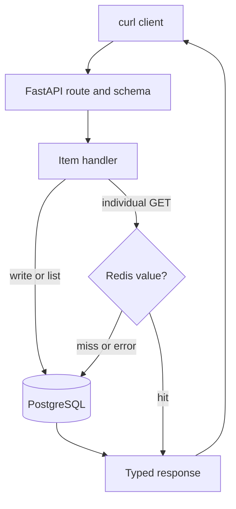

# Lab 01: Follow One FastAPI Request End-to-End

## Purpose and Scope

> **Primary Objective:** Follow a real item request from the client through FastAPI routing, validation, dependency injection, application logic, PostgreSQL or Redis, response serialization, and back to the client—before introducing observability backends.

The first diagnostic skill is knowing which work a request actually needs. A successful response, a database row, and a cache entry prove different things. In this lab, you will connect those observations to the code that produced them.

This guide follows Lab 1 of the [50-lab roadmap](../docs/50-lab-roadmap.md). The running domain is an Items API with UUID identifiers, a PostgreSQL service named `postgres`, and an optional Redis cache.

Here the domain is **items**, IDs are UUIDs, the database service is **postgres**, and Redis failure permits degraded readiness. Use the commands in this guide as written for this repository.

## 1. Lab Context and Explicit Exclusions

Only three long-running services belong in the baseline:

- `app`: the FastAPI Items API;
- `postgres`: authoritative item storage;
- `redis`: optional cached item reads.

Two supporting jobs run and exit: `init-volumes` prepares volume ownership and `migrate` applies Alembic migrations. An exited job with code 0 is successful, not a failed service.

Keep Prometheus, Grafana, Alertmanager, Collector, Loki, Tempo and Pyroscope stopped. Do not add Node Exporter or dependency exporters yet. Those extensions belong to Labs 14–15.

This lab does not teach transaction isolation, TTL/staleness experiments, health failure matrices, Docker lifecycle internals, structured-log instrumentation, PromQL or tracing. Those are separate steps in the updated sequence. You will use a health endpoint as a starting check and inspect a little cache state only to explain the request path.

## 2. Prerequisites and Inherited State

Complete **Setup Required Before Starting the Lab** in [README](../README.md).

Use Bash on your Linux Docker host. You need Docker Engine, Compose **2.24.4 or newer**, curl, jq, Python 3, Make and ripgrep (`rg`). Git is recommended for reviewed checkpoints.

Run every command from the repository root unless a step explicitly says otherwise:

```bash
pwd
test -f docker-compose.yml
test -f app/app/api.py
test -f app/app/database.py
test -f .env
test -f labs/Lab-1.md
docker compose version
```

Expected: all `test` commands succeed without output. Existing synthetic items may remain; no volume reset is needed.

Do **not** `source .env`. It is a Compose dotenv file, contains secrets, and includes values such as an application name with spaces. Compose will load it itself.

## 3. Measurable Learning Objectives

By the end, you must be able to:

- find the application factory, router, request schema, model, database dependency and cache class;
- distinguish route matching from request validation and application execution;
- create, list, retrieve, replace and delete one item using the actual contract;
- prove the created record exists in PostgreSQL independently of the HTTP response;
- show that POST invalidates the item cache and a later individual GET populates it;
- explain why list and individual GET routes follow different paths;
- distinguish malformed input from a valid ID whose item is absent;
- explain why a session object does not necessarily imply a database query;
- describe the boundary between source-code evidence and measured runtime evidence;
- start exactly the baseline services without a telemetry backend; and
- leave a known, recoverable starting state for Lab 2.

## 4. Current Architecture



This is a request-flow model, not an OpenTelemetry trace. No Tempo trace is needed to learn it.

| **Layer** | **Question** | **Evidence in this lab** |
|---|---|---|
| Client | What did the caller send and receive? | Saved HTTP headers, status and JSON |
| FastAPI | Which handler and schema apply? | OpenAPI and `api.py` / `schemas.py` |
| Application | Which dependency is used? | Handler branches and dependency wiring |
| PostgreSQL | Does the authoritative record exist? | A direct SQL query |
| Redis | Is a derived representation present? | Exact-key EXISTS/GET |

## 5. Establish a Clean Starting State

Inspect the project before changing it:

```bash
docker compose config --services
docker compose ps -a
```

The full model contains ten long-running services plus the two initialization jobs. The course starts fewer services than the model defines.

If this learning project is already running the full stack, stop its containers while retaining its named volumes:

```bash
docker compose down
```

Run this only in your learning repository. It interrupts that Compose project. It does not delete named-volume data because no volume-removal option is used.

Do not run a global prune or reset. A clean starting state means understood state, not deleted evidence.

## 6. Create a Reversible Baseline Override

The delivered full-stack app depends on Collector and uses Docker's Fluent Forward logging driver. Merely setting `OTEL_ENABLED=false` would not remove that dependency or log transport.

Create a local override that changes only the early-lab app settings:

```bash
mkdir -p lab-notes
chmod 700 lab-notes
cat > lab-notes/compose.baseline.yaml <<'YAML'
services:
  app:
    environment:
      OTEL_ENABLED: "false"
      PYROSCOPE_ENABLED: "false"
    depends_on: !override
      migrate:
        condition: service_completed_successfully
      redis:
        condition: service_started
    logging: !override
      driver: json-file
      options:
        max-size: "10m"
        max-file: "3"
YAML
```

The `!override` tag replaces the entire dependency/logging mapping. An ordinary mapping merge could leave Collector or Fluent Forward options behind. This requires Compose 2.24.4 or newer. [Docker documents the replacement behavior](https://docs.docker.com/reference/compose-file/merge/#replace-value).

The full-stack file is untouched. During early labs, app JSON goes to Docker's local rotating `json-file` driver. Profiling and OTel tracing are disabled. Existing native application metrics remain available but are studied starting in Lab 7.

Keep this local learning override in the ignored `lab-notes/` directory. It is not a production deployment configuration.

## 7. Create the Shared Lab Session Helper

The next block defines explicit shortcuts used by all five labs. Read it before sourcing it. It enables Bash `pipefail` so a failed request or assertion is not hidden by a successful final pipeline command. It does not load passwords into your host shell or print connection strings.

```bash
cat > lab-notes/session.sh <<'BASH'
# Source from Bash; this is a local lab helper, not the application's environment file.
set -o pipefail
LAB_ROOT="$(cd -- "$(dirname -- "${BASH_SOURCE[0]}")/.." && pwd)"
export APP_URL="${APP_URL:-http://127.0.0.1:8000}"

dc() {
  docker compose --project-directory "$LAB_ROOT" --env-file "$LAB_ROOT/.env" \
    -f "$LAB_ROOT/docker-compose.yml" \
    -f "$LAB_ROOT/lab-notes/compose.baseline.yaml" "$@"
}

api() {
  curl --connect-timeout 2 --max-time 15 "$@"
}

wait_ready() {
  local attempt
  for attempt in {1..45}; do
    if curl --connect-timeout 1 --max-time 5 -fsS "$APP_URL/health/ready" 2>/dev/null \
      | jq -e '.status == "ready"' >/dev/null 2>&1; then
      echo "Application and both dependencies are ready"
      return 0
    fi
    sleep 1
  done
  echo "Readiness deadline exceeded; inspect dc ps -a and dependency logs" >&2
  return 1
}

wait_live() {
  local attempt
  for attempt in {1..45}; do
    if curl --connect-timeout 1 --max-time 3 -fsS "$APP_URL/health/live" \
      >/dev/null 2>&1; then
      return 0
    fi
    sleep 1
  done
  echo "Liveness deadline exceeded" >&2
  return 1
}

load_app_settings() {
  local settings
  settings="$(dc exec -T app python -c \
    'from app.config import Settings; s=Settings(); print(s.service_name, s.environment, s.redis_db, s.cache_ttl_seconds)')" || return 1
  read -r LAB_SERVICE LAB_ENVIRONMENT LAB_REDIS_DB LAB_CACHE_TTL <<<"$settings"
  export LAB_SERVICE LAB_ENVIRONMENT LAB_REDIS_DB LAB_CACHE_TTL
}

assert_baseline() {
  local actual
  actual="$(dc ps --services --status running | sort)" || return 1
  if [[ "$actual" != $'app\npostgres\nredis' ]]; then
    printf 'Unexpected running services:\n%s\n' "$actual" >&2
    return 1
  fi
}

baseline_check() {
  wait_ready && load_app_settings && assert_baseline
}

dbsql() {
  dc exec -T postgres sh -c \
    'exec psql -X -v ON_ERROR_STOP=1 -U postgres -d "$APP_DB_NAME" "$@"' sh "$@"
}

rcli() {
  : "${LAB_REDIS_DB:?Run load_app_settings first}"
  dc exec -T redis sh -c \
    'export REDISCLI_AUTH="$REDIS_PASSWORD"; selected_db="$1"; shift; exec redis-cli -n "$selected_db" --raw "$@"' \
    sh "$LAB_REDIS_DB" "$@"
}

cache_key() {
  : "${LAB_SERVICE:?Run load_app_settings first}"
  : "${LAB_ENVIRONMENT:?Run load_app_settings first}"
  printf '%s:%s:items:v1:%s' "$LAB_SERVICE" "$LAB_ENVIRONMENT" "$1"
}

new_uuid() {
  python3 -c 'from uuid import uuid4; print(uuid4())'
}
BASH
source lab-notes/session.sh
```

| **Helper** | **Purpose** |
|---|---|
| `dc` | Run Compose with the full model plus the local baseline override |
| `api` | curl with bounded connect/request timeouts |
| `wait_ready` | Wait for fully ready state, with a finite deadline |
| `baseline_check` | Verify readiness, load only non-secret namespace settings and require three running services |
| `dbsql` | Execute SQL through the PostgreSQL container's local administrator socket |
| `rcli` | Execute authenticated Redis commands without exposing its password on the host command line |
| `cache_key` | Construct the actual service/environment/item cache key |
| `new_uuid` | Generate a syntactically valid unique test identifier |

`dbsql` is a diagnostic administrative connection. It does not prove the application's role/password/network connection works. Application requests supply that separate evidence.

When opening a new terminal in later labs, run:

```bash
source lab-notes/session.sh
baseline_check
```

The baseline must already be running before `baseline_check` can read settings from it. For startup, use the next section first.

## 8. Validate the Effective Model Without Printing Secrets

```bash
dc config --quiet
dc config --format json | jq '{
  app_dependencies: .services.app.depends_on,
  app_logging: .services.app.logging,
  tracing: .services.app.environment.OTEL_ENABLED,
  profiling: .services.app.environment.PYROSCOPE_ENABLED
}'
```

Expected:

- app dependencies contain `migrate` and `redis`, not `otel-collector`;
- logging driver is `json-file` with only local rotation options;
- tracing and profiling are `false`.

Compose's complete resolved model contains passwords. Select safe fields as above; do not save or publish its full output.

## 9. Start the Baseline and Prove Its Boundaries

```bash
dc up -d --build app
baseline_check
dc ps -a
dc ps --services --status running | sort
```

Expected running services:

```text
app
postgres
redis
```

`init-volumes` and `migrate` should have exited successfully. The ownership job may create empty telemetry volumes because it prepares the full repository's storage layout. Empty volumes are not running observability services.

If `baseline_check` fails, inspect the reported layer before generating requests:

```bash
dc logs --tail=80 init-volumes migrate postgres redis app
```

Do not substitute `make up`: that intentionally starts the full platform.

## 10. Record a Small Starting Checkpoint

Formal logging/request-ID instrumentation and the standard evidence workflow belong to Lab 6. For now, save only the basic facts needed to compare experiments:

```bash
mkdir -p lab-notes/lab-01
{
  date -u +'%Y-%m-%dT%H:%M:%SZ'
  git rev-parse --short HEAD 2>/dev/null || true
  dc ps -a
} > lab-notes/lab-01/start.txt
api -fsS "$APP_URL/health/ready" | tee lab-notes/lab-01/ready.json | jq .
```

Expected readiness body:

```json
{"status":"ready","dependencies":{"postgres":"up","redis":"up"}}
```

The body describes a current probe result. The rest of this lab tests actual item behavior rather than treating readiness as proof of CRUD.

## 11. Find the Actual HTTP Contract

```bash
api -fsS "$APP_URL/openapi.json" -o lab-notes/lab-01/openapi.json
jq '.info, (.paths | keys)' lab-notes/lab-01/openapi.json
jq '.components.schemas.ItemWrite' lab-notes/lab-01/openapi.json
```

Find these routes:

| **Method** | **Path** | **Result** |
|---|---|---|
| POST | `/api/v1/items` | 201, created item and Location header |
| GET | `/api/v1/items` | 200, paginated object with `items`, `total`, `limit`, `offset` |
| GET | `/api/v1/items/{item_id}` | 200 or 404 |
| PUT | `/api/v1/items/{item_id}` | 200; replacement of writable fields |
| DELETE | `/api/v1/items/{item_id}` | 204 with no response body, or 404 |

`/` is not a metadata route in this repository. `/health` and `/ready` aliases from the samples do not exist. The documented paths are `/health/live` and `/health/ready`.

## 12. Map Files to Responsibilities

```bash
rg -n 'def create_app|include_router|lifespan' app/app/main.py
rg -n 'APIRouter|@router|async def' app/app/api.py
rg -n 'class Item|Field|model_config' app/app/schemas.py app/app/models.py
rg -n 'get_session|async_sessionmaker|create_async_engine' app/app/database.py
rg -n 'def get_item|def set_item|def invalidate|def key' app/app/cache.py
```

Read the relevant files in your editor. Build this map in your own words:

| **File** | **Responsibility** |
|---|---|
| `main.py` | Application factory, lifespan, health, central error responses |
| `api.py` | Item routes and application-level transaction/cache ordering |
| `schemas.py` | Input/output validation and serialization contracts |
| `models.py` | SQLAlchemy item mapping |
| `database.py` | Shared engine/pool, session lifecycle and database checks |
| `cache.py` | Pooled Redis access, key format, serialization and fallback |
| `middleware.py` | Request context, bounded request measurements and safe unexpected errors |

Schemas are not database tables. Models are not HTTP contracts. Both describe an item but enforce different boundaries.

## 13. Predict the Create Path

Before sending a POST, answer:

1. Which schema will reject a negative price?
2. Does creating an item require Redis to commit successfully?
3. At what point is the database transaction committed?
4. Does POST populate Redis or invalidate the item's key?
5. Which field contains the new identifier?

Read `create_item` in `api.py` to check your prediction. The code flushes and refreshes inside `session.begin()`, exits the transaction, then invalidates Redis. A flush is not a commit; Lab 2 will prove that difference experimentally.

## 14. Create One Item and Capture the Complete HTTP Result

```bash
status=$(api -sS -D lab-notes/lab-01/create.headers \
  -o lab-notes/lab-01/create.json -w '%{http_code}' \
  -H 'Content-Type: application/json' \
  -d '{"name":"Lab 01 workbook","description":"Synthetic request-flow exercise","price":"12.50","is_active":true}' \
  "$APP_URL/api/v1/items")
printf 'HTTP %s\n' "$status"
test "$status" = 201
jq . lab-notes/lab-01/create.json
ITEM_ID=$(jq -er '.id' lab-notes/lab-01/create.json)
printf '%s\n' "$ITEM_ID" > lab-notes/lab-01/item-id.txt
```

Expected fields: UUID `id`, submitted fields, `created_at` and `updated_at`. `price` is a decimal string, such as `"12.50"`, preserving decimal precision.

Inspect the response metadata:

```bash
rg -i '^(HTTP/|content-type:|location:|x-request-id:)' lab-notes/lab-01/create.headers
```

The Location header should point to `/api/v1/items/` followed by your UUID. The request-ID header already exists; its validation and propagation are Lab 6 topics.

## 15. Prove Persistence Independently

```bash
dbsql -v item_id="$ITEM_ID" <<'SQL'
SELECT id, name, price, is_active, created_at, updated_at
FROM items
WHERE id = :'item_id'::uuid;
SQL
```

Expected: exactly one row matching the API response.

The quoted heredoc prevents your shell from expanding SQL contents. `psql`'s `:'item_id'` syntax safely quotes the variable as a string before PostgreSQL casts it to UUID. Do not concatenate unrestricted input directly into SQL.

This proves the row is visible to a separate database connection after the API returned. It does not yet prove host-loss durability, backup coverage or every transaction failure case.

## 16. Inspect the Cache Before the First Individual GET

```bash
KEY=$(cache_key "$ITEM_ID")
printf '%s\n' "$KEY"
rcli EXISTS "$KEY"
```

Expected result: `0`, provided no other client has fetched this item individually. POST invalidates; it does not prewarm the cache in this implementation.

The default key resembles `fastapi-items:local:items:v1:` followed by the UUID. The helper uses the running application's service/environment settings, so it also works when those names differ from defaults.

## 17. Follow the First GET

```bash
api -fsS "$APP_URL/api/v1/items/$ITEM_ID" \
  -o lab-notes/lab-01/first-get.json
jq . lab-notes/lab-01/first-get.json
rcli EXISTS "$KEY"
rcli GET "$KEY" | jq '{id,name,price}'
```

Expected: HTTP 200, then key existence `1` and matching cached JSON.

Explain each branch in `get_item`:

1. FastAPI validates the path as UUID and resolves dependencies.
2. `Cache.get_item` looks up and validates a cached document.
3. With no value, `session.get(Item, item_id)` reads PostgreSQL.
4. `ItemRead.model_validate` creates the response representation.
5. `Cache.set_item` serializes it and sets a TTL.
6. FastAPI serializes the response.

A missing Redis key is normal. It is not an application error.

## 18. Follow a Warm GET Without Overclaiming

```bash
api -fsS "$APP_URL/api/v1/items/$ITEM_ID" \
  -o lab-notes/lab-01/second-get.json
jq -S . lab-notes/lab-01/first-get.json > lab-notes/lab-01/first.sorted.json
jq -S . lab-notes/lab-01/second-get.json > lab-notes/lab-01/second.sorted.json
diff -u lab-notes/lab-01/first.sorted.json lab-notes/lab-01/second.sorted.json
```

Expected: no diff if no writer changed the item.

The source shows the cache-hit branch returns before `session.get`. A dependency may have created a session object, but SQLAlchemy checks out a connection when database work needs one. A session object alone does not prove a query occurred.

Equal responses and a cache key do not by themselves prove the second request's exact runtime branch. Lab 3 will isolate hit/miss paths using controlled dependency behavior. Do not call a request a hit only because it was fast.

## 19. Compare List and Individual Read Paths

```bash
api -fsS "$APP_URL/api/v1/items?limit=5&offset=0" \
  -o lab-notes/lab-01/list.json
jq '{total,limit,offset,item_count:(.items|length)}' lab-notes/lab-01/list.json
```

The list route reads PostgreSQL and does not cache pages. Inspect its count query, ordered row selection and pagination bounds.

An individual cached GET and a list request therefore have different dependency requirements. Your created item may not appear on the first page if older data already exists; `.total` is the overall count, not the page length.

## 20. Replace the Writable Fields

Predict the response and cache state before running:

```bash
api -fsS -X PUT -H 'Content-Type: application/json' \
  -d '{"name":"Lab 01 revised workbook","description":"Replaced through PUT","price":"13.75","is_active":false}' \
  "$APP_URL/api/v1/items/$ITEM_ID" \
  -o lab-notes/lab-01/update.json
jq . lab-notes/lab-01/update.json
rcli EXISTS "$KEY"
```

Expected: updated representation and key existence `0` when no concurrent reader has refilled it. The transaction commits before invalidation.

PUT is not a partial PATCH. `name` and `price` are required; omitted optional fields take their schema defaults. Send all writable fields when your intent is a full, explicit replacement.

## 21. Verify the Change at Two Layers

```bash
dbsql -v item_id="$ITEM_ID" <<'SQL'
SELECT name, price, is_active FROM items WHERE id = :'item_id'::uuid;
SQL
api -fsS "$APP_URL/api/v1/items/$ITEM_ID" | jq '{name,price,is_active}'
```

Both should describe the revised item. Record why SQL verifies the authoritative row while the HTTP call verifies the public application path.

Do not infer a distributed transaction between PostgreSQL and Redis. They are separate systems. The stale-data consequences are reserved for Lab 3.

## 22. Controlled Boundary Experiment: Reject Invalid Input

The blast radius is one rejected request. Predict the status and whether a row will be created:

```bash
status=$(api -sS -o lab-notes/lab-01/invalid.json -w '%{http_code}' \
  -H 'Content-Type: application/json' \
  -d '{"name":"Lab 01 invalid price","price":"-1.00"}' \
  "$APP_URL/api/v1/items")
printf 'HTTP %s\n' "$status"
test "$status" = 422
jq '.error | {code,message,details}' lab-notes/lab-01/invalid.json
dbsql -Atc "SELECT count(*) FROM items WHERE name = 'Lab 01 invalid price';"
```

Expected count: `0` on a baseline where this deliberately invalid name was not created by another route. The response must not contain the submitted request body, SQL or a traceback.

This proves input rejection at the API boundary. It does **not** prove rollback after a database write; no valid write reached the handler. Lab 2 deliberately tests that later boundary.

## 23. Distinguish Invalid UUID From Missing Item

```bash
status=$(api -sS -o lab-notes/lab-01/invalid-id.json -w '%{http_code}' \
  "$APP_URL/api/v1/items/not-a-uuid")
test "$status" = 422
MISSING_ID=$(new_uuid)
status=$(api -sS -o lab-notes/lab-01/missing.json -w '%{http_code}' \
  "$APP_URL/api/v1/items/$MISSING_ID")
test "$status" = 404
jq . lab-notes/lab-01/missing.json
```

A malformed UUID fails the input contract. A generated valid UUID normally passes validation, reaches the lookup and has no matching row. One is a validation failure; the other is a successful lookup operation whose domain result is absence.

If a generated ID somehow exists, generate a new one and verify the row absence directly. Avoid relying on a fixed “large ID”; this API uses UUIDs.

## 24. Delete Only Your Exercise Item

```bash
status=$(api -sS -X DELETE -o lab-notes/lab-01/delete.body \
  -w '%{http_code}' "$APP_URL/api/v1/items/$ITEM_ID")
test "$status" = 204
test ! -s lab-notes/lab-01/delete.body
rcli EXISTS "$KEY"
dbsql -v item_id="$ITEM_ID" <<'SQL'
SELECT count(*) FROM items WHERE id = :'item_id'::uuid;
SQL
```

Expected: empty HTTP body, Redis `0`, database count `0`.

Request the same ID again and save the 404:

```bash
status=$(api -sS -o lab-notes/lab-01/deleted-get.json -w '%{http_code}' \
  "$APP_URL/api/v1/items/$ITEM_ID")
test "$status" = 404
```

DELETE is idempotent in its resulting absence, but repeated calls need not return the same status. This API returns 404 after the item is already gone.

## 25. Prove Recovery From the Rejected Requests

No service needs restarting after a 422 or 404. Prove that by creating a new valid checkpoint item:

```bash
api -fsS -H 'Content-Type: application/json' \
  -d '{"name":"Course checkpoint","description":"Keep through Labs 2 to 5","price":"20.00","is_active":true}' \
  "$APP_URL/api/v1/items" -o lab-notes/checkpoint-item.json
jq -er '.id' lab-notes/checkpoint-item.json > lab-notes/checkpoint-item-id.txt
api -fsS "$APP_URL/health/ready" | jq .
```

Keep this row for the next labs. Each later experiment creates its own temporary rows where needed; it should not modify unrelated data.

## 26. Run the Existing Application Contract Tests

```bash
make test
```

The target builds a disposable test image. It applies the actual Alembic migration to isolated SQLite databases and uses a Redis fake; it does not require or change the running Compose database.

The baseline suite contains 28 test cases. Later lab changes may add cases. Passing tests prove the tested application contracts, not Docker networking, live PostgreSQL behavior or telemetry delivery.

## 27. Troubleshooting Runbook

### A. Collector starts during the baseline

```bash
type dc
dc config --format json | jq '.services.app.depends_on, .services.app.logging'
```

Use `dc`, not plain `docker compose up app`. Confirm the override was parsed by a supported Compose version. Stop an accidentally started Collector explicitly; do not delete volumes.

### B. The override rejects `!override`

Check `docker compose version`. Upgrade the Compose plugin to 2.24.4 or newer. Do not remove the tag and assume mapping merge removes old dependencies/options.

### C. The app has not started

```bash
dc ps -a
dc logs --tail=100 init-volumes migrate postgres app
```

Work from the first failing job or service. A migration failure blocks app creation. `Exited (0)` for initialization jobs is normal.

### D. POST/PUT returns 422

```bash
jq . lab-notes/lab-01/invalid.json
sed -n '1,110p' app/app/schemas.py
```

Use `name` and `price`; the sample's customer/product/quantity fields are not supported. Extra fields are rejected. Check the actual response from your failed request, not only an earlier saved example.

### E. Redis says `NOAUTH`

Use `rcli`, which obtains the password inside the Redis container. A bare `redis-cli` is unauthenticated here. Do not paste credentials into your notebook.

### F. The cache key is absent after GET

Check the key namespace, database number, dependency status and time elapsed. The default TTL is 30 seconds. An expired key is normal. Run `load_app_settings`, repeat the GET and inspect promptly. Deeper cache failure diagnosis belongs to Lab 3.

### G. Direct SQL works but the API fails

`dbsql` uses the administrator Unix socket; the app uses its own role over Docker TCP. They are different paths. Check readiness, app logs and migrations. Do not conclude that one successful admin query proves application connectivity.

### H. Curl reports connection refused

```bash
dc ps app
dc port app 8000
api -v "$APP_URL/health/live"
```

The default host address is loopback port 8000. From another machine, use an SSH tunnel. The repository does not define the sample's `BIND_ADDRESS` or `APP_HOST_PORT` variables.

## 28. Evidence-Based Diagnostic Sequence

For an unexpected result:

1. Save the method, path, UTC time, HTTP status and response body.
2. Verify which route/schema applies.
3. Establish whether the handler should need PostgreSQL, Redis or both.
4. Inspect the exact row/key relevant to your synthetic item.
5. Inspect only the relevant service's state and logs.
6. State what is observed versus inferred from code.
7. Repair the failing layer and repeat the original operation.

Do not begin with a stack-wide restart. It can remove process evidence without fixing a bad payload or wrong path.

## 29. Knowledge Check

Answer before reading the key:

1. Which file adds the router to the application?
2. How is an ItemWrite schema different from the Item model?
3. Why is price returned as a string?
4. Does POST warm the item cache in this repository?
5. Which branch returns before the item database SELECT?
6. Does resolving a session dependency guarantee a SQL query?
7. Why is a list request different from an individual GET?
8. What distinguishes 422 from 404 in the UUID exercises?
9. What does direct SQL prove that an HTTP response alone cannot?
10. Why is `dbsql` not proof of application-role connectivity?
11. Why does the local baseline replace the logging mapping?
12. Why does an equal pair of GET bodies not prove a cache hit?

### Answer Key

1. `main.py`, through the app factory's `include_router` call.
2. The schema validates/serializes HTTP data; the model maps persisted columns.
3. The API preserves decimal precision in its JSON representation.
4. No; it invalidates the new item's key after commit.
5. A valid cache-hit branch in `get_item`.
6. No; creating a session need not check out a connection or execute SQL.
7. Lists query PostgreSQL directly and return pagination metadata.
8. 422 means invalid input; 404 means a valid lookup found no item.
9. The committed row is visible through an independent database connection.
10. It uses a different identity and local socket path.
11. To remove Fluent Forward settings and permit a backend-free baseline.
12. Either dependency path can return the same representation.

## 30. Professional Scenario Exercise

A teammate says:

> “The create request returned 201, so Redis must contain the new item and every future GET must use it.”

Write a response identifying:

- the actual POST ordering in this implementation;
- which facts the 201 supports;
- which Redis observation is still needed;
- which GET branch populates the cache; and
- why a later eviction would not mean the item was deleted from PostgreSQL.

Use evidence from your item, not a generic definition of caching.

## 31. Lab Notebook Template

Create `lab-notes/Lab-1.md` without overwriting earlier notes:

```bash
test -e lab-notes/Lab-1.md || printf '# Lab 01 Evidence\n' > lab-notes/Lab-1.md
```

Use this structure:

```markdown
# Lab 01 Evidence

## Objective and starting state
## Three running services and completed jobs
## Source-file responsibility map
## POST prediction and observed response
## Independent PostgreSQL evidence
## Redis state before and after individual GET
## Request path explained in my own words
## PUT and DELETE evidence
## Validation versus missing-item behavior
## Recovery and checkpoint item
## What I observed versus what I inferred
## Knowledge-check answers
## Professional scenario response
## Remaining questions
```

Keep the HTTP/SQL observations alongside your explanations. Avoid credentials and expanded Compose configuration.

## 32. Completion Criteria

- [ ] Only app, postgres and redis are running; initialization jobs exited 0.
- [ ] The app uses local JSON-file logging with tracing/profiling disabled.
- [ ] Every route used exists in the actual OpenAPI contract.
- [ ] A create returned 201 with a UUID and Location header.
- [ ] An independent SQL query found the corresponding row.
- [ ] POST and individual GET cache behavior matched the implementation.
- [ ] You explained list versus individual GET dependency paths.
- [ ] PUT replaced fields and invalidated the key.
- [ ] DELETE removed both authoritative row and derived key.
- [ ] Invalid input and missing item produced distinct expected outcomes.
- [ ] A new valid request succeeded after those rejected requests.
- [ ] You retained the course checkpoint item and recorded its ID.
- [ ] Tests and the notebook are complete.

## 33. Production Implications

A public API contract, persistence contract and cache contract are related but distinct. Operators need to know which layer a test actually reaches. A live process, successful admin SQL session, successful cached GET and committed write provide different evidence.

The one-process, one-host baseline is deliberate. It does not provide user authentication, HA, replica failover or host-loss recovery. Keep synthetic data and loopback bindings. More monitoring cannot compensate for an incorrect mental model of these boundaries.

## 34. End State and Transition to Lab 02

```bash
baseline_check
CHECKPOINT_ID=$(cat lab-notes/checkpoint-item-id.txt)
api -fsS "$APP_URL/api/v1/items/$CHECKPOINT_ID" | jq '{id,name,price}'
```

Leave the baseline running, or pause with `dc stop app postgres redis` and resume with `dc up -d app` followed by `baseline_check`. The service-qualified startup also works after container removal and avoids starting telemetry containers left from a previous full-stack session.

Next: [Lab 02 — PostgreSQL Persistence and Transaction Boundaries](Lab-2.md).

You know which handler performs a write. Lab 2 proves when that write becomes visible, what rollback removes, how sessions reuse connections and how the API behaves when persistence fails.
