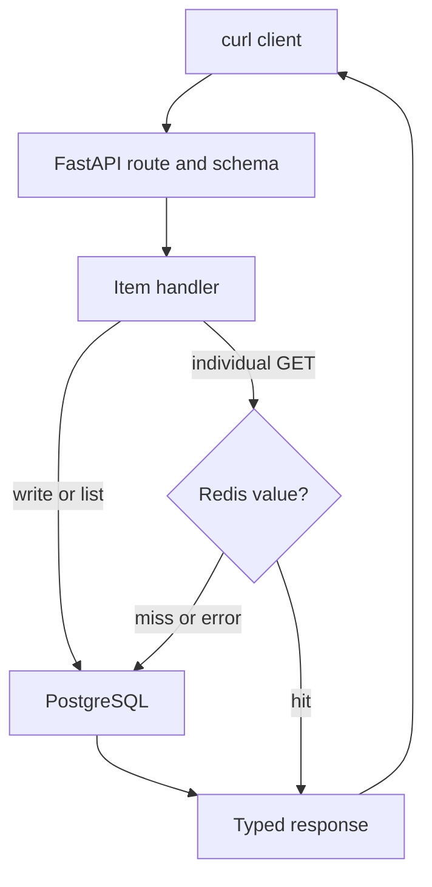

# Lab 01: Follow One FastAPI Request End-to-End

## 1. Purpose and Learning Outcomes

**In Plain Language:** You will send requests to an Items API and follow the work behind each response. Start with the application and its two data services, then compare what the client receives with what PostgreSQL stores and Redis caches. This gives you a concrete request path to recognize when later labs add metrics, logs, traces, and profiles.

> **Primary Objective:** Follow a real item request from the client through FastAPI routing, validation, dependency injection, application logic, PostgreSQL or Redis, response serialization, and back to the client—before introducing observability backends.

The first diagnostic skill is knowing which work a request actually needs. A successful response, a database row, and a cache entry prove different things. In this lab, you will connect those observations to the code that produced them.

This guide follows Lab 1 of the [50-lab roadmap](../docs/50-lab-roadmap.md). The running domain is an Items API with UUID identifiers, a PostgreSQL service named `postgres`, and an optional Redis cache.

Here the domain is **items**, IDs are UUIDs, the database service is **postgres**, and Redis failure permits degraded readiness. Use the commands in this guide as written for this repository.

## 2. Starting Point and Lab Map

Use this guide inside the complete application repository. Run commands from the repository root in Bash unless a step says otherwise. Work through the starting checks in order; they load the helpers and state this lab needs.

Read the explanation before each step, run one complete code block at a time, and compare the actual result with the stated expectation. Save commands, observations, explanations, and unexpected results in your notebook.

### Key Terms

| **Term**        | **Plain-Language Meaning**                                               |
| --------------- | ------------------------------------------------------------------------ |
| Request path    | The sequence of components and decisions used to produce one response.   |
| Source of truth | PostgreSQL holds the authoritative item; Redis holds a replaceable copy. |
| Contract        | The agreed inputs, outputs, and behavior of an endpoint or component.    |

### Lab Map

The arrows show the flow or dependency being studied. Branches identify paths to compare; this is a conceptual map, not a captured runtime trace.


```mermaid
flowchart TD
    Client["curl client"] --> Route["FastAPI route and schema"]
    Route --> Handler["Item handler"]
    Handler -->|"write or list"| DB["PostgreSQL"]
    Handler -->|"individual GET"| Cache{"Redis value?"}
    Cache -->|"miss or error"| DB
    Cache -->|"hit"| Response["Typed response"]
    DB --> Response
    Response --> Client
```

## 3. Guided Walkthrough

### Step 01. Lab Context and Explicit Exclusions

**What You Are Doing:** First limit the system to the components needed for an item request. This keeps a problem in an observability service from being confused with a problem in the application itself.

**Practical Walkthrough:** Think of the baseline as the smallest working version of the project: the API receives requests, PostgreSQL keeps the items, and Redis can supply cached copies. Read the service list before starting containers. The initialization jobs are different from these services: they complete a preparation task and then stop.

Treat this service list as the boundary for every observation in this lab. An HTTP request is handled by `app`; a stored row belongs to PostgreSQL; a Redis entry is a disposable copy. Before troubleshooting an exited container, identify whether it is a one-time job or a service expected to remain running, then inspect its exit status against that role.

Only three long-running services belong in the baseline:

- `app`: the FastAPI Items API;
- `postgres`: authoritative item storage;
- `redis`: optional cached item reads.

Two supporting jobs run and exit: `init-volumes` prepares volume ownership and `migrate` applies Alembic migrations. An exited job with code 0 is successful, not a failed service.

Keep Prometheus, Grafana, Alertmanager, Collector, Loki, Tempo and Pyroscope stopped. Do not add Node Exporter or dependency exporters yet. Those extensions belong to Labs 14–15.

This lab does not teach transaction isolation, TTL/staleness experiments, health failure matrices, Docker lifecycle internals, structured-log instrumentation, PromQL or tracing. Those are separate steps in the updated sequence. You will use a health endpoint as a starting check and inspect a little cache state only to explain the request path.

**Understanding the Result:** A successful stopped initialization job is expected. Your starting inventory should distinguish completed preparation from a long-running service that unexpectedly exited.

### Step 02. Prerequisites and Inherited State

**What You Are Doing:** Confirm that you are inside the complete application repository. This ZIP supplies instructions; the application files, Compose configuration, and environment file must come from the repository setup referenced below.

**Practical Walkthrough:** Open a Bash terminal at the folder containing `docker-compose.yml`, rather than inside the `labs` folder. The file checks establish that the required repository files are available before you run later commands. Compose reads `.env` itself; loading it as a Bash script would interpret its contents under different rules.

Read `pwd` first and compare it with the repository you intended to use. Each `test -f` checks one required file without opening or changing it; a failed check means the remaining commands may target the wrong directory. Keep this terminal at the repository root so relative paths such as `app/app/api.py` and `lab-notes/` resolve consistently throughout the exercise.

Complete **Setup Required Before Starting the Lab** in [README](../README.md).

Use Bash on your Linux Docker host. You need Docker Engine, Compose **2.24.4 or newer**, curl, jq, Python 3, Make and ripgrep (`rg`). Git is recommended for reviewed checkpoints.

Run every command from the repository root unless a step explicitly says otherwise:

```bash
pwd
test -f docker-compose.yml
test -f app/app/api.py
test -f app/app/database.py
test -f .env
test -f labs/Lab-01.md
docker compose version
```

**Expected Result:** all `test` commands succeed without output. Existing synthetic items may remain; no volume reset is needed.

Do **not** `source .env`. It is a Compose dotenv file, contains secrets, and includes values such as an application name with spaces. Compose will load it itself.

**Understanding the Result:** The `test` checks normally print nothing on success. A missing file means the setup or working directory needs attention before you continue to commands that depend on it.

### Step 03. Measurable Learning Objectives

**What You Are Doing:** Use these outcomes as practical questions to answer with your own evidence. You should be able to explain the path as well as repeat the commands.

**Practical Walkthrough:** Read the objectives as the questions this lab will help you answer. For example, 'prove the record exists' means more than receiving HTTP 201: you will later look for the same UUID through a separate SQL connection. Keep unfamiliar terms in your notebook and revisit them when their experiment appears.

For each outcome, decide what evidence would answer it: a source location, an HTTP response, a SQL result, or a Redis observation. As you work, connect those evidence types to the same item ID. At the end, explain the request path aloud using your saved results, including one limitation of each observation, rather than only marking the commands as completed.

By the end, you must be able to:

- find the application factory, router, request schema, model, database dependency and cache class;
- distinguish route matching from request validation and application execution;
- create, list, retrieve, replace and delete one item using the actual contract;
- prove the created record exists in PostgreSQL independently of the HTTP response;
- show that POST invalidates the item cache and a later individual GET populates it;
- explain why list and individual GET routes follow different paths;
- distinguish malformed input from a valid ID whose item is absent;
- explain why a session object does not necessarily imply a database query;
- describe the boundary between source-code evidence and measured runtime evidence;
- start exactly the baseline services without a telemetry backend; and
- leave a known, recoverable starting state for Lab 2.

**Understanding the Result:** You are ready to finish when you can explain the evidence behind each objective. Memorizing the command sequence alone will not help diagnose a different result on another run.

### Step 04. Current Architecture

**What You Are Doing:** Read the lab map from the client to the response, paying attention to the cache decision. The table below tells you which observation can confirm each part of that path.

**Practical Walkthrough:** Start at the client in the diagram and follow a write request toward PostgreSQL. Then follow an individual read and notice the extra cache decision. Match each box to the table's evidence source; this tells you where to look when the client response, stored row, and cached document disagree.

Follow the arrows in their stated direction and identify where execution can branch. A write reaches the database transaction before cache invalidation, whereas an individual read can return a valid cached representation. Use the table to choose an independent check for each layer; a client-visible JSON document alone cannot tell you everything about the SQL or Redis work behind it.

The lab map in Section 2 shows this relationship.

This is a request-flow model, not an OpenTelemetry trace. No Tempo trace is needed to learn it.

| **Layer**   | **Question**                          | **Evidence in This Lab**               |
| ----------- | ------------------------------------- | -------------------------------------- |
| Client      | What did the caller send and receive? | Saved HTTP headers, status and JSON    |
| FastAPI     | Which handler and schema apply?       | OpenAPI and `api.py` / `schemas.py`    |
| Application | Which dependency is used?             | Handler branches and dependency wiring |
| PostgreSQL  | Does the authoritative record exist?  | A direct SQL query                     |
| Redis       | Is a derived representation present?  | Exact-key EXISTS/GET                   |

**Understanding the Result:** The map explains possible paths. It does not establish which branch a particular live request took; the following controlled checks supply that evidence.

### Step 05. Establish a Clean Starting State

**What You Are Doing:** Inspect what is already running before starting anything. You need a known three-service baseline so later changes can be attributed to your experiment.

**Practical Walkthrough:** List the configured services and current containers before stopping anything. The configured list describes what Compose could run, while the status list describes what exists now. If the full learning stack is active, the scoped shutdown removes its running containers so you can rebuild the intended baseline with the same retained data.

Compare the two inventories before taking the optional shutdown action. `config --services` describes the effective configuration; `ps -a` includes stopped containers as well as running ones. If shutdown is needed, use the command exactly as shown without adding volume-removal options. Afterward, expect the next startup to reuse retained volumes rather than creating an empty database for the exercise.

Inspect the project before changing it:

```bash
docker compose config --services
docker compose ps -a
```

The full model contains ten long-running services plus the two initialization jobs. The course starts fewer services than the model defines.

If this learning project is already running the full stack, stop its containers while retaining its named volumes:

```bash
docker compose down
```

Run this only in your learning repository. It interrupts that Compose project. It does not delete named-volume data because no volume-removal option is used.

Do not run a global prune or reset. A clean starting state means understood state, not deleted evidence.

**Understanding the Result:** A clean baseline means you understand the remaining state. Existing named volumes and old synthetic rows can be legitimate; deleting them would remove useful persistence evidence.

### Step 06. Create a Reversible Baseline Override

**What You Are Doing:** The override is a small local configuration layer placed over the full Compose file. It lets you start the early-lab system without editing the repository's full observability configuration.

**Practical Walkthrough:** An override is an additional YAML file that changes selected parts of the base configuration. Here it disconnects the app from the tracing/logging infrastructure needed only in later labs. Read the environment, dependency, and logging sections as three separate changes; disabling one feature flag would not automatically remove the other connections.

Create the directory before writing the YAML file, then copy the complete heredoc through its closing `YAML` marker. The quoted marker keeps shell expansion out of the configuration text. Check indentation and the resulting filename before continuing: the session helper will explicitly merge this override with the base file, and a file that exists at another path will not supply these settings.

The delivered full-stack app depends on Collector and uses Docker's Fluent Forward logging driver. Merely setting `OTEL_ENABLED=false` would not remove that dependency or log transport.

Create a local override that changes only the early-lab app settings:

```bash
mkdir -p lab-notes
chmod 700 lab-notes
cat > lab-notes/compose.baseline.yaml <<'YAML'
services:
  app:
    environment:
      OTEL_ENABLED: "false"
      PYROSCOPE_ENABLED: "false"
    depends_on: !override
      migrate:
        condition: service_completed_successfully
      redis:
        condition: service_started
    logging: !override
      driver: json-file
      options:
        max-size: "10m"
        max-file: "3"
YAML
```

**Command Note:** `<<'YAML'` writes the following block literally until `YAML`. Quoting the delimiter prevents Bash from expanding `$variables` inside the generated file; creation and execution are separate steps.

The `!override` tag replaces the entire dependency/logging mapping. An ordinary mapping merge could leave Collector or Fluent Forward options behind. This requires Compose 2.24.4 or newer. [Docker documents the replacement behavior](https://docs.docker.com/reference/compose-file/merge/#replace-value).

The full-stack file is untouched. During early labs, app JSON goes to Docker's local rotating `json-file` driver. Profiling and OTel tracing are disabled. Existing native application metrics remain available but are studied starting in Lab 7.

Keep this local learning override in the ignored `lab-notes/` directory. It is not a production deployment configuration.

**Understanding the Result:** The merged app should use local JSON-file logging and depend only on the early-lab startup path. The original full-stack file remains available for later stages.

### Step 07. Create the Shared Lab Session Helper

**What You Are Doing:** Create a shared set of shell functions so later commands use the same project, configuration, and connection settings. Sourcing the file loads those functions into your current Bash terminal; a new terminal must source it again.

**Practical Walkthrough:** The large block creates a helper file rather than performing every future experiment immediately. Each function groups a repeated task, such as querying PostgreSQL or constructing the correct Redis key. `source` then loads those definitions into this terminal, so names such as `dc`, `dbsql`, and `rcli` become usable commands here.

Copy the complete helper definition before running `source`; an incomplete heredoc leaves the file unfinished. Read the functions as shortcuts with specific scopes: `dc` selects the baseline Compose model, `api` adds request time limits, and the database/cache helpers address the running services. Sourcing affects the current shell, so repeat that loading step whenever you open another terminal for these labs.

The next block defines explicit shortcuts used by all five labs. Read it before sourcing it. It enables Bash `pipefail` so a failed request or assertion is not hidden by a successful final pipeline command. It does not load passwords into your host shell or print connection strings.

```bash
cat > lab-notes/session.sh <<'BASH'
# Source from Bash; this is a local lab helper, not the application's environment file.
set -o pipefail
LAB_ROOT="$(cd -- "$(dirname -- "${BASH_SOURCE[0]}")/.." && pwd)"
export APP_URL="${APP_URL:-http://127.0.0.1:8000}"

dc() {
  docker compose --project-directory "$LAB_ROOT" --env-file "$LAB_ROOT/.env" \
    -f "$LAB_ROOT/docker-compose.yml" \
    -f "$LAB_ROOT/lab-notes/compose.baseline.yaml" "$@"
}

api() {
  curl --connect-timeout 2 --max-time 15 "$@"
}

wait_ready() {
  local attempt
  for attempt in {1..45}; do
    if curl --connect-timeout 1 --max-time 5 -fsS "$APP_URL/health/ready" 2>/dev/null \
      | jq -e '.status == "ready"' >/dev/null 2>&1; then
      echo "Application and both dependencies are ready"
      return 0
    fi
    sleep 1
  done
  echo "Readiness deadline exceeded; inspect dc ps -a and dependency logs" >&2
  return 1
}

wait_live() {
  local attempt
  for attempt in {1..45}; do
    if curl --connect-timeout 1 --max-time 3 -fsS "$APP_URL/health/live" \
      >/dev/null 2>&1; then
      return 0
    fi
    sleep 1
  done
  echo "Liveness deadline exceeded" >&2
  return 1
}

load_app_settings() {
  local settings
  settings="$(dc exec -T app python -c \
    'from app.config import Settings; s=Settings(); print(s.service_name, s.environment, s.redis_db, s.cache_ttl_seconds)')" || return 1
  read -r LAB_SERVICE LAB_ENVIRONMENT LAB_REDIS_DB LAB_CACHE_TTL <<<"$settings"
  export LAB_SERVICE LAB_ENVIRONMENT LAB_REDIS_DB LAB_CACHE_TTL
}

assert_baseline() {
  local actual
  actual="$(dc ps --services --status running | sort)" || return 1
  if [[ "$actual" != $'app\npostgres\nredis' ]]; then
    printf 'Unexpected running services:\n%s\n' "$actual" >&2
    return 1
  fi
}

baseline_check() {
  wait_ready && load_app_settings && assert_baseline
}

dbsql() {
  dc exec -T postgres sh -c \
    'exec psql -X -v ON_ERROR_STOP=1 -U postgres -d "$APP_DB_NAME" "$@"' sh "$@"
}

rcli() {
  : "${LAB_REDIS_DB:?Run load_app_settings first}"
  dc exec -T redis sh -c \
    'export REDISCLI_AUTH="$REDIS_PASSWORD"; selected_db="$1"; shift; exec redis-cli -n "$selected_db" --raw "$@"' \
    sh "$LAB_REDIS_DB" "$@"
}

cache_key() {
  : "${LAB_SERVICE:?Run load_app_settings first}"
  : "${LAB_ENVIRONMENT:?Run load_app_settings first}"
  printf '%s:%s:items:v1:%s' "$LAB_SERVICE" "$LAB_ENVIRONMENT" "$1"
}

new_uuid() {
  python3 -c 'from uuid import uuid4; print(uuid4())'
}
BASH
source lab-notes/session.sh
```

| **Helper**       | **Purpose**                                                                                  |
| ---------------- | -------------------------------------------------------------------------------------------- |
| `dc`             | Run Compose with the full model plus the local baseline override                             |
| `api`            | curl with bounded connect/request timeouts                                                   |
| `wait_ready`     | Wait for fully ready state, with a finite deadline                                           |
| `baseline_check` | Verify readiness, load only non-secret namespace settings and require three running services |
| `dbsql`          | Execute SQL through the PostgreSQL container's local administrator socket                    |
| `rcli`           | Execute authenticated Redis commands without exposing its password on the host command line  |
| `cache_key`      | Construct the actual service/environment/item cache key                                      |
| `new_uuid`       | Generate a syntactically valid unique test identifier                                        |

`dbsql` is a diagnostic administrative connection. It does not prove the application's role/password/network connection works. Application requests supply that separate evidence.

When opening a new terminal in later labs, run:

```bash
source lab-notes/session.sh
baseline_check
```

The baseline must already be running before `baseline_check` can read settings from it. For startup, use the next section first.

**Understanding the Result:** If a later terminal says a helper is not found, first check whether you sourced this file there. The helper names are course-defined functions, not separately installed Linux programs.

### Step 08. Validate the Effective Model without Printing Secrets

**What You Are Doing:** Check the configuration Docker will actually use after merging the files. Reading only the original YAML would miss the effects of the override.

**Practical Walkthrough:** Compose combines the base and override files before starting containers. The first check validates that combination; the JSON query then selects a few safe fields from the resolved result. Compare those fields with the intended early-lab settings rather than assuming that writing an override guaranteed its application.

Run the quiet validation first and stop if it reports a YAML or merge error. In the second command, the pipe passes resolved JSON into `jq`, which prints only the selected fields. Check each returned value against the override you just wrote. This is a configuration check before deployment; the next step will verify which services actually started with that configuration.

```bash
dc config --quiet
dc config --format json | jq '{
  app_dependencies: .services.app.depends_on,
  app_logging: .services.app.logging,
  tracing: .services.app.environment.OTEL_ENABLED,
  profiling: .services.app.environment.PYROSCOPE_ENABLED
}'
```

**Expected Result:**

- app dependencies contain `migrate` and `redis`, not `otel-collector`;
- logging driver is `json-file` with only local rotation options;
- tracing and profiling are `false`.

Compose's complete resolved model contains passwords. Select safe fields as above; do not save or publish its full output.

**Understanding the Result:** Seeing the expected dependencies, driver, and disabled features proves the effective model contains your changes. It does not yet prove a running container has adopted that model.

### Step 09. Start the Baseline and Prove Its Boundaries

**What You Are Doing:** Build and start the app together with its required startup jobs and data services. Then check the running-service list so you know the baseline really matches the intended scope.

**Practical Walkthrough:** Starting the app also starts the services and jobs it requires under this model. The readiness helper waits for a known usable state, and the final service list checks the actual runtime boundary. If startup stops at a migration or ownership job, inspect that job's logs before trying more API requests.

Allow the build and dependency startup to finish before reading the final service list. `-d` starts containers in the background, while `--build` prepares the application image from the repository. Compare the sorted running names with the three-line example. Use the bounded log command for a failed prerequisite, and rerun the starting check only after the reported startup problem has been resolved.

```bash
dc up -d --build app
baseline_check
dc ps -a
dc ps --services --status running | sort
```

Expected running services:

```text
app
postgres
redis
```

`init-volumes` and `migrate` should have exited successfully. The ownership job may create empty telemetry volumes because it prepares the full repository's storage layout. Empty volumes are not running observability services.

If `baseline_check` fails, inspect the reported layer before generating requests:

```bash
dc logs --tail=80 init-volumes migrate postgres redis app
```

Do not substitute `make up`: that intentionally starts the full platform.

**Understanding the Result:** Three running services plus successfully completed jobs is the intended result. An additional telemetry container means the selected Compose command or configuration needs review.

### Step 10. Record a Small Starting Checkpoint

**What You Are Doing:** Save the starting state before creating test data. These files give you a reference when you later ask whether a failure was already present or appeared during the experiment.

**Practical Walkthrough:** Create a small record of the starting time, source revision if available, and current service state. Save the readiness response as a file while also displaying it. These observations let you later compare 'before' and 'after' without relying on memory or a terminal window that has already scrolled away.

The braces group several observations into one file, and `>` creates or replaces that file. The readiness pipeline uses `tee` to retain the response while `jq` makes it readable. Check the saved timestamp and response together so later comparisons refer to this run. If Git information is unavailable, the command still records the time and container state rather than abandoning the checkpoint.

Formal logging/request-ID instrumentation and the standard evidence workflow belong to Lab 6. For now, save only the basic facts needed to compare experiments:

```bash
mkdir -p lab-notes/lab-01
{
  date -u +'%Y-%m-%dT%H:%M:%SZ'
  git rev-parse --short HEAD 2>/dev/null || true
  dc ps -a
} > lab-notes/lab-01/start.txt
api -fsS "$APP_URL/health/ready" | tee lab-notes/lab-01/ready.json | jq .
```

Expected readiness body:

```json
{"status":"ready","dependencies":{"postgres":"up","redis":"up"}}
```

The body describes a current probe result. The rest of this lab tests actual item behavior rather than treating readiness as proof of CRUD.

**Understanding the Result:** Readiness describes the probe at that moment. It is your starting checkpoint, while the upcoming create/read/update/delete requests test the business behavior directly.

### Step 11. Find the Actual HTTP Contract

**What You Are Doing:** Read the API's own published schema before making requests. It tells you the valid routes and fields for this repository, avoiding assumptions based on a different tutorial.

**Practical Walkthrough:** Download the API's OpenAPI document and inspect both its path list and input schema. A path tells you where a request goes; the schema tells you which fields and value shapes it accepts. Use this information to understand why the example body contains those particular field names and why other tutorial URLs may fail.

Inspect the actual saved document before constructing requests from memory. Match each operation to its HTTP method, then inspect required fields and their types under `ItemWrite`. Keep the schema's accepted representation distinct from the database's storage type. When a later request is rejected, compare its body with this contract before investigating persistence or cache behavior.

```bash
api -fsS "$APP_URL/openapi.json" -o lab-notes/lab-01/openapi.json
jq '.info, (.paths | keys)' lab-notes/lab-01/openapi.json
jq '.components.schemas.ItemWrite' lab-notes/lab-01/openapi.json
```

Find these routes:

| **Method** | **Path**                  | **Result**                                                     |
| ---------- | ------------------------- | -------------------------------------------------------------- |
| POST       | `/api/v1/items`           | 201, created item and Location header                          |
| GET        | `/api/v1/items`           | 200, paginated object with `items`, `total`, `limit`, `offset` |
| GET        | `/api/v1/items/{item_id}` | 200 or 404                                                     |
| PUT        | `/api/v1/items/{item_id}` | 200; replacement of writable fields                            |
| DELETE     | `/api/v1/items/{item_id}` | 204 with no response body, or 404                              |

`/` is not a metadata route in this repository. `/health` and `/ready` aliases from the samples do not exist. The documented paths are `/health/live` and `/health/ready`.

**Understanding the Result:** Record the expected method, path, and response status for each operation. A route not listed here should not be assumed to exist merely because its name seems reasonable.

### Step 12. Map Files to Responsibilities

**What You Are Doing:** Locate the code responsible for each part of the request. You are building a navigation map: where to look when validation, persistence, caching, or response handling behaves unexpectedly.

**Practical Walkthrough:** The searches locate relevant definitions and show their line numbers; they do not change the source files. Open the surrounding code so you see how the pieces connect. In particular, separate the HTTP schema used to validate a request from the database model used to store the item.

Use the line numbers from `rg -n` to navigate into each file and read the complete function or class. Trace one field from its request schema into the handler and model, then trace the returned representation back to the response schema. This turns the search results into a usable map and prevents similarly named functions in different layers from being treated as interchangeable.

```bash
rg -n 'def create_app|include_router|lifespan' app/app/main.py
rg -n 'APIRouter|@router|async def' app/app/api.py
rg -n 'class Item|Field|model_config' app/app/schemas.py app/app/models.py
rg -n 'get_session|async_sessionmaker|create_async_engine' app/app/database.py
rg -n 'def get_item|def set_item|def invalidate|def key' app/app/cache.py
```

Read the relevant files in your editor. Build this map in your own words:

| **File**        | **Responsibility**                                                       |
| --------------- | ------------------------------------------------------------------------ |
| `main.py`       | Application factory, lifespan, health, central error responses           |
| `api.py`        | Item routes and application-level transaction/cache ordering             |
| `schemas.py`    | Input/output validation and serialization contracts                      |
| `models.py`     | SQLAlchemy item mapping                                                  |
| `database.py`   | Shared engine/pool, session lifecycle and database checks                |
| `cache.py`      | Pooled Redis access, key format, serialization and fallback              |
| `middleware.py` | Request context, bounded request measurements and safe unexpected errors |

Schemas are not database tables. Models are not HTTP contracts. Both describe an item but enforce different boundaries.

**Understanding the Result:** Your file map should tell you where to investigate a rejected field, a database problem, or stale cached data. Different symptoms lead to different files.

### Step 13. Predict the Create Path

**What You Are Doing:** Predict the write order before observing it. In particular, decide when the row becomes committed and whether the new item is immediately placed in Redis.

**Practical Walkthrough:** Before creating data, trace the handler's order on paper: validate input, enter a transaction, perform database work, exit successfully, and attempt cache invalidation. Pay attention to the difference between making a pending change available inside a transaction and committing it for other connections to observe.

Answer the five questions in writing before sending the POST. Identify the end of the transaction context in the source and place cache invalidation after that point in your prediction. Keep the predicted response, committed row, and cache state as three separate claims. You will test them separately in the following steps, so one successful observation should not silently substitute for the others.

Before sending a POST, answer:

1. Which schema will reject a negative price?
2. Does creating an item require Redis to commit successfully?
3. At what point is the database transaction committed?
4. Does POST populate Redis or invalidate the item's key?
5. Which field contains the new identifier?

Read `create_item` in `api.py` to check your prediction. The code flushes and refreshes inside `session.begin()`, exits the transaction, then invalidates Redis. A flush is not a commit; Lab 2 will prove that difference experimentally.

**Understanding the Result:** The prediction prepares you to interpret the later SQL and Redis checks. If the source contradicts your assumption, update the prediction before sending the request.

### Step 14. Create One Item and Capture the Complete HTTP Result

**What You Are Doing:** Create one identifiable test item and save the status, headers, and body separately. Keeping all three lets you check both the returned data and the HTTP contract, including the Location header.

**Practical Walkthrough:** The request body describes one synthetic item. The command stores the response body and headers in separate files and captures the status so it can be checked explicitly. The returned UUID is then extracted into `ITEM_ID`, which subsequent commands use to refer to this exact row instead of an arbitrary existing item.

Run the capture block before examining the files it creates. `status` receives the HTTP code because the response body is redirected to `create.json`; it does not hold the item itself. Confirm the status check passes, then let `jq -er` extract the returned ID. If the request failed or the ID is absent, inspect the saved response instead of continuing with an empty identifier.

```bash
status=$(api -sS -D lab-notes/lab-01/create.headers \
  -o lab-notes/lab-01/create.json -w '%{http_code}' \
  -H 'Content-Type: application/json' \
  -d '{"name":"Lab 01 workbook","description":"Synthetic request-flow exercise","price":"12.50","is_active":true}' \
  "$APP_URL/api/v1/items")
printf 'HTTP %s\n' "$status"
test "$status" = 201
jq . lab-notes/lab-01/create.json
ITEM_ID=$(jq -er '.id' lab-notes/lab-01/create.json)
printf '%s\n' "$ITEM_ID" > lab-notes/lab-01/item-id.txt
```

**Command Note:** `-D` saves response headers, `-o` saves the body, and `-w` prints the HTTP status for the shell to check. This keeps transport, status, and response-content evidence separate.

Expected fields: UUID `id`, submitted fields, `created_at` and `updated_at`. `price` is a decimal string, such as `"12.50"`, preserving decimal precision.

Inspect the response metadata:

```bash
rg -i '^(HTTP/|content-type:|location:|x-request-id:)' lab-notes/lab-01/create.headers
```

The Location header should point to `/api/v1/items/` followed by your UUID. The request-ID header already exists; its validation and propagation are Lab 6 topics.

**Understanding the Result:** Confirm both the expected creation status and a usable ID. Keep the ID file: it connects later HTTP, SQL, and cache observations to the same object.

### Step 15. Prove Persistence Independently

**What You Are Doing:** Ask PostgreSQL directly whether the item exists. This second observation checks that the successful HTTP response corresponds to a committed row visible outside the request's own database session.

**Practical Walkthrough:** Pass the saved UUID to `psql` and query only that row. This SQL runs through a separate connection from the one that handled the POST, so it tests external visibility after the request completed. The quoted variable syntax treats the UUID as a value instead of splicing uncontrolled text into SQL.

Read the SQL from top to bottom: select the fields, choose `items`, then restrict the result to your saved UUID. The value passed by `-v` is consumed by `psql` inside the quoted heredoc. Compare both the ID and business fields with `create.json`; matching a familiar name alone is insufficient when repeated lab runs may have created similar rows.

```bash
dbsql -v item_id="$ITEM_ID" <<'SQL'
SELECT id, name, price, is_active, created_at, updated_at
FROM items
WHERE id = :'item_id'::uuid;
SQL
```

**Expected Result:** exactly one row matching the API response.

The quoted heredoc prevents your shell from expanding SQL contents. `psql`'s `:'item_id'` syntax safely quotes the variable as a string before PostgreSQL casts it to UUID. Do not concatenate unrestricted input directly into SQL.

This proves the row is visible to a separate database connection after the API returned. It does not yet prove host-loss durability, backup coverage or every transaction failure case.

**Understanding the Result:** The returned row should agree with the HTTP document. Agreement supports successful persistence; a difference requires checking the exact ID and request outcome before blaming the cache.

### Step 16. Inspect the Cache Before the First Individual GET

**What You Are Doing:** Check the exact cache key before any individual read can fill it. This isolates what POST did to Redis from what a later GET will do.

**Practical Walkthrough:** Build the key using the application's actual service and environment settings plus the item UUID. Inspect existence before sending an individual GET, because that GET can change the very state you are checking. This separates the cache effect of creation from the cache effect of reading.

Use the exact `KEY` printed by the helper for every cache check that follows. `EXISTS` reports presence and does not fetch the item through the API, so this check does not trigger the application's cache-fill path. If it returns `1`, check for another reader or a repeated exercise before assuming creation itself populated Redis. Preserve the database result as a separate observation.

```bash
KEY=$(cache_key "$ITEM_ID")
printf '%s\n' "$KEY"
rcli EXISTS "$KEY"
```

**Expected Result:** `0`, provided no other client has fetched this item individually. POST invalidates; it does not prewarm the cache in this implementation.

The default key resembles `items-info:local:items:v1:` followed by the UUID. The helper uses the running application's service/environment settings, so it also works when those names differ from defaults.

**Understanding the Result:** A zero means this derived cache entry is absent. It does not mean the item is missing from PostgreSQL, which you just checked independently.

### Step 17. Follow the First GET

**What You Are Doing:** Read the new item while its cache key is absent. Follow how the application obtains the row from PostgreSQL and creates the cached representation for later reads.

**Practical Walkthrough:** Send the first individual GET after confirming the key is absent. The app cannot use a cached document, so follow the source path that reads the row, constructs the response, and attempts to store a reusable copy. Inspect the returned item and then the newly created cache document using the same UUID.

Read the API response before interpreting the Redis checks: the client request must have succeeded for this to be a completed cold-read example. Then compare the cached ID, name, and price with that response. A missing or malformed cache value after a successful read is a cache-path discrepancy to investigate; it does not erase the separate evidence that the item was returned.

```bash
api -fsS "$APP_URL/api/v1/items/$ITEM_ID" \
  -o lab-notes/lab-01/first-get.json
jq . lab-notes/lab-01/first-get.json
rcli EXISTS "$KEY"
rcli GET "$KEY" | jq '{id,name,price}'
```

**Expected Result:** HTTP 200, then key existence `1` and matching cached JSON.

Explain each branch in `get_item`:

1. FastAPI validates the path as UUID and resolves dependencies.
2. `Cache.get_item` looks up and validates a cached document.
3. With no value, `session.get(Item, item_id)` reads PostgreSQL.
4. `ItemRead.model_validate` creates the response representation.
5. `Cache.set_item` serializes it and sets a TTL.
6. FastAPI serializes the response.

A missing Redis key is normal. It is not an application error.

**Understanding the Result:** A successful response and matching cached document show the cold-read sequence worked. The cache entry is a representation of the row, not a second authoritative item.

### Step 18. Follow a Warm GET without Overclaiming

**What You Are Doing:** Repeat the same read while the key is present and compare the returned documents. Use the code to understand the possible shortcut, while keeping the limits of this runtime evidence clear.

**Practical Walkthrough:** Repeat the read while the entry remains valid. Sort JSON keys before comparing files so a harmless difference in key ordering does not look like a data change. Then connect the matching documents to the source's early-return cache branch without assuming that equal content alone proves which runtime branch executed.

Keep the requests close enough together to make a still-valid cache entry plausible, and avoid changing the item between them. `jq -S` rewrites only the comparison files with sorted keys; `diff -u` then displays content differences if any exist. If a difference appears, examine the changed fields and concurrent writes before treating the result as a failure of JSON serialization or caching.

```bash
api -fsS "$APP_URL/api/v1/items/$ITEM_ID" \
  -o lab-notes/lab-01/second-get.json
jq -S . lab-notes/lab-01/first-get.json > lab-notes/lab-01/first.sorted.json
jq -S . lab-notes/lab-01/second-get.json > lab-notes/lab-01/second.sorted.json
diff -u lab-notes/lab-01/first.sorted.json lab-notes/lab-01/second.sorted.json
```

**Expected Result:** no diff if no writer changed the item.

The source shows the cache-hit branch returns before `session.get`. A dependency may have created a session object, but SQLAlchemy checks out a connection when database work needs one. A session object alone does not prove a query occurred.

Equal responses and a cache key do not by themselves prove the second request's exact runtime branch. Lab 3 will isolate hit/miss paths using controlled dependency behavior. Do not call a request a hit only because it was fast.

**Understanding the Result:** No diff means the documents match under this comparison. It does not prove a cache hit by itself; later labs add stronger controlled branch evidence.

### Step 19. Compare List and Individual Read Paths

**What You Are Doing:** Request a page of items to see a different read path. Pagination asks PostgreSQL for a collection; it does not reuse the individual item's cached document.

**Practical Walkthrough:** Request a bounded page and inspect both the overall `total` and the length of the returned `items` array. These answer different questions: how many rows match overall, and how many were included in this page. The list handler queries PostgreSQL rather than combining individual cached item documents.

Read `limit=5` as the requested maximum page size and `offset=0` as the start of the selected page. The `jq` expression prints useful metadata without dumping every row. Compare `item_count` with the limit and compare `total` with the overall matching population. These quantities can differ normally, especially when you are reusing a database containing earlier exercise data.

```bash
api -fsS "$APP_URL/api/v1/items?limit=5&offset=0" \
  -o lab-notes/lab-01/list.json
jq '{total,limit,offset,item_count:(.items|length)}' lab-notes/lab-01/list.json
```

The list route reads PostgreSQL and does not cache pages. Inspect its count query, ordered row selection and pagination bounds.

An individual cached GET and a list request therefore have different dependency requirements. Your created item may not appear on the first page if older data already exists; `.total` is the overall count, not the page length.

**Understanding the Result:** Your new item need not appear on the first page when earlier rows exist. Check pagination and ordering before interpreting that omission as lost data.

### Step 20. Replace the Writable Fields

**What You Are Doing:** Replace the item's writable fields through the API. Then inspect the key to see why a successful update must prevent a later read from returning the old cached version.

**Practical Walkthrough:** Send all writable fields because this PUT replaces their representation rather than applying a partial patch. After the database update succeeds, inspect the exact cache key before another reader can refill it. This ordering shows why invalidation belongs to a successful write's follow-up work.

Check that the URL contains your saved fixture ID and that the body contains the complete intended replacement. `-X PUT` selects the update method; the content-type header identifies the JSON body. Inspect the returned fields before looking at Redis. If the HTTP update fails, an unchanged key is not evidence that invalidation after a successful commit is broken.

Predict the response and cache state before running:

```bash
api -fsS -X PUT -H 'Content-Type: application/json' \
  -d '{"name":"Lab 01 revised workbook","description":"Replaced through PUT","price":"13.75","is_active":false}' \
  "$APP_URL/api/v1/items/$ITEM_ID" \
  -o lab-notes/lab-01/update.json
jq . lab-notes/lab-01/update.json
rcli EXISTS "$KEY"
```

**Expected Result:** updated representation and key existence `0` when no concurrent reader has refilled it. The transaction commits before invalidation.

PUT is not a partial PATCH. `name` and `price` are required; omitted optional fields take their schema defaults. Send all writable fields when your intent is a full, explicit replacement.

**Understanding the Result:** The returned fields should reflect the replacement. An absent cache key immediately afterward is expected and allows the next read to rebuild the new representation.

### Step 21. Verify the Change at Two Layers

**What You Are Doing:** Compare the revised item through SQL and HTTP. Agreement checks the stored value and the public response together; a mismatch points you toward the layer that needs investigation.

**Practical Walkthrough:** Use SQL to read the authoritative revised row, then use the API to check what an ordinary caller receives. Compare the same fields and UUID at both layers. This is useful whenever a write appears successful but a user still sees an older value, because it narrows the discrepancy to storage or the response path.

Perform the SQL observation first so you know the current stored values independently of the public read path. Then compare the selected fields in the API response with that row. If SQL has the new values but HTTP does not, investigate the read and cache path; if SQL is still old, return to the update response and transaction evidence before changing Redis.

```bash
dbsql -v item_id="$ITEM_ID" <<'SQL'
SELECT name, price, is_active FROM items WHERE id = :'item_id'::uuid;
SQL
api -fsS "$APP_URL/api/v1/items/$ITEM_ID" | jq '{name,price,is_active}'
```

Both should describe the revised item. Record why SQL verifies the authoritative row while the HTTP call verifies the public application path.

Do not infer a distributed transaction between PostgreSQL and Redis. They are separate systems. The stale-data consequences are reserved for Lab 3.

**Understanding the Result:** Matching values establish agreement for this observation. They do not make PostgreSQL and Redis one atomic storage system or eliminate every future cache race.

### Step 22. Controlled Boundary Experiment: Reject Invalid Input

**What You Are Doing:** Send a deliberately invalid item and confirm that validation stops it before persistence. The expected error is part of the experiment, so keep its response body as evidence.

**Practical Walkthrough:** Send a body that violates the input contract and retain the error response. Then query for the deliberately invalid item name to check that no row was created. This experiment stops at validation, before valid business work reaches the transaction code, so it tests a different boundary from database rollback.

Notice that the request omits curl's fail-on-HTTP-error flag so the expected rejection can be inspected normally. The status assertion checks `422`, and the `jq` command reads the application's error envelope. The SQL count then checks the intended persistence consequence. If the count is nonzero, first establish whether a previous run or another writer created that name before attributing it to this request.

The blast radius is one rejected request. Predict the status and whether a row will be created:

```bash
status=$(api -sS -o lab-notes/lab-01/invalid.json -w '%{http_code}' \
  -H 'Content-Type: application/json' \
  -d '{"name":"Lab 01 invalid price","price":"-1.00"}' \
  "$APP_URL/api/v1/items")
printf 'HTTP %s\n' "$status"
test "$status" = 422
jq '.error | {code,message,details}' lab-notes/lab-01/invalid.json
dbsql -Atc "SELECT count(*) FROM items WHERE name = 'Lab 01 invalid price';"
```

Expected count: `0` on a baseline where this deliberately invalid name was not created by another route. The response must not contain the submitted request body, SQL or a traceback.

This proves input rejection at the API boundary. It does **not** prove rollback after a database write; no valid write reached the handler. Lab 2 deliberately tests that later boundary.

**Understanding the Result:** The expected rejection is a successful test outcome. Check the sanitized error shape and absent row instead of treating every non-2xx response as a broken lab.

### Step 23. Distinguish Invalid UUID from Missing Item

**What You Are Doing:** Compare a value that cannot be a UUID with a valid UUID that has no row. This separates rejection of the input format from a completed lookup that finds no item.

**Practical Walkthrough:** First send an identifier that cannot be parsed as a UUID; then generate a valid UUID that should not exist. The first request cannot satisfy the input schema, while the second can proceed to a lookup. Comparing their statuses teaches you to separate bad input from valid input whose requested object is absent.

Compare both the status and the reason for rejection. `not-a-uuid` cannot satisfy the path parameter's format, while `MISSING_ID` has the correct shape and tests object absence. Save the second response before trying other identifiers. If you receive a dependency error instead, restore the starting state; that response would be testing availability rather than the intended missing-item behavior.

```bash
status=$(api -sS -o lab-notes/lab-01/invalid-id.json -w '%{http_code}' \
  "$APP_URL/api/v1/items/not-a-uuid")
test "$status" = 422
MISSING_ID=$(new_uuid)
status=$(api -sS -o lab-notes/lab-01/missing.json -w '%{http_code}' \
  "$APP_URL/api/v1/items/$MISSING_ID")
test "$status" = 404
jq . lab-notes/lab-01/missing.json
```

A malformed UUID fails the input contract. A generated valid UUID normally passes validation, reaches the lookup and has no matching row. One is a validation failure; the other is a successful lookup operation whose domain result is absence.

If a generated ID somehow exists, generate a new one and verify the row absence directly. Avoid relying on a fixed “large ID”; this API uses UUIDs.

**Understanding the Result:** Use the response category and evidence together. A missing item is not the same diagnosis as an unreachable database, even though neither request returns an item.

### Step 24. Delete Only Your Exercise Item

**What You Are Doing:** Remove the item you created and verify its absence in the API, database, and cache. Checking all three prevents a successful delete response from hiding leftover derived state.

**Practical Walkthrough:** Delete only the UUID created for this exercise and check the empty response body, SQL count, and Redis key. Then request the same ID again to observe the already-absent state. This connects the public API result with both authoritative and derived storage cleanup.

Check the ID before the DELETE and keep the response body file even though it should be empty. `test ! -s` succeeds only when that file has no content. Compare the SQL count and key existence with the expected zeros, then issue the follow-up GET. This ordering establishes deletion first and observes subsequent absence second, which makes the different statuses understandable.

```bash
status=$(api -sS -X DELETE -o lab-notes/lab-01/delete.body \
  -w '%{http_code}' "$APP_URL/api/v1/items/$ITEM_ID")
test "$status" = 204
test ! -s lab-notes/lab-01/delete.body
rcli EXISTS "$KEY"
dbsql -v item_id="$ITEM_ID" <<'SQL'
SELECT count(*) FROM items WHERE id = :'item_id'::uuid;
SQL
```

**Expected Result:** empty HTTP body, Redis `0`, database count `0`.

Request the same ID again and save the 404:

```bash
status=$(api -sS -o lab-notes/lab-01/deleted-get.json -w '%{http_code}' \
  "$APP_URL/api/v1/items/$ITEM_ID")
test "$status" = 404
```

DELETE is idempotent in its resulting absence, but repeated calls need not return the same status. This API returns 404 after the item is already gone.

**Understanding the Result:** A later 404 is compatible with successful deletion. Repeating an operation can preserve the same final absence while returning a different status.

### Step 25. Prove Recovery from the Rejected Requests

**What You Are Doing:** Create a fresh checkpoint item after the rejected requests. This confirms normal work still succeeds and gives subsequent labs a known row to preserve.

**Practical Walkthrough:** Create a separate valid item after the rejected-request tests and save its ID in the shared checkpoint location. This confirms that ordinary work remains possible without restarting services. Later labs intentionally keep this row while replacing processes, interrupting dependencies, or changing telemetry.

Use the shared checkpoint filenames exactly as written because later labs load them. This POST creates a different item from the disposable one you deleted; do not overwrite its ID with the old fixture ID. Confirm the JSON contains a usable identifier before proceeding. The valid create proves business work after the rejected requests, while readiness separately checks the current dependency probe.

No service needs restarting after a 422 or 404. Prove that by creating a new valid checkpoint item:

```bash
api -fsS -H 'Content-Type: application/json' \
  -d '{"name":"Course checkpoint","description":"Keep through Labs 2 to 5","price":"20.00","is_active":true}' \
  "$APP_URL/api/v1/items" -o lab-notes/checkpoint-item.json
jq -er '.id' lab-notes/checkpoint-item.json > lab-notes/checkpoint-item-id.txt
api -fsS "$APP_URL/health/ready" | jq .
```

Keep this row for the next labs. Each later experiment creates its own temporary rows where needed; it should not modify unrelated data.

**Understanding the Result:** The checkpoint is durable reference data for the course. Distinguish it from the disposable fixture you deleted so later cleanup does not remove the wrong row.

### Step 26. Run the Existing Application Contract Tests

**What You Are Doing:** Run the repository's contract tests to complement your manual observations. Keep the test environment's scope separate from the live PostgreSQL and Docker behavior you just exercised.

**Practical Walkthrough:** Run the repository test target and read any failing assertion before proceeding. Its disposable environment checks specific API contracts without depending on your live Compose database. Compare that scope with the manual SQL, networking, and cache observations you collected, which exercise different parts of the deployed system.

Run `make test` from the repository root and wait for its final result. If it fails, read the first relevant failing assertion and distinguish an image-build problem from a test failure. Keep the passing or failing result alongside your manual observations. The test suite's isolated storage and fake Redis explain why a pass does not replace the live SQL and cache checks.

```bash
make test
```

The target builds a disposable test image. It applies the actual Alembic migration to isolated SQLite databases and uses a Redis fake; it does not require or change the running Compose database.

The baseline suite contains 28 test cases. Later lab changes may add cases. Passing tests prove the tested application contracts, not Docker networking, live PostgreSQL behavior or telemetry delivery.

**Understanding the Result:** A pass supports the tested contracts; your notebook should still retain the live evidence. Tests and runtime experiments complement each other rather than proving identical things.

## 4. Troubleshooting and Diagnosis

Start with the first unexpected result. Record the exact symptom, identify which component produced it, and use the checks below before repeating the experiment. After a fix, repeat the original check and confirm recovery.

### Troubleshooting Runbook

#### A. Collector Starts During the Baseline

```bash
type dc
dc config --format json | jq '.services.app.depends_on, .services.app.logging'
```

Use `dc`, not plain `docker compose up app`. Confirm the override was parsed by a supported Compose version. Stop an accidentally started Collector explicitly; do not delete volumes.

#### B. The Override Rejects `!override`

Check `docker compose version`. Upgrade the Compose plugin to 2.24.4 or newer. Do not remove the tag and assume mapping merge removes old dependencies/options.

#### C. The App Has Not Started

```bash
dc ps -a
dc logs --tail=100 init-volumes migrate postgres app
```

Work from the first failing job or service. A migration failure blocks app creation. `Exited (0)` for initialization jobs is normal.

#### D. POST/PUT Returns 422

```bash
jq . lab-notes/lab-01/invalid.json
sed -n '1,110p' app/app/schemas.py
```

Use `name` and `price`; the sample's customer/product/quantity fields are not supported. Extra fields are rejected. Check the actual response from your failed request, not only an earlier saved example.

#### E. Redis Says `NOAUTH`

Use `rcli`, which obtains the password inside the Redis container. A bare `redis-cli` is unauthenticated here. Do not paste credentials into your notebook.

#### F. The Cache Key Is Absent After GET

Check the key namespace, database number, dependency status and time elapsed. The default TTL is 30 seconds. An expired key is normal. Run `load_app_settings`, repeat the GET and inspect promptly. Deeper cache failure diagnosis belongs to Lab 3.

#### G. Direct SQL Works but the API Fails

`dbsql` uses the administrator Unix socket; the app uses its own role over Docker TCP. They are different paths. Check readiness, app logs and migrations. Do not conclude that one successful admin query proves application connectivity.

#### H. Curl Reports Connection Refused

```bash
dc ps app
dc port app 8000
api -v "$APP_URL/health/live"
```

The default host address is loopback port 8000. From another machine, use an SSH tunnel. The repository does not define the sample's `BIND_ADDRESS` or `APP_HOST_PORT` variables.

### Evidence-Based Diagnostic Sequence

For an unexpected result:

1. Save the method, path, UTC time, HTTP status and response body.
2. Verify which route/schema applies.
3. Establish whether the handler should need PostgreSQL, Redis or both.
4. Inspect the exact row/key relevant to your synthetic item.
5. Inspect only the relevant service's state and logs.
6. State what is observed versus inferred from code.
7. Repair the failing layer and repeat the original operation.

Do not begin with a stack-wide restart. It can remove process evidence without fixing a bad payload or wrong path.

## 5. Review and Practice

Answer the knowledge questions in your own words before reading the answer guide. For the scenario, name the evidence you would collect and the conclusion each observation would support.

### Knowledge Check

Answer before reading the key:

1. Which file adds the router to the application?
2. How is an ItemWrite schema different from the Item model?
3. Why is price returned as a string?
4. Does POST warm the item cache in this repository?
5. Which branch returns before the item database SELECT?
6. Does resolving a session dependency guarantee a SQL query?
7. Why is a list request different from an individual GET?
8. What distinguishes 422 from 404 in the UUID exercises?
9. What does direct SQL prove that an HTTP response alone cannot?
10. Why is `dbsql` not proof of application-role connectivity?
11. Why does the local baseline replace the logging mapping?
12. Why does an equal pair of GET bodies not prove a cache hit?

#### Answer Key

1. `main.py`, through the app factory's `include_router` call.
2. The schema validates/serializes HTTP data; the model maps persisted columns.
3. The API preserves decimal precision in its JSON representation.
4. No; it invalidates the new item's key after commit.
5. A valid cache-hit branch in `get_item`.
6. No; creating a session need not check out a connection or execute SQL.
7. Lists query PostgreSQL directly and return pagination metadata.
8. 422 means invalid input; 404 means a valid lookup found no item.
9. The committed row is visible through an independent database connection.
10. It uses a different identity and local socket path.
11. To remove Fluent Forward settings and permit a backend-free baseline.
12. Either dependency path can return the same representation.

### Professional Scenario Exercise

A teammate says:

> “The create request returned 201, so Redis must contain the new item and every future GET must use it.”

Write a response identifying:

- the actual POST ordering in this implementation;
- which facts the 201 supports;
- which Redis observation is still needed;
- which GET branch populates the cache; and
- why a later eviction would not mean the item was deleted from PostgreSQL.

Use evidence from your item, not a generic definition of caching.

## 6. Completion Checklist

Mark each item only after you can point to its result or evidence file. Complete any cleanup shown here before moving on.

### Completion Criteria

- [ ] Only app, postgres and redis are running; initialization jobs exited 0.
- [ ] The app uses local JSON-file logging with tracing/profiling disabled.
- [ ] Every route used exists in the actual OpenAPI contract.
- [ ] A create returned 201 with a UUID and Location header.
- [ ] An independent SQL query found the corresponding row.
- [ ] POST and individual GET cache behavior matched the implementation.
- [ ] You explained list versus individual GET dependency paths.
- [ ] PUT replaced fields and invalidated the key.
- [ ] DELETE removed both authoritative row and derived key.
- [ ] Invalid input and missing item produced distinct expected outcomes.
- [ ] A new valid request succeeded after those rejected requests.
- [ ] You retained the course checkpoint item and recorded its ID.
- [ ] Tests and the notebook are complete.

## 7. Production Context and Next Lab

### Production Implications

A public API contract, persistence contract and cache contract are related but distinct. Operators need to know which layer a test actually reaches. A live process, successful admin SQL session, successful cached GET and committed write provide different evidence.

The one-process, one-host baseline is deliberate. It does not provide user authentication, HA, replica failover or host-loss recovery. Keep synthetic data and loopback bindings. More monitoring cannot compensate for an incorrect mental model of these boundaries.

### End State and Transition to Lab 02

```bash
baseline_check
CHECKPOINT_ID=$(cat lab-notes/checkpoint-item-id.txt)
api -fsS "$APP_URL/api/v1/items/$CHECKPOINT_ID" | jq '{id,name,price}'
```

Leave the baseline running, or pause with `dc stop app postgres redis` and resume with `dc up -d app` followed by `baseline_check`. The service-qualified startup also works after container removal and avoids starting telemetry containers left from a previous full-stack session.

Next: [Lab 02 — PostgreSQL Persistence and Transaction Boundaries](Lab-02.md).

You know which handler performs a write. Lab 2 proves when that write becomes visible, what rollback removes, how sessions reuse connections and how the API behaves when persistence fails.