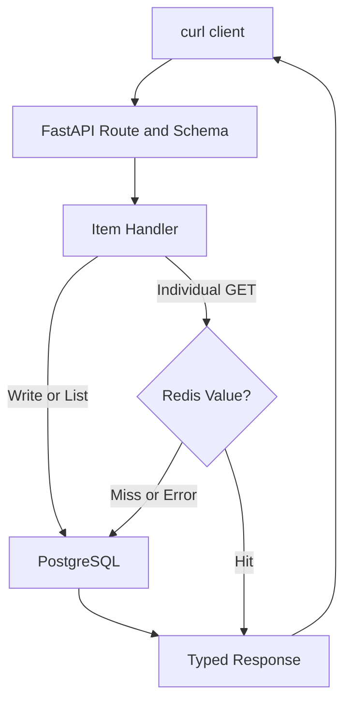

# Lab 01: Follow One FastAPI Request End-to-End

## 1. Purpose and Learning Outcomes

You will send requests to an Items API and follow what happens before a response comes back. FastAPI handles the request, PostgreSQL stores the item, and Redis may keep a temporary copy for faster reads. You will compare the API response, the database row, and the cached copy. This will help you understand what later metrics, logs, traces, and profiles are describing.

> **Primary Objective:** Follow one item request from the client and back again. See how FastAPI chooses a route, checks the input, provides the objects the handler needs, runs the application code, uses PostgreSQL or Redis, and converts the result into a response. You will do this before adding observability backends.

To investigate a problem, first understand what the request needs to do. An HTTP success response, a row in PostgreSQL, and a key in Redis each tell you something different. In this lab, you will check all three and find the code that explains each result.

This guide follows Lab 1 of the [50-lab roadmap](../docs/50-lab-roadmap.md). The example application manages items. Each item has a UUID, which is a unique identifier. PostgreSQL runs as the service named `postgres` and keeps the stored data. Redis is an optional cache that can hold temporary copies.

In this repository, the application manages **items**, their IDs are UUIDs, and the database service is **postgres**. If Redis fails, the app can still serve requests through PostgreSQL, but readiness reports a degraded state. Use the commands as written so they match this repository.

## 2. Starting Point and Lab Map

Open the complete application repository before using this guide. Unless a step says otherwise, run commands in Bash from the repository's top-level folder. Follow the starting checks in order because later commands depend on the helper functions and running services they prepare.

Read each explanation before running its commands. Run one complete code block, check the result, and then continue. In your notebook, save the commands, what happened, why you think it happened, and anything that differed from the expected result.

### Key Terms

| **Term**        | **Explanation**                                                                          |
| --------------- | ---------------------------------------------------------------------------------------- |
| Request path    | The steps a request passes through, from arrival to the returned response.               |
| Source of truth | PostgreSQL keeps the main stored item. Redis holds a temporary copy that can be rebuilt. |
| Contract        | The rules for accepted input, returned output, and expected behavior.                    |

### Lab Map

The arrows show how the parts connect and where a request can take different paths. Use this map to understand the design. It is not a recording of a request that actually ran.


```mermaid
flowchart TD
    Client["curl client"] --> Route["FastAPI Route and Schema"]
    Route --> Handler["Item Handler"]
    Handler -->|"Write or List"| DB["PostgreSQL"]
    Handler -->|"Individual GET"| Cache{"Redis Value?"}
    Cache -->|"Miss or Error"| DB
    Cache -->|"Hit"| Response["Typed Response"]
    DB --> Response
    Response --> Client
```

## 3. Guided Walkthrough

### Step 01. Lab Context and Explicit Exclusions

**What You Are Doing:** Start with only the services needed to handle item requests. This makes it easier to tell whether a problem comes from the application or from an observability service that is not needed yet.

**Practical Walkthrough:** The baseline is the smallest working setup for these labs. The API accepts requests, PostgreSQL stores items, and Redis can return cached copies. Read the service list before starting anything. Some containers run only a preparation job and then exit; they are not meant to stay running like the API or database.

Use this service list to decide where each result came from. `app` handles HTTP requests, PostgreSQL owns the stored row, and Redis holds a copy that can be removed and rebuilt. If a container has exited, first check its job. A completed setup job and an application that unexpectedly stopped need different explanations.

Only three long-running services belong in the baseline:

- `app`: the FastAPI Items API;
- `postgres`: the database that keeps the main stored items;
- `redis`: an optional cache for reading copies of items.

Two helper jobs run and then stop. `init-volumes` sets the file ownership needed for storage, and `migrate` applies database schema changes through Alembic. Exit code 0 means the job finished successfully. Such a stopped container does not mean a service has failed.

Keep Prometheus, Grafana, Alertmanager, Collector, Loki, Tempo and Pyroscope stopped. Do not add Node Exporter or dependency exporters yet. Those extensions belong to Labs 14–15.

Later labs cover transaction isolation, cache TTL and stale data, dependency failures, Docker lifecycle behavior, structured logs, PromQL, and tracing. Here, you will only check a health endpoint and inspect enough cache state to understand the request path. You do not need to learn all those later topics before starting.

**Understanding the Result:** A setup job that stopped with a successful exit code is normal. Your service list should let you tell the difference between completed preparation and a service that was supposed to keep running but stopped.

### Step 02. Prerequisites and Inherited State

**What You Are Doing:** Check that you have the complete application repository. This ZIP contains lab instructions. You still need the application code, Compose files, and environment file from the repository setup linked below.

**Practical Walkthrough:** Open Bash in the folder containing `docker-compose.yml`, not in the `labs` folder. The checks below confirm that the files used by later commands exist. Compose reads `.env` as configuration. Do not load that file as a Bash script, because Bash would interpret its contents differently.

First check `pwd`, which prints your current folder. Each `test -f` then checks whether one required file exists; it does not read or change that file. If a check fails, fix the folder or repository setup before continuing. Stay at the repository root so paths such as `app/app/api.py` and `lab-notes/` keep pointing to the intended locations.

Complete **Setup Required Before Starting the Lab** in [README](../README.md).

Use Bash on your Linux Docker host. You need Docker Engine, Compose **2.24.4 or newer**, curl, jq, Python 3, Make and ripgrep (`rg`). Git is recommended for reviewed checkpoints.

Run every command from the repository root unless a step explicitly says otherwise:

```bash
pwd
test -f docker-compose.yml
test -f app/app/api.py
test -f app/app/database.py
test -f .env
test -f labs/Lab-01.md
docker compose version
```

**Expected Result:** every `test` command succeeds and prints nothing. It is fine if the database already contains test items from earlier work. You do not need to erase the volumes.

Do **not** `source .env`. This file is written for Compose, contains secrets, and may include values with spaces, such as the application name. Compose loads it for you; Bash does not need to execute it.

**Understanding the Result:** No output from a successful `test` command is expected. If a required file is missing, correct the setup or working folder now. Later commands assume these files are available.

### Step 03. Measurable Learning Objectives

**What You Are Doing:** Treat the objectives as questions you must answer using your own results. The goal is to understand why each command gives its result, as well as being able to run it.

**Practical Walkthrough:** Read the objectives before starting the experiments. For example, HTTP 201 tells you that the API reported a successful create, but the lab also asks you to find the same UUID through a separate SQL connection. Write down unfamiliar terms and return to them when the matching experiment explains them.

For each objective, ask what would prove it: source code, an HTTP response, a SQL result, or a Redis check. Keep using the same item ID so those results can be compared. At the end, explain the request path in your own words and say what each observation does and does not prove.

By the end, you must be able to:

- find the function that creates the app, its router, input schema, database model, database dependency, and cache class;
- explain the difference between choosing a route, checking input, and running the handler;
- create, list, retrieve, replace and delete one item using the actual contract;
- prove the created record exists in PostgreSQL independently of the HTTP response;
- show that POST removes the item's cache key and a later individual GET fills it;
- explain why list and individual GET routes follow different paths;
- distinguish malformed input from a valid ID whose item is absent;
- explain why creating a session object does not always mean a database query ran;
- distinguish what the source code says can happen from what you measured during a request;
- start exactly the baseline services without a telemetry backend; and
- leave the services and data in a known state that Lab 2 can use.

**Understanding the Result:** You have met an objective when you can point to the evidence and explain it. Knowing only the command order will not help much when a later run produces a different result.

### Step 04. Current Architecture

**What You Are Doing:** Follow the lab map from the client to the response. Notice the point where an item read can use Redis or continue to PostgreSQL. The table shows what you can inspect at each part of that path.

**Practical Walkthrough:** First follow a write request toward PostgreSQL. Then follow an individual read and look for the cache decision. Match each part of the diagram to an evidence source in the table. If the API, database, and cache disagree, this tells you where to check next.

Follow the arrows in order and mark where the path can split. A write commits its database changes before trying to remove the old cache entry. An individual read may return a valid cached copy without reading the row. Check each part separately: the JSON received by the client does not show all the database and cache work behind it.

The lab map in Section 2 shows this relationship.

This map explains how requests can flow through the application. It is not an OpenTelemetry trace, and you do not need Tempo to use it.

| **Layer**   | **Question**                            | **Evidence in This Lab**                             |
| ----------- | --------------------------------------- | ---------------------------------------------------- |
| Client      | What did the caller send and receive?   | Saved HTTP headers, status and JSON                  |
| FastAPI     | Which handler and schema apply?         | OpenAPI and `api.py` / `schemas.py`                  |
| Application | Which dependency does this request use? | The handler's decisions and the objects passed to it |
| PostgreSQL  | Is the main stored item present?        | A direct SQL query                                   |
| Redis       | Is a cached copy present?               | EXISTS/GET for the exact key                         |

**Understanding the Result:** The map shows the possible paths in the code. It does not prove which path a particular request took. The controlled checks below help you collect that evidence.

### Step 05. Establish a Clean Starting State

**What You Are Doing:** Check what is running before starting more services. You need a known three-service setup so you can tell which changes were caused by your experiment.

**Practical Walkthrough:** Compare the configured services with the existing containers. The configuration tells you what Compose can start; the status list tells you what exists now. If the whole learning stack is running, the optional shutdown below removes its containers while keeping the stored data. You can then start only the baseline.

Check both lists before deciding whether to shut anything down. `config --services` lists services in the combined configuration. `ps -a` also shows stopped containers. If you need the shutdown, use the command exactly as shown, without adding options that remove volumes. The next startup can then reuse the existing database data.

Inspect the project before changing it:

```bash
docker compose config --services
docker compose ps -a
```

The full configuration defines ten services that normally keep running and two setup jobs. Early labs deliberately start only part of that setup.

If the full stack is already running in this learning project, stop its containers with the following command. Its named volumes will remain:

```bash
docker compose down
```

Use this only in your learning repository. It stops this Compose project's services, so they will be unavailable until restarted. The command does not remove named volumes because it does not include a volume-removal option.

Do not run a global prune or reset. A clean starting state means you know what is present and running. It does not mean you must delete the data or the evidence from earlier work.

**Understanding the Result:** Existing volumes and earlier test rows can remain in a clean baseline. Keep them if you understand where they came from. They can also help prove that data survives later container changes.

### Step 06. Create a Reversible Baseline Override

**What You Are Doing:** Add a small local Compose override file. Compose will apply it over the main configuration, allowing the early labs to run without changing the repository's full observability setup.

**Practical Walkthrough:** An override is another YAML file that changes selected settings from the main file. Here, it changes app environment values, startup dependencies, and logging. These are three separate settings. Turning off tracing alone would not remove the Collector dependency or change where Docker sends logs.

Create the folder, then copy the whole block, including the final `YAML` line. The quoted marker tells Bash to write the contents literally, without expanding shell variables. Check the file path and indentation. Later helper commands load this exact file; a correctly written file in the wrong folder would not affect them.

The full-stack app is configured to depend on Collector and send Docker logs through Fluent Forward. Setting `OTEL_ENABLED=false` disables the feature flag, but it does not remove that startup dependency or change the Docker logging driver.

Create a local override that changes only the early-lab app settings:

```bash
mkdir -p lab-notes
chmod 700 lab-notes
cat > lab-notes/compose.baseline.yaml <<'YAML'
services:
  app:
    environment:
      OTEL_ENABLED: "false"
      PYROSCOPE_ENABLED: "false"
    depends_on: !override
      migrate:
        condition: service_completed_successfully
      redis:
        condition: service_started
    logging: !override
      driver: json-file
      options:
        max-size: "10m"
        max-file: "3"
YAML
```

**Command Note:** `<<'YAML'` tells Bash to write every following line until the closing `YAML` marker. The quotes prevent `$variables` from being expanded while the file is written. This creates the file; it does not run the configuration yet.

The `!override` tag replaces the whole dependency or logging section. A normal merge could keep old Collector dependencies or Fluent Forward options alongside the new settings. This replacement needs Compose 2.24.4 or newer. [Docker documents the replacement behavior](https://docs.docker.com/reference/compose-file/merge/#replace-value).

The original full-stack file stays unchanged. In the early labs, Docker stores the app's JSON logs locally with the rotating `json-file` driver. Profiling and OTel tracing are disabled. The app's existing metrics endpoint is still available, but you will study it from Lab 7 onward.

Keep this local override in the ignored `lab-notes/` folder. It is a learning setup and is not intended to be a production deployment configuration.

**Understanding the Result:** After Compose combines the files, the app should use local JSON-file logging and only the early-lab startup dependencies. The main configuration is still available for later labs.

### Step 07. Create the Shared Lab Session Helper

**What You Are Doing:** Create shell functions that keep later commands consistent. They select the same Compose files and connection settings each time. Loading the helper with `source` makes its functions available in this Bash terminal; load it again in every new terminal.

**Practical Walkthrough:** The large block below writes a helper file. It defines shortcuts for repeated tasks, such as running SQL or building an item's cache key. It does not perform all those future experiments now. After `source` loads the file, you can use names such as `dc`, `dbsql`, and `rcli` as commands in this terminal.

Copy the complete helper block before running `source`. An unfinished heredoc can leave the file incomplete. Read each function's job: `dc` selects the baseline Compose files, `api` adds request time limits, and the database and Redis helpers connect to the running services. These functions belong to the current shell session, so reload them whenever you open another terminal.

The next block defines the shared shortcuts used through the first five labs. Read it before loading it. Bash `pipefail` makes a pipeline report failure when an earlier command fails, even if the last command succeeds. The helper does not put database passwords into your host shell or print connection strings.

```bash
cat > lab-notes/session.sh <<'BASH'
# Source from Bash; this is a local lab helper, not the application's environment file.
set -o pipefail
LAB_ROOT="$(cd -- "$(dirname -- "${BASH_SOURCE[0]}")/.." && pwd)"
export APP_URL="${APP_URL:-http://127.0.0.1:8000}"

dc() {
  docker compose --project-directory "$LAB_ROOT" --env-file "$LAB_ROOT/.env" \
    -f "$LAB_ROOT/docker-compose.yml" \
    -f "$LAB_ROOT/lab-notes/compose.baseline.yaml" "$@"
}

api() {
  curl --connect-timeout 2 --max-time 15 "$@"
}

wait_ready() {
  local attempt
  for attempt in {1..45}; do
    if curl --connect-timeout 1 --max-time 5 -fsS "$APP_URL/health/ready" 2>/dev/null \
      | jq -e '.status == "ready"' >/dev/null 2>&1; then
      echo "Application and both dependencies are ready"
      return 0
    fi
    sleep 1
  done
  echo "Readiness deadline exceeded; inspect dc ps -a and dependency logs" >&2
  return 1
}

wait_live() {
  local attempt
  for attempt in {1..45}; do
    if curl --connect-timeout 1 --max-time 3 -fsS "$APP_URL/health/live" \
      >/dev/null 2>&1; then
      return 0
    fi
    sleep 1
  done
  echo "Liveness deadline exceeded" >&2
  return 1
}

load_app_settings() {
  local settings
  settings="$(dc exec -T app python -c \
    'from app.config import Settings; s=Settings(); print(s.service_name, s.environment, s.redis_db, s.cache_ttl_seconds)')" || return 1
  read -r LAB_SERVICE LAB_ENVIRONMENT LAB_REDIS_DB LAB_CACHE_TTL <<<"$settings"
  export LAB_SERVICE LAB_ENVIRONMENT LAB_REDIS_DB LAB_CACHE_TTL
}

assert_baseline() {
  local actual
  actual="$(dc ps --services --status running | sort)" || return 1
  if [[ "$actual" != $'app\npostgres\nredis' ]]; then
    printf 'Unexpected running services:\n%s\n' "$actual" >&2
    return 1
  fi
}

baseline_check() {
  wait_ready && load_app_settings && assert_baseline
}

dbsql() {
  dc exec -T postgres sh -c \
    'exec psql -X -v ON_ERROR_STOP=1 -U postgres -d "$APP_DB_NAME" "$@"' sh "$@"
}

rcli() {
  : "${LAB_REDIS_DB:?Run load_app_settings first}"
  dc exec -T redis sh -c \
    'export REDISCLI_AUTH="$REDIS_PASSWORD"; selected_db="$1"; shift; exec redis-cli -n "$selected_db" --raw "$@"' \
    sh "$LAB_REDIS_DB" "$@"
}

cache_key() {
  : "${LAB_SERVICE:?Run load_app_settings first}"
  : "${LAB_ENVIRONMENT:?Run load_app_settings first}"
  printf '%s:%s:items:v1:%s' "$LAB_SERVICE" "$LAB_ENVIRONMENT" "$1"
}

new_uuid() {
  python3 -c 'from uuid import uuid4; print(uuid4())'
}
BASH
source lab-notes/session.sh
```

| **Helper**       | **Purpose**                                                                                   |
| ---------------- | --------------------------------------------------------------------------------------------- |
| `dc`             | Run Compose using the main file and the local baseline override                               |
| `api`            | Run curl with limits on connection time and total request time                                |
| `wait_ready`     | Wait for full readiness, stopping if the time limit is reached                                |
| `baseline_check` | Check readiness, load non-secret naming settings, and require exactly three running services  |
| `dbsql`          | Run SQL through the PostgreSQL container's local administrator connection                     |
| `rcli`           | Run Redis commands with authentication without printing the password in the host command line |
| `cache_key`      | Build the correct cache key using the service, environment, and item ID                       |
| `new_uuid`       | Generate a correctly formatted UUID for a test                                                |

`dbsql` uses a local administrator connection for diagnosis. The app connects using a different role, password, and network path. A successful `dbsql` query does not prove the app's connection works; test an application request to check that separately.

When opening a new terminal in later labs, run:

```bash
source lab-notes/session.sh
baseline_check
```

`baseline_check` reads settings from the running app, so the baseline must be running first. On your first startup, follow the next section before calling that check.

**Understanding the Result:** If Bash says a helper command is not found, check whether you loaded this file in the current terminal. These names are functions defined by the lab, not Linux programs installed on your computer.

### Step 08. Validate the Effective Model without Printing Secrets

**What You Are Doing:** Check the final configuration after Compose combines the main file and the override. The original YAML alone does not show all the settings Docker will use.

**Practical Walkthrough:** The first command checks whether the combined Compose configuration is valid. The second prints only selected non-secret fields from it. Compare those fields with your intended baseline. Writing an override file is not enough by itself; the commands must load it and the resulting settings must be correct.

Run the quiet validation first. If it reports a YAML or merge error, fix that before continuing. The next command passes the final JSON configuration to `jq`, which prints only the requested fields. Compare each value with your override. This checks the configuration; the next step checks the containers that actually start.

```bash
dc config --quiet
dc config --format json | jq '{
  app_dependencies: .services.app.depends_on,
  app_logging: .services.app.logging,
  tracing: .services.app.environment.OTEL_ENABLED,
  profiling: .services.app.environment.PYROSCOPE_ENABLED
}'
```

**Expected Result:**

- app dependencies contain `migrate` and `redis`, not `otel-collector`;
- logging driver is `json-file` with only local rotation options;
- tracing and profiling are `false`.

The full resolved Compose configuration includes passwords. Print only the selected fields shown here. Do not save or publish the complete output.

**Understanding the Result:** The expected values show that Compose included your changes in its final configuration. You still need to check the running containers, because an existing container may have been created with older settings.

### Step 09. Start the Baseline and Prove Its Boundaries

**What You Are Doing:** Build and start the app, its setup jobs, and its data services. Then list the services that are actually running and compare them with the intended three-service baseline.

**Practical Walkthrough:** Starting the app also starts its required services and jobs. The readiness helper waits until the app reports that it is usable. The service list then confirms what is running. If a setup job fails, read its logs first; sending more API requests will not fix a migration or file-ownership problem.

Wait for the build and startup to finish. `-d` runs the containers in the background, and `--build` builds the application image from the repository. Compare the sorted service names with the three-line example. If a required job fails, use the log command below and fix that problem before repeating the starting check.

```bash
dc up -d --build app
baseline_check
dc ps -a
dc ps --services --status running | sort
```

Expected running services:

```text
app
postgres
redis
```

`init-volumes` and `migrate` should stop after finishing successfully. The ownership job may also create empty volumes for later observability services because it prepares the full repository's storage layout. An empty volume does not mean that the matching service is running.

If `baseline_check` fails, inspect the reported layer before generating requests:

```bash
dc logs --tail=80 init-volumes migrate postgres redis app
```

Do not replace this startup command with `make up`. That target is meant to start the full platform, including services outside this lab.

**Understanding the Result:** You should have three running services and successfully completed setup jobs. If a telemetry service is also running, review which Compose command and configuration you used.

### Step 10. Record a Small Starting Checkpoint

**What You Are Doing:** Save a small record of the system before creating test data. Later, you can compare this starting point with a failure instead of guessing whether the problem was already present.

**Practical Walkthrough:** Record the time, the Git revision if available, and the current container state. Save and display the readiness response too. These files form your starting checkpoint: a written record you can compare with later results even after the terminal output has scrolled away.

The braces group several commands so their output goes into one file. `>` creates that file or replaces its old contents. `tee` saves the readiness response while also passing it to `jq` for readable display. Check the time and response together. Even without Git information, the checkpoint still records the time and service state.

Lab 6 introduces structured logging, request IDs, and the shared evidence workflow. For now, save these basic facts so you can compare the state before and after an experiment:

```bash
mkdir -p lab-notes/lab-01
{
  date -u +'%Y-%m-%dT%H:%M:%SZ'
  git rev-parse --short HEAD 2>/dev/null || true
  dc ps -a
} > lab-notes/lab-01/start.txt
api -fsS "$APP_URL/health/ready" | tee lab-notes/lab-01/ready.json | jq .
```

Expected readiness body:

```json
{"status":"ready","dependencies":{"postgres":"up","redis":"up"}}
```

The readiness body reports the result of a check at that moment. It does not prove that create, read, update, and delete operations work. You will test those operations directly in the following steps.

**Understanding the Result:** Readiness is a useful starting check. Keep it as your reference, then use real item requests to find out whether the application's normal work succeeds.

### Step 11. Find the Actual HTTP Contract

**What You Are Doing:** Read the API's own OpenAPI schema before sending item requests. It lists the routes, methods, and fields that this application accepts, so you do not have to guess from another tutorial.

**Practical Walkthrough:** Download the OpenAPI document and inspect the paths and input schema. A path tells you where to send a request. The schema gives the rules for its fields and values. These rules explain the example JSON body and why a URL or field copied from another project may be rejected.

Use the saved document to match every operation with its HTTP method. Under `ItemWrite`, check which fields are required and which types they accept. The API's accepted format and the database's storage type are separate details. If a request is rejected later, compare its JSON with this schema before investigating the database or cache.

```bash
api -fsS "$APP_URL/openapi.json" -o lab-notes/lab-01/openapi.json
jq '.info, (.paths | keys)' lab-notes/lab-01/openapi.json
jq '.components.schemas.ItemWrite' lab-notes/lab-01/openapi.json
```

Find these routes:

| **Method** | **Path**                  | **Result**                                                     |
| ---------- | ------------------------- | -------------------------------------------------------------- |
| POST       | `/api/v1/items`           | 201, created item and Location header                          |
| GET        | `/api/v1/items`           | 200, paginated object with `items`, `total`, `limit`, `offset` |
| GET        | `/api/v1/items/{item_id}` | 200 or 404                                                     |
| PUT        | `/api/v1/items/{item_id}` | 200; replacement of writable fields                            |
| DELETE     | `/api/v1/items/{item_id}` | 204 with no response body, or 404                              |

`/` is not a metadata route in this repository. `/health` and `/ready` aliases from the samples do not exist. The documented paths are `/health/live` and `/health/ready`.

**Understanding the Result:** Write down the method, path, and expected response status for each operation. A sensible-sounding URL is not automatically a route; it must actually be defined by this application.

### Step 12. Map Files to Responsibilities

**What You Are Doing:** Find the files that handle each part of a request. This gives you a practical guide for where to look when input checks, database writes, caching, or responses behave unexpectedly.

**Practical Walkthrough:** The searches show relevant definitions and their line numbers without changing the files. Open the surrounding code and see how the functions connect. Pay particular attention to the difference between a schema, which checks HTTP data, and a model, which describes stored database columns.

Use the line numbers from `rg -n` to read each complete function or class. Pick one input field and follow it through the schema, handler, database model, and response. This makes the file list useful for diagnosis. Functions with similar names may still do different jobs in different parts of the application.

```bash
rg -n 'def create_app|include_router|lifespan' app/app/main.py
rg -n 'APIRouter|@router|async def' app/app/api.py
rg -n 'class Item|Field|model_config' app/app/schemas.py app/app/models.py
rg -n 'get_session|async_sessionmaker|create_async_engine' app/app/database.py
rg -n 'def get_item|def set_item|def invalidate|def key' app/app/cache.py
```

Read the relevant files in your editor. Build this map in your own words:

| **File**        | **Responsibility**                                                                                              |
| --------------- | --------------------------------------------------------------------------------------------------------------- |
| `main.py`       | Creates the app and manages startup, shutdown, health endpoints, and shared error responses                     |
| `api.py`        | Handles item routes and controls the order of database and cache work                                           |
| `schemas.py`    | Checks input and output fields and converts values to the required response format                              |
| `models.py`     | Describes how SQLAlchemy maps an item to database columns                                                       |
| `database.py`   | Sets up the engine and connection pool, manages sessions, and checks the database                               |
| `cache.py`      | Manages Redis connections, cache keys, stored value formats, and fallback when caching fails                    |
| `middleware.py` | Carries request information, measures requests using limited label values, and handles unexpected errors safely |

A schema is not a database table, and a model is not the API's input contract. Both describe an item, but they check different rules: what can enter or leave the API, and how the item is stored.

**Understanding the Result:** You should now know which file to open for a rejected field, a database error, or an old cached value. Start with the part responsible for the symptom you observed.

### Step 13. Predict the Create Path

**What You Are Doing:** Predict the order of a create request before running it. Decide when PostgreSQL makes the change permanent and whether POST puts the new item into Redis or removes its key.

**Practical Walkthrough:** Read the handler and write its steps in order: check the input, start a transaction, perform the database work, finish the transaction successfully, and try to remove the cache key. A transaction groups database changes. Sending a change to the database inside that transaction is different from committing it so other connections can see it.

Answer the five questions before sending POST. Find where the transaction block ends, then place cache invalidation after that point. Here, invalidation means removing the key so an old cached value cannot be reused. Predict the HTTP response, database row, and cache state separately, because you will check each one with different evidence.

Before sending a POST, answer:

1. Which schema will reject a negative price?
2. Does creating an item require Redis to commit successfully?
3. At what point is the database transaction committed?
4. Does POST populate Redis or invalidate the item's key?
5. Which field contains the new identifier?

Read `create_item` in `api.py` and compare it with your prediction. Inside `session.begin()`, the code flushes pending changes and refreshes the item. It then leaves the transaction block and invalidates Redis. Flushing sends changes to the database; it does not commit them. Lab 2 tests this difference directly.

**Understanding the Result:** Your prediction should explain what you expect from the later SQL and Redis checks. If the code shows a different order from the one you expected, correct your prediction before running the request.

### Step 14. Create One Item and Capture the Complete HTTP Result

**What You Are Doing:** Create one test item and save the response status, headers, and body. These are different parts of the HTTP response. Keeping them separately lets you check the returned item and details such as its Location header.

**Practical Walkthrough:** Send the sample JSON for one test item. The command saves the body and headers in different files and checks the HTTP status. It then copies the returned UUID into `ITEM_ID`. Every later command uses that ID so you inspect your own item rather than an unrelated row.

Run the complete capture block before opening its output files. The `status` variable contains the HTTP code; the item body is saved in `create.json`. Check the status first, then use `jq -er` to read the ID. If the request failed or the ID is missing, examine the response now. Do not continue with an empty item ID.

```bash
status=$(api -sS -D lab-notes/lab-01/create.headers \
  -o lab-notes/lab-01/create.json -w '%{http_code}' \
  -H 'Content-Type: application/json' \
  -d '{"name":"Lab 01 Workbook","description":"synthetic request-flow exercise","price":"12.50","is_active":true}' \
  "$APP_URL/api/v1/items")
printf 'HTTP %s\n' "$status"
test "$status" = 201
jq . lab-notes/lab-01/create.json
ITEM_ID=$(jq -er '.id' lab-notes/lab-01/create.json)
printf '%s\n' "$ITEM_ID" > lab-notes/lab-01/item-id.txt
```

**Command Note:** `-D` saves the response headers, `-o` saves the response body, and `-w` prints the HTTP status for the shell to check. Keeping these outputs separate helps you identify whether the problem was connecting, receiving the expected status, or receiving the expected data.

Expect the UUID in `id`, the fields you submitted, and the timestamps `created_at` and `updated_at`. The API returns `price` as a decimal string, for example `"12.50"`, so its decimal precision is preserved in JSON.

Inspect the response metadata:

```bash
rg -i '^(HTTP/|content-type:|location:|x-request-id:)' lab-notes/lab-01/create.headers
```

The Location header should contain `/api/v1/items/` followed by the new UUID. A request-ID header is already present too. Lab 6 explains how the application checks that ID and carries it through request processing.

**Understanding the Result:** Confirm the creation status and make sure the response contains a usable ID. Keep the ID file. It lets you connect the later HTTP, database, and cache results to this same item.

### Step 15. Prove Persistence Independently

**What You Are Doing:** Query PostgreSQL directly for the new item. This checks that the API's successful response matches a committed row that another database connection can see.

**Practical Walkthrough:** Give the saved UUID to `psql` and select only that row. This uses a separate connection from the POST request, so it checks what is visible after the request has finished. The quoted variable syntax passes the UUID as a value instead of building SQL from uncontrolled text.

Read the query in parts: the requested fields, the `items` table, and the condition matching your UUID. `-v` supplies a value for `psql` to use inside the quoted heredoc. Compare both the ID and the item fields with `create.json`. A matching name alone is not enough because repeated lab runs may create similar items.

```bash
dbsql -v item_id="$ITEM_ID" <<'SQL'
SELECT id, name, price, is_active, created_at, updated_at
FROM items
WHERE id = :'item_id'::uuid;
SQL
```

**Expected Result:** exactly one row matching the API response.

The quoted heredoc stops Bash from expanding the SQL text. Within `psql`, `:'item_id'` quotes the variable as a string, and PostgreSQL then converts it to a UUID. Keep this pattern; inserting unrestricted input directly into SQL can change the query's meaning.

This result shows that another database connection can see the row after the API returned. It does not test whether the data survives losing the host, whether backups work, or what happens in every transaction failure.

**Understanding the Result:** Compare the database row with the HTTP response. Matching values support that the item was stored successfully. If they differ, check the exact UUID and the create result before investigating Redis.

### Step 16. Inspect the Cache Before the First Individual GET

**What You Are Doing:** Inspect the item's cache key before the first individual GET. That GET can fill the cache, so checking first lets you see what POST itself left in Redis.

**Practical Walkthrough:** Build the key from the running app's service name, environment, and item UUID. Check whether it exists before reading the item through the API. This order matters: if you send GET first, you may be measuring the effect of reading instead of the effect of creating.

Use the exact `KEY` returned by the helper. Redis `EXISTS` checks for the key without asking the application to read or cache the item. If it returns `1`, another client or an earlier repeated request may have filled the cache. Do not assume POST did so. Keep the earlier SQL check as separate proof that the row exists.

```bash
KEY=$(cache_key "$ITEM_ID")
printf '%s\n' "$KEY"
rcli EXISTS "$KEY"
```

**Expected Result:** `0` if no other client has read this item individually. In this application, POST invalidates the key; it does not put a copy into the cache in advance.

By default, the key starts with `items-info:local:items:v1:` and ends with the UUID. The helper reads the running app's service and environment names, so it still builds the right key when those names differ from the defaults.

**Understanding the Result:** Zero means Redis does not currently have this key. It does not mean the database row is missing. Your separate SQL query already checked the stored item.

### Step 17. Follow the First GET

**What You Are Doing:** Read the item while its cache key is missing. Follow how the app reads PostgreSQL, builds the response, and stores a temporary copy in Redis for later reads.

**Practical Walkthrough:** After checking that the key is absent, send the first individual GET. The app has no cached copy to return, so it reads the row, prepares the response, and tries to cache it. Compare the response with the Redis document, using the same UUID throughout.

Check the HTTP response first. It must succeed before you can describe this as a successful cold read, meaning a read without an existing cache entry. Then compare the cached ID, name, and price with the response. If the key is missing or its contents are wrong, investigate caching while keeping the successful HTTP result as a separate fact.

```bash
api -fsS "$APP_URL/api/v1/items/$ITEM_ID" \
  -o lab-notes/lab-01/first-get.json
jq . lab-notes/lab-01/first-get.json
rcli EXISTS "$KEY"
rcli GET "$KEY" | jq '{id,name,price}'
```

**Expected Result:** HTTP 200, then key existence `1` and matching cached JSON.

Explain each branch in `get_item`:

1. FastAPI checks that the path contains a valid UUID and provides the handler's dependencies.
2. `Cache.get_item` looks for a cached document and checks that it is valid.
3. If no usable document is found, `session.get(Item, item_id)` reads PostgreSQL.
4. `ItemRead.model_validate` creates the item representation used for the response.
5. `Cache.set_item` converts the item to its stored format and sets a TTL, the time until expiry.
6. FastAPI converts the response into the format sent to the client.

A missing Redis key is normal. It is not an application error.

**Understanding the Result:** A successful response and a matching Redis document show the cold-read sequence worked. The Redis document is a copy of the PostgreSQL row. PostgreSQL remains the main store for the item.

### Step 18. Follow a Warm GET without Overclaiming

**What You Are Doing:** Read the item again while its cache entry is present. Compare the responses and read the cache-hit code, while being clear about what this comparison can actually prove.

**Practical Walkthrough:** Repeat the GET before the entry expires. Sort the JSON keys before comparing the files so field order does not create a false difference. The code shows that a valid cached copy can return early. However, two identical responses alone do not tell you whether the second request used that branch.

Run the reads close together and do not update the item between them. `jq -S` sorts keys in the files used for comparison. `diff -u` shows differences in their contents. If values differ, check the changed fields and whether another request updated the item before deciding that caching or JSON conversion is broken.

```bash
api -fsS "$APP_URL/api/v1/items/$ITEM_ID" \
  -o lab-notes/lab-01/second-get.json
jq -S . lab-notes/lab-01/first-get.json > lab-notes/lab-01/first.sorted.json
jq -S . lab-notes/lab-01/second-get.json > lab-notes/lab-01/second.sorted.json
diff -u lab-notes/lab-01/first.sorted.json lab-notes/lab-01/second.sorted.json
```

**Expected Result:** no diff if no writer changed the item.

The cache-hit branch returns before `session.get`. FastAPI may already have provided a session object, but SQLAlchemy takes a connection from the pool when database work needs it. Therefore, seeing a session object is not proof that a SQL query ran.

Identical responses and an existing key are not enough to prove the second request used Redis. Lab 3 uses more controlled experiments to separate hits from misses. A fast request is not automatically a cache hit either.

**Understanding the Result:** No diff means the compared documents contain the same data. It does not identify the path that produced the second response. Later labs collect stronger evidence for that question.

### Step 19. Compare List and Individual Read Paths

**What You Are Doing:** Request a page of items and compare it with reading one item. The list route gets its page from PostgreSQL; it does not build the page from individual cached items.

**Practical Walkthrough:** Ask for a small page. Compare the overall `total` with the number of entries in `items`. The first means how many rows match in all; the second means how many this response includes. The list handler gets these results from PostgreSQL rather than combining Redis entries.

`limit=5` asks for at most five items, and `offset=0` starts at the beginning. The `jq` command prints the page details without showing every row. Compare `item_count` with the limit, and `total` with all matching rows. A database containing earlier test items can have a large total while this page still contains only five items.

```bash
api -fsS "$APP_URL/api/v1/items?limit=5&offset=0" \
  -o lab-notes/lab-01/list.json
jq '{total,limit,offset,item_count:(.items|length)}' lab-notes/lab-01/list.json
```

The list route queries PostgreSQL and does not cache whole pages. Read the code that counts matching rows, orders them, and limits which rows are returned.

An individual GET served from Redis and a list request do not need the same data path. Older items may appear before your new item on the first page. `.total` counts all matching items, not just the items shown on that page.

**Understanding the Result:** Not seeing the new item on the first page does not prove it was lost. Check the sort order and pagination, or request the item by its UUID.

### Step 20. Replace the Writable Fields

**What You Are Doing:** Use PUT to replace the item's writable fields. After a successful update, inspect its cache key. Removing the old cached copy allows a later read to load the new database values.

**Practical Walkthrough:** Send all the writable fields because this PUT performs a replacement rather than a partial update. Once the database write succeeds, check the exact Redis key before another read can refill it. This shows why cache invalidation happens after the successful database commit.

Check that the URL uses your saved item ID and that the body contains every intended replacement field. `-X PUT` selects the method, and the content-type header tells the app the body is JSON. Check the HTTP response before Redis. If PUT failed, the old key does not prove that invalidation after a successful write is broken.

Predict the response and cache state before running:

```bash
api -fsS -X PUT -H 'Content-Type: application/json' \
  -d '{"name":"Lab 01 Revised Workbook","description":"replaced through PUT","price":"13.75","is_active":false}' \
  "$APP_URL/api/v1/items/$ITEM_ID" \
  -o lab-notes/lab-01/update.json
jq . lab-notes/lab-01/update.json
rcli EXISTS "$KEY"
```

**Expected Result:** the response contains the updated item, and key existence is `0` if no other reader has refilled it. The database transaction commits before the app removes the cache key.

PUT is not a partial PATCH. You must provide `name` and `price`. Optional fields that you leave out receive their schema defaults. Send all writable fields when you want a clear, complete replacement.

**Understanding the Result:** The response should show the replacement values. A missing cache key immediately after PUT is expected. The next read can use the updated row to rebuild that copy.

### Step 21. Verify the Change at Two Layers

**What You Are Doing:** Read the updated item through SQL and HTTP. SQL checks the stored row; HTTP checks what a caller receives. Comparing the two helps locate a mismatch.

**Practical Walkthrough:** First read the revised row directly from PostgreSQL. Then request it through the API. Match the UUID and the same fields in both results. If the database is current but the API returns old data, investigate the read path and cache instead of assuming the update never happened.

Run the SQL check first so you know the database values independently of the API read. Compare those values with the HTTP response. If SQL is new and HTTP is old, inspect caching and the read handler. If SQL is also old, review the PUT response and transaction before changing Redis.

```bash
dbsql -v item_id="$ITEM_ID" <<'SQL'
SELECT name, price, is_active FROM items WHERE id = :'item_id'::uuid;
SQL
api -fsS "$APP_URL/api/v1/items/$ITEM_ID" | jq '{name,price,is_active}'
```

Both results should show the revised item. In your notebook, explain that SQL checks the main stored row, while HTTP checks the route used by an ordinary client.

PostgreSQL and Redis are separate systems. This experiment does not show that they update together in one distributed transaction. Lab 3 explores how this separation can leave cached data temporarily out of date.

**Understanding the Result:** Matching values show that these observations agree. They do not make the two systems one atomic store, where every change succeeds or fails together, or rule out every future cache timing problem.

### Step 22. Controlled Boundary Experiment: Reject Invalid Input

**What You Are Doing:** Send invalid item data and check that validation rejects it before it is stored. The error is expected. Save its body so you can inspect how the API explains the rejection.

**Practical Walkthrough:** Submit data that breaks the input rules, then query for the deliberately invalid name. There should be no new row. This tests input validation before normal database write code runs. It does not test rollback, which undoes database work inside a transaction.

The request leaves out curl's fail-on-HTTP-error flag so you can inspect the expected rejection. The assertion checks `422`, and `jq` reads the error response. SQL then checks for a row with the test name. If the count is nonzero, check whether a previous run or another client created it before blaming this request.

This experiment affects only one deliberately rejected request. Predict the status and whether any row will be created:

```bash
status=$(api -sS -o lab-notes/lab-01/invalid.json -w '%{http_code}' \
  -H 'Content-Type: application/json' \
  -d '{"name":"Lab 01 Invalid Price","price":"-1.00"}' \
  "$APP_URL/api/v1/items")
printf 'HTTP %s\n' "$status"
test "$status" = 422
jq '.error | {code,message,details}' lab-notes/lab-01/invalid.json
dbsql -Atc "SELECT count(*) FROM items WHERE name = 'Lab 01 Invalid Price';"
```

Expected count: `0`, assuming another request has not already created this deliberately invalid name. The response should explain the error safely without copying the submitted body, SQL, or a traceback into it.

This proves that the API rejected invalid input. It does **not** prove rollback after a write, because no valid write reached the handler. Lab 2 tests failure after database work has started.

**Understanding the Result:** Receiving the expected rejection means this test passed. Check the safe error response and the absent row. An error status is not a broken lab when rejection is what you intended to test.

### Step 23. Distinguish Invalid UUID from Missing Item

**What You Are Doing:** Compare an invalid UUID string with a valid UUID that has no matching item. One fails the format check; the other passes that check but finds no row.

**Practical Walkthrough:** First request an ID that cannot be read as a UUID. Then generate a correctly formatted UUID that should not exist in the database. The first request fails validation. The second can reach the lookup and report that the item is missing. Compare the response statuses and reasons.

Check both responses. `not-a-uuid` has the wrong format, whereas `MISSING_ID` tests a correctly formatted but absent item. Save the second response. If you get a dependency error instead, restore the baseline first; you would otherwise be testing an unavailable service rather than a missing item.

```bash
status=$(api -sS -o lab-notes/lab-01/invalid-id.json -w '%{http_code}' \
  "$APP_URL/api/v1/items/not-a-uuid")
test "$status" = 422
MISSING_ID=$(new_uuid)
status=$(api -sS -o lab-notes/lab-01/missing.json -w '%{http_code}' \
  "$APP_URL/api/v1/items/$MISSING_ID")
test "$status" = 404
jq . lab-notes/lab-01/missing.json
```

A malformed UUID breaks the input rules. A newly generated valid UUID normally passes validation and reaches a lookup with no matching row. The first result means the input is invalid; the second means the lookup ran but the requested item was not found.

If the generated UUID already belongs to an item, generate another and check directly that its row is absent. Do not copy a fixed “large ID” from another example; this API expects UUIDs.

**Understanding the Result:** Use the status and its cause together. A missing item and an unreachable database both prevent an item response, but they are different problems and need different investigations.

### Step 24. Delete Only Your Exercise Item

**What You Are Doing:** Delete your exercise item, then check the API, PostgreSQL, and Redis. This confirms both that the main row is gone and that its cached copy was removed.

**Practical Walkthrough:** Delete only the UUID created for this exercise. Check the empty response body, the database row count, and the Redis key. Then GET the same ID again. The follow-up request lets you see how the API reports an item that has already been removed.

Verify the ID before DELETE. Keep the response file even though it should be empty; `test ! -s` checks that it has no contents. Confirm the SQL count and Redis key existence are both zero, then send the follow-up GET. This order shows successful deletion first and the later missing-item response second.

```bash
status=$(api -sS -X DELETE -o lab-notes/lab-01/delete.body \
  -w '%{http_code}' "$APP_URL/api/v1/items/$ITEM_ID")
test "$status" = 204
test ! -s lab-notes/lab-01/delete.body
rcli EXISTS "$KEY"
dbsql -v item_id="$ITEM_ID" <<'SQL'
SELECT count(*) FROM items WHERE id = :'item_id'::uuid;
SQL
```

**Expected Result:** empty HTTP body, Redis `0`, database count `0`.

Request the same ID again and save the 404:

```bash
status=$(api -sS -o lab-notes/lab-01/deleted-get.json -w '%{http_code}' \
  "$APP_URL/api/v1/items/$ITEM_ID")
test "$status" = 404
```

DELETE is idempotent in its effect: repeating it leaves the item absent. That does not require every call to return the same status. In this API, another call after the item is gone returns 404.

**Understanding the Result:** A later 404 does not undo the successful deletion. The item remains absent, even though the status differs from the first successful DELETE.

### Step 25. Prove Recovery from the Rejected Requests

**What You Are Doing:** Create a new checkpoint item after the rejected requests. This proves that normal work still succeeds and gives later labs a known database row to check.

**Practical Walkthrough:** Send a valid create request and save its ID in the shared checkpoint file. You should not need to restart services after the earlier validation or missing-item responses. Later labs keep this row while changing processes, stopping dependencies briefly, and adding telemetry.

Keep the checkpoint filenames exactly as shown because later labs read them. This item is different from the temporary item you deleted. Save the new ID, not the old one, and confirm it is present in the JSON. The create checks real application work; readiness separately checks the current dependency status.

A 422 or 404 should not require a service restart. Check this by creating a new valid checkpoint item:

```bash
api -fsS -H 'Content-Type: application/json' \
  -d '{"name":"Course Checkpoint","description":"keep through Labs 2 to 5","price":"20.00","is_active":true}' \
  "$APP_URL/api/v1/items" -o lab-notes/checkpoint-item.json
jq -er '.id' lab-notes/checkpoint-item.json > lab-notes/checkpoint-item-id.txt
api -fsS "$APP_URL/health/ready" | jq .
```

Keep this row for later labs. When an experiment needs disposable data, it creates its own items. Cleanup should remove those exercise items without changing unrelated rows.

**Understanding the Result:** The checkpoint row is a reference item for the rest of the course. Keep its ID separate from temporary item IDs so you do not delete it during cleanup.

### Step 26. Run the Existing Application Contract Tests

**What You Are Doing:** Run the existing application tests alongside your manual checks. Understand what their isolated test environment covers and what still needs evidence from the running Docker services.

**Practical Walkthrough:** Run the test target and read any failing assertion. The tests use a temporary environment to check selected API rules without depending on your live Compose database. Your manual SQL, network, and Redis checks cover parts of the deployed setup that these tests do not exercise.

Run `make test` from the repository root and wait for the final result. If it fails, first determine whether the image failed to build or an actual test failed. Save the result with your manual evidence. Passing tests that use isolated storage and fake Redis do not replace checks against the running PostgreSQL and Redis services.

```bash
make test
```

The target builds a temporary test image. It runs the real Alembic migration against isolated SQLite databases and uses a Redis fake, which imitates Redis for tests. It does not need or change your running Compose database.

The starting suite contains 28 test cases; later labs may add more. A pass confirms the cases that were tested. It does not prove Docker networking, live PostgreSQL behavior, or successful delivery of telemetry.

**Understanding the Result:** Keep both the test result and your live observations. They check different parts of the system, so together they give a clearer picture than either one alone.

## 4. Troubleshooting and Diagnosis

Begin with the first result that differed from your prediction. Save the exact error or symptom and identify which service or command produced it. Use the checks below, make the needed fix, and repeat the original check to confirm the problem is resolved.

### Troubleshooting Runbook

#### A. Collector Starts During the Baseline

```bash
type dc
dc config --format json | jq '.services.app.depends_on, .services.app.logging'
```

Use `dc`, which includes the baseline override, instead of plain `docker compose up app`. Check that your Compose version supports the override. If Collector started by mistake, stop that service explicitly. You do not need to delete volumes.

#### B. The Override Rejects `!override`

Run `docker compose version` and make sure the plugin is 2.24.4 or newer. Upgrade it if needed. Removing `!override` is not an equivalent fix: a normal merge may keep the dependencies or options you intended to remove.

#### C. The App Has Not Started

```bash
dc ps -a
dc logs --tail=100 init-volumes migrate postgres app
```

Start with the first job or service that failed. For example, failed migrations can prevent the app container from being created. `Exited (0)` is normal for a setup job that finished successfully.

#### D. POST/PUT Returns 422

```bash
jq . lab-notes/lab-01/invalid.json
sed -n '1,110p' app/app/schemas.py
```

Use the supported fields, including `name` and `price`. Customer, product, or quantity fields from another sample are not part of this API, and extra fields are rejected. Read the response from the request that just failed; an older saved example may describe a different problem.

#### E. Redis Says `NOAUTH`

Use `rcli`, which reads the password inside the Redis container. A plain `redis-cli` command does not authenticate automatically here. Keep credentials out of your notebook.

#### F. The Cache Key Is Absent After GET

Check the key's service/environment prefix, Redis database number, service status, and time since the read. The default TTL is 30 seconds, so the key may simply have expired. Run `load_app_settings`, repeat GET, and inspect the key promptly. Lab 3 explores cache failures in more detail.

#### G. Direct SQL Works but the API Fails

`dbsql` uses an administrator connection through a local Unix socket. The app uses its own database role over the Docker network. Check app readiness, app logs, and migrations. One successful administrator query cannot prove that the app's different connection path works.

#### H. Curl Reports Connection Refused

```bash
dc ps app
dc port app 8000
api -v "$APP_URL/health/live"
```

The default host endpoint uses loopback port 8000, which is intended for access from that host. Use an SSH tunnel from another machine. Variables called `BIND_ADDRESS` or `APP_HOST_PORT` from other examples are not defined by this repository.

### Evidence-Based Diagnostic Sequence

For an unexpected result:

1. Save the method, path, UTC time, HTTP status and response body.
2. Verify which route/schema applies.
3. Establish whether the handler should need PostgreSQL, Redis or both.
4. Inspect the exact row/key relevant to your synthetic item.
5. Inspect only the relevant service's state and logs.
6. Separate what you directly observed from what you concluded by reading the code.
7. Repair the failing layer and repeat the original operation.

Do not start by restarting the entire stack. A restart can remove useful process evidence, and it will not correct an invalid request body or a wrong URL.

## 5. Review and Practice

Answer the questions in your own words before reading the answers. For the scenario, say what you would inspect and exactly what each result would tell you.

### Knowledge Check

Answer before reading the key:

1. Which file adds the router to the application?
2. How is an ItemWrite schema different from the Item model?
3. Why is price returned as a string?
4. Does POST warm the item cache in this repository?
5. Which branch returns before the item database SELECT?
6. Does resolving a session dependency guarantee a SQL query?
7. Why is a list request different from an individual GET?
8. What distinguishes 422 from 404 in the UUID exercises?
9. What does direct SQL prove that an HTTP response alone cannot?
10. Why is `dbsql` not proof of application-role connectivity?
11. Why does the local baseline replace the logging mapping?
12. Why does an equal pair of GET bodies not prove a cache hit?

#### Answer Key

1. `main.py`, through the app factory's `include_router` call.
2. The schema checks HTTP data and prepares its response format. The model describes how item fields map to stored database columns.
3. A string preserves the decimal price's precision in the JSON response.
4. No. After the database commit, it removes the new item's cache key rather than filling it.
5. The valid cache-hit branch in `get_item` returns before the database item SELECT.
6. No. A session object can exist before SQLAlchemy borrows a database connection or runs SQL.
7. The list route queries PostgreSQL directly and includes details such as the total count and page size.
8. 422 rejects invalid input. 404 means the input passed validation but the lookup found no matching item.
9. It shows that a separate database connection can see the committed row.
10. It connects using a different database identity and a local socket, rather than the app's network connection.
11. It removes Fluent Forward settings so the baseline can run without an observability backend receiving logs.
12. Redis and PostgreSQL can return the same item values, so matching bodies alone do not identify the source.

### Professional Scenario Exercise

A teammate says:

> “The create request returned 201, so Redis must contain the new item and every future GET must use it.”

Write a response identifying:

- the order in which POST writes the row and handles the cache;
- which facts the 201 supports;
- what you still need to check in Redis;
- which GET branch populates the cache; and
- why Redis later removing the cached copy would not mean PostgreSQL deleted the item.

Use the results from your own test item to explain your answer, rather than giving only a general definition of caching.

## 6. Completion Checklist

Tick an item only when you can show its result or saved evidence. Finish the cleanup instructions before starting the next lab.

### Completion Criteria

- [ ] Only app, postgres and redis are running; initialization jobs exited 0.
- [ ] The app uses local JSON-file logging with tracing/profiling disabled.
- [ ] Every route used exists in the actual OpenAPI contract.
- [ ] A create returned 201 with a UUID and Location header.
- [ ] An independent SQL query found the corresponding row.
- [ ] POST and individual GET cache behavior matched the implementation.
- [ ] You explained list versus individual GET dependency paths.
- [ ] PUT replaced fields and invalidated the key.
- [ ] DELETE removed both the main PostgreSQL row and its Redis cache key.
- [ ] Invalid input and missing item produced distinct expected outcomes.
- [ ] A new valid request succeeded after those rejected requests.
- [ ] You retained the course checkpoint item and recorded its ID.
- [ ] Tests and the notebook are complete.

## 7. Production Context and Next Lab

### Production Implications

The API, database, and cache each follow their own rules. When diagnosing a problem, ask which part your test actually reached. A running process, a successful administrator query, a cached GET, and a committed write prove different things. Use the check that matches the question you are trying to answer.

This baseline deliberately uses one application process on one host. It does not provide user authentication, high availability (HA), replica failover, or recovery after losing the host. Keep using test data and loopback bindings. Monitoring is useful only when you also understand what each part of the system does.

### End State and Transition to Lab 02

```bash
baseline_check
CHECKPOINT_ID=$(cat lab-notes/checkpoint-item-id.txt)
api -fsS "$APP_URL/api/v1/items/$CHECKPOINT_ID" | jq '{id,name,price}'
```

Leave the baseline running, or pause it with `dc stop app postgres redis`. To resume, run `dc up -d app`, then `baseline_check`. Naming the service at startup also works after containers have been removed and avoids starting old telemetry containers from a previous full-stack session.

Next: [Lab 02: PostgreSQL Persistence and Transaction Boundaries](Lab-02.md).

You now know which handler performs a write. Lab 2 shows when other connections can see that write, what rollback undoes, how sessions reuse connections, and how the API responds when the database is unavailable.