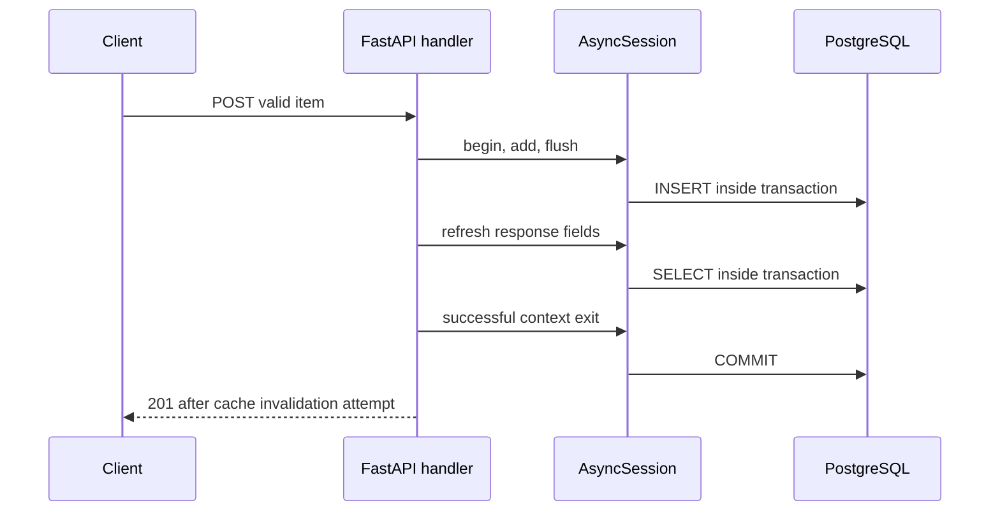

# Lab 02: PostgreSQL Persistence and Transaction Boundaries

## Purpose and Scope

> **Primary Objective:** Prove when an item write becomes durable and visible, what commit and rollback mean, how SQLAlchemy sessions borrow pooled connections, and how a required database failure affects the API.

Lab 1 connected HTTP behavior to the item handler and its dependencies. This lab concentrates on the source of truth. A returned UUID, an ORM object and a flushed SQL statement are not interchangeable with a committed transaction.

You will use real PostgreSQL for visibility and persistence experiments, make one focused application improvement for connection failures, and verify it with an isolated regression test.

## 1. Inherited State From Lab 01

You should have:

- the app/postgres/redis baseline running;
- completed ownership and migration jobs;
- `lab-notes/compose.baseline.yaml` and `lab-notes/session.sh`;
- a checkpoint item ID in `lab-notes/checkpoint-item-id.txt`;
- tracing/profiling disabled and all observability backends stopped; and
- the Items API contract established in Lab 1.

Do not repeat Lab 1's CRUD tour or recreate the database. Preserve its checkpoint row.

## 2. Scope and Explicit Exclusions

This lab covers PostgreSQL persistence, independent transaction visibility, flush/commit/rollback, SQLAlchemy session lifecycle, pooling, schema authority and required-dependency failure.

It does not introduce Prometheus, database exporters, query-plan tuning, lock contention load tests, replica failover, backup automation or a new schema migration. Cache invalidation appears only when a direct database experiment could leave a derived value behind; the full cache model is Lab 3.

## 3. Prerequisites and Clean Starting State

```bash
source lab-notes/session.sh
baseline_check
mkdir -p lab-notes/lab-02
CHECKPOINT_ID=$(cat lab-notes/checkpoint-item-id.txt)
api -fsS "$APP_URL/api/v1/items/$CHECKPOINT_ID" | jq '{id,name,price}'
dc run --rm migrate alembic current
```

Expected revision: `0001 (head)` or equivalent output showing revision `0001` at head. The command may print initialization status before Alembic output.

Check code changes before editing:

```bash
git status --short
git diff -- app/app/database.py app/tests/test_api.py
```

If Git is unavailable, keep a private reviewed copy of those two files in `lab-notes/lab-02/`. Do not blindly restore over pre-existing changes. Later commands patch only a known function fragment and refuse to proceed if it does not match.

## 4. Measurable Learning Objectives

You must demonstrate:

- item storage belongs to PostgreSQL, not the application container;
- bootstrap SQL and Alembic have separate responsibilities;
- flush can issue SQL before the transaction commits;
- a separate transaction cannot read an ordinary uncommitted row change;
- rollback removes uncommitted changes and leaves the connection reusable;
- a database constraint protects persistence even when the API is bypassed;
- sessions and pooled connections have different lifetimes;
- sequential sessions can reuse one backend connection;
- connection refusal becomes a sanitized 503 inside the database operation boundary;
- an unavailable database can coexist with a live FastAPI process; and
- recovery includes a real write/read, not just a running container.

## 5. Transaction Architecture



A failed transaction exits through rollback. Redis is not part of the PostgreSQL transaction. A failure after commit may leave a caller uncertain about an already durable write; HTTP alone cannot make a multi-system transaction atomic.

## 6. Locate the Persistence Boundaries

```bash
sed -n '1,220p' app/app/database.py
sed -n '1,150p' app/app/api.py
cat app/app/models.py
cat app/migrations/versions/0001_create_items.py
```

Identify:

- one engine and session factory per application process;
- `async with ... sessions()` in the per-request dependency;
- `session.begin()` around writes;
- `flush()` and `refresh()` before that context exits;
- `expire_on_commit=False` for already loaded response fields;
- rollback on propagated failure;
- connection disposal during application shutdown.

A session should belong to one unit of work; it is not safe to share one mutable AsyncSession among concurrent request tasks. The engine/pool is the shared infrastructure.

## 7. Establish Schema Authority

```bash
cat postgres/init.sql
cat app/alembic.ini
dbsql <<'SQL'
SELECT version_num FROM alembic_version;
SELECT column_name, data_type, is_nullable
FROM information_schema.columns
WHERE table_schema = 'public' AND table_name = 'items'
ORDER BY ordinal_position;
SELECT indexname, indexdef FROM pg_indexes WHERE tablename = 'items';
SELECT conname, pg_get_constraintdef(oid)
FROM pg_constraint WHERE conrelid = 'items'::regclass;
SQL
```

Expected schema includes UUID ID, bounded name, numeric price, active flag and timestamps; indexes include the primary key, name and creation time; the price check bounds the stored amount.

`init.sql` creates a role/database and permissions only when the PostgreSQL volume is first initialized. Alembic owns the application table and indexes. Do not add a second `CREATE TABLE items` to bootstrap SQL.

## 8. Create a Dedicated Transaction Subject

```bash
api -fsS -H 'Content-Type: application/json' \
  -d '{"name":"Lab 02 original","description":"Dedicated transaction subject","price":"25.00","is_active":true}' \
  "$APP_URL/api/v1/items" -o lab-notes/lab-02/item.json
ITEM_ID=$(jq -er '.id' lab-notes/lab-02/item.json)
printf '%s\n' "$ITEM_ID" > lab-notes/lab-02/item-id.txt
KEY=$(cache_key "$ITEM_ID")
rcli DEL "$KEY"
```

Deleting this one disposable cache key prevents a later derived response from masking the direct SQL experiments. Never flush the whole Redis database for one test.

## 9. Predict Visibility Before Running the Experiment

Write your expected item name at each boundary:

| **Boundary** | **Writer session** | **Independent reader** |
|---|---|---|
| Before change | Original | Original |
| Changed and flushed, not committed | Proposed value | Your prediction |
| Successful commit | Committed value | Your prediction |
| Another flushed change followed by exception | Proposed value then rollback | Your prediction |

The experiment uses ordinary PostgreSQL `READ COMMITTED` behavior. The reader uses a separate session and connection while the writer's transaction remains open. It does not request a row lock, so it reads the previously committed version rather than waiting for an uncommitted replacement.

## 10. Prove Flush, Commit, Rollback and Constraint Protection

Run this complete diagnostic program inside the app image:

```bash
dc exec -T -e LAB_ITEM_ID="$ITEM_ID" app python - <<'PYTHON' | tee lab-notes/lab-02/transactions.txt
import asyncio
import os
from uuid import UUID
from sqlalchemy import select, update
from sqlalchemy.exc import IntegrityError
from app.config import Settings
from app.database import Database
from app.metrics import Metrics
from app.models import Item

async def main():
    item_id = UUID(os.environ["LAB_ITEM_ID"])
    settings = Settings()
    assert settings.db_pool_size + settings.db_max_overflow >= 2, "This experiment needs two concurrent DB connections"
    database = Database(settings, Metrics())
    original = None

    async def read_name():
        async with database.sessions() as reader:
            return await reader.scalar(select(Item.name).where(Item.id == item_id))

    try:
        original = await read_name()
        assert original is not None, "Create the dedicated item first"
        async with database.sessions() as writer:
            async with writer.begin():
                item = await writer.get(Item, item_id)
                item.name = "Lab 02 committed"
                await writer.flush()
                outside = await read_name()
                print("AFTER_FLUSH writer=", item.name, "outside=", outside)
                assert outside == original
        assert await read_name() == "Lab 02 committed"
        print("AFTER_COMMIT outside= Lab 02 committed")

        try:
            async with database.sessions() as writer:
                async with writer.begin():
                    item = await writer.get(Item, item_id)
                    item.name = "Lab 02 must roll back"
                    await writer.flush()
                    raise RuntimeError("controlled rollback")
        except RuntimeError:
            pass
        assert await read_name() == "Lab 02 committed"
        print("AFTER_ROLLBACK outside= Lab 02 committed")

        try:
            async with database.sessions() as writer:
                async with writer.begin():
                    await writer.execute(
                        update(Item).where(Item.id == item_id).values(price=-1)
                    )
        except IntegrityError:
            print("CONSTRAINT rejected negative price")
        else:
            raise AssertionError("Expected the database price constraint")

        async with database.sessions() as reader:
            price = await reader.scalar(select(Item.price).where(Item.id == item_id))
            assert price >= 0
            print("AFTER_CONSTRAINT_ROLLBACK price=", price)
    finally:
        try:
            if original is not None:
                async with database.sessions.begin() as writer:
                    await writer.execute(
                        update(Item).where(Item.id == item_id).values(name=original)
                    )
        finally:
            await database.close()

asyncio.run(main())
PYTHON
```

Expected observations:

```text
AFTER_FLUSH writer= Lab 02 committed outside= Lab 02 original
AFTER_COMMIT outside= Lab 02 committed
AFTER_ROLLBACK outside= Lab 02 committed
CONSTRAINT rejected negative price
AFTER_CONSTRAINT_ROLLBACK price= 25.00
```

The script restores the original name in `finally`. It creates its own short-lived diagnostic engine using the same Database class; it is **not** reaching into the running Uvicorn process's session factory. Both connect to the real PostgreSQL database. The visibility experiment needs at least two simultaneous pooled connections; the default configuration supplies them.

## 11. Explain What the Program Proves

The writer's flush sent work to PostgreSQL, but the observer still saw the old committed value. Exiting `writer.begin()` without an error made the next reader see the change. Raising before that exit rolled back the proposed second change.

The invalid price bypassed Pydantic but still failed at the database constraint. Catching `IntegrityError` outside the transaction context allowed the context to roll back before the next read.

Do not catch a database error inside a transaction and continue issuing arbitrary SQL in its failed state. Roll back or leave the managed transaction boundary first. [SQLAlchemy explains the session's transaction framing](https://docs.sqlalchemy.org/en/20/orm/session_basics.html#framing-out-a-begin-commit-rollback-block).

This experiment does not prove every isolation level, deadlock behavior or concurrent-write policy. Those require separate experiments and a workload model.

## 12. Verify the Restored Source of Truth

```bash
dbsql -v item_id="$ITEM_ID" <<'SQL'
SELECT name, price FROM items WHERE id = :'item_id'::uuid;
SQL
rcli DEL "$KEY"
api -fsS "$APP_URL/api/v1/items/$ITEM_ID" | jq '{name,price}'
```

Expected: `Lab 02 original` and `25.00` at both layers. You deliberately used direct database writes, so explicit key invalidation prevents a cached representation from confusing verification.

## 13. Distinguish Session Lifetime From Connection Lifetime

A new AsyncSession is a unit-of-work object. A database connection is a network session with a PostgreSQL backend PID. The pool can return a connection from one completed session to another.

Prediction: five sequential diagnostic sessions should normally report one reused backend PID, not five new connections. Run:

```bash
dc exec -T app python - <<'PYTHON' | tee lab-notes/lab-02/pool-reuse.txt
import asyncio
from sqlalchemy import text
from app.config import Settings
from app.database import Database
from app.metrics import Metrics

async def main():
    database = Database(Settings(), Metrics())
    pids = []
    try:
        for number in range(1, 6):
            async with database.sessions() as session:
                pid = await session.scalar(text("SELECT pg_backend_pid()"))
                pids.append(pid)
                print(f"session={number} backend_pid={pid}")
        print("unique_backend_pids=", len(set(pids)))
        assert len(set(pids)) == 1, "Investigate restarts/reconnections before concluding no reuse"
    finally:
        await database.close()

asyncio.run(main())
PYTHON
```

This proves reuse in the diagnostic process's pool. It does not measure every HTTP request or imply the application has exactly one connection under concurrent load.

## 14. Inspect the Running Application's Database Sessions

Generate uncached list work, then inspect PostgreSQL:

```bash
for request in 1 2 3 4 5; do
  api -fsS "$APP_URL/api/v1/items?limit=1" >/dev/null
done
dbsql <<'SQL'
SELECT application_name, state, wait_event_type, count(*)
FROM pg_stat_activity
WHERE datname = current_database()
GROUP BY 1, 2, 3
ORDER BY 1, 2;
SQL
```

Find the app's configured service name. Background readiness probes may borrow connections, so do not expect one fixed count. The admin `psql` connection also appears.

`idle` pooled connections can be normal. `idle in transaction` persisting after requests finish deserves investigation because the transaction may retain resources or locks.

The defaults permit five pooled connections plus five overflow connections per worker. They are capacity bounds, not ten connections necessarily opened immediately. More workers multiply possible demand.

## 15. Review the Connection-Failure Boundary

Read `Database.operation` and the database error handler in `main.py`.

SQLAlchemy database exceptions and timeouts already produce a safe 503. A driver/network connect failure may instead arrive as an `OSError` subclass, such as `ConnectionRefusedError`. Without translation at the database boundary, the generic exception middleware can turn that into a safe but less useful 500.

This lab hardens that narrow case. It does not catch every error globally as a database failure; a programmer error must remain distinguishable.

## 16. Implement the Narrow Error Translation

Use this guarded edit once:

```bash
python3 - <<'PYTHON'
from pathlib import Path
path = Path("app/app/database.py")
source = path.read_text()
old = '''        except (SQLAlchemyError, TimeoutError):
            self.metrics.dependency_up.labels("postgres").set(0)
            raise
        finally:
'''
new = '''        except (SQLAlchemyError, TimeoutError):
            self.metrics.dependency_up.labels("postgres").set(0)
            raise
        except OSError as error:
            self.metrics.dependency_up.labels("postgres").set(0)
            raise SQLAlchemyError("Persistence connection unavailable") from error
        finally:
'''
if new in source:
    print("Translation already present; no duplicate edit")
elif source.count(old) == 1:
    path.write_text(source.replace(old, new, 1))
    print("Added database-scoped connection error translation")
else:
    raise SystemExit("Expected source boundary not found; review Database.operation manually")
PYTHON
```

The handler in `main.py` already catches `SQLAlchemyError`, logs sanitized exception frames and returns `database_unavailable`. The translation reuses that central behavior without leaking the driver's message.

`Database.check()` already catches connection-level `OSError` for readiness; it needs no change.

## 17. Add a Regression Test That Exercises Route Wiring

Append this test only if it is not already present:

```bash
if ! rg -q '^async def test_connection_refusal_returns_503' app/tests/test_api.py; then
  cat >> app/tests/test_api.py <<'PYTHON'


async def test_connection_refusal_returns_503(client, app, monkeypatch):
    from unittest.mock import AsyncMock

    monkeypatch.setattr(
        app.state.database.sessions.class_,
        "get",
        AsyncMock(side_effect=ConnectionRefusedError("private-driver-detail")),
    )
    response = await client.get(f"/api/v1/items/{uuid4()}")
    assert response.status_code == 503
    assert response.json()["error"]["code"] == "database_unavailable"
    assert "private-driver-detail" not in response.text
PYTHON
fi
```

`uuid4` is already imported by the test module. A fresh UUID takes the cache-miss/database path. The injected failure happens at the awaited session operation, so this test checks the route, operation boundary and central error handler together.

It does not require an actual refused TCP connection. The live outage experiment later supplies that different evidence.

## 18. Validate, Review and Rebuild Only the App

```bash
python3 -m py_compile app/app/database.py app/tests/test_api.py
git diff --check
git diff -- app/app/database.py app/tests/test_api.py
make test
make lint
dc up -d --build --no-deps app
baseline_check
```

The test suite should now contain the additional regression case. Fix a failed test or syntax check before rebuilding again.

The app source is copied into its image. A restart alone cannot adopt an edited Python file. This rebuild does not migrate or delete PostgreSQL data.

## 19. Prove Item Persistence Across App Replacement

```bash
api -fsS "$APP_URL/api/v1/items/$ITEM_ID" | jq '{id,name,price}'
dbsql -v item_id="$ITEM_ID" <<'SQL'
SELECT count(*) FROM items WHERE id = :'item_id'::uuid;
SQL
```

Expected: the same item, with a direct count of one. The app process was replaced; the row outlived it.

This proves separation of application memory and database state. Lab 5 will measure container identity and volume identity explicitly.

## 20. Predict a Required-Database Outage

For this controlled drill, use **list and create**, which always need PostgreSQL. Do not use a possibly cached item GET as the primary test.

Write predictions:

| **Operation** | **Prediction and reason** |
|---|---|
| Liveness | Can the process respond without the database? |
| List items | Does the handler have a cache branch? |
| Create item | Can a committed write occur without PostgreSQL? |
| Readiness | Which dependency is required? |
| Existing row after recovery | Does stopping the process delete the volume? |

Health semantics are explored fully in Lab 4. Here they support diagnosis of persistence failure.

## 21. Run a Bounded Database Failure Exercise

The following subshell installs recovery on exit. It stops only PostgreSQL, performs a few requests and restores the service even if a command fails. It cannot recover after host loss or an uncatchable kill, so do not leave a failure exercise unattended.

```bash
(
  set -euo pipefail
  trap 'dc start postgres >/dev/null' EXIT
  trap 'exit 130' INT
  trap 'exit 143' TERM
  date -u +'%Y-%m-%dT%H:%M:%SZ' > lab-notes/lab-02/outage-start.txt
  dc stop postgres
  api -fsS "$APP_URL/health/live" | tee lab-notes/lab-02/down-live.json

  list_status=$(api -sS -o lab-notes/lab-02/down-list.json -w '%{http_code}' \
    "$APP_URL/api/v1/items?limit=1")
  create_status=$(api -sS -o lab-notes/lab-02/down-create.json -w '%{http_code}' \
    -H 'Content-Type: application/json' \
    -d '{"name":"Lab 02 rejected during outage","price":"1.00"}' \
    "$APP_URL/api/v1/items")
  printf 'list=%s create=%s\n' "$list_status" "$create_status" \
    | tee lab-notes/lab-02/outage-status.txt
  test "$list_status" = 503
  test "$create_status" = 503
  jq '.error | {code,message}' lab-notes/lab-02/down-create.json
)
wait_ready
```

Expected: live response still 200, list/create 503 and sanitized `database_unavailable` errors. Curl deliberately omits `--fail` on expected 503s so the response body remains available for inspection.

A client timeout or connection-reset after sending a write is not the same proof as this deliberately stopped-before-request experiment. In real incidents, verify transaction outcome before retrying a non-idempotent POST.

## 22. Prove Recovery With a Fresh Committed Write

```bash
api -fsS -H 'Content-Type: application/json' \
  -d '{"name":"Lab 02 recovery proof","price":"2.00"}' \
  "$APP_URL/api/v1/items" -o lab-notes/lab-02/recovery.json
RECOVERY_ID=$(jq -er '.id' lab-notes/lab-02/recovery.json)
dbsql -v item_id="$RECOVERY_ID" <<'SQL'
SELECT id, name, price FROM items WHERE id = :'item_id'::uuid;
SQL
api -fsS "$APP_URL/api/v1/items?limit=1" >/dev/null
api -fsS "$APP_URL/api/v1/items/$ITEM_ID" | jq '{id,name,price}'
```

You have proved new durable work, direct database visibility and survival of the earlier item. A successful `pg_isready` alone would not prove those outcomes.

## 23. Review Transaction and Failure Boundaries

Complete this matrix:

| **Event** | **Persistent effect** | **Expected HTTP consequence** |
|---|---|---|
| Input rejected before handler | No application write | 422 |
| Valid request and successful commit | Row persists | 201 for create |
| Exception before commit | Managed rollback | Safe failure response |
| Database unavailable before request | No new commit | 503 |
| Process fails after commit but before response | Commit can already exist | Client outcome may be ambiguous |
| Redis invalidation fails after commit | PostgreSQL write remains committed | Best-effort cache degradation |

Do not confuse failure classification with exactly-once processing. This API has no idempotency key for POST and no distributed transaction coordinator.

## 24. Focused Test Review

```bash
rg -n 'test_failed_commit_rolls_back|test_database_error_sanitized|test_connection_refusal_returns_503' \
  app/tests/test_api.py
```

Read the failed-commit test. It injects a failure before commit and asserts no item persists and no cache entry appears. This is stronger than a test that merely calls `rollback()` and checks that it returned.

Compare its SQLite/fake-Redis scope with the real PostgreSQL visibility exercise. Each supplies evidence the other does not.

## 25. Troubleshooting Runbook

### A. `relation "items" does not exist`

```bash
dc logs --tail=100 migrate
dc run --rm migrate alembic current
dc run --rm migrate alembic upgrade head
```

Do not repair this by adding `create_all()` to application startup. Keep Alembic authoritative.

### B. Admin SQL works but the app returns 503

Check the app's required-dependency path, role credentials and Docker DNS. `.env` password edits do not rotate an existing PostgreSQL role. Avoid deleting data to solve an authentication mismatch.

### C. A connection refusal still returns 500

```bash
rg -n 'except OSError|Persistence connection unavailable' app/app/database.py
dc exec -T app python -c 'import inspect; from app.database import Database; print(inspect.getsource(Database.operation))'
```

Compare host and running source. Rebuild the app with `dc up -d --build --no-deps app`. If the error is not in a database operation, do not blindly classify it as persistence failure.

### D. The outside reader saw the proposed uncommitted value

Verify you did not reuse the writer's session or ORM identity-map object. The script deliberately creates an independent session. Also check that you did not move the read after the transaction context exited.

### E. A connection reports an aborted transaction

Roll back before issuing more statements, or use the demonstrated transaction context. Catching the exception alone is not a rollback operation.

### F. The pool experiment reports multiple PIDs

Check for database restarts, connection disposal, unexpected concurrency or changed pool settings. The script uses sequential sessions in its own pool. It does not promise one PID for concurrent HTTP traffic.

### G. A GET works while the database is stopped

That can be a cache hit. Use the uncached list path or a write to test required persistence. Lab 3 will isolate the mask.

### H. Recovery deadline expires

```bash
dc ps -a postgres app
dc logs --tail=100 postgres app
dc exec postgres pg_isready -h 127.0.0.1 -U postgres -d postgres
```

Check storage, credentials and crash recovery before restarting the app repeatedly.

## 26. Diagnostic Sequence

1. Classify validation, domain absence, persistence failure or unexpected code failure.
2. Identify whether the request actually needed PostgreSQL.
3. Inspect migration revision and app-role connectivity separately from admin connectivity.
4. Check transaction state, connection limits and database process state.
5. Locate the exception boundary and inspect sanitized logs.
6. Recover the database or code issue, then repeat the original user operation.
7. Verify the committed row independently and check for ambiguous duplicate writes.

## 27. Knowledge Check

1. What is the difference between `flush()` and `commit()`?
2. Why did the independent reader see the original name before commit?
3. Why can an ORM object contain a changed name before other sessions see it?
4. What rolls back when the managed transaction exits with an exception?
5. Why keep a price constraint when Pydantic already rejects negative prices?
6. What is the difference between a session and a pooled connection?
7. Did the diagnostic reuse script inspect the running Uvicorn pool directly?
8. Why might several application connections remain idle?
9. Why translate `OSError` inside the database boundary rather than globally?
10. Does a timeout after POST prove the write never committed?
11. What owns application schema evolution?
12. What evidence demonstrates database recovery beyond `pg_isready`?

### Answer Key

1. Flush sends pending SQL inside a transaction; commit completes that transaction.
2. Its ordinary read observed committed state, not the writer's uncommitted version.
3. The session maintains in-process object state within its own unit of work.
4. Uncommitted work in that transaction; earlier committed transactions remain.
5. Other writers can bypass the API, and persistence invariants need database enforcement.
6. A unit-of-work object versus a reusable database network connection.
7. No; it created a separate diagnostic engine using the same configuration/class.
8. The pool retains reusable connections; idle is not automatically a leak.
9. To avoid misclassifying unrelated filesystem/network/program errors as database outages.
10. No; the response may have been lost after commit.
11. Alembic, not bootstrap SQL or `create_all()` at startup.
12. A fresh committed write, independent row query and successful application read.

## 28. Professional Scenario Exercise

A client retries a POST after a timeout and finds two records with different UUIDs. A teammate proposes adding more automatic retries to the database client.

Write an incident/design response covering ambiguous transaction outcome, the absence of an idempotency contract, what evidence should be checked, and why retries alone cannot guarantee exactly-once business behavior. Do not implement idempotency in this lab; record it as a deliberate future design decision.

## 29. Lab Notebook Template

```markdown
# Lab 02 Evidence

## Starting revision and item ID
## Writer/reader visibility predictions
## Flush, commit and rollback observations
## Constraint failure and restored row
## Session versus connection explanation
## Diagnostic PID reuse and its limits
## Running application connection observations
## Connection-error translation and reviewed diff
## Regression test and build results
## Database outage prediction and HTTP results
## Recovery write and direct SQL proof
## Ambiguous-outcome scenario
## Knowledge-check answers
## Production implications and open questions
```

Save it as `lab-notes/Lab-2.md`. Keep passwords and complete environment dumps out of the notes.

## 30. Cleanup and Reviewed Checkpoint

Remove only your dedicated exercise rows; keep the original course checkpoint:

```bash
api -fsS -X DELETE "$APP_URL/api/v1/items/$ITEM_ID" -o /dev/null
api -fsS -X DELETE "$APP_URL/api/v1/items/$RECOVERY_ID" -o /dev/null
baseline_check
git diff --check
git diff --stat
```

On reruns, 404 for an already deleted exercise item is explainable; confirm its absence instead of recreating it only to satisfy cleanup.

If this is your working Git repository, commit the two reviewed application/test changes explicitly. Do not stage the secret `.env` or all private evidence indiscriminately.

## 31. Completion Criteria

- [ ] You identified Alembic as the only item schema authority.
- [ ] Independent reader behavior differed before and after commit as predicted.
- [ ] An exception rolled back the flushed change.
- [ ] The database rejected a negative price independent of API validation.
- [ ] The original diagnostic item was restored after the experiment.
- [ ] Sequential diagnostic sessions reused a backend connection.
- [ ] You explained the diagnostic pool's limits and app connection observations.
- [ ] The connection-refusal regression test passes with a sanitized 503.
- [ ] The running image contains the reviewed change.
- [ ] Stopping PostgreSQL failed required requests while liveness remained available.
- [ ] PostgreSQL was restored and a fresh committed write was proven directly.
- [ ] Temporary rows were removed and the course checkpoint remains.

## 32. Production Implications

Use transaction boundaries that match a unit of business work. Keep migrations separate from normal request handling, limit connection demand, enforce critical invariants in PostgreSQL and classify failures at the narrowest accurate boundary.

Single-host persistence survives process replacement, not every failure. Disk loss, unsafe durability settings, backup gaps and ambiguous retries require separate designs. A pool improves connection reuse; it does not create unlimited database capacity.

## 33. End State and Transition to Lab 03

```bash
baseline_check
api -fsS "$APP_URL/api/v1/items/$CHECKPOINT_ID" | jq '{id,name,price}'
```

Leave the connection-error hardening in place. Next: [Lab 03 — Redis Cache-Aside and Graceful Degradation](Lab-3.md).

You can now distinguish a committed record from a proposed write. Lab 3 examines its derived cached representation: hits, misses, expiry, invalidation, staleness and failure fallback.
