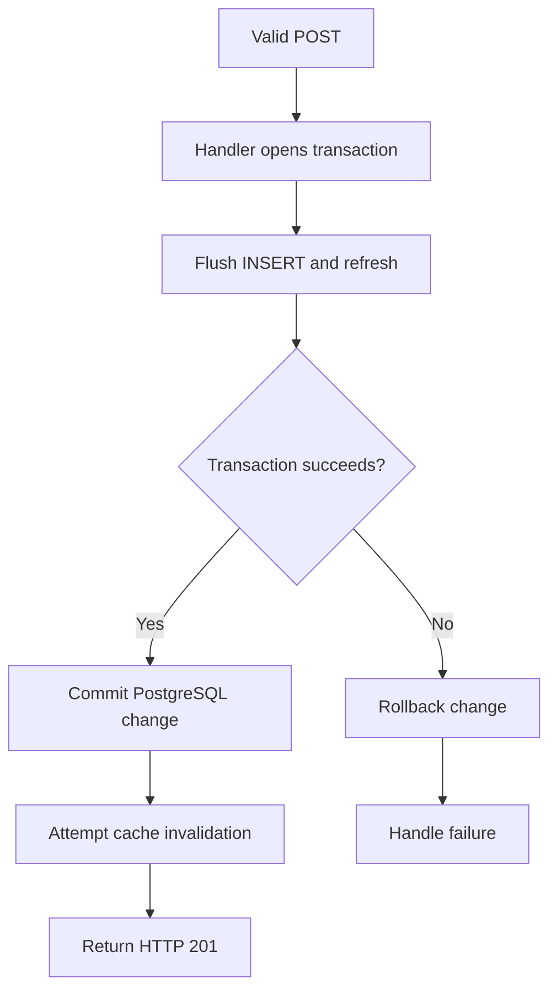

# Lab 02: PostgreSQL Persistence and Transaction Boundaries

## 1. Purpose and Learning Outcomes

**In Plain Language:** You will examine when a database change becomes visible and what happens when a write fails. The key experiment uses a writer and an independent reader so you can see the difference between sending SQL and committing a transaction. You will then improve one database-error boundary and verify that useful work resumes after a short PostgreSQL outage.

> **Primary Objective:** Prove when an item write becomes durable and visible, what commit and rollback mean, how SQLAlchemy sessions borrow pooled connections, and how a required database failure affects the API.

Lab 1 connected HTTP behavior to the item handler and its dependencies. This lab concentrates on the source of truth. A returned UUID, an ORM object and a flushed SQL statement are not interchangeable with a committed transaction.

You will use real PostgreSQL for visibility and persistence experiments, make one focused application improvement for connection failures, and verify it with an isolated regression test.

## 2. Starting Point and Lab Map

Use this guide inside the complete application repository. Run commands from the repository root in Bash unless a step says otherwise. Work through the starting checks in order; they load the helpers and state this lab needs.

Read the explanation before each step, run one complete code block at a time, and compare the actual result with the stated expectation. Save commands, observations, explanations, and unexpected results in your notebook.

### Key Terms

| **Term**          | **Plain-Language Meaning**                                           |
| ----------------- | -------------------------------------------------------------------- |
| Flush             | Send pending changes to the database within the current transaction. |
| Commit / rollback | Finish the transaction by keeping its changes or discarding them.    |
| Connection pool   | A reusable set of database connections borrowed by units of work.    |

### Lab Map

The arrows show the flow or dependency being studied. Branches identify paths to compare; this is a conceptual map, not a captured runtime trace.


```mermaid
flowchart TD
    C["Valid POST"] --> A["Handler opens transaction"]
    A --> F["Flush INSERT and refresh"]
    F --> X{"Transaction succeeds?"}
    X -->|"Yes"| K["Commit PostgreSQL change"]
    X -->|"No"| R["Rollback change"]
    K --> I["Attempt cache invalidation"]
    I --> O["Return HTTP 201"]
    R --> E["Handle failure"]
```

## 3. Guided Walkthrough

### Step 01. Inherited State from Lab 01

**What You Are Doing:** Reuse the working baseline and checkpoint from Lab 01. Keeping the same database makes persistence observable across application changes.

**Practical Walkthrough:** Confirm that the shared session helper and baseline override from Lab 01 still exist and that the original checkpoint ID is available. You are continuing the same deployment, so do not create a new database simply to make the start look clean. The later replacement experiment needs existing data whose identity you already know.

Locate the checkpoint files before issuing any request and preserve their existing values. That ID links this lab to data created before the new experiments. Confirm the deployment still represents the recovered baseline from Lab 01; starting over with fresh data would make a later successful read unable to demonstrate continuity across an application change.

You should have:

- the app/postgres/redis baseline running;
- completed ownership and migration jobs;
- `lab-notes/compose.baseline.yaml` and `lab-notes/session.sh`;
- a checkpoint item ID in `lab-notes/checkpoint-item-id.txt`;
- tracing/profiling disabled and all observability backends stopped; and
- the Items API contract established in Lab 1.

Do not repeat Lab 1's CRUD tour or recreate the database. Preserve its checkpoint row.

**Understanding the Result:** A recovered three-service baseline and readable checkpoint establish continuity. A missing checkpoint should be investigated before it is used to make a persistence claim.

### Step 02. Scope and Explicit Exclusions

**What You Are Doing:** Focus on the boundary between application work and committed PostgreSQL state. Other database topics are deferred so the experiments have one clear purpose.

**Practical Walkthrough:** Keep each experiment focused on how database work becomes committed and how failures cross the application boundary. Cache cleanup appears only to prevent stale derived data from confusing a SQL observation. Monitoring backends and tuning exercises would add variables without helping answer the current transaction question.

Before each experiment, name the boundary it targets and the component that observes it. A SQL query from another connection tests visibility; an activity-view query tests connection state; an HTTP error tests the public contract. Keep those observations separate in your explanation so a successful cache read cannot accidentally become your proof of an available database transaction path.

This lab covers PostgreSQL persistence, independent transaction visibility, flush/commit/rollback, SQLAlchemy session lifecycle, pooling, schema authority and required-dependency failure.

It does not introduce Prometheus, database exporters, query-plan tuning, lock contention load tests, replica failover, backup automation or a new schema migration. Cache invalidation appears only when a direct database experiment could leave a derived value behind; the full cache model is Lab 3.

**Understanding the Result:** You should be able to identify whether each observation concerns schema, transaction visibility, connection reuse, or error handling. Those are related but separate boundaries.

### Step 03. Prerequisites and Clean Starting State

**What You Are Doing:** Check the migration revision and record existing source changes before editing. This prevents a missing schema or an unrelated local modification from confusing the transaction tests.

**Practical Walkthrough:** Load the existing helpers, check readiness, and inspect the migration revision before editing code. Review the current diff or keep a copy of the affected files so you can distinguish your lab change from pre-existing work. The guarded patch later expects a particular source fragment and should stop if the file differs unexpectedly.

Run the checks in order: load the functions, establish readiness, retrieve the saved item, and inspect the migration revision. `dc run --rm migrate` creates a temporary migration-command container and removes it afterward; it is not a database-volume reset. Review the source diff before applying the later patch so any existing changes remain attributable and recoverable.

```bash
source lab-notes/session.sh
baseline_check
mkdir -p lab-notes/lab-02
CHECKPOINT_ID=$(cat lab-notes/checkpoint-item-id.txt)
api -fsS "$APP_URL/api/v1/items/$CHECKPOINT_ID" | jq '{id,name,price}'
dc run --rm migrate alembic current
```

Expected revision: `0001 (head)` or equivalent output showing revision `0001` at head. The command may print initialization status before Alembic output.

Check code changes before editing:

```bash
git status --short
git diff -- app/app/database.py app/tests/test_api.py
```

If Git is unavailable, keep a private reviewed copy of those two files in `lab-notes/lab-02/`. Do not blindly restore over pre-existing changes. Later commands patch only a known function fragment and refuse to proceed if it does not match.

**Understanding the Result:** A matching migration head establishes the expected schema state. An unexpected source diff or revision is a prerequisite to resolve, not a reason to force the patch.

### Step 04. Measurable Learning Objectives

**What You Are Doing:** By the end, explain each result in terms of transaction state and the observer that saw it. A successful command alone is not the learning outcome.

**Practical Walkthrough:** Use the objectives to organize your notebook around claims that another person could verify. For example, distinguish 'I called flush' from 'another connection could not yet see the change.' The second statement links an operation to an independent observation and is the stronger explanation of transaction visibility.

Turn each objective into a short prediction and a planned observation before executing its experiment. For example, pair a flush with a read through an independent connection, and pair a connection failure with a sanitized HTTP response. Revisit the predictions using actual output. When an observation answers only part of an objective, state what remains untested instead of extending the conclusion automatically.

You must demonstrate:

- item storage belongs to PostgreSQL, not the application container;
- bootstrap SQL and Alembic have separate responsibilities;
- flush can issue SQL before the transaction commits;
- a separate transaction cannot read an ordinary uncommitted row change;
- rollback removes uncommitted changes and leaves the connection reusable;
- a database constraint protects persistence even when the API is bypassed;
- sessions and pooled connections have different lifetimes;
- sequential sessions can reuse one backend connection;
- connection refusal becomes a sanitized 503 inside the database operation boundary;
- an unavailable database can coexist with a live FastAPI process; and
- recovery includes a real write/read, not just a running container.

**Understanding the Result:** For every objective, record the observer and the boundary it tested. This avoids treating one successful HTTP request as proof of all database behavior.

### Step 05. Transaction Architecture

**What You Are Doing:** Use the lab map to locate the commit boundary. Work performed before that boundary can still be rolled back; later cache handling belongs to a separate system.

**Practical Walkthrough:** Follow the transaction from entry to successful exit in the map. The handler can issue SQL and refresh values before the commit boundary, while later cache handling is outside that PostgreSQL transaction. Imagine a failure at each point and ask which earlier changes could already be visible to another connection.

Mark three points in the path: the first SQL statement, successful transaction exit, and cache invalidation. Explain what a second connection could see at each point. This ordering matters when interpreting an exception: the same error message has different persistence implications depending on whether it occurred before the transaction committed or during work performed afterward.

The lab map in Section 2 shows this relationship.

A failed transaction exits through rollback. Redis is not part of the PostgreSQL transaction. A failure after commit may leave a caller uncertain about an already durable write; HTTP alone cannot make a multi-system transaction atomic.

**Understanding the Result:** Rollback applies to uncommitted database work. It cannot undo a commit merely because a later cache operation or response delivery fails.

### Step 06. Locate the Persistence Boundaries

**What You Are Doing:** Find where the engine, sessions, and transaction contexts are created. This connects the short API handler to the longer-lived connection pool beneath it.

**Practical Walkthrough:** Locate the long-lived engine and session factory, then find the short-lived session dependency and transaction context used by a request. A session organizes one unit of work; the pool underneath supplies connections when SQL needs to run. Read cleanup paths as carefully as creation paths so resources are returned after success or failure.

Read the engine setup and dependency cleanup together, then locate the handler's transaction context. Follow the first awaited SQL operation to see when a connection is actually needed. A request-scoped session and a reused pooled connection have different lifetimes, so track both objects in your explanation rather than describing every new session as a newly opened network connection.

```bash
sed -n '1,220p' app/app/database.py
sed -n '1,150p' app/app/api.py
cat app/app/models.py
cat app/migrations/versions/0001_create_items.py
```

Identify:

- one engine and session factory per application process;
- `async with ... sessions()` in the per-request dependency;
- `session.begin()` around writes;
- `flush()` and `refresh()` before that context exits;
- `expire_on_commit=False` for already loaded response fields;
- rollback on propagated failure;
- connection disposal during application shutdown.

A session should belong to one unit of work; it is not safe to share one mutable AsyncSession among concurrent request tasks. The engine/pool is the shared infrastructure.

**Understanding the Result:** Being able to create a session object does not establish that SQL ran. Look for the actual awaited database operation when explaining connection use.

### Step 07. Establish Schema Authority

**What You Are Doing:** Identify which mechanism owns each part of database setup. Bootstrap initialization prepares the database, while Alembic tracks changes to application tables and indexes.

**Practical Walkthrough:** Inspect the table, constraints, indexes, and migration state rather than assuming the Python model is the whole schema. Compare the responsibilities of first-time database initialization and Alembic. The former prepares database-level setup on an empty volume; the latter owns versioned changes to application tables.

Compare the migration's intended table definition with the live SQL results, including constraints and indexes. A Python validation rule and a database constraint protect different callers, so identify which layer owns each check. If the live schema disagrees with the migration history, investigate that mismatch before using an experiment's outcome to draw conclusions about transaction semantics.

```bash
cat postgres/init.sql
cat app/alembic.ini
dbsql <<'SQL'
SELECT version_num FROM alembic_version;
SELECT column_name, data_type, is_nullable
FROM information_schema.columns
WHERE table_schema = 'public' AND table_name = 'items'
ORDER BY ordinal_position;
SELECT indexname, indexdef FROM pg_indexes WHERE tablename = 'items';
SELECT conname, pg_get_constraintdef(oid)
FROM pg_constraint WHERE conrelid = 'items'::regclass;
SQL
```

Expected schema includes UUID ID, bounded name, numeric price, active flag and timestamps; indexes include the primary key, name and creation time; the price check bounds the stored amount.

`init.sql` creates a role/database and permissions only when the PostgreSQL volume is first initialized. Alembic owns the application table and indexes. Do not add a second `CREATE TABLE items` to bootstrap SQL.

**Understanding the Result:** A missing or incompatible table belongs to the schema boundary. Restarting an app or editing first-time initialization SQL does not automatically migrate existing data.

### Step 08. Create a Dedicated Transaction Subject

**What You Are Doing:** Create one disposable row for direct database experiments and clear only its cache key. An old cached response would otherwise hide the state you are trying to measure.

**Practical Walkthrough:** Create a fresh disposable item with a recognizable original value and save its ID. Remove only that item's cache key before direct SQL experiments. Otherwise an API read could return an older cached document even when the database transaction behavior itself is correct.

Keep the new fixture ID separate from `CHECKPOINT_ID`. The saved JSON records its initial name and price, which the diagnostic program should restore later. Deleting the exact Redis key removes only the derived representation for this fixture. Verify the key was constructed from this ID before using it, especially if your shell still contains variables from Lab 01.

```bash
api -fsS -H 'Content-Type: application/json' \
  -d '{"name":"Lab 02 original","description":"Dedicated transaction subject","price":"25.00","is_active":true}' \
  "$APP_URL/api/v1/items" -o lab-notes/lab-02/item.json
ITEM_ID=$(jq -er '.id' lab-notes/lab-02/item.json)
printf '%s\n' "$ITEM_ID" > lab-notes/lab-02/item-id.txt
KEY=$(cache_key "$ITEM_ID")
rcli DEL "$KEY"
```

Deleting this one disposable cache key prevents a later derived response from masking the direct SQL experiments. Never flush the whole Redis database for one test.

**Understanding the Result:** You now have one authoritative row with an unambiguous baseline value. Preserve the unrelated course checkpoint and use the disposable UUID throughout this lab.

### Step 09. Predict Visibility Before Running the Experiment

**What You Are Doing:** Write down what the independent reader should see before and after commit. Your prediction should depend on visibility to another transaction, not just on the writer's in-memory value.

**Practical Walkthrough:** Fill the writer and reader columns before running the program. The writer can see its own pending change after a flush, but the independent reader asks what another transaction can observe. Consider successful commit and an exception-triggered rollback as two separate endings to the same initial change sequence.

For every row of the prediction table, specify which session performs the read and whether the writer has committed. After flush, compare the writer's own view with the outside reader's view; after commit, ask what changed for the outside reader. For rollback, predict the last committed value rather than assuming the row disappears whenever any later update fails.

Write your expected item name at each boundary:

| **Boundary**                                 | **Writer Session**           | **Independent Reader** |
| -------------------------------------------- | ---------------------------- | ---------------------- |
| Before change                                | Original                     | Original               |
| Changed and flushed, not committed           | Proposed value               | Your prediction        |
| Successful commit                            | Committed value              | Your prediction        |
| Another flushed change followed by exception | Proposed value then rollback | Your prediction        |

The experiment uses ordinary PostgreSQL `READ COMMITTED` behavior. The reader uses a separate session and connection while the writer's transaction remains open. It does not request a row lock, so it reads the previously committed version rather than waiting for an uncommitted replacement.

**Understanding the Result:** The comparison is between independent transaction views. Reading twice through the writer's own session would not test the same visibility boundary.

### Step 10. Prove Flush, Commit, Rollback and Constraint Protection

**What You Are Doing:** Run a program that pauses at the important transaction boundaries and checks them from a separate session. Its cleanup restores the original value so the demonstration leaves a usable row.

**Practical Walkthrough:** Run the entire diagnostic program inside the app image so it uses the repository's database code and installed dependencies. Follow the printed phases rather than reading it as one large command: change and flush, observe independently, commit, repeat with failure, and test the database constraint. The final cleanup restores the fixture's original value.

The `-T` option allows the heredoc program to reach Python through standard input without allocating an interactive terminal. The environment variable passes only the selected fixture ID into that process. Read the output phase by phase and compare it with the prediction table. If a phase fails unexpectedly, inspect the saved output and verify the fixture's final SQL state before repeating the program.

Run this complete diagnostic program inside the app image:

```bash
dc exec -T -e LAB_ITEM_ID="$ITEM_ID" app python - <<'PYTHON' | tee lab-notes/lab-02/transactions.txt
import asyncio
import os
from uuid import UUID
from sqlalchemy import select, update
from sqlalchemy.exc import IntegrityError
from app.config import Settings
from app.database import Database
from app.metrics import Metrics
from app.models import Item

async def main():
    item_id = UUID(os.environ["LAB_ITEM_ID"])
    settings = Settings()
    assert settings.db_pool_size + settings.db_max_overflow >= 2, "This experiment needs two concurrent DB connections"
    database = Database(settings, Metrics())
    original = None

    async def read_name():
        async with database.sessions() as reader:
            return await reader.scalar(select(Item.name).where(Item.id == item_id))

    try:
        original = await read_name()
        assert original is not None, "Create the dedicated item first"
        async with database.sessions() as writer:
            async with writer.begin():
                item = await writer.get(Item, item_id)
                item.name = "Lab 02 committed"
                await writer.flush()
                outside = await read_name()
                print("AFTER_FLUSH writer=", item.name, "outside=", outside)
                assert outside == original
        assert await read_name() == "Lab 02 committed"
        print("AFTER_COMMIT outside= Lab 02 committed")

        try:
            async with database.sessions() as writer:
                async with writer.begin():
                    item = await writer.get(Item, item_id)
                    item.name = "Lab 02 must roll back"
                    await writer.flush()
                    raise RuntimeError("controlled rollback")
        except RuntimeError:
            pass
        assert await read_name() == "Lab 02 committed"
        print("AFTER_ROLLBACK outside= Lab 02 committed")

        try:
            async with database.sessions() as writer:
                async with writer.begin():
                    await writer.execute(
                        update(Item).where(Item.id == item_id).values(price=-1)
                    )
        except IntegrityError:
            print("CONSTRAINT rejected negative price")
        else:
            raise AssertionError("Expected the database price constraint")

        async with database.sessions() as reader:
            price = await reader.scalar(select(Item.price).where(Item.id == item_id))
            assert price >= 0
            print("AFTER_CONSTRAINT_ROLLBACK price=", price)
    finally:
        try:
            if original is not None:
                async with database.sessions.begin() as writer:
                    await writer.execute(
                        update(Item).where(Item.id == item_id).values(name=original)
                    )
        finally:
            await database.close()

asyncio.run(main())
PYTHON
```

**Command Note:** `exec -T` runs the diagnostic command inside the existing container without allocating a terminal. The heredoc supplies its program on standard input, using the dependencies installed in that image.

**Expected Observations:**

```text
AFTER_FLUSH writer= Lab 02 committed outside= Lab 02 original
AFTER_COMMIT outside= Lab 02 committed
AFTER_ROLLBACK outside= Lab 02 committed
CONSTRAINT rejected negative price
AFTER_CONSTRAINT_ROLLBACK price= 25.00
```

The script restores the original name in `finally`. It creates its own short-lived diagnostic engine using the same Database class; it is **not** reaching into the running Uvicorn process's session factory. Both connect to the real PostgreSQL database. The visibility experiment needs at least two simultaneous pooled connections; the default configuration supplies them.

**Understanding the Result:** The program needs separate connections for the visibility comparison. Its output proves behavior in that diagnostic process against real PostgreSQL, not internal state borrowed from the running web worker.

### Step 11. Explain What the Program Proves

**What You Are Doing:** Interpret each observation separately: flush sends work, commit exposes the successful change, and rollback removes the failed attempt. The constraint test adds protection beneath API validation.

**Practical Walkthrough:** Read each observation beside the operation that preceded it. The crucial distinction is whether the transaction successfully exited or an exception forced rollback. The invalid-price attempt bypasses the HTTP validation layer, letting you see that PostgreSQL also enforces its own constraint even when the API is not the caller.

Use the printed phase names to reconstruct the sequence, including the last successfully committed value before each failure. The constraint rejection demonstrates protection below the API because the program talks to the database directly. After an error, distinguish catching the exception from completing rollback; the later independent read is what shows the intended committed state remains available.

The writer's flush sent work to PostgreSQL, but the observer still saw the old committed value. Exiting `writer.begin()` without an error made the next reader see the change. Raising before that exit rolled back the proposed second change.

The invalid price bypassed Pydantic but still failed at the database constraint. Catching `IntegrityError` outside the transaction context allowed the context to roll back before the next read.

Do not catch a database error inside a transaction and continue issuing arbitrary SQL in its failed state. Roll back or leave the managed transaction boundary first. [SQLAlchemy explains the session's transaction framing](https://docs.sqlalchemy.org/en/20/orm/session_basics.html#framing-out-a-begin-commit-rollback-block).

This experiment does not prove every isolation level, deadlock behavior or concurrent-write policy. Those require separate experiments and a workload model.

**Understanding the Result:** A database error must leave the transaction before later work continues safely. Seeing a failed statement is not the same as proving the session was correctly recovered.

### Step 12. Verify the Restored Source of Truth

**What You Are Doing:** Confirm that the diagnostic program restored the row, then fetch it through the API. Clearing the exact key ensures the HTTP check reflects the restored database value.

**Practical Walkthrough:** Query the fixture directly after the diagnostic program finishes, then clear its derived key and read it through the API. This checks both the program's cleanup and the normal public path. Use the saved UUID and expected original fields so an unrelated row cannot accidentally satisfy the check.

Compare the direct SQL values with the fixture's original saved JSON before making the API request. Clearing the exact key prevents a previous representation from masking the restoration result. If SQL is correct but HTTP differs, inspect the read path; if SQL is wrong, return to the diagnostic program's cleanup. Keep those two investigations separate.

```bash
dbsql -v item_id="$ITEM_ID" <<'SQL'
SELECT name, price FROM items WHERE id = :'item_id'::uuid;
SQL
rcli DEL "$KEY"
api -fsS "$APP_URL/api/v1/items/$ITEM_ID" | jq '{name,price}'
```

**Expected Result:** `Lab 02 original` and `25.00` at both layers. You deliberately used direct database writes, so explicit key invalidation prevents a cached representation from confusing verification.

**Understanding the Result:** Both layers should return the restored baseline. If they disagree, separate failed restoration from cached stale data before changing transaction code.

### Step 13. Distinguish Session Lifetime from Connection Lifetime

**What You Are Doing:** Create several short-lived sessions and inspect the PostgreSQL connection identity they use. Repeated use of one backend PID shows why a new session need not mean a new network connection.

**Practical Walkthrough:** Open several diagnostic sessions sequentially and ask PostgreSQL for each connection's backend process ID. Closing a session can return its connection to the pool, allowing the next session to borrow the same connection. This experiment distinguishes reusable transport resources from the per-operation Python session objects you create.

Compare the backend PIDs printed by successive sessions rather than the identities of the Python session objects. Repeated PIDs indicate that the diagnostic engine reused a database connection after a session released it. The program has its own engine and pool, so label this observation accordingly instead of presenting its PID sequence as the running web application's pool inventory.

A new AsyncSession is a unit-of-work object. A database connection is a network session with a PostgreSQL backend PID. The pool can return a connection from one completed session to another.

Prediction: five sequential diagnostic sessions should normally report one reused backend PID, not five new connections. Run:

```bash
dc exec -T app python - <<'PYTHON' | tee lab-notes/lab-02/pool-reuse.txt
import asyncio
from sqlalchemy import text
from app.config import Settings
from app.database import Database
from app.metrics import Metrics

async def main():
    database = Database(Settings(), Metrics())
    pids = []
    try:
        for number in range(1, 6):
            async with database.sessions() as session:
                pid = await session.scalar(text("SELECT pg_backend_pid()"))
                pids.append(pid)
                print(f"session={number} backend_pid={pid}")
        print("unique_backend_pids=", len(set(pids)))
        assert len(set(pids)) == 1, "Investigate restarts/reconnections before concluding no reuse"
    finally:
        await database.close()

asyncio.run(main())
PYTHON
```

This proves reuse in the diagnostic process's pool. It does not measure every HTTP request or imply the application has exactly one connection under concurrent load.

**Understanding the Result:** Repeated PIDs support connection reuse in this diagnostic pool. Concurrent requests may need additional connections, so do not turn this sequential result into a global one-connection claim.

### Step 14. Inspect the Running Application's Database Sessions

**What You Are Doing:** Now inspect connections belonging to the running application. This is a different process and pool from the diagnostic script, so treat its connection counts as separate evidence.

**Practical Walkthrough:** Generate list requests that need the database, then inspect PostgreSQL's activity view. Identify which connections belong to the application and remember that probes and your administrative query also create work. Read connection state with duration and context instead of assuming every idle connection is leaked.

The small list-request loop creates database work before the activity query. Read the grouped activity rows with their application identity and state, remembering that the observation itself also uses a connection. An ordinary `idle` connection can be ready for reuse; an open transaction that remains idle raises a different question. Use the evidence to identify which condition you actually observed.

Generate uncached list work, then inspect PostgreSQL:

```bash
for request in 1 2 3 4 5; do
  api -fsS "$APP_URL/api/v1/items?limit=1" >/dev/null
done
dbsql <<'SQL'
SELECT application_name, state, wait_event_type, count(*)
FROM pg_stat_activity
WHERE datname = current_database()
GROUP BY 1, 2, 3
ORDER BY 1, 2;
SQL
```

Find the app's configured service name. Background readiness probes may borrow connections, so do not expect one fixed count. The admin `psql` connection also appears.

`idle` pooled connections can be normal. `idle in transaction` persisting after requests finish deserves investigation because the transaction may retain resources or locks.

The defaults permit five pooled connections plus five overflow connections per worker. They are capacity bounds, not ten connections necessarily opened immediately. More workers multiply possible demand.

**Understanding the Result:** Ordinary idle pooled connections can be expected. A transaction left open after useful work finishes deserves a different investigation because it can retain database resources.

### Step 15. Review the Connection-Failure Boundary

**What You Are Doing:** Trace how a failed database connection becomes an HTTP error. The issue being addressed is a narrow driver-level connection failure that can escape the existing database exception category.

**Practical Walkthrough:** Trace an unavailable database from the client library exception to the API's centralized error handler. Some low-level connection failures arrive in a different exception family from normal SQLAlchemy failures. The upcoming change normalizes that narrow boundary so callers receive the existing sanitized database-unavailable response.

Follow the exception from the awaited database operation through dependency cleanup to the centralized handler. Identify the exact low-level failure family the patch intends to translate, and compare the resulting public code with existing database-error behavior. Preserve the distinction between expected connection unavailability and unrelated programming failures so the application does not hide a different defect behind a misleading outage response.

Read `Database.operation` and the database error handler in `main.py`.

SQLAlchemy database exceptions and timeouts already produce a safe 503. A driver/network connect failure may instead arrive as an `OSError` subclass, such as `ConnectionRefusedError`. Without translation at the database boundary, the generic exception middleware can turn that into a safe but less useful 500.

This lab hardens that narrow case. It does not catch every error globally as a database failure; a programmer error must remain distinguishable.

**Understanding the Result:** The goal is consistent classification of database connection failure. It is not to relabel every programming or operating-system error as a database outage.

### Step 16. Implement the Narrow Error Translation

**What You Are Doing:** Apply the guarded change at the database operation boundary. The guard checks the expected source fragment so an unexpected file version is reviewed instead of silently overwritten.

**Practical Walkthrough:** Read the expected old fragment before running the patch. The script applies the small translation only when the known structure matches, which protects unrelated edits. Afterward inspect the changed exception path and confirm it reuses the existing centralized response rather than embedding raw driver details in HTTP output.

Run the patch once against the reviewed source, then inspect the changed lines rather than relying on the script's exit alone. The expected-fragment check protects the location and scope of the edit. If it stops, compare the current implementation with the intended translation manually; a changed file may already contain the behavior or may require a different reviewed patch.

Use this guarded edit once:

```bash
python3 - <<'PYTHON'
from pathlib import Path
path = Path("app/app/database.py")
source = path.read_text()
old = '''        except (SQLAlchemyError, TimeoutError):
            self.metrics.dependency_up.labels("postgres").set(0)
            raise
        finally:
'''
new = '''        except (SQLAlchemyError, TimeoutError):
            self.metrics.dependency_up.labels("postgres").set(0)
            raise
        except OSError as error:
            self.metrics.dependency_up.labels("postgres").set(0)
            raise SQLAlchemyError("Persistence connection unavailable") from error
        finally:
'''
if new in source:
    print("Translation already present; no duplicate edit")
elif source.count(old) == 1:
    path.write_text(source.replace(old, new, 1))
    print("Added database-scoped connection error translation")
else:
    raise SystemExit("Expected source boundary not found; review Database.operation manually")
PYTHON
```

The handler in `main.py` already catches `SQLAlchemyError`, logs sanitized exception frames and returns `database_unavailable`. The translation reuses that central behavior without leaking the driver's message.

`Database.check()` already catches connection-level `OSError` for readiness; it needs no change.

**Understanding the Result:** An unmatched fragment means review is needed. Do not remove the guard just to make the edit proceed against unfamiliar code.

### Step 17. Add a Regression Test That Exercises Route Wiring

**What You Are Doing:** Add a test that sends a request through the route while injecting a database connection failure. This checks that the new translation reaches the existing safe error response.

**Practical Walkthrough:** The regression test injects a connection failure where a route awaits database work, then checks the response produced through the application wiring. Using a fresh item UUID avoids a warm cache shortcut. This makes the test about the whole route-to-error-handler path rather than only calling the new exception wrapper in isolation.

Read the test's setup, injected failure, request, and assertions as four connected parts. The fixture must force database work instead of returning a cached item. Check both the expected HTTP classification and the absence of private driver text in the response. Those assertions explain why the test exercises error handling through the route rather than merely proving an exception can be raised.

Append this test only if it is not already present:

```bash
if ! rg -q '^async def test_connection_refusal_returns_503' app/tests/test_api.py; then
  cat >> app/tests/test_api.py <<'PYTHON'


async def test_connection_refusal_returns_503(client, app, monkeypatch):
    from unittest.mock import AsyncMock

    monkeypatch.setattr(
        app.state.database.sessions.class_,
        "get",
        AsyncMock(side_effect=ConnectionRefusedError("private-driver-detail")),
    )
    response = await client.get(f"/api/v1/items/{uuid4()}")
    assert response.status_code == 503
    assert response.json()["error"]["code"] == "database_unavailable"
    assert "private-driver-detail" not in response.text
PYTHON
fi
```

**Command Note:** `<<'PYTHON'` writes the following block literally until `PYTHON`. Quoting the delimiter prevents Bash from expanding `$variables` inside the generated file; creation and execution are separate steps.

`uuid4` is already imported by the test module. A fresh UUID takes the cache-miss/database path. The injected failure happens at the awaited session operation, so this test checks the route, operation boundary and central error handler together.

It does not require an actual refused TCP connection. The live outage experiment later supplies that different evidence.

**Understanding the Result:** The injected failure checks a deterministic code path. The later stopped-database experiment adds evidence about a real deployed connection failure.

### Step 18. Validate, Review and Rebuild Only the App

**What You Are Doing:** Validate the edit, review the diff, and rebuild the application image. The running app must use the edited code before the live failure exercise can test it.

**Practical Walkthrough:** Run the syntax and test checks, inspect the diff, then rebuild only the application as instructed. The Python source is copied into the image, so the new behavior requires an updated image and container. Retaining the database service and volume keeps the persistence experiment independent of the code deployment.

Treat each command as a separate gate: compilation checks syntax, tests check behavior, lint checks repository rules, and the diff shows the intended change. Resolve a failed gate before rebuilding. `--no-deps` scopes replacement to the app, preserving the running data services. Only begin the outage exercise after the rebuilt application's starting checks succeed.

```bash
python3 -m py_compile app/app/database.py app/tests/test_api.py
git diff --check
git diff -- app/app/database.py app/tests/test_api.py
make test
make lint
dc up -d --build --no-deps app
baseline_check
```

The test suite should now contain the additional regression case. Fix a failed test or syntax check before rebuilding again.

The app source is copied into its image. A restart alone cannot adopt an edited Python file. This rebuild does not migrate or delete PostgreSQL data.

**Understanding the Result:** Confirm a working rebuilt app before testing the outage. A failure caused by an unapplied image change should not be interpreted as evidence that the patch's logic is wrong.

### Step 19. Prove Item Persistence Across App Replacement

**What You Are Doing:** Read the same row after replacing the app. Its survival demonstrates that the item belongs to PostgreSQL storage rather than to the app process's memory.

**Practical Walkthrough:** After replacing the app, retrieve the same fixture and query its row independently. You are deliberately changing the component that handles requests while retaining the component that owns durable data. This is why the saved ID and original database state matter more than the app container's previous memory.

Use the same saved ID from before the app replacement and compare the returned fields with the original fixture. The direct SQL count should find that exact row, independently of the new application's process memory. Record that the changed component was the app while the database volume remained in place; this is the condition under which the persistence claim was tested.

```bash
api -fsS "$APP_URL/api/v1/items/$ITEM_ID" | jq '{id,name,price}'
dbsql -v item_id="$ITEM_ID" <<'SQL'
SELECT count(*) FROM items WHERE id = :'item_id'::uuid;
SQL
```

**Expected Result:** the same item, with a direct count of one. The app process was replaced; the row outlived it.

This proves separation of application memory and database state. Lab 5 will measure container identity and volume identity explicitly.

**Understanding the Result:** The unchanged row demonstrates persistence across app replacement. It does not establish survival of database-volume loss or the availability of a valid backup.

### Step 20. Predict a Required-Database Outage

**What You Are Doing:** Choose operations that necessarily use PostgreSQL for the outage test. A warm cached GET could succeed without testing the failed database path.

**Practical Walkthrough:** Choose a list and a create as your main outage probes because both require PostgreSQL. Write separate predictions for liveness, readiness, business responses, and existing stored data. An individual cached read could still succeed, so it would answer a narrower question and could hide the broken persistence path.

Write down which probes must contact PostgreSQL and which can answer without it. A liveness response concerns the process, readiness checks the dependency policy, and the selected business operations require database work. Also predict that stopping the database service should not delete committed rows. Recovery will test that last prediction separately from the outage response classification.

For this controlled drill, use **list and create**, which always need PostgreSQL. Do not use a possibly cached item GET as the primary test.

Write predictions:

| **Operation**               | **Prediction and Reason**                       |
| --------------------------- | ----------------------------------------------- |
| Liveness                    | Can the process respond without the database?   |
| List items                  | Does the handler have a cache branch?           |
| Create item                 | Can a committed write occur without PostgreSQL? |
| Readiness                   | Which dependency is required?                   |
| Existing row after recovery | Does stopping the process delete the volume?    |

Health semantics are explored fully in Lab 4. Here they support diagnosis of persistence failure.

**Understanding the Result:** A live process can correctly report not-ready and reject required database work. These outcomes describe different capabilities rather than contradictory health reports.

### Step 21. Run a Bounded Database Failure Exercise

**What You Are Doing:** Stop PostgreSQL briefly, observe the live process and failed business requests, then restore the service. Keep the recovery trap and the expected-error capture together as one complete block.

**Practical Walkthrough:** Read the entire subshell, including its recovery trap, before running it. It stops the database, performs a small set of observations, and restores the dependency when the shell exits. The request capture deliberately retains expected error bodies so you can distinguish a handled database-unavailable response from receiving no HTTP response at all.

Keep the complete subshell and trap together when copying the block. The trap schedules a database restart when that shell exits, including an early failure path, but it does not prove readiness. Read the captured statuses and bodies before interpreting them: HTTP `503` from the app is different from a curl connection error with no application response. Verify readiness after the subshell finishes.

The following subshell installs recovery on exit. It stops only PostgreSQL, performs a few requests and restores the service even if a command fails. It cannot recover after host loss or an uncatchable kill, so do not leave a failure exercise unattended.

```bash
(
  set -euo pipefail
  trap 'dc start postgres >/dev/null' EXIT
  trap 'exit 130' INT
  trap 'exit 143' TERM
  date -u +'%Y-%m-%dT%H:%M:%SZ' > lab-notes/lab-02/outage-start.txt
  dc stop postgres
  api -fsS "$APP_URL/health/live" | tee lab-notes/lab-02/down-live.json

  list_status=$(api -sS -o lab-notes/lab-02/down-list.json -w '%{http_code}' \
    "$APP_URL/api/v1/items?limit=1")
  create_status=$(api -sS -o lab-notes/lab-02/down-create.json -w '%{http_code}' \
    -H 'Content-Type: application/json' \
    -d '{"name":"Lab 02 rejected during outage","price":"1.00"}' \
    "$APP_URL/api/v1/items")
  printf 'list=%s create=%s\n' "$list_status" "$create_status" \
    | tee lab-notes/lab-02/outage-status.txt
  test "$list_status" = 503
  test "$create_status" = 503
  jq '.error | {code,message}' lab-notes/lab-02/down-create.json
)
wait_ready
```

**Command Note:** `trap ... EXIT` schedules cleanup when that shell exits. Keep it in the same block as the fault; the explicit recovery checks afterward confirm that restoration actually succeeded.

**Expected Result:** live response still 200, list/create 503 and sanitized `database_unavailable` errors. Curl deliberately omits `--fail` on expected 503s so the response body remains available for inspection.

A client timeout or connection-reset after sending a write is not the same proof as this deliberately stopped-before-request experiment. In real incidents, verify transaction outcome before retrying a non-idempotent POST.

**Understanding the Result:** The expected business 503 is evidence of the controlled failure path. Verify the recovery commands and readiness afterward rather than assuming the trap alone proves restoration.

### Step 22. Prove Recovery with a Fresh Committed Write

**What You Are Doing:** Prove recovery by creating new data and reading it independently. This checks restored business functionality in addition to the database's ability to accept connections.

**Practical Walkthrough:** Create a new item after database restoration and confirm it through a separate SQL read. Also verify the earlier fixture survived. These checks cover both old committed state and the app's ability to obtain a usable connection and complete a new transaction after the interruption.

Create the recovery item only after the dependency is restored, then use its newly returned UUID in the independent SQL query. This proves a fresh transaction completed rather than merely rereading old data. Check the earlier fixture as a second claim about retained state. If either check fails, preserve the response and SQL evidence before repeating writes that could create additional fixtures.

```bash
api -fsS -H 'Content-Type: application/json' \
  -d '{"name":"Lab 02 recovery proof","price":"2.00"}' \
  "$APP_URL/api/v1/items" -o lab-notes/lab-02/recovery.json
RECOVERY_ID=$(jq -er '.id' lab-notes/lab-02/recovery.json)
dbsql -v item_id="$RECOVERY_ID" <<'SQL'
SELECT id, name, price FROM items WHERE id = :'item_id'::uuid;
SQL
api -fsS "$APP_URL/api/v1/items?limit=1" >/dev/null
api -fsS "$APP_URL/api/v1/items/$ITEM_ID" | jq '{id,name,price}'
```

You have proved new durable work, direct database visibility and survival of the earlier item. A successful `pg_isready` alone would not prove those outcomes.

**Understanding the Result:** A responding PostgreSQL listener is only an initial recovery signal. Successful new committed work demonstrates the application path you actually need has recovered.

### Step 23. Review Transaction and Failure Boundaries

**What You Are Doing:** Use the matrix to connect failure timing with persistent effects. A failure before commit and a lost response after commit can require very different recovery decisions.

**Practical Walkthrough:** Work through the matrix by locating each failure relative to the commit boundary. Validation rejection, transaction rollback, and a lost response after commit have different persistent effects. In the last case, a caller may be uncertain even though the database already contains the change, which matters when deciding whether to retry.

For each failure case, answer two questions: did the database commit, and what did the caller receive? A failed response does not always imply rollback if the failure happened after commit. Use the matrix to explain why retry decisions need an operation's semantics and evidence about its outcome, especially when the caller cannot tell whether a write already completed.

Complete this matrix:

| **Event**                                      | **Persistent Effect**              | **Expected HTTP Consequence**   |
| ---------------------------------------------- | ---------------------------------- | ------------------------------- |
| Input rejected before handler                  | No application write               | 422                             |
| Valid request and successful commit            | Row persists                       | 201 for create                  |
| Exception before commit                        | Managed rollback                   | Safe failure response           |
| Database unavailable before request            | No new commit                      | 503                             |
| Process fails after commit but before response | Commit can already exist           | Client outcome may be ambiguous |
| Redis invalidation fails after commit          | PostgreSQL write remains committed | Best-effort cache degradation   |

Do not confuse failure classification with exactly-once processing. This API has no idempotency key for POST and no distributed transaction coordinator.

**Understanding the Result:** Describe stored state and client-visible outcome separately. One cannot always be inferred from the other when a failure occurs between commit and response delivery.

### Step 24. Focused Test Review

**What You Are Doing:** Read what each regression test actually asserts. Compare simulated failures with the live transaction observations so you can state what each form of evidence covers.

**Practical Walkthrough:** Open the focused tests and identify the assertions that prove no row or cache entry remains after a failed commit. Compare their isolated database and fake-cache environment with the live PostgreSQL experiment. Each method controls some variables well while leaving other deployment behavior outside its scope.

Navigate to each named test and read the final state assertions, including checks on persisted rows and derived cache state. Match those assertions to the failure they simulate. Then compare them with the live stopped-database exercise: the test controls its failure precisely, while the deployment exercise checks the actual service boundary. Keep both scopes explicit in your final explanation.

```bash
rg -n 'test_failed_commit_rolls_back|test_database_error_sanitized|test_connection_refusal_returns_503' \
  app/tests/test_api.py
```

Read the failed-commit test. It injects a failure before commit and asserts no item persists and no cache entry appears. This is stronger than a test that merely calls `rollback()` and checks that it returned.

Compare its SQLite/fake-Redis scope with the real PostgreSQL visibility exercise. Each supplies evidence the other does not.

**Understanding the Result:** A useful test checks the resulting contract, not only that a rollback function returned. Keep both test results and live evidence in the notebook.

## 4. Troubleshooting and Diagnosis

Start with the first unexpected result. Record the exact symptom, identify which component produced it, and use the checks below before repeating the experiment. After a fix, repeat the original check and confirm recovery.

### Troubleshooting Runbook

#### A. `relation "items" does not exist`

```bash
dc logs --tail=100 migrate
dc run --rm migrate alembic current
dc run --rm migrate alembic upgrade head
```

Do not repair this by adding `create_all()` to application startup. Keep Alembic authoritative.

#### B. Admin SQL Works but the App Returns 503

Check the app's required-dependency path, role credentials and Docker DNS. `.env` password edits do not rotate an existing PostgreSQL role. Avoid deleting data to solve an authentication mismatch.

#### C. A Connection Refusal Still Returns 500

```bash
rg -n 'except OSError|Persistence connection unavailable' app/app/database.py
dc exec -T app python -c 'import inspect; from app.database import Database; print(inspect.getsource(Database.operation))'
```

Compare host and running source. Rebuild the app with `dc up -d --build --no-deps app`. If the error is not in a database operation, do not blindly classify it as persistence failure.

#### D. The Outside Reader Saw the Proposed Uncommitted Value

Verify you did not reuse the writer's session or ORM identity-map object. The script deliberately creates an independent session. Also check that you did not move the read after the transaction context exited.

#### E. A Connection Reports an Aborted Transaction

Roll back before issuing more statements, or use the demonstrated transaction context. Catching the exception alone is not a rollback operation.

#### F. The Pool Experiment Reports Multiple PIDs

Check for database restarts, connection disposal, unexpected concurrency or changed pool settings. The script uses sequential sessions in its own pool. It does not promise one PID for concurrent HTTP traffic.

#### G. A GET Works While the Database Is Stopped

That can be a cache hit. Use the uncached list path or a write to test required persistence. Lab 3 will isolate the mask.

#### H. Recovery Deadline Expires

```bash
dc ps -a postgres app
dc logs --tail=100 postgres app
dc exec postgres pg_isready -h 127.0.0.1 -U postgres -d postgres
```

Check storage, credentials and crash recovery before restarting the app repeatedly.

### Diagnostic Sequence

1. Classify validation, domain absence, persistence failure or unexpected code failure.
2. Identify whether the request actually needed PostgreSQL.
3. Inspect migration revision and app-role connectivity separately from admin connectivity.
4. Check transaction state, connection limits and database process state.
5. Locate the exception boundary and inspect sanitized logs.
6. Recover the database or code issue, then repeat the original user operation.
7. Verify the committed row independently and check for ambiguous duplicate writes.

## 5. Review and Practice

Answer the knowledge questions in your own words before reading the answer guide. For the scenario, name the evidence you would collect and the conclusion each observation would support.

### Knowledge Check

1. What is the difference between `flush()` and `commit()`?
2. Why did the independent reader see the original name before commit?
3. Why can an ORM object contain a changed name before other sessions see it?
4. What rolls back when the managed transaction exits with an exception?
5. Why keep a price constraint when Pydantic already rejects negative prices?
6. What is the difference between a session and a pooled connection?
7. Did the diagnostic reuse script inspect the running Uvicorn pool directly?
8. Why might several application connections remain idle?
9. Why translate `OSError` inside the database boundary rather than globally?
10. Does a timeout after POST prove the write never committed?
11. What owns application schema evolution?
12. What evidence demonstrates database recovery beyond `pg_isready`?

#### Answer Key

1. Flush sends pending SQL inside a transaction; commit completes that transaction.
2. Its ordinary read observed committed state, not the writer's uncommitted version.
3. The session maintains in-process object state within its own unit of work.
4. Uncommitted work in that transaction; earlier committed transactions remain.
5. Other writers can bypass the API, and persistence invariants need database enforcement.
6. A unit-of-work object versus a reusable database network connection.
7. No; it created a separate diagnostic engine using the same configuration/class.
8. The pool retains reusable connections; idle is not automatically a leak.
9. To avoid misclassifying unrelated filesystem/network/program errors as database outages.
10. No; the response may have been lost after commit.
11. Alembic, not bootstrap SQL or `create_all()` at startup.
12. A fresh committed write, independent row query and successful application read.

### Professional Scenario Exercise

A client retries a POST after a timeout and finds two records with different UUIDs. A teammate proposes adding more automatic retries to the database client.

Write an incident/design response covering ambiguous transaction outcome, the absence of an idempotency contract, what evidence should be checked, and why retries alone cannot guarantee exactly-once business behavior. Do not implement idempotency in this lab; record it as a deliberate future design decision.

## 6. Completion Checklist

Mark each item only after you can point to its result or evidence file. Complete any cleanup shown here before moving on.

### Cleanup and Reviewed Checkpoint

**What You Are Doing:** Delete only this lab's temporary rows, retain the course checkpoint, and preserve the reviewed code change. Cleanup should leave the next lab with the hardened application and intact data.

Remove only your dedicated exercise rows; keep the original course checkpoint:

```bash
api -fsS -X DELETE "$APP_URL/api/v1/items/$ITEM_ID" -o /dev/null
api -fsS -X DELETE "$APP_URL/api/v1/items/$RECOVERY_ID" -o /dev/null
baseline_check
git diff --check
git diff --stat
```

On reruns, 404 for an already deleted exercise item is explainable; confirm its absence instead of recreating it only to satisfy cleanup.

If this is your working Git repository, commit the two reviewed application/test changes explicitly. Do not stage the secret `.env` or all private evidence indiscriminately.

### Completion Criteria

- [ ] You identified Alembic as the only item schema authority.
- [ ] Independent reader behavior differed before and after commit as predicted.
- [ ] An exception rolled back the flushed change.
- [ ] The database rejected a negative price independent of API validation.
- [ ] The original diagnostic item was restored after the experiment.
- [ ] Sequential diagnostic sessions reused a backend connection.
- [ ] You explained the diagnostic pool's limits and app connection observations.
- [ ] The connection-refusal regression test passes with a sanitized 503.
- [ ] The running image contains the reviewed change.
- [ ] Stopping PostgreSQL failed required requests while liveness remained available.
- [ ] PostgreSQL was restored and a fresh committed write was proven directly.
- [ ] Temporary rows were removed and the course checkpoint remains.

## 7. Production Context and Next Lab

### Production Implications

Use transaction boundaries that match a unit of business work. Keep migrations separate from normal request handling, limit connection demand, enforce critical invariants in PostgreSQL and classify failures at the narrowest accurate boundary.

Single-host persistence survives process replacement, not every failure. Disk loss, unsafe durability settings, backup gaps and ambiguous retries require separate designs. A pool improves connection reuse; it does not create unlimited database capacity.

### End State and Transition to Lab 03

```bash
baseline_check
api -fsS "$APP_URL/api/v1/items/$CHECKPOINT_ID" | jq '{id,name,price}'
```

Leave the connection-error hardening in place. Next: [Lab 03 — Redis Cache-Aside and Graceful Degradation](Lab-03.md).

You can now distinguish a committed record from a proposed write. Lab 3 examines its derived cached representation: hits, misses, expiry, invalidation, staleness and failure fallback.