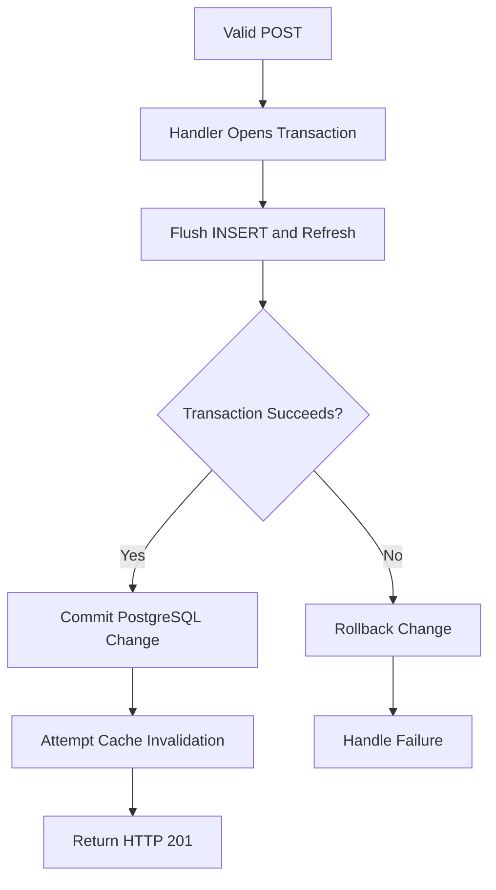

# Lab 02: PostgreSQL Persistence and Transaction Boundaries

## 1. Purpose and Learning Outcomes

You will find out when a database change becomes visible to other connections and what happens if a write fails. One connection will make a change while another reads the row. This makes the difference between flush and commit visible. You will also improve how the API reports a database connection failure, then check that normal work resumes after a short PostgreSQL outage.

> **Primary Objective:** Show when an item write is committed and becomes visible, what commit and rollback do, how SQLAlchemy sessions reuse database connections, and how the API behaves when its required database is unavailable.

Lab 1 followed a request through the handler and its dependencies. Now you will focus on PostgreSQL, the main store for item data. Having a UUID or an ORM object in Python does not prove a row was committed. Even sending SQL with a flush does not mean the transaction has finished successfully.

Use real PostgreSQL to test which changes other connections can see and whether data survives app replacement. Then make one small change to database error handling and add an isolated regression test, which checks that the same problem does not return after later code changes.

## 2. Starting Point and Lab Map

Open the complete application repository before using this guide. Unless a step says otherwise, run commands in Bash from the repository's top-level folder. Follow the starting checks in order because later commands depend on the helper functions and running services they prepare.

Read each explanation before running its commands. Run one complete code block, check the result, and then continue. In your notebook, save the commands, what happened, why you think it happened, and anything that differed from the expected result.

### Key Terms

| **Term**          | **Explanation**                                                                       |
| ----------------- | ------------------------------------------------------------------------------------- |
| Flush             | Send pending SQL changes to the database, while keeping the current transaction open. |
| Commit / Rollback | Commit keeps a transaction's changes; rollback cancels its uncommitted changes.       |
| Connection Pool   | A group of database connections that work can borrow, return, and reuse.              |

### Lab Map

The arrows show how the parts connect and where a request can take different paths. Use this map to understand the design. It is not a recording of a request that actually ran.


```mermaid
flowchart TD
    C["Valid POST"] --> A["Handler Opens Transaction"]
    A --> F["Flush INSERT and Refresh"]
    F --> X{"Transaction Succeeds?"}
    X -->|"Yes"| K["Commit PostgreSQL Change"]
    X -->|"No"| R["Rollback Change"]
    K --> I["Attempt Cache Invalidation"]
    I --> O["Return HTTP 201"]
    R --> E["Handle Failure"]
```

## 3. Guided Walkthrough

### Step 01. Inherited State from Lab 01

**What You Are Doing:** Continue with Lab 01's working services and saved checkpoint item. Keeping the same database lets you show that its data survives changes to the application container.

**Practical Walkthrough:** Check that Lab 01's helper, override, and checkpoint ID are still present. Continue using the same deployment and database. Do not create a new database to make the start look clean; the later replacement test needs a row that you know existed before the app changed.

Find the checkpoint files before sending requests and keep their existing values. The saved ID links this lab to earlier data. Check that the three-service baseline has recovered and works. A newly created row would not prove that an older item survived replacement of the app.

You should have:

- the app/postgres/redis baseline running;
- completed ownership and migration jobs;
- `lab-notes/compose.baseline.yaml` and `lab-notes/session.sh`;
- a checkpoint item ID in `lab-notes/checkpoint-item-id.txt`;
- tracing/profiling disabled and all observability backends stopped; and
- the Items API contract established in Lab 1.

Do not repeat Lab 1's CRUD tour or recreate the database. Preserve its checkpoint row.

**Understanding the Result:** Working baseline services and a readable checkpoint let you continue from Lab 01. If the checkpoint is missing, find out why before claiming that data survived between labs.

### Step 02. Scope and Explicit Exclusions

**What You Are Doing:** Focus on when application database work becomes committed data in PostgreSQL. The lab keeps other topics separate so you can explain each transaction experiment clearly.

**Practical Walkthrough:** For each experiment, ask when the write commits and how a failure reaches the client. Cache keys are cleared only when an old cached copy could confuse the database result. You do not need monitoring backends or performance tuning to answer these questions yet.

Name what each check observes. A read through another connection checks whether the change is visible. PostgreSQL's activity view checks connection state. An HTTP error checks what the client receives. Keep these separate: a successful cached read cannot prove that a new database transaction would work.

This lab covers stored PostgreSQL data, visibility from another transaction, flush, commit, rollback, session cleanup, connection reuse, ownership of schema changes, and failures of a required dependency.

Prometheus, exporters, query-plan tuning, heavy lock tests, replica failover, backup automation, and new migrations are outside this lab. You will remove individual cache keys only when direct database changes could leave an old copy behind. Lab 3 explains the full cache behavior.

**Understanding the Result:** Be able to say whether a result checks the schema, visibility of a transaction, reuse of a connection, or error handling. These are connected topics, but one check does not prove all of them.

### Step 03. Prerequisites and Clean Starting State

**What You Are Doing:** Check the database migration version and any existing source edits before changing code. Otherwise, a missing table or an earlier local edit could look like a problem caused by this lab.

**Practical Walkthrough:** Load the helpers, check readiness, and inspect the applied migration. Review the current code diff, or save a copy of the files you will edit. The later patch expects a particular piece of source code. If that text does not match, it should stop so you can review the difference.

Follow the checks in order: load the helpers, confirm readiness, retrieve the checkpoint, and inspect the migration. `dc run --rm migrate` runs a temporary migration-command container and removes that container afterward. It does not reset the database volume. Review existing source changes so you can distinguish your new edit from earlier work.

```bash
source lab-notes/session.sh
baseline_check
mkdir -p lab-notes/lab-02
CHECKPOINT_ID=$(cat lab-notes/checkpoint-item-id.txt)
api -fsS "$APP_URL/api/v1/items/$CHECKPOINT_ID" | jq '{id,name,price}'
dc run --rm migrate alembic current
```

Expect `0001 (head)`, or similar output showing that revision `0001` is the latest applied revision. Setup messages may appear before the Alembic result.

Check code changes before editing:

```bash
git status --short
git diff -- app/app/database.py app/tests/test_api.py
```

If Git is not available, save a private copy of the two files in `lab-notes/lab-02/` and review it. Do not restore files blindly over earlier edits. The later patch changes only a known function fragment and stops if that fragment is different.

**Understanding the Result:** The expected migration head confirms the schema version used by this lab. If the revision or source differs, understand the difference first. Do not force the patch just to continue.

### Step 04. Measurable Learning Objectives

**What You Are Doing:** Explain each result using two details: the transaction's state and which connection observed it. Completing the commands is only part of the exercise.

**Practical Walkthrough:** Write claims that another person could check. “I called flush” describes an action. “After flush, another connection still saw the old value” explains its effect. Record both the action and the independent observation so the transaction behavior is clear.

Before each experiment, predict a result and choose how to check it. For flush, use a separate reader. For a connection failure, inspect the safe HTTP error response. Compare the actual output with your prediction. If a check answers only part of a question, write down what it did not test.

You must demonstrate:

- item storage belongs to PostgreSQL, not the application container;
- bootstrap SQL and Alembic have separate responsibilities;
- flush can issue SQL before the transaction commits;
- a separate transaction cannot read an ordinary uncommitted row change;
- rollback removes uncommitted changes and leaves the connection reusable;
- a database constraint still rejects invalid stored data when a caller bypasses the API;
- a session object and the database connection it borrows can exist for different lengths of time;
- sequential sessions can reuse one backend connection;
- a refused database connection is handled at the database-operation boundary and returned as a safe 503;
- an unavailable database can coexist with a live FastAPI process; and
- recovery includes a real write/read, not just a running container.

**Understanding the Result:** For each objective, record who observed the result and what was tested. One successful HTTP request cannot establish every property of the database.

### Step 05. Transaction Architecture

**What You Are Doing:** Find the commit point in the map. Database work before that point can still be rolled back. Work done afterward in Redis belongs to a different system and transaction.

**Practical Walkthrough:** Follow the transaction from its start to its successful exit. The handler can send SQL and refresh item fields while the transaction is still open. Cache handling occurs later. Imagine an error at each point and ask whether another connection could already see the database change.

Mark the first SQL statement, successful transaction exit, and cache invalidation. For each point, say what another connection can see. This matters when a request fails: an error before commit may leave no new data, while an error afterward may happen even though the write is already stored.

The lab map in Section 2 shows this relationship.

When the managed transaction fails, it rolls back. Redis is outside that PostgreSQL transaction. If a later step fails after commit, the caller may be unsure whether the write succeeded even though it was committed. HTTP cannot make PostgreSQL and Redis succeed or fail together as one atomic operation.

**Understanding the Result:** Rollback cancels work that has not committed. It does not reverse an earlier commit simply because cache handling or response delivery later fails.

### Step 06. Locate the Persistence Boundaries

**What You Are Doing:** Locate the engine, session factory, per-request session, and transaction blocks. This shows how a short request uses a connection pool that lives longer than the request itself.

**Practical Walkthrough:** The engine and session factory are shared within the process. Each request gets a short-lived session to organize its database work. When SQL needs a connection, the pool provides one. Read how the session closes too, because connections must be returned after both successful and failed requests.

Read the engine setup, dependency cleanup, and handler transaction together. Find the first awaited database operation: that is where a connection is needed. A new request session may borrow an existing pooled connection, so do not describe every new session as a new network connection.

```bash
sed -n '1,220p' app/app/database.py
sed -n '1,150p' app/app/api.py
cat app/app/models.py
cat app/migrations/versions/0001_create_items.py
```

Identify:

- one engine and session factory per application process;
- `async with ... sessions()` in the per-request dependency;
- `session.begin()` around writes;
- `flush()` and `refresh()` before that context exits;
- `expire_on_commit=False` for already loaded response fields;
- rollback when a failure leaves the transaction block;
- closing pooled connections when the application shuts down.

Give each unit of work its own session. Do not share one changeable AsyncSession between tasks handling concurrent requests. The engine and pool are designed to be shared; the session tracks the work of its own task.

**Understanding the Result:** Creating a session object does not prove that any SQL ran. Look for the actual awaited database call to explain when the session needed a connection.

### Step 07. Establish Schema Authority

**What You Are Doing:** Identify who creates each part of the database setup. First-time initialization prepares the role and database. Alembic manages versioned changes to application tables and indexes.

**Practical Walkthrough:** Inspect the real table, constraints, indexes, and migration revision. A Python model alone does not prove the running database has that schema. Initialization runs when the database volume is empty; Alembic manages the application schema through recorded migrations.

Compare the migration with the live table, including its checks and indexes. Python validation protects requests passing through the API. Database constraints also protect writes from other callers. If the live schema and migration history disagree, resolve that first so the transaction experiment is testing the intended setup.

```bash
cat postgres/init.sql
cat app/alembic.ini
dbsql <<'SQL'
SELECT version_num FROM alembic_version;
SELECT column_name, data_type, is_nullable
FROM information_schema.columns
WHERE table_schema = 'public' AND table_name = 'items'
ORDER BY ordinal_position;
SELECT indexname, indexdef FROM pg_indexes WHERE tablename = 'items';
SELECT conname, pg_get_constraintdef(oid)
FROM pg_constraint WHERE conrelid = 'items'::regclass;
SQL
```

Expect a UUID ID, a name with a length limit, a numeric price, an active flag, and timestamps. Expect indexes for the primary key, name, and creation time. The database's price check limits which amounts can be stored.

`init.sql` creates the role, database, and permissions when PostgreSQL first initializes an empty volume. Alembic creates and manages the application table and indexes. Do not add another `CREATE TABLE items` to the initialization SQL; that would give two mechanisms responsibility for the same table.

**Understanding the Result:** A missing or incompatible table is a schema problem. Restarting the app or editing first-time initialization SQL does not apply a migration to an existing database.

### Step 08. Create a Dedicated Transaction Subject

**What You Are Doing:** Create a temporary row for this lab and remove only its cache key. This prevents an old Redis copy from hiding the database values you are testing.

**Practical Walkthrough:** Create a fresh item with a recognizable starting value and save its ID. Before changing it directly through SQL, remove only its Redis key. An API read could otherwise return an older cached copy, making correct database behavior look wrong.

Keep this item's ID separate from `CHECKPOINT_ID`. Its saved JSON records the original name and price, which the diagnostic program later restores. Removing the exact key affects only this item's cached copy. Check that you built the key from the new ID, especially if your terminal still has variables from Lab 01.

```bash
api -fsS -H 'Content-Type: application/json' \
  -d '{"name":"Lab 02 Original","description":"dedicated transaction subject","price":"25.00","is_active":true}' \
  "$APP_URL/api/v1/items" -o lab-notes/lab-02/item.json
ITEM_ID=$(jq -er '.id' lab-notes/lab-02/item.json)
printf '%s\n' "$ITEM_ID" > lab-notes/lab-02/item-id.txt
KEY=$(cache_key "$ITEM_ID")
rcli DEL "$KEY"
```

Delete only this temporary item's key so it cannot hide the direct SQL results. There is no need to flush the entire Redis database for one experiment.

**Understanding the Result:** You have one known database row for the experiments. Use its temporary UUID throughout this lab and keep the course checkpoint unchanged.

### Step 09. Predict Visibility Before Running the Experiment

**What You Are Doing:** Predict what the separate reader sees before and after commit. Base your answer on committed database data, not only on values held by the writer's Python objects.

**Practical Walkthrough:** Fill in the table before running the program. The writer can see its own flushed change while another reader still sees the previously committed value. Consider two endings: the transaction commits successfully, or an exception causes it to roll back.

For each row, identify the connection doing the reading and whether commit has happened. After flush, compare the writer's view with the independent reader's view. After rollback, expect the last committed value to remain. A failed update does not automatically delete the row that existed before it.

Write your expected item name at each boundary:

| **Boundary**                                 | **Writer Session**           | **Independent Reader** |
| -------------------------------------------- | ---------------------------- | ---------------------- |
| Before change                                | Original                     | Original               |
| Changed and flushed, not committed           | Proposed value               | Your prediction        |
| Successful commit                            | Committed value              | Your prediction        |
| Another flushed change followed by exception | Proposed value then rollback | Your prediction        |

The experiment uses PostgreSQL's normal `READ COMMITTED` behavior. While the writer's transaction is open, the reader uses another session and connection. The reader does not ask for a row lock, so it can read the previous committed version instead of waiting for the writer's uncommitted replacement.

**Understanding the Result:** This tests what two separate transactions can see. Reading again through the writer's own session would not answer the same question.

### Step 10. Prove Flush, Commit, Rollback and Constraint Protection

**What You Are Doing:** Run a program that checks the important transaction stages with an independent reader. Its cleanup restores the original value so the test item remains usable afterward.

**Practical Walkthrough:** Run the whole program inside the app image, where the repository's database code and dependencies are installed. Follow its phases: change and flush, read independently, commit, try a change that fails, and test a database constraint. The cleanup then restores the original name.

`-T` lets the heredoc pass the program to Python through standard input without an interactive terminal. The environment variable supplies only the test item's ID. Compare each phase with your predictions. If a phase fails unexpectedly, save its output and check the final SQL values before rerunning it.

Run this complete diagnostic program inside the app image:

```bash
dc exec -T -e LAB_ITEM_ID="$ITEM_ID" app python - <<'PYTHON' | tee lab-notes/lab-02/transactions.txt
import asyncio
import os
from uuid import UUID
from sqlalchemy import select, update
from sqlalchemy.exc import IntegrityError
from app.config import Settings
from app.database import Database
from app.metrics import Metrics
from app.models import Item

async def main():
    item_id = UUID(os.environ["LAB_ITEM_ID"])
    settings = Settings()
    assert settings.db_pool_size + settings.db_max_overflow >= 2, "This experiment needs two concurrent DB connections"
    database = Database(settings, Metrics())
    original = None

    async def read_name():
        async with database.sessions() as reader:
            return await reader.scalar(select(Item.name).where(Item.id == item_id))

    try:
        original = await read_name()
        assert original is not None, "create the dedicated item first"
        async with database.sessions() as writer:
            async with writer.begin():
                item = await writer.get(Item, item_id)
                item.name = "Lab 02 Committed"
                await writer.flush()
                outside = await read_name()
                print("AFTER_FLUSH writer=", item.name, "outside=", outside)
                assert outside == original
        assert await read_name() == "Lab 02 Committed"
        print("AFTER_COMMIT outside= Lab 02 Committed")

        try:
            async with database.sessions() as writer:
                async with writer.begin():
                    item = await writer.get(Item, item_id)
                    item.name = "Lab 02 must roll back"
                    await writer.flush()
                    raise RuntimeError("controlled rollback")
        except RuntimeError:
            pass
        assert await read_name() == "Lab 02 Committed"
        print("AFTER_ROLLBACK outside= Lab 02 Committed")

        try:
            async with database.sessions() as writer:
                async with writer.begin():
                    await writer.execute(
                        update(Item).where(Item.id == item_id).values(price=-1)
                    )
        except IntegrityError:
            print("CONSTRAINT rejected negative price")
        else:
            raise AssertionError("Expected the database price constraint")

        async with database.sessions() as reader:
            price = await reader.scalar(select(Item.price).where(Item.id == item_id))
            assert price >= 0
            print("AFTER_CONSTRAINT_ROLLBACK price=", price)
    finally:
        try:
            if original is not None:
                async with database.sessions.begin() as writer:
                    await writer.execute(
                        update(Item).where(Item.id == item_id).values(name=original)
                    )
        finally:
            await database.close()

asyncio.run(main())
PYTHON
```

**Command Note:** `exec -T` runs the program in the existing container without opening an interactive terminal. The heredoc feeds the program to standard input, and Python uses the dependencies already installed in the image.

**Expected Observations:**

```text
AFTER_FLUSH writer= Lab 02 Committed Outside= Lab 02 Original
AFTER_COMMIT outside= Lab 02 Committed
AFTER_ROLLBACK outside= Lab 02 Committed
CONSTRAINT rejected negative price
AFTER_CONSTRAINT_ROLLBACK price= 25.00
```

The `finally` block restores the original name. This script creates its own short-lived engine using the same Database class; it does **not** use the running Uvicorn worker's session factory. Both processes connect to the real PostgreSQL service. The separate writer and reader need at least two pooled connections at once, which the default settings allow.

**Understanding the Result:** The output demonstrates transaction behavior against real PostgreSQL from a separate diagnostic process. It does not inspect the web worker's own session objects or pool state.

### Step 11. Explain What the Program Proves

**What You Are Doing:** Explain the results one at a time. Flush sends changes, commit makes the successful change visible to other readers, and rollback cancels the failed change. The constraint test shows protection inside the database as well as at the API.

**Practical Walkthrough:** Match each observation with the preceding operation. Did the transaction finish normally or exit because of an error? The invalid-price test goes directly to PostgreSQL, bypassing HTTP validation. That lets you see whether the database itself rejects an invalid value.

Use the phase names to reconstruct the sequence and identify the last committed value before each failure. Catching an exception is not the same as completing rollback. Check the later independent read to confirm that the correct committed value is still available after the error.

Flush sent the writer's change to PostgreSQL, but the separate reader still saw the old value. When `writer.begin()` exited successfully, the next reader saw the committed change. Raising an error before the next transaction exited caused that second proposed change to roll back.

The invalid price skipped Pydantic validation but was still rejected by a database constraint. The code catches `IntegrityError` outside the transaction block, allowing the block to finish rollback before another read runs.

After a database error, do not keep sending unrelated SQL inside the failed transaction. Roll it back, or leave the managed transaction block so cleanup can happen first. [SQLAlchemy explains the session's transaction framing](https://docs.sqlalchemy.org/en/20/orm/session_basics.html#framing-out-a-begin-commit-rollback-block).

This experiment tests the stated transaction behavior only. Other isolation levels, deadlocks, and competing writes need their own experiments with clearly defined workloads.

**Understanding the Result:** A failed transaction must be rolled back before later work can safely continue. An error message proves a statement failed; later checks are needed to prove the transaction was cleaned up properly.

### Step 12. Verify the Restored Source of Truth

**What You Are Doing:** Check that the program restored the database row, then read it through the API. Remove the exact cache key first so the API cannot return an older copy.

**Practical Walkthrough:** Query the temporary item directly after the program finishes. Compare it with the original values, clear its key, and send GET. This checks both the program's cleanup and the normal API path. Use the saved UUID so a different row cannot satisfy the check by mistake.

Compare SQL with the original saved JSON first. Then clear the exact key and check HTTP. If SQL is right but HTTP differs, investigate the read and cache path. If SQL is wrong, investigate the program's restoration. These observations point to different causes.

```bash
dbsql -v item_id="$ITEM_ID" <<'SQL'
SELECT name, price FROM items WHERE id = :'item_id'::uuid;
SQL
rcli DEL "$KEY"
api -fsS "$APP_URL/api/v1/items/$ITEM_ID" | jq '{name,price}'
```

**Expected Result:** both SQL and HTTP show `Lab 02 Original` and `25.00`. Because the program wrote directly to the database, remove the cache key explicitly so an old copy does not confuse the comparison.

**Understanding the Result:** Both paths should return the original values. If they disagree, first determine whether restoration failed or the API returned an old cached copy.

### Step 13. Distinguish Session Lifetime from Connection Lifetime

**What You Are Doing:** Open several sessions one after another and ask PostgreSQL which connection each one uses. The same backend PID appearing again shows how new sessions can reuse an existing connection.

**Practical Walkthrough:** Each connection to PostgreSQL has a server-side process ID, or backend PID. The program opens a session, asks for that PID, and closes the session. The connection can return to the pool and be borrowed by the next session. Compare the IDs to observe that reuse.

Compare the printed PostgreSQL PIDs, not the identities of Python session objects. A repeated PID shows that the diagnostic pool reused a connection after a session released it. Label the result as belonging to this script's engine; it is not an inventory of the running web app's connections.

An AsyncSession is a Python object that manages a unit of work. A database connection is the network connection associated with a PostgreSQL backend PID. A completed session can return its connection to the pool, where a later session may borrow it.

Prediction: five sessions opened one after another will normally reuse one backend PID rather than open five different connections. Run:

```bash
dc exec -T app python - <<'PYTHON' | tee lab-notes/lab-02/pool-reuse.txt
import asyncio
from sqlalchemy import text
from app.config import Settings
from app.database import Database
from app.metrics import Metrics

async def main():
    database = Database(Settings(), Metrics())
    pids = []
    try:
        for number in range(1, 6):
            async with database.sessions() as session:
                pid = await session.scalar(text("SELECT pg_backend_pid()"))
                pids.append(pid)
                print(f"session={number} backend_pid={pid}")
        print("unique_backend_pids=", len(set(pids)))
        assert len(set(pids)) == 1, "Investigate restarts/reconnections before concluding no reuse"
    finally:
        await database.close()

asyncio.run(main())
PYTHON
```

This demonstrates reuse by the diagnostic process's pool. It does not measure every HTTP request or show that the application always uses only one connection, especially when requests run concurrently.

**Understanding the Result:** Repeated PIDs support connection reuse in this test. Concurrent requests can need more connections, so keep that limit clear in your explanation.

### Step 14. Inspect the Running Application's Database Sessions

**What You Are Doing:** Now inspect connections made by the running application. Its process and pool are separate from the diagnostic script, so record this as a new observation.

**Practical Walkthrough:** Send list requests, which need PostgreSQL, then inspect its activity view. Identify the app's connections. Readiness probes and your administrator query also use connections, so the count can vary. An idle connection may simply be waiting in the pool for reuse.

The request loop creates database work before you inspect activity. Read each group by application identity and state. `idle` can mean a connection is ready to be reused. An idle connection that still has an open transaction is different and may hold resources. Identify which state your output actually shows.

Generate uncached list work, then inspect PostgreSQL:

```bash
for request in 1 2 3 4 5; do
  api -fsS "$APP_URL/api/v1/items?limit=1" >/dev/null
done
dbsql <<'SQL'
SELECT application_name, state, wait_event_type, count(*)
FROM pg_stat_activity
WHERE datname = current_database()
GROUP BY 1, 2, 3
ORDER BY 1, 2;
SQL
```

Look for the app's configured service name. Readiness probes may also borrow connections, so the number can change between checks. Your administrator `psql` connection appears in the view too.

A pooled connection marked `idle` may be normal. If `idle in transaction` remains after requests finish, investigate: the open transaction may still hold resources or locks.

By default, each worker can use five regular pooled connections and five extra overflow connections. These are limits, not a promise that ten connections open immediately. Adding workers increases the possible total demand on PostgreSQL.

**Understanding the Result:** Idle pooled connections can be waiting normally for new work. A connection left idle with an open transaction needs a different investigation because it may still hold database resources.

### Step 15. Review the Connection-Failure Boundary

**What You Are Doing:** Follow a failed database connection through the code to the HTTP response. You will fix one specific case where a low-level connection error can escape the existing database-error handling.

**Practical Walkthrough:** Start with the exception raised by the database client and follow it to the app's shared error handler. Some connection failures use a different exception type from ordinary SQLAlchemy errors. The change below translates that specific type so the client receives the existing safe database-unavailable response.

Find the awaited database call, the dependency cleanup, and the central error handler. Identify which low-level exception the patch handles. Keep database unavailability separate from unrelated code errors; otherwise a programming bug could be reported misleadingly as a database outage.

Read `Database.operation` and the database error handler in `main.py`.

SQLAlchemy errors and timeouts already produce a safe 503. However, a failed network connection may raise an `OSError` subclass, such as `ConnectionRefusedError`. If the database-operation code does not translate it, the general error middleware may return a safe 500 instead. That response gives the client less useful information about the cause.

This change handles that specific connection-failure case. It does not label every error in the application as a database failure. Programming errors must remain distinguishable.

**Understanding the Result:** The goal is to report database connection failures consistently. It is not to convert every operating-system or programming error into a database outage.

### Step 16. Implement the Narrow Error Translation

**What You Are Doing:** Apply the small change inside the database-operation code. The patch first checks for the expected source text so it will not silently edit an unfamiliar version of the file.

**Practical Walkthrough:** Read the old fragment that the patch expects. Run it only after reviewing the source. Then inspect the changed exception handling. It should reuse the central safe response instead of returning raw driver messages to the client.

Run the patch once and review the changed lines. A successful script exit is not a substitute for reading the diff. If the expected text is absent, compare the current code with the intended behavior. The change may already exist, or the file may need a different carefully reviewed edit.

Use this guarded edit once:

```bash
python3 - <<'PYTHON'
from pathlib import Path
path = Path("app/app/database.py")
source = path.read_text()
old = '''        except (SQLAlchemyError, TimeoutError):
            self.metrics.dependency_up.labels("postgres").set(0)
            raise
        finally:
'''
new = '''        except (SQLAlchemyError, TimeoutError):
            self.metrics.dependency_up.labels("postgres").set(0)
            raise
        except OSError as error:
            self.metrics.dependency_up.labels("postgres").set(0)
            raise SQLAlchemyError("Persistence connection unavailable") from error
        finally:
'''
if new in source:
    print("Translation already present; no duplicate edit")
elif source.count(old) == 1:
    path.write_text(source.replace(old, new, 1))
    print("Added database-scoped connection error translation")
else:
    raise SystemExit("Expected source boundary not found; review Database.operation manually")
PYTHON
```

The handler in `main.py` already catches `SQLAlchemyError`, records safe exception-frame information, and returns `database_unavailable`. Translating the connection error lets it use that same path without exposing the driver's private error message.

`Database.check()` already handles connection-level `OSError` when checking readiness, so that method does not need this change.

**Understanding the Result:** If the source fragment does not match, stop and review it. Removing the guard would allow an edit without confirming that it targets the right code.

### Step 17. Add a Regression Test That Exercises Route Wiring

**What You Are Doing:** Add a regression test that sends a real route request but deliberately makes its database operation fail. Check that the new handling returns the existing safe error response.

**Practical Walkthrough:** The test injects a connection failure at the point where a route awaits database work. A fresh UUID prevents a cached item from bypassing that work. This tests the route, database-operation handling, and central error response together, rather than testing only the exception wrapper by itself.

Read the setup, injected failure, request, and assertions in order. Make sure the request must reach the database. Check both the returned status and the absence of private driver text. Together, these assertions check that the client receives the right error category without sensitive details.

Append this test only if it is not already present:

```bash
if ! rg -q '^async def test_connection_refusal_returns_503' app/tests/test_api.py; then
  cat >> app/tests/test_api.py <<'PYTHON'


async def test_connection_refusal_returns_503(client, app, monkeypatch):
    from unittest.mock import AsyncMock

    monkeypatch.setattr(
        app.state.database.sessions.class_,
        "get",
        AsyncMock(side_effect=ConnectionRefusedError("private-driver-detail")),
    )
    response = await client.get(f"/api/v1/items/{uuid4()}")
    assert response.status_code == 503
    assert response.json()["error"]["code"] == "database_unavailable"
    assert "private-driver-detail" not in response.text
PYTHON
fi
```

**Command Note:** `<<'PYTHON'` writes the following lines literally until the closing `PYTHON` marker. The quotes stop Bash from expanding `$variables`. Writing the file and later running its contents are separate actions.

The test module already imports `uuid4`. Its fresh UUID leads to a cache miss and then database work. The failure is injected at the awaited session call, so the test covers the route, database-operation handling, and shared error handler together.

This test does not create a real refused TCP connection. It supplies the exception in a controlled way. The live outage later tests the deployed network and service path.

**Understanding the Result:** The injected failure makes the code test repeatable. The later stopped-database experiment checks how the same handling works with an actual unavailable service.

### Step 18. Validate, Review and Rebuild Only the App

**What You Are Doing:** Check the code, review the diff, and rebuild the app. The running container must contain your edit before a live outage can test it.

**Practical Walkthrough:** Run the syntax, test, and lint checks, then inspect the changes. The image contains a copy of the Python source, so editing a host file does not update the running app by itself. Rebuild only the app and keep PostgreSQL running with the same volume.

Treat each check separately. Compilation checks syntax, tests check behavior, lint checks repository rules, and the diff shows exactly what changed. Fix failures before rebuilding. `--no-deps` limits the operation to the app. Begin the outage only after the rebuilt app passes its starting checks.

```bash
python3 -m py_compile app/app/database.py app/tests/test_api.py
git diff --check
git diff -- app/app/database.py app/tests/test_api.py
make test
make lint
dc up -d --build --no-deps app
baseline_check
```

The suite should include the added regression test. Fix any syntax or test failure before attempting another rebuild.

The image contains the application source. Restarting the old container cannot load a newly edited Python file from the host. Rebuilding the app does not migrate or delete PostgreSQL data.

**Understanding the Result:** Confirm that the rebuilt app works before stopping PostgreSQL. If the running image still contains old code, its response does not test your new patch.

### Step 19. Prove Item Persistence Across App Replacement

**What You Are Doing:** Read the same item after replacing the app. This checks whether the row survives independently of the old app process and its memory.

**Practical Walkthrough:** Retrieve the original temporary item through the new app and also query PostgreSQL directly. You changed the component handling HTTP requests while preserving the component storing the data. The saved UUID lets you prove that it is the same row from before replacement.

Use the pre-replacement ID and compare the fields with the original fixture. The independent SQL count should find exactly that row. Record that only the app changed while the database volume remained. Your persistence conclusion applies to those tested conditions.

```bash
api -fsS "$APP_URL/api/v1/items/$ITEM_ID" | jq '{id,name,price}'
dbsql -v item_id="$ITEM_ID" <<'SQL'
SELECT count(*) FROM items WHERE id = :'item_id'::uuid;
SQL
```

**Expected Result:** you receive the same item, and the direct SQL count is one. The row remained after the app process was replaced.

This shows that stored database data is separate from the app's memory. Lab 5 checks container and volume identities more explicitly.

**Understanding the Result:** The row survived app replacement. This does not test losing the database volume or restoring from a backup.

### Step 20. Predict a Required-Database Outage

**What You Are Doing:** Choose requests that must use PostgreSQL during the outage. A cached GET might succeed without contacting the failed database and would not test the intended path.

**Practical Walkthrough:** Use list and create requests because both require PostgreSQL. Predict liveness, readiness, business responses, and retained data separately. A warm individual GET may still work from Redis, so it cannot by itself prove that database writes or uncached reads work.

For each check, ask whether it must contact PostgreSQL. Liveness checks that the process can answer. Readiness checks whether required dependencies meet the policy. List and create need actual database work. Also predict that stopping PostgreSQL leaves committed rows on its volume; check those again after recovery.

For this controlled drill, use **list and create**, which always need PostgreSQL. Do not use a possibly cached item GET as the primary test.

Write predictions:

| **Operation**               | **Prediction and Reason**                       |
| --------------------------- | ----------------------------------------------- |
| Liveness                    | Can the process respond without the database?   |
| List items                  | Does the handler have a cache branch?           |
| Create item                 | Can a committed write occur without PostgreSQL? |
| Readiness                   | Which dependency is required?                   |
| Existing row after recovery | Does stopping the process delete the volume?    |

Lab 4 explores liveness and readiness in detail. Here, their responses help you identify the effect of losing the database.

**Understanding the Result:** The process can still be alive while readiness fails and database-dependent requests return errors. These checks answer different questions, so the results can all be correct.

### Step 21. Run a Bounded Database Failure Exercise

**What You Are Doing:** Briefly stop PostgreSQL, capture the app's responses, and restore the database. Copy the entire block so the fault and the recovery trap stay together.

**Practical Walkthrough:** Read the complete subshell before running it, especially the trap that starts PostgreSQL on exit. The block stops the database and sends only a few requests. It saves expected error bodies so you can distinguish an HTTP database-unavailable response from a request that received no HTTP response at all.

Keep the subshell and its trap in one block. The trap attempts to restart PostgreSQL even if the shell exits early, but restarting is not proof of readiness. An app response with HTTP `503` differs from a curl connection error. Inspect the saved responses, then check readiness after the block finishes.

The subshell stops only PostgreSQL and restores it on normal shell exit, including exit after a command fails. It cannot guarantee cleanup after host loss or an uncatchable kill. Stay with the exercise until you have checked recovery.

```bash
(
  set -euo pipefail
  trap 'dc start postgres >/dev/null' EXIT
  trap 'exit 130' INT
  trap 'exit 143' TERM
  date -u +'%Y-%m-%dT%H:%M:%SZ' > lab-notes/lab-02/outage-start.txt
  dc stop postgres
  api -fsS "$APP_URL/health/live" | tee lab-notes/lab-02/down-live.json

  list_status=$(api -sS -o lab-notes/lab-02/down-list.json -w '%{http_code}' \
    "$APP_URL/api/v1/items?limit=1")
  create_status=$(api -sS -o lab-notes/lab-02/down-create.json -w '%{http_code}' \
    -H 'Content-Type: application/json' \
    -d '{"name":"Lab 02 rejected during outage","price":"1.00"}' \
    "$APP_URL/api/v1/items")
  printf 'list=%s create=%s\n' "$list_status" "$create_status" \
    | tee lab-notes/lab-02/outage-status.txt
  test "$list_status" = 503
  test "$create_status" = 503
  jq '.error | {code,message}' lab-notes/lab-02/down-create.json
)
wait_ready
```

**Command Note:** `trap ... EXIT` schedules cleanup when that shell exits. Keep it with the fault commands. The checks after the block confirm whether the attempted recovery actually restored service.

**Expected Result:** liveness returns 200; list and create return 503 with safe `database_unavailable` errors. Curl leaves out `--fail` for these expected errors so their response bodies can still be saved and inspected.

Here, the database is stopped before the write request. A timeout or connection reset after sending a real write is different: the write might already have committed. Check the outcome before retrying a POST that could create another item.

**Understanding the Result:** The expected 503 confirms the tested failure response. Check that PostgreSQL was restarted and readiness recovered; the presence of a trap is not proof that cleanup succeeded.

### Step 22. Prove Recovery with a Fresh Committed Write

**What You Are Doing:** After recovery, create a fresh item and read its row through another connection. This tests useful application work, not just whether PostgreSQL accepts connections again.

**Practical Walkthrough:** Create a new item and confirm it with direct SQL. Also check that the earlier item is still present. The new row proves the app can borrow a usable connection and commit after the outage; the old row proves earlier committed data remained.

Wait for the dependency to recover before creating the recovery item. Use the new response's UUID in SQL, then check the earlier fixture separately. If a check fails, keep the HTTP and SQL evidence before retrying writes. Repeated POST requests can create more temporary items.

```bash
api -fsS -H 'Content-Type: application/json' \
  -d '{"name":"Lab 02 Recovery Proof","price":"2.00"}' \
  "$APP_URL/api/v1/items" -o lab-notes/lab-02/recovery.json
RECOVERY_ID=$(jq -er '.id' lab-notes/lab-02/recovery.json)
dbsql -v item_id="$RECOVERY_ID" <<'SQL'
SELECT id, name, price FROM items WHERE id = :'item_id'::uuid;
SQL
api -fsS "$APP_URL/api/v1/items?limit=1" >/dev/null
api -fsS "$APP_URL/api/v1/items/$ITEM_ID" | jq '{id,name,price}'
```

You have checked a new committed write, visibility through another connection, and the survival of an earlier item. `pg_isready` alone only checks an initial connection-readiness condition; it does not prove those application outcomes.

**Understanding the Result:** A responding database is a first sign of recovery. A successful new commit and independent read show that the application's required work is functioning again.

### Step 23. Review Transaction and Failure Boundaries

**What You Are Doing:** Match each failure with its position before or after commit. The correct response to a failed transaction can differ from the response to a lost HTTP reply after a successful commit.

**Practical Walkthrough:** Work through the table by asking when the failure occurs. Rejected input, rollback during a transaction, and a lost response after commit leave different database states. In the last case, the client may be unsure even though the row is already stored, which makes a blind retry risky.

Ask two questions for each case: did the transaction commit, and what did the client receive? A failed response does not always mean rollback. When the result is unclear, use the operation's rules and saved evidence to decide whether retrying could repeat an already completed write.

Complete this matrix:

| **Event**                                      | **Persistent Effect**                | **Expected HTTP Consequence**                       |
| ---------------------------------------------- | ------------------------------------ | --------------------------------------------------- |
| Input rejected before handler                  | No application write                 | 422                                                 |
| Valid request and successful commit            | Row persists                         | 201 for create                                      |
| Exception before commit                        | The managed transaction rolls back   | Safe failure response                               |
| Database unavailable before request            | No new commit                        | 503                                                 |
| Process fails after commit but before response | The change may already be committed  | The client may not know whether the write succeeded |
| Redis invalidation fails after commit          | The PostgreSQL write stays committed | Cache handling degrades on a best-effort basis      |

Reporting an error correctly does not guarantee exactly-once processing. POST has no idempotency key to recognize a repeated request, and this API has no coordinator that combines PostgreSQL and Redis into one distributed transaction.

**Understanding the Result:** Explain the database state and the client response separately. A failure between commit and response delivery can prevent the client from knowing what was stored.

### Step 24. Focused Test Review

**What You Are Doing:** Read the final assertions in the regression tests. Compare their deliberately injected failures with the real PostgreSQL experiments so you know what each kind of evidence covers.

**Practical Walkthrough:** Open the focused tests and find the checks that no row or cache entry remains after a failed commit. These tests use an isolated database and fake cache. Compare that with the live PostgreSQL test: each controls different conditions and leaves other behavior untested.

Read each named test's failure setup and final row/cache checks. Then compare it with the live outage. An injected failure is precise and repeatable; stopping PostgreSQL checks the actual deployed service path. Include both scopes when explaining your results.

```bash
rg -n 'test_failed_commit_rolls_back|test_database_error_sanitized|test_connection_refusal_returns_503' \
  app/tests/test_api.py
```

The failed-commit test injects a failure before commit, then checks that no item was stored and no cache entry appeared. This checks the outcome. Simply calling `rollback()` and seeing it return would not prove the resulting row and cache state.

The tests use SQLite and fake Redis, while the visibility experiment uses real PostgreSQL. Keep both results because neither one covers everything the other does.

**Understanding the Result:** A useful test verifies the final behavior and state, not just that a cleanup function ran. Save the test results and the live observations in your notebook.

## 4. Troubleshooting and Diagnosis

Begin with the first result that differed from your prediction. Save the exact error or symptom and identify which service or command produced it. Use the checks below, make the needed fix, and repeat the original check to confirm the problem is resolved.

### Troubleshooting Runbook

#### A. `relation "items" does not exist`

```bash
dc logs --tail=100 migrate
dc run --rm migrate alembic current
dc run --rm migrate alembic upgrade head
```

Do not add `create_all()` to app startup to work around this error. Alembic should remain responsible for creating and changing the application schema.

#### B. Admin SQL Works but the App Returns 503

Check the app's database path, role credentials, and Docker DNS. Changing a password in `.env` does not change the password of an existing PostgreSQL role. Fix the credential mismatch without deleting the database data.

#### C. A Connection Refusal Still Returns 500

```bash
rg -n 'except OSError|Persistence connection unavailable' app/app/database.py
dc exec -T app python -c 'import inspect; from app.database import Database; print(inspect.getsource(Database.operation))'
```

Compare the host source with the code inside the running container. Rebuild using `dc up -d --build --no-deps app`. If the error occurs outside a database operation, investigate that actual cause instead of calling every error a persistence failure.

#### D. The Outside Reader Saw the Proposed Uncommitted Value

Make sure the reader uses its own session, not the writer's session or an ORM object already held in memory. Also check the order: a read moved after transaction exit will see committed data and no longer test uncommitted visibility.

#### E. A Connection Reports an Aborted Transaction

Roll back before sending more SQL, or use the managed transaction block shown in the lab. Catching an exception alone does not undo or clear a failed transaction.

#### F. The Pool Experiment Reports Multiple PIDs

Check whether PostgreSQL restarted, connections were closed, work ran concurrently, or pool settings changed. This script opens sessions sequentially in its own pool. It does not promise a single PID for concurrent HTTP requests.

#### G. A GET Works While the Database Is Stopped

The GET may have used Redis. Use the uncached list route or a write to test whether PostgreSQL is usable. Lab 3 examines how caching can hide a database failure from one read.

#### H. Recovery Deadline Expires

```bash
dc ps -a postgres app
dc logs --tail=100 postgres app
dc exec postgres pg_isready -h 127.0.0.1 -U postgres -d postgres
```

Check the database's storage, credentials, and recovery progress. Repeatedly restarting the app is not a substitute for finding why PostgreSQL has not recovered.

### Diagnostic Sequence

1. Decide whether the result is invalid input, a missing item, a database failure, or an unexpected code error.
2. Identify whether the request actually needed PostgreSQL.
3. Inspect migration revision and app-role connectivity separately from admin connectivity.
4. Check transaction state, connection limits and database process state.
5. Locate the exception boundary and inspect sanitized logs.
6. Recover the database or code issue, then repeat the original user operation.
7. Check the committed row independently and look for duplicate writes if an earlier request's outcome was unclear.

## 5. Review and Practice

Answer the questions in your own words before reading the answers. For the scenario, say what you would inspect and exactly what each result would tell you.

### Knowledge Check

1. What is the difference between `flush()` and `commit()`?
2. Why did the independent reader see the original name before commit?
3. Why can an ORM object contain a changed name before other sessions see it?
4. What rolls back when the managed transaction exits with an exception?
5. Why keep a price constraint when Pydantic already rejects negative prices?
6. What is the difference between a session and a pooled connection?
7. Did the diagnostic reuse script inspect the running Uvicorn pool directly?
8. Why might several application connections remain idle?
9. Why translate `OSError` inside the database boundary rather than globally?
10. Does a timeout after POST prove the write never committed?
11. What owns application schema evolution?
12. What evidence demonstrates database recovery beyond `pg_isready`?

#### Answer Key

1. Flush sends pending SQL inside a transaction; commit completes that transaction.
2. The independent reader sees committed data, so it reads the previous version while the writer's change is uncommitted.
3. The session tracks changed Python objects before their values become visible to other database transactions.
4. Only the uncommitted work in that transaction rolls back. Earlier committed transactions remain unchanged.
5. Other callers can write directly to PostgreSQL, so the database must enforce important rules even when the API is bypassed.
6. A session manages a unit of work in Python. A pooled connection is a database network connection that different sessions can reuse.
7. No. It created a separate diagnostic engine using the same database class and settings.
8. The pool keeps them ready for reuse. An idle connection is not automatically a leaked connection.
9. An `OSError` elsewhere could be a file, network, or programming problem unrelated to PostgreSQL.
10. No. The transaction may have committed before the response was lost.
11. Alembic, not bootstrap SQL or `create_all()` at startup.
12. Create a fresh item, confirm its committed row through a separate connection, and read it through the app.

### Professional Scenario Exercise

A client sends POST, times out, and retries. It later finds two records with different UUIDs. A teammate suggests adding more automatic retries to the database client.

Write a response explaining that a timeout can leave the write's outcome unclear and that this API has no rule for recognizing duplicate POST requests. Say what evidence you would inspect and why retries alone cannot guarantee that the business action happens exactly once. Do not add idempotency in this lab; record it as a future design decision.

## 6. Completion Checklist

Tick an item only when you can show its result or saved evidence. Finish the cleanup instructions before starting the next lab.

### Cleanup and Reviewed Checkpoint

**What You Are Doing:** Remove only this lab's temporary rows, keep the course checkpoint, and retain the reviewed code change. The next lab should start with the improved error handling and the existing database data.

Remove only your dedicated exercise rows; keep the original course checkpoint:

```bash
api -fsS -X DELETE "$APP_URL/api/v1/items/$ITEM_ID" -o /dev/null
api -fsS -X DELETE "$APP_URL/api/v1/items/$RECOVERY_ID" -o /dev/null
baseline_check
git diff --check
git diff --stat
```

On a rerun, cleanup may return 404 because the item is already gone. Confirm its absence. Do not recreate it just to make DELETE return a success status again.

If you use Git for this repository, explicitly commit the two reviewed code and test files. Do not include the secret `.env` file or stage all private evidence without reviewing it.

### Completion Criteria

- [ ] You identified Alembic as the single mechanism responsible for the item schema.
- [ ] Independent reader behavior differed before and after commit as predicted.
- [ ] An exception rolled back the flushed change.
- [ ] The database rejected a negative price independent of API validation.
- [ ] The original diagnostic item was restored after the experiment.
- [ ] Sequential diagnostic sessions reused a backend connection.
- [ ] You explained the diagnostic pool's limits and app connection observations.
- [ ] The connection-refusal regression test passes with a sanitized 503.
- [ ] The running image contains the reviewed change.
- [ ] Stopping PostgreSQL failed required requests while liveness remained available.
- [ ] PostgreSQL was restored and a fresh committed write was proven directly.
- [ ] Temporary rows were removed and the course checkpoint remains.

## 7. Production Context and Next Lab

### Production Implications

Make each transaction cover one complete unit of business work. Run migrations separately from ordinary requests, keep connection demand within limits, and enforce important data rules in PostgreSQL. Handle failures where their cause is clear so clients receive an accurate error category.

A database on one host can survive app replacement but not every possible failure. Disk loss, unsafe durability settings, missing backups, and uncertain retries need separate solutions. A pool reuses connections efficiently; it does not give PostgreSQL unlimited capacity.

### End State and Transition to Lab 03

```bash
baseline_check
api -fsS "$APP_URL/api/v1/items/$CHECKPOINT_ID" | jq '{id,name,price}'
```

Leave the connection-error hardening in place. Next: [Lab 03: Redis Cache-Aside and Graceful Degradation](Lab-03.md).

You can now tell a committed row from a proposed change. Lab 3 follows the cached copy: when reads hit or miss it, when it expires, how writes invalidate it, and how old values or cache failures affect the API.