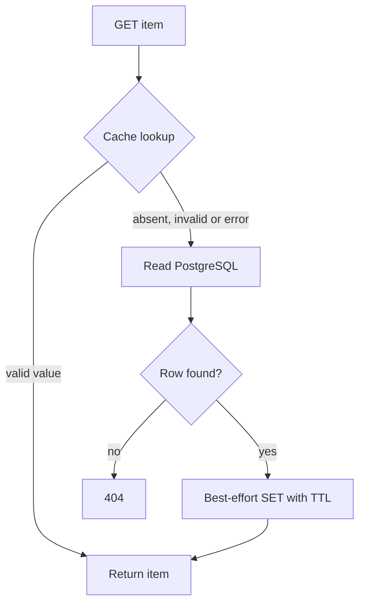

# Lab 03: Redis Cache-Aside and Graceful Degradation

## Purpose and Scope

> **Primary Objective:** Prove the differences among cache hits, misses, expiry, invalidation, stale values and cache errors, then demonstrate PostgreSQL fallback and safe Redis recovery.

Lab 2 established PostgreSQL as the authoritative store. Redis holds a derived representation whose absence is normal and whose presence does not guarantee freshness.

The operational question is not simply “Is Redis up?” It is “What does this request do with the cache state it encounters, and what happens to correctness and database demand when that state changes?”

## 1. Inherited State

Continue with the same three-service baseline and the connection-error hardening from Lab 2. Keep all telemetry backends stopped. The original course checkpoint remains in PostgreSQL.

The application already implements cache-aside. This lab will exercise its actual code rather than replace it with a generic cache tutorial. No new business feature or external service is required.

## 2. Scope and Explicit Exclusions

You will test individual item GETs, fixed TTL, post-commit invalidation, direct-writer staleness, a controlled delayed-refill ordering, malformed cache content, optional-dependency outage and recovery bypass.

Do not add distributed locks, stampede protection, Redis replicas, exporter metrics or PromQL yet. Redis server counters are used here only as direct dependency evidence; time-series collection and monitoring come later.

List responses are not cached in this application. Keep that distinction when choosing test requests.

## 3. Prerequisites and Starting Checks

```bash
source lab-notes/session.sh
baseline_check
mkdir -p lab-notes/lab-03
printf 'service=%s environment=%s redis_db=%s ttl=%s\n' \
  "$LAB_SERVICE" "$LAB_ENVIRONMENT" "$LAB_REDIS_DB" "$LAB_CACHE_TTL"
rcli PING
```

Expected: `PONG`, fully ready application, exactly app/postgres/redis running. The default cache TTL is 30 seconds. The exercises explicitly shorten only their own test keys where a short expiry is needed; they do not change the production default.

Stop other load generators and avoid using the same exercise item in another terminal. A shared Redis server's counters can include other clients; controlled deltas require controlled traffic.

## 4. Measurable Learning Objectives

By the end, you must be able to:

- map a valid hit, miss and error to the handler's terminal behavior;
- identify the exact cache namespace and Redis database number;
- distinguish missing keys, finite TTL and keys without expiration;
- measure a hit/miss without inferring it from latency alone;
- explain why ordinary hits do not extend this cache's TTL;
- prove PUT/DELETE invalidate after the PostgreSQL commit;
- demonstrate a successful but stale cached response;
- reproduce the ordering behind a delayed-refill race without relying on timing luck;
- verify malformed values fall back safely;
- keep CRUD functioning during a Redis outage;
- explain worker-local bypass after failed invalidation; and
- restore both dependency health and useful cache behavior.

## 5. Cache-Aside Architecture



The cache is optional, but PostgreSQL is still required for normal business readiness. A hit can temporarily serve a known item without a database query; it cannot make arbitrary writes or uncached reads work during a database outage.

## 6. Inspect the Actual Cache Contract

```bash
sed -n '1,240p' app/app/cache.py
rg -n 'get_item|set_item|invalidate|session.begin' app/app/api.py
```

Record these implementation facts:

| **Boundary** | **Current behavior** |
|---|---|
| Key | service + environment + `items:v1` + item UUID |
| Value | Validated ItemRead JSON |
| TTL | Applied on SET; ordinary GET does not refresh it |
| Hit | Valid JSON whose ID matches the requested item |
| Miss/error | Fall back to PostgreSQL |
| Create/update/delete | Invalidate only after a successful DB transaction |
| Failed invalidation | Bypass cache reads/writes in this worker for one configured TTL |
| Corrupt document | Log decode failure, invalidate and refill from PostgreSQL |
| Redis connections | Shared bounded pool, short connect/socket timeouts, no automatic retries |

The error path is intentional application behavior. Do not remove its exception handling to make Redis look “strictly required.”

## 7. Create an Isolated Cache Subject

```bash
api -fsS -H 'Content-Type: application/json' \
  -d '{"name":"Lab 03 version A","description":"Disposable cache subject","price":"30.00","is_active":true}' \
  "$APP_URL/api/v1/items" -o lab-notes/lab-03/item.json
ITEM_ID=$(jq -er '.id' lab-notes/lab-03/item.json)
printf '%s\n' "$ITEM_ID" > lab-notes/lab-03/item-id.txt
KEY=$(cache_key "$ITEM_ID")
rcli DEL "$KEY"
rcli EXISTS "$KEY"
```

Expected: `0` after deletion. The PostgreSQL row remains. Deleting one known cache key is a controlled experiment; `FLUSHDB` or `FLUSHALL` would unnecessarily affect unrelated data.

## 8. Read Server Hit/Miss Counters Carefully

Define a small helper:

```bash
redis_stat() {
  local wanted="$1"
  rcli INFO stats | awk -F: -v wanted="$wanted" '
    $1 == wanted {gsub("\r", "", $2); print $2; found=1}
    END {if (!found) exit 1}
  '
}
redis_stat keyspace_hits
redis_stat keyspace_misses
```

These are Redis server counters, not the application's Prometheus counters. They include the relevant Redis key lookups from **all** clients using the server. INFO itself does not look up your cache key; direct GET/EXISTS inspections can affect the counters and should stay outside each measured window.

Do not reset global Redis statistics just to get small numbers. Measure before/after deltas.

## 9. Predict and Measure a Controlled Miss

You deleted the exact key. Predict:

- Does Redis return a value?
- Does the handler need PostgreSQL?
- Should the key exist after a successful response?

Measure:

```bash
misses_before=$(redis_stat keyspace_misses)
api -fsS "$APP_URL/api/v1/items/$ITEM_ID" -o lab-notes/lab-03/miss.json
misses_after=$(redis_stat keyspace_misses)
printf 'miss_delta=%s\n' "$((misses_after-misses_before))" \
  | tee lab-notes/lab-03/miss-delta.txt
rcli EXISTS "$KEY"
rcli GET "$KEY" | jq '{id,name,price}'
```

Expected under isolated traffic: miss delta `1`, existence `1`, valid JSON matching PostgreSQL. If the delta differs, investigate other key-inspection commands or concurrent traffic before blaming the application.

## 10. Predict and Measure a Controlled Hit

Inspect the key before the measurement, then perform no extra key reads inside the window:

```bash
rcli GET "$KEY" | jq -e --arg id "$ITEM_ID" '.id == $id' >/dev/null
hits_before=$(redis_stat keyspace_hits)
api -fsS "$APP_URL/api/v1/items/$ITEM_ID" -o lab-notes/lab-03/hit.json
hits_after=$(redis_stat keyspace_hits)
printf 'hit_delta=%s\n' "$((hits_after-hits_before))" \
  | tee lab-notes/lab-03/hit-delta.txt
jq '{id,name,price}' lab-notes/lab-03/hit.json
```

Expected hit delta: `1` before expiry. A valid cache document plus a hit on the request's exact lookup supports the branch explanation in `get_item`.

A smaller response time is not proof of a hit. Network, scheduling, connection reuse and tiny query times can make a database-served request fast too.

## 11. Inspect Serialization and Identity Validation

```bash
rcli GET "$KEY" | jq '{id,name,price,is_active,created_at,updated_at}'
```

The document must be a valid ItemRead, not arbitrary JSON. The cache class also compares its ID to the requested UUID. A value of the wrong shape or identity is treated as unusable.

This validation limits accidental corruption. It does not authenticate Redis content against a hostile administrator. Access control and network boundaries still matter.

## 12. Understand TTL Values

```bash
rcli TTL "$KEY"
```

| **TTL result** | **Meaning** |
|---|---|
| Positive integer | Whole seconds remaining before expiration |
| `0` | Key exists but has less than roughly one second remaining |
| `-1` | Key exists without an expiration |
| `-2` | Key does not exist |

This application's SET supplies a TTL, so `-1` suggests another writer or manual change. A `-2` is ordinary cache absence, not proof of business-data deletion. [Redis documents these TTL return values](https://redis.io/docs/latest/commands/ttl/).

## 13. Prove That Cache Hits Do Not Extend TTL

Apply a short TTL to only this exercise key:

```bash
api -fsS "$APP_URL/api/v1/items/$ITEM_ID" >/dev/null
rcli EXPIRE "$KEY" 8
rcli TTL "$KEY"
sleep 2
api -fsS "$APP_URL/api/v1/items/$ITEM_ID" >/dev/null
rcli TTL "$KEY"
```

The last TTL should be lower than the first, not reset to the configured 30 seconds. Complete this sequence promptly while the key still exists.

If it already expired, the GET becomes a miss and the refill legitimately uses the configured TTL. Repeat from a known key state before claiming sliding expiration exists.

## 14. Expire the Key and Prove Persistence Is Unchanged

```bash
rcli EXPIRE "$KEY" 2
sleep 3
rcli TTL "$KEY"
dbsql -v item_id="$ITEM_ID" <<'SQL'
SELECT count(*) FROM items WHERE id = :'item_id'::uuid;
SQL
api -fsS "$APP_URL/api/v1/items/$ITEM_ID" | jq '{id,name,price}'
rcli TTL "$KEY"
```

Expected: `-2`, database count `1`, HTTP 200, then a new positive TTL no greater than the configured value.

Expiry removes derived state. The API recreates that state from the source of truth.

## 15. Prove Post-Commit Invalidation

Warm the item, then replace it:

```bash
api -fsS "$APP_URL/api/v1/items/$ITEM_ID" >/dev/null
api -fsS -X PUT -H 'Content-Type: application/json' \
  -d '{"name":"Lab 03 version B","description":"Updated through API","price":"31.00","is_active":true}' \
  "$APP_URL/api/v1/items/$ITEM_ID" -o lab-notes/lab-03/update.json
rcli EXISTS "$KEY"
dbsql -v item_id="$ITEM_ID" <<'SQL'
SELECT name, price FROM items WHERE id = :'item_id'::uuid;
SQL
api -fsS "$APP_URL/api/v1/items/$ITEM_ID" | jq '{name,price}'
rcli GET "$KEY" | jq '{name,price}'
```

Expected immediately after PUT: key `0`, committed DB version B, followed by refilled version B on GET.

Concurrent readers could repopulate the key before you inspect it. This exercise controls traffic so the invalidation boundary is visible.

## 16. Why Invalidate After Commit?

Invalidating before a successful commit could let another reader refill old data while the transaction is still pending. Caching an uncommitted result could expose a write that later rolls back.

The repository commits first, then invalidates. That is a practical order, but it is not a distributed transaction and does not eliminate every race. The next experiments show exactly where its consistency guarantee ends.

## 17. Predict a Direct Database Writer

A maintenance script changes the row without calling the API. Will the application's cached copy be invalidated automatically?

Write the prediction before running. There is no database-change subscription, trigger-driven cache invalidation or change-data-capture stream in this repository.

## 18. Demonstrate a Successful but Stale Response

```bash
api -fsS "$APP_URL/api/v1/items/$ITEM_ID" >/dev/null
rcli EXPIRE "$KEY" 15
dbsql -v item_id="$ITEM_ID" <<'SQL'
UPDATE items
SET name = 'Lab 03 external writer', updated_at = now()
WHERE id = :'item_id'::uuid;
SELECT name FROM items WHERE id = :'item_id'::uuid;
SQL
api -fsS "$APP_URL/api/v1/items/$ITEM_ID" -o lab-notes/lab-03/stale.json
jq -r '.name' lab-notes/lab-03/stale.json
```

When performed before the shortened key expires:

- direct SQL sees `Lab 03 external writer`;
- HTTP returns 200 with the earlier `Lab 03 version B`.

If your key expired while you read the instructions, refill a known API version and repeat. The result is timing-sensitive by design, so inspect TTL before interpreting it.

We explicitly update `updated_at` because an external SQL writer does not run the ORM's normal update path.

## 19. Recover Freshness by Expiration

```bash
rcli EXPIRE "$KEY" 2
sleep 3
api -fsS "$APP_URL/api/v1/items/$ITEM_ID" | jq -r '.name'
rcli GET "$KEY" | jq -r '.name'
```

Expected: both now show the external writer's committed value. A 200 status alone did not distinguish stale from fresh; comparing with the source of truth did.

The TTL limits how long a particular stored value can remain without replacement. It is not strict read-after-write consistency and does not set a universal upper bound on every concurrent request's start-to-finish delay.

## 20. Reproduce the Delayed-Refill Ordering Deterministically

An actual race depends on scheduling. Instead of hoping to trigger it, reproduce its state ordering with one synthetic cache document:

```bash
api -fsS "$APP_URL/api/v1/items/$ITEM_ID" >/dev/null
old_document=$(rcli GET "$KEY")
jq -e --arg id "$ITEM_ID" '.id == $id' <<<"$old_document" >/dev/null
api -fsS -X PUT -H 'Content-Type: application/json' \
  -d '{"name":"Lab 03 version C","description":"Committed before delayed refill","price":"32.00","is_active":true}' \
  "$APP_URL/api/v1/items/$ITEM_ID" >/dev/null
rcli EXISTS "$KEY"
rcli SET "$KEY" "$old_document" EX 5
api -fsS "$APP_URL/api/v1/items/$ITEM_ID" | jq '{name,price}'
dbsql -v item_id="$ITEM_ID" <<'SQL'
SELECT name, price FROM items WHERE id = :'item_id'::uuid;
SQL
```

This manually written SET represents a reader that obtained an earlier DB version, paused, then filled the cache after the writer's invalidation. It is a **simulation of the interleaving**, not proof that your HTTP requests concurrently triggered it.

The temporary stale value has a five-second TTL and affects only your item. Restore it immediately:

```bash
rcli DEL "$KEY"
api -fsS "$APP_URL/api/v1/items/$ITEM_ID" | jq '{name,price}'
```

Record what a stronger consistency design would need to coordinate. Do not introduce a distributed-lock implementation in this lab.

## 21. Corrupt One Cache Value and Observe Safe Fallback

```bash
rcli SET "$KEY" '{"invalid":true}' EX 10
api -fsS "$APP_URL/api/v1/items/$ITEM_ID" -o lab-notes/lab-03/corrupt-fallback.json
jq '{id,name,price}' lab-notes/lab-03/corrupt-fallback.json
rcli GET "$KEY" | jq -e --arg id "$ITEM_ID" '.id == $id and .name == "Lab 03 version C"'
dc logs --since=2m --no-color --no-log-prefix app \
  | rg 'cache_operation_failed' | tail -n 5
```

Expected: a normal 200 with current data, a repaired valid cached document, and a sanitized failure event whose operation is `decode`.

Do not parse every runtime log as JSON blindly; this step filters a known application event. Full log structure, request IDs and evidence conventions are Lab 6 topics.

## 22. Predict Redis Failure Before Changing State

| **Operation** | **Your prediction** |
|---|---|
| GET a known item | What happens when cache lookup raises? |
| POST a valid item | Is a successful DB commit rejected because invalidation fails? |
| PUT an item | Which store changes first? |
| List items | Does it use Redis at all? |
| Readiness | Is the failed dependency required or optional? |
| Cache after Redis recovery | Can an old value survive or is it guaranteed gone? |

Redis AOF persistence and TTL can preserve or expire keys across downtime. Do not assume a restarted Redis is empty.

## 23. Run a Bounded Redis Outage and Write Through PostgreSQL

```bash
(
  set -euo pipefail
  trap 'dc start redis >/dev/null' EXIT
  trap 'exit 130' INT
  trap 'exit 143' TERM
  dc stop redis
  api -fsS "$APP_URL/api/v1/items/$ITEM_ID" \
    -o lab-notes/lab-03/redis-down-read.json
  api -fsS -X PUT -H 'Content-Type: application/json' \
    -d '{"name":"Lab 03 written during Redis outage","description":"PostgreSQL remains authoritative","price":"33.00","is_active":true}' \
    "$APP_URL/api/v1/items/$ITEM_ID" \
    -o lab-notes/lab-03/redis-down-update.json
  api -fsS -H 'Content-Type: application/json' \
    -d '{"name":"Lab 03 outage create","price":"3.00"}' \
    "$APP_URL/api/v1/items" -o lab-notes/lab-03/outage-create.json
  api -fsS "$APP_URL/api/v1/items?limit=1" >/dev/null
  api -fsS "$APP_URL/health/ready" \
    | tee lab-notes/lab-03/redis-down-ready.json | jq .
  dbsql -v item_id="$ITEM_ID" <<'SQL'
SELECT name, price FROM items WHERE id = :'item_id'::uuid;
SQL
)
wait_ready
```

Expected: reads/updates/list succeed, POST creates a row, readiness is HTTP 200 with `status: degraded`, PostgreSQL `up` and Redis `down` while stopped. After the subshell exits, Redis starts and fully ready state returns.

`wait_ready` intentionally waits for both dependencies, even though degraded readiness is acceptable for serving business traffic. It establishes a known laboratory baseline before the next experiment.

## 24. Inspect the Failure Evidence

```bash
dc logs --since=5m --no-color --no-log-prefix app \
  | rg 'cache_operation_failed' | tail -n 12
jq '{id,name,price}' lab-notes/lab-03/redis-down-update.json
jq -er '.id' lab-notes/lab-03/outage-create.json
```

Expect bounded operation/error-type context rather than passwords or Redis connection strings. The code records Redis errors and uses short timeouts; it cannot promise zero latency cost during failure.

Do not turn retries up indiscriminately. Repeated attempts at an unavailable optional cache can amplify latency and load while PostgreSQL is already doing more work.

## 25. Understand the Recovery Bypass

A failed invalidation sets `_bypass_until` to the current monotonic time plus one configured TTL. Until that deadline, this worker skips cache reads and fills, while still serving through PostgreSQL.

Consequences:

- Redis can be reachable again while item reads temporarily continue bypassing it.
- The bypass is in this process's memory, not a distributed flag.
- Restarting the app clears it; doing so is not the right way to “repair” a normal bypass window.
- It protects against pre-existing entries for this single worker, but not every delayed refill or future multi-worker race.
- A read-only Redis outage does not necessarily set bypass; the trigger is a failed invalidation.

Your PUT and POST during the outage exercised that trigger.

## 26. Prove Correct Data Immediately After Recovery

```bash
api -fsS "$APP_URL/api/v1/items/$ITEM_ID" \
  | tee lab-notes/lab-03/recovery-read.json | jq '{name,price}'
dbsql -v item_id="$ITEM_ID" <<'SQL'
SELECT name, price FROM items WHERE id = :'item_id'::uuid;
SQL
```

Both must show the value committed during the outage. Whether a key exists immediately is secondary: the process may still be deliberately bypassing cache.

A separate isolated test covers the specific case where an old cached value survives recovery. Read it rather than assuming this short runtime drill always preserves the old key:

```bash
rg -n -A 20 '^async def test_redis_outage_and_stale_recovery' app/tests/test_api.py
```

## 27. Prove Cache Functionality Returns After the Window

Use a finite wait based on the configured TTL. At the default this takes no more than about 35 seconds plus request time. For a deliberately much larger TTL, expect a longer experiment and plan it before starting.

```bash
cache_recovered=false
for ((attempt=0; attempt<LAB_CACHE_TTL+5; attempt++)); do
  api -fsS "$APP_URL/api/v1/items/$ITEM_ID" >/dev/null
  if [[ "$(rcli EXISTS "$KEY")" = 1 ]]; then
    cached_name=$(rcli GET "$KEY" | jq -r '.name')
    if [[ "$cached_name" = 'Lab 03 written during Redis outage' ]]; then
      cache_recovered=true
      break
    fi
  fi
  sleep 1
done
test "$cache_recovered" = true
rcli TTL "$KEY"
```

This loop does not reset the app or flush all keys. It proves an acceptable current representation is cached again.

If an old value exists while bypass is active, the loop will reject it and continue until it expires or a valid refill occurs.

## 28. Separate Basic Cache Behavior From a Full Incident

You have proved fallback and recovery at low, controlled traffic. You have **not** measured production p95 latency, database amplification under sustained load, memory saturation or alert quality.

Lab 45 revisits Redis failure after metrics, dashboards, logs, traces and profiles are available. It will ask whether graceful degradation remains sustainable at load, not merely whether one fallback request succeeds.

## 29. Exercise Delete Invalidation and Clean Up

```bash
OUTAGE_ITEM_ID=$(jq -er '.id' lab-notes/lab-03/outage-create.json)
api -fsS "$APP_URL/api/v1/items/$ITEM_ID" >/dev/null
api -fsS -X DELETE "$APP_URL/api/v1/items/$ITEM_ID" -o /dev/null
rcli EXISTS "$KEY"
dbsql -v item_id="$ITEM_ID" <<'SQL'
SELECT count(*) FROM items WHERE id = :'item_id'::uuid;
SQL
api -fsS -X DELETE "$APP_URL/api/v1/items/$OUTAGE_ITEM_ID" -o /dev/null
baseline_check
```

Expected key existence and row count: both `0`. Keep the original course checkpoint from Lab 1.

## 30. Troubleshooting Runbook

### A. “The hit counter changed by more than one”

Check other clients and whether you used GET/EXISTS between the before/after INFO snapshots. These are Redis-wide counters, not a request-scoped instrument. Repeat one controlled request.

### B. “TTL unexpectedly jumped upward”

The key may have expired and been refilled. Read the code: GET does not extend TTL; SET applies the configured TTL. Complete the observation before expiry.

### C. “Redis is healthy but no key appears after recovery”

Check the failed-invalidation bypass window. A healthy cache server and a worker deliberately bypassing it are compatible states.

### D. “A cache value has TTL -1”

Inspect who wrote it. The application's normal fill uses expiration; a manual SET without EX can create a persistent key. Restore a safe state with `rcli DEL "$KEY"` then a valid item GET.

### E. “A corrupt value produced 503”

Corruption fallback requires PostgreSQL. Check database readiness and the real row. Cache repair cannot read from an unavailable source of truth.

### F. “The stale response experiment returned the latest value”

The key may have expired before the request or another operation invalidated it. Establish version B, warm it, set the short TTL, then run the direct write and GET promptly. Do not increase TTL on unrelated keys.

### G. “Redis authentication fails”

Use `rcli`, and confirm the server/app use the same configured secret. Changing `.env` alone does not update a running container; Lab 5 explains recreation. Do not put secrets into command output.

### H. “The outage left Redis stopped”

```bash
dc start redis
wait_ready
```

A trap cannot run after host loss or SIGKILL. Verify recovery explicitly and continue from a known item/key state.

### I. “A name changed in SQL but not through the API”

That may be the staleness experiment working. Compare the exact ID, key namespace, TTL and API body before changing code.

## 31. Evidence-Based Cache Diagnostic Sequence

1. Identify the exact item UUID, cache namespace and Redis database.
2. Confirm what PostgreSQL currently stores.
3. Inspect key existence, TTL and value only for that item.
4. Determine whether the worker is using or bypassing cache.
5. Reproduce one request and compare controlled observations.
6. Distinguish absent data, invalid cached data, stale data and transport failure.
7. Recover the changed dependency or exact key and verify both data and cache behavior.

A cache miss, a Redis error and a stale hit are three different operational conditions. They should not be described as one generic “cache problem.”

## 32. Knowledge Check

1. What is cache-aside in this API?
2. Which routes bypass the item cache entirely?
3. Why does POST not guarantee an existing cache entry?
4. What do TTL values 0, -1 and -2 mean?
5. Does a cache hit extend the TTL here?
6. Why can direct SQL create a stale API response?
7. What does a successful HTTP 200 fail to prove about freshness?
8. What race did the manual delayed SET simulate?
9. Why is that simulation different from reproducing real concurrent requests?
10. What happens to invalid cached JSON?
11. Why can CRUD continue during a Redis outage?
12. What triggers worker-local cache bypass?
13. Why can readiness recover before caching resumes?
14. What can Redis-wide hit counters not tell you by themselves?
15. Why is a low-load fallback test insufficient for a full incident assessment?

### Answer Key

1. Check cache, fall back to PostgreSQL on miss/error, then best-effort fill.
2. List and writes do not read their business result from the item cache.
3. It invalidates after commit; individual reads populate.
4. Less than about one second remaining, no expiry, and missing key respectively.
5. No; only a SET resets expiration.
6. It bypasses the API's invalidation path.
7. Whether the derived representation matches current authoritative state.
8. An older read filling after a newer write invalidated the key.
9. It establishes the state ordering deliberately, not through concurrent HTTP scheduling.
10. Decode/identity validation fails; the key is invalidated and PostgreSQL supplies a refill if available.
11. PostgreSQL remains authoritative and cache failures are caught with bounded waits.
12. Failure of a post-commit invalidation attempt.
13. Server connectivity can return before the worker's monotonic bypass deadline.
14. Which client/request caused the change, or whether a returned value was fresh.
15. Database load, latency and saturation may become unacceptable at scale.

## 33. Professional Scenario Exercise

An operator reports:

> “Redis restarted and returns PONG, but database traffic is still high and several keys are absent. The app must be broken.”

Write a response that distinguishes server reachability, TTL expiry, the worker's invalidation-failure bypass, a valid empty cache and a stampede risk. State which evidence to collect before restarting the application, and what load-related questions remain for Lab 45.

## 34. Lab Notebook Template

```markdown
# Lab 03 Evidence

## Namespace, Redis database and configured TTL
## Cold-read prediction and server miss delta
## Warm-read prediction and server hit delta
## Fixed TTL and expiration evidence
## PUT/DELETE invalidation evidence
## Direct-writer stale response
## Delayed-refill ordering simulation and limits
## Malformed cache repair
## Redis outage predictions and database-backed results
## Recovery bypass explanation
## Fresh-data and cache-repopulation proof
## Cleanup
## Knowledge-check and professional scenario responses
## What needs a later load/observability experiment
```

Save as `lab-notes/Lab-3.md`. Keep the synthetic HTTP/SQL evidence with it; do not collect broad production cache dumps.

## 35. Completion Criteria

- [ ] You measured controlled miss and hit deltas without claiming latency is proof.
- [ ] You explained the scope of Redis server counters.
- [ ] TTL expiration removed a key without deleting the row.
- [ ] Ordinary hits did not slide the TTL.
- [ ] API writes invalidated the exact key after commit.
- [ ] A direct writer produced a bounded stale response.
- [ ] You simulated and explained the delayed-refill ordering accurately.
- [ ] Malformed cache content fell back and was repaired.
- [ ] Reads and writes succeeded through PostgreSQL during Redis failure.
- [ ] Redis was restored and the committed outage value remained correct.
- [ ] You explained bypass and proved valid caching returned.
- [ ] Temporary rows/keys were removed and the baseline is fully ready.

## 36. Production Implications

Cache-aside improves many read paths, but cache correctness is a policy, not an automatic property of Redis. Agree on acceptable staleness, invalidation ownership and behavior during outages. Use bounded timeouts, avoid retry amplification and measure the additional demand placed on PostgreSQL.

Worker-local bypass helps this single-worker implementation; it is not cross-replica coordination. Financial correctness, authorization state or strict read-after-write workflows need a stronger design than this TTL cache. AOF persistence does not make Redis authoritative business storage.

## 37. End State and Transition to Lab 04

```bash
baseline_check
CHECKPOINT_ID=$(cat lab-notes/checkpoint-item-id.txt)
api -fsS "$APP_URL/api/v1/items/$CHECKPOINT_ID" | jq '{id,name,price}'
```

Next: [Lab 04 — Liveness, Readiness, and Dependency Health](Lab-4.md).

You have seen required and optional dependency failures. Lab 4 turns those observations into explicit health contracts and proves why process health, dependency reachability and useful business work must be assessed separately.
