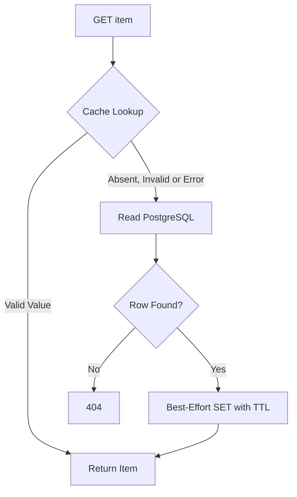

# Lab 03: Redis Cache-Aside and Graceful Degradation

## 1. Purpose and Learning Outcomes

You will treat Redis as a temporary copy of PostgreSQL data and test what happens when that copy is present, missing, expired, old, or damaged. You will also briefly stop Redis and check recovery. These experiments explain why caching can make reads faster and why an HTTP success response does not always mean the returned data is the latest version.

> **Primary Objective:** Tell apart cache hits, misses, expiry, invalidation, stale values, and cache errors. Then show how the application reads PostgreSQL when Redis cannot provide a usable answer and how caching returns after recovery.

Lab 2 established PostgreSQL as the main store. Redis holds a copy that can be rebuilt. A missing copy is normal, and an existing copy is not automatically up to date.

Ask more than “Is Redis running?” For each request, ask what is in the cache, whether the app can use it, whether its values are current, and whether the request must make PostgreSQL do more work instead.

## 2. Starting Point and Lab Map

Open the complete application repository before using this guide. Unless a step says otherwise, run commands in Bash from the repository's top-level folder. Follow the starting checks in order because later commands depend on the helper functions and running services they prepare.

Read each explanation before running its commands. Run one complete code block, check the result, and then continue. In your notebook, save the commands, what happened, why you think it happened, and anything that differed from the expected result.

### Key Terms

| **Term**     | **Explanation**                                                                               |
| ------------ | --------------------------------------------------------------------------------------------- |
| Cache-Aside  | The application checks Redis first and reads PostgreSQL when the cached value cannot be used. |
| TTL          | Time To Live: how long a cached value may remain before Redis expires it.                     |
| Invalidation | Removing a cached copy so later reads do not reuse it after the main value changes.           |

### Lab Map

The arrows show how the parts connect and where a request can take different paths. Use this map to understand the design. It is not a recording of a request that actually ran.


```mermaid
flowchart TD
    Request["GET item"] --> Lookup{"Cache Lookup"}
    Lookup -->|"Valid Value"| Return["Return Item"]
    Lookup -->|"Absent, Invalid or Error"| DB["Read PostgreSQL"]
    DB --> Found{"Row Found?"}
    Found -->|"No"| Missing["404"]
    Found -->|"Yes"| Store["Best-Effort SET with TTL"]
    Store --> Return
```

## 3. Guided Walkthrough

### Step 01. Inherited State

**What You Are Doing:** Continue with the services and data from the earlier labs. Caching is already implemented. You will use controlled requests and faults to make its decisions visible.

**Practical Walkthrough:** Start with the recovered three-service setup and Lab 2's connection-error fix. Keep the original checkpoint separate from this lab's temporary item. Confirm that PostgreSQL and Redis are working and no previous outage or deliberately damaged cache value is still affecting the app.

Check normal database work and Redis access before collecting evidence. Keep the checkpoint ID unchanged. If the worker is still temporarily bypassing Redis after an earlier failure, or a test key contains deliberately bad data, clear up that state first. Otherwise it could affect your new results without appearing in your notes.

Continue with the same three-service baseline and the connection-error hardening from Lab 2. Keep all telemetry backends stopped. The original course checkpoint remains in PostgreSQL.

The app already uses cache-aside: it checks Redis first and falls back to the database when needed. This lab tests that implementation. You do not need to add a new feature or service.

**Understanding the Result:** Starting from the same working baseline helps connect each result to the change you made. Resolve an unexplained earlier fault before adding another one.

### Step 02. Scope and Explicit Exclusions

**What You Are Doing:** Follow one item's cached copy through its different states. Keep these correctness checks separate from later experiments about performance under load and full incident response.

**Practical Walkthrough:** Use one item to observe a missing key, a valid copy, expiry, an old copy, and recovery. Control the traffic so each result has a clear cause. Later labs measure the added database load and latency; here, focus first on whether the returned data and fallback behavior are correct.

Before each test, write down the starting key state, your action, and the check that will reveal the result. A miss means the cache could not provide an answer. A stale hit means it provided an answer that no longer matches PostgreSQL. Both can return HTTP 200, so inspect the actual values too.

You will test individual GETs, fixed expiry times, invalidation after commit, writes that bypass the API, a delayed old cache refill, malformed cached values, a Redis outage, and the temporary cache bypass used during recovery.

Leave distributed locks, protection against many simultaneous cache misses, Redis replicas, exporters, and PromQL for later. The Redis counters here are direct server observations. You are not collecting or querying a time series yet.

List responses are not cached in this application. Keep that distinction when choosing test requests.

**Understanding the Result:** Keep a missing key, an invalid document, an old but valid document, and a failed Redis connection separate in your notes. They have different causes even if the app can fall back successfully in several cases.

### Step 03. Prerequisites and Starting Checks

**What You Are Doing:** Check readiness, cache naming settings, and authenticated Redis access. Stop unrelated traffic so you can explain changes in the shared Redis counters.

**Practical Walkthrough:** Load the app's key naming settings and Redis database number. Check readiness and Redis access. These settings determine which key you should inspect. Other clients or a short expiry can change the state while you measure, so stop competing requests before testing one operation.

Read the service name, environment, Redis database number, and TTL together. They determine where the key is stored and how long it remains. `rcli PING` checks authenticated Redis access. If it works but your key is missing, verify the key name and database number before assuming the app never wrote it.

```bash
source lab-notes/session.sh
baseline_check
mkdir -p lab-notes/lab-03
printf 'service=%s environment=%s redis_db=%s ttl=%s\n' \
  "$LAB_SERVICE" "$LAB_ENVIRONMENT" "$LAB_REDIS_DB" "$LAB_CACHE_TTL"
rcli PING
```

**Expected Result:** Redis returns `PONG`, the app is fully ready, and only app/postgres/redis are running. The default TTL is 30 seconds. Where a short wait is needed, these exercises shorten only their own test keys; they do not change the application's default setting.

Stop other load generators and avoid reading the same test item from another terminal. Redis counters include other clients too. To explain a before-and-after difference, you need to know what traffic occurred between the two readings.

**Understanding the Result:** PONG proves that this authenticated connection can reach Redis. It does not prove your item's key exists or that a particular API response came from it.

### Step 04. Measurable Learning Objectives

**What You Are Doing:** Check that you can explain whether cached data is current and when the app uses PostgreSQL instead. A fast response alone is not enough.

**Practical Walkthrough:** Separate three questions: did the request succeed, is its data current, and how fast was it? A 200 response may contain an older valid document. A missing cache key may still lead to the correct database value. You will create these cases deliberately and compare them.

Use actual examples: one missing key, one current hit, one stale hit, and one unavailable Redis server. For each, compare the API fields with SQL. These values let you explain correctness without relying only on status or speed.

By the end, you must be able to:

- explain how the handler responds to a usable cached value, a missing value, and a cache error;
- identify the exact cache namespace and Redis database number;
- distinguish missing keys, finite TTL and keys without expiration;
- measure a hit/miss without inferring it from latency alone;
- explain why ordinary hits do not extend this cache's TTL;
- prove PUT/DELETE invalidate after the PostgreSQL commit;
- demonstrate a successful but stale cached response;
- reproduce an old reader filling the cache after an update, using a controlled order instead of timing luck;
- verify malformed values fall back safely;
- keep CRUD functioning during a Redis outage;
- explain why a worker temporarily avoids cache reads and writes after invalidation fails; and
- restore both dependency health and useful cache behavior.

**Understanding the Result:** Record the item ID, key state, and current PostgreSQL value for each objective. These details explain much more than “Redis worked.”

### Step 05. Cache-Aside Architecture

**What You Are Doing:** Follow the decision after a cache lookup. A usable document can answer the request; otherwise the app needs PostgreSQL to find the item.

**Practical Walkthrough:** The cache is a shortcut before the main database read. If its document is usable, the handler can return early. If the key is absent or the document is rejected, the handler reads PostgreSQL. When it finds the row, it also tries to store a copy for a later request.

Trace both paths fully. The miss path reads PostgreSQL and tries to fill Redis; the hit path returns earlier. Keep the database row and its cached JSON copy separate. During a Redis outage, fallback succeeds only if PostgreSQL can still provide the required data.

The lab map in Section 2 shows this relationship.

Redis is optional, but PostgreSQL is required for normal readiness. A cached hit can briefly serve a known item without querying the database. It cannot make writes or uncached reads work when PostgreSQL is unavailable.

**Understanding the Result:** Falling back from Redis still requires a working database. Optional caching does not make the database optional.

### Step 06. Inspect the Actual Cache Contract

**What You Are Doing:** Read the app's rules for keys, document validation, expiry, and failures before testing them. These specific rules explain behavior that a general cache tutorial may not cover.

**Practical Walkthrough:** Find how keys are built, which document fields are accepted, when expiry is set, and when caching is temporarily bypassed. For example, Redis may recover while the worker still avoids old cache entries. Treat the table as this application's policy, not as a rule Redis enforces for every application.

Locate the key prefix, document checks, expiry settings, and failed-invalidation handling. Read their callers in `api.py` too. For each error path, ask whether it changes the HTTP response or only disables caching. This will help explain why a reachable Redis server may receive no cache traffic for a short time.

```bash
sed -n '1,240p' app/app/cache.py
rg -n 'get_item|set_item|invalidate|session.begin' app/app/api.py
```

Record these implementation facts:

| **Boundary**         | **Current Behavior**                                                                      |
| -------------------- | ----------------------------------------------------------------------------------------- |
| Key                  | service + environment + `items:v1` + item UUID                                            |
| Value                | JSON checked against the ItemRead schema                                                  |
| TTL                  | Set when the value is written; ordinary GET does not restart the expiry timer             |
| Hit                  | Valid cached JSON with the same ID as the requested item                                  |
| Miss/Error           | Read the item from PostgreSQL instead                                                     |
| Create/Update/Delete | Remove the cache key only after the database transaction succeeds                         |
| Failed Invalidation  | This worker avoids cache reads and writes for one configured TTL period                   |
| Corrupt Document     | Log the decoding failure, remove the bad copy, and refill from PostgreSQL                 |
| Redis Connections    | Shared pool with a size limit, short connection/socket timeouts, and no automatic retries |

The fallback on cache errors is intentional. Do not remove its exception handling to force Redis to become a required dependency.

**Understanding the Result:** Judge the experiments against this app's rules. Another app could use the same Redis server with different key names, expiry times, and failure behavior.

### Step 07. Create an Isolated Cache Subject

**What You Are Doing:** Create a temporary database row and remove its exact cache key. The row exists, but Redis has no copy. This gives you a known starting point for a cache miss.

**Practical Walkthrough:** Create the item, save its UUID, and build the full key from that UUID. Delete only that key. The PostgreSQL row remains, so the next read can refill Redis. This avoids disturbing other items, environments, or Redis databases.

Confirm POST returned a valid UUID before building `KEY`. Save both the ID and key. If creation failed, stop; an empty or leftover variable could point at the wrong test item. Deleting this key changes only the copy, not the database row.

```bash
api -fsS -H 'Content-Type: application/json' \
  -d '{"name":"Lab 03 Version A","description":"Disposable cache subject","price":"30.00","is_active":true}' \
  "$APP_URL/api/v1/items" -o lab-notes/lab-03/item.json
ITEM_ID=$(jq -er '.id' lab-notes/lab-03/item.json)
printf '%s\n' "$ITEM_ID" > lab-notes/lab-03/item-id.txt
KEY=$(cache_key "$ITEM_ID")
rcli DEL "$KEY"
rcli EXISTS "$KEY"
```

**Expected Result:** key existence is `0` after deletion, while the PostgreSQL row remains. Use only the known test key. `FLUSHDB` or `FLUSHALL` would remove unrelated cached data unnecessarily.

**Understanding the Result:** The intended setup is an existing database row with no Redis copy. Removing the copy does not delete the item itself.

### Step 08. Read Server Hit/Miss Counters Carefully

**What You Are Doing:** Measure the difference between two Redis counter readings. Do not reset global statistics. Keep your own key lookups outside the interval because they can increase the same counters.

**Practical Walkthrough:** Read the counter, perform one controlled action, and read it again. Subtract the first number from the second; this difference is the delta. Large accumulated totals are fine. Direct GET or EXISTS checks may also affect the counters, so perform those checks after the second reading.

Define `redis_stat` before using it. It extracts one field from `INFO stats`. Each measurement uses two readings and shell arithmetic. Check the key only after capturing the second reading, so your inspection is not counted as part of the API request.

Define a small helper:

```bash
redis_stat() {
  local wanted="$1"
  rcli INFO stats | awk -F: -v wanted="$wanted" '
    $1 == wanted {gsub("\r", "", $2); print $2; found=1}
    END {if (!found) exit 1}
  '
}
redis_stat keyspace_hits
redis_stat keyspace_misses
```

These are Redis server counters, separate from the app's Prometheus metrics. They include relevant key lookups from **all** clients using that server. INFO does not look up the item key, but direct GET and EXISTS can affect the counters. Keep those inspections outside the measured interval.

Use before-and-after differences. You do not need to reset server-wide statistics to make the totals small.

**Understanding the Result:** The delta includes all relevant traffic between the readings. If it is too large, first look for other clients or extra inspection commands.

### Step 09. Predict and Measure a Controlled Miss

**What You Are Doing:** Send one GET after confirming the key is absent. Check the miss-counter change and the resulting key to see the fallback and refill behavior.

**Practical Walkthrough:** Remove the test key, record the miss counter, send one individual GET, and record the counter again. Only then inspect the filled key. This order lets the measured delta describe the API lookup without also including your later key checks.

Read `misses_before`, send one request, then read `misses_after`. Do not inspect the key between those readings. Afterward, compare the response and cached document with the known row. Extra misses may come from other traffic, so check that before changing code.

You deleted the exact key. Predict:

- Does Redis return a value?
- Does the handler need PostgreSQL?
- Should the key exist after a successful response?

Measure:

```bash
misses_before=$(redis_stat keyspace_misses)
api -fsS "$APP_URL/api/v1/items/$ITEM_ID" -o lab-notes/lab-03/miss.json
misses_after=$(redis_stat keyspace_misses)
printf 'miss_delta=%s\n' "$((misses_after-misses_before))" \
  | tee lab-notes/lab-03/miss-delta.txt
rcli EXISTS "$KEY"
rcli GET "$KEY" | jq '{id,name,price}'
```

With isolated traffic, expect miss delta `1`, key existence `1`, and valid JSON matching PostgreSQL. If the delta differs, look for another client or a key-inspection command inside the interval before concluding the app took the wrong path.

**Understanding the Result:** The API should return the database values and create a usable key. A surprising counter delta by itself does not prove the handler behaved incorrectly.

### Step 10. Predict and Measure a Controlled Hit

**What You Are Doing:** Send another GET before the entry expires and measure the hit-counter change. This gives stronger evidence of a cache hit than response speed alone.

**Practical Walkthrough:** Confirm the cached copy is valid and still present. Take a hit-counter reading, send one GET, and take the second reading without checking the key in between. The counter change then helps show that Redis found a value during the controlled request.

The first `jq -e` check confirms the cached document belongs to the test item. Then measure around the one API request and inspect its response afterward. A hit counter proves Redis found a value; you must still check that the returned fields are correct.

Inspect the key before the measurement, then perform no extra key reads inside the window:

```bash
rcli GET "$KEY" | jq -e --arg id "$ITEM_ID" '.id == $id' >/dev/null
hits_before=$(redis_stat keyspace_hits)
api -fsS "$APP_URL/api/v1/items/$ITEM_ID" -o lab-notes/lab-03/hit.json
hits_after=$(redis_stat keyspace_hits)
printf 'hit_delta=%s\n' "$((hits_after-hits_before))" \
  | tee lab-notes/lab-03/hit-delta.txt
jq '{id,name,price}' lab-notes/lab-03/hit.json
```

**Command Note:** `jq --arg` passes a shell value as a string variable to the JSON query, without inserting it directly into the query text. `-e`, where used, makes a false or null final result fail the command.

Before expiry, expect hit delta `1`. A valid document and a hit during the controlled lookup support the cache-hit path described by `get_item`.

A short response time alone does not prove Redis supplied the item. A small database query can also be quick, especially with a reused connection and favorable scheduling or network conditions.

**Understanding the Result:** Use the controlled counter change and document checks as evidence. Speed alone cannot tell a cache hit from a fast database read.

### Step 11. Inspect Serialization and Identity Validation

**What You Are Doing:** Check the cached document's fields and ID. A present key is useful only if its contents can represent the requested item safely.

**Practical Walkthrough:** Compare the cached JSON with the expected response schema and UUID. Arbitrary JSON under the correct key is not enough. Later, you will deliberately store a bad value and check that the app rejects it and uses PostgreSQL instead.

Inspect the UUID, price format, and other fields. JSON can parse successfully yet fail the app's field or identity checks. The opposite limit matters too: a document can pass all those checks while still containing an older version. A later comparison with SQL demonstrates that case.

```bash
rcli GET "$KEY" | jq '{id,name,price,is_active,created_at,updated_at}'
```

The value must match ItemRead, not merely be valid JSON. Its ID must also match the requested UUID. A document with the wrong fields or identity is not used as the response.

These checks help catch accidental bad data. They do not prove Redis content is trustworthy if a hostile administrator can change it. Access restrictions and network controls still matter.

**Understanding the Result:** Schema and ID checks reject unusable documents. They do not prove that an accepted document is the latest committed version.

### Step 12. Understand TTL Values

**What You Are Doing:** Read the TTL value before diagnosing the key. A missing key, an expiring key, and a key without expiry are different states.

**Practical Walkthrough:** Ask Redis how much lifetime remains for this key. Positive numbers are seconds until expiry. The special negative values distinguish a missing key from one that never expires. Your result describes this specific key, not the health of the whole Redis server.

A positive TTL means seconds remain. `-1` means the key exists without an expiry, and `-2` means it is absent. Record the observation time because the countdown continues between commands. Check PostgreSQL separately before treating normal cache expiry as lost item data.

```bash
rcli TTL "$KEY"
```

| **TTL Result**   | **Meaning**                                               |
| ---------------- | --------------------------------------------------------- |
| Positive integer | Whole seconds remaining before expiration                 |
| `0`              | Key exists but has less than roughly one second remaining |
| `-1`             | Key exists without an expiration                          |
| `-2`             | Key does not exist                                        |

The app applies a TTL when it writes a value, so `-1` suggests a manual change or another writer. `-2` is normal cache absence and does not prove the item was deleted from PostgreSQL. [Redis documents these TTL return values](https://redis.io/docs/latest/commands/ttl/).

**Understanding the Result:** Cache keys may disappear normally. Check the PostgreSQL row to determine whether the item itself still exists.

### Step 13. Prove That Cache Hits Do Not Extend TTL

**What You Are Doing:** Give this key a short TTL and read it before expiry. Check that the remaining time decreases rather than restarting after the hit.

**Practical Walkthrough:** Set a short lifetime, record it, send GET, and check again promptly. You are testing whether a hit renews the existing key. If it expires before GET, the request instead misses, reads PostgreSQL, and writes a new key with the default TTL. That is a different event.

Run the sequence without unrelated pauses. `EXPIRE` changes only the test key's lifetime. If the sequence takes longer than that lifetime, warm the key and try again. You need the key to remain present through GET to test whether a hit extends its expiry.

Apply a short TTL to only this exercise key:

```bash
api -fsS "$APP_URL/api/v1/items/$ITEM_ID" >/dev/null
rcli EXPIRE "$KEY" 8
rcli TTL "$KEY"
sleep 2
api -fsS "$APP_URL/api/v1/items/$ITEM_ID" >/dev/null
rcli TTL "$KEY"
```

The final TTL should be lower than the first, rather than reset to the configured 30 seconds. Finish the sequence while the existing key is still alive.

If the key expired first, GET becomes a miss and the new cached copy receives the configured TTL. Repeat from a known state before claiming that this app uses sliding expiry, where every hit extends the lifetime.

**Understanding the Result:** Explain a TTL increase using the sequence of events. A new key after a miss is different from renewing the old key on every hit.

### Step 14. Expire the Key and Prove Persistence Is Unchanged

**What You Are Doing:** Let the cached copy expire, then check Redis, SQL, and HTTP. The database row should remain, allowing the next GET to rebuild the cache.

**Practical Walkthrough:** Verify key absence before sending GET. Query PostgreSQL directly to show the row was not deleted. Then read through the API and inspect the new TTL. This demonstrates that a temporary cached copy can be recreated from the main stored data.

Keep the checks in order. First observe expiry, then verify the original row in SQL, then send GET and inspect the refill. GET can create a key immediately, so sending it before the absence check would hide the state you intended to observe.

```bash
rcli EXPIRE "$KEY" 2
sleep 3
rcli TTL "$KEY"
dbsql -v item_id="$ITEM_ID" <<'SQL'
SELECT count(*) FROM items WHERE id = :'item_id'::uuid;
SQL
api -fsS "$APP_URL/api/v1/items/$ITEM_ID" | jq '{id,name,price}'
rcli TTL "$KEY"
```

**Expected Result:** `-2`, database count `1`, HTTP 200, then a new positive TTL no greater than the configured value.

Expiry removes the temporary copy. The API can build a fresh copy from the PostgreSQL row.

**Understanding the Result:** Expiry changes how the next read gets its data. It does not delete or move ownership of the stored row. The new cache entry is another copy of that row.

### Step 15. Prove Post-Commit Invalidation

**What You Are Doing:** Update an item that already has a cached copy. Compare the new database values with the removed key and the later refill.

**Practical Walkthrough:** Warm the cache, send a complete PUT replacement, and inspect the database and key promptly. After commit, the key should be absent until another reader fills it. Then GET the item and compare its new cached values with the updated row.

Keep the order: warm GET, PUT, key check, then another GET. The first key check tests invalidation; the last GET tests refill. Another client could refill the key between these commands, so keep traffic controlled and record any competing reads.

Warm the item, then replace it:

```bash
api -fsS "$APP_URL/api/v1/items/$ITEM_ID" >/dev/null
api -fsS -X PUT -H 'Content-Type: application/json' \
  -d '{"name":"Lab 03 Version B","description":"Updated through API","price":"31.00","is_active":true}' \
  "$APP_URL/api/v1/items/$ITEM_ID" -o lab-notes/lab-03/update.json
rcli EXISTS "$KEY"
dbsql -v item_id="$ITEM_ID" <<'SQL'
SELECT name, price FROM items WHERE id = :'item_id'::uuid;
SQL
api -fsS "$APP_URL/api/v1/items/$ITEM_ID" | jq '{name,price}'
rcli GET "$KEY" | jq '{name,price}'
```

Immediately after PUT, expect key existence `0` and committed database version B. A later GET should refill Redis with version B.

Another reader could recreate the key before your inspection. Controlling traffic makes the short period of key absence easier to observe.

**Understanding the Result:** Expect the sequence old cached value, missing key, then new cached value. With competing readers, the missing-key period may be too short for your commands to catch.

### Step 16. Why Invalidate After Commit?

**What You Are Doing:** Think through what a reader sees while a writer has not committed yet. This explains why invalidation follows commit and why that order still cannot prevent every stale-cache case.

**Practical Walkthrough:** If a writer removed the key before commit, another reader could miss, read the old committed row, and cache it again. Committing before invalidation avoids that ordering. But a reader that already fetched old data can still finish late and write that old copy afterward.

Write the reader and writer actions in time order and mark the commit. Ask which version the reader can fetch at each point and when it writes Redis. This shows why commit-then-invalidate is useful without pretending it combines PostgreSQL and Redis into one all-or-nothing operation.

Invalidating before commit can allow a reader to cache the old database value again. Caching an uncommitted new value has another problem: it could expose a change that later rolls back.

This repository commits first and then invalidates. That order is practical, but it is not a distributed transaction and cannot remove every race between readers and writers. The next experiments show the remaining limits.

**Understanding the Result:** State the guarantee precisely: this API invalidates after its successful commit. It does not coordinate every possible reader and writer across both stores.

### Step 17. Predict a Direct Database Writer

**What You Are Doing:** Predict a direct SQL update that skips the API. Such a writer does not automatically run the handler's cache-invalidation code.

**Practical Walkthrough:** A SQL connection can change PostgreSQL without passing through the API. The database value changes, but the handler's cache cleanup never runs. Without another notification mechanism, Redis does not know that this external write occurred.

Identify the skipped step: the direct writer never calls the API's invalidation method. While the existing key is valid, predict different values from direct SQL and the warmed API read. The SQL update can succeed even though the cache is not notified.

A maintenance script changes the row without calling the API. Will the application's cached copy be invalidated automatically?

Write your prediction first. This repository has no database-change subscription, trigger-based invalidation, or change-data-capture stream that automatically updates Redis for such a write.

**Understanding the Result:** No automatic cache invalidation is expected for this direct write. It does not mean the SQL update failed.

### Step 18. Demonstrate a Successful but Stale Response

**What You Are Doing:** Deliberately make PostgreSQL newer than its cached copy. Compare the values returned by SQL and HTTP. HTTP 200 alone does not tell you which version the client received.

**Practical Walkthrough:** Start with a known cached version, update PostgreSQL directly, and GET the item before the key expires. The database and Redis now hold different versions of the same item. Compare fields such as the name, not just the successful HTTP status.

Read through the API promptly while the old key still exists. Compare the saved response name with the SQL name. If both already show the new value, check whether expiry or invalidation caused a miss. That result does not prove direct SQL automatically synchronizes Redis.

```bash
api -fsS "$APP_URL/api/v1/items/$ITEM_ID" >/dev/null
rcli EXPIRE "$KEY" 15
dbsql -v item_id="$ITEM_ID" <<'SQL'
UPDATE items
SET name = 'Lab 03 External Writer', updated_at = now()
WHERE id = :'item_id'::uuid;
SELECT name FROM items WHERE id = :'item_id'::uuid;
SQL
api -fsS "$APP_URL/api/v1/items/$ITEM_ID" -o lab-notes/lab-03/stale.json
jq -r '.name' lab-notes/lab-03/stale.json
```

When performed before the shortened key expires:

- direct SQL sees `Lab 03 External Writer`;
- HTTP returns 200 with the earlier `Lab 03 Version B`.

If the key expired while you were reading, warm a known API version and repeat. This test intentionally depends on finishing within the expiry window, so check TTL before interpreting the result.

The SQL explicitly changes `updated_at` too. A direct SQL writer does not run the ORM code that normally handles the update path.

**Understanding the Result:** HTTP 200 means the request returned successfully. Comparing its fields with PostgreSQL is what shows that the cached value is old.

### Step 19. Recover Freshness by Expiration

**What You Are Doing:** Let the old cached value expire and read the same item again. Compare it with SQL to check that this read now returns current data.

**Practical Walkthrough:** Once the stale key expires, repeat the API and SQL checks using the same UUID. Without a usable cached copy, GET reads the current row and can refill Redis. Keeping the ID unchanged shows that the different response is a newer version of the same item.

Shortening the stale key's TTL is the recovery action in this experiment. After waiting, send GET and inspect the new cached name. It should match SQL. Keep the earlier stale response too; together, the two results show why the success status alone could not tell you which version was returned.

```bash
rcli EXPIRE "$KEY" 2
sleep 3
api -fsS "$APP_URL/api/v1/items/$ITEM_ID" | jq -r '.name'
rcli GET "$KEY" | jq -r '.name'
```

**Expected Result:** the API and cache now show the external writer's committed value. The old and new responses can both be 200. The comparison with PostgreSQL tells you which one is current.

TTL limits how long one stored cache value remains without being replaced. It does not guarantee strict read-after-write consistency, where every read after a write returns the new value. Nor does it limit how long every concurrent request may take from start to finish.

**Understanding the Result:** The matching result shows freshness for this observation. It does not guarantee that all concurrent requests will always see the newest committed value.

### Step 20. Reproduce the Delayed-Refill Ordering Deterministically

**What You Are Doing:** Recreate the order of a possible race by putting an older document back after invalidation. This is a controlled demonstration of the stale state, not a claim that you triggered real concurrent HTTP requests in that order.

**Practical Walkthrough:** Save an old valid document, complete a newer write, and let its invalidation run. Then deliberately store the old document under the same key with a short TTL. This represents a slow reader finishing late. Observe the stale response, then remove the artificial old copy immediately.

Verify the old document's ID before putting it back. Use only the exercise key and its short expiry. Record this as a constructed ordering example. Finish the deletion and fresh GET afterward so the artificial stale copy does not affect the next experiment.

A real race depends on how concurrent work is scheduled. Instead of relying on luck, create the same sequence of stored states using one test cache document:

```bash
api -fsS "$APP_URL/api/v1/items/$ITEM_ID" >/dev/null
old_document=$(rcli GET "$KEY")
jq -e --arg id "$ITEM_ID" '.id == $id' <<<"$old_document" >/dev/null
api -fsS -X PUT -H 'Content-Type: application/json' \
  -d '{"name":"Lab 03 Version C","description":"Committed before delayed refill","price":"32.00","is_active":true}' \
  "$APP_URL/api/v1/items/$ITEM_ID" >/dev/null
rcli EXISTS "$KEY"
rcli SET "$KEY" "$old_document" EX 5
api -fsS "$APP_URL/api/v1/items/$ITEM_ID" | jq '{name,price}'
dbsql -v item_id="$ITEM_ID" <<'SQL'
SELECT name, price FROM items WHERE id = :'item_id'::uuid;
SQL
```

The manual SET represents a reader that fetched an older database version, paused, and filled Redis after a newer writer invalidated the key. It is a **simulation of the interleaving**: the order in which the two operations overlap. It does not prove your HTTP requests triggered that overlap concurrently.

The artificial old copy affects only your item and expires after five seconds. Remove it immediately after the observation:

```bash
rcli DEL "$KEY"
api -fsS "$APP_URL/api/v1/items/$ITEM_ID" | jq '{name,price}'
```

Write down what a stronger consistency design would need to coordinate between readers and writers. Do not implement a distributed lock in this lab.

**Understanding the Result:** Describe this as a simulation of the race's ordering. It demonstrates how stale data could appear without claiming that concurrent client requests reproduced the race.

### Step 21. Corrupt One Cache Value and Observe Safe Fallback

**What You Are Doing:** Put an unusable value under the test key. Check that the app rejects it, reads PostgreSQL, and returns and caches the correct item.

**Practical Walkthrough:** Change only the exercise key, then send the normal GET. The cache code should reject the document, record a safe decoding failure, and read the row from PostgreSQL. Check the HTTP fields and repaired key to prove useful recovery, rather than merely observing that no exception reached the client.

The inserted object is valid JSON syntax, but it does not contain the item fields required by the cache schema. Compare the response, repaired key, and safe log record. PostgreSQL must be available for this repair; restore it first if the fallback read fails.

```bash
rcli SET "$KEY" '{"invalid":true}' EX 10
api -fsS "$APP_URL/api/v1/items/$ITEM_ID" -o lab-notes/lab-03/corrupt-fallback.json
jq '{id,name,price}' lab-notes/lab-03/corrupt-fallback.json
rcli GET "$KEY" | jq -e --arg id "$ITEM_ID" '.id == $id and .name == "Lab 03 Version C"'
dc logs --since=2m --no-color --no-log-prefix app \
  | rg 'cache_operation_failed' | tail -n 5
```

**Expected Result:** HTTP 200 with current item values, a valid replacement cached document, and a safe failure event with operation `decode`.

Do not assume every runtime log line is JSON. This command filters a known application event. Lab 6 explains log formats, request IDs, and the shared way to capture evidence.

**Understanding the Result:** Repair needs a working PostgreSQL source. A bad cache value combined with an unavailable database can prevent the request from succeeding.

### Step 22. Predict Redis Failure Before Changing State

**What You Are Doing:** Predict which operations use Redis and which continue through PostgreSQL. Include what happens after Redis restarts, because restart does not guarantee an empty cache.

**Practical Walkthrough:** Make separate predictions for reads, writes, lists, readiness, and surviving keys. Writes commit in PostgreSQL before trying cache invalidation. If invalidation fails during the outage, an old copy may matter when Redis returns. Redis persistence can preserve keys across a restart.

Predict the invalidation attempt as well as the HTTP response. PostgreSQL can commit a new value while Redis is down. When Redis returns, an older key might remain. The worker's temporary bypass is part of recovery: connectivity alone does not make every surviving value safe to use.

| **Operation**              | **Your Prediction**                                            |
| -------------------------- | -------------------------------------------------------------- |
| GET A Known Item           | What happens when cache lookup raises?                         |
| POST A Valid Item          | Is a successful DB commit rejected because invalidation fails? |
| PUT An Item                | Which store changes first?                                     |
| List Items                 | Does it use Redis at all?                                      |
| Readiness                  | Is the failed dependency required or optional?                 |
| Cache After Redis Recovery | Can an old value survive or is it guaranteed gone?             |

Redis's append-only file (AOF) can preserve data across restarts, while TTLs still determine expiry. Some keys may survive and others may expire. Do not assume a restarted server is empty.

**Understanding the Result:** Recovery is part of cache correctness. Reconnecting to Redis does not, by itself, prove that old cached data should be served immediately.

### Step 23. Run a Bounded Redis Outage and Write through PostgreSQL

**What You Are Doing:** Briefly stop Redis and perform real item reads and writes through PostgreSQL. Save the responses and keep the restart trap in the same block as the fault.

**Practical Walkthrough:** Run the complete subshell, including cleanup. While Redis is stopped, send the planned requests and save their responses. A successful write then tries to invalidate Redis and fails to do so. That failed invalidation triggers the worker's temporary bypass after the server returns.

Keep the whole block together so Redis restart runs on both normal and early exit. Inspect the business responses and verify the intended SQL update. Save the outage-created ID for cleanup. After Redis returns, confirm full readiness before investigating the separate question of whether the worker has resumed caching.

```bash
(
  set -euo pipefail
  trap 'dc start redis >/dev/null' EXIT
  trap 'exit 130' INT
  trap 'exit 143' TERM
  dc stop redis
  api -fsS "$APP_URL/api/v1/items/$ITEM_ID" \
    -o lab-notes/lab-03/redis-down-read.json
  api -fsS -X PUT -H 'Content-Type: application/json' \
    -d '{"name":"Lab 03 Written During Redis Outage","description":"PostgreSQL remains authoritative","price":"33.00","is_active":true}' \
    "$APP_URL/api/v1/items/$ITEM_ID" \
    -o lab-notes/lab-03/redis-down-update.json
  api -fsS -H 'Content-Type: application/json' \
    -d '{"name":"Lab 03 outage create","price":"3.00"}' \
    "$APP_URL/api/v1/items" -o lab-notes/lab-03/outage-create.json
  api -fsS "$APP_URL/api/v1/items?limit=1" >/dev/null
  api -fsS "$APP_URL/health/ready" \
    | tee lab-notes/lab-03/redis-down-ready.json | jq .
  dbsql -v item_id="$ITEM_ID" <<'SQL'
SELECT name, price FROM items WHERE id = :'item_id'::uuid;
SQL
)
wait_ready
```

**Command Note:** `trap ... EXIT` schedules cleanup when the subshell exits. Keep it with the outage commands. The explicit checks afterward confirm whether the restart actually restored service.

**Expected Result:** reads, updates, and lists succeed, and POST creates a row. While Redis is stopped, readiness returns HTTP 200 with `status: degraded`, PostgreSQL `up`, and Redis `down`. On subshell exit, Redis restarts and full readiness should return.

`wait_ready` waits for both services even though the app can serve traffic in degraded readiness. The stricter helper gives the next experiment a known fully recovered starting state.

**Understanding the Result:** Degraded readiness still allows PostgreSQL-backed business work in this application. Full readiness afterward confirms that both dependencies are available before the next check.

### Step 24. Inspect the Failure Evidence

**What You Are Doing:** Match the cache-failure records with the business operations that succeeded during the outage. This shows how a handled cache error can coexist with a successful write or read.

**Practical Walkthrough:** Find log records from the outage interval and compare them with the saved HTTP responses. Identify the failed cache operation and safe error type. You should be able to explain both why Redis failed and how the request still completed without needing passwords or raw connection messages.

Use the same time interval as the outage. Determine whether a cache read, fill, or invalidation failed, then compare it with the corresponding business result. A cache-error log explains the failed cache action. It does not by itself prove the final item fields or later freshness.

```bash
dc logs --since=5m --no-color --no-log-prefix app \
  | rg 'cache_operation_failed' | tail -n 12
jq '{id,name,price}' lab-notes/lab-03/redis-down-update.json
jq -er '.id' lab-notes/lab-03/outage-create.json
```

Expect a limited operation label and safe error-type details, not passwords or Redis connection strings. Short timeouts limit waiting, but even a handled cache failure can add some request latency.

Do not add retries without considering their effect. Repeated calls to an unavailable optional cache can make requests slower and add load while PostgreSQL is already handling more reads.

**Understanding the Result:** Catching the cache exception can preserve a successful response. The request may still spend time waiting and add database work. Later incident labs measure these costs.

### Step 25. Understand the Recovery Bypass

**What You Are Doing:** Understand why a worker may still avoid Redis after it becomes reachable. Failed invalidation starts a temporary bypass so old cached values are not immediately reused.

**Practical Walkthrough:** During the bypass, this worker skips both cache reads and fills and serves through PostgreSQL. The interval gives earlier entries time to expire under the configured TTL. The deadline lives only in this process's memory; it is separate from Redis health and is not shared automatically with other workers.

Find where the code sets the deadline and where reads and fills check it. Reconnecting to Redis does not clear it. Leave the app running so you observe the intended wait. Restarting the app would erase the local state and change the experiment.

Failed invalidation sets `_bypass_until` to the current monotonic clock value plus one configured TTL. This clock measures elapsed time. Until the deadline passes, the worker skips cache reads and fills but continues using PostgreSQL.

Consequences:

- Redis can be reachable again while item reads temporarily continue bypassing it.
- The bypass is stored in this process's memory; it is not a flag shared with all workers.
- Restarting the app clears it, so a restart is not the correct way to finish a normal bypass interval.
- It helps this worker avoid pre-existing copies, but does not prevent every late refill or race across multiple workers.
- A read-only Redis outage may not start bypass. The trigger is a failed invalidation attempt.

The PUT and POST sent during the outage triggered those failed invalidation attempts.

**Understanding the Result:** Redis can be healthy while the app intentionally reads PostgreSQL. Do not erase the deadline with a restart when your goal is to verify the recovery policy.

### Step 26. Prove Correct Data Immediately After Recovery

**What You Are Doing:** Immediately after Redis returns, check that reads show the values committed during the outage. This matters even if the worker is still avoiding cache fills.

**Practical Walkthrough:** Read the updated item and compare it with the outage write. Check correctness first. A missing key may be normal while bypass is active. The important question is whether an old surviving copy has incorrectly returned to the API response.

Compare the response name and price with SQL. If they are current but no key is filled, inspect the bypass deadline before reporting a cache fault. The named regression test checks this same recovery rule in a controlled test setup.

```bash
api -fsS "$APP_URL/api/v1/items/$ITEM_ID" \
  | tee lab-notes/lab-03/recovery-read.json | jq '{name,price}'
dbsql -v item_id="$ITEM_ID" <<'SQL'
SELECT name, price FROM items WHERE id = :'item_id'::uuid;
SQL
```

Both reads must show the value committed during the outage. An immediately missing cache key may be expected because the worker can still be bypassing Redis.

The isolated test below deliberately covers an old key surviving recovery. Read it too: this short runtime outage does not guarantee that your old key will survive long enough to show that exact case.

```bash
rg -n -A 20 '^async def test_redis_outage_and_stale_recovery' app/tests/test_api.py
```

**Understanding the Result:** Correct responses with temporarily missing cache entries can be normal recovery. Check the bypass interval before deciding that refill is broken.

### Step 27. Prove Cache Functionality Returns After the Window

**What You Are Doing:** Wait with a finite loop until Redis contains the correct current document again. Let the bypass finish naturally without restarting the app or removing unrelated keys.

**Practical Walkthrough:** The loop repeatedly checks whether the cache has the expected current item. Existence alone is not enough because an older key could survive. Allow the worker's normal timing policy to finish instead of forcing it by restarting the process.

Read the loop's success condition first: the value must match the current item. The attempt limit prevents an endless wait. If it fails, keep the observed value and timing, then investigate bypass and cache writes. Restarting just to force a pass would hide the behavior you are trying to understand.

The wait is based on the configured TTL. With the default, it takes at most about 35 seconds plus request time. A deliberately larger TTL makes this experiment take longer, so account for that before starting.

```bash
cache_recovered=false
for ((attempt=0; attempt<LAB_CACHE_TTL+5; attempt++)); do
  api -fsS "$APP_URL/api/v1/items/$ITEM_ID" >/dev/null
  if [[ "$(rcli EXISTS "$KEY")" = 1 ]]; then
    cached_name=$(rcli GET "$KEY" | jq -r '.name')
    if [[ "$cached_name" = 'Lab 03 Written During Redis Outage' ]]; then
      cache_recovered=true
      break
    fi
  fi
  sleep 1
done
test "$cache_recovered" = true
rcli TTL "$KEY"
```

The loop does not restart the app or clear all Redis keys. It checks that the correct current copy can be cached again.

If an old key remains during bypass, the content check rejects it. The loop continues until it expires or a valid refill provides the expected current data.

**Understanding the Result:** A correct refilled key shows caching has resumed. If the deadline expires, save the actual key contents and elapsed time for diagnosis.

### Step 28. Separate Basic Cache Behavior from a Full Incident

**What You Are Doing:** Separate successful fallback at low traffic from performance during a busy outage. Later labs measure how much extra work falls on PostgreSQL.

**Practical Walkthrough:** Review what you proved: fallback returned correct data, the stale-state examples behaved as predicted, and caching eventually resumed. These were small controlled tests. Under heavier traffic, many cache misses can send much more work to PostgreSQL, so you need load measurements before claiming it can cope.

List the properties you directly observed and the ones that need another workload. This lab checks paths and values. Capacity questions also need throughput, latency, and resource measurements. One successful fallback request can coexist with a database that becomes overloaded when many clients fall back together.

You have proved fallback and recovery under low, controlled traffic. You have **not** measured production p95 latency, the extra database load during a long outage, memory limits under pressure, or whether alerts work well.

Lab 45 repeats Redis failure after metrics, dashboards, logs, traces, and profiles are available. It asks whether continued PostgreSQL-backed service remains sustainable under load, rather than only whether one request succeeds.

**Understanding the Result:** Correct fallback for one request does not guarantee acceptable performance or availability at production traffic levels.

### Step 29. Exercise Delete Invalidation and Clean Up

**What You Are Doing:** Delete this lab's temporary items and check that their cache keys disappear. Keep the original checkpoint so later labs can still use its known stored row.

**Practical Walkthrough:** Use the saved IDs to delete the main exercise item and the item created during the outage. Check SQL and the exact keys. Preserve the checkpoint and your evidence files: remove test data without deleting the record of what you learned.

List only this lab's temporary IDs, including the outage create. Delete through the API, then verify their SQL absence and exact-key state. Keep the shared checkpoint. Finish with both dependencies working and no deliberately stale or corrupt test key left behind.

```bash
OUTAGE_ITEM_ID=$(jq -er '.id' lab-notes/lab-03/outage-create.json)
api -fsS "$APP_URL/api/v1/items/$ITEM_ID" >/dev/null
api -fsS -X DELETE "$APP_URL/api/v1/items/$ITEM_ID" -o /dev/null
rcli EXISTS "$KEY"
dbsql -v item_id="$ITEM_ID" <<'SQL'
SELECT count(*) FROM items WHERE id = :'item_id'::uuid;
SQL
api -fsS -X DELETE "$APP_URL/api/v1/items/$OUTAGE_ITEM_ID" -o /dev/null
baseline_check
```

Expected key existence and row count: both `0`. Keep the original course checkpoint from Lab 1.

**Understanding the Result:** Clean up by the saved IDs. If a temporary item is already absent, confirm that state. Do not flush the whole cache or delete all rows.

## 4. Troubleshooting and Diagnosis

Begin with the first result that differed from your prediction. Save the exact error or symptom and identify which service or command produced it. Use the checks below, make the needed fix, and repeat the original check to confirm the problem is resolved.

### Troubleshooting Runbook

#### A. “The Hit Counter Changed by More than One”

Look for other clients and GET/EXISTS commands between your two INFO readings. These counters cover the Redis server, not just your request. Repeat one controlled request with the extra activity removed.

#### B. “TTL Unexpectedly Jumped Upward”

The old key may have expired and been replaced. GET does not extend its TTL here; SET gives a new entry the configured TTL. Repeat the sequence quickly enough to keep the same key alive.

#### C. “Redis Is Healthy but No Key Appears After Recovery”

Check whether failed invalidation started a bypass interval. Redis being healthy and the worker temporarily choosing not to use it can both be correct.

#### D. “A Cache Value Has TTL -1”

Check who last wrote the key. The app normally sets an expiry, but manual SET without EX can create a non-expiring value. Remove only the test key with `rcli DEL "$KEY"`, then send a valid item GET to refill it normally.

#### E. “A Corrupt Value Produced 503”

Fallback needs PostgreSQL. Check database readiness and the actual item row. The app cannot repair a bad cached copy if it cannot read the main stored item.

#### F. “The Stale Response Experiment Returned the Latest Value”

The key may have expired or another request may have invalidated it. Establish version B, warm its key, set the short TTL, and promptly run SQL followed by GET. Do not extend the lifetimes of unrelated keys.

#### G. “Redis Authentication Fails”

Use `rcli` and check that Redis and the app use the same secret. Editing `.env` does not update an existing container's environment; Lab 5 explains recreation. Keep secrets out of displayed output.

#### H. “The Outage Left Redis Stopped”

```bash
dc start redis
wait_ready
```

A trap cannot execute after host loss or SIGKILL. Restore Redis explicitly, verify recovery, and restart the experiment from a known item and key state.

#### I. “A Name Changed in SQL but Not through the API”

That may be the expected stale-response result. Compare the exact UUID, key prefix, TTL, and API fields before changing application code.

### Evidence-Based Cache Diagnostic Sequence

1. Identify the exact item UUID, cache namespace and Redis database.
2. Confirm what PostgreSQL currently stores.
3. Inspect key existence, TTL and value only for that item.
4. Determine whether the worker is using or bypassing cache.
5. Reproduce one request and compare controlled observations.
6. Separate a missing item, an invalid cached document, an old cached document, and a failed connection.
7. Recover the changed dependency or exact key and verify both data and cache behavior.

A normal miss, a Redis error, and a stale hit need different explanations and checks. Calling all three a “cache problem” hides the information needed to diagnose them.

## 5. Review and Practice

Answer the questions in your own words before reading the answers. For the scenario, say what you would inspect and exactly what each result would tell you.

### Knowledge Check

1. What is cache-aside in this API?
2. Which routes bypass the item cache entirely?
3. Why does POST not guarantee an existing cache entry?
4. What do TTL values 0, -1 and -2 mean?
5. Does a cache hit extend the TTL here?
6. Why can direct SQL create a stale API response?
7. What does a successful HTTP 200 fail to prove about freshness?
8. What race did the manual delayed SET simulate?
9. Why is that simulation different from reproducing real concurrent requests?
10. What happens to invalid cached JSON?
11. Why can CRUD continue during a Redis outage?
12. What triggers worker-local cache bypass?
13. Why can readiness recover before caching resumes?
14. What can Redis-wide hit counters not tell you by themselves?
15. Why is a low-load fallback test insufficient for a full incident assessment?

#### Answer Key

1. The app checks Redis, reads PostgreSQL on a miss or cache error, and then tries to fill the cache without requiring that fill to succeed.
2. Lists and writes do not get their business result from the individual-item cache.
3. POST removes the key after commit. An individual read is what later fills it.
4. Less than about one second remaining, no expiry, and missing key respectively.
5. No; only a SET resets expiration.
6. It bypasses the API's invalidation path.
7. It does not prove the cached fields match the latest values in PostgreSQL.
8. A reader fetched old data and filled Redis after a newer write had already removed the key.
9. The lab deliberately constructs the order of stored states. It does not depend on concurrent HTTP requests being scheduled in that order.
10. The cache checks reject it, remove the key, and use PostgreSQL to answer and refill if the database is available.
11. PostgreSQL remains the main store, and cache failures are caught with time limits on waiting.
12. An attempt to invalidate the key after commit fails.
13. Redis may reconnect before the worker's elapsed-time bypass deadline passes.
14. They cannot identify the responsible request or client by themselves, or prove that returned data was current.
15. A much larger fallback workload may overload PostgreSQL or make response times unacceptable.

### Professional Scenario Exercise

An operator reports:

> “Redis restarted and returns PONG, but database traffic is still high and several keys are absent. The app must be broken.”

Explain the difference between reaching Redis, expired keys, temporary bypass after failed invalidation, and a valid empty cache. Also discuss a possible cache stampede, where many misses send work to the database together. Say what you would check before restarting the app and which load questions remain for Lab 45.

## 6. Completion Checklist

Tick an item only when you can show its result or saved evidence. Finish the cleanup instructions before starting the next lab.

### Completion Criteria

- [ ] You measured controlled miss and hit deltas without claiming latency is proof.
- [ ] You explained the scope of Redis server counters.
- [ ] TTL expiration removed a key without deleting the row.
- [ ] Ordinary hits did not extend the remaining TTL.
- [ ] API writes invalidated the exact key after commit.
- [ ] A direct writer produced a bounded stale response.
- [ ] You simulated and explained the delayed-refill ordering accurately.
- [ ] Malformed cache content fell back and was repaired.
- [ ] Reads and writes succeeded through PostgreSQL during Redis failure.
- [ ] Redis was restored and the committed outage value remained correct.
- [ ] You explained bypass and proved valid caching returned.
- [ ] Temporary rows/keys were removed and the baseline is fully ready.

## 7. Production Context and Next Lab

### Production Implications

Cache-Aside can speed up reads, but the app must define its correctness rules. Decide how old data may be, who removes outdated copies, and what happens during outages. Limit waiting, consider the cost of retries, and measure the extra database work when Redis cannot help.

This worker's local bypass does not coordinate multiple replicas. Workflows needing strict freshness, such as authorization decisions or financial actions, require a stronger design than this TTL cache. Redis AOF persistence does not change the fact that PostgreSQL owns this application's main business data.

### End State and Transition to Lab 04

```bash
baseline_check
CHECKPOINT_ID=$(cat lab-notes/checkpoint-item-id.txt)
api -fsS "$APP_URL/api/v1/items/$CHECKPOINT_ID" | jq '{id,name,price}'
```

Next: [Lab 04: Liveness, Readiness, and Dependency Health](Lab-04.md).

You have tested failures of required and optional dependencies. Lab 4 uses those results to define health checks and explain why a live process, a reachable dependency, and successful business work must be checked separately.