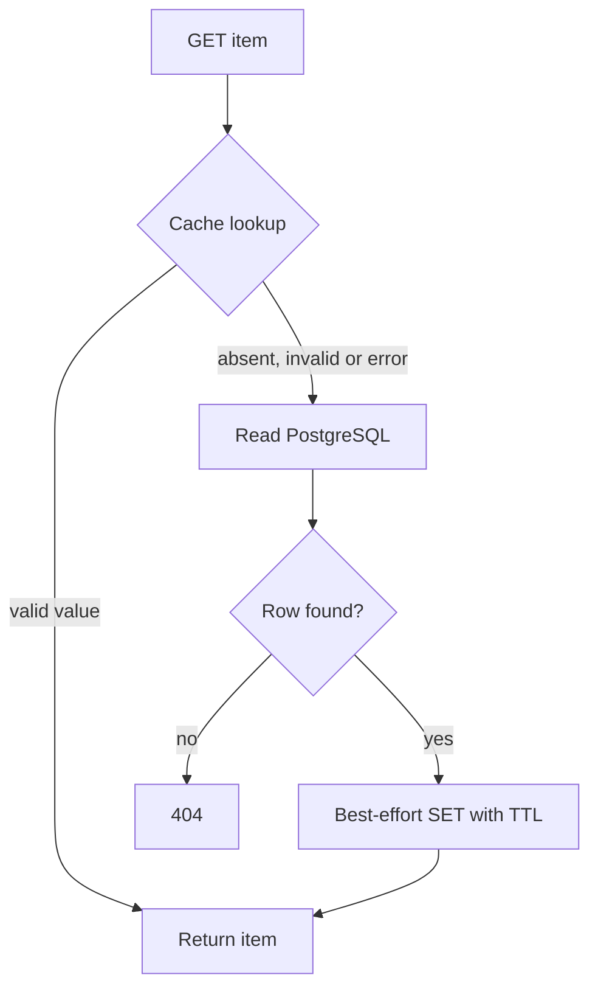

# Lab 03: Redis Cache-Aside and Graceful Degradation

## 1. Purpose and Learning Outcomes

**In Plain Language:** You will test Redis as a disposable copy of PostgreSQL data. Start with a cache miss and hit, then deliberately create expiry, stale data, malformed data, and a short Redis outage. The aim is to understand both why caching can speed up reads and why a successful response does not always prove that the data is fresh.

> **Primary Objective:** Prove the differences among cache hits, misses, expiry, invalidation, stale values and cache errors, then demonstrate PostgreSQL fallback and safe Redis recovery.

Lab 2 established PostgreSQL as the authoritative store. Redis holds a derived representation whose absence is normal and whose presence does not guarantee freshness.

The operational question is not simply “Is Redis up?” It is “What does this request do with the cache state it encounters, and what happens to correctness and database demand when that state changes?”

## 2. Starting Point and Lab Map

Use this guide inside the complete application repository. Run commands from the repository root in Bash unless a step says otherwise. Work through the starting checks in order; they load the helpers and state this lab needs.

Read the explanation before each step, run one complete code block at a time, and compare the actual result with the stated expectation. Save commands, observations, explanations, and unexpected results in your notebook.

### Key Terms

| **Term**     | **Plain-Language Meaning**                                                                    |
| ------------ | --------------------------------------------------------------------------------------------- |
| Cache-aside  | The application checks Redis first and reads PostgreSQL when the cached value cannot be used. |
| TTL          | The expiry time attached to one cached value.                                                 |
| Invalidation | Removing a cached copy after its authoritative value changes.                                 |

### Lab Map

The arrows show the flow or dependency being studied. Branches identify paths to compare; this is a conceptual map, not a captured runtime trace.


```mermaid
flowchart TD
    Request["GET item"] --> Lookup{"Cache lookup"}
    Lookup -->|"valid value"| Return["Return item"]
    Lookup -->|"absent, invalid or error"| DB["Read PostgreSQL"]
    DB --> Found{"Row found?"}
    Found -->|"no"| Missing["404"]
    Found -->|"yes"| Store["Best-effort SET with TTL"]
    Store --> Return
```

## 3. Guided Walkthrough

### Step 01. Inherited State

**What You Are Doing:** Continue with the application and data state established in the previous labs. The cache behavior already exists; you will expose its decisions through controlled experiments.

**Practical Walkthrough:** Start from the recovered database-error behavior and the existing three-service deployment. Redis is already integrated into the app, so your task is to expose decisions it makes during real requests. Keep the course checkpoint separate from this lab's fixtures and confirm no earlier outage or temporary cache corruption remains active.

Verify that PostgreSQL is accepting normal work and Redis is available before recording the first cache observation. Keep the checkpoint's identity unchanged. If a previous exercise left a worker bypass active or a synthetic value under a key, resolve that inherited state first; otherwise your new experiment would begin with an unrecorded cause.

Continue with the same three-service baseline and the connection-error hardening from Lab 2. Keep all telemetry backends stopped. The original course checkpoint remains in PostgreSQL.

The application already implements cache-aside. This lab will exercise its actual code rather than replace it with a generic cache tutorial. No new business feature or external service is required.

**Understanding the Result:** The same baseline makes changes attributable to the cache experiment. An unexplained inherited fault should be repaired before introducing another one.

### Step 02. Scope and Explicit Exclusions

**What You Are Doing:** Keep the work focused on one item's cache lifecycle. This avoids mixing basic correctness questions with later performance and incident-response measurements.

**Practical Walkthrough:** Use one item to explore the cache lifecycle from absent key to valid copy, expiry, stale copy, and recovery. The scope is correctness under controlled traffic. Later observability labs can ask how much load or latency each path adds, but those measurements are not required to establish these basic behaviors.

For each experiment, name the starting key state, the action that changes it, and the observation that distinguishes the result. A miss means no usable cached answer was available; staleness means a usable answer no longer matches the authoritative row. Those require different checks, even when both requests ultimately return HTTP 200.

You will test individual item GETs, fixed TTL, post-commit invalidation, direct-writer staleness, a controlled delayed-refill ordering, malformed cache content, optional-dependency outage and recovery bypass.

Do not add distributed locks, stampede protection, Redis replicas, exporter metrics or PromQL yet. Redis server counters are used here only as direct dependency evidence; time-series collection and monitoring come later.

List responses are not cached in this application. Keep that distinction when choosing test requests.

**Understanding the Result:** A cache miss, unusable cached document, stale hit, and failed Redis connection are distinct states. Keep their observations separate in your notes.

### Step 03. Prerequisites and Starting Checks

**What You Are Doing:** Verify readiness, namespace settings, and Redis access, then stop unrelated traffic. Cache counter changes are only interpretable when you know what else could have touched the server.

**Practical Walkthrough:** Load the namespace and selected Redis database from the running app, then verify both readiness and authenticated Redis access. These values determine which exact key you inspect. Stop competing clients because server-wide counters and a short TTL can otherwise change while you are trying to measure one request.

Read the printed service, environment, database number, and TTL together because they define the cache namespace and lifetime used in this deployment. `rcli PING` tests authenticated access through the helper. If access works but a key appears missing, verify its namespace and database before assuming the application failed to write it.

```bash
source lab-notes/session.sh
baseline_check
mkdir -p lab-notes/lab-03
printf 'service=%s environment=%s redis_db=%s ttl=%s\n' \
  "$LAB_SERVICE" "$LAB_ENVIRONMENT" "$LAB_REDIS_DB" "$LAB_CACHE_TTL"
rcli PING
```

**Expected Result:** `PONG`, fully ready application, exactly app/postgres/redis running. The default cache TTL is 30 seconds. The exercises explicitly shorten only their own test keys where a short expiry is needed; they do not change the production default.

Stop other load generators and avoid using the same exercise item in another terminal. A shared Redis server's counters can include other clients; controlled deltas require controlled traffic.

**Understanding the Result:** A PONG proves the selected connection can reach Redis. It does not prove your item's key exists or that the app used it for a particular response.

### Step 04. Measurable Learning Objectives

**What You Are Doing:** Use the objectives to check that you can explain freshness and fallback, not merely obtain a fast HTTP response.

**Practical Walkthrough:** Use the objectives to separate correctness, freshness, and performance claims. For example, a 200 response can contain a valid but older document, while an absent cache key can still lead to a correct database-backed response. The exercises deliberately produce those cases so the differences become concrete.

Use one concrete example for each objective: a missing key, a current hit, a stale hit, and an unavailable server. For every example, identify the expected API fields and SQL fields. This gives you a way to explain correctness from actual values instead of using response speed or status alone as a cache diagnosis.

By the end, you must be able to:

- map a valid hit, miss and error to the handler's terminal behavior;
- identify the exact cache namespace and Redis database number;
- distinguish missing keys, finite TTL and keys without expiration;
- measure a hit/miss without inferring it from latency alone;
- explain why ordinary hits do not extend this cache's TTL;
- prove PUT/DELETE invalidate after the PostgreSQL commit;
- demonstrate a successful but stale cached response;
- reproduce the ordering behind a delayed-refill race without relying on timing luck;
- verify malformed values fall back safely;
- keep CRUD functioning during a Redis outage;
- explain worker-local bypass after failed invalidation; and
- restore both dependency health and useful cache behavior.

**Understanding the Result:** For each objective, record the item ID, key state, and authoritative value. Those details are more useful than a general statement that Redis worked.

### Step 05. Cache-Aside Architecture

**What You Are Doing:** Follow the branch from a cache lookup to either a usable document or a PostgreSQL read. The database remains necessary whenever the cache cannot supply the requested item.

**Practical Walkthrough:** Read the cache decision as a shortcut that is attempted before the authoritative lookup. A usable document can be returned immediately; an absent or rejected document sends the request to PostgreSQL. If the row is found there, the app can attempt to prepare a cached copy for the next read.

Follow the miss path all the way through database lookup and attempted cache fill, then follow the hit path's earlier return. Keep the authoritative row separate from its serialized copy. When a later experiment disables Redis, ask whether PostgreSQL can still supply the requested data before predicting a successful fallback.

The lab map in Section 2 shows this relationship.

The cache is optional, but PostgreSQL is still required for normal business readiness. A hit can temporarily serve a known item without a database query; it cannot make arbitrary writes or uncached reads work during a database outage.

**Understanding the Result:** Fallback still requires a working database. Making Redis optional does not make every dependency optional or make writes independent of PostgreSQL.

### Step 06. Inspect the Actual Cache Contract

**What You Are Doing:** Read the actual key, value, expiry, and failure rules before measuring them. These details explain outcomes that a generic cache-aside description would leave ambiguous.

**Practical Walkthrough:** Inspect how the key is constructed, what document schema is accepted, when expiry is applied, and which failures trigger bypass. These implementation details explain later surprises such as Redis being reachable while the worker deliberately avoids cached reads. Treat the table as the cache contract you will test, not a universal Redis rule.

Locate the exact code responsible for key prefixes, document validation, expiry, and failed invalidation. Read each exception branch with its caller in `api.py` so you can tell whether failure changes the HTTP outcome or only the cache behavior. These source locations will help explain a recovered Redis server with temporarily absent cache traffic.

```bash
sed -n '1,240p' app/app/cache.py
rg -n 'get_item|set_item|invalidate|session.begin' app/app/api.py
```

Record these implementation facts:

| **Boundary**         | **Current Behavior**                                                     |
| -------------------- | ------------------------------------------------------------------------ |
| Key                  | service + environment + `items:v1` + item UUID                           |
| Value                | Validated ItemRead JSON                                                  |
| TTL                  | Applied on SET; ordinary GET does not refresh it                         |
| Hit                  | Valid JSON whose ID matches the requested item                           |
| Miss/error           | Fall back to PostgreSQL                                                  |
| Create/update/delete | Invalidate only after a successful DB transaction                        |
| Failed invalidation  | Bypass cache reads/writes in this worker for one configured TTL          |
| Corrupt document     | Log decode failure, invalidate and refill from PostgreSQL                |
| Redis connections    | Shared bounded pool, short connect/socket timeouts, no automatic retries |

The error path is intentional application behavior. Do not remove its exception handling to make Redis look “strictly required.”

**Understanding the Result:** Compare each experiment against this application's contract. Another service can use the same Redis server with different keys, expiry, and failure policies.

### Step 07. Create an Isolated Cache Subject

**What You Are Doing:** Create a dedicated row and remove its exact key. You now have authoritative data with no cached copy, which is the controlled starting condition for a miss.

**Practical Walkthrough:** Create a disposable item and derive its fully namespaced key from the saved UUID. Deleting only that key changes the derived copy while preserving the PostgreSQL row. This establishes a known cold-read starting point without disturbing another item, another environment, or a different Redis database.

Confirm the POST returned a valid UUID before deriving `KEY`. Save both identifiers, then delete only that key. The deletion establishes the experiment's initial condition; it does not remove the row. If the create failed, stop here rather than letting an empty or old shell variable target the wrong fixture.

```bash
api -fsS -H 'Content-Type: application/json' \
  -d '{"name":"Lab 03 version A","description":"Disposable cache subject","price":"30.00","is_active":true}' \
  "$APP_URL/api/v1/items" -o lab-notes/lab-03/item.json
ITEM_ID=$(jq -er '.id' lab-notes/lab-03/item.json)
printf '%s\n' "$ITEM_ID" > lab-notes/lab-03/item-id.txt
KEY=$(cache_key "$ITEM_ID")
rcli DEL "$KEY"
rcli EXISTS "$KEY"
```

**Expected Result:** `0` after deletion. The PostgreSQL row remains. Deleting one known cache key is a controlled experiment; `FLUSHDB` or `FLUSHALL` would unnecessarily affect unrelated data.

**Understanding the Result:** An absent key plus an existing SQL row is the intended setup. Deleting cached data is not deleting the business item.

### Step 08. Read Server Hit/Miss Counters Carefully

**What You Are Doing:** Take differences between Redis counter snapshots instead of resetting server statistics. Keep direct key inspections outside the measured interval because they can change those same counters.

**Practical Walkthrough:** Read the Redis statistics before and after a controlled operation and subtract the values. The counters accumulate server activity, so you do not need to reset them to zero. Keep direct GET or EXISTS inspections outside that interval because they can contribute the very lookup activity you are measuring.

Define `redis_stat` before the measurements that call it. The helper selects one named field from `INFO stats`; each measurement uses two readings and shell arithmetic to calculate the difference. Keep verification lookups after the second reading. That ordering prevents your own inspection from being counted as part of the single API request.

Define a small helper:

```bash
redis_stat() {
  local wanted="$1"
  rcli INFO stats | awk -F: -v wanted="$wanted" '
    $1 == wanted {gsub("\r", "", $2); print $2; found=1}
    END {if (!found) exit 1}
  '
}
redis_stat keyspace_hits
redis_stat keyspace_misses
```

These are Redis server counters, not the application's Prometheus counters. They include the relevant Redis key lookups from **all** clients using the server. INFO itself does not look up your cache key; direct GET/EXISTS inspections can affect the counters and should stay outside each measured window.

Do not reset global Redis statistics just to get small numbers. Measure before/after deltas.

**Understanding the Result:** A delta belongs to all relevant activity during the interval. If it is larger than predicted, first account for additional clients or inspection commands.

### Step 09. Predict and Measure a Controlled Miss

**What You Are Doing:** Issue one read with a known absent key. Compare the miss counter and final key state to confirm the lookup fell back and a usable cache entry was created.

**Practical Walkthrough:** Begin immediately after removing the exercise key. Save the miss count, make one individual API read, then save the count again before inspecting the filled key. This sequence keeps the measured lookup separate from the later verification commands and makes the expected one-request change understandable.

Read `misses_before`, perform the request once, and read `misses_after` without inserting extra key inspections. Only then inspect existence and content. Compare the saved response with the known row and the counter delta with your prediction. Unexpected extra misses call for checking other activity during the interval before changing application code.

You deleted the exact key. Predict:

- Does Redis return a value?
- Does the handler need PostgreSQL?
- Should the key exist after a successful response?

Measure:

```bash
misses_before=$(redis_stat keyspace_misses)
api -fsS "$APP_URL/api/v1/items/$ITEM_ID" -o lab-notes/lab-03/miss.json
misses_after=$(redis_stat keyspace_misses)
printf 'miss_delta=%s\n' "$((misses_after-misses_before))" \
  | tee lab-notes/lab-03/miss-delta.txt
rcli EXISTS "$KEY"
rcli GET "$KEY" | jq '{id,name,price}'
```

Expected under isolated traffic: miss delta `1`, existence `1`, valid JSON matching PostgreSQL. If the delta differs, investigate other key-inspection commands or concurrent traffic before blaming the application.

**Understanding the Result:** The response should agree with PostgreSQL and the key should become usable. A different counter delta does not by itself prove the handler took an incorrect branch.

### Step 10. Predict and Measure a Controlled Hit

**What You Are Doing:** Issue another read before expiry and measure the hit change. You are checking evidence of the cache branch rather than inferring it from response speed.

**Practical Walkthrough:** Ensure the key is present and has not expired, then measure around one more API read. Avoid reading the key inside the measurement window. The controlled setup gives the request a valid cached representation and the server counter provides additional evidence that the lookup found a value.

The first `jq -e` check confirms the cached document belongs to your fixture before timing the measured interval. The request then runs between the two hit-counter samples. Inspect the response afterward, preserving this order. A positive hit delta without matching item data would leave a correctness question even if Redis found a key.

Inspect the key before the measurement, then perform no extra key reads inside the window:

```bash
rcli GET "$KEY" | jq -e --arg id "$ITEM_ID" '.id == $id' >/dev/null
hits_before=$(redis_stat keyspace_hits)
api -fsS "$APP_URL/api/v1/items/$ITEM_ID" -o lab-notes/lab-03/hit.json
hits_after=$(redis_stat keyspace_hits)
printf 'hit_delta=%s\n' "$((hits_after-hits_before))" \
  | tee lab-notes/lab-03/hit-delta.txt
jq '{id,name,price}' lab-notes/lab-03/hit.json
```

**Command Note:** `jq --arg` passes a shell value as a JSON-query string variable without inserting it into the query text. Where used, `-e` turns a false or null final result into a failing exit status.

Expected hit delta: `1` before expiry. A valid cache document plus a hit on the request's exact lookup supports the branch explanation in `get_item`.

A smaller response time is not proof of a hit. Network, scheduling, connection reuse and tiny query times can make a database-served request fast too.

**Understanding the Result:** A measured hit is stronger evidence than a fast response. Tiny database reads, connection reuse, and scheduling can also produce short client durations.

### Step 11. Inspect Serialization and Identity Validation

**What You Are Doing:** Inspect the stored document's shape and item identity. A key being present is insufficient if its contents cannot safely represent the requested item.

**Practical Walkthrough:** Inspect the cached JSON and compare its UUID and fields with the expected response schema. The application accepts only a document that can represent this requested item; arbitrary JSON under the right key is not enough. Later corruption tests deliberately break this assumption to exercise the fallback behavior.

Read the cached fields individually, including the UUID and decimal representation, and compare them with the API document. Valid JSON syntax alone is insufficient: a document can parse yet fail the application's schema or identity check. Conversely, a document can pass those checks while containing an older version, which the later SQL comparison demonstrates.

```bash
rcli GET "$KEY" | jq '{id,name,price,is_active,created_at,updated_at}'
```

The document must be a valid ItemRead, not arbitrary JSON. The cache class also compares its ID to the requested UUID. A value of the wrong shape or identity is treated as unusable.

This validation limits accidental corruption. It does not authenticate Redis content against a hostile administrator. Access control and network boundaries still matter.

**Understanding the Result:** Schema and identity validation reject unusable content. They do not prove that a well-formed document is the latest committed version.

### Step 12. Understand TTL Values

**What You Are Doing:** Interpret the TTL result before taking action. Missing, expiring, and non-expiring keys represent different states and should not receive the same diagnosis.

**Practical Walkthrough:** Ask Redis for the key's remaining lifetime and read the result as a state indicator. Positive values describe an expiring entry, while the special negative values distinguish no expiry from no key. Tie the result to this exact key rather than making a statement about the whole cache server.

Interpret the complete TTL result: a positive number is remaining seconds, `-1` means the existing key has no expiry, and `-2` means no key exists. Record when you checked because time continues passing between commands. Do not describe a naturally expired key as lost business data without checking PostgreSQL independently.

```bash
rcli TTL "$KEY"
```

| **TTL Result**   | **Meaning**                                               |
| ---------------- | --------------------------------------------------------- |
| Positive integer | Whole seconds remaining before expiration                 |
| `0`              | Key exists but has less than roughly one second remaining |
| `-1`             | Key exists without an expiration                          |
| `-2`             | Key does not exist                                        |

This application's SET supplies a TTL, so `-1` suggests another writer or manual change. A `-2` is ordinary cache absence, not proof of business-data deletion. [Redis documents these TTL return values](https://redis.io/docs/latest/commands/ttl/).

**Understanding the Result:** A missing key is normal cache behavior. The separate PostgreSQL row determines whether the business item still exists.

### Step 13. Prove That Cache Hits Do Not Extend TTL

**What You Are Doing:** Shorten this key's lifetime and read it before expiry. A decreasing remaining TTL demonstrates that an ordinary hit does not renew the entry in this implementation.

**Practical Walkthrough:** Assign a short lifetime to the lab-owned key, note it, perform a read, and inspect it again promptly. You are testing whether GET renews the existing entry. If the key expires first, the request becomes a database-backed miss and a new SET can legitimately produce a longer lifetime.

Run the short sequence without pausing to investigate unrelated output between the TTL readings. `EXPIRE` changes this fixture's lifetime, and the later GET is the operation being tested. If execution takes longer than the assigned lifetime, repeat from a freshly warmed key; a newly filled key would answer a different question from renewal on a hit.

Apply a short TTL to only this exercise key:

```bash
api -fsS "$APP_URL/api/v1/items/$ITEM_ID" >/dev/null
rcli EXPIRE "$KEY" 8
rcli TTL "$KEY"
sleep 2
api -fsS "$APP_URL/api/v1/items/$ITEM_ID" >/dev/null
rcli TTL "$KEY"
```

The last TTL should be lower than the first, not reset to the configured 30 seconds. Complete this sequence promptly while the key still exists.

If it already expired, the GET becomes a miss and the refill legitimately uses the configured TTL. Repeat from a known key state before claiming sliding expiration exists.

**Understanding the Result:** Interpret a TTL jump together with the key's lifecycle. A refill after expiry is different from sliding expiry on every cache hit.

### Step 14. Expire the Key and Prove Persistence Is Unchanged

**What You Are Doing:** Let the derived value expire, then compare Redis, SQL, and HTTP. The row survives, and a later read can rebuild the cached copy.

**Practical Walkthrough:** Let this key expire and verify absence before sending another read. Check PostgreSQL independently to show that expiration did not remove the row. The subsequent successful API response and new TTL demonstrate reconstruction of disposable cached state from authoritative data.

Check the expired state before issuing the API read, since the read can create a new key immediately. Compare the SQL row with the saved fixture to establish persistence independently. Then inspect the refilled value and TTL as new derived state, making the sequence absence, authoritative read, and refill clear in your explanation.

```bash
rcli EXPIRE "$KEY" 2
sleep 3
rcli TTL "$KEY"
dbsql -v item_id="$ITEM_ID" <<'SQL'
SELECT count(*) FROM items WHERE id = :'item_id'::uuid;
SQL
api -fsS "$APP_URL/api/v1/items/$ITEM_ID" | jq '{id,name,price}'
rcli TTL "$KEY"
```

**Expected Result:** `-2`, database count `1`, HTTP 200, then a new positive TTL no greater than the configured value.

Expiry removes derived state. The API recreates that state from the source of truth.

**Understanding the Result:** Expiry changes the read path, not the row's ownership or durability. A later cache entry is a new derived representation of the still-existing item.

### Step 15. Prove Post-Commit Invalidation

**What You Are Doing:** Update a warmed item through the API and inspect both stores. This makes the order of database commit and cache invalidation visible.

**Practical Walkthrough:** Warm the item, then update it through the API using an explicit replacement body. Compare the committed database value with immediate key absence before another reader refills it. Finally read the item again and inspect the replacement cached representation to connect invalidation with the new value.

Keep the warm read, PUT, key check, and subsequent GET in their stated order. The key check immediately after PUT tests invalidation; the final GET tests rebuilding from the new row. If another reader runs between them, it may refill the key before you inspect it, so note concurrent activity rather than assuming invalidation never occurred.

Warm the item, then replace it:

```bash
api -fsS "$APP_URL/api/v1/items/$ITEM_ID" >/dev/null
api -fsS -X PUT -H 'Content-Type: application/json' \
  -d '{"name":"Lab 03 version B","description":"Updated through API","price":"31.00","is_active":true}' \
  "$APP_URL/api/v1/items/$ITEM_ID" -o lab-notes/lab-03/update.json
rcli EXISTS "$KEY"
dbsql -v item_id="$ITEM_ID" <<'SQL'
SELECT name, price FROM items WHERE id = :'item_id'::uuid;
SQL
api -fsS "$APP_URL/api/v1/items/$ITEM_ID" | jq '{name,price}'
rcli GET "$KEY" | jq '{name,price}'
```

Expected immediately after PUT: key `0`, committed DB version B, followed by refilled version B on GET.

Concurrent readers could repopulate the key before you inspect it. This exercise controls traffic so the invalidation boundary is visible.

**Understanding the Result:** The sequence should move from old cached value to absence to a new copy. A concurrent reader can make the absence interval too short to observe.

### Step 16. Why Invalidate After Commit?

**What You Are Doing:** Consider what another reader could observe while a write is still pending. The ordering reduces one stale-refill risk, while the following experiments show the remaining limits.

**Practical Walkthrough:** Imagine a reader arriving after early invalidation but before a writer commits: the reader could still fetch the old database value and cache it. Committing first avoids that particular ordering. However, readers already holding old data can still finish later, so this ordering alone is not a complete consistency protocol.

Write the interleaving as reader and writer actions with the commit point marked. Ask which version the reader can obtain before commit and when that reader might later write Redis. This explains why moving invalidation after commit improves one ordering without making the database transaction and cache update a single atomic operation.

Invalidating before a successful commit could let another reader refill old data while the transaction is still pending. Caching an uncommitted result could expose a write that later rolls back.

The repository commits first, then invalidates. That is a practical order, but it is not a distributed transaction and does not eliminate every race. The next experiments show exactly where its consistency guarantee ends.

**Understanding the Result:** Explain the guarantee narrowly: the API invalidates after its successful commit. It does not coordinate every possible writer and reader across both systems.

### Step 17. Predict a Direct Database Writer

**What You Are Doing:** Predict what happens when SQL changes the row without using the API. That writer does not automatically execute the application's invalidation code.

**Practical Walkthrough:** Predict the effect of changing the row through SQL rather than through the API. The SQL connection updates PostgreSQL but never executes the handler's post-commit cache invalidation code. Unless another mechanism is configured, Redis has no reason to know that this external writer changed the row.

Identify the code path the SQL writer bypasses: it changes the row without calling the API's invalidation method. Predict a disagreement between the direct SQL result and the warmed API response while the key remains valid. Keep the intended database update and the absence of cache notification as two separate parts of the experiment.

A maintenance script changes the row without calling the API. Will the application's cached copy be invalidated automatically?

Write the prediction before running. There is no database-change subscription, trigger-driven cache invalidation or change-data-capture stream in this repository.

**Understanding the Result:** The absence of automatic invalidation is a property of this integration. It is not evidence that the direct SQL update failed.

### Step 18. Demonstrate a Successful but Stale Response

**What You Are Doing:** Create a disagreement between the authoritative row and a still-valid cached copy. Compare actual values, since HTTP 200 only shows that the request completed successfully.

**Practical Walkthrough:** Start with a known warmed version, make the direct database change, and read through the API before the key expires. Compare actual field values rather than only status codes. This deliberately creates a short interval in which PostgreSQL and the valid cached document describe different versions of the same item.

Perform the read promptly after the direct update so the short expiry window remains meaningful. Compare the name in the saved HTTP body with the name now stored in SQL. If they already agree, check whether the key expired or was invalidated before concluding that an external writer automatically synchronizes Redis.

```bash
api -fsS "$APP_URL/api/v1/items/$ITEM_ID" >/dev/null
rcli EXPIRE "$KEY" 15
dbsql -v item_id="$ITEM_ID" <<'SQL'
UPDATE items
SET name = 'Lab 03 external writer', updated_at = now()
WHERE id = :'item_id'::uuid;
SELECT name FROM items WHERE id = :'item_id'::uuid;
SQL
api -fsS "$APP_URL/api/v1/items/$ITEM_ID" -o lab-notes/lab-03/stale.json
jq -r '.name' lab-notes/lab-03/stale.json
```

When performed before the shortened key expires:

- direct SQL sees `Lab 03 external writer`;
- HTTP returns 200 with the earlier `Lab 03 version B`.

If your key expired while you read the instructions, refill a known API version and repeat. The result is timing-sensitive by design, so inspect TTL before interpreting it.

We explicitly update `updated_at` because an external SQL writer does not run the ORM's normal update path.

**Understanding the Result:** HTTP 200 establishes successful response handling, not freshness. The SQL comparison is what reveals the stale cached value.

### Step 19. Recover Freshness by Expiration

**What You Are Doing:** Remove the stale value through expiry and repeat the read. Agreement with SQL demonstrates restored freshness for this item at this time.

**Practical Walkthrough:** Allow the stale entry to expire and repeat the API and SQL comparisons. With the derived value gone, the next individual read must obtain the current row before it can refill the cache. Keep the same item ID so the observed change cannot be attributed to querying a different object.

The shortened expiry is the recovery action for this deliberately stale key. After waiting, issue the same item request and inspect the replacement cached name. Matching the new SQL value shows this refill is current for the observation. Keep the earlier stale response as evidence of why successful status alone was insufficient.

```bash
rcli EXPIRE "$KEY" 2
sleep 3
api -fsS "$APP_URL/api/v1/items/$ITEM_ID" | jq -r '.name'
rcli GET "$KEY" | jq -r '.name'
```

**Expected Result:** both now show the external writer's committed value. A 200 status alone did not distinguish stale from fresh; comparing with the source of truth did.

The TTL limits how long a particular stored value can remain without replacement. It is not strict read-after-write consistency and does not set a universal upper bound on every concurrent request's start-to-finish delay.

**Understanding the Result:** Agreement afterward proves freshness for the current observation. It does not turn a TTL cache into strict read-after-write consistency for every concurrent request.

### Step 20. Reproduce the Delayed-Refill Ordering Deterministically

**What You Are Doing:** Reconstruct a race's ordering by deliberately writing an older document after invalidation. This demonstrates the possible stale state without claiming that concurrent HTTP requests reproduced the race.

**Practical Walkthrough:** Save an older valid document, complete a newer write and invalidation, then deliberately place that old document back under the key for a short lifetime. This reproduces the state ordering of a delayed reader without depending on thread scheduling. Remove the synthetic stale entry immediately after observing the result.

Check the captured old document's ID before inserting it again, and keep the insertion scoped to the same exercise key with the short expiry. Label the result as a constructed ordering example. Complete the explicit deletion and fresh read afterward so the synthetic stale state does not affect the outage experiment that follows.

An actual race depends on scheduling. Instead of hoping to trigger it, reproduce its state ordering with one synthetic cache document:

```bash
api -fsS "$APP_URL/api/v1/items/$ITEM_ID" >/dev/null
old_document=$(rcli GET "$KEY")
jq -e --arg id "$ITEM_ID" '.id == $id' <<<"$old_document" >/dev/null
api -fsS -X PUT -H 'Content-Type: application/json' \
  -d '{"name":"Lab 03 version C","description":"Committed before delayed refill","price":"32.00","is_active":true}' \
  "$APP_URL/api/v1/items/$ITEM_ID" >/dev/null
rcli EXISTS "$KEY"
rcli SET "$KEY" "$old_document" EX 5
api -fsS "$APP_URL/api/v1/items/$ITEM_ID" | jq '{name,price}'
dbsql -v item_id="$ITEM_ID" <<'SQL'
SELECT name, price FROM items WHERE id = :'item_id'::uuid;
SQL
```

This manually written SET represents a reader that obtained an earlier DB version, paused, then filled the cache after the writer's invalidation. It is a **simulation of the interleaving**, not proof that your HTTP requests concurrently triggered it.

The temporary stale value has a five-second TTL and affects only your item. Restore it immediately:

```bash
rcli DEL "$KEY"
api -fsS "$APP_URL/api/v1/items/$ITEM_ID" | jq '{name,price}'
```

Record what a stronger consistency design would need to coordinate. Do not introduce a distributed-lock implementation in this lab.

**Understanding the Result:** Call this a simulation of the race's ordering. It demonstrates a possible stale state, not proof that your HTTP clients concurrently triggered that race.

### Step 21. Corrupt One Cache Value and Observe Safe Fallback

**What You Are Doing:** Replace only the test key with an unusable value. Observe how validation rejects it and how PostgreSQL provides a correct response and replacement cache entry.

**Practical Walkthrough:** Put a malformed document only under the exercise key and make the normal read. The cache code should reject the value, record a safe decode failure, and obtain the real item from PostgreSQL. Inspect the returned fields and repaired key to see that the fallback produced useful data rather than only suppressing an exception.

The inserted object is syntactically JSON but lacks the item schema expected by the cache reader. Compare the API result, repaired key, and safe failure log as three observations of rejection and fallback. If PostgreSQL is unavailable, restore it before repeating; this step relies on the authoritative read to repair the unusable copy.

```bash
rcli SET "$KEY" '{"invalid":true}' EX 10
api -fsS "$APP_URL/api/v1/items/$ITEM_ID" -o lab-notes/lab-03/corrupt-fallback.json
jq '{id,name,price}' lab-notes/lab-03/corrupt-fallback.json
rcli GET "$KEY" | jq -e --arg id "$ITEM_ID" '.id == $id and .name == "Lab 03 version C"'
dc logs --since=2m --no-color --no-log-prefix app \
  | rg 'cache_operation_failed' | tail -n 5
```

**Expected Result:** a normal 200 with current data, a repaired valid cached document, and a sanitized failure event whose operation is `decode`.

Do not parse every runtime log as JSON blindly; this step filters a known application event. Full log structure, request IDs and evidence conventions are Lab 6 topics.

**Understanding the Result:** Successful repair depends on a usable authoritative source. A corrupted key plus a failed database can legitimately prevent the request from succeeding.

### Step 22. Predict Redis Failure Before Changing State

**What You Are Doing:** Predict which operations need Redis and which can fall back to PostgreSQL. Include the recovery period, because a restarted cache is not necessarily empty.

**Practical Walkthrough:** Predict reads, writes, listing, readiness, and post-restart cache contents separately. Writes still commit in PostgreSQL before attempting invalidation, so their cache failure can affect what happens after Redis returns. Redis persistence also means a restart should not be assumed to erase every old cached value.

Include a prediction for the write's cache invalidation attempt, not only the HTTP response. A write can commit while Redis is down, leaving older cached state relevant after restart. Mark the worker's bypass policy as part of the recovery phase so restored connectivity is not mistaken for immediate permission to serve every surviving key.

| **Operation**              | **Your Prediction**                                            |
| -------------------------- | -------------------------------------------------------------- |
| GET a known item           | What happens when cache lookup raises?                         |
| POST a valid item          | Is a successful DB commit rejected because invalidation fails? |
| PUT an item                | Which store changes first?                                     |
| List items                 | Does it use Redis at all?                                      |
| Readiness                  | Is the failed dependency required or optional?                 |
| Cache after Redis recovery | Can an old value survive or is it guaranteed gone?             |

Redis AOF persistence and TTL can preserve or expire keys across downtime. Do not assume a restarted Redis is empty.

**Understanding the Result:** The outage's recovery phase is part of the correctness question. Restored connectivity alone does not establish that cached data is safe to use immediately.

### Step 23. Run a Bounded Redis Outage and Write through PostgreSQL

**What You Are Doing:** Run a short Redis outage while performing real reads and writes. The recovery block restores Redis, while the saved responses show whether the optional-cache policy held.

**Practical Walkthrough:** Run the complete bounded subshell so restoration remains attached to the fault. While Redis is stopped, issue the planned reads and mutations and save their responses. A successful mutation during this period exercises failed invalidation, which is the trigger for the worker's later temporary bypass behavior.

Run the entire subshell so the Redis restart remains attached to both success and early exit. Inspect saved business responses before interpreting the cache errors. Keep the outage-created item's ID for cleanup, and verify PostgreSQL contains the intended update. After restoration, check full readiness before observing the worker's distinct cache-recovery behavior.

```bash
(
  set -euo pipefail
  trap 'dc start redis >/dev/null' EXIT
  trap 'exit 130' INT
  trap 'exit 143' TERM
  dc stop redis
  api -fsS "$APP_URL/api/v1/items/$ITEM_ID" \
    -o lab-notes/lab-03/redis-down-read.json
  api -fsS -X PUT -H 'Content-Type: application/json' \
    -d '{"name":"Lab 03 written during Redis outage","description":"PostgreSQL remains authoritative","price":"33.00","is_active":true}' \
    "$APP_URL/api/v1/items/$ITEM_ID" \
    -o lab-notes/lab-03/redis-down-update.json
  api -fsS -H 'Content-Type: application/json' \
    -d '{"name":"Lab 03 outage create","price":"3.00"}' \
    "$APP_URL/api/v1/items" -o lab-notes/lab-03/outage-create.json
  api -fsS "$APP_URL/api/v1/items?limit=1" >/dev/null
  api -fsS "$APP_URL/health/ready" \
    | tee lab-notes/lab-03/redis-down-ready.json | jq .
  dbsql -v item_id="$ITEM_ID" <<'SQL'
SELECT name, price FROM items WHERE id = :'item_id'::uuid;
SQL
)
wait_ready
```

**Command Note:** `trap ... EXIT` schedules cleanup when that shell exits. Keep it in the same block as the fault; the explicit recovery checks afterward confirm that restoration actually succeeded.

**Expected Result:** reads/updates/list succeed, POST creates a row, readiness is HTTP 200 with `status: degraded`, PostgreSQL `up` and Redis `down` while stopped. After the subshell exits, Redis starts and fully ready state returns.

`wait_ready` intentionally waits for both dependencies, even though degraded readiness is acceptable for serving business traffic. It establishes a known laboratory baseline before the next experiment.

**Understanding the Result:** The expected degraded readiness still permits required PostgreSQL-backed work. The final fully-ready check establishes a clean baseline for examining recovery behavior.

### Step 24. Inspect the Failure Evidence

**What You Are Doing:** Inspect the application's failure records and the writes completed during the outage. This connects a caught cache error to the successful business work that continued.

**Practical Walkthrough:** Find the cache failure records from the same interval and compare them with the saved successful business responses. Identify the operation and sanitized error category, rather than expecting a connection string or raw exception payload. The evidence should explain both the cache problem and the application work that continued.

Match the log interval to the outage you just performed and identify whether the failed operation was reading, writing, or invalidating a key. Compare that failure with the associated successful business document. A handled cache failure explains degraded execution, but its log alone does not prove the final item values or the later freshness result.

```bash
dc logs --since=5m --no-color --no-log-prefix app \
  | rg 'cache_operation_failed' | tail -n 12
jq '{id,name,price}' lab-notes/lab-03/redis-down-update.json
jq -er '.id' lab-notes/lab-03/outage-create.json
```

Expect bounded operation/error-type context rather than passwords or Redis connection strings. The code records Redis errors and uses short timeouts; it cannot promise zero latency cost during failure.

Do not turn retries up indiscriminately. Repeated attempts at an unavailable optional cache can amplify latency and load while PostgreSQL is already doing more work.

**Understanding the Result:** A caught cache exception can coexist with a successful request. It can still add waiting and database load, which later incident labs measure.

### Step 25. Understand the Recovery Bypass

**What You Are Doing:** Understand the temporary bypass before diagnosing missing keys after recovery. A failed invalidation makes this worker avoid potentially stale cache content for a configured interval.

**Practical Walkthrough:** After a failed invalidation, this worker temporarily avoids both reading and filling cache entries. The delay gives older cached representations time to become unusable under the configured lifetime. The bypass deadline is local process state, so it should not be confused with Redis health or a flag shared across all possible workers.

Locate where the bypass deadline is set and where cache reads and fills consult it. The deadline belongs to this running worker; Redis being reachable does not clear it by itself. Leave the process running during the observation so you test the intended elapsed-time policy rather than erasing its state through an application restart.

A failed invalidation sets `_bypass_until` to the current monotonic time plus one configured TTL. Until that deadline, this worker skips cache reads and fills, while still serving through PostgreSQL.

Consequences:

- Redis can be reachable again while item reads temporarily continue bypassing it.
- The bypass is in this process's memory, not a distributed flag.
- Restarting the app clears it; doing so is not the right way to “repair” a normal bypass window.
- It protects against pre-existing entries for this single worker, but not every delayed refill or future multi-worker race.
- A read-only Redis outage does not necessarily set bypass; the trigger is a failed invalidation.

Your PUT and POST during the outage exercised that trigger.

**Understanding the Result:** Redis can be up while the app intentionally keeps using PostgreSQL. Restarting the worker to erase the deadline would change the behavior you are trying to verify.

### Step 26. Prove Correct Data Immediately After Recovery

**What You Are Doing:** Check that reads immediately after Redis recovery reflect writes made during the outage. Correct data matters even while the worker is deliberately not filling Redis.

**Practical Walkthrough:** Read the item immediately after Redis returns and compare it with the value committed during the outage. Focus first on correctness of the returned data. Key absence can be expected while bypass remains active, so it should not distract from the more important question of whether an old value leaked back into the response.

Compare the returned name and price directly with the row committed during the outage. This is the critical freshness check immediately after reconnection. If the response is correct while no key is being filled, inspect the bypass timing before diagnosing a fault. The referenced regression test provides a controlled version of the same recovery contract.

```bash
api -fsS "$APP_URL/api/v1/items/$ITEM_ID" \
  | tee lab-notes/lab-03/recovery-read.json | jq '{name,price}'
dbsql -v item_id="$ITEM_ID" <<'SQL'
SELECT name, price FROM items WHERE id = :'item_id'::uuid;
SQL
```

Both must show the value committed during the outage. Whether a key exists immediately is secondary: the process may still be deliberately bypassing cache.

A separate isolated test covers the specific case where an old cached value survives recovery. Read it rather than assuming this short runtime drill always preserves the old key:

```bash
rg -n -A 20 '^async def test_redis_outage_and_stale_recovery' app/tests/test_api.py
```

**Understanding the Result:** Correct data and temporarily absent cache entries can be a healthy recovery state. Inspect the bypass window before diagnosing failed cache population.

### Step 27. Prove Cache Functionality Returns After the Window

**What You Are Doing:** Wait within a bounded loop until the cached representation is correct again. This checks the end of the bypass behavior without restarting the application or erasing unrelated keys.

**Practical Walkthrough:** Use the bounded loop to retry the observation until the cache contains the correct current representation. Each attempt should check both key content and the expected item version, since an old surviving key would not prove recovery. Let the existing timing policy complete instead of resetting the app or clearing unrelated keys.

Read the loop's success condition before starting it: a key must contain the expected current item, not merely exist. The finite attempt count prevents indefinite waiting. If the final assertion fails, retain the observed content and elapsed time, then inspect the bypass and cache-write path instead of restarting the app solely to force a pass.

Use a finite wait based on the configured TTL. At the default this takes no more than about 35 seconds plus request time. For a deliberately much larger TTL, expect a longer experiment and plan it before starting.

```bash
cache_recovered=false
for ((attempt=0; attempt<LAB_CACHE_TTL+5; attempt++)); do
  api -fsS "$APP_URL/api/v1/items/$ITEM_ID" >/dev/null
  if [[ "$(rcli EXISTS "$KEY")" = 1 ]]; then
    cached_name=$(rcli GET "$KEY" | jq -r '.name')
    if [[ "$cached_name" = 'Lab 03 written during Redis outage' ]]; then
      cache_recovered=true
      break
    fi
  fi
  sleep 1
done
test "$cache_recovered" = true
rcli TTL "$KEY"
```

This loop does not reset the app or flush all keys. It proves an acceptable current representation is cached again.

If an old value exists while bypass is active, the loop will reject it and continue until it expires or a valid refill occurs.

**Understanding the Result:** A correctly refilled key demonstrates resumed cache functionality. If the deadline is exceeded, preserve the actual key and timing evidence for diagnosis.

### Step 28. Separate Basic Cache Behavior from a Full Incident

**What You Are Doing:** Separate low-volume correctness from capacity under sustained failure. You have established the fallback path; later incident labs measure the extra demand it puts on PostgreSQL.

**Practical Walkthrough:** Review what the short experiments established: correct fallback, bounded stale-state demonstrations, and eventual cache reuse. They used a small controlled workload. Under heavier traffic, the same successful fallback path can create much more PostgreSQL work, so later measurements are needed to judge whether the system can sustain it.

List which properties your evidence directly established and which would require a different workload. The small experiments demonstrate paths and values, while sustained dependency load would need throughput, latency, and resource observations. Use this distinction to explain why a successful fallback in a single request can coexist with an operational capacity problem later.

You have proved fallback and recovery at low, controlled traffic. You have **not** measured production p95 latency, database amplification under sustained load, memory saturation or alert quality.

Lab 45 revisits Redis failure after metrics, dashboards, logs, traces and profiles are available. It will ask whether graceful degradation remains sustainable at load, not merely whether one fallback request succeeds.

**Understanding the Result:** Keep correctness and capacity claims separate. One successful database-backed read during a cache outage is not a performance or availability guarantee at production load.

### Step 29. Exercise Delete Invalidation and Clean Up

**What You Are Doing:** Delete the disposable rows and verify their keys disappear. Preserve the original course checkpoint so later labs still have known durable data.

**Practical Walkthrough:** Delete the main exercise item and any item created during the outage using their saved IDs. Verify both SQL absence and the corresponding key's removal. Leave the original course checkpoint in place and keep evidence files, because cleanup should remove test data without erasing the explanation of what happened.

Use the saved IDs to enumerate only the fixtures created in this lab, including the outage create. Verify deletion through SQL and exact-key checks after the API operation. Retain the shared course checkpoint. Finish with restored dependencies and no synthetic stale or corrupt key so the following health lab starts from a known state.

```bash
OUTAGE_ITEM_ID=$(jq -er '.id' lab-notes/lab-03/outage-create.json)
api -fsS "$APP_URL/api/v1/items/$ITEM_ID" >/dev/null
api -fsS -X DELETE "$APP_URL/api/v1/items/$ITEM_ID" -o /dev/null
rcli EXISTS "$KEY"
dbsql -v item_id="$ITEM_ID" <<'SQL'
SELECT count(*) FROM items WHERE id = :'item_id'::uuid;
SQL
api -fsS -X DELETE "$APP_URL/api/v1/items/$OUTAGE_ITEM_ID" -o /dev/null
baseline_check
```

Expected key existence and row count: both `0`. Keep the original course checkpoint from Lab 1.

**Understanding the Result:** Use scoped identity-based cleanup. An already absent fixture is a state to confirm, not a reason to flush the entire cache or delete all rows.

## 4. Troubleshooting and Diagnosis

Start with the first unexpected result. Record the exact symptom, identify which component produced it, and use the checks below before repeating the experiment. After a fix, repeat the original check and confirm recovery.

### Troubleshooting Runbook

#### A. “The Hit Counter Changed by More than One”

Check other clients and whether you used GET/EXISTS between the before/after INFO snapshots. These are Redis-wide counters, not a request-scoped instrument. Repeat one controlled request.

#### B. “TTL Unexpectedly Jumped Upward”

The key may have expired and been refilled. Read the code: GET does not extend TTL; SET applies the configured TTL. Complete the observation before expiry.

#### C. “Redis Is Healthy but No Key Appears After Recovery”

Check the failed-invalidation bypass window. A healthy cache server and a worker deliberately bypassing it are compatible states.

#### D. “A Cache Value Has TTL -1”

Inspect who wrote it. The application's normal fill uses expiration; a manual SET without EX can create a persistent key. Restore a safe state with `rcli DEL "$KEY"` then a valid item GET.

#### E. “A Corrupt Value Produced 503”

Corruption fallback requires PostgreSQL. Check database readiness and the real row. Cache repair cannot read from an unavailable source of truth.

#### F. “The Stale Response Experiment Returned the Latest Value”

The key may have expired before the request or another operation invalidated it. Establish version B, warm it, set the short TTL, then run the direct write and GET promptly. Do not increase TTL on unrelated keys.

#### G. “Redis Authentication Fails”

Use `rcli`, and confirm the server/app use the same configured secret. Changing `.env` alone does not update a running container; Lab 5 explains recreation. Do not put secrets into command output.

#### H. “The Outage Left Redis Stopped”

```bash
dc start redis
wait_ready
```

A trap cannot run after host loss or SIGKILL. Verify recovery explicitly and continue from a known item/key state.

#### I. “A Name Changed in SQL but Not through the API”

That may be the staleness experiment working. Compare the exact ID, key namespace, TTL and API body before changing code.

### Evidence-Based Cache Diagnostic Sequence

1. Identify the exact item UUID, cache namespace and Redis database.
2. Confirm what PostgreSQL currently stores.
3. Inspect key existence, TTL and value only for that item.
4. Determine whether the worker is using or bypassing cache.
5. Reproduce one request and compare controlled observations.
6. Distinguish absent data, invalid cached data, stale data and transport failure.
7. Recover the changed dependency or exact key and verify both data and cache behavior.

A cache miss, a Redis error and a stale hit are three different operational conditions. They should not be described as one generic “cache problem.”

## 5. Review and Practice

Answer the knowledge questions in your own words before reading the answer guide. For the scenario, name the evidence you would collect and the conclusion each observation would support.

### Knowledge Check

1. What is cache-aside in this API?
2. Which routes bypass the item cache entirely?
3. Why does POST not guarantee an existing cache entry?
4. What do TTL values 0, -1 and -2 mean?
5. Does a cache hit extend the TTL here?
6. Why can direct SQL create a stale API response?
7. What does a successful HTTP 200 fail to prove about freshness?
8. What race did the manual delayed SET simulate?
9. Why is that simulation different from reproducing real concurrent requests?
10. What happens to invalid cached JSON?
11. Why can CRUD continue during a Redis outage?
12. What triggers worker-local cache bypass?
13. Why can readiness recover before caching resumes?
14. What can Redis-wide hit counters not tell you by themselves?
15. Why is a low-load fallback test insufficient for a full incident assessment?

#### Answer Key

1. Check cache, fall back to PostgreSQL on miss/error, then best-effort fill.
2. List and writes do not read their business result from the item cache.
3. It invalidates after commit; individual reads populate.
4. Less than about one second remaining, no expiry, and missing key respectively.
5. No; only a SET resets expiration.
6. It bypasses the API's invalidation path.
7. Whether the derived representation matches current authoritative state.
8. An older read filling after a newer write invalidated the key.
9. It establishes the state ordering deliberately, not through concurrent HTTP scheduling.
10. Decode/identity validation fails; the key is invalidated and PostgreSQL supplies a refill if available.
11. PostgreSQL remains authoritative and cache failures are caught with bounded waits.
12. Failure of a post-commit invalidation attempt.
13. Server connectivity can return before the worker's monotonic bypass deadline.
14. Which client/request caused the change, or whether a returned value was fresh.
15. Database load, latency and saturation may become unacceptable at scale.

### Professional Scenario Exercise

An operator reports:

> “Redis restarted and returns PONG, but database traffic is still high and several keys are absent. The app must be broken.”

Write a response that distinguishes server reachability, TTL expiry, the worker's invalidation-failure bypass, a valid empty cache and a stampede risk. State which evidence to collect before restarting the application, and what load-related questions remain for Lab 45.

## 6. Completion Checklist

Mark each item only after you can point to its result or evidence file. Complete any cleanup shown here before moving on.

### Completion Criteria

- [ ] You measured controlled miss and hit deltas without claiming latency is proof.
- [ ] You explained the scope of Redis server counters.
- [ ] TTL expiration removed a key without deleting the row.
- [ ] Ordinary hits did not slide the TTL.
- [ ] API writes invalidated the exact key after commit.
- [ ] A direct writer produced a bounded stale response.
- [ ] You simulated and explained the delayed-refill ordering accurately.
- [ ] Malformed cache content fell back and was repaired.
- [ ] Reads and writes succeeded through PostgreSQL during Redis failure.
- [ ] Redis was restored and the committed outage value remained correct.
- [ ] You explained bypass and proved valid caching returned.
- [ ] Temporary rows/keys were removed and the baseline is fully ready.

## 7. Production Context and Next Lab

### Production Implications

Cache-aside improves many read paths, but cache correctness is a policy, not an automatic property of Redis. Agree on acceptable staleness, invalidation ownership and behavior during outages. Use bounded timeouts, avoid retry amplification and measure the additional demand placed on PostgreSQL.

Worker-local bypass helps this single-worker implementation; it is not cross-replica coordination. Financial correctness, authorization state or strict read-after-write workflows need a stronger design than this TTL cache. AOF persistence does not make Redis authoritative business storage.

### End State and Transition to Lab 04

```bash
baseline_check
CHECKPOINT_ID=$(cat lab-notes/checkpoint-item-id.txt)
api -fsS "$APP_URL/api/v1/items/$CHECKPOINT_ID" | jq '{id,name,price}'
```

Next: [Lab 04 — Liveness, Readiness, and Dependency Health](Lab-04.md).

You have seen required and optional dependency failures. Lab 4 turns those observations into explicit health contracts and proves why process health, dependency reachability and useful business work must be assessed separately.