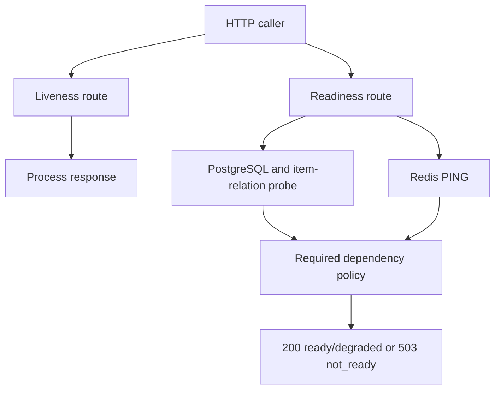

# Lab 04: Liveness, Readiness, and Dependency Health

## Purpose and Scope

> **Primary Objective:** Define and prove separate contracts for process liveness, business readiness and individual dependency health, including required PostgreSQL and optional Redis behavior.

A green container state, a successful cache hit and a ready application answer different questions. This lab makes those questions explicit and tests every dependency combination without introducing a monitoring backend.

The updated roadmap places this lab after persistence and cache behavior because health policy must follow the application's real dependency contract.

## 1. Inherited State

Continue from Lab 3 with:

- app, postgres and redis running;
- the original course checkpoint preserved;
- the connection-failure translation from Lab 2;
- no unfinished cache corruption/staleness experiment;
- no Collector, Prometheus, Grafana, Loki, Tempo, Pyroscope or Alertmanager running; and
- the shared Bash helpers from Lab 1.

The earlier labs established how dependencies behave. This lab compares what the API, dependency probes and Docker each report about that behavior.

## 2. Scope and Exclusions

You will inspect and test the existing health implementation, collect an explicit status matrix, distinguish startup ordering from runtime health, prove a cache hit can mask required-dependency failure, and validate recovery.

Do not add Kubernetes probes, an automatic restart watcher, a blackbox exporter, alert rules or a reverse proxy. Health signaling is the subject here; orchestration and alert policy are separate consumers of that signal.

## 3. Clean Starting State

```bash
source lab-notes/session.sh
baseline_check
mkdir -p lab-notes/lab-04
api -fsS "$APP_URL/health/live" | jq .
api -fsS "$APP_URL/health/ready" | jq .
```

Expected:

```json
{"status":"alive"}
```

```json
{"status":"ready","dependencies":{"postgres":"up","redis":"up"}}
```

If readiness is already degraded, repair that known condition first. A failure experiment starting from an unexplained failure cannot isolate cause and effect.

## 4. Measurable Learning Objectives

You must be able to:

- state precisely what liveness does and does not prove;
- explain why PostgreSQL is required but Redis is optional;
- predict status codes and dependency details in all four dependency combinations;
- demonstrate a live process that is not ready for normal business traffic;
- show a cached read succeeding while required persistence is unavailable;
- prove the container health check calls liveness, not readiness;
- distinguish container `running`, Docker `healthy`, application `ready`, and a successful user operation;
- explain why fresh startup and an established process behave differently;
- identify probe timeouts, concurrency and freshness boundaries; and
- demonstrate recovery using both health checks and CRUD.

## 5. Three Health Questions

| **Signal** | **Question it answers** | **What it does not prove** |
|---|---|---|
| `/health/live` | Can this application process answer this HTTP request? | Database access, fresh item data, successful writes or telemetry delivery |
| `/health/ready` | Can this instance currently serve required business functionality? | Every future request will succeed; every downstream system is perfect |
| Dependency probe | Did this particular dependency check succeed? | All business queries, all identities, all operations or future availability |

Liveness is intentionally independent of PostgreSQL, Redis and every observability component. Readiness depends on the required persistence path. Redis changes readiness detail to `degraded` but does not force an unavailable response when PostgreSQL works.

## 6. Health Architecture



The readiness route probes PostgreSQL and Redis concurrently. It does not contact Prometheus, Loki, Tempo, Pyroscope, Grafana or Collector.

## 7. Read the Actual Contract in Code

```bash
rg -n 'async def live|async def ready|asyncio.gather|status_code=200 if postgres' app/app/main.py
rg -n 'async def check|asyncio.timeout|select\(Item.id\)' app/app/database.py
rg -n 'async def check|ping|socket_timeout' app/app/cache.py
rg -n 'HEALTHCHECK' app/Dockerfile
```

Read the surrounding functions in your editor. Verify:

- `live` returns a static status without calling dependencies;
- `ready` waits for both probe results, then bases HTTP readiness on PostgreSQL;
- `Database.check` performs `SELECT 1` and an item-relation/ID-column query;
- `Cache.check` performs an authenticated Redis PING;
- Docker probes `/health/live`.

The database probe catches a missing item relation, but it is not an exhaustive schema-drift or Alembic-head verifier. A future incompatible column change still requires migration discipline and application tests.

## 8. Write the Expected Matrix Before Injecting Failure

Fill the right-hand columns yourself, then compare after each experiment:

| **PostgreSQL** | **Redis** | **Live HTTP** | **Ready HTTP/body** | **Required business behavior** |
|---|---|---|---|---|
| Up | Up | Prediction | Prediction | Prediction |
| Up | Down | Prediction | Prediction | Prediction |
| Down | Up | Prediction | Prediction | Prediction |
| Down | Down | Prediction | Prediction | Prediction |

Expected contract after you have made a prediction:

| **PostgreSQL** | **Redis** | **Live HTTP** | **Ready HTTP/body** | **Business impact** |
|---|---|---|---|---|
| Up | Up | 200 | 200 / `ready` | Normal CRUD |
| Up | Down | 200 | 200 / `degraded` | CRUD via PostgreSQL; cache unavailable |
| Down | Up | 200 | 503 / `not_ready` | Writes/list/misses fail; selected cached reads may succeed |
| Down | Down | 200 | 503 / `not_ready` | Required persistence unavailable and no usable cache path |

A process failure adds another row: no HTTP response at all. It is different from an application-generated 503.

## 9. Define a Repeatable Health Capture

```bash
capture_health() {
  local label="$1"
  local endpoint code
  for endpoint in live ready; do
    code=$(api -sS -o "lab-notes/lab-04/${label}-${endpoint}.json" \
      -w '%{http_code}' "$APP_URL/health/$endpoint") || return 1
    printf '%s %s HTTP %s\n' "$label" "$endpoint" "$code" \
      | tee -a lab-notes/lab-04/statuses.txt
    jq . "lab-notes/lab-04/${label}-${endpoint}.json" || return 1
  done
}
capture_health all-up
```

This helper does not use `--fail`, because an expected 503 is valid experimental evidence. A network failure still makes curl fail. Do not treat `HTTP 000` as an application status code; it means no HTTP status was received.

## 10. Record the Container's Independent View

```bash
APP_CONTAINER=$(dc ps -q app)
docker inspect --format \
  'id={{.Id}} status={{.State.Status}} started={{.State.StartedAt}} restarts={{.RestartCount}}' \
  "$APP_CONTAINER" | tee lab-notes/lab-04/app-before.txt
docker inspect --format '{{json .Config.Healthcheck}}' "$APP_CONTAINER" | jq .
docker inspect --format '{{json .State.Health}}' "$APP_CONTAINER" | jq .
```

Docker's health history includes probe executions, not every public readiness call. The container can be running and healthy while a required dependency is down because its probe checks process liveness.

Do not dump the full inspect output into shared evidence; it contains the container environment and therefore secrets.

## 11. Optional Dependency Experiment: Redis Down

Predict first, then run the controlled subshell:

```bash
(
  set -euo pipefail
  trap 'dc start redis >/dev/null' EXIT
  trap 'exit 130' INT
  trap 'exit 143' TERM
  dc stop redis
  capture_health redis-down
  jq -e '.status == "degraded" and .dependencies.postgres == "up" and .dependencies.redis == "down"' \
    lab-notes/lab-04/redis-down-ready.json >/dev/null
  api -fsS "$APP_URL/api/v1/items?limit=1" \
    -o lab-notes/lab-04/redis-down-list.json
  docker inspect --format '{{json .State.Health}}' "$APP_CONTAINER" \
    > lab-notes/lab-04/redis-down-container-health.json
)
wait_ready
capture_health redis-restored
```

Expected: both HTTP health codes remain 200, readiness describes degraded cache, the uncached list succeeds, and Docker does not restart the app.

This is not a claim that Redis failure has no operational cost. Lab 3 showed fallback; later monitoring labs will quantify latency and database amplification.

## 12. Why Optional Redis Must Not Fail Readiness Here

A readiness gate determines whether normal business traffic should reach an instance. This application can still perform its required PostgreSQL-backed work without Redis.

Making Redis failure return readiness 503 would remove otherwise useful capacity and could turn a cache outage into a wider availability incident. Another application may genuinely require Redis for correctness or coordination; its policy could differ. The contract follows the workload, not the tool's name.

## 13. Prepare a Fresh Cache-Mask Subject

```bash
api -fsS -H 'Content-Type: application/json' \
  -d '{"name":"Lab 04 health subject","description":"Disposable readiness exercise","price":"40.00","is_active":true}' \
  "$APP_URL/api/v1/items" -o lab-notes/lab-04/item.json
ITEM_ID=$(jq -er '.id' lab-notes/lab-04/item.json)
KEY=$(cache_key "$ITEM_ID")
api -fsS "$APP_URL/api/v1/items/$ITEM_ID" >/dev/null
rcli EXPIRE "$KEY" 120
rcli TTL "$KEY"
```

This extends only the synthetic exercise key to two minutes so it survives the short database outage. It does not change the app's configured TTL or other keys. Delete it at recovery rather than leaving this temporary policy behind.

If a prior failed-invalidation bypass is still active, the key may not populate. Finish the Lab 3 recovery check before proceeding.

## 14. Required Dependency Experiment: PostgreSQL Down

```bash
(
  set -euo pipefail
  trap 'dc start postgres >/dev/null' EXIT
  trap 'exit 130' INT
  trap 'exit 143' TERM
  dc stop postgres
  capture_health postgres-down
  jq -e '.status == "not_ready" and .dependencies.postgres == "down" and .dependencies.redis == "up"' \
    lab-notes/lab-04/postgres-down-ready.json >/dev/null

  cached_status=$(api -sS -o lab-notes/lab-04/cached-during-db-outage.json \
    -w '%{http_code}' "$APP_URL/api/v1/items/$ITEM_ID")
  list_status=$(api -sS -o lab-notes/lab-04/list-during-db-outage.json \
    -w '%{http_code}' "$APP_URL/api/v1/items?limit=1")
  printf 'cached_get=%s list=%s\n' "$cached_status" "$list_status" \
    | tee lab-notes/lab-04/cache-mask.txt
  test "$cached_status" = 200
  test "$list_status" = 503
  docker inspect --format '{{json .State.Health}}' "$APP_CONTAINER" \
    > lab-notes/lab-04/postgres-down-container-health.json
)
wait_ready
rcli DEL "$KEY"
api -fsS "$APP_URL/api/v1/items/$ITEM_ID" >/dev/null
capture_health postgres-restored
```

Expected health result: liveness 200, readiness 503. The same live process returns 200 for a valid cached item and 503 for a list requiring PostgreSQL.

If the cached request returns 503, check whether the key expired or was never warmed. That does not invalidate readiness policy; it changes which partial-availability path was available.

## 15. State the Cache-Mask Conclusion Precisely

A correct statement is:

> PostgreSQL was unavailable to the application. The process remained live, but normal business readiness failed. One cached item could still be returned; operations needing persistence failed.

Neither “the API is completely healthy” nor “every request is impossible” is supported by that evidence.

Readiness is a policy decision about ordinary traffic, not a promise that every endpoint has exactly the same dependency set.

## 16. Both Dependencies Down

Now test the final combination. The trap restores both dependencies on exit:

```bash
(
  set -euo pipefail
  trap 'dc start postgres redis >/dev/null' EXIT
  trap 'exit 130' INT
  trap 'exit 143' TERM
  dc stop postgres redis
  capture_health both-down
  jq -e '.status == "not_ready" and .dependencies.postgres == "down" and .dependencies.redis == "down"' \
    lab-notes/lab-04/both-down-ready.json >/dev/null
  status=$(api -sS -o lab-notes/lab-04/both-down-get.json -w '%{http_code}' \
    "$APP_URL/api/v1/items/$ITEM_ID")
  test "$status" = 503
)
wait_ready
capture_health both-restored
```

Liveness still should not call either dependency. If liveness itself fails, distinguish a stopped/unresponsive process from a readiness decision before changing the health contract.

## 17. Prove Dependencies Did Not Restart the App

```bash
docker inspect --format \
  'id={{.Id}} status={{.State.Status}} started={{.State.StartedAt}} restarts={{.RestartCount}}' \
  "$APP_CONTAINER" | tee lab-notes/lab-04/app-after.txt
diff -u lab-notes/lab-04/app-before.txt lab-notes/lab-04/app-after.txt
```

Under the controlled drill, identity, start time and restart count should be unchanged. If they changed, investigate process exit, OOM or another operator's action. Do not attribute the restart to readiness without evidence.

Docker Compose does not automatically restart a container just because its health state becomes unhealthy. Restart policies respond to process/container exit; health state is a separate signal. Lab 5 will test this distinction directly.

## 18. Inspect Probe Latency and Failure Budgets

```bash
api -sS -o /dev/null -w 'ready_time_seconds=%{time_total}\n' "$APP_URL/health/ready"
dc exec -T app python - <<'PYTHON'
from app.config import Settings
s = Settings()
print({
    "db_timeout_seconds": s.db_timeout_seconds,
    "redis_timeout_seconds": s.redis_timeout_seconds,
    "dependency_probe_interval_seconds": s.dependency_probe_interval_seconds,
    "startup_attempts": s.startup_attempts,
})
PYTHON
```

The readiness route probes both dependencies concurrently, so it does not deliberately add their complete waits in series. PostgreSQL's check has an overall async timeout slightly above the configured DB timeout. Redis has short connection/socket limits and no configured automatic retries.

The measured healthy latency is not an SLO or worst-case outage guarantee. A real probe budget must account for scheduling, pool wait, name resolution and transport behavior.

## 19. Understand Periodic Checks Versus Request-Time Checks

The app also probes dependencies in a background task, normally every 15 seconds, and logs state transitions. `/health/ready` executes fresh checks when called; it does not merely return that task's previous result.

This distinction matters:

- a background observation can become old between checks;
- a readiness request creates dependency work itself;
- repeatedly polling at high frequency can add unnecessary load;
- metrics derived from observations require freshness interpretation in later labs.

Do not create a tight infinite loop that floods readiness just to watch it change.

## 20. Why a Healthy Database Container Is Not Sufficient

Compare:

```bash
dc exec postgres pg_isready -h 127.0.0.1 -U postgres -d postgres
api -fsS "$APP_URL/health/ready" | jq .
```

The first checks server acceptance on the container's TCP loopback. The second exercises the application's configured role, network path and minimal item schema query.

A wrong application password or missing table can make the second fail while the server still accepts connections. Conversely, a slow administrative command does not necessarily prove every business request is failing.

## 21. Startup Ordering Is a Separate Contract

Inspect only dependency fields:

```bash
dc config --format json | jq '{
  postgres: .services.postgres.depends_on,
  migrate: .services.migrate.depends_on,
  app: .services.app.depends_on
}'
```

At fresh startup:

1. volume ownership must complete;
2. PostgreSQL must accept TCP connections;
3. the migration job must complete successfully;
4. the app starts and performs bounded dependency validation.

These gates explain why a brand-new app may not exist at all while the database initialization is failing. That is different from the established live app continuing during the runtime outages you just tested.

`depends_on` is not a continuous supervisor, health monitor or database failover mechanism. [Docker describes startup dependency conditions](https://docs.docker.com/compose/how-tos/startup-order/).

## 22. Controlled Existing-Container Startup During DB Failure

This additional exercise distinguishes the app's bounded startup probes from Compose's initial migration gate. It restarts an **existing** app container while PostgreSQL is down; it does not create a new stack.

```bash
(
  set -euo pipefail
  trap 'dc start postgres >/dev/null' EXIT
  trap 'exit 130' INT
  trap 'exit 143' TERM
  dc stop postgres
  dc restart app
  wait_live
  status=$(api -sS -o lab-notes/lab-04/restarted-not-ready.json -w '%{http_code}' \
    "$APP_URL/health/ready")
  test "$status" = 503
  jq . lab-notes/lab-04/restarted-not-ready.json
)
wait_ready
```

The app can take several probe/backoff intervals before serving HTTP. Its lifespan eventually logs that PostgreSQL is unavailable and starts not-ready. Once HTTP serving begins, the liveness route itself has no dependency check.

This planned restart changes app start time, unlike the earlier pure dependency drills. Do not mix the two sets of evidence when interpreting restart counts.

## 23. Prove Useful Recovery, Not Merely Probe Recovery

```bash
api -fsS -H 'Content-Type: application/json' \
  -d '{"name":"Lab 04 recovery write","price":"4.00"}' \
  "$APP_URL/api/v1/items" -o lab-notes/lab-04/recovery-item.json
RECOVERY_ID=$(jq -er '.id' lab-notes/lab-04/recovery-item.json)
api -fsS "$APP_URL/api/v1/items/$RECOVERY_ID" | jq '{id,name,price}'
dbsql -v item_id="$RECOVERY_ID" <<'SQL'
SELECT id, name FROM items WHERE id = :'item_id'::uuid;
SQL
baseline_check
```

Record three separate recovery claims: dependency probes succeed, the public API creates/reads an item, and the committed row is visible independently.

## 24. Validate the Health Contract Tests

Read the existing tests:

```bash
cat app/tests/test_health.py
```

Run the focused health suite in a disposable image:

```bash
docker build --target test -t fastapi-observability-test:local ./app
docker run --rm --network none --read-only --tmpfs /tmp \
  fastapi-observability-test:local pytest -p no:cacheprovider tests/test_health.py
```

The tests cover healthy readiness, Redis degradation, PostgreSQL failure and liveness independence. In particular, the liveness test checks that the dependency probe is not awaited.

The fake-based tests protect the policy as code. The Docker failure experiments test the deployed path. Neither should be presented as a substitute for the other.

## 25. Design Review Exercise: Classify Dependencies

Complete this table without changing code:

| **Component** | **Required for liveness?** | **Required for readiness here?** | **Failure implication** |
|---|---|---|---|
| PostgreSQL | Your answer | Your answer | Your answer |
| Redis | Your answer | Your answer | Your answer |
| Collector | Your answer | Your answer | Your answer |
| Prometheus | Your answer | Your answer | Your answer |
| Loki/Tempo/Pyroscope | Your answer | Your answer | Your answer |
| Grafana | Your answer | Your answer | Your answer |

Explain why an observability outage should be detected separately without making the business application fail its readiness gate.

The absence of those backends throughout this lab already provides one useful piece of evidence: business functionality works without them.

## 26. Troubleshooting Runbook

### A. Readiness 503 is reported as a curl error

Use `-sS -o body.json -w '%{http_code}'` without `-f` when intentionally expecting a failure response. Preserve the body and distinguish HTTP failure from network failure.

### B. Redis failure returns readiness 503

Check the running source and image. The current policy returns 200/degraded when PostgreSQL is healthy. An optional cache failure must not be mistaken for loss of the required persistence path.

### C. PostgreSQL failure returns a 500 on business requests

Complete Lab 2's database-scoped connection-error translation and rebuild. Readiness already has its own safe probe handling.

### D. Docker says healthy while readiness is not_ready

Inspect `.Config.Healthcheck`: it should use `/health/live`. The two signals intentionally answer different questions. Do not “fix” the display by making liveness depend on the database.

### E. The cache-mask GET fails

Inspect the exact key and TTL while Redis is running. Expiry, invalidation or active bypass can remove that temporary success path. Repeat only after restoring PostgreSQL and warming the test key.

### F. The app takes time to answer after restart

Read startup logs and configured probe attempts. Before lifespan startup completes, the listener may not serve HTTP. After the bounded attempts, an existing app can become live but not ready.

### G. A new app never starts with PostgreSQL down

Check `migrate` and `depends_on`. Initial migration gating occurs before the process whose liveness you want to call exists. It is not evidence that the liveness route performs SQL.

### H. All probes pass but a real request fails

Readiness is a narrow current check. Validate the actual input, route, query and transaction. Probe success does not prove every code path or future operation.

## 27. Health Diagnostic Sequence

1. Can you receive any HTTP response?
2. Does liveness succeed?
3. What does readiness say about each dependency?
4. What does the container runtime report, and which endpoint does it probe?
5. Which dependencies does the failing user operation actually need?
6. Is a cache masking or serving only part of the workload?
7. Does the failure concern initial startup, runtime behavior or recovery?
8. After repair, do both probes and the original business operation succeed?

## 28. Knowledge Check

1. Can liveness be 200 while readiness is 503?
2. Why does Redis down return readiness 200 here?
3. Why can one cached GET succeed when readiness is not_ready?
4. What does a running container fail to prove?
5. Does Docker health automatically restart a container?
6. Does a manual readiness request appear in Docker health history?
7. Why test the app role separately from `pg_isready`?
8. Does the schema probe prove every column matches every migration?
9. Does `depends_on` supervise dependency health forever?
10. Why can an existing app restart into not-ready state while a fresh stack is blocked by migrations?
11. Does a readiness check guarantee the next write will commit?
12. What additional evidence proves business recovery?

### Answer Key

1. Yes; the process may respond while required persistence is unavailable.
2. Redis is an optional optimization and PostgreSQL can still serve required work.
3. That route can return a valid cached representation without querying PostgreSQL.
4. Health, readiness, correctness and useful business behavior.
5. No; health status and process-exit restart policy are separate.
6. No; Docker records its own configured health-check invocations.
7. Server acceptance, identities, network paths and schema access differ.
8. No; it checks a minimal required relation/column path.
9. No; it controls initial dependency conditions, with limited explicit restart options where configured.
10. An existing container restart does not repeat fresh service-creation gates, while app startup has bounded probes.
11. No; reality and request requirements can change immediately afterward.
12. A representative successful write/read and independent correctness check.

## 29. Professional Scenario Exercise

An incident message says:

> “Docker reports healthy, so the database team's claim of an outage must be wrong.”

Write an evidence-based response that identifies the container probe target, separates process and business health, uses the captured readiness body, and explains any successful cached read without dismissing the failing writes.

## 30. Lab Notebook Template

```markdown
# Lab 04 Evidence

## Liveness, readiness and dependency contracts
## Predicted four-state matrix
## Observed HTTP codes and dependency bodies
## Docker probe command and health history
## App identity before/after dependency-only failures
## Cache-mask evidence and limitations
## Probe timeout and freshness observations
## Initial startup versus existing-container restart
## Recovery write and independent row proof
## Focused test result
## Dependency classification exercise
## Knowledge-check and incident response
## Remaining assumptions
```

Save as `lab-notes/Lab-4.md`.

## 31. Cleanup and Final Baseline

```bash
api -fsS -X DELETE "$APP_URL/api/v1/items/$ITEM_ID" -o /dev/null
api -fsS -X DELETE "$APP_URL/api/v1/items/$RECOVERY_ID" -o /dev/null
baseline_check
CHECKPOINT_ID=$(cat lab-notes/checkpoint-item-id.txt)
api -fsS "$APP_URL/api/v1/items/$CHECKPOINT_ID" | jq '{id,name,price}'
```

No dependency should remain stopped. The artificially extended cache key is removed with its item. Keep only the course checkpoint and your evidence.

## 32. Completion Criteria

- [ ] All four dependency combinations were predicted and observed.
- [ ] Liveness stayed dependency-independent during established-process outages.
- [ ] Redis failure produced 200/degraded readiness and working required functionality.
- [ ] PostgreSQL failure produced 503/not_ready.
- [ ] A cached read was distinguished from a persistence-dependent request.
- [ ] Docker's actual health target was inspected.
- [ ] Pure dependency failure did not itself restart the app.
- [ ] You distinguished fresh startup gating from bounded app startup probes.
- [ ] Health-contract tests pass.
- [ ] Recovery includes a committed write, a read and direct row verification.
- [ ] Temporary items were deleted and the course checkpoint survives.

## 33. Production Implications

Health checks are operational contracts consumed by other systems. Keep them cheap, bounded, safe and matched to the traffic policy. Do not restart otherwise responsive workers for an optional cache or telemetry outage.

Readiness should include dependencies required for the service's promised functionality while describing tolerated degradation. A single health endpoint cannot replace synthetic user journeys, deeper dependency monitoring or capacity analysis. Those are complementary layers, introduced later when their questions become relevant.

## 34. End State and Transition to Lab 05

Next: [Lab 05 — Docker Compose Networking, Storage, and Restart Behavior](Lab-5.md).

You now know what the application means by live and ready. Lab 5 examines the Docker runtime that hosts it: service DNS, exposed ports, volume identity, container recreation, process exits and restart policies.
