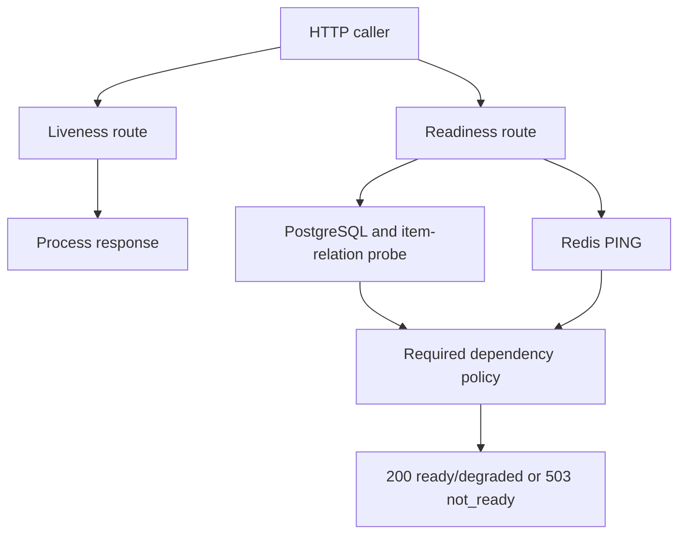

# Lab 04: Liveness, Readiness, and Dependency Health

## 1. Purpose and Learning Outcomes

**In Plain Language:** You will compare three questions that often get grouped under 'health': can the process answer, can the application perform required work, and can each dependency respond? By stopping Redis and PostgreSQL in controlled combinations, you will see why these answers can differ and why recovery must include a real business request.

> **Primary Objective:** Define and prove separate contracts for process liveness, business readiness and individual dependency health, including required PostgreSQL and optional Redis behavior.

A green container state, a successful cache hit and a ready application answer different questions. This lab makes those questions explicit and tests every dependency combination without introducing a monitoring backend.

The updated roadmap places this lab after persistence and cache behavior because health policy must follow the application's real dependency contract.

## 2. Starting Point and Lab Map

Use this guide inside the complete application repository. Run commands from the repository root in Bash unless a step says otherwise. Work through the starting checks in order; they load the helpers and state this lab needs.

Read the explanation before each step, run one complete code block at a time, and compare the actual result with the stated expectation. Save commands, observations, explanations, and unexpected results in your notebook.

### Key Terms

| **Term**  | **Plain-Language Meaning**                                                           |
| --------- | ------------------------------------------------------------------------------------ |
| Liveness  | Whether the application process can answer its liveness request.                     |
| Readiness | Whether the application's required dependencies meet its traffic-serving policy.     |
| Degraded  | The application can serve required work while an optional dependency is unavailable. |

### Lab Map

The arrows show the flow or dependency being studied. Branches identify paths to compare; this is a conceptual map, not a captured runtime trace.


```mermaid
flowchart TD
    Caller["HTTP caller"] --> Live["Liveness route"]
    Caller --> Ready["Readiness route"]
    Live --> Alive["Process response"]
    Ready --> PG["PostgreSQL and item-relation probe"]
    Ready --> Redis["Redis PING"]
    PG --> Policy["Required dependency policy"]
    Redis --> Policy
    Policy --> Result["200 ready/degraded or 503 not_ready"]
```

## 3. Guided Walkthrough

### Step 01. Inherited State

**What You Are Doing:** Reuse the recovered cache and database baseline. An unfinished failure from an earlier lab would make this lab's dependency matrix unreliable.

**Practical Walkthrough:** Check that the cache exercises ended with correct data and restored dependencies before beginning health tests. You will deliberately create several unhealthy combinations, so the initial healthy state needs to be real and documented. Retain the same app code and helper functions to keep the experiment focused on dependency availability.

Recheck the recovered cache behavior and current PostgreSQL access before saving the health baseline. This separates an intentional new outage from a leftover earlier fault. Keep the application implementation unchanged during these combinations; otherwise a changed response might result from different code rather than the dependency state under test.

Continue from Lab 3 with:

- app, postgres and redis running;
- the original course checkpoint preserved;
- the connection-failure translation from Lab 2;
- no unfinished cache corruption/staleness experiment;
- no Collector, Prometheus, Grafana, Loki, Tempo, Pyroscope or Alertmanager running; and
- the shared Bash helpers from Lab 1.

The earlier labs established how dependencies behave. This lab compares what the API, dependency probes and Docker each report about that behavior.

**Understanding the Result:** If the starting state is already degraded, you cannot attribute later health output solely to the fault you intended to inject.

### Step 02. Scope and Exclusions

**What You Are Doing:** Treat health endpoints as signals with explicit meanings. This lab examines those meanings before any later tool uses them for dashboards, alerts, or operational decisions.

**Practical Walkthrough:** Treat a health endpoint as a small program answering a specific operational question. This lab examines what each program checks and how it decides its status. Restart mechanisms and alert systems can later consume that status, but those separate consumers do not define the endpoint's meaning.

For each endpoint, identify its input checks, returned body, and status decision. Then identify any consumer separately, such as Docker reading a probe result. The endpoint reports a condition; another mechanism decides what to do with that report. This distinction will explain why a failed readiness response need not restart the process.

You will inspect and test the existing health implementation, collect an explicit status matrix, distinguish startup ordering from runtime health, prove a cache hit can mask required-dependency failure, and validate recovery.

Do not add Kubernetes probes, an automatic restart watcher, a blackbox exporter, alert rules or a reverse proxy. Health signaling is the subject here; orchestration and alert policy are separate consumers of that signal.

**Understanding the Result:** A signal and the action someone takes because of it are different layers. First prove the signal's contract before deciding whether it should trigger a restart or alert.

### Step 03. Clean Starting State

**What You Are Doing:** Confirm fully ready state before injecting a fault. The healthy measurement is the reference against which each stopped-dependency result will be compared.

**Practical Walkthrough:** Load the shared helpers, check the known item, and capture the healthy probe bodies. Read the dependency fields as well as the top-level status. This baseline lets you later compare the same fields under Redis-only, PostgreSQL-only, and combined failure instead of guessing what changed.

Read the successful bodies field by field and save them before stopping services. A top-level ready result and a dependency value answer related but distinct questions. If the baseline differs from the shown healthy example, investigate that difference first; the later matrix assumes both dependencies were working at the start.

```bash
source lab-notes/session.sh
baseline_check
mkdir -p lab-notes/lab-04
api -fsS "$APP_URL/health/live" | jq .
api -fsS "$APP_URL/health/ready" | jq .
```

**Expected Result:**

```json
{"status":"alive"}
```

```json
{"status":"ready","dependencies":{"postgres":"up","redis":"up"}}
```

If readiness is already degraded, repair that known condition first. A failure experiment starting from an unexplained failure cannot isolate cause and effect.

**Understanding the Result:** Both dependencies should begin up. Save the complete response because the HTTP code alone does not distinguish ready from an allowed degraded state.

### Step 04. Measurable Learning Objectives

**What You Are Doing:** Aim to justify each health result with its actual probe and policy. Matching a green indicator is less useful than explaining why two indicators can legitimately disagree.

**Practical Walkthrough:** Use the objectives to practice translating observations into precise capability statements. For example, 'liveness is 200' means the process answered that probe; it does not imply it can create an item. By the end you should be able to predict why one endpoint succeeds while another legitimately fails.

Practice replacing broad statements such as 'the app works' with a specific capability and observation. Name the request, its status, and the dependency it required. Use this wording throughout the fault matrix so a successful liveness probe cannot accidentally be presented as proof of a new committed database write.

You must be able to:

- state precisely what liveness does and does not prove;
- explain why PostgreSQL is required but Redis is optional;
- predict status codes and dependency details in all four dependency combinations;
- demonstrate a live process that is not ready for normal business traffic;
- show a cached read succeeding while required persistence is unavailable;
- prove the container health check calls liveness, not readiness;
- distinguish container `running`, Docker `healthy`, application `ready`, and a successful user operation;
- explain why fresh startup and an established process behave differently;
- identify probe timeouts, concurrency and freshness boundaries; and
- demonstrate recovery using both health checks and CRUD.

**Understanding the Result:** The useful skill is explaining the disagreement between indicators. A single overall healthy/unhealthy label hides the distinctions this lab is designed to teach.

### Step 05. Three Health Questions

**What You Are Doing:** Use the table to separate the questions each signal answers. A process response cannot establish successful database work, and a dependency response cannot establish every business operation.

**Practical Walkthrough:** Read each row as a separate question: process response, required business readiness, or one dependency check. Then match each question to a concrete request or observation. This prevents a database PING, an app health response, and an actual committed item write from being treated as equivalent tests.

Compare the breadth of each check. A process can answer a local route, a database can accept a listener probe, and an application can successfully commit an item; each establishes a different boundary. Choose the check that matches the operational question before drawing a conclusion from its status.

| **Signal**       | **Question It Answers**                                            | **What It Does Not Prove**                                                  |
| ---------------- | ------------------------------------------------------------------ | --------------------------------------------------------------------------- |
| `/health/live`   | Can this application process answer this HTTP request?             | Database access, fresh item data, successful writes or telemetry delivery   |
| `/health/ready`  | Can this instance currently serve required business functionality? | Every future request will succeed; every downstream system is perfect       |
| Dependency probe | Did this particular dependency check succeed?                      | All business queries, all identities, all operations or future availability |

Liveness is intentionally independent of PostgreSQL, Redis and every observability component. Readiness depends on the required persistence path. Redis changes readiness detail to `degraded` but does not force an unavailable response when PostgreSQL works.

**Understanding the Result:** State the strongest claim the observation supports and stop there. A narrow successful probe does not automatically prove a broader business path.

### Step 06. Health Architecture

**What You Are Doing:** Follow the liveness and readiness branches in the lab map. Only the readiness branch probes PostgreSQL and Redis before applying the required-dependency policy.

**Practical Walkthrough:** Follow the independent liveness branch first, then the readiness branch that gathers dependency results. Notice that readiness applies a policy after obtaining those results: PostgreSQL is required, while Redis can be degraded. The diagrams of connections alone would not tell you that policy; the implementation does.

Read the readiness dependency results before applying its policy. An optional Redis failure can appear in the body while the application remains ready for required work. Use the actual code to explain that decision, and avoid assuming that any red dependency field must force the same top-level status in every service.

The lab map in Section 2 shows this relationship.

The readiness route probes PostgreSQL and Redis concurrently. It does not contact Prometheus, Loki, Tempo, Pyroscope, Grafana or Collector.

**Understanding the Result:** A failed optional dependency need not change the readiness HTTP code. Inspect the body to understand the reported degraded capability.

### Step 07. Read the Actual Contract in Code

**What You Are Doing:** Find the probe implementations and Docker health command. This grounds your predictions in the code that runs, including the exact database and cache checks.

**Practical Walkthrough:** Open the functions found by the searches and trace what they actually call. Check that liveness avoids dependency work and that readiness probes the configured application database path and Redis. Also inspect Docker's configured health command, because Docker may be checking a different endpoint from the one you run manually.

Use the searches to find full function bodies, including timeout handling and exception branches. Compare the endpoint Docker calls with the endpoint your manual request calls. A difference between those two observations may be explained by different checks or timing; it does not automatically mean one observer is broken.

```bash
rg -n 'async def live|async def ready|asyncio.gather|status_code=200 if postgres' app/app/main.py
rg -n 'async def check|asyncio.timeout|select\(Item.id\)' app/app/database.py
rg -n 'async def check|ping|socket_timeout' app/app/cache.py
rg -n 'HEALTHCHECK' app/Dockerfile
```

Read the surrounding functions in your editor. Verify:

- `live` returns a static status without calling dependencies;
- `ready` waits for both probe results, then bases HTTP readiness on PostgreSQL;
- `Database.check` performs `SELECT 1` and an item-relation/ID-column query;
- `Cache.check` performs an authenticated Redis PING;
- Docker probes `/health/live`.

The database probe catches a missing item relation, but it is not an exhaustive schema-drift or Alembic-head verifier. A future incompatible column change still requires migration discipline and application tests.

**Understanding the Result:** Read code around the matching line rather than only its name. A function called 'healthy' can still check a narrower or broader contract than you expect.

### Step 08. Write the Expected Matrix Before Injecting Failure

**What You Are Doing:** Predict all four dependency combinations before changing service state. The completed matrix will make the application's required-versus-optional policy visible.

**Practical Walkthrough:** Fill your predicted matrix before viewing the expected one. For every row, ask whether the process can answer, whether PostgreSQL-backed work is possible, and whether Redis is merely optional. Keep the predictions so a surprising live result prompts investigation rather than quietly changing your original expectation.

Create one row per dependency combination and predict liveness, readiness, and useful business work separately. Preserve the predictions before running faults. Afterward, compare actual statuses and bodies with that row, noting whether an unexpected result reflects the policy, a timing issue, or an experiment that did not reach its intended state.

Fill the right-hand columns yourself, then compare after each experiment:

| **PostgreSQL** | **Redis** | **Live HTTP** | **Ready HTTP/Body** | **Required Business Behavior** |
| -------------- | --------- | ------------- | ------------------- | ------------------------------ |
| Up             | Up        | Prediction    | Prediction          | Prediction                     |
| Up             | Down      | Prediction    | Prediction          | Prediction                     |
| Down           | Up        | Prediction    | Prediction          | Prediction                     |
| Down           | Down      | Prediction    | Prediction          | Prediction                     |

Expected contract after you have made a prediction:

| **PostgreSQL** | **Redis** | **Live HTTP** | **Ready HTTP/Body** | **Business Impact**                                        |
| -------------- | --------- | ------------- | ------------------- | ---------------------------------------------------------- |
| Up             | Up        | 200           | 200 / `ready`       | Normal CRUD                                                |
| Up             | Down      | 200           | 200 / `degraded`    | CRUD via PostgreSQL; cache unavailable                     |
| Down           | Up        | 200           | 503 / `not_ready`   | Writes/list/misses fail; selected cached reads may succeed |
| Down           | Down      | 200           | 503 / `not_ready`   | Required persistence unavailable and no usable cache path  |

A process failure adds another row: no HTTP response at all. It is different from an application-generated 503.

**Understanding the Result:** The matrix is a policy test, not a ranking of technologies. A different application might genuinely require Redis and therefore make a different readiness decision.

### Step 09. Define a Repeatable Health Capture

**What You Are Doing:** Define one repeatable capture function for health status and bodies. Consistent capture lets you compare failures without losing an expected HTTP 503 as if it were unusable output.

**Practical Walkthrough:** Define a capture function that always saves status and body for the same health endpoints. It accepts expected 503 responses as useful evidence while still allowing transport failure to be recognized separately. Reusing one capture method ensures that the four dependency combinations are compared on the same basis.

Read the function's arguments and output filenames before calling it. The label distinguishes each fault phase, while status and body capture keep expected HTTP errors inspectable. If a transport error occurs, record that separately instead of treating an empty body or status `000` as an application-generated readiness response.

```bash
capture_health() {
  local label="$1"
  local endpoint code
  for endpoint in live ready; do
    code=$(api -sS -o "lab-notes/lab-04/${label}-${endpoint}.json" \
      -w '%{http_code}' "$APP_URL/health/$endpoint") || return 1
    printf '%s %s HTTP %s\n' "$label" "$endpoint" "$code" \
      | tee -a lab-notes/lab-04/statuses.txt
    jq . "lab-notes/lab-04/${label}-${endpoint}.json" || return 1
  done
}
capture_health all-up
```

This helper does not use `--fail`, because an expected 503 is valid experimental evidence. A network failure still makes curl fail. Do not treat `HTTP 000` as an application status code; it means no HTTP status was received.

**Understanding the Result:** A captured HTTP status belongs to a server response. A transport failure with no received status needs investigation at a different boundary.

### Step 10. Record the Container's Independent View

**What You Are Doing:** Record Docker's separate health view and the app's identity. You will later use those values to check whether a dependency failure also restarted the application.

**Practical Walkthrough:** Record the app container's identity, process start information, restart count, and health history before faults. Inspect only the selected fields. Docker's history records its configured periodic probe, while your manual readiness requests are independent observations that need their own timestamps and response files.

Save the container ID and lifecycle fields before introducing any failure. Docker's health history is sampled on its own schedule, so compare its timestamps with your manual captures. Select only the necessary fields from inspection output; a full container dump can include unrelated configuration and secrets that are unnecessary for this experiment.

```bash
APP_CONTAINER=$(dc ps -q app)
docker inspect --format \
  'id={{.Id}} status={{.State.Status}} started={{.State.StartedAt}} restarts={{.RestartCount}}' \
  "$APP_CONTAINER" | tee lab-notes/lab-04/app-before.txt
docker inspect --format '{{json .Config.Healthcheck}}' "$APP_CONTAINER" | jq .
docker inspect --format '{{json .State.Health}}' "$APP_CONTAINER" | jq .
```

Docker's health history includes probe executions, not every public readiness call. The container can be running and healthy while a required dependency is down because its probe checks process liveness.

Do not dump the full inspect output into shared evidence; it contains the container environment and therefore secrets.

**Understanding the Result:** The two views may legitimately disagree if they probe different capabilities. The saved identity values later tell you whether an actual restart occurred.

### Step 11. Optional Dependency Experiment: Redis Down

**What You Are Doing:** Stop only Redis and observe the probes plus an uncached business request. This tests whether optional-cache loss degrades the service while preserving required functionality.

**Practical Walkthrough:** Stop Redis alone using the complete recovery-protected block. Capture liveness, readiness, and an uncached list request while PostgreSQL remains available. You are testing whether the app still performs required work when only its optional cache disappears, rather than testing whether Redis itself is healthy.

Keep PostgreSQL running and use the list route because it requires database work instead of a warmed individual-item shortcut. Read the degraded readiness body along with the business response. After the recovery-protected block exits, explicitly check Redis and readiness again before starting the next dependency combination.

Predict first, then run the controlled subshell:

```bash
(
  set -euo pipefail
  trap 'dc start redis >/dev/null' EXIT
  trap 'exit 130' INT
  trap 'exit 143' TERM
  dc stop redis
  capture_health redis-down
  jq -e '.status == "degraded" and .dependencies.postgres == "up" and .dependencies.redis == "down"' \
    lab-notes/lab-04/redis-down-ready.json >/dev/null
  api -fsS "$APP_URL/api/v1/items?limit=1" \
    -o lab-notes/lab-04/redis-down-list.json
  docker inspect --format '{{json .State.Health}}' "$APP_CONTAINER" \
    > lab-notes/lab-04/redis-down-container-health.json
)
wait_ready
capture_health redis-restored
```

**Command Note:** `trap ... EXIT` schedules cleanup when that shell exits. Keep it in the same block as the fault; the explicit recovery checks afterward confirm that restoration actually succeeded.

**Expected Result:** both HTTP health codes remain 200, readiness describes degraded cache, the uncached list succeeds, and Docker does not restart the app.

This is not a claim that Redis failure has no operational cost. Lab 3 showed fallback; later monitoring labs will quantify latency and database amplification.

**Understanding the Result:** HTTP 200 with a degraded readiness body is expected here. Compare the successful business request before deciding whether the service should be removed from traffic.

### Step 12. Why Optional Redis Must Not Fail Readiness Here

**What You Are Doing:** Connect the observed result to the traffic policy. Removing an otherwise useful app because an optional cache failed could reduce capacity during the very condition that needs it.

**Practical Walkthrough:** Imagine a traffic router using readiness to choose available app instances. If every instance rejects readiness when an optional cache fails, the router could remove capacity that can still use PostgreSQL. Relate this consequence to the actual fallback behavior you established rather than assuming every dependency must be healthy.

Connect the readiness policy to the fallback path already proven in Lab 03. Explain what useful work remains possible and what extra pressure may move to PostgreSQL. The lesson concerns this application's chosen readiness contract; it does not imply that every cache can be treated as optional in every system.

A readiness gate determines whether normal business traffic should reach an instance. This application can still perform its required PostgreSQL-backed work without Redis.

Making Redis failure return readiness 503 would remove otherwise useful capacity and could turn a cache outage into a wider availability incident. Another application may genuinely require Redis for correctness or coordination; its policy could differ. The contract follows the workload, not the tool's name.

**Understanding the Result:** Readiness is a workload policy. Its required dependency list should follow the operations the service must support, not merely the list of connected components.

### Step 13. Prepare a Fresh Cache-Mask Subject

**What You Are Doing:** Prepare a known cached item that will survive the brief database outage. This creates a controlled example of one request succeeding despite failed readiness.

**Practical Walkthrough:** Create and warm a dedicated item, then extend only its key long enough to survive the short database interruption. This produces a controlled cache-backed request that can be compared with an uncached request. Verify the key really exists, especially if a previous failed-invalidation bypass could still be active.

Check the warm response and exact key before extending its TTL. The prepared key must contain this fixture, not another item or an earlier version. If the key cannot be populated because a bypass is still active, wait for the intended recovery before continuing; otherwise the planned cache-mask comparison has no valid starting condition.

```bash
api -fsS -H 'Content-Type: application/json' \
  -d '{"name":"Lab 04 health subject","description":"Disposable readiness exercise","price":"40.00","is_active":true}' \
  "$APP_URL/api/v1/items" -o lab-notes/lab-04/item.json
ITEM_ID=$(jq -er '.id' lab-notes/lab-04/item.json)
KEY=$(cache_key "$ITEM_ID")
api -fsS "$APP_URL/api/v1/items/$ITEM_ID" >/dev/null
rcli EXPIRE "$KEY" 120
rcli TTL "$KEY"
```

This extends only the synthetic exercise key to two minutes so it survives the short database outage. It does not change the app's configured TTL or other keys. Delete it at recovery rather than leaving this temporary policy behind.

If a prior failed-invalidation bypass is still active, the key may not populate. Finish the Lab 3 recovery check before proceeding.

**Understanding the Result:** The temporary lifetime belongs only to this fixture. It does not change the app's normal cache policy and must be removed during cleanup.

### Step 14. Required Dependency Experiment: PostgreSQL Down

**What You Are Doing:** Stop PostgreSQL and compare a warm item GET with a list request. Their different results reveal that dependency requirements belong to particular request paths.

**Practical Walkthrough:** Stop PostgreSQL while retaining the prepared cache value and live app. Request the warm item and the uncached list, then compare their statuses with both probes. The same process can serve a cached representation while lacking the database capability required for ordinary readiness and new persistence work.

Capture the warm individual read and database-backed list while PostgreSQL is still stopped. Compare their different dependency needs before interpreting the statuses. Preserve the readiness body and restore the database through the complete block. A warm success is evidence about that cached path, not a reason to disregard required-database unavailability.

```bash
(
  set -euo pipefail
  trap 'dc start postgres >/dev/null' EXIT
  trap 'exit 130' INT
  trap 'exit 143' TERM
  dc stop postgres
  capture_health postgres-down
  jq -e '.status == "not_ready" and .dependencies.postgres == "down" and .dependencies.redis == "up"' \
    lab-notes/lab-04/postgres-down-ready.json >/dev/null

  cached_status=$(api -sS -o lab-notes/lab-04/cached-during-db-outage.json \
    -w '%{http_code}' "$APP_URL/api/v1/items/$ITEM_ID")
  list_status=$(api -sS -o lab-notes/lab-04/list-during-db-outage.json \
    -w '%{http_code}' "$APP_URL/api/v1/items?limit=1")
  printf 'cached_get=%s list=%s\n' "$cached_status" "$list_status" \
    | tee lab-notes/lab-04/cache-mask.txt
  test "$cached_status" = 200
  test "$list_status" = 503
  docker inspect --format '{{json .State.Health}}' "$APP_CONTAINER" \
    > lab-notes/lab-04/postgres-down-container-health.json
)
wait_ready
rcli DEL "$KEY"
api -fsS "$APP_URL/api/v1/items/$ITEM_ID" >/dev/null
capture_health postgres-restored
```

Expected health result: liveness 200, readiness 503. The same live process returns 200 for a valid cached item and 503 for a list requiring PostgreSQL.

If the cached request returns 503, check whether the key expired or was never warmed. That does not invalidate readiness policy; it changes which partial-availability path was available.

**Understanding the Result:** The two request outcomes describe different dependency paths. A successful warm GET does not invalidate the failed readiness result.

### Step 15. State the Cache-Mask Conclusion Precisely

**What You Are Doing:** Describe partial availability precisely. One cached success neither restores required database capability nor proves that every endpoint is unusable.

**Practical Walkthrough:** Write the conclusion using all observed boundaries: the process answered, required persistence was unavailable, and one known cache-backed path still worked. Avoid collapsing these into either 'everything is healthy' or 'nothing can work.' Partial capability is precisely what this experiment makes visible.

State the same observation from three viewpoints: the process responded, required database work failed, and one prepared representation remained readable. Include the item's warmed state in the conclusion. Without that condition, a reader could wrongly generalize the result to uncached items, lists, or new writes during the outage.

A correct statement is:

> PostgreSQL was unavailable to the application. The process remained live, but normal business readiness failed. One cached item could still be returned; operations needing persistence failed.

Neither “the API is completely healthy” nor “every request is impossible” is supported by that evidence.

Readiness is a policy decision about ordinary traffic, not a promise that every endpoint has exactly the same dependency set.

**Understanding the Result:** Use operation-specific language in an incident report. It tells an operator which work remains possible and which recovery claim still requires proof.

### Step 16. Both Dependencies Down

**What You Are Doing:** Stop both dependencies for the final matrix row, then restore them. Compare liveness with readiness to test whether the process-health path remains independent.

**Practical Walkthrough:** Run the final combination with both dependencies stopped and restoration attached to the shell. Compare this row with the earlier one-dependency cases. The liveness route should still answer without checking either dependency, while requests needing data cannot rely on an available database or cache.

Verify both services enter the intended stopped state, then capture the same probes used in earlier rows. Keep the complete restoration block intact. Afterward, restore both dependencies and prove the healthy baseline again; otherwise the next comparison could mistake an unfinished outage for an application lifecycle change.

Now test the final combination. The trap restores both dependencies on exit:

```bash
(
  set -euo pipefail
  trap 'dc start postgres redis >/dev/null' EXIT
  trap 'exit 130' INT
  trap 'exit 143' TERM
  dc stop postgres redis
  capture_health both-down
  jq -e '.status == "not_ready" and .dependencies.postgres == "down" and .dependencies.redis == "down"' \
    lab-notes/lab-04/both-down-ready.json >/dev/null
  status=$(api -sS -o lab-notes/lab-04/both-down-get.json -w '%{http_code}' \
    "$APP_URL/api/v1/items/$ITEM_ID")
  test "$status" = 503
)
wait_ready
capture_health both-restored
```

Liveness still should not call either dependency. If liveness itself fails, distinguish a stopped/unresponsive process from a readiness decision before changing the health contract.

**Understanding the Result:** If liveness also disappears, inspect the process and request handling before concluding that its documented dependency-free contract changed.

### Step 17. Prove Dependencies Did Not Restart the App

**What You Are Doing:** Compare the application container's identity, start time, and restart count with the baseline. These observations test restart behavior independently of health status.

**Practical Walkthrough:** Compare the app's recorded identity, start time, and restart count with the values captured before dependency faults. These observations establish whether its process lifecycle changed. A change in readiness is merely a signal and should not be assumed to have caused a restart without supporting runtime evidence.

Compare all recorded fields, not only the container's current running label. The same container ID can contain a restarted process, so start time and restart count add useful context. If any lifecycle field changed, look for an actual restart action or exit before attributing it to readiness policy.

```bash
docker inspect --format \
  'id={{.Id}} status={{.State.Status}} started={{.State.StartedAt}} restarts={{.RestartCount}}' \
  "$APP_CONTAINER" | tee lab-notes/lab-04/app-after.txt
diff -u lab-notes/lab-04/app-before.txt lab-notes/lab-04/app-after.txt
```

Under the controlled drill, identity, start time and restart count should be unchanged. If they changed, investigate process exit, OOM or another operator's action. Do not attribute the restart to readiness without evidence.

Docker Compose does not automatically restart a container just because its health state becomes unhealthy. Restart policies respond to process/container exit; health state is a separate signal. Lab 5 will test this distinction directly.

**Understanding the Result:** Unchanged identity and restart evidence support continued process operation. Changed values require another explanation, such as process exit or an additional operator action.

### Step 18. Inspect Probe Latency and Failure Budgets

**What You Are Doing:** Measure probe response time and inspect timeout boundaries. A health check is itself work, so its waiting behavior affects how quickly failures become visible.

**Practical Walkthrough:** Measure the probe's elapsed time and inspect the timeout settings that bound dependency waits. The readiness route performs real work, so an unavailable dependency can affect how long a response takes. Compare concurrent probing with the mistaken assumption that every dependency's full wait is deliberately added in series.

Read the client duration in seconds and compare it with the configured probe time limits. Inspect whether dependency checks run concurrently and how failures are bounded. One measured duration includes request and scheduling overhead, so use it to explain the observed wait rather than claiming an exact worst-case latency from a single sample.

```bash
api -sS -o /dev/null -w 'ready_time_seconds=%{time_total}\n' "$APP_URL/health/ready"
dc exec -T app python - <<'PYTHON'
from app.config import Settings
s = Settings()
print({
    "db_timeout_seconds": s.db_timeout_seconds,
    "redis_timeout_seconds": s.redis_timeout_seconds,
    "dependency_probe_interval_seconds": s.dependency_probe_interval_seconds,
    "startup_attempts": s.startup_attempts,
})
PYTHON
```

**Command Note:** `exec -T` runs the diagnostic command inside the existing container without allocating a terminal. The heredoc supplies its program on standard input, using the dependencies installed in that image.

The readiness route probes both dependencies concurrently, so it does not deliberately add their complete waits in series. PostgreSQL's check has an overall async timeout slightly above the configured DB timeout. Redis has short connection/socket limits and no configured automatic retries.

The measured healthy latency is not an SLO or worst-case outage guarantee. A real probe budget must account for scheduling, pool wait, name resolution and transport behavior.

**Understanding the Result:** Healthy timing is not a worst-case guarantee. Pool waits, scheduling, and transport behavior still need consideration when setting an operational probe budget.

### Step 19. Understand Periodic Checks versus Request-Time Checks

**What You Are Doing:** Distinguish background observations from an on-demand readiness check. The time and trigger of an observation matter when two health records appear to disagree.

**Practical Walkthrough:** Separate the background task's periodic observations from a readiness request that performs fresh checks. A state-transition log can appear after the first failed business request because the background check has its own cadence. Repeated manual checks also create extra dependency work instead of merely reading an inert label.

Place background probe timestamps, manual readiness requests, and business failures on one timeline. Each observer can discover the same fault at a different moment. Repeated manual probing also adds real dependency calls, so record its cadence when explaining extra activity rather than assuming every health observation reads previously cached state.

The app also probes dependencies in a background task, normally every 15 seconds, and logs state transitions. `/health/ready` executes fresh checks when called; it does not merely return that task's previous result.

This distinction matters:

- a background observation can become old between checks;
- a readiness request creates dependency work itself;
- repeatedly polling at high frequency can add unnecessary load;
- metrics derived from observations require freshness interpretation in later labs.

Do not create a tight infinite loop that floods readiness just to watch it change.

**Understanding the Result:** Attach time and observer to each health statement. Two different observation times can explain an apparent disagreement without either check being incorrect.

### Step 20. Why a Healthy Database Container Is Not Sufficient

**What You Are Doing:** Compare server acceptance with access through the app's own identity and schema. A database can accept connections while still being unusable for this application's required query.

**Practical Walkthrough:** Compare the database container's listener check with the app's own connection and schema probe. The app must use the correct network path, credentials, database, and expected table. A server that accepts connections can still reject that identity or lack the schema needed for Items operations.

Run the listener check and the application readiness request as separate observations. A successful `pg_isready` result does not exercise the complete Items schema and application identity. If they disagree, inspect the app's network path, credentials, selected database, and migration state before deciding the database container's healthy label proves application readiness.

Compare:

```bash
dc exec postgres pg_isready -h 127.0.0.1 -U postgres -d postgres
api -fsS "$APP_URL/health/ready" | jq .
```

The first checks server acceptance on the container's TCP loopback. The second exercises the application's configured role, network path and minimal item schema query.

A wrong application password or missing table can make the second fail while the server still accepts connections. Conversely, a slow administrative command does not necessarily prove every business request is failing.

**Understanding the Result:** Listener acceptance is a prerequisite, not complete application readiness. A successful administrative connection likewise does not prove the application's identity works.

### Step 21. Startup Ordering Is a Separate Contract

**What You Are Doing:** Inspect startup gates separately from ongoing dependency checks. A dependency that prevents initial creation is a different situation from a dependency failing after the app is running.

**Practical Walkthrough:** Inspect the startup dependency chain in the effective model. Ownership preparation, database acceptance, and migrations must complete before a fresh app is created. This initial gate differs from the behavior of an already-running app when one of its dependencies later stops.

Read the resolved `depends_on` conditions in startup order and identify each gate's success condition. Those conditions guide startup of a fresh deployment; they do not continuously rerun migrations or restart an already-serving app whenever PostgreSQL changes state. Keep that distinction in mind for the existing-container restart experiment next.

Inspect only dependency fields:

```bash
dc config --format json | jq '{
  postgres: .services.postgres.depends_on,
  migrate: .services.migrate.depends_on,
  app: .services.app.depends_on
}'
```

At fresh startup:

1. volume ownership must complete;
2. PostgreSQL must accept TCP connections;
3. the migration job must complete successfully;
4. the app starts and performs bounded dependency validation.

These gates explain why a brand-new app may not exist at all while the database initialization is failing. That is different from the established live app continuing during the runtime outages you just tested.

`depends_on` is not a continuous supervisor, health monitor or database failover mechanism. [Docker describes startup dependency conditions](https://docs.docker.com/compose/how-tos/startup-order/).

**Understanding the Result:** Keep startup and runtime failure evidence separate. A container that never started cannot demonstrate the same liveness behavior as an established process surviving an outage.

### Step 22. Controlled Existing-Container Startup During DB Failure

**What You Are Doing:** Restart an existing app while PostgreSQL is down and observe its bounded startup behavior. Keep this result separate from a brand-new stack waiting for its migration job.

**Practical Walkthrough:** Restart the existing app container during the controlled database outage and observe its own bounded startup checks. You are not creating a brand-new deployment that must first pass migration gates. Allow the documented startup intervals, then capture liveness and not-ready behavior once the app begins serving HTTP.

Use the existing app container as instructed and allow its bounded startup checks to finish before capturing HTTP results. A connection refusal while it is still starting is different from an eventual not-ready response. Restore PostgreSQL with the complete recovery block, then verify useful application behavior before drawing a conclusion about startup resilience.

This additional exercise distinguishes the app's bounded startup probes from Compose's initial migration gate. It restarts an **existing** app container while PostgreSQL is down; it does not create a new stack.

```bash
(
  set -euo pipefail
  trap 'dc start postgres >/dev/null' EXIT
  trap 'exit 130' INT
  trap 'exit 143' TERM
  dc stop postgres
  dc restart app
  wait_live
  status=$(api -sS -o lab-notes/lab-04/restarted-not-ready.json -w '%{http_code}' \
    "$APP_URL/health/ready")
  test "$status" = 503
  jq . lab-notes/lab-04/restarted-not-ready.json
)
wait_ready
```

The app can take several probe/backoff intervals before serving HTTP. Its lifespan eventually logs that PostgreSQL is unavailable and starts not-ready. Once HTTP serving begins, the liveness route itself has no dependency check.

This planned restart changes app start time, unlike the earlier pure dependency drills. Do not mix the two sets of evidence when interpreting restart counts.

**Understanding the Result:** This planned restart intentionally changes process identity. Do not mix those values with the earlier proof that dependency faults alone did not restart the app.

### Step 23. Prove Useful Recovery, Not Merely Probe Recovery

**What You Are Doing:** Create and read a fresh item after restoring services, then check SQL. This proves the recovered system performs useful committed work as well as passing probes.

**Practical Walkthrough:** After restoring dependencies, create and read a new item through the public API and verify its committed row separately. These actions exercise useful work rather than only repeating health probes. Retain the item identity and returned fields so the recovery evidence refers to one concrete operation.

Save the recovery create response and use its returned ID in both the read and SQL verification. This connects the public success to a newly committed row. A green probe alone would leave that transaction untested, while an old cached item could conceal a broken database path after restoration.

```bash
api -fsS -H 'Content-Type: application/json' \
  -d '{"name":"Lab 04 recovery write","price":"4.00"}' \
  "$APP_URL/api/v1/items" -o lab-notes/lab-04/recovery-item.json
RECOVERY_ID=$(jq -er '.id' lab-notes/lab-04/recovery-item.json)
api -fsS "$APP_URL/api/v1/items/$RECOVERY_ID" | jq '{id,name,price}'
dbsql -v item_id="$RECOVERY_ID" <<'SQL'
SELECT id, name FROM items WHERE id = :'item_id'::uuid;
SQL
baseline_check
```

Record three separate recovery claims: dependency probes succeed, the public API creates/reads an item, and the committed row is visible independently.

**Understanding the Result:** Recovery includes successful dependency checks and successful business work. Either observation alone leaves part of the original failure path untested.

### Step 24. Validate the Health Contract Tests

**What You Are Doing:** Read and run the health contract tests. Their fake dependencies check policy deterministically; the live outage measurements check the deployed path.

**Practical Walkthrough:** Read the assertions in the health tests before running them. Notice how fake dependencies make healthy, degraded, and unavailable cases repeatable, and how liveness independence is checked directly. Then compare those deterministic policy tests with the live container-stop observations in your notebook.

Read which fake dependency result drives each expected status, then run the focused test command and inspect its exit result. The isolated test checks the decision policy repeatably; your container-stop experiments check how real dependency failures reach that policy. Keep both forms of evidence and describe their different coverage.

Read the existing tests:

```bash
cat app/tests/test_health.py
```

Run the focused health suite in a disposable image:

```bash
docker build --target test -t observability-test:local ./app
docker run --rm --network none --read-only --tmpfs /tmp \
  observability-test:local pytest -p no:cacheprovider tests/test_health.py
```

The tests cover healthy readiness, Redis degradation, PostgreSQL failure and liveness independence. In particular, the liveness test checks that the dependency probe is not awaited.

The fake-based tests protect the policy as code. The Docker failure experiments test the deployed path. Neither should be presented as a substitute for the other.

**Understanding the Result:** The tests protect intended behavior against code regressions. The runtime experiment checks that the deployed configuration exhibits that behavior with real dependencies.

### Step 25. Design Review Exercise: Classify Dependencies

**What You Are Doing:** Classify dependencies by what this application truly requires. Use the demonstrated request paths to justify the classification instead of assuming every attached service is essential.

**Practical Walkthrough:** For each component, ask what would actually stop working if it disappeared. Use the established request path rather than general assumptions about an observability stack. Explain required-for-liveness and required-for-readiness separately, and identify capabilities such as telemetry visibility that may degrade without stopping item operations.

For each proposed dependency, trace a specific user operation and ask where it would block if that component vanished. Classify liveness, readiness, and degraded observability independently. Justify the classification with the request path and failure behavior observed so far, rather than classifying every component in the deployment as equally required.

Complete this table without changing code:

| **Component**        | **Required for Liveness?** | **Required for Readiness Here?** | **Failure Implication** |
| -------------------- | -------------------------- | -------------------------------- | ----------------------- |
| PostgreSQL           | Your answer                | Your answer                      | Your answer             |
| Redis                | Your answer                | Your answer                      | Your answer             |
| Collector            | Your answer                | Your answer                      | Your answer             |
| Prometheus           | Your answer                | Your answer                      | Your answer             |
| Loki/Tempo/Pyroscope | Your answer                | Your answer                      | Your answer             |
| Grafana              | Your answer                | Your answer                      | Your answer             |

Explain why an observability outage should be detected separately without making the business application fail its readiness gate.

The absence of those backends throughout this lab already provides one useful piece of evidence: business functionality works without them.

**Understanding the Result:** The classification is justified by this application's contracts. Adding a component to the deployment does not automatically make it part of the business readiness gate.

## 4. Troubleshooting and Diagnosis

Start with the first unexpected result. Record the exact symptom, identify which component produced it, and use the checks below before repeating the experiment. After a fix, repeat the original check and confirm recovery.

### Troubleshooting Runbook

#### A. Readiness 503 Is Reported as a Curl Error

Use `-sS -o body.json -w '%{http_code}'` without `-f` when intentionally expecting a failure response. Preserve the body and distinguish HTTP failure from network failure.

#### B. Redis Failure Returns Readiness 503

Check the running source and image. The current policy returns 200/degraded when PostgreSQL is healthy. An optional cache failure must not be mistaken for loss of the required persistence path.

#### C. PostgreSQL Failure Returns a 500 on Business Requests

Complete Lab 2's database-scoped connection-error translation and rebuild. Readiness already has its own safe probe handling.

#### D. Docker Says Healthy While Readiness Is not_ready

Inspect `.Config.Healthcheck`: it should use `/health/live`. The two signals intentionally answer different questions. Do not “fix” the display by making liveness depend on the database.

#### E. The Cache-Mask GET Fails

Inspect the exact key and TTL while Redis is running. Expiry, invalidation or active bypass can remove that temporary success path. Repeat only after restoring PostgreSQL and warming the test key.

#### F. The App Takes Time to Answer After Restart

Read startup logs and configured probe attempts. Before lifespan startup completes, the listener may not serve HTTP. After the bounded attempts, an existing app can become live but not ready.

#### G. A New App Never Starts with PostgreSQL Down

Check `migrate` and `depends_on`. Initial migration gating occurs before the process whose liveness you want to call exists. It is not evidence that the liveness route performs SQL.

#### H. All Probes Pass but a Real Request Fails

Readiness is a narrow current check. Validate the actual input, route, query and transaction. Probe success does not prove every code path or future operation.

### Health Diagnostic Sequence

1. Can you receive any HTTP response?
2. Does liveness succeed?
3. What does readiness say about each dependency?
4. What does the container runtime report, and which endpoint does it probe?
5. Which dependencies does the failing user operation actually need?
6. Is a cache masking or serving only part of the workload?
7. Does the failure concern initial startup, runtime behavior or recovery?
8. After repair, do both probes and the original business operation succeed?

## 5. Review and Practice

Answer the knowledge questions in your own words before reading the answer guide. For the scenario, name the evidence you would collect and the conclusion each observation would support.

### Knowledge Check

1. Can liveness be 200 while readiness is 503?
2. Why does Redis down return readiness 200 here?
3. Why can one cached GET succeed when readiness is not_ready?
4. What does a running container fail to prove?
5. Does Docker health automatically restart a container?
6. Does a manual readiness request appear in Docker health history?
7. Why test the app role separately from `pg_isready`?
8. Does the schema probe prove every column matches every migration?
9. Does `depends_on` supervise dependency health forever?
10. Why can an existing app restart into not-ready state while a fresh stack is blocked by migrations?
11. Does a readiness check guarantee the next write will commit?
12. What additional evidence proves business recovery?

#### Answer Key

1. Yes; the process may respond while required persistence is unavailable.
2. Redis is an optional optimization and PostgreSQL can still serve required work.
3. That route can return a valid cached representation without querying PostgreSQL.
4. Health, readiness, correctness and useful business behavior.
5. No; health status and process-exit restart policy are separate.
6. No; Docker records its own configured health-check invocations.
7. Server acceptance, identities, network paths and schema access differ.
8. No; it checks a minimal required relation/column path.
9. No; it controls initial dependency conditions, with limited explicit restart options where configured.
10. An existing container restart does not repeat fresh service-creation gates, while app startup has bounded probes.
11. No; reality and request requirements can change immediately afterward.
12. A representative successful write/read and independent correctness check.

### Professional Scenario Exercise

An incident message says:

> “Docker reports healthy, so the database team's claim of an outage must be wrong.”

Write an evidence-based response that identifies the container probe target, separates process and business health, uses the captured readiness body, and explains any successful cached read without dismissing the failing writes.

## 6. Completion Checklist

Mark each item only after you can point to its result or evidence file. Complete any cleanup shown here before moving on.

### Cleanup and Final Baseline

**What You Are Doing:** Remove only the health experiment's fixtures and recheck the baseline. In particular, leave neither a stopped dependency nor the artificially extended test key behind.

```bash
api -fsS -X DELETE "$APP_URL/api/v1/items/$ITEM_ID" -o /dev/null
api -fsS -X DELETE "$APP_URL/api/v1/items/$RECOVERY_ID" -o /dev/null
baseline_check
CHECKPOINT_ID=$(cat lab-notes/checkpoint-item-id.txt)
api -fsS "$APP_URL/api/v1/items/$CHECKPOINT_ID" | jq '{id,name,price}'
```

No dependency should remain stopped. The artificially extended cache key is removed with its item. Keep only the course checkpoint and your evidence.

### Completion Criteria

- [ ] All four dependency combinations were predicted and observed.
- [ ] Liveness stayed dependency-independent during established-process outages.
- [ ] Redis failure produced 200/degraded readiness and working required functionality.
- [ ] PostgreSQL failure produced 503/not_ready.
- [ ] A cached read was distinguished from a persistence-dependent request.
- [ ] Docker's actual health target was inspected.
- [ ] Pure dependency failure did not itself restart the app.
- [ ] You distinguished fresh startup gating from bounded app startup probes.
- [ ] Health-contract tests pass.
- [ ] Recovery includes a committed write, a read and direct row verification.
- [ ] Temporary items were deleted and the course checkpoint survives.

## 7. Production Context and Next Lab

### Production Implications

Health checks are operational contracts consumed by other systems. Keep them cheap, bounded, safe and matched to the traffic policy. Do not restart otherwise responsive workers for an optional cache or telemetry outage.

Readiness should include dependencies required for the service's promised functionality while describing tolerated degradation. A single health endpoint cannot replace synthetic user journeys, deeper dependency monitoring or capacity analysis. Those are complementary layers, introduced later when their questions become relevant.

### End State and Transition to Lab 05

Next: [Lab 05 — Docker Compose Networking, Storage, and Restart Behavior](Lab-05.md).

You now know what the application means by live and ready. Lab 5 examines the Docker runtime that hosts it: service DNS, exposed ports, volume identity, container recreation, process exits and restart policies.