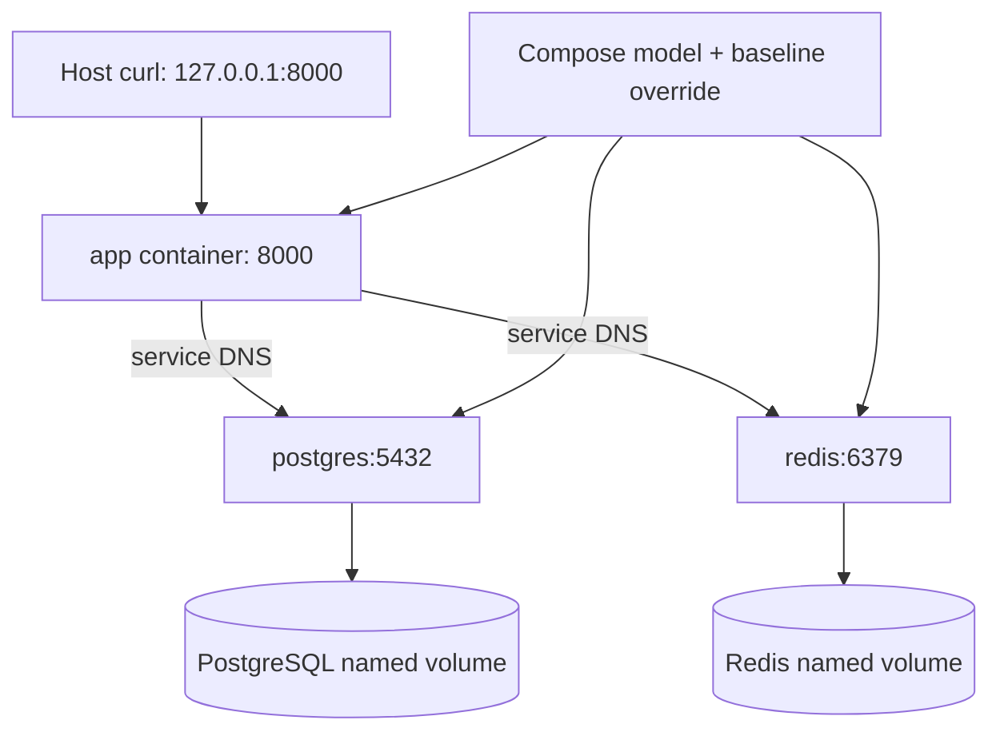

# Lab 05: Docker Compose Networking, Storage, and Restart Behavior

## Purpose and Scope

> **Primary Objective:** Prove how Compose service DNS, published ports, named volumes, container identity, application configuration, health checks and restart policies interact on one Docker host.

The application and dependencies are no longer black boxes. Labs 1–4 established their request, persistence, cache and health contracts. This lab examines the runtime that connects and replaces those processes.

A service name, container ID, image ID, process start time and volume name each identify a different thing. Treating them as interchangeable leads to avoidable deployment and recovery mistakes.

## 1. Inherited State

Continue with the baseline override and shared helpers from Lab 1, plus Lab 2's tested connection-error translation. Keep the course checkpoint item; temporary rows from the earlier labs should be cleaned up.

Only app, postgres and redis should be running. The two initialization jobs may remain as successful exited containers. Telemetry backends and exporters are not introduced in this lab.

## 2. Scope and Exclusions

You will inspect real network/volume identities, test DNS and listener reachability, replace containers while retaining data, distinguish restart from configuration reconciliation, deliberately fail a health check, and exercise manual stop versus unexpected process exit.

This is Docker Compose on one host. Do not add Kubernetes, a service mesh, cloud networking, HA replicas, bind-mounted live application source or a new orchestration system. Do not delete volumes or restart the Docker daemon for these exercises.

## 3. Starting Checks

```bash
source lab-notes/session.sh
baseline_check
mkdir -p lab-notes/lab-05
CHECKPOINT_ID=$(cat lab-notes/checkpoint-item-id.txt)
api -fsS "$APP_URL/api/v1/items/$CHECKPOINT_ID" \
  -o lab-notes/lab-05/checkpoint-before.json
jq '{id,name,price}' lab-notes/lab-05/checkpoint-before.json
dc ps -a
```

Stop other experiments in this Compose project. Several steps briefly interrupt the app or PostgreSQL; they belong on your learning host, not a shared production deployment.

## 4. Measurable Learning Objectives

By the end, demonstrate:

- image, service, container, process and volume identities are different;
- the app uses Docker service DNS instead of fixed container IPs;
- a container's localhost refers to its own network namespace;
- a published host port is different from an internal service port;
- a named network is not complete tenant or security isolation;
- named-volume data survives container replacement;
- bootstrap SQL is not reapplied to an initialized data directory;
- restart does not adopt changed Compose environment or rebuilt source;
- unhealthy status does not itself trigger Docker restart policy;
- an unexpected main-process exit can trigger `unless-stopped`;
- an explicit stop remains stopped until intentionally started; and
- every experiment restores the approved baseline and preserves the checkpoint row.

## 5. Runtime Architecture



All three long-running baseline containers join the project-scoped `platform` bridge network. The ownership job uses no network. Later telemetry services also use `platform`; network membership alone does not provide complete security isolation.

## 6. Identify the Objects You Are Operating

```bash
APP_CONTAINER=$(dc ps -q app)
PG_CONTAINER=$(dc ps -q postgres)
REDIS_CONTAINER=$(dc ps -q redis)
docker inspect --format \
  'name={{.Name}} id={{.Id}} image={{.Image}} started={{.State.StartedAt}}' \
  "$APP_CONTAINER" "$PG_CONTAINER" "$REDIS_CONTAINER"
dc images
```

| **Object** | **Meaning** | **Can change without deleting the item?** |
|---|---|---|
| Compose service | Desired definition such as `app` | Yes, when configuration changes |
| Image | Packaged filesystem/runtime content | Yes, on rebuild/deploy |
| Container | Instance created from image plus runtime configuration | Yes, on recreation |
| Process | Current execution within a container | Yes, on restart |
| Named volume | Storage independently mounted into a container | Preserves data across those changes if retained |

The service key is stable operational addressing. Do not hardcode generated container names from another repository.

## 7. Inspect the Effective Network Model Safely

```bash
dc config --format json | jq '{
  networks: .networks,
  app_networks: .services.app.networks,
  postgres_networks: .services.postgres.networks,
  redis_networks: .services.redis.networks
}'
```

Find the actual network name from the running app:

```bash
NETWORK_NAME=$(docker inspect --format '{{json .NetworkSettings.Networks}}' \
  "$APP_CONTAINER" | jq -er 'keys[0]')
docker network inspect "$NETWORK_NAME" | jq '.[0] | {
  Name, Driver, Internal,
  containers: [.Containers[] | {Name,IPv4Address}]
}'
```

In this one-network baseline, the first key is the `platform` network. If you later add more networks, select the intended network explicitly rather than continuing to assume one.

The Compose project scopes network and volume names. Changing `COMPOSE_PROJECT_NAME` creates a different deployment namespace and may make old data appear absent because different volumes are selected; it does not automatically erase the original volumes.

## 8. Prove Service DNS Inside the Application Container

```bash
dc exec -T app python - <<'PYTHON'
import socket
for host in ("postgres", "redis", "app"):
    addresses = sorted({
        entry[4][0]
        for entry in socket.getaddrinfo(host, None, family=socket.AF_INET)
    })
    print(host, addresses)
PYTHON
```

Expected: each name resolves to a private address on the project network. Do not copy those addresses into application configuration. Container addresses are implementation details that can change during recreation.

DNS resolution alone does not prove a service is listening, authenticated or ready.

## 9. Distinguish Resolution From Listener Reachability

```bash
dc exec -T app python - <<'PYTHON'
import socket
for host, port in (("postgres", 5432), ("redis", 6379), ("127.0.0.1", 5432)):
    try:
        with socket.create_connection((host, port), timeout=2):
            print(f"{host}:{port} TCP reachable")
    except OSError as error:
        print(f"{host}:{port} {type(error).__name__}")
PYTHON
```

Expected: PostgreSQL and Redis service-name connections succeed; app-local port 5432 fails because PostgreSQL does not run in the app container.

These are TCP probes, not authenticated database/Redis commands. Lab 4's readiness path supplies application-identity and minimal schema evidence. A successful socket connection is a narrower claim.

## 10. Inspect Published and Internal Ports

```bash
dc port app 8000
docker inspect --format '{{json .NetworkSettings.Ports}}' "$APP_CONTAINER" | jq .
docker inspect --format '{{json .HostConfig.PortBindings}}' "$PG_CONTAINER" | jq .
docker inspect --format '{{json .HostConfig.PortBindings}}' "$REDIS_CONTAINER" | jq .
```

Expected app mapping: `127.0.0.1:8000`. PostgreSQL and Redis have no published host bindings.

An image may declare an exposed internal port in metadata without publishing it on the host. `EXPOSE` is documentation and metadata; host reachability comes from port publication and network policy.

The full platform publishes a few additional loopback ports when its services are actually started. Those ports need not be listening in this early baseline.

## 11. Explain Host Versus Container Addressing

| **Caller** | **Correct address in this baseline** | **Reason** |
|---|---|---|
| curl on the Docker host | `http://127.0.0.1:8000` | App port is published on host loopback |
| App to PostgreSQL | `postgres:5432` | Service DNS and internal listener |
| App to Redis | `redis:6379` | Service DNS and internal listener |
| Later Prometheus to app | `app:8000` | Internal scrape target, independent of host port |
| Browser on another computer | SSH tunnel to the host's loopback port | Loopback is not remotely reachable |

Changing a host port does not change the internal listener or service DNS. This repository's ports are literal Compose bindings; the sample's `APP_HOST_PORT` and `BIND_ADDRESS` variables are not supported settings. A deliberate port change requires a reviewed Compose override/edit and a matching APP_URL on the host.

## 12. Recognize the Network Security Boundary

A user-defined bridge supplies service discovery and network separation from unrelated unattached containers. It is not authentication, encryption or fine-grained policy between services on that bridge.

Later observability services also join `platform`; do not claim database network isolation that the actual model does not implement. Loopback publication reduces remote exposure, but local users and Docker administrators remain privileged actors.

No Docker socket or host container-log directory is mounted into the baseline. Full-stack logging later uses the Docker daemon's Fluent Forward transport instead.

## 13. Identify the Actual PostgreSQL Volume

```bash
PG_VOLUME=$(docker inspect --format '{{json .Mounts}}' "$PG_CONTAINER" \
  | jq -er '.[] | select(.Destination == "/var/lib/postgresql/data" and .Type == "volume") | .Name')
printf '%s\n' "$PG_VOLUME" | tee lab-notes/lab-05/postgres-volume.txt
docker volume inspect "$PG_VOLUME" | jq '.[0] | {Name,Driver,Labels}'
docker inspect --format '{{json .Mounts}}' "$PG_CONTAINER" \
  | jq '[.[] | {Type,Name,Source,Destination,RW}]'
```

You should see a writable named data volume and a read-only bind mount for bootstrap SQL. Do not edit or copy the live PostgreSQL data directory as if it were a safe logical backup.

Docker's local volume is on this Docker host. It is not off-host replication or disaster recovery.

## 14. Inspect Ownership and Runtime Write Boundaries

```bash
dc exec postgres id
dc exec app id
dc exec redis id
docker inspect --format 'readonly_root={{.HostConfig.ReadonlyRootfs}}' "$APP_CONTAINER"
dc config --format json | jq '{
  initializer_user: .services["init-volumes"].user,
  initializer_network: .services["init-volumes"].network_mode,
  initializer_capabilities: .services["init-volumes"].cap_add
}'
```

The long-running app and Redis use UID 10001; PostgreSQL uses UID 999 in the selected image. A narrowly scoped root job prepares named-volume roots before the non-root services start.

The application root filesystem is read-only, with `/tmp` provided separately. PostgreSQL needs its writable data/runtime paths. Do not “repair” a permission issue by making every service privileged or world-writable.

## 15. Predict Container Replacement

Before recreating PostgreSQL, record predictions:

- Will the container ID change?
- Must its IP address change?
- Will the named volume name change?
- Will `init.sql` run as a fresh database initialization?
- Will the course checkpoint survive?
- Will a pooled connection from the old database process remain valid?

Write answers before running the next step.

## 16. Replace Only the Database Container

```bash
OLD_PG_CONTAINER=$(dc ps -q postgres)
OLD_PG_VOLUME="$PG_VOLUME"
dbsql -v item_id="$CHECKPOINT_ID" <<'SQL'
SELECT id, name, price FROM items WHERE id = :'item_id'::uuid;
SQL
dc up -d --no-deps --force-recreate postgres
wait_ready
NEW_PG_CONTAINER=$(dc ps -q postgres)
NEW_PG_VOLUME=$(docker inspect --format '{{json .Mounts}}' "$NEW_PG_CONTAINER" \
  | jq -er '.[] | select(.Destination == "/var/lib/postgresql/data" and .Type == "volume") | .Name')
printf 'old_container=%s\nnew_container=%s\nold_volume=%s\nnew_volume=%s\n' \
  "$OLD_PG_CONTAINER" "$NEW_PG_CONTAINER" "$OLD_PG_VOLUME" "$NEW_PG_VOLUME" \
  | tee lab-notes/lab-05/database-recreation.txt
test "$OLD_PG_CONTAINER" != "$NEW_PG_CONTAINER"
test "$OLD_PG_VOLUME" = "$NEW_PG_VOLUME"
```

The database is interrupted briefly. Existing pooled sockets may fail and be replaced. The app's health loop and subsequent operations should recover using the stable `postgres` service name and pool pre-ping behavior.

An in-flight request is not guaranteed to succeed through this interruption. The exercise proves eventual recovery, not transparent database failover.

## 17. Prove Data and DNS After Replacement

```bash
dbsql -v item_id="$CHECKPOINT_ID" <<'SQL'
SELECT id, name, price FROM items WHERE id = :'item_id'::uuid;
SELECT version_num FROM alembic_version;
SQL
rcli DEL "$(cache_key "$CHECKPOINT_ID")"
api -fsS "$APP_URL/api/v1/items/$CHECKPOINT_ID" \
  -o lab-notes/lab-05/checkpoint-after-db-recreation.json
dc exec -T app python -c 'import socket; print(socket.gethostbyname("postgres"))'
```

Expected: same row and Alembic revision, a successful uncached read and working service-name resolution. Docker may reuse the prior IP address; an unchanged IP does not mean the container was not replaced. The container-ID comparison is the evidence.

## 18. Explain Why Bootstrap SQL Did Not Reset Data

```bash
dc logs --tail=80 postgres
```

With an initialized data directory, the official PostgreSQL entrypoint skips first-time initialization. The persistent data and roles are already present.

Editing `postgres/init.sql` or an initial password variable does not apply a migration or rotate an existing role. Alembic remains the schema authority, and account changes require deliberate administration.

## 19. Replace the Application and Compare Ephemeral State

Create a harmless marker in the app's writable temporary area:

```bash
dc exec -T app python -c 'from pathlib import Path; Path("/tmp/lab5-marker").write_text("temporary")'
OLD_APP_CONTAINER=$(dc ps -q app)
dc up -d --no-deps --force-recreate app
baseline_check
NEW_APP_CONTAINER=$(dc ps -q app)
test "$OLD_APP_CONTAINER" != "$NEW_APP_CONTAINER"
dc exec -T app python -c 'from pathlib import Path; print("marker_exists=", Path("/tmp/lab5-marker").exists())'
api -fsS "$APP_URL/api/v1/items/$CHECKPOINT_ID" | jq '{id,name,price}'
```

Expected: marker absent, database record present. `/tmp` is tmpfs and is ephemeral across container stop/recreation; do not use it for authoritative records. Named PostgreSQL storage is the persistence boundary.

## 20. Understand Source, Build and Runtime Configuration

| **Change** | **Sufficient action** | **Why** |
|---|---|---|
| Python source copied into image | Build new image, then recreate app | Restart still uses old image content |
| Compose environment variable | Reconcile with `up` so the app is recreated | Existing container environment is fixed at creation |
| Read-only bound config file | Service-specific reload or restart, as supported | File bytes can change, process may need to reread them |
| Stopped unchanged container | `start` | Reuses its existing configuration and mounts |
| Required schema change | Reviewed Alembic migration | Restart is not schema management |

Do not apply a broad no-cache rebuild to every networking or payload error. Choose the operation that addresses the changed layer.

## 21. Prove Restart Does Not Adopt a New Environment

Create a safe temporary version-only override:

```bash
cat > lab-notes/compose.version.yaml <<'YAML'
services:
  app:
    environment:
      APP_VERSION: lab05-demo
YAML
VERSION_BEFORE=$(dc exec -T app python -c 'import os; print(os.environ["APP_VERSION"])')
dc -f "$LAB_ROOT/lab-notes/compose.version.yaml" restart app
wait_ready
VERSION_AFTER_RESTART=$(dc exec -T app python -c 'import os; print(os.environ["APP_VERSION"])')
printf 'before=%s after_restart=%s\n' "$VERSION_BEFORE" "$VERSION_AFTER_RESTART"
test "$VERSION_BEFORE" = "$VERSION_AFTER_RESTART"
```

The Compose file has changed, but `restart` operates on the existing container. It does not reconstruct its environment.

Now apply the effective model:

```bash
dc -f "$LAB_ROOT/lab-notes/compose.version.yaml" up -d --no-deps app
wait_ready
dc exec -T app python -c 'import os; print(os.environ["APP_VERSION"])'
api -fsS "$APP_URL/openapi.json" | jq -r '.info.version'
```

Expected: `lab05-demo` at both layers.

## 22. Restore the Approved Configuration

```bash
dc up -d --no-deps app
baseline_check
dc exec -T app python -c 'import os; print(os.environ["APP_VERSION"])'
rm lab-notes/compose.version.yaml
```

The ordinary `dc` command no longer includes the temporary version override, so `up` reconciles the app back to the original environment. Removing a file alone would not mutate a running container.

If you were interrupted in Section 21, run this recovery section before any later lab. No secret values were modified.

## 23. Inspect Restart and Health Policy Separately

```bash
APP_CONTAINER=$(dc ps -q app)
docker inspect --format '{{json .HostConfig.RestartPolicy}}' "$APP_CONTAINER" | jq .
docker inspect --format '{{json .Config.Healthcheck}}' "$APP_CONTAINER" | jq .
```

Expected restart policy: `unless-stopped`. Expected health target: application liveness.

Docker's restart policy responds to container exit. Health status is a separate observation and does not automatically restart an unhealthy standalone container. [Docker documents the restart-policy behavior](https://docs.docker.com/engine/containers/start-containers-automatically/).

## 24. Deliberately Fail Only the Health Probe

This exercise changes the **probe**, not the application's ability to serve requests. Create a temporary override:

```bash
cat > lab-notes/compose.unhealthy.yaml <<'YAML'
services:
  app:
    healthcheck:
      test: ["CMD", "python", "-c", "import sys; sys.exit(1)"]
      interval: 2s
      timeout: 1s
      retries: 2
      start_period: 1s
YAML
```

Predict: Will Docker call the app unhealthy? Will liveness and CRUD fail? Will the container ID or restart count change just because probe commands fail?

## 25. Prove Unhealthy Does Not Mean Automatically Restarted

```bash
(
  set -euo pipefail
  trap 'dc up -d --no-deps --force-recreate app >/dev/null' EXIT
  trap 'exit 130' INT
  trap 'exit 143' TERM
  dc -f "$LAB_ROOT/lab-notes/compose.unhealthy.yaml" up -d --no-deps --force-recreate app
  wait_ready
  unhealthy_container=$(dc ps -q app)
  observed=false
  for attempt in {1..25}; do
    state=$(docker inspect --format '{{.State.Health.Status}}' "$unhealthy_container")
    if [[ "$state" = unhealthy ]]; then
      observed=true
      break
    fi
    sleep 1
  done
  test "$observed" = true
  before=$(docker inspect --format '{{.RestartCount}}' "$unhealthy_container")
  api -fsS "$APP_URL/health/live" | jq .
  api -fsS "$APP_URL/api/v1/items?limit=1" >/dev/null
  sleep 6
  after=$(docker inspect --format '{{.RestartCount}}' "$unhealthy_container")
  test "$before" = "$after"
  test "$(dc ps -q app)" = "$unhealthy_container"
  docker inspect --format \
    'container={{.Id}} health={{.State.Health.Status}} restarts={{.RestartCount}}' \
    "$unhealthy_container" | tee lab-notes/lab-05/unhealthy-evidence.txt
)
baseline_check
rm lab-notes/compose.unhealthy.yaml
```

Expected: Docker shows unhealthy while the real liveness and list request work; identity and restart count stay unchanged. The exit trap recreates the app with the normal image-defined health check.

A misconfigured probe can produce false health evidence. Check what the probe actually runs before treating it as a business failure.

## 26. Confirm Normal Health Is Restored

```bash
APP_CONTAINER=$(dc ps -q app)
healthy=false
for attempt in {1..30}; do
  state=$(docker inspect --format '{{.State.Health.Status}}' "$APP_CONTAINER")
  if [[ "$state" = healthy ]]; then healthy=true; break; fi
  sleep 1
done
test "$healthy" = true
docker inspect --format '{{json .Config.Healthcheck}}' "$APP_CONTAINER" | jq .
```

Do not leave the deliberately failing probe active. Readiness alone would not prove that the override was removed; inspect the actual probe and Docker's state too.

## 27. Predict an Unexpected Application-Process Exit

The app uses Docker's tiny init process (`init: true`) and one Uvicorn server process. You will kill only that server process inside this known learning container.

This differs from `docker compose stop`, which is an intentional administrative stop. Avoid using a manual Docker stop/kill as proof of unexpected application-crash restart semantics.

Before changing anything, record:

- app container ID;
- restart count;
- process start time;
- whether the database checkpoint should survive.

## 28. Trigger One Bounded Process Failure

Give the container time to run normally before testing its restart policy:

```bash
sleep 11
APP_CONTAINER=$(dc ps -q app)
RESTARTS_BEFORE=$(docker inspect --format '{{.RestartCount}}' "$APP_CONTAINER")
STARTED_BEFORE=$(docker inspect --format '{{.State.StartedAt}}' "$APP_CONTAINER")
dc exec -T app python - <<'PYTHON' || true
import os
import signal
from pathlib import Path
children = [int(value) for value in Path("/proc/1/task/1/children").read_text().split()]
targets = []
for pid in children:
    try:
        command = Path(f"/proc/{pid}/cmdline").read_bytes()
    except FileNotFoundError:
        continue
    if b"uvicorn" in command:
        targets.append(pid)
if len(targets) != 1:
    raise SystemExit("Expected exactly one Uvicorn child of container init; inspect process layout")
print("Terminating the known Uvicorn server process", flush=True)
os.kill(targets[0], signal.SIGKILL)
PYTHON
```

The exec connection may end nonzero when the container exits, so that one command permits it. The following checks must prove the intended outcome; do not interpret `|| true` itself as success.

This is intentionally disruptive and limited to one known app process. Do not run broad host process-kill commands.

## 29. Verify Automatic Restart and Business Recovery

```bash
restarted=false
for attempt in {1..45}; do
  current=$(docker inspect --format '{{.RestartCount}}' "$APP_CONTAINER")
  if (( current > RESTARTS_BEFORE )); then restarted=true; break; fi
  sleep 1
done
test "$restarted" = true
baseline_check
test "$(dc ps -q app)" = "$APP_CONTAINER"
STARTED_AFTER=$(docker inspect --format '{{.State.StartedAt}}' "$APP_CONTAINER")
test "$STARTED_BEFORE" != "$STARTED_AFTER"
docker inspect --format \
  'id={{.Id}} started={{.State.StartedAt}} restarts={{.RestartCount}}' \
  "$APP_CONTAINER" | tee lab-notes/lab-05/crash-recovery.txt
rcli DEL "$(cache_key "$CHECKPOINT_ID")"
api -fsS "$APP_URL/api/v1/items/$CHECKPOINT_ID" | jq '{id,name,price}'
```

Expected: same container ID, later start time, increased restart count and an uncached successful item read. The named volume and database process were not replaced.

If the process layout guard failed or no restart occurred, inspect the actual logs/policy rather than repeating random signals. Recover with `dc start app` or `dc up -d --no-deps app` as appropriate.

## 30. Prove an Explicit Stop Remains Stopped

```bash
dc stop app
sleep 5
docker inspect --format '{{.State.Status}}' "$APP_CONTAINER"
dc ps -a app
```

Expected state: exited, with no automatic restart simply because `unless-stopped` exists.

Resume intentionally:

```bash
dc start app
baseline_check
```

Do not infer identical restart behavior for `always`, `on-failure`, a daemon restart or another orchestrator. Policy names and administrative actions matter.

## 31. Compare Restart, Recreate, Down and Volume Removal

| **Action** | **Container identity** | **Named data volumes** | **Adopts changed model/image?** |
|---|---|---|---|
| `dc stop app` then `dc start app` | Retained | Retained | No |
| `dc restart app` | Retained | Retained | No new environment or image |
| `dc up -d --no-deps --force-recreate app` | Replaced | Retained | Uses effective current definition |
| `dc up -d --build --no-deps app` | Replaced when needed | Retained | Builds source, reconciles app |
| `dc down` | Removed | Named volumes retained | Next up creates new containers |
| Volume-removing reset | Removed | Data can be destroyed | Not a normal recovery step |

The destructive reset is deliberately not executed. `make clean CONFIRM=delete-local-data` removes this project's volumes and is outside the lab's experiments.

## 32. Optional Pause/Resume Check Without Data Deletion

If you are ending the session, preserve your work:

```bash
dc stop app postgres redis
```

On return:

```bash
source lab-notes/session.sh
dc up -d app
baseline_check
CHECKPOINT_ID=$(cat lab-notes/checkpoint-item-id.txt)
rcli DEL "$(cache_key "$CHECKPOINT_ID")"
api -fsS "$APP_URL/api/v1/items/$CHECKPOINT_ID" | jq '{id,name,price}'
```

The service-qualified `up` also works after `dc down`, when removed containers no longer exist to start. It reconciles the app and its dependencies while preserving named-volume data. Avoid an unqualified `dc start`: telemetry containers from a previous full-stack session could also be started.

## 33. Troubleshooting Runbook

### A. Service DNS lookup fails

```bash
dc ps -a
docker inspect --format '{{json .NetworkSettings.Networks}}' "$(dc ps -q app)" | jq .
```

Check network membership and the actual Compose service key. `db` from the samples is not this project's PostgreSQL hostname.

### B. `localhost:5432` fails inside app

That is expected. Use `postgres:5432` for container-to-container traffic. Do not publish PostgreSQL just to repair an internal hostname mistake.

### C. A host port change breaks another service

Internal clients should continue using container ports and service DNS. Review whether you changed the listener itself or only host publication.

### D. Data appears missing after changing project name

Inspect the selected volume name and Docker project labels. You may have attached a new empty volume. Preserve the old volume while investigating; do not create random schemas to hide the mismatch.

### E. Recreated PostgreSQL reports permission denied

Check the initialization job, UID and mount ownership. The normal model uses `nocopy` volumes and a scoped ownership job. Avoid global chmod or privileged-mode workarounds.

### F. Source edits do not appear after restart

The image contains copied code. Rebuild/recreate the app, then compare the running source. Restart does not rebuild an image.

### G. Environment edits do not appear after restart

Use `up` with the correct effective Compose files. Inspect only the specific safe variable you changed, not the full secret-bearing environment.

### H. The unhealthy-probe experiment leaves the app unhealthy

```bash
dc up -d --no-deps --force-recreate app
wait_ready
docker inspect --format '{{json .Config.Healthcheck}}' "$(dc ps -q app)" | jq .
```

Confirm the temporary override is not included. Wait for a real normal probe to run before expecting Docker status healthy.

### I. The crash experiment does not restart

Check its guarded process selection, `.HostConfig.RestartPolicy`, `.State.ExitCode`, logs and whether a manual stop action occurred. The test targets the known server child, not arbitrary container PID 1. Do not repeat destructive signals without understanding the result.

### J. One-shot jobs show Exited

Inspect exit codes. Zero is the intended completion state for ownership and migration jobs. They are not permanent daemons.

## 34. Diagnostic Sequence for Runtime Problems

1. Identify the Compose project and effective files.
2. Distinguish desired service configuration from the current container.
3. Check container identity, status, start time and restart count.
4. Check network membership, DNS and listener reachability separately.
5. Check exact volume attachment and ownership before touching data.
6. Inspect the configured health command, not only its colored status.
7. Apply the narrow restart, recreate, build or migration operation that matches the change.
8. Re-run the original business request and verify persistence.

## 35. Knowledge Check

1. Which name should the app use for PostgreSQL?
2. Why is a fixed container IP a fragile dependency address?
3. Does DNS resolution prove authenticated database access?
4. Does Dockerfile EXPOSE publish a host port?
5. Does the `platform` bridge isolate each attached service from all others?
6. What survives database container recreation in this design?
7. Must a recreated container receive a different IP?
8. Why does `init.sql` not rerun on an initialized volume?
9. Does restart adopt changed Compose environment values?
10. Which step adopts a changed Python source file copied into an image?
11. Why did the deliberately unhealthy app keep serving requests?
12. What distinguishes unexpected process exit from explicit stop?
13. How did you prove restart instead of container replacement?
14. What does changing the Compose project name do to default volume selection?
15. What is missing from local volume persistence as a disaster-recovery strategy?

### Answer Key

1. The service name `postgres` and internal port 5432.
2. IPs can change during replacement while service discovery preserves the logical name.
3. No; identity, listener and schema access are separate checks.
4. No; publication is runtime configuration.
5. No; members can generally communicate and need additional controls where required.
6. The retained named volume, including committed rows and schema state.
7. No; Docker can reuse an address, so compare IDs.
8. The entrypoint detects existing database data and skips first initialization.
9. No; recreate through an effective-model reconciliation.
10. Build a new image, then recreate the app from it.
11. Only its diagnostic probe was made false; no process-exit restart was triggered.
12. The restart policy handles the former; `unless-stopped` respects the latter.
13. Same container ID, changed start time and increased restart count after the crash.
14. It selects a different project-scoped deployment and generally different volumes.
15. Off-host protection, tested backups/restores and independent failure domains.

## 36. Professional Scenario Exercise

A developer changes `.env`, runs `restart app`, then reports that the old setting is still active. Another operator suggests `down --volumes` and a full rebuild.

Write the smallest correct recovery plan. Explain which state belongs to the existing container, which operation applies changed configuration, why volume deletion is unrelated, and what HTTP/configuration evidence you will use to prove the result.

## 37. Lab Notebook Template

```markdown
# Lab 05 Evidence

## Compose project and effective configuration files
## Service, image, container, process and volume identities
## Docker network and DNS observations
## Host publication versus internal listeners
## TCP reachability limits
## Non-root users and writable paths
## Database recreation prediction and result
## Volume identity and independent persistence proof
## App recreation and ephemeral marker
## Restart versus environment reconciliation
## Deliberately unhealthy probe and recovery
## Unexpected process exit and automatic restart
## Explicit stop/start behavior
## Knowledge-check and scenario response
## Final baseline and unresolved questions
```

Save as `lab-notes/Lab-5.md` and record actual IDs/timestamps. Avoid secret-bearing full inspect/config dumps.

## 38. Completion Criteria

- [ ] You used actual service/network/volume identities instead of sample names.
- [ ] DNS, TCP reachability and application readiness were distinguished.
- [ ] PostgreSQL and Redis remained unpublished on the host.
- [ ] Database recreation changed container identity while retaining volume and data.
- [ ] The item was verified through an uncached application read and direct SQL.
- [ ] App recreation removed ephemeral state without deleting database records.
- [ ] Restart left the old environment; recreation applied the temporary version.
- [ ] The original version and baseline override were restored.
- [ ] Unhealthy status did not by itself restart the app.
- [ ] The normal health probe was restored and became healthy.
- [ ] Unexpected server-process exit increased restart count in the same container.
- [ ] Manual stop remained stopped until intentional start.
- [ ] No named volumes or unrelated data were deleted.
- [ ] The course checkpoint remains and the notebook explains each result.

## 39. Production Implications

Containers are replaceable execution units. Persistence, identity, networking and recovery must be designed around their actual lifetimes. Stable service discovery is preferable to saved container IPs; a retained local volume is useful but remains in one host's failure domain.

Restart policies are a limited recovery mechanism, not HA, dependency supervision or proof of correct behavior. A crash loop can repeatedly damage availability while never addressing the cause. Health probes need their own correctness review, and deployments need an explicit distinction among rebuild, recreate, migrate and restart.

## 40. End State and Transition to Lab 06

```bash
baseline_check
dc ps -a
CHECKPOINT_ID=$(cat lab-notes/checkpoint-item-id.txt)
api -fsS "$APP_URL/api/v1/items/$CHECKPOINT_ID" | jq '{id,name,price}'
```

Keep `lab-notes/compose.baseline.yaml` and `lab-notes/session.sh`; remove the temporary version/unhealthy override files if they remain after an interruption. Keep observability backends stopped.

The next roadmap entry is **Lab 06 — Structured Logging, Request IDs, and Evidence Capture**. Its implementation is not part of this five-lab delivery. You now know the request and runtime boundaries that its log events must describe; Lab 6 will formalize safe JSON logging, request context and evidence capture before Lab 7 begins raw metrics.
