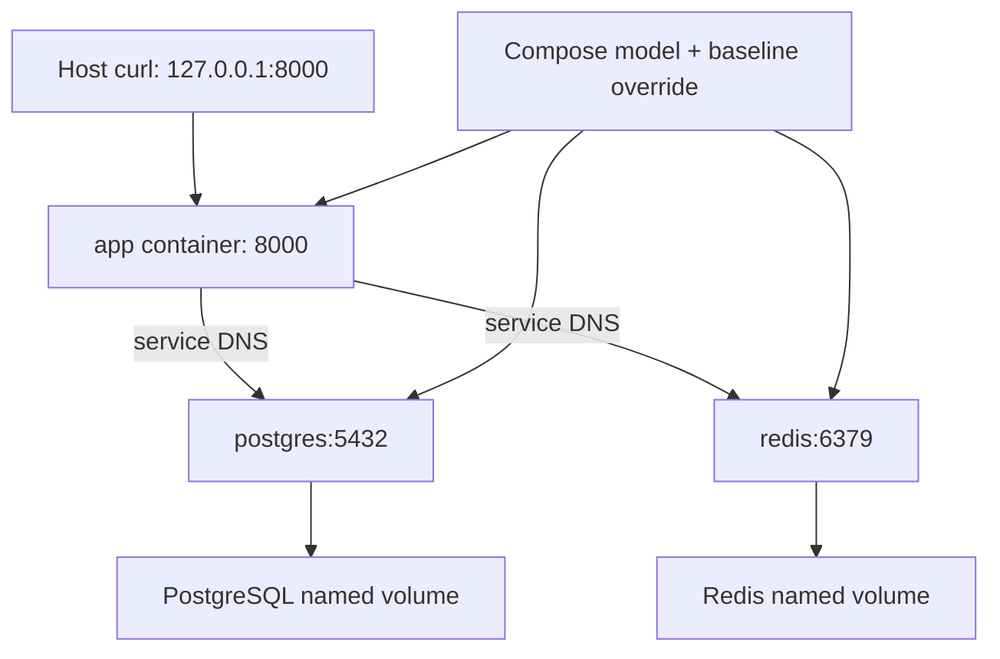

# Lab 05: Docker Compose Networking, Storage, and Restart Behavior

## 1. Purpose and Learning Outcomes

**In Plain Language:** You will learn which parts of a Docker deployment change when you restart, rebuild, or recreate a service. Inspect network, container, process, and volume identities before each experiment, then compare them afterward. This explains why a database row can survive container replacement, why edited configuration may not be active yet, and why an unhealthy probe does not itself restart a container.

> **Primary Objective:** Prove how Compose service DNS, published ports, named volumes, container identity, application configuration, health checks and restart policies interact on one Docker host.

The application and dependencies are no longer black boxes. Labs 1–4 established their request, persistence, cache and health contracts. This lab examines the runtime that connects and replaces those processes.

A service name, container ID, image ID, process start time and volume name each identify a different thing. Treating them as interchangeable leads to avoidable deployment and recovery mistakes.

## 2. Starting Point and Lab Map

Use this guide inside the complete application repository. Run commands from the repository root in Bash unless a step says otherwise. Work through the starting checks in order; they load the helpers and state this lab needs.

Read the explanation before each step, run one complete code block at a time, and compare the actual result with the stated expectation. Save commands, observations, explanations, and unexpected results in your notebook.

### Key Terms

| **Term**             | **Plain-Language Meaning**                                                            |
| -------------------- | ------------------------------------------------------------------------------------- |
| Container recreation | Replace the service's container using the selected image and effective configuration. |
| Named volume         | Storage whose lifecycle is separate from a particular container instance.             |
| Service DNS          | The Compose service name used to reach a container without hard-coding its address.   |

### Lab Map

The arrows show the flow or dependency being studied. Branches identify paths to compare; this is a conceptual map, not a captured runtime trace.


```mermaid
flowchart TD
    Host["Host curl: 127.0.0.1:8000"] --> App["app container: 8000"]
    App -->|"service DNS"| PG["postgres:5432"]
    App -->|"service DNS"| Redis["redis:6379"]
    PG --> PGVolume["PostgreSQL named volume"]
    Redis --> RedisVolume["Redis named volume"]
    Model["Compose model + baseline override"] --> App
    Model --> PG
    Model --> Redis
```

## 3. Guided Walkthrough

### Step 01. Inherited State

**What You Are Doing:** Keep the existing checkpoint and three-service baseline. That row gives you something concrete to verify while runtime objects change around it.

**Practical Walkthrough:** Keep the same item checkpoint and restored baseline so you have durable state to compare across runtime changes. Note the successful one-shot jobs separately from the three active services. The lab will alter containers and processes while repeatedly asking whether the known row and intended configuration survived.

Record the existing checkpoint before changing runtime objects. Keep completed initialization jobs distinct from currently running services. The same saved row will be your reference while container and process identities change, allowing you to attribute retained data to its storage boundary instead of to a still-running application process.

Continue with the baseline override and shared helpers from Lab 1, plus Lab 2's tested connection-error translation. Keep the course checkpoint item; temporary rows from the earlier labs should be cleaned up.

Only app, postgres and redis should be running. The two initialization jobs may remain as successful exited containers. Telemetry backends and exporters are not introduced in this lab.

**Understanding the Result:** A stable reference row gives meaning to the lifecycle observations. Starting over with an empty database would remove that continuity.

### Step 02. Scope and Exclusions

**What You Are Doing:** Limit each experiment to one lifecycle or networking question. Changing several layers together would hide which operation caused an identity or data change.

**Practical Walkthrough:** Treat networking, storage attachment, image contents, environment settings, health probes, and restart policy as separate mechanisms. Each experiment changes one mechanism and compares a small set of observations. This discipline makes it possible to explain a result instead of attributing every change to 'Docker restarting.'

Before running a lifecycle command, name the object it changes and the evidence you will compare. For example, container replacement is checked by ID, configuration adoption by a running value, and persistence by a row plus its volume identity. This makes similar-looking restart operations distinguishable in the recorded results.

You will inspect real network/volume identities, test DNS and listener reachability, replace containers while retaining data, distinguish restart from configuration reconciliation, deliberately fail a health check, and exercise manual stop versus unexpected process exit.

This is Docker Compose on one host. Do not add Kubernetes, a service mesh, cloud networking, HA replicas, bind-mounted live application source or a new orchestration system. Do not delete volumes or restart the Docker daemon for these exercises.

**Understanding the Result:** Name the exact object and operation when taking notes. Restarting a process, replacing a container, and deleting a volume have very different consequences.

### Step 03. Starting Checks

**What You Are Doing:** Confirm the current state and stop competing experiments. Several steps briefly interrupt services, so comparisons need a quiet and understood baseline.

**Practical Walkthrough:** Load the helper, confirm the expected service set and checkpoint, and stop any other experiments against this project. Several upcoming actions briefly interrupt the app or PostgreSQL. A second operator or workload could otherwise change restart counts, refill cache keys, or produce failures unrelated to your selected lifecycle action.

Read the current service inventory and confirm the checkpoint through the intended application path. Coordinate the brief interruptions so another exercise does not run against the same project simultaneously. Preserve the pre-change IDs and values; comparing only the final healthy state would conceal which objects actually changed during the experiment.

```bash
source lab-notes/session.sh
baseline_check
mkdir -p lab-notes/lab-05
CHECKPOINT_ID=$(cat lab-notes/checkpoint-item-id.txt)
api -fsS "$APP_URL/api/v1/items/$CHECKPOINT_ID" \
  -o lab-notes/lab-05/checkpoint-before.json
jq '{id,name,price}' lab-notes/lab-05/checkpoint-before.json
dc ps -a
```

Stop other experiments in this Compose project. Several steps briefly interrupt the app or PostgreSQL; they belong on your learning host, not a shared production deployment.

**Understanding the Result:** The starting checks create a controlled comparison. If another action occurs during the interval, record it rather than forcing the result into your prediction.

### Step 04. Measurable Learning Objectives

**What You Are Doing:** For each operation, explain which identity changed and which state survived. Those observations are the practical meaning of the lifecycle terms in this lab.

**Practical Walkthrough:** Use the learning objectives to connect each Docker term with something you can record, such as an ID, mount name, or timestamp. For a replacement experiment, predict which of those values should change and which should remain. This turns abstract lifecycle vocabulary into inspectable evidence.

Pair each objective with a before-and-after value: address, container ID, process start time, volume name, or effective environment. Predict changes before issuing the command. When an unexpected field stays the same, ask whether Docker is allowed to reuse it, rather than assuming the entire lifecycle action failed.

By the end, demonstrate:

- image, service, container, process and volume identities are different;
- the app uses Docker service DNS instead of fixed container IPs;
- a container's localhost refers to its own network namespace;
- a published host port is different from an internal service port;
- a named network is not complete tenant or security isolation;
- named-volume data survives container replacement;
- bootstrap SQL is not reapplied to an initialized data directory;
- restart does not adopt changed Compose environment or rebuilt source;
- unhealthy status does not itself trigger Docker restart policy;
- an unexpected main-process exit can trigger `unless-stopped`;
- an explicit stop remains stopped until intentionally started; and
- every experiment restores the approved baseline and preserves the checkpoint row.

**Understanding the Result:** An operation's name is not proof of its effect. Compare actual before-and-after identities and a business request to establish what happened.

### Step 05. Runtime Architecture

**What You Are Doing:** Read the map as two relationships: network connections between services and persistent storage mounted into data services. Network reachability and data persistence are separate concerns.

**Practical Walkthrough:** Read the map in two passes: first how the client reaches the app and the app reaches dependencies, then where each data service stores persistent state. Network connections explain reachability, while volume attachments explain persistence. These relationships remain distinct even when the services share one Compose project.

Trace host-to-app traffic separately from app-to-dependency traffic. Then trace PostgreSQL's data path to its mounted volume. These two passes explain why a reachable new container can still contain the old rows and why a retained volume does not guarantee that the application's current network connection remains usable.

The lab map in Section 2 shows this relationship.

All three long-running baseline containers join the project-scoped `platform` bridge network. The ownership job uses no network. Later telemetry services also use `platform`; network membership alone does not provide complete security isolation.

**Understanding the Result:** A correct service address does not establish correct storage attachment. Both need separate checks when a recreated database appears empty or unreachable.

### Step 06. Identify the Objects You Are Operating

**What You Are Doing:** Record the service, image, container, process, and volume as distinct objects. Similar names in Docker output can otherwise make a restart look like a replacement.

**Practical Walkthrough:** Record the desired service definition, packaged image, created container, current process, and named volume separately. A restart can keep the container ID but start a new process; recreation creates another container that can mount the same volume. Use the table to avoid treating these related identities as synonyms.

Refresh container variables after any recreation because a saved container ID can then refer to the old object. Keep the stable Compose service name separate from that changing runtime ID. When interpreting restart evidence, compare the process start time as well as the container identity so replacement and restart are not confused.

```bash
APP_CONTAINER=$(dc ps -q app)
PG_CONTAINER=$(dc ps -q postgres)
REDIS_CONTAINER=$(dc ps -q redis)
docker inspect --format \
  'name={{.Name}} id={{.Id}} image={{.Image}} started={{.State.StartedAt}}' \
  "$APP_CONTAINER" "$PG_CONTAINER" "$REDIS_CONTAINER"
dc images
```

| **Object**      | **Meaning**                                            | **Can Change without Deleting the Item?**       |
| --------------- | ------------------------------------------------------ | ----------------------------------------------- |
| Compose service | Desired definition such as `app`                       | Yes, when configuration changes                 |
| Image           | Packaged filesystem/runtime content                    | Yes, on rebuild/deploy                          |
| Container       | Instance created from image plus runtime configuration | Yes, on recreation                              |
| Process         | Current execution within a container                   | Yes, on restart                                 |
| Named volume    | Storage independently mounted into a container         | Preserves data across those changes if retained |

The service key is stable operational addressing. Do not hardcode generated container names from another repository.

**Understanding the Result:** The row can survive while several runtime identities change. The persistence question depends on the database's retained storage, not on every container keeping its old ID.

### Step 07. Inspect the Effective Network Model Safely

**What You Are Doing:** Inspect the effective network configuration and the actual attached network. The project namespace matters because it selects which network and volumes this deployment uses.

**Practical Walkthrough:** Inspect the resolved network settings and then the actual network attached to the running app. The project name scopes Docker-created resources, so a different project can select different volumes and networks even when service names look familiar. Use the discovered network instead of a subnet copied from another machine.

Inspect the network actually attached to `APP_CONTAINER` and compare it with the effective Compose model. The selected `jq` fields show useful topology without printing the entire environment. If the project identity differs from your expectation, resolve it before changing volumes; an apparently empty database may belong to another project altogether.

```bash
dc config --format json | jq '{
  networks: .networks,
  app_networks: .services.app.networks,
  postgres_networks: .services.postgres.networks,
  redis_networks: .services.redis.networks
}'
```

Find the actual network name from the running app:

```bash
NETWORK_NAME=$(docker inspect --format '{{json .NetworkSettings.Networks}}' \
  "$APP_CONTAINER" | jq -er 'keys[0]')
docker network inspect "$NETWORK_NAME" | jq '.[0] | {
  Name, Driver, Internal,
  containers: [.Containers[] | {Name,IPv4Address}]
}'
```

In this one-network baseline, the first key is the `platform` network. If you later add more networks, select the intended network explicitly rather than continuing to assume one.

The Compose project scopes network and volume names. Changing `COMPOSE_PROJECT_NAME` creates a different deployment namespace and may make old data appear absent because different volumes are selected; it does not automatically erase the original volumes.

**Understanding the Result:** Apparently missing data after a project-name change may be a different volume selection. Establish the resource identity before attempting repair or initialization.

### Step 08. Prove Service DNS Inside the Application Container

**What You Are Doing:** Resolve dependency names from inside the application container. This tests the namespace the app uses, rather than the host's separate view of those names.

**Practical Walkthrough:** Resolve `postgres` and `redis` from inside the app container, which is where those names are used by the application. The host shell has a different naming context. Record the returned private addresses but keep stable service names in application configuration, because recreated containers can receive different addresses.

Run the resolver inside the app container so the test uses the application's DNS context. Record both the service name and returned address. Treat the address as an observation of this runtime instance, while retaining the service name in configuration so later recreation can change addresses without requiring a hardcoded endpoint edit.

```bash
dc exec -T app python - <<'PYTHON'
import socket
for host in ("postgres", "redis", "app"):
    addresses = sorted({
        entry[4][0]
        for entry in socket.getaddrinfo(host, None, family=socket.AF_INET)
    })
    print(host, addresses)
PYTHON
```

**Command Note:** `exec -T` runs the diagnostic command inside the existing container without allocating a terminal. The heredoc supplies its program on standard input, using the dependencies installed in that image.

**Expected Result:** each name resolves to a private address on the project network. Do not copy those addresses into application configuration. Container addresses are implementation details that can change during recreation.

DNS resolution alone does not prove a service is listening, authenticated or ready.

**Understanding the Result:** Successful resolution proves the name mapped to an address. It does not yet prove that a service is listening, authenticating the app, or answering useful queries.

### Step 09. Distinguish Resolution from Listener Reachability

**What You Are Doing:** Try a TCP connection after DNS resolution. This separates finding an address from reaching a listener; neither alone proves authentication or a successful database query.

**Practical Walkthrough:** After resolving the dependency names, attempt bounded TCP connections to their internal listener ports. Compare that with a connection to the app container's own loopback address. A connection refusal or timeout identifies a different boundary from an authentication error returned after a successful connection.

Interpret each connection attempt in order: name resolution supplies an address, TCP checks for a reachable listener, and authentication would occur afterward. The loopback attempt is a comparison with the app container itself. A failed loopback database connection is expected when PostgreSQL runs in another service, even if the real dependency connection succeeds.

```bash
dc exec -T app python - <<'PYTHON'
import socket
for host, port in (("postgres", 5432), ("redis", 6379), ("127.0.0.1", 5432)):
    try:
        with socket.create_connection((host, port), timeout=2):
            print(f"{host}:{port} TCP reachable")
    except OSError as error:
        print(f"{host}:{port} {type(error).__name__}")
PYTHON
```

**Expected Result:** PostgreSQL and Redis service-name connections succeed; app-local port 5432 fails because PostgreSQL does not run in the app container.

These are TCP probes, not authenticated database/Redis commands. Lab 4's readiness path supplies application-identity and minimal schema evidence. A successful socket connection is a narrower claim.

**Understanding the Result:** The app's `localhost` refers to itself. A working TCP connection is still a narrower check than an authenticated database query through the application.

### Step 10. Inspect Published and Internal Ports

**What You Are Doing:** Compare a port inside a container with a published host binding. A service can be reachable to its peers without being published on the host.

**Practical Walkthrough:** Inspect both container-side ports and host-side published bindings. An internal dependency can serve peer containers without a host port, while the app's published loopback binding gives host clients a route into its listener. Image `EXPOSE` metadata alone is not the instruction that publishes a port.

Compare the published host address and port with the container listener port. Use the actual binding to explain who can reach the app from the host or another machine. For PostgreSQL and Redis, an absent host binding does not prevent peer containers on the network from using their internal service endpoints.

```bash
dc port app 8000
docker inspect --format '{{json .NetworkSettings.Ports}}' "$APP_CONTAINER" | jq .
docker inspect --format '{{json .HostConfig.PortBindings}}' "$PG_CONTAINER" | jq .
docker inspect --format '{{json .HostConfig.PortBindings}}' "$REDIS_CONTAINER" | jq .
```

Expected app mapping: `127.0.0.1:8000`. PostgreSQL and Redis have no published host bindings.

An image may declare an exposed internal port in metadata without publishing it on the host. `EXPOSE` is documentation and metadata; host reachability comes from port publication and network policy.

The full platform publishes a few additional loopback ports when its services are actually started. Those ports need not be listening in this early baseline.

**Understanding the Result:** Choose reachability claims from actual bindings and caller location. An internal port number printed in metadata does not establish remote host access.

### Step 11. Explain Host versus Container Addressing

**What You Are Doing:** Choose the address from the caller's location. In particular, loopback inside the app points to the app container, not to PostgreSQL or the Docker host.

**Practical Walkthrough:** For each caller in the table, imagine where its network request begins. The host uses the published app port, whereas containers use service DNS and internal listeners. A browser on a separate workstation needs the stated remote-access path to the host's loopback binding rather than the container's private address.

Write the caller's location next to every URL in the table. The browser, host shell, and application container do not share one loopback interface. When diagnosing reachability, choose the endpoint from that caller's viewpoint before changing ports or firewall settings; an address valid inside Docker may be meaningless to a remote browser.

| **Caller**                  | **Correct Address in This Baseline**   | **Reason**                                       |
| --------------------------- | -------------------------------------- | ------------------------------------------------ |
| curl on the Docker host     | `http://127.0.0.1:8000`                | App port is published on host loopback           |
| App to PostgreSQL           | `postgres:5432`                        | Service DNS and internal listener                |
| App to Redis                | `redis:6379`                           | Service DNS and internal listener                |
| Later Prometheus to app     | `app:8000`                             | Internal scrape target, independent of host port |
| Browser on another computer | SSH tunnel to the host's loopback port | Loopback is not remotely reachable               |

Changing a host port does not change the internal listener or service DNS. This repository's ports are literal Compose bindings; the sample's `APP_HOST_PORT` and `BIND_ADDRESS` variables are not supported settings. A deliberate port change requires a reviewed Compose override/edit and a matching APP_URL on the host.

**Understanding the Result:** Write the caller beside an endpoint in your notes. The same `127.0.0.1` string names a different loopback interface from different machines or containers.

### Step 12. Recognize the Network Security Boundary

**What You Are Doing:** Describe what the bridge and loopback bindings actually protect. Network membership is useful context, but it does not add authentication between every connected service.

**Practical Walkthrough:** Separate reachability from trust. Membership on the bridge gives services a path to one another, but does not automatically authenticate their requests or encrypt traffic. Loopback publication restricts the host-facing listener while still leaving local users and Docker administrators relevant to the access model.

Identify which callers are excluded by the loopback host binding and which remain able to reach internal services. Then identify authentication and encryption separately. A network path establishes possible communication, while credentials and transport protection address different questions. Describe only the boundaries demonstrated by the deployment's actual settings.

A user-defined bridge supplies service discovery and network separation from unrelated unattached containers. It is not authentication, encryption or fine-grained policy between services on that bridge.

Later observability services also join `platform`; do not claim database network isolation that the actual model does not implement. Loopback publication reduces remote exposure, but local users and Docker administrators remain privileged actors.

No Docker socket or host container-log directory is mounted into the baseline. Full-stack logging later uses the Docker daemon's Fluent Forward transport instead.

**Understanding the Result:** Describe the actual boundary instead of calling the network generally secure. Later hardening reviews will need to know who can reach each interface and with what identity.

### Step 13. Identify the Actual PostgreSQL Volume

**What You Are Doing:** Identify the named volume attached to PostgreSQL before replacing its container. This is the storage identity you expect to remain attached afterward.

**Practical Walkthrough:** Find the mounted PostgreSQL data volume and record its actual Docker name before changing the container. Also distinguish the read-only bootstrap SQL mount from the writable database storage. These mounts serve different purposes and cannot be substituted for one another when reasoning about persistent rows.

Check both mount destination and mount type before accepting the volume name. The database data directory identifies persistent storage; a mounted SQL initialization file is merely startup input. Save the discovered Docker volume name for the replacement comparison, and avoid inferring it solely from a Compose service name or an example from another host.

```bash
PG_VOLUME=$(docker inspect --format '{{json .Mounts}}' "$PG_CONTAINER" \
  | jq -er '.[] | select(.Destination == "/var/lib/postgresql/data" and .Type == "volume") | .Name')
printf '%s\n' "$PG_VOLUME" | tee lab-notes/lab-05/postgres-volume.txt
docker volume inspect "$PG_VOLUME" | jq '.[0] | {Name,Driver,Labels}'
docker inspect --format '{{json .Mounts}}' "$PG_CONTAINER" \
  | jq '[.[] | {Type,Name,Source,Destination,RW}]'
```

You should see a writable named data volume and a read-only bind mount for bootstrap SQL. Do not edit or copy the live PostgreSQL data directory as if it were a safe logical backup.

Docker's local volume is on this Docker host. It is not off-host replication or disaster recovery.

**Understanding the Result:** The named volume is the storage continuity you will test. It remains host-local storage and is not itself proof of an off-host backup or replicated database.

### Step 14. Inspect Ownership and Runtime Write Boundaries

**What You Are Doing:** Inspect users and writable mounts to understand who can write where. A permission failure should be traced to the specific path and owner rather than fixed with broad privileges.

**Practical Walkthrough:** Inspect the effective runtime user and each writable path. The preparation job establishes ownership so non-root services can use their intended volumes. If a service cannot write, compare the exact UID and mount permissions rather than treating a broad privilege increase as the first solution.

Compare the runtime UID with the ownership prepared for its writable mounts. Distinguish a read-only root filesystem from explicitly writable storage and temporary paths. If a write fails, inspect the exact path and mount permissions; changing the entire service to run with broader privileges would obscure the intended ownership mechanism.

```bash
dc exec postgres id
dc exec app id
dc exec redis id
docker inspect --format 'readonly_root={{.HostConfig.ReadonlyRootfs}}' "$APP_CONTAINER"
dc config --format json | jq '{
  initializer_user: .services["init-volumes"].user,
  initializer_network: .services["init-volumes"].network_mode,
  initializer_capabilities: .services["init-volumes"].cap_add
}'
```

The long-running app and Redis use UID 10001; PostgreSQL uses UID 999 in the selected image. A narrowly scoped root job prepares named-volume roots before the non-root services start.

The application root filesystem is read-only, with `/tmp` provided separately. PostgreSQL needs its writable data/runtime paths. Do not “repair” a permission issue by making every service privileged or world-writable.

**Understanding the Result:** A read-only application root and a writable temporary path can be intentional. Persistence belongs on the documented storage path, not wherever a quick write happens to succeed.

### Step 15. Predict Container Replacement

**What You Are Doing:** Predict the effect of database recreation on identity, storage, and connections. An IP address might be reused, so decide in advance which observation will prove replacement.

**Practical Walkthrough:** Write predictions for container ID, IP address, volume name, schema revision, and checkpoint survival before recreation. Those observations do not all have to change together. For example, Docker can reuse an address while creating a different container, so decide which identity actually proves replacement.

Use container ID as the primary evidence of recreation and volume name as evidence of storage continuity. Treat IP reuse as a possible outcome, not a failed experiment. Predict the checkpoint row and schema revision independently so the follow-up checks establish both retained data and the application's expected database structure.

Before recreating PostgreSQL, record predictions:

- Will the container ID change?
- Must its IP address change?
- Will the named volume name change?
- Will `init.sql` run as a fresh database initialization?
- Will the course checkpoint survive?
- Will a pooled connection from the old database process remain valid?

Write answers before running the next step.

**Understanding the Result:** Use explicit comparisons after the operation. An unchanged IP alone cannot establish that the old container was retained.

### Step 16. Replace Only the Database Container

**What You Are Doing:** Replace just the PostgreSQL container while preserving its named volume. Then allow the application to establish working connections to the replacement database process.

**Practical Walkthrough:** Run the service-scoped recreation so PostgreSQL gets a new container while the named data volume remains attached. Existing app connections to the old database process can fail and need replacement. Wait for the intended recovery checks before making claims about normal request behavior.

Save the old container and volume identifiers before running `up --force-recreate`. The service name and `--no-deps` limit the change to PostgreSQL. After replacement, compare the new identifiers and allow readiness to recover. A retained volume explains persistence, but existing connections may still need time to fail and be replaced.

```bash
OLD_PG_CONTAINER=$(dc ps -q postgres)
OLD_PG_VOLUME="$PG_VOLUME"
dbsql -v item_id="$CHECKPOINT_ID" <<'SQL'
SELECT id, name, price FROM items WHERE id = :'item_id'::uuid;
SQL
dc up -d --no-deps --force-recreate postgres
wait_ready
NEW_PG_CONTAINER=$(dc ps -q postgres)
NEW_PG_VOLUME=$(docker inspect --format '{{json .Mounts}}' "$NEW_PG_CONTAINER" \
  | jq -er '.[] | select(.Destination == "/var/lib/postgresql/data" and .Type == "volume") | .Name')
printf 'old_container=%s\nnew_container=%s\nold_volume=%s\nnew_volume=%s\n' \
  "$OLD_PG_CONTAINER" "$NEW_PG_CONTAINER" "$OLD_PG_VOLUME" "$NEW_PG_VOLUME" \
  | tee lab-notes/lab-05/database-recreation.txt
test "$OLD_PG_CONTAINER" != "$NEW_PG_CONTAINER"
test "$OLD_PG_VOLUME" = "$NEW_PG_VOLUME"
```

The database is interrupted briefly. Existing pooled sockets may fail and be replaced. The app's health loop and subsequent operations should recover using the stable `postgres` service name and pool pre-ping behavior.

An in-flight request is not guaranteed to succeed through this interruption. The exercise proves eventual recovery, not transparent database failover.

**Understanding the Result:** This demonstrates recovery after a brief interruption. It does not promise that every request already in progress will transparently survive the replacement.

### Step 17. Prove Data and DNS After Replacement

**What You Are Doing:** Verify the checkpoint, migration revision, and name resolution after replacement. These checks cover durable data, schema state, and the app's network path separately.

**Practical Walkthrough:** Read the checkpoint, inspect the migration revision, and resolve the database service name again. These checks cover data, schema, and network discovery independently. Compare the container ID with the saved one and the volume identity with its expected retained value to explain why data survived.

Run the direct SQL check before relying on an API response that could be cached. Compare the exact checkpoint ID and migration revision with the saved baseline, then verify service-name resolution. Together these checks explain what survived, what changed, and how the app finds the replacement database container.

```bash
dbsql -v item_id="$CHECKPOINT_ID" <<'SQL'
SELECT id, name, price FROM items WHERE id = :'item_id'::uuid;
SELECT version_num FROM alembic_version;
SQL
rcli DEL "$(cache_key "$CHECKPOINT_ID")"
api -fsS "$APP_URL/api/v1/items/$CHECKPOINT_ID" \
  -o lab-notes/lab-05/checkpoint-after-db-recreation.json
dc exec -T app python -c 'import socket; print(socket.gethostbyname("postgres"))'
```

**Expected Result:** same row and Alembic revision, a successful uncached read and working service-name resolution. Docker may reuse the prior IP address; an unchanged IP does not mean the container was not replaced. The container-ID comparison is the evidence.

**Understanding the Result:** A successful row read plus the recorded identities supports the persistence claim. Merely seeing PostgreSQL marked running would leave the data path unverified.

### Step 18. Explain Why Bootstrap SQL Did Not Reset Data

**What You Are Doing:** Relate the unchanged data to first-time initialization behavior. An already initialized volume is not rebuilt from bootstrap SQL each time a container starts.

**Practical Walkthrough:** Inspect the entrypoint's initialization behavior alongside the retained data directory. Initial SQL prepares an empty database volume; it is not replayed as a reset every time the container starts. Existing rows, roles, and schema therefore need deliberate migration or administration rather than edits to bootstrap inputs alone.

Read startup logs for evidence of how the existing data directory was handled. Relate that behavior to the retained volume from the previous step. Editing an initialization input changes a future empty-volume setup; existing roles, passwords, and tables require their appropriate administrative or migration operation instead of merely recreating the container.

```bash
dc logs --tail=80 postgres
```

With an initialized data directory, the official PostgreSQL entrypoint skips first-time initialization. The persistent data and roles are already present.

Editing `postgres/init.sql` or an initial password variable does not apply a migration or rotate an existing role. Alembic remains the schema authority, and account changes require deliberate administration.

**Understanding the Result:** A changed initialization file or initial password variable does not automatically alter an established database. Determine which lifecycle stage consumes that setting.

### Step 19. Replace the Application and Compare Ephemeral State

**What You Are Doing:** Compare a temporary app-side marker with the durable database row across app replacement. Their different lifetimes make the storage boundary visible.

**Practical Walkthrough:** Place a harmless marker in the app's temporary writable area, then replace the app and check both that marker and the database checkpoint. The marker represents process-adjacent disposable state, while the row lives in another service's named storage. Their different outcomes make the boundary concrete.

Create the temporary marker before saving the old app ID, then recreate only the app. Afterward, check the new container ID, marker absence, and checkpoint response separately. The marker and business row have different storage owners, so their different outcomes are the expected evidence of disposable app state and retained database state.

Create a harmless marker in the app's writable temporary area:

```bash
dc exec -T app python -c 'from pathlib import Path; Path("/tmp/lab5-marker").write_text("temporary")'
OLD_APP_CONTAINER=$(dc ps -q app)
dc up -d --no-deps --force-recreate app
baseline_check
NEW_APP_CONTAINER=$(dc ps -q app)
test "$OLD_APP_CONTAINER" != "$NEW_APP_CONTAINER"
dc exec -T app python -c 'from pathlib import Path; print("marker_exists=", Path("/tmp/lab5-marker").exists())'
api -fsS "$APP_URL/api/v1/items/$CHECKPOINT_ID" | jq '{id,name,price}'
```

**Expected Result:** marker absent, database record present. `/tmp` is tmpfs and is ephemeral across container stop/recreation; do not use it for authoritative records. Named PostgreSQL storage is the persistence boundary.

**Understanding the Result:** Temporary state can disappear while authoritative data survives. Do not use the app's temporary filesystem as a business-data store.

### Step 20. Understand Source, Build and Runtime Configuration

**What You Are Doing:** Match each kind of edit to the operation needed to activate it. Source copied into an image, container environment, and service-read configuration files have different lifecycles.

**Practical Walkthrough:** Classify a proposed change before choosing an activation command. Source copied during image build needs a new image; environment fixed at container creation needs recreation; a mounted file may require its service's reload mechanism. A restart only restarts the existing container configuration and cannot perform every one of these jobs.

Ask when each configuration source is consumed: during image build, container creation, or a service reload. Use that answer to select the lifecycle action. A correct file on the host does not prove deployment; verify the running process's value or behavior after the action that is supposed to activate the change.

| **Change**                      | **Sufficient Action**                            | **Why**                                                |
| ------------------------------- | ------------------------------------------------ | ------------------------------------------------------ |
| Python source copied into image | Build new image, then recreate app               | Restart still uses old image content                   |
| Compose environment variable    | Reconcile with `up` so the app is recreated      | Existing container environment is fixed at creation    |
| Read-only bound config file     | Service-specific reload or restart, as supported | File bytes can change, process may need to reread them |
| Stopped unchanged container     | `start`                                          | Reuses its existing configuration and mounts           |
| Required schema change          | Reviewed Alembic migration                       | Restart is not schema management                       |

Do not apply a broad no-cache rebuild to every networking or payload error. Choose the operation that addresses the changed layer.

**Understanding the Result:** Ask which artifact the running process will read next. That explains why an edited file can be correct on disk while the deployed behavior remains unchanged.

### Step 21. Prove Restart Does Not Adopt a New Environment

**What You Are Doing:** Change a harmless environment value, restart, and then recreate the app. Comparing the two outcomes shows when Docker actually applies the new container definition.

**Practical Walkthrough:** Add the harmless version override, inspect the old running value, and restart the existing app. Then apply the effective configuration with the documented `up` operation and inspect the value again. The two stages isolate restarting a process from constructing a container with a changed environment.

Keep the temporary override in the command's file list for both phases of the comparison. First observe that restart retains the existing environment, then let `up` reconcile the changed model. Compare the environment and OpenAPI version after readiness returns so the new value is verified at both process and application boundaries.

Create a safe temporary version-only override:

```bash
cat > lab-notes/compose.version.yaml <<'YAML'
services:
  app:
    environment:
      APP_VERSION: lab05-demo
YAML
VERSION_BEFORE=$(dc exec -T app python -c 'import os; print(os.environ["APP_VERSION"])')
dc -f "$LAB_ROOT/lab-notes/compose.version.yaml" restart app
wait_ready
VERSION_AFTER_RESTART=$(dc exec -T app python -c 'import os; print(os.environ["APP_VERSION"])')
printf 'before=%s after_restart=%s\n' "$VERSION_BEFORE" "$VERSION_AFTER_RESTART"
test "$VERSION_BEFORE" = "$VERSION_AFTER_RESTART"
```

**Command Note:** `<<'YAML'` writes the following block literally until `YAML`. Quoting the delimiter prevents Bash from expanding `$variables` inside the generated file; creation and execution are separate steps.

The Compose file has changed, but `restart` operates on the existing container. It does not reconstruct its environment.

Now apply the effective model:

```bash
dc -f "$LAB_ROOT/lab-notes/compose.version.yaml" up -d --no-deps app
wait_ready
dc exec -T app python -c 'import os; print(os.environ["APP_VERSION"])'
api -fsS "$APP_URL/openapi.json" | jq -r '.info.version'
```

**Expected Result:** `lab05-demo` at both layers.

**Understanding the Result:** The new value should appear only after the changed model is adopted. Seeing the override file on disk is not proof the existing container uses it.

### Step 22. Restore the Approved Configuration

**What You Are Doing:** Reconcile the app with the approved configuration and verify the value again. Removing a temporary override from your files does not by itself change a running container.

**Practical Walkthrough:** Return to the ordinary helper configuration and reconcile the app again so the temporary version setting is removed from the running container. Verify the effective value rather than only deleting the override file. This is the reverse of the activation step and uses the same configuration lifecycle principle.

Use the ordinary baseline helper without the temporary version override, reconcile the app, and inspect its running version. Remove the temporary file only after that restoration is established. File deletion is cleanup; the preceding Compose operation is what causes the deployed environment to return to the approved configuration.

```bash
dc up -d --no-deps app
baseline_check
dc exec -T app python -c 'import os; print(os.environ["APP_VERSION"])'
rm lab-notes/compose.version.yaml
```

The ordinary `dc` command no longer includes the temporary version override, so `up` reconciles the app back to the original environment. Removing a file alone would not mutate a running container.

If you were interrupted in Step 21, run this recovery section before any later lab. No secret values were modified.

**Understanding the Result:** The approved value must be visible at the running layer. Removing an input file alone does not retroactively edit a container's environment.

### Step 23. Inspect Restart and Health Policy Separately

**What You Are Doing:** Inspect the restart policy and health command as separate settings. One responds to process exit; the other records the result of a probe.

**Practical Walkthrough:** Read the restart policy and the health command from the actual container settings. One specifies how certain exits are handled; the other periodically records a probe result. Keeping them separate prepares you for the next experiment, where only the health check is deliberately made to fail.

Refresh `APP_CONTAINER` before inspecting policy because previous steps recreated it. Read restart policy and health command as independent settings. The health command defines the observation Docker records; the restart policy governs qualifying process exits. Neither setting alone proves what happened, so preserve them alongside the lifecycle counters used later.

```bash
APP_CONTAINER=$(dc ps -q app)
docker inspect --format '{{json .HostConfig.RestartPolicy}}' "$APP_CONTAINER" | jq .
docker inspect --format '{{json .Config.Healthcheck}}' "$APP_CONTAINER" | jq .
```

Expected restart policy: `unless-stopped`. Expected health target: application liveness.

Docker's restart policy responds to container exit. Health status is a separate observation and does not automatically restart an unhealthy standalone container. [Docker documents the restart-policy behavior](https://docs.docker.com/engine/containers/start-containers-automatically/).

**Understanding the Result:** An unhealthy label is an observation. It is not, by itself, evidence that this standalone Compose deployment automatically replaced or restarted the app.

### Step 24. Deliberately Fail Only the Health Probe

**What You Are Doing:** Install a deliberately failing probe while leaving the application behavior intact. This creates a controlled disagreement between Docker's health label and real HTTP service.

**Practical Walkthrough:** Create an override whose probe fails while leaving the application's normal routes unchanged. Before running the observation block, predict Docker health, direct liveness, business requests, and process identity independently. This is a test of misleading health evidence, not an attempt to break the real application path.

Review the small override before applying it and confirm it changes the probe only. Predict direct API behavior independently of Docker health. This creates a deliberate disagreement between a failing probe and a working route, allowing the next step to test the consequences of the health label without introducing a real business-path fault.

This exercise changes the **probe**, not the application's ability to serve requests. Create a temporary override:

```bash
cat > lab-notes/compose.unhealthy.yaml <<'YAML'
services:
  app:
    healthcheck:
      test: ["CMD", "python", "-c", "import sys; sys.exit(1)"]
      interval: 2s
      timeout: 1s
      retries: 2
      start_period: 1s
YAML
```

Predict: Will Docker call the app unhealthy? Will liveness and CRUD fail? Will the container ID or restart count change just because probe commands fail?

**Understanding the Result:** The probe can be wrong while useful work remains available. Always inspect what a failed probe actually executes before diagnosing the service itself.

### Step 25. Prove Unhealthy Does Not Mean Automatically Restarted

**What You Are Doing:** Compare health, request success, and restart identity during the probe fault. The experiment tests the configured restart behavior without introducing a real dependency outage.

**Practical Walkthrough:** Capture Docker health and repeat real HTTP requests during the probe fault, then compare container and restart identities. The important contrast is a failed configured probe with a still-serving application. Preserve the recovery trap so the normal health command is restored even if a comparison fails.

Wait for the configured probe failures to produce the intended unhealthy state, then compare real responses and restart evidence within that interval. Keep the recovery trap attached to the subshell. If the container changes unexpectedly, inspect exits and operator actions; the health label alone is insufficient to explain the lifecycle change.

```bash
(
  set -euo pipefail
  trap 'dc up -d --no-deps --force-recreate app >/dev/null' EXIT
  trap 'exit 130' INT
  trap 'exit 143' TERM
  dc -f "$LAB_ROOT/lab-notes/compose.unhealthy.yaml" up -d --no-deps --force-recreate app
  wait_ready
  unhealthy_container=$(dc ps -q app)
  observed=false
  for attempt in {1..25}; do
    state=$(docker inspect --format '{{.State.Health.Status}}' "$unhealthy_container")
    if [[ "$state" = unhealthy ]]; then
      observed=true
      break
    fi
    sleep 1
  done
  test "$observed" = true
  before=$(docker inspect --format '{{.RestartCount}}' "$unhealthy_container")
  api -fsS "$APP_URL/health/live" | jq .
  api -fsS "$APP_URL/api/v1/items?limit=1" >/dev/null
  sleep 6
  after=$(docker inspect --format '{{.RestartCount}}' "$unhealthy_container")
  test "$before" = "$after"
  test "$(dc ps -q app)" = "$unhealthy_container"
  docker inspect --format \
    'container={{.Id}} health={{.State.Health.Status}} restarts={{.RestartCount}}' \
    "$unhealthy_container" | tee lab-notes/lab-05/unhealthy-evidence.txt
)
baseline_check
rm lab-notes/compose.unhealthy.yaml
```

**Command Note:** `trap ... EXIT` schedules cleanup when that shell exits. Keep it in the same block as the fault; the explicit recovery checks afterward confirm that restoration actually succeeded.

**Expected Result:** Docker shows unhealthy while the real liveness and list request work; identity and restart count stay unchanged. The exit trap recreates the app with the normal image-defined health check.

A misconfigured probe can produce false health evidence. Check what the probe actually runs before treating it as a business failure.

**Understanding the Result:** If the identity stays stable, health failure did not cause a restart in this test. If it changes, look for an actual exit or another action rather than assuming causation.

### Step 26. Confirm Normal Health Is Restored

**What You Are Doing:** Confirm both the normal probe configuration and a healthy result after recovery. A successful API request alone would not prove the temporary probe override was removed.

**Practical Walkthrough:** Inspect the restored health configuration and wait for Docker to report its resulting state. Also recheck readiness. These observations answer whether the deliberately bad probe was removed and whether the app can perform required work; one successful request cannot prove both.

Allow the normal probe enough attempts to report healthy after restoration. Inspect the actual health command as well as the resulting status, because a successful HTTP call cannot prove the temporary override was removed. Finish only when the intended probe and application readiness both match the recovered baseline.

```bash
APP_CONTAINER=$(dc ps -q app)
healthy=false
for attempt in {1..30}; do
  state=$(docker inspect --format '{{.State.Health.Status}}' "$APP_CONTAINER")
  if [[ "$state" = healthy ]]; then healthy=true; break; fi
  sleep 1
done
test "$healthy" = true
docker inspect --format '{{json .Config.Healthcheck}}' "$APP_CONTAINER" | jq .
```

Do not leave the deliberately failing probe active. Readiness alone would not prove that the override was removed; inspect the actual probe and Docker's state too.

**Understanding the Result:** Finish with the normal probe and healthy baseline. Leaving the temporary failure active would make the next lab begin with misleading status information.

### Step 27. Predict an Unexpected Application-Process Exit

**What You Are Doing:** Prepare to observe one unexpected Uvicorn process exit. Record identity and restart evidence first so you can distinguish automatic recovery from container replacement.

**Practical Walkthrough:** Identify the app's process arrangement and record its restart evidence before the deliberate crash. The targeted Uvicorn exit is meant to be unexpected from Docker's policy perspective. A manual Compose stop would be an administrative action with different semantics, so it is not an equivalent test.

Read the process-identification guard before sending any signal. It exists to ensure the command targets the intended server layout. Record the current restart count and process start time before the fault, and distinguish the upcoming unexpected exit from an administrative stop, which the restart policy treats differently.

The app uses Docker's tiny init process (`init: true`) and one Uvicorn server process. You will kill only that server process inside this known learning container.

This differs from `docker compose stop`, which is an intentional administrative stop. Avoid using a manual Docker stop/kill as proof of unexpected application-crash restart semantics.

Before changing anything, record:

- app container ID;
- restart count;
- process start time;
- whether the database checkpoint should survive.

**Understanding the Result:** The guard and recorded identities make the intended process failure reviewable. Do not substitute a broader host process kill if the layout differs.

### Step 28. Trigger One Bounded Process Failure

**What You Are Doing:** Run the guarded process-failure command only against the intended app process. Its nonzero exit is possible during shutdown, so the following recovery checks determine success.

**Practical Walkthrough:** Run the bounded command only after the app has had time to operate normally. It identifies the intended server process and sends the documented signal. Its connection can end while the container exits, so a tolerated command failure must be followed by the explicit restart and business checks rather than treated as automatic success.

Keep the initial stabilization wait and process guard intact. The command deliberately interrupts the server, so the exec connection can fail as a consequence. `|| true` permits subsequent observation; it is not a success assertion. Continue to the explicit lifecycle and business checks to determine whether the intended exit and recovery actually occurred.

Give the container time to run normally before testing its restart policy:

```bash
sleep 11
APP_CONTAINER=$(dc ps -q app)
RESTARTS_BEFORE=$(docker inspect --format '{{.RestartCount}}' "$APP_CONTAINER")
STARTED_BEFORE=$(docker inspect --format '{{.State.StartedAt}}' "$APP_CONTAINER")
dc exec -T app python - <<'PYTHON' || true
import os
import signal
from pathlib import Path
children = [int(value) for value in Path("/proc/1/task/1/children").read_text().split()]
targets = []
for pid in children:
    try:
        command = Path(f"/proc/{pid}/cmdline").read_bytes()
    except FileNotFoundError:
        continue
    if b"uvicorn" in command:
        targets.append(pid)
if len(targets) != 1:
    raise SystemExit("Expected exactly one Uvicorn child of container init; inspect process layout")
print("Terminating the known Uvicorn server process", flush=True)
os.kill(targets[0], signal.SIGKILL)
PYTHON
```

The exec connection may end nonzero when the container exits, so that one command permits it. The following checks must prove the intended outcome; do not interpret `|| true` itself as success.

This is intentionally disruptive and limited to one known app process. Do not run broad host process-kill commands.

**Understanding the Result:** The resulting process state determines whether the experiment worked. The presence of `|| true` only permits observation to continue; it does not prove recovery.

### Step 29. Verify Automatic Restart and Business Recovery

**What You Are Doing:** Check that the original container restarted and useful requests work again. The later start time and increased restart count explain how recovery occurred.

**Practical Walkthrough:** Compare the container ID, process start time, and restart count with the saved values. Then perform an uncached read of the known item. Together they show whether Docker restarted the same container and whether its recovered process can reconnect to the unchanged database.

Read the bounded loop's success condition and compare its result with both the unchanged container ID and changed process start time. Then clear only the checkpoint's cache key before its read. This requires the recovered app to contact retained storage, providing stronger recovery evidence than either a restart counter or a cached response alone.

```bash
restarted=false
for attempt in {1..45}; do
  current=$(docker inspect --format '{{.RestartCount}}' "$APP_CONTAINER")
  if (( current > RESTARTS_BEFORE )); then restarted=true; break; fi
  sleep 1
done
test "$restarted" = true
baseline_check
test "$(dc ps -q app)" = "$APP_CONTAINER"
STARTED_AFTER=$(docker inspect --format '{{.State.StartedAt}}' "$APP_CONTAINER")
test "$STARTED_BEFORE" != "$STARTED_AFTER"
docker inspect --format \
  'id={{.Id}} started={{.State.StartedAt}} restarts={{.RestartCount}}' \
  "$APP_CONTAINER" | tee lab-notes/lab-05/crash-recovery.txt
rcli DEL "$(cache_key "$CHECKPOINT_ID")"
api -fsS "$APP_URL/api/v1/items/$CHECKPOINT_ID" | jq '{id,name,price}'
```

**Expected Result:** same container ID, later start time, increased restart count and an uncached successful item read. The named volume and database process were not replaced.

If the process layout guard failed or no restart occurred, inspect the actual logs/policy rather than repeating random signals. Recover with `dc start app` or `dc up -d --no-deps app` as appropriate.

**Understanding the Result:** A later start and increased restart count explain recovery. A database row still being present does not alone show that the new app process can serve it.

### Step 30. Prove an Explicit Stop Remains Stopped

**What You Are Doing:** Stop the app deliberately and observe that it stays stopped until you resume it. This contrasts an operator's stop action with the previous unexpected process exit.

**Practical Walkthrough:** Stop the app intentionally and observe its state before explicitly starting it again. This tests the policy's treatment of an operator stop, using the same container whose unexpected crash you just observed. Keep the database and Redis running so they do not complicate the comparison.

After the explicit stop, inspect the same container and allow the short observation interval to pass. Remaining stopped demonstrates the administrative-stop behavior under the configured policy. Start the app deliberately and rerun the baseline check before continuing, keeping database and Redis state unchanged during this comparison.

```bash
dc stop app
sleep 5
docker inspect --format '{{.State.Status}}' "$APP_CONTAINER"
dc ps -a app
```

Expected state: exited, with no automatic restart simply because `unless-stopped` exists.

Resume intentionally:

```bash
dc start app
baseline_check
```

Do not infer identical restart behavior for `always`, `on-failure`, a daemon restart or another orchestrator. Policy names and administrative actions matter.

**Understanding the Result:** Remaining stopped can be the correct result under `unless-stopped`. Resume deliberately and verify readiness before interpreting the next step.

### Step 31. Compare Restart, Recreate, Down and Volume Removal

**What You Are Doing:** Use the lifecycle table to select the smallest operation that fits a future change. Pay particular attention to whether it retains data and adopts a new model or image.

**Practical Walkthrough:** Read each action row as a prediction of identity, retained storage, and configuration adoption. Choose a hypothetical change, such as edited Python code or a changed environment value, and identify the appropriate row. Include data consequences in that choice rather than using the broadest reset command available.

Choose an example change and explain which row activates it, which identities change, and what storage remains. Pay special attention to volume-removal actions because they alter the persistence boundary rather than merely runtime state. Use the table to justify a specific lifecycle command instead of treating all reset-like commands as equivalent.

| **Action**                                | **Container Identity** | **Named Data Volumes** | **Adopts Changed Model/Image?**   |
| ----------------------------------------- | ---------------------- | ---------------------- | --------------------------------- |
| `dc stop app` then `dc start app`         | Retained               | Retained               | No                                |
| `dc restart app`                          | Retained               | Retained               | No new environment or image       |
| `dc up -d --no-deps --force-recreate app` | Replaced               | Retained               | Uses effective current definition |
| `dc up -d --build --no-deps app`          | Replaced when needed   | Retained               | Builds source, reconciles app     |
| `dc down`                                 | Removed                | Named volumes retained | Next up creates new containers    |
| Volume-removing reset                     | Removed                | Data can be destroyed  | Not a normal recovery step        |

The destructive reset is deliberately not executed. `make clean CONFIRM=delete-local-data` removes this project's volumes and is outside the lab's experiments.

**Understanding the Result:** The smallest correct lifecycle action is easier to verify. Volume removal is a fundamentally different operation from restarting or recreating a service.

### Step 32. Optional Pause/Resume Check without Data Deletion

**What You Are Doing:** If pausing the course, stop only the baseline services and preserve volumes. On return, restore the same scoped baseline before starting the next lab.

**Practical Walkthrough:** If pausing, stop only the named baseline services and retain their storage and local helper files. On return, source the helper and use the documented service-scoped startup path. This works with the intended dependencies without accidentally reviving later-stage containers that may still exist from an earlier full-stack session.

On resumption, reload the helper into the new shell and start through the stated baseline path. Read the saved checkpoint ID, remove only its derived key, and request it again. That final uncached read verifies current application-to-database behavior after the pause, while preserving the course's durable reference data.

If you are ending the session, preserve your work:

```bash
dc stop app postgres redis
```

On return:

```bash
source lab-notes/session.sh
dc up -d app
baseline_check
CHECKPOINT_ID=$(cat lab-notes/checkpoint-item-id.txt)
rcli DEL "$(cache_key "$CHECKPOINT_ID")"
api -fsS "$APP_URL/api/v1/items/$CHECKPOINT_ID" | jq '{id,name,price}'
```

The service-qualified `up` also works after `dc down`, when removed containers no longer exist to start. It reconciles the app and its dependencies while preserving named-volume data. Avoid an unqualified `dc start`: telemetry containers from a previous full-stack session could also be started.

**Understanding the Result:** After resuming, repeat the baseline and checkpoint checks. A remembered successful state from yesterday is not a substitute for current readiness.

## 4. Troubleshooting and Diagnosis

Start with the first unexpected result. Record the exact symptom, identify which component produced it, and use the checks below before repeating the experiment. After a fix, repeat the original check and confirm recovery.

### Troubleshooting Runbook

#### A. Service DNS Lookup Fails

```bash
dc ps -a
docker inspect --format '{{json .NetworkSettings.Networks}}' "$(dc ps -q app)" | jq .
```

Check network membership and the actual Compose service key. `db` from the samples is not this project's PostgreSQL hostname.

#### B. `localhost:5432` Fails Inside App

That is expected. Use `postgres:5432` for container-to-container traffic. Do not publish PostgreSQL just to repair an internal hostname mistake.

#### C. A Host Port Change Breaks Another Service

Internal clients should continue using container ports and service DNS. Review whether you changed the listener itself or only host publication.

#### D. Data Appears Missing After Changing Project Name

Inspect the selected volume name and Docker project labels. You may have attached a new empty volume. Preserve the old volume while investigating; do not create random schemas to hide the mismatch.

#### E. Recreated PostgreSQL Reports Permission Denied

Check the initialization job, UID and mount ownership. The normal model uses `nocopy` volumes and a scoped ownership job. Avoid global chmod or privileged-mode workarounds.

#### F. Source Edits Do Not Appear After Restart

The image contains copied code. Rebuild/recreate the app, then compare the running source. Restart does not rebuild an image.

#### G. Environment Edits Do Not Appear After Restart

Use `up` with the correct effective Compose files. Inspect only the specific safe variable you changed, not the full secret-bearing environment.

#### H. The Unhealthy-Probe Experiment Leaves the App Unhealthy

```bash
dc up -d --no-deps --force-recreate app
wait_ready
docker inspect --format '{{json .Config.Healthcheck}}' "$(dc ps -q app)" | jq .
```

Confirm the temporary override is not included. Wait for a real normal probe to run before expecting Docker status healthy.

#### I. The Crash Experiment Does Not Restart

Check its guarded process selection, `.HostConfig.RestartPolicy`, `.State.ExitCode`, logs and whether a manual stop action occurred. The test targets the known server child, not arbitrary container PID 1. Do not repeat destructive signals without understanding the result.

#### J. One-Shot Jobs Show Exited

Inspect exit codes. Zero is the intended completion state for ownership and migration jobs. They are not permanent daemons.

### Diagnostic Sequence for Runtime Problems

1. Identify the Compose project and effective files.
2. Distinguish desired service configuration from the current container.
3. Check container identity, status, start time and restart count.
4. Check network membership, DNS and listener reachability separately.
5. Check exact volume attachment and ownership before touching data.
6. Inspect the configured health command, not only its colored status.
7. Apply the narrow restart, recreate, build or migration operation that matches the change.
8. Re-run the original business request and verify persistence.

## 5. Review and Practice

Answer the knowledge questions in your own words before reading the answer guide. For the scenario, name the evidence you would collect and the conclusion each observation would support.

### Knowledge Check

1. Which name should the app use for PostgreSQL?
2. Why is a fixed container IP a fragile dependency address?
3. Does DNS resolution prove authenticated database access?
4. Does Dockerfile EXPOSE publish a host port?
5. Does the `platform` bridge isolate each attached service from all others?
6. What survives database container recreation in this design?
7. Must a recreated container receive a different IP?
8. Why does `init.sql` not rerun on an initialized volume?
9. Does restart adopt changed Compose environment values?
10. Which step adopts a changed Python source file copied into an image?
11. Why did the deliberately unhealthy app keep serving requests?
12. What distinguishes unexpected process exit from explicit stop?
13. How did you prove restart instead of container replacement?
14. What does changing the Compose project name do to default volume selection?
15. What is missing from local volume persistence as a disaster-recovery strategy?

#### Answer Key

1. The service name `postgres` and internal port 5432.
2. IPs can change during replacement while service discovery preserves the logical name.
3. No; identity, listener and schema access are separate checks.
4. No; publication is runtime configuration.
5. No; members can generally communicate and need additional controls where required.
6. The retained named volume, including committed rows and schema state.
7. No; Docker can reuse an address, so compare IDs.
8. The entrypoint detects existing database data and skips first initialization.
9. No; recreate through an effective-model reconciliation.
10. Build a new image, then recreate the app from it.
11. Only its diagnostic probe was made false; no process-exit restart was triggered.
12. The restart policy handles the former; `unless-stopped` respects the latter.
13. Same container ID, changed start time and increased restart count after the crash.
14. It selects a different project-scoped deployment and generally different volumes.
15. Off-host protection, tested backups/restores and independent failure domains.

### Professional Scenario Exercise

A developer changes `.env`, runs `restart app`, then reports that the old setting is still active. Another operator suggests `down --volumes` and a full rebuild.

Write the smallest correct recovery plan. Explain which state belongs to the existing container, which operation applies changed configuration, why volume deletion is unrelated, and what HTTP/configuration evidence you will use to prove the result.

## 6. Completion Checklist

Mark each item only after you can point to its result or evidence file. Complete any cleanup shown here before moving on.

### Completion Criteria

- [ ] You used actual service/network/volume identities instead of sample names.
- [ ] DNS, TCP reachability and application readiness were distinguished.
- [ ] PostgreSQL and Redis remained unpublished on the host.
- [ ] Database recreation changed container identity while retaining volume and data.
- [ ] The item was verified through an uncached application read and direct SQL.
- [ ] App recreation removed ephemeral state without deleting database records.
- [ ] Restart left the old environment; recreation applied the temporary version.
- [ ] The original version and baseline override were restored.
- [ ] Unhealthy status did not by itself restart the app.
- [ ] The normal health probe was restored and became healthy.
- [ ] Unexpected server-process exit increased restart count in the same container.
- [ ] Manual stop remained stopped until intentional start.
- [ ] No named volumes or unrelated data were deleted.
- [ ] The course checkpoint remains and the notebook explains each result.

## 7. Production Context and Next Lab

### Production Implications

Containers are replaceable execution units. Persistence, identity, networking and recovery must be designed around their actual lifetimes. Stable service discovery is preferable to saved container IPs; a retained local volume is useful but remains in one host's failure domain.

Restart policies are a limited recovery mechanism, not HA, dependency supervision or proof of correct behavior. A crash loop can repeatedly damage availability while never addressing the cause. Health probes need their own correctness review, and deployments need an explicit distinction among rebuild, recreate, migrate and restart.

### End State and Transition to Lab 06

```bash
baseline_check
dc ps -a
CHECKPOINT_ID=$(cat lab-notes/checkpoint-item-id.txt)
api -fsS "$APP_URL/api/v1/items/$CHECKPOINT_ID" | jq '{id,name,price}'
```

Keep `lab-notes/compose.baseline.yaml` and `lab-notes/session.sh`; remove the temporary version/unhealthy override files if they remain after an interruption. Keep observability backends stopped.

The next roadmap entry is **Lab 06 — Structured Logging, Request IDs, and Evidence Capture**. Its implementation is not part of this five-lab delivery. You now know the request and runtime boundaries that its log events must describe; Lab 6 will formalize safe JSON logging, request context and evidence capture before Lab 7 begins raw metrics.