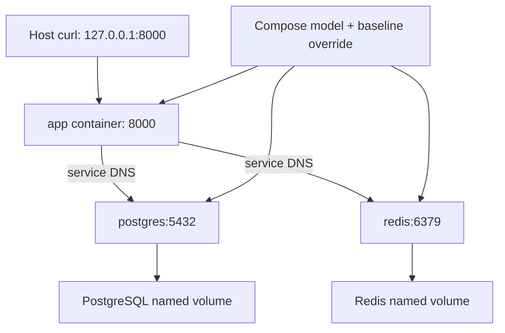

# Lab 05: Docker Compose Networking, Storage, and Restart Behavior

## 1. Purpose and Learning Outcomes

You will compare what changes when you restart, rebuild, or recreate a Docker service. Record container IDs, process start times, network details, and volume names before each experiment, then check them again. This explains how database rows survive a new container, why an edited setting may not be active, and why an unhealthy probe does not automatically restart the app.

> **Primary Objective:** Test how Compose service names, host ports, named storage volumes, container identities, configuration, health checks, and restart policies work together on one Docker host.

Labs 1–4 explained how requests, stored data, cached copies, and health checks work. This lab looks at Docker, which connects those services, runs their processes, and replaces their containers.

A service name, container ID, image ID, process start time, and volume name refer to different things. Learn which one to check for each question so a restart, deployment, or recovery does not change more than you intended.

## 2. Starting Point and Lab Map

Open the complete application repository before using this guide. Unless a step says otherwise, run commands in Bash from the repository's top-level folder. Follow the starting checks in order because later commands depend on the helper functions and running services they prepare.

Read each explanation before running its commands. Run one complete code block, check the result, and then continue. In your notebook, save the commands, what happened, why you think it happened, and anything that differed from the expected result.

### Key Terms

| **Term**             | **Explanation**                                                                            |
| -------------------- | ------------------------------------------------------------------------------------------ |
| Container Recreation | Create a replacement container from the selected image and current combined configuration. |
| Named Volume         | Storage that can remain after one container is removed and be attached to another.         |
| Service DNS          | Name lookup that lets containers use a Compose service name instead of a fixed IP address. |

### Lab Map

The arrows show how the parts connect and where a request can take different paths. Use this map to understand the design. It is not a recording of a request that actually ran.


```mermaid
flowchart TD
    Host["Host curl: 127.0.0.1:8000"] --> App["app container: 8000"]
    App -->|"service DNS"| PG["postgres:5432"]
    App -->|"service DNS"| Redis["redis:6379"]
    PG --> PGVolume["PostgreSQL named volume"]
    Redis --> RedisVolume["Redis named volume"]
    Model["Compose model + baseline override"] --> App
    Model --> PG
    Model --> Redis
```

## 3. Guided Walkthrough

### Step 01. Inherited State

**What You Are Doing:** Keep the same checkpoint row and working three-service setup. You will use that row to check data survival while containers and processes change.

**Practical Walkthrough:** Start with the saved checkpoint and recovered baseline. Separate completed setup jobs from the three running services. As each experiment changes a process or container, check the known row and the active configuration again.

Record the checkpoint before changing Docker objects. The same row will let you test whether data survives a different container or process. Keep setup jobs separate in your inventory; a job that exited successfully is not a failed long-running service.

Use Lab 1's override and helpers and Lab 2's tested connection-error fix. Keep the course checkpoint, but finish cleanup of temporary items from earlier labs.

Only app, postgres, and redis should be running. The two setup-job containers can remain stopped after successful completion. This lab does not start telemetry backends or exporters.

**Understanding the Result:** The unchanged reference row gives you something meaningful to compare. Starting with a new empty database would remove the evidence that old data survived.

### Step 02. Scope and Exclusions

**What You Are Doing:** Change one networking or lifecycle detail at a time. If several things change together, it is harder to explain which action changed an ID, setting, or row.

**Practical Walkthrough:** Treat networking, volume attachment, image contents, environment values, health checks, and restart policy as separate mechanisms. Each experiment changes one and checks the relevant result. Describe that specific action instead of calling every change “Docker restarting.”

Before each command, name the object you will change and how you will verify it. A container ID shows replacement, a value inside the running app shows configuration, and a row plus volume name shows retained data. Record the matching before-and-after evidence.

You will inspect real networks and volumes, test name lookup and TCP listeners, replace containers while keeping data, compare restart with applying configuration, force a health-check failure, and compare an explicit stop with an unexpected process exit.

Stay with Docker Compose on one host. Kubernetes, service meshes, cloud networking, high-availability replicas, live source bind mounts, and other orchestration tools are outside this lab. The experiments do not need volume deletion or a Docker-daemon restart.

**Understanding the Result:** Record the exact action and object. Restarting a process, replacing a container, and deleting stored volume data have very different effects.

### Step 03. Starting Checks

**What You Are Doing:** Check the current setup and stop competing experiments. Some steps briefly interrupt services, so you need to know what else might change during your comparison.

**Practical Walkthrough:** Load the helpers and check the service list and checkpoint. Pause other work on this project. Another user or workload could change restart counts, refill a cache key, or see errors during your brief interruptions, making the results harder to explain.

Confirm the checkpoint through the app and save the pre-change IDs and values. Coordinate the planned interruptions so another experiment does not overlap. A healthy final state alone would not tell you which objects changed along the way.

```bash
source lab-notes/session.sh
baseline_check
mkdir -p lab-notes/lab-05
CHECKPOINT_ID=$(cat lab-notes/checkpoint-item-id.txt)
api -fsS "$APP_URL/api/v1/items/$CHECKPOINT_ID" \
  -o lab-notes/lab-05/checkpoint-before.json
jq '{id,name,price}' lab-notes/lab-05/checkpoint-before.json
dc ps -a
```

Run these brief interruptions on your learning host with other experiments stopped. They are not intended for a shared production deployment.

**Understanding the Result:** The baseline lets you make a controlled comparison. If another action happens during the test, note it rather than forcing the output to fit your original prediction.

### Step 04. Measurable Learning Objectives

**What You Are Doing:** Explain which IDs or values changed and what remained after each action. These observations give practical meaning to restart, rebuild, recreation, and persistence.

**Practical Walkthrough:** Match each Docker term with an observable value: an ID, mount name, address, or timestamp. Predict which values will change before running the command. Then compare the actual results and explain them using the affected object.

Use an appropriate before-and-after value for every objective. An unchanged IP, for example, can be allowed because Docker may reuse it. Do not assume the whole action failed just because one field stayed the same.

By the end, demonstrate:

- image, service, container, process and volume identities are different;
- the app uses Docker service DNS instead of fixed container IPs;
- a container's localhost points to its own network environment, not another service;
- a published host port is different from an internal service port;
- a named network does not provide complete separation of users or fine-grained security;
- named-volume data survives container replacement;
- bootstrap SQL is not reapplied to an initialized data directory;
- restarting an existing container does not apply edited Compose environment values or newly rebuilt source;
- unhealthy status does not itself trigger Docker restart policy;
- an unexpected main-process exit can trigger `unless-stopped`;
- an explicit stop remains stopped until intentionally started; and
- every experiment restores the approved baseline and preserves the checkpoint row.

**Understanding the Result:** A command's name is not proof of its effect. Compare actual identities and settings, then test useful application work.

### Step 05. Runtime Architecture

**What You Are Doing:** Read network connections and storage mounts as two separate parts of the map. Reaching a service and retaining its data are different questions.

**Practical Walkthrough:** First trace how the client reaches the app and how the app reaches PostgreSQL and Redis. Then trace each data service to its storage. Network paths explain connectivity; volume attachments explain where data remains when a container changes.

Separate host-to-app traffic from app-to-database traffic. Then find PostgreSQL's mounted data volume. A new reachable container can use old rows when that volume remains attached. Keeping the volume does not, by itself, keep the app's old network connections alive.

The lab map in Section 2 shows this relationship.

All three baseline services join the project-scoped `platform` bridge network. The ownership job needs no network. Later telemetry services join `platform` too, so membership alone is not complete security isolation between them.

**Understanding the Result:** Check the network path and storage attachment separately. Either can explain why a replacement database seems unreachable or empty.

### Step 06. Identify the Objects You Are Operating

**What You Are Doing:** Record the service, image, container, process, and volume separately. Similar-looking Docker names can otherwise hide whether you restarted a process or created a new container.

**Practical Walkthrough:** The service is the desired definition. The image is packaged content. A container is created from that image and configuration, and a process runs inside it. A named volume supplies separate storage. A restart can keep the container ID; recreation creates a new container that can reuse the same volume.

Refresh saved container variables after recreation because the old ID no longer names the active container. Keep using the stable Compose service name for service commands. Compare process start time as well as container ID when deciding whether a restart occurred.

```bash
APP_CONTAINER=$(dc ps -q app)
PG_CONTAINER=$(dc ps -q postgres)
REDIS_CONTAINER=$(dc ps -q redis)
docker inspect --format \
  'name={{.Name}} id={{.Id}} image={{.Image}} started={{.State.StartedAt}}' \
  "$APP_CONTAINER" "$PG_CONTAINER" "$REDIS_CONTAINER"
dc images
```

| **Object**      | **Meaning**                                            | **Can Change without Deleting the Item?**                             |
| --------------- | ------------------------------------------------------ | --------------------------------------------------------------------- |
| Compose service | The desired service configuration, such as `app`       | Yes, when its configuration changes                                   |
| Image           | Packaged application files and runtime                 | Yes, when rebuilt or deployed                                         |
| Container       | An instance made from an image and runtime settings    | Yes, when recreated                                                   |
| Process         | The program currently running inside the container     | Yes, when restarted                                                   |
| Named volume    | Storage mounted separately into a container            | Its retained data survives those changes when the same volume is kept |

Use the stable service key for commands. Do not hardcode a generated container name copied from another repository or machine.

**Understanding the Result:** The item can remain while several Docker identities change. Its survival depends on PostgreSQL retaining the correct storage, not on every container keeping its old ID.

### Step 07. Inspect the Effective Network Model Safely

**What You Are Doing:** Compare the final network configuration with the app's actual attached network. The Compose project name matters because it selects the project's networks and volumes.

**Practical Walkthrough:** Inspect the combined network settings, then the running app's attachment. A different project name can select different resources even with the same service names. Use the actual discovered network and addresses rather than a subnet copied from another setup.

Find the network attached to `APP_CONTAINER` and compare it with Compose. The selected `jq` fields show what you need without displaying the full environment. If the project name is unexpected, resolve that before touching data; the apparent empty database could belong to another project.

```bash
dc config --format json | jq '{
  networks: .networks,
  app_networks: .services.app.networks,
  postgres_networks: .services.postgres.networks,
  redis_networks: .services.redis.networks
}'
```

Find the actual network name from the running app:

```bash
NETWORK_NAME=$(docker inspect --format '{{json .NetworkSettings.Networks}}' \
  "$APP_CONTAINER" | jq -er 'keys[0]')
docker network inspect "$NETWORK_NAME" | jq '.[0] | {
  Name, Driver, Internal,
  containers: [.Containers[] | {Name,IPv4Address}]
}'
```

This baseline has one network, so its first network key is `platform`. If you add more networks later, select the intended one explicitly rather than assuming the first remains correct.

Compose uses the project name to group network and volume names. Changing `COMPOSE_PROJECT_NAME` may select a different set of volumes, making earlier rows appear missing. It does not automatically delete the original volumes.

**Understanding the Result:** After a project-name change, first check which volume is attached. The old data may still exist in the original volume, so do not initialize or repair blindly.

### Step 08. Prove Service DNS Inside the Application Container

**What You Are Doing:** Look up dependency names from inside the app container. That tests the DNS view the app actually uses, which differs from the host shell's view.

**Practical Walkthrough:** Resolve `postgres` and `redis` inside the app. Record their current private IP addresses, but keep service names in the configuration. Recreation can change addresses while the names continue to point to the correct service.

Run the lookup inside the app container and record the name and address together. The IP describes the current instance. The service name is the reusable endpoint you want the app to keep using after recreation.

```bash
dc exec -T app python - <<'PYTHON'
import socket
for host in ("postgres", "redis", "app"):
    addresses = sorted({
        entry[4][0]
        for entry in socket.getaddrinfo(host, None, family=socket.AF_INET)
    })
    print(host, addresses)
PYTHON
```

**Command Note:** `exec -T` runs the diagnostic program inside the existing container without an interactive terminal. The heredoc supplies the program through standard input using the image's installed dependencies.

**Expected Result:** each name resolves to a private project-network address. Keep those IPs as observations, not hardcoded application settings; Docker can assign different addresses when containers are recreated.

Successful DNS lookup only proves that a name maps to an address. It does not prove a listener is reachable, credentials work, or the service is ready.

**Understanding the Result:** You have proved name resolution. The following checks test the additional steps needed to use the dependency.

### Step 09. Distinguish Resolution from Listener Reachability

**What You Are Doing:** Open a TCP connection after resolving the name. This separates finding the address from reaching a listening service. Authentication and useful queries still need their own checks.

**Practical Walkthrough:** Try the internal PostgreSQL and Redis ports with time limits. Compare them with the app container's own loopback port. A refusal or timeout occurs at a different stage from an authentication error after a connection succeeds.

Follow the stages: DNS supplies an address, TCP reaches a listener, then the application protocol can authenticate and run commands. The loopback comparison points back to the app container itself. PostgreSQL runs elsewhere, so a failed database connection to app-local loopback is expected.

```bash
dc exec -T app python - <<'PYTHON'
import socket
for host, port in (("postgres", 5432), ("redis", 6379), ("127.0.0.1", 5432)):
    try:
        with socket.create_connection((host, port), timeout=2):
            print(f"{host}:{port} TCP reachable")
    except OSError as error:
        print(f"{host}:{port} {type(error).__name__}")
PYTHON
```

**Expected Result:** connections to PostgreSQL and Redis by service name succeed. Port 5432 on the app's own loopback fails because PostgreSQL is not running inside that container.

These commands test TCP only; they do not log into PostgreSQL or Redis. Lab 4's readiness checks use the app's identity and minimal schema query, so they provide additional evidence.

**Understanding the Result:** Inside the app, `localhost` means that app container. Reaching the right TCP listener is still less proof than completing an authenticated database query.

### Step 10. Inspect Published and Internal Ports

**What You Are Doing:** Compare internal listener ports with host-published ports. Containers can talk to a dependency on their network even if it has no host port mapping.

**Practical Walkthrough:** Inspect the listener inside the container and any host binding separately. The app's published loopback port lets clients on the Docker host reach it. PostgreSQL and Redis can remain accessible to peer containers without host publication. Image `EXPOSE` metadata does not create that publication.

Compare the host address and port with the container's listener. Explain reachability from the caller's location. No host binding for PostgreSQL or Redis does not block app-to-dependency communication through service names and internal ports.

```bash
dc port app 8000
docker inspect --format '{{json .NetworkSettings.Ports}}' "$APP_CONTAINER" | jq .
docker inspect --format '{{json .HostConfig.PortBindings}}' "$PG_CONTAINER" | jq .
docker inspect --format '{{json .HostConfig.PortBindings}}' "$REDIS_CONTAINER" | jq .
```

Expected app mapping: `127.0.0.1:8000`. PostgreSQL and Redis have no published host bindings.

An image's `EXPOSE` entry documents an internal port. It does not publish it on the host. Host access depends on an actual port mapping and the relevant network policy.

The full platform publishes more loopback ports when those services run. They do not have to be listening during this smaller baseline.

**Understanding the Result:** Use actual bindings and caller location to explain access. A port listed in image metadata does not prove a remote client can reach it.

### Step 11. Explain Host versus Container Addressing

**What You Are Doing:** Choose an address from the caller's point of view. The app's loopback is not PostgreSQL's loopback and is not the host's loopback.

**Practical Walkthrough:** Ask where each request starts. Host curl uses the published app port. Containers use service names and internal ports. A browser on another computer needs the stated tunnel to the host's loopback binding, not a copied container IP.

Write the caller's location beside every URL. Host shells, app containers, and remote browsers do not share a single loopback interface. Check that the endpoint makes sense from the caller before changing ports or firewall rules.

| **Caller**                  | **Correct Address in This Baseline**   | **Reason**                                       |
| --------------------------- | -------------------------------------- | ------------------------------------------------ |
| curl on the Docker host     | `http://127.0.0.1:8000`                | App port is published on host loopback           |
| App to PostgreSQL           | `postgres:5432`                        | Service DNS and internal listener                |
| App to Redis                | `redis:6379`                           | Service DNS and internal listener                |
| Later Prometheus to app     | `app:8000`                             | Internal scrape target, independent of host port |
| Browser on another computer | SSH tunnel to the host's loopback port | Loopback is not remotely reachable               |

Changing a host port does not change the service name or internal listener. This repository uses literal Compose port bindings; `APP_HOST_PORT` and `BIND_ADDRESS` from another sample are not supported variables here. A deliberate change needs a reviewed Compose edit or override and a matching host APP_URL.

**Understanding the Result:** Always record who uses an endpoint. The same `127.0.0.1` text refers to a different local network interface in different containers or machines.

### Step 12. Recognize the Network Security Boundary

**What You Are Doing:** Identify what the bridge network and loopback bindings actually restrict. Being on a named network does not automatically authenticate every connected service.

**Practical Walkthrough:** Separate the ability to reach a service from permission to trust it. The bridge gives containers a network path but does not automatically add authentication or encryption. Loopback publication limits remote access through that host binding, while local users and Docker administrators remain relevant.

List who cannot use the host loopback binding remotely and who can still reach internal services. Then inspect credentials and encryption separately. A network path, permission to log in, and protection of data in transit answer different questions.

A user-defined bridge provides service-name lookup and separates its network from unrelated containers not attached to it. It does not, by itself, authenticate, encrypt, or apply fine-grained access rules between services on that bridge.

Later observability services also join `platform`, so do not claim the database has a dedicated isolated network here. Loopback binding reduces remote exposure, but local users and Docker administrators still have relevant access.

The baseline does not mount the Docker socket or host container-log folder. Later full-stack logging sends logs through the Docker daemon's Fluent Forward transport instead.

**Understanding the Result:** State the specific access restrictions you observed. A general claim that the network is “secure” would hide which callers and identities remain able to connect.

### Step 13. Identify the Actual PostgreSQL Volume

**What You Are Doing:** Identify PostgreSQL's actual named data volume before replacing the container. Check that the replacement uses this same storage afterward.

**Practical Walkthrough:** Save the actual Docker name of the mounted data volume. Distinguish it from the read-only initialization SQL file. One holds the database's changing data; the other supplies setup instructions. They have different roles in persistence.

Check mount type and destination, not just a familiar name. The PostgreSQL data directory points to persistent storage, while the initialization SQL mount is startup input. Save the discovered volume name rather than guessing it from an example or service name.

```bash
PG_VOLUME=$(docker inspect --format '{{json .Mounts}}' "$PG_CONTAINER" \
  | jq -er '.[] | select(.Destination == "/var/lib/postgresql/data" and .Type == "volume") | .Name')
printf '%s\n' "$PG_VOLUME" | tee lab-notes/lab-05/postgres-volume.txt
docker volume inspect "$PG_VOLUME" | jq '.[0] | {Name,Driver,Labels}'
docker inspect --format '{{json .Mounts}}' "$PG_CONTAINER" \
  | jq '[.[] | {Type,Name,Source,Destination,RW}]'
```

Expect a writable named data volume and a read-only bind mount for bootstrap SQL. Do not edit or copy the running database's data directory as if that were a safe logical backup.

This local Docker volume remains on the Docker host. It does not provide an off-host copy or disaster recovery by itself.

**Understanding the Result:** The named volume is the storage you will track through replacement. Its existence does not prove that a backup or replicated database exists elsewhere.

### Step 14. Inspect Ownership and Runtime Write Boundaries

**What You Are Doing:** Check which user each service runs as and which paths it can write. Diagnose permission errors using the specific path and owner rather than granting broad privileges.

**Practical Walkthrough:** Inspect runtime user IDs and writable mounts. The setup job prepares volume ownership for the intended non-root users. If a write fails, compare that exact path's ownership and permissions with the process UID first.

A read-only root filesystem can still have explicitly writable mounts and temporary paths. Check those separately. Running the whole service with extra privileges would hide the ownership problem rather than explain why the intended setup failed.

```bash
dc exec postgres id
dc exec app id
dc exec redis id
docker inspect --format 'readonly_root={{.HostConfig.ReadonlyRootfs}}' "$APP_CONTAINER"
dc config --format json | jq '{
  initializer_user: .services["init-volumes"].user,
  initializer_network: .services["init-volumes"].network_mode,
  initializer_capabilities: .services["init-volumes"].cap_add
}'
```

The long-running app and Redis use UID 10001, and this PostgreSQL image uses UID 999. A limited root setup job prepares the named-volume roots before those non-root services start.

The app's root filesystem is read-only, and `/tmp` is supplied separately. PostgreSQL needs writable database and runtime paths. Do not solve a specific permission issue by making every service privileged or every path writable by everyone.

**Understanding the Result:** A read-only app root with a writable temporary directory is intentional. Store persistent data in its designed storage location, not simply any path that permits a write.

### Step 15. Predict Container Replacement

**What You Are Doing:** Predict how replacing PostgreSQL affects its container, volume, address, and connections. An IP may be reused, so choose a better field to prove recreation.

**Practical Walkthrough:** Predict the container ID, IP, volume name, migration revision, and checkpoint row before the command. They do not all need to change together. Docker may reuse an IP for a newly created container, while the data volume remains the same.

Use a changed container ID to prove replacement and the same volume name to track retained storage. Then check the row and schema revision independently. An unchanged IP is a possible normal result, not proof that recreation failed.

Before recreating PostgreSQL, record predictions:

- Will the container ID change?
- Must its IP address change?
- Will the named volume name change?
- Will `init.sql` run as a fresh database initialization?
- Will the course checkpoint survive?
- Will a pooled connection from the old database process remain valid?

Write answers before running the next step.

**Understanding the Result:** Compare the planned fields after the action. The old and new containers can have the same IP, so address equality alone cannot identify the container.

### Step 16. Replace Only the Database Container

**What You Are Doing:** Replace only PostgreSQL's container and retain its named volume. Then allow the app to recover connections to the new database process.

**Practical Walkthrough:** Run the command scoped to PostgreSQL. It creates a new container with the retained data volume. App connections to the old process may fail and need replacement. Wait for recovery checks before testing normal requests.

Save the old IDs before `up --force-recreate`. The service name and `--no-deps` limit the change to PostgreSQL. Compare the new container and volume afterward, then wait for readiness. Keeping the volume preserves data, but it does not preserve old network sockets.

```bash
OLD_PG_CONTAINER=$(dc ps -q postgres)
OLD_PG_VOLUME="$PG_VOLUME"
dbsql -v item_id="$CHECKPOINT_ID" <<'SQL'
SELECT id, name, price FROM items WHERE id = :'item_id'::uuid;
SQL
dc up -d --no-deps --force-recreate postgres
wait_ready
NEW_PG_CONTAINER=$(dc ps -q postgres)
NEW_PG_VOLUME=$(docker inspect --format '{{json .Mounts}}' "$NEW_PG_CONTAINER" \
  | jq -er '.[] | select(.Destination == "/var/lib/postgresql/data" and .Type == "volume") | .Name')
printf 'old_container=%s\nnew_container=%s\nold_volume=%s\nnew_volume=%s\n' \
  "$OLD_PG_CONTAINER" "$NEW_PG_CONTAINER" "$OLD_PG_VOLUME" "$NEW_PG_VOLUME" \
  | tee lab-notes/lab-05/database-recreation.txt
test "$OLD_PG_CONTAINER" != "$NEW_PG_CONTAINER"
test "$OLD_PG_VOLUME" = "$NEW_PG_VOLUME"
```

The database is briefly interrupted. Old pooled connections may fail and be replaced. The app should recover through the stable `postgres` name and pool pre-ping, which checks a connection before reuse, along with its health checks and later operations.

A request already in progress may fail during replacement. This test shows eventual recovery; it does not demonstrate seamless database failover.

**Understanding the Result:** Recovery after the interruption is the expected result. Do not claim that every in-flight request must survive without an error.

### Step 17. Prove Data and DNS After Replacement

**What You Are Doing:** Check the checkpoint row, migration revision, and service-name lookup after replacement. These separately test data, schema, and network discovery.

**Practical Walkthrough:** Query the known row, inspect the revision, and resolve the database service again. Compare the new container ID and retained volume name with the saved values. Together, they explain what changed and why the data remained.

Run direct SQL before relying on an API response that might come from Redis. Check the exact checkpoint UUID and migration revision, then resolve the service name. This keeps evidence of stored data separate from cache and network evidence.

```bash
dbsql -v item_id="$CHECKPOINT_ID" <<'SQL'
SELECT id, name, price FROM items WHERE id = :'item_id'::uuid;
SELECT version_num FROM alembic_version;
SQL
rcli DEL "$(cache_key "$CHECKPOINT_ID")"
api -fsS "$APP_URL/api/v1/items/$CHECKPOINT_ID" \
  -o lab-notes/lab-05/checkpoint-after-db-recreation.json
dc exec -T app python -c 'import socket; print(socket.gethostbyname("postgres"))'
```

**Expected Result:** the same row and Alembic revision remain, the uncached read works, and the service name resolves. Docker may reuse the old IP. Use the changed container ID, not a changed address, to prove replacement.

**Understanding the Result:** The row and identity checks together support persistence across replacement. Seeing PostgreSQL marked running would not prove that the intended data is attached and readable.

### Step 18. Explain Why Bootstrap SQL Did Not Reset Data

**What You Are Doing:** Explain why the existing data remained. An initialized volume is reused; bootstrap SQL does not reset it whenever PostgreSQL starts.

**Practical Walkthrough:** Read the startup behavior alongside the retained data directory. Initialization SQL prepares an empty volume. It is not replayed to reset an existing database. Existing rows, roles, and tables need the appropriate migration or administrator command when you want to change them.

Use startup logs to see how PostgreSQL handled the existing directory. Connect that with the volume you retained. Editing initialization input affects a future empty-volume setup, not the current roles, passwords, or schema merely because you recreate the container.

```bash
dc logs --tail=80 postgres
```

With an already initialized data directory, the official PostgreSQL entrypoint skips first-time initialization. The roles and stored data are already there.

Editing `postgres/init.sql` or an initial password setting does not migrate existing tables or change an existing role's password. Use Alembic for application schema changes and the proper administration steps for account changes.

**Understanding the Result:** Ask when a setting is read. Initialization-only settings do not automatically update an established database on later starts.

### Step 19. Replace the Application and Compare Ephemeral State

**What You Are Doing:** Compare a temporary file inside the app with the stored database row after app replacement. Their different outcomes show where lasting data belongs.

**Practical Walkthrough:** Write a harmless marker in the app's temporary directory, recreate the app, and check the marker and checkpoint separately. The marker is disposable app-local state. The row lives in PostgreSQL's separate named volume, so it should remain.

Create the marker, save the app ID, and recreate only the app. Then compare the new ID, missing marker, and checkpoint response. These checks show a new app container losing temporary state while keeping access to retained database data.

Create a harmless marker in the app's writable temporary area:

```bash
dc exec -T app python -c 'from pathlib import Path; Path("/tmp/lab5-marker").write_text("temporary")'
OLD_APP_CONTAINER=$(dc ps -q app)
dc up -d --no-deps --force-recreate app
baseline_check
NEW_APP_CONTAINER=$(dc ps -q app)
test "$OLD_APP_CONTAINER" != "$NEW_APP_CONTAINER"
dc exec -T app python -c 'from pathlib import Path; print("marker_exists=", Path("/tmp/lab5-marker").exists())'
api -fsS "$APP_URL/api/v1/items/$CHECKPOINT_ID" | jq '{id,name,price}'
```

**Expected Result:** the marker is gone and the row remains. `/tmp` uses tmpfs, temporary storage that does not survive container stop/recreation. Do not keep main business records there; PostgreSQL's named storage is the persistence boundary.

**Understanding the Result:** Losing temporary app files does not imply losing stored database rows. Use the documented persistent storage for business data.

### Step 20. Understand Source, Build and Runtime Configuration

**What You Are Doing:** Match each edit with the action that activates it. Image content, container environment variables, and mounted configuration files are read at different times.

**Practical Walkthrough:** First classify the change. Source copied during build needs a new image. Environment values fixed at container creation need a replacement container. A mounted config file may need the service's supported reload or restart. Restarting an old container cannot perform all these actions.

Ask whether the value is read during image build, container creation, or service reload. Choose the action accordingly. Then inspect the running value or behavior; a correct host file does not prove the app has adopted it.

| **Change**                      | **Sufficient Action**                                             | **Why**                                                        |
| ------------------------------- | ----------------------------------------------------------------- | -------------------------------------------------------------- |
| Python source copied into image | Build new image, then recreate app                                | Restart still uses old image content                           |
| Compose environment variable    | Apply the changed configuration with `up` so the app is recreated | The existing container keeps the environment given at creation |
| Read-only bound config file     | Use the service's supported reload or restart                     | Changed file contents may need to be read again by the process |
| Stopped unchanged container     | `start`                                                           | Reuses its existing configuration and mounts                   |
| Required schema change          | Reviewed Alembic migration                                        | Restart is not schema management                               |

Do not rebuild everything without cache for every network error or bad request body. Select the action that changes the layer responsible for the problem.

**Understanding the Result:** A host file and running behavior can differ because the app has not reread or adopted that file. Identify the activation step before repeating unrelated restarts.

### Step 21. Prove Restart Does Not Adopt a New Environment

**What You Are Doing:** Change a harmless version value, restart the app, and then recreate it. Compare when the running environment actually receives the new value.

**Practical Walkthrough:** Add the version-only override and record the current value. Restart the existing app and check again. Then use the shown `up` command to apply the new definition. This separates restarting an existing process from creating a container with new environment settings.

Include the temporary override in both comparison commands. Restart should retain the old environment; `up` should apply the changed model. After readiness returns, compare both the container environment and OpenAPI version so you check the setting at two levels.

Create a safe temporary version-only override:

```bash
cat > lab-notes/compose.version.yaml <<'YAML'
services:
  app:
    environment:
      APP_VERSION: lab05-demo
YAML
VERSION_BEFORE=$(dc exec -T app python -c 'import os; print(os.environ["APP_VERSION"])')
dc -f "$LAB_ROOT/lab-notes/compose.version.yaml" restart app
wait_ready
VERSION_AFTER_RESTART=$(dc exec -T app python -c 'import os; print(os.environ["APP_VERSION"])')
printf 'before=%s after_restart=%s\n' "$VERSION_BEFORE" "$VERSION_AFTER_RESTART"
test "$VERSION_BEFORE" = "$VERSION_AFTER_RESTART"
```

**Command Note:** `<<'YAML'` writes the block literally until the closing `YAML` line. Quotes prevent Bash from expanding `$variables`. This creates configuration text; it does not apply that configuration yet.

The Compose input has changed, but `restart` still uses the existing container and its original environment. It does not rebuild the container definition.

Now apply the effective model:

```bash
dc -f "$LAB_ROOT/lab-notes/compose.version.yaml" up -d --no-deps app
wait_ready
dc exec -T app python -c 'import os; print(os.environ["APP_VERSION"])'
api -fsS "$APP_URL/openapi.json" | jq -r '.info.version'
```

**Expected Result:** `lab05-demo` at both layers.

**Understanding the Result:** The new value should appear after Compose applies the changed model. Having the override file on disk does not prove the current container uses it.

### Step 22. Restore the Approved Configuration

**What You Are Doing:** Apply the ordinary approved configuration again and inspect the running value. Deleting the temporary file alone would not edit an existing container's environment.

**Practical Walkthrough:** Use the normal baseline helper without the temporary override. Apply that model so the running container returns to its usual version value. Verify the result before removing the temporary file. Restoration follows the same activation rule as the original change.

Run the ordinary helper, let Compose apply the baseline, and check the app's version. Remove the override file after that succeeds. File deletion cleans up the input; the Compose action restores the running environment.

```bash
dc up -d --no-deps app
baseline_check
dc exec -T app python -c 'import os; print(os.environ["APP_VERSION"])'
rm lab-notes/compose.version.yaml
```

The normal `dc` file list excludes the version override, so `up` brings the app back to its original environment. Deleting a configuration file without applying the model would not change the existing container.

If Step 21 was interrupted, finish this recovery before later labs. This experiment changed only a harmless version value, not secrets.

**Understanding the Result:** Verify the approved value inside the running app. Cleanup on disk alone cannot prove that deployment state is restored.

### Step 23. Inspect Restart and Health Policy Separately

**What You Are Doing:** Inspect restart policy and the health command independently. One controls behavior after qualifying exits; the other records probe results.

**Practical Walkthrough:** Read both settings from the actual container. The health command periodically checks a condition. The restart policy handles certain process exits. The next experiment makes only the health command fail, allowing you to observe the difference directly.

Refresh `APP_CONTAINER` after the earlier recreations. Save the active restart policy, health command, and later lifecycle counts together. Configuration tells you the intended behavior; the counts and timestamps show what happened.

```bash
APP_CONTAINER=$(dc ps -q app)
docker inspect --format '{{json .HostConfig.RestartPolicy}}' "$APP_CONTAINER" | jq .
docker inspect --format '{{json .Config.Healthcheck}}' "$APP_CONTAINER" | jq .
```

Expected restart policy: `unless-stopped`. Expected health target: application liveness.

Docker's restart policy responds to container exit. An unhealthy label alone does not automatically restart a standalone container. [Docker documents the restart-policy behavior](https://docs.docker.com/engine/containers/start-containers-automatically/).

**Understanding the Result:** Unhealthy means a configured probe failed. It is not proof that this Compose deployment restarted or replaced the app.

### Step 24. Deliberately Fail Only the Health Probe

**What You Are Doing:** Apply a deliberately failing probe without changing normal routes. This creates a controlled unhealthy label while the app can still answer useful requests.

**Practical Walkthrough:** Read the temporary probe override. Predict Docker health, direct liveness, business requests, and restart evidence separately. The test changes what Docker's probe executes; it does not intentionally break the app's real request path.

Verify that the override changes only the probe. Then keep its result separate from direct API checks. This lets you test the effect of the unhealthy label without also introducing a database or application failure.

This experiment changes the **probe**, not normal request handling. Create the temporary override:

```bash
cat > lab-notes/compose.unhealthy.yaml <<'YAML'
services:
  app:
    healthcheck:
      test: ["CMD", "python", "-c", "import sys; sys.exit(1)"]
      interval: 2s
      timeout: 1s
      retries: 2
      start_period: 1s
YAML
```

Predict: Will Docker call the app unhealthy? Will liveness and CRUD fail? Will the container ID or restart count change just because probe commands fail?

**Understanding the Result:** A bad probe can report unhealthy while the service still works. Inspect the actual probe command before deciding which application component failed.

### Step 25. Prove Unhealthy Does Not Mean Automatically Restarted

**What You Are Doing:** Compare health status, real responses, and restart evidence during the bad-probe test. You are testing restart policy without causing a real dependency outage.

**Practical Walkthrough:** Wait for Docker to mark the app unhealthy, then send real HTTP requests and compare IDs and restart counts. Keep the recovery trap so the normal probe is restored even if a check fails. The important observation is whether failed probing changes the process lifecycle.

Make comparisons while the app is actually marked unhealthy. If a container changes unexpectedly, look for an exit or another command. A health label by itself does not explain a restart. Keep the full subshell and restoration trap together.

```bash
(
  set -euo pipefail
  trap 'dc up -d --no-deps --force-recreate app >/dev/null' EXIT
  trap 'exit 130' INT
  trap 'exit 143' TERM
  dc -f "$LAB_ROOT/lab-notes/compose.unhealthy.yaml" up -d --no-deps --force-recreate app
  wait_ready
  unhealthy_container=$(dc ps -q app)
  observed=false
  for attempt in {1..25}; do
    state=$(docker inspect --format '{{.State.Health.Status}}' "$unhealthy_container")
    if [[ "$state" = unhealthy ]]; then
      observed=true
      break
    fi
    sleep 1
  done
  test "$observed" = true
  before=$(docker inspect --format '{{.RestartCount}}' "$unhealthy_container")
  api -fsS "$APP_URL/health/live" | jq .
  api -fsS "$APP_URL/api/v1/items?limit=1" >/dev/null
  sleep 6
  after=$(docker inspect --format '{{.RestartCount}}' "$unhealthy_container")
  test "$before" = "$after"
  test "$(dc ps -q app)" = "$unhealthy_container"
  docker inspect --format \
    'container={{.Id}} health={{.State.Health.Status}} restarts={{.RestartCount}}' \
    "$unhealthy_container" | tee lab-notes/lab-05/unhealthy-evidence.txt
)
baseline_check
rm lab-notes/compose.unhealthy.yaml
```

**Command Note:** `trap ... EXIT` schedules cleanup when this shell exits. Keep it with the fault and explicitly verify afterward that the normal configuration was restored.

**Expected Result:** Docker reports unhealthy, but liveness and list requests work. The container identity and restart count remain unchanged during the observation. On exit, the trap recreates the app with its normal image-defined probe.

A probe configuration error can give misleading health evidence. Read what the probe runs before treating that label as proof of failed business work.

**Understanding the Result:** Stable IDs and restart counts show that probe failure did not trigger a restart in this test. If they change, investigate an actual exit or another action.

### Step 26. Confirm Normal Health Is Restored

**What You Are Doing:** Confirm that the normal probe is configured again and reports healthy. A working API request alone would not prove the temporary override is gone.

**Practical Walkthrough:** Inspect the active probe command, allow it time to run, and check Docker health. Also check readiness. Together these show both restored probe configuration and available required app work.

Allow enough normal probe attempts for healthy status. Check the command itself as well as the label. Finish when the intended probe and readiness match the baseline; a successful direct request does not establish both.

```bash
APP_CONTAINER=$(dc ps -q app)
healthy=false
for attempt in {1..30}; do
  state=$(docker inspect --format '{{.State.Health.Status}}' "$APP_CONTAINER")
  if [[ "$state" = healthy ]]; then healthy=true; break; fi
  sleep 1
done
test "$healthy" = true
docker inspect --format '{{json .Config.Healthcheck}}' "$APP_CONTAINER" | jq .
```

Do not leave the failing probe installed. Inspect the actual command and Docker health in addition to readiness to prove its removal.

**Understanding the Result:** Restore the ordinary probe before continuing. Otherwise the next lab would inherit deliberately misleading health information.

### Step 27. Predict an Unexpected Application-Process Exit

**What You Are Doing:** Prepare one controlled unexpected Uvicorn exit. Save lifecycle evidence first so automatic restart can be distinguished from creating another container.

**Practical Walkthrough:** Identify the app's process arrangement and current restart values. Killing the intended Uvicorn process tests an unexpected exit from Docker's point of view. A manual Compose stop is a different administrative action, so it is not an equivalent test.

Read the process-identification guard before sending a signal. It must confirm the expected server layout. Save restart count and start time. Then use the intended process fault, keeping it separate from the later explicit-stop experiment.

The app uses Docker's small init process (`init: true`) with one Uvicorn server process. The command targets only that server inside the known learning container.

`docker compose stop` deliberately stops the service. Do not use a manual Docker stop or kill as evidence of how the policy handles an unexpected application crash.

Before changing anything, record:

- app container ID;
- restart count;
- process start time;
- whether the database checkpoint should survive.

**Understanding the Result:** The guard limits the fault to the intended process. If the process layout differs, investigate instead of replacing it with a broad host-level kill.

### Step 28. Trigger One Bounded Process Failure

**What You Are Doing:** Run the guarded fault against the app server only. The command may fail as the process exits; the later lifecycle and request checks determine whether the intended recovery occurred.

**Practical Walkthrough:** Allow the app to run normally first, then use the bounded command to identify and signal its server. The exec connection may end during shutdown. A tolerated command failure only lets you continue observing; it does not prove automatic recovery.

Keep the stabilization wait and process guard. `|| true` allows later checks to run if exec fails as the server exits. It is not a success assertion. Use the explicit restart and business checks to establish what actually happened.

Give the container time to run normally before testing its restart policy:

```bash
sleep 11
APP_CONTAINER=$(dc ps -q app)
RESTARTS_BEFORE=$(docker inspect --format '{{.RestartCount}}' "$APP_CONTAINER")
STARTED_BEFORE=$(docker inspect --format '{{.State.StartedAt}}' "$APP_CONTAINER")
dc exec -T app python - <<'PYTHON' || true
import os
import signal
from pathlib import Path
children = [int(value) for value in Path("/proc/1/task/1/children").read_text().split()]
targets = []
for pid in children:
    try:
        command = Path(f"/proc/{pid}/cmdline").read_bytes()
    except FileNotFoundError:
        continue
    if b"uvicorn" in command:
        targets.append(pid)
if len(targets) != 1:
    raise SystemExit("Expected exactly one Uvicorn child of container init; inspect process layout")
print("Terminating the known Uvicorn server process", flush=True)
os.kill(targets[0], signal.SIGKILL)
PYTHON
```

The exec command may return nonzero when the container exits, so this one command allows that result. The following checks still must prove the expected restart. `|| true` itself proves nothing about recovery.

This fault intentionally interrupts one known app process. Do not broaden it to host-wide process-kill commands.

**Understanding the Result:** Judge the experiment by the later process state and business checks. `|| true` only allows observation to continue after a failed command; it is not evidence that the system recovered.

### Step 29. Verify Automatic Restart and Business Recovery

**What You Are Doing:** Check whether the same container restarted and useful requests now succeed. The later start time and increased restart count explain how it recovered.

**Practical Walkthrough:** Compare the saved container ID, start time, and restart count. Then force an uncached read of the checkpoint. Together, these check both Docker's restart of the same container and the new app process's ability to use the retained database.

Read the finite loop's success check. Confirm the container ID stayed the same while process start time changed. Then remove only the checkpoint's cache key before reading it. That forces the recovered app to use PostgreSQL, giving stronger evidence than a restart counter or cached success alone.

```bash
restarted=false
for attempt in {1..45}; do
  current=$(docker inspect --format '{{.RestartCount}}' "$APP_CONTAINER")
  if (( current > RESTARTS_BEFORE )); then restarted=true; break; fi
  sleep 1
done
test "$restarted" = true
baseline_check
test "$(dc ps -q app)" = "$APP_CONTAINER"
STARTED_AFTER=$(docker inspect --format '{{.State.StartedAt}}' "$APP_CONTAINER")
test "$STARTED_BEFORE" != "$STARTED_AFTER"
docker inspect --format \
  'id={{.Id}} started={{.State.StartedAt}} restarts={{.RestartCount}}' \
  "$APP_CONTAINER" | tee lab-notes/lab-05/crash-recovery.txt
rcli DEL "$(cache_key "$CHECKPOINT_ID")"
api -fsS "$APP_URL/api/v1/items/$CHECKPOINT_ID" | jq '{id,name,price}'
```

**Expected Result:** the container ID is unchanged, start time is later, restart count increases, and an uncached item read succeeds. Neither the database process nor its named volume was replaced.

If the guard failed or no restart happened, read the logs and policy instead of trying random signals. Recover with `dc start app` or `dc up -d --no-deps app`, depending on the current state.

**Understanding the Result:** The changed start time and restart count explain process recovery. Checking the row through the new app also proves that the recovered process can use the database.

### Step 30. Prove an Explicit Stop Remains Stopped

**What You Are Doing:** Stop the app intentionally and observe that it stays stopped until you start it. Compare this administrative action with the earlier unexpected server exit.

**Practical Walkthrough:** Stop the same app container, inspect it, and later start it explicitly. Keep PostgreSQL and Redis running throughout. This isolates how the policy treats a requested stop from how it treated a crash.

Wait through the short observation interval after the explicit stop and inspect the same container. It should remain stopped. Then start it yourself and run the baseline check before continuing. Keep the data services unchanged during this comparison.

```bash
dc stop app
sleep 5
docker inspect --format '{{.State.Status}}' "$APP_CONTAINER"
dc ps -a app
```

Expect the app to remain exited. Having `unless-stopped` configured does not undo your explicit stop command.

Resume intentionally:

```bash
dc start app
baseline_check
```

Do not generalize this result to `always`, `on-failure`, a Docker-daemon restart, or another orchestrator. The configured policy and the action that stopped the service both matter.

**Understanding the Result:** Staying stopped is correct for this test of `unless-stopped`. Resume the app deliberately and verify readiness.

### Step 31. Compare Restart, Recreate, Down and Volume Removal

**What You Are Doing:** Use the table to choose the smallest suitable Docker action. Check whether it changes the container, applies new configuration, and keeps stored data.

**Practical Walkthrough:** For each row, predict identity, retained storage, and configuration. Pick an example, such as edited Python source or an environment value, and find the action that applies it. Include the effect on data in your decision.

Explain which command activates your example change, which objects change, and what remains. Volume-removal actions cross into deleting persistent storage; they are not equivalent to restarting or replacing a runtime container.

| **Action**                                | **Container Identity** | **Named Data Volumes** | **Adopts Changed Model/Image?**                               |
| ----------------------------------------- | ---------------------- | ---------------------- | ------------------------------------------------------------- |
| `dc stop app` then `dc start app`         | Retained               | Retained               | No                                                            |
| `dc restart app`                          | Retained               | Retained               | No new environment or image                                   |
| `dc up -d --no-deps --force-recreate app` | Replaced               | Retained               | Uses effective current definition                             |
| `dc up -d --build --no-deps app`          | Replaced when needed   | Retained               | Builds the source and applies the resulting app configuration |
| `dc down`                                 | Removed                | Named volumes retained | Next up creates new containers                                |
| Volume-removing reset                     | Removed                | Data can be destroyed  | Not a normal recovery step                                    |

Do not execute the destructive reset. `make clean CONFIRM=delete-local-data` removes this project's volumes and is outside the experiments in this lab.

**Understanding the Result:** Choose an action whose effect you can explain and verify. Removing volumes changes stored data, which is a very different operation from restarting a service.

### Step 32. Optional Pause/Resume Check without Data Deletion

**What You Are Doing:** If you pause the course, stop only the baseline services and keep their storage. Resume the same setup before the next lab.

**Practical Walkthrough:** Keep the volumes and helper files while the named services are stopped. In the next session, load the helper and use the service-specific startup command. This avoids reviving unrelated telemetry containers that may exist from an earlier full-stack run.

After loading the helper and starting the baseline, read the saved checkpoint ID. Remove only its cached copy and GET it again. The uncached request checks the current app-to-database path while preserving the stored checkpoint row.

If you are ending the session, preserve your work:

```bash
dc stop app postgres redis
```

On return:

```bash
source lab-notes/session.sh
dc up -d app
baseline_check
CHECKPOINT_ID=$(cat lab-notes/checkpoint-item-id.txt)
rcli DEL "$(cache_key "$CHECKPOINT_ID")"
api -fsS "$APP_URL/api/v1/items/$CHECKPOINT_ID" | jq '{id,name,price}'
```

The service-qualified `up` also works after `dc down`, when the old containers no longer exist. Compose creates the needed containers using the retained volumes. Avoid an unqualified `dc start`, which could also start leftover telemetry containers from an earlier full-stack session.

**Understanding the Result:** Repeat baseline and checkpoint checks after resuming. Yesterday's successful state does not prove the current services are ready.

## 4. Troubleshooting and Diagnosis

Begin with the first result that differed from your prediction. Save the exact error or symptom and identify which service or command produced it. Use the checks below, make the needed fix, and repeat the original check to confirm the problem is resolved.

### Troubleshooting Runbook

#### A. Service DNS Lookup Fails

```bash
dc ps -a
docker inspect --format '{{json .NetworkSettings.Networks}}' "$(dc ps -q app)" | jq .
```

Check the attached network and actual Compose service name. This project's PostgreSQL hostname is not the `db` name used by another sample.

#### B. `localhost:5432` Fails Inside App

That failure is expected. Use `postgres:5432` between containers. Publishing PostgreSQL on the host is not needed to fix an incorrect internal hostname.

#### C. A Host Port Change Breaks Another Service

Internal clients should still use service names and container listener ports. Check whether you changed only the host mapping or also changed the service's actual listener.

#### D. Data Appears Missing After Changing Project Name

Inspect the attached volume and project labels. The new project may be using a different empty volume. Keep the original volume while investigating instead of creating tables at random to hide the mismatch.

#### E. Recreated PostgreSQL Reports Permission Denied

Check the ownership job, service UID, and mount permissions. The normal setup uses `nocopy` volumes and a limited ownership job. Do not apply global chmod changes or privileged mode as a substitute for diagnosing the specific path.

#### F. Source Edits Do Not Appear After Restart

The image holds a copy of the code. Build the new image and recreate the app, then inspect the running source. Restarting alone does not rebuild that image.

#### G. Environment Edits Do Not Appear After Restart

Use `up` with the intended combined Compose files. Inspect only the non-secret variable you changed, rather than displaying the full environment and its secrets.

#### H. The Unhealthy-Probe Experiment Leaves the App Unhealthy

```bash
dc up -d --no-deps --force-recreate app
wait_ready
docker inspect --format '{{json .Config.Healthcheck}}' "$(dc ps -q app)" | jq .
```

Make sure the temporary override is no longer in the file list. Then allow the normal probe to run before expecting Docker to report healthy.

#### I. The Crash Experiment Does Not Restart

Check the process-selection guard, `.HostConfig.RestartPolicy`, `.State.ExitCode`, logs, and any manual stop. This experiment targets the known server child, not an arbitrary PID 1. Understand the result before sending another disruptive signal.

#### J. One-Shot Jobs Show Exited

Check the exit code. Zero means the ownership or migration job finished successfully. These are preparation jobs, not services expected to run forever.

### Diagnostic Sequence for Runtime Problems

1. Identify the Compose project and effective files.
2. Distinguish desired service configuration from the current container.
3. Check container identity, status, start time and restart count.
4. Check network membership, DNS and listener reachability separately.
5. Check exact volume attachment and ownership before touching data.
6. Inspect the configured health command, not only its colored status.
7. Apply the narrow restart, recreate, build or migration operation that matches the change.
8. Re-run the original business request and verify persistence.

## 5. Review and Practice

Answer the questions in your own words before reading the answers. For the scenario, say what you would inspect and exactly what each result would tell you.

### Knowledge Check

1. Which name should the app use for PostgreSQL?
2. Why is a fixed container IP a fragile dependency address?
3. Does DNS resolution prove authenticated database access?
4. Does Dockerfile EXPOSE publish a host port?
5. Does the `platform` bridge isolate each attached service from all others?
6. What survives database container recreation in this design?
7. Must a recreated container receive a different IP?
8. Why does `init.sql` not rerun on an initialized volume?
9. Does restart adopt changed Compose environment values?
10. Which step adopts a changed Python source file copied into an image?
11. Why did the deliberately unhealthy app keep serving requests?
12. What distinguishes unexpected process exit from explicit stop?
13. How did you prove restart instead of container replacement?
14. What does changing the Compose project name do to default volume selection?
15. What is missing from local volume persistence as a disaster-recovery strategy?

#### Answer Key

1. The service name `postgres` and internal port 5432.
2. Replacement may change the IP while service discovery keeps the same usable service name.
3. No. Listener reachability, authentication, and schema access require additional checks.
4. No. A runtime port mapping publishes the port; EXPOSE alone does not.
5. No. Attached members can generally reach one another, so additional access controls may be needed.
6. The retained named volume keeps the committed rows and database schema.
7. No. Docker can reuse the old IP; compare container IDs instead.
8. The entrypoint sees that the data directory is already initialized and skips first-time setup.
9. No. Apply the changed Compose model with an action that recreates the container.
10. Build a new image, then recreate the app from it.
11. Only the probe was made to fail. The app kept running, so the process-exit restart policy was not triggered.
12. The policy can restart an unexpected exit, while `unless-stopped` respects an intentional administrative stop.
13. Same container ID, changed start time and increased restart count after the crash.
14. It selects another project namespace and usually another set of volumes.
15. A local volume does not provide off-host protection, tested restore procedures, or a copy unaffected by failure of the same host.

### Professional Scenario Exercise

A developer changes `.env`, runs `restart app`, then reports that the old setting is still active. Another operator suggests `down --volumes` and a full rebuild.

Write the smallest correct recovery plan. Explain that the current container retains its creation-time environment and identify the action that applies the new settings. Say why deleting database volumes is unrelated and which running value and HTTP response will confirm success.

## 6. Completion Checklist

Tick an item only when you can show its result or saved evidence. Finish the cleanup instructions before starting the next lab.

### Completion Criteria

- [ ] You used actual service/network/volume identities instead of sample names.
- [ ] DNS, TCP reachability and application readiness were distinguished.
- [ ] PostgreSQL and Redis remained unpublished on the host.
- [ ] Database recreation changed container identity while retaining volume and data.
- [ ] The item was verified through an uncached application read and direct SQL.
- [ ] App recreation removed temporary state while retaining database records.
- [ ] Restart left the old environment; recreation applied the temporary version.
- [ ] The original version and baseline override were restored.
- [ ] Unhealthy status did not by itself restart the app.
- [ ] The normal health probe was restored and became healthy.
- [ ] Unexpected server-process exit increased restart count in the same container.
- [ ] Manual stop remained stopped until intentional start.
- [ ] No named volumes or unrelated data were deleted.
- [ ] The course checkpoint remains and the notebook explains each result.

## 7. Production Context and Next Lab

### Production Implications

Containers are designed to be replaceable. Plan storage, network names, identity, and recovery around what survives each action. Use service discovery instead of saved container IPs. A retained local volume helps with container replacement, but a failure of its host can still affect it.

Restart policies provide limited recovery, not high availability, continuous dependency supervision, or proof of correct responses. Repeated crashes can keep reducing availability without fixing the cause. Review health probes separately and choose deliberately between build, recreation, migration, and restart during deployments.

### End State and Transition to Lab 06

Next: [Lab 06: Structured Logging, Request IDs, and Evidence Capture](Lab-06.md).


```bash
baseline_check
dc ps -a
CHECKPOINT_ID=$(cat lab-notes/checkpoint-item-id.txt)
api -fsS "$APP_URL/api/v1/items/$CHECKPOINT_ID" | jq '{id,name,price}'
```

Keep `lab-notes/compose.baseline.yaml` and `lab-notes/session.sh`. If an interruption left the temporary version or unhealthy-probe overrides, finish restoration and remove them. Keep the observability backends stopped.