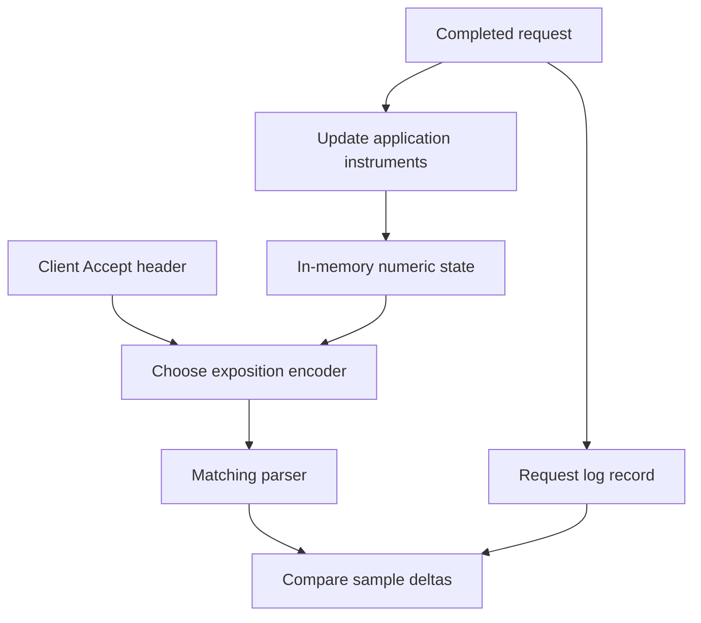

# Lab 07: Raw OpenMetrics Before Prometheus

## 1. Purpose and Learning Outcomes

You will inspect the numbers the app exposes before adding a metrics database. Learn to read names, labels, types, and histogram parts. Then make the endpoint return the format requested by the client. By comparing snapshots around controlled requests, you will see what a counter total tells you and which individual details still require request logs.

> **Primary Objective:** Read and validate the metrics document, distinguish metric families from individual samples, add OpenMetrics format selection, and show how request events change the app's numeric metric state.

Lab 6 saved individual records with event and request IDs. Metrics provide another view: the current numeric state of counters, gauges, and histograms. They group observations rather than keeping every request's details.

Keep Prometheus stopped. First inspect the actual response, then use the installed client library to support OpenMetrics negotiation. A route named `/metrics` does not, by itself, tell you which text format its body uses.

## 2. Starting Point and Lab Map

Open the complete application repository before using this guide. Unless a step says otherwise, run commands in Bash from the repository's top-level folder. Follow the starting checks in order because later commands depend on the helper functions and running services they prepare.

Read each explanation before running its commands. Run one complete code block, check the result, and then continue. In your notebook, save the commands, what happened, why you think it happened, and anything that differed from the expected result.

### Key Terms

| **Term**        | **Explanation**                                                                      |
| --------------- | ------------------------------------------------------------------------------------ |
| Exposition      | The formatted metrics document an endpoint sends to a client or scraper.             |
| Series identity | A sample's name and its full set of label values, together identifying one series.   |
| Counter delta   | The second counter value minus the first, measured within the same process lifetime. |

### Lab Map

The arrows show how the parts connect and where a request can take different paths. Use this map to understand the design. It is not a recording of a request that actually ran.



## 3. Guided Walkthrough

### Step 01. Inherited State and Scope

**What You Are Doing:** Reuse structured logs and evidence capture with monitoring backends still stopped. Check the app's direct output before another service collects or stores it.

**Practical Walkthrough:** Use the previous lab's helpers to read metrics straight from the app. Keeping Prometheus stopped separates the producer's output from later scrape timing, storage, query, and backend problems.

Read the endpoint through `APP_URL` and verify Prometheus is not running. Your saved document is the app's current output. Understand any problem here before adding another system that introduces its own timing and storage behavior.

Continue from Lab 6 with the structured logging envelope, its tests and evidence helper. Keep the original baseline overlay and the Lab 2 connection-error correction.

This lab covers metrics text, metadata, types, labels, parsing, and raw before-and-after differences. PromQL, stored time series, alerts, and dashboards come later. The existing metrics are already implemented; learn their rules before adding more instruments.

**Understanding the Result:** A direct response tests what the app exposes. It does not yet prove that a scraper can reach, collect, or retain that output.

### Step 02. Start from a Known State

**What You Are Doing:** Save the current metrics headers and body before editing. You need this starting response to show what format handling actually changes.

**Practical Walkthrough:** Check the baseline and save one matching pair of response headers and body. The headers advertise the format; the body holds the metric families and samples. Retain this capture for comparison after the change.

Keep each header file paired with its own body. Read Content-Type before selecting a parser. Preserve the original response rather than relying on a filename, terminal appearance, or memory of the old endpoint.

```bash
source lab-notes/session.sh
source lab-notes/evidence.sh
baseline_check
start_lab 07
api -fsS -D "$LAB_DIR/original-headers.txt" "$APP_URL/metrics" \
  -o "$LAB_DIR/original.prom"
rg -i '^content-type:' "$LAB_DIR/original-headers.txt"
sed -n '1,24p' "$LAB_DIR/original.prom"
```

Initially, expect a successful response with a `text/plain` Prometheus content type. The original route calls `prometheus_client.generate_latest` and always uses that representation, even if a client requests OpenMetrics.

Only app, PostgreSQL, and Redis should run. The application produces the metrics; curl reads the document without storing a metric history.

**Understanding the Result:** An endpoint can be available while ignoring a format preference. Use both Content-Type and the returned body to determine what it sent.

### Step 03. Measurable Learning Objectives

**What You Are Doing:** Learn to explain a sample's meaning and check its format. A familiar-looking metric name alone does not prove either one.

**Practical Walkthrough:** Match each objective with evidence: a raw line, parsed sample, counter difference, or empty selection. Before using dashboards, understand exactly which value the app exposes and how its labels divide observations into groups.

Choose a family and record its type, unit, labels, and sample value. Predict an action that changes it. Repeating that pattern helps distinguish a real zero from a selection that did not find any matching sample.

By the end, you should be able to:

- identify a metric family, sample name, label set and value;
- distinguish exposition metadata from numeric samples;
- explain counters, gauges and classic histogram components;
- verify actual Content-Type and the OpenMetrics EOF marker;
- use the matching parser for each representation;
- demonstrate that individual requests modify aggregate state;
- prove metrics scrapes do not add business request counts here;
- distinguish an absent series from an observed zero; and
- preserve individual event evidence without putting its IDs into labels.

**Understanding the Result:** You should be able to read and explain the raw document without needing a monitoring interface to interpret it for you.

### Step 04. Occurrence, Observation and Sample

**What You Are Doing:** Follow one request from completion to an instrument update and a later numeric sample. The total keeps the count but does not retain the individual request IDs behind it.

**Practical Walkthrough:** A completed request updates in-memory metrics. A later endpoint read shows their current accumulated values. Labels group similar requests; they do not list each original event. Use logs when you need individual identities or details that the numeric total leaves out.

The request and metrics fetch happen at different times. Several requests may complete between two fetches and contribute to one cumulative value. Keep the process lifetime in mind, and use request records for identities and ordering that the aggregate does not store.

| **Layer**                | **Example**                                                     | **What Is Retained**                                |
| ------------------------ | --------------------------------------------------------------- | --------------------------------------------------- |
| Event                    | A GET completes                                                 | The actual occurrence                               |
| Instrument observation   | The counter increments and the histogram records a duration     | An update to numeric state held by this app process |
| Exposed sample           | A line currently reports counter value 12                       | The present value and its labels                    |
| Log record               | `request_completed` with a request ID                           | Selected details of one occurrence                  |
| Future Prometheus sample | The scraper stores that value when it reads the endpoint        | A numeric value with time and target labels         |

If five requests occur between scrapes, a counter may rise from 12 to 17. Prometheus does not receive five detailed request records from that number. Keep request IDs in event evidence instead of turning each one into a counter label.

No Prometheus history exists in this stage. Repeating curl fetches the app's current state again; it does not retrieve past values from a database.

**Understanding the Result:** An increase of five shows five recorded increments. The number alone cannot tell you the five request IDs; you need separate event evidence for that.

### Step 05. Read the Exposition Grammar

**What You Are Doing:** Read metadata, sample names, labels, and numbers as separate parts of metrics syntax. The response is not JSON, so choose a parser that understands its format.

**Practical Walkthrough:** Start with metadata describing the family and type. Then read the sample name, labels, and value. Different complete label sets identify different series even when names match. Use the parser for comparisons because quoting, escaping, and histogram suffixes make simple text splitting unreliable.

`HELP` describes meaning and `TYPE` declares the metric type. Named numeric lines are samples. Match all labels when selecting a series. `rg` helps inspect text, but parse metrics into structured data before applying JSON tools; raw exposition cannot be read directly by `jq`.

```bash
rg '^# (HELP|TYPE) application_' "$LAB_DIR/original.prom"
rg '^application_dependency_up' "$LAB_DIR/original.prom"
rg '^application_cache_hits_total' "$LAB_DIR/original.prom"
```

A representative sample is:

```text
application_dependency_up{dependency="postgres"} 1.0
```

The name plus complete label set identifies this series, and `1.0` is its current value. `HELP` and `TYPE` describe the metric. Neither line records an individual request.

This endpoint normally leaves out an explicit timestamp at the end of each sample line. A `_created` value is different: its numeric value is a Unix timestamp for instrument creation. Later, Prometheus ordinarily assigns scrape timestamps when storing samples.

The format allows escaped labels and floating-point values. Use its official parser instead of splitting blindly at braces or assuming integers. See the [Prometheus exposition specification](https://prometheus.io/docs/instrumenting/exposition_formats/).

**Understanding the Result:** A parsing failure means the document was not read successfully. A valid document with no matching sample is a separate result and needs a different investigation.

### Step 06. Inventory the Existing Families

**What You Are Doing:** List the metric families this app actually exposes. Use their real names so a typo or invented metric is not mistaken for an observed zero.

**Practical Walkthrough:** Inspect this app version's names and labels. Connect each counter, gauge, and histogram with its purpose before selecting it. Keep the inventory for later scripts rather than assuming another library or tutorial uses identical naming.

Record full exposed names, including `_total`, `_bucket`, `_sum`, and `_count` suffixes where present. Note units and labels too. If a later selection is empty, check these details before treating the result as zero activity.

| **Family or Sample Prefix**                       | **Type**         | **Meaning and Boundary**                                                                    |
| ------------------------------------------------- | ---------------- | ------------------------------------------------------------------------------------------- |
| `application_http_requests_total`                 | Counter          | Request paths completed as observed by the server; health and metrics requests are excluded |
| `application_http_request_duration_seconds`       | Histogram        | Server-observed request duration, grouped by method and route template                      |
| `application_http_requests_in_progress`           | Gauge            | Tracked requests currently active in this worker                                            |
| `application_exceptions_total`                    | Counter          | Handled failures in the defined categories; it does not count every HTTP 4xx                |
| `application_postgres_operation_duration_seconds` | Histogram        | Database-operation time observed by the app, including waits and the transaction block      |
| `application_cache_hits_total` / `_misses_total`  | Counters         | Usable cache hits versus misses, errors, or intentional bypass                              |
| `application_redis_errors_total`                  | Counter          | Failed cache actions grouped by a limited set of operation names                            |
| `application_dependency_up`                       | Gauge            | The dependency state seen by an application probe                                           |
| `process_*`, `python_*`                           | Runtime families | Process and Python measurements exposed by the same registry                                |

A labelled instrument may not have a child sample until that exact label combination is initialized or observed. HELP/TYPE metadata does not prove a numeric sample exists. An unlabelled counter can be present with zero before its first event.

`application_dependency_up` reports an application probe result. It is not a PostgreSQL exporter and cannot guarantee that every later transaction will succeed.

**Understanding the Result:** Select the names and labels actually exposed. Some labelled children appear only after the matching activity or explicit initialization.

### Step 07. Predict the Two Wire Representations

**What You Are Doing:** Request OpenMetrics from the unchanged route and inspect its actual response. Accept expresses a client preference; Content-Type and the body show what the server chose.

**Practical Walkthrough:** Send the shown Accept values and compare the returned headers and body ending. This records behavior before implementation. The header cannot make the route use an encoder it has never been programmed to select.

Check the requested Accept value, returned type, and body marker together. Keep the before-change evidence even if the server ignores the preference. That is the behavior the next edit will change.

Before editing, request OpenMetrics explicitly and inspect the response:

```bash
api -fsS -H 'Accept: application/openmetrics-text; version=1.0.0' \
  -D "$LAB_DIR/before-openmetrics-headers.txt" "$APP_URL/metrics" \
  -o "$LAB_DIR/before-openmetrics.txt"
rg -i '^content-type:' "$LAB_DIR/before-openmetrics-headers.txt"
tail -n 2 "$LAB_DIR/before-openmetrics.txt"
```

The unchanged route still returns fixed Prometheus text. Renaming the saved file would not convert those bytes to OpenMetrics.

Predict which headers and syntax will change after negotiation and which measurements will stay the same. Asking for another representation must not add business requests to the counter.

**Understanding the Result:** Record what was returned, including differences from your prediction. The response establishes the format, not the client's requested preference.

### Step 08. Implement Real Format Negotiation

**What You Are Doing:** Use the installed client library to choose both encoder and matching Content-Type from Accept. The guarded edit keeps the current registry as the measurement source.

**Practical Walkthrough:** Review and apply the small route patch. Both formats read the same registry; only their encoding differs. If the expected source fragment is absent, inspect the implementation before trying another edit.

Keep the library's encoder and content type paired. The guard confirms where the patch belongs. If it fails, check whether the route already changed instead of disabling the guard and risking a duplicate or misplaced edit.

Use `prometheus_client.exposition.choose_encoder` from the installed library. No new dependency or OpenTelemetry metrics pipeline is needed. The source guard stops on an unfamiliar route.

```bash
python3 - <<'PYTHON'
from pathlib import Path
path = Path("app/app/main.py")
source = path.read_text()
changes = [
    ("from prometheus_client import CONTENT_TYPE_LATEST, generate_latest",
     "from prometheus_client.exposition import choose_encoder"),
    ("async def prometheus_metrics() -> Response:",
     "async def prometheus_metrics(request: Request) -> Response:"),
    ('        return Response(generate_latest(metrics.registry), headers={"Content-Type": CONTENT_TYPE_LATEST})',
     '        encoder, content_type = choose_encoder(request.headers.get("accept", ""))\n'
     '        return Response(encoder(metrics.registry), headers={"Content-Type": content_type, "Vary": "Accept"})'),
]
for old, new in changes:
    if new in source:
        continue
    if source.count(old) != 1:
        raise SystemExit("Expected metrics route not found; review existing edits")
    source = source.replace(old, new, 1)
path.write_text(source)
print("Metrics endpoint supports client-library format negotiation")
PYTHON
```

The route supplies Accept to the client library and uses its returned encoder and Content-Type together. It also emits `Vary: Accept`. Do not fake OpenMetrics by appending `# EOF` to legacy text or changing only the response header.

**Understanding the Result:** Negotiation changes how the measurements are written as text. It should not add another registry or count a business event twice.

### Step 09. Test Both Formats and Scrape Exclusion

**What You Are Doing:** Test both output formats and the exclusion of scrape traffic. After rebuilding, begin fresh counter comparisons because the new process has new in-memory state.

**Practical Walkthrough:** Run the format and scrape-exclusion tests, then rebuild and recreate. Treat the new process as a new counter lifetime. Take both snapshots for each later experiment after this deployment, so a reset is not mixed with the request delta.

Review format validity and business-count exclusion as separate tests. The rebuilt app begins a fresh metric process epoch, meaning a new lifetime for its in-memory registry. Do not subtract a pre-rebuild value from a post-rebuild one as if no reset occurred.

Create the focused exposition tests:

```bash
cat > app/tests/test_exposition.py <<'PYTHON'
from prometheus_client.openmetrics.parser import text_string_to_metric_families as openmetrics_families
from prometheus_client.parser import text_string_to_metric_families as prometheus_families


async def test_both_exposition_formats(client):
    await client.get("/api/v1/items?limit=1")
    plain = await client.get("/metrics", headers={"Accept": "text/plain; version=0.0.4"})
    modern = await client.get("/metrics", headers={"Accept": "application/openmetrics-text; version=1.0.0"})
    assert plain.status_code == modern.status_code == 200
    assert "text/plain" in plain.headers["content-type"]
    assert "application/openmetrics-text" in modern.headers["content-type"]
    assert plain.headers["vary"] == modern.headers["vary"] == "Accept"
    assert not plain.text.endswith("# EOF\n")
    assert modern.text.endswith("# EOF\n")
    filters = {"method": "GET", "route": "/api/v1/items", "status_code": "200"}
    values = []
    for response, parser in ((plain, prometheus_families), (modern, openmetrics_families)):
        values.append(
            next(
                sample.value
                for family in parser(response.text)
                for sample in family.samples
                if sample.name == "application_http_requests_total" and sample.labels == filters
            )
        )
    assert values == [1.0, 1.0]


async def test_metrics_scrapes_do_not_create_request_events(client, app):
    for _ in range(3):
        assert (await client.get("/metrics")).status_code == 200
    assert not any(
        sample.name == "application_http_requests_total"
        for family in app.state.metrics.registry.collect()
        for sample in family.samples
    )
PYTHON
```

**Command Note:** `<<'PYTHON'` writes the block literally until the closing `PYTHON` marker. Quotes prevent expansion of `$variables` by Bash; the file will be executed later, not during creation.

```bash
make test
make lint
git diff --check
record_change "enable_metrics_format_negotiation" planned
dc up -d --build --no-deps app
baseline_check
record_change "enable_metrics_format_negotiation" completed
```

The restarted app has a fresh registry. Earlier counter readings are therefore not the baseline for the next experiment. Take a new snapshot after the rebuild.

**Understanding the Result:** The format tests check valid encoding. The exclusion tests check that reading metrics does not create business-count observations. Both contracts matter.

### Step 10. Capture and Verify Both Negotiated Results

**What You Are Doing:** Capture and parse both formats, including their headers and ending rules. A filename extension alone cannot prove the format is correct.

**Practical Walkthrough:** Use the rebuilt app to save a header/body pair for each requested format. Parse each with its matching parser and inspect the required markers. Saved pairs make the checks repeatable and prevent mixing responses from different requests.

Check that advertised Content-Type matches the actual body. A correct header with malformed text is still wrong. A parsable body in the wrong requested representation would also leave negotiation unproven.

```bash
api -fsS -H 'Accept: text/plain; version=0.0.4' \
  -D "$LAB_DIR/plain-headers.txt" "$APP_URL/metrics" -o "$LAB_DIR/plain.prom"
api -fsS -H 'Accept: application/openmetrics-text; version=1.0.0' \
  -D "$LAB_DIR/openmetrics-headers.txt" "$APP_URL/metrics" -o "$LAB_DIR/metrics.om"
rg -i '^content-type:|^vary:' "$LAB_DIR/plain-headers.txt" "$LAB_DIR/openmetrics-headers.txt"
tail -n 1 "$LAB_DIR/metrics.om"
dc exec -T app python -c 'import sys; from prometheus_client.openmetrics.parser import text_string_to_metric_families as parse; print("families=", len(list(parse(sys.stdin.read()))))' \
  < "$LAB_DIR/metrics.om"
```

**Expected Result:** the first response is legacy text, and the second uses `application/openmetrics-text`. Check `Vary: Accept` and the final OpenMetrics line `# EOF`. Successful parsing is stronger evidence than spotting one familiar sample.

Changing format does not change who produces or stores the metrics. FastAPI still exposes both directly for a future Prometheus scrape.

**Understanding the Result:** Both responses represent the same instruments. Different syntax does not mean different business measurements are being collected.

### Step 11. Add a Reusable Raw-Snapshot Parser

**What You Are Doing:** Add a helper that parses raw samples into structured data. Keep names, labels, and values available so comparisons select exactly the intended measurements.

**Practical Walkthrough:** Run the parser using the dependencies already in the app image. It turns each sample into a record with a name, labels, and value. Read the selection carefully: adding unrelated routes or statuses changes the question even if the result looks plausible.

Write both helper files before loading the shell functions. First parse exposition into sample records; then use `jq` on the resulting JSON. Check labels before summing so methods, routes, or outcomes are not accidentally combined.

Create the local diagnostic script below. It runs inside the app image, so you do not need to install another Python package on the host:

```bash
cat > lab-notes/metric_snapshot.py <<'PYTHON'
"""Parse exposition received on stdin; run inside the app image."""
import json
import sys
from prometheus_client.parser import text_string_to_metric_families

families = list(text_string_to_metric_families(sys.stdin.read()))
print(json.dumps([
    {"name": sample.name, "labels": sample.labels, "value": sample.value}
    for family in families for sample in family.samples
]))
PYTHON
```

```bash
cat > lab-notes/raw-metrics.sh <<'BASH'
# Requires the Lab 1 session and Lab 6 evidence helpers.
snapshot() {
  local destination="$1"
  api -fsS -H 'Accept: text/plain; version=0.0.4' "$APP_URL/metrics" \
    | dc exec -T app python -c "$(cat "$LAB_ROOT/lab-notes/metric_snapshot.py")" \
    > "$destination"
}

metric_sum() {
  local filters="${3:-}"
  [[ -n "$filters" ]] || filters='{}'
  python3 - "$1" "$2" "$filters" <<'PYTHON'
import json, sys
path, name, raw_filter = sys.argv[1:]
wanted = json.loads(raw_filter)
with open(path, encoding="utf-8") as stream:
    samples = json.load(stream)
selected = [sample for sample in samples if sample["name"] == name
            and all(sample["labels"].get(key) == value for key, value in wanted.items())]
print(sum(sample["value"] for sample in selected))
PYTHON
}
BASH
```

**Command Note:** `exec -T` runs the parser inside the existing container without an interactive terminal. The heredoc feeds its program through standard input using the image's installed dependencies.

```bash
source lab-notes/raw-metrics.sh
snapshot "$LAB_DIR/first-snapshot.json"
jq '.[0:8]' "$LAB_DIR/first-snapshot.json"
```

`snapshot` requests legacy text explicitly and uses that format's parser. Its JSON stores sample names, label maps, and values, including both app and runtime samples. It does not contain only family names.

`metric_sum` totals the selected samples and returns zero when none match. That is useful in these controlled tests before a counter child first appears. It is **not** a general rule that missing telemetry means zero or healthy. During outage diagnosis, check sample presence separately.

**Understanding the Result:** The helper gives a structured view of current samples. It is not a time-series database and does not automatically turn totals into requests per second.

### Step 12. Measure Five Request Events without Prometheus

**What You Are Doing:** Place exactly five measured requests between two snapshots. Compare the numeric increase with the matching log records and identify the different details each preserves.

**Practical Walkthrough:** Take the first snapshot, send exactly the five requests, and take the second without restarting. Compare the same labels on both sides. Keep other traffic away from that population so additional requests do not change the expected delta.

Keep the warm-up outside the interval. It creates the label child before you measure. If the five-request delta differs, check extra traffic, statuses, and process identity before changing your expectation to match the number.

Warm the list route once so its label child exists, then isolate five further requests:

```bash
api -fsS "$APP_URL/api/v1/items?limit=1" >/dev/null
snapshot "$LAB_DIR/before.json"
for n in 1 2 3 4 5; do
  api -fsS -H "X-Request-ID: lab07-$n-$(new_uuid)" \
    "$APP_URL/api/v1/items?limit=1" >/dev/null
done
snapshot "$LAB_DIR/after.json"
FILTER='{"method":"GET","route":"/api/v1/items","status_code":"200"}'
BEFORE=$(metric_sum "$LAB_DIR/before.json" application_http_requests_total "$FILTER")
AFTER=$(metric_sum "$LAB_DIR/after.json" application_http_requests_total "$FILTER")
python3 - "$BEFORE" "$AFTER" <<'PYTHON'
import sys
before, after = map(float, sys.argv[1:])
print("request_counter_delta=", after-before)
assert after-before == 5
PYTHON
capture_app_logs
jq -s '[.[] | select(.event_name == "request_completed" and ((.request_id // "") | startswith("lab07-")))] | length' \
  "$LAB_DIR/app.jsonl"
```

With isolated traffic, expect both a counter increase of five and five matching completion records. The metric value cannot list the request IDs; retained logs can provide those details, subject to logging and retention limits.

For more than five increments, first check concurrent traffic. For fewer log records, check capture time, log level, and rotation. Missing log lines do not subtract events from the metric counter.

**Understanding the Result:** The delta should describe the intended five requests. Logs keep individual details that the aggregate total does not.

### Step 13. Prove Scraping Does Not Count as Business Traffic

**What You Are Doing:** Fetch metrics repeatedly without sending business requests. Check that collecting the metric does not increase the business count it is supposed to measure.

**Practical Walkthrough:** Save a baseline, call the metrics endpoint several times, and compare the specified business instruments. This is a control test. Other process values can legitimately change as time passes and the server does work, so do not expect every exposed byte to stay identical.

Only call `/metrics` during this interval and avoid competing business traffic. Compare the chosen business counters, not every runtime measurement. The test asks whether scraping creates false business observations, not whether serving metrics is free of CPU work.

```bash
snapshot "$LAB_DIR/before-scrapes.json"
for n in 1 2 3; do api -fsS "$APP_URL/metrics" >/dev/null; done
snapshot "$LAB_DIR/after-scrapes.json"
python3 - "$LAB_DIR/before-scrapes.json" "$LAB_DIR/after-scrapes.json" <<'PYTHON'
import json, sys
def counters(path):
    return sorted((json.dumps(s["labels"], sort_keys=True), s["value"])
                  for s in json.load(open(path)) if s["name"] == "application_http_requests_total")
assert counters(sys.argv[1]) == counters(sys.argv[2])
print("Scrape requests did not change application request counts")
PYTHON
```

Some runtime metrics can change because formatting and serving output consumes CPU and time. The intended check is narrower: `/metrics`, `/health/live`, and `/health/ready` are excluded from this app's business HTTP instrumentation.

**Understanding the Result:** Stable business counts support scrape exclusion. Changing runtime values do not automatically violate it.

### Step 14. Read a Classic Histogram without Calculating a Percentile Yet

**What You Are Doing:** Read histogram bucket counts, total count, and duration sum before calculating percentiles. Each bucket includes every observation at or below its boundary, so the buckets overlap.

**Practical Walkthrough:** Choose one complete histogram label set and read boundaries in order. A fast request belongs to several larger buckets, so adding all buckets counts it repeatedly. Subtract neighboring buckets for a single interval and compare the final bucket with total count.

`le` means the bucket's inclusive upper limit. The `+Inf` bucket should match `_count`. `_sum` adds durations in seconds, while `_count` counts observations. Neither value alone is a percentile.

```bash
api -fsS "$APP_URL/metrics" > "$LAB_DIR/histograms.prom"
rg '^application_http_request_duration_seconds_(bucket|sum|count)' "$LAB_DIR/histograms.prom"
```

| **Component**            | **Meaning**                                                                       |
| ------------------------ | --------------------------------------------------------------------------------- |
| `_bucket{le="0.1"}`      | Count of observations at or below 0.1 seconds                                     |
| `_bucket{le="+Inf"}`     | Count of all observations                                                         |
| `_count`                 | Total observation count for the method/route                                      |
| `_sum`                   | Sum of observed seconds                                                           |
| `_created`, when exposed | Time when that labelled instrument child was created, not how long a request took |

Buckets accumulate across boundaries. A single fast request increases several bucket counters but remains one request. Use the observation count rather than summing all buckets as traffic volume.

This is a **classic** histogram with explicit `_bucket` series. Selecting OpenMetrics does not convert it to a native histogram. Lab 13 covers quantiles and estimates between bucket boundaries.

**Understanding the Result:** Sum divided by count can describe an average for the selected observations. Buckets support later estimates, but they do not preserve each request's individual duration.

### Step 15. Bounded Interpretation Exercise: Zero versus Missing

**What You Are Doing:** Compare a sample that exists with value zero against a query that finds nothing. Observed zero and missing evidence are different results.

**Practical Walkthrough:** Keep the empty selection visible instead of automatically replacing it with zero. It may mean a label child has not appeared, the selector is wrong, or the app's metric contract changed. An actual zero sample proves the instrument exists with that value.

Check presence first, then value. An empty array and a sample record containing zero are not equivalent. Save both shapes so later scripts do not hide a missing family or bad selector as apparently healthy inactivity.

```bash
snapshot "$LAB_DIR/presence.json"
jq '[.[] | select(.name == "application_dependency_up")]' "$LAB_DIR/presence.json"
jq '[.[] | select(.name == "metric_that_is_not_implemented")]' "$LAB_DIR/presence.json"
```

**Expected Result:** dependency samples exist, while the deliberately invented name returns an empty array. Querying a nonexistent name has not discovered another failure metric or proved that errors are zero.

Find a labelled route child that has not appeared since rebuild. Its family metadata may exist even though the child does not. Send one matching request to a known bounded route and compare again. Do not add request IDs as labels just to create unique series.

**Understanding the Result:** Zero is a value you observed. Missing means no sample matched. Check the selector and instrument before concluding that no events happened.

### Step 16. Recovery and Final Verification

**What You Are Doing:** Recheck the approved formats and retain the snapshot helpers. Later, these direct app observations will help distinguish producer problems from collection problems.

**Practical Walkthrough:** Repeat the endpoint checks, confirm readiness and the service list, and keep the parser and tests. Record which process lifetime produced each delta. This gives later Prometheus results a source-level reference for comparison.

Check the checkpoint and final exposition through the recovered app. Keep the parser, format tests, and lifecycle notes. They establish what the source returns before Prometheus adds collection and storage.

```bash
baseline_check
CHECKPOINT_ID=$(cat lab-notes/checkpoint-item-id.txt)
api -fsS "$APP_URL/api/v1/items/$CHECKPOINT_ID" | jq '{id,name,price}'
snapshot "$LAB_DIR/final.json"
make test
```

This lab created no new business rows. Its lasting change is real content negotiation with tests. Keep the helpers; Prometheus and any duplicate metrics exporter remain absent.

**Understanding the Result:** Finish with valid negotiated output and the working baseline. Prometheus will add another observation layer, so direct source checks remain useful.

## 4. Troubleshooting and Diagnosis

Begin with the first result that differed from your prediction. Save the exact error or symptom and identify which service or command produced it. Use the checks below, make the needed fix, and repeat the original check to confirm the problem is resolved.

### Troubleshooting Runbook

| **Symptom**                                   | **Check and Correction**                                                                                               |
| --------------------------------------------- | ---------------------------------------------------------------------------------------------------------------------- |
| OpenMetrics request still returns legacy text | Check the patch, rebuilt image, and running route; use Content-Type, not the filename, to identify the format          |
| Parser reports malformed exposition           | Match the parser to Content-Type and check whether you saved an HTTP error body instead of metrics                     |
| Counter child is absent                       | Send the relevant route/method/status request and inspect again; family metadata alone is not a sample                 |
| Counter delta exceeds your request count      | Check other clients and selected labels; do not accidentally sum unrelated routes                                      |
| Counter delta becomes negative                | Check for a process restart; discard a cross-restart raw subtraction and record the reset                              |
| Samples have no timestamps at line end        | Expected here; the future scraper assigns the stored sample time                                                       |
| Histogram bucket counts appear too large      | Buckets overlap; use `_count` for the total number of observations                                                     |
| Host import of prometheus_client fails        | Use the parser inside the app image as instructed                                                                      |
| Missing series was displayed as zero          | Check presence separately; this diagnostic helper's empty-sum rule is not a general missing-data policy                |

Check the HTTP response, chosen format, parser, and metric meaning separately. HTTP 200 is necessary for a successful fetch but does not prove all instrumentation is correct.

## 5. Review and Practice

Answer the questions in your own words before reading the answers. For the scenario, say what you would inspect and exactly what each result would tell you.

### Knowledge Check

1. What identifies one time series?
2. Does HELP count an event?
3. How do instrument observation and stored metric sample differ?
4. Can five requests produce only one later scraped sample?
5. Why is changing a Content-Type header alone insufficient?
6. Does OpenMetrics imply native histograms?
7. Why must cumulative buckets not be summed as traffic?
8. Does a missing child necessarily mean instrumentation is disabled?
9. Can process CPU change during repeated metrics reads?
10. Why are counter differences unsafe across a restart?

#### Answer Guide

1. Metric name and complete label set.
2. No; it is descriptive metadata.
3. An observation changes the instrument's state. A stored sample records that numeric state at a particular time.
4. Yes. One later sample can contain the total after all five increments.
5. The body must actually be encoded in the format advertised by the header.
6. No. This implementation still exposes classic histogram series.
7. One duration can increase several cumulative buckets, so summing them counts it repeatedly.
8. No. The particular labelled child may not have been created yet.
9. Yes. Producing and serving the metrics document itself uses CPU.
10. Restart can reset the registry, and simple subtraction cannot recover observations across that reset.

### Professional Scenario Exercise

A colleague says a counter value of 500 contains every request event. Explain that it supplies a total but cannot reconstruct individual IDs, timing, or other details. Before comparing it with 500 log lines, state the process-reset, sampling, and retention assumptions that must hold.

## 6. Completion Checklist

Tick an item only when you can show its result or saved evidence. Finish the cleanup instructions before starting the next lab.

### Observable Completion Criteria

- [ ] The original wire format was observed before editing.
- [ ] Both legacy text and OpenMetrics now parse with their matching parsers.
- [ ] Content-Type, Vary and EOF behavior are verified.
- [ ] Tests prove scrapes do not create request events.
- [ ] Five isolated requests produce a delta of five.
- [ ] Logs preserve request identities absent from the metric samples.
- [ ] Histogram bucket/count/sum semantics are explained correctly.
- [ ] Missing samples are distinguished from observed zero.
- [ ] Only the baseline services are running and the checkpoint survives.

## 7. Production Context and Next Lab

### Production Implications

Scrapers depend on the metrics endpoint's contract. Test its formats, limit label values, and interpret in-memory metrics with the process lifetime in mind. Raw snapshots are useful for controlled comparisons but do not replace stored history. A cumulative counter is not a permanent event ledger.

### End State and Transition

Keep `lab-notes/metric_snapshot.py` and `lab-notes/raw-metrics.sh`. Leave negotiation enabled and all telemetry backends stopped.

Next: [Lab 08 — Instrument RED Metrics](Lab-08.md). You will define who records request totals, errors, and durations, then test success, failure, and requests still in progress.