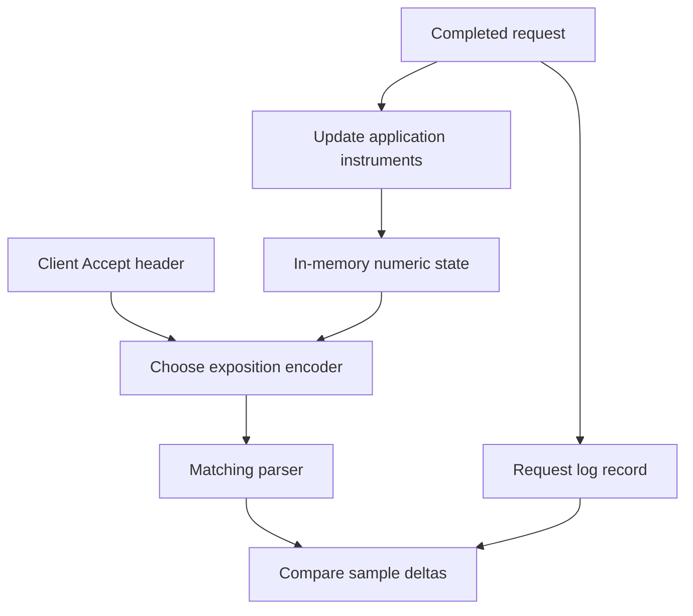

# Lab 07: Raw OpenMetrics Before Prometheus

## 1. Purpose and Learning Outcomes

**In Plain Language:** You will read the numeric state exposed by the app before adding a metrics database. Learn what metric names, labels, types, and histogram components mean, then make the endpoint return the format the client requests. Controlled before-and-after snapshots will show what an aggregate counter retains and what only individual request logs can tell you.

> **Primary Objective:** Read and validate real metric exposition, distinguish families and samples, implement OpenMetrics content negotiation, and prove how request events change aggregate numeric state.

Lab 6 preserved individual observations with record and request IDs. This lab examines a different representation: the current state of counters, gauges and histograms.

Prometheus remains stopped. You will first inspect what the application actually sends, then extend its metrics endpoint to negotiate OpenMetrics using the installed client library. Calling a route `/metrics` does not establish its wire format.

## 2. Starting Point and Lab Map

Use this guide inside the complete application repository. Run commands from the repository root in Bash unless a step says otherwise. Work through the starting checks in order; they load the helpers and state this lab needs.

Read the explanation before each step, run one complete code block at a time, and compare the actual result with the stated expectation. Save commands, observations, explanations, and unexpected results in your notebook.

### Key Terms

| **Term**        | **Plain-Language Meaning**                                                    |
| --------------- | ----------------------------------------------------------------------------- |
| Exposition      | The wire-format document returned by a metrics endpoint.                      |
| Series identity | A sample name together with its complete set of label values.                 |
| Counter delta   | The difference between two counter readings within the same process lifetime. |

### Lab Map

The arrows show the flow or dependency being studied. Branches identify paths to compare; this is a conceptual map, not a captured runtime trace.



## 3. Guided Walkthrough

### Step 01. Inherited State and Scope

**What You Are Doing:** Continue with structured logs and evidence capture while keeping monitoring backends stopped. The first question is what the application exposes, before any scraper stores it.

**Practical Walkthrough:** Reuse the structured logging and capture helpers from the previous lab. Keep the metrics backend stopped so every metrics observation in this lab comes directly from the application endpoint. This isolates the instrument's output from future concerns such as scrape scheduling, storage delay, query selection, and backend availability.

Confirm that the endpoint is being read directly from `APP_URL` and that Prometheus remains outside the running stage. The saved exposition is the application's current output. A discrepancy here must be understood before adding a collector that could introduce its own timing, storage, or query behavior.

Continue from Lab 6 with the structured logging envelope, its tests and evidence helper. Keep the original baseline overlay and the Lab 2 connection-error correction.

This lab covers exposition, metadata, types, labels, parsing and raw deltas. PromQL, a time-series database, alert evaluation and dashboards come later. Existing application metrics are already implemented; you will understand their contract before adding instrumentation.

**Understanding the Result:** You are proving an exposition contract at its source. A direct response says nothing yet about whether another service can collect or retain it.

### Step 02. Start from a Known State

**What You Are Doing:** Capture the current response headers and body before changing format handling. That baseline lets you demonstrate a real behavior change after the edit.

**Practical Walkthrough:** Run the baseline checks and save both headers and body from the existing metrics endpoint. Headers describe the response format; the body contains the exposed families and samples. Keep this before-change capture because the format-negotiation edit needs a concrete comparison, not a recollection of how the endpoint used to behave.

Keep the response headers paired with the body from the same request. Inspect the content type before choosing a parser, and preserve the original files before editing negotiation. This provides a reproducible before-state rather than relying on terminal formatting or an assumption about which encoder the route uses.

```bash
source lab-notes/session.sh
source lab-notes/evidence.sh
baseline_check
start_lab 07
api -fsS -D "$LAB_DIR/original-headers.txt" "$APP_URL/metrics" \
  -o "$LAB_DIR/original.prom"
rg -i '^content-type:' "$LAB_DIR/original-headers.txt"
sed -n '1,24p' "$LAB_DIR/original.prom"
```

Expected initially: a successful response with a `text/plain` Prometheus exposition content type. The original implementation uses `prometheus_client.generate_latest`; it does not negotiate OpenMetrics simply because the caller requests it.

Keep exactly app, PostgreSQL and Redis running. The application is the metric producer; curl is only reading it.

**Understanding the Result:** A healthy endpoint can still return a different representation than requested. Inspect the actual Content-Type together with the body.

### Step 03. Measurable Learning Objectives

**What You Are Doing:** Aim to explain an exposed sample and validate its representation. Recognizing a familiar name alone is not enough to establish format or meaning.

**Practical Walkthrough:** For each objective, identify an observable artifact: an actual sample, a parsed representation, a counter delta, or a missing selection. These exercises build the vocabulary needed for Prometheus later. Do not skip directly to dashboard concepts; first learn exactly what numeric value the application can expose and what its labels mean.

Choose one family and identify its type, unit, label set, and example value. Then identify an operation expected to change it. Repeating this pattern through the lab connects metric vocabulary to actual measurements and prepares you to distinguish a zero observation from a selector that finds no sample.

By the end, you should be able to:

- identify a metric family, sample name, label set and value;
- distinguish exposition metadata from numeric samples;
- explain counters, gauges and classic histogram components;
- verify actual Content-Type and the OpenMetrics EOF marker;
- use the matching parser for each representation;
- demonstrate that individual requests modify aggregate state;
- prove metrics scrapes do not add business request counts here;
- distinguish an absent series from an observed zero; and
- preserve individual event evidence without putting its IDs into labels.

**Understanding the Result:** You should be able to explain the raw document without relying on a monitoring UI to interpret it for you.

### Step 04. Occurrence, Observation and Sample

**What You Are Doing:** Follow a request from occurrence to an instrument update and then to a numeric sample. Aggregation retains a total while discarding the identities of the individual requests behind it.

**Practical Walkthrough:** Follow one request through completion, the in-memory instrument update, and a later metrics read. The exposed value summarizes observations accumulated in that process. It does not enumerate the original requests, and its labels intentionally group many events together. Logs can supply individual context that the aggregated number no longer contains.

Separate request completion from the later instant at which you fetch exposition. Several completions can contribute to one cumulative value between reads. The sample therefore summarizes a population in one process lifetime; use request records when you need identities or ordering that the aggregate intentionally does not retain.

| **Layer**                | **Example**                                                     | **What Is Retained**                            |
| ------------------------ | --------------------------------------------------------------- | ----------------------------------------------- |
| Event                    | A GET completes                                                 | The actual occurrence                           |
| Instrument observation   | Request counter increments; duration histogram observes seconds | Numeric state update in the application process |
| Exposed sample           | A counter line currently has value 12                           | Current value and labels                        |
| Log record               | `request_completed` with a request ID                           | Selected details of one occurrence              |
| Future Prometheus sample | The scraper stores counter value 12 at its scrape time          | Time-series value, target labels and timestamp  |

Five requests can occur between two scrapes. The counter may change from 12 to 17; that does not create five separately queryable request records in Prometheus. Request IDs belong in the event evidence, not the counter's labels.

There is no Prometheus retention yet. Refreshing curl reads current process state again; it does not give you a historical database.

**Understanding the Result:** A counter increasing by five describes five observed increments. It cannot identify the five requests unless you also kept appropriate event evidence.

### Step 05. Read the Exposition Grammar

**What You Are Doing:** Read metadata, sample names, labels, and values as different parts of the document. Use a parser for this grammar; a metrics response is not JSON just because other APIs return JSON.

**Practical Walkthrough:** Read the metadata lines first to establish a family's meaning and type, then inspect the sample lines and their label sets. Values with different labels belong to different series even when their sample name matches. Use the provided parser for actual comparisons because quoting, escaping, and histogram families make ad hoc text splitting unreliable.

Treat `HELP` and `TYPE` lines as metadata and the named numeric lines as samples. Compare complete label sets when identifying a series. `rg` is useful for inspection, but the parser handles the exposition grammar before any JSON-oriented filtering is applied; raw metrics text is not JSON.

```bash
rg '^# (HELP|TYPE) application_' "$LAB_DIR/original.prom"
rg '^application_dependency_up' "$LAB_DIR/original.prom"
rg '^application_cache_hits_total' "$LAB_DIR/original.prom"
```

A representative sample is:

```text
application_dependency_up{dependency="postgres"} 1.0
```

The metric name plus complete label set identifies the series. `1.0` is its current value. `HELP` documents meaning and `TYPE` declares an instrument type; neither is an observation of an individual request.

The endpoint normally omits explicit per-line timestamps. Do not confuse a `_created` sample's numeric Unix timestamp with a timestamp suffix on every exposition line. Prometheus will ordinarily assign a scrape timestamp when it stores samples.

Escaping and floating-point syntax are part of the format. Use the official parser instead of splitting every line on braces or assuming every value is an integer. See the [Prometheus exposition specification](https://prometheus.io/docs/instrumenting/exposition_formats/).

**Understanding the Result:** Metrics exposition has its own grammar. A parser error and a valid document containing no matching sample are different outcomes.

### Step 06. Inventory the Existing Families

**What You Are Doing:** Inventory the families that actually exist in this application. This gives later assertions real names and prevents an invented metric from being mistaken for a zero value.

**Practical Walkthrough:** Inventory the names and labels actually returned by this application version. Relate counter, gauge, and histogram samples to their documented purposes before selecting them. Keep the inventory for later scripts so a mistyped name or an assumed library convention is not interpreted as the application recording a zero.

Record the exact exposed sample names, including suffixes such as `_total`, `_bucket`, `_sum`, and `_count` where present. Match each with its unit and labels. Later selection code depends on these observed names, so a missing result should first trigger a name-and-label check rather than an assumed numeric zero.

| **Family or Sample Prefix**                       | **Type**         | **Meaning and Boundary**                                                  |
| ------------------------------------------------- | ---------------- | ------------------------------------------------------------------------- |
| `application_http_requests_total`                 | Counter          | Completed server-observed request paths; health/metrics excluded          |
| `application_http_request_duration_seconds`       | Histogram        | Server elapsed request time by method and normalized route                |
| `application_http_requests_in_progress`           | Gauge            | Tracked requests currently active in this worker                          |
| `application_exceptions_total`                    | Counter          | Classified handled failures; not every HTTP 4xx                           |
| `application_postgres_operation_duration_seconds` | Histogram        | Application-side operation time, including its waits/transaction boundary |
| `application_cache_hits_total` / `_misses_total`  | Counters         | Valid hits versus misses, errors or deliberate bypass                     |
| `application_redis_errors_total`                  | Counter          | Failed cache operations by bounded operation                              |
| `application_dependency_up`                       | Gauge            | Application-observed dependency state                                     |
| `process_*`, `python_*`                           | Runtime families | Process/Python observations exposed by this registry                      |

Some labelled instruments have no child series until that label combination is observed. A HELP/TYPE line alone does not prove a numeric sample exists. An unlabelled counter can legitimately be present at zero before its first event.

`application_dependency_up` is a probe observation, not a database exporter. Its value does not prove every future transaction will succeed.

**Understanding the Result:** Only query names that the observed endpoint exposes. Some labeled children appear only after initialization or relevant activity.

### Step 07. Predict the Two Wire Representations

**What You Are Doing:** Ask for OpenMetrics and inspect what the unchanged endpoint really sends. A request header expresses a preference; the returned Content-Type and body establish the actual representation.

**Practical Walkthrough:** Send the documented Accept preferences to the unchanged endpoint and compare the response headers and ending of each body. This checks negotiation behavior before you implement it. The request header asks the server for a representation; it cannot force the server to use an encoder that its current route never selects.

Read the requested Accept value, returned content type, and body marker together. The first expresses the client's preference; the latter two show the server's actual choice. Preserve this pre-change evidence even if the endpoint ignores the requested format, since that is the behavior the next edit is intended to change.

Before editing, request OpenMetrics explicitly and inspect the response:

```bash
api -fsS -H 'Accept: application/openmetrics-text; version=1.0.0' \
  -D "$LAB_DIR/before-openmetrics-headers.txt" "$APP_URL/metrics" \
  -o "$LAB_DIR/before-openmetrics.txt"
rg -i '^content-type:' "$LAB_DIR/before-openmetrics-headers.txt"
tail -n 2 "$LAB_DIR/before-openmetrics.txt"
```

On the unchanged baseline, the server still returns its fixed Prometheus text representation. This is an implementation observation, not a reason to rename the file and claim it is OpenMetrics.

Predict which fields will change after negotiation and which underlying values should remain the same. The representation should change; a negotiation request must not increment business counts.

**Understanding the Result:** Record what came back, including any mismatch with your prediction. The returned representation is the evidence, not the request preference.

### Step 08. Implement Real Format Negotiation

**What You Are Doing:** Let the installed client library choose a matching encoder and Content-Type from the Accept header. The guarded patch updates the known endpoint without introducing another metric registry.

**Practical Walkthrough:** Apply the guarded route change to the expected source shape. The installed metrics library supplies the appropriate encoder and matching content type, while the existing registry remains the source of measurements. If a guard fails, inspect the current code rather than forcing the replacement into a different implementation.

Review the source guard and replacement before applying the patch. Keep the encoder and its returned content type paired, using the existing registry for both representations. If the expected fragment is absent, inspect whether the implementation already changed instead of bypassing the guard and risking a duplicate or misplaced route edit.

Use the installed `prometheus_client.exposition.choose_encoder` function. This adds no OpenTelemetry metric pipeline or new dependency. The guard refuses to patch an unfamiliar route.

```bash
python3 - <<'PYTHON'
from pathlib import Path
path = Path("app/app/main.py")
source = path.read_text()
changes = [
    ("from prometheus_client import CONTENT_TYPE_LATEST, generate_latest",
     "from prometheus_client.exposition import choose_encoder"),
    ("async def prometheus_metrics() -> Response:",
     "async def prometheus_metrics(request: Request) -> Response:"),
    ('        return Response(generate_latest(metrics.registry), headers={"Content-Type": CONTENT_TYPE_LATEST})',
     '        encoder, content_type = choose_encoder(request.headers.get("accept", ""))\n'
     '        return Response(encoder(metrics.registry), headers={"Content-Type": content_type, "Vary": "Accept"})'),
]
for old, new in changes:
    if new in source:
        continue
    if source.count(old) != 1:
        raise SystemExit("Expected metrics route not found; review existing edits")
    source = source.replace(old, new, 1)
path.write_text(source)
print("Metrics endpoint supports client-library format negotiation")
PYTHON
```

The endpoint passes the Accept header to the client library, uses its encoder and Content-Type together, and emits `Vary: Accept`. Do not manually append `# EOF` to a legacy document or change the header while leaving the encoder unchanged.

**Understanding the Result:** Format negotiation changes serialization. It should not create a second instrument registry or count the same business event again.

### Step 09. Test Both Formats and Scrape Exclusion

**What You Are Doing:** Test both negotiated formats and the exclusion of scrape traffic from business counts. After rebuilding, take fresh snapshots because the new app process starts new in-memory counters.

**Practical Walkthrough:** Run the negotiation and scrape-exclusion tests, then rebuild and recreate the app. Treat this as a new process lifetime: its in-memory counters can restart from zero. Establish new before-and-after snapshots after deployment, because comparing across the restart would mix the instrumentation experiment with a reset.

Read the tests for both representation validity and business-scrape exclusion. After rebuilding, regard the new app as a fresh metric process epoch and discard cross-restart subtraction plans. Take both sides of every subsequent delta within this new lifetime so deployment reset is not confused with request activity.

Create the focused exposition tests:

```bash
cat > app/tests/test_exposition.py <<'PYTHON'
from prometheus_client.openmetrics.parser import text_string_to_metric_families as openmetrics_families
from prometheus_client.parser import text_string_to_metric_families as prometheus_families


async def test_both_exposition_formats(client):
    await client.get("/api/v1/items?limit=1")
    plain = await client.get("/metrics", headers={"Accept": "text/plain; version=0.0.4"})
    modern = await client.get("/metrics", headers={"Accept": "application/openmetrics-text; version=1.0.0"})
    assert plain.status_code == modern.status_code == 200
    assert "text/plain" in plain.headers["content-type"]
    assert "application/openmetrics-text" in modern.headers["content-type"]
    assert plain.headers["vary"] == modern.headers["vary"] == "Accept"
    assert not plain.text.endswith("# EOF\n")
    assert modern.text.endswith("# EOF\n")
    filters = {"method": "GET", "route": "/api/v1/items", "status_code": "200"}
    values = []
    for response, parser in ((plain, prometheus_families), (modern, openmetrics_families)):
        values.append(
            next(
                sample.value
                for family in parser(response.text)
                for sample in family.samples
                if sample.name == "application_http_requests_total" and sample.labels == filters
            )
        )
    assert values == [1.0, 1.0]


async def test_metrics_scrapes_do_not_create_request_events(client, app):
    for _ in range(3):
        assert (await client.get("/metrics")).status_code == 200
    assert not any(
        sample.name == "application_http_requests_total"
        for family in app.state.metrics.registry.collect()
        for sample in family.samples
    )
PYTHON
```

**Command Note:** `<<'PYTHON'` writes the following block literally until `PYTHON`. Quoting the delimiter prevents Bash from expanding `$variables` inside the generated file; creation and execution are separate steps.

```bash
make test
make lint
git diff --check
record_change "enable_metrics_format_negotiation" planned
dc up -d --build --no-deps app
baseline_check
record_change "enable_metrics_format_negotiation" completed
```

The application restarts with a fresh in-memory registry. Earlier raw counter values from this lab are therefore not the starting value for the next experiment. Capture a new baseline after the rebuild.

**Understanding the Result:** Passing both format tests and exclusion tests checks separate contracts: how metrics are encoded and whether reading them changes business counts.

### Step 10. Capture and Verify Both Negotiated Results

**What You Are Doing:** Save and parse both representations, checking their headers and termination rules. This verifies the complete response contract instead of relying on a filename extension.

**Practical Walkthrough:** Capture headers and bodies for both requested formats using the rebuilt app. Parse each saved body with the matching checks and inspect the required format markers. Working from saved responses makes the evidence repeatable and avoids accidentally comparing a header from one request with a body from another.

Inspect each saved header file alongside its matching body and parse the body using the appropriate format. Verify the advertised representation agrees with the actual encoding. A correct content-type header alone would not prove the body is valid, and a parsable body alone would not prove negotiation selected the requested representation.

```bash
api -fsS -H 'Accept: text/plain; version=0.0.4' \
  -D "$LAB_DIR/plain-headers.txt" "$APP_URL/metrics" -o "$LAB_DIR/plain.prom"
api -fsS -H 'Accept: application/openmetrics-text; version=1.0.0' \
  -D "$LAB_DIR/openmetrics-headers.txt" "$APP_URL/metrics" -o "$LAB_DIR/metrics.om"
rg -i '^content-type:|^vary:' "$LAB_DIR/plain-headers.txt" "$LAB_DIR/openmetrics-headers.txt"
tail -n 1 "$LAB_DIR/metrics.om"
dc exec -T app python -c 'import sys; from prometheus_client.openmetrics.parser import text_string_to_metric_families as parse; print("families=", len(list(parse(sys.stdin.read()))))' \
  < "$LAB_DIR/metrics.om"
```

**Expected Result:** legacy text for the first response, `application/openmetrics-text` for the second, `Vary: Accept`, and the final line `# EOF` in the OpenMetrics document. A successful matching parser is stronger evidence than visually spotting one familiar line.

The format is not storage ownership. Either negotiated representation is still exposed directly by FastAPI for Prometheus to scrape.

**Understanding the Result:** Both representations should describe the same underlying instruments. Differences in wire syntax do not imply different business measurements.

### Step 11. Add a Reusable Raw-Snapshot Parser

**What You Are Doing:** Install a helper that converts raw samples into structured diagnostic data. It runs with the app's parser dependency and keeps sample labels available for precise comparisons.

**Practical Walkthrough:** Save the parser helper and run it with the application's available parser dependency. It turns each sample into a record whose name, labels, and value can be selected precisely. Keep label matching explicit: summing unrelated routes or status codes would change the question even if the script still produces a plausible number.

Create both helper files before sourcing the shell functions. The parser converts exposition into sample records; `jq` can then operate on those JSON records. Read the label-selection logic before summing values so the helper's convenient output does not silently combine unrelated methods, routes, or outcomes.

Create a local diagnostic script; it runs inside the app image so the host needs no extra Python dependencies:

```bash
cat > lab-notes/metric_snapshot.py <<'PYTHON'
"""Parse exposition received on stdin; run inside the app image."""
import json
import sys
from prometheus_client.parser import text_string_to_metric_families

families = list(text_string_to_metric_families(sys.stdin.read()))
print(json.dumps([
    {"name": sample.name, "labels": sample.labels, "value": sample.value}
    for family in families for sample in family.samples
]))
PYTHON
```

```bash
cat > lab-notes/raw-metrics.sh <<'BASH'
# Requires the Lab 1 session and Lab 6 evidence helpers.
snapshot() {
  local destination="$1"
  api -fsS -H 'Accept: text/plain; version=0.0.4' "$APP_URL/metrics" \
    | dc exec -T app python -c "$(cat "$LAB_ROOT/lab-notes/metric_snapshot.py")" \
    > "$destination"
}

metric_sum() {
  local filters="${3:-}"
  [[ -n "$filters" ]] || filters='{}'
  python3 - "$1" "$2" "$filters" <<'PYTHON'
import json, sys
path, name, raw_filter = sys.argv[1:]
wanted = json.loads(raw_filter)
with open(path, encoding="utf-8") as stream:
    samples = json.load(stream)
selected = [sample for sample in samples if sample["name"] == name
            and all(sample["labels"].get(key) == value for key, value in wanted.items())]
print(sum(sample["value"] for sample in selected))
PYTHON
}
BASH
```

**Command Note:** `exec -T` runs the diagnostic command inside the existing container without allocating a terminal. The heredoc supplies its program on standard input, using the dependencies installed in that image.

```bash
source lab-notes/raw-metrics.sh
snapshot "$LAB_DIR/first-snapshot.json"
jq '.[0:8]' "$LAB_DIR/first-snapshot.json"
```

`snapshot` explicitly requests legacy text and uses that format's parser. The JSON contains sample names, label dictionaries and values, not just family names. It includes runtime samples as well as application samples.

`metric_sum` sums an explicitly selected set of samples and returns zero for an empty set. That convenience is valid for the controlled counter-before-first-observation experiments below; it is **not** a general claim that missing telemetry means healthy or zero. Check sample presence separately when interpreting an outage.

**Understanding the Result:** The helper is a diagnostic view of raw samples. It does not introduce a time-series database or calculate a request rate automatically.

### Step 12. Measure Five Request Events without Prometheus

**What You Are Doing:** Generate exactly five measured requests between snapshots. Compare the numeric increase with the corresponding request records to see both the agreement and the different information retained.

**Practical Walkthrough:** Take the first snapshot, run exactly the five documented requests, and take the second snapshot without restarting the app between them. Compare matching sample sets and preserve the request evidence. Any extra traffic to the same measured population can contribute increments, so keep the experiment's scope controlled.

Keep the warm-up request outside the measured before-and-after interval as shown. Then send exactly the documented five requests and compare matching samples. If the delta differs, inspect extra traffic, request outcomes, and process identity before changing the expected count to fit the observation.

Warm the list route once so its label child exists, then isolate five further requests:

```bash
api -fsS "$APP_URL/api/v1/items?limit=1" >/dev/null
snapshot "$LAB_DIR/before.json"
for n in 1 2 3 4 5; do
  api -fsS -H "X-Request-ID: lab07-$n-$(new_uuid)" \
    "$APP_URL/api/v1/items?limit=1" >/dev/null
done
snapshot "$LAB_DIR/after.json"
FILTER='{"method":"GET","route":"/api/v1/items","status_code":"200"}'
BEFORE=$(metric_sum "$LAB_DIR/before.json" application_http_requests_total "$FILTER")
AFTER=$(metric_sum "$LAB_DIR/after.json" application_http_requests_total "$FILTER")
python3 - "$BEFORE" "$AFTER" <<'PYTHON'
import sys
before, after = map(float, sys.argv[1:])
print("request_counter_delta=", after-before)
assert after-before == 5
PYTHON
capture_app_logs
jq -s '[.[] | select(.event_name == "request_completed" and ((.request_id // "") | startswith("lab07-")))] | length' \
  "$LAB_DIR/app.jsonl"
```

Under isolated traffic, the numeric delta and matching completion-record count are both five. The numeric sample cannot enumerate those five request IDs. The captured logs can, subject to their own emission and retention boundaries.

If the delta exceeds five, inspect concurrent traffic before editing the counter. If the logs show fewer records, inspect capture timing, level and rotation rather than subtracting missing log entries from metric state.

**Understanding the Result:** The delta should match the defined request population. Logs retain event details that the resulting aggregate deliberately omits.

### Step 13. Prove Scraping Does Not Count as Business Traffic

**What You Are Doing:** Scrape repeatedly without generating business requests and compare the tracked counters. This checks that collecting the measurement does not inflate the business quantity being measured.

**Practical Walkthrough:** Record a baseline value, call the metrics endpoint repeatedly, and read the value again without adding business traffic. This is a control experiment: the act of collecting evidence should not manufacture the business activity being measured. Compare the specified business instruments, not every runtime metric that could legitimately change over time.

Only call `/metrics` inside this control interval and avoid other clients that generate business requests. Compare the specified business counters before and after. Runtime gauges or process measurements may change naturally, so the control's success criterion is the absence of manufactured business observations, not byte-identical exposition.

```bash
snapshot "$LAB_DIR/before-scrapes.json"
for n in 1 2 3; do api -fsS "$APP_URL/metrics" >/dev/null; done
snapshot "$LAB_DIR/after-scrapes.json"
python3 - "$LAB_DIR/before-scrapes.json" "$LAB_DIR/after-scrapes.json" <<'PYTHON'
import json, sys
def counters(path):
    return sorted((json.dumps(s["labels"], sort_keys=True), s["value"])
                  for s in json.load(open(path)) if s["name"] == "application_http_requests_total")
assert counters(sys.argv[1]) == counters(sys.argv[2])
print("Scrape requests did not change application request counts")
PYTHON
```

Do not expect every runtime metric to remain identical. Formatting and serving metrics consumes CPU and time; process counters can change. The meaningful assertion is that this implementation excludes `/metrics`, `/health/live` and `/health/ready` from its HTTP business instrumentation.

**Understanding the Result:** An unchanged business count supports scrape exclusion. Other process measurements can move during scraping without violating that contract.

### Step 14. Read a Classic Histogram without Calculating a Percentile Yet

**What You Are Doing:** Read the histogram as cumulative counts and a sum before attempting percentiles. Each finite bucket includes all observations up to its boundary, not just one disjoint interval.

**Practical Walkthrough:** Select one histogram label set and read its buckets in increasing boundary order. A request below a small boundary also belongs to every larger bucket, so adding all bucket values would count it repeatedly. Use adjacent differences only when you need a disjoint interval, and compare the final bucket with the count sample.

Read `le` as the inclusive upper boundary for each cumulative bucket. Compare the `+Inf` bucket with `_count`, then use adjacent bucket differences if you need a single interval. Keep `_sum` in seconds and `_count` in observations; neither is a percentile by itself.

```bash
api -fsS "$APP_URL/metrics" > "$LAB_DIR/histograms.prom"
rg '^application_http_request_duration_seconds_(bucket|sum|count)' "$LAB_DIR/histograms.prom"
```

| **Component**            | **Meaning**                                              |
| ------------------------ | -------------------------------------------------------- |
| `_bucket{le="0.1"}`      | Count of observations at or below 0.1 seconds            |
| `_bucket{le="+Inf"}`     | Count of all observations                                |
| `_count`                 | Total observation count for the method/route             |
| `_sum`                   | Sum of observed seconds                                  |
| `_created`, when exposed | Instrument-child creation time, not the request duration |

Buckets are cumulative across boundaries. One fast request increments several bucket counters, but remains one observation. Never add every bucket count and call the result request volume.

This is a **classic** histogram with explicit `_bucket` series. OpenMetrics negotiation alone does not turn it into a native histogram. Quantiles and interpolation are Lab 13 topics.

**Understanding the Result:** The sum and count support an average for the observed population. Bucket boundaries support approximations later; they are not a list of individual durations.

### Step 15. Bounded Interpretation Exercise: Zero versus Missing

**What You Are Doing:** Compare an actual zero-valued sample with a selector for a nonexistent sample. An empty result means no matching evidence, which is a different statement from an observed zero.

**Practical Walkthrough:** Compare a sample that exists with value zero against a selection whose name or labels do not exist. Preserve the distinction in your output instead of filling every empty selection with zero. Missing evidence could reflect an uninitialized child, an incorrect selector, or a changed exposition contract.

Inspect both whether a matching sample exists and what value it carries. An empty selected array and a record whose value is zero are different results. Preserve that distinction in saved output so later scripts cannot turn a broken selector or absent family into apparently healthy inactivity.

```bash
snapshot "$LAB_DIR/presence.json"
jq '[.[] | select(.name == "application_dependency_up")]' "$LAB_DIR/presence.json"
jq '[.[] | select(.name == "metric_that_is_not_implemented")]' "$LAB_DIR/presence.json"
```

**Expected Result:** observed dependency samples and an empty array for the deliberately nonexistent name. You have not discovered an exporter failure metric or proved zero errors by querying an invented name.

Identify one labelled route child not yet observed after the rebuild. Explain why no child exists while its family metadata may still be present. Generate one matching request and compare again. Use a known bounded route; do not add request IDs as labels to force uniqueness.

**Understanding the Result:** Zero is a measured numeric value. Missing means your selection produced no sample, so investigate the selection and instrument before concluding that no events occurred.

### Step 16. Recovery and Final Verification

**What You Are Doing:** Verify the approved format behavior and retain the snapshot tools. These become the direct application observations used when Prometheus is introduced later.

**Practical Walkthrough:** Repeat the approved endpoint checks and retain the parser, snapshots, and format tests for subsequent labs. Confirm readiness and the intended service set, then record which process lifetime the saved deltas came from. These direct-source observations will help diagnose whether later discrepancies originate in the app or its collection path.

Check the retained checkpoint and final direct exposition using the recovered app. Keep the parser and format tests available for later labs, along with the process lifetime associated with each delta. This establishes a source-level reference when Prometheus eventually adds another observation boundary.

```bash
baseline_check
CHECKPOINT_ID=$(cat lab-notes/checkpoint-item-id.txt)
api -fsS "$APP_URL/api/v1/items/$CHECKPOINT_ID" | jq '{id,name,price}'
snapshot "$LAB_DIR/final.json"
make test
```

No new business rows were created. The permanent change is real content negotiation plus its tests. Keep the snapshot helpers for the next labs. There is still no Prometheus container or duplicate metric exporter.

**Understanding the Result:** Finish with working format negotiation and a clean baseline. Preserve the tools because Prometheus will add another observation layer, not replace the source.

## 4. Troubleshooting and Diagnosis

Start with the first unexpected result. Record the exact symptom, identify which component produced it, and use the checks below before repeating the experiment. After a fix, repeat the original check and confirm recovery.

### Troubleshooting Runbook

| **Symptom**                                   | **Check and Correction**                                                                                               |
| --------------------------------------------- | ---------------------------------------------------------------------------------------------------------------------- |
| OpenMetrics request still returns legacy text | Confirm the patch, image rebuild and running route signature; read Content-Type rather than guessing from filename     |
| Parser reports malformed exposition           | Match parser to Content-Type, preserve the original response, and inspect whether an HTTP error body was saved instead |
| Counter child is absent                       | Generate the relevant route/method/status event and inspect again; distinguish family metadata from samples            |
| Counter delta exceeds your request count      | Check other clients and the exact selected labels; avoid summing all routes                                            |
| Counter delta becomes negative                | A process restarted between snapshots; discard that delta and record the reset                                         |
| Samples have no timestamps at line end        | Normal for this exposition; a future scraper assigns sample time                                                       |
| Histogram bucket counts appear too large      | Buckets overlap cumulatively; use `_count` for observations                                                            |
| Host import of prometheus_client fails        | Run the parser inside the app image as instructed                                                                      |
| Missing series was displayed as zero          | Check presence explicitly; the local summing helper is not a production missing-data policy                            |

Diagnose transport response, content negotiation, parsing and metric meaning separately. A valid 200 response is necessary but not sufficient evidence of correct instrumentation.

## 5. Review and Practice

Answer the knowledge questions in your own words before reading the answer guide. For the scenario, name the evidence you would collect and the conclusion each observation would support.

### Knowledge Check

1. What identifies one time series?
2. Does HELP count an event?
3. How do instrument observation and stored metric sample differ?
4. Can five requests produce only one later scraped sample?
5. Why is changing a Content-Type header alone insufficient?
6. Does OpenMetrics imply native histograms?
7. Why must cumulative buckets not be summed as traffic?
8. Does a missing child necessarily mean instrumentation is disabled?
9. Can process CPU change during repeated metrics reads?
10. Why are counter differences unsafe across a restart?

#### Answer Guide

1. Metric name and complete label set.
2. No; it is descriptive metadata.
3. An observation updates state; a stored sample captures numeric state at a sample time.
4. Yes; the sample can reflect their accumulated effect.
5. The body must use the corresponding encoder and format.
6. No; this implementation retains classic histogram series.
7. One observation increments multiple buckets.
8. No; a labelled child may not have been instantiated yet.
9. Yes; serving exposition itself performs work.
10. The process registry can reset; a raw subtraction cannot reconstruct the lost boundary.

### Professional Scenario Exercise

A colleague says the metric counter contains every request event because its value is 500. Explain what evidence the number supplies, which request details it cannot recover, and what reset, sampling and retention assumptions are needed before comparing it with 500 log lines.

## 6. Completion Checklist

Mark each item only after you can point to its result or evidence file. Complete any cleanup shown here before moving on.

### Observable Completion Criteria

- [ ] The original wire format was observed before editing.
- [ ] Both legacy text and OpenMetrics now parse with their matching parsers.
- [ ] Content-Type, Vary and EOF behavior are verified.
- [ ] Tests prove scrapes do not create request events.
- [ ] Five isolated requests produce a delta of five.
- [ ] Logs preserve request identities absent from the metric samples.
- [ ] Histogram bucket/count/sum semantics are explained correctly.
- [ ] Missing samples are distinguished from observed zero.
- [ ] Only the baseline services are running and the checkpoint survives.

## 7. Production Context and Next Lab

### Production Implications

Exposition is an API contract consumed by scrapers. Format negotiation must be tested, labels must remain bounded, and process-local state must be interpreted with lifecycle context. Raw snapshots are useful for controlled experiments but do not replace a time-series database, and cumulative counters do not become durable event ledgers.

### End State and Transition

Keep `lab-notes/metric_snapshot.py` and `lab-notes/raw-metrics.sh`. The negotiated endpoint remains enabled and all telemetry backends remain stopped.

Next: [Lab 08 — Instrument RED Metrics](Lab-08.md). You will make request/error/duration ownership explicit and validate success, failure and in-progress behavior at the instrumentation boundary.