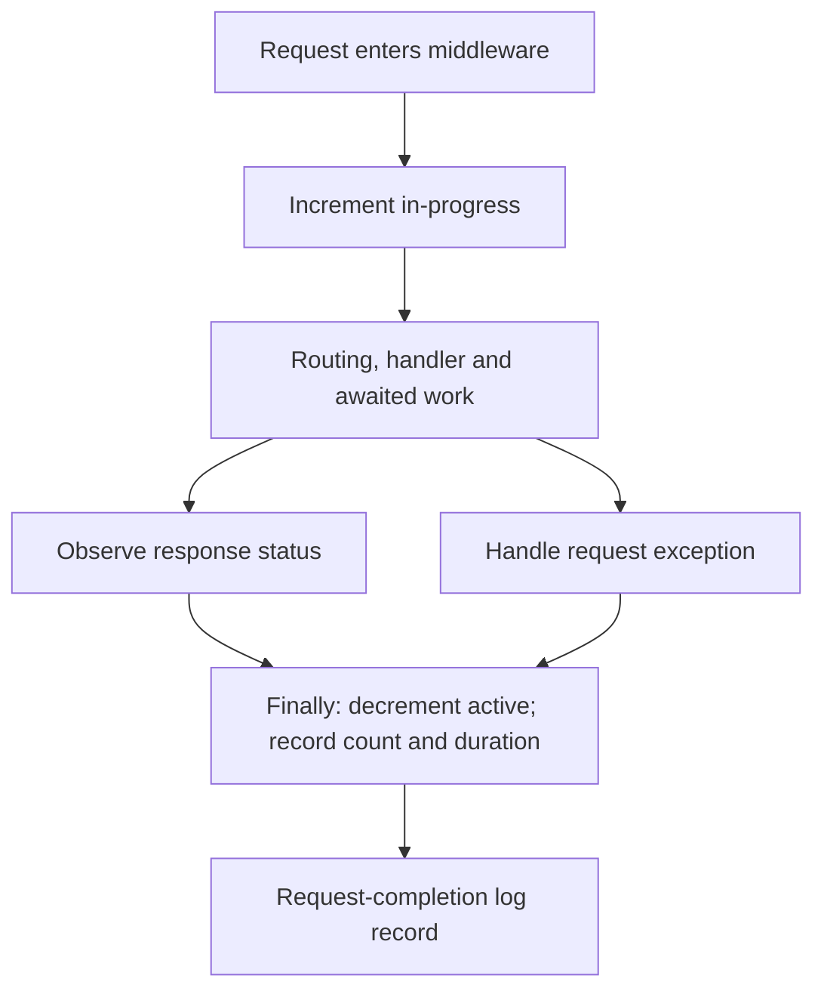

# Lab 08: Instrument RED Metrics

## Purpose and Scope

> **Primary Objective:** Give request count, server-error count, duration and in-progress state a single instrumentation owner, then verify success, rejection, dependency failure and awaited work.

Reading a metric is easier than deciding precisely what it measures. This lab makes the RED boundary explicit: a request arrives, may wait on dependencies, and leaves the server-observed request path.

You will extend the existing implementation without adding a second HTTP middleware or changing the metric names already used by dashboards and alert rules. Rate calculations come later; here you validate the counters and histograms from which rates will be derived.

## 1. Inherited State and Scope

Finish Lab 7, including content negotiation and raw-snapshot helpers. Keep the Lab 6 event envelope and Lab 2 database exception correction.

Only app, PostgreSQL and Redis run. No Prometheus, Grafana, tracing export or profiling backend is started. The scope is instrumentation semantics, bounded dimensions and measurement tests; it is not SLO design or production load testing.

## 2. Start and Capture the Baseline

```bash
source lab-notes/session.sh
source lab-notes/evidence.sh
source lab-notes/raw-metrics.sh
baseline_check
start_lab 08
snapshot "$LAB_DIR/starting.json"
sed -n '1,150p' app/app/metrics.py
sed -n '1,150p' app/app/middleware.py
```

Find where active requests increment/decrement and where count/duration are observed. The middleware uses normalized routes available after routing, not raw paths containing UUIDs.

## 3. Measurable Learning Objectives

Demonstrate that one request completion produces one count and one duration observation; 4xx and 5xx have different meanings; a failed required dependency produces a measured 503; and an awaiting request keeps the in-progress gauge above zero.

Also prove that label values come from bounded HTTP methods, route templates and status codes, and that metric update ownership is explicit. Preserve the distinction between an HTTP response status, an exception record and a committed business action.

## 4. Define RED Before Writing Code

| Concern | Instrument | Interpretation |
|---|---|---|
| Rate | `application_http_requests_total` | Counter; rate requires time and reset-aware calculation |
| Errors | 5xx subset of request count; new `application_http_server_errors_total` | Server-observed 5xx responses, not every rejected request |
| Duration | `application_http_request_duration_seconds` | Histogram of elapsed server request-path seconds |
| Concurrency | `application_http_requests_in_progress` | Current tracked requests in this worker |

The new server-error counter is an explicit subset for learning and simple queries. Existing dashboards/rules can keep deriving errors from the status-labelled request counter. Do not add both numerators together; they describe the same subset.

This is one direct Prometheus metric pipeline. OpenTelemetry remains responsible for later traces, not a second copy of these HTTP metrics.

## 5. Events and Measurement Boundaries



`perf_counter` measures elapsed time, not wall-clock timestamps. The measurement includes the application call and awaited response sending. It is neither PostgreSQL execution time alone nor a guarantee that the client received the complete response.

A stream that fails after headers were sent can retain the already-sent status while an exception is recorded. Client disconnects and task cancellation need their own interpretation; this lab does not claim that a 200 observation proves complete delivery to a user.

## 6. Implement a Single Completion Observer

Add an explicit server-error counter and move the existing two completion observations into one method. Keep `finally` responsible for decrementing the active gauge. The guarded edit leaves the existing metric names and request-ID behavior intact.

```bash
python3 - <<'PYTHON'
from pathlib import Path
metrics = Path("app/app/metrics.py")
source = metrics.read_text()
if "application_http_server_errors_total" not in source:
    marker = '        self.exceptions = Counter(\n'
    assert source.count(marker) == 1, "Inspect the metrics constructor"
    source = source.replace(marker,
        '        self.server_errors = Counter(\n'
        '            "application_http_server_errors_total",\n'
        '            "Responses with a server-observed 5xx status",\n'
        '            ["method", "route"],\n'
        '            registry=self.registry,\n'
        '        )\n' + marker, 1)
if "def observe_request(" not in source:
    source = source.rstrip() + '''

    def observe_request(self, method: str, route: str, status: int, duration: float) -> None:
        self.requests.labels(method, route, str(status)).inc()
        self.duration.labels(method, route).observe(duration)
        self.server_errors.labels(method, route).inc(int(500 <= status < 600))
'''
metrics.write_text(source)
path = Path("app/app/middleware.py")
source = path.read_text()
old = '''                self.metrics.requests.labels(method, route, str(status)).inc()
                self.metrics.duration.labels(method, route).observe(duration)'''
new = '                self.metrics.observe_request(method, route, status, duration)'
if new not in source:
    assert source.count(old) == 1, "Inspect existing middleware instrumentation"
    source = source.replace(old, new, 1)
path.write_text(source)
print("One completion path owns request count, duration, and server-error observation")
PYTHON
```

`observe_request` initializes a zero server-error series even for a healthy method/route. The constructor does not create unbounded children. The middleware owns method normalization and obtains a route template, using `__unmatched__` when no route matched.

## 7. Add Measurement Contract Tests

Create `app/tests/test_red.py`. The awaited-database test uses a synchronization barrier rather than hoping a fast request remains active long enough for an arbitrary sleep.

```bash
cat > app/tests/test_red.py <<'PYTHON'
import asyncio
from unittest.mock import AsyncMock
from uuid import uuid4

from sqlalchemy.exc import SQLAlchemyError


def sample(app, name, labels=None):
    return app.state.metrics.registry.get_sample_value(name, labels or {})


async def test_client_failure_is_not_server_error(client, app):
    response = await client.get(f"/api/v1/items/{uuid4()}")
    assert response.status_code == 404
    labels = {"method": "GET", "route": "/api/v1/items/{item_id}"}
    assert sample(app, "application_http_requests_total", {**labels, "status_code": "404"}) == 1
    assert sample(app, "application_http_request_duration_seconds_count", labels) == 1
    assert sample(app, "application_http_server_errors_total", labels) == 0
    assert sample(app, "application_http_requests_in_progress") == 0


async def test_database_failure_observed_once(client, app, monkeypatch):
    monkeypatch.setattr(
        app.state.database.sessions.class_, "get", AsyncMock(side_effect=SQLAlchemyError("synthetic failure"))
    )
    response = await client.get(f"/api/v1/items/{uuid4()}")
    assert response.status_code == 503
    labels = {"method": "GET", "route": "/api/v1/items/{item_id}"}
    assert sample(app, "application_http_requests_total", {**labels, "status_code": "503"}) == 1
    assert sample(app, "application_http_request_duration_seconds_count", labels) == 1
    assert sample(app, "application_http_server_errors_total", labels) == 1
    assert sample(app, "application_http_requests_in_progress") == 0


async def test_in_progress_covers_awaited_database_work(client, app, monkeypatch):
    entered, release = asyncio.Event(), asyncio.Event()
    session_class = app.state.database.sessions.class_
    original = session_class.get

    async def paused_get(self, *args, **kwargs):
        entered.set()
        await release.wait()
        return await original(self, *args, **kwargs)

    monkeypatch.setattr(session_class, "get", paused_get)
    task = asyncio.create_task(client.get(f"/api/v1/items/{uuid4()}"))
    try:
        await asyncio.wait_for(entered.wait(), timeout=3)
        assert sample(app, "application_http_requests_in_progress") == 1
    finally:
        release.set()
        response = await asyncio.wait_for(task, timeout=3)
    assert response.status_code == 404
    assert sample(app, "application_http_requests_in_progress") == 0
PYTHON
```

The 503 test checks the response path, request counter, duration count, server-error counter and gauge cleanup together. It also guards against accidentally recording one request in two middleware layers.

## 8. Validate and Apply the Change

```bash
make test
make lint
git diff --check
record_change "install_red_completion_observer" planned
dc up -d --build --no-deps app
baseline_check
record_change "install_red_completion_observer" completed
snapshot "$LAB_DIR/fresh-process.json"
```

The rebuild resets process-local metrics. Record this operational change; do not compare its new registry with pre-rebuild cumulative values as if the process had remained unchanged.

## 9. Predict a Small HTTP Result Matrix

Predict the status class, server-error increment and duration-count increment for each operation before running it:

| Operation | Intended outcome | Server-error counter? | Duration observation? |
|---|---|---|---|
| Valid create | 201 | Predict | Predict |
| Invalid create | 422 | Predict | Predict |
| Missing UUID item | 404 | Predict | Predict |
| List while PostgreSQL is stopped | 503 | Predict | Predict |
| `/metrics` | 200 | Excluded | Excluded |

A validation rejection is a real request event. Whether a particular client error should count against a future SLI is a separate product/reliability decision; do not hide it from request instrumentation.

## 10. Exercise Success and Client Errors

```bash
snapshot "$LAB_DIR/before-http.json"
api -fsS -H 'Content-Type: application/json' \
  -H "X-Request-ID: lab08-create-$(new_uuid)" \
  -d '{"name":"Lab 08 measurement subject","price":"8.00"}' \
  "$APP_URL/api/v1/items" -o "$LAB_DIR/item.json"
ITEM_ID=$(jq -er '.id' "$LAB_DIR/item.json")
invalid_status=$(api -sS -o "$LAB_DIR/invalid.json" -w '%{http_code}' \
  -H 'Content-Type: application/json' -d '{"name":"","price":"-1"}' \
  "$APP_URL/api/v1/items")
missing_status=$(api -sS -o "$LAB_DIR/missing.json" -w '%{http_code}' \
  "$APP_URL/api/v1/items/$(new_uuid)")
test "$invalid_status" = 422
test "$missing_status" = 404
snapshot "$LAB_DIR/after-http.json"
```

Expected: three tracked completions, including the rejected requests. The successful item is the only new row. Record the exact labels of the three observations before calculating totals.

## 11. Assert Count, Duration and Error Deltas

```bash
python3 - "$LAB_DIR/before-http.json" "$LAB_DIR/after-http.json" <<'PYTHON'
import json, sys
before, after = [json.load(open(path)) for path in sys.argv[1:]]
def total(samples, name):
    return sum(s["value"] for s in samples if s["name"] == name)
for name, expected in {
    "application_http_requests_total": 3,
    "application_http_request_duration_seconds_count": 3,
    "application_http_server_errors_total": 0,
}.items():
    delta = total(after, name)-total(before, name)
    print(name, "delta=", delta)
    assert delta == expected
active = [s["value"] for s in after if s["name"] == "application_http_requests_in_progress"]
assert active == [0]
PYTHON
```

These assertions require isolated traffic. The `/metrics` requests used to take snapshots are excluded, so they do not add to the expected three. Background dependency probes do not traverse tracked business routes.

## 12. Measure a Required-Dependency Failure

Use the uncached list route. A cached item GET could succeed during the same database outage and would be the wrong experimental control.

```bash
snapshot "$LAB_DIR/before-db-outage.json"
(
  set -euo pipefail
  trap 'dc start postgres >/dev/null' EXIT
  trap 'exit 130' INT
  trap 'exit 143' TERM
  record_change "stop_postgres_for_one_red_failure" planned
  dc stop postgres
  status=$(api -sS -o "$LAB_DIR/db-error.json" -w '%{http_code}' \
    -H "X-Request-ID: lab08-db-$(new_uuid)" "$APP_URL/api/v1/items?limit=1")
  test "$status" = 503
  api -fsS "$APP_URL/health/live" >/dev/null
  snapshot "$LAB_DIR/during-db-outage.json"
)
wait_ready
record_change "restore_postgres_after_red_failure" completed
python3 - "$LAB_DIR/before-db-outage.json" "$LAB_DIR/during-db-outage.json" <<'PYTHON'
import json, sys
before, after = [json.load(open(path)) for path in sys.argv[1:]]
def selected(samples, name, labels):
    return sum(s["value"] for s in samples if s["name"] == name
               and all(s["labels"].get(k) == v for k,v in labels.items()))
labels = {"method":"GET", "route":"/api/v1/items"}
for name, filters in (
    ("application_http_server_errors_total", labels),
    ("application_http_requests_total", {**labels, "status_code":"503"}),
    ("application_http_request_duration_seconds_count", labels),
):
    delta = selected(after,name,filters)-selected(before,name,filters)
    print(name, delta)
    assert delta == 1
PYTHON
capture_app_logs
```

Expected: one measured 503, one duration observation and one server-error increment. Readiness/liveness checks and raw scrapes do not inflate this count. The sanitized database error record and request-completion record describe the failure at different layers.

## 13. Observe In-Progress Work at Runtime

The demo route permits bounded delay and CPU work. It rejects a second simultaneous demo request with 429, so use one request at a time here.

```bash
api -fsS "$APP_URL/api/v1/demo/work?iterations=1000&delay_ms=500" \
  -o "$LAB_DIR/demo.json" &
DEMO_PID=$!
api -fsS "$APP_URL/metrics" > "$LAB_DIR/while-demo.prom"
wait "$DEMO_PID"
rg '^application_http_requests_in_progress' "$LAB_DIR/while-demo.prom"
snapshot "$LAB_DIR/after-demo.json"
metric_sum "$LAB_DIR/after-demo.json" application_http_requests_in_progress
```

You may observe one in progress, followed by zero. On a heavily scheduled host, the metrics request may miss the half-second window. That is a sampling limitation, not proof that the gauge is wrong. The deterministic synchronization test supplies the stronger lifecycle assertion.

Do not increase the demo's maximum duration or launch an unbounded concurrency storm just to make a gauge visible.

## 14. Verify Normalized Route and Method Dimensions

```bash
for n in 1 2 3; do
  api -sS -o /dev/null "$APP_URL/api/v1/items/$(new_uuid)"
  api -sS -o /dev/null "$APP_URL/lab08-unmatched/$(new_uuid)"
done
snapshot "$LAB_DIR/routes.json"
jq '[.[] | select(.name == "application_http_requests_total") | .labels.route] | unique' "$LAB_DIR/routes.json"
```

Expected route dimensions include `/api/v1/items/{item_id}` and `__unmatched__`, not the six concrete UUID-bearing paths. The variable name in the template is `item_id`, not `id`.

The middleware folds unfamiliar HTTP methods into `OTHER` and excludes health/metrics paths. Route normalization must occur after routing information is available. Metric label design receives deeper treatment in Lab 9.

## 15. Check Duration Units and Query Ownership

Inspect the histogram HELP, bucket boundaries and request log duration for the same demo period:

```bash
api -fsS "$APP_URL/metrics" | rg '^# HELP application_http_request_duration_seconds|^application_http_request_duration_seconds_(sum|count)'
capture_app_logs
jq -c 'select(.event_name == "request_completed" and .["http.route"] == "/api/v1/demo/work") | {request_id,duration_ms,"http.status_code":.["http.status_code"]}' \
  "$LAB_DIR/app.jsonl"
```

Metrics use **seconds**; logs use `duration_ms`. Multiply seconds by 1000 only when presenting milliseconds. A histogram `_sum` is the total observed time, not the latest request latency.

Request count and server errors should have exactly one observation owner. Keep tracing instrumentation for traces and avoid installing a second Prometheus FastAPI instrumentor on top of this middleware.

## 16. Recovery, Cleanup and Evidence Review

```bash
api -fsS -X DELETE "$APP_URL/api/v1/items/$ITEM_ID" -o /dev/null
baseline_check
CHECKPOINT_ID=$(cat lab-notes/checkpoint-item-id.txt)
rcli DEL "$(cache_key "$CHECKPOINT_ID")"
api -fsS "$APP_URL/api/v1/items/$CHECKPOINT_ID" | jq '{id,name,price}'
snapshot "$LAB_DIR/final.json"
metric_sum "$LAB_DIR/final.json" application_http_requests_in_progress
capture_app_logs
```

Expected: both dependencies ready, zero active requests after work finishes, and a successful uncached checkpoint read. The error counter remains incremented after recovery: it is cumulative evidence, not current failure state.

Keep the permanent observer method, counter and tests. No experimental 500 endpoint or deliberately broken handler is left behind.

## 17. Troubleshooting Runbook

| Symptom | Next check |
|---|---|
| One request adds two counts | Search for multiple middleware/instrumentor registrations and duplicate observation calls |
| 422 or 404 increments server errors | Inspect the explicit 500–599 predicate; do not classify every exception-like response as 5xx |
| Database outage returns 500 | Verify Lab 2's connection-error translation exists in the rebuilt image |
| Active gauge stays positive | Inspect cleanup in `finally`; reproduce with the awaited-work test |
| Active gauge is always observed as zero | Check measurement timing before assuming lifecycle failure |
| UUID paths appear as labels | Use `scope.route.path` after routing and the bounded unmatched sentinel |
| Durations appear 1000 times too large | Check seconds versus milliseconds at collection and presentation boundaries |
| Error count does not fall after recovery | Expected for a counter; check recent rates or current dependency state later |
| A stream reports 200 and an exception | Headers may already have been sent; separate status observation from complete delivery |

Start with one request and one selected label set. Increasing traffic before understanding duplicate counting makes the evidence harder to interpret.

## 18. Knowledge Check

1. Why is a request counter not already a request rate?
2. Does a 404 belong in the server-error subset here?
3. Can a request produce a duration observation even when it fails?
4. Why must active requests be decremented in finally?
5. What evidence does a zero instantaneous active gauge fail to provide?
6. Why retain status-labelled request counts after adding the server-error subset?
7. Can a sent 200 header prove complete client delivery?
8. What happens to these process-local metrics on restart?
9. Why is raw URL an unsafe route label?
10. Should the two equivalent server-error numerators be added together?

### Answer Guide

1. A rate needs elapsed time and reset-aware counter math.
2. No; it remains a measured request with a client-error status.
3. Yes; failure still occupies time in the request path.
4. Both successful and failed paths must clean up active state.
5. It does not prove no requests ran between observations.
6. They preserve status distribution and existing dashboard/alert compatibility.
7. No; failure can occur after headers or outside the server.
8. Their registry begins again; later Prometheus math must handle resets.
9. Arbitrary paths and IDs produce unbounded series.
10. No; that would count the same subset twice.

## 19. Professional Scenario Exercise

After a deployment, request counts double while access logs and client traffic remain unchanged. Provide an investigation sequence that checks middleware registration, observation ownership, scrape duplication and label scope before blaming increased demand. Identify what evidence would distinguish instrumentation duplication from duplicate ingestion.

## 20. Lab Notebook Template

Create a notebook in the evidence directory for this run:

```bash
test -e "$LAB_DIR/notebook.md" || printf '# Lab 08 Evidence\n' > "$LAB_DIR/notebook.md"
```

Use these headings and fill them with your predictions, commands, observed results and conclusions:

```markdown
# Lab 08 Evidence

## Objective and starting registry
## RED measurement contract
## Events and observation boundaries
## Code diff and tests
## Success/client-error predictions and deltas
## Database failure evidence
## In-progress test and runtime sample
## Route normalization
## Duration units
## Recovery and retained cumulative evidence
## Scenario response
```

## 21. Observable Completion Criteria

- [ ] A single completion observer owns request/duration/server-error updates.
- [ ] Existing metric names used by the repository remain intact.
- [ ] Focused tests cover 404, database 503 and awaited work.
- [ ] Three controlled success/client-error requests produce three counts and duration observations.
- [ ] One database failure increments the server-error subset once.
- [ ] Active requests return to zero after completion/failure.
- [ ] Route labels use templates and a bounded unmatched value.
- [ ] Metric seconds and log milliseconds are distinguished.
- [ ] Cleanup and an uncached checkpoint read prove recovery.

## 22. Production Implications

Instrumentation defines the meaning of future dashboards and alerts. A low-cardinality, well-tested boundary is more valuable than many loosely defined metrics. Server status, application exceptions, client delivery and business commits are different contracts. Multi-worker metrics, streaming failures and client-side observations require additional design beyond this single-worker baseline.

## 23. End State and Transition

Leave the application with the RED observer and tests. Keep the baseline services running and retain the raw-snapshot helpers.

Next: [Lab 09 — Metric Design, Business Metrics, and Cardinality](Lab-9.md). You will add a commit-based business counter and quantify why per-event identifiers do not belong in metric labels.
