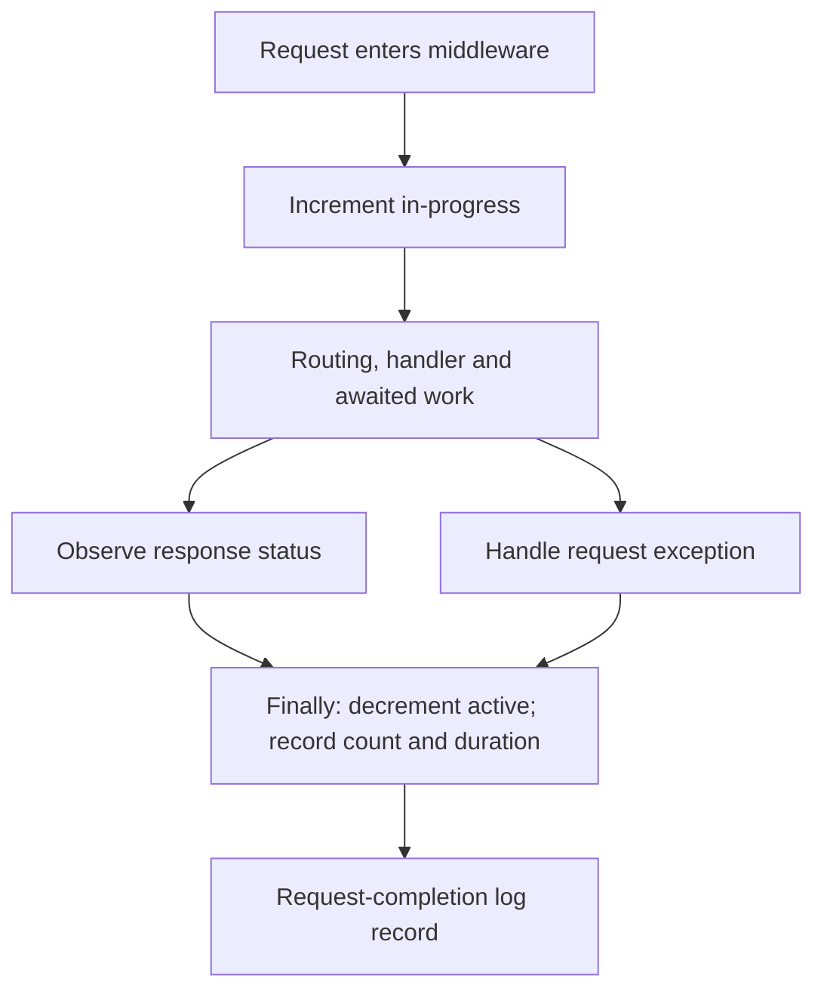

# Lab 08: Instrument RED Metrics

## 1. Purpose and Learning Outcomes

You will define exactly when a request becomes active and when its measured work finishes. One observer will update request count, duration, and server errors, with cleanup for active work. Test successful responses, client rejections, a database failure, and a waiting request so each metric has a clear meaning before it reaches a dashboard.

> **Primary Objective:** Give request completion metrics one owner, pair them with correct in-progress cleanup, and test successful requests, rejected input, dependency failure, and work waiting to finish.

Reading a number is easier than defining what it measures. This lab sets the RED measurement points clearly: the request enters, may wait on other services, and leaves the part of request handling observed by the server.

Extend the current code without another HTTP middleware or renaming metrics used by existing dashboards and alerts. Later labs calculate rates. Here, check the counters and histograms that will supply those calculations.

## 2. Starting Point and Lab Map

Open the complete application repository before using this guide. Unless a step says otherwise, run commands in Bash from the repository's top-level folder. Follow the starting checks in order because later commands depend on the helper functions and running services they prepare.

Read each explanation before running its commands. Run one complete code block, check the result, and then continue. In your notebook, save the commands, what happened, why you think it happened, and anything that differed from the expected result.

### Key Terms

| **Term**         | **Explanation**                                                                                                             |
| ---------------- | --------------------------------------------------------------------------------------------------------------------------- |
| RED              | Rate, errors, and duration: how much request traffic the service handles, which responses fail, and how long requests take. |
| Gauge            | A current value that can increase or decrease, such as the number of active requests.                                       |
| Normalized route | A route template that groups many item-specific URLs under the same label instead of using each UUID.                       |

### Lab Map

The arrows show how the parts connect and where a request can take different paths. Use this map to understand the design. It is not a recording of a request that actually ran.


```mermaid
flowchart TD
    Arrive["Request enters middleware"] --> Active["Increment in-progress"]
    Active --> Work["Routing, handler and awaited work"]
    Work --> Status["Observe response status"]
    Work --> Failure["Handle request exception"]
    Status --> Finish["Finally: decrement active; record count and duration"]
    Failure --> Finish
    Finish --> Log["Request-completion log record"]
```

## 3. Guided Walkthrough

### Step 01. Inherited State and Scope

**What You Are Doing:** Keep the tested logging and metrics formats. Change the request measurements while continuing to read them directly from the app.

**Practical Walkthrough:** Check the previous helpers and contracts before editing. Direct snapshots keep collection unchanged, so differences in counts or durations can be traced to the observer rather than scrape timing or stored history.

Verify logging and exposition first. Use the same snapshot method throughout this lab while changing measurement code. Holding that part steady makes it easier to connect the result with the implementation you edited.

Finish Lab 7, including content negotiation and raw-snapshot helpers. Keep the Lab 6 event envelope and Lab 2 database exception correction.

Run only app, PostgreSQL, and Redis. Keep Prometheus, Grafana, tracing export, and profiling backends stopped. This lab defines measurement meanings, limits label values, and tests behavior; it does not set SLOs or benchmark production load.

**Understanding the Result:** Working formats and correlation are prerequisites. If they break, fix them before trusting the new request measurements.

### Step 02. Start and Capture the Baseline

**What You Are Doing:** Find every existing update to the request instruments. Two completion owners can count one request twice, while missing cleanup can leave the active gauge stuck above zero.

**Practical Walkthrough:** Search counter, histogram, and gauge updates and follow which layer performs them. Read the whole path, including errors. Two individually reasonable completion calls still double-count if both run for the same request.

Trace normal completion, exceptions, and cleanup. Decide who owns completion and active-state updates before patching. A local code fragment can look correct while duplicating an update elsewhere.

```bash
source lab-notes/session.sh
source lab-notes/evidence.sh
source lab-notes/raw-metrics.sh
baseline_check
start_lab 08
snapshot "$LAB_DIR/starting.json"
sed -n '1,150p' app/app/metrics.py
sed -n '1,150p' app/app/middleware.py
```

Find both active-gauge changes and the count/duration observations. The middleware uses route templates available after routing, not raw URLs containing item UUIDs.

**Understanding the Result:** Each measured request needs one consistent lifecycle. Record and replace its existing owners so an old update is not accidentally left active.

### Step 03. Measurable Learning Objectives

**What You Are Doing:** Turn each objective into a testable rule. The count, histogram, and gauge should describe the same controlled work consistently.

**Practical Walkthrough:** Predict the changes from one request. Completion should increase both request count and duration count. Active work should raise the gauge temporarily, then release it. Decide server-error classification separately; an unsuccessful response is not automatically a 5xx.

For each response, predict completion count, histogram count, server errors, and final active state. Counts accumulate; the gauge returns to its baseline. A request can therefore add to multiple cumulative measurements without remaining permanently active.

Show that one completion adds one request count and one duration observation. Distinguish 4xx from 5xx, measure a database-dependent 503, and check that a waiting request stays in progress until it finishes.

Also show that methods, route templates, and statuses use limited label values and have clear update owners. Keep HTTP status, exception records, and committed business actions separate; they do not count the same thing.

**Understanding the Result:** The instruments must agree about the defined request population. Merely exposing some numbers does not prove that agreement.

### Step 04. Define RED Before Writing Code

**What You Are Doing:** Define totals, rates, server errors, durations, and active requests before coding. A total needs time-based calculation to become a rate, and a client rejection is a separate category from a server error.

**Practical Walkthrough:** A counter accumulates completions. A rate describes their change per unit of time. Here, server errors are the stated 5xx subset. Duration measures elapsed server handling, while the gauge shows tracked work active at the instant you read it.

Write the unit and population beside each value. Duration includes waiting, not just CPU work. Rate needs elapsed time and reset handling. Keep the 5xx rule visible when examining rejected requests so a 404 or 422 is not silently reclassified as a server failure.

| **Concern** | **Instrument**                                                          | **Interpretation**                                                                       |
| ----------- | ----------------------------------------------------------------------- | ---------------------------------------------------------------------------------------- |
| Rate        | `application_http_requests_total`                                       | A cumulative total; requests per second require elapsed time and reset-aware calculation |
| Errors      | 5xx subset of request count; new `application_http_server_errors_total` | Responses observed as 5xx by the server, not every rejection                             |
| Duration    | `application_http_request_duration_seconds`                             | A histogram of elapsed seconds inside the measured server path                           |
| Concurrency | `application_http_requests_in_progress`                                 | The current number of tracked requests active in this worker                             |

The new server-error counter makes the subset explicit for learning and simple queries. Existing queries can still select 5xx from the status-labelled request counter. These are two views of the same errors; adding them would count each error twice.

Keep one direct Prometheus metrics path. Later OpenTelemetry instrumentation supplies traces, not another copy of these HTTP counters.

**Understanding the Result:** Attach units and scope to every number. Total requests, requests per second, and requests active now are different quantities.

### Step 05. Events and Measurement Boundaries

**What You Are Doing:** Locate the start and end of measured request work. Waiting on dependencies increases elapsed duration even when the app uses little CPU.

**Practical Walkthrough:** Follow entry, awaited calls, exceptions, and completion. A slow request may spend most of its time waiting. The duration metric alone cannot identify whether CPU, network, database, or another resource caused the delay.

Find the cleanup that runs when the measured scope ends. It determines when active work is decremented. Keep elapsed request time separate from CPU time, and include the awaited response and dependency work that lies inside the measured scope.

The lab map in Section 2 shows this relationship.

`perf_counter` measures elapsed duration rather than a wall-clock date and time. This scope includes the application call and awaited response sending. It is not only PostgreSQL execution time and does not guarantee the client consumed the full response.

If a stream fails after headers were sent, the observed status may remain 200 even though an exception follows. Client disconnects and task cancellation need separate interpretation. A recorded 200 does not prove complete user-visible delivery.

**Understanding the Result:** The start and end points define the duration. Client timing may also include network and client work outside this server measurement.

### Step 06. Implement a Single Completion Observer

**What You Are Doing:** Give completion updates one owner and preserve cleanup on every exit path. One finished request should add one count and one duration and release its active-gauge increment.

**Practical Walkthrough:** Follow the observer from entry to completion and cleanup. The gauge rises when work starts and falls when it leaves the measured scope, including errors. Related count and duration measurements use the same normalized dimensions so they describe the same work.

Review the guarded change after applying it. Check entry, observation, and cleanup, along with the labels used. A single completion observer prevents duplicate updates; guaranteed cleanup prevents failed requests from remaining counted as active.

Add the explicit server-error counter and put the two existing completion observations into one method. Keep gauge decrement in `finally`. The guarded change preserves existing metric names and request-ID behavior.

```bash
python3 - <<'PYTHON'
from pathlib import Path
metrics = Path("app/app/metrics.py")
source = metrics.read_text()
if "application_http_server_errors_total" not in source:
    marker = '        self.exceptions = Counter(\n'
    assert source.count(marker) == 1, "Inspect the metrics constructor"
    source = source.replace(marker,
        '        self.server_errors = Counter(\n'
        '            "application_http_server_errors_total",\n'
        '            "Responses with a server-observed 5xx status",\n'
        '            ["method", "route"],\n'
        '            registry=self.registry,\n'
        '        )\n' + marker, 1)
if "def observe_request(" not in source:
    source = source.rstrip() + '''

    def observe_request(self, method: str, route: str, status: int, duration: float) -> None:
        self.requests.labels(method, route, str(status)).inc()
        self.duration.labels(method, route).observe(duration)
        self.server_errors.labels(method, route).inc(int(500 <= status < 600))
'''
metrics.write_text(source)
path = Path("app/app/middleware.py")
source = path.read_text()
old = '''                self.metrics.requests.labels(method, route, str(status)).inc()
                self.metrics.duration.labels(method, route).observe(duration)'''
new = '                self.metrics.observe_request(method, route, status, duration)'
if new not in source:
    assert source.count(old) == 1, "Inspect existing middleware instrumentation"
    source = source.replace(old, new, 1)
path.write_text(source)
print("One completion path owns request count, duration, and server-error observation")
PYTHON
```

`observe_request` creates a zero server-error sample even for a healthy method/route. Child creation still uses limited dimensions. Middleware normalizes methods and uses the matched route template, or `__unmatched__` when no route matches.

**Understanding the Result:** Cleanup releases active work even after failure. One completion owner keeps middleware and handlers from both recording the same finished request.

### Step 07. Add Measurement Contract Tests

**What You Are Doing:** Use tests that deliberately hold a request open and inject failures. A controlled pause is more reliable than hoping a snapshot catches a fast request.

**Practical Walkthrough:** The synchronization barrier pauses work at a known point until the test releases it. Inspect the gauge while blocked, then check completion and cleanup afterward. Read a failed assertion as a specific contract problem instead of repeatedly changing sleep timing.

Locate the barrier and its release. Assertions before release test active state; assertions after release test completion and cleanup. This removes the luck involved in catching short-lived work with a live metrics fetch.

Create `app/tests/test_red.py`. Its awaited-database test uses a synchronization barrier to keep work pending until inspection, rather than relying on an arbitrary sleep.

```bash
cat > app/tests/test_red.py <<'PYTHON'
import asyncio
from unittest.mock import AsyncMock
from uuid import uuid4

from sqlalchemy.exc import SQLAlchemyError


def sample(app, name, labels=None):
    return app.state.metrics.registry.get_sample_value(name, labels or {})


async def test_client_failure_is_not_server_error(client, app):
    response = await client.get(f"/api/v1/items/{uuid4()}")
    assert response.status_code == 404
    labels = {"method": "GET", "route": "/api/v1/items/{item_id}"}
    assert sample(app, "application_http_requests_total", {**labels, "status_code": "404"}) == 1
    assert sample(app, "application_http_request_duration_seconds_count", labels) == 1
    assert sample(app, "application_http_server_errors_total", labels) == 0
    assert sample(app, "application_http_requests_in_progress") == 0


async def test_database_failure_observed_once(client, app, monkeypatch):
    monkeypatch.setattr(
        app.state.database.sessions.class_, "get", AsyncMock(side_effect=SQLAlchemyError("synthetic failure"))
    )
    response = await client.get(f"/api/v1/items/{uuid4()}")
    assert response.status_code == 503
    labels = {"method": "GET", "route": "/api/v1/items/{item_id}"}
    assert sample(app, "application_http_requests_total", {**labels, "status_code": "503"}) == 1
    assert sample(app, "application_http_request_duration_seconds_count", labels) == 1
    assert sample(app, "application_http_server_errors_total", labels) == 1
    assert sample(app, "application_http_requests_in_progress") == 0


async def test_in_progress_covers_awaited_database_work(client, app, monkeypatch):
    entered, release = asyncio.Event(), asyncio.Event()
    session_class = app.state.database.sessions.class_
    original = session_class.get

    async def paused_get(self, *args, **kwargs):
        entered.set()
        await release.wait()
        return await original(self, *args, **kwargs)

    monkeypatch.setattr(session_class, "get", paused_get)
    task = asyncio.create_task(client.get(f"/api/v1/items/{uuid4()}"))
    try:
        await asyncio.wait_for(entered.wait(), timeout=3)
        assert sample(app, "application_http_requests_in_progress") == 1
    finally:
        release.set()
        response = await asyncio.wait_for(task, timeout=3)
    assert response.status_code == 404
    assert sample(app, "application_http_requests_in_progress") == 0
PYTHON
```

**Command Note:** `<<'PYTHON'` writes the code literally until the closing `PYTHON` marker. Quoting prevents Bash from expanding `$variables`; execution happens later.

The 503 test checks the HTTP response, request delta, histogram count, server errors, and gauge cleanup together. It also detects accidentally measuring the same request in two middleware layers.

**Understanding the Result:** Controlled tests establish lifecycle behavior reliably. The live exercise later shows how that behavior appears in the running app.

### Step 08. Validate and Apply the Change

**What You Are Doing:** Validate and rebuild before measuring the new code. Record the process replacement so a reset is not mistaken for completed requests disappearing.

**Practical Walkthrough:** Run the checks, rebuild, recreate, and wait for readiness. Then take a fresh baseline. Process-local metrics can reset on recreation, so do not compare pre-deployment and post-deployment totals with a simple subtraction.

Complete validation before deployment. If new totals are lower than old saved values, first account for the intentional new process. Each simple delta needs both snapshots from that same lifetime.

```bash
make test
make lint
git diff --check
record_change "install_red_completion_observer" planned
dc up -d --build --no-deps app
baseline_check
record_change "install_red_completion_observer" completed
snapshot "$LAB_DIR/fresh-process.json"
```

The rebuild resets the app's process-local registry. Record this change and begin new comparisons after it; do not treat old and new totals as one uninterrupted counter.

**Understanding the Result:** Keep reset evidence separate from request-count evidence. Use one process lifetime for each raw subtraction.

### Step 09. Predict a Small HTTP Result Matrix

**What You Are Doing:** Predict each instrument's change for each response. Total completions include more outcomes than the narrower server-error subset.

**Practical Walkthrough:** Predict request count, duration count, and error count before sending the cases. Client rejections still complete HTTP requests even though they are not 5xx here. The table will help explain why successful business actions and measured request totals differ.

Work through malformed input and missing-item responses as well as success. Count completions according to the contract, then decide error membership separately. Predict duration count alongside request count so you can check they cover equivalent work.

Predict the status class, server-error increment and duration-count increment for each operation before running it:

| **Operation**                    | **Intended Outcome** | **Server-Error Counter?** | **Duration Observation?** |
| -------------------------------- | -------------------- | ------------------------- | ------------------------- |
| Valid create                     | 201                  | Predict                   | Predict                   |
| Invalid create                   | 422                  | Predict                   | Predict                   |
| Missing UUID item                | 404                  | Predict                   | Predict                   |
| List while PostgreSQL is stopped | 503                  | Predict                   | Predict                   |
| `/metrics`                       | 200                  | Excluded                  | Excluded                  |

Validation rejection is still a request event and should remain measured. Whether a particular client error should count against a later service-level indicator (SLI) is a separate reliability decision.

**Understanding the Result:** The error definition is a policy chosen before the test. Do not change it afterward just to make the observed totals look right.

### Step 10. Exercise Success and Client Errors

**What You Are Doing:** Run the exact success and rejection sequence and save its responses. A known set of requests makes the expected metric differences checkable.

**Practical Walkthrough:** Keep the request order, statuses, bodies, and generated ID. Later steps may depend on earlier results. Avoid other traffic using the same labels while measuring, and stop if a required setup request fails.

Save the item ID and each status. Expected client errors are part of the workload, so retain their bodies. If creation failed, later dependent requests no longer represent the planned sequence and should not be interpreted as though it succeeded.

```bash
snapshot "$LAB_DIR/before-http.json"
api -fsS -H 'Content-Type: application/json' \
  -H "X-Request-ID: lab08-create-$(new_uuid)" \
  -d '{"name":"Lab 08 measurement subject","price":"8.00"}' \
  "$APP_URL/api/v1/items" -o "$LAB_DIR/item.json"
ITEM_ID=$(jq -er '.id' "$LAB_DIR/item.json")
invalid_status=$(api -sS -o "$LAB_DIR/invalid.json" -w '%{http_code}' \
  -H 'Content-Type: application/json' -d '{"name":"","price":"-1"}' \
  "$APP_URL/api/v1/items")
missing_status=$(api -sS -o "$LAB_DIR/missing.json" -w '%{http_code}' \
  "$APP_URL/api/v1/items/$(new_uuid)")
test "$invalid_status" = 422
test "$missing_status" = 404
snapshot "$LAB_DIR/after-http.json"
```

**Expected Result:** three tracked completions, including the rejected requests, but only one newly stored row. Note the three observations' exact labels before combining their counts.

**Understanding the Result:** An expected 4xx is valid test evidence. Its status explains why request completions outnumber successful item creates.

### Step 11. Assert Count, Duration and Error Deltas

**What You Are Doing:** Compare matching labels within one process lifetime. Agreement between request and duration counts helps show each controlled request was observed once.

**Practical Walkthrough:** Select equivalent request populations in both snapshots. Compare their request-count and histogram-count changes with the predicted 5xx subset. Be aware that histogram labels may not include status; choose a population that still represents the same work rather than requiring identical label schemas.

Read the selectors before totals. Check methods, routes, statuses where available, and process lifetime. Different populations can produce mismatched counts even when the observer is correct.

```bash
python3 - "$LAB_DIR/before-http.json" "$LAB_DIR/after-http.json" <<'PYTHON'
import json, sys
before, after = [json.load(open(path)) for path in sys.argv[1:]]
def total(samples, name):
    return sum(s["value"] for s in samples if s["name"] == name)
for name, expected in {
    "application_http_requests_total": 3,
    "application_http_request_duration_seconds_count": 3,
    "application_http_server_errors_total": 0,
}.items():
    delta = total(after, name)-total(before, name)
    print(name, "delta=", delta)
    assert delta == expected
active = [s["value"] for s in after if s["name"] == "application_http_requests_in_progress"]
assert active == [0]
PYTHON
```

The assertions assume isolated traffic. Snapshot `/metrics` calls are excluded, so they do not increase the expected three. Background dependency probes do not pass through the measured business routes either.

**Understanding the Result:** Matching deltas support one completion observation per request in this sequence. Investigate extra traffic before changing the expected count.

### Step 12. Measure a Required-Dependency Failure

**What You Are Doing:** Briefly stop PostgreSQL and call an uncached route. Its 503 should add one request completion, one duration observation, and one server error.

**Practical Walkthrough:** Use the full stop-and-restore block and an operation that must reach PostgreSQL. Save the 503 response. Even though the business operation fails, it still occupies time and completes an HTTP path, so both total and duration metrics should include it.

Keep the recovery handling and capture together. Compare the expected `503` with count and error changes. After the block, verify recovery so the successful measurement of a failure is followed by proof of usable services.

Use the uncached list route. A warm item GET could still succeed from Redis during this outage and would test a different path.

```bash
snapshot "$LAB_DIR/before-db-outage.json"
(
  set -euo pipefail
  trap 'dc start postgres >/dev/null' EXIT
  trap 'exit 130' INT
  trap 'exit 143' TERM
  record_change "stop_postgres_for_one_red_failure" planned
  dc stop postgres
  status=$(api -sS -o "$LAB_DIR/db-error.json" -w '%{http_code}' \
    -H "X-Request-ID: lab08-db-$(new_uuid)" "$APP_URL/api/v1/items?limit=1")
  test "$status" = 503
  api -fsS "$APP_URL/health/live" >/dev/null
  snapshot "$LAB_DIR/during-db-outage.json"
)
wait_ready
record_change "restore_postgres_after_red_failure" completed
python3 - "$LAB_DIR/before-db-outage.json" "$LAB_DIR/during-db-outage.json" <<'PYTHON'
import json, sys
before, after = [json.load(open(path)) for path in sys.argv[1:]]
def selected(samples, name, labels):
    return sum(s["value"] for s in samples if s["name"] == name
               and all(s["labels"].get(k) == v for k,v in labels.items()))
labels = {"method":"GET", "route":"/api/v1/items"}
for name, filters in (
    ("application_http_server_errors_total", labels),
    ("application_http_requests_total", {**labels, "status_code":"503"}),
    ("application_http_request_duration_seconds_count", labels),
):
    delta = selected(after,name,filters)-selected(before,name,filters)
    print(name, delta)
    assert delta == 1
PYTHON
capture_app_logs
```

**Command Note:** `trap ... EXIT` schedules cleanup when the shell exits. Keep it attached to the fault and verify readiness afterward to confirm the restoration worked.

**Expected Result:** one recorded 503, one duration observation, and one server-error increment. Probes and raw scrapes do not add business counts. The database-error log and completion log describe different stages of the same failed request.

**Understanding the Result:** Restore PostgreSQL and check fresh readiness. The error counter should keep its historical increment even after the live failure ends.

### Step 13. Observe in-Progress Work at Runtime

**What You Are Doing:** Inspect a request while it is deliberately waiting. A live snapshot can miss the active interval, so use the barrier-based test as the reliable check of gauge behavior.

**Practical Walkthrough:** Start the delayed request, fetch the gauge while it is pending, and check again after completion. A live fetch observes one instant and may miss a short peak. The earlier synchronization test separates correct lifecycle behavior from that timing limitation.

The final `&` runs the delayed request in the background, allowing the shell to fetch metrics at the same time. Wait for completion and compare the final gauge. Missing a peak and a gauge stuck above baseline after completion are different findings.

The demo route allows limited delay and CPU work. A second simultaneous demo request is rejected with 429, so use one demo request at a time here.

```bash
api -fsS "$APP_URL/api/v1/demo/work?iterations=1000&delay_ms=500" \
  -o "$LAB_DIR/demo.json" &
DEMO_PID=$!
api -fsS "$APP_URL/metrics" > "$LAB_DIR/while-demo.prom"
wait "$DEMO_PID"
rg '^application_http_requests_in_progress' "$LAB_DIR/while-demo.prom"
snapshot "$LAB_DIR/after-demo.json"
metric_sum "$LAB_DIR/after-demo.json" application_http_requests_in_progress
```

You may see one active request followed by zero. A busy host may schedule the metrics fetch outside the half-second interval. That does not prove the gauge failed to rise; the controlled barrier test provides stronger lifecycle evidence.

Keep the demo's duration limits and avoid launching uncontrolled concurrent requests merely to make the gauge visible.

**Understanding the Result:** A rise and fall is useful live evidence. Not catching the rise does not prove it never happened.

### Step 14. Verify Normalized Route and Method Dimensions

**What You Are Doing:** Compare different concrete URLs with their shared route label. Each item UUID should not become another metric dimension.

**Practical Walkthrough:** Send requests for several item IDs and inspect the recorded route templates. Also test method normalization. The goal is to group related requests under a limited set of values instead of copying arbitrary client input into labels.

Different UUIDs should still produce the same item-route template. Check unfamiliar methods separately to ensure they are grouped rather than creating unlimited method values.

```bash
for n in 1 2 3; do
  api -sS -o /dev/null "$APP_URL/api/v1/items/$(new_uuid)"
  api -sS -o /dev/null "$APP_URL/lab08-unmatched/$(new_uuid)"
done
snapshot "$LAB_DIR/routes.json"
jq '[.[] | select(.name == "application_http_requests_total") | .labels.route] | unique' "$LAB_DIR/routes.json"
```

Expect route values such as `/api/v1/items/{item_id}` and `__unmatched__`, not six separate UUID-bearing paths. The actual template parameter is `item_id`, not `id`.

Unknown HTTP methods become `OTHER`. Health and metrics paths remain excluded. The route template is available after routing, so normalization must use that information at the right time. Lab 9 examines label design further.

**Understanding the Result:** Many requests should share bounded label sets. Keep item identity in suitable event evidence instead of one new route label per item.

### Step 15. Check Duration Units and Query Ownership

**What You Are Doing:** Compare metric seconds with log milliseconds. Convert units explicitly before comparing values from the same work.

**Practical Walkthrough:** Write the unit beside each log and metric field. Convert when necessary and choose comparable observations. The app records raw counts and durations; later queries decide whether to present a rate, average, or percentile.

Compare seconds with seconds, and use histogram sum and count for the stated population and interval. Neither automatically represents the latest individual request. State the calculation when deriving an average or other summary.

Inspect the histogram HELP, bucket boundaries and request log duration for the same demo period:

```bash
api -fsS "$APP_URL/metrics" | rg '^# HELP application_http_request_duration_seconds|^application_http_request_duration_seconds_(sum|count)'
capture_app_logs
jq -c 'select(.event_name == "request_completed" and .["http.route"] == "/api/v1/demo/work") | {request_id,duration_ms,"http.status_code":.["http.status_code"]}' \
  "$LAB_DIR/app.jsonl"
```

Metrics use **seconds**, while logs use `duration_ms`. Multiply seconds by 1000 to present milliseconds. Histogram `_sum` adds all observed durations in scope; it is not the latency of the latest request.

Keep one owner for count and server-error updates. Tracing can supply traces later, but do not layer another Prometheus FastAPI instrumentor over the existing middleware and duplicate these observations.

**Understanding the Result:** A 1,000-fold difference may simply be seconds versus milliseconds. Even after conversion, an aggregate total is not the same as one log record's duration.

### Step 16. Recovery, Cleanup and Evidence Review

**What You Are Doing:** Delete the temporary item, check readiness and idle active state, and keep the new instrumentation. Completed-error history stays in the counter after recovery.

**Practical Walkthrough:** Wait for test work to finish, delete only this lab's item, and repeat readiness and metrics checks. Keep the checkpoint, helper files, observer, and tests so later labs continue with the same measurement definitions.

Finish background requests before the final snapshot. Confirm gauge cleanup and the retained checkpoint, and preserve the new observer as the course baseline. Do not reset cumulative counters merely to make an old error disappear.

```bash
api -fsS -X DELETE "$APP_URL/api/v1/items/$ITEM_ID" -o /dev/null
baseline_check
CHECKPOINT_ID=$(cat lab-notes/checkpoint-item-id.txt)
rcli DEL "$(cache_key "$CHECKPOINT_ID")"
api -fsS "$APP_URL/api/v1/items/$CHECKPOINT_ID" | jq '{id,name,price}'
snapshot "$LAB_DIR/final.json"
metric_sum "$LAB_DIR/final.json" application_http_requests_in_progress
capture_app_logs
```

**Expected Result:** both dependencies are ready, active requests are zero after work finishes, and an uncached checkpoint read succeeds. The error counter remains increased because it records past events, not current dependency health.

Keep the observer, counter, and tests. Do not leave an experimental 500 route or deliberately broken handler behind.

**Understanding the Result:** The active gauge returns to zero when idle. Request and error counters retain the completed work from this process lifetime.

## 4. Troubleshooting and Diagnosis

Begin with the first result that differed from your prediction. Save the exact error or symptom and identify which service or command produced it. Use the checks below, make the needed fix, and repeat the original check to confirm the problem is resolved.

### Troubleshooting Runbook

| **Symptom**                              | **Next Check**                                                                                         |
| ---------------------------------------- | ------------------------------------------------------------------------------------------------------ |
| One request adds two counts              | Look for duplicate middleware, instrumentor registration, or observation calls                         |
| 422 or 404 increments server errors      | Check the 500–599 condition; client rejections are not part of this 5xx subset                         |
| Database outage returns 500              | Confirm Lab 2's connection-error handling is present in the rebuilt image                              |
| Active gauge stays positive              | Check `finally` cleanup and reproduce with the controlled waiting-request test                         |
| Active gauge is always observed as zero  | Check snapshot timing; short active periods may have been missed                                       |
| UUID paths appear as labels              | Use `scope.route.path` after routing and the fixed unmatched value                                     |
| Durations appear 1000 times too large    | Check seconds and milliseconds at each conversion and display step                                     |
| Error count does not fall after recovery | Expected for a cumulative counter; later use a recent rate or current health to assess ongoing failure |
| A stream reports 200 and an exception    | Headers may already have been sent; a status observation does not prove complete delivery              |

Begin with one request and a precise label selection. More traffic makes duplicate-counting evidence harder to interpret before you know the cause.

## 5. Review and Practice

Answer the questions in your own words before reading the answers. For the scenario, say what you would inspect and exactly what each result would tell you.

### Knowledge Check

1. Why is a request counter not already a request rate?
2. Does a 404 belong in the server-error subset here?
3. Can a request produce a duration observation even when it fails?
4. Why must active requests be decremented in finally?
5. What evidence does a zero instantaneous active gauge fail to provide?
6. Why retain status-labelled request counts after adding the server-error subset?
7. Can a sent 200 header prove complete client delivery?
8. What happens to these process-local metrics on restart?
9. Why is raw URL an unsafe route label?
10. Should the two equivalent server-error numerators be added together?

#### Answer Guide

1. A rate needs the change over elapsed time and correct handling of counter resets.
2. No. It is still a measured request, but its status is a client error rather than this lab's server-error subset.
3. Yes. A failed request still takes elapsed time inside the measured path.
4. Active state must be released after both success and failure.
5. Zero now does not mean no requests were active between snapshots.
6. They retain the status distribution and keep existing dashboards and alerts compatible.
7. No. Delivery can fail after the headers were sent or outside the server's measured work.
8. The registry starts again, so later counter calculations must recognize resets.
9. Raw paths can contain unlimited item IDs and arbitrary input, creating too many series.
10. No. They represent the same errors, so adding them double-counts that subset.

### Professional Scenario Exercise

After deployment, metric request counts double but client traffic and access logs do not. Plan checks of middleware registration, update ownership, duplicate scraping, and selected labels before assuming traffic increased. Explain which source and stored-metric evidence would distinguish counting twice in the app from collecting the same measurements twice.

## 6. Completion Checklist

Tick an item only when you can show its result or saved evidence. Finish the cleanup instructions before starting the next lab.

### Observable Completion Criteria

- [ ] A single completion observer owns request/duration/server-error updates.
- [ ] Existing metric names used by the repository remain intact.
- [ ] Focused tests cover 404, database 503 and awaited work.
- [ ] Three controlled success/client-error requests produce three counts and duration observations.
- [ ] One database failure increments the server-error subset once.
- [ ] Active requests return to zero after completion/failure.
- [ ] Route labels use templates and a bounded unmatched value.
- [ ] Metric seconds and log milliseconds are distinguished.
- [ ] Cleanup and an uncached checkpoint read prove recovery.

## 7. Production Context and Next Lab

### Production Implications

Future dashboards and alerts depend on these definitions. Clear, tested metrics with limited label values are more useful than many vague ones. Server statuses, exceptions, client delivery, and database commits are different events. Multiple workers, streaming failures, and client-side measurements need further design beyond this single-worker lab.

### End State and Transition

Keep the RED observer and tests in the application, with the baseline running and raw-snapshot helpers available.

Next: [Lab 09 — Metric Design, Business Metrics, and Cardinality](Lab-09.md). You will count committed business actions and calculate how per-event label values cause the number of series to grow.