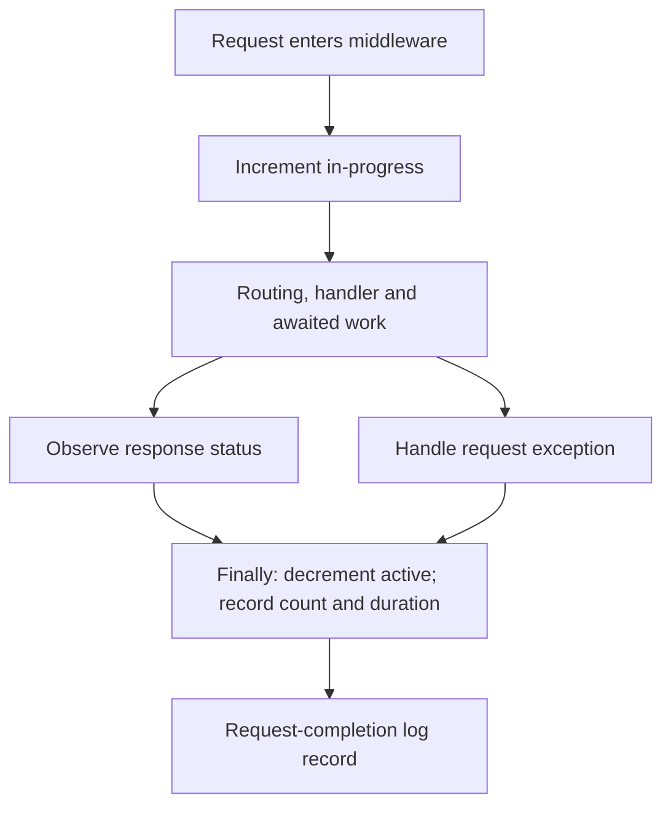

# Lab 08: Instrument RED Metrics

## 1. Purpose and Learning Outcomes

**In Plain Language:** You will make request measurements agree on exactly when a request starts and finishes. A single observer will update count, duration, server errors, and active work. You will test successes, client errors, a database failure, and a waiting request so the instruments have clear meanings before they appear on a dashboard.

> **Primary Objective:** Give request count, server-error count, duration and in-progress state a single instrumentation owner, then verify success, rejection, dependency failure and awaited work.

Reading a metric is easier than deciding precisely what it measures. This lab makes the RED boundary explicit: a request arrives, may wait on dependencies, and leaves the server-observed request path.

You will extend the existing implementation without adding a second HTTP middleware or changing the metric names already used by dashboards and alert rules. Rate calculations come later; here you validate the counters and histograms from which rates will be derived.

## 2. Starting Point and Lab Map

Use this guide inside the complete application repository. Run commands from the repository root in Bash unless a step says otherwise. Work through the starting checks in order; they load the helpers and state this lab needs.

Read the explanation before each step, run one complete code block at a time, and compare the actual result with the stated expectation. Save commands, observations, explanations, and unexpected results in your notebook.

### Key Terms

| **Term**         | **Plain-Language Meaning**                                                   |
| ---------------- | ---------------------------------------------------------------------------- |
| RED              | Request rate, errors, and duration: three views of service behavior.         |
| Gauge            | A measurement that can rise or fall, such as requests currently in progress. |
| Normalized route | A route template that groups many concrete item URLs under one label value.  |

### Lab Map

The arrows show the flow or dependency being studied. Branches identify paths to compare; this is a conceptual map, not a captured runtime trace.


```mermaid
flowchart TD
    Arrive["Request enters middleware"] --> Active["Increment in-progress"]
    Active --> Work["Routing, handler and awaited work"]
    Work --> Status["Observe response status"]
    Work --> Failure["Handle request exception"]
    Status --> Finish["Finally: decrement active; record count and duration"]
    Failure --> Finish
    Finish --> Log["Request-completion log record"]
```

## 3. Guided Walkthrough

### Step 01. Inherited State and Scope

**What You Are Doing:** Keep the previously tested logging and exposition behavior. This lab changes what the request instruments observe, while the collection path remains a direct metrics read.

**Practical Walkthrough:** Load the previous helpers and verify the logging and negotiated metrics behavior still work. This lab edits request instrumentation while continuing to inspect its output directly. Keeping collection unchanged makes it easier to attribute any count or duration difference to the new observer rather than to scrape timing or stored history.

Confirm the existing logging and exposition checks before modifying measurement code. Keep direct snapshots as the observation method throughout the experiment. This holds collection behavior constant while you change the request observer, making count or duration differences easier to connect to the implementation under review.

Finish Lab 7, including content negotiation and raw-snapshot helpers. Keep the Lab 6 event envelope and Lab 2 database exception correction.

Only app, PostgreSQL and Redis run. No Prometheus, Grafana, tracing export or profiling backend is started. The scope is instrumentation semantics, bounded dimensions and measurement tests; it is not SLO design or production load testing.

**Understanding the Result:** The inherited format and correlation contracts remain prerequisites. A regression there would make the new measurement evidence harder to trust.

### Step 02. Start and Capture the Baseline

**What You Are Doing:** Locate all current updates before editing. Multiple owners for the same completion can double-count requests or leave the active gauge incorrect after failures.

**Practical Walkthrough:** Search for all existing counter, histogram, and active-gauge updates before patching the request path. Trace which layer owns each update and identify duplicated or incomplete cleanup. If two layers both record completion, one HTTP request can become two observations even though each individual code fragment looks reasonable.

Follow each existing instrument update through normal, exceptional, and cleanup paths. Identify which layer owns completion and which owns active work. A duplicated completion update can look correct locally in two functions while double-counting globally, so map the whole request path before applying the replacement.

```bash
source lab-notes/session.sh
source lab-notes/evidence.sh
source lab-notes/raw-metrics.sh
baseline_check
start_lab 08
snapshot "$LAB_DIR/starting.json"
sed -n '1,150p' app/app/metrics.py
sed -n '1,150p' app/app/middleware.py
```

Find where active requests increment/decrement and where count/duration are observed. The middleware uses normalized routes available after routing, not raw paths containing UUIDs.

**Understanding the Result:** You need one coherent lifecycle for each measured request. Record the existing owners before replacing them so none remain active accidentally.

### Step 03. Measurable Learning Objectives

**What You Are Doing:** Treat each objective as a measurement contract to demonstrate. The counters, histogram, and gauge should describe the same controlled requests consistently.

**Practical Walkthrough:** Translate each objective into a comparison you can make after a controlled request. A completed request should affect its count and duration together; an active request should affect the in-progress gauge temporarily. Error classification adds another condition and should not be inferred just because a response is not successful.

For each controlled response, predict changes to completion count, histogram count, error count, and active gauge independently. Some quantities accumulate while the gauge should return to baseline. This distinction explains why a request can add to two cumulative measurements without leaving one request permanently in progress.

Demonstrate that one request completion produces one count and one duration observation; 4xx and 5xx have different meanings; a failed required dependency produces a measured 503; and an awaiting request keeps the in-progress gauge above zero.

Also prove that label values come from bounded HTTP methods, route templates and status codes, and that metric update ownership is explicit. Preserve the distinction between an HTTP response status, an exception record and a committed business action.

**Understanding the Result:** The goal is agreement among instruments about the same population. A populated metrics page alone does not demonstrate that agreement.

### Step 04. Define RED Before Writing Code

**What You Are Doing:** Define rate, server error, duration, and active work separately. A cumulative count needs a time calculation to become a rate, and a client rejection is not automatically a server error.

**Practical Walkthrough:** Read the RED definitions and classify the example responses before using the instruments. A counter records accumulated completions, while a rate requires elapsed time or later query math. The error subset follows the stated server-error policy. Duration measures elapsed server handling, and the gauge describes work active at the instant it is read.

Write the unit next to each RED component. A request total becomes a rate only after time-based calculation; duration includes elapsed waiting; the error subset follows the stated status policy. Keep those definitions visible when interpreting client rejections, because an unsuccessful request is not automatically a server error.

| **Concern** | **Instrument**                                                          | **Interpretation**                                        |
| ----------- | ----------------------------------------------------------------------- | --------------------------------------------------------- |
| Rate        | `application_http_requests_total`                                       | Counter; rate requires time and reset-aware calculation   |
| Errors      | 5xx subset of request count; new `application_http_server_errors_total` | Server-observed 5xx responses, not every rejected request |
| Duration    | `application_http_request_duration_seconds`                             | Histogram of elapsed server request-path seconds          |
| Concurrency | `application_http_requests_in_progress`                                 | Current tracked requests in this worker                   |

The new server-error counter is an explicit subset for learning and simple queries. Existing dashboards/rules can keep deriving errors from the status-labelled request counter. Do not add both numerators together; they describe the same subset.

This is one direct Prometheus metric pipeline. OpenTelemetry remains responsible for later traces, not a second copy of these HTTP metrics.

**Understanding the Result:** Keep units and populations attached to every value. A total count, requests per second, and active requests are different measurements.

### Step 05. Events and Measurement Boundaries

**What You Are Doing:** Locate the start and finish boundaries in the request flow. Elapsed server time includes awaited work, which explains why a slow request need not be CPU-intensive.

**Practical Walkthrough:** Locate the point where a request enters measurement and the point where completion is observed. Include exceptions and awaited dependency calls when tracing this path. Waiting contributes to elapsed duration even when the application uses little CPU, so this measurement cannot by itself tell you which resource caused the delay.

Trace the measured scope through response completion and failure handling, including awaited dependency time. Identify the exact cleanup path that runs when work exits. This tells you both what duration includes and where the gauge must be decremented, preventing CPU time and elapsed request time from being treated as equivalent.

The lab map in Section 2 shows this relationship.

`perf_counter` measures elapsed time, not wall-clock timestamps. The measurement includes the application call and awaited response sending. It is neither PostgreSQL execution time alone nor a guarantee that the client received the complete response.

A stream that fails after headers were sent can retain the already-sent status while an exception is recorded. Client disconnects and task cancellation need their own interpretation; this lab does not claim that a 200 observation proves complete delivery to a user.

**Understanding the Result:** The boundaries define what duration means. Compare client timings only after acknowledging network and client work outside those boundaries.

### Step 06. Implement a Single Completion Observer

**What You Are Doing:** Give completion measurement one owner and ensure cleanup happens on every path. This is where one finished request becomes one count, one duration observation, and a matching active-gauge decrement.

**Practical Walkthrough:** Apply the single-observer implementation and follow its cleanup logic. The active gauge rises on entry and must fall when the request leaves the measured scope, including failure paths. Completion count and duration are recorded under the same normalized labels so later comparisons refer to the same finished work.

Inspect the guarded edit after it runs and follow the observer's entry, completion, and cleanup actions. Confirm the same normalized dimensions are used for related measurements. The active gauge must be released even on failures, while a single completion observer prevents middleware layers from recording the same finished request twice.

Add an explicit server-error counter and move the existing two completion observations into one method. Keep `finally` responsible for decrementing the active gauge. The guarded edit leaves the existing metric names and request-ID behavior intact.

```bash
python3 - <<'PYTHON'
from pathlib import Path
metrics = Path("app/app/metrics.py")
source = metrics.read_text()
if "application_http_server_errors_total" not in source:
    marker = '        self.exceptions = Counter(\n'
    assert source.count(marker) == 1, "Inspect the metrics constructor"
    source = source.replace(marker,
        '        self.server_errors = Counter(\n'
        '            "application_http_server_errors_total",\n'
        '            "Responses with a server-observed 5xx status",\n'
        '            ["method", "route"],\n'
        '            registry=self.registry,\n'
        '        )\n' + marker, 1)
if "def observe_request(" not in source:
    source = source.rstrip() + '''

    def observe_request(self, method: str, route: str, status: int, duration: float) -> None:
        self.requests.labels(method, route, str(status)).inc()
        self.duration.labels(method, route).observe(duration)
        self.server_errors.labels(method, route).inc(int(500 <= status < 600))
'''
metrics.write_text(source)
path = Path("app/app/middleware.py")
source = path.read_text()
old = '''                self.metrics.requests.labels(method, route, str(status)).inc()
                self.metrics.duration.labels(method, route).observe(duration)'''
new = '                self.metrics.observe_request(method, route, status, duration)'
if new not in source:
    assert source.count(old) == 1, "Inspect existing middleware instrumentation"
    source = source.replace(old, new, 1)
path.write_text(source)
print("One completion path owns request count, duration, and server-error observation")
PYTHON
```

`observe_request` initializes a zero server-error series even for a healthy method/route. The constructor does not create unbounded children. The middleware owns method normalization and obtains a route template, using `__unmatched__` when no route matched.

**Understanding the Result:** A cleanup path prevents abandoned active counts. A single completion owner prevents duplicate measurements from middleware and handler code.

### Step 07. Add Measurement Contract Tests

**What You Are Doing:** Use deterministic tests to hold a request in progress and inject failures. This avoids relying on an arbitrary sleep to catch a short-lived gauge value.

**Practical Walkthrough:** Run the supplied tests that pause work at a known barrier and inject failure outcomes. The barrier lets the test inspect active state before permitting completion, which is more reliable than hoping a fast request is caught by a snapshot. Examine failed assertions as contract violations before trying repeated timing-based runs.

Read the barrier's setup and release before interpreting the test. The assertion made while work is blocked checks active state; the assertions after release check cleanup and completion. This separates lifecycle correctness from the chance of catching a very short request in a live scrape.

Create `app/tests/test_red.py`. The awaited-database test uses a synchronization barrier rather than hoping a fast request remains active long enough for an arbitrary sleep.

```bash
cat > app/tests/test_red.py <<'PYTHON'
import asyncio
from unittest.mock import AsyncMock
from uuid import uuid4

from sqlalchemy.exc import SQLAlchemyError


def sample(app, name, labels=None):
    return app.state.metrics.registry.get_sample_value(name, labels or {})


async def test_client_failure_is_not_server_error(client, app):
    response = await client.get(f"/api/v1/items/{uuid4()}")
    assert response.status_code == 404
    labels = {"method": "GET", "route": "/api/v1/items/{item_id}"}
    assert sample(app, "application_http_requests_total", {**labels, "status_code": "404"}) == 1
    assert sample(app, "application_http_request_duration_seconds_count", labels) == 1
    assert sample(app, "application_http_server_errors_total", labels) == 0
    assert sample(app, "application_http_requests_in_progress") == 0


async def test_database_failure_observed_once(client, app, monkeypatch):
    monkeypatch.setattr(
        app.state.database.sessions.class_, "get", AsyncMock(side_effect=SQLAlchemyError("synthetic failure"))
    )
    response = await client.get(f"/api/v1/items/{uuid4()}")
    assert response.status_code == 503
    labels = {"method": "GET", "route": "/api/v1/items/{item_id}"}
    assert sample(app, "application_http_requests_total", {**labels, "status_code": "503"}) == 1
    assert sample(app, "application_http_request_duration_seconds_count", labels) == 1
    assert sample(app, "application_http_server_errors_total", labels) == 1
    assert sample(app, "application_http_requests_in_progress") == 0


async def test_in_progress_covers_awaited_database_work(client, app, monkeypatch):
    entered, release = asyncio.Event(), asyncio.Event()
    session_class = app.state.database.sessions.class_
    original = session_class.get

    async def paused_get(self, *args, **kwargs):
        entered.set()
        await release.wait()
        return await original(self, *args, **kwargs)

    monkeypatch.setattr(session_class, "get", paused_get)
    task = asyncio.create_task(client.get(f"/api/v1/items/{uuid4()}"))
    try:
        await asyncio.wait_for(entered.wait(), timeout=3)
        assert sample(app, "application_http_requests_in_progress") == 1
    finally:
        release.set()
        response = await asyncio.wait_for(task, timeout=3)
    assert response.status_code == 404
    assert sample(app, "application_http_requests_in_progress") == 0
PYTHON
```

**Command Note:** `<<'PYTHON'` writes the following block literally until `PYTHON`. Quoting the delimiter prevents Bash from expanding `$variables` inside the generated file; creation and execution are separate steps.

The 503 test checks the response path, request counter, duration count, server-error counter and gauge cleanup together. It also guards against accidentally recording one request in two middleware layers.

**Understanding the Result:** These tests establish lifecycle behavior under controlled execution. The later live demonstration shows how that behavior appears in a running service.

### Step 08. Validate and Apply the Change

**What You Are Doing:** Validate the code and rebuild before measuring it. Record the process change so a counter reset is not mistaken for a reduction in completed work.

**Practical Walkthrough:** Run validation, rebuild the image, and recreate the application before starting the measured sequence. Capture a fresh metrics baseline once readiness succeeds. Recreating changes the process lifetime and therefore can reset process-local instruments; pre-deployment totals must not be subtracted from post-deployment totals as if nothing restarted.

Complete validation before rebuilding and wait for the new process to become ready. Record a fresh baseline only after deployment. If the counter values fall compared with earlier files, first recognize the intentional process replacement; subtracting across that boundary would manufacture a misleading negative delta.

```bash
make test
make lint
git diff --check
record_change "install_red_completion_observer" planned
dc up -d --build --no-deps app
baseline_check
record_change "install_red_completion_observer" completed
snapshot "$LAB_DIR/fresh-process.json"
```

The rebuild resets process-local metrics. Record this operational change; do not compare its new registry with pre-rebuild cumulative values as if the process had remained unchanged.

**Understanding the Result:** Use one process lifetime for each simple delta comparison. Keep reset evidence separate from the request-count experiment.

### Step 09. Predict a Small HTTP Result Matrix

**What You Are Doing:** Predict how each HTTP outcome affects each instrument. This separates total observed requests from the narrower subset classified as server errors.

**Practical Walkthrough:** Fill in the expected total, duration-count, and error-count changes for each documented response before sending it. Include client rejections explicitly: they are still completed HTTP requests even when they are outside the server-error subset. This prediction table gives you a precise explanation if the instrument totals differ.

Fill the matrix one request at a time, including malformed input and missing-resource responses. Count them as completions where the contract specifies, and decide separately whether they belong to the server-error subset. Predict histogram count alongside completion count so the later assertions can check a consistent measured population.

Predict the status class, server-error increment and duration-count increment for each operation before running it:

| **Operation**                    | **Intended Outcome** | **Server-Error Counter?** | **Duration Observation?** |
| -------------------------------- | -------------------- | ------------------------- | ------------------------- |
| Valid create                     | 201                  | Predict                   | Predict                   |
| Invalid create                   | 422                  | Predict                   | Predict                   |
| Missing UUID item                | 404                  | Predict                   | Predict                   |
| List while PostgreSQL is stopped | 503                  | Predict                   | Predict                   |
| `/metrics`                       | 200                  | Excluded                  | Excluded                  |

A validation rejection is a real request event. Whether a particular client error should count against a future SLI is a separate product/reliability decision; do not hide it from request instrumentation.

**Understanding the Result:** The expected error count depends on the chosen policy. Do not redefine it afterward merely to fit the observed numbers.

### Step 10. Exercise Success and Client Errors

**What You Are Doing:** Run the small success-and-rejection sequence and preserve its responses. Knowing the exact population makes the expected metric changes checkable.

**Practical Walkthrough:** Run the requests in their stated order and retain status codes and bodies. Some outcomes depend on earlier setup, such as an existing item or a known missing identifier. Use the exact controlled population for the metric comparison and avoid unrelated traffic against the same route labels during the capture.

Preserve the generated item ID and each captured status because later operations depend on earlier results. Expected client errors are part of the workload, so retain their bodies instead of discarding them. If an earlier creation fails, stop before interpreting dependent requests as the planned success/error sequence.

```bash
snapshot "$LAB_DIR/before-http.json"
api -fsS -H 'Content-Type: application/json' \
  -H "X-Request-ID: lab08-create-$(new_uuid)" \
  -d '{"name":"Lab 08 measurement subject","price":"8.00"}' \
  "$APP_URL/api/v1/items" -o "$LAB_DIR/item.json"
ITEM_ID=$(jq -er '.id' "$LAB_DIR/item.json")
invalid_status=$(api -sS -o "$LAB_DIR/invalid.json" -w '%{http_code}' \
  -H 'Content-Type: application/json' -d '{"name":"","price":"-1"}' \
  "$APP_URL/api/v1/items")
missing_status=$(api -sS -o "$LAB_DIR/missing.json" -w '%{http_code}' \
  "$APP_URL/api/v1/items/$(new_uuid)")
test "$invalid_status" = 422
test "$missing_status" = 404
snapshot "$LAB_DIR/after-http.json"
```

**Expected Result:** three tracked completions, including the rejected requests. The successful item is the only new row. Record the exact labels of the three observations before calculating totals.

**Understanding the Result:** An expected client rejection is valid experimental data. Its response helps explain why completion totals exceed successful business operations.

### Step 11. Assert Count, Duration and Error Deltas

**What You Are Doing:** Assert deltas for the same labels and process lifetime. Agreement among completion count and duration count checks that the observer measured each request exactly once.

**Practical Walkthrough:** Select identical route, method, and status populations in the before-and-after snapshots, then calculate their differences. Compare the completion delta with the histogram's count delta and the predicted error subset. Mixing labels or process lifetimes can produce apparent disagreement even if the observer itself is correct.

Read the selector definitions in the comparison script before checking totals. Use the same process lifetime and equivalent request population on both sides. If completion and histogram counts differ, inspect label scope and actual statuses first; a comparison of different populations can resemble an instrumentation defect.

```bash
python3 - "$LAB_DIR/before-http.json" "$LAB_DIR/after-http.json" <<'PYTHON'
import json, sys
before, after = [json.load(open(path)) for path in sys.argv[1:]]
def total(samples, name):
    return sum(s["value"] for s in samples if s["name"] == name)
for name, expected in {
    "application_http_requests_total": 3,
    "application_http_request_duration_seconds_count": 3,
    "application_http_server_errors_total": 0,
}.items():
    delta = total(after, name)-total(before, name)
    print(name, "delta=", delta)
    assert delta == expected
active = [s["value"] for s in after if s["name"] == "application_http_requests_in_progress"]
assert active == [0]
PYTHON
```

These assertions require isolated traffic. The `/metrics` requests used to take snapshots are excluded, so they do not add to the expected three. Background dependency probes do not traverse tracked business routes.

**Understanding the Result:** Matching deltas support exactly-once completion observation for this sequence. Investigate unexpected extra traffic before changing the expected count.

### Step 12. Measure a Required-Dependency Failure

**What You Are Doing:** Stop the required database briefly and use an uncached route. The resulting 503 should appear in total completions, duration observations, and the server-error subset.

**Practical Walkthrough:** Use the bounded PostgreSQL interruption and an uncached request so Redis cannot hide the required dependency failure. Preserve the recovery handling and capture the resulting 503. This response is both an HTTP completion and a server error under the contract, with its own measured duration even though useful database work did not finish.

Keep the complete PostgreSQL stop-and-restore sequence and choose a request that requires the database. Capture the expected `503` and compare both its completion and error increments. Recovery must be verified after the block, so a correctly measured failure is followed by proof that required business work is usable again.

Use the uncached list route. A cached item GET could succeed during the same database outage and would be the wrong experimental control.

```bash
snapshot "$LAB_DIR/before-db-outage.json"
(
  set -euo pipefail
  trap 'dc start postgres >/dev/null' EXIT
  trap 'exit 130' INT
  trap 'exit 143' TERM
  record_change "stop_postgres_for_one_red_failure" planned
  dc stop postgres
  status=$(api -sS -o "$LAB_DIR/db-error.json" -w '%{http_code}' \
    -H "X-Request-ID: lab08-db-$(new_uuid)" "$APP_URL/api/v1/items?limit=1")
  test "$status" = 503
  api -fsS "$APP_URL/health/live" >/dev/null
  snapshot "$LAB_DIR/during-db-outage.json"
)
wait_ready
record_change "restore_postgres_after_red_failure" completed
python3 - "$LAB_DIR/before-db-outage.json" "$LAB_DIR/during-db-outage.json" <<'PYTHON'
import json, sys
before, after = [json.load(open(path)) for path in sys.argv[1:]]
def selected(samples, name, labels):
    return sum(s["value"] for s in samples if s["name"] == name
               and all(s["labels"].get(k) == v for k,v in labels.items()))
labels = {"method":"GET", "route":"/api/v1/items"}
for name, filters in (
    ("application_http_server_errors_total", labels),
    ("application_http_requests_total", {**labels, "status_code":"503"}),
    ("application_http_request_duration_seconds_count", labels),
):
    delta = selected(after,name,filters)-selected(before,name,filters)
    print(name, delta)
    assert delta == 1
PYTHON
capture_app_logs
```

**Command Note:** `trap ... EXIT` schedules cleanup when that shell exits. Keep it in the same block as the fault; the explicit recovery checks afterward confirm that restoration actually succeeded.

**Expected Result:** one measured 503, one duration observation and one server-error increment. Readiness/liveness checks and raw scrapes do not inflate this count. The sanitized database error record and request-completion record describe the failure at different layers.

**Understanding the Result:** Restore PostgreSQL and verify fresh readiness before continuing. The historical error increment should remain after the live failure ends.

### Step 13. Observe in-Progress Work at Runtime

**What You Are Doing:** Observe a deliberately waiting request while it is still active. A missed live snapshot is possible, so use the barrier-based test as the deterministic check of the gauge lifecycle.

**Practical Walkthrough:** Start the deliberately waiting request and inspect the active gauge while that request is still pending. Then allow completion and check that the gauge returns to its baseline. A live read can miss short activity because it samples one moment; use the earlier barrier test to resolve lifecycle correctness independently of observation timing.

The trailing `&` launches the delayed request in the background so the shell can inspect metrics while it runs. Track that request through completion and compare the gauge afterward. A missed live peak is a sampling limitation; a gauge that remains elevated after completion is a different cleanup question.

The demo route permits bounded delay and CPU work. It rejects a second simultaneous demo request with 429, so use one request at a time here.

```bash
api -fsS "$APP_URL/api/v1/demo/work?iterations=1000&delay_ms=500" \
  -o "$LAB_DIR/demo.json" &
DEMO_PID=$!
api -fsS "$APP_URL/metrics" > "$LAB_DIR/while-demo.prom"
wait "$DEMO_PID"
rg '^application_http_requests_in_progress' "$LAB_DIR/while-demo.prom"
snapshot "$LAB_DIR/after-demo.json"
metric_sum "$LAB_DIR/after-demo.json" application_http_requests_in_progress
```

You may observe one in progress, followed by zero. On a heavily scheduled host, the metrics request may miss the half-second window. That is a sampling limitation, not proof that the gauge is wrong. The deterministic synchronization test supplies the stronger lifecycle assertion.

Do not increase the demo's maximum duration or launch an unbounded concurrency storm just to make a gauge visible.

**Understanding the Result:** An observed rise and fall demonstrates active work. A missed rise does not alone prove the gauge never changed.

### Step 14. Verify Normalized Route and Method Dimensions

**What You Are Doing:** Send different concrete URLs and inspect their shared route label. This verifies that item IDs do not create a fresh metric dimension for every request.

**Practical Walkthrough:** Request several concrete item URLs and inspect the route dimension associated with their completions. The intended label describes the route template rather than inserting each item ID. Inspect method normalization as well, because unexpected methods must not create an uncontrolled collection of label values.

Compare distinct concrete item IDs with the route label they produce. The expected dimension is the route template, so changing IDs should not create one route value per item. Inspect unexpected methods separately to confirm normalization remains bounded instead of passing arbitrary input directly into a label.

```bash
for n in 1 2 3; do
  api -sS -o /dev/null "$APP_URL/api/v1/items/$(new_uuid)"
  api -sS -o /dev/null "$APP_URL/lab08-unmatched/$(new_uuid)"
done
snapshot "$LAB_DIR/routes.json"
jq '[.[] | select(.name == "application_http_requests_total") | .labels.route] | unique' "$LAB_DIR/routes.json"
```

Expected route dimensions include `/api/v1/items/{item_id}` and `__unmatched__`, not the six concrete UUID-bearing paths. The variable name in the template is `item_id`, not `id`.

The middleware folds unfamiliar HTTP methods into `OTHER` and excludes health/metrics paths. Route normalization must occur after routing information is available. Metric label design receives deeper treatment in Lab 9.

**Understanding the Result:** Many distinct requests should aggregate into the intended bounded label sets. Resource identity belongs in suitable event evidence, not an unbounded route label.

### Step 15. Check Duration Units and Query Ownership

**What You Are Doing:** Compare seconds in metrics with milliseconds in request logs. Keep unit conversion explicit when comparing the same work across representations.

**Practical Walkthrough:** Choose a comparable request population and write down the units beside both log and metric durations. Convert milliseconds to seconds when needed before comparing magnitudes. The application records observations; later query expressions determine rates, averages, or percentiles, so avoid embedding those derived interpretations into the raw instrument meaning.

Compare seconds with seconds after converting any millisecond log field. Use the histogram sum and count only with their documented population and interval. The instrument records raw duration observations; the choice of averaging, rate, or percentile calculation belongs to a later query and should be stated explicitly.

Inspect the histogram HELP, bucket boundaries and request log duration for the same demo period:

```bash
api -fsS "$APP_URL/metrics" | rg '^# HELP application_http_request_duration_seconds|^application_http_request_duration_seconds_(sum|count)'
capture_app_logs
jq -c 'select(.event_name == "request_completed" and .["http.route"] == "/api/v1/demo/work") | {request_id,duration_ms,"http.status_code":.["http.status_code"]}' \
  "$LAB_DIR/app.jsonl"
```

Metrics use **seconds**; logs use `duration_ms`. Multiply seconds by 1000 only when presenting milliseconds. A histogram `_sum` is the total observed time, not the latest request latency.

Request count and server errors should have exactly one observation owner. Keep tracing instrumentation for traces and avoid installing a second Prometheus FastAPI instrumentor on top of this middleware.

**Understanding the Result:** A factor-of-1,000 discrepancy can be a unit mismatch. Comparable units still do not make an aggregate identical to one individual log record.

### Step 16. Recovery, Cleanup and Evidence Review

**What You Are Doing:** Remove the temporary item, verify readiness and zero active work, and keep the instrumentation change. Historical error counts remain as evidence after the current failure ends.

**Practical Walkthrough:** Delete only the temporary item created for this lab and repeat readiness and metrics checks. Confirm no test request remains active and preserve the normal instrumentation code. Keep the retained checkpoint item and earlier helper files because later labs build on this recovered measurement baseline.

Wait for all background test work to finish before the final snapshot. Delete only the lab fixture, check readiness, and verify the in-progress gauge returns to its baseline. Preserve the instrumentation and tests as the new course state so later labs measure the same defined completion boundary.

```bash
api -fsS -X DELETE "$APP_URL/api/v1/items/$ITEM_ID" -o /dev/null
baseline_check
CHECKPOINT_ID=$(cat lab-notes/checkpoint-item-id.txt)
rcli DEL "$(cache_key "$CHECKPOINT_ID")"
api -fsS "$APP_URL/api/v1/items/$CHECKPOINT_ID" | jq '{id,name,price}'
snapshot "$LAB_DIR/final.json"
metric_sum "$LAB_DIR/final.json" application_http_requests_in_progress
capture_app_logs
```

**Expected Result:** both dependencies ready, zero active requests after work finishes, and a successful uncached checkpoint read. The error counter remains incremented after recovery: it is cumulative evidence, not current failure state.

Keep the permanent observer method, counter and tests. No experimental 500 endpoint or deliberately broken handler is left behind.

**Understanding the Result:** Current active work should return to zero when idle. Completed-request and error counters legitimately retain the experiment's history within the running process.

## 4. Troubleshooting and Diagnosis

Start with the first unexpected result. Record the exact symptom, identify which component produced it, and use the checks below before repeating the experiment. After a fix, repeat the original check and confirm recovery.

### Troubleshooting Runbook

| **Symptom**                              | **Next Check**                                                                               |
| ---------------------------------------- | -------------------------------------------------------------------------------------------- |
| One request adds two counts              | Search for multiple middleware/instrumentor registrations and duplicate observation calls    |
| 422 or 404 increments server errors      | Inspect the explicit 500–599 predicate; do not classify every exception-like response as 5xx |
| Database outage returns 500              | Verify Lab 2's connection-error translation exists in the rebuilt image                      |
| Active gauge stays positive              | Inspect cleanup in `finally`; reproduce with the awaited-work test                           |
| Active gauge is always observed as zero  | Check measurement timing before assuming lifecycle failure                                   |
| UUID paths appear as labels              | Use `scope.route.path` after routing and the bounded unmatched sentinel                      |
| Durations appear 1000 times too large    | Check seconds versus milliseconds at collection and presentation boundaries                  |
| Error count does not fall after recovery | Expected for a counter; check recent rates or current dependency state later                 |
| A stream reports 200 and an exception    | Headers may already have been sent; separate status observation from complete delivery       |

Start with one request and one selected label set. Increasing traffic before understanding duplicate counting makes the evidence harder to interpret.

## 5. Review and Practice

Answer the knowledge questions in your own words before reading the answer guide. For the scenario, name the evidence you would collect and the conclusion each observation would support.

### Knowledge Check

1. Why is a request counter not already a request rate?
2. Does a 404 belong in the server-error subset here?
3. Can a request produce a duration observation even when it fails?
4. Why must active requests be decremented in finally?
5. What evidence does a zero instantaneous active gauge fail to provide?
6. Why retain status-labelled request counts after adding the server-error subset?
7. Can a sent 200 header prove complete client delivery?
8. What happens to these process-local metrics on restart?
9. Why is raw URL an unsafe route label?
10. Should the two equivalent server-error numerators be added together?

#### Answer Guide

1. A rate needs elapsed time and reset-aware counter math.
2. No; it remains a measured request with a client-error status.
3. Yes; failure still occupies time in the request path.
4. Both successful and failed paths must clean up active state.
5. It does not prove no requests ran between observations.
6. They preserve status distribution and existing dashboard/alert compatibility.
7. No; failure can occur after headers or outside the server.
8. Their registry begins again; later Prometheus math must handle resets.
9. Arbitrary paths and IDs produce unbounded series.
10. No; that would count the same subset twice.

### Professional Scenario Exercise

After a deployment, request counts double while access logs and client traffic remain unchanged. Provide an investigation sequence that checks middleware registration, observation ownership, scrape duplication and label scope before blaming increased demand. Identify what evidence would distinguish instrumentation duplication from duplicate ingestion.

## 6. Completion Checklist

Mark each item only after you can point to its result or evidence file. Complete any cleanup shown here before moving on.

### Observable Completion Criteria

- [ ] A single completion observer owns request/duration/server-error updates.
- [ ] Existing metric names used by the repository remain intact.
- [ ] Focused tests cover 404, database 503 and awaited work.
- [ ] Three controlled success/client-error requests produce three counts and duration observations.
- [ ] One database failure increments the server-error subset once.
- [ ] Active requests return to zero after completion/failure.
- [ ] Route labels use templates and a bounded unmatched value.
- [ ] Metric seconds and log milliseconds are distinguished.
- [ ] Cleanup and an uncached checkpoint read prove recovery.

## 7. Production Context and Next Lab

### Production Implications

Instrumentation defines the meaning of future dashboards and alerts. A low-cardinality, well-tested boundary is more valuable than many loosely defined metrics. Server status, application exceptions, client delivery and business commits are different contracts. Multi-worker metrics, streaming failures and client-side observations require additional design beyond this single-worker baseline.

### End State and Transition

Leave the application with the RED observer and tests. Keep the baseline services running and retain the raw-snapshot helpers.

Next: [Lab 09 — Metric Design, Business Metrics, and Cardinality](Lab-09.md). You will add a commit-based business counter and quantify why per-event identifiers do not belong in metric labels.