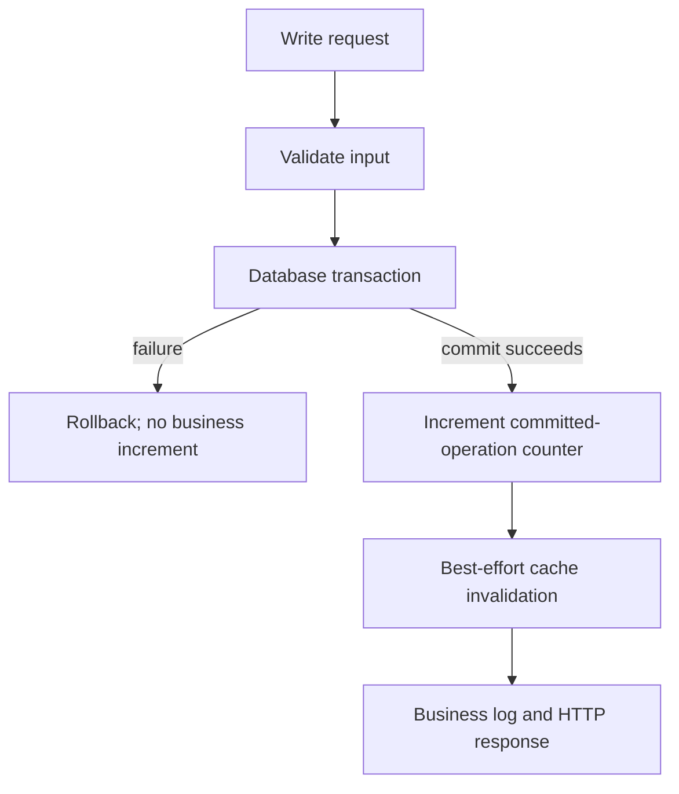

# Lab 09: Metric Design, Business Metrics, and Cardinality

## Purpose and Scope

> **Primary Objective:** Implement a counter at the committed item-write boundary, compare application and dependency measurements, and quantify bounded versus per-event label cardinality.

HTTP outcomes do not answer every business question. A POST may commit before the client receives a response; a failed transaction must not increment a committed-write counter. This lab makes that difference measurable.

You will add one bounded business instrument, test its transaction boundary, and run an intentionally unsafe label design only in a disposable in-memory registry. The running application keeps bounded labels throughout.

## 1. Inherited State and Scope

Continue from Lab 8 with the completion observer, explicit server-error subset, negotiated metrics and event logging. Keep only app, PostgreSQL and Redis running.

This lab covers metric contracts, commit semantics, label dimensions and series cost. It does not add exporter infrastructure, arbitrary customer analytics, a durable accounting ledger or a new business feature.

## 2. Start and Record the Existing Design

```bash
source lab-notes/session.sh
source lab-notes/evidence.sh
source lab-notes/raw-metrics.sh
baseline_check
start_lab 09
snapshot "$LAB_DIR/starting.json"
rg -n 'Counter|Gauge|Histogram|labels\(' app/app/metrics.py app/app/api.py
```

Read the post-commit boundary in each write handler. Do not put the new increment after `session.add` or `flush`; those operations can still be rolled back.

## 3. Measurable Learning Objectives

Demonstrate a business counter that follows successful transaction exits; distinguish committed operations from current item count; keep validation and rolled-back operations out of that counter; and show how a small number of unbounded labels multiplies stored series.

Also compare application-observed dependency state with actual server telemetry, and identify the information intentionally absent from a low-cardinality metric.

## 4. Write the Instrument Contract First

| Design decision | Chosen contract |
|---|---|
| Name | `application_items_mutations_total` |
| Type | Counter |
| Unit | Committed item mutation observed by this process |
| Labels | `operation` with exactly `create`, `update`, `delete` |
| Increment boundary | After successful transaction-context exit, before best-effort cache invalidation |
| Excluded | Validation rejection, missing item, failed commit, reads |
| Initial state | Each of the three known operation children initialized to zero |
| Lifecycle | Process-local; resets on restart |

A repeated successful PUT counts as another operation even if it writes the same values. The counter measures successful mutation operations, not distinct items or net row growth. It is not a billing ledger or an exactly-once audit count.

Label names should describe bounded operational dimensions. Request IDs, item IDs, event IDs, trace IDs and raw URLs remain outside this instrument.

## 5. Events, Commits and Failure Windows



A crash between commit and increment can lose a metric observation. A crash after increment and before response can leave a committed operation whose caller saw a failure. These windows explain why neither HTTP counts nor process counters can replace authoritative business state.

A counter observation and a log record can describe the same operation while carrying different information. Do not assign event IDs as labels to make the counter resemble an event store.

## 6. Implement the Business Counter

The patch initializes three bounded children and inserts each increment at its actual transaction boundary. It is deliberately scoped to the known handler structure.

```bash
python3 - <<'PYTHON'
from pathlib import Path
path = Path("app/app/metrics.py")
source = path.read_text()
if "application_items_mutations_total" not in source:
    marker = '        self.dependency_up = Gauge(\n'
    assert source.count(marker) == 1
    source = source.replace(marker,
        '        self.item_mutations = Counter(\n'
        '            "application_items_mutations_total",\n'
        '            "Item commits observed by this application process",\n'
        '            ["operation"],\n'
        '            registry=self.registry,\n'
        '        )\n'
        '        for operation in ("create", "update", "delete"):\n'
        '            self.item_mutations.labels(operation).inc(0)\n' + marker, 1)
path.write_text(source)
path = Path("app/app/api.py")
source = path.read_text()
changes = [
    ('        await cache.invalidate(result.id)', 'create'),
    ('        await cache.invalidate(item_id)\n        logger.info("item_updated")', 'update'),
    ('        await cache.invalidate(item_id)\n        logger.info("item_deleted")', 'delete'),
]
for old, operation in changes:
    line = f'        database.metrics.item_mutations.labels("{operation}").inc()\n'
    if line in source:
        continue
    assert source.count(old) == 1, f"Review the {operation} transaction boundary"
    source = source.replace(old, line + old, 1)
path.write_text(source)
print("Business counters observe successful transaction exits, before cache invalidation")
PYTHON
```

This does not query `COUNT(*)` during every scrape or hold a database connection while serving `/metrics`. A current inventory gauge would require a separately defined refresh/query strategy; that is a different contract.

## 7. Test Commit Semantics

Create `app/tests/test_business_metrics.py`. The rollback case injects a commit failure and proves no successful-create observation is recorded.

```bash
cat > app/tests/test_business_metrics.py <<'PYTHON'
from sqlalchemy import event
from sqlalchemy.exc import OperationalError


def mutations(app, operation):
    return app.state.metrics.registry.get_sample_value("application_items_mutations_total", {"operation": operation})


async def test_business_counts_follow_successful_writes(client, app):
    assert (await client.post("/api/v1/items", json={"name": ""})).status_code == 422
    assert mutations(app, "create") == 0
    response = await client.post("/api/v1/items", json={"name": "business subject", "price": "1.00"})
    assert response.status_code == 201
    path = f"/api/v1/items/{response.json()['id']}"
    assert mutations(app, "create") == 1
    for _ in range(3):
        assert (await client.get(path)).status_code == 200
    assert mutations(app, "create") == 1
    assert (await client.put(path, json={"name": "updated", "price": "2.00"})).status_code == 200
    assert mutations(app, "update") == 1
    assert (await client.delete(path)).status_code == 204
    assert (await client.delete(path)).status_code == 404
    assert mutations(app, "delete") == 1


async def test_failed_commit_is_not_counted(client, app):
    session_class = app.state.database.sessions.class_.sync_session_class

    def fail_commit(session):
        raise OperationalError("test", {}, Exception("controlled failure"))

    event.listen(session_class, "before_commit", fail_commit, once=True)
    try:
        response = await client.post("/api/v1/items", json={"name": "must roll back", "price": "1.00"})
        assert response.status_code == 503
        assert mutations(app, "create") == 0
    finally:
        event.remove(session_class, "before_commit", fail_commit)
PYTHON
```

```bash
make test
make lint
git diff --check
record_change "install_committed_item_counter" planned
dc up -d --build --no-deps app
baseline_check
record_change "install_committed_item_counter" completed
```

The tests also prove that cache-backed reads do not count as mutations and that a second DELETE returning 404 does not count as another successful delete.

## 8. Inspect Known Zero and Bounded Labels

```bash
snapshot "$LAB_DIR/zero.json"
jq '[.[] | select(.name == "application_items_mutations_total")]' "$LAB_DIR/zero.json"
```

Expected after the fresh process starts: three samples with operation values create/update/delete and numeric zero. The client library can also expose a `_created` sample per child; that is a separate series name with the same bounded dimension.

This explicit initialization makes a known operation with zero commits distinguishable from a missing or incorrectly named instrument. It does not initialize every possible route/status combination or any user-derived value.

## 9. Predict a Controlled Business Sequence

Predict both HTTP events and committed-operation counts for:

1. an invalid POST;
2. a valid POST;
3. three individual GETs;
4. a valid PUT;
5. a successful DELETE;
6. another DELETE of the same UUID.

Which store should contain the item at the end? Which counters should remain nonzero after the row is gone? Write the answers before running.

## 10. Execute the Sequence and Compare the Source of Truth

```bash
snapshot "$LAB_DIR/before.json"
status=$(api -sS -o "$LAB_DIR/rejected.json" -w '%{http_code}' \
  -H 'Content-Type: application/json' -d '{"name":"","price":"-9"}' "$APP_URL/api/v1/items")
test "$status" = 422
api -fsS -H 'Content-Type: application/json' \
  -d '{"name":"Lab 09 business subject","price":"9.00"}' \
  "$APP_URL/api/v1/items" -o "$LAB_DIR/item.json"
ITEM_ID=$(jq -er '.id' "$LAB_DIR/item.json")
for n in 1 2 3; do api -fsS "$APP_URL/api/v1/items/$ITEM_ID" >/dev/null; done
api -fsS -X PUT -H 'Content-Type: application/json' \
  -d '{"name":"Lab 09 updated","price":"9.50"}' "$APP_URL/api/v1/items/$ITEM_ID" >/dev/null
api -fsS -X DELETE "$APP_URL/api/v1/items/$ITEM_ID" -o /dev/null
status=$(api -sS -X DELETE -o "$LAB_DIR/second-delete.json" -w '%{http_code}' \
  "$APP_URL/api/v1/items/$ITEM_ID")
test "$status" = 404
snapshot "$LAB_DIR/after.json"
dbsql -v item_id="$ITEM_ID" <<'SQL'
SELECT count(*) FROM items WHERE id = :'item_id'::uuid;
SQL
```

Expected final database count for this UUID: zero. The create/update/delete operations still happened; their cumulative counters should not return to zero merely because the row no longer exists.

## 11. Verify the Business and HTTP Deltas

```bash
python3 - "$LAB_DIR/before.json" "$LAB_DIR/after.json" <<'PYTHON'
import json, sys
before, after = [json.load(open(path)) for path in sys.argv[1:]]
def value(samples, name, labels):
    return sum(s["value"] for s in samples if s["name"] == name
               and all(s["labels"].get(k) == v for k,v in labels.items()))
for operation in ("create", "update", "delete"):
    labels = {"operation": operation}
    delta = value(after,"application_items_mutations_total",labels)-value(before,"application_items_mutations_total",labels)
    print(operation, delta)
    assert delta == 1
request_delta = value(after,"application_http_requests_total",{})-value(before,"application_http_requests_total",{})
assert request_delta == 8
print("http_completions=",request_delta,"committed_mutations=3")
PYTHON
capture_app_logs
```

There are eight HTTP completions but only three successful mutations. The invalid POST, reads and missing second DELETE explain the difference. Logs provide event/request context; SQL verifies current item state; the counter aggregates the successful-operation history observed by this worker.

## 12. Design Application and Dependency Metrics Together

| Question | Useful instrument | What it does not establish |
|---|---|---|
| Can the app currently reach PostgreSQL? | `application_dependency_up{dependency="postgres"}` | All database server health/capacity |
| Is Redis failing in this client's path? | `application_redis_errors_total` | Every Redis client's experience |
| Are application reads using cache? | App hit/miss counters | Redis global hit ratio or business-data freshness |
| Are writes committing? | New business operation counter | Current row inventory or durable accounting |
| Is the PostgreSQL server accumulating locks/connections? | Server/exporter metrics in Lab 15 | This app's HTTP outcome without correlation |
| Is the host under CPU/memory/disk pressure? | Node Exporter in Lab 14 | A per-request causal explanation by itself |

A miss includes Redis errors and deliberate invalidation-failure bypass in this implementation. Name and document that meaning; do not label it a pure key-absence counter.

Avoid adding a database query to every scrape just to answer an inventory question. Scraping must remain cheap and should not amplify a dependency outage.

## 13. Calculate Cardinality Before Adding a Label

For one counter, potential label combinations grow approximately as the product of the number of values in each independent label dimension. Only combinations actually instantiated create series, but a per-request identifier can keep introducing new ones.

For this new business counter, three operation values produce three `_total` series per target. The Python client also exposes creation-time series. For a classic histogram, each label combination expands into every bucket plus count/sum and possibly creation time.

The request-duration histogram has 11 finite boundaries plus `+Inf`. That is 12 bucket series, one count and one sum per method/route, plus the client's optional creation-time series. A new unbounded label multiplies the entire family, not one convenient number.

Use logs for event IDs and request IDs. Do not move them into labels because a metric appears easier to search.

## 14. Run a Bounded Bad-Design Experiment Off the Scrape Path

This program creates disposable registries in a separate Python process. None is attached to the FastAPI `/metrics` registry or ingested by Prometheus.

```bash
dc exec -T app python - <<'PYTHON' | tee "$LAB_DIR/cardinality-experiment.txt"
from prometheus_client import CollectorRegistry, Counter, Histogram

def count_samples(registry):
    return sum(len(family.samples) for family in registry.collect())

for n in (1, 10, 100):
    bad_registry = CollectorRegistry()
    bad = Counter("lab_request_events_total", "Disposable cardinality demonstration", ["event_id"], registry=bad_registry)
    bounded_registry = CollectorRegistry()
    bounded = Counter("lab_requests_total", "Bounded comparison", ["route"], registry=bounded_registry)
    for index in range(n):
        bad.labels(f"synthetic-event-{index}").inc()
        bounded.labels("/api/v1/items/{item_id}").inc()
    print(f"events={n} per_event_samples={count_samples(bad_registry)} bounded_samples={count_samples(bounded_registry)}")

registry = CollectorRegistry()
histogram = Histogram("lab_duration_seconds", "Disposable histogram", ["route"], buckets=(0.01,0.1,1), registry=registry)
histogram.labels("/example").observe(0.05)
print("histogram_samples=",count_samples(registry))
print("sample_names=",sorted({s.name for f in registry.collect() for s in f.samples}))
PYTHON
```

With the default creation-time samples, the bad counter has 2, 20 and 200 exposed samples, while the bounded counter has two in all three cases. The small histogram has four buckets including `+Inf`, count, sum and creation time: seven samples.

If creation-time emission has been explicitly disabled, totals differ; inspect names instead of declaring the client broken. The trend, not one hardcoded multiplication factor, is the design evidence.

## 15. Prove Real Item IDs Do Not Expand Route Dimensions

```bash
for n in {1..12}; do
  api -sS -o /dev/null "$APP_URL/api/v1/items/$(new_uuid)"
done
snapshot "$LAB_DIR/label-audit.json"
python3 - "$LAB_DIR/label-audit.json" <<'PYTHON'
import json, re, sys
samples=json.load(open(sys.argv[1]))
for sample in samples:
    if not sample["name"].startswith("application_"):
        continue
    assert not ({"event_id","request_id","item_id","trace_id","user_id","url"} & set(sample["labels"]))
    assert not any(re.search(r"[0-9a-f]{8}-[0-9a-f-]{27}",str(value)) for value in sample["labels"].values())
print("No per-event or UUID dimensions in application samples")
print(sorted({s["labels"].get("route") for s in samples if "route" in s["labels"]}))
PYTHON
```

The requests have twelve distinct UUIDs and can produce twelve distinct event records. They still use one normalized item-route dimension. A large number of request events need not imply a large number of series.

## 16. Review Information You Deliberately Did Not Collect

The business counter cannot answer which item changed, who changed it, what its previous value was, or whether a particular customer received the response. Adding each answer as a label would change the storage and privacy problem rather than solve it safely.

A low-cardinality counter is appropriate for rates and trends. Logs, trace attributes with suitable controls, and authoritative transactional records answer different questions. An authenticated audit system would need additional application and retention design; this repository has no user identity boundary yet.

Also avoid cheap-looking labels such as exception messages, SQL text and configuration hashes that change continuously. Write down the expected value set and owner of every proposed dimension.

## 17. Recovery and State Verification

```bash
baseline_check
CHECKPOINT_ID=$(cat lab-notes/checkpoint-item-id.txt)
api -fsS "$APP_URL/api/v1/items/$CHECKPOINT_ID" | jq '{id,name,price}'
api -fsS "$APP_URL/metrics" > "$LAB_DIR/final.prom"
if rg '^lab_request_events_total|^lab_duration_seconds' "$LAB_DIR/final.prom"; then
  echo 'Disposable demonstration leaked into the app registry' >&2
  false
fi
make test
```

The synthetic high-cardinality registry exited with its diagnostic process. The real app retains only the bounded committed-operation counter. Your exercise item was already deleted; preserve the course checkpoint.

## 18. Troubleshooting Runbook

| Symptom | Investigation |
|---|---|
| Counter increments for failed commits | Move the observation after successful transaction-context exit and run the failure regression |
| Business counts equal current row count only temporarily | They measure different things; delete/update history does not describe inventory |
| Invalid POST increments create | Check whether increment is before validation/transaction completion |
| Reads increment mutations | Ensure instrumentation is in write handlers only |
| More than three business operation labels | Review every caller of `.item_mutations.labels`; operation must come from fixed code values |
| Cardinality experiment gives different totals | Inspect `_created` behavior and emitted sample names before comparing |
| High-cardinality metric appears on real `/metrics` | Remove it from the app registry, rebuild, and record the correction; the diagnostic process must be separate |
| Counter resets after image rebuild | Expected lifecycle; Lab 12 teaches reset-aware calculations |
| Hit/miss ratio disagrees with server INFO | The app and server use different observation scopes; Lab 15 makes the distinction measurable |

Do not use a high-cardinality label to compensate for an undefined metric contract. Define the question and data owner first.

## 19. Knowledge Check

1. Why is flush too early for a committed-operation metric?
2. Does create minus delete always equal current inventory?
3. Why initialize the three known operation children?
4. Can a committed operation lack a counter observation?
5. Why does a histogram amplify label cardinality?
6. Is an event ID safer than an item ID as a metric label?
7. Does application_dependency_up replace a database exporter?
8. Why can app cache misses exceed Redis keyspace misses?
9. Where should a specific request ID be investigated?
10. Does the diagnostic cardinality registry affect the live endpoint?

### Answer Guide

1. The transaction can still fail or roll back.
2. No; counters reset and may miss commit observations, while history/inventory scopes differ.
3. To expose known zero values for a fixed domain.
4. Yes, a crash can occur between commit and increment or before scraping.
5. Each label combination creates bucket, count, sum and possibly creation-time series.
6. No; both can have unbounded value sets.
7. No; it is this client/process perspective, not server resource telemetry.
8. App misses include bypass/errors, which may never issue a Redis GET.
9. In retained logs or traces under bounded service/time scope.
10. No; it exists only in a separate short-lived process.

## 20. Professional Scenario Exercise

A dashboard team requests labels for item ID, request ID, event ID and customer email on the business counter. Write a response that estimates growth, explains privacy and retention consequences, proposes bounded alternatives, and identifies where per-operation investigation should happen.

## 21. Lab Notebook Template

Create a notebook in the evidence directory for this run:

```bash
test -e "$LAB_DIR/notebook.md" || printf '# Lab 09 Evidence\n' > "$LAB_DIR/notebook.md"
```

Use these headings and fill them with your predictions, commands, observed results and conclusions:

```markdown
# Lab 09 Evidence

## Business question and metric contract
## Commit-boundary code review
## Regression evidence
## Predicted and actual operation counts
## HTTP/log/SQL comparison
## Application versus dependency metric scope
## Cardinality calculation
## Disposable bad-design experiment
## Live label audit
## Recovery proof
## Proposed-label review and scenario
```

## 22. Observable Completion Criteria

- [ ] The counter contract names its commit boundary, units, dimensions and lifecycle.
- [ ] Create/update/delete each have one known bounded child.
- [ ] Validation, reads, missing deletes and failed commits do not inflate business counts.
- [ ] Eight HTTP events are distinguished from three committed operations.
- [ ] SQL confirms final row state independently.
- [ ] The disposable cardinality experiment stays outside the live registry.
- [ ] Histogram series expansion is calculated correctly.
- [ ] Actual UUID requests do not become metric label values.
- [ ] The checkpoint survives and only baseline services run.

## 23. Production Implications

Metric design constrains the reliability and cost of every later query. Bounded dimensions, explicit units and tested update boundaries allow useful aggregation; unbounded identifiers convert the metric system into an expensive and incomplete event store. Process-local commit counters are useful operational signals, but durable business accounting requires transactional records and reconciliation.

## 24. End State and Transition

Keep the business counter and tests. The application now exposes validated request, dependency and business measurements, but no Prometheus service is running yet.

Next: [Lab 10 — Prometheus Discovery and Scrape Lifecycle](Lab-10.md). You will add the scraper, observe its own evidence about targets, and distinguish missing discovery, failed scrapes and application dependency failure.
