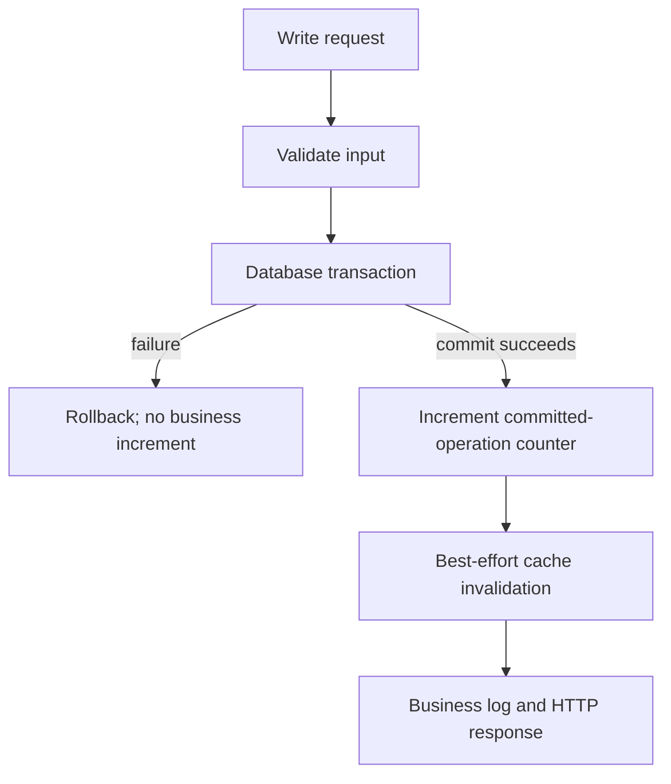

# Lab 09: Metric Design, Business Metrics, and Cardinality

## 1. Purpose and Learning Outcomes

You will count successful item changes and compare that number with HTTP requests and rows currently in PostgreSQL. These are different quantities: a read is a request but not a mutation, and a successful delete remains part of history after the row is gone. A separate temporary experiment shows how unlimited label values make even a simple metric grow rapidly.

> **Primary Objective:** Count item mutations after successful database commit, compare the app's measurements with dependency observations, and calculate how fixed labels and per-event labels create different numbers of series.

HTTP outcomes do not answer every business question. POST can commit before the client receives its reply, while a failed transaction must not count as a successful mutation. This lab makes that distinction visible in metrics.

Add one business instrument with fixed label values and test its commit boundary. Demonstrate the bad label design only in a separate temporary registry in memory. Do not expose it from the running app.

## 2. Starting Point and Lab Map

Open the complete application repository before using this guide. Unless a step says otherwise, run commands in Bash from the repository's top-level folder. Follow the starting checks in order because later commands depend on the helper functions and running services they prepare.

Read each explanation before running its commands. Run one complete code block, check the result, and then continue. In your notebook, save the commands, what happened, why you think it happened, and anything that differed from the expected result.

### Key Terms

| **Term**        | **Explanation**                                                                                   |
| --------------- | ------------------------------------------------------------------------------------------------- |
| Business metric | A measurement of a clearly defined business action, such as a successfully committed item change. |
| Cardinality     | How many distinct time series are created by metric names and combinations of label values.       |
| Bounded label   | A label whose possible values are deliberately limited, such as create, update, and delete.       |

### Lab Map

The arrows show how the parts connect and where a request can take different paths. Use this map to understand the design. It is not a recording of a request that actually ran.


```mermaid
flowchart TD
    Request["Write request"] --> Validate["Validate input"]
    Validate --> Transaction["Database transaction"]
    Transaction -->|"failure"| Rollback["Rollback; no business increment"]
    Transaction -->|"commit succeeds"| Counter["Increment committed-operation counter"]
    Counter --> Cache["Best-effort cache invalidation"]
    Cache --> Log["Business log and HTTP response"]
```

## 3. Guided Walkthrough

### Step 01. Inherited State and Scope

**What You Are Doing:** Keep the tested HTTP observer. Compare its request-level totals with the new counter of successfully committed business changes.

**Practical Walkthrough:** Verify Lab 08's observer first. It counts completed requests, while the new counter counts successful mutations. Reads, rejected input, and writes that fail before commit can add HTTP completions without adding a committed business operation.

Treat these as different populations from the start. A read or failed write may increase HTTP count only. The RED observer gives you an independent request-level view to compare with the business-operation metric.

Continue from Lab 8 with the completion observer, explicit server-error subset, negotiated metrics and event logging. Keep only app, PostgreSQL and Redis running.

This lab defines metric rules, commit meaning, labels, and series growth. It does not add exporters, customer analytics, permanent accounting records, or another business feature.

**Understanding the Result:** The business counter adds another view alongside HTTP metrics. It should neither replace them nor be forced to have the same total.

### Step 02. Start and Record the Existing Design

**What You Are Doing:** Find the successful transaction exit in each write handler. Increment there, after the database confirms the mutation, rather than when the code merely attempts it.

**Practical Walkthrough:** Follow create, update, and delete through their transaction blocks. An object can be created or changed in Python before the transaction commits. Identify the point where successful exit is known and inspect earlier failure paths before adding the metric.

Place the increment after the transaction block succeeds, not after constructing the object or flushing SQL. Review existing source changes before the guarded patch so you do not confuse a metrics edit with a change to persistence behavior.

```bash
source lab-notes/session.sh
source lab-notes/evidence.sh
source lab-notes/raw-metrics.sh
baseline_check
start_lab 09
snapshot "$LAB_DIR/starting.json"
rg -n 'Counter|Gauge|Histogram|labels\(' app/app/metrics.py app/app/api.py
```

Read each handler's post-commit point. `session.add` and `flush` are too early for this counter because the transaction can still roll back afterward.

**Understanding the Result:** The increment's location defines the metric. A convenient line inside the transaction does not prove committed success.

### Step 03. Measurable Learning Objectives

**What You Are Doing:** Separate operation history, HTTP outcomes, and current row count. The same item contributes differently to each one.

**Practical Walkthrough:** Keep three questions in your notebook: how many requests completed, how many successful mutations were observed, and how many rows exist now? The sequence changes each quantity differently. Assign the right evidence source to each question.

Predict the create, update, and delete history separately from final inventory. Those actions can produce three mutations while leaving no row. Use HTTP captures for responses, metrics for observed totals, and SQL for present stored state.

Show that the counter follows successful transaction exits, excludes validation failures and rollbacks, and differs from current item inventory. Then calculate how adding label values can multiply the number of series.

Also compare the app's view of a dependency with server-level measurements and identify which individual details a metric with limited labels intentionally leaves out.

**Understanding the Result:** Deleting a row does not erase the earlier create or update events. Current inventory alone cannot reconstruct that history.

### Step 04. Write the Instrument Contract First

**What You Are Doing:** Define the name, labels, unit, and increment point before implementation. The metric's business meaning should be a deliberate choice.

**Practical Walkthrough:** Read the proposed contract as something a future query author must understand. Limit operation values and initialize those known categories. Count committed actions without attaching every item or request ID to the series.

Confirm that the operation values form a fixed set. Create those children so an operation with no observations is exposed as zero. Item and request IDs would introduce new values continually, so keep them outside the metric labels.

| **Design Decision** | **Chosen Contract**                                                                        |
| ------------------- | ------------------------------------------------------------------------------------------ |
| Name                | `application_items_mutations_total`                                                        |
| Type                | Counter                                                                                    |
| Unit                | One committed item mutation observed by this process                                       |
| Labels              | `operation` with exactly `create`, `update`, `delete`                                      |
| Increment boundary  | After the transaction block exits successfully, before the attempt to invalidate the cache |
| Excluded            | Rejected input, missing items, failed commits, and reads                                   |
| Initial state       | All three fixed operation categories exist with value zero                                 |
| Lifecycle           | Held in this process's memory and reset when the process restarts                          |

A successful repeated PUT counts as another operation even if its fields are unchanged. This metric counts successful mutations, not unique items or net row growth. It is not a billing ledger or a guarantee that every real action is counted exactly once forever.

Use labels for limited operational categories. Keep request IDs, item IDs, event IDs, trace IDs, and raw URLs out of this instrument.

**Understanding the Result:** A useful contract says both when the count increases and when it stays unchanged. Fixed label values make the number of series predictable.

### Step 05. Events, Commits and Failure Windows

**What You Are Doing:** Examine crashes before and after commit and increment. The in-memory counter can miss a committed action, so it cannot be the authoritative permanent business record.

**Practical Walkthrough:** Consider a crash before commit, between commit and increment, and after increment. PostgreSQL data and the app's in-memory count do not always survive together. A later scrape cannot make those two separate actions atomic, meaning guaranteed to happen together or not at all.

Mark commit and increment as separate steps and ask what remains after a crash between them. The counter is useful operational evidence, but it cannot guarantee a durable record of every committed action.

The lab map in Section 2 shows this relationship.

A crash after commit but before increment can leave the database change without a metric observation. A crash after increment but before response may leave the caller unsure of a committed write. HTTP and process counters therefore cannot replace authoritative business state.

A counter update and a log record may describe the same operation but preserve different information. Putting event IDs into labels does not safely turn the counter into an event store.

**Understanding the Result:** PostgreSQL is authoritative for committed state. Use the counter as an operational signal while acknowledging these crash and observation gaps.

### Step 06. Implement the Business Counter

**What You Are Doing:** Create the three allowed operation children and increment each only after successful commit. This keeps both meaning and label growth explicit.

**Practical Walkthrough:** Register the counter once, initialize its fixed categories, and place increments after successful create, update, and delete transactions. Do not use unconditional cleanup, which also runs after failures, or add another increment in a helper already covered by the handler.

Review registration and every increment site after patching. Confirm one definition and one increment per successful mutation path. Moving the count into `finally` would incorrectly include failed work too.

The guarded patch targets the known handler structure. It initializes three bounded children and adds each increment at its actual post-transaction point.

```bash
python3 - <<'PYTHON'
from pathlib import Path
path = Path("app/app/metrics.py")
source = path.read_text()
if "application_items_mutations_total" not in source:
    marker = '        self.dependency_up = Gauge(\n'
    assert source.count(marker) == 1
    source = source.replace(marker,
        '        self.item_mutations = Counter(\n'
        '            "application_items_mutations_total",\n'
        '            "Item commits observed by this application process",\n'
        '            ["operation"],\n'
        '            registry=self.registry,\n'
        '        )\n'
        '        for operation in ("create", "update", "delete"):\n'
        '            self.item_mutations.labels(operation).inc(0)\n' + marker, 1)
path.write_text(source)
path = Path("app/app/api.py")
source = path.read_text()
changes = [
    ('        await cache.invalidate(result.id)', 'create'),
    ('        await cache.invalidate(item_id)\n        logger.info("item_updated")', 'update'),
    ('        await cache.invalidate(item_id)\n        logger.info("item_deleted")', 'delete'),
]
for old, operation in changes:
    line = f'        database.metrics.item_mutations.labels("{operation}").inc()\n'
    if line in source:
        continue
    assert source.count(old) == 1, f"Review the {operation} transaction boundary"
    source = source.replace(old, line + old, 1)
path.write_text(source)
print("Business counters observe successful transaction exits, before cache invalidation")
PYTHON
```

This counter does not run `COUNT(*)` at scrape time or hold a database connection while serving `/metrics`. A gauge of current inventory would need its own rules for refreshing and querying data; that is a different measurement.

**Understanding the Result:** Supported operations can appear immediately with zero. Each successful write path should have one clear increment point.

### Step 07. Test Commit Semantics

**What You Are Doing:** Test successful writes and the cases that must leave the counter unchanged. A write that did not commit must not appear as a successful mutation.

**Practical Walkthrough:** Read the success and failure cases. A handler may create objects and flush SQL before commit fails, so an attempted write is not enough. The test must inspect the resulting metric as well as the response.

Check both positive increments and unchanged counts for excluded cases. Run validation and deployment, then start new snapshots after the process restarts. The old image's cumulative totals are not the new process's baseline.

Create `app/tests/test_business_metrics.py`. Its rollback test deliberately fails commit and verifies that successful-create count does not increase.

```bash
cat > app/tests/test_business_metrics.py <<'PYTHON'
from sqlalchemy import event
from sqlalchemy.exc import OperationalError


def mutations(app, operation):
    return app.state.metrics.registry.get_sample_value("application_items_mutations_total", {"operation": operation})


async def test_business_counts_follow_successful_writes(client, app):
    assert (await client.post("/api/v1/items", json={"name": ""})).status_code == 422
    assert mutations(app, "create") == 0
    response = await client.post("/api/v1/items", json={"name": "business subject", "price": "1.00"})
    assert response.status_code == 201
    path = f"/api/v1/items/{response.json()['id']}"
    assert mutations(app, "create") == 1
    for _ in range(3):
        assert (await client.get(path)).status_code == 200
    assert mutations(app, "create") == 1
    assert (await client.put(path, json={"name": "updated", "price": "2.00"})).status_code == 200
    assert mutations(app, "update") == 1
    assert (await client.delete(path)).status_code == 204
    assert (await client.delete(path)).status_code == 404
    assert mutations(app, "delete") == 1


async def test_failed_commit_is_not_counted(client, app):
    session_class = app.state.database.sessions.class_.sync_session_class

    def fail_commit(session):
        raise OperationalError("test", {}, Exception("controlled failure"))

    event.listen(session_class, "before_commit", fail_commit, once=True)
    try:
        response = await client.post("/api/v1/items", json={"name": "must roll back", "price": "1.00"})
        assert response.status_code == 503
        assert mutations(app, "create") == 0
    finally:
        event.remove(session_class, "before_commit", fail_commit)
PYTHON
```

**Command Note:** `<<'PYTHON'` writes the supplied code literally through the closing `PYTHON` marker. Quotes prevent Bash from expanding `$variables`; writing and execution happen separately.

```bash
make test
make lint
git diff --check
record_change "install_committed_item_counter" planned
dc up -d --build --no-deps app
baseline_check
record_change "install_committed_item_counter" completed
```

The tests also check that cache-backed reads are not mutations and that a second DELETE returning 404 is not another successful delete.

**Understanding the Result:** Excluding unsuccessful work is part of the contract, not just the absence of a feature. The tests explicitly verify those non-increments.

### Step 08. Inspect Known Zero and Bounded Labels

**What You Are Doing:** Inspect the initialized operation children in the rebuilt process. A known category can exist with zero before any matching mutation occurs.

**Practical Walkthrough:** Before the main workload, inspect the new counter and its three labels. Explicit initialization makes supported-but-unused operations visible. That is different from a misspelled label or a missing instrument.

Check the exact sample name and all operation values. Establish their presence before measuring activity. Later, distinguish an initialized zero from a selector that found nothing.

```bash
snapshot "$LAB_DIR/zero.json"
jq '[.[] | select(.name == "application_items_mutations_total")]' "$LAB_DIR/zero.json"
```

Expect three zero-valued samples after fresh startup, one each for create, update, and delete. The client may also expose a `_created` sample per child under a separate series name with the same operation label.

Only the three known categories are initialized. This does not create every possible HTTP combination or arbitrary client-derived values. Its purpose is to distinguish an available zero count from an absent or incorrectly named metric.

**Understanding the Result:** Zero is meaningful because the sample exists. Continue checking presence separately from value, as in Lab 7.

### Step 09. Predict a Controlled Business Sequence

**What You Are Doing:** Predict every action's HTTP and business counts before running the sequence. Some requests add no mutation, and the final item count can still be zero.

**Practical Walkthrough:** List expected increments for reads, invalid input, writes, and repeated deletion. Also predict the final SQL state. These three views prevent confusing today's inventory with the history of successful actions.

Write a small per-action record of your predictions. It will explain why HTTP completions, committed mutations, and current rows differ even when the instruments all work correctly.

Predict both HTTP events and committed-operation counts for:

1. an invalid POST;
2. a valid POST;
3. three individual GETs;
4. a valid PUT;
5. a successful DELETE;
6. another DELETE of the same UUID.

Predict whether the item should remain in either store at the end and which historical counters should still be nonzero. Write the explanation before execution.

**Understanding the Result:** Unequal totals are expected when each counts different work. Use the action-by-action prediction to account for the difference.

### Step 10. Execute the Sequence and Compare the Source of Truth

**What You Are Doing:** Run the sequence and inspect the final PostgreSQL row state. Deleting the item changes current inventory without undoing the earlier successful operations.

**Practical Walkthrough:** Use the created UUID consistently and save every response. The first DELETE can succeed; another DELETE of the absent item cannot automatically count as a second committed deletion. Confirm the final state through the provided direct check.

Check statuses as you go. Final SQL answers whether the row exists now, while cumulative metrics describe previously observed successful actions. Use the actual second-delete response to explain why it is excluded from successful mutations.

```bash
snapshot "$LAB_DIR/before.json"
status=$(api -sS -o "$LAB_DIR/rejected.json" -w '%{http_code}' \
  -H 'Content-Type: application/json' -d '{"name":"","price":"-9"}' "$APP_URL/api/v1/items")
test "$status" = 422
api -fsS -H 'Content-Type: application/json' \
  -d '{"name":"Lab 09 business subject","price":"9.00"}' \
  "$APP_URL/api/v1/items" -o "$LAB_DIR/item.json"
ITEM_ID=$(jq -er '.id' "$LAB_DIR/item.json")
for n in 1 2 3; do api -fsS "$APP_URL/api/v1/items/$ITEM_ID" >/dev/null; done
api -fsS -X PUT -H 'Content-Type: application/json' \
  -d '{"name":"Lab 09 updated","price":"9.50"}' "$APP_URL/api/v1/items/$ITEM_ID" >/dev/null
api -fsS -X DELETE "$APP_URL/api/v1/items/$ITEM_ID" -o /dev/null
status=$(api -sS -X DELETE -o "$LAB_DIR/second-delete.json" -w '%{http_code}' \
  "$APP_URL/api/v1/items/$ITEM_ID")
test "$status" = 404
snapshot "$LAB_DIR/after.json"
dbsql -v item_id="$ITEM_ID" <<'SQL'
SELECT count(*) FROM items WHERE id = :'item_id'::uuid;
SQL
```

Expect database count zero for this UUID at the end. Create, update, and delete still happened, so their historical counters should not return to zero just because the row is absent.

**Understanding the Result:** No remaining row is compatible with three earlier successful mutations. Current state and operation history answer different questions.

### Step 11. Verify the Business and HTTP Deltas

**What You Are Doing:** Compare HTTP and business deltas with the request record. Explain the rejected inputs, reads, and repeated delete instead of expecting equal totals.

**Practical Walkthrough:** Take both sides of each delta within one app lifetime and select the intended labels. Match changes to the saved responses. If something is unexpected, inspect statuses, extra traffic, and increment placement rather than deciding the two totals should match.

Read selectors and compare every result with the observed sequence. Preserve surprises for diagnosis. A reset or unrelated traffic can change totals without proving the increment code is wrong.

```bash
python3 - "$LAB_DIR/before.json" "$LAB_DIR/after.json" <<'PYTHON'
import json, sys
before, after = [json.load(open(path)) for path in sys.argv[1:]]
def value(samples, name, labels):
    return sum(s["value"] for s in samples if s["name"] == name
               and all(s["labels"].get(k) == v for k,v in labels.items()))
for operation in ("create", "update", "delete"):
    labels = {"operation": operation}
    delta = value(after,"application_items_mutations_total",labels)-value(before,"application_items_mutations_total",labels)
    print(operation, delta)
    assert delta == 1
request_delta = value(after,"application_http_requests_total",{})-value(before,"application_http_requests_total",{})
assert request_delta == 8
print("http_completions=",request_delta,"committed_mutations=3")
PYTHON
capture_app_logs
```

Expect eight HTTP completions and three successful mutations. The invalid POST, three reads, and missing-item second DELETE account for the difference. Logs provide IDs and event details, SQL checks present state, and the counter totals successful operations seen by this worker.

**Understanding the Result:** Correct agreement means each instrument matches its own definition for the experiment. It does not mean both show the same number.

### Step 12. Design Application and Dependency Metrics Together

**What You Are Doing:** Choose the measurement source that matches your question. The app observes its own calls, while server metrics can include many clients and background tasks.

**Practical Walkthrough:** Use the table to identify the observer and population. A business mutation, a SQL statement, and a Redis command are different units. Before comparing totals, align the clients included, time window, and meaning of the operation.

For each question, ask who observes it and whose work contributes. Some background activity appears only in server measurements. Explain those scope differences before treating unequal numbers as a metrics defect.

| **Question**                                             | **Useful Instrument**                              | **What It Does Not Establish**                                |
| -------------------------------------------------------- | -------------------------------------------------- | ------------------------------------------------------------- |
| Can the app currently reach PostgreSQL?                  | `application_dependency_up{dependency="postgres"}` | Complete PostgreSQL server health or capacity                 |
| Is Redis failing in this client's path?                  | `application_redis_errors_total`                   | The experience of every other Redis client                    |
| Are application reads using cache?                       | App hit/miss counters                              | The server-wide hit ratio or whether returned data is current |
| Are writes committing?                                   | New business operation counter                     | Present row count or permanent accounting history             |
| Is the PostgreSQL server accumulating locks/connections? | Server/exporter metrics in Lab 15                  | This app's HTTP outcomes without further correlation          |
| Is the host under CPU/memory/disk pressure?              | Node Exporter in Lab 14                            | The cause of an individual request delay by itself            |

Here, the app's miss count includes Redis errors and intentional bypass after failed invalidation. Document that definition. It is not limited to Redis successfully looking up a key and finding it absent.

Do not add a database query to every scrape just to obtain inventory. Collection should remain inexpensive and avoid adding more database demand during a failure.

**Understanding the Result:** Different observers can report different correct totals. Establish their populations and timing before diagnosing incorrect measurement.

### Step 13. Calculate Cardinality Before Adding a Label

**What You Are Doing:** Estimate series growth before adding a label. Unique request IDs keep producing new combinations even if the metric name stays unchanged.

**Practical Walkthrough:** Multiply the possible value counts for independent labels. Then account for the samples produced by the metric type. A histogram emits several series per combination. Fixed operation names have a small limit; a new ID per event keeps increasing the possible total.

Separate possible combinations from those actually created. The product gives a potential bound when each label has a known finite set. A request-ID label has no small fixed set, so a tiny demonstration does not establish acceptable long-term cost.

For independent labels, multiply their value counts to estimate possible combinations. Only combinations that are instantiated create series, but unique per-request values can continually add more.

The three operation values create three `_total` series per target. The Python client may also expose creation-time series. For a classic histogram, each combination produces bucket series plus count and sum, and possibly creation time.

The request-duration histogram has 11 finite boundaries and `+Inf`: 12 buckets, one count, and one sum per method/route, plus optional creation time. Adding an unbounded label multiplies all those series for every new combination.

Keep event and request IDs in logs. Easier metric searching is not a reason to turn unlimited IDs into labels.

**Understanding the Result:** Cardinality counts distinct series, not just metric names. Estimate the label combinations and the type's expansion before adding another dimension.

### Step 14. Run a Bounded Bad-Design Experiment Off the Scrape Path

**What You Are Doing:** Compare fixed-category and per-event labels in temporary registries. Show the growth without connecting the bad design to the live metrics endpoint.

**Practical Walkthrough:** Run both designs in the separate diagnostic process. Compare sample counts as more unique events are added. Keeping them away from the app registry makes the exercise reversible and prevents later labs from inheriting the deliberately unsuitable metric.

Use the separate `CollectorRegistry` and read the reported counts. The bad design creates children for new IDs; the bounded design reuses its fixed category. Do not register these examples with the running app.

The program creates temporary registries in a separate Python process. They are not attached to FastAPI's `/metrics` registry, and Prometheus does not collect them.

```bash
dc exec -T app python - <<'PYTHON' | tee "$LAB_DIR/cardinality-experiment.txt"
from prometheus_client import CollectorRegistry, Counter, Histogram

def count_samples(registry):
    return sum(len(family.samples) for family in registry.collect())

for n in (1, 10, 100):
    bad_registry = CollectorRegistry()
    bad = Counter("lab_request_events_total", "Disposable cardinality demonstration", ["event_id"], registry=bad_registry)
    bounded_registry = CollectorRegistry()
    bounded = Counter("lab_requests_total", "Bounded comparison", ["route"], registry=bounded_registry)
    for index in range(n):
        bad.labels(f"synthetic-event-{index}").inc()
        bounded.labels("/api/v1/items/{item_id}").inc()
    print(f"events={n} per_event_samples={count_samples(bad_registry)} bounded_samples={count_samples(bounded_registry)}")

registry = CollectorRegistry()
histogram = Histogram("lab_duration_seconds", "Disposable histogram", ["route"], buckets=(0.01,0.1,1), registry=registry)
histogram.labels("/example").observe(0.05)
print("histogram_samples=",count_samples(registry))
print("sample_names=",sorted({s.name for f in registry.collect() for s in f.samples}))
PYTHON
```

**Command Note:** `exec -T` runs the diagnostic code in the existing container without an interactive terminal. The heredoc supplies the program through standard input using the image's dependencies.

With creation-time samples enabled by default, the bad counter exposes 2, 20, then 200 samples. The fixed-label counter exposes two each time. The small histogram has four buckets including `+Inf`, count, sum, and creation time, giving seven samples.

If creation-time output was disabled, the exact totals change. Inspect the sample names. The lesson is the growth pattern, not that one multiplication factor must hold under every client setting.

**Understanding the Result:** This small experiment illustrates why the design grows. It is not a production benchmark of storage capacity or scrape performance.

### Step 15. Prove Real Item IDs Do Not Expand Route Dimensions

**What You Are Doing:** Send requests for different item IDs and verify they share the same route template. Many events can belong to a small set of useful metric series.

**Practical Walkthrough:** Compare the concrete URLs with their route labels. They should differ by UUID in HTTP but share the template in metrics. Method and outcome remain useful without storing every resource identity in the series key.

After the distinct UUID requests, inspect route-label values, not only the number of samples. If raw IDs appear, fix normalization before adding Prometheus, where these combinations would become stored series.

```bash
for n in {1..12}; do
  api -sS -o /dev/null "$APP_URL/api/v1/items/$(new_uuid)"
done
snapshot "$LAB_DIR/label-audit.json"
python3 - "$LAB_DIR/label-audit.json" <<'PYTHON'
import json, re, sys
samples=json.load(open(sys.argv[1]))
for sample in samples:
    if not sample["name"].startswith("application_"):
        continue
    assert not ({"event_id","request_id","item_id","trace_id","user_id","url"} & set(sample["labels"]))
    assert not any(re.search(r"[0-9a-f]{8}-[0-9a-f-]{27}",str(value)) for value in sample["labels"].values())
print("No per-event or UUID dimensions in application samples")
print(sorted({s["labels"].get("route") for s in samples if "route" in s["labels"]}))
PYTHON
```

Twelve UUIDs can produce twelve event records while still using one item-route template. More events do not have to mean more label combinations.

**Understanding the Result:** Many requests can share one metric label set. Use suitable logs to investigate an individual request or item.

### Step 16. Review Information You Deliberately Did Not Collect

**What You Are Doing:** Name the questions this counter cannot answer. Individual identities and old values belong in appropriate detailed records, not automatic additions to metric labels.

**Practical Walkthrough:** List questions needing item identity, previous field values, or exact permanent history. Identify the source that could answer each. Aggregation intentionally drops details; adding them all as labels would defeat that design.

Choose one omitted detail and name the right evidence, such as a structured log or durable business-history record. Explain why the numeric total cannot reconstruct it later. This preserves useful small metrics while routing detailed investigations to suitable data.

The counter cannot identify which item changed, who changed it, its previous value, or whether a customer received the response. Adding those details as labels creates additional storage and privacy problems rather than safely filling the gap.

A counter with limited labels supports rates and trends. Logs, controlled trace attributes, and transactional records answer different questions. Authenticated auditing needs more application and retention design; this repository does not yet identify users.

Exception messages, SQL text, and changing configuration hashes can also create many label values. Write down the expected set and who controls it for every proposed label.

**Understanding the Result:** Summarizing is the counter's purpose. Document the detail it loses instead of treating every missing detail as a label to add.

### Step 17. Recovery and State Verification

**What You Are Doing:** Verify the real app registry and retained checkpoint. The bad-design registry should disappear when its diagnostic process exits.

**Practical Walkthrough:** Inspect the real endpoint after the temporary program finishes. Confirm the business metric has only approved operation values and the checkpoint still works. Keep the counter and tests for the later scraping labs.

Check label values and the checkpoint independently. No temporary metric should remain in the app registry. Preserve the approved implementation so later collection uses the same documented unit and commit point.

```bash
baseline_check
CHECKPOINT_ID=$(cat lab-notes/checkpoint-item-id.txt)
api -fsS "$APP_URL/api/v1/items/$CHECKPOINT_ID" | jq '{id,name,price}'
api -fsS "$APP_URL/metrics" > "$LAB_DIR/final.prom"
if rg '^lab_request_events_total|^lab_duration_seconds' "$LAB_DIR/final.prom"; then
  echo 'Disposable demonstration leaked into the app registry' >&2
  false
fi
make test
```

The artificial high-cardinality registry ended with its process. The live app retains only the approved bounded mutation counter. Your temporary item was already deleted; keep the course checkpoint.

**Understanding the Result:** The bad example leaves no live instrumentation behind. Readiness and the checkpoint check that the normal app still works.

## 4. Troubleshooting and Diagnosis

Begin with the first result that differed from your prediction. Save the exact error or symptom and identify which service or command produced it. Use the checks below, make the needed fix, and repeat the original check to confirm the problem is resolved.

### Troubleshooting Runbook

| **Symptom**                                              | **Investigation**                                                                                              |
| -------------------------------------------------------- | -------------------------------------------------------------------------------------------------------------- |
| Counter increments for failed commits                    | Place the increment after successful transaction exit and run the failed-commit test                           |
| Business counts equal current row count only temporarily | They measure history and present inventory respectively; updates and deletes make them differ                  |
| Invalid POST increments create                           | Check whether the increment runs before validation or successful commit                                        |
| Reads increment mutations                                | Keep mutation observations only in successful write handlers                                                   |
| More than three business operation labels                | Inspect every `.item_mutations.labels` caller; values must come from the fixed operation set                   |
| Cardinality experiment gives different totals            | Check emitted names and `_created` settings before comparing counts                                            |
| High-cardinality metric appears on real `/metrics`       | Remove it from the real registry, rebuild, and record the fix; the demonstration belongs in a separate process |
| Counter resets after image rebuild                       | Expected for process-local state; Lab 12 covers calculations that handle resets                                |
| Hit/miss ratio disagrees with server INFO                | The observers include different operations and clients; Lab 15 measures those differences                      |

Define the question and who owns its data before choosing labels. Adding unique identifiers cannot repair an unclear metric definition.

## 5. Review and Practice

Answer the questions in your own words before reading the answers. For the scenario, say what you would inspect and exactly what each result would tell you.

### Knowledge Check

1. Why is flush too early for a committed-operation metric?
2. Does create minus delete always equal current inventory?
3. Why initialize the three known operation children?
4. Can a committed operation lack a counter observation?
5. Why does a histogram amplify label cardinality?
6. Is an event ID safer than an item ID as a metric label?
7. Does application_dependency_up replace a database exporter?
8. Why can app cache misses exceed Redis keyspace misses?
9. Where should a specific request ID be investigated?
10. Does the diagnostic cardinality registry affect the live endpoint?

#### Answer Guide

1. Flush sends SQL, but the transaction can still fail or roll back.
2. No. Process counters reset and may miss observations, and their time and writer scope may differ from the current inventory.
3. To expose real zero values for each supported operation before any matching event occurs.
4. Yes. The process can crash after commit but before increment, or before a scrape stores the observation.
5. Every label combination produces several bucket series plus count, sum, and possibly creation time.
6. No. Both identifiers can keep introducing new unique values.
7. No. It reports this application's probe view, not all server resources or clients.
8. App misses include errors and bypass that may never issue a Redis GET.
9. In retained logs or traces, narrowed to the relevant service and time interval.
10. No. It lives only in a separate short-lived diagnostic process.

### Professional Scenario Exercise

A dashboard team asks for item ID, request ID, event ID, and customer email labels on the business counter. Estimate how combinations would grow, explain privacy and retention effects, suggest fixed-category alternatives, and identify the right records for individual-operation investigations.

## 6. Completion Checklist

Tick an item only when you can show its result or saved evidence. Finish the cleanup instructions before starting the next lab.

### Observable Completion Criteria

- [ ] The counter contract names its commit boundary, units, dimensions and lifecycle.
- [ ] Create/update/delete each have one known bounded child.
- [ ] Validation, reads, missing deletes and failed commits do not inflate business counts.
- [ ] Eight HTTP events are distinguished from three committed operations.
- [ ] SQL confirms final row state independently.
- [ ] The disposable cardinality experiment stays outside the live registry.
- [ ] Histogram series expansion is calculated correctly.
- [ ] Actual UUID requests do not become metric label values.
- [ ] The checkpoint survives and only baseline services run.

## 7. Production Context and Next Lab

### Production Implications

Metric definitions determine what later queries can mean and how much they cost. Fixed dimensions, clear units, and tested update points support useful aggregation. Unlimited IDs create an expensive and still incomplete event store. Use process-local commit counters for operations monitoring; durable business accounting needs transactional records and checks against those records.

### End State and Transition

Keep the business counter and tests. Request, dependency, and business measurements are now defined and tested, while Prometheus remains stopped.

Next: [Lab 10 — Prometheus Discovery and Scrape Lifecycle](Lab-10.md). Add the scraper and compare its target evidence, separating missing discovery, failed collection, and application dependency failure.