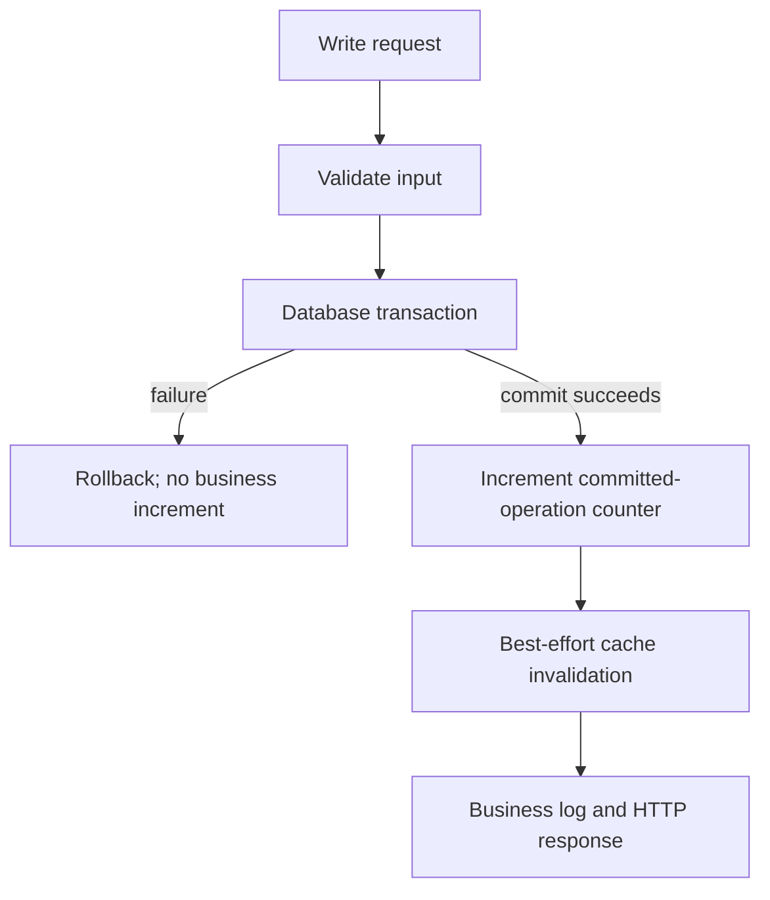

# Lab 09: Metric Design, Business Metrics, and Cardinality

## 1. Purpose and Learning Outcomes

**In Plain Language:** You will add a metric for successful item mutations and compare it with HTTP traffic and current database contents. These are different quantities: reading an item is an HTTP request, while deleting it is a business mutation that remains counted after the row is gone. A separate experiment shows how unbounded labels can make even a simple counter expensive.

> **Primary Objective:** Implement a counter at the committed item-write boundary, compare application and dependency measurements, and quantify bounded versus per-event label cardinality.

HTTP outcomes do not answer every business question. A POST may commit before the client receives a response; a failed transaction must not increment a committed-write counter. This lab makes that difference measurable.

You will add one bounded business instrument, test its transaction boundary, and run an intentionally unsafe label design only in a disposable in-memory registry. The running application keeps bounded labels throughout.

## 2. Starting Point and Lab Map

Use this guide inside the complete application repository. Run commands from the repository root in Bash unless a step says otherwise. Work through the starting checks in order; they load the helpers and state this lab needs.

Read the explanation before each step, run one complete code block at a time, and compare the actual result with the stated expectation. Save commands, observations, explanations, and unexpected results in your notebook.

### Key Terms

| **Term**        | **Plain-Language Meaning**                                                           |
| --------------- | ------------------------------------------------------------------------------------ |
| Business metric | A measurement tied to a defined business operation, such as a committed item change. |
| Cardinality     | The number of distinct series created by metric names and label combinations.        |
| Bounded label   | A label with a deliberately limited set of possible values.                          |

### Lab Map

The arrows show the flow or dependency being studied. Branches identify paths to compare; this is a conceptual map, not a captured runtime trace.


```mermaid
flowchart TD
    Request["Write request"] --> Validate["Validate input"]
    Validate --> Transaction["Database transaction"]
    Transaction -->|"failure"| Rollback["Rollback; no business increment"]
    Transaction -->|"commit succeeds"| Counter["Increment committed-operation counter"]
    Counter --> Cache["Best-effort cache invalidation"]
    Cache --> Log["Business log and HTTP response"]
```

## 3. Guided Walkthrough

### Step 01. Inherited State and Scope

**What You Are Doing:** Carry forward the tested HTTP observer. It provides the request-level comparison for the new transaction-level business counter.

**Practical Walkthrough:** Verify the HTTP observer from Lab 08 before introducing a business instrument. It supplies a request-level comparison, while the new counter will represent committed mutations. Keeping these populations separate is the core lesson: a request may read data, be rejected, or fail before commit without adding a successful business operation.

Compare HTTP completions and committed mutations as different populations from the beginning. A read can increase the former without increasing the latter, and an attempted write may fail before commit. Keep the RED observer working so it provides an independent request-level view of the business counter experiment.

Continue from Lab 8 with the completion observer, explicit server-error subset, negotiated metrics and event logging. Keep only app, PostgreSQL and Redis running.

This lab covers metric contracts, commit semantics, label dimensions and series cost. It does not add exporter infrastructure, arbitrary customer analytics, a durable accounting ledger or a new business feature.

**Understanding the Result:** The new counter complements HTTP measurements. It should not replace them or be forced to equal their totals.

### Step 02. Start and Record the Existing Design

**What You Are Doing:** Locate the successful transaction exit in each write handler. The new measurement belongs after commit, when a successful mutation has actually occurred.

**Practical Walkthrough:** Inspect the transaction handling in each write route and identify where successful commit is known. Code running before commit can still be rolled back, so the counter must not be placed merely where a row object is created or modified. Review the existing error paths before adding instrumentation to them.

Locate successful transaction exit in each mutation route and note every earlier failure path. The increment must follow the commit boundary, not merely object construction or flush. Review existing edits before the guarded patch so metric changes remain separate from unrelated modifications to persistence behavior.

```bash
source lab-notes/session.sh
source lab-notes/evidence.sh
source lab-notes/raw-metrics.sh
baseline_check
start_lab 09
snapshot "$LAB_DIR/starting.json"
rg -n 'Counter|Gauge|Histogram|labels\(' app/app/metrics.py app/app/api.py
```

Read the post-commit boundary in each write handler. Do not put the new increment after `session.add` or `flush`; those operations can still be rolled back.

**Understanding the Result:** The placement determines the instrument's meaning. A convenient line inside the transaction is not necessarily evidence of durable success.

### Step 03. Measurable Learning Objectives

**What You Are Doing:** Use the objectives to keep operation history, HTTP outcomes, and current inventory distinct. They answer different questions even when they concern the same item.

**Practical Walkthrough:** Distinguish three questions in your notes: how many HTTP requests completed, how many successful mutations were observed, and how many rows currently exist. The controlled sequence changes these quantities differently. Use each objective to prepare the relevant evidence source instead of expecting one counter to answer every question.

Predict historical successful operations separately from present row count. Creating, updating, and deleting one fixture can produce several mutations while leaving no row at the end. Assign HTTP evidence, metric evidence, and direct SQL evidence to their respective questions rather than expecting equal final numbers.

Demonstrate a business counter that follows successful transaction exits; distinguish committed operations from current item count; keep validation and rolled-back operations out of that counter; and show how a small number of unbounded labels multiplies stored series.

Also compare application-observed dependency state with actual server telemetry, and identify the information intentionally absent from a low-cardinality metric.

**Understanding the Result:** A row deleted later still contributes to earlier operation history. Current inventory cannot reconstruct all past creates and updates.

### Step 04. Write the Instrument Contract First

**What You Are Doing:** Specify the counter's name, labels, and increment point before adding code. This prevents a convenient implementation detail from silently defining the business meaning.

**Practical Walkthrough:** Read the proposed name, operation labels, and increment boundary as a contract that later users must be able to interpret. Keep the allowed operation values finite and initialize them deliberately. The counter should describe successful committed operations without attaching individual item or request identities as dimensions.

Read the allowed operation values and confirm they form a fixed set. Initialize those children so a supported operation with no observations is visible as zero. Keep item and request identities out of the label contract because their growing values would change the series population with every new resource or request.

| **Design Decision** | **Chosen Contract**                                                              |
| ------------------- | -------------------------------------------------------------------------------- |
| Name                | `application_items_mutations_total`                                              |
| Type                | Counter                                                                          |
| Unit                | Committed item mutation observed by this process                                 |
| Labels              | `operation` with exactly `create`, `update`, `delete`                            |
| Increment boundary  | After successful transaction-context exit, before best-effort cache invalidation |
| Excluded            | Validation rejection, missing item, failed commit, reads                         |
| Initial state       | Each of the three known operation children initialized to zero                   |
| Lifecycle           | Process-local; resets on restart                                                 |

A repeated successful PUT counts as another operation even if it writes the same values. The counter measures successful mutation operations, not distinct items or net row growth. It is not a billing ledger or an exactly-once audit count.

Label names should describe bounded operational dimensions. Request IDs, item IDs, event IDs, trace IDs and raw URLs remain outside this instrument.

**Understanding the Result:** The contract must explain both when an increment happens and when it does not. Bounded labels keep its cost predictable.

### Step 05. Events, Commits and Failure Windows

**What You Are Doing:** Walk through failure windows on either side of commit and metric update. A process-local observation can miss an already committed operation, so it cannot serve as the authoritative business ledger.

**Practical Walkthrough:** Walk through a crash before commit, after commit but before the increment, and after the increment. Only some of these leave the application counter aligned with database history. Since the counter lives in process memory and is observed later, neither it nor a scrape can make the database operation and metric update atomic.

Mark the database commit and metric increment as two distinct actions. Consider what survives a crash between them and what a later scrape can observe. This explains why the process-local counter is useful operational evidence but cannot serve as an exact durable ledger of every committed business operation.

The lab map in Section 2 shows this relationship.

A crash between commit and increment can lose a metric observation. A crash after increment and before response can leave a committed operation whose caller saw a failure. These windows explain why neither HTTP counts nor process counters can replace authoritative business state.

A counter observation and a log record can describe the same operation while carrying different information. Do not assign event IDs as labels to make the counter resemble an event store.

**Understanding the Result:** Treat the database as authoritative for committed state. The counter provides operational evidence with explicitly acknowledged failure windows.

### Step 06. Implement the Business Counter

**What You Are Doing:** Initialize the three allowed operation labels and increment at each successful commit boundary. This keeps both the meaning and the number of possible label values explicit.

**Practical Walkthrough:** Add the instrument once and create the allowed label children using the provided initialization. Place increments after successful transaction exit in create, update, and delete paths. Avoid incrementing in shared cleanup code, which also runs after failures, or adding a second increment in a helper already covered by the handler.

Review the patch's instrument definition and each increment site after application. Ensure the counter is registered once and the create, update, and delete paths increment only after successful transaction exit. Avoid moving increments into unconditional cleanup, which would also run when the intended mutation failed.

The patch initializes three bounded children and inserts each increment at its actual transaction boundary. It is deliberately scoped to the known handler structure.

```bash
python3 - <<'PYTHON'
from pathlib import Path
path = Path("app/app/metrics.py")
source = path.read_text()
if "application_items_mutations_total" not in source:
    marker = '        self.dependency_up = Gauge(\n'
    assert source.count(marker) == 1
    source = source.replace(marker,
        '        self.item_mutations = Counter(\n'
        '            "application_items_mutations_total",\n'
        '            "Item commits observed by this application process",\n'
        '            ["operation"],\n'
        '            registry=self.registry,\n'
        '        )\n'
        '        for operation in ("create", "update", "delete"):\n'
        '            self.item_mutations.labels(operation).inc(0)\n' + marker, 1)
path.write_text(source)
path = Path("app/app/api.py")
source = path.read_text()
changes = [
    ('        await cache.invalidate(result.id)', 'create'),
    ('        await cache.invalidate(item_id)\n        logger.info("item_updated")', 'update'),
    ('        await cache.invalidate(item_id)\n        logger.info("item_deleted")', 'delete'),
]
for old, operation in changes:
    line = f'        database.metrics.item_mutations.labels("{operation}").inc()\n'
    if line in source:
        continue
    assert source.count(old) == 1, f"Review the {operation} transaction boundary"
    source = source.replace(old, line + old, 1)
path.write_text(source)
print("Business counters observe successful transaction exits, before cache invalidation")
PYTHON
```

This does not query `COUNT(*)` during every scrape or hold a database connection while serving `/metrics`. A current inventory gauge would require a separately defined refresh/query strategy; that is a different contract.

**Understanding the Result:** Known operation children can expose zero immediately. Each successful path should have one clearly identifiable increment point.

### Step 07. Test Commit Semantics

**What You Are Doing:** Test successful mutations, reads, rejected operations, and failed commits. The crucial assertion is that an operation that did not commit produces no successful-mutation increment.

**Practical Walkthrough:** Run tests covering successful commits and the cases that must leave the business counter unchanged. Failed commits are particularly important because the handler may have performed several intermediate actions before the transaction rejected them. Compare instrument changes rather than assuming an attempted write is equivalent to a completed business operation.

Inspect both positive assertions for successful mutations and unchanged-counter assertions for failure cases. A flushed or attempted write must not satisfy the commit contract. Run the validation and deployment sequence, then establish new snapshots after the process restart rather than comparing new totals with the previous image's lifetime.

Create `app/tests/test_business_metrics.py`. The rollback case injects a commit failure and proves no successful-create observation is recorded.

```bash
cat > app/tests/test_business_metrics.py <<'PYTHON'
from sqlalchemy import event
from sqlalchemy.exc import OperationalError


def mutations(app, operation):
    return app.state.metrics.registry.get_sample_value("application_items_mutations_total", {"operation": operation})


async def test_business_counts_follow_successful_writes(client, app):
    assert (await client.post("/api/v1/items", json={"name": ""})).status_code == 422
    assert mutations(app, "create") == 0
    response = await client.post("/api/v1/items", json={"name": "business subject", "price": "1.00"})
    assert response.status_code == 201
    path = f"/api/v1/items/{response.json()['id']}"
    assert mutations(app, "create") == 1
    for _ in range(3):
        assert (await client.get(path)).status_code == 200
    assert mutations(app, "create") == 1
    assert (await client.put(path, json={"name": "updated", "price": "2.00"})).status_code == 200
    assert mutations(app, "update") == 1
    assert (await client.delete(path)).status_code == 204
    assert (await client.delete(path)).status_code == 404
    assert mutations(app, "delete") == 1


async def test_failed_commit_is_not_counted(client, app):
    session_class = app.state.database.sessions.class_.sync_session_class

    def fail_commit(session):
        raise OperationalError("test", {}, Exception("controlled failure"))

    event.listen(session_class, "before_commit", fail_commit, once=True)
    try:
        response = await client.post("/api/v1/items", json={"name": "must roll back", "price": "1.00"})
        assert response.status_code == 503
        assert mutations(app, "create") == 0
    finally:
        event.remove(session_class, "before_commit", fail_commit)
PYTHON
```

**Command Note:** `<<'PYTHON'` writes the following block literally until `PYTHON`. Quoting the delimiter prevents Bash from expanding `$variables` inside the generated file; creation and execution are separate steps.

```bash
make test
make lint
git diff --check
record_change "install_committed_item_counter" planned
dc up -d --build --no-deps app
baseline_check
record_change "install_committed_item_counter" completed
```

The tests also prove that cache-backed reads do not count as mutations and that a second DELETE returning 404 does not count as another successful delete.

**Understanding the Result:** A rejected request or rollback should not appear as a successful mutation. Tests make that negative requirement explicit.

### Step 08. Inspect Known Zero and Bounded Labels

**What You Are Doing:** Inspect the initialized label children after rebuilding. A known operation can correctly have a numeric zero before it has ever occurred.

**Practical Walkthrough:** Rebuild the app and inspect the new counter's label children before generating the main workload. Initialization makes the known operation categories visible even at zero. This helps later queries distinguish a supported operation with no observed events from a misspelled label or absent metric family.

Inspect the exact new sample name and all operation label values in the snapshot. Confirm each supported category exists before the main workload begins. This gives later queries a known zero state; an absent or misspelled category should remain distinguishable from an initialized operation that has not occurred.

```bash
snapshot "$LAB_DIR/zero.json"
jq '[.[] | select(.name == "application_items_mutations_total")]' "$LAB_DIR/zero.json"
```

Expected after the fresh process starts: three samples with operation values create/update/delete and numeric zero. The client library can also expose a `_created` sample per child; that is a separate series name with the same bounded dimension.

This explicit initialization makes a known operation with zero commits distinguishable from a missing or incorrectly named instrument. It does not initialize every possible route/status combination or any user-derived value.

**Understanding the Result:** A numeric zero is meaningful only for an existing sample. Keep the earlier zero-versus-missing distinction when reviewing these children.

### Step 09. Predict a Controlled Business Sequence

**What You Are Doing:** Predict counts for the entire request sequence before running it. Several HTTP completions should contribute no successful mutation, and the final row count can be zero.

**Practical Walkthrough:** Write expected HTTP and business increments for every action in the sequence, including reads, invalid requests, and repeated deletion. Also predict the final database row state. Preparing all three views prevents the common mistake of comparing only the final row count with the number of historical mutations.

Write the expected changes beside each action before execution, including validation failures, reads, updates, and repeated deletes. Also predict the fixture's final SQL state. The resulting ledger will explain why HTTP totals, successful mutation totals, and current rows intentionally differ even when every instrument works correctly.

Predict both HTTP events and committed-operation counts for:

1. an invalid POST;
2. a valid POST;
3. three individual GETs;
4. a valid PUT;
5. a successful DELETE;
6. another DELETE of the same UUID.

Which store should contain the item at the end? Which counters should remain nonzero after the row is gone? Write the answers before running.

**Understanding the Result:** The totals should differ for explainable reasons. Use the per-action prediction to account for every difference.

### Step 10. Execute the Sequence and Compare the Source of Truth

**What You Are Doing:** Execute the controlled sequence and check the final database state. Deleting the row removes current inventory without undoing the historical operations already observed.

**Practical Walkthrough:** Execute the sequence in order using the generated item ID wherever required. Save the responses and verify the final state directly through the supplied check. The first deletion can remove the item successfully; a later deletion of the same ID does not undo that historical operation or become another successful mutation automatically.

Use the returned fixture ID consistently through the sequence and verify each expected status before continuing. The final database check concerns current state, while earlier successful mutations remain historical counter observations. A second delete that finds no item should be interpreted using its actual response rather than counted as another committed deletion.

```bash
snapshot "$LAB_DIR/before.json"
status=$(api -sS -o "$LAB_DIR/rejected.json" -w '%{http_code}' \
  -H 'Content-Type: application/json' -d '{"name":"","price":"-9"}' "$APP_URL/api/v1/items")
test "$status" = 422
api -fsS -H 'Content-Type: application/json' \
  -d '{"name":"Lab 09 business subject","price":"9.00"}' \
  "$APP_URL/api/v1/items" -o "$LAB_DIR/item.json"
ITEM_ID=$(jq -er '.id' "$LAB_DIR/item.json")
for n in 1 2 3; do api -fsS "$APP_URL/api/v1/items/$ITEM_ID" >/dev/null; done
api -fsS -X PUT -H 'Content-Type: application/json' \
  -d '{"name":"Lab 09 updated","price":"9.50"}' "$APP_URL/api/v1/items/$ITEM_ID" >/dev/null
api -fsS -X DELETE "$APP_URL/api/v1/items/$ITEM_ID" -o /dev/null
status=$(api -sS -X DELETE -o "$LAB_DIR/second-delete.json" -w '%{http_code}' \
  "$APP_URL/api/v1/items/$ITEM_ID")
test "$status" = 404
snapshot "$LAB_DIR/after.json"
dbsql -v item_id="$ITEM_ID" <<'SQL'
SELECT count(*) FROM items WHERE id = :'item_id'::uuid;
SQL
```

Expected final database count for this UUID: zero. The create/update/delete operations still happened; their cumulative counters should not return to zero merely because the row no longer exists.

**Understanding the Result:** A final absent row is compatible with earlier successful create, update, and delete observations. State and operation history answer different questions.

### Step 11. Verify the Business and HTTP Deltas

**What You Are Doing:** Compare HTTP and business deltas against the same ledger. Explain the difference using the rejected requests, reads, and repeated delete rather than expecting the totals to match.

**Practical Walkthrough:** Calculate before-and-after deltas for matching HTTP and business label sets without restarting the app between snapshots. Reconcile each difference with the request ledger. If counts disagree unexpectedly, first inspect actual statuses, extra traffic, and the commit boundary rather than treating equal totals as the desired outcome.

Read the script's selected labels and reconcile each delta against the saved request outcomes. Preserve unexpected differences rather than forcing equality between HTTP and business counts. Check process resets and unrelated traffic before concluding that an increment site is wrong; those conditions can change observed totals without changing the instrument contract.

```bash
python3 - "$LAB_DIR/before.json" "$LAB_DIR/after.json" <<'PYTHON'
import json, sys
before, after = [json.load(open(path)) for path in sys.argv[1:]]
def value(samples, name, labels):
    return sum(s["value"] for s in samples if s["name"] == name
               and all(s["labels"].get(k) == v for k,v in labels.items()))
for operation in ("create", "update", "delete"):
    labels = {"operation": operation}
    delta = value(after,"application_items_mutations_total",labels)-value(before,"application_items_mutations_total",labels)
    print(operation, delta)
    assert delta == 1
request_delta = value(after,"application_http_requests_total",{})-value(before,"application_http_requests_total",{})
assert request_delta == 8
print("http_completions=",request_delta,"committed_mutations=3")
PYTHON
capture_app_logs
```

There are eight HTTP completions but only three successful mutations. The invalid POST, reads and missing second DELETE explain the difference. Logs provide event/request context; SQL verifies current item state; the counter aggregates the successful-operation history observed by this worker.

**Understanding the Result:** Agreement means each instrument matches its own contract for the same experiment. It does not require the two instruments to have equal values.

### Step 12. Design Application and Dependency Metrics Together

**What You Are Doing:** Choose an observer based on the operational question. Application instruments describe this client's behavior, while dependency measurements can describe a broader server population.

**Practical Walkthrough:** Use the comparison table to choose where an operational question should be measured. An app counter observes this application's actions, while a database or Redis metric may include other clients and maintenance activity. Before comparing numbers, align the observer, population, time window, and meaning of the operation.

For each question, identify who observes the operation and which clients contribute to that observer. Application mutations, database statements, and Redis commands need not have a one-to-one relationship. Align population and time range before comparison, and explain any known background work that belongs to only one measurement.

| **Question**                                             | **Useful Instrument**                              | **What It Does Not Establish**                    |
| -------------------------------------------------------- | -------------------------------------------------- | ------------------------------------------------- |
| Can the app currently reach PostgreSQL?                  | `application_dependency_up{dependency="postgres"}` | All database server health/capacity               |
| Is Redis failing in this client's path?                  | `application_redis_errors_total`                   | Every Redis client's experience                   |
| Are application reads using cache?                       | App hit/miss counters                              | Redis global hit ratio or business-data freshness |
| Are writes committing?                                   | New business operation counter                     | Current row inventory or durable accounting       |
| Is the PostgreSQL server accumulating locks/connections? | Server/exporter metrics in Lab 15                  | This app's HTTP outcome without correlation       |
| Is the host under CPU/memory/disk pressure?              | Node Exporter in Lab 14                            | A per-request causal explanation by itself        |

A miss includes Redis errors and deliberate invalidation-failure bypass in this implementation. Name and document that meaning; do not label it a pure key-absence counter.

Avoid adding a database query to every scrape just to answer an inventory question. Scraping must remain cheap and should not amplify a dependency outage.

**Understanding the Result:** Different totals can be correct when the observers cover different work. Document those boundaries before diagnosing a measurement defect.

### Step 13. Calculate Cardinality Before Adding a Label

**What You Are Doing:** Estimate label combinations before accepting a new dimension. A request ID can keep creating new series even if the metric name and other labels never change.

**Practical Walkthrough:** Multiply the possible values of each independent label to estimate potential series combinations. Repeat the estimate for a histogram, which exposes multiple samples per combination. A label containing a new request ID keeps growing with activity, unlike a fixed set of operation names, so its cost is not bounded by the initial example.

Calculate the product of the allowed label-value counts, then account for the number of samples each metric type exposes. Distinguish a possible combination bound from the combinations actually created. A request-ID label has no small fixed bound, so a modest demonstration does not establish acceptable long-term cardinality.

For one counter, potential label combinations grow approximately as the product of the number of values in each independent label dimension. Only combinations actually instantiated create series, but a per-request identifier can keep introducing new ones.

For this new business counter, three operation values produce three `_total` series per target. The Python client also exposes creation-time series. For a classic histogram, each label combination expands into every bucket plus count/sum and possibly creation time.

The request-duration histogram has 11 finite boundaries plus `+Inf`. That is 12 bucket series, one count and one sum per method/route, plus the client's optional creation-time series. A new unbounded label multiplies the entire family, not one convenient number.

Use logs for event IDs and request IDs. Do not move them into labels because a metric appears easier to search.

**Understanding the Result:** Cardinality is about distinct label combinations, not just the number of metric names. Estimate growth before adding a dimension.

### Step 14. Run a Bounded Bad-Design Experiment Off the Scrape Path

**What You Are Doing:** Compare bounded and per-event labels in isolated registries. The demonstration exposes sample growth without attaching the bad design to the live application endpoint.

**Practical Walkthrough:** Run the good and bad designs only inside the supplied disposable registries. Compare how many samples appear as additional events use new identities. Keeping the experiment separate prevents the deliberately unbounded design from polluting the application's real endpoint or confusing subsequent labs with an intentionally unsuitable metric.

Keep the demonstration in its own `CollectorRegistry` and inspect the sample counts printed for each design. New event identities expand the bad design's combinations, while fixed categories reuse existing children. Do not register these examples in the application's real registry; the isolation is what makes the comparison reversible.

This program creates disposable registries in a separate Python process. None is attached to the FastAPI `/metrics` registry or ingested by Prometheus.

```bash
dc exec -T app python - <<'PYTHON' | tee "$LAB_DIR/cardinality-experiment.txt"
from prometheus_client import CollectorRegistry, Counter, Histogram

def count_samples(registry):
    return sum(len(family.samples) for family in registry.collect())

for n in (1, 10, 100):
    bad_registry = CollectorRegistry()
    bad = Counter("lab_request_events_total", "Disposable cardinality demonstration", ["event_id"], registry=bad_registry)
    bounded_registry = CollectorRegistry()
    bounded = Counter("lab_requests_total", "Bounded comparison", ["route"], registry=bounded_registry)
    for index in range(n):
        bad.labels(f"synthetic-event-{index}").inc()
        bounded.labels("/api/v1/items/{item_id}").inc()
    print(f"events={n} per_event_samples={count_samples(bad_registry)} bounded_samples={count_samples(bounded_registry)}")

registry = CollectorRegistry()
histogram = Histogram("lab_duration_seconds", "Disposable histogram", ["route"], buckets=(0.01,0.1,1), registry=registry)
histogram.labels("/example").observe(0.05)
print("histogram_samples=",count_samples(registry))
print("sample_names=",sorted({s.name for f in registry.collect() for s in f.samples}))
PYTHON
```

**Command Note:** `exec -T` runs the diagnostic command inside the existing container without allocating a terminal. The heredoc supplies its program on standard input, using the dependencies installed in that image.

With the default creation-time samples, the bad counter has 2, 20 and 200 exposed samples, while the bounded counter has two in all three cases. The small histogram has four buckets including `+Inf`, count, sum and creation time: seven samples.

If creation-time emission has been explicitly disabled, totals differ; inspect names instead of declaring the client broken. The trend, not one hardcoded multiplication factor, is the design evidence.

**Understanding the Result:** The experiment demonstrates growth mechanics. Its small sample count is not a production capacity benchmark.

### Step 15. Prove Real Item IDs Do Not Expand Route Dimensions

**What You Are Doing:** Generate distinct item IDs and confirm they share the normalized route dimension. Many separate events can be aggregated into a small, useful series set.

**Practical Walkthrough:** Generate requests involving different item IDs, then inspect the HTTP route label set. The actual URLs differ, but the template label should group them under the same route pattern. This demonstrates that useful request measurements can preserve method and outcome without encoding every resource identity into the series key.

Generate the documented distinct UUID requests, then inspect the set of route label values rather than only total sample count. Different resources should map to the same template dimension. If concrete IDs appear as route values, review normalization before adding Prometheus, where those identities would become stored series.

```bash
for n in {1..12}; do
  api -sS -o /dev/null "$APP_URL/api/v1/items/$(new_uuid)"
done
snapshot "$LAB_DIR/label-audit.json"
python3 - "$LAB_DIR/label-audit.json" <<'PYTHON'
import json, re, sys
samples=json.load(open(sys.argv[1]))
for sample in samples:
    if not sample["name"].startswith("application_"):
        continue
    assert not ({"event_id","request_id","item_id","trace_id","user_id","url"} & set(sample["labels"]))
    assert not any(re.search(r"[0-9a-f]{8}-[0-9a-f-]{27}",str(value)) for value in sample["labels"].values())
print("No per-event or UUID dimensions in application samples")
print(sorted({s["labels"].get("route") for s in samples if "route" in s["labels"]}))
PYTHON
```

The requests have twelve distinct UUIDs and can produce twelve distinct event records. They still use one normalized item-route dimension. A large number of request events need not imply a large number of series.

**Understanding the Result:** Many events can share one label combination. Use request logs when you need to investigate a particular item or request.

### Step 16. Review Information You Deliberately Did Not Collect

**What You Are Doing:** State the questions the counter cannot answer. Individual identities and previous values require appropriate event or database evidence rather than being added indiscriminately as labels.

**Practical Walkthrough:** List questions that require individual event identity, old field values, or an exact durable history. Explain which evidence source could answer each, rather than adding those fields to a metric label. This clarifies the intentional information loss in aggregation and the need for separate business records where appropriate.

Choose an omitted detail and identify the appropriate evidence source, such as a structured event record or durable business history. Explain why an aggregate counter cannot reconstruct that detail afterward. This helps preserve useful bounded metrics while directing identity-rich questions to a representation designed to hold them.

The business counter cannot answer which item changed, who changed it, what its previous value was, or whether a particular customer received the response. Adding each answer as a label would change the storage and privacy problem rather than solve it safely.

A low-cardinality counter is appropriate for rates and trends. Logs, trace attributes with suitable controls, and authoritative transactional records answer different questions. An authenticated audit system would need additional application and retention design; this repository has no user identity boundary yet.

Also avoid cheap-looking labels such as exception messages, SQL text and configuration hashes that change continuously. Write down the expected value set and owner of every proposed dimension.

**Understanding the Result:** A counter is useful partly because it summarizes. Its inability to reconstruct every operation is a boundary to document, not a missing label to add.

### Step 17. Recovery and State Verification

**What You Are Doing:** Verify the normal application registry and retained checkpoint. The disposable bad-design registry should have ended with its diagnostic process.

**Practical Walkthrough:** Check the real metrics endpoint and retained checkpoint item after the isolated experiment ends. Confirm only the approved business labels remain in the application's registry and no disposable diagnostic state is being reused. Keep the bounded business counter and its tests as part of the baseline for later collection labs.

Verify the real registry exposes only the approved bounded operation labels and the checkpoint remains readable. The disposable-registry experiment should leave no application metric state behind. Preserve the business counter implementation and tests so subsequent collection labs begin with the same documented units and increment boundary.

```bash
baseline_check
CHECKPOINT_ID=$(cat lab-notes/checkpoint-item-id.txt)
api -fsS "$APP_URL/api/v1/items/$CHECKPOINT_ID" | jq '{id,name,price}'
api -fsS "$APP_URL/metrics" > "$LAB_DIR/final.prom"
if rg '^lab_request_events_total|^lab_duration_seconds' "$LAB_DIR/final.prom"; then
  echo 'Disposable demonstration leaked into the app registry' >&2
  false
fi
make test
```

The synthetic high-cardinality registry exited with its diagnostic process. The real app retains only the bounded committed-operation counter. Your exercise item was already deleted; preserve the course checkpoint.

**Understanding the Result:** The bad-design process should leave no live instrumentation behind. Readiness and the checkpoint verify that the application baseline still works.

## 4. Troubleshooting and Diagnosis

Start with the first unexpected result. Record the exact symptom, identify which component produced it, and use the checks below before repeating the experiment. After a fix, repeat the original check and confirm recovery.

### Troubleshooting Runbook

| **Symptom**                                              | **Investigation**                                                                                            |
| -------------------------------------------------------- | ------------------------------------------------------------------------------------------------------------ |
| Counter increments for failed commits                    | Move the observation after successful transaction-context exit and run the failure regression                |
| Business counts equal current row count only temporarily | They measure different things; delete/update history does not describe inventory                             |
| Invalid POST increments create                           | Check whether increment is before validation/transaction completion                                          |
| Reads increment mutations                                | Ensure instrumentation is in write handlers only                                                             |
| More than three business operation labels                | Review every caller of `.item_mutations.labels`; operation must come from fixed code values                  |
| Cardinality experiment gives different totals            | Inspect `_created` behavior and emitted sample names before comparing                                        |
| High-cardinality metric appears on real `/metrics`       | Remove it from the app registry, rebuild, and record the correction; the diagnostic process must be separate |
| Counter resets after image rebuild                       | Expected lifecycle; Lab 12 teaches reset-aware calculations                                                  |
| Hit/miss ratio disagrees with server INFO                | The app and server use different observation scopes; Lab 15 makes the distinction measurable                 |

Do not use a high-cardinality label to compensate for an undefined metric contract. Define the question and data owner first.

## 5. Review and Practice

Answer the knowledge questions in your own words before reading the answer guide. For the scenario, name the evidence you would collect and the conclusion each observation would support.

### Knowledge Check

1. Why is flush too early for a committed-operation metric?
2. Does create minus delete always equal current inventory?
3. Why initialize the three known operation children?
4. Can a committed operation lack a counter observation?
5. Why does a histogram amplify label cardinality?
6. Is an event ID safer than an item ID as a metric label?
7. Does application_dependency_up replace a database exporter?
8. Why can app cache misses exceed Redis keyspace misses?
9. Where should a specific request ID be investigated?
10. Does the diagnostic cardinality registry affect the live endpoint?

#### Answer Guide

1. The transaction can still fail or roll back.
2. No; counters reset and may miss commit observations, while history/inventory scopes differ.
3. To expose known zero values for a fixed domain.
4. Yes, a crash can occur between commit and increment or before scraping.
5. Each label combination creates bucket, count, sum and possibly creation-time series.
6. No; both can have unbounded value sets.
7. No; it is this client/process perspective, not server resource telemetry.
8. App misses include bypass/errors, which may never issue a Redis GET.
9. In retained logs or traces under bounded service/time scope.
10. No; it exists only in a separate short-lived process.

### Professional Scenario Exercise

A dashboard team requests labels for item ID, request ID, event ID and customer email on the business counter. Write a response that estimates growth, explains privacy and retention consequences, proposes bounded alternatives, and identifies where per-operation investigation should happen.

## 6. Completion Checklist

Mark each item only after you can point to its result or evidence file. Complete any cleanup shown here before moving on.

### Observable Completion Criteria

- [ ] The counter contract names its commit boundary, units, dimensions and lifecycle.
- [ ] Create/update/delete each have one known bounded child.
- [ ] Validation, reads, missing deletes and failed commits do not inflate business counts.
- [ ] Eight HTTP events are distinguished from three committed operations.
- [ ] SQL confirms final row state independently.
- [ ] The disposable cardinality experiment stays outside the live registry.
- [ ] Histogram series expansion is calculated correctly.
- [ ] Actual UUID requests do not become metric label values.
- [ ] The checkpoint survives and only baseline services run.

## 7. Production Context and Next Lab

### Production Implications

Metric design constrains the reliability and cost of every later query. Bounded dimensions, explicit units and tested update boundaries allow useful aggregation; unbounded identifiers convert the metric system into an expensive and incomplete event store. Process-local commit counters are useful operational signals, but durable business accounting requires transactional records and reconciliation.

### End State and Transition

Keep the business counter and tests. The application now exposes validated request, dependency and business measurements, but no Prometheus service is running yet.

Next: [Lab 10 — Prometheus Discovery and Scrape Lifecycle](Lab-10.md). You will add the scraper, observe its own evidence about targets, and distinguish missing discovery, failed scrapes and application dependency failure.