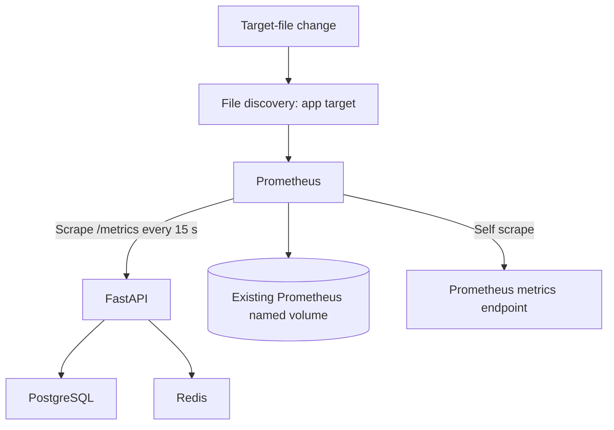

# Lab 10: Prometheus Discovery and Scrape Lifecycle

## Purpose and Scope

> **Primary Objective:** Start one Prometheus scraper, inspect discovery and target health, and distinguish a healthy scrape, a failed scrape, a removed target and stale application series.

The application now produces measurements whose meaning you have tested. Prometheus adds periodic collection, target metadata and time-series storage. That creates another observation boundary: the scraper can succeed while a required application dependency is unhealthy, or fail while the application still serves users.

You will run a focused two-job Prometheus configuration and deliberately change only its discovery input. The complete platform configuration remains available for later stages.

## 1. Inherited State and Scope

Complete Labs 6–9 and retain the baseline, evidence and raw-metric helpers. Start with only app, PostgreSQL and Redis running and with the committed-operation metric present.

This lab introduces Prometheus only. Grafana, Alertmanager, Collector, Loki, Tempo and Pyroscope remain stopped. Alert rules are intentionally not loaded in this focused configuration; their lifecycle belongs to Lab 23. Exporters arrive in Labs 14–15.

## 2. Starting Checks

```bash
source lab-notes/session.sh
source lab-notes/evidence.sh
source lab-notes/raw-metrics.sh
baseline_check
start_lab 10
api -fsS "$APP_URL/metrics" | rg '^application_items_mutations_total'
dc ps -a
```

After Prometheus starts, the old `baseline_check` will correctly reject the four-service state. Use the new `metrics_check` introduced below for this curriculum stage; the original helper remains useful when returning to the earlier three-service baseline.

## 3. Measurable Learning Objectives

By completion you must prove which target was discovered, what labels were assigned, whether its last scrape succeeded, and what samples were stored. Distinguish discovery refresh from scrape timing, a missing target from `up=0`, and application dependency state from scraper reachability.

Also demonstrate bounded failure and recovery, persistence of historical data, direct metric ownership, and safe configuration validation without printing secrets.

## 4. Current Architecture and Events



Relevant events now include target discovery, scrape completion/failure and discovery removal. `up` is generated by Prometheus for each target; it is not exported by FastAPI. A stored sample records an observation at a scrape time, not the time of every request that contributed to the counter.

## 5. Create the Focused Prometheus Configuration

Use a dedicated local config directory mounted into the existing Prometheus service. The base service's storage, user, health check, loopback publishing and resource limit remain in effect.

```bash
mkdir -p lab-notes/prometheus
chmod 755 lab-notes/prometheus
```

```bash
cat > lab-notes/prometheus/prometheus.yml <<'YAML'
global:
  scrape_interval: 15s
  scrape_timeout: 5s
  evaluation_interval: 15s
scrape_configs:
  - job_name: fastapi
    metrics_path: /metrics
    file_sd_configs:
      - files:
          - /etc/prometheus/labs/app-targets.json
        refresh_interval: 5s
  - job_name: prometheus
    static_configs:
      - targets: ["prometheus:9090"]
YAML
```

```bash
cat > lab-notes/compose.metrics.yaml <<'YAML'
services:
  prometheus:
    command:
      - --config.file=/etc/prometheus/labs/prometheus.yml
      - --storage.tsdb.path=/prometheus
      - --storage.tsdb.retention.time=3d
      - --storage.tsdb.retention.size=1GB
    volumes:
      - ./lab-notes/prometheus:/etc/prometheus/labs:ro
YAML
```

The app job uses file discovery; Prometheus itself uses a static target. Both scrape every 15 seconds, with a five-second scrape timeout. The discovery file is checked every five seconds and may also be noticed through filesystem notifications. Discovery frequency does not mean application metrics are scraped every five seconds.

The mounted directory lets atomic replacement of a discovery file become visible inside the container. A bind mount of one file can retain an older inode after a host editor atomically replaces that file.

## 6. Create the Cumulative Metrics-Stage Helper

This helper consistently applies the baseline plus the metrics overlay. Later known exporter overlays are included only after their labs create them. It does not start arbitrary services simply because they exist in the base file.

```bash
cat > lab-notes/metrics-session.sh <<'BASH'
# Source after session.sh, evidence.sh and raw-metrics.sh.
export PROM_URL="${PROM_URL:-http://127.0.0.1:9090}"

dm() {
  local -a files=(
    -f "$LAB_ROOT/docker-compose.yml"
    -f "$LAB_ROOT/lab-notes/compose.baseline.yaml"
    -f "$LAB_ROOT/lab-notes/compose.metrics.yaml"
  )
  if [[ -f "$LAB_ROOT/lab-notes/compose.node-exporter.yaml" ]]; then
    LAB_NODE_BIND_IP=$(cat "$LAB_ROOT/lab-notes/node-exporter-address.txt") || return 1
    export LAB_NODE_BIND_IP
    files+=(-f "$LAB_ROOT/lab-notes/compose.node-exporter.yaml")
  fi
  if [[ -f "$LAB_ROOT/lab-notes/compose.db-exporters.yaml" ]]; then
    files+=(-f "$LAB_ROOT/lab-notes/compose.db-exporters.yaml")
  fi
  docker compose --project-directory "$LAB_ROOT" --env-file "$LAB_ROOT/.env" "${files[@]}" "$@"
}

pq() {
  api -fsS --get --data-urlencode "query=$1" "$PROM_URL/api/v1/query"
}

wait_prometheus() {
  local attempt
  for attempt in {1..45}; do
    if api -fsS "$PROM_URL/-/ready" >/dev/null 2>&1; then return 0; fi
    sleep 1
  done
  echo 'Prometheus readiness deadline exceeded' >&2
  return 1
}

wait_target() {
  local job="$1" health="${2:-up}" attempt
  for attempt in {1..45}; do
    if api -fsS "$PROM_URL/api/v1/targets?state=active" \
      | jq -e --arg job "$job" --arg health "$health" \
        '[.data.activeTargets[] | select(.labels.job == $job)] as $targets |
         ($targets | length > 0) and all($targets[]; .health == $health)' >/dev/null; then
      return 0
    fi
    sleep 1
  done
  printf 'Target %s did not become %s\n' "$job" "$health" >&2
  return 1
}

wait_metric() {
  local query="$1" expected="$2" attempt
  for attempt in {1..45}; do
    if pq "$query" | jq -e --arg expected "$expected" \
      '.status == "success" and (.data.result | length > 0) and all(.data.result[]; .value[1] == $expected)' \
      >/dev/null; then return 0; fi
    sleep 1
  done
  printf 'Metric expectation not reached: %s = %s\n' "$query" "$expected" >&2
  return 1
}

set_app_target() {
  python3 - "$LAB_ROOT/lab-notes/prometheus/app-targets.json" "$1" "$LAB_ENVIRONMENT" "$LAB_SERVICE" <<'PYTHON'
import json, os, sys
from pathlib import Path
path = Path(sys.argv[1])
endpoint, environment, service = sys.argv[2:]
content = [] if not endpoint else [{"targets":[endpoint], "labels":{"environment":environment,"service":service}}]
temporary = path.with_suffix(".json.new")
temporary.write_text(json.dumps(content, indent=2) + "\n")
os.chmod(temporary, 0o644)
os.replace(temporary, path)
PYTHON
}

reload_prometheus() {
  dm run --rm -T --no-deps --entrypoint promtool prometheus \
    check config /etc/prometheus/labs/prometheus.yml || return 1
  dm kill -s HUP prometheus
}

metrics_check() {
  wait_ready && load_app_settings && wait_prometheus || return 1
  local actual expected
  expected=$'app\npostgres\nprometheus\nredis'
  if [[ -f "$LAB_ROOT/lab-notes/compose.node-exporter.yaml" ]]; then
    expected+=$'\nnode-exporter'
  fi
  if [[ -f "$LAB_ROOT/lab-notes/compose.db-exporters.yaml" ]]; then
    expected+=$'\npostgres-exporter\nredis-exporter'
  fi
  actual=$(dm ps --services --status running | sort) || return 1
  expected=$(printf '%s\n' "$expected" | sort)
  if [[ "$actual" != "$expected" ]]; then
    printf 'Unexpected active services:\n%s\n' "$actual" >&2
    return 1
  fi
  wait_target fastapi && wait_target prometheus || return 1
  if [[ -f "$LAB_ROOT/lab-notes/compose.node-exporter.yaml" ]]; then
    wait_target node || return 1
  fi
  if [[ -f "$LAB_ROOT/lab-notes/compose.db-exporters.yaml" ]]; then
    wait_target postgres && wait_target redis || return 1
    wait_metric 'pg_up{job="postgres"}' 1 && wait_metric 'redis_up{job="redis"}' 1 || return 1
  fi
  echo 'Current metrics-stage services and targets are ready'
}
BASH
```

```bash
source lab-notes/metrics-session.sh
set_app_target app:8000
chmod 644 lab-notes/prometheus/prometheus.yml
```

The config and discovery files contain no credentials and must be readable by Prometheus UID 10001. Only `lab-notes/prometheus/` is made traversable; keep the parent evidence directory and credential files private. The helper sets the discovery file's permission after replacement.

`pq` returns the unmodified query API response; `wait_target` examines actual target health. Neither considers an empty result a success. The stage check will later also verify exporter-to-database connectivity, rather than treating exporter HTTP availability alone as database health.

## 7. Validate the Model and the Actual Prometheus Syntax

```bash
dm config --quiet
dm config --format json | jq '{
  command: .services.prometheus.command,
  mounts: [.services.prometheus.volumes[] | {type,source,target,read_only}],
  published_ports: .services.prometheus.ports
}'
dm run --rm -T --no-deps --entrypoint promtool prometheus \
  check config /etc/prometheus/labs/prometheus.yml
```

Expected: the pinned `prom/prometheus:v3.14.0` validator accepts the configuration. The service reads `/etc/prometheus/labs/prometheus.yml`; the original mounted platform configuration is not the active config for this stage.

Do not dump the entire resolved model into evidence. It contains application and dependency passwords. A generic YAML parser also cannot replace promtool's component-specific validation.

## 8. Start Only Prometheus

```bash
record_change "start_prometheus_metrics_stage" planned
dm up -d prometheus
metrics_check
record_change "start_prometheus_metrics_stage" completed
dm ps --services --status running | sort
```

Expected running service names: app, postgres, prometheus, redis. Completed initialization jobs may still be listed with `ps -a`. The app remains on local JSON-file logging with OTel and Pyroscope disabled.

The existing named Prometheus volume is retained. If it contains data from a previous full-stack run, historical series can remain queryable. Scope queries by job and time; do not delete useful storage to make the first screen look empty.

## 9. Inspect Discovery and Scrape Evidence

```bash
api -fsS "$PROM_URL/api/v1/targets?state=active" -o "$LAB_DIR/targets.json"
jq '.data.activeTargets[] | {labels,discoveredLabels,scrapeUrl,health,lastScrape,lastScrapeDuration,lastError}' \
  "$LAB_DIR/targets.json"
pq 'up{job=~"fastapi|prometheus"}' | tee "$LAB_DIR/up.json" | jq .
```

Expected active targets: `app:8000` for `fastapi` and `prometheus:9090` for `prometheus`, both with health `up`. FastAPI also receives bounded `environment` and `service` labels from its discovery entry.

`discoveredLabels` includes internal discovery information. Labels beginning with `__` guide scraping/relabeling and are not all stored on ordinary metric series. The final `job` and `instance` labels help identify target scope.

## 10. Compare Raw Application Samples With Stored Series

```bash
api -fsS "$APP_URL/api/v1/items?limit=1" >/dev/null
api -fsS "$APP_URL/metrics" | rg '^application_http_requests_total'
wait_target fastapi
pq 'application_http_requests_total{job="fastapi"}' | jq '.data.result[] | {metric,value}'
```

A stored sample gains target labels and a sample timestamp. Its value can lag the just-generated request until the next scrape. Waiting for target health does not force an immediate new scrape; inspect `lastScrape` and allow the 15-second interval before comparing freshness.

The query API returns timestamps as numbers and sample values as strings. A request counter still represents cumulative state, not a count limited to the displayed time window.

## 11. Understand Prometheus-Owned Scrape Metrics

```bash
pq 'scrape_duration_seconds{job="fastapi"}' | jq .
pq 'scrape_samples_scraped{job="fastapi"}' | jq .
pq 'scrape_samples_post_metric_relabeling{job="fastapi"}' | jq .
```

These describe collection work, not user request latency. A larger exposition can increase sample count and scrape time without changing application response-time histograms. Metric relabeling is not configured yet, so pre/post counts should normally agree.

Prometheus target health can be up while `application_dependency_up{dependency="postgres"}` is zero: `/metrics` reads the process registry rather than requiring a successful database query.

## 12. Predict a Scrape-Path Fault

You will change the discovered application endpoint from port 8000 to an unused internal port, while leaving FastAPI itself untouched.

Predict the following separately: FastAPI liveness, a real list request, discovered `instance`, scrape `health`, `up`, and the availability of old application samples. Do not claim the API is down just because a scraper was pointed at the wrong port.

## 13. Run the Bounded Wrong-Port Experiment

```bash
(
  set -euo pipefail
  trap 'set_app_target app:8000' EXIT
  trap 'exit 130' INT
  trap 'exit 143' TERM
  record_change "discover_wrong_app_port" planned
  set_app_target app:8999
  wait_target fastapi down
  record_change "discover_wrong_app_port" completed
  api -fsS "$APP_URL/health/live" >/dev/null
  api -fsS "$APP_URL/api/v1/items?limit=1" >/dev/null
  api -fsS "$PROM_URL/api/v1/targets?state=active" -o "$LAB_DIR/wrong-port-targets.json"
  pq 'up{job="fastapi",instance="app:8999"}' | tee "$LAB_DIR/wrong-port-up.json" | jq .
  jq '.data.activeTargets[] | select(.labels.job == "fastapi") | {labels,health,lastError}' \
    "$LAB_DIR/wrong-port-targets.json"
)
wait_target fastapi up
record_change "restore_app_discovery_port" completed
```

Expected: a discovered failed target at `app:8999`, a connection-related scrape error and `up=0` for that instance, while real application requests still succeed. The original instance label identifies a different time series; its older samples may persist in historical queries.

The trap restores the discovery file if a command fails or the exercise is interrupted normally. It cannot recover after host loss or an uncatchable process kill.

## 14. Remove Discovery and Observe Staleness

A removed target is different from a target still being scraped unsuccessfully. Record a prediction before replacing discovery with an empty list.

```bash
(
  set -euo pipefail
  trap 'set_app_target app:8000' EXIT
  trap 'exit 130' INT
  trap 'exit 143' TERM
  record_change "remove_app_from_discovery" planned
  set_app_target ""
  removed=false
  for attempt in {1..90}; do
    targets=$(api -fsS "$PROM_URL/api/v1/targets?state=active")
    current=$(pq 'up{job="fastapi"}')
    if jq -e '[.data.activeTargets[] | select(.labels.job == "fastapi")] | length == 0' <<<"$targets" >/dev/null \
      && jq -e '.data.result | length == 0' <<<"$current" >/dev/null; then
      removed=true
      printf '%s\n' "$targets" > "$LAB_DIR/removed-targets.json"
      printf '%s\n' "$current" > "$LAB_DIR/absent-up.json"
      break
    fi
    sleep 1
  done
  test "$removed" = true
  api -fsS "$APP_URL/api/v1/items?limit=1" >/dev/null
  record_change "app_discovery_absent_and_series_stale" completed
)
wait_target fastapi up
metrics_check
record_change "restore_app_discovery_after_removal" completed
```

Removal and instant-query disappearance need not occur at exactly the same second. Prometheus marks removed-target series stale after its discovery/scrape lifecycle; restarting Prometheus during this experiment can change the timing and invoke lookback behavior. Do not hardcode immediate disappearance as a correctness rule.

Stale means a current instant query should no longer treat an old sample as current. It does not erase historical samples from retained time ranges. An empty query result is not numeric zero and is not proof that the application stopped.

## 15. Check Retention, Ownership and Configuration Lifecycle

```bash
dm exec -T prometheus /bin/promtool check config /etc/prometheus/labs/prometheus.yml
pq 'prometheus_config_last_reload_successful' | jq .
docker inspect --format '{{json .Mounts}}' "$(dm ps -q prometheus)" \
  | jq '.[] | select(.Type == "volume") | {Name,Destination}'
```

Prometheus stores its database in the existing named volume and uses the repository's time/size retention settings. A restart retains that storage; an app restart resets only the application's in-process counters.

File discovery refreshes without a full config reload. Changing scrape jobs or global intervals requires a config reload/restart. The helper validates first, then sends SIGHUP; it does not enable an unauthenticated lifecycle HTTP endpoint. Scrape protocol and staleness behavior are documented in the [Prometheus configuration reference](https://prometheus.io/docs/prometheus/latest/configuration/configuration/).

## 16. Recover the Approved Metrics Stage

```bash
set_app_target app:8000
metrics_check
api -fsS "$APP_URL/health/ready" | jq .
api -fsS "$APP_URL/api/v1/items?limit=1" >/dev/null
api -fsS "$PROM_URL/api/v1/targets?state=active" > "$LAB_DIR/final-targets.json"
capture_app_logs
```

Leave four services running. In a new terminal source `session.sh`, `evidence.sh`, `raw-metrics.sh`, then `metrics-session.sh`; call `metrics_check`. Use `dm` when starting/reconciling Prometheus so this curriculum configuration is retained.

To pause, stop the four named services. To resume, use `dm up -d app prometheus`, then `metrics_check`. Do not use an unqualified `start` that could reactivate old full-stack containers.

## 17. Troubleshooting Runbook

| Symptom | Next useful check |
|---|---|
| Prometheus cannot read the config/discovery file | Check the mounted path and non-secret directory/file permissions: 755 directory, 644 files |
| Unexpected observability services start | Use `dm up -d prometheus` or named baseline services; inspect which Compose files were applied |
| `baseline_check` fails after startup | Expected for four services; use `metrics_check` |
| Target absent | Read the actual file discovery content, path and Targets API before querying `up` |
| Target present with `up=0` | Read scrape URL, last error, DNS/port and Content-Type |
| Target up but dependency gauge down | Scrape success and business readiness are separate observations |
| Recent request not reflected yet | Check last scrape time and allow another scrape; curl does not force collection |
| Removed target still appears briefly in an instant query | Account for staleness timing; do not restart Prometheus mid-experiment |
| Old jobs appear in historical queries | Existing volume retains earlier data; scope the query and time range |
| Full-stack alerts appear unexpectedly | Confirm the active config path; the focused lab config has no rule files or Alertmanager route |

A useful diagnosis identifies the broken boundary: discovery, scrape transport, exposition, ingestion, query scope or application dependency.

## 18. Knowledge Check

1. Who produces up?
2. Does up=1 prove PostgreSQL is available to FastAPI?
3. Does file discovery refresh equal scrape frequency?
4. What differs between a failed target and a removed target?
5. Does stale mean old samples were deleted?
6. Why mount the discovery directory rather than only one replaceable file?
7. Why are job and instance important?
8. Does a raw metrics read force a scrape?
9. Why can historical jobs remain after this config change?
10. Which checker replaces baseline_check at this stage?

### Answer Guide

1. Prometheus, based on each target scrape.
2. No; the endpoint can expose a registry while persistence fails.
3. No; discovery and collection are separate schedules.
4. A failed target remains discovered and has a failed scrape; a removed target is no longer scraped.
5. No; retained historical data can still be queried.
6. Atomic file replacements remain visible through the directory mount.
7. They identify the configured job and endpoint context of a stored series.
8. No; collection follows the scraper schedule.
9. The retained TSDB volume contains earlier samples.
10. metrics_check, which expects the additional service and validates target state.

## 19. Professional Scenario Exercise

A team reports an application outage because the FastAPI target is red, but users can create items. Write a diagnosis that uses the target URL, discovery input, raw endpoint, scrape error and direct business operation. Explain how your conclusion would change if the target were absent instead.

## 20. Lab Notebook Template

Create a notebook in the evidence directory for this run:

```bash
test -e "$LAB_DIR/notebook.md" || printf '# Lab 10 Evidence\n' > "$LAB_DIR/notebook.md"
```

Use these headings and fill them with your predictions, commands, observed results and conclusions:

```markdown
# Lab 10 Evidence

## Starting application state
## Active Compose/configuration boundaries
## Target discovery and labels
## Raw versus stored samples
## Scrape timing and collection metrics
## Wrong-port prediction and evidence
## Removal/staleness prediction and evidence
## Change timeline
## Retained history versus current state
## Recovery and final targets
## Scenario response
```

## 21. Observable Completion Criteria

- [ ] Only app, PostgreSQL, Redis and Prometheus are running.
- [ ] The pinned promtool validates the focused config.
- [ ] File discovery contains the correct Docker-internal application endpoint.
- [ ] Targets API and up show two healthy targets.
- [ ] Stored samples are distinguished from current raw exposition.
- [ ] A wrong scrape port produces up=0 while business requests succeed.
- [ ] Removing discovery eventually produces absence, not zero.
- [ ] Historical retention is distinguished from current staleness.
- [ ] All discovery changes are restored and the metrics-stage helper is retained.

## 22. Production Implications

A scraper is an observer with its own failure modes. Target health, application readiness and user outcomes must be correlated rather than substituted for one another. Single-node Prometheus storage has no HA or host-loss guarantee; safe retention, bounded labels and explicit ownership remain necessary as more targets are added.

## 23. End State and Transition

Keep `lab-notes/prometheus/`, the metrics overlay and `metrics-session.sh`. Restore discovery to `app:8000` and leave the four-service stage healthy.

Next: [Lab 11 — PromQL Selectors, Matchers, and Aggregation](Lab-11.md). You will query the samples you now know how to collect, while preserving the dimensions that make their meaning clear.
