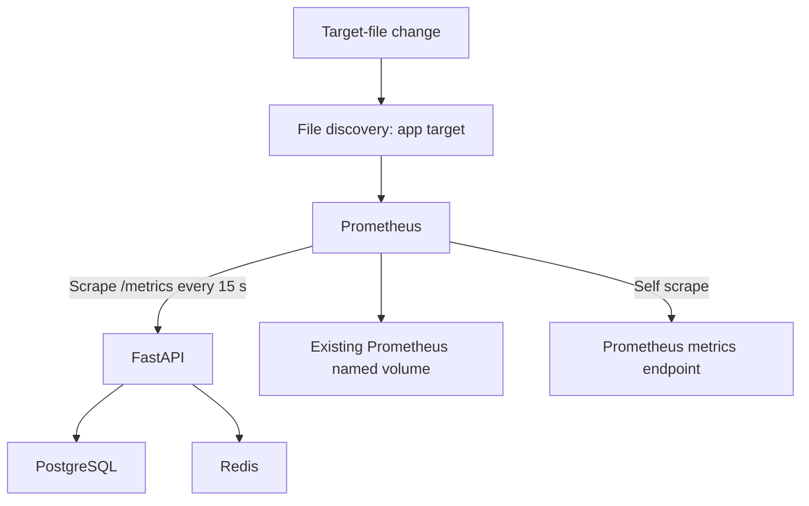

# Lab 10: Prometheus Discovery and Scrape Lifecycle

## 1. Purpose and Learning Outcomes

You will add Prometheus as the first metrics backend and follow how it finds a target, fetches metrics, stores samples, and returns a query result. Then point the scraper at the wrong port and, separately, remove the target. These examples show why a failed scrape, a missing target, and an unavailable application need different checks.

> **Primary Objective:** Start one Prometheus scraper, inspect how it discovers targets and reports scrape health, and distinguish successful collection, failed collection, target removal, and series that no longer represent current observations.

The app already exposes measurements whose meanings you tested. Prometheus adds scheduled collection, target labels, and time-series storage. It can successfully collect metrics while PostgreSQL-backed work fails, or fail to collect while users can still use the app. Check these paths separately.

Use a focused configuration with two scrape jobs and change only its discovery input during the faults. Keep the full platform configuration for later stages.

## 2. Starting Point and Lab Map

Open the complete application repository before using this guide. Unless a step says otherwise, run commands in Bash from the repository's top-level folder. Follow the starting checks in order because later commands depend on the helper functions and running services they prepare.

Read each explanation before running its commands. Run one complete code block, check the result, and then continue. In your notebook, save the commands, what happened, why you think it happened, and anything that differed from the expected result.

### Key Terms

| **Term**  | **Explanation**                                                                                   |
| --------- | ------------------------------------------------------------------------------------------------- |
| Discovery | How Prometheus learns the addresses and labels of targets it may scrape.                          |
| Scrape    | One attempt to fetch a target's metrics and accept them into Prometheus.                          |
| Staleness | A series no longer supplies a current observation, although older stored samples may still exist. |

### Lab Map

The arrows show how the parts connect and where a request can take different paths. Use this map to understand the design. It is not a recording of a request that actually ran.


```mermaid
flowchart TD
    Targets["File discovery: app target"] --> Prom["Prometheus"]
    Prom -->|"Scrape /metrics every 15 s"| App["FastAPI"]
    App --> PG["PostgreSQL"]
    App --> Redis["Redis"]
    Prom --> Store["Existing Prometheus named volume"]
    Prom -->|"Self scrape"| Self["Prometheus metrics endpoint"]
    Operator["Target-file change"] --> Targets
```

## 3. Guided Walkthrough

### Step 01. Inherited State and Scope

**What You Are Doing:** Start from the app metrics already verified directly. Adding Prometheus introduces another component and collection path to check independently.

**Practical Walkthrough:** Leave the producer's instruments unchanged. You can now compare current in-memory values from the app with the latest values stored by Prometheus. They may differ simply because the last scrape happened before the latest request.

Treat raw exposition as the current producer view and Prometheus as a periodically sampled view with history. Before calling a difference an error, compare label selections, process lifetime, and observation times.

Complete Labs 6–9 and retain the baseline, evidence and raw-metric helpers. Start with only app, PostgreSQL and Redis running and with the committed-operation metric present.

Start only Prometheus in addition to the baseline. Keep Grafana, Alertmanager, Collector, Loki, Tempo, and Pyroscope stopped. This focused configuration has no alert rules; Lab 23 covers those. Labs 14–15 add exporters.

**Understanding the Result:** Investigate the path that actually failed. A working application does not automatically mean Prometheus can reach and collect its endpoint.

### Step 02. Starting Checks

**What You Are Doing:** Check the three-service baseline first. After adding Prometheus, switch to the new helper that expects four services.

**Practical Walkthrough:** Run the old baseline check before installing the new stage. After creating and loading the metrics helper, use its expanded check. Otherwise the old helper will correctly report Prometheus as an extra service even though this stage now requires it.

Each helper checks a particular expected setup. Use the three-service check before the change and the metrics-stage check afterward so the service inventory is judged against the right stage.

```bash
source lab-notes/session.sh
source lab-notes/evidence.sh
source lab-notes/raw-metrics.sh
baseline_check
start_lab 10
api -fsS "$APP_URL/metrics" | rg '^application_items_mutations_total'
dc ps -a
```

Once Prometheus runs, `baseline_check` rejects the four-service state by design. Use the new `metrics_check` below. The old helper still applies if you return to the earlier three-service baseline.

**Understanding the Result:** A stage check describes the intended service set for that point in the course. Choose the one matching the configuration you are running.

### Step 03. Measurable Learning Objectives

**What You Are Doing:** Follow a target through discovery, final labels, scrape results, and stored values. Each piece proves a different part of collection.

**Practical Walkthrough:** Discovery tells you what Prometheus selected. Target health tells you whether collection worked. Queries show stored observations. Save evidence for all three instead of assuming they always share the same state.

Keep a discovered target, a recent scrape outcome, and a query result. Configuration alone does not prove collection, and old samples do not prove collection is still running. Comparing these points helps locate where new observations stopped.

Show the discovered address, assigned labels, latest scrape result, and stored samples. Separate discovery refresh from scrape frequency, missing targets from `up=0`, and database health from metrics-endpoint reachability.

Also demonstrate a short controlled failure and recovery, retained history, clear metric ownership, and validation that does not print secrets.

**Understanding the Result:** A query can return data recorded before the current failure. Check its age and current scrape state alongside the value.

### Step 04. Current Architecture and Events

**What You Are Doing:** Follow target configuration through collection to stored samples. Prometheus creates its own scrape metrics, including `up`, alongside the values it reads from FastAPI.

**Practical Walkthrough:** Trace discovery, final labels, the HTTP fetch, and stored series. `up` is Prometheus's report of a scrape attempt, not a readiness value emitted by FastAPI. Keep scraper evidence distinct from the app's dependency measurements.

Inspect the final URL and labels, which may differ from discovery input after processing. Compare `up` with readiness separately. A reachable metrics endpoint can return its registry while a required business dependency is unavailable.

The lab map in Section 2 shows this relationship.

New events include discovering a target, completing or failing a scrape, and removing discovery. Prometheus generates `up`; FastAPI does not export it. A stored sample represents the scrape-time observation, not a separate timestamp for every request contributing to a counter.

**Understanding the Result:** Target labels identify the observed endpoint. Changing the target address can create a different series even when you intend to monitor the same app.

### Step 05. Create the Focused Prometheus Configuration

**What You Are Doing:** Write a small Prometheus configuration and discovery file for this stage. Reuse the existing service and storage while keeping unrelated telemetry services stopped.

**Practical Walkthrough:** Create the files at the exact host paths mounted by the overlay. The service retains its existing image and storage setup. Check path correspondence carefully; editing a file the container never reads cannot change its targets.

Create the directory first and preserve YAML indentation and closing heredoc markers. Match host paths to mount destinations. What matters is the file the running process actually uses, not simply that a correct-looking file exists on the host.

Mount a dedicated local configuration directory into the existing Prometheus service. The base service still supplies storage, runtime user, health check, loopback port binding, and resource limit.

```bash
mkdir -p lab-notes/prometheus
chmod 755 lab-notes/prometheus
```

```bash
cat > lab-notes/prometheus/prometheus.yml <<'YAML'
global:
  scrape_interval: 15s
  scrape_timeout: 5s
  evaluation_interval: 15s
scrape_configs:
  - job_name: fastapi
    metrics_path: /metrics
    file_sd_configs:
      - files:
          - /etc/prometheus/labs/app-targets.json
        refresh_interval: 5s
  - job_name: prometheus
    static_configs:
      - targets: ["prometheus:9090"]
YAML
```

**Command Note:** `<<'YAML'` writes the following text literally until the closing `YAML` line. Quoting prevents Bash from expanding `$variables`. Writing the file does not activate the settings yet.

```bash
cat > lab-notes/compose.metrics.yaml <<'YAML'
services:
  prometheus:
    command:
      - --config.file=/etc/prometheus/labs/prometheus.yml
      - --storage.tsdb.path=/prometheus
      - --storage.tsdb.retention.time=3d
      - --storage.tsdb.retention.size=1GB
    volumes:
      - ./lab-notes/prometheus:/etc/prometheus/labs:ro
YAML
```

The app job reads targets from a discovery file; the Prometheus self-job uses a static target. Both scrape every 15 seconds with a five-second timeout. Discovery checks the file every five seconds and can also notice filesystem notifications. A five-second discovery refresh does not mean a five-second metrics scrape.

Mounting the directory allows a replaced discovery file to appear inside the container. A mount of just one file can remain attached to the old file object, or inode, when an editor replaces the host file atomically rather than modifying it in place.

**Understanding the Result:** The mount connects your host file to the container's active input. Keep the supplied scope so other observability services remain outside the test.

### Step 06. Create the Cumulative Metrics-Stage Helper

**What You Are Doing:** Add a helper that consistently combines the active Compose overrides. Later labs extend it, so file order becomes part of the reproducible setup.

**Practical Walkthrough:** Read the helper, create it, and load it in Bash. Later override files can replace earlier settings, so their order matters. Use this helper for validation, startup, inspection, and recovery to keep all actions on the same final model.

`dm` selects the accumulated metrics-stage configuration, and `set_app_target` writes the app discovery input. Review their order and behavior. Validating with one wrapper but starting with another could test and run different configurations.

The helper always includes the baseline and metrics overlay. It adds the known exporter overlays only after those later labs create them. Defining a service in the base file does not mean this helper starts it automatically.

```bash
cat > lab-notes/metrics-session.sh <<'BASH'
# Source after session.sh, evidence.sh and raw-metrics.sh.
export PROM_URL="${PROM_URL:-http://127.0.0.1:9090}"

dm() {
  local -a files=(
    -f "$LAB_ROOT/docker-compose.yml"
    -f "$LAB_ROOT/lab-notes/compose.baseline.yaml"
    -f "$LAB_ROOT/lab-notes/compose.metrics.yaml"
  )
  if [[ -f "$LAB_ROOT/lab-notes/compose.node-exporter.yaml" ]]; then
    LAB_NODE_BIND_IP=$(cat "$LAB_ROOT/lab-notes/node-exporter-address.txt") || return 1
    export LAB_NODE_BIND_IP
    files+=(-f "$LAB_ROOT/lab-notes/compose.node-exporter.yaml")
  fi
  if [[ -f "$LAB_ROOT/lab-notes/compose.db-exporters.yaml" ]]; then
    files+=(-f "$LAB_ROOT/lab-notes/compose.db-exporters.yaml")
  fi
  docker compose --project-directory "$LAB_ROOT" --env-file "$LAB_ROOT/.env" "${files[@]}" "$@"
}

pq() {
  api -fsS --get --data-urlencode "query=$1" "$PROM_URL/api/v1/query"
}

wait_prometheus() {
  local attempt
  for attempt in {1..45}; do
    if api -fsS "$PROM_URL/-/ready" >/dev/null 2>&1; then return 0; fi
    sleep 1
  done
  echo 'Prometheus readiness deadline exceeded' >&2
  return 1
}

wait_target() {
  local job="$1" health="${2:-up}" attempt
  for attempt in {1..45}; do
    if api -fsS "$PROM_URL/api/v1/targets?state=active" \
      | jq -e --arg job "$job" --arg health "$health" \
        '[.data.activeTargets[] | select(.labels.job == $job)] as $targets |
         ($targets | length > 0) and all($targets[]; .health == $health)' >/dev/null; then
      return 0
    fi
    sleep 1
  done
  printf 'Target %s did not become %s\n' "$job" "$health" >&2
  return 1
}

wait_metric() {
  local query="$1" expected="$2" attempt
  for attempt in {1..45}; do
    if pq "$query" | jq -e --arg expected "$expected" \
      '.status == "success" and (.data.result | length > 0) and all(.data.result[]; .value[1] == $expected)' \
      >/dev/null; then return 0; fi
    sleep 1
  done
  printf 'Metric expectation not reached: %s = %s\n' "$query" "$expected" >&2
  return 1
}

set_app_target() {
  python3 - "$LAB_ROOT/lab-notes/prometheus/app-targets.json" "$1" "$LAB_ENVIRONMENT" "$LAB_SERVICE" <<'PYTHON'
import json, os, sys
from pathlib import Path
path = Path(sys.argv[1])
endpoint, environment, service = sys.argv[2:]
content = [] if not endpoint else [{"targets":[endpoint], "labels":{"environment":environment,"service":service}}]
temporary = path.with_suffix(".json.new")
temporary.write_text(json.dumps(content, indent=2) + "\n")
os.chmod(temporary, 0o644)
os.replace(temporary, path)
PYTHON
}

reload_prometheus() {
  dm run --rm -T --no-deps --entrypoint promtool prometheus \
    check config /etc/prometheus/labs/prometheus.yml || return 1
  dm kill -s HUP prometheus
}

metrics_check() {
  wait_ready && load_app_settings && wait_prometheus || return 1
  local actual expected
  expected=$'app\npostgres\nprometheus\nredis'
  if [[ -f "$LAB_ROOT/lab-notes/compose.node-exporter.yaml" ]]; then
    expected+=$'\nnode-exporter'
  fi
  if [[ -f "$LAB_ROOT/lab-notes/compose.db-exporters.yaml" ]]; then
    expected+=$'\npostgres-exporter\nredis-exporter'
  fi
  actual=$(dm ps --services --status running | sort) || return 1
  expected=$(printf '%s\n' "$expected" | sort)
  if [[ "$actual" != "$expected" ]]; then
    printf 'Unexpected active services:\n%s\n' "$actual" >&2
    return 1
  fi
  wait_target fastapi && wait_target prometheus || return 1
  if [[ -f "$LAB_ROOT/lab-notes/compose.node-exporter.yaml" ]]; then
    wait_target node || return 1
  fi
  if [[ -f "$LAB_ROOT/lab-notes/compose.db-exporters.yaml" ]]; then
    wait_target postgres && wait_target redis || return 1
    wait_metric 'pg_up{job="postgres"}' 1 && wait_metric 'redis_up{job="redis"}' 1 || return 1
  fi
  echo 'Current metrics-stage services and targets are ready'
}
BASH
```

**Command Note:** `jq --arg` passes a shell value into the JSON query as a string variable rather than inserting it into query text. Where used, `-e` makes a false or null final result fail the command.

```bash
source lab-notes/metrics-session.sh
set_app_target app:8000
chmod 644 lab-notes/prometheus/prometheus.yml
```

These configuration and discovery files contain no credentials and must be readable by Prometheus UID 10001. Make only `lab-notes/prometheus/` traversable as shown; keep the parent evidence folder and credential files private. The helper reapplies the discovery file permissions after replacement.

`pq` returns the query API's unchanged response. `wait_target` checks actual target health, and an empty result does not count as success. In later exporter stages, the check also tests exporter-to-database connectivity rather than assuming an available exporter HTTP endpoint proves a healthy database.

**Understanding the Result:** Shell functions are available only after loading the helper in that terminal. Source it again in a new shell before using the commands.

### Step 07. Validate the Model and the Actual Prometheus Syntax

**What You Are Doing:** Validate both Compose and Prometheus configuration before startup. They understand different layers and catch different mistakes.

**Practical Walkthrough:** First check the combined Compose model. Then use the selected Prometheus image's native validator. Compose checks service and mount configuration; promtool understands Prometheus scrape settings and rule syntax. A pass in one is not a pass in the other.

Fix errors at the layer reporting them. A mount or service definition belongs to Compose; scrape or rule syntax belongs to Prometheus. Resolve those before testing runtime behavior.

```bash
dm config --quiet
dm config --format json | jq '{
  command: .services.prometheus.command,
  mounts: [.services.prometheus.volumes[] | {type,source,target,read_only}],
  published_ports: .services.prometheus.ports
}'
dm run --rm -T --no-deps --entrypoint promtool prometheus \
  check config /etc/prometheus/labs/prometheus.yml
```

**Expected Result:** the pinned `prom/prometheus:v3.14.0` validator accepts the files. This stage uses `/etc/prometheus/labs/prometheus.yml` as its active configuration, not the original full-platform file that may also be mounted.

Do not save the full resolved Compose model; it includes database and app passwords. A generic YAML parser also cannot replace promtool's checks of valid Prometheus settings.

**Understanding the Result:** Read and fix the reported field or file. Recreating a service repeatedly with the same invalid configuration will not resolve it.

### Step 08. Start Only Prometheus

**What You Are Doing:** Start Prometheus and confirm exactly four running services. Distinguish newly successful scrapes from old data already present in its volume.

**Practical Walkthrough:** Start only the named service, wait for its readiness, and inspect current targets. A retained volume may contain previous samples. An old graph or familiar query value cannot prove the newly configured endpoint is being collected now.

Check fresh target evidence and the running-service list after startup. Prometheus being ready means the service is available; application-target collection needs its own successful scrape.

```bash
record_change "start_prometheus_metrics_stage" planned
dm up -d prometheus
metrics_check
record_change "start_prometheus_metrics_stage" completed
dm ps --services --status running | sort
```

Expect app, postgres, prometheus, and redis to run. Successful setup jobs may still appear stopped in `ps -a`. The app continues local JSON-file logging with OTel and Pyroscope disabled.

Keep the existing Prometheus named volume. Earlier full-stack samples may remain queryable. Limit queries by job and time instead of deleting useful history just to make the interface look empty.

**Understanding the Result:** Verify fresh collection under the current configuration. Old stored data and current successful scraping are separate facts.

### Step 09. Inspect Discovery and Scrape Evidence

**What You Are Doing:** Read discovery labels, final target identity, recent scrape time, and errors together. Establish what Prometheus tried before interpreting stored metrics.

**Practical Walkthrough:** If the target is absent, investigate discovery. If present with an error, inspect the selected address and collection path. The final labels, URL, timestamp, and error message connect the intended target with the actual attempt.

Compare `discoveredLabels`, final `labels`, `scrapeUrl`, and `lastError`. Check that `lastScrape` belongs to the current experiment. A present target with a fresh failure can point to DNS, port, endpoint, or response-format trouble; an absent target calls for discovery checks first.

```bash
api -fsS "$PROM_URL/api/v1/targets?state=active" -o "$LAB_DIR/targets.json"
jq '.data.activeTargets[] | {labels,discoveredLabels,scrapeUrl,health,lastScrape,lastScrapeDuration,lastError}' \
  "$LAB_DIR/targets.json"
pq 'up{job=~"fastapi|prometheus"}' | tee "$LAB_DIR/up.json" | jq .
```

Expect active targets `app:8000` under `fastapi` and `prometheus:9090` under `prometheus`, both with health `up`. The FastAPI discovery entry also supplies limited `environment` and `service` label values.

`discoveredLabels` contains internal information used to construct the target. Labels starting with `__` guide collection and relabeling and are not all stored on normal series. The final `job` and `instance` identify the target scope used by queries.

**Understanding the Result:** Query using final target labels. Discovery metadata can change or disappear during target processing.

### Step 10. Compare Raw Application Samples with Stored Series

**What You Are Doing:** Compare the app's current value with Prometheus's most recent stored sample. Allow for collection delay instead of treating storage as a live read of memory.

**Practical Walkthrough:** Fetch raw output and query the corresponding stored series close together. Match names and application labels, account for target labels, and inspect times. New activity may take another scheduled scrape to appear in storage.

Generate the request, allow a scrape to include it, and compare equivalent samples. If values differ, check observation time and process resets before concluding that data was lost.

```bash
api -fsS "$APP_URL/api/v1/items?limit=1" >/dev/null
api -fsS "$APP_URL/metrics" | rg '^application_http_requests_total'
wait_target fastapi
pq 'application_http_requests_total{job="fastapi"}' | jq '.data.result[] | {metric,value}'
```

Stored samples add target labels and a timestamp. The latest value may lag a just-completed request until another scrape. Waiting for target health does not force a new fetch; inspect `lastScrape` and allow the configured 15-second interval.

The query API encodes timestamps as numbers and sample values as strings. A request counter remains a cumulative total, not automatically the number of requests within the displayed time range.

**Understanding the Result:** A recently stored value can legitimately be behind the app's present total because collection happens periodically.

### Step 11. Understand Prometheus-Owned Scrape Metrics

**What You Are Doing:** Inspect Prometheus's measurements of its own scraping work. These describe collection, not the user's create or read request duration.

**Practical Walkthrough:** Select scrape metrics for the app target. Scrape duration times the metrics collection operation, and sample counts describe the document it processed. Use RED instruments for user-request behavior; these collection values answer different questions.

Keep the FastAPI target selected so self-scrape results are not mixed in. Read duration in seconds and counts as collected samples. Do not compare them as if they represented the same request population as RED metrics.

```bash
pq 'scrape_duration_seconds{job="fastapi"}' | jq .
pq 'scrape_samples_scraped{job="fastapi"}' | jq .
pq 'scrape_samples_post_metric_relabeling{job="fastapi"}' | jq .
```

A larger metrics document can increase scrape sample count and duration without changing the app's business-request histogram. Metric relabeling is not yet configured, so counts before and after that stage should normally agree.

Prometheus can report target up while `application_dependency_up{dependency="postgres"}` is zero. `/metrics` reads the in-memory registry and does not need a successful database query to return it.

**Understanding the Result:** Scrape metrics help diagnose collection. Application request metrics describe business response totals, errors, and durations.

### Step 12. Predict a Scrape-Path Fault

**What You Are Doing:** Predict a wrong target port without stopping the app. Collection should fail while the unchanged business endpoint stays usable.

**Practical Walkthrough:** Write predictions for discovery, `up`, and direct requests separately. Only the scraper's selected address changes. A direct successful business request during the fault is your independent check that the application itself is still working.

Record which target address changes and which app URL stays the same. Do not predict a process crash from a configuration-only scrape fault. Compare the two paths during the same interval.

Change discovery from app port 8000 to an unused internal port. FastAPI itself keeps its original listener and configuration.

Predict liveness, list requests, discovered `instance`, target `health`, `up`, and old stored samples separately. Pointing a scraper at the wrong port is not proof that the API is unavailable to users.

**Understanding the Result:** Attach a failed scrape to its exact target labels. It does not establish failure of every application access path.

### Step 13. Run the Bounded Wrong-Port Experiment

**What You Are Doing:** Apply the wrong-port target with cleanup in place, then compare collection with direct business traffic. The new instance's failed `up` describes the scrape path.

**Practical Walkthrough:** Use the full recovery wrapper and wait for an attempt against the wrong address. Check the changed instance label and a fresh direct request. An older healthy series belongs to a different target identity and cannot prove that the bad port worked.

Keep restoration attached to the change. Inspect a recent scrape of the bad `instance` and compare it with a business request from the same interval. This avoids mistaking old stored success for current collection.

```bash
(
  set -euo pipefail
  trap 'set_app_target app:8000' EXIT
  trap 'exit 130' INT
  trap 'exit 143' TERM
  record_change "discover_wrong_app_port" planned
  set_app_target app:8999
  wait_target fastapi down
  record_change "discover_wrong_app_port" completed
  api -fsS "$APP_URL/health/live" >/dev/null
  api -fsS "$APP_URL/api/v1/items?limit=1" >/dev/null
  api -fsS "$PROM_URL/api/v1/targets?state=active" -o "$LAB_DIR/wrong-port-targets.json"
  pq 'up{job="fastapi",instance="app:8999"}' | tee "$LAB_DIR/wrong-port-up.json" | jq .
  jq '.data.activeTargets[] | select(.labels.job == "fastapi") | {labels,health,lastError}' \
    "$LAB_DIR/wrong-port-targets.json"
)
wait_target fastapi up
record_change "restore_app_discovery_port" completed
```

**Command Note:** `trap ... EXIT` schedules restoration when the shell exits. Keep it with the fault and use the later checks to verify a successful scrape after restoration.

**Expected Result:** discovery shows failed `app:8999`, its scrape has a connection-related error, and its instance reports `up=0`. Direct app requests still succeed. Samples for the original instance are different series and may remain in historical queries.

The trap restores discovery after ordinary command failure or normal interruption. It cannot run after host loss or an uncatchable process kill, so verify recovery explicitly.

**Understanding the Result:** Restore the approved address and check a new successful scrape. Keep both fault evidence and the timestamped recovery result.

### Step 14. Remove Discovery and Observe Staleness

**What You Are Doing:** Remove the target from discovery and watch current results change. No selected target is different from a selected target that fails its scrape.

**Practical Walkthrough:** Replace discovery as instructed and inspect both target inventory and queries. Prometheus stops scheduling that target after removal is processed. Allow for refresh and staleness timing rather than treating a recently stored value as proof of an active target.

Capture timestamps as the target disappears and instant-query results change. Old stored samples can remain even after active discovery is gone. This differs from a still-present target producing a failed scrape.

Predict the difference before writing the empty discovery list. Removing selection is not the same action as leaving an unreachable endpoint selected.

```bash
(
  set -euo pipefail
  trap 'set_app_target app:8000' EXIT
  trap 'exit 130' INT
  trap 'exit 143' TERM
  record_change "remove_app_from_discovery" planned
  set_app_target ""
  removed=false
  for attempt in {1..90}; do
    targets=$(api -fsS "$PROM_URL/api/v1/targets?state=active")
    current=$(pq 'up{job="fastapi"}')
    if jq -e '[.data.activeTargets[] | select(.labels.job == "fastapi")] | length == 0' <<<"$targets" >/dev/null \
      && jq -e '.data.result | length == 0' <<<"$current" >/dev/null; then
      removed=true
      printf '%s\n' "$targets" > "$LAB_DIR/removed-targets.json"
      printf '%s\n' "$current" > "$LAB_DIR/absent-up.json"
      break
    fi
    sleep 1
  done
  test "$removed" = true
  api -fsS "$APP_URL/api/v1/items?limit=1" >/dev/null
  record_change "app_discovery_absent_and_series_stale" completed
)
wait_target fastapi up
metrics_check
record_change "restore_app_discovery_after_removal" completed
```

Target removal and instant-query disappearance may happen at different times. Prometheus marks removed-target series stale through its discovery and scrape lifecycle. Restarting it during the test can change timing and bring lookback behavior into play. Do not require immediate disappearance as the definition of correctness.

Stale means an instant query should stop treating the old sample as a current value. It does not delete retained history. An empty query result is neither numeric zero nor proof that the app stopped running.

**Understanding the Result:** Missing discovery and failed collection need different investigations. Restore discovery before continuing.

### Step 15. Check Retention, Ownership and Configuration Lifecycle

**What You Are Doing:** Identify stored samples, active configuration, and process lifetimes separately. App counter resets and Prometheus history do not share one lifecycle.

**Practical Walkthrough:** Locate the data volume and active config. Compare file discovery refresh, config reload, Prometheus restart, and app restart. The app owns its in-memory counters; Prometheus owns stored observations with retention rules. Changing one does not automatically erase the other.

Identify the files selecting collection and the volume holding samples. A successful reload metric checks configuration adoption. It does not separately prove retained history or the app's current counter lifetime, which need their own checks.

```bash
dm exec -T prometheus /bin/promtool check config /etc/prometheus/labs/prometheus.yml
pq 'prometheus_config_last_reload_successful' | jq .
docker inspect --format '{{json .Mounts}}' "$(dm ps -q prometheus)" \
  | jq '.[] | select(.Type == "volume") | {Name,Destination}'
```

Prometheus keeps its database in the existing named volume with the repository's time and size retention settings. Restarting Prometheus retains that storage. Restarting the app resets its in-memory counters without deleting Prometheus history.

File discovery refreshes without reloading the whole configuration. Changing jobs or global intervals needs reload or restart. The helper validates first and sends SIGHUP; it does not enable an unauthenticated lifecycle HTTP endpoint. See the [Prometheus configuration reference](https://prometheus.io/docs/prometheus/latest/configuration/configuration/) for scrape and staleness behavior.

**Understanding the Result:** Retention controls how much history remains. It does not redefine what the app counter measures. Keep the data volume during these configuration experiments.

### Step 16. Recover the Approved Metrics Stage

**What You Are Doing:** Restore the approved target and prove fresh successful collection. Leave four services and the stage helpers ready for the PromQL labs.

**Practical Walkthrough:** Restore and validate the intended files, check current target health, and send a real business request. Use the metrics-stage check, then keep its helper and configuration for the next labs. Do not rely only on samples from before the fault.

Restore `app:8000`, inspect current targets and recent successful scrapes, and make a fresh business request. This proves both the producer's useful work and its collection path are available again.

```bash
set_app_target app:8000
metrics_check
api -fsS "$APP_URL/health/ready" | jq .
api -fsS "$APP_URL/api/v1/items?limit=1" >/dev/null
api -fsS "$PROM_URL/api/v1/targets?state=active" > "$LAB_DIR/final-targets.json"
capture_app_logs
```

Leave all four services running. In a new terminal, load `session.sh`, `evidence.sh`, `raw-metrics.sh`, and then `metrics-session.sh`, and run `metrics_check`. Use `dm` when applying Prometheus service changes so this stage's configuration stays selected.

To pause, stop the four named services. Resume with `dm up -d app prometheus` and `metrics_check`. Avoid an unqualified `start`, which could also reactivate old full-stack containers.

**Understanding the Result:** Finish with a recent successful scrape, not just an old `up` sample. Record recovery time so later queries can distinguish historical failures from present state.

## 4. Troubleshooting and Diagnosis

Begin with the first result that differed from your prediction. Save the exact error or symptom and identify which service or command produced it. Use the checks below, make the needed fix, and repeat the original check to confirm the problem is resolved.

### Troubleshooting Runbook

| **Symptom**                                              | **Next Useful Check**                                                                                   |
| -------------------------------------------------------- | ------------------------------------------------------------------------------------------------------- |
| Prometheus cannot read the config/discovery file         | Check the exact mounted path and non-secret permissions: 755 directories and 644 files                  |
| Unexpected observability services start                  | Use `dm up -d prometheus` or explicitly named baseline services, and inspect the selected Compose files |
| `baseline_check` fails after startup                     | Four services are now expected; use `metrics_check`                                                     |
| Target absent                                            | Inspect the active discovery file, its path, and the Targets API before querying `up`                   |
| Target present with `up=0`                               | Inspect the scrape URL, latest error, DNS, port, and response Content-Type                              |
| Target up but dependency gauge down                      | Successful metrics collection and working business dependencies are separate conditions                 |
| Recent request not reflected yet                         | Check last scrape time and wait for another scrape; a curl read does not trigger collection             |
| Removed target still appears briefly in an instant query | Allow for staleness timing and keep Prometheus running through the experiment                           |
| Old jobs appear in historical queries                    | The retained volume may hold earlier samples; narrow job selection and time range                       |
| Full-stack alerts appear unexpectedly                    | Verify the active config path; this focused file loads no rules or Alertmanager route                   |

Locate the failing step: discovery, connection, metrics format, sample ingestion, query selection, or the app's own dependency. The correction depends on which of these actually failed.

## 5. Review and Practice

Answer the questions in your own words before reading the answers. For the scenario, say what you would inspect and exactly what each result would tell you.

### Knowledge Check

1. Who produces up?
2. Does up=1 prove PostgreSQL is available to FastAPI?
3. Does file discovery refresh equal scrape frequency?
4. What differs between a failed target and a removed target?
5. Does stale mean old samples were deleted?
6. Why mount the discovery directory rather than only one replaceable file?
7. Why are job and instance important?
8. Does a raw metrics read force a scrape?
9. Why can historical jobs remain after this config change?
10. Which checker replaces baseline_check at this stage?

#### Answer Guide

1. Prometheus produces it from the result of each target scrape.
2. No. The app can return its metric registry while database-backed work fails.
3. No. Discovering targets and fetching their metrics use separate schedules.
4. A failed target remains selected and has a failed attempt; a removed target is no longer selected for scraping.
5. No. Older samples may still be queried within retained historical ranges.
6. Replacing the file atomically remains visible through its mounted directory instead of leaving a mount tied to the old file.
7. They identify the scrape job and endpoint associated with the stored series.
8. No. Prometheus collects according to its own schedule.
9. The retained time-series database (TSDB) volume still holds earlier samples.
10. metrics_check, which expects the added service and checks target state.

### Professional Scenario Exercise

A team calls the app down because its Prometheus target is red, yet users can create items. Plan checks of the target URL, discovery file, raw metrics endpoint, scrape error, and a direct business request. Explain why an absent target would shift the investigation toward discovery instead.

## 6. Completion Checklist

Tick an item only when you can show its result or saved evidence. Finish the cleanup instructions before starting the next lab.

### Observable Completion Criteria

- [ ] Only app, PostgreSQL, Redis and Prometheus are running.
- [ ] The pinned promtool validates the focused config.
- [ ] File discovery contains the correct Docker-internal application endpoint.
- [ ] Targets API and up show two healthy targets.
- [ ] Stored samples are distinguished from current raw exposition.
- [ ] A wrong scrape port produces up=0 while business requests succeed.
- [ ] Removing discovery eventually produces absence, not zero.
- [ ] Historical retention is distinguished from current staleness.
- [ ] All discovery changes are restored and the metrics-stage helper is retained.

## 7. Production Context and Next Lab

### Production Implications

Prometheus is an observer and can fail independently of the system it watches. Compare target health, readiness, and user outcomes rather than substituting one for another. One Prometheus node does not provide high availability or protection from host loss. As targets grow, keep clear ownership, limited labels, and deliberate retention settings.

### End State and Transition

Keep `lab-notes/prometheus/`, the metrics overlay, and `metrics-session.sh`. Restore `app:8000` discovery and leave the four-service stage healthy.

Next: [Lab 11 — PromQL Selectors, Matchers, and Aggregation](Lab-11.md). You will query the collected samples while keeping the labels needed to explain which work each result represents.