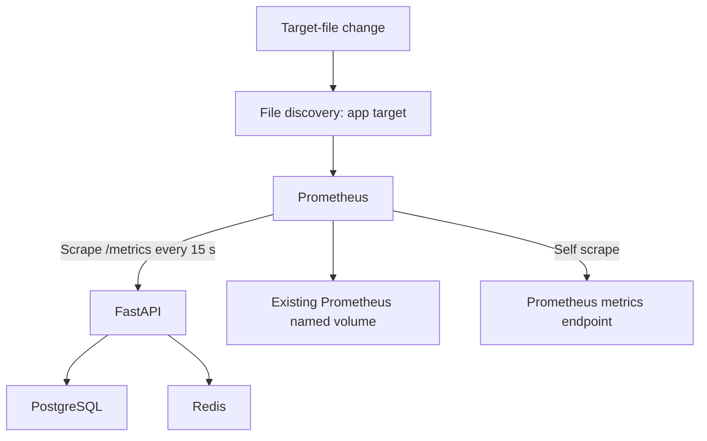

# Lab 10: Prometheus Discovery and Scrape Lifecycle

## 1. Purpose and Learning Outcomes

**In Plain Language:** You will add Prometheus as the first metrics backend and follow a sample from discovery through scraping to a query result. Then you will break only the scrape address and separately remove the target. Comparing those cases shows why an unavailable application, a failed scrape, and an absent target need different investigations.

> **Primary Objective:** Start one Prometheus scraper, inspect discovery and target health, and distinguish a healthy scrape, a failed scrape, a removed target and stale application series.

The application now produces measurements whose meaning you have tested. Prometheus adds periodic collection, target metadata and time-series storage. That creates another observation boundary: the scraper can succeed while a required application dependency is unhealthy, or fail while the application still serves users.

You will run a focused two-job Prometheus configuration and deliberately change only its discovery input. The complete platform configuration remains available for later stages.

## 2. Starting Point and Lab Map

Use this guide inside the complete application repository. Run commands from the repository root in Bash unless a step says otherwise. Work through the starting checks in order; they load the helpers and state this lab needs.

Read the explanation before each step, run one complete code block at a time, and compare the actual result with the stated expectation. Save commands, observations, explanations, and unexpected results in your notebook.

### Key Terms

| **Term**  | **Plain-Language Meaning**                                                                       |
| --------- | ------------------------------------------------------------------------------------------------ |
| Discovery | How Prometheus obtains the addresses and labels of potential targets.                            |
| Scrape    | One attempt to fetch and ingest a target's metrics.                                              |
| Staleness | A series ceasing to represent a current target observation, while historical samples may remain. |

### Lab Map

The arrows show the flow or dependency being studied. Branches identify paths to compare; this is a conceptual map, not a captured runtime trace.


```mermaid
flowchart TD
    Targets["File discovery: app target"] --> Prom["Prometheus"]
    Prom -->|"Scrape /metrics every 15 s"| App["FastAPI"]
    App --> PG["PostgreSQL"]
    App --> Redis["Redis"]
    Prom --> Store["Existing Prometheus named volume"]
    Prom -->|"Self scrape"| Self["Prometheus metrics endpoint"]
    Operator["Target-file change"] --> Targets
```

## 3. Guided Walkthrough

### Step 01. Inherited State and Scope

**What You Are Doing:** Begin with the directly verified application metrics. Prometheus adds collection and storage, so you now have another layer whose health must be checked independently.

**Practical Walkthrough:** Keep the directly tested application endpoint and its instruments unchanged while adding Prometheus. There will now be two places to inspect a measurement: current application memory through exposition, and the latest stored scrape. Differences between them can arise from collection timing even when neither component is malfunctioning.

Use the raw endpoint as the current producer view and Prometheus as a sampled historical view. Keep the metric definition unchanged while adding collection. When values differ, compare label sets, process identity, and observation timestamps before deciding the instrumentation or storage is wrong.

Complete Labs 6–9 and retain the baseline, evidence and raw-metric helpers. Start with only app, PostgreSQL and Redis running and with the committed-operation metric present.

This lab introduces Prometheus only. Grafana, Alertmanager, Collector, Loki, Tempo and Pyroscope remain stopped. Alert rules are intentionally not loaded in this focused configuration; their lifecycle belongs to Lab 23. Exporters arrive in Labs 14–15.

**Understanding the Result:** Start diagnosis at the appropriate boundary. A healthy application does not automatically imply a healthy scrape path.

### Step 02. Starting Checks

**What You Are Doing:** Verify the old baseline before starting the new service. After the stage expands, use the metrics-stage check that expects the additional running component.

**Practical Walkthrough:** Run the three-service baseline before creating the metrics stage. Source the new stage helper only after its files are installed, then use its expanded check for later verification. This avoids reporting the intended Prometheus service as an unexpected extra or overlooking missing dependencies through an outdated service-count check.

Run the baseline check before installing the new stage, then switch to the metrics-stage check after Prometheus is introduced. Each helper expects a specific service boundary. Using the earlier three-service check afterward would incorrectly classify the intended fourth service as a problem.

```bash
source lab-notes/session.sh
source lab-notes/evidence.sh
source lab-notes/raw-metrics.sh
baseline_check
start_lab 10
api -fsS "$APP_URL/metrics" | rg '^application_items_mutations_total'
dc ps -a
```

After Prometheus starts, the old `baseline_check` will correctly reject the four-service state. Use the new `metrics_check` introduced below for this curriculum stage; the original helper remains useful when returning to the earlier three-service baseline.

**Understanding the Result:** A stage check expresses the expected topology at that point in the course. Use the check that matches the active configuration.

### Step 03. Measurable Learning Objectives

**What You Are Doing:** Follow one target through discovery, scrape health, labels, and stored samples. Each observation establishes a different part of the collection path.

**Practical Walkthrough:** For each objective, identify the evidence layer involved: discovery says which endpoint was selected, scrape status says whether collection succeeded, and queries return stored samples. Keep those observations separate in your notebook so you can later explain a failure without assuming all three layers share the same health.

Choose an artifact for each layer: discovered target, scrape outcome, and stored query result. A configured endpoint does not prove successful collection, and historical samples do not prove current collection. Use the three artifacts together to explain where a missing observation stopped progressing.

By completion you must prove which target was discovered, what labels were assigned, whether its last scrape succeeded, and what samples were stored. Distinguish discovery refresh from scrape timing, a missing target from `up=0`, and application dependency state from scraper reachability.

Also demonstrate bounded failure and recovery, persistence of historical data, direct metric ownership, and safe configuration validation without printing secrets.

**Understanding the Result:** A returned stored value may be older than the current failure. Inspect freshness and scrape state alongside the value.

### Step 04. Current Architecture and Events

**What You Are Doing:** Read the map from target configuration to Prometheus's stored observations. Prometheus creates its own scrape evidence, including `up`, alongside the application samples it collects.

**Practical Walkthrough:** Follow the configured target through discovery and label construction to the HTTP scrape and stored series. Prometheus records collection metadata as well as values emitted by the app. In particular, its `up` sample describes success of a scrape attempt; the app does not emit that sample to report its own business readiness.

Trace the final scrape URL and labels rather than assuming they equal the initial discovery input. Identify `up` as Prometheus-generated scrape evidence. Then compare application readiness separately, because a reachable metrics endpoint can coexist with a degraded business dependency.

The lab map in Section 2 shows this relationship.

Relevant events now include target discovery, scrape completion/failure and discovery removal. `up` is generated by Prometheus for each target; it is not exported by FastAPI. A stored sample records an observation at a scrape time, not the time of every request that contributed to the counter.

**Understanding the Result:** The label set identifies the observed target. Changing a target address can create a different series identity even for the same application.

### Step 05. Create the Focused Prometheus Configuration

**What You Are Doing:** Create a focused configuration and target-discovery file for this curriculum stage. Reusing the existing service and storage avoids starting unrelated telemetry components.

**Practical Walkthrough:** Write the focused Prometheus configuration and target file exactly at the paths mounted by the lab overlay. The service uses the existing image and storage arrangement while the stage configuration limits what runs. Verify file paths carefully: editing an unused configuration copy cannot change the running service's scrape behavior.

Create the target directory before writing files and preserve the YAML indentation and quoted heredoc boundaries. Compare the host paths with the overlay's mount destinations. The effective container configuration, not merely the file you edited, determines which targets the running Prometheus process will discover.

Use a dedicated local config directory mounted into the existing Prometheus service. The base service's storage, user, health check, loopback publishing and resource limit remain in effect.

```bash
mkdir -p lab-notes/prometheus
chmod 755 lab-notes/prometheus
```

```bash
cat > lab-notes/prometheus/prometheus.yml <<'YAML'
global:
  scrape_interval: 15s
  scrape_timeout: 5s
  evaluation_interval: 15s
scrape_configs:
  - job_name: fastapi
    metrics_path: /metrics
    file_sd_configs:
      - files:
          - /etc/prometheus/labs/app-targets.json
        refresh_interval: 5s
  - job_name: prometheus
    static_configs:
      - targets: ["prometheus:9090"]
YAML
```

**Command Note:** `<<'YAML'` writes the following block literally until `YAML`. Quoting the delimiter prevents Bash from expanding `$variables` inside the generated file; creation and execution are separate steps.

```bash
cat > lab-notes/compose.metrics.yaml <<'YAML'
services:
  prometheus:
    command:
      - --config.file=/etc/prometheus/labs/prometheus.yml
      - --storage.tsdb.path=/prometheus
      - --storage.tsdb.retention.time=3d
      - --storage.tsdb.retention.size=1GB
    volumes:
      - ./lab-notes/prometheus:/etc/prometheus/labs:ro
YAML
```

The app job uses file discovery; Prometheus itself uses a static target. Both scrape every 15 seconds, with a five-second scrape timeout. The discovery file is checked every five seconds and may also be noticed through filesystem notifications. Discovery frequency does not mean application metrics are scraped every five seconds.

The mounted directory lets atomic replacement of a discovery file become visible inside the container. A bind mount of one file can retain an older inode after a host editor atomically replaces that file.

**Understanding the Result:** The active mount is the link between your local file and the container. Preserve the supplied scope so unrelated telemetry services stay outside this experiment.

### Step 06. Create the Cumulative Metrics-Stage Helper

**What You Are Doing:** Install a helper that consistently applies the active overlays. Later labs extend this helper, so its configuration order becomes part of the reproducible environment.

**Practical Walkthrough:** Create and source the metrics helper, which consistently combines the course's Compose overlays. The order matters because later files can override earlier settings. Use this helper for subsequent service operations so validation, startup, inspection, and recovery all refer to the same effective configuration.

Read the overlay order in the helper before sourcing it. The `dm` wrapper keeps later actions on the cumulative metrics configuration, while `set_app_target` writes the discovery input. Use the same wrapper for validation and startup so you do not validate one model and launch another.

This helper consistently applies the baseline plus the metrics overlay. Later known exporter overlays are included only after their labs create them. It does not start arbitrary services simply because they exist in the base file.

```bash
cat > lab-notes/metrics-session.sh <<'BASH'
# Source after session.sh, evidence.sh and raw-metrics.sh.
export PROM_URL="${PROM_URL:-http://127.0.0.1:9090}"

dm() {
  local -a files=(
    -f "$LAB_ROOT/docker-compose.yml"
    -f "$LAB_ROOT/lab-notes/compose.baseline.yaml"
    -f "$LAB_ROOT/lab-notes/compose.metrics.yaml"
  )
  if [[ -f "$LAB_ROOT/lab-notes/compose.node-exporter.yaml" ]]; then
    LAB_NODE_BIND_IP=$(cat "$LAB_ROOT/lab-notes/node-exporter-address.txt") || return 1
    export LAB_NODE_BIND_IP
    files+=(-f "$LAB_ROOT/lab-notes/compose.node-exporter.yaml")
  fi
  if [[ -f "$LAB_ROOT/lab-notes/compose.db-exporters.yaml" ]]; then
    files+=(-f "$LAB_ROOT/lab-notes/compose.db-exporters.yaml")
  fi
  docker compose --project-directory "$LAB_ROOT" --env-file "$LAB_ROOT/.env" "${files[@]}" "$@"
}

pq() {
  api -fsS --get --data-urlencode "query=$1" "$PROM_URL/api/v1/query"
}

wait_prometheus() {
  local attempt
  for attempt in {1..45}; do
    if api -fsS "$PROM_URL/-/ready" >/dev/null 2>&1; then return 0; fi
    sleep 1
  done
  echo 'Prometheus readiness deadline exceeded' >&2
  return 1
}

wait_target() {
  local job="$1" health="${2:-up}" attempt
  for attempt in {1..45}; do
    if api -fsS "$PROM_URL/api/v1/targets?state=active" \
      | jq -e --arg job "$job" --arg health "$health" \
        '[.data.activeTargets[] | select(.labels.job == $job)] as $targets |
         ($targets | length > 0) and all($targets[]; .health == $health)' >/dev/null; then
      return 0
    fi
    sleep 1
  done
  printf 'Target %s did not become %s\n' "$job" "$health" >&2
  return 1
}

wait_metric() {
  local query="$1" expected="$2" attempt
  for attempt in {1..45}; do
    if pq "$query" | jq -e --arg expected "$expected" \
      '.status == "success" and (.data.result | length > 0) and all(.data.result[]; .value[1] == $expected)' \
      >/dev/null; then return 0; fi
    sleep 1
  done
  printf 'Metric expectation not reached: %s = %s\n' "$query" "$expected" >&2
  return 1
}

set_app_target() {
  python3 - "$LAB_ROOT/lab-notes/prometheus/app-targets.json" "$1" "$LAB_ENVIRONMENT" "$LAB_SERVICE" <<'PYTHON'
import json, os, sys
from pathlib import Path
path = Path(sys.argv[1])
endpoint, environment, service = sys.argv[2:]
content = [] if not endpoint else [{"targets":[endpoint], "labels":{"environment":environment,"service":service}}]
temporary = path.with_suffix(".json.new")
temporary.write_text(json.dumps(content, indent=2) + "\n")
os.chmod(temporary, 0o644)
os.replace(temporary, path)
PYTHON
}

reload_prometheus() {
  dm run --rm -T --no-deps --entrypoint promtool prometheus \
    check config /etc/prometheus/labs/prometheus.yml || return 1
  dm kill -s HUP prometheus
}

metrics_check() {
  wait_ready && load_app_settings && wait_prometheus || return 1
  local actual expected
  expected=$'app\npostgres\nprometheus\nredis'
  if [[ -f "$LAB_ROOT/lab-notes/compose.node-exporter.yaml" ]]; then
    expected+=$'\nnode-exporter'
  fi
  if [[ -f "$LAB_ROOT/lab-notes/compose.db-exporters.yaml" ]]; then
    expected+=$'\npostgres-exporter\nredis-exporter'
  fi
  actual=$(dm ps --services --status running | sort) || return 1
  expected=$(printf '%s\n' "$expected" | sort)
  if [[ "$actual" != "$expected" ]]; then
    printf 'Unexpected active services:\n%s\n' "$actual" >&2
    return 1
  fi
  wait_target fastapi && wait_target prometheus || return 1
  if [[ -f "$LAB_ROOT/lab-notes/compose.node-exporter.yaml" ]]; then
    wait_target node || return 1
  fi
  if [[ -f "$LAB_ROOT/lab-notes/compose.db-exporters.yaml" ]]; then
    wait_target postgres && wait_target redis || return 1
    wait_metric 'pg_up{job="postgres"}' 1 && wait_metric 'redis_up{job="redis"}' 1 || return 1
  fi
  echo 'Current metrics-stage services and targets are ready'
}
BASH
```

**Command Note:** `jq --arg` passes a shell value as a JSON-query string variable without inserting it into the query text. Where used, `-e` turns a false or null final result into a failing exit status.

```bash
source lab-notes/metrics-session.sh
set_app_target app:8000
chmod 644 lab-notes/prometheus/prometheus.yml
```

The config and discovery files contain no credentials and must be readable by Prometheus UID 10001. Only `lab-notes/prometheus/` is made traversable; keep the parent evidence directory and credential files private. The helper sets the discovery file's permission after replacement.

`pq` returns the unmodified query API response; `wait_target` examines actual target health. Neither considers an empty result a success. The stage check will later also verify exporter-to-database connectivity, rather than treating exporter HTTP availability alone as database health.

**Understanding the Result:** A helper function exists only in shells that load it. Source the file again in a new terminal before using its commands.

### Step 07. Validate the Model and the Actual Prometheus Syntax

**What You Are Doing:** Validate both the merged Compose model and the Prometheus configuration with the selected image. These checks catch different kinds of mistakes before startup.

**Practical Walkthrough:** Validate the merged Compose model first, then run the Prometheus-native configuration check with the selected image. Compose validation checks service wiring and syntax; the native checker understands Prometheus settings and referenced rules. A successful check at one layer does not imply the other layer has accepted the configuration.

Run Compose validation before the native Prometheus check and interpret failures at the correct layer. A service or mount error belongs to the deployment model; a scrape or rule syntax error belongs to Prometheus configuration. Correct the reported layer before proceeding to runtime checks.

```bash
dm config --quiet
dm config --format json | jq '{
  command: .services.prometheus.command,
  mounts: [.services.prometheus.volumes[] | {type,source,target,read_only}],
  published_ports: .services.prometheus.ports
}'
dm run --rm -T --no-deps --entrypoint promtool prometheus \
  check config /etc/prometheus/labs/prometheus.yml
```

**Expected Result:** the pinned `prom/prometheus:v3.14.0` validator accepts the configuration. The service reads `/etc/prometheus/labs/prometheus.yml`; the original mounted platform configuration is not the active config for this stage.

Do not dump the entire resolved model into evidence. It contains application and dependency passwords. A generic YAML parser also cannot replace promtool's component-specific validation.

**Understanding the Result:** Resolve validation errors before startup. Read the reported file or field rather than repeatedly recreating a service with the same invalid input.

### Step 08. Start Only Prometheus

**What You Are Doing:** Start Prometheus and confirm the intended four-service set. Existing history in its volume does not prove the new target is currently being scraped.

**Practical Walkthrough:** Start only the requested Prometheus service and verify the intended four-service stage. Wait for the service itself to become ready, then inspect current target state. Its persisted volume may contain earlier data, so a familiar graph or old query result is insufficient proof that this newly selected target is being scraped now.

Wait for readiness, then inspect fresh target evidence rather than relying on an old graph from the retained volume. Confirm the running service list matches the metrics stage. Starting Prometheus changes collection capability, but a successful start alone does not establish that the application target is reachable.

```bash
record_change "start_prometheus_metrics_stage" planned
dm up -d prometheus
metrics_check
record_change "start_prometheus_metrics_stage" completed
dm ps --services --status running | sort
```

Expected running service names: app, postgres, prometheus, redis. Completed initialization jobs may still be listed with `ps -a`. The app remains on local JSON-file logging with OTel and Pyroscope disabled.

The existing named Prometheus volume is retained. If it contains data from a previous full-stack run, historical series can remain queryable. Scope queries by job and time; do not delete useful storage to make the first screen look empty.

**Understanding the Result:** Fresh collection evidence must follow the current startup and configuration. Retained history and present collection are separate facts.

### Step 09. Inspect Discovery and Scrape Evidence

**What You Are Doing:** Inspect discovered labels, the final target identity, last scrape, and errors. This shows what Prometheus is attempting to observe before you interpret a metric query.

**Practical Walkthrough:** Inspect discovery output, final target labels, last scrape timing, and any scrape error together. This tells you which address Prometheus tried and what happened when it tried it. If the target is absent entirely, investigate discovery; if it is present with an error, investigate the selected collection path.

Read `discoveredLabels`, final `labels`, `scrapeUrl`, and `lastError` together. Compare `lastScrape` with the current experiment time. An absent target points toward discovery, while a present target with a recent failed scrape points toward address, network, endpoint, or response-format problems.

```bash
api -fsS "$PROM_URL/api/v1/targets?state=active" -o "$LAB_DIR/targets.json"
jq '.data.activeTargets[] | {labels,discoveredLabels,scrapeUrl,health,lastScrape,lastScrapeDuration,lastError}' \
  "$LAB_DIR/targets.json"
pq 'up{job=~"fastapi|prometheus"}' | tee "$LAB_DIR/up.json" | jq .
```

Expected active targets: `app:8000` for `fastapi` and `prometheus:9090` for `prometheus`, both with health `up`. FastAPI also receives bounded `environment` and `service` labels from its discovery entry.

`discoveredLabels` includes internal discovery information. Labels beginning with `__` guide scraping/relabeling and are not all stored on ordinary metric series. The final `job` and `instance` labels help identify target scope.

**Understanding the Result:** Use the final target identity when querying. Discovered metadata and stored labels can differ after target processing.

### Step 10. Compare Raw Application Samples with Stored Series

**What You Are Doing:** Compare the app's current raw value with the latest stored observation. Allow for the scrape interval: storage is a periodically refreshed view, not a live read of process memory.

**Practical Walkthrough:** Read the app's raw sample and query the matching stored series close together. Allow at least the configured collection cadence for new activity to appear, and inspect timestamps before treating unequal values as an error. Use the same name and labels on both sides so the comparison does not mix populations.

Generate the business request before comparing values and allow a scrape to include its increment. Match the app's sample labels with the corresponding stored series, accounting for collector-added labels. If values still differ, inspect timestamps and resets before treating the difference as lost measurements.

```bash
api -fsS "$APP_URL/api/v1/items?limit=1" >/dev/null
api -fsS "$APP_URL/metrics" | rg '^application_http_requests_total'
wait_target fastapi
pq 'application_http_requests_total{job="fastapi"}' | jq '.data.result[] | {metric,value}'
```

A stored sample gains target labels and a sample timestamp. Its value can lag the just-generated request until the next scrape. Waiting for target health does not force an immediate new scrape; inspect `lastScrape` and allow the 15-second interval before comparing freshness.

The query API returns timestamps as numbers and sample values as strings. A request counter still represents cumulative state, not a count limited to the displayed time window.

**Understanding the Result:** Prometheus stores periodic observations. The latest stored value can legitimately trail the application's current cumulative total.

### Step 11. Understand Prometheus-Owned Scrape Metrics

**What You Are Doing:** Inspect the measurements Prometheus makes about scraping itself. Scrape duration and sample count describe collection work rather than end-user response time.

**Practical Walkthrough:** Select Prometheus-owned scrape measurements for the application target and relate each to collection work. Scrape duration times the metrics HTTP operation, and sample counts describe the exposition processed during it. Neither directly measures how long an end user's create or read request took.

Keep the query scoped to the FastAPI target so self-scrape metrics are not mixed into the answer. Read scrape duration in seconds and sample counts as collection quantities. These describe the metrics request and its processed exposition, whereas RED duration describes the application's measured request population.

```bash
pq 'scrape_duration_seconds{job="fastapi"}' | jq .
pq 'scrape_samples_scraped{job="fastapi"}' | jq .
pq 'scrape_samples_post_metric_relabeling{job="fastapi"}' | jq .
```

These describe collection work, not user request latency. A larger exposition can increase sample count and scrape time without changing application response-time histograms. Metric relabeling is not configured yet, so pre/post counts should normally agree.

Prometheus target health can be up while `application_dependency_up{dependency="postgres"}` is zero: `/metrics` reads the process registry rather than requiring a successful database query.

**Understanding the Result:** Collection metrics diagnose the observer's work. Use application request instruments for business response rate, errors, and duration.

### Step 12. Predict a Scrape-Path Fault

**What You Are Doing:** Predict the effect of changing only the target port. The application should remain usable while the configured scrape path becomes unreachable.

**Practical Walkthrough:** Predict the outcomes of changing the scrape port while leaving the real app port and business requests alone. Record expected discovery, `up`, and direct HTTP behavior independently. The experiment deliberately changes the observer's address, which lets you demonstrate a collection failure without taking the application itself down.

Write down which address changes and which business URL remains unchanged. Predict a newly failing scrape without predicting an app crash. This is an observer-path experiment, so a direct business request is the independent control that tests whether the application itself remains usable.

You will change the discovered application endpoint from port 8000 to an unused internal port, while leaving FastAPI itself untouched.

Predict the following separately: FastAPI liveness, a real list request, discovered `instance`, scrape `health`, `up`, and the availability of old application samples. Do not claim the API is down just because a scraper was pointed at the wrong port.

**Understanding the Result:** A failing scrape should be interpreted with its exact target labels. Do not equate that observation with every application path being unavailable.

### Step 13. Run the Bounded Wrong-Port Experiment

**What You Are Doing:** Run the wrong-port fault with restoration in place and compare both paths. A failed `up` for the new instance identifies collection failure without proving business traffic is down.

**Practical Walkthrough:** Apply the wrong-port target only within the supplied recovery wrapper and wait for a relevant scrape attempt. Compare the failing target evidence with a fresh successful business request. Watch for the new instance identity caused by the changed address; an old healthy series is not evidence that the bad address worked.

Keep restoration attached to the wrong-port change and wait for a scrape that actually targets the bad address. Inspect the changed `instance` label so an older healthy series is not mistaken for current success. Compare the failure with a fresh direct request made during the same interval.

```bash
(
  set -euo pipefail
  trap 'set_app_target app:8000' EXIT
  trap 'exit 130' INT
  trap 'exit 143' TERM
  record_change "discover_wrong_app_port" planned
  set_app_target app:8999
  wait_target fastapi down
  record_change "discover_wrong_app_port" completed
  api -fsS "$APP_URL/health/live" >/dev/null
  api -fsS "$APP_URL/api/v1/items?limit=1" >/dev/null
  api -fsS "$PROM_URL/api/v1/targets?state=active" -o "$LAB_DIR/wrong-port-targets.json"
  pq 'up{job="fastapi",instance="app:8999"}' | tee "$LAB_DIR/wrong-port-up.json" | jq .
  jq '.data.activeTargets[] | select(.labels.job == "fastapi") | {labels,health,lastError}' \
    "$LAB_DIR/wrong-port-targets.json"
)
wait_target fastapi up
record_change "restore_app_discovery_port" completed
```

**Command Note:** `trap ... EXIT` schedules cleanup when that shell exits. Keep it in the same block as the fault; the explicit recovery checks afterward confirm that restoration actually succeeded.

**Expected Result:** a discovered failed target at `app:8999`, a connection-related scrape error and `up=0` for that instance, while real application requests still succeed. The original instance label identifies a different time series; its older samples may persist in historical queries.

The trap restores the discovery file if a command fails or the exercise is interrupted normally. It cannot recover after host loss or an uncatchable process kill.

**Understanding the Result:** Restore the approved target and verify a new successful scrape. The bounded fault should leave both failure evidence and explicit recovery evidence.

### Step 14. Remove Discovery and Observe Staleness

**What You Are Doing:** Remove the discovery entry and observe how current results change over time. A target no longer selected for scraping is different from a selected target whose scrape fails.

**Practical Walkthrough:** Remove the target from discovery as instructed, then observe current query results over the relevant refresh and staleness behavior. This differs from keeping an unreachable target selected: Prometheus is no longer attempting the same scrape. Avoid interpreting historical samples or a recently retained value as evidence of an active target.

Observe the target inventory as well as query results after removal. Discovery disappearance differs from an attempted scrape that returns failure. Preserve timestamps and allow the documented refresh behavior before concluding a series is gone; stored history can remain queryable after the active target is removed.

A removed target is different from a target still being scraped unsuccessfully. Record a prediction before replacing discovery with an empty list.

```bash
(
  set -euo pipefail
  trap 'set_app_target app:8000' EXIT
  trap 'exit 130' INT
  trap 'exit 143' TERM
  record_change "remove_app_from_discovery" planned
  set_app_target ""
  removed=false
  for attempt in {1..90}; do
    targets=$(api -fsS "$PROM_URL/api/v1/targets?state=active")
    current=$(pq 'up{job="fastapi"}')
    if jq -e '[.data.activeTargets[] | select(.labels.job == "fastapi")] | length == 0' <<<"$targets" >/dev/null \
      && jq -e '.data.result | length == 0' <<<"$current" >/dev/null; then
      removed=true
      printf '%s\n' "$targets" > "$LAB_DIR/removed-targets.json"
      printf '%s\n' "$current" > "$LAB_DIR/absent-up.json"
      break
    fi
    sleep 1
  done
  test "$removed" = true
  api -fsS "$APP_URL/api/v1/items?limit=1" >/dev/null
  record_change "app_discovery_absent_and_series_stale" completed
)
wait_target fastapi up
metrics_check
record_change "restore_app_discovery_after_removal" completed
```

Removal and instant-query disappearance need not occur at exactly the same second. Prometheus marks removed-target series stale after its discovery/scrape lifecycle; restarting Prometheus during this experiment can change the timing and invoke lookback behavior. Do not hardcode immediate disappearance as a correctness rule.

Stale means a current instant query should no longer treat an old sample as current. It does not erase historical samples from retained time ranges. An empty query result is not numeric zero and is not proof that the application stopped.

**Understanding the Result:** Absent target selection and failed target collection require different diagnoses. Restore discovery before moving to the next step.

### Step 15. Check Retention, Ownership and Configuration Lifecycle

**What You Are Doing:** Locate storage and distinguish configuration refresh from process restarts. Application counter lifetime and Prometheus history have independent lifecycle boundaries.

**Practical Walkthrough:** Locate the persistent data mount and the active configuration, then compare configuration refresh, Prometheus restart, and app restart. The app's counters are tied to its process; Prometheus history is tied to its storage and retention. Changing one lifetime does not automatically erase or reset the other.

Identify which files control collection and which volume owns stored samples. Then distinguish reload, collector restart, and application restart by the state each affects. A successful reload metric checks configuration adoption, while retained history and the app's counter lifetime require their own observations.

```bash
dm exec -T prometheus /bin/promtool check config /etc/prometheus/labs/prometheus.yml
pq 'prometheus_config_last_reload_successful' | jq .
docker inspect --format '{{json .Mounts}}' "$(dm ps -q prometheus)" \
  | jq '.[] | select(.Type == "volume") | {Name,Destination}'
```

Prometheus stores its database in the existing named volume and uses the repository's time/size retention settings. A restart retains that storage; an app restart resets only the application's in-process counters.

File discovery refreshes without a full config reload. Changing scrape jobs or global intervals requires a config reload/restart. The helper validates first, then sends SIGHUP; it does not enable an unauthenticated lifecycle HTTP endpoint. Scrape protocol and staleness behavior are documented in the [Prometheus configuration reference](https://prometheus.io/docs/prometheus/latest/configuration/configuration/).

**Understanding the Result:** Retention controls available history, not application counter semantics. Preserve the data volume while performing the documented configuration experiment.

### Step 16. Recover the Approved Metrics Stage

**What You Are Doing:** Restore the approved target and verify fresh successful collection. Leave the metrics-stage helpers and four running services ready for PromQL labs.

**Practical Walkthrough:** Restore the intended discovery file and configuration, validate them, and confirm fresh successful collection from the app. Run the metrics-stage check and a business request before finishing. Keep the stage helper and target configuration because the next labs assume this four-service collection baseline is already active.

Restore `app:8000`, verify current targets, and check recent successful scrapes before finishing. Also make a fresh business request. These checks establish both the application path and the collection path needed by subsequent PromQL labs, without relying on historical data that may outlive a fault.

```bash
set_app_target app:8000
metrics_check
api -fsS "$APP_URL/health/ready" | jq .
api -fsS "$APP_URL/api/v1/items?limit=1" >/dev/null
api -fsS "$PROM_URL/api/v1/targets?state=active" > "$LAB_DIR/final-targets.json"
capture_app_logs
```

Leave four services running. In a new terminal source `session.sh`, `evidence.sh`, `raw-metrics.sh`, then `metrics-session.sh`; call `metrics_check`. Use `dm` when starting/reconciling Prometheus so this curriculum configuration is retained.

To pause, stop the four named services. To resume, use `dm up -d app prometheus`, then `metrics_check`. Do not use an unqualified `start` that could reactivate old full-stack containers.

**Understanding the Result:** End with current healthy scrapes, not merely an old `up` value. Record the recovery time so later queries can distinguish the experiment's history.

## 4. Troubleshooting and Diagnosis

Start with the first unexpected result. Record the exact symptom, identify which component produced it, and use the checks below before repeating the experiment. After a fix, repeat the original check and confirm recovery.

### Troubleshooting Runbook

| **Symptom**                                              | **Next Useful Check**                                                                          |
| -------------------------------------------------------- | ---------------------------------------------------------------------------------------------- |
| Prometheus cannot read the config/discovery file         | Check the mounted path and non-secret directory/file permissions: 755 directory, 644 files     |
| Unexpected observability services start                  | Use `dm up -d prometheus` or named baseline services; inspect which Compose files were applied |
| `baseline_check` fails after startup                     | Expected for four services; use `metrics_check`                                                |
| Target absent                                            | Read the actual file discovery content, path and Targets API before querying `up`              |
| Target present with `up=0`                               | Read scrape URL, last error, DNS/port and Content-Type                                         |
| Target up but dependency gauge down                      | Scrape success and business readiness are separate observations                                |
| Recent request not reflected yet                         | Check last scrape time and allow another scrape; curl does not force collection                |
| Removed target still appears briefly in an instant query | Account for staleness timing; do not restart Prometheus mid-experiment                         |
| Old jobs appear in historical queries                    | Existing volume retains earlier data; scope the query and time range                           |
| Full-stack alerts appear unexpectedly                    | Confirm the active config path; the focused lab config has no rule files or Alertmanager route |

A useful diagnosis identifies the broken boundary: discovery, scrape transport, exposition, ingestion, query scope or application dependency.

## 5. Review and Practice

Answer the knowledge questions in your own words before reading the answer guide. For the scenario, name the evidence you would collect and the conclusion each observation would support.

### Knowledge Check

1. Who produces up?
2. Does up=1 prove PostgreSQL is available to FastAPI?
3. Does file discovery refresh equal scrape frequency?
4. What differs between a failed target and a removed target?
5. Does stale mean old samples were deleted?
6. Why mount the discovery directory rather than only one replaceable file?
7. Why are job and instance important?
8. Does a raw metrics read force a scrape?
9. Why can historical jobs remain after this config change?
10. Which checker replaces baseline_check at this stage?

#### Answer Guide

1. Prometheus, based on each target scrape.
2. No; the endpoint can expose a registry while persistence fails.
3. No; discovery and collection are separate schedules.
4. A failed target remains discovered and has a failed scrape; a removed target is no longer scraped.
5. No; retained historical data can still be queried.
6. Atomic file replacements remain visible through the directory mount.
7. They identify the configured job and endpoint context of a stored series.
8. No; collection follows the scraper schedule.
9. The retained TSDB volume contains earlier samples.
10. metrics_check, which expects the additional service and validates target state.

### Professional Scenario Exercise

A team reports an application outage because the FastAPI target is red, but users can create items. Write a diagnosis that uses the target URL, discovery input, raw endpoint, scrape error and direct business operation. Explain how your conclusion would change if the target were absent instead.

## 6. Completion Checklist

Mark each item only after you can point to its result or evidence file. Complete any cleanup shown here before moving on.

### Observable Completion Criteria

- [ ] Only app, PostgreSQL, Redis and Prometheus are running.
- [ ] The pinned promtool validates the focused config.
- [ ] File discovery contains the correct Docker-internal application endpoint.
- [ ] Targets API and up show two healthy targets.
- [ ] Stored samples are distinguished from current raw exposition.
- [ ] A wrong scrape port produces up=0 while business requests succeed.
- [ ] Removing discovery eventually produces absence, not zero.
- [ ] Historical retention is distinguished from current staleness.
- [ ] All discovery changes are restored and the metrics-stage helper is retained.

## 7. Production Context and Next Lab

### Production Implications

A scraper is an observer with its own failure modes. Target health, application readiness and user outcomes must be correlated rather than substituted for one another. Single-node Prometheus storage has no HA or host-loss guarantee; safe retention, bounded labels and explicit ownership remain necessary as more targets are added.

### End State and Transition

Keep `lab-notes/prometheus/`, the metrics overlay and `metrics-session.sh`. Restore discovery to `app:8000` and leave the four-service stage healthy.

Next: [Lab 11 — PromQL Selectors, Matchers, and Aggregation](Lab-11.md). You will query the samples you now know how to collect, while preserving the dimensions that make their meaning clear.