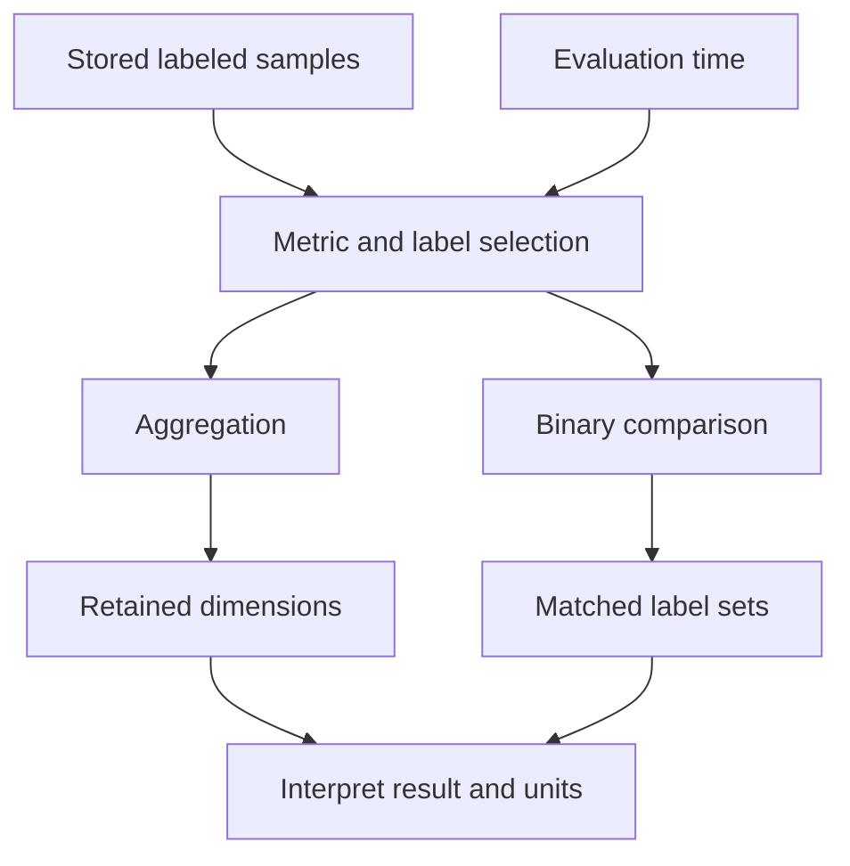

# Lab 11: PromQL Selectors, Matchers, and Aggregation

## 1. Purpose and Learning Outcomes

**In Plain Language:** You will ask precise questions of the samples Prometheus has collected. Start with exact metric and label selections, then aggregate only the dimensions appropriate to the question. Small controlled examples show why a valid query can return the wrong population, an empty result, or a number with a different meaning from the one you intended.

> **Primary Objective:** Query the collected series with deliberate label scope, preserve useful dimensions during aggregation, and distinguish filtered results, numeric zero, missing data and query errors.

Prometheus can return a syntactically valid number that answers the wrong question. This lab focuses on selecting the intended workload and retaining the dimensions needed to interpret it.

You will use the Prometheus query API and expression browser. Grafana is still stopped. Counter-rate functions are intentionally deferred to Lab 12 so that label and result-type mistakes are visible before more math is added.

## 2. Starting Point and Lab Map

Use this guide inside the complete application repository. Run commands from the repository root in Bash unless a step says otherwise. Work through the starting checks in order; they load the helpers and state this lab needs.

Read the explanation before each step, run one complete code block at a time, and compare the actual result with the stated expectation. Save commands, observations, explanations, and unexpected results in your notebook.

### Key Terms

| **Term**        | **Plain-Language Meaning**                                                 |
| --------------- | -------------------------------------------------------------------------- |
| Selector        | The metric name and label conditions that choose a population of series.   |
| Aggregation     | Combining series while deliberately retaining or removing grouping labels. |
| Vector matching | The rules that pair labeled results for a binary calculation.              |

### Lab Map

The arrows show the flow or dependency being studied. Branches identify paths to compare; this is a conceptual map, not a captured runtime trace.



## 3. Guided Walkthrough

### Step 01. Inherited State and Starting Checks

**What You Are Doing:** Confirm that discovery and scraping are healthy before debugging expressions. A missing source is a collection problem, even if it first appears as an empty query result.

**Practical Walkthrough:** Load the metrics-stage helper and verify current target health before running queries. Check a direct business request as well as Prometheus readiness. If the source is not being scraped, a correct selector may still return no current evidence, so resolve collection problems before changing the expression to make data appear.

Inspect the saved active-target file and `up` results before evaluating business selectors. Confirm the approved app address is restored. If collection is failing, repair that path first; broadening a query until old data appears would conceal the prerequisite failure instead of fixing it.

```bash
source lab-notes/session.sh
source lab-notes/evidence.sh
source lab-notes/raw-metrics.sh
source lab-notes/metrics-session.sh
metrics_check
start_lab 11
api -fsS "$PROM_URL/api/v1/targets?state=active" > "$LAB_DIR/starting-targets.json"
pq 'up{job=~"fastapi|prometheus"}' | jq .
```

**Expected Result:** the four-service stage from Lab 10, with healthy FastAPI and Prometheus targets. Keep the target file restored to `app:8000`. An unexplained missing target is a prerequisite failure, not a PromQL exercise.

**Understanding the Result:** A query can succeed syntactically while its source is missing. Keep query validity and source availability separate.

### Step 02. Scope and Learning Objectives

**What You Are Doing:** Focus on selecting the right population and preserving its meaning. The first goal is a correctly scoped answer, before later labs calculate rates or percentiles.

**Practical Walkthrough:** Use the objectives to practice defining a population: which job, route, method, status, and time are included? Write that intended population next to each expression. This makes the result explainable and prepares you to calculate rates later without accidentally combining unrelated work.

Write the intended population in plain language before each expression, including the dimensions you want to retain. After querying, compare every returned label set with that description. This makes a syntactically valid but incorrectly scoped answer visible before rates or ratios add further complexity.

You will select by metric name and labels, use exact/negative/regex matchers, inspect instant and range results, group and aggregate deliberately, and demonstrate how label mismatch can remove a binary-operation result.

By completion, explain every returned label set and distinguish no data from zero and a failed query. You will not add recording rules, dashboards, alerts, exporters or new business endpoints.

**Understanding the Result:** The most useful query is correctly scoped. A larger result set is not automatically a more complete answer.

### Step 03. Query Evaluation Is Another Observation Boundary

**What You Are Doing:** Remember that evaluating a query reads stored observations. It neither creates new application work nor forces Prometheus to collect a fresh sample.

**Practical Walkthrough:** Read the query's evaluation time as the point at which Prometheus examines stored observations. An instant query evaluates once; a range query repeats evaluation at multiple points. Neither operation triggers application requests or forces a new scrape, so changing the query cannot manufacture missing source observations.

Keep collection time and evaluation time separate. An instant selector reads the available stored evidence at one evaluation point, while a range query repeats evaluation according to its step. Neither operation asks the application to generate work, so an empty selection needs a source or selector investigation.

Relevant events are still application requests, dependency changes and Prometheus scrapes. A query evaluates stored samples; it does not send a new business request or force a new scrape.

| **Object**        | **Meaning**                                                            |
| ----------------- | ---------------------------------------------------------------------- |
| Selector          | Chooses stored series by name and label matchers                       |
| Instant vector    | At most one selected value per series at an evaluation time            |
| Range vector      | A sequence of stored samples per selected series over a lookback range |
| Instant query API | Evaluates one expression at one time                                   |
| Range query API   | Repeats an expression at evenly spaced evaluation steps                |
| Aggregation       | Combines selected series while retaining/removing chosen labels        |

Classic histogram bucket/count/sum series are ordinary numeric series to PromQL. Native histogram samples are a separate feature; this application does not expose them. See the [PromQL basics reference](https://prometheus.io/docs/prometheus/latest/querying/basics/).

**Understanding the Result:** Query time and scrape time are different clocks. Inspect both when judging whether a result reflects recent activity.

### Step 04. Create a Small, Explainable Set of Request Series

**What You Are Doing:** Generate a small request population whose route, method, and status labels you can predict. Wait for collection before checking for the newly created series.

**Practical Walkthrough:** Run the bounded workload and predict the labels each response will create. Wait for a scrape containing that activity, then inventory the resulting series. Retain the actual statuses: an unexpected response can create a different label combination from the one you planned, even when the command reached the app.

Save the created ID and actual statuses for the bounded workload, then wait for collection. Use those responses to predict method, route, and status labels. If the observed label inventory differs, first compare actual outcomes with planned outcomes rather than assuming Prometheus renamed the series incorrectly.

```bash
api -fsS -H 'Content-Type: application/json' \
  -d '{"name":"Lab 11 selector subject","price":"11.00"}' \
  "$APP_URL/api/v1/items" -o "$LAB_DIR/item.json"
ITEM_ID=$(jq -er '.id' "$LAB_DIR/item.json")
for n in 1 2 3; do
  api -fsS "$APP_URL/api/v1/items?limit=1" >/dev/null
  api -sS -o /dev/null "$APP_URL/api/v1/items/$(new_uuid)"
done
api -sS -o /dev/null "$APP_URL/lab11-unmatched"
api -sS -H 'Content-Type: application/json' -d '{"name":"","price":"-1"}' \
  "$APP_URL/api/v1/items" -o "$LAB_DIR/validation.json"
snapshot "$LAB_DIR/raw-series.json"
```

Predict which route/method/status combinations now exist. Allow a scrape before expecting new children in Prometheus; target health alone does not guarantee that your most recent event has already been collected.

The invalid and missing-item requests are intentional bounded observations. Their IDs must not become label values.

**Understanding the Result:** The workload supplies known examples for selection. The number of series is determined by label combinations, not by request count.

### Step 05. Begin with Exact Selectors

**What You Are Doing:** Start with exact matches so each returned series is easy to explain. Separate labels created by application instruments from labels attached by scraping.

**Practical Walkthrough:** Start with an exact metric name and explicit equality matchers. Inspect every returned label set and relate it to the workload. Separate the app's route and status labels from Prometheus's job and instance labels, because they are attached at different stages and describe different aspects of the observation.

Read the complete metric label object in each result. Application dimensions describe the measured request, while `job` and `instance` identify the scrape context. Start with explicit equality matchers so you can account for every selected series before introducing broader regex or negative selection.

```bash
pq 'application_http_requests_total{job="fastapi"}' \
  | tee "$LAB_DIR/all-request-series.json" | jq '.data.result[] | {metric,value}'
pq 'application_http_requests_total{job="fastapi",method="GET",route="/api/v1/items",status_code="200"}' \
  | jq .
pq 'application_items_mutations_total{job="fastapi",operation="create"}' | jq .
```

List the metric's own labels separately from `job`, `instance`, `environment` and `service` added by scraping. Do not assume an internal discovery label such as `__address__` is available on every stored sample.

These values are cumulative counts since the relevant process/child began. They are not requests per second or counts limited to the last five minutes.

**Understanding the Result:** Each returned series should have a clear reason for matching. Unexpected series usually indicate that the selector is broader than intended.

### Step 06. Use Matchers with Explicit Intent

**What You Are Doing:** Compare exact and regular-expression matchers against known values. State which series each matcher is meant to include before interpreting its result.

**Practical Walkthrough:** Predict which known label values each exact or regular-expression matcher will admit, then run the expressions. Read the supplied patterns as label-value tests, not as unrestricted text searches through log lines. Compare results by complete label sets so you can see precisely which populations were added or removed.

List the known values each matcher should include before running it. Inspect full returned labels afterward, especially for negative and regex cases. PromQL regex matchers operate on label values, so a familiar pattern should still be checked against the exact scope and values present in this dataset.

```bash
pq 'application_http_requests_total{job="fastapi",status_code=~"4.."}' | jq .
pq 'application_http_requests_total{job="fastapi",method=~"GET|POST"}' | jq .
pq 'application_http_requests_total{job="fastapi",route!="__unmatched__"}' | jq .
pq 'application_http_requests_total{job="fastapi",status_code!~"2.."}' | jq .
```

| **Matcher** | **Effect in These Queries**                                   |
| ----------- | ------------------------------------------------------------- |
| `=`         | Exact string match                                            |
| `!=`        | Excludes an exact value; also consider labels that are absent |
| `=~`        | Regex match over the complete label value                     |
| `!~`        | Rejects a regex match                                         |

PromQL regex matchers are fully anchored. `status_code=~"4"` does not mean “contains 4” or “all 4xx”; use the intended full pattern. Multiple matchers in one selector are combined as conditions on each series.

Avoid a broad regex when an exact known value expresses the question. More complex syntax is not automatically better query scope.

**Understanding the Result:** A matcher changes selection, not the underlying samples. Preserve its intended inclusion rule in your saved query notes.

### Step 07. Test Missing-Label Semantics

**What You Are Doing:** Test an absent label explicitly. Negative conditions can admit series without that label, so exclusion is not always enough to define the intended population.

**Practical Walkthrough:** Test the examples involving a label that some series do not possess. Pay special attention to negative matchers: excluding a particular value can still admit series where the label is absent. Add the explicit scope required by the question instead of assuming exclusion alone defines the desired population.

Compare the missing-label examples with a selector that requires an actual nonempty value. A negative condition can admit absence, which may broaden the population beyond what you intended. Preserve that distinction when explaining why an apparently restrictive expression returned more series than expected.

```bash
pq 'application_dependency_up{job="fastapi",label_not_defined_here=""}' | jq .
pq 'application_dependency_up{job="fastapi",label_not_defined_here!="present"}' | jq .
```

Both can match series where that label is absent. This is why a negative matcher is not always a safe way to restrict a population to objects that actually carry a label.

Write a positive scope first, such as the expected job and service/environment, then add exclusions. A query that silently includes missing-label populations can look correct when only one target exists and become misleading after more exporters are introduced.

**Understanding the Result:** Missing-label behavior can explain unexpectedly broad results. Inspect labels before interpreting a negative matcher as a complete filter.

### Step 08. Inspect Metric Names without Inventing Them

**What You Are Doing:** Discover actual metric names and count series by name. This is an inventory of measurement dimensions, not a count of business events.

**Practical Walkthrough:** Use the inventory expressions to list real metric names and count their matching series. Relate a larger count to different label combinations or family components. This helps discover the schema, but it does not tell you how many requests occurred because each series can accumulate many observations.

Read the grouped count as a count of matching series, not accumulated events. One route-status combination can contain many requests inside one counter. Use this inventory to discover real names and dimensions, then choose the actual value query needed for the operational question.

```bash
pq 'count by (__name__) ({job="fastapi",__name__=~"application_.*"})' \
  | tee "$LAB_DIR/family-series-counts.json" | jq '.data.result'
```

This counts selected **series**, not events. Histogram bucket and creation-time names are separate entries. Compare with the raw-snapshot inventory from Lab 7.

`__name__` is the metric-name label available to selectors. Other double-underscore names commonly belong to discovery/relabeling internals and have different lifecycles. Do not add imagined labels to make an expression return data.

**Understanding the Result:** Series count measures the shape of the dataset. Read a counter's value or change to reason about observed events.

### Step 09. Preserve the Dimensions Needed for the Question

**What You Are Doing:** Aggregate the same population with different retained labels. Observe which questions become impossible once route or status detail has been removed.

**Practical Walkthrough:** Apply the aggregations to the same selected population and inspect both output values and remaining labels. Removing route or status produces a simpler total while discarding that dimension of explanation. Choose retained labels based on the question you still need to answer after aggregation.

Inspect the output labels after each aggregation as carefully as the number. Once a dimension is removed, that result cannot explain differences along it. Retain route, method, or status only where the question needs them, and describe the meaning of the remaining groups explicitly.

```bash
pq 'sum by (route, method, status_code) (application_http_requests_total{job="fastapi"})' | jq .
pq 'sum by (route, method) (application_http_requests_total{job="fastapi"})' | jq .
pq 'sum by (status_code) (application_http_requests_total{job="fastapi"})' | jq .
pq 'sum(application_http_requests_total{job="fastapi"})' | jq .
```

Predict how many result groups should remain after each aggregation. The final sum discards route and status detail, so it cannot identify which route returned 404 even when the total is numerically correct.

Grouping is a semantic decision. In a future multi-service or multi-environment query, retain service/environment unless your question intentionally combines them. This single-target exercise does not justify dropping those dimensions from every production dashboard.

**Understanding the Result:** Once a dimension is summed away, the resulting value cannot identify which member contributed it. Keep diagnostic detail deliberately.

### Step 10. Compare by and Without

**What You Are Doing:** Compare an explicit list of labels to keep with a list to remove. The two forms can retain different dimensions even when their numeric totals happen to agree.

**Practical Walkthrough:** Compare `by` and `without` on input containing more than one label dimension. The first names the labels retained; the second names labels removed. Inspect the output rather than judging equivalence from equal totals, because extra input labels can make the two expressions produce different groups.

Compare the two returned label objects even when their totals happen to match. `by` defines the retained grouping keys, while `without` keeps other labels not named for removal. A later added input label can therefore alter the grouping behavior of the second expression.

```bash
pq 'sum by (route, method) (application_http_requests_total{job="fastapi"})' | jq '.data.result[].metric'
pq 'sum without (status_code, instance) (application_http_requests_total{job="fastapi"})' | jq '.data.result[].metric'
```

`by` keeps only the specified grouping labels; `without` removes the listed labels and preserves the other grouping dimensions. The second expression retains job/service/environment, so its result label sets need not match the first expression even when some numeric totals are equal.

When you later divide vectors, their labels determine which series can match. Inspect result labels before assuming missing output is a missing scrape.

**Understanding the Result:** Equal numbers do not imply equal series identity. Future label additions can also affect the two grouping styles differently.

### Step 11. Observe a Label-Matching Mistake Safely

**What You Are Doing:** Try a binary calculation whose operands carry different labels, then align them deliberately. An empty result can come from pairing rules rather than absent input data.

**Practical Walkthrough:** Evaluate each operand separately before attempting the binary expression. If both return data but their combination is empty, compare their label sets and the documented matching rule. Align the operands to the intended shared population; do not fill the empty result with zero to conceal a pairing mistake.

Run numerator and denominator separately, then compare the labels used for pairing. Empty division can mean unmatched series rather than zero errors or missing source data. Align both operands to the same intended groups and preserve the original failed expression as evidence of the matching mistake.

```bash
pq 'application_http_server_errors_total{job="fastapi"} / application_http_requests_total{job="fastapi"}' \
  | tee "$LAB_DIR/mismatched-division.json" | jq .
pq 'sum by (method,route) (application_http_server_errors_total{job="fastapi"}) / sum by (method,route) (application_http_requests_total{job="fastapi"})' \
  | tee "$LAB_DIR/aligned-division.json" | jq .
```

The first operands have different label sets because the request counter includes `status_code`. Default vector matching can therefore produce no matching output. The second expression intentionally aligns labels first.

The second result is a **process-lifetime cumulative fraction**, not a recent incident error rate. It also needs meaningful nonzero denominators. Lab 12 replaces cumulative values with reset-aware rates over the same time range before calculating an operational error ratio.

Do not add `group_left` or `group_right` merely to silence a matching problem. First state the intended relationship and aggregation scope.

**Understanding the Result:** Binary operations need compatible series identities. An empty combination can be a matching problem even when neither input is missing.

### Step 12. Prove Why Job Scope Matters

**What You Are Doing:** Compare a metric shared by multiple jobs with an app-only selection. Adding different processes together changes the scope of the answer.

**Practical Walkthrough:** Select a metric name exposed by more than one process, then add the intended job scope. Compare which instances remain and explain what a cross-job sum would mean. Shared naming does not establish that every process belongs in an application-specific answer.

Compare the same metric across FastAPI and Prometheus, then apply the app-only scope. A shared metric name can describe different processes. Explain whether a sum represents one application's memory or several processes' memory before using it to answer an application-specific resource question.

```bash
pq 'process_resident_memory_bytes{job=~"fastapi|prometheus"}' | jq .
pq 'sum(process_resident_memory_bytes{job=~"fastapi|prometheus"})' | jq .
pq 'process_resident_memory_bytes{job="fastapi"}' | jq .
```

The first query observes two different processes. The sum is combined resident process memory, not FastAPI memory and not total host RAM. Shared pages and process accounting also make summing RSS different from a complete physical-memory model.

An unscoped familiar metric name can include more populations as exporters are added. Record your intended job/service/time scope alongside every saved query.

**Understanding the Result:** The `job` selector defines observer scope. Include it where the operational question concerns one service population.

### Step 13. Separate Instant Results from Range Evaluation

**What You Are Doing:** Compare one evaluation with repeated evaluations across time. A smaller display step increases evaluation points without creating additional scrape observations.

**Practical Walkthrough:** Run the instant and range examples with explicit time settings and compare their returned points. A finer range-query step requests more evaluations of stored data; it does not increase collection frequency. Several evaluations may therefore depend on the same underlying scrape observations.

Inspect `resultType` and timestamps in the returned JSON before interpreting the points. A range selector in an instant query exposes stored samples; a range query evaluates an expression repeatedly. A smaller evaluation step can create more result points without adding any new scrape observations.

```bash
pq 'application_http_requests_total{job="fastapi",method="GET",route="/api/v1/items",status_code="200"}[2m]' \
  | tee "$LAB_DIR/raw-range-vector.json" | jq '.data.resultType,.data.result'
END=$(date +%s)
START=$((END-120))
api -fsS --get \
  --data-urlencode 'query=application_http_requests_total{job="fastapi",method="GET",route="/api/v1/items",status_code="200"}' \
  --data-urlencode "start=$START" --data-urlencode "end=$END" \
  --data-urlencode 'step=15' "$PROM_URL/api/v1/query_range" \
  | tee "$LAB_DIR/repeated-evaluation.json" | jq '.data.resultType,.data.result'
```

The instant API can return a range-vector expression. The range API instead repeats an instant-vector/scalar expression at evaluation steps. Its matrix-shaped response does not mean you supplied a raw range-vector expression.

A finer query step can repeat the latest eligible sample; it does not increase scrape frequency or reconstruct request events between scrapes. Missing initial points can simply mean the series did not exist during that part of the window.

**Understanding the Result:** Display resolution and measurement resolution differ. Preserve start, end, step, and expression when reproducing a graph.

### Step 14. Predict Boolean Filtering During Cache Degradation

**What You Are Doing:** Predict how a comparison filter and a Boolean comparison represent a failed dependency. One selects matching samples; the other reports a truth value for each comparison.

**Practical Walkthrough:** Predict the outputs of the ordinary comparison and its `bool` form before changing Redis. The filtering form retains matching samples and removes others; the Boolean form represents comparison truth numerically for applicable inputs. This affects whether an expression returns a zero-valued series or no series.

Predict both membership and values. The filtering comparison keeps only inputs satisfying the condition, while `bool` returns truth values for applicable inputs. This distinction is why a healthy dependency may disappear from one result while appearing with numeric zero in the other.

You will stop only Redis, then compare the two real dependency gauges. Predict the output labels and numeric values of these expressions:

```promql
application_dependency_up{job="fastapi"} == 0
```

```promql
application_dependency_up{job="fastapi"} == bool 0
```

The first filters samples by a condition while retaining matching sample values. The second returns a numeric truth value for each matched input series. Neither invents a sample for missing telemetry.

**Understanding the Result:** Presence and value are separate concepts. This distinction becomes important later when alert rules interpret returned series.

### Step 15. Run the Bounded Gauge Experiment

**What You Are Doing:** Stop Redis briefly and inspect both expressions against the actual dependency gauges. Their labels and values should match your predicted comparison semantics.

**Practical Walkthrough:** Stop Redis only inside the bounded experiment and wait for the app's dependency observation to be scraped. Run both comparison expressions against the same labels and evaluation context. Restore Redis afterward and observe how each expression changes as fresh healthy samples arrive.

Wait for the dependency gauge change to be observed and scraped before comparing expressions. Keep Redis restoration in the full bounded block. After recovery, allow fresh healthy samples to arrive and compare how result membership and Boolean values return to their predicted states.

```bash
(
  set -euo pipefail
  trap 'dc start redis >/dev/null' EXIT
  trap 'exit 130' INT
  trap 'exit 143' TERM
  record_change "stop_redis_for_selector_experiment" planned
  dc stop redis
  api -fsS "$APP_URL/health/ready" | tee "$LAB_DIR/degraded-ready.json" | jq .
  wait_metric 'application_dependency_up{job="fastapi",dependency="redis"}' 0
  pq 'application_dependency_up{job="fastapi"} == 0' > "$LAB_DIR/filter-result.json"
  pq 'application_dependency_up{job="fastapi"} == bool 0' > "$LAB_DIR/bool-result.json"
  jq '.data.result' "$LAB_DIR/filter-result.json" "$LAB_DIR/bool-result.json"
  wait_target fastapi up
)
wait_ready
wait_metric 'application_dependency_up{job="fastapi",dependency="redis"}' 1
record_change "restore_redis_after_selector_experiment" completed
```

**Command Note:** `trap ... EXIT` schedules cleanup when that shell exits. Keep it in the same block as the fault; the explicit recovery checks afterward confirm that restoration actually succeeded.

**Expected Result:** the filtered expression returns only Redis with value zero. The bool expression returns Redis with value one and PostgreSQL with value zero. FastAPI remains scrapeable and readiness is degraded, not unavailable.

The extra wait matters: the direct readiness response updates application-observed state, but Prometheus still needs a scrape before a query sees it.

**Understanding the Result:** Compare actual label sets as well as values. Collection delay can explain a brief lag between dependency recovery and query recovery.

### Step 16. Distinguish No Data, Zero and Query Failure

**What You Are Doing:** Examine empty success, observed zero, and query failure separately. Replacing all missing output with zero would erase distinctions you need for diagnosis.

**Practical Walkthrough:** Run the supplied examples of observed zero, an empty successful query, and a rejected query. Inspect API status and errors before interpreting the data field. These cases need different next actions: understand the measurement, check the selector or source, or correct the expression.

Inspect the API's success or error envelope before reading any sample value. A successful empty array, a returned zero, and a rejected expression require different explanations. Do not normalize all three to zero; doing so would hide query errors and missing evidence behind an apparently reassuring value.

```bash
pq 'application_dependency_up{job="fastapi",dependency="not-configured"}' | jq .
pq 'application_dependency_up{job="fastapi",dependency="redis"} == bool 0' | jq .
api -sS --get --data-urlencode 'query=sum(' \
  -o "$LAB_DIR/syntax-error.json" -w 'HTTP %{http_code}\n' "$PROM_URL/api/v1/query"
jq . "$LAB_DIR/syntax-error.json"
```

The first is a successful query with an empty vector. The second, after recovery, is a present series with numeric zero. The third is a failed query with an error response and non-success HTTP status.

Do not use unconditional `or vector(0)` to turn every missing population into healthy-looking data. Missing-series handling requires an explicit availability and alerting policy.

**Understanding the Result:** Do not collapse all three into a displayed zero. That would hide information needed to diagnose the failure.

### Step 17. Recover, Clean Up and Preserve Useful Queries

**What You Are Doing:** Restore the baseline and save useful expressions with their scope, units, and time settings. Those details make a query reproducible outside a screenshot.

**Practical Walkthrough:** Verify Redis and current scrape health, then save the useful expressions with units, label scope, and time settings. Include what each query is intended to answer so it remains understandable outside this lab. A screenshot alone usually omits enough context to make later reproduction ambiguous.

Delete only the fixture and verify both dependency recovery and active scrape health. Save useful expressions with label scope, units, and evaluation settings. Those details make the result reproducible; the displayed value alone cannot reveal which population or time context produced it.

```bash
api -fsS -X DELETE "$APP_URL/api/v1/items/$ITEM_ID" -o /dev/null
metrics_check
pq 'up{job=~"fastapi|prometheus"}' > "$LAB_DIR/final-up.json"
pq 'application_dependency_up{job="fastapi"}' > "$LAB_DIR/final-dependencies.json"
capture_app_logs
```

Keep the query expressions in your notebook with their intended scope, result type and units. A screenshot without the expression/time window is incomplete investigation evidence. No permanent configuration change was needed in this lab.

**Understanding the Result:** The recovered baseline should be healthy, while historical experiment samples may remain queryable in their original time window.

## 4. Troubleshooting and Diagnosis

Start with the first unexpected result. Record the exact symptom, identify which component produced it, and use the checks below before repeating the experiment. After a fix, repeat the original check and confirm recovery.

### Troubleshooting Runbook

| **Symptom**                                        | **Check**                                                                           |
| -------------------------------------------------- | ----------------------------------------------------------------------------------- |
| Empty result for a real metric                     | Confirm job, exact label names/values, time, staleness and whether the child exists |
| Regex does not match expected status               | Remember full-value matching; use `4..`, not `4`                                    |
| Negative matcher returns more series than expected | Check absent-label matching and add explicit positive scope                         |
| Sum hides the offending route                      | Retain route/status before aggregating to a service total                           |
| Division unexpectedly returns no data              | Inspect operand label sets and intended matching before adding group modifiers      |
| Value looks like a huge request rate               | You queried a cumulative counter; rate functions come next                          |
| Memory query grows after adding a target           | Scope the intended job instead of silently summing different processes              |
| Range API rejects a raw range vector               | Use an instant-vector/scalar expression for repeated range evaluation               |
| Redis recovery is not immediately visible          | Compare direct readiness with scrape time and wait for fresh collection             |
| Query error displayed as zero                      | Inspect API status/error fields; syntax failure is not a measured value             |

Use the smallest selector that establishes data presence, then add one matcher or aggregation at a time.

## 5. Review and Practice

Answer the knowledge questions in your own words before reading the answer guide. For the scenario, name the evidence you would collect and the conclusion each observation would support.

### Knowledge Check

1. Does an instant query force a scrape?
2. Why does status_code=~"4" not select 404?
3. Can a matcher for an empty label value match an absent label?
4. What does count by (__name__) count here?
5. What difference matters between by and without?
6. Why can two populated vectors divide to an empty result?
7. Is a cumulative error fraction a recent error rate?
8. Does a query step of one second imply one-second collection?
9. What does ==0 return for a matching zero gauge?
10. Can ==bool0 establish anything about an absent input series?

#### Answer Guide

1. No; it evaluates stored samples.
2. Regex matchers match the complete value.
3. Yes.
4. Series grouped by sample metric name, not business events.
5. by keeps specified labels; without removes specified labels while preserving others.
6. Their label sets may not match under default vector matching.
7. No; it mixes process-lifetime history and resets.
8. No; evaluation can reuse the latest eligible scraped value.
9. The matching series with its original zero value.
10. No; bool transforms present inputs, not missing evidence.

### Professional Scenario Exercise

A chart labelled “FastAPI memory” increases when Prometheus restarts, and a 5xx fraction panel is empty despite populated counters. Diagnose both using metric scope and label matching. Show the intermediate selectors you would inspect before editing dashboard units or filling missing values with zero.

## 6. Completion Checklist

Mark each item only after you can point to its result or evidence file. Complete any cleanup shown here before moving on.

### Observable Completion Criteria

- [ ] Exact route/method/status selections return explained series.
- [ ] Regex and missing-label semantics are demonstrated.
- [ ] Series count is distinguished from event count.
- [ ] Aggregation retains or discards labels deliberately.
- [ ] A vector-matching failure is explained and corrected by aligned scope.
- [ ] Process memory is scoped to the intended job.
- [ ] Instant/range query behavior is compared with captured API output.
- [ ] The Redis experiment distinguishes filtering from bool truth values.
- [ ] No data, zero and syntax failure remain distinct.
- [ ] Redis, app targets and checkpoint state are healthy after cleanup.

## 7. Production Context and Next Lab

### Production Implications

PromQL correctness includes population, dimensions, units and time semantics, not only parser acceptance. A syntactically valid sum can combine unrelated processes, and a missing result can come from label matching rather than missing telemetry. Preserve query intent as operational documentation before using expressions in dashboards or alerts.

### End State and Transition

Leave the four-service metrics stage healthy and retain the same discovery configuration.

Next: [Lab 12 — Counter Math: rate, irate, and increase](Lab-12.md). You will turn correctly scoped cumulative state into meaningful throughput and interval estimates, including across an application restart.