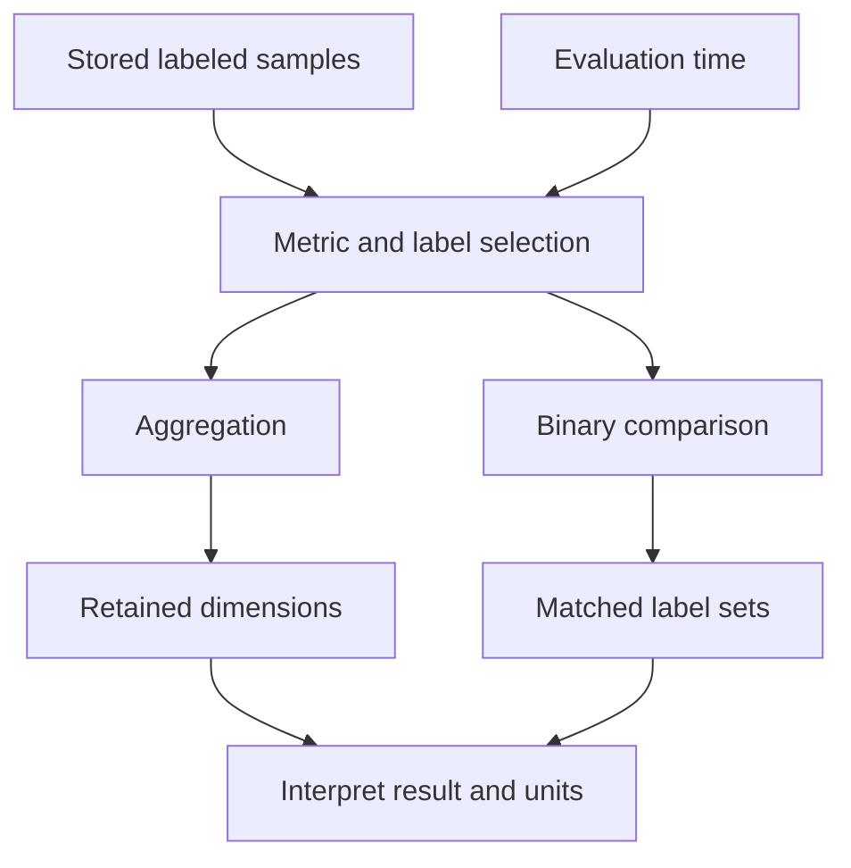

# Lab 11: PromQL Selectors, Matchers, and Aggregation

## 1. Purpose and Learning Outcomes

You will learn to ask clear questions about the measurements stored in Prometheus. First, choose the metric and labels that identify the data you need. Then combine values only where it makes sense for your question. Small examples will show how a query can be valid but still select the wrong data, return nothing, or produce a number that means something different from what you expected.

> **Primary Objective:** Choose series using clear label conditions, keep the labels you need when combining values, and tell the difference between a filtered result, zero, missing data, and a query error.

Prometheus can accept a query and return a number even when the query answers the wrong question. In this lab, you will choose the correct workload and keep the labels needed to explain the result.

You will use the Prometheus query API and expression browser. Grafana remains stopped. You will learn counter-rate functions in Lab 12. For now, work on label selection and result types so you can recognize these mistakes before adding more calculations.

## 2. Starting Point and Lab Map

Open the complete application repository before using this guide. Unless a step says otherwise, run commands in Bash from the repository's top-level folder. Follow the starting checks in order because later commands depend on the helper functions and running services they prepare.

Read each explanation before running its commands. Run one complete code block, check the result, and then continue. In your notebook, save the commands, what happened, why you think it happened, and anything that differed from the expected result.

### Key Terms

| **Term**        | **Explanation**                                                                     |
| --------------- | ----------------------------------------------------------------------------------- |
| Selector        | A metric name and label conditions that choose which series to read.                |
| Aggregation     | Combining values from several series, while choosing which grouping labels to keep. |
| Vector matching | Rules that decide which labeled results can be paired in a calculation.             |

### Lab Map

The arrows show how the parts connect and where a request can take different paths. Use this map to understand the design. It is not a recording of a request that actually ran.



## 3. Guided Walkthrough

### Step 01. Inherited State and Starting Checks

**What You Are Doing:** Check that Prometheus can find and scrape the targets before investigating queries. If a source is missing, fix data collection first, even if you noticed the problem through an empty query result.

**Practical Walkthrough:** Load the helper for the metrics stage and check target health. Also send a business request directly to the app and check whether Prometheus is ready. A correct selector can return no current data when its source is not being scraped. Fix that collection problem before changing the query.

Inspect the saved active-target file and the `up` results before querying business metrics. Check that the approved app address has been restored. If collection is failing, repair it first. Making the query broader until it finds old data would hide the problem.

```bash
source lab-notes/session.sh
source lab-notes/evidence.sh
source lab-notes/raw-metrics.sh
source lab-notes/metrics-session.sh
metrics_check
start_lab 11
api -fsS "$PROM_URL/api/v1/targets?state=active" > "$LAB_DIR/starting-targets.json"
pq 'up{job=~"fastapi|prometheus"}' | jq .
```

**Expected Result:** The four services used in Lab 10 are running, and the FastAPI and Prometheus targets are healthy. Keep the target file set to `app:8000`. If a target is missing for an unknown reason, fix that starting requirement before continuing with PromQL.

**Understanding the Result:** A query can be written correctly while its data source is unavailable. Check query syntax and source availability separately.

### Step 02. Scope and Learning Objectives

**What You Are Doing:** Choose the right set of series and keep enough detail to explain it. Get this selection right before later labs add rates or percentiles.

**Practical Walkthrough:** For each expression, write down which job, route, method, status, and time you mean to include. This description defines the set of data you want. It will also help you calculate rates later without mixing unrelated requests.

Before running each expression, describe the data you want in plain language, including the labels you want to keep. Then check every returned label set against that description. This helps you catch a query that runs successfully but selects the wrong data before you add rates or ratios.

You will choose series by metric name and labels; try exact, negative, and regular-expression matchers; inspect instant and range results; and choose how to group values. You will also see how incompatible labels can make a calculation return no result.

By the end, you should be able to explain every returned label set and tell the difference between no data, zero, and a failed query. This lab does not add recording rules, dashboards, alerts, exporters, or new business endpoints.

**Understanding the Result:** A useful query selects the data that answers your question. Returning more series does not necessarily make the answer better.

### Step 03. Query Evaluation Is Another Observation Boundary

**What You Are Doing:** Understand that a query reads measurements already stored in Prometheus. Running a query does not create application traffic or force a new scrape.

**Practical Walkthrough:** The evaluation time is the time at which Prometheus works out the query result from stored measurements. An instant query does this once. A range query does it at several times. Neither sends requests to the app or triggers a scrape, so changing a query cannot create measurements that were never collected.

Keep the time of collection separate from the time of query evaluation. An instant selector reads the available stored data at one evaluation time. A range query repeats this at the chosen step interval. If the selection is empty, investigate the data source and the selector; the query itself does not make the app do work.

The events that produce or collect data are still application requests, dependency changes, and Prometheus scrapes. A query only reads the stored samples. It does not send a business request or force a scrape.

| **Object**        | **Meaning**                                                            |
| ----------------- | ---------------------------------------------------------------------- |
| Selector          | Chooses stored series using a metric name and label conditions         |
| Instant vector    | Up to one selected value for each series at one evaluation time        |
| Range vector      | Stored samples for each selected series over a lookback period         |
| Instant query API | Works out the result of an expression at one time                      |
| Range query API   | Works out the result repeatedly at equally spaced times                |
| Aggregation       | Combines series while keeping or removing the labels you choose        |

PromQL treats classic histogram bucket, count, and sum series as ordinary numeric series. Native histogram samples are a different feature, which this application does not expose. See the [PromQL basics reference](https://prometheus.io/docs/prometheus/latest/querying/basics/).

**Understanding the Result:** Query evaluation and scraping happen at different times. Check both times when deciding whether a result includes recent activity.

### Step 04. Create a Small, Explainable Set of Request Series

**What You Are Doing:** Send a small set of requests whose route, method, and status labels you can predict. Give Prometheus time to scrape them before looking for the new series.

**Practical Walkthrough:** Run the limited workload and predict the labels each response should create. Wait for a scrape that includes these requests, then list the resulting series. Record the actual response statuses. An unexpected status can create a different label combination from the one you planned.

Save the created ID and the actual response statuses, then wait for collection. Use those responses to predict the method, route, and status labels. If the labels you find are different, compare the actual responses with your predictions before assuming Prometheus changed the names.

```bash
api -fsS -H 'Content-Type: application/json' \
  -d '{"name":"Lab 11 selector subject","price":"11.00"}' \
  "$APP_URL/api/v1/items" -o "$LAB_DIR/item.json"
ITEM_ID=$(jq -er '.id' "$LAB_DIR/item.json")
for n in 1 2 3; do
  api -fsS "$APP_URL/api/v1/items?limit=1" >/dev/null
  api -sS -o /dev/null "$APP_URL/api/v1/items/$(new_uuid)"
done
api -sS -o /dev/null "$APP_URL/lab11-unmatched"
api -sS -H 'Content-Type: application/json' -d '{"name":"","price":"-1"}' \
  "$APP_URL/api/v1/items" -o "$LAB_DIR/validation.json"
snapshot "$LAB_DIR/raw-series.json"
```

Predict which route, method, and status combinations now exist. Wait for a scrape before expecting newly created labeled series in Prometheus. A healthy target does not prove that the latest request has already been collected.

The invalid request and the request for a missing item are intentional, limited examples. Their individual IDs must not be used as label values.

**Understanding the Result:** These requests give you known examples to query. Each different label combination creates a series; sending more requests with the same labels increases the value of that series.

### Step 05. Begin with Exact Selectors

**What You Are Doing:** Begin with exact matches so you can explain why each series was selected. Identify which labels come from the application and which are added during scraping.

**Practical Walkthrough:** Use the exact metric name and equality matchers. Read the full label set for every returned series and connect it to the requests you sent. The app adds labels such as route and status. Prometheus adds labels such as job and instance. These labels describe different parts of the observation.

Read all the labels in each metric result. Application labels describe the request being measured; `job` and `instance` describe where Prometheus scraped it. Use exact equality matchers first so you can explain every selected series before trying regular expressions or exclusions.

```bash
pq 'application_http_requests_total{job="fastapi"}' \
  | tee "$LAB_DIR/all-request-series.json" | jq '.data.result[] | {metric,value}'
pq 'application_http_requests_total{job="fastapi",method="GET",route="/api/v1/items",status_code="200"}' \
  | jq .
pq 'application_items_mutations_total{job="fastapi",operation="create"}' | jq .
```

List the metric's application labels separately from `job`, `instance`, `environment` and `service`, which are added during scraping. An internal discovery label such as `__address__` is not necessarily present on stored samples.

These counter values are totals since the relevant process or labeled counter started. They are not requests per second, and they are not limited to requests from the last five minutes.

**Understanding the Result:** You should be able to explain why every returned series matched. If extra series appear, check whether your selector includes more data than intended.

### Step 06. Use Matchers with Explicit Intent

**What You Are Doing:** Compare exact matches and regular-expression matches using values you already know. Before each query, say which series you expect it to include.

**Practical Walkthrough:** Predict which known label values each matcher will accept, then run the expressions. These patterns test label values; they do not search freely through log text. Compare the complete label sets to see which series were included or excluded.

List the values each matcher should select before running it. Afterward, read the full labels, especially for negative and regular-expression matchers. Check each pattern against the actual values in this dataset so you know exactly what it selects.

```bash
pq 'application_http_requests_total{job="fastapi",status_code=~"4.."}' | jq .
pq 'application_http_requests_total{job="fastapi",method=~"GET|POST"}' | jq .
pq 'application_http_requests_total{job="fastapi",route!="__unmatched__"}' | jq .
pq 'application_http_requests_total{job="fastapi",status_code!~"2.."}' | jq .
```

| **Matcher** | **Effect in These Queries**                                     |
| ----------- | --------------------------------------------------------------- |
| `=`         | Selects a label value that matches the exact string             |
| `!=`        | Excludes an exact value; check whether absent labels also match |
| `=~`        | Tests a regular expression against the whole label value        |
| `!~`        | Selects values that do not match the regular expression         |

PromQL regular expressions are fully anchored: they must match the whole label value. `status_code=~"4"` does not mean “contains 4” or “any 4xx status.” Use a pattern that matches the complete value you want. When a selector contains several matchers, a series must satisfy all of them.

Use an exact value when it clearly expresses your question. A more complicated regular expression does not automatically make the selection more accurate.

**Understanding the Result:** A matcher chooses series; it does not change their stored samples. In your notes, explain the rule used to include or exclude data.

### Step 07. Test Missing-Label Semantics

**What You Are Doing:** Check what happens when a label is missing. A negative condition can include series that do not have the label, so an exclusion alone may select more data than you intended.

**Practical Walkthrough:** Run the examples for a label that is absent from some series. Watch the negative matchers carefully: excluding one value can still include series with no such label. Add positive conditions that identify the data you want instead of relying only on an exclusion.

Compare the missing-label examples with a selector that requires a nonempty value. A negative condition can include series whose label is absent. Explain this difference when a query that looks restrictive returns more series than you expected.

```bash
pq 'application_dependency_up{job="fastapi",label_not_defined_here=""}' | jq .
pq 'application_dependency_up{job="fastapi",label_not_defined_here!="present"}' | jq .
```

Both expressions can match series where the label is absent. A negative matcher therefore does not always limit the result to series that actually have that label.

First identify the data you want with positive conditions, such as the expected job, service, and environment. Then add exclusions. A query that accidentally includes series with missing labels may look correct with one target but become misleading when more exporters are added.

**Understanding the Result:** A missing label can explain why a negative matcher selects unexpected series. Inspect the labels before treating an exclusion as a complete definition of the data you want.

### Step 08. Inspect Metric Names without Inventing Them

**What You Are Doing:** Find the metric names that actually exist and count the series for each name. This lists the structure of the measurements; it does not count business events.

**Practical Walkthrough:** Run the inventory expressions to find real metric names and count their series. More series can mean more label combinations or more parts of a metric family. This tells you how the data is organized, but not how many requests occurred. One series may contain measurements from many requests.

Read the grouped count as the number of matching series. For example, a counter for one route and status can hold the total for many requests. Use this inventory to discover names and labels, then choose a query that reads the values needed to answer your question.

```bash
pq 'count by (__name__) ({job="fastapi",__name__=~"application_.*"})' \
  | tee "$LAB_DIR/family-series-counts.json" | jq '.data.result'
```

This counts selected **series**, not events. Histogram bucket names and creation-time names appear as separate entries. Compare this list with the raw-snapshot inventory from Lab 7.

`__name__` is the metric-name label that selectors can use. Other names beginning with two underscores often belong to discovery or relabeling and may not remain on stored samples. Do not assume a label exists just because adding it seems useful for your query.

**Understanding the Result:** A series count describes how the dataset is organized. To understand events, inspect the counter value or how that value changes.

### Step 09. Preserve the Dimensions Needed for the Question

**What You Are Doing:** Combine the same data in several ways, keeping different labels each time. Notice which questions you can no longer answer after removing route or status detail.

**Practical Walkthrough:** Apply each aggregation to the same selected series. Inspect both the numbers and the labels left in the output. Removing route or status gives you a simpler total, but you lose the ability to explain differences by that label. Keep the labels your question needs.

Check the output labels as carefully as the value. After a label is removed, that result cannot show differences between its values. Decide whether you need route, method, or status, then describe what each remaining group represents.

```bash
pq 'sum by (route, method, status_code) (application_http_requests_total{job="fastapi"})' | jq .
pq 'sum by (route, method) (application_http_requests_total{job="fastapi"})' | jq .
pq 'sum by (status_code) (application_http_requests_total{job="fastapi"})' | jq .
pq 'sum(application_http_requests_total{job="fastapi"})' | jq .
```

Predict the number of groups each aggregation will return. The final sum removes route and status, so even a correct total cannot tell you which route returned 404.

Grouping changes what an answer means. If a later query covers several services or environments, keep service and environment unless you mean to combine them. This exercise has one target; that is not a reason to remove those labels from every production dashboard.

**Understanding the Result:** Once values are added together without a label, the total cannot show how much each value of that label contributed. Keep the detail you need for diagnosis.

### Step 10. Compare by and Without

**What You Are Doing:** Compare listing the labels to keep with listing the labels to remove. These approaches may leave different labels even when the numbers happen to match.

**Practical Walkthrough:** Compare `by` and `without` on series with several labels. The first lists the labels to keep; the second lists the labels to remove. Inspect the output labels as well as the totals. Extra input labels can cause the two expressions to create different groups.

Compare the returned labels even if the totals are equal. `by` keeps the grouping labels you name. `without` keeps labels you did not name for removal. If a new label is added later, it can change how the second expression groups the data.

```bash
pq 'sum by (route, method) (application_http_requests_total{job="fastapi"})' | jq '.data.result[].metric'
pq 'sum without (status_code, instance) (application_http_requests_total{job="fastapi"})' | jq '.data.result[].metric'
```

`by` keeps only the listed grouping labels. `without` removes the listed labels and keeps the other grouping labels. The second expression keeps job, service, and environment, so its output labels can differ from the first expression even when some totals are equal.

When you divide vectors later, labels decide which series can be paired. Check those labels before assuming that missing output means a failed scrape.

**Understanding the Result:** Equal numbers do not mean the series have the same identity. Adding a label later can also affect these two grouping approaches differently.

### Step 11. Observe a Label-Matching Mistake Safely

**What You Are Doing:** Try a calculation where the two inputs have different labels, then group the inputs so they match. An empty result can mean the inputs could not be paired, even though both contain data.

**Practical Walkthrough:** Run each side of the calculation separately. If both return data but the combined expression returns nothing, compare their labels and the matching rule. Make the inputs describe the same intended groups. Do not replace the empty result with zero to hide a matching mistake.

Run the numerator and denominator separately and compare their matching labels. An empty division result does not necessarily mean zero errors or missing data. It can mean no series could be paired. Group both inputs in the intended way, and save the original failed expression to show the mistake.

```bash
pq 'application_http_server_errors_total{job="fastapi"} / application_http_requests_total{job="fastapi"}' \
  | tee "$LAB_DIR/mismatched-division.json" | jq .
pq 'sum by (method,route) (application_http_server_errors_total{job="fastapi"}) / sum by (method,route) (application_http_requests_total{job="fastapi"})' \
  | tee "$LAB_DIR/aligned-division.json" | jq .
```

The first pair of inputs has different label sets because the request counter includes `status_code`. The default matching rule can therefore leave no matching pairs and return nothing. The second expression groups the inputs so their labels match.

The second result is a **process-lifetime cumulative fraction**: a fraction calculated from totals built up during the process's lifetime. It is not the recent error rate, and its denominators must be meaningful and nonzero. In Lab 12, you will use rates over the same time window that account for counter resets before calculating an error ratio.

Do not add `group_left` or `group_right` just to make a matching error disappear. First explain how the inputs should relate and which labels they should share.

**Understanding the Result:** A calculation between vectors needs series that can be paired by the matching rules. The combination can be empty even when both inputs contain data.

### Step 12. Prove Why Job Scope Matters

**What You Are Doing:** Compare a metric exposed by several jobs with a query limited to the app. Adding values from different processes changes what the answer describes.

**Practical Walkthrough:** Select a metric name that several processes expose, then restrict the query to the intended job. Compare the remaining instances and explain what a total across jobs would mean. A shared metric name does not mean every process belongs in an app-specific answer.

Compare the metric for FastAPI and Prometheus, then limit it to the app. The same metric name can describe different processes. Before using a sum to answer a memory question, explain whether it covers one application or several processes.

```bash
pq 'process_resident_memory_bytes{job=~"fastapi|prometheus"}' | jq .
pq 'sum(process_resident_memory_bytes{job=~"fastapi|prometheus"})' | jq .
pq 'process_resident_memory_bytes{job="fastapi"}' | jq .
```

The first query reads measurements from two processes. The sum is their combined resident process memory, not FastAPI memory alone or total host RAM. Processes can share memory pages, so adding their RSS values is also different from measuring all physical memory in use.

As you add exporters, a familiar metric name can match more sources. Save the intended job, service, and time settings with each query.

**Understanding the Result:** The `job` selector chooses which scrape job's data you include. Use it when your question concerns one particular service or set of targets.

### Step 13. Separate Instant Results from Range Evaluation

**What You Are Doing:** Compare a single query evaluation with evaluations repeated over time. A smaller display step creates more result points, but it does not create more scraped measurements.

**Practical Walkthrough:** Run the instant and range examples with explicit time settings. Compare their returned points. A smaller range-query step asks Prometheus to evaluate stored data more often; it does not scrape the app more often. Several result points may therefore use the same collected samples.

Read `resultType` and the timestamps in the JSON before interpreting the points. An instant query with a range selector returns stored samples over that range. A range query instead repeats an expression at several evaluation times. Reducing the step can add result points without adding any scraped samples.

```bash
pq 'application_http_requests_total{job="fastapi",method="GET",route="/api/v1/items",status_code="200"}[2m]' \
  | tee "$LAB_DIR/raw-range-vector.json" | jq '.data.resultType,.data.result'
END=$(date +%s)
START=$((END-120))
api -fsS --get \
  --data-urlencode 'query=application_http_requests_total{job="fastapi",method="GET",route="/api/v1/items",status_code="200"}' \
  --data-urlencode "start=$START" --data-urlencode "end=$END" \
  --data-urlencode 'step=15' "$PROM_URL/api/v1/query_range" \
  | tee "$LAB_DIR/repeated-evaluation.json" | jq '.data.resultType,.data.result'
```

The instant API can return a range-vector expression. The range API repeatedly evaluates an instant-vector or scalar expression. Although its response has a matrix shape, that does not mean its input was a raw range-vector expression.

With a smaller query step, Prometheus can reuse the latest eligible sample for several evaluations. This does not increase scrape frequency or recover individual request events between scrapes. Points may be missing at the start simply because the series did not exist then.

**Understanding the Result:** The spacing of displayed points can differ from the spacing of collected measurements. Save the start, end, step, and expression so you can reproduce a graph.

### Step 14. Predict Boolean Filtering During Cache Degradation

**What You Are Doing:** Predict how two kinds of comparison show a failed dependency. A normal comparison keeps samples that satisfy the condition. A Boolean comparison gives each applicable input a true or false value, shown as one or zero.

**Practical Walkthrough:** Before stopping Redis, predict the normal comparison and its `bool` form. The normal form keeps matching samples and removes the rest. The Boolean form returns a numeric truth value for applicable inputs. This difference decides whether a series appears with value zero or does not appear at all.

Predict both which series will appear and what their values will be. A normal comparison keeps only inputs that meet the condition. With `bool`, applicable inputs receive truth values. A healthy dependency can therefore disappear from one result and appear as zero in the other.

You will stop only Redis and compare the two existing dependency gauges. Predict the labels and numeric values these expressions will return:

```promql
application_dependency_up{job="fastapi"} == 0
```

```promql
application_dependency_up{job="fastapi"} == bool 0
```

The first expression keeps samples that meet the condition, with their original values. The second returns a numeric truth value for each matched input series. Neither expression creates a sample when telemetry is missing.

**Understanding the Result:** Whether a series is present and what value it contains are two separate facts. This will matter when later alert rules use the series returned by a query.

### Step 15. Run the Bounded Gauge Experiment

**What You Are Doing:** Briefly stop Redis and run both expressions against the real dependency gauges. Compare their returned labels and values with your predictions.

**Practical Walkthrough:** Stop Redis only for this limited experiment, then wait for Prometheus to scrape the app's updated dependency state. Run both comparisons with the same labels and time settings. Restore Redis and check how the results change after fresh healthy samples are collected.

Allow the app to observe the dependency change and Prometheus to scrape it before comparing results. Run the complete block so it includes Redis recovery. After recovery, wait for healthy samples and check which series return and how their Boolean values change.

```bash
(
  set -euo pipefail
  trap 'dc start redis >/dev/null' EXIT
  trap 'exit 130' INT
  trap 'exit 143' TERM
  record_change "stop_redis_for_selector_experiment" planned
  dc stop redis
  api -fsS "$APP_URL/health/ready" | tee "$LAB_DIR/degraded-ready.json" | jq .
  wait_metric 'application_dependency_up{job="fastapi",dependency="redis"}' 0
  pq 'application_dependency_up{job="fastapi"} == 0' > "$LAB_DIR/filter-result.json"
  pq 'application_dependency_up{job="fastapi"} == bool 0' > "$LAB_DIR/bool-result.json"
  jq '.data.result' "$LAB_DIR/filter-result.json" "$LAB_DIR/bool-result.json"
  wait_target fastapi up
)
wait_ready
wait_metric 'application_dependency_up{job="fastapi",dependency="redis"}' 1
record_change "restore_redis_after_selector_experiment" completed
```

**Command Note:** `trap ... EXIT` arranges cleanup when that shell exits. Keep it in the same block as the fault. The explicit recovery checks afterward confirm that the cleanup actually worked.

**Expected Result:** The filtering expression returns only Redis, with value zero. The bool expression returns Redis with value one and PostgreSQL with value zero. Prometheus can still scrape FastAPI. Readiness reports a degraded state, not an unavailable app.

The extra wait gives Prometheus time to scrape the changed state. A direct readiness request updates what the application has observed, but the query will not see that update until it has been collected.

**Understanding the Result:** Compare the labels as well as the values. A short delay between dependency recovery and query recovery may simply be the wait for the next scrape.

### Step 16. Distinguish No Data, Zero and Query Failure

**What You Are Doing:** Compare a successful empty result, a measured zero, and a query failure. If you display all three as zero, you lose information needed to find the problem.

**Practical Walkthrough:** Run the examples for a measured zero, a successful query with no results, and a rejected query. Read the API status and error fields before the data. Each case needs a different next step: interpret the measurement, investigate the selector or source, or fix the expression.

First check whether the API reports success or an error. An empty result array, a sample with value zero, and a rejected expression mean different things. Do not turn all three into zero; that would make missing data and query errors look like reassuring measurements.

```bash
pq 'application_dependency_up{job="fastapi",dependency="not-configured"}' | jq .
pq 'application_dependency_up{job="fastapi",dependency="redis"} == bool 0' | jq .
api -sS --get --data-urlencode 'query=sum(' \
  -o "$LAB_DIR/syntax-error.json" -w 'HTTP %{http_code}\n' "$PROM_URL/api/v1/query"
jq . "$LAB_DIR/syntax-error.json"
```

The first query succeeds but returns an empty vector. After recovery, the second returns an existing series with value zero. The third query fails and returns an error with a non-success HTTP status.

Do not add unconditional `or vector(0)` just to make every missing result look healthy. Decide explicitly how missing series should affect availability checks and alerts.

**Understanding the Result:** Keep these three outcomes separate. Displaying all of them as zero would hide information you need to diagnose the issue.

### Step 17. Recover, Clean Up and Preserve Useful Queries

**What You Are Doing:** Restore the healthy starting state. Save useful expressions with their selected labels, units, and time settings so someone can reproduce the result from more than a screenshot.

**Practical Walkthrough:** Check Redis recovery and current scrape health. Save each useful expression with its units, label selection, and time settings. Explain the question it answers. A screenshot alone often leaves out the details needed to repeat the query correctly.

Delete only the fixture created for this lab, then check dependency recovery and current target health. Save the useful expressions with their labels, units, and evaluation settings. A number on its own does not reveal which data or time period produced it.

```bash
api -fsS -X DELETE "$APP_URL/api/v1/items/$ITEM_ID" -o /dev/null
metrics_check
pq 'up{job=~"fastapi|prometheus"}' > "$LAB_DIR/final-up.json"
pq 'application_dependency_up{job="fastapi"}' > "$LAB_DIR/final-dependencies.json"
capture_app_logs
```

Keep the expressions in your notebook with the data they are meant to select, their result types, and their units. A screenshot without the expression and time window is incomplete evidence. This lab did not require any permanent configuration changes.

**Understanding the Result:** The current system should be healthy again. Samples from the experiment may still appear when you query the earlier time window.

## 4. Troubleshooting and Diagnosis

Begin with the first result that differed from your prediction. Save the exact error or symptom and identify which service or command produced it. Use the checks below, make the needed fix, and repeat the original check to confirm the problem is resolved.

### Troubleshooting Runbook

| **Symptom**                                        | **Check**                                                                                                          |
| -------------------------------------------------- | ------------------------------------------------------------------------------------------------------------------ |
| Empty result for a real metric                     | Check the job, exact labels and values, query time, stale samples, and whether the labeled series has been created |
| Regex does not match expected status               | Match the whole label value; use `4..`, not `4`                                                                    |
| Negative matcher returns more series than expected | Check whether series with absent labels match; add positive conditions for the data you want                       |
| Sum hides the offending route                      | Keep route and status labels before combining everything into a service total                                      |
| Division unexpectedly returns no data              | Compare the labels on both inputs and their intended pairing before adding group modifiers                         |
| Value looks like a huge request rate               | Check whether you read a cumulative counter; the next lab introduces rate functions                                |
| Memory query grows after adding a target           | Select the intended job so the query does not quietly add unrelated processes                                      |
| Range API rejects a raw range vector               | Supply an instant-vector or scalar expression for the API to evaluate repeatedly                                   |
| Redis recovery is not immediately visible          | Compare readiness with the last scrape time and wait for a fresh healthy sample                                    |
| Query error displayed as zero                      | Read the API status and error fields; a syntax error is not a measured zero                                        |

Start with a simple selector that confirms data exists. Then add one matcher or aggregation at a time so you can see which change affects the result.

## 5. Review and Practice

Answer the questions in your own words before reading the answers. For the scenario, say what you would inspect and exactly what each result would tell you.

### Knowledge Check

1. Does an instant query force a scrape?
2. Why does status_code=~"4" not select 404?
3. Can a matcher for an empty label value match an absent label?
4. What does count by (__name__) count here?
5. What difference matters between by and without?
6. Why can two populated vectors divide to an empty result?
7. Is a cumulative error fraction a recent error rate?
8. Does a query step of one second imply one-second collection?
9. What does ==0 return for a matching zero gauge?
10. Can ==bool0 establish anything about an absent input series?

#### Answer Guide

1. No. An instant query evaluates samples already stored in Prometheus.
2. A regular expression must match the whole label value. The value 404 is not the same as 4.
3. Yes. A matcher that accepts an empty value can also match a series where that label is absent.
4. It counts series grouped by metric name, not the number of business events stored in their values.
5. by keeps only the labels you list. without removes the labels you list and keeps the other grouping labels.
6. Both inputs can contain data but have label sets that do not pair under the default matching rules.
7. No. It uses cumulative totals from the process's lifetime, and resets affect that history. It does not isolate recent activity.
8. No. Several query evaluations can reuse the latest eligible scraped sample.
9. It returns the matching series with its original value of zero.
10. No. bool changes the values of applicable existing inputs; it cannot provide evidence for a missing series.

### Professional Scenario Exercise

A chart called “FastAPI memory” rises when Prometheus restarts. A second panel for the 5xx fraction is empty, even though its counters contain data. Investigate the selected jobs and the labels used to pair series. Show the separate selectors you would check before changing dashboard units or replacing missing output with zero.

## 6. Completion Checklist

Tick an item only when you can show its result or saved evidence. Finish the cleanup instructions before starting the next lab.

### Observable Completion Criteria

- [ ] I can explain every series returned by exact route, method, and status selections.
- [ ] I have shown how regular expressions and missing labels affect matching.
- [ ] I can explain why a series count differs from an event count.
- [ ] I can explain which labels each aggregation keeps or removes and why.
- [ ] I have explained a vector-matching failure and corrected it by aligning the intended groups.
- [ ] My process-memory query selects the intended job.
- [ ] I have saved API output showing the difference between instant and range queries.
- [ ] My Redis experiment shows the difference between filtering and bool truth values.
- [ ] I can tell apart no data, a measured zero, and a syntax error.
- [ ] Redis, app targets, and checkpoint state are healthy after cleanup.

## 7. Production Context and Next Lab

### Production Implications

A correct PromQL query needs the right data, labels, units, and time settings as well as valid syntax. A valid sum can still combine unrelated processes. An empty result can be caused by label matching even when data is present. Document what each query is meant to answer before using it in dashboards or alerts.

### End State and Transition

Leave the four-service metrics stage healthy and keep the existing discovery configuration.

Next: [Lab 12 — Counter Math: rate, irate, and increase](Lab-12.md). You will use correctly selected cumulative counters to calculate request throughput and estimates for a time period, including a period containing an application restart.