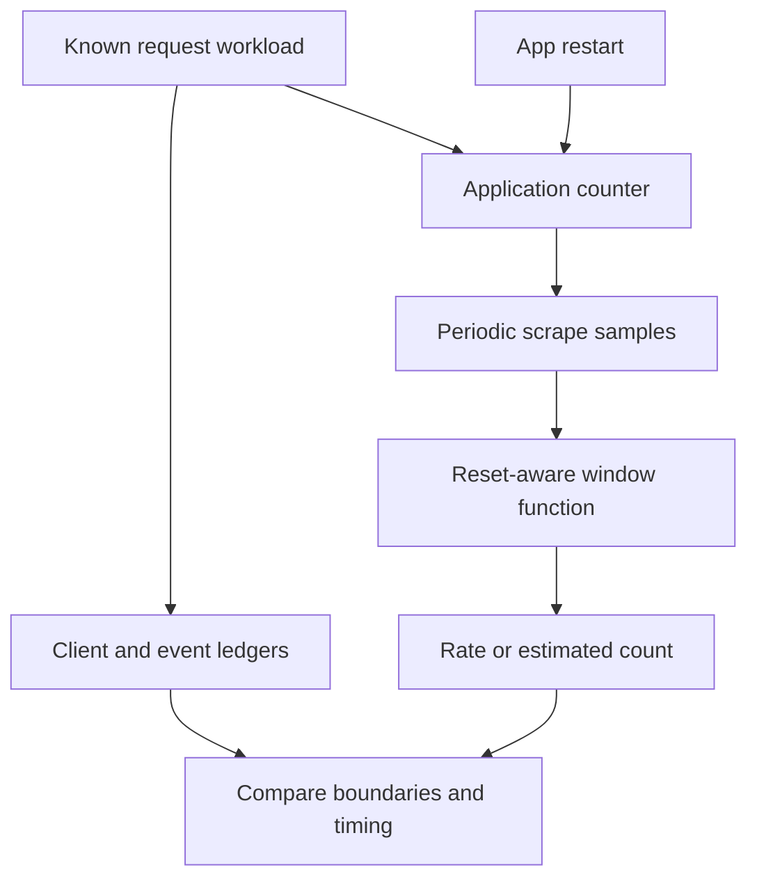

# Lab 12: Counter Math: `rate`, `irate`, and `increase`

## 1. Purpose and Learning Outcomes

You will use running request totals to calculate requests per second and estimate how many requests happened during a time window. A controlled workload shows normal counter growth, and an application restart shows a counter reset. By comparing raw samples, request records, and PromQL results, you will see why a useful estimate may not exactly match the client's request list.

> **Primary Objective:** Calculate request throughput and estimated event counts from scraped counters, handle process resets correctly, and choose a time window that fits your question.

A counter is a running total of observations. Prometheus samples that total at intervals; it does not receive a timestamped record of every request. This matters when the process restarts, a scrape is missed, or the query window starts or ends between samples.

You will send controlled traffic, restart only the application, and compare raw counter changes with PromQL functions that handle resets. A small fixture with fixed data makes the reset calculation repeatable even when the live experiment's timing changes. This lab does not add recording rules, dashboards, or alerts.

## 2. Starting Point and Lab Map

Open the complete application repository before using this guide. Unless a step says otherwise, run commands in Bash from the repository's top-level folder. Follow the starting checks in order because later commands depend on the helper functions and running services they prepare.

Read each explanation before running its commands. Run one complete code block, check the result, and then continue. In your notebook, save the commands, what happened, why you think it happened, and anything that differed from the expected result.

### Key Terms

| **Term** | **Explanation**                                                                       |
| -------- | ------------------------------------------------------------------------------------- |
| rate     | The average counter increase per second over a time window, allowing for resets.      |
| irate    | The counter increase per second calculated from the last two usable samples.          |
| increase | The estimated total increase in a counter over the selected time window.              |

### Lab Map

The arrows show how the parts connect and where a request can take different paths. Use this map to understand the design. It is not a recording of a request that actually ran.



## 3. Guided Walkthrough

### Step 01. Inherited State and Clean Starting Check

**What You Are Doing:** Start with a healthy metrics stage and keep the existing scrape interval. How often you scrape determines how many samples are available in each query window.

**Practical Walkthrough:** Check the current targets and keep the configured scrape interval. Counter functions need stored samples within their lookback window. A very short window may not contain enough samples. Keep the app running until the planned restart so you do not introduce a reset you have not recorded.

Keep the 15-second scrape interval and use `metrics_check` for this four-service stage. Check readiness and current `up` values before sending traffic. Even a healthy target may have too few samples in a short query window, so record the scrape interval alongside your calculations.

```bash
source lab-notes/session.sh
source lab-notes/evidence.sh
source lab-notes/raw-metrics.sh
source lab-notes/metrics-session.sh
metrics_check
start_lab 12
snapshot "$LAB_DIR/starting-metrics.json"
api -fsS "$APP_URL/health/ready" > "$LAB_DIR/starting-readiness.json"
pq 'up{job=~"fastapi|prometheus"}' | jq .
```

Complete [Lab 11](Lab-11.md) first. FastAPI, PostgreSQL, Redis, and Prometheus should be running. Keep the 15-second scrape interval from Lab 10, the checkpoint item, and all database volumes.

Use `metrics_check` for the four-service stage, rather than the three-service `baseline_check`. You do not need to rebuild the application or change its instrumentation in this lab.

**Understanding the Result:** Confirm healthy collection before interpreting a rate. Missing samples do not mean the same thing as samples showing no activity.

### Step 02. Learning Objectives and Current Signal Path

**What You Are Doing:** Pay attention to units and resets, not just the size of a number. Requests per second, estimated requests in a window, and total requests since startup measure different things.

**Practical Walkthrough:** Write the expected unit beside each function. A cumulative counter is a running total. `rate` and `irate` return change per second. `increase` estimates change over the chosen window. Comparing these numbers without their units can lead you to compare different quantities as if they were the same.

Use separate columns for cumulative totals, events per second, and estimated events during a window. Record each function's selector and window. A larger `increase` value does not automatically mean higher throughput; it uses different units.

By the end, you should be able to:

- State the units returned by each counter function.
- Explain why these calculations need at least two usable samples.
- Explain why restarting the app is different from resetting the database.
- Handle counter resets for each instance before adding the results together.
- Explain why an estimated event count can include a fractional part.
- Tell apart client attempts, application completions, and estimates from scraped samples.

Requests update application counters. Prometheus scrapes those counters, and queries calculate results from the stored samples. The application still owns the instrumentation. No OTel metric exporter is involved in this path.

**Understanding the Result:** Choose the function that answers your question. A graph that reacts quickly is not always the most useful operational measurement.

### Step 03. Relevant Events and the Evidence Plan

**What You Are Doing:** Plan what to record at the client, application, scraper, and query stages. Their different times and observation points can explain disagreements that a single graph cannot.

**Practical Walkthrough:** Prepare the client request ledger, completion-record capture, raw samples, and query timestamps before starting traffic. The ledger records attempts, the app records completions, and Prometheus samples totals periodically. Keep these records together so you can explain differences using actual timing and outcomes.

Use the client ledger to count attempts, application records to check completions, and scrape timestamps to locate sampled totals. Record the planned restart as its own change event. These sources observe different stages, so do not assume they always contain identical counts.

| **Occurrence**                     | **Evidence to Preserve**                                              |
| ---------------------------------- | --------------------------------------------------------------------- |
| A client attempts a request        | A row in the bounded traffic ledger                                   |
| Application completes a request    | A `request_completed` JSON record and a change in the RED counter     |
| Prometheus scrapes the application | Target state and timestamped samples                                  |
| Application process restarts       | A restart record, container state, and the process start gauge        |
| A counter decreases                | A possible reset in that series; the decrease is not negative traffic |

A counter decrease alone does not tell you why it reset. A restart, a code change, or a change in what the metric measures may need different explanations. Here, your explicit restart record gives the reset its context.

**Understanding the Result:** The ledger shows what the client attempted. Completion records and scraped samples show what was observed later. Compare these sources and explain their differences.

### Step 04. Compare the Three Functions

**What You Are Doing:** Compare which samples each function uses and what units it returns. Choose the function for your question, not just for how quickly its graph moves.

**Practical Walkthrough:** Check which samples each function uses and how it handles resets. `irate` uses the most recent usable pair, so it can react strongly to a brief burst. A longer-window rate summarizes a broader period. `increase` estimates a total for the window; that estimate can be fractional because the window edges may fall between samples.

Keep the selector the same while comparing the functions. `irate` uses the last usable pair. `rate` and `increase` use the range but express their results in different units. Since estimated counts can be fractional, understand the calculation before expecting it to equal the integer count in your ledger.

| **Function**            | **Result Unit** | **Samples Used**         | **Useful Interpretation**                                                            |
| ----------------------- | --------------- | ------------------------ | ------------------------------------------------------------------------------------ |
| `rate(counter[2m])`     | Events/second   | Samples across the range | Average recent throughput, allowing for resets and estimating change at window edges |
| `irate(counter[2m])`    | Events/second   | Last two usable samples  | Change between the most recent samples; often quicker to react and more variable     |
| `increase(counter[2m])` | Events          | Samples across the range | Estimated total increase during the requested window                                 |

For the same counter and window, `increase` equals the matching `rate` multiplied by the window length in seconds. The result can be fractional because Prometheus estimates change out to the window's start and end. `irate` uses the last two usable samples, so it is neither an exact rate for every event nor an average of every sample in the window.

Use counter functions on counters. The in-progress metric is a gauge: its value can legitimately fall. A counter function could mistake that fall for a reset. See the [Prometheus function reference](https://prometheus.io/docs/prometheus/latest/querying/functions/).

**Understanding the Result:** An estimate may differ from the ledger's whole-number count. Compare the selected requests and time boundaries before deciding what the difference means.

### Step 05. Inspect the Actual Scrape Evidence

**What You Are Doing:** Read the stored timestamps and counter values before calculating changes. Several equal samples mean repeated observations of the same total, not extra requests.

**Practical Walkthrough:** Inspect the timestamp and value of each sample. Equal consecutive values show no additional observed counter increase. A downward jump may show a reset. A gap means no sample was stored at the expected times. These patterns need different explanations.

Count the returned timestamp-value pairs and check the time between them. Equal values do not mean scraping failed; the counter may simply not have increased. Distinguish a decrease from missing samples before explaining a reset or an empty rate result.

```bash
pq 'application_http_requests_total{job="fastapi",method="GET",route="/api/v1/items",status_code="200"}[2m]' \
  > "$LAB_DIR/starting-counter-samples.json"
jq '.data.result[] | {metric,values}' "$LAB_DIR/starting-counter-samples.json"
pq 'count_over_time(application_http_requests_total{job="fastapi",method="GET",route="/api/v1/items",status_code="200"}[2m])' | jq .
```

Compare neighboring timestamps and values. `count_over_time` counts stored samples, not requests. If a counter has the same value across eight scrapes, that means eight observations of the same running total, not eight new business events.

If the selected labeled series has not been created yet, make one successful list request and wait for two scrapes before continuing.

**Understanding the Result:** Do not count samples as requests. A sample records the counter's running total at one point in time.

### Step 06. Make Predictions Before Generating Traffic

**What You Are Doing:** Predict how the restart and scrape timing will affect the results. This helps you understand the limits of the estimate before seeing the numbers.

**Practical Walkthrough:** Predict which values survive an app restart and which start again. Consider changes that may happen after the last scrape before shutdown, or near the edges of the query window. A live sampled estimate cannot provide the same exact request history as a complete ledger.

Make separate predictions for the app's counter reset, the saved PostgreSQL rows, and Prometheus's stored history. Consider requests between the final pre-restart scrape and process exit. Their counter changes may never be collected, so even reset-aware calculations cannot reconstruct every event.

Write predictions for these five questions:

1. Will 90 successful client requests always make `increase(...[3m])` return exactly 90?
2. Will the raw counter after a restart be greater than its pre-restart value?
3. Must Prometheus observe `up=0` during a short restart?
4. Will restarting FastAPI remove committed PostgreSQL rows?
5. Will a rate immediately become zero when the traffic generator stops?

Keep the scrape interval unchanged. The goal is to explain what each stage can observe and what the experiment cannot guarantee.

**Understanding the Result:** Showing that counters work after a restart and showing that saved data survives are separate checks. The next experiment provides evidence for both.

### Step 07. Create a Bounded Traffic Ledger

**What You Are Doing:** Send a fixed number of requests and record every attempt in a ledger. The delay between requests makes the workload easy to understand, but does not guarantee an exact arrival rate.

**Practical Walkthrough:** Run the first limited workload and keep one ledger row per attempt. Its pacing gives Prometheus chances to observe counter growth. Actual request times will still vary. Check that all 45 attempts are recorded and inspect their outcomes before restarting the app.

Read the helper's timing and ledger columns before starting. Confirm that all 45 attempts appear and check their actual statuses. The ledger records client attempts; completion logs and scraped counters observe later stages. Keep failed attempts in the evidence instead of quietly removing them.

```bash
traffic_segment() {
  local segment="$1" n rid status elapsed
  for n in $(seq 1 45); do
    rid="lab12-${segment}-${n}-$(date +%s)"
    status=$(api -sS -o /dev/null -w '%{http_code} %{time_total}' \
      -H "X-Request-ID: $rid" "$APP_URL/api/v1/items?limit=1") || return 1
    read -r status elapsed <<< "$status"
    printf '%s,%s,%s,%s,%s\n' "$(date -u +%FT%TZ)" "$segment" "$rid" "$status" "$elapsed" \
      >> "$LAB_DIR/client-requests.csv"
    [[ "$status" == 200 ]] || return 1
    sleep 1
  done
}
printf 'timestamp,segment,request_id,status,client_seconds\n' > "$LAB_DIR/client-requests.csv"
record_change "begin_45_requests_before_application_restart" planned
traffic_segment before
snapshot "$LAB_DIR/before-restart.json"
pq 'process_start_time_seconds{job="fastapi"}' > "$LAB_DIR/process-start-before.json"
```

**Expected Result:** You should have 45 successful rows. This is a closed-loop workload: the client waits for a request to finish, then waits another second. Request latency and shell overhead make it slightly slower than exactly one request per second. It is not a benchmark with a fixed request arrival rate.

The ledger uses synthetic request IDs to connect related records. Keep these IDs in evidence fields; do not add them to metric labels.

**Understanding the Result:** Use the ledger's actual timestamps and statuses. Do not assume every planned attempt succeeded or occurred at an exact interval.

### Step 08. Restart Only the Application

**What You Are Doing:** Restart only the app so its in-memory metrics reset. Keep the data services and Prometheus running so you can distinguish a telemetry reset from loss of saved business data.

**Practical Walkthrough:** Restart the app while leaving Prometheus and database storage running. Then send the second set of 45 requests. Record the restart so you can identify the process change. Check the retained item to show that resetting in-memory counters does not remove data saved in PostgreSQL.

Leave Prometheus and the data services running. Record the app restart time and evidence of the new process, then run the second traffic segment. Check the same checkpoint row afterward so you can separately confirm the counter reset and the survival of saved data.

```bash
record_change "restart_only_fastapi_process" planned
RESTART_AT=$(date -u +%FT%TZ)
printf '%s\n' "$RESTART_AT" > "$LAB_DIR/restart-at.txt"
dm restart app
wait_ready
wait_target fastapi up
record_change "restart_only_fastapi_process" completed
snapshot "$LAB_DIR/after-restart.json"
traffic_segment after
wait_target fastapi up
pq 'process_start_time_seconds{job="fastapi"}' > "$LAB_DIR/process-start-after.json"
capture_app_logs
```

Do not restart PostgreSQL, Redis, or Prometheus. The app uses one worker, so restarting that process also restarts its in-memory counters. Docker may retain the same container identity during `restart`. A container identity and a process identity are different things.

A short restart may happen entirely between two scrapes. Then `up` may never show zero, even though a request during the interruption could fail. Prometheus can also miss a reset if the new counter exceeds its old value before the next successful scrape. This workload builds up traffic first to make a decrease easier to observe, but use the actual samples as evidence.

**Understanding the Result:** The full ledger covers 90 planned attempts across two app processes. Subtracting the first raw counter value from the last cannot correctly represent both process lifetimes.

### Step 09. Verify the Ledger and the Recorded Request Events

**What You Are Doing:** Compare client attempts with their matching completion records. Investigate failed requests and missing records before judging a PromQL estimate against this workload.

**Practical Walkthrough:** Match ledger entries to completion events using IDs and timestamps. Identify connection failures, unexpected statuses, and missing captured records before comparing the counts with PromQL. Do not automatically blame rate estimation for a difference already present in the request records.

Use request IDs and the run's time interval to match completion records to ledger rows. Investigate absent records and unexpected statuses first. A connection failure or missing log record is a specific difference in the evidence; estimating the window edges does not explain every such difference.

```bash
python3 - "$LAB_DIR" <<'PYTHON'
import csv, json, sys
from pathlib import Path
root = Path(sys.argv[1])
rows = list(csv.DictReader((root / "client-requests.csv").open()))
assert len(rows) == 90 and all(row["status"] == "200" for row in rows)
ids = {row["request_id"] for row in rows}
records = [json.loads(line) for line in (root / "app.jsonl").read_text().splitlines()]
matched = [r for r in records if r.get("event_name") == "request_completed" and r.get("request_id") in ids]
print({"client_successes": len(rows), "matching_completion_records": len(matched),
       "unique_recorded_request_ids": len({r["request_id"] for r in matched})})
PYTHON
```

For this small local run, expect 90 matching completion records. If the count differs, check log retention, capture timing, and status handling. Do not manually change the count to make it match.

The local ledger can count this exercise's requests exactly. A service-wide counter may include other matching requests, and an estimate from scraped samples also depends on the chosen time window.

**Understanding the Result:** First explain which requests actually occurred and which completed. Then judge what the scraped counter samples can reasonably estimate.

### Step 10. Compare Throughput, Recent Change and Estimated Count

**What You Are Doing:** Run all three counter functions and compare what their results mean. Use the same selection and evaluation time for a fair comparison.

**Practical Walkthrough:** Evaluate `rate`, `irate`, and `increase` using the same selector, window, and evaluation time. Compare their units and how they respond to the restart and recent traffic. A fixed evaluation time keeps the window from moving between commands, so the differences come from the functions you are comparing.

Check that all three saved results use the same selector, range, and evaluation time. If the queries run at different times, their windows also move. Use the fixed-time comparison when you want to isolate differences between functions. Remember that rates are events per second, while increase is an estimated number of events.

```bash
pq 'rate(application_http_requests_total{job="fastapi",method="GET",route="/api/v1/items",status_code="200"}[3m])' \
  | tee "$LAB_DIR/rate.json" | jq .
pq 'irate(application_http_requests_total{job="fastapi",method="GET",route="/api/v1/items",status_code="200"}[3m])' \
  | tee "$LAB_DIR/irate.json" | jq .
pq 'increase(application_http_requests_total{job="fastapi",method="GET",route="/api/v1/items",status_code="200"}[3m])' \
  | tee "$LAB_DIR/increase.json" | jq .
pq 'resets(application_http_requests_total{job="fastapi",method="GET",route="/api/v1/items",status_code="200"}[5m])' \
  | tee "$LAB_DIR/resets.json" | jq .
```

Expect nonnegative throughput. The estimated increase does not have to equal 90. Separate API calls run at slightly different times; use a fixed API `time` parameter when you need directly aligned calculations.

`resets` should report a decrease if Prometheus sampled the counter on both sides of the restart and observed the drop. It may report more than one if earlier restarts are also inside the five-minute range. Check the raw samples and restart time before linking every decrease to this action.

**Understanding the Result:** The functions can return different numbers and still all be correct. Explain each result using the function's definition and units.

### Step 11. Demonstrate Why Window Length Matters

**What You Are Doing:** Compare short and long query windows with the actual scrape interval. A rate needs enough usable samples. A longer window includes more history and makes recent changes appear more gradually.

**Practical Walkthrough:** Try the given windows without changing how often Prometheus scrapes. Count how many usable samples each window contains. A short window can be empty or produce a variable result. A longer window is smoother, but takes longer to reflect a traffic change because older activity remains included.

Compare each window length with the sample spacing you observed earlier. With 15-second scrapes, a five-second window will usually lack enough samples to calculate a rate. A longer window includes more history, which makes the result smoother but slower to react.

```bash
pq 'rate(application_http_requests_total{job="fastapi",method="GET",route="/api/v1/items",status_code="200"}[5s])' | jq .
pq 'rate(application_http_requests_total{job="fastapi",method="GET",route="/api/v1/items",status_code="200"}[1m])' | jq .
pq 'rate(application_http_requests_total{job="fastapi",method="GET",route="/api/v1/items",status_code="200"}[5m])' | jq .
```

A five-second window with 15-second scrapes usually contains fewer than two usable samples, so the rate has no result. A one-minute window is a reasonable starting point here because it covers about four scrapes, although missed scrapes can reduce that number. A five-minute window smooths more of the variation and reacts more slowly.

Record the sample count when a rate surprises you. Do not replace every absent result with zero: having no usable samples is different from observing no activity.

**Understanding the Result:** The window is part of what the query means. Save it with the result, especially when comparing measurements around a restart.

### Step 12. Handle Resets Before Aggregation

**What You Are Doing:** Calculate the change in each original counter before adding the results together. This allows the function to see resets that a sum of raw counters could hide.

**Practical Walkthrough:** Apply the counter function to each original series, then sum across instances or other labels. Processes can restart independently. The function must see each series's drop to handle its reset. Adding raw counters first can hide one process's drop behind another process's growth.

Read the expression from the inside outward: choose the original series, calculate each rate or increase, and then combine the results. This keeps reset evidence available to the calculation. If raw counters are added first, one process's growth may mask another process's reset.

```bash
pq 'sum by (route,method) (rate(application_http_requests_total{job="fastapi"}[2m]))' | jq .
pq 'sum by (route,method) (increase(application_http_requests_total{job="fastapi"}[2m]))' | jq .
```

The order matters: handle resets while calculating the change for each counter, then add the results. Summing raw counters first can hide a reset or produce a misleading combined decrease when one instance restarts and another grows.

There is only one application target in this lab. This query structure will still work correctly when more instances are added. If you deliberately select several services or environments, keep the grouping labels needed to tell them apart.

**Understanding the Result:** Keep individual counter histories available until reset handling is complete. Changing the order of calculation and aggregation can change whether the answer is correct, even if the final labels look the same.

### Step 13. Build a Recent Error Fraction with Aligned Labels

**What You Are Doing:** Calculate an error fraction using matching labels and identical windows. The error requests in the numerator must come from the same set of requests counted in the denominator.

**Practical Walkthrough:** Use the same job, routes, evaluation time, and rate window for both parts of the fraction. Group them into compatible label sets before dividing. The numerator must count a subset of the denominator's requests. Otherwise, valid syntax can still produce a misleading fraction.

Confirm that every request eligible for the numerator is also eligible for the denominator, and that both keep the same grouping labels. Check traffic volume too. A denominator with no traffic differs from a measured zero error fraction. Division alone does not establish that the selected requests and time window make sense.

```bash
pq 'sum by (route,method) (rate(application_http_server_errors_total{job="fastapi"}[2m])) / sum by (route,method) (rate(application_http_requests_total{job="fastapi"}[2m]))' | jq .
```

This fraction uses matching route and method groups and the same window. The numerator counts server-side HTTP error outcomes from Lab 8, including handled 503 responses. It uses HTTP outcomes, not the exception counter, and does not include 4xx responses as server errors.

A zero denominator makes the fraction undefined. During inactivity, report “no eligible traffic” or require a positive request rate before interpreting the ratio. Do not treat inactivity as 100% availability. A route series may also be absent if it lacks a recent pair of samples. Later reliability labs will define an SLI and which requests qualify for it.

**Understanding the Result:** Check what the expression actually returns when there is no traffic. A missing or undefined fraction does not prove that every request succeeded.

### Step 14. Run a Deterministic Reset Fixture

**What You Are Doing:** Test a fixed set of synthetic samples with the rule-test tool. This lets you study reset calculations without changes caused by live traffic or scrape timing.

**Practical Walkthrough:** Run the fixed fixture and inspect its expected calculations. Its known sample times remove uncertainty from request timing and scrape scheduling. Use it to understand the reset arithmetic, then explain the extra observation limits in the real experiment.

Before running `promtool`, inspect the fixture's values, sample interval, evaluation time, and expected result. These fixed inputs make the calculation repeatable. If the test fails, check the expression and arithmetic against those inputs. Do not change the expected value just to match a live run.

Create the synthetic test file in the already mounted Prometheus configuration directory, which contains no secrets. This is only test input. It does not add a metric to scraping or install a recording rule on the running server.

```bash
cat > lab-notes/prometheus/counter-test.yml <<'YAML'
evaluation_interval: 15s
tests:
  - interval: 15s
    input_series:
      - series: 'lab_counter_total{instance="one"}'
        values: '0 15 30 2 17'
    promql_expr_test:
      - expr: resets(lab_counter_total[1m])
        eval_time: 1m
        exp_samples:
          - labels: '{instance="one"}'
            value: 1
      - expr: irate(lab_counter_total[1m])
        eval_time: 1m
        exp_samples:
          - labels: '{instance="one"}'
            value: 1
      - expr: rate(lab_counter_total[1m]) >= bool 0
        eval_time: 1m
        exp_samples:
          - labels: '{instance="one"}'
            value: 1
      - expr: increase(lab_counter_total[1m]) > bool 17
        eval_time: 1m
        exp_samples:
          - labels: '{instance="one"}'
            value: 1
YAML
```

**Command Note:** `<<'YAML'` writes the following text literally until the closing `YAML`. The quoted delimiter stops Bash from expanding `$variables` in the file. Creating the file and running it are separate actions.

```bash
chmod 644 lab-notes/prometheus/counter-test.yml
dm run --rm -T --no-deps --entrypoint promtool prometheus \
  test rules /etc/prometheus/labs/counter-test.yml \
  | tee "$LAB_DIR/counter-fixture-result.txt"
```

**Expected Result:** The test suite reports `SUCCESS`. The samples increase, reset from 30 to 2, and then increase from 2 to 17. The final pair is 15 seconds apart, so its `irate` is one event per second. The test also shows why an estimated increase that handles resets can be larger than the final raw counter value.

A PromQL range excludes its exact lower time boundary. At an evaluation time of one minute, the sample at time zero is outside `[1m]`. Use the function's actual window rules instead of subtracting whichever first value happens to be displayed in a file.

**Understanding the Result:** The fixture confirms how the expression behaves for the supplied samples. It does not prove that the live experiment captured every request.

### Step 15. Observe Decay After Traffic Stops

**What You Are Doing:** Stop the tracked traffic and watch the query window move forward. The rate falls as earlier counter increases leave the window, even though the raw counter keeps its accumulated total.

**Practical Walkthrough:** Stop the tracked workload but keep scraping. Run the same query over time. As earlier increases move outside the window, the rate should fall while the raw counter stays high. Avoid requests to the measured route during this observation.

Keep collection running after stopping the workload. Compare the changing rate with the unchanged cumulative counter as older activity leaves the window. Extra requests to the selected route would add new counter increases, so avoid them while checking this behavior.

Leave the app idle for two minutes and check the same two-minute rate every 15–30 seconds. Do not send extra list requests during this period. Health and `/metrics` requests are excluded from the app's HTTP counters.

`irate` can reach zero as soon as the last two usable samples are equal. A longer-window `rate` may still be above zero because it includes earlier growth. Both should eventually reach zero if scraping continues and the counter stays unchanged. This is expected averaging over time, not new requests being invented by Prometheus.

Capture a final query response and its evaluation timestamp in the notebook.

**Understanding the Result:** A high cumulative counter and a near-zero recent rate can both be correct. They show past activity followed by a quiet period.

### Step 16. Recovery and Proof of Recovery

**What You Are Doing:** Check readiness and the saved checkpoint after the restart. These checks show that the app's telemetry lifetime and the database's stored data have different lifetimes.

**Practical Walkthrough:** Check current readiness, the checkpoint item, and scrape health. Keep the ledger, reset evidence, and fixed-time queries with their windows. Together they show which telemetry restarted and which database data stayed intact.

Make a fresh business read and check current target health. Keep both ledger segments, the restart time, process evidence, and query parameters together. Another reader should be able to follow why the saved data survived while the app's counters started a new lifetime.

```bash
metrics_check
api -fsS "$APP_URL/api/v1/items/$(cat lab-notes/checkpoint-item-id.txt)" \
  > "$LAB_DIR/checkpoint-after-restart.json"
api -fsS "$APP_URL/health/ready" > "$LAB_DIR/recovered-readiness.json"
pq 'up{job="fastapi"}' > "$LAB_DIR/recovered-up.json"
record_change "counter_reset_experiment_recovery_verified" completed
```

The checkpoint row should still be present. This shows that process-local telemetry and saved business data have different lifetimes. Keep all four services running. This lab changed no application files or database migrations.

**Understanding the Result:** Finish with the current process healthy. Keep the historical reset as part of your evidence; there is no need to remove it from stored telemetry.

## 4. Troubleshooting and Diagnosis

Begin with the first result that differed from your prediction. Save the exact error or symptom and identify which service or command produced it. Use the checks below, make the needed fix, and repeat the original check to confirm the problem is resolved.

### Troubleshooting

| **Symptom**                   | **Inspect**                                        | **Explanation or Correction**                                                                    |
| ----------------------------- | -------------------------------------------------- | ------------------------------------------------------------------------------------------------ |
| A rate is absent              | Raw samples in the range and sample count          | Try a longer window if needed; confirm the labeled series exists and its target is being scraped |
| Increase is fractional        | Sample times and window boundaries                 | The function estimates change at the boundaries; use event records for an exact request list     |
| No reset is reported          | Samples around the restart and process start gauge | A scrape may have missed the drop; use the fixed fixture to check the reset calculation          |
| Rate stays nonzero after load | Window length                                      | Earlier counter growth is still inside the query window                                          |
| Negative manual difference    | Restart evidence                                   | Subtracting raw values does not account for the counter starting again after a reset             |
| Error fraction is NaN         | Request-rate denominator                           | There may be no eligible traffic; keep this separate from a measured zero error rate             |
| Checkpoint request fails      | Readiness, database state, and original ID         | An app restart should not delete committed rows; investigate before continuing                   |

A `rate` result is an estimate based on collected samples. Explain what remains uncertain when gaps or restarts limit what those samples can prove.

## 5. Review and Practice

Answer the questions in your own words before reading the answers. For the scenario, say what you would inspect and exactly what each result would tell you.

### Knowledge Check

1. What are the units of rate and increase?
2. Why can increase return 89.6 for integer events?
3. Why should rate precede aggregation?
4. Can up stay at one during an application restart?
5. Does count_over_time count requests?

#### Answer Guide

1. Rate is events per second. Increase is the estimated number of events during the selected window.
2. Scrape times may fall between the window's boundaries. Prometheus estimates change out to those boundaries, so the result can be fractional.
3. Reset handling needs to see each original counter's decrease. Adding counters first can hide one instance's reset behind another's growth.
4. Yes. A short interruption may happen entirely between two successful scrapes.
5. No. For these float series, it counts stored samples in the chosen range, not requests.

### Professional Scenario Exercise

An operator sees a current counter value of 17 after sending 90 test requests and concludes, “we served only 17 requests.” Explain how the restart affects that conclusion. Identify the saved request evidence and provide a query that handles the reset. Also explain what sampled telemetry cannot establish exactly.

## 6. Completion Checklist

Tick an item only when you can show its result or saved evidence. Finish the cleanup instructions before starting the next lab.

### Observable Completion Criteria

- [ ] I have recorded 90 successful controlled requests with request IDs.
- [ ] I have a timestamped record of one app-only restart.
- [ ] I have saved the raw samples and the rate, irate, increase, and reset results.
- [ ] The fixed promtool fixture passes.
- [ ] I can distinguish an empty result from a short window from a measured zero rate.
- [ ] The checkpoint item is readable and all four services are healthy.

## 7. Production Context and Next Lab

### Production Implications

Counters are useful for throughput and overall trends, but they are not exact billing records. Use saved transactional records for financial or audit counts that must be exact. Choose rate windows based on scrape frequency, missing samples, and how quickly the result needs to react. Handle resets for each original instance before combining values. Do not make a noisy query look better by hiding missing data.

### End State and Transition

The four-service metrics stage remains healthy. Continue with [Lab 13: Histograms, Buckets, and Quantiles](Lab-13.md). There, you will apply the same counter functions to cumulative histogram buckets to estimate how request latencies are distributed.
