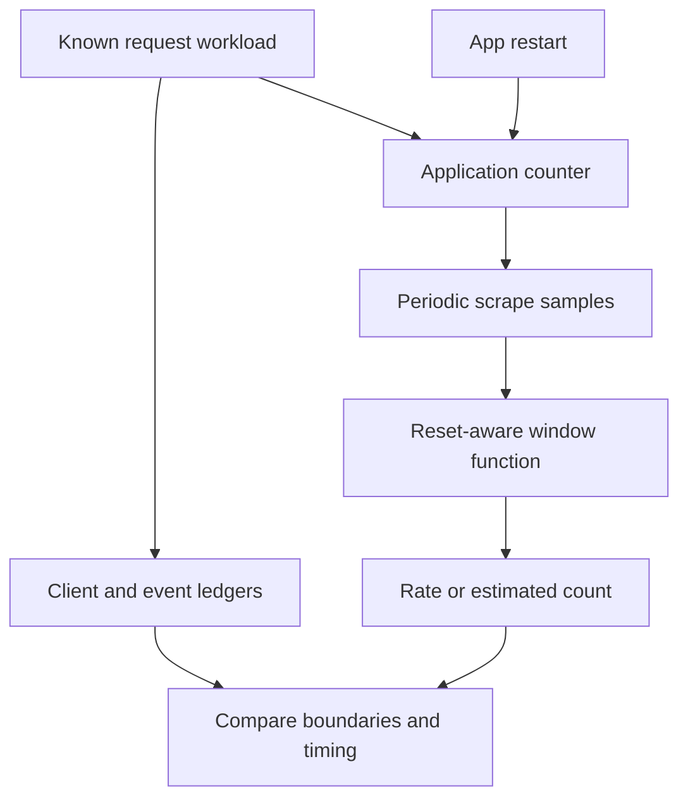

# Lab 12: Counter Math: `rate`, `irate`, and `increase`

## 1. Purpose and Learning Outcomes

**In Plain Language:** You will turn cumulative request counts into throughput and estimated event counts. A known workload and an application restart give you examples of normal growth and a counter reset. Comparing raw samples, request records, and PromQL results explains why a time-window estimate can be useful without being an exact replay of the client ledger.

> **Primary Objective:** Calculate throughput and estimated event counts from scraped counters, account for process resets, and select windows that support the question being asked.

A counter records accumulated observations. Prometheus sees occasional samples of that accumulation, not a timestamped list of the requests that caused it. This distinction becomes important when a process restarts, a scrape is missed, or a query asks about a window whose boundaries fall between samples.

You will generate controlled traffic, restart only the application, and compare raw counter changes with reset-aware PromQL. A small deterministic fixture makes the reset calculation repeatable even when the timing of the live experiment varies. Recording rules, dashboards and alerts remain outside this lab.

## 2. Starting Point and Lab Map

Use this guide inside the complete application repository. Run commands from the repository root in Bash unless a step says otherwise. Work through the starting checks in order; they load the helpers and state this lab needs.

Read the explanation before each step, run one complete code block at a time, and compare the actual result with the stated expectation. Save commands, observations, explanations, and unexpected results in your notebook.

### Key Terms

| **Term** | **Plain-Language Meaning**                                                            |
| -------- | ------------------------------------------------------------------------------------- |
| rate     | An average per-second counter increase over the selected window, with reset handling. |
| irate    | A per-second counter change based on the last two usable samples.                     |
| increase | An estimated counter increase over the whole selected window.                         |

### Lab Map

The arrows show the flow or dependency being studied. Branches identify paths to compare; this is a conceptual map, not a captured runtime trace.



## 3. Guided Walkthrough

### Step 01. Inherited State and Clean Starting Check

**What You Are Doing:** Keep the existing scrape interval and healthy metrics stage. Sampling frequency determines how much usable evidence fits inside each query window.

**Practical Walkthrough:** Check current targets and retain the configured scrape interval. A counter function needs stored observations inside its lookback window, so collection cadence affects whether a short window has enough evidence. Keep the app stable until the deliberate restart step to avoid introducing an unrecorded reset.

Keep the 15-second scrape cadence and use `metrics_check` for this four-service stage. Inspect readiness and current `up` values before the workload. A short query range may contain too few usable samples even with a healthy target, so record cadence as part of the calculation context.

```bash
source lab-notes/session.sh
source lab-notes/evidence.sh
source lab-notes/raw-metrics.sh
source lab-notes/metrics-session.sh
metrics_check
start_lab 12
snapshot "$LAB_DIR/starting-metrics.json"
api -fsS "$APP_URL/health/ready" > "$LAB_DIR/starting-readiness.json"
pq 'up{job=~"fastapi|prometheus"}' | jq .
```

Complete [Lab 11](Lab-11.md) first. The running stage contains FastAPI, PostgreSQL, Redis and Prometheus. Keep the 15-second scrape interval from Lab 10. Retain the checkpoint item and all database volumes.

Use `metrics_check`, not the three-service `baseline_check`. This lab does not rebuild the application or change its instrumentation.

**Understanding the Result:** Healthy collection is a prerequisite for interpreting rate output. Missing samples and zero activity are not equivalent.

### Step 02. Learning Objectives and Current Signal Path

**What You Are Doing:** Track units and resets as carefully as numeric values. Requests per second, estimated requests in a window, and cumulative requests are different quantities.

**Practical Walkthrough:** Write the expected units beside each function before running it. A cumulative counter is a running total, `rate` and `irate` return change per second, and `increase` estimates change over the selected window. Comparing their bare numbers without units would compare different quantities.

Keep cumulative totals, events per second, and estimated events in a window in separate columns when comparing results. Write the selector and window beside each function. This prevents a larger `increase` number from being interpreted as higher throughput simply because it uses different units.

By the end, you should be able to:

- State the units returned by each counter function.
- Explain why two or more usable samples are needed.
- Distinguish an application restart from a database reset.
- Apply reset handling before aggregation across instances.
- Explain why an estimated increase need not equal an integer request count.
- Separate a client attempt count, application completion count and sampled estimate.

Requests change application counters; Prometheus scrapes those counters; a query calculates from stored samples. The application remains the owner of instrumentation. There is no OTel metric exporter in this path.

**Understanding the Result:** Use the function whose meaning matches the question. A visually responsive curve is not necessarily the right operational measure.

### Step 03. Relevant Events and the Evidence Plan

**What You Are Doing:** Plan evidence at the client, application, scraper, and query layers. Their timestamps and boundaries explain small disagreements that one graph alone cannot resolve.

**Practical Walkthrough:** Prepare the client ledger, request-record capture, raw samples, and query timestamps before generating traffic. Each observes a different boundary, from attempted request to completed request to periodic scrape. Keep these artifacts aligned so disagreements can be explained by actual timing or failures instead of guessed from one graph.

Use the client ledger for attempts, application records for observed completions, and scrape timestamps for sampled totals. Record the deliberate restart as a separate change event. These boundaries let you explain disagreements using timing and outcomes instead of assuming all representations count identical events exactly.

| **Occurrence**                     | **Evidence to Preserve**                                     |
| ---------------------------------- | ------------------------------------------------------------ |
| A client attempts a request        | A row in the bounded traffic ledger                          |
| Application completes a request    | `request_completed` JSON record and RED counter change       |
| Prometheus scrapes the application | Target state and timestamped samples                         |
| Application process restarts       | Change record, container state and process start gauge       |
| A counter decreases                | Evidence of a reset within that series, not negative traffic |

A counter reset does not identify its cause by itself. A restart, an implementation change or changed metric semantics may require different explanations. In this experiment, the explicit restart record provides the causal context.

**Understanding the Result:** The ledger is evidence of attempts; completion records and samples establish different later observations. Reconcile them explicitly.

### Step 04. Compare the Three Functions

**What You Are Doing:** Compare the functions by the samples they use and the units they return. Choose the function for the operational question rather than for the most responsive-looking graph.

**Practical Walkthrough:** Read which samples each function uses and how reset handling affects the calculation. The recent pair used by `irate` can emphasize a brief burst, while a longer-window rate summarizes more history. `increase` expresses an estimated window total, which can be fractional because query boundaries need not coincide with sample times.

Compare the sample population used by each function and retain the same selector when experimenting. `irate` emphasizes the last usable pair, while `rate` and `increase` summarize the range differently in units. Fractional estimated counts are possible, so compare the calculation's meaning before expecting equality with an integer ledger.

| **Function**            | **Result Unit** | **Samples Used**         | **Useful Interpretation**                                                 |
| ----------------------- | --------------- | ------------------------ | ------------------------------------------------------------------------- |
| `rate(counter[2m])`     | Events/second   | Samples across the range | Smoothed recent throughput with reset handling and boundary extrapolation |
| `irate(counter[2m])`    | Events/second   | Last two usable samples  | Recent sampled change, often more responsive and noisy                    |
| `increase(counter[2m])` | Events          | Samples across the range | Estimated increase over the requested window                              |

For the same counter and window, `increase` is the corresponding `rate` multiplied by the range duration in seconds. It can be fractional because Prometheus extrapolates to time boundaries. `irate` is not an exact event-by-event arrival rate and does not average all samples in the window.

Use counter functions on counters. Applying them to the in-progress gauge can misinterpret legitimate decreases as resets. See the [Prometheus function reference](https://prometheus.io/docs/prometheus/latest/querying/functions/).

**Understanding the Result:** An estimate need not equal an integer ledger count exactly. First compare population and time boundaries, then assess the difference.

### Step 05. Inspect the Actual Scrape Evidence

**What You Are Doing:** Inspect stored timestamps and values before calculating change. Repeated samples of an unchanged counter are scrape observations, not additional requests.

**Practical Walkthrough:** Inspect the stored timestamp-value pairs before applying the functions. Repeated equal values mean the scraper observed no additional counter change between those samples. A downward jump may indicate a reset, while a gap means no stored observation at the missing times; these are different evidence patterns.

Count the timestamp-value pairs actually returned and inspect their spacing. Equal consecutive values indicate no observed increase, not a failed scrape. A decrease and a missing timestamp pattern are different conditions; identify which occurred before applying a reset explanation or interpreting an empty rate result.

```bash
pq 'application_http_requests_total{job="fastapi",method="GET",route="/api/v1/items",status_code="200"}[2m]' \
  > "$LAB_DIR/starting-counter-samples.json"
jq '.data.result[] | {metric,values}' "$LAB_DIR/starting-counter-samples.json"
pq 'count_over_time(application_http_requests_total{job="fastapi",method="GET",route="/api/v1/items",status_code="200"}[2m])' | jq .
```

Read adjacent sample timestamps and values. `count_over_time` counts stored samples, not requests. A counter value repeated across eight scrapes means eight observations of the same accumulated state; it does not mean eight business events.

If the selected child does not exist yet, make one successful list request and wait for two scrapes before proceeding.

**Understanding the Result:** Do not count samples as requests. Each sample is an observation of the cumulative instrument at a particular time.

### Step 06. Make Predictions Before Generating Traffic

**What You Are Doing:** Predict what the restart and scrape timing will do to the results. This makes estimation and missed observations explicit before the numbers are available.

**Practical Walkthrough:** Predict which quantities survive the planned app restart and which return to their initial state. Also predict how the scrape interval can miss changes near shutdown or window boundaries. Writing these limits first keeps you from treating a live approximation as an exact audit of the request ledger.

Predict the app counter reset separately from PostgreSQL row survival and Prometheus history retention. Also identify events that might occur between the last pre-restart scrape and process exit. Those unobserved changes explain why reset-aware math still cannot reconstruct a complete event ledger from periodic samples.

Write predictions for these five questions:

1. Will 90 successful client requests always make `increase(...[3m])` return exactly 90?
2. Will the raw counter after a restart be greater than its pre-restart value?
3. Must Prometheus observe `up=0` during a short restart?
4. Will restarting FastAPI remove committed PostgreSQL rows?
5. Will a rate immediately become zero when the traffic generator stops?

Do not change the scrape interval to force an answer. The point is to explain the observation boundaries, including what the experiment cannot guarantee.

**Understanding the Result:** Counter recovery and durable-data recovery are separate claims. The next experiment supplies evidence for both.

### Step 07. Create a Bounded Traffic Ledger

**What You Are Doing:** Run a finite workload with one ledger entry per attempt. The deliberate pacing creates a known, explainable traffic population without assuming an exact arrival rate.

**Practical Walkthrough:** Run the finite first workload and retain one ledger entry per attempt. The pacing gives Prometheus opportunities to observe counter changes, but it does not guarantee perfectly uniform arrival times. Verify the prescribed 45 attempts and actual outcomes before moving to the restart boundary.

Read the helper's pacing and ledger columns before invoking the first segment. Confirm all 45 attempts are represented and inspect actual statuses. The ledger records what the client attempted; completion logs and sampled counters provide separate downstream evidence, so retain failures instead of silently excluding them.

```bash
traffic_segment() {
  local segment="$1" n rid status elapsed
  for n in $(seq 1 45); do
    rid="lab12-${segment}-${n}-$(date +%s)"
    status=$(api -sS -o /dev/null -w '%{http_code} %{time_total}' \
      -H "X-Request-ID: $rid" "$APP_URL/api/v1/items?limit=1") || return 1
    read -r status elapsed <<< "$status"
    printf '%s,%s,%s,%s,%s\n' "$(date -u +%FT%TZ)" "$segment" "$rid" "$status" "$elapsed" \
      >> "$LAB_DIR/client-requests.csv"
    [[ "$status" == 200 ]] || return 1
    sleep 1
  done
}
printf 'timestamp,segment,request_id,status,client_seconds\n' > "$LAB_DIR/client-requests.csv"
record_change "begin_45_requests_before_application_restart" planned
traffic_segment before
snapshot "$LAB_DIR/before-restart.json"
pq 'process_start_time_seconds{job="fastapi"}' > "$LAB_DIR/process-start-before.json"
```

**Expected Result:** 45 successful rows. This is a closed-loop workload: one request completes, then the client waits one second. Latency and shell overhead mean it is slightly slower than exactly one request per second. It is not a constant-arrival-rate benchmark.

The ledger contains synthetic request IDs for correlation. They remain evidence fields, never metric labels.

**Understanding the Result:** Use measured times and statuses from the ledger. Do not assume every scheduled attempt completed successfully or at an exact interval.

### Step 08. Restart Only the Application

**What You Are Doing:** Restart only the app to reset its in-memory instruments. Leave storage and scraping running so you can observe the telemetry reset independently of durable business data.

**Practical Walkthrough:** Restart only the app, leaving Prometheus and database storage active, then run the second prescribed 45-request workload. Record the process boundary so the reset is intentional and identifiable. Check the retained item to show that resetting in-memory telemetry is different from removing durable application data.

Leave Prometheus and data services running while restarting only the app. Record the restart time and new process evidence, then run the second segment. Verify the same checkpoint row afterward so the experiment clearly separates resetting telemetry memory from removing durable business state.

```bash
record_change "restart_only_fastapi_process" planned
RESTART_AT=$(date -u +%FT%TZ)
printf '%s\n' "$RESTART_AT" > "$LAB_DIR/restart-at.txt"
dm restart app
wait_ready
wait_target fastapi up
record_change "restart_only_fastapi_process" completed
snapshot "$LAB_DIR/after-restart.json"
traffic_segment after
wait_target fastapi up
pq 'process_start_time_seconds{job="fastapi"}' > "$LAB_DIR/process-start-after.json"
capture_app_logs
```

Do not restart PostgreSQL, Redis or Prometheus. The application remains a single worker, so its in-memory counters restart with that process. Docker may keep the same container identity during `restart`; process identity and container identity are not interchangeable.

A restart can fall entirely between two scrapes. In that case, `up` may never record zero even though a request during the interruption could have failed. Conversely, a reset can be missed if a counter grows beyond its old value before the next successful scrape. This workload makes a decrease likely by accumulating traffic before the restart, but recorded samples are the evidence.

**Understanding the Result:** The complete ledger contains 90 planned attempts across two app lifetimes. Simple final-minus-initial counter subtraction cannot represent both lifetimes correctly.

### Step 09. Verify the Ledger and the Recorded Request Events

**What You Are Doing:** Reconcile the client ledger with matching completion records. Investigate missing records or failed requests before using the population to assess a PromQL estimate.

**Practical Walkthrough:** Reconcile the client attempts with matching completion events using their identifiers and recorded times. Separate connection failures, unexpected statuses, and missing captured records before comparing the population with PromQL. A mismatch at the request-evidence layer should not be silently attributed to rate extrapolation.

Match completion records to the ledger using request IDs and the run's time interval. Investigate missing or unexpected statuses before comparing totals with PromQL. A transport failure or absent captured record is a concrete evidence discrepancy; rate extrapolation should not be used as a blanket explanation for it.

```bash
python3 - "$LAB_DIR" <<'PYTHON'
import csv, json, sys
from pathlib import Path
root = Path(sys.argv[1])
rows = list(csv.DictReader((root / "client-requests.csv").open()))
assert len(rows) == 90 and all(row["status"] == "200" for row in rows)
ids = {row["request_id"] for row in rows}
records = [json.loads(line) for line in (root / "app.jsonl").read_text().splitlines()]
matched = [r for r in records if r.get("event_name") == "request_completed" and r.get("request_id") in ids]
print({"client_successes": len(rows), "matching_completion_records": len(matched),
       "unique_recorded_request_ids": len({r["request_id"] for r in matched})})
PYTHON
```

In this small local run, expect 90 matching completion records. A mismatch is a prompt to inspect log retention, collection time and status handling; it is not permission to adjust the count manually.

A local ledger can count the requests generated by this exercise exactly. A service-wide counter includes other eligible requests, and a sampled estimate also depends on its query window.

**Understanding the Result:** Explain the actual observed population first. Then use it to assess what the sampled counter can reasonably estimate.

### Step 10. Compare Throughput, Recent Change and Estimated Count

**What You Are Doing:** Evaluate the three counter functions and compare their meanings. For a precise side-by-side comparison, use the same evaluation time and selection.

**Practical Walkthrough:** Evaluate `rate`, `irate`, and `increase` with the same selector, window, and evaluation time. Compare their units and sensitivity to the restart and recent traffic. Freezing evaluation time prevents a moving window from changing between commands and obscuring the function-specific difference you are studying.

Compare the selector, range, and evaluation timestamp for all three saved results. If evaluations occur at different times, note that their windows move too; use the documented fixed-time comparison when isolating function behavior. Interpret rates in events per second and estimated increase in events before comparing magnitudes.

```bash
pq 'rate(application_http_requests_total{job="fastapi",method="GET",route="/api/v1/items",status_code="200"}[3m])' \
  | tee "$LAB_DIR/rate.json" | jq .
pq 'irate(application_http_requests_total{job="fastapi",method="GET",route="/api/v1/items",status_code="200"}[3m])' \
  | tee "$LAB_DIR/irate.json" | jq .
pq 'increase(application_http_requests_total{job="fastapi",method="GET",route="/api/v1/items",status_code="200"}[3m])' \
  | tee "$LAB_DIR/increase.json" | jq .
pq 'resets(application_http_requests_total{job="fastapi",method="GET",route="/api/v1/items",status_code="200"}[5m])' \
  | tee "$LAB_DIR/resets.json" | jq .
```

Expect nonnegative throughput and an estimated increase that is not required to equal 90. Query calls evaluate at slightly different times; use a fixed API `time` parameter when you need mathematically aligned comparisons.

`resets` should identify a decrease if the scraper observed both sides of this restart. It can exceed one if earlier restarts fall inside the five-minute range. Inspect the underlying samples and the change timestamp before attributing every decrease to this one action.

**Understanding the Result:** Different answers can all be correct for different functions. Interpret each against its definition rather than expecting equal numeric output.

### Step 11. Demonstrate Why Window Length Matters

**What You Are Doing:** Try short and longer windows against the actual scrape interval. Too few usable samples prevent a rate calculation, while a longer window smooths recent changes.

**Practical Walkthrough:** Try the documented short and long windows without changing scrape cadence. Count the usable samples each can contain and observe how longer windows include older activity. Short windows can be empty or volatile; longer ones smooth changes but react more slowly to a traffic shift.

Relate each range length to the actual scrape spacing observed earlier. A five-second window with a fifteen-second scrape cadence will commonly lack the observations needed for a rate. Longer windows include more history, so a smoother result also means a slower response to recent traffic changes.

```bash
pq 'rate(application_http_requests_total{job="fastapi",method="GET",route="/api/v1/items",status_code="200"}[5s])' | jq .
pq 'rate(application_http_requests_total{job="fastapi",method="GET",route="/api/v1/items",status_code="200"}[1m])' | jq .
pq 'rate(application_http_requests_total{job="fastapi",method="GET",route="/api/v1/items",status_code="200"}[5m])' | jq .
```

A five-second range with 15-second scrapes usually contains fewer than two usable samples, so a counter rate has no result. A one-minute range is a reasonable initial four-scrape window here, though missed scrapes can still reduce evidence. A five-minute range is smoother and responds more slowly.

Record the sample count alongside an unexpected rate. Do not replace every absent value with zero: no usable samples and observed inactivity describe different conditions.

**Understanding the Result:** Window length is part of the query's meaning. Save it with the result, especially when comparing before and after a restart.

### Step 12. Handle Resets Before Aggregation

**What You Are Doing:** Calculate change separately for each original counter before combining results. This preserves the reset evidence that aggregation of raw counters can hide.

**Practical Walkthrough:** Apply the counter function to each original series before summing across instances or other dimensions. Each process can reset independently, and the per-series function needs to see that decrease. Summing raw counters first can hide one process's reset behind increases from another.

Read the expression from the inside outward: select original series, calculate each rate or increase, then aggregate. That order preserves per-series reset evidence. Summing raw counters first can combine an increasing process with a resetting process, making the aggregate conceal the decrease that reset handling needs.

```bash
pq 'sum by (route,method) (rate(application_http_requests_total{job="fastapi"}[2m]))' | jq .
pq 'sum by (route,method) (increase(application_http_requests_total{job="fastapi"}[2m]))' | jq .
```

The order is deliberate: calculate a reset-aware change for each original counter series, then aggregate. If one instance resets while another grows, combining the raw counters first can hide the reset or create a misleading decrease.

There is only one application target today. The query shape still preserves the correct behavior when the deployment later grows. Keep service/environment grouping too when a query intentionally selects more than this one scoped workload.

**Understanding the Result:** Preserve reset evidence until after change calculation. Aggregation order can change correctness even when the final labels look identical.

### Step 13. Build a Recent Error Fraction with Aligned Labels

**What You Are Doing:** Build an error fraction with aligned labels and identical windows. The numerator must describe a subset of the same request population counted by the denominator.

**Practical Walkthrough:** Build numerator and denominator from the same job, routes, evaluation time, and rate window. Aggregate them to compatible label sets before division. The error numerator must be a subset of the denominator's request population; otherwise the resulting fraction can be misleading even when the syntax is accepted.

Verify the numerator is a subset of the denominator and both retain identical grouping labels. Check traffic volume before interpreting the fraction, since an idle denominator is different from a measured zero error fraction. A mathematically valid division still needs a clearly defined population and time window.

```bash
pq 'sum by (route,method) (rate(application_http_server_errors_total{job="fastapi"}[2m])) / sum by (route,method) (rate(application_http_requests_total{job="fastapi"}[2m]))' | jq .
```

This fraction uses matching route/method groups and the same window. The numerator counts server-side HTTP outcomes from Lab 8, including handled 503 responses. It is not the exception counter and does not count 4xx as server errors.

A zero denominator gives an undefined fraction. During inactivity, show “no eligible traffic” or gate on positive request rate rather than inventing 100% availability. A route child with no recent pair of samples can also be absent. Defining an SLI and its eligibility rules belongs to the later reliability labs.

**Understanding the Result:** Interpret zero traffic according to the expression's actual result. A missing or undefined fraction is not automatically evidence of perfect success.

### Step 14. Run a Deterministic Reset Fixture

**What You Are Doing:** Run a fixed synthetic sample sequence through the rule-test tool. This isolates reset arithmetic from unpredictable timing in a live workload.

**Practical Walkthrough:** Run the fixed sample fixture with the rule-test tool and inspect its expected calculations. Synthetic timestamps remove uncertainty from live request pacing and scrape scheduling. Use this controlled result to understand reset arithmetic, then return to the real experiment with its additional observation limits clearly stated.

Inspect the fixture's supplied sample values, interval, evaluation time, and expected result before running `promtool`. These fixed inputs remove live scheduling uncertainty. If the test fails, inspect the calculation and syntax against those inputs rather than changing the expected value merely to match a live observation.

Create a synthetic test file in the already mounted, nonsecret Prometheus configuration directory. It is test input only: it does not add a scraped metric or a recording rule to the running server.

```bash
cat > lab-notes/prometheus/counter-test.yml <<'YAML'
evaluation_interval: 15s
tests:
  - interval: 15s
    input_series:
      - series: 'lab_counter_total{instance="one"}'
        values: '0 15 30 2 17'
    promql_expr_test:
      - expr: resets(lab_counter_total[1m])
        eval_time: 1m
        exp_samples:
          - labels: '{instance="one"}'
            value: 1
      - expr: irate(lab_counter_total[1m])
        eval_time: 1m
        exp_samples:
          - labels: '{instance="one"}'
            value: 1
      - expr: rate(lab_counter_total[1m]) >= bool 0
        eval_time: 1m
        exp_samples:
          - labels: '{instance="one"}'
            value: 1
      - expr: increase(lab_counter_total[1m]) > bool 17
        eval_time: 1m
        exp_samples:
          - labels: '{instance="one"}'
            value: 1
YAML
```

**Command Note:** `<<'YAML'` writes the following block literally until `YAML`. Quoting the delimiter prevents Bash from expanding `$variables` inside the generated file; creation and execution are separate steps.

```bash
chmod 644 lab-notes/prometheus/counter-test.yml
dm run --rm -T --no-deps --entrypoint promtool prometheus \
  test rules /etc/prometheus/labs/counter-test.yml \
  | tee "$LAB_DIR/counter-fixture-result.txt"
```

**Expected Result:** the test suite reports `SUCCESS`. The samples rise, reset from 30 to 2, then rise from 2 to 17. The last two samples are 15 seconds apart, so their `irate` is one event/second. The fixture also verifies that reset-aware estimated increase can exceed the final raw value.

The lower boundary of a PromQL range is excluded. At an evaluation time of one minute, the exact sample at time zero is not inside `[1m]`. This is another reason to reason from the function's window semantics rather than subtracting the first line displayed in an arbitrary file.

**Understanding the Result:** The fixture proves expression behavior for its supplied samples. It does not claim that the live system captured every request.

### Step 15. Observe Decay After Traffic Stops

**What You Are Doing:** Stop generating tracked traffic and watch the window move forward. The rate decays as recent changes leave the window even though the cumulative counter stays high.

**Practical Walkthrough:** Stop the tracked workload and reevaluate over time while leaving collection active. As earlier increments leave the moving window, recent rate estimates should fall even though the cumulative counter retains its total. Avoid adding requests to the measured route while observing this decay.

Stop only the tracked workload and keep scraping active. Reevaluate the same expression as old increments leave its moving range, comparing the rate with the still-cumulative raw counter. Do not send extra requests to the selected route while observing decay, because they would introduce fresh increments.

Leave the application idle for two minutes while inspecting the same two-minute rate every 15–30 seconds. Do not issue extra list requests during the observation. Health and `/metrics` requests are excluded from the application's HTTP counters.

An `irate` can reach zero once the last two samples are equal, while a longer-window `rate` still includes earlier growth. Eventually both should become zero for a continuously scraped, unchanged counter. This is expected smoothing, not evidence that Prometheus is manufacturing requests.

Capture a final query response and its evaluation timestamp in the notebook.

**Understanding the Result:** A high counter with a near-zero current rate is consistent with past activity followed by idleness. They describe different time scopes.

### Step 16. Recovery and Proof of Recovery

**What You Are Doing:** Verify readiness and the durable checkpoint after the restart experiment. This closes the distinction between telemetry lifetime and database lifetime.

**Practical Walkthrough:** Verify current readiness, the checkpoint item, and scrape health after the restart experiment. Preserve the ledger, reset evidence, and fixed-time queries with their windows. This lets a reader distinguish the app's new telemetry lifetime from the database state that remained intact throughout.

Verify a fresh business read and healthy current targets after the restart. Retain the two ledger segments, reset timestamp, process evidence, and query parameters together. This allows another reader to reproduce the interpretation without confusing retained database data with the application's new counter lifetime.

```bash
metrics_check
api -fsS "$APP_URL/api/v1/items/$(cat lab-notes/checkpoint-item-id.txt)" \
  > "$LAB_DIR/checkpoint-after-restart.json"
api -fsS "$APP_URL/health/ready" > "$LAB_DIR/recovered-readiness.json"
pq 'up{job="fastapi"}' > "$LAB_DIR/recovered-up.json"
record_change "counter_reset_experiment_recovery_verified" completed
```

The checkpoint row should still exist. This demonstrates that process-local telemetry state and durable business state have different lifecycles. Keep the four-service stage running; no application files or migrations were changed.

**Understanding the Result:** Finish with a healthy current process. Keep historical resets in the evidence rather than trying to erase them from stored data.

## 4. Troubleshooting and Diagnosis

Start with the first unexpected result. Record the exact symptom, identify which component produced it, and use the checks below before repeating the experiment. After a fix, repeat the original check and confirm recovery.

### Troubleshooting

| **Symptom**                   | **Inspect**                                     | **Explanation or Correction**                                                       |
| ----------------------------- | ----------------------------------------------- | ----------------------------------------------------------------------------------- |
| A rate is absent              | Raw range vector and sample count               | Widen a too-short window; verify the child exists and target is scraped             |
| Increase is fractional        | Boundary timestamps and window                  | Extrapolation is expected; use event records for a particular event ledger          |
| No reset is reported          | Actual pre/post samples and process start gauge | A scrape may have missed the decrease; use the deterministic fixture to verify math |
| Rate stays nonzero after load | Window length                                   | Earlier growth remains inside the range                                             |
| Negative manual difference    | Restart evidence                                | Raw subtraction does not handle a counter reset                                     |
| Error fraction is NaN         | Request-rate denominator                        | There may be no traffic; preserve that distinction                                  |
| Checkpoint request fails      | Readiness, database state and original ID       | A process restart should not remove committed rows; investigate before proceeding   |

A `rate` result is an estimate supported by samples. Document uncertainty when gaps or restarts prevent a precise claim.

## 5. Review and Practice

Answer the knowledge questions in your own words before reading the answer guide. For the scenario, name the evidence you would collect and the conclusion each observation would support.

### Knowledge Check

1. What are the units of rate and increase?
2. Why can increase return 89.6 for integer events?
3. Why should rate precede aggregation?
4. Can up stay at one during an application restart?
5. Does count_over_time count requests?

#### Answer Guide

1. Rate is events per second; increase is an estimated number of events over the window.
2. Scrapes do not necessarily align with window boundaries, and the function extrapolates.
3. Reset handling must see each original counter before other instances can hide its decrease.
4. Yes, if the interruption falls between successful scrapes.
5. No. For these float series it counts stored samples in the selected range.

### Professional Scenario Exercise

An operator reports “we served only 17 requests after 90 test requests” because the current counter equals 17. Explain the restart boundary, identify the durable evidence, and provide a reset-aware query. State what remains uncertain rather than promising an exact total from sampled telemetry.

## 6. Completion Checklist

Mark each item only after you can point to its result or evidence file. Complete any cleanup shown here before moving on.

### Observable Completion Criteria

- [ ] Ninety controlled successful requests are recorded with request IDs.
- [ ] One application-only restart has a timestamped change record.
- [ ] Raw samples, rate, irate, increase and reset results are preserved.
- [ ] The deterministic promtool fixture passes.
- [ ] A short-window empty result is distinguished from a zero rate.
- [ ] The checkpoint item and all four stage services are healthy.

## 7. Production Context and Next Lab

### Production Implications

Counters are well suited to throughput and aggregate trends, but they are not billing ledgers. Use durable transactional records for exact financial or audit counts. Choose rate windows in relation to scrape frequency, missing samples and response time requirements. Preserve original instance series until reset handling has occurred; do not solve query noise by hiding missing telemetry.

### End State and Transition

The four-service metrics stage remains healthy. Continue with [Lab 13: Histograms, Buckets, and Quantiles](Lab-13.md), where the same reset-aware rate functions are applied to cumulative histogram buckets to estimate latency distributions.
