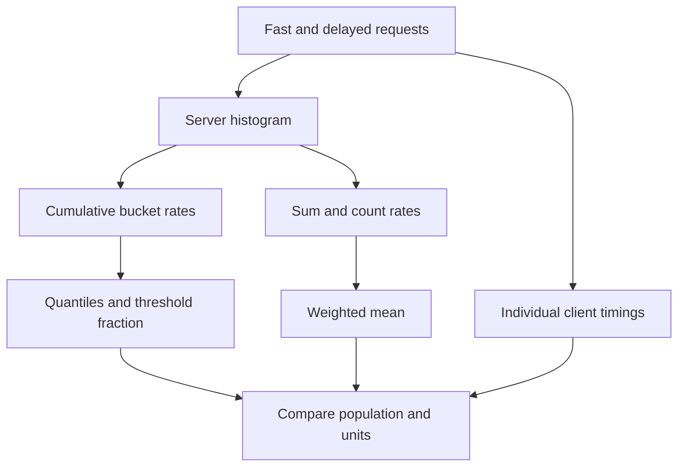

# Lab 13: Histograms, Buckets, and Quantiles

## 1. Purpose and Learning Outcomes

You will send a known mix of fast and delayed requests to learn how latency histograms work. First, check that the bucket counts agree with each other and with the workload. Then calculate the mean, the fraction below a threshold, and percentile estimates. Comparing these results with individual client timings will show what bucketed data can tell you about slow requests and what detail it leaves out.

> **Primary Objective:** Estimate latency quantiles from real cumulative histogram buckets, check the counts behind them, and explain the uncertainty caused by bucket estimates and small request volumes.

An average can hide a small group of slow requests. A histogram keeps an approximate picture of the distribution using a limited set of buckets, but does not save every individual duration. How useful it is depends on the bucket boundaries, which requests you select, and how many observations you have.

You will generate a small mix of fast and delayed requests, calculate exact changes between raw snapshots, and use PromQL to estimate p50, p95, and p99. The experiment uses the existing demo endpoint with its built-in limits. It adds no new business feature or monitoring component.

## 2. Starting Point and Lab Map

Open the complete application repository before using this guide. Unless a step says otherwise, run commands in Bash from the repository's top-level folder. Follow the starting checks in order because later commands depend on the helper functions and running services they prepare.

Read each explanation before running its commands. Run one complete code block, check the result, and then continue. In your notebook, save the commands, what happened, why you think it happened, and anything that differed from the expected result.

### Key Terms

| **Term**          | **Explanation**                                                                                  |
| ----------------- | ------------------------------------------------------------------------------------------------ |
| Cumulative bucket | A count of all observations whose durations are at or below the bucket's upper limit.            |
| Quantile          | A value describing a position in a distribution, such as p95; here it is estimated from buckets. |
| Interpolation     | Estimating a duration inside a bucket because the individual durations are no longer available.  |

### Lab Map

The arrows show how the parts connect and where a request can take different paths. Use this map to understand the design. It is not a recording of a request that actually ran.



## 3. Guided Walkthrough

### Step 01. Inherited State and Starting Checks

**What You Are Doing:** Keep the same app process running between the raw snapshots and send only the planned demo workload. A reset or extra requests would change the expected histogram differences.

**Practical Walkthrough:** Check scrape health and keep the app process running throughout the before-and-after comparison. Control traffic to the demo route so unrelated requests do not add observations. Record the process identity if needed. A restart would make simple subtraction invalid even if the endpoint is reachable afterward.

Take both raw snapshots from the same app process and use the same demo-route selection. Check target health before starting. A reset or additional matching request would affect the difference, so confirm these conditions before expecting exactly 80 new observations.

```bash
source lab-notes/session.sh
source lab-notes/evidence.sh
source lab-notes/raw-metrics.sh
source lab-notes/metrics-session.sh
metrics_check
start_lab 13
api -fsS "$APP_URL/api/v1/demo/work?iterations=1000&delay_ms=0" >/dev/null
snapshot "$LAB_DIR/before.json"
pq 'up{job="fastapi"}' > "$LAB_DIR/starting-up.json"
```

Complete [Lab 12](Lab-12.md). Keep the same four services and the 15-second scrape interval. Do not restart or rebuild the app between the two raw snapshots, and do not run another workload against the demo route during this experiment.

The warm-up request creates the labeled histogram series before the baseline snapshot. It is not part of the exact 80-request difference below, although a Prometheus time window may still include it.

**Understanding the Result:** Exact snapshot differences need the same instrument lifetime and controlled traffic. Estimates over a time window also depend on when samples were collected.

### Step 02. Learning Objectives and Scope

**What You Are Doing:** Check bucket counts before using them in latency calculations. A believable percentile does not fix a query that selected the wrong requests or misread the buckets.

**Practical Walkthrough:** First understand the bucket counts, then check the workload, and only then calculate latency summaries. Percentile functions rely on the selected buckets describing the intended requests. A p95 that looks reasonable can still be wrong for your question if routes are mixed, boundaries are missing, or cumulative counts are misunderstood.

Start with the raw bucket structure, compare it with the workload evidence, and then calculate latency statistics. The quantile depends on the selected requests and bucket limits. If either is wrong, a plausible percentile can answer a different question from the one you meant to ask.

You will check cumulative buckets, subtract neighboring buckets to find non-overlapping counts, calculate a weighted mean, and keep the `le` label when combining classic histograms. You will also explain why estimated quantiles can differ from the client timings you recorded.

This lab does not introduce native histograms, summary metrics, recording rules, dashboards, or alerts. The app already exposes a classic histogram measured in seconds, and Prometheus scrapes it directly.

**Understanding the Result:** Check the distribution data before trusting the statistic. Record the units, selected labels, and observation count alongside every percentile.

### Step 03. Relevant Events and Measurement Boundaries

**What You Are Doing:** Tell apart client elapsed time, server duration, and scrape time. Because they cover different stages, individual timings and aggregate query results may not match exactly.

**Practical Walkthrough:** Identify where client timing starts and ends, where the app measures duration, and when Prometheus collects the result. The client includes some work outside the server's measurement. Prometheus captures accumulated counts later. A client duration therefore need not equal a histogram percentile for a time window.

Describe the three observation points in plain language: the client's start-to-finish time, the server's measured work, and the later scrape. Transport and waiting can affect these intervals differently. Use those differences when comparing client quantiles with server histogram estimates.

| **Observation**                   | **Measurement Boundary**                                                            |
| --------------------------------- | ----------------------------------------------------------------------------------- |
| Client `time_total`               | Time seen by the client for the transfer, including connection and network overhead |
| Application histogram observation | Time measured by server middleware for a completed response                         |
| Request-completion JSON record    | One completed request, with its server duration and request ID                      |
| Scraped bucket sample             | Running count of observations at or below one duration boundary                     |
| Quantile query                    | An estimate calculated from sampled bucket increases during a time window           |

`delay_ms` requests a sleep duration; it does not guarantee the full request time. Scheduling, framework work, and competition for local resources can add time. The route permits only one demo operation at once. Concurrent calls can return 429 and change the latency distribution.

**Understanding the Result:** Compare the same requests and units, but remember that different observers measure different parts of the request. Each measurement answers a related question.

### Step 04. Inspect the Actual Bucket Schema

**What You Are Doing:** Read the actual bucket boundaries and labels. Build queries from what the app exposes instead of assuming it uses a particular set of defaults.

**Practical Walkthrough:** Inspect the exposed bucket limits and metric labels. Keep each bucket's `le` value, which gives its upper limit. Find the matching count and sum series. Do not assume a useful threshold exists unless it appears in the exposed buckets.

List the observed `le` values in numerical order and find the related `_count` and `_sum`. Include the infinite bucket. If a threshold is missing from this schema, changing a query label cannot create an exact count for that threshold.

```bash
jq '[.[] | select(.name == "application_http_request_duration_seconds_bucket" and
  .labels.method == "GET" and .labels.route == "/api/v1/demo/work") |
  {le:.labels.le,value}]' "$LAB_DIR/before.json"
```

The finite boundaries are `0.005`, `0.01`, `0.025`, `0.05`, `0.1`, `0.25`, `0.5`, `1`, `2.5`, `5` and `10` seconds. The client also exposes the `+Inf` bucket, `_count`, `_sum`, and a creation-time sample.

Each method and route combination has 12 bucket series plus count and sum: 14 measurement series, or 15 including `_created` with this client's default settings. This app's histogram has no status-code label, so its route quantiles combine all response statuses. Adding `status_code="200"` would select a label that does not exist and return no data.

**Understanding the Result:** Bucket boundaries limit how much detail is retained. A query cannot recover individual durations that were not stored.

### Step 05. Understand Cumulative Counts Before Querying Quantiles

**What You Are Doing:** Follow one duration through all the buckets it increases. Cumulative buckets overlap, so adding them together would count the same request repeatedly.

**Practical Walkthrough:** Choose an example duration and find every bucket boundary at or above it. Each of those buckets increases, as do the total count and sum. To count observations in one interval, subtract neighboring cumulative buckets instead of adding all the buckets together.

For one duration, increase every bucket whose upper limit includes it. Also update count and sum. Then subtract one cumulative bucket from the next to find the count in that single interval. This shows why adding every bucket would count some requests many times.

A duration of 0.4 seconds increases the 0.5, 1, 2.5, 5, 10, and `+Inf` buckets. It increases `_count` by one and adds the measured duration to `_sum`.

Do not add all bucket counts to find total requests. The `+Inf` bucket already includes every observation and should equal `_count` for the same labels and snapshot. Subtracting neighboring cumulative buckets gives counts for intervals that do not overlap.

Predict which interval will hold most fast requests and which will hold delayed requests. Also predict whether p95 has to equal exactly 0.4 seconds. Write these predictions before sending the workload.

**Understanding the Result:** For the same labels, the infinite bucket should equal the total observation count. Counts must stay the same or increase as bucket boundaries get larger.

### Step 06. Generate a Bounded Mixed-Latency Workload

**What You Are Doing:** Send the fixed mix of fast and delayed requests and save every client result. This gives you a known workload to compare with the histogram.

**Practical Walkthrough:** Run all 80 requests: 64 fast and 16 delayed. Save every result in the ledger. Keep the given sequence and parameters so you know which requests should form the slower group. Do not restart the app or send extra measured requests between the snapshots.

Keep the 64-fast and 16-delayed mix and record one row for every attempt. Take one snapshot before the complete workload and one after it, using the same app process. Record failures or extra traffic before deciding whether the count and distribution match your prediction.

```bash
record_change "begin_80_sequential_histogram_requests" planned
printf 'request_id,delay_ms,status,client_seconds\n' > "$LAB_DIR/client-timings.csv"
for n in $(seq 1 80); do
  delay=0
  if (( n % 5 == 0 )); then delay=400; fi
  rid="lab13-${n}-$(date +%s)"
  result=$(api -sS -o /dev/null -w '%{http_code} %{time_total}' \
    -H "X-Request-ID: $rid" \
    "$APP_URL/api/v1/demo/work?iterations=1000&delay_ms=$delay") || break
  read -r status seconds <<< "$result"
  printf '%s,%s,%s,%s\n' "$rid" "$delay" "$status" "$seconds" >> "$LAB_DIR/client-timings.csv"
  if [[ "$status" != 200 ]]; then
    printf 'Unexpected status %s; stop and inspect the ledger\n' "$status" >&2
    break
  fi
  sleep 0.5
done
snapshot "$LAB_DIR/after.json"
record_change "bounded_histogram_workload_finished" completed
capture_app_logs
```

**Expected Result:** You should have 64 fast and 16 delayed successful requests. The loop takes roughly 47 seconds plus overhead. It sends requests one at a time and stops at 80, so it is not a stress test.

If the loop stops early, save the partial evidence and investigate. Then create a fresh evidence directory and repeat the controlled experiment. Do not change an incomplete ledger to make it appear complete.

**Understanding the Result:** The workload defines the requests you expect to measure. Check the actual completions and statuses before assuming all 80 became the intended histogram observations.

### Step 07. Validate the Client Ledger and Compare Client Quantiles

**What You Are Doing:** Verify the workload before calculating client quantiles. Record the statistical method used, and remember that client timing covers a different interval from server timing.

**Practical Walkthrough:** Check that the ledger is complete and the requests succeeded before calculating client percentiles. Record how the script calculates quantiles, since different methods can give different answers for a small dataset. Keep the client timings as a separate comparison; they are not the exact server histogram values.

Check the row count and statuses first. Read the script's quantile method so you can reproduce it. These timings cover what the client sees. Use them as a reference distribution, not as the individual durations stored by the server's buckets.

```bash
python3 - "$LAB_DIR/client-timings.csv" <<'PYTHON'
import csv, math, sys
rows = list(csv.DictReader(open(sys.argv[1])))
assert len(rows) == 80 and all(r["status"] == "200" for r in rows)
assert sum(r["delay_ms"] == "400" for r in rows) == 16
values = sorted(float(r["client_seconds"]) for r in rows)
print("client_mean_seconds", sum(values) / len(values))
for q in (0.5, 0.95, 0.99):
    print(f"client_nearest_rank_p{int(q*100)}_seconds", values[math.ceil(q * len(values)) - 1])
PYTHON
```

These results use the nearest-rank method on the 80 recorded client durations. Other quantile methods can estimate between individual values differently. Name the method whenever you compare results.

The client results do not have to equal Prometheus results. They use different measurement boundaries, time selections, and estimation methods. With only 80 observations, p99 is especially sensitive to the slowest few requests.

**Understanding the Result:** A client quantile describes the recorded client timings. Explain differences from server estimates using the measurement boundaries and the detail retained by the buckets.

### Step 08. Implement an Exact Histogram-Delta Check

**What You Are Doing:** Check the raw snapshot differences before estimating anything over time. Verify the total count, the order of cumulative bucket counts, and the infinite bucket.

**Practical Walkthrough:** Subtract matching bucket, count, and sum values before and after the controlled workload. Check the new observation count, confirm that larger buckets never have smaller counts, and compare the infinite bucket with count. These checks can reveal resets, selection mistakes, or extra traffic before sampled rate calculations add timing effects.

Check the delta script's selector and expected count before running it. Both snapshots must use the same labels and bucket boundaries. If the counts decrease across increasing boundaries, the total is wrong, or `+Inf` does not match, investigate the raw data before interpreting a percentile.

```bash
cat > lab-notes/histogram_delta.py <<'PYTHON'
"""Compare one histogram across two snapshots without a process restart."""
import json
import math
import sys
from pathlib import Path

before, after = [json.loads(Path(name).read_text()) for name in sys.argv[1:3]]
expected = int(sys.argv[3])
prefix = "application_http_request_duration_seconds"
labels = {"method": "GET", "route": "/api/v1/demo/work"}


def select(rows, name):
    return [r for r in rows if r["name"] == name and all(r["labels"].get(k) == v for k, v in labels.items())]


def total(rows, name):
    return sum(r["value"] for r in select(rows, name))


starts = [[r["value"] for r in rows if r["name"] == "process_start_time_seconds"] for rows in (before, after)]
assert len(starts[0]) == 1 and starts[0] == starts[1], "Process restart: do not subtract snapshots"
count = total(after, prefix + "_count") - total(before, prefix + "_count")
seconds = total(after, prefix + "_sum") - total(before, prefix + "_sum")
old = {float(r["labels"]["le"]): r["value"] for r in select(before, prefix + "_bucket")}
new = {float(r["labels"]["le"]): r["value"] for r in select(after, prefix + "_bucket")}
buckets = [(bound, value - old.get(bound, 0.0)) for bound, value in sorted(new.items())]
assert count == expected, f"Expected {expected} observations, found {count}; check competing traffic"
assert buckets and math.isinf(buckets[-1][0]) and buckets[-1][1] == count
assert seconds >= 0 and all(v >= 0 for _, v in buckets)
previous = 0.0
print("upper_seconds,cumulative_observations,observations_in_this_interval")
for bound, value in buckets:
    assert value >= previous, "Cumulative bucket counts must not decrease"
    print(f"{bound},{value},{value - previous}")
    previous = value
print(f"observations={count:g}; observed_seconds={seconds:.6f}; mean_seconds={seconds/count:.6f}")
PYTHON
```

**Command Note:** `<<'PYTHON'` writes the following text literally until the closing `PYTHON`. The quoted delimiter prevents Bash from expanding `$variables` in the file. Creating the file and executing it are separate steps.

```bash
python3 lab-notes/histogram_delta.py "$LAB_DIR/before.json" "$LAB_DIR/after.json" 80 \
  | tee "$LAB_DIR/histogram-delta.txt"
```

**Expected Result:** There should be 80 new observations, cumulative counts that never decrease as boundaries increase, a `+Inf` difference of 80, and a positive mean. On a quiet VM, about 16 observations should be above 0.25 seconds, with most of those at or below 0.5 seconds. These are predictions to check, not guarantees when resources are busy.

The script rejects snapshots with different process-start timestamps because raw subtraction is invalid across a reset. Its zero default for a previously absent bucket applies only to this controlled comparison where a labeled series is first created. It is not a general rule for missing Prometheus data.

**Understanding the Result:** Investigate a failed consistency check before interpreting percentiles. Reliable raw counts are the starting point for the later sampled estimates.

### Step 09. Query Reset-Aware Bucket Rates

**What You Are Doing:** Calculate reset-aware rates for the original bucket series and keep the `le` label. That label identifies each bucket boundary and is needed to build the distribution.

**Practical Walkthrough:** Calculate a rate for each original bucket series, then combine the rates while keeping `le`. Each boundary must describe the same route and time selection. Removing this label would remove the boundaries the quantile function needs.

Read the query from the inside outward: calculate each bucket series's rate, then sum while keeping `le`. Check that the boundaries cover the same route, method, and window. The boundary label is part of the distribution's structure, so do not remove it before calculating a quantile.

```bash
pq 'sum by (le) (rate(application_http_request_duration_seconds_bucket{job="fastapi",method="GET",route="/api/v1/demo/work"}[2m]))' \
  | tee "$LAB_DIR/bucket-rates.json" | jq '.data.result'
pq 'sum(rate(application_http_request_duration_seconds_count{job="fastapi",method="GET",route="/api/v1/demo/work"}[2m]))' | jq .
```

Wait for a successful scrape after the workload before saving the final query results. Bucket rates are still cumulative and are measured in observations per second. At the same evaluation time, the `+Inf` rate should equal the count rate.

Apply `rate` to each original series before summing. Keep `le` when combining classic histogram buckets because `histogram_quantile` needs that boundary label. The [official histogram guide](https://prometheus.io/docs/practices/histograms/) explains this query structure.

**Understanding the Result:** Keep the bucket structure until the percentile calculation. Combine instances by matching bucket boundaries, rather than averaging their already-calculated percentiles.

### Step 10. Calculate p50, p95 and p99

**What You Are Doing:** Calculate p50, p95, and p99 from the selected bucket rates. These are estimates for the selected requests and window; they do not identify individual requests.

**Practical Walkthrough:** Calculate the three percentiles for the chosen labels and time window, and check the observation count beside them. Each estimates a position in the bucketed distribution. It does not point to a request ID. Tail estimates are less precise when there are few observations or wide buckets.

Record the common selector and window with p50, p95, and p99, and inspect the count. A percentile describes the selected distribution, not a particular slow request. Consider bucket width and the number of slow observations before treating the returned seconds as a precise measurement.

```bash
pq 'histogram_quantile(0.50, sum by (le) (rate(application_http_request_duration_seconds_bucket{job="fastapi",method="GET",route="/api/v1/demo/work"}[2m])))' \
  | tee "$LAB_DIR/p50.json" | jq .
pq 'histogram_quantile(0.95, sum by (le) (rate(application_http_request_duration_seconds_bucket{job="fastapi",method="GET",route="/api/v1/demo/work"}[2m])))' \
  | tee "$LAB_DIR/p95.json" | jq .
pq 'histogram_quantile(0.99, sum by (le) (rate(application_http_request_duration_seconds_bucket{job="fastapi",method="GET",route="/api/v1/demo/work"}[2m])))' \
  | tee "$LAB_DIR/p99.json" | jq .
```

The results are in seconds. Multiply by 1000 only when you want milliseconds. On a quiet machine, p50 should fall in a fast bucket, while p95 and p99 should fall in a slower bucket. The two-minute query window can also include the warm-up request and other observations.

These estimates describe the distribution within the selected window. They do not list slow request IDs. Use the ledger and JSON records when you need to identify a particular completed request.

**Understanding the Result:** Always report the selected requests, time window, and units with a percentile. Without them, the number is easy to misunderstand.

### Step 11. Work through the Interpolation

**What You Are Doing:** Calculate one percentile by hand. First find the bucket containing its rank, then estimate where it falls inside that bucket.

**Practical Walkthrough:** Follow the example to find the target rank between two cumulative bucket counts. Use those counts to calculate how far into the bucket the rank falls. The exact durations inside the bucket are unknown, so the calculation must assume how they are spread.

Find rank 76 in the example of 80 observations. Identify the cumulative counts and boundaries on either side. The calculation estimates a position between those boundaries. Compare that estimate with the bucket's width; it is not an individually recorded duration.

Suppose exactly 64 of the new observations are at or below 0.25 seconds, and all 80 are at or below 0.5 seconds. The p95 rank is 76. That is 12 observations into a bucket containing 16, so linear interpolation gives:

```text
0.25 + (76 - 64) / (80 - 64) * (0.5 - 0.25) = 0.4375 seconds
```

The app might actually have measured all 16 delayed requests near 0.401 seconds. The histogram does not retain their exact positions inside the bucket. An estimated p95 near 0.438 seconds can therefore be consistent with this workload.

For this classic histogram, interpolation assumes observations are spread evenly inside the selected finite bucket. The `+Inf` bucket has no finite upper limit. Under Prometheus's documented behavior, a quantile in that bucket uses the preceding finite boundary. A chart near the largest finite boundary can therefore hide how far the slowest requests extend. Inspect the bucket counts as well as the percentile.

**Understanding the Result:** Extra decimal places do not create more measurement detail. Judge the estimate's precision using the bucket width.

### Step 12. Calculate Mean Latency with the Same Population

**What You Are Doing:** Divide the rate of accumulated duration by the observation-count rate for the same requests. The result is a traffic-weighted mean in seconds per observation.

**Practical Walkthrough:** Use the same labels and window for the duration-sum rate and count rate, then divide. Seconds per second divided by observations per second gives seconds per observation. This calculation gives each observed request its appropriate weight.

Make sure the numerator and denominator select the same requests and window. Check that the resulting units are seconds per observation. Adding the sums and counts before dividing accounts for different traffic volumes. Simply averaging route means would give quiet and busy routes equal weight.

```bash
pq 'sum(rate(application_http_request_duration_seconds_sum{job="fastapi",method="GET",route="/api/v1/demo/work"}[2m])) / sum(rate(application_http_request_duration_seconds_count{job="fastapi",method="GET",route="/api/v1/demo/work"}[2m]))' \
  | tee "$LAB_DIR/mean.json" | jq .
```

The numerator measures accumulated seconds per second, and the denominator measures observations per second. Their ratio is seconds per observation. For the planned mixture, the mean should be much lower than p95.

Do not average per-instance means or percentiles without considering request counts. A busy instance and a nearly idle instance should not automatically have equal influence on a service-wide result.

**Understanding the Result:** When routes handle different amounts of traffic, an unweighted average of their means can mislead. Also explain what zero or missing observation volume means for the calculation.

### Step 13. Measure a Threshold Fraction at an Existing Boundary

**What You Are Doing:** Use a boundary already present in the histogram to estimate the fraction of requests above a latency threshold. This keeps the calculation within the detail the buckets actually provide.

**Practical Walkthrough:** Compare the rate for the existing threshold bucket with the total count rate. The bucket includes observations at or below that limit. Subtracting its fraction from one estimates the fraction above it. Use an actual stored boundary instead of assuming an arbitrary threshold is available.

Confirm that `le="0.25"` exists. This bucket counts observations at or below 250 ms. Dividing its rate by the total and subtracting from one gives the fraction above that limit. Check the denominator and keep the same request selection so inactivity or unrelated traffic does not confuse the result.

```bash
pq '1 - sum(rate(application_http_request_duration_seconds_bucket{job="fastapi",method="GET",route="/api/v1/demo/work",le="0.25"}[2m])) / sum(rate(application_http_request_duration_seconds_count{job="fastapi",method="GET",route="/api/v1/demo/work"}[2m]))' \
  | tee "$LAB_DIR/fraction-over-250ms.json" | jq .
```

This estimates the fraction strictly above 250 ms. The `le="0.25"` bucket includes observations exactly equal to the boundary. With the planned workload, expect a result near 0.2, allowing for the query window and actual scheduling delays.

A fraction at an existing boundary does not need an estimate of positions inside a bucket. This histogram has no exact 300 ms boundary, so it cannot give an exact threshold count there. A percentile query cannot create that missing boundary. If a future requirement needs it, add the bucket through a reviewed instrumentation change.

**Understanding the Result:** A threshold fraction tells you how many observations cross a limit. A percentile estimates a duration at a chosen position in the distribution. Choose the one that answers the latency requirement.

### Step 14. Compare Global and per-Route Quantiles

**What You Are Doing:** Compare route-level quantiles with a quantile for all selected requests. Build the combined distribution from buckets; averaging route percentiles does not produce it.

**Practical Walkthrough:** Calculate the route-specific results, then combine matching buckets before calculating the global quantile. Busy routes contribute more observations to that combined distribution. Averaging the route p95 values would lose both the traffic weighting and the shape of the data.

Compare which labels remain in route-level and global bucket aggregation. Apply `histogram_quantile` after combining the buckets. An average of already-calculated route percentiles cannot reconstruct the full distribution or correctly account for different request volumes.

```bash
pq 'histogram_quantile(0.95, sum by (le,route,method) (rate(application_http_request_duration_seconds_bucket{job="fastapi"}[2m])))' | jq .
pq 'histogram_quantile(0.95, sum by (le) (rate(application_http_request_duration_seconds_bucket{job="fastapi"}[2m])))' | jq .
```

The first query keeps route and method labels. The second deliberately combines all selected HTTP requests. In that combined result, a busy fast route can hide a slower route with little traffic.

To calculate a combined quantile, first add compatible bucket counts. Averaging p95 values cannot recover the combined distribution. Before combining histograms from different app versions, check that their boundaries and measurement definitions are compatible.

**Understanding the Result:** The global percentile describes the combined set of requests. It is not an average of route-level percentile numbers.

### Step 15. Observe Low-Volume and Idle Uncertainty

**What You Are Doing:** Check how many observations support a tail percentile. With little traffic or too few scraped samples, the estimate may vary greatly or be unavailable.

**Practical Walkthrough:** Inspect count or rate information as traffic becomes sparse or stops. A valid query can still return an unstable estimate, no result, or a result based on very few observations. Missing latency data is not zero latency, and disappearing traffic does not by itself show an improvement.

Read the estimated observation count beside the percentile as traffic leaves the window. A missing or undefined result during inactivity is not a measurement of zero seconds. Check query success, available samples, and traffic volume separately when explaining it.

```bash
pq 'sum(increase(application_http_request_duration_seconds_count{job="fastapi",method="GET",route="/api/v1/demo/work"}[2m]))' \
  > "$LAB_DIR/estimated-window-observations.json"
pq 'histogram_quantile(0.99, sum by (le) (rate(application_http_request_duration_seconds_bucket{job="fastapi",method="GET",route="/api/v1/demo/work"}[5s])))' \
  > "$LAB_DIR/too-short-window.json"
jq . "$LAB_DIR/estimated-window-observations.json" "$LAB_DIR/too-short-window.json"
```

The count is essential context. A p99 based on only tens of observations is weak evidence for a stable, rare slow tail. A five-second window usually contains too few scraped samples in this lab and may produce no quantile result.

After enough idle time, valid zero bucket rates produce an undefined quantile (`NaN`). Missing series may instead give an empty result. Neither means zero latency. Keep these outcomes separate in later dashboards and alerts.

**Understanding the Result:** A useful tail-latency estimate needs enough relevant observations. State low traffic volume as a limit on what the evidence can support.

### Step 16. Correlate a Slow Request with Its JSON Record

**What You Are Doing:** Find the log record for one slow request and compare its duration with the histogram view. The log provides individual detail that the histogram summarizes away.

**Practical Walkthrough:** Find a known slow request's completion record using its correlation information. Compare its logged duration with the aggregate result, converting milliseconds and seconds explicitly. The log describes one request; the histogram describes the selected group without retaining request identities.

Take a slow request ID from the ledger and match it exactly to a completion record. Convert logged milliseconds before comparing them with metric seconds. The record gives context for that one request. The histogram covers the full selected set, so keep their meanings separate.

```bash
RID=$(awk -F, 'NR>1 && $2==400 {print $1; exit}' "$LAB_DIR/client-timings.csv")
jq -c --arg rid "$RID" 'select(.event_name=="request_completed" and .request_id==$rid) |
  {timestamp,request_id,event_id,route:."http.route",status:."http.status_code",duration_ms}' \
  "$LAB_DIR/app.jsonl" | tee "$LAB_DIR/one-delayed-completion.jsonl"
```

**Command Note:** `jq --arg` passes a shell value into the JSON query as a string variable, without inserting it into the query text. When used, `-e` makes a false or null final result produce a failing exit status.

Compare `duration_ms / 1000` with the same request's client timing and expected bucket interval. The log adds individual-event detail that aggregate metrics leave out. This limited correlation does not require traces or profiles.

**Understanding the Result:** One slow request can illustrate what happened to that request. It cannot establish the whole population's p95 or p99. Use the individual and aggregate evidence for their respective questions.

### Step 17. Recovery, Troubleshooting and Evidence Review

**What You Are Doing:** Check normal requests and confirm that no work remains unexpectedly active. Keep the histogram's accumulated history and record any unexplained measurement differences.

**Practical Walkthrough:** Send normal requests, check readiness and active work, and review any unresolved count or unit differences. Recovery does not require resetting counters. Save the workload, histogram history, raw evidence, and final query settings so someone can review the calculations later.

Finish with normal requests succeeding, readiness healthy, and no unexpectedly active work. Keep the history instead of restarting to make counters look clean. Document any remaining differences with their selectors, units, and times so the next investigation can reproduce them.

```bash
metrics_check
api -fsS "$APP_URL/api/v1/demo/work?iterations=1000&delay_ms=0" > "$LAB_DIR/recovery-response.json"
snapshot "$LAB_DIR/recovered.json"
metric_sum "$LAB_DIR/recovered.json" application_http_requests_in_progress
record_change "histogram_experiment_recovery_verified" completed
```

**Expected Result:** Readiness succeeds, the fast probe returns 200, and in-progress returns to zero after completion. The histogram still includes earlier observations; recovery does not reset its counters.

| **Symptom**                        | **Check**                                                | **Interpretation**                                                        |
| ---------------------------------- | -------------------------------------------------------- | ------------------------------------------------------------------------- |
| Delta is not 80                    | Ledger, other demo traffic, and process-start samples    | The measured workload changed; investigate and repeat with fresh evidence |
| Bucket totals exceed 80 when added | How cumulative buckets overlap                           | Use `+Inf` or `_count`; adding all buckets counts requests repeatedly     |
| Quantile is empty                  | Selected labels, retained `le`, and available samples    | Fix the data selection before changing the calculation                    |
| Quantile is NaN                    | Observation rate and bucket structure                    | There may be no observations or the distribution may be unusable          |
| p95 differs from client p95        | Measurement boundary, window, and estimation method      | Differences can be expected; first compare equivalent request sets        |
| Slow bucket exceeds 0.5 seconds    | Completion durations and competition for host resources  | The requested delay is part of latency, not a maximum total time          |
| 429 appears                        | Other demo work running at the same time                 | Stop overlapping generators and keep the partial run as evidence          |

Keep original snapshots, timing ledger, log evidence and query responses together.

**Understanding the Result:** The app should be healthy and active work should finish. Earlier slow observations remain valid history for their original time window.

## 4. Troubleshooting and Diagnosis

Begin with the first result that differed from your prediction. Save the exact error or symptom and identify which service or command produced it. Use the checks below, make the needed fix, and repeat the original check to confirm the problem is resolved.

Use the recovery and troubleshooting checks in Step 17.

## 5. Review and Practice

Answer the questions in your own words before reading the answers. For the scenario, say what you would inspect and exactly what each result would tell you.

### Knowledge Check

1. Why must le remain in classic-histogram aggregation?
2. Why is summing buckets not a request count?
3. Can average(p95) produce a service p95?
4. Why might p95 be 0.4375 when delayed requests take about 0.401 seconds?
5. Does NaN mean zero latency?

#### Answer Guide

1. le identifies the upper boundary of each cumulative bucket. The quantile function needs these boundaries to build the distribution.
2. One request increases several cumulative buckets, so adding them counts that request more than once.
3. No. Combine compatible bucket counts first, then calculate the quantile for that combined distribution.
4. The histogram knows how many observations are in the bucket, but not their exact durations. It estimates a position inside the bucket.
5. No. The quantile may be undefined because there are no observations to describe.

### Professional Scenario Exercise

A dashboard shows p99 at 500 ms after only six requests. An engineer concludes that the service has a stable 500 ms tail latency. Check the request count, bucket boundaries, query window, and individual records. Write a conclusion that distinguishes a slow response you observed from a reliable claim about long-term tail latency.

## 6. Completion Checklist

Tick an item only when you can show its result or saved evidence. Finish the cleanup instructions before starting the next lab.

### Observable Completion Criteria

- [ ] The workload has 80 successful requests, including 16 with a requested delay.
- [ ] Snapshot checks show nondecreasing cumulative bucket counts and matching +Inf and count values.
- [ ] I have queried the mean, p50, p95, p99, and a fraction at an existing threshold boundary.
- [ ] I have matched at least one delayed completion with its client record.
- [ ] I can explain the effects of low volume and the difference between empty and NaN results.
- [ ] All four services are healthy and no workload is still running.

## 7. Production Context and Next Lab

### Production Implications

Choose bucket boundaries that help answer operational questions. Extra buckets provide more detail but require more storage for every label combination. Keep the underlying unit in seconds, label displayed units clearly, and show request volume with percentiles. A service-wide quantile can hide a problem on one route, so keep enough label detail to identify where action is needed.

### End State and Transition

The same four services remain running. Continue with [Lab 14: Host Monitoring with Node Exporter and USE](Lab-14.md) to see whether CPU, memory, storage, or network measurements help explain latency observed by the application.
