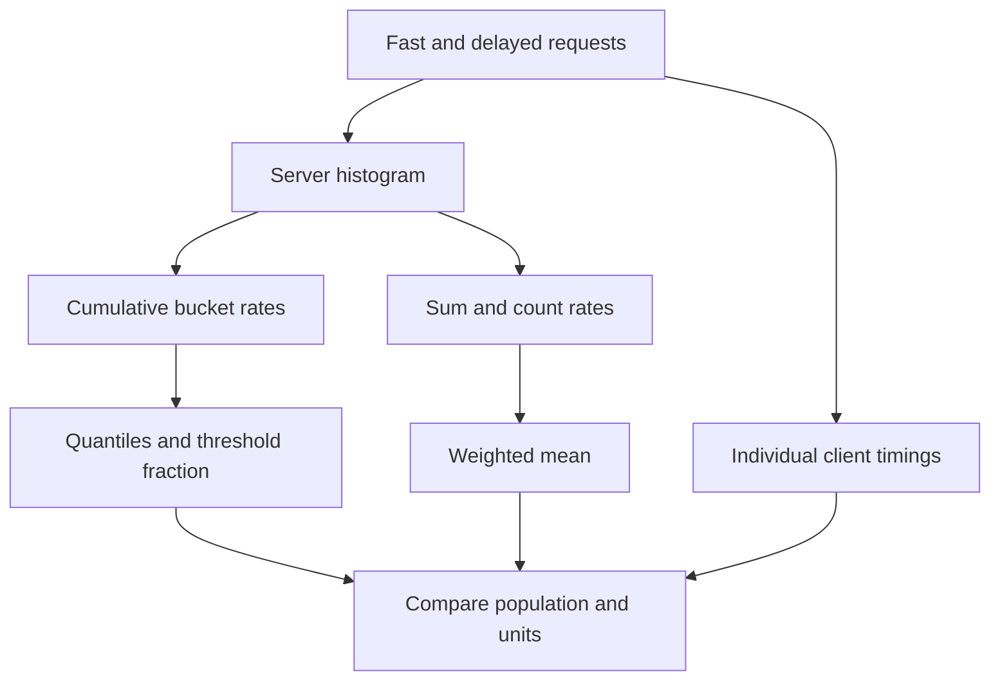

# Lab 13: Histograms, Buckets, and Quantiles

## 1. Purpose and Learning Outcomes

**In Plain Language:** You will use a controlled mixture of fast and delayed requests to understand latency histograms. First prove that the bucket counts are internally consistent, then calculate means, threshold fractions, and quantile estimates. The comparison with individual client timings shows what a bucketed estimate can and cannot say about a slow request.

> **Primary Objective:** Calculate latency quantiles from real cumulative histogram buckets, validate the underlying counts, and explain interpolation and low-volume uncertainty.

An average cannot tell you whether a small fraction of requests was slow. A histogram preserves a bounded approximation of the distribution, but it does not retain each individual duration. Its usefulness depends on the bucket boundaries, the selected traffic and the amount of evidence.

You will generate a small mixture of fast and delayed requests, inspect exact snapshot deltas, and calculate p50, p95 and p99 with PromQL. The experiment uses the existing bounded demo endpoint; it does not add a new business feature or a monitoring component.

## 2. Starting Point and Lab Map

Use this guide inside the complete application repository. Run commands from the repository root in Bash unless a step says otherwise. Work through the starting checks in order; they load the helpers and state this lab needs.

Read the explanation before each step, run one complete code block at a time, and compare the actual result with the stated expectation. Save commands, observations, explanations, and unexpected results in your notebook.

### Key Terms

| **Term**          | **Plain-Language Meaning**                                                               |
| ----------------- | ---------------------------------------------------------------------------------------- |
| Cumulative bucket | The count of observations at or below a stated duration boundary.                        |
| Quantile          | A point in a distribution, such as p95, estimated from histogram buckets here.           |
| Interpolation     | Estimating a value inside a bucket because individual durations were not retained there. |

### Lab Map

The arrows show the flow or dependency being studied. Branches identify paths to compare; this is a conceptual map, not a captured runtime trace.



## 3. Guided Walkthrough

### Step 01. Inherited State and Starting Checks

**What You Are Doing:** Keep the application process unchanged between raw snapshots and isolate the demo workload. Otherwise resets or extra requests would invalidate the expected histogram deltas.

**Practical Walkthrough:** Confirm scrape health and keep the same app process running throughout the raw before-and-after comparison. Isolate the demo route population so unrelated traffic does not contribute histogram observations. Record the process identity if needed; a reset would invalidate simple subtraction even if the endpoint remained reachable.

Take both raw snapshots within the same app process and use the same demo-route selector. Check target health before beginning the controlled workload. Any reset or unrelated request inside that interval would change the subtraction, so record those conditions before interpreting the expected eighty-observation delta.

```bash
source lab-notes/session.sh
source lab-notes/evidence.sh
source lab-notes/raw-metrics.sh
source lab-notes/metrics-session.sh
metrics_check
start_lab 13
api -fsS "$APP_URL/api/v1/demo/work?iterations=1000&delay_ms=0" >/dev/null
snapshot "$LAB_DIR/before.json"
pq 'up{job="fastapi"}' > "$LAB_DIR/starting-up.json"
```

Complete [Lab 12](Lab-12.md). Keep the same four services and 15-second scrape interval. Do not restart or rebuild the application between this lab's two raw snapshots. Do not run a second workload against the demo route during the experiment.

The warm-up request creates the relevant histogram child before the baseline snapshot. It is excluded from the exact 80-request delta below, though a Prometheus range can still include it.

**Understanding the Result:** Exact raw deltas require stable instrument lifetime and controlled traffic. Later windowed estimates have additional sampling boundaries.

### Step 02. Learning Objectives and Scope

**What You Are Doing:** Treat bucket counts as the foundation for every later latency calculation. A plausible percentile cannot repair an incorrectly selected or interpreted population.

**Practical Walkthrough:** Use the objectives in order: understand bucket counts, validate the workload, and only then calculate latency summaries. Percentile functions assume that the selected buckets describe the intended population. A plausible p95 cannot compensate for mixed routes, missing boundaries, or an incorrectly interpreted cumulative histogram.

Work from raw bucket structure to workload evidence and only then to derived latency values. The quantile result depends on the chosen population and boundaries. If those are wrong, a plausible-looking percentile can still answer a different question from the one the lab intends.

You will verify cumulative buckets, derive non-overlapping bucket counts, calculate a weighted mean, preserve the `le` label when aggregating classic histograms, and explain why quantile estimates can differ from measured client timings.

No native-histogram migration, summary metric, recording rule, dashboard or alert is introduced. The application already uses a classic histogram with seconds as its unit. The metric path remains direct application exposition to Prometheus.

**Understanding the Result:** Validate the distribution inputs before interpreting the statistic. Units, labels, and observation count belong beside every percentile.

### Step 03. Relevant Events and Measurement Boundaries

**What You Are Doing:** Separate client elapsed time, server duration, and scrape time. Their different boundaries explain why individual measurements and aggregate query results need not match exactly.

**Practical Walkthrough:** Mark the start and end of client elapsed time, application duration, and scrape collection separately. The client includes work outside the server's observer, while Prometheus periodically captures accumulated observations. These boundaries explain why a client's individual duration need not equal a histogram-derived percentile for a time window.

Draw the observation boundaries in words: client start-to-finish, server measurement scope, and later scrape time. Waiting and transport can contribute differently to those intervals. Use that distinction when comparing client quantiles with server histogram estimates rather than expecting exact equality between unlike measurements.

| **Observation**                   | **Measurement Boundary**                                                    |
| --------------------------------- | --------------------------------------------------------------------------- |
| Client `time_total`               | Client-visible transfer duration, including connection and network overhead |
| Application histogram observation | Server middleware duration for the completed response                       |
| Request-completion JSON record    | A particular completion with its server duration and request ID             |
| Scraped bucket sample             | Accumulated count of observations at or below a boundary                    |
| Quantile query                    | Estimate derived from sampled bucket growth in a time range                 |

The `delay_ms` input is a requested sleep duration, not a promise about end-to-end latency. Scheduling, framework work and local contention add time. The route allows only one demo operation at a time; concurrent calls can return 429, which would change the distribution.

**Understanding the Result:** Compare like populations and units without asserting identical timing boundaries. Each measurement answers a related but different question.

### Step 04. Inspect the Actual Bucket Schema

**What You Are Doing:** Inspect the actual bucket boundaries and associated labels. Query design must follow the schema that is exposed rather than an assumed default.

**Practical Walkthrough:** Read the actual exposed bucket limits and the labels attached to each family. Keep the `le` values with the bucket samples because they specify upper bounds. Identify the matching count and sum samples, and avoid assuming a threshold exists just because it would be convenient for a later query.

List the observed `le` values in numeric boundary order and locate the associated `_count` and `_sum`. Keep the infinite boundary as part of the classic histogram. If the desired threshold is absent, the schema cannot supply its exact cumulative count merely by changing the query label.

```bash
jq '[.[] | select(.name == "application_http_request_duration_seconds_bucket" and
  .labels.method == "GET" and .labels.route == "/api/v1/demo/work") |
  {le:.labels.le,value}]' "$LAB_DIR/before.json"
```

Finite boundaries are `0.005`, `0.01`, `0.025`, `0.05`, `0.1`, `0.25`, `0.5`, `1`, `2.5`, `5` and `10` seconds. The client also exposes the `+Inf` bucket, `_count`, `_sum` and a creation-time sample.

For one method/route label set, that means 12 bucket series plus count and sum: 14 measurement series, or 15 including `_created` with this client's default. The status code is not a histogram label in this application. Quantiles for this route combine all its response statuses; selecting `status_code="200"` on this histogram would invent a label and return no data.

**Understanding the Result:** Available bucket boundaries determine the retained resolution. Queries cannot recover individual durations that were never stored.

### Step 05. Understand Cumulative Counts Before Querying Quantiles

**What You Are Doing:** Follow one observation through every bucket it increments. Because buckets overlap cumulatively, adding them would count the same request many times.

**Practical Walkthrough:** Take an example duration and identify every boundary greater than or equal to it. All those cumulative buckets increase, along with the overall count and sum. To find the count within one interval, compare neighboring cumulative counts rather than summing all buckets.

Use one duration and increment every bucket whose upper limit includes it, plus the count and sum. Then subtract adjacent cumulative buckets to obtain a disjoint interval. This small manual calculation explains why adding all bucket counts would count the same requests repeatedly.

A 0.4-second observation increments the 0.5, 1, 2.5, 5, 10 and `+Inf` buckets. It also increments `_count` once and adds its measured duration to `_sum`.

Therefore, do not add all bucket counts to get total requests. The `+Inf` bucket already counts every observation and should agree with `_count` for the same labels and snapshot. Adjacent cumulative bucket differences describe non-overlapping intervals.

Predict which interval should contain most fast requests and which should contain the delayed requests. Also predict whether p95 must equal exactly 0.4 seconds. Record the predictions before generating load.

**Understanding the Result:** The infinite bucket should equal total observations for the same labels. Increasing boundaries must not have decreasing counts.

### Step 06. Generate a Bounded Mixed-Latency Workload

**What You Are Doing:** Generate the fixed fast-and-delayed mixture and retain each client result. The controlled distribution gives you a prediction to compare with the histogram.

**Practical Walkthrough:** Run the fixed 80-request mixture with 64 fast and 16 delayed requests, preserving each result in the ledger. Use the prescribed sequence and parameters so the distribution has an explainable slow portion. Keep the app process unchanged and avoid extra measured requests between the raw snapshots.

Keep the prescribed mixture of 64 fast and 16 delayed requests and retain one ledger row per attempt. Take snapshots outside that complete workload, without restarting the app. If a request fails or additional traffic reaches the route, record it before expecting the planned distribution and count delta.

```bash
record_change "begin_80_sequential_histogram_requests" planned
printf 'request_id,delay_ms,status,client_seconds\n' > "$LAB_DIR/client-timings.csv"
for n in $(seq 1 80); do
  delay=0
  if (( n % 5 == 0 )); then delay=400; fi
  rid="lab13-${n}-$(date +%s)"
  result=$(api -sS -o /dev/null -w '%{http_code} %{time_total}' \
    -H "X-Request-ID: $rid" \
    "$APP_URL/api/v1/demo/work?iterations=1000&delay_ms=$delay") || break
  read -r status seconds <<< "$result"
  printf '%s,%s,%s,%s\n' "$rid" "$delay" "$status" "$seconds" >> "$LAB_DIR/client-timings.csv"
  if [[ "$status" != 200 ]]; then
    printf 'Unexpected status %s; stop and inspect the ledger\n' "$status" >&2
    break
  fi
  sleep 0.5
done
snapshot "$LAB_DIR/after.json"
record_change "bounded_histogram_workload_finished" completed
capture_app_logs
```

**Expected Result:** 64 fast and 16 delayed successful requests, taking roughly 47 seconds plus overhead. The loop is intentionally sequential and capped at 80; it is not a stress test.

If the loop stops early, keep the evidence. Diagnose the failure, then start a fresh lab evidence directory and repeat the controlled experiment. Do not edit a partial ledger to look complete.

**Understanding the Result:** The workload defines a known population. Validate actual completion and status before assuming all 80 observations reached the intended histogram.

### Step 07. Validate the Client Ledger and Compare Client Quantiles

**What You Are Doing:** Validate the completed workload before calculating client quantiles. Record the statistical method and keep client timing distinct from the server's measurement boundary.

**Practical Walkthrough:** Check ledger completeness and successful execution before computing client quantiles. Record the quantile method because small finite datasets can produce different interpolation results under different definitions. Keep these client timings as a separate reference distribution rather than calling them exact server histogram values.

Verify row count and statuses before calculating client percentiles. Read the script's quantile convention so you can reproduce the result. These timings measure the client boundary; keep them as a reference distribution rather than treating them as the exact values stored inside the server's cumulative buckets.

```bash
python3 - "$LAB_DIR/client-timings.csv" <<'PYTHON'
import csv, math, sys
rows = list(csv.DictReader(open(sys.argv[1])))
assert len(rows) == 80 and all(r["status"] == "200" for r in rows)
assert sum(r["delay_ms"] == "400" for r in rows) == 16
values = sorted(float(r["client_seconds"]) for r in rows)
print("client_mean_seconds", sum(values) / len(values))
for q in (0.5, 0.95, 0.99):
    print(f"client_nearest_rank_p{int(q*100)}_seconds", values[math.ceil(q * len(values)) - 1])
PYTHON
```

These are nearest-rank quantiles of the 80 recorded client durations. Other statistical quantile conventions interpolate individual values differently. State the method when comparing results.

They are not expected to match Prometheus exactly: the measurement boundary, selected window and approximation method differ. With only 80 observations, p99 is particularly sensitive to the slowest few requests.

**Understanding the Result:** A valid client quantile summarizes the recorded client sample. Differences from server estimates need boundary and bucket-resolution explanations.

### Step 08. Implement an Exact Histogram-Delta Check

**What You Are Doing:** Check exact raw-snapshot invariants: total observations, bucket ordering, and the infinite bucket. This validates the histogram evidence before applying time-window estimation.

**Practical Walkthrough:** Subtract matching raw bucket, count, and sum samples across the controlled workload. Check the total observation delta, cumulative ordering, and equality of the infinite bucket and count. These invariants reveal resets, selection mistakes, or unintended traffic before rate estimation introduces additional timing effects.

Inspect the delta check's selector and expected count before running it. The same bucket boundaries and labels must exist on both sides. A failure of monotonicity, total count, or `+Inf` equality should be resolved at the raw-data level before interpreting any percentile derived from those observations.

```bash
cat > lab-notes/histogram_delta.py <<'PYTHON'
"""Compare one histogram across two snapshots without a process restart."""
import json
import math
import sys
from pathlib import Path

before, after = [json.loads(Path(name).read_text()) for name in sys.argv[1:3]]
expected = int(sys.argv[3])
prefix = "application_http_request_duration_seconds"
labels = {"method": "GET", "route": "/api/v1/demo/work"}


def select(rows, name):
    return [r for r in rows if r["name"] == name and all(r["labels"].get(k) == v for k, v in labels.items())]


def total(rows, name):
    return sum(r["value"] for r in select(rows, name))


starts = [[r["value"] for r in rows if r["name"] == "process_start_time_seconds"] for rows in (before, after)]
assert len(starts[0]) == 1 and starts[0] == starts[1], "Process restart: do not subtract snapshots"
count = total(after, prefix + "_count") - total(before, prefix + "_count")
seconds = total(after, prefix + "_sum") - total(before, prefix + "_sum")
old = {float(r["labels"]["le"]): r["value"] for r in select(before, prefix + "_bucket")}
new = {float(r["labels"]["le"]): r["value"] for r in select(after, prefix + "_bucket")}
buckets = [(bound, value - old.get(bound, 0.0)) for bound, value in sorted(new.items())]
assert count == expected, f"Expected {expected} observations, found {count}; check competing traffic"
assert buckets and math.isinf(buckets[-1][0]) and buckets[-1][1] == count
assert seconds >= 0 and all(v >= 0 for _, v in buckets)
previous = 0.0
print("upper_seconds,cumulative_observations,observations_in_this_interval")
for bound, value in buckets:
    assert value >= previous, "Cumulative bucket counts must not decrease"
    print(f"{bound},{value},{value - previous}")
    previous = value
print(f"observations={count:g}; observed_seconds={seconds:.6f}; mean_seconds={seconds/count:.6f}")
PYTHON
```

**Command Note:** `<<'PYTHON'` writes the following block literally until `PYTHON`. Quoting the delimiter prevents Bash from expanding `$variables` inside the generated file; creation and execution are separate steps.

```bash
python3 lab-notes/histogram_delta.py "$LAB_DIR/before.json" "$LAB_DIR/after.json" 80 \
  | tee "$LAB_DIR/histogram-delta.txt"
```

**Expected Result:** 80 new observations; nondecreasing cumulative counts; `+Inf` delta equal to 80; and a positive mean. On an otherwise quiet VM, approximately 16 new observations should lie above 0.25 seconds, with most of those at or below 0.5 seconds. Treat those positions as predictions to test, not guaranteed results under contention.

The script rejects a changed process-start timestamp. Raw subtraction across a process reset is invalid. The zero default for a previously absent bucket is limited to this controlled child-creation comparison; it is not a general policy for missing Prometheus telemetry.

**Understanding the Result:** A failed invariant needs investigation before percentile interpretation. Exact raw counts are the foundation for the later sampled calculations.

### Step 09. Query Reset-Aware Bucket Rates

**What You Are Doing:** Apply reset-aware rates to the original bucket series and retain the `le` boundary label. That label is required to reconstruct the cumulative distribution.

**Practical Walkthrough:** Apply reset-aware rates to the original bucket series, then aggregate while retaining `le`. Each resulting boundary must still represent the same route and time population. Removing the boundary label would collapse the information the quantile function needs to reconstruct the cumulative distribution.

Read the query inside out: calculate rates per original bucket series, then sum while preserving `le`. Check that each boundary belongs to the same route, method, and range. The boundary label carries distribution structure, so dropping it before the quantile calculation destroys necessary information.

```bash
pq 'sum by (le) (rate(application_http_request_duration_seconds_bucket{job="fastapi",method="GET",route="/api/v1/demo/work"}[2m]))' \
  | tee "$LAB_DIR/bucket-rates.json" | jq '.data.result'
pq 'sum(rate(application_http_request_duration_seconds_count{job="fastapi",method="GET",route="/api/v1/demo/work"}[2m]))' | jq .
```

Allow a successful scrape after the workload before capturing final query results. Bucket rates remain cumulative and have observations/second as their unit. Their `+Inf` value should match the count rate when evaluated at the same time.

Use `rate` on each original series before summing. Keep `le` during classic-histogram aggregation; removing it discards the bucket boundary required by `histogram_quantile`. The [official histogram guide](https://prometheus.io/docs/practices/histograms/) explains this aggregation pattern.

**Understanding the Result:** Preserve distribution structure until the percentile calculation. Aggregate instances by bucket rather than averaging their finished percentile values.

### Step 10. Calculate p50, p95 and p99

**What You Are Doing:** Calculate p50, p95, and p99 from the selected bucket rates. Interpret them as estimates for that population and window, not as identified individual requests.

**Practical Walkthrough:** Calculate p50, p95, and p99 for the chosen labels and window, and inspect observation volume alongside them. These values estimate positions in the bucketed population; they do not point to particular request IDs. Tail estimates are especially sensitive to limited observations and wide buckets.

Inspect count evidence beside p50, p95, and p99 and record the shared selector and window. A percentile describes a position in the selected distribution rather than identifying one slow request. Wide buckets and limited tail observations constrain how precisely you can interpret the returned seconds.

```bash
pq 'histogram_quantile(0.50, sum by (le) (rate(application_http_request_duration_seconds_bucket{job="fastapi",method="GET",route="/api/v1/demo/work"}[2m])))' \
  | tee "$LAB_DIR/p50.json" | jq .
pq 'histogram_quantile(0.95, sum by (le) (rate(application_http_request_duration_seconds_bucket{job="fastapi",method="GET",route="/api/v1/demo/work"}[2m])))' \
  | tee "$LAB_DIR/p95.json" | jq .
pq 'histogram_quantile(0.99, sum by (le) (rate(application_http_request_duration_seconds_bucket{job="fastapi",method="GET",route="/api/v1/demo/work"}[2m])))' \
  | tee "$LAB_DIR/p99.json" | jq .
```

Results are seconds. Multiply by 1000 only when you intentionally want milliseconds. On a quiet machine, p50 should remain in a fast bucket while p95 and p99 fall in a slower bucket. Query results can include the warm-up request and other observations inside the two-minute range.

These are estimates of the distribution in the selected window, not a list of slow request IDs. Return to the request ledger and JSON records when you need to identify particular completions.

**Understanding the Result:** Report the population, time window, and units with the result. A percentile without those details is easy to misinterpret.

### Step 11. Work through the Interpolation

**What You Are Doing:** Work through one percentile by hand to see where the estimate comes from. The calculation locates the percentile's bucket and estimates its position within that interval.

**Practical Walkthrough:** Follow the hand calculation to locate the target rank within a cumulative bucket interval. Use the lower and upper cumulative counts to see what fraction of that interval is needed. The interpolation makes an assumption about where observations lie inside the bucket because their exact values are unavailable.

Locate rank 76 within the illustrated eighty-observation distribution, then identify its surrounding cumulative counts and bucket limits. The arithmetic estimates a position inside that interval. Compare the result with the bucket width to understand the approximation rather than treating the interpolated number as an observed individual duration.

Suppose the delta contains exactly 64 observations at or below 0.25 seconds and all 80 at or below 0.5 seconds. The 95th-percentile rank is 76. It lies 12 observations into a 16-observation bucket, so linear interpolation gives:

```text
0.25 + (76 - 64) / (80 - 64) * (0.5 - 0.25) = 0.4375 seconds
```

The application may have actually observed sixteen durations clustered near 0.401 seconds. The histogram cannot know their exact positions inside that bucket. A p95 near 0.438 seconds is therefore compatible with that workload.

For this classic histogram, interpolation assumes a uniform distribution within the selected finite bucket. The top `+Inf` bucket cannot provide a finite upper bound; a quantile falling there uses the preceding finite boundary under Prometheus's documented behavior. A chart near the largest finite boundary can understate an unbounded tail. Inspect bucket population, not just the displayed percentile.

**Understanding the Result:** The estimate's apparent precision exceeds the original resolution if you ignore bucket width. Treat extra decimal places accordingly.

### Step 12. Calculate Mean Latency with the Same Population

**What You Are Doing:** Divide accumulated duration rate by observation-count rate for the same population. This produces a weighted mean in seconds per observation.

**Practical Walkthrough:** Divide duration-sum rate by observation-count rate using identical label scope and window. The units reduce from seconds per second divided by observations per second to seconds per observation. This weights the mean by actual observation volume across the selected population.

Use identical populations and windows in the sum-rate numerator and count-rate denominator. Check their units explicitly to obtain seconds per observation. Aggregating these quantities before division weights by traffic volume, unlike taking an unweighted average of means from routes with different request counts.

```bash
pq 'sum(rate(application_http_request_duration_seconds_sum{job="fastapi",method="GET",route="/api/v1/demo/work"}[2m])) / sum(rate(application_http_request_duration_seconds_count{job="fastapi",method="GET",route="/api/v1/demo/work"}[2m]))' \
  | tee "$LAB_DIR/mean.json" | jq .
```

The numerator is accumulated seconds per second; the denominator is observations per second. Their ratio is seconds per observation. With the intended mixture, the mean should be much lower than p95.

Do not average per-instance means or percentiles without considering their different request counts. A high-traffic instance and an almost idle instance should not automatically receive equal weight in a service-level result.

**Understanding the Result:** Do not average unweighted per-route means when route traffic differs. Zero or absent observation volume needs explicit interpretation.

### Step 13. Measure a Threshold Fraction at an Existing Boundary

**What You Are Doing:** Use an existing bucket boundary to estimate the fraction above a latency threshold. This avoids inventing finer resolution than the stored buckets provide.

**Practical Walkthrough:** Select the existing bucket at the documented threshold and compare its rate with the total count rate. The bucket represents observations at or below that boundary; the complement estimates those above it. Use the exact stored boundary instead of pretending the histogram supports an arbitrary finer threshold.

Confirm the literal `le="0.25"` boundary exists in the exposed schema. Its numerator counts observations at or below 250 ms; subtracting the ratio from one gives the above-boundary fraction. Check denominator volume and maintain matching scope so idle data or unrelated requests do not distort interpretation.

```bash
pq '1 - sum(rate(application_http_request_duration_seconds_bucket{job="fastapi",method="GET",route="/api/v1/demo/work",le="0.25"}[2m])) / sum(rate(application_http_request_duration_seconds_count{job="fastapi",method="GET",route="/api/v1/demo/work"}[2m]))' \
  | tee "$LAB_DIR/fraction-over-250ms.json" | jq .
```

This estimates the fraction strictly above 250 ms. The `le="0.25"` bucket includes observations equal to the boundary. Under the intended workload, the result should be near 0.2, subject to window and observed scheduling effects.

A boundary-aligned fraction does not need within-bucket interpolation. If your future objective is 300 ms, this histogram has no exact 300 ms boundary; a percentile estimate does not create one. Add a deliberate bucket boundary through a reviewed instrumentation change when precision at that threshold matters.

**Understanding the Result:** A threshold fraction and a percentile answer different questions. Choose the one matching the stated latency requirement.

### Step 14. Compare Global and per-Route Quantiles

**What You Are Doing:** Compare per-route quantiles with a combined distribution. Combining buckets answers a population question; averaging already computed route percentiles does not.

**Practical Walkthrough:** Calculate route-specific distributions and then a combined distribution by summing matching buckets before applying the quantile function. Busy routes contribute more observations to the combined result. Averaging their p95 values would discard that weighting and the distribution shape.

Compare the labels retained in route-specific bucket aggregation with the labels retained for the global distribution. Apply `histogram_quantile` only after those buckets are combined. Averaging already-derived route percentiles cannot reconstruct the combined request distribution or account correctly for different route volumes.

```bash
pq 'histogram_quantile(0.95, sum by (le,route,method) (rate(application_http_request_duration_seconds_bucket{job="fastapi"}[2m])))' | jq .
pq 'histogram_quantile(0.95, sum by (le) (rate(application_http_request_duration_seconds_bucket{job="fastapi"}[2m])))' | jq .
```

The first preserves route and method. The second intentionally combines the entire selected HTTP population, so a busy fast route can hide a slower low-volume route.

A correct combined quantile aggregates compatible bucket counts first. Averaging p95 values cannot reconstruct the combined distribution. Before combining histograms from different versions, verify compatible boundaries and measurement semantics.

**Understanding the Result:** The global percentile belongs to the combined request population. It is not an average of the route-level percentile numbers.

### Step 15. Observe Low-Volume and Idle Uncertainty

**What You Are Doing:** Inspect observation volume alongside tail quantiles. Sparse traffic or too few scrape samples can make a percentile unstable or unavailable.

**Practical Walkthrough:** Inspect count or rate evidence when traffic becomes sparse or idle. A percentile may become unstable, unavailable, or based on very few observations even when the query is valid. Keep absent results distinct from zero latency and avoid diagnosing a latency improvement solely from disappearing traffic.

Read the estimated observation count alongside the percentile as traffic leaves the window. An absent or undefined latency result during inactivity is not a measured improvement to zero seconds. Keep query success, sample availability, and traffic volume separate when explaining the idle result.

```bash
pq 'sum(increase(application_http_request_duration_seconds_count{job="fastapi",method="GET",route="/api/v1/demo/work"}[2m]))' \
  > "$LAB_DIR/estimated-window-observations.json"
pq 'histogram_quantile(0.99, sum by (le) (rate(application_http_request_duration_seconds_bucket{job="fastapi",method="GET",route="/api/v1/demo/work"}[5s])))' \
  > "$LAB_DIR/too-short-window.json"
jq . "$LAB_DIR/estimated-window-observations.json" "$LAB_DIR/too-short-window.json"
```

The count gives essential context for a quantile. A p99 supported by tens of observations is not strong evidence about a stable rare tail. A five-second window usually has too few scrape samples here and can produce no quantile result.

After a long enough idle period, valid zero bucket rates lead to an undefined quantile (`NaN`); insufficient series may instead produce an empty result. Neither means zero latency. Preserve those distinctions in later dashboards and alerts.

**Understanding the Result:** Tail latency needs enough relevant observations to be informative. Report low volume as a limit of the evidence.

### Step 16. Correlate a Slow Request with Its JSON Record

**What You Are Doing:** Find one slow request's log record and compare its duration with the aggregate view. The record restores individual context that the histogram deliberately summarizes.

**Practical Walkthrough:** Find one known slow request's completion record using its correlation context and compare its logged duration with the aggregate view. Convert milliseconds and seconds explicitly. The log restores details about that request, while the histogram summarizes all selected observations without retaining their identities.

Select the slow request ID from the ledger and match it exactly to its completion record. Convert the logged milliseconds before comparing with metric seconds. The record explains one request's context, while the histogram represents the full selected population; neither observation should be relabeled as the other.

```bash
RID=$(awk -F, 'NR>1 && $2==400 {print $1; exit}' "$LAB_DIR/client-timings.csv")
jq -c --arg rid "$RID" 'select(.event_name=="request_completed" and .request_id==$rid) |
  {timestamp,request_id,event_id,route:."http.route",status:."http.status_code",duration_ms}' \
  "$LAB_DIR/app.jsonl" | tee "$LAB_DIR/one-delayed-completion.jsonl"
```

**Command Note:** `jq --arg` passes a shell value as a JSON-query string variable without inserting it into the query text. Where used, `-e` turns a false or null final result into a failing exit status.

Compare `duration_ms / 1000` with that request's client timing and its expected histogram interval. The log record supplies individual-event context that the aggregate metric intentionally omits. Traces and profiles are not required to make this limited correlation.

**Understanding the Result:** One request can illustrate the slow path but cannot alone establish the population's p95 or p99. Use both evidence types for their intended scope.

### Step 17. Recovery, Troubleshooting and Evidence Review

**What You Are Doing:** Verify normal requests and zero active work after the experiment. Preserve the accumulated histogram observations as history while recording any unresolved measurement discrepancy.

**Practical Walkthrough:** Run normal requests, check readiness and active work, and review any unresolved count or unit discrepancies. Preserve the completed workload and its histogram history; recovery does not mean resetting counters. Record the final query settings and raw evidence so the calculation can be reviewed later.

Finish with normal requests, readiness, and no unexpectedly active work. Keep the completed workload history intact rather than restarting to make counters look clean. Record unresolved differences with their selectors, units, and timestamps so the next investigation begins from reproducible evidence.

```bash
metrics_check
api -fsS "$APP_URL/api/v1/demo/work?iterations=1000&delay_ms=0" > "$LAB_DIR/recovery-response.json"
snapshot "$LAB_DIR/recovered.json"
metric_sum "$LAB_DIR/recovered.json" application_http_requests_in_progress
record_change "histogram_experiment_recovery_verified" completed
```

**Expected Result:** readiness succeeds, the fast probe returns 200 and in-progress is zero after completion. Histogram counters retain previous observations; recovery does not reset them.

| **Symptom**                        | **Check**                                                | **Interpretation**                                                 |
| ---------------------------------- | -------------------------------------------------------- | ------------------------------------------------------------------ |
| Delta is not 80                    | Ledger, competing demo traffic and process-start samples | The controlled population changed; repeat with fresh evidence      |
| Bucket totals exceed 80 when added | Cumulative semantics                                     | Use `+Inf` or `_count`, not the sum of buckets                     |
| Quantile is empty                  | Labels, preserved `le`, available samples                | Correct selection before changing math                             |
| Quantile is NaN                    | Observation rate and bucket shape                        | No observations or an unusable distribution                        |
| p95 differs from client p95        | Boundary, window and interpolation method                | A difference can be expected; compare equivalent populations first |
| Slow bucket exceeds 0.5 seconds    | Actual completion durations and host contention          | Delay is a lower component of latency, not an upper bound          |
| 429 appears                        | Other concurrent demo work                               | Stop overlapping generators and preserve the partial run           |

Keep original snapshots, timing ledger, log evidence and query responses together.

**Understanding the Result:** The app should be healthy and idle work should settle. Historical slow observations remain valid evidence within their original window.

## 4. Troubleshooting and Diagnosis

Start with the first unexpected result. Record the exact symptom, identify which component produced it, and use the checks below before repeating the experiment. After a fix, repeat the original check and confirm recovery.

Use the recovery and troubleshooting checks in Step 17.

## 5. Review and Practice

Answer the knowledge questions in your own words before reading the answer guide. For the scenario, name the evidence you would collect and the conclusion each observation would support.

### Knowledge Check

1. Why must le remain in classic-histogram aggregation?
2. Why is summing buckets not a request count?
3. Can average(p95) produce a service p95?
4. Why might p95 be 0.4375 when delayed requests take about 0.401 seconds?
5. Does NaN mean zero latency?

#### Answer Guide

1. It identifies each cumulative boundary used to reconstruct the distribution.
2. One observation contributes to several cumulative buckets.
3. No; combine compatible bucket populations and calculate the quantile afterward.
4. The histogram retains counts inside a bucket and interpolates their unknown positions.
5. No; the quantile may be undefined because no observations are present.

### Professional Scenario Exercise

A dashboard reports p99 at 500 ms after only six requests, while an engineer claims the service has a stable 500 ms tail. Review the sample population, bucket layout, query window and individual records. Write a conclusion that separates an observed slow response from a statistically well-supported tail claim.

## 6. Completion Checklist

Mark each item only after you can point to its result or evidence file. Complete any cleanup shown here before moving on.

### Observable Completion Criteria

- [ ] The controlled workload contains 80 successful requests with 16 requested delays.
- [ ] Snapshot validation proves cumulative bucket monotonicity and +Inf/count agreement.
- [ ] Mean, p50, p95, p99 and a boundary-aligned threshold fraction are queried.
- [ ] At least one individual delayed completion is correlated with client evidence.
- [ ] Low-volume and empty/NaN results are explained.
- [ ] All four services are healthy and no workload remains in progress.

## 7. Production Context and Next Lab

### Production Implications

Choose histogram boundaries around operational questions, not merely convenient round numbers. More buckets improve resolution at a storage cost multiplied by every label combination. Preserve seconds internally, display units explicitly, and pair percentiles with volume. A service-wide quantile can hide route-specific behavior; retain enough scope to make it actionable.

### End State and Transition

The same four-service stage remains running. Continue with [Lab 14: Host Monitoring with Node Exporter and USE](Lab-14.md) to inspect whether CPU, memory, storage or network evidence can help explain latency observed at the application boundary.
