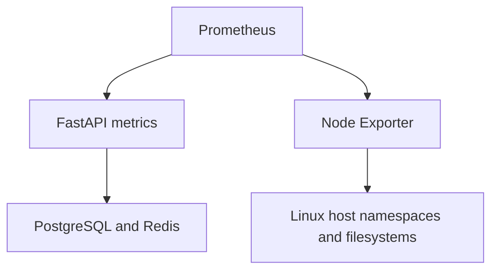

# Lab 14: Host Monitoring with Node Exporter and USE

## Purpose and Scope

> **Primary Objective:** Add host metrics with verified namespace scope, then investigate utilization, saturation and errors without confusing host behavior with application behavior.

The application can report high latency while its own process uses little CPU. Storage waits, host contention, memory pressure or a shared network can still affect it. This lab adds Node Exporter and pairs each query with a resource question.

Run this lab on a Linux VM with Docker Engine, as assumed by the repository's target environment. The host namespace and mount exercises do not establish macOS or Windows host metrics through Docker Desktop; there, a Linux VM is a different monitored host. No Kubernetes, privileged container, Docker socket mount or additional host-monitoring agent is introduced.

## 1. Inherited State and Starting Checks

```bash
source lab-notes/session.sh
source lab-notes/evidence.sh
source lab-notes/raw-metrics.sh
source lab-notes/metrics-session.sh
metrics_check
start_lab 14
uname -s
docker context show
docker info --format '{{.OSType}}'
api -fsS "$APP_URL/health/ready" > "$LAB_DIR/starting-readiness.json"
```

Complete [Lab 13](Lab-13.md). Start with the four-service stage. The commands that read `/proc` and `df` below must run on the actual Docker Engine host. If your Docker context points to a remote daemon, run the lab shell on that VM rather than compare its metrics with your laptop.

Keep normal host work modest during the controlled experiment, and record unavoidable background activity. This is an observation exercise on a disposable learning VM, not permission to load a shared production server.

## 2. Learning Objectives

You will verify host identity and measurement scope, add a real scrape target, interpret CPU/memory/storage/network metrics, distinguish utilization from saturation, and compare a small deliberate load with application behavior.

You will also distinguish three different failures: an unreachable exporter, a failed individual collector and a resource-related error reported by a successful collector. None of those should be silently converted into a healthy zero.

## 3. Current Architecture and New Observation Boundary



Node Exporter observes the Linux host through host networking/PID namespaces and read-only host mounts. FastAPI continues to expose application metrics directly. Prometheus pulls both independently; it does not send metrics through OTel.

The relevant new events are exporter startup, scrape/collector success, bounded CPU work and its completion. Existing request and dependency events remain available for correlation.

## 4. Understand the Access Tradeoff Before Installation

The configuration follows the [Node Exporter container deployment guidance at v1.9.1](https://github.com/prometheus/node_exporter/blob/v1.9.1/README.md), with a pinned image, non-root user, dropped capabilities and a restricted listening address.

Read-only host access is still sensitive: it exposes metadata and readable host files. Host PID/network namespaces weaken isolation. The `timex` collector is disabled so this exercise does not need the optional `SYS_TIME` capability. We do not claim that these settings make a host-mounted exporter equivalent to an isolated application container.

The HTTP listener binds only to the current Compose bridge gateway address. There is no published `ports` entry and no public-interface wildcard listener. The endpoint is still unauthenticated; routing and host firewall policy must prevent access from untrusted networks.

## 5. Discover the Project Bridge Address

```bash
APP_CONTAINER=$(dc ps -q app)
NETWORK_NAME=$(docker inspect "$APP_CONTAINER" \
  | jq -er '.[0].NetworkSettings.Networks | keys | if length==1 then .[0] else error("Expected one app network") end')
LAB_NODE_BIND_IP=$(docker network inspect "$NETWORK_NAME" \
  | jq -er '[.[0].IPAM.Config[] | .Gateway | select(. != null and (contains(":") | not))] |
    if length==1 then .[0] else error("Expected one IPv4 bridge gateway") end')
python3 - "$LAB_NODE_BIND_IP" <<'PYTHON'
import ipaddress, sys
address = ipaddress.ip_address(sys.argv[1])
assert address.version == 4 and not address.is_loopback and not address.is_unspecified
print("Selected bridge gateway:", address)
PYTHON
printf '%s\n' "$LAB_NODE_BIND_IP" > lab-notes/node-exporter-address.txt
chmod 600 lab-notes/node-exporter-address.txt
export LAB_NODE_BIND_IP
printf '%s\n' "$NETWORK_NAME" > "$LAB_DIR/network-name.txt"
```

Do not hardcode an example `172.x.x.x` address. Docker chooses the subnet based on local configuration. The Lab 10 `dm` helper reads this address whenever the Node Exporter overlay exists.

If you later remove and recreate the project network, discover the address again and recreate both Node Exporter and Prometheus. A stored gateway is not guaranteed to remain valid across network deletion.

## 6. Create the Node Exporter Overlay

```bash
cat > lab-notes/compose.node-exporter.yaml <<'YAML'
services:
  prometheus:
    extra_hosts:
      - "host-metrics:${LAB_NODE_BIND_IP:?Discover the project bridge gateway first}"
  node-exporter:
    image: prom/node-exporter:v1.9.1
    user: "65534:65534"
    network_mode: host
    pid: host
    read_only: true
    restart: unless-stopped
    mem_limit: 128m
    cap_drop:
      - ALL
    security_opt:
      - no-new-privileges:true
    command:
      - "--web.listen-address=${LAB_NODE_BIND_IP:?Discover the project bridge gateway first}:9100"
      - "--path.rootfs=/host"
      - "--path.procfs=/host/proc"
      - "--path.sysfs=/host/sys"
      - "--no-collector.timex"
      - "--collector.filesystem.mount-points-exclude=^/(dev|proc|sys|var/lib/docker)($$|/)"
    volumes:
      - /:/host:ro,rslave
    logging:
      driver: json-file
      options:
        max-size: 10m
        max-file: "3"
YAML
```

`$$` in the regular expression is intentional Compose escaping; the container receives a single `$` regex anchor. The root mount uses read-only recursive slave propagation so host mount changes can be observed without propagating container changes back to the host.

The exporter has no artificial health check that merely runs `--version`. A successful Prometheus scrape and collector metrics provide its operational health evidence. Do not add a health command that assumes a shell or curl exists in this minimal image.

## 7. Add a Real Prometheus Scrape Job

```bash
python3 - <<'PYTHON'
from pathlib import Path
path = Path("lab-notes/prometheus/prometheus.yml")
text = path.read_text()
block = '''
  - job_name: node
    static_configs:
      - targets: ["host-metrics:9100"]
'''
if "job_name: node" not in text:
    path.write_text(text.rstrip() + "\n" + block)
PYTHON
chmod 644 lab-notes/prometheus/prometheus.yml
dm config --quiet
record_change "add_node_exporter_and_host_scrape_target" planned
dm up -d --no-deps node-exporter
dm run --rm -T --no-deps --entrypoint promtool prometheus \
  check config /etc/prometheus/labs/prometheus.yml
dm up -d --no-deps prometheus
wait_prometheus
wait_target node up
metrics_check
record_change "node_exporter_target_ready" completed
```

Prometheus must be recreated because its `extra_hosts` mapping changed; a configuration reload alone cannot update a container's host mapping. Compose detects that change during `up`. Its existing named TSDB volume is retained.

Expected: five running services and three healthy scrape jobs: `fastapi`, `prometheus` and `node`. Other observability backends remain stopped.

## 8. Verify Host Identity and Collector Success

```bash
pq 'node_uname_info{job="node"}' | tee "$LAB_DIR/node-identity.json" | jq .
pq 'node_scrape_collector_success{job="node"}' > "$LAB_DIR/collector-success.json"
pq 'node_scrape_collector_success{job="node"} == 0' | jq .
pq 'count(node_cpu_seconds_total{job="node",mode="idle"})' | jq .
getconf _NPROCESSORS_ONLN
pq 'node_memory_MemTotal_bytes{job="node"}' | jq .
awk '/^MemTotal:/ {print $2 * 1024}' /proc/meminfo
```

Compare host identity, CPU count and memory total with commands on the actual Linux host. Small timing differences and CPU hotplug aside, these should describe the same machine. If they describe a container limit or a different VM, fix the observation scope before interpreting resource pressure.

`up=1` means the exporter endpoint was scraped successfully. An individual `node_scrape_collector_success=0` means part of the collection failed. Inspect exporter logs and permissions for that collector; do not immediately add privileged mode.

## 9. Apply USE to the Resource You Are Investigating

| Resource | Utilization examples | Saturation examples | Error evidence |
|---|---|---|---|
| CPU | Non-idle CPU time | Load relative to CPU count; CPU pressure | No universal CPU-error counter in this lab |
| Memory | Available-memory fraction | Memory pressure; major page faults as supporting evidence | Allocation failures need additional kernel/application evidence |
| Disk device | Busy-time fraction, throughput | Weighted I/O time and pressure | Device/kernel error investigation may require host logs |
| Filesystem | Available bytes and inodes | Approaching capacity constrains writes | Read-only state or filesystem collection failure |
| Network | Bytes/second per interface | Capacity/queue evidence when known | Receive/transmit errors and drops |

USE means utilization, saturation and errors. It is a way to form questions, not a requirement to invent three metrics for every resource. Node Exporter does not expose every hardware, kernel or application failure.

## 10. Inspect CPU Utilization and Load

```bash
pq '100 * (1 - avg by (instance) (rate(node_cpu_seconds_total{job="node",mode="idle"}[1m])))' | jq .
pq 'max by (instance) (node_load1{job="node"}) / count by (instance) (node_cpu_seconds_total{job="node",mode="idle"})' | jq .
pq 'rate(node_cpu_seconds_total{job="node",mode=~"iowait|steal"}[1m])' | jq .
```

The first result is average non-idle percentage across logical CPUs; it includes time categories such as I/O wait. Inspect individual modes before concluding that useful application CPU work explains the total.

Linux load includes runnable tasks and tasks in uninterruptible sleep, so load divided by CPU count is a pressure clue rather than a pure CPU queue measurement. Steal time can matter on a VM sharing physical resources. None of these queries alone identifies the responsible application.

## 11. Inspect Memory and Optional Pressure Metrics

```bash
pq '100 * (1 - node_memory_MemAvailable_bytes{job="node"} / node_memory_MemTotal_bytes{job="node"})' | jq .
pq 'rate(node_vmstat_pgmajfault{job="node"}[2m])' | jq .
pq 'rate(node_pressure_cpu_waiting_seconds_total{job="node"}[1m])' | jq .
pq 'rate(node_pressure_memory_waiting_seconds_total{job="node"}[1m])' | jq .
pq 'rate(node_pressure_io_waiting_seconds_total{job="node"}[1m])' | jq .
```

`MemAvailable` accounts for memory the kernel estimates can be made available, including reclaimable cache; “free memory is low” is not enough to prove exhaustion. Major faults can indicate disk-backed page retrieval, but they are not a direct count of OOM kills.

Pressure Stall Information requires kernel support and configuration. If pressure series are absent, inspect `/proc/pressure/` and exporter collector state; report unsupported/unavailable evidence rather than zero pressure. The [pinned pressure collector source](https://github.com/prometheus/node_exporter/blob/v1.9.1/collector/pressure_linux.go) documents these conditions.

## 12. Separate Disk Devices From Filesystem Capacity

```bash
pq '100 * node_filesystem_avail_bytes{job="node",mountpoint="/"} / node_filesystem_size_bytes{job="node",mountpoint="/"}' | jq .
pq '100 * node_filesystem_files_free{job="node",mountpoint="/"} / node_filesystem_files{job="node",mountpoint="/"}' | jq .
pq 'node_filesystem_readonly{job="node"}' | jq .
pq 'node_filesystem_device_error{job="node"}' | jq .
pq 'rate(node_disk_io_time_seconds_total{job="node"}[1m])' | jq .
pq 'rate(node_disk_io_time_weighted_seconds_total{job="node"}[1m])' | jq .
pq 'rate(node_disk_read_bytes_total{job="node"}[1m]) + rate(node_disk_written_bytes_total{job="node"}[1m])' | jq .
df -B1 /
df -i /
```

Inspect actual `device`, `mountpoint` and `fstype` labels before choosing a volume. Do not assume the root filesystem is the data disk or that the disk is named `sda`.

Filesystem available bytes refer to space available to a non-root user; reserved space can differ from free space. A filesystem collection error is not automatically physical disk failure. Disk busy-time rate describes time with I/O in progress; modern parallel devices can perform more work without a simple linear relationship between this value and capacity. Weighted I/O time is supporting queue/concurrency evidence, not a guaranteed latency measurement.

## 13. Inspect Network Throughput and Errors

```bash
pq 'rate(node_network_receive_bytes_total{job="node",device!="lo"}[1m])' | jq .
pq 'rate(node_network_transmit_bytes_total{job="node",device!="lo"}[1m])' | jq .
pq 'rate(node_network_receive_errs_total{job="node"}[2m]) + rate(node_network_transmit_errs_total{job="node"}[2m])' | jq .
pq 'rate(node_network_receive_drop_total{job="node"}[2m]) + rate(node_network_transmit_drop_total{job="node"}[2m])' | jq .
```

Host networking exposes host interfaces, including bridges and virtual interfaces. Do not sum every interface and call the result external traffic; the same packet may cross several observed interfaces. Identify the path relevant to the incident.

Bytes/second is throughput, not percentage utilization unless the link capacity is known and meaningful. Virtual-interface speed can be absent or misleading. Zero reported interface errors also does not prove there are no DNS, TCP, HTTP or upstream-service failures.

## 14. Predict the Bounded CPU Experiment

You will run one low-priority CPU worker inside the application container for 30 seconds. It uses a separate Python process, not the API event loop. There is no memory allocation stress, fork loop, disk-fill test or unbounded generator.

Predict the host-average CPU change on an N-core VM. One busy core can contribute roughly `100/N` percentage points while it runs, and a one-minute rate window smooths a 30-second burst further. Also predict whether API latency must increase. Spare capacity can make the effect small.

## 15. Run the Experiment and Capture More Than One Layer

```bash
record_change "begin_one_low_priority_cpu_worker_30_seconds" planned
dm exec -T app python - <<'PYTHON' > "$LAB_DIR/cpu-worker.txt" &
import os, time
os.nice(10)
deadline = time.monotonic() + 30
value = 1
steps = 0
while time.monotonic() < deadline:
    value = (value * 48271) % 2147483647
    steps += 1
print({"steps": steps, "checksum": value, "bounded_seconds": 30})
PYTHON
WORKER_PID=$!
for n in $(seq 1 6); do
  api -fsS -o /dev/null -w '%{http_code} %{time_total}\n' "$APP_URL/api/v1/items?limit=1" \
    >> "$LAB_DIR/api-during-cpu.txt"
  pq '100 * (1 - avg by (instance) (rate(node_cpu_seconds_total{job="node",mode="idle"}[1m])))' \
    >> "$LAB_DIR/cpu-queries.jsonl"
  sleep 5
done
wait "$WORKER_PID"
record_change "bounded_cpu_worker_finished" completed
capture_app_logs
```

Compare the worker ledger, host CPU samples, client timing and application request records. The extra process does not contribute to the Python API process's own `process_cpu_seconds_total`, although the host observes its CPU work.

A slow API request overlapping CPU activity is correlation. To claim contention caused it, compare a repeatable quiet baseline and inspect other explanations. One small burst on a shared VM is not a capacity benchmark.

## 16. Verify Recovery Without Erasing Historical Evidence

```bash
metrics_check
pq 'node_scrape_collector_success{job="node"} == 0' > "$LAB_DIR/final-collector-errors.json"
api -fsS "$APP_URL/health/ready" > "$LAB_DIR/recovered-readiness.json"
dm logs --tail 50 node-exporter > "$LAB_DIR/node-exporter.log"
record_change "host_monitoring_stage_recovery_verified" completed
```

Confirm the worker exited. CPU rates decay as the burst leaves the query window; counters and historical samples remain. The exporter stays running for Lab 15.

Record any collector failures explicitly. A healthy HTTP endpoint does not excuse an unexplained missing filesystem or permission-denied collector.

## 17. Troubleshooting

| Symptom | Inspect | Corrective direction |
|---|---|---|
| Cannot bind gateway address | Current Docker network gateway and host context | Discover on the actual host; recreate after network changes |
| `host-metrics` does not resolve | Prometheus container host mapping | Recreate Prometheus after adding `extra_hosts` |
| Host metrics resemble a container | Root/proc/sys mounts and namespaces | Correct scope; do not rename misleading metrics as host metrics |
| Exporter target is down | Listener, host firewall, container logs | Test the actual bridge address; keep public exposure restricted |
| Collector reports failure | Collector name and permission/error logs | Fix the specific access requirement or document exclusion |
| Pressure metrics absent | Kernel PSI support | Absence is not zero; use other evidence |
| CPU rise is smaller than expected | CPU count, smoothing and workload duration | One worker does not saturate every CPU |
| Filesystem denominator is zero | Filesystem type and labels | Exclude unsuitable virtual filesystems from that capacity question |

Do not use `privileged: true` as a generic troubleshooting shortcut.

## 18. Knowledge Check

1. Why are host namespaces and mounts needed?
2. Does up=1 prove every collector succeeded?
3. Is low free memory enough to prove memory pressure?
4. Why not sum all interface throughput?
5. Can one busy core produce only a small host-average CPU rise?

### Answer Guide

1. A container otherwise exposes a different namespace/mount view from the host we intend to observe.
2. No; inspect individual collector-success series.
3. No; available memory, reclaimable cache and pressure evidence matter.
4. Traffic can traverse several interfaces, causing double counting and mixed scope.
5. Yes; average utilization is spread across logical CPUs and smoothed over the query window.

## 19. Professional Scenario Exercise

The API p95 rises while the application process CPU remains low. Develop a short investigation using host CPU modes, memory pressure, disk evidence, interface errors and the deployment/change timeline. For each query, state what evidence would support a hypothesis and what the metric cannot prove.

## 20. Lab Notebook Template

Create a notebook in the evidence directory for this run:

```bash
test -e "$LAB_DIR/notebook.md" || printf '# Lab 14 Evidence\n' > "$LAB_DIR/notebook.md"
```

Use these headings and fill them with your predictions, commands, observed results and conclusions:

```markdown
# Lab 14 Evidence

## Host and Docker context identity
## Access model and bridge listener
## Scrape and collector health
## USE questions and selected device labels
## Predicted CPU impact
## Bounded experiment timeline
## Application and host correlation
## Recovery and collection limitations
```

## 21. Observable Completion Criteria

- [ ] Node Exporter v1.9.1 runs as non-root with a restricted host listener.
- [ ] Prometheus scrapes three healthy jobs and five services are running.
- [ ] Host identity, CPU count and memory scope are verified.
- [ ] CPU, memory, filesystem, disk and network queries use observed labels.
- [ ] Collector failures are distinguished from scrape failures and resource errors.
- [ ] The 30-second worker exits and application readiness remains or returns healthy.

## 22. Production Implications

Host exporters need an explicit trust and access model. Prefer managed service deployment and network policy appropriate to the platform; do not expose an unauthenticated metrics endpoint publicly. Host-wide data is not container quota/saturation telemetry. A future container-resource exporter would answer additional questions, but it is not silently assumed here. Establish workload-specific baselines before attaching alert thresholds to generic utilization percentages.

## 23. End State and Transition

Five services remain running: the original application dependencies, Prometheus and Node Exporter. Continue with [Lab 15: PostgreSQL and Redis Exporters](Lab-15.md) to compare what the application observes with what each dependency server reports.
