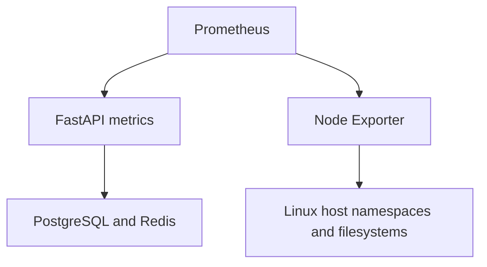

# Lab 14: Host Monitoring with Node Exporter and USE

## 1. Purpose and Learning Outcomes

You will add a tool that measures the host and check which Linux machine it is actually observing. Then you will examine CPU, memory, disks, and network interfaces by asking how much is used, whether work is waiting, and whether errors are occurring. A short CPU experiment shows how host activity, one app's process metrics, and client latency can describe different parts of the same situation.

> **Primary Objective:** Add host metrics, verify exactly which host resources they measure, and investigate resource use, waiting, and errors without confusing host activity with application activity.

An app can respond slowly even when its own process uses little CPU. It may be waiting for storage, competing with other host processes, experiencing memory pressure, or using a busy network. This lab adds Node Exporter and connects each query to a specific resource question.

Use a Linux VM running Docker Engine, as the repository expects. On Docker Desktop, the measured Linux VM is a different machine from the macOS or Windows host; these namespace and mount checks do not establish measurements of that outer host. This lab introduces no Kubernetes, privileged container, Docker socket mount, or extra host-monitoring agent.

## 2. Starting Point and Lab Map

Open the complete application repository before using this guide. Unless a step says otherwise, run commands in Bash from the repository's top-level folder. Follow the starting checks in order because later commands depend on the helper functions and running services they prepare.

Read each explanation before running its commands. Run one complete code block, check the result, and then continue. In your notebook, save the commands, what happened, why you think it happened, and anything that differed from the expected result.

### Key Terms

| **Term**    | **Explanation**                                                                                        |
| ----------- | ------------------------------------------------------------------------------------------------------ |
| USE         | Three questions for one resource: how much is used, whether work is waiting, and whether errors occur. |
| Utilization | How much of a resource is being used during the measurement period.                                    |
| Saturation  | Work waiting for a resource, or pressure caused by limited capacity.                                   |

### Lab Map

The arrows show how the parts connect and where a request can take different paths. Use this map to understand the design. It is not a recording of a request that actually ran.


```mermaid
flowchart TD
    P["Prometheus"] --> A["FastAPI metrics"]
    P --> N["Node Exporter"]
    A --> D["PostgreSQL and Redis"]
    N --> H["Linux host namespaces and filesystems"]
```

## 3. Guided Walkthrough

### Step 01. Inherited State and Starting Checks

**What You Are Doing:** Run the host checks on the machine that actually runs Docker Engine. Keep the current metrics stage working. If Docker uses a remote host, local commands may otherwise measure a different computer.

**Practical Walkthrough:** Check the Docker context before comparing local CPU or memory values with Node Exporter. If your terminal controls a remote engine, run the reference commands on that engine's host. Keep the existing metrics services running so the new host observer is the only addition.

Check `docker context` before treating local commands as host evidence. With a remote engine, your terminal's CPU and memory measurements belong to another machine. Identify the engine host first so you compare two views of the same system.

```bash
source lab-notes/session.sh
source lab-notes/evidence.sh
source lab-notes/raw-metrics.sh
source lab-notes/metrics-session.sh
metrics_check
start_lab 14
uname -s
docker context show
docker info --format '{{.OSType}}'
api -fsS "$APP_URL/health/ready" > "$LAB_DIR/starting-readiness.json"
```

Complete [Lab 13](Lab-13.md) and start with the four-service stage. Run the commands using `/proc` and `df` on the actual Docker Engine host. If Docker points to a remote daemon, run the lab shell on that VM instead of comparing its exporter values with your laptop's values.

Keep other host activity low during the controlled experiment and record anything you cannot avoid. Run this on a disposable learning VM. The exercise is not intended to add load to a shared production server.

**Understanding the Result:** Values from two different machines cannot confirm each other. Establish which host is being measured before comparing resource totals.

### Step 02. Learning Objectives

**What You Are Doing:** Check the measurement's scope before drawing a performance conclusion. A correct value from the wrong host or namespace still answers the wrong question.

**Practical Walkthrough:** For each objective, first identify the machine or namespace being observed. Then ask about resource use, waiting, or errors. Running an exporter in a container does not by itself tell you whether its measurements describe that container or the host.

For every metric, write down the resource and namespace it describes before interpreting the number. Then decide whether it addresses utilization, saturation, or errors. A percentage can look useful while actually describing the wrong machine, CPU set, or filesystem.

You will confirm host identity and measurement scope, add a real scrape target, and interpret CPU, memory, storage, and network measurements. You will also distinguish resource use from waiting and compare a small planned load with app behavior.

Keep three failures separate: Prometheus cannot reach the exporter; one collector inside the exporter fails; or a working collector reports a resource error. None should quietly become a healthy-looking zero.

**Understanding the Result:** Correctly collected data can still lead to the wrong diagnosis if it describes the wrong resources. Checking identity is part of validating a measurement.

### Step 03. Current Architecture and New Observation Boundary

**What You Are Doing:** Add Node Exporter as a separate host observer. App metrics continue to describe the app, while host metrics also include other processes and system activity.

**Practical Walkthrough:** Follow the separate scrape paths for the app and Node Exporter. The app measures its own requests. Node Exporter measures host resources, including activity unrelated to those requests. Compare aligned time windows, but do not assume every host change came from the API.

Compare host and app data over the same times, while keeping their coverage clear. Node Exporter can see unrelated host processes; the app measures its own work. A CPU increase at the same time shows a possible relationship, but you need more evidence before attributing all host activity to the API.

The lab map in Section 2 shows this relationship.

Node Exporter reads the Linux host through host networking and PID namespaces and read-only host mounts. FastAPI continues to expose its own metrics directly. Prometheus scrapes each independently; these metrics do not pass through OTel.

New events to record include exporter startup, scrape and collector success, the limited CPU workload, and its completion. You can still compare these with application requests and dependency events.

**Understanding the Result:** Separate observers add useful context. They cover different activity, so their totals do not need to match.

### Step 04. Understand the Access Tradeoff Before Installation

**What You Are Doing:** Review what host access the exporter receives before starting it. Its selected namespaces and mounts make the host measurements possible.

**Practical Walkthrough:** Read the namespace, mount, and listener settings before starting the exporter. They let it inspect host resources that a normally isolated container cannot see. Understand why each setting is present. Keep the given scope instead of adding broader privileges just because an expected metric is missing.

Match each mount and namespace setting to the resources it lets a collector observe. Separately check which address the listener exposes. If data is missing, investigate the required path and permissions first. Do not widen the whole container's access to work around an unexplained configuration problem.

The configuration follows the [Node Exporter container deployment guidance at v1.9.1](https://github.com/prometheus/node_exporter/blob/v1.9.1/README.md). It pins the image version, uses a non-root user, drops capabilities, and restricts the listening address.

Read-only host access still exposes sensitive information, including metadata and readable host files. Sharing the host's PID and network namespaces reduces isolation. The `timex` collector is disabled to avoid needing the optional `SYS_TIME` capability. These settings do not make a host-mounted exporter as isolated as an ordinary application container.

The HTTP listener binds only to this Compose network's current bridge gateway address. There is no published `ports` entry or wildcard listener on public interfaces. The endpoint has no authentication, so routing and host firewall rules must keep untrusted networks from reaching it.

**Understanding the Result:** Host visibility comes from deliberate configuration choices. A successful scrape proves reachability, but does not prove that every metric describes the intended resources.

### Step 05. Discover the Project Bridge Address

**What You Are Doing:** Find the bridge address actually assigned to this project. Use it to connect Prometheus to the selected host listener instead of assuming another machine's subnet will work.

**Practical Walkthrough:** Inspect this project's Docker network and use its returned bridge address in the configuration. This address connects Prometheus's container network to the chosen listener on the host. Do not copy an example subnet from another machine; Docker chooses networks based on local settings.

Read the network name from the running app container, then inspect that network's gateway. Use this address for the host listener. Repeat discovery if the Docker context or project changes rather than reusing an address from a different deployment.

```bash
APP_CONTAINER=$(dc ps -q app)
NETWORK_NAME=$(docker inspect "$APP_CONTAINER" \
  | jq -er '.[0].NetworkSettings.Networks | keys | if length==1 then .[0] else error("Expected one app network") end')
LAB_NODE_BIND_IP=$(docker network inspect "$NETWORK_NAME" \
  | jq -er '[.[0].IPAM.Config[] | .Gateway | select(. != null and (contains(":") | not))] |
    if length==1 then .[0] else error("Expected one IPv4 bridge gateway") end')
python3 - "$LAB_NODE_BIND_IP" <<'PYTHON'
import ipaddress, sys
address = ipaddress.ip_address(sys.argv[1])
assert address.version == 4 and not address.is_loopback and not address.is_unspecified
print("Selected bridge gateway:", address)
PYTHON
printf '%s\n' "$LAB_NODE_BIND_IP" > lab-notes/node-exporter-address.txt
chmod 600 lab-notes/node-exporter-address.txt
export LAB_NODE_BIND_IP
printf '%s\n' "$NETWORK_NAME" > "$LAB_DIR/network-name.txt"
```

Do not hardcode an example `172.x.x.x` address. Docker selects the subnet using local configuration. The Lab 10 `dm` helper reads the gateway whenever the Node Exporter overlay is present.

If you delete and recreate the project network later, find its address again and recreate both Node Exporter and Prometheus. The previous gateway address may no longer be valid.

**Understanding the Result:** The address must belong to the current project network. An old address can make a healthy exporter appear unreachable.

### Step 06. Create the Node Exporter Overlay

**What You Are Doing:** Create the exporter overlay with the required views of the host. Preserve the mount paths, listener settings, and escaping because they determine access and what is measured.

**Practical Walkthrough:** Create the overlay using the supplied mounts and namespace settings. Preserve the escaping in Compose values: some dollar signs must reach the container unchanged. Inspect the merged configuration to see the actual mounts and command that Compose will use.

Copy the complete quoted heredoc and keep its literal dollar-sign escaping. Compare the host mount paths, exporter path flags, and namespace settings in the merged configuration. They must point to the same intended host view. Valid YAML can still expose the wrong filesystem if these paths disagree.

```bash
cat > lab-notes/compose.node-exporter.yaml <<'YAML'
services:
  prometheus:
    extra_hosts:
      - "host-metrics:${LAB_NODE_BIND_IP:?Discover the project bridge gateway first}"
  node-exporter:
    image: prom/node-exporter:v1.9.1
    user: "65534:65534"
    network_mode: host
    pid: host
    read_only: true
    restart: unless-stopped
    mem_limit: 128m
    cap_drop:
      - ALL
    security_opt:
      - no-new-privileges:true
    command:
      - "--web.listen-address=${LAB_NODE_BIND_IP:?Discover the project bridge gateway first}:9100"
      - "--path.rootfs=/host"
      - "--path.procfs=/host/proc"
      - "--path.sysfs=/host/sys"
      - "--no-collector.timex"
      - "--collector.filesystem.mount-points-exclude=^/(dev|proc|sys|var/lib/docker)($$|/)"
    volumes:
      - /:/host:ro,rslave
    logging:
      driver: json-file
      options:
        max-size: 10m
        max-file: "3"
YAML
```

**Command Note:** `<<'YAML'` writes the following text literally until the closing `YAML`. Quoting the delimiter prevents Bash from expanding `$variables` in the file. Creating the file and running it are separate steps.

`$$` is intentional Compose escaping: the container receives one `$` as the regular-expression anchor. The root mount is read-only and uses recursive slave propagation. This allows host mount changes to become visible inside the container without passing container mount changes back to the host.

The exporter does not use a health check that only runs `--version`. Successful Prometheus scrapes and collector metrics provide evidence that it is working. Do not add a health command that assumes this minimal image includes a shell or curl.

**Understanding the Result:** Variable expansion and overlay merging can change the effective settings from what you see in one YAML file. Check the merged model before starting the container.

### Step 07. Add a Real Prometheus Scrape Job

**What You Are Doing:** Add the scrape target and recreate containers where networking settings have changed. Reloading Prometheus configuration cannot update an existing container's hostname mapping.

**Practical Walkthrough:** Add the scrape job, then use the documented recreation step for container-level hostname or network changes. A Prometheus reload updates scraping rules, but does not change the network settings assigned when the container was created. Check both if the new target cannot be reached.

Validate the scrape configuration and recreate containers where required to apply network changes. A reload only changes Prometheus's own configuration. If scraping fails, inspect the resolved target address and the container's actual network settings.

```bash
python3 - <<'PYTHON'
from pathlib import Path
path = Path("lab-notes/prometheus/prometheus.yml")
text = path.read_text()
block = '''
  - job_name: node
    static_configs:
      - targets: ["host-metrics:9100"]
'''
if "job_name: node" not in text:
    path.write_text(text.rstrip() + "\n" + block)
PYTHON
chmod 644 lab-notes/prometheus/prometheus.yml
dm config --quiet
record_change "add_node_exporter_and_host_scrape_target" planned
dm up -d --no-deps node-exporter
dm run --rm -T --no-deps --entrypoint promtool prometheus \
  check config /etc/prometheus/labs/prometheus.yml
dm up -d --no-deps prometheus
wait_prometheus
wait_target node up
metrics_check
record_change "node_exporter_target_ready" completed
```

Prometheus must be recreated because its `extra_hosts` mapping changed. A config reload cannot update that mapping inside an existing container. Compose detects the change during `up`, while retaining the existing named TSDB volume.

**Expected Result:** Five services are running, with three healthy scrape jobs: `fastapi`, `prometheus` and `node`. The other observability backends remain stopped.

**Understanding the Result:** A fresh successful scrape checks the complete collection path. A valid configuration file only proves that Prometheus accepts its contents.

### Step 08. Verify Host Identity and Collector Success

**What You Are Doing:** Compare the exporter's host identity and resource totals with commands run on the host. This verifies that successful scrapes describe the intended machine.

**Practical Walkthrough:** Compare Node Exporter's identity and totals with reference commands on the Docker Engine host. Check enough details to distinguish the host from a container's limited view. If they differ, investigate mounts, namespaces, and collectors before concluding that the host has a resource problem.

Compare hostname, kernel details, CPU count, and memory totals with the engine host, then check collector-success samples. Resolve identity or visibility differences before interpreting resource values. A successful scrape does not prove that every intended collector observed the correct host.

```bash
pq 'node_uname_info{job="node"}' | tee "$LAB_DIR/node-identity.json" | jq .
pq 'node_scrape_collector_success{job="node"}' > "$LAB_DIR/collector-success.json"
pq 'node_scrape_collector_success{job="node"} == 0' | jq .
pq 'count(node_cpu_seconds_total{job="node",mode="idle"})' | jq .
getconf _NPROCESSORS_ONLN
pq 'node_memory_MemTotal_bytes{job="node"}' | jq .
awk '/^MemTotal:/ {print $2 * 1024}' /proc/meminfo
```

Compare identity, CPU count, and total memory with commands on the actual Linux host. Apart from small timing differences or CPU hotplug changes, they should describe the same machine. If the values describe a container limit or another VM, fix the measurement scope before investigating resource pressure.

`up=1` means Prometheus successfully scraped the exporter endpoint. An individual `node_scrape_collector_success=0` means one collector failed. Check that collector's logs and permissions before considering broader access; do not immediately enable privileged mode.

**Understanding the Result:** These checks validate what the data means as well as whether it is reachable. An `up` value of one confirms endpoint scraping, not the success and scope of every collector.

### Step 09. Apply USE to the Resource You Are Investigating

**What You Are Doing:** Choose one resource before applying USE. Measurements of utilization, waiting, and errors must describe that resource to support a useful diagnosis.

**Practical Walkthrough:** Pick a specific CPU set, device, or interface. Find measurements for how much it is used, evidence that work is waiting, and error signals. Keep all three connected to the same resource instead of combining unrelated symptoms.

Choose a concrete resource and apply all three USE questions to it. For a disk, free capacity, busy time, waiting, and errors are separate observations. Save names and units with each result so a different interface or filesystem does not become mistaken evidence for the one you are investigating.

| **Resource** | **Utilization Examples**            | **Saturation Examples**                                   | **Error Evidence**                                                 |
| ------------ | ----------------------------------- | --------------------------------------------------------- | ------------------------------------------------------------------ |
| CPU          | Time spent outside idle mode        | Load compared with CPU count; CPU pressure                | This lab has no single counter covering all CPU errors             |
| Memory       | Fraction of memory available        | Memory pressure; major page faults as supporting evidence | Allocation failures need additional kernel or application evidence |
| Disk device  | Busy-time fraction and throughput   | Weighted I/O time and pressure                            | Device and kernel errors may require host-log investigation        |
| Filesystem   | Available bytes and inodes          | Little remaining capacity can prevent writes              | Read-only state or a failed filesystem collector                   |
| Network      | Bytes per second for each interface | Known capacity and queue information                      | Receive and transmit errors and dropped packets                    |

USE stands for utilization, saturation, and errors. It helps you ask questions; it does not require you to invent three metrics for every resource. Node Exporter does not report every hardware, kernel, or application failure.

**Understanding the Result:** Some resources lack measurements for a USE category. Record that as a limit of the instrumentation, not as a measured zero.

### Step 10. Inspect CPU Utilization and Load

**What You Are Doing:** Compare CPU time modes and load with the number of logical CPUs. A high non-idle percentage does not by itself show useful app computation or prove that tasks are waiting for CPU.

**Practical Walkthrough:** Inspect CPU modes, logical CPU count, and load together. Where needed, divide combined CPU values by available capacity to understand their scale. Load and non-idle time measure different things, and non-idle time can include work other than API computation.

The CPU expression calculates the rate of cumulative idle time, averages it across the selected CPUs, and converts that to non-idle percent. Compare load with logical CPU count separately. High load and high busy time are related clues, but they are not interchangeable measures of useful application work.

```bash
pq '100 * (1 - avg by (instance) (rate(node_cpu_seconds_total{job="node",mode="idle"}[1m])))' | jq .
pq 'max by (instance) (node_load1{job="node"}) / count by (instance) (node_cpu_seconds_total{job="node",mode="idle"})' | jq .
pq 'rate(node_cpu_seconds_total{job="node",mode=~"iowait|steal"}[1m])' | jq .
```

The first result is the average non-idle percentage across logical CPUs. It includes categories such as I/O wait. Inspect the individual modes before deciding that app computation explains the total.

Linux load includes tasks ready to run and tasks in uninterruptible sleep. Dividing load by CPU count gives a pressure clue, not a pure measure of the CPU queue. On a VM, steal time can also matter when physical resources are shared. None of these queries alone identifies the app responsible.

**Understanding the Result:** Busy CPUs do not by themselves prove that the app is waiting for CPU capacity. Support that conclusion with waiting and process-specific evidence.

### Step 11. Inspect Memory and Optional Pressure Metrics

**What You Are Doing:** Check available memory and pressure evidence instead of treating low free memory as a failure. Also distinguish a missing kernel feature from a metric reporting zero.

**Practical Walkthrough:** Compare available memory, memory-pressure evidence, and the host's cache use. Linux uses otherwise idle memory for caches, so a small free-memory value alone does not mean trouble. Before interpreting an empty pressure query, check whether the kernel exposes the feature.

Use available memory together with pressure or page-fault evidence. Do not diagnose exhaustion from free memory alone. Check whether this kernel provides the optional pressure series. Missing instrumentation is not a measured zero and cannot prove there is no competition for memory.

```bash
pq '100 * (1 - node_memory_MemAvailable_bytes{job="node"} / node_memory_MemTotal_bytes{job="node"})' | jq .
pq 'rate(node_vmstat_pgmajfault{job="node"}[2m])' | jq .
pq 'rate(node_pressure_cpu_waiting_seconds_total{job="node"}[1m])' | jq .
pq 'rate(node_pressure_memory_waiting_seconds_total{job="node"}[1m])' | jq .
pq 'rate(node_pressure_io_waiting_seconds_total{job="node"}[1m])' | jq .
```

`MemAvailable` includes memory the kernel estimates it can make available, such as reclaimable cache. Low free memory alone does not prove exhaustion. Major page faults can show pages being retrieved from disk, but they do not directly count out-of-memory kills.

Pressure Stall Information depends on kernel support and configuration. If its series are missing, inspect `/proc/pressure/` and collector status. Report the measurements as unsupported or unavailable, rather than zero pressure. The [pinned pressure collector source](https://github.com/prometheus/node_exporter/blob/v1.9.1/collector/pressure_linux.go) describes these conditions.

**Understanding the Result:** An unavailable feature differs from a supported measurement showing zero. Interpret the memory observations that the system actually provides together.

### Step 12. Separate Disk Devices from Filesystem Capacity

**What You Are Doing:** Identify the relevant disk device and filesystem mount before querying activity or capacity. Free filesystem space and block-device I/O describe different resource questions.

**Practical Walkthrough:** Find the block device and mount used by the workload. Device counters describe I/O activity, while filesystem gauges describe capacity and space. Do not combine unrelated devices or treat low space as proof of high I/O latency without supporting measurements.

Identify the storage mountpoint and its serving device. Read available bytes and inodes as capacity measurements, then inspect device activity separately. Running out of space and having too much I/O work require different evidence, even though both can slow down or break database operations.

```bash
pq '100 * node_filesystem_avail_bytes{job="node",mountpoint="/"} / node_filesystem_size_bytes{job="node",mountpoint="/"}' | jq .
pq '100 * node_filesystem_files_free{job="node",mountpoint="/"} / node_filesystem_files{job="node",mountpoint="/"}' | jq .
pq 'node_filesystem_readonly{job="node"}' | jq .
pq 'node_filesystem_device_error{job="node"}' | jq .
pq 'rate(node_disk_io_time_seconds_total{job="node"}[1m])' | jq .
pq 'rate(node_disk_io_time_weighted_seconds_total{job="node"}[1m])' | jq .
pq 'rate(node_disk_read_bytes_total{job="node"}[1m]) + rate(node_disk_written_bytes_total{job="node"}[1m])' | jq .
df -B1 /
df -i /
```

Inspect the actual `device`, `mountpoint` and `fstype` labels before selecting a volume. The root filesystem may not be the data disk, and the disk may not be named `sda`.

Available filesystem bytes are the space a non-root user can use; reserved space can make this differ from free space. A filesystem collection error does not automatically mean a physical disk failed. Disk busy time shows how long I/O was in progress, but modern devices can perform several operations at once, so it does not map simply to capacity. Weighted I/O time helps investigate waiting and concurrency; it is not a guaranteed latency measurement.

**Understanding the Result:** Capacity and performance are separate questions. Save the selected device and mount with the query so its scope stays clear.

### Step 13. Inspect Network Throughput and Errors

**What You Are Doing:** Choose the network interface on the path you want to study. Adding every virtual and physical interface can count the same traffic more than once.

**Practical Walkthrough:** Select an interface on the relevant traffic path. A packet can pass through a container bridge, a virtual Ethernet interface, and a physical interface. Summing all those observations can inflate the total instead of measuring one end-to-end flow.

Keep the interface name and receive/transmit units with each result. The same traffic may cross both virtual and physical interfaces. Adding every interface can combine several observations of the same traffic, rather than produce a meaningful overall throughput total.

```bash
pq 'rate(node_network_receive_bytes_total{job="node",device!="lo"}[1m])' | jq .
pq 'rate(node_network_transmit_bytes_total{job="node",device!="lo"}[1m])' | jq .
pq 'rate(node_network_receive_errs_total{job="node"}[2m]) + rate(node_network_transmit_errs_total{job="node"}[2m])' | jq .
pq 'rate(node_network_receive_drop_total{job="node"}[2m]) + rate(node_network_transmit_drop_total{job="node"}[2m])' | jq .
```

Host networking exposes host interfaces, including bridges and virtual interfaces. Do not call the sum of every interface “external traffic”; one packet may cross several of them. Identify the interface relevant to the incident.

Bytes per second measures throughput. It becomes percentage utilization only when you know a meaningful link capacity. Reported speed for a virtual interface may be absent or misleading. Zero interface errors also does not prove that DNS, TCP, HTTP, or upstream services are working correctly.

**Understanding the Result:** Interpret a network rate at the interface where it was measured. Record that interface when comparing values before and after the experiment.

### Step 14. Predict the Bounded CPU Experiment

**What You Are Doing:** Predict which metrics will show a separate CPU worker. It runs in the app container but is a different process from the API, so different observers will include different work.

**Practical Walkthrough:** Predict the effect on host metrics, container-level observations, and API process metrics. The worker shares a container with the app but runs in a separate process. This lets you check measurement scope without assuming that all container activity belongs to the server process.

Predict the worker's contribution to host and container CPU separately from the server process's counters. Record the planned duration and priority. A real host CPU burst can occur without increasing the app process's CPU metric because the worker is a different process.

Run one low-priority CPU worker in the app container for 30 seconds. It is a separate Python process and does not run in the API event loop. The experiment does not stress memory, repeatedly fork processes, fill disks, or run without a time limit.

Predict the host-average CPU change for an N-core VM. One busy core can add roughly `100/N` percentage points while active. A one-minute rate window smooths a 30-second burst further. Also predict whether API latency must increase; spare capacity may keep the effect small.

**Understanding the Result:** Make separate predictions for host activity and request behavior. Sharing a container does not make all measurements identical.

### Step 15. Run the Experiment and Capture More than One Layer

**What You Are Doing:** Run the limited worker and collect host, client, and app evidence together. Comparing them helps explain the result without assigning all host activity to FastAPI.

**Practical Walkthrough:** Run the 30-second worker and capture the specified observations while it is active. Keep client traffic limited and record actual times so you can align the host burst with app evidence. Let the worker finish at the planned time, even if the graphs show only a small change.

Save the worker's output and timing, then collect the prescribed observations. Keep its duration fixed and compare overlapping windows across the layers. If a rate window smooths the short burst, explain that effect rather than extending the workload to make the graph larger.

```bash
record_change "begin_one_low_priority_cpu_worker_30_seconds" planned
dm exec -T app python - <<'PYTHON' > "$LAB_DIR/cpu-worker.txt" &
import os, time
os.nice(10)
deadline = time.monotonic() + 30
value = 1
steps = 0
while time.monotonic() < deadline:
    value = (value * 48271) % 2147483647
    steps += 1
print({"steps": steps, "checksum": value, "bounded_seconds": 30})
PYTHON
WORKER_PID=$!
for n in $(seq 1 6); do
  api -fsS -o /dev/null -w '%{http_code} %{time_total}\n' "$APP_URL/api/v1/items?limit=1" \
    >> "$LAB_DIR/api-during-cpu.txt"
  pq '100 * (1 - avg by (instance) (rate(node_cpu_seconds_total{job="node",mode="idle"}[1m])))' \
    >> "$LAB_DIR/cpu-queries.jsonl"
  sleep 5
done
wait "$WORKER_PID"
record_change "bounded_cpu_worker_finished" completed
capture_app_logs
```

Compare the worker ledger, host CPU samples, client timings, and request records. The separate worker does not add to the API process's `process_cpu_seconds_total`, even though the host observes its CPU use.

A slow API request occurring during CPU activity shows correlation. To argue that resource competition caused it, compare a repeatable quiet baseline and investigate other explanations. One small burst on a shared VM is not a capacity benchmark.

**Understanding the Result:** Report the effects you actually observe, including little or no client impact. A host CPU burst does not guarantee slower requests.

### Step 16. Verify Recovery without Erasing Historical Evidence

**What You Are Doing:** Confirm the worker has exited and normal service behavior continues. Its historical samples remain, and windowed rates fall as the burst moves outside the window.

**Practical Walkthrough:** Check that the worker process ended, then repeat normal app and scrape checks. When assessing current load, remember that the query window may still include the earlier burst. Historical data does not mean the worker is still active.

Confirm the worker ended, the app is ready, and current scrapes and collectors are healthy. Let rate windows move forward naturally. A graph can retain the completed burst; checking whether a process is still running requires separate process-state evidence.

```bash
metrics_check
pq 'node_scrape_collector_success{job="node"} == 0' > "$LAB_DIR/final-collector-errors.json"
api -fsS "$APP_URL/health/ready" > "$LAB_DIR/recovered-readiness.json"
dm logs --tail 50 node-exporter > "$LAB_DIR/node-exporter.log"
record_change "host_monitoring_stage_recovery_verified" completed
```

Confirm that the worker exited. CPU rates decline as its burst leaves the window, while counters and stored samples remain. Keep Node Exporter running for Lab 15.

Record collector failures explicitly. A working HTTP endpoint does not explain away missing filesystem data or a collector's permission error.

**Understanding the Result:** Recovery means the temporary work ended and normal behavior has been checked. A trailing graph can still show the earlier burst until its window moves past it.

## 4. Troubleshooting and Diagnosis

Begin with the first result that differed from your prediction. Save the exact error or symptom and identify which service or command produced it. Use the checks below, make the needed fix, and repeat the original check to confirm the problem is resolved.

### Troubleshooting

| **Symptom**                       | **Inspect**                                     | **Corrective Direction**                                                            |
| --------------------------------- | ----------------------------------------------- | ----------------------------------------------------------------------------------- |
| Cannot bind gateway address       | Current Docker gateway and engine host          | Find the gateway on the actual host and recreate containers after network changes   |
| `host-metrics` does not resolve   | Prometheus container's host mapping             | Recreate Prometheus after adding `extra_hosts`                                      |
| Host metrics resemble a container | Root, proc, and sys mounts and namespaces       | Fix what the exporter can see; do not relabel container values as host measurements |
| Exporter target is down           | Listener, host firewall, and container logs     | Check the actual bridge address while keeping public access restricted              |
| Collector reports failure         | Collector name and permission/error logs        | Fix the specific access problem or document why the collector is excluded           |
| Pressure metrics absent           | Kernel PSI support                              | Missing data is not zero pressure; use other available evidence                     |
| CPU rise is smaller than expected | CPU count, query window, and worker duration    | One worker cannot keep every CPU busy, and averaging reduces the visible burst      |
| Filesystem denominator is zero    | Filesystem type and labels                      | Leave unsuitable virtual filesystems out of that capacity calculation               |

Do not use `privileged: true` as a general shortcut for fixing unknown problems.

## 5. Review and Practice

Answer the questions in your own words before reading the answers. For the scenario, say what you would inspect and exactly what each result would tell you.

### Knowledge Check

1. Why are host namespaces and mounts needed?
2. Does up=1 prove every collector succeeded?
3. Is low free memory enough to prove memory pressure?
4. Why not sum all interface throughput?
5. Can one busy core produce only a small host-average CPU rise?

#### Answer Guide

1. Without the host settings, the container may see different namespaces and mounted files from the host you want to measure.
2. No. Check the success series for each individual collector as well as the scrape result.
3. No. Consider available memory, reclaimable cache, and pressure evidence together.
4. The same traffic can cross several interfaces, so summing them can count it repeatedly and mix different traffic paths.
5. Yes. The host average spreads one core's activity across all logical CPUs, and the query window smooths a short burst further.

### Professional Scenario Exercise

The API's p95 rises while its process CPU stays low. Plan a short investigation using host CPU modes, memory pressure, disk measurements, interface errors, and the deployment/change timeline. For each query, state which result would support your explanation and what that metric cannot prove.

## 6. Completion Checklist

Tick an item only when you can show its result or saved evidence. Finish the cleanup instructions before starting the next lab.

### Observable Completion Criteria

- [ ] Node Exporter v1.9.1 runs as non-root and listens on the restricted host address.
- [ ] Five services are running, and Prometheus has three healthy scrape jobs.
- [ ] I have verified the host identity, CPU count, and memory measurement scope.
- [ ] My CPU, memory, filesystem, disk, and network queries use labels I actually observed.
- [ ] I can distinguish a failed scrape, a failed collector, and a reported resource error.
- [ ] The 30-second worker has exited, and app readiness is healthy.

## 7. Production Context and Next Lab

### Production Implications

Host exporters need clear rules for trust and access. Use a managed deployment and network policy suited to the platform, and keep unauthenticated metrics endpoints off public networks. Host-wide measurements do not show all container quota or saturation limits. A later container-resource exporter could add that view, but this lab does not assume one exists. Establish normal behavior for the workload before turning generic utilization percentages into alert thresholds.

### End State and Transition

Five services remain running: the app and its original dependencies, Prometheus, and Node Exporter. Continue with [Lab 15: PostgreSQL and Redis Exporters](Lab-15.md) to compare the app's observations with the measurements reported by each dependency server.
