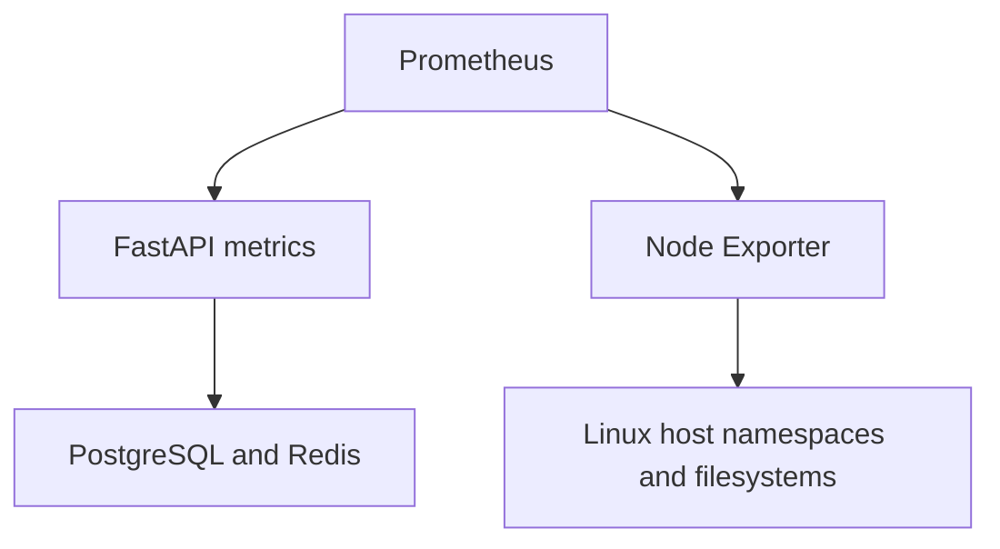

# Lab 14: Host Monitoring with Node Exporter and USE

## 1. Purpose and Learning Outcomes

**In Plain Language:** You will add a host observer and confirm which Linux machine it actually measures. Then use utilization, saturation, and error questions to inspect CPU, memory, disks, and network interfaces. A short CPU experiment demonstrates why host activity, one application's process metrics, and client latency can tell different parts of the same story.

> **Primary Objective:** Add host metrics with verified namespace scope, then investigate utilization, saturation and errors without confusing host behavior with application behavior.

The application can report high latency while its own process uses little CPU. Storage waits, host contention, memory pressure or a shared network can still affect it. This lab adds Node Exporter and pairs each query with a resource question.

Run this lab on a Linux VM with Docker Engine, as assumed by the repository's target environment. The host namespace and mount exercises do not establish macOS or Windows host metrics through Docker Desktop; there, a Linux VM is a different monitored host. No Kubernetes, privileged container, Docker socket mount or additional host-monitoring agent is introduced.

## 2. Starting Point and Lab Map

Use this guide inside the complete application repository. Run commands from the repository root in Bash unless a step says otherwise. Work through the starting checks in order; they load the helpers and state this lab needs.

Read the explanation before each step, run one complete code block at a time, and compare the actual result with the stated expectation. Save commands, observations, explanations, and unexpected results in your notebook.

### Key Terms

| **Term**    | **Plain-Language Meaning**                                          |
| ----------- | ------------------------------------------------------------------- |
| USE         | Utilization, saturation, and errors for a particular resource.      |
| Utilization | How much of a resource is being used over the measurement interval. |
| Saturation  | Work waiting for a resource or pressure on its available capacity.  |

### Lab Map

The arrows show the flow or dependency being studied. Branches identify paths to compare; this is a conceptual map, not a captured runtime trace.


```mermaid
flowchart TD
    P["Prometheus"] --> A["FastAPI metrics"]
    P --> N["Node Exporter"]
    A --> D["PostgreSQL and Redis"]
    N --> H["Linux host namespaces and filesystems"]
```

## 3. Guided Walkthrough

### Step 01. Inherited State and Starting Checks

**What You Are Doing:** Run host checks on the Docker Engine's actual machine and preserve the current metrics stage. A remote Docker context can otherwise make you compare two different hosts.

**Practical Walkthrough:** Run host inspection on the machine where Docker Engine actually runs. Check the Docker context before comparing local CPU or memory commands with exporter results, especially if your terminal controls a remote engine. Retain the working metrics stage so only the new host observer is introduced.

Check `docker context` before using local host commands as a reference. If the engine is remote, your terminal's CPU and memory belong to a different machine. Establish the engine host first so the exporter comparison tests observation scope rather than accidentally comparing two valid but unrelated systems.

```bash
source lab-notes/session.sh
source lab-notes/evidence.sh
source lab-notes/raw-metrics.sh
source lab-notes/metrics-session.sh
metrics_check
start_lab 14
uname -s
docker context show
docker info --format '{{.OSType}}'
api -fsS "$APP_URL/health/ready" > "$LAB_DIR/starting-readiness.json"
```

Complete [Lab 13](Lab-13.md). Start with the four-service stage. The commands that read `/proc` and `df` below must run on the actual Docker Engine host. If your Docker context points to a remote daemon, run the lab shell on that VM rather than compare its metrics with your laptop.

Keep normal host work modest during the controlled experiment, and record unavoidable background activity. This is an observation exercise on a disposable learning VM, not permission to load a shared production server.

**Understanding the Result:** Measurements from different machines cannot validate each other. Establish host identity before comparing resource totals.

### Step 02. Learning Objectives

**What You Are Doing:** Verify measurement scope before drawing performance conclusions. A correct number from the wrong namespace is still the wrong evidence for the question.

**Practical Walkthrough:** Translate each objective into a scope check and a resource question. First prove which machine or namespace the value describes, then ask about utilization, waiting, or errors. Container placement alone does not tell you whether an exporter sees the container or the host.

For every metric, write the observed resource and namespace before interpreting its value. Then classify the question as utilization, saturation, or errors. A percentage without its resource scope can look meaningful while describing the wrong machine, CPU set, or filesystem.

You will verify host identity and measurement scope, add a real scrape target, interpret CPU/memory/storage/network metrics, distinguish utilization from saturation, and compare a small deliberate load with application behavior.

You will also distinguish three different failures: an unreachable exporter, a failed individual collector and a resource-related error reported by a successful collector. None of those should be silently converted into a healthy zero.

**Understanding the Result:** A correctly collected value from the wrong scope gives the wrong diagnosis. Identity checks are part of measurement validation.

### Step 03. Current Architecture and New Observation Boundary

**What You Are Doing:** Add Node Exporter as an independent host observer. Application measurements continue to describe the app, while host measurements include other processes and system activity.

**Practical Walkthrough:** Follow the separate app and Node Exporter scrape paths in the diagram. The app observes its own request work, while the exporter exposes host-wide measurements that include unrelated processes. Compare them over aligned windows without attributing every host change to the API.

Align the host and application time windows, but keep their populations distinct. Node Exporter can observe unrelated host processes, whereas the app measures its own work. A simultaneous CPU increase supports a temporal relationship; further evidence is needed before assigning all host activity to the API.

The lab map in Section 2 shows this relationship.

Node Exporter observes the Linux host through host networking/PID namespaces and read-only host mounts. FastAPI continues to expose application metrics directly. Prometheus pulls both independently; it does not send metrics through OTel.

The relevant new events are exporter startup, scrape/collector success, bounded CPU work and its completion. Existing request and dependency events remain available for correlation.

**Understanding the Result:** Independent observers add context. Their populations are intentionally different and their totals need not match.

### Step 04. Understand the Access Tradeoff Before Installation

**What You Are Doing:** Review the host visibility granted to the exporter before starting it. The selected namespaces and mounts are what make host measurements possible.

**Practical Walkthrough:** Review the namespaces, mounts, and listener settings before starting the exporter. These settings let it inspect host resources that ordinary isolated containers cannot see. Understand the purpose of each supplied access setting and keep the scoped configuration rather than broadening privileges to make an unexpected metric appear.

Match each host mount and namespace setting to the collector visibility it enables. Review the listener's reachable address independently. If a collector lacks data, inspect the required path and permissions first rather than broadening the entire container's access to compensate for an unidentified configuration mismatch.

The configuration follows the [Node Exporter container deployment guidance at v1.9.1](https://github.com/prometheus/node_exporter/blob/v1.9.1/README.md), with a pinned image, non-root user, dropped capabilities and a restricted listening address.

Read-only host access is still sensitive: it exposes metadata and readable host files. Host PID/network namespaces weaken isolation. The `timex` collector is disabled so this exercise does not need the optional `SYS_TIME` capability. We do not claim that these settings make a host-mounted exporter equivalent to an isolated application container.

The HTTP listener binds only to the current Compose bridge gateway address. There is no published `ports` entry and no public-interface wildcard listener. The endpoint is still unauthenticated; routing and host firewall policy must prevent access from untrusted networks.

**Understanding the Result:** Host visibility is a deliberate configuration choice. A successful scrape alone does not verify that every metric has the intended scope.

### Step 05. Discover the Project Bridge Address

**What You Are Doing:** Discover the actual bridge address used by this project. It connects the selected exporter listener to Prometheus without assuming a subnet from another machine.

**Practical Walkthrough:** Discover the bridge address from this project's actual Docker network and use the returned value in the configuration. The address connects Prometheus's container network to the chosen host listener. Do not copy an example subnet from another host, because Docker allocates networks according to the local environment.

Read the network name from the running application container and inspect that exact network's gateway. Use the discovered value in the host-listener path. If the Docker context or project changes, repeat discovery instead of carrying an old bridge address into a different deployment.

```bash
APP_CONTAINER=$(dc ps -q app)
NETWORK_NAME=$(docker inspect "$APP_CONTAINER" \
  | jq -er '.[0].NetworkSettings.Networks | keys | if length==1 then .[0] else error("Expected one app network") end')
LAB_NODE_BIND_IP=$(docker network inspect "$NETWORK_NAME" \
  | jq -er '[.[0].IPAM.Config[] | .Gateway | select(. != null and (contains(":") | not))] |
    if length==1 then .[0] else error("Expected one IPv4 bridge gateway") end')
python3 - "$LAB_NODE_BIND_IP" <<'PYTHON'
import ipaddress, sys
address = ipaddress.ip_address(sys.argv[1])
assert address.version == 4 and not address.is_loopback and not address.is_unspecified
print("Selected bridge gateway:", address)
PYTHON
printf '%s\n' "$LAB_NODE_BIND_IP" > lab-notes/node-exporter-address.txt
chmod 600 lab-notes/node-exporter-address.txt
export LAB_NODE_BIND_IP
printf '%s\n' "$NETWORK_NAME" > "$LAB_DIR/network-name.txt"
```

Do not hardcode an example `172.x.x.x` address. Docker chooses the subnet based on local configuration. The Lab 10 `dm` helper reads this address whenever the Node Exporter overlay exists.

If you later remove and recreate the project network, discover the address again and recreate both Node Exporter and Prometheus. A stored gateway is not guaranteed to remain valid across network deletion.

**Understanding the Result:** The discovered address must belong to the active project network. A stale address can look like an exporter failure while the listener itself is healthy.

### Step 06. Create the Node Exporter Overlay

**What You Are Doing:** Create the scoped exporter overlay with the required host views. Keep the mount, listener, and escaping details intact because they determine both access and metric scope.

**Practical Walkthrough:** Create the exporter overlay with the supplied host mounts and namespace settings. Preserve the escaping in Compose values: some dollar signs must reach the container rather than be expanded while Compose builds the model. Inspect the merged configuration to see what will actually be mounted and executed.

Copy the complete quoted heredoc and preserve literal dollar-sign escaping. Compare mounted host paths, exporter path flags, and namespace settings in the merged model. They must describe the same intended host view; a valid YAML file can still expose the wrong filesystem if those paths disagree.

```bash
cat > lab-notes/compose.node-exporter.yaml <<'YAML'
services:
  prometheus:
    extra_hosts:
      - "host-metrics:${LAB_NODE_BIND_IP:?Discover the project bridge gateway first}"
  node-exporter:
    image: prom/node-exporter:v1.9.1
    user: "65534:65534"
    network_mode: host
    pid: host
    read_only: true
    restart: unless-stopped
    mem_limit: 128m
    cap_drop:
      - ALL
    security_opt:
      - no-new-privileges:true
    command:
      - "--web.listen-address=${LAB_NODE_BIND_IP:?Discover the project bridge gateway first}:9100"
      - "--path.rootfs=/host"
      - "--path.procfs=/host/proc"
      - "--path.sysfs=/host/sys"
      - "--no-collector.timex"
      - "--collector.filesystem.mount-points-exclude=^/(dev|proc|sys|var/lib/docker)($$|/)"
    volumes:
      - /:/host:ro,rslave
    logging:
      driver: json-file
      options:
        max-size: 10m
        max-file: "3"
YAML
```

**Command Note:** `<<'YAML'` writes the following block literally until `YAML`. Quoting the delimiter prevents Bash from expanding `$variables` inside the generated file; creation and execution are separate steps.

`$$` in the regular expression is intentional Compose escaping; the container receives a single `$` regex anchor. The root mount uses read-only recursive slave propagation so host mount changes can be observed without propagating container changes back to the host.

The exporter has no artificial health check that merely runs `--version`. A successful Prometheus scrape and collector metrics provide its operational health evidence. Do not add a health command that assumes a shell or curl exists in this minimal image.

**Understanding the Result:** Source YAML and effective container settings can differ after interpolation and overlay merging. Validate the effective model before startup.

### Step 07. Add a Real Prometheus Scrape Job

**What You Are Doing:** Add the target and apply the changed container networking where required. A Prometheus config reload alone cannot change a container's host-name mapping.

**Practical Walkthrough:** Add the scrape job and apply any container-level hostname or networking changes through the documented recreation step. Reloading Prometheus can update its scrape configuration, but cannot alter the networking settings of an already-created container. Check both layers when the new target is unreachable.

Validate the scrape configuration, then apply any required container networking changes through recreation. A Prometheus reload updates its scrape model but leaves existing container-level settings unchanged. If the target fails, inspect both the resolved address and the newly applied runtime network configuration.

```bash
python3 - <<'PYTHON'
from pathlib import Path
path = Path("lab-notes/prometheus/prometheus.yml")
text = path.read_text()
block = '''
  - job_name: node
    static_configs:
      - targets: ["host-metrics:9100"]
'''
if "job_name: node" not in text:
    path.write_text(text.rstrip() + "\n" + block)
PYTHON
chmod 644 lab-notes/prometheus/prometheus.yml
dm config --quiet
record_change "add_node_exporter_and_host_scrape_target" planned
dm up -d --no-deps node-exporter
dm run --rm -T --no-deps --entrypoint promtool prometheus \
  check config /etc/prometheus/labs/prometheus.yml
dm up -d --no-deps prometheus
wait_prometheus
wait_target node up
metrics_check
record_change "node_exporter_target_ready" completed
```

Prometheus must be recreated because its `extra_hosts` mapping changed; a configuration reload alone cannot update a container's host mapping. Compose detects that change during `up`. Its existing named TSDB volume is retained.

**Expected Result:** five running services and three healthy scrape jobs: `fastapi`, `prometheus` and `node`. Other observability backends remain stopped.

**Understanding the Result:** Use a fresh successful scrape to prove the complete path. A valid config file proves only that Prometheus accepts the configuration.

### Step 08. Verify Host Identity and Collector Success

**What You Are Doing:** Compare exporter identity and resource totals with local host evidence. This checks that a healthy scrape is actually returning measurements of the intended machine.

**Practical Walkthrough:** Compare exporter identity and resource totals with commands run on the engine host. Check enough attributes to distinguish that host from a container namespace. If values disagree, inspect mounts, namespaces, and collector availability before interpreting the data as evidence of resource pressure.

Compare hostname, kernel information, CPU count, and memory totals with the engine host. Then inspect collector-success samples. Identity disagreement is a visibility issue to resolve before interpreting resource values; a successful scrape alone does not establish that every intended collector observed the correct host.

```bash
pq 'node_uname_info{job="node"}' | tee "$LAB_DIR/node-identity.json" | jq .
pq 'node_scrape_collector_success{job="node"}' > "$LAB_DIR/collector-success.json"
pq 'node_scrape_collector_success{job="node"} == 0' | jq .
pq 'count(node_cpu_seconds_total{job="node",mode="idle"})' | jq .
getconf _NPROCESSORS_ONLN
pq 'node_memory_MemTotal_bytes{job="node"}' | jq .
awk '/^MemTotal:/ {print $2 * 1024}' /proc/meminfo
```

Compare host identity, CPU count and memory total with commands on the actual Linux host. Small timing differences and CPU hotplug aside, these should describe the same machine. If they describe a container limit or a different VM, fix the observation scope before interpreting resource pressure.

`up=1` means the exporter endpoint was scraped successfully. An individual `node_scrape_collector_success=0` means part of the collection failed. Inspect exporter logs and permissions for that collector; do not immediately add privileged mode.

**Understanding the Result:** This validates meaning as well as reachability. An `up` value of one only establishes that collection succeeded.

### Step 09. Apply USE to the Resource You Are Investigating

**What You Are Doing:** Choose a specific resource before applying USE. Utilization, waiting, and error observations must refer to that same resource to support a useful diagnosis.

**Practical Walkthrough:** Choose a specific resource, such as a CPU set, device, or interface, before applying USE. Identify its utilization measurement, evidence of waiting, and error signals. Keep all three attached to the same resource so unrelated signals do not become a false explanation.

Choose one concrete resource and map all three USE questions to it. For a disk, capacity, busy time, waiting, and errors are different observations. Keep names and units attached to each result so an unrelated interface or filesystem does not become evidence for the resource under investigation.

| **Resource** | **Utilization Examples**       | **Saturation Examples**                                   | **Error Evidence**                                              |
| ------------ | ------------------------------ | --------------------------------------------------------- | --------------------------------------------------------------- |
| CPU          | Non-idle CPU time              | Load relative to CPU count; CPU pressure                  | No universal CPU-error counter in this lab                      |
| Memory       | Available-memory fraction      | Memory pressure; major page faults as supporting evidence | Allocation failures need additional kernel/application evidence |
| Disk device  | Busy-time fraction, throughput | Weighted I/O time and pressure                            | Device/kernel error investigation may require host logs         |
| Filesystem   | Available bytes and inodes     | Approaching capacity constrains writes                    | Read-only state or filesystem collection failure                |
| Network      | Bytes/second per interface     | Capacity/queue evidence when known                        | Receive/transmit errors and drops                               |

USE means utilization, saturation and errors. It is a way to form questions, not a requirement to invent three metrics for every resource. Node Exporter does not expose every hardware, kernel or application failure.

**Understanding the Result:** Not every resource exposes every USE category. Missing instrumentation is a limit to document, not a measured zero.

### Step 10. Inspect CPU Utilization and Load

**What You Are Doing:** Compare CPU modes and load with logical CPU count. A high non-idle percentage does not by itself identify useful application computation or a saturated CPU queue.

**Practical Walkthrough:** Inspect CPU modes alongside logical CPU count and load. Normalize aggregate CPU quantities when necessary to understand available capacity. Load and non-idle time describe different aspects of work, and non-idle time can include activity other than useful API computation.

Read the CPU expression as a rate of cumulative idle time, averaged across the selected CPUs and converted to non-idle percent. Compare load with the logical CPU count separately. A high load value and a high busy percentage are related clues, not interchangeable measurements of useful application work.

```bash
pq '100 * (1 - avg by (instance) (rate(node_cpu_seconds_total{job="node",mode="idle"}[1m])))' | jq .
pq 'max by (instance) (node_load1{job="node"}) / count by (instance) (node_cpu_seconds_total{job="node",mode="idle"})' | jq .
pq 'rate(node_cpu_seconds_total{job="node",mode=~"iowait|steal"}[1m])' | jq .
```

The first result is average non-idle percentage across logical CPUs; it includes time categories such as I/O wait. Inspect individual modes before concluding that useful application CPU work explains the total.

Linux load includes runnable tasks and tasks in uninterruptible sleep, so load divided by CPU count is a pressure clue rather than a pure CPU queue measurement. Steal time can matter on a VM sharing physical resources. None of these queries alone identifies the responsible application.

**Understanding the Result:** A busy CPU signal alone does not prove application CPU saturation. Use queueing and process-specific evidence to support that conclusion.

### Step 11. Inspect Memory and Optional Pressure Metrics

**What You Are Doing:** Inspect available memory and pressure evidence rather than treating low free memory as failure. Distinguish a kernel feature that is absent from a measured zero.

**Practical Walkthrough:** Compare available memory with pressure-related evidence and the host's caching behavior. Linux can use otherwise idle memory for caches, so low free memory alone is not a failure. Check whether the kernel actually exposes the pressure metric before interpreting an empty query.

Use available-memory interpretation alongside pressure or fault evidence rather than diagnosing from free memory alone. Check whether optional pressure series exist on this kernel. An empty selector can indicate unavailable instrumentation, so do not turn missing pressure data into a measured zero or proof of no contention.

```bash
pq '100 * (1 - node_memory_MemAvailable_bytes{job="node"} / node_memory_MemTotal_bytes{job="node"})' | jq .
pq 'rate(node_vmstat_pgmajfault{job="node"}[2m])' | jq .
pq 'rate(node_pressure_cpu_waiting_seconds_total{job="node"}[1m])' | jq .
pq 'rate(node_pressure_memory_waiting_seconds_total{job="node"}[1m])' | jq .
pq 'rate(node_pressure_io_waiting_seconds_total{job="node"}[1m])' | jq .
```

`MemAvailable` accounts for memory the kernel estimates can be made available, including reclaimable cache; “free memory is low” is not enough to prove exhaustion. Major faults can indicate disk-backed page retrieval, but they are not a direct count of OOM kills.

Pressure Stall Information requires kernel support and configuration. If pressure series are absent, inspect `/proc/pressure/` and exporter collector state; report unsupported/unavailable evidence rather than zero pressure. The [pinned pressure collector source](https://github.com/prometheus/node_exporter/blob/v1.9.1/collector/pressure_linux.go) documents these conditions.

**Understanding the Result:** An absent feature and a reported zero have different meanings. Diagnose memory pressure from the supported observations together.

### Step 12. Separate Disk Devices from Filesystem Capacity

**What You Are Doing:** Identify the relevant device and mount before calculating disk activity or capacity. A filesystem's free space and a block device's I/O are different resource views.

**Practical Walkthrough:** Identify the block device and filesystem mount that matter to the workload. Device counters describe I/O activity; filesystem gauges describe capacity and space. Avoid combining unrelated devices or treating low free space as evidence of high I/O latency without the corresponding measurements.

Identify the mountpoint used by the relevant storage and the device serving it. Read free space and inode availability as capacity gauges, then interpret device activity separately. Capacity exhaustion and I/O saturation require different evidence even when both eventually make database operations slow or fail.

```bash
pq '100 * node_filesystem_avail_bytes{job="node",mountpoint="/"} / node_filesystem_size_bytes{job="node",mountpoint="/"}' | jq .
pq '100 * node_filesystem_files_free{job="node",mountpoint="/"} / node_filesystem_files{job="node",mountpoint="/"}' | jq .
pq 'node_filesystem_readonly{job="node"}' | jq .
pq 'node_filesystem_device_error{job="node"}' | jq .
pq 'rate(node_disk_io_time_seconds_total{job="node"}[1m])' | jq .
pq 'rate(node_disk_io_time_weighted_seconds_total{job="node"}[1m])' | jq .
pq 'rate(node_disk_read_bytes_total{job="node"}[1m]) + rate(node_disk_written_bytes_total{job="node"}[1m])' | jq .
df -B1 /
df -i /
```

Inspect actual `device`, `mountpoint` and `fstype` labels before choosing a volume. Do not assume the root filesystem is the data disk or that the disk is named `sda`.

Filesystem available bytes refer to space available to a non-root user; reserved space can differ from free space. A filesystem collection error is not automatically physical disk failure. Disk busy-time rate describes time with I/O in progress; modern parallel devices can perform more work without a simple linear relationship between this value and capacity. Weighted I/O time is supporting queue/concurrency evidence, not a guaranteed latency measurement.

**Understanding the Result:** Capacity and performance are separate resource questions. Record the selected device and mount with your query.

### Step 13. Inspect Network Throughput and Errors

**What You Are Doing:** Select the network interface on the path you care about. Summing all virtual and physical interfaces can count traffic at more than one point.

**Practical Walkthrough:** Choose the interface along the traffic path you want to inspect. Container bridges, virtual Ethernet interfaces, and physical interfaces can observe the same traffic at different points. Summing every interface can therefore inflate totals instead of providing a single end-to-end throughput measurement.

Select the interface that corresponds to the path being studied and keep receive and transmit units explicit. The same traffic can pass through virtual and physical interfaces. Summing all of them can count observations from several boundaries rather than produce one meaningful end-to-end throughput total.

```bash
pq 'rate(node_network_receive_bytes_total{job="node",device!="lo"}[1m])' | jq .
pq 'rate(node_network_transmit_bytes_total{job="node",device!="lo"}[1m])' | jq .
pq 'rate(node_network_receive_errs_total{job="node"}[2m]) + rate(node_network_transmit_errs_total{job="node"}[2m])' | jq .
pq 'rate(node_network_receive_drop_total{job="node"}[2m]) + rate(node_network_transmit_drop_total{job="node"}[2m])' | jq .
```

Host networking exposes host interfaces, including bridges and virtual interfaces. Do not sum every interface and call the result external traffic; the same packet may cross several observed interfaces. Identify the path relevant to the incident.

Bytes/second is throughput, not percentage utilization unless the link capacity is known and meaningful. Virtual-interface speed can be absent or misleading. Zero reported interface errors also does not prove there are no DNS, TCP, HTTP or upstream-service failures.

**Understanding the Result:** Interpret network rates at the selected interface boundary. Include its identity when comparing before and after the experiment.

### Step 14. Predict the Bounded CPU Experiment

**What You Are Doing:** Predict where a separate CPU worker will appear. It runs in the app container but is not the API process, so the observer's scope determines which metric changes.

**Practical Walkthrough:** Predict how the bounded CPU worker will affect host metrics, container-level observations, and the API process's own metrics. The worker shares the app container but runs as a separate process. That distinction lets you test observer scope without assuming all activity inside a container belongs to the server process.

Predict the separate worker's contribution to host and container CPU while distinguishing it from the server process's own counters. Record the workload duration and intended priority. The experiment tests observer scope, so a missing increase in the app process metric can be consistent with a real host CPU burst.

You will run one low-priority CPU worker inside the application container for 30 seconds. It uses a separate Python process, not the API event loop. There is no memory allocation stress, fork loop, disk-fill test or unbounded generator.

Predict the host-average CPU change on an N-core VM. One busy core can contribute roughly `100/N` percentage points while it runs, and a one-minute rate window smooths a 30-second burst further. Also predict whether API latency must increase. Spare capacity can make the effect small.

**Understanding the Result:** Write separate predictions for host load and request behavior. Shared placement does not imply identical measurements.

### Step 15. Run the Experiment and Capture More than One Layer

**What You Are Doing:** Run the capped worker and capture host, client, and application evidence together. Correlation across those views explains the result without attributing all host work to FastAPI.

**Practical Walkthrough:** Run the capped 30-second worker and capture the prescribed observations during its lifetime. Keep client traffic bounded and note actual timings so the host burst can be aligned with application evidence. Let the worker exit normally rather than extending load until every graph looks dramatic.

Start the bounded worker and retain its output and timing before running the prescribed observations. Keep the load duration fixed and compare overlapping windows across layers. If a short burst is smoothed by a rate window, interpret that sampling effect instead of extending the experiment to force a larger graph.

```bash
record_change "begin_one_low_priority_cpu_worker_30_seconds" planned
dm exec -T app python - <<'PYTHON' > "$LAB_DIR/cpu-worker.txt" &
import os, time
os.nice(10)
deadline = time.monotonic() + 30
value = 1
steps = 0
while time.monotonic() < deadline:
    value = (value * 48271) % 2147483647
    steps += 1
print({"steps": steps, "checksum": value, "bounded_seconds": 30})
PYTHON
WORKER_PID=$!
for n in $(seq 1 6); do
  api -fsS -o /dev/null -w '%{http_code} %{time_total}\n' "$APP_URL/api/v1/items?limit=1" \
    >> "$LAB_DIR/api-during-cpu.txt"
  pq '100 * (1 - avg by (instance) (rate(node_cpu_seconds_total{job="node",mode="idle"}[1m])))' \
    >> "$LAB_DIR/cpu-queries.jsonl"
  sleep 5
done
wait "$WORKER_PID"
record_change "bounded_cpu_worker_finished" completed
capture_app_logs
```

Compare the worker ledger, host CPU samples, client timing and application request records. The extra process does not contribute to the Python API process's own `process_cpu_seconds_total`, although the host observes its CPU work.

A slow API request overlapping CPU activity is correlation. To claim contention caused it, compare a repeatable quiet baseline and inspect other explanations. One small burst on a shared VM is not a capacity benchmark.

**Understanding the Result:** Use observed effects, including little or no client impact. A host CPU burst does not guarantee visible request degradation.

### Step 16. Verify Recovery without Erasing Historical Evidence

**What You Are Doing:** Confirm that the worker exited and current service behavior is normal. Historical samples remain and windowed rates settle as the burst ages out.

**Practical Walkthrough:** Confirm the worker process has exited and repeat normal application and scrape checks. Allow rate windows to age past the burst when assessing current load. Historical samples remain useful evidence and should not be confused with a worker that is still running.

Verify the worker ended and the application remains ready, then inspect current scrape and collector status. Allow historical rate windows to age naturally. A graph that still includes the completed burst is retained evidence, whereas an active worker would require a separate process-state observation.

```bash
metrics_check
pq 'node_scrape_collector_success{job="node"} == 0' > "$LAB_DIR/final-collector-errors.json"
api -fsS "$APP_URL/health/ready" > "$LAB_DIR/recovered-readiness.json"
dm logs --tail 50 node-exporter > "$LAB_DIR/node-exporter.log"
record_change "host_monitoring_stage_recovery_verified" completed
```

Confirm the worker exited. CPU rates decay as the burst leaves the query window; counters and historical samples remain. The exporter stays running for Lab 15.

Record any collector failures explicitly. A healthy HTTP endpoint does not excuse an unexplained missing filesystem or permission-denied collector.

**Understanding the Result:** Recovery means the temporary workload ended and normal behavior is verified. A trailing graph can retain the earlier burst until its window moves on.

## 4. Troubleshooting and Diagnosis

Start with the first unexpected result. Record the exact symptom, identify which component produced it, and use the checks below before repeating the experiment. After a fix, repeat the original check and confirm recovery.

### Troubleshooting

| **Symptom**                       | **Inspect**                                     | **Corrective Direction**                                           |
| --------------------------------- | ----------------------------------------------- | ------------------------------------------------------------------ |
| Cannot bind gateway address       | Current Docker network gateway and host context | Discover on the actual host; recreate after network changes        |
| `host-metrics` does not resolve   | Prometheus container host mapping               | Recreate Prometheus after adding `extra_hosts`                     |
| Host metrics resemble a container | Root/proc/sys mounts and namespaces             | Correct scope; do not rename misleading metrics as host metrics    |
| Exporter target is down           | Listener, host firewall, container logs         | Test the actual bridge address; keep public exposure restricted    |
| Collector reports failure         | Collector name and permission/error logs        | Fix the specific access requirement or document exclusion          |
| Pressure metrics absent           | Kernel PSI support                              | Absence is not zero; use other evidence                            |
| CPU rise is smaller than expected | CPU count, smoothing and workload duration      | One worker does not saturate every CPU                             |
| Filesystem denominator is zero    | Filesystem type and labels                      | Exclude unsuitable virtual filesystems from that capacity question |

Do not use `privileged: true` as a generic troubleshooting shortcut.

## 5. Review and Practice

Answer the knowledge questions in your own words before reading the answer guide. For the scenario, name the evidence you would collect and the conclusion each observation would support.

### Knowledge Check

1. Why are host namespaces and mounts needed?
2. Does up=1 prove every collector succeeded?
3. Is low free memory enough to prove memory pressure?
4. Why not sum all interface throughput?
5. Can one busy core produce only a small host-average CPU rise?

#### Answer Guide

1. A container otherwise exposes a different namespace/mount view from the host we intend to observe.
2. No; inspect individual collector-success series.
3. No; available memory, reclaimable cache and pressure evidence matter.
4. Traffic can traverse several interfaces, causing double counting and mixed scope.
5. Yes; average utilization is spread across logical CPUs and smoothed over the query window.

### Professional Scenario Exercise

The API p95 rises while the application process CPU remains low. Develop a short investigation using host CPU modes, memory pressure, disk evidence, interface errors and the deployment/change timeline. For each query, state what evidence would support a hypothesis and what the metric cannot prove.

## 6. Completion Checklist

Mark each item only after you can point to its result or evidence file. Complete any cleanup shown here before moving on.

### Observable Completion Criteria

- [ ] Node Exporter v1.9.1 runs as non-root with a restricted host listener.
- [ ] Prometheus scrapes three healthy jobs and five services are running.
- [ ] Host identity, CPU count and memory scope are verified.
- [ ] CPU, memory, filesystem, disk and network queries use observed labels.
- [ ] Collector failures are distinguished from scrape failures and resource errors.
- [ ] The 30-second worker exits and application readiness remains or returns healthy.

## 7. Production Context and Next Lab

### Production Implications

Host exporters need an explicit trust and access model. Prefer managed service deployment and network policy appropriate to the platform; do not expose an unauthenticated metrics endpoint publicly. Host-wide data is not container quota/saturation telemetry. A future container-resource exporter would answer additional questions, but it is not silently assumed here. Establish workload-specific baselines before attaching alert thresholds to generic utilization percentages.

### End State and Transition

Five services remain running: the original application dependencies, Prometheus and Node Exporter. Continue with [Lab 15: PostgreSQL and Redis Exporters](Lab-15.md) to compare what the application observes with what each dependency server reports.
