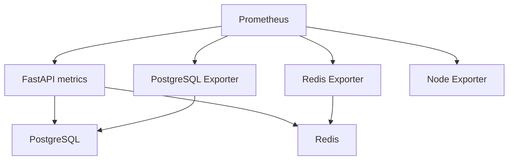

# Lab 15: PostgreSQL and Redis Exporters

## Purpose and Scope

> **Primary Objective:** Add real server-level dependency metrics, compare them with application observations, and distinguish exporter failures from database and cache failures.

The application dependency gauge answers whether this application can currently use a dependency. It does not describe the server's connection population, transaction activity, buffer behavior, memory or global cache statistics.

This lab adds PostgreSQL Exporter and Redis Exporter. You will inspect both observation paths, break only the PostgreSQL monitoring credential, and briefly stop Redis to compare a real optional-dependency outage. The larger failure investigations remain in the later incident labs; this exercise establishes measurement scope and failure semantics.

## 1. Inherited State and Starting Checks

```bash
source lab-notes/session.sh
source lab-notes/evidence.sh
source lab-notes/raw-metrics.sh
source lab-notes/metrics-session.sh
metrics_check
start_lab 15
ITEM_ID=$(cat lab-notes/checkpoint-item-id.txt)
api -fsS "$APP_URL/api/v1/items/$ITEM_ID" > "$LAB_DIR/checkpoint-before.json"
api -fsS "$APP_URL/health/ready" > "$LAB_DIR/starting-readiness.json"
LAB_DATABASE=$(dc exec -T app python -c 'from app.config import Settings; print(Settings().postgres_db)')
printf '%s\n' "$LAB_DATABASE" > "$LAB_DIR/database-name.txt"
```

Complete [Lab 14](Lab-14.md). Five services should be running, with healthy FastAPI, Prometheus and Node Exporter targets. Preserve the existing application/database credentials and volumes.

`LAB_DATABASE` is a nonsecret validated database identifier. Do not dump the application's full environment or a rendered Compose model into evidence; those can expose credentials.

## 2. Learning Objectives and Explicit Exclusions

You will provision a separate PostgreSQL monitoring identity, run pinned exporters on the internal network, validate actual metric names, distinguish scrape health from downstream health, and explain why server statistics differ from application counters.

No database schema migration is needed. No application metric is removed or duplicated through OTel. This lab does not add custom SQL query collectors, query-text labels, key enumeration, public database ports, Grafana dashboards or alert rules.

## 3. Current Architecture and Independent Observers



| Observation | What it can establish |
|---|---|
| `up{job="postgres"}` | Prometheus successfully scraped the PostgreSQL exporter endpoint |
| `pg_up{job="postgres"}` | The exporter could connect to PostgreSQL during collection |
| `application_dependency_up{dependency="postgres"}` | The application observed its own PostgreSQL path working |
| `up{job="redis"}` | Prometheus successfully scraped Redis Exporter |
| `redis_up{job="redis"}` | Redis Exporter could collect from Redis |
| Application readiness | The API's required business dependencies satisfy its readiness contract |

These observations have different identities, timing and failure domains. Agreement strengthens a hypothesis; disagreement can identify the failing layer.

## 4. Version and Access Decisions

Use PostgreSQL Exporter `v0.17.1`, whose [release documentation includes PostgreSQL 17 in its tested versions](https://github.com/prometheus-community/postgres_exporter/tree/v0.17.1), and Redis Exporter `v1.69.0` with the repository's Redis 7.4 service. The [Redis Exporter versioned documentation](https://github.com/oliver006/redis_exporter/tree/v1.69.0) defines the environment options used below.

The PostgreSQL exporter gets a dedicated non-superuser role with `pg_monitor` and database `CONNECT`. `pg_monitor` exposes useful server statistics and can reveal operational details such as query activity; it is not an anonymous public-access role. We do not grant it access to item rows.

Redis initially reuses the existing password-authenticated server account because that is the current repository's authentication model. This is a deliberate learning-stage compromise, not a claim of least-privilege Redis ACLs. Production hardening should create a tested monitoring ACL for the enabled collector commands and manage its credential separately.

## 5. Generate a Separate PostgreSQL Exporter Credential

```bash
cat > lab-notes/exporter_password.py <<'PYTHON'
"""Create one private Compose credential without replacing an existing value."""
import os
import re
import secrets
from pathlib import Path

path = Path(".env")
text = path.read_text()
lines = [line for line in text.splitlines() if re.match(r"^\s*POSTGRES_EXPORTER_PASSWORD\s*=", line)]
if lines:
    if len(lines) != 1 or not re.fullmatch(r"POSTGRES_EXPORTER_PASSWORD=[0-9a-f]{48}", lines[0]):
        raise SystemExit("Existing exporter setting has another format; preserve it and review before proceeding")
    print("Existing exporter credential retained")
else:
    with path.open("a") as stream:
        stream.write(("" if text.endswith("\n") else "\n") + "POSTGRES_EXPORTER_PASSWORD=" + secrets.token_hex(24) + "\n")
    print("New exporter credential added without displaying it")
os.chmod(path, 0o600)
PYTHON
```

```bash
python3 lab-notes/exporter_password.py
git check-ignore .env
```

The generated value is 48 hexadecimal characters, safe for this Compose `.env` representation. The script retains a value previously generated by this lab and refuses to overwrite an existing setting in another format. Review such a setting rather than replacing a secret silently.

Keep `.env` private and uncommitted. Do not source it as a shell script. The exporter containers receive credentials at runtime, which still makes them visible to administrators with Docker inspection access. A production secret manager or protected secret file is preferable.

## 6. Provision the Monitoring Role Without Changing Application Tables

```bash
cat > lab-notes/exporter_role.py <<'PYTHON'
"""Write role SQL to psql stdin; never redirect this output into a lab evidence file."""
import re
from pathlib import Path

text = Path(".env").read_text()
values = re.findall(r"^POSTGRES_EXPORTER_PASSWORD=([0-9a-f]{48})$", text, re.MULTILINE)
if len(values) != 1:
    raise SystemExit("Expected exactly one generated exporter credential")
password = values[0]
print("""DO $role$
BEGIN
    IF NOT EXISTS (SELECT 1 FROM pg_roles WHERE rolname = 'observability_exporter') THEN
        CREATE ROLE observability_exporter LOGIN NOSUPERUSER NOCREATEDB NOCREATEROLE NOREPLICATION;
    END IF;
END
$role$;
ALTER ROLE observability_exporter LOGIN NOSUPERUSER NOCREATEDB NOCREATEROLE NOREPLICATION;
""")
print("ALTER ROLE observability_exporter PASSWORD '" + password + "';")
print("GRANT pg_monitor TO observability_exporter;")
print("SELECT format('GRANT CONNECT ON DATABASE %I TO observability_exporter', current_database()) \\gexec")
PYTHON
```

```bash
(
  set -euo pipefail
  python3 lab-notes/exporter_role.py | dbsql > "$LAB_DIR/role-command-status.txt"
)
printf '%s\n' "SELECT rolname, rolsuper, rolcreatedb, rolcreaterole, rolreplication FROM pg_roles WHERE rolname='observability_exporter';" \
  | dbsql > "$LAB_DIR/role-properties.txt"
printf '%s\n' "SELECT pg_has_role('observability_exporter','pg_monitor','member') AS monitoring_member, has_database_privilege('observability_exporter',current_database(),'CONNECT') AS can_connect, has_table_privilege('observability_exporter','public.items','SELECT') AS can_read_items;" \
  | dbsql > "$LAB_DIR/role-privileges.txt"
cat "$LAB_DIR/role-properties.txt" "$LAB_DIR/role-privileges.txt"
```

Expected: superuser/database-creation/role-creation/replication flags are false; monitoring membership and connection permission are true; item-table SELECT permission is false under the repository's original grants.

The SQL containing the password goes directly to `psql` stdin. Do not run the role script by itself, add `tee`, enable shell tracing, or use psql echo flags on this pipeline. The saved command-status output contains command tags, not the SQL input. Review server-side statement auditing separately if enabled.

This is server access provisioning. Alembic remains the sole authority for application table evolution. Do not add this role to an already-run `init.sql` and expect a persistent PostgreSQL volume to rerun initialization.

## 7. Create the Two Exporter Services

```bash
cat > lab-notes/compose.db-exporters.yaml <<'YAML'
services:
  postgres-exporter:
    image: prometheuscommunity/postgres-exporter:v0.17.1
    user: "65534:65534"
    read_only: true
    restart: unless-stopped
    mem_limit: 128m
    cap_drop: [ALL]
    security_opt: ["no-new-privileges:true"]
    networks: [platform]
    environment:
      DATA_SOURCE_URI: "postgres:5432/${POSTGRES_DB:-items}?sslmode=disable"
      DATA_SOURCE_USER: observability_exporter
      DATA_SOURCE_PASS: "${POSTGRES_EXPORTER_PASSWORD:?Create the exporter credential first}"
    command:
      - --web.listen-address=0.0.0.0:9187
      - --disable-settings-metrics
    depends_on:
      postgres:
        condition: service_started
    logging:
      driver: json-file
      options:
        max-size: 10m
        max-file: "3"
  redis-exporter:
    image: oliver006/redis_exporter:v1.69.0
    user: "65534:65534"
    read_only: true
    restart: unless-stopped
    mem_limit: 128m
    cap_drop: [ALL]
    security_opt: ["no-new-privileges:true"]
    networks: [platform]
    environment:
      REDIS_ADDR: redis://redis:6379
      REDIS_PASSWORD: "${REDIS_PASSWORD:?Set the existing Redis credential}"
      REDIS_EXPORTER_WEB_LISTEN_ADDRESS: 0.0.0.0:9121
    depends_on:
      redis:
        condition: service_started
    logging:
      driver: json-file
      options:
        max-size: 10m
        max-file: "3"
YAML
```

Both services bind their receiver interfaces inside the Compose network and publish no host ports. They run as non-root with a read-only root filesystem and dropped capabilities. No host mounts are needed.

`service_started` deliberately permits exporters to run while their downstream service is unhealthy. Their job is to report that failure. A startup dependency is not ongoing health supervision, and restarting exporters is not a remedy for a database outage.

The PostgreSQL URI omits the password; separate environment fields supply it. Local `sslmode=disable` matches this isolated Compose network, not a production cross-host TLS policy. Redis key/client-list enumeration options remain disabled by default.

## 8. Add Real Scrape Jobs and Start Only the New Services

```bash
python3 - <<'PYTHON'
from pathlib import Path
path = Path("lab-notes/prometheus/prometheus.yml")
text = path.read_text()
for job, target in (("postgres", "postgres-exporter:9187"), ("redis", "redis-exporter:9121")):
    if f"job_name: {job}\n" not in text:
        text = text.rstrip() + f'\n  - job_name: {job}\n    static_configs:\n      - targets: ["{target}"]\n'
path.write_text(text)
PYTHON
chmod 644 lab-notes/prometheus/prometheus.yml
dm config --quiet
record_change "add_postgres_and_redis_exporters" planned
dm up -d --no-deps postgres-exporter redis-exporter
reload_prometheus
wait_target postgres up
wait_target redis up
wait_metric 'pg_up{job="postgres"}' 1
wait_metric 'redis_up{job="redis"}' 1
metrics_check
record_change "database_exporter_targets_ready" completed
```

Expected: seven running services and five scrape jobs. Prometheus can reload the new jobs with SIGHUP because its container-level configuration has not changed in this step. A failed validation prevents the helper from sending the reload signal.

The `dm` helper from Lab 10 automatically includes the new overlay. Continue using explicit service names for startup commands; do not start the entire original platform prematurely.

## 9. Inspect Raw Exporter Output Before Writing Queries

```bash
for kind in postgres redis; do
  port=9187
  if [[ "$kind" == redis ]]; then port=9121; fi
  dm exec -T app python - "$kind-exporter" "$port" <<'PYTHON' > "$LAB_DIR/$kind-exporter.prom"
import sys, urllib.request
url = f"http://{sys.argv[1]}:{sys.argv[2]}/metrics"
with urllib.request.urlopen(url, timeout=10) as response:
    print(response.read().decode(), end="")
PYTHON
done
rg '^# (HELP|TYPE) (pg_stat_database_|pg_up|redis_up|redis_connected_clients|redis_commands_processed_total|redis_memory_used_bytes)' \
  "$LAB_DIR/postgres-exporter.prom" "$LAB_DIR/redis-exporter.prom"
```

Use `grep -E` with the same pattern if `rg` is not installed on the host. The application image has Python, so no shell or curl is assumed inside an exporter image.

Check names and labels against actual output. For this PostgreSQL exporter, counters such as `pg_stat_database_xact_commit` do not have a `_total` suffix. Read their TYPE metadata rather than inventing a new name to match a convention.

## 10. Inspect PostgreSQL Connections and Transaction Activity

```bash
pq "pg_stat_database_numbackends{job=\"postgres\",datname=\"$LAB_DATABASE\"}" | jq .
pq "rate(pg_stat_database_xact_commit{job=\"postgres\",datname=\"$LAB_DATABASE\"}[2m])" | jq .
pq "rate(pg_stat_database_xact_rollback{job=\"postgres\",datname=\"$LAB_DATABASE\"}[2m])" | jq .
pq "rate(pg_stat_database_deadlocks{job=\"postgres\",datname=\"$LAB_DATABASE\"}[2m])" | jq .
printf '%s\n' "SELECT datname, numbackends, xact_commit, xact_rollback, deadlocks FROM pg_stat_database WHERE datname=current_database();" \
  | dbsql > "$LAB_DIR/postgres-native-statistics.txt"
```

Wait for at least two scrapes before interpreting rates. Compare exporter values with the native view, allowing for collection timing and the connection used by your own psql command.

Database commits include read transactions, probes, exporter queries and other clients. They are not equivalent to committed item mutations. Rollbacks can occur during normal read-session cleanup; a rollback counter is not automatically a failed user transaction. Deadlocks are a specific server event, not all database errors.

## 11. Interpret Buffer Hits and Temporary Work

```bash
pq "rate(pg_stat_database_blks_hit{job=\"postgres\",datname=\"$LAB_DATABASE\"}[2m]) / (rate(pg_stat_database_blks_hit{job=\"postgres\",datname=\"$LAB_DATABASE\"}[2m]) + rate(pg_stat_database_blks_read{job=\"postgres\",datname=\"$LAB_DATABASE\"}[2m]))" | jq .
pq "rate(pg_stat_database_temp_bytes{job=\"postgres\",datname=\"$LAB_DATABASE\"}[2m])" | jq .
pq 'pg_exporter_last_scrape_error{job="postgres"}' | jq .
```

The hit fraction describes PostgreSQL's shared-buffer observations, not Redis cache efficiency. A block not found in PostgreSQL buffers can still be served by the OS page cache; it is not proof of a physical disk read. No observed block activity gives an undefined fraction.

Temporary-byte growth can support an investigation of sorts or hashes spilling to temporary files, but it does not identify a particular SQL statement. Custom query analysis and tuning require additional evidence. Metric definitions are in the [pinned PostgreSQL database collector](https://github.com/prometheus-community/postgres_exporter/blob/v0.17.1/collector/pg_stat_database.go).

## 12. Inspect Redis Server Behavior

```bash
pq 'redis_connected_clients{job="redis"}' | jq .
pq 'redis_memory_used_bytes{job="redis"}' | jq .
pq 'rate(redis_commands_processed_total{job="redis"}[2m])' | jq .
pq 'rate(redis_keyspace_hits_total{job="redis"}[2m])' | jq .
pq 'rate(redis_keyspace_misses_total{job="redis"}[2m])' | jq .
pq 'rate(redis_evicted_keys_total{job="redis"}[2m])' | jq .
pq 'rate(redis_rejected_connections_total{job="redis"}[2m])' | jq .
rcli INFO stats > "$LAB_DIR/redis-native-stats.txt"
rcli INFO memory > "$LAB_DIR/redis-native-memory.txt"
```

Redis command totals include monitoring commands, health probes and all clients. Keyspace hits/misses are server-level lookup observations across databases; they are not specifically valid application cache results. The application can reject malformed cached JSON or bypass Redis after an invalidation failure, creating another difference in semantics.

Eviction is memory-policy removal; TTL expiration is a different mechanism. This repository uses a bounded Redis `maxmemory` and `allkeys-lru` policy. Do not deliberately exhaust the VM to make an eviction counter move.

## 13. Prove the Difference Between Server Hits and Application Hits

```bash
api -fsS "$APP_URL/api/v1/items/$ITEM_ID" >/dev/null
KEY=$(cache_key "$ITEM_ID")
[[ $(rcli EXISTS "$KEY" | tr -d '\r') == 1 ]]
snapshot "$LAB_DIR/cache-before.json"
rcli INFO stats > "$LAB_DIR/redis-stats-before.txt"
for n in 1 2 3; do rcli GET "$KEY" >/dev/null; done
rcli INFO stats > "$LAB_DIR/redis-stats-after.txt"
snapshot "$LAB_DIR/cache-after.json"
metric_sum "$LAB_DIR/cache-before.json" application_cache_hits_total
metric_sum "$LAB_DIR/cache-after.json" application_cache_hits_total
python3 - "$LAB_DIR" <<'PYTHON'
import sys
from pathlib import Path
root = Path(sys.argv[1])
def value(filename):
    rows = (root / filename).read_text().splitlines()
    return int(next(line.split(":", 1)[1] for line in rows if line.startswith("keyspace_hits:")))
print("server_hit_delta", value("redis-stats-after.txt") - value("redis-stats-before.txt"))
PYTHON
```

Run the block promptly within the configured cache TTL. With no other item traffic and the key still present, server hits increase by three while application hits do not change. Your direct redis-cli requests bypassed the application.

If the key expires or the application is in its earlier invalidation-failure bypass window, wait for that bounded window to finish, warm the key again and repeat with fresh before/after evidence. Do not use a manual `SET` to hide a cache-path problem.

## 14. Predict a Monitoring-Credential Failure

The next fault changes only the PostgreSQL exporter's password. The application keeps its own working identity, and PostgreSQL remains running.

Predict all four observations: exporter HTTP `up`, `pg_up`, application PostgreSQL dependency gauge and application readiness. Write the expected matrix before running the experiment. A downstream failure from one monitoring identity does not prove that the database is globally unavailable.

## 15. Inject and Recover the Exporter-Only Fault

```bash
cat > "$LAB_DIR/compose.exporter-fault.yaml" <<'YAML'
services:
  postgres-exporter:
    environment:
      DATA_SOURCE_PASS: deliberately-wrong-lab-password
YAML
(
  set -euo pipefail
  trap 'dm up -d --no-deps --force-recreate postgres-exporter >/dev/null' EXIT
  trap 'exit 130' INT
  trap 'exit 143' TERM
  record_change "replace_only_postgres_exporter_password_with_invalid_value" planned
  dm -f "$LAB_DIR/compose.exporter-fault.yaml" up -d --no-deps postgres-exporter
  wait_metric 'pg_up{job="postgres"}' 0
  wait_target postgres up
  pq 'up{job="postgres"}' > "$LAB_DIR/fault-exporter-up.json"
  pq 'pg_up{job="postgres"}' > "$LAB_DIR/fault-pg-up.json"
  api -fsS "$APP_URL/health/ready" > "$LAB_DIR/fault-application-readiness.json"
  api -fsS "$APP_URL/api/v1/items?limit=1" > "$LAB_DIR/fault-application-list.json"
  snapshot "$LAB_DIR/fault-application-metrics.json"
)
wait_metric 'pg_up{job="postgres"}' 1
wait_target postgres up
record_change "restore_postgres_exporter_credential_verified" completed
```

Expected during the fault: exporter `up=1`, `pg_up=0`, application PostgreSQL gauge `1`, readiness `ready`, and a successful list response. Normal exporter configuration is restored by the exit trap, including on command failure or interruption.

A successful `/metrics` response can truthfully report downstream failure. Do not page the database owner solely because `pg_up=0` without checking this distinction and the error/change context. Do not save or share a full credential-bearing container inspection as evidence.

## 16. Compare a Real Redis Outage With the Exporter Fault

```bash
(
  set -euo pipefail
  trap 'dc start redis >/dev/null' EXIT
  trap 'exit 130' INT
  trap 'exit 143' TERM
  record_change "stop_redis_for_observer_comparison" planned
  dc stop redis
  wait_metric 'redis_up{job="redis"}' 0
  wait_target redis up
  api -fsS "$APP_URL/health/ready" > "$LAB_DIR/redis-down-readiness.json"
  api -fsS "$APP_URL/api/v1/items/$ITEM_ID" > "$LAB_DIR/redis-down-item.json"
  wait_metric 'application_dependency_up{job="fastapi",dependency="redis"}' 0
  pq 'up{job="redis"}' > "$LAB_DIR/redis-exporter-up-during-outage.json"
  pq 'redis_up{job="redis"}' > "$LAB_DIR/redis-server-up-during-outage.json"
)
wait_ready
wait_metric 'redis_up{job="redis"}' 1
wait_metric 'application_dependency_up{job="fastapi",dependency="redis"}' 1
record_change "redis_observer_comparison_recovered" completed
capture_app_logs
```

Expected: Redis Exporter remains scrapeable, Redis server health is zero, application cache health is zero, readiness returns HTTP 200 with degraded cache status, and the item is returned from PostgreSQL. This short comparison should take around one or two scrape periods plus recovery, not become an extended outage.

After recovery, other Redis metric families can reappear and server counters can have reset depending on server behavior. Use Lab 12's reset-aware functions; do not interpret a raw counter decrease as negative cache activity.

## 17. Assemble the Observer Matrix

Fill the observed values rather than copying the predictions:

| State | Exporter scrape `up` | Exporter downstream health | Application dependency | Readiness |
|---|---:|---:|---:|---|
| PostgreSQL healthy | 1 | `pg_up=1` | postgres=1 | ready |
| PostgreSQL exporter password wrong | 1 | `pg_up=0` | postgres=1 | ready |
| Redis stopped | 1 | `redis_up=0` | redis=0 | degraded, HTTP 200 |
| Exporter process unreachable | 0 | May be absent/stale | Must be checked independently | Must be checked independently |

The last row is a reasoning exercise, not an additional fault to inject now. A stale or absent downstream-health series must not be mistaken for a current successful connection. Keep scrape freshness and target health alongside downstream gauges.

## 18. Recovery and Proof of the Final Stage

```bash
metrics_check
api -fsS "$APP_URL/api/v1/items/$ITEM_ID" > "$LAB_DIR/checkpoint-after.json"
api -fsS "$APP_URL/health/ready" > "$LAB_DIR/recovered-readiness.json"
api -fsS "$PROM_URL/api/v1/targets?state=active" > "$LAB_DIR/final-targets.json"
jq '[.data.activeTargets[] | {job:.labels.job,health,scrapeUrl}]' "$LAB_DIR/final-targets.json"
pq 'pg_exporter_last_scrape_error{job="postgres"}' > "$LAB_DIR/final-pg-scrape-error.json"
dm ps --services --status running | sort > "$LAB_DIR/final-services.txt"
record_change "database_exporter_stage_recovery_verified" completed
```

Expected: seven running services, five healthy scrape jobs, `pg_up=1`, `redis_up=1`, ready application and the unchanged checkpoint item. Preserve both exporter services and the monitoring role for the next lab.

If pausing work, stop the named services without deleting volumes. On resume, start the same seven explicit service names and run `metrics_check`. If the project network was deleted, repeat Lab 14's gateway discovery before starting its host-bound exporter.

## 19. Troubleshooting

| Symptom | Check | Corrective direction |
|---|---|---|
| Compose requires exporter password | Private `.env` and credential-generation step | Do not place a literal production password in YAML |
| `up=1`, `pg_up=0` | Monitoring identity, CONNECT grant, server availability | Separate authentication/authorization from global database failure |
| PostgreSQL exporter metrics partly missing | `pg_exporter_last_scrape_error`, collector output and grants | Verify the versioned collector instead of inventing metric names |
| `up=1`, `redis_up=0` | Redis availability, address and password | Exporter HTTP health is not Redis health |
| Exporter `up=0` | Service DNS, port, process logs and Prometheus target error | Fix the scrape hop before relying on downstream values |
| Transaction count exceeds API writes | Probes, reads, exporter and other clients | Server transaction scope is broader than business mutation scope |
| Server cache hits differ from app hits | Direct clients, TTL, decode/bypass semantics | Compare populations and observation boundaries |
| Rate empty immediately after startup | Sample count and 15-second interval | Wait for sufficient successful scrapes |

Use targeted logs and sanitized errors. Exporter diagnostics may include connection metadata; do not paste them publicly without review.

## 20. Knowledge Check

1. What does exporter up=1 prove?
2. Why can pg_up=0 while the API works?
3. Are PostgreSQL transaction commits the same as item creations?
4. Are Redis keyspace hits the same as application cache hits?
5. Why keep exporters running when a dependency is down?

### Answer Guide

1. Only that Prometheus successfully scraped that exporter endpoint.
2. The exporter has its own credentials and observation path, which can fail independently.
3. No; server transactions include many other operations and clients.
4. No; server lookups cover a broader population and different semantics.
5. They need to report downstream failure rather than disappear with the service they observe.

## 21. Professional Scenario Exercise

A page says “PostgreSQL down,” but users report successful requests. Construct an evidence-driven triage using exporter scrape health, pg_up, monitoring-role changes, application readiness, a business request and native server statistics. Identify which owner should act if only the monitoring password was rotated incorrectly.

## 22. Lab Notebook Template

Create a notebook in the evidence directory for this run:

```bash
test -e "$LAB_DIR/notebook.md" || printf '# Lab 15 Evidence\n' > "$LAB_DIR/notebook.md"
```

Use these headings and fill them with your predictions, commands, observed results and conclusions:

```markdown
# Lab 15 Evidence

## Version and identity decisions
## Sanitized privilege verification
## Metric-name and label inventory
## Application versus server scope
## Predicted observer matrices
## Monitoring-credential fault timeline
## Redis outage comparison
## Recovery evidence and remaining limitations
```

## 23. Observable Completion Criteria

- [ ] A dedicated PostgreSQL monitoring role has no item-table SELECT grant.
- [ ] Exporter credentials remain private and are absent from committed files and evidence.
- [ ] Both pinned exporters are reachable only through the intended internal network.
- [ ] Five scrape jobs and seven services are healthy.
- [ ] Actual PostgreSQL and Redis metric names are inspected before querying.
- [ ] A monitoring-credential failure is distinguished from a database outage.
- [ ] The Redis comparison proves application degradation and downstream recovery.
- [ ] Checkpoint data, application readiness and exporter health are verified after recovery.

## 24. Production Implications

Exporters are independent production clients with access, load, failure and update responsibilities. Restrict their credentials and endpoints, monitor collection errors, and test compatibility during database upgrades. Server statistics complement application health; neither replaces the other. Retain distinct metric ownership so business outcomes, dependency use and server behavior remain interpretable.

## 25. End State and Transition

Seven services and five scrape jobs now form the metrics learning stage. Lab 16, Recording Rules and Query Cost, will build on these verified series to precompute stable queries and evaluate the cost of repeated expressions. Do not introduce its rules before this stage is healthy and its evidence is complete.
