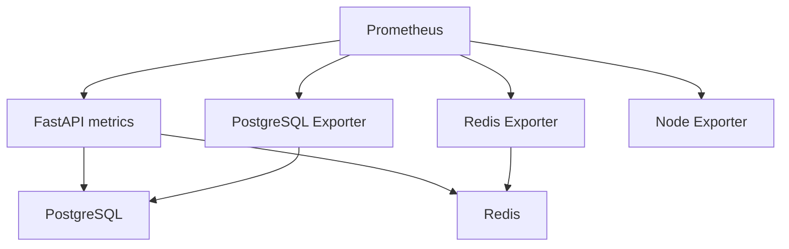

# Lab 15: PostgreSQL and Redis Exporters

## 1. Purpose and Learning Outcomes

You will add tools that measure PostgreSQL and Redis, then compare their observations with the application's own checks. After inspecting the real exporter metrics, you will break only a monitoring credential and compare that failure with a real dependency outage. This will help you tell apart a reachable exporter, a working database connection, and a healthy application request path.

> **Primary Objective:** Add server-level metrics for the dependencies, compare them with app observations, and distinguish exporter problems from database or cache failures.

The app's dependency gauge tells you whether this application can currently use a dependency. It does not describe all the server's connections, transactions, buffer use, memory, or cache statistics.

This lab adds PostgreSQL Exporter and Redis Exporter. You will inspect their separate observation paths, break only the PostgreSQL monitoring credential, and briefly stop Redis to see a real optional-dependency outage. Later incident labs investigate larger failures. Here, the goal is to understand what each observer measures and what each failure signal means.

## 2. Starting Point and Lab Map

Open the complete application repository before using this guide. Unless a step says otherwise, run commands in Bash from the repository's top-level folder. Follow the starting checks in order because later commands depend on the helper functions and running services they prepare.

Read each explanation before running its commands. Run one complete code block, check the result, and then continue. In your notebook, save the commands, what happened, why you think it happened, and anything that differed from the expected result.

### Key Terms

| **Term**            | **Explanation**                                                                          |
| ------------------- | ---------------------------------------------------------------------------------------- |
| Exporter            | A service that reads information from a dependency and exposes it as Prometheus metrics. |
| Scrape health       | Whether Prometheus successfully fetched metrics from the exporter endpoint.              |
| Monitoring identity | A separate account with permissions to collect the required measurements.                |

### Lab Map

The arrows show how the parts connect and where a request can take different paths. Use this map to understand the design. It is not a recording of a request that actually ran.


```mermaid
flowchart TD
    P["Prometheus"] --> A["FastAPI metrics"]
    P --> E["PostgreSQL Exporter"]
    P --> R["Redis Exporter"]
    P --> N["Node Exporter"]
    A --> D["PostgreSQL"]
    A --> C["Redis"]
    E --> D
    R --> C
```

## 3. Guided Walkthrough

### Step 01. Inherited State and Starting Checks

**What You Are Doing:** Begin with the healthy host-monitoring stage and keep the app's current credentials. Add a separate monitoring account so exporter access can be tested independently.

**Practical Walkthrough:** Check the host-monitoring stage and normal business requests before creating exporter access. Leave the app's database credentials unchanged. The planned fault needs a separate exporter account so monitoring can fail while the database still serves the app.

Verify the current business path and starting requirements before adding monitoring access. Keep app credentials unchanged throughout the experiment. This separation lets the monitoring connection fail while the app continues using its own working database account.

```bash
source lab-notes/session.sh
source lab-notes/evidence.sh
source lab-notes/raw-metrics.sh
source lab-notes/metrics-session.sh
metrics_check
start_lab 15
ITEM_ID=$(cat lab-notes/checkpoint-item-id.txt)
api -fsS "$APP_URL/api/v1/items/$ITEM_ID" > "$LAB_DIR/checkpoint-before.json"
api -fsS "$APP_URL/health/ready" > "$LAB_DIR/starting-readiness.json"
LAB_DATABASE=$(dc exec -T app python -c 'from app.config import Settings; print(Settings().postgres_db)')
printf '%s\n' "$LAB_DATABASE" > "$LAB_DIR/database-name.txt"
```

Complete [Lab 14](Lab-14.md). Five services should be running, with healthy FastAPI, Prometheus, and Node Exporter targets. Keep the existing app and database credentials and all volumes.

`LAB_DATABASE` is a validated database name, not a secret. Do not save the app's full environment or a rendered Compose model as evidence; either can expose credentials.

**Understanding the Result:** Start from a known healthy system. Otherwise, an existing app problem could be mistaken for a result of adding exporters.

### Step 02. Learning Objectives and Explicit Exclusions

**What You Are Doing:** Check exporter reachability, dependency collection, and business requests separately. These independent checks will help locate the planned failures.

**Practical Walkthrough:** For each objective, ask three questions: can Prometheus reach the exporter, can the exporter collect from its dependency, and can the app perform its work? These are separate connections that can fail differently. Record each result rather than assigning one overall healthy or unhealthy label.

Prepare all three observations. An exporter can return a successful HTTP response while its metrics report a failed database connection. Separate results show where failure occurs more clearly than a single green or red status.

You will create a separate PostgreSQL monitoring account, run pinned exporter versions on the internal network, and inspect their actual metric names. You will distinguish scrape health from dependency health and explain why server statistics differ from app counters.

No database schema migration is required, and no app metric is removed or duplicated through OTel. This lab adds no custom SQL collectors, query-text labels, key enumeration, public database ports, Grafana dashboards, or alert rules.

**Understanding the Result:** The table of independent observer results is the key evidence. A successful scrape does not prove that the exporter successfully accessed its database.

### Step 03. Current Architecture and Independent Observers

**What You Are Doing:** Follow each observer's connection separately. The app and exporter can reach the same database with different accounts, so one can fail while the other works.

**Practical Walkthrough:** Trace the app and exporter connections to PostgreSQL and Redis. They may use different credentials, commands, and timing even when connecting to the same server. A fault on one path therefore does not have to affect the others in the same way.

For each connection, identify who makes it, where it goes, which credentials it uses, and what operation it performs. Use this map to explain why a broken monitoring password should prevent exporter collection while the app can still commit a new item.

The lab map in Section 2 shows this relationship.

| **Observation**                                    | **What It Can Establish**                                                |
| -------------------------------------------------- | ------------------------------------------------------------------------ |
| `up{job="postgres"}`                               | Prometheus successfully fetched metrics from PostgreSQL Exporter         |
| `pg_up{job="postgres"}`                            | The exporter connected to PostgreSQL during collection                   |
| `application_dependency_up{dependency="postgres"}` | The app observed its own PostgreSQL connection path working              |
| `up{job="redis"}`                                  | Prometheus successfully fetched metrics from Redis Exporter              |
| `redis_up{job="redis"}`                            | Redis Exporter successfully collected information from Redis             |
| Application readiness                              | The app's required dependencies meet its conditions for serving requests |

These checks use different identities, times, and connection paths. Matching results can strengthen an explanation. Different results can help locate the failing layer.

**Understanding the Result:** Identify which connection produced each symptom. This prevents a monitoring login problem from being mistaken for a database outage.

### Step 04. Version and Access Decisions

**What You Are Doing:** Keep the lab's selected versions and access settings. Understand their supported behavior and permissions before interpreting missing metrics as a server failure.

**Practical Walkthrough:** Review the pinned exporter versions and the permissions they need. Inspect the output from those exact versions before assuming a metric name or privilege exists. Keep version upgrades outside this experiment so you can compare behavior with the supplied configuration.

Keep the supplied image versions and inspect the metrics they actually expose. Use this inventory for names and defaults instead of relying on another deployment. Changing versions now would introduce another possible cause for permission or metric-schema differences.

Use PostgreSQL Exporter `v0.17.1`; its [release documentation includes PostgreSQL 17 in its tested versions](https://github.com/prometheus-community/postgres_exporter/tree/v0.17.1). Use Redis Exporter `v1.69.0` with the repository's Redis 7.4 service. The [Redis Exporter versioned documentation](https://github.com/oliver006/redis_exporter/tree/v1.69.0) describes the environment settings below.

PostgreSQL Exporter uses a dedicated role that is not a superuser. It receives `pg_monitor` and database `CONNECT` permissions. `pg_monitor` exposes server statistics and can reveal operational details, including query activity, so it is not suitable for anonymous public access. This lab does not grant the role access to item rows.

Redis initially uses the server's existing password-authenticated account because that is how this repository is configured. This is a deliberate learning-stage compromise, not a least-privilege Redis ACL design. In production, create and test a monitoring ACL for the enabled collector commands and manage its credential separately.

**Understanding the Result:** Missing metrics can result from configuration, exporter version, or permissions. Check those before concluding that the server has no activity.

### Step 05. Generate a Separate PostgreSQL Exporter Credential

**What You Are Doing:** Create a separate exporter secret without displaying it or overwriting an unexpected existing value. Separate credentials let you break monitoring access without breaking the app.

**Practical Walkthrough:** Use the guarded block to generate the monitoring secret and keep its private file permissions. The guard prevents silently replacing a value another configuration may use. Pass the secret through the documented file or environment setting; do not print it in your evidence.

Read the existing-value check before generating the credential. Confirm that its file is private and ignored by Git. The secret is authentication input, not evidence to display. Use the documented path so role creation and exporter startup both receive the same value.

```bash
cat > lab-notes/exporter_password.py <<'PYTHON'
"""Create one private Compose credential without replacing an existing value."""
import os
import re
import secrets
from pathlib import Path

path = Path(".env")
text = path.read_text()
lines = [line for line in text.splitlines() if re.match(r"^\s*POSTGRES_EXPORTER_PASSWORD\s*=", line)]
if lines:
    if len(lines) != 1 or not re.fullmatch(r"POSTGRES_EXPORTER_PASSWORD=[0-9a-f]{48}", lines[0]):
        raise SystemExit("Existing exporter setting has another format; preserve it and review before proceeding")
    print("Existing exporter credential retained")
else:
    with path.open("a") as stream:
        stream.write(("" if text.endswith("\n") else "\n") + "POSTGRES_EXPORTER_PASSWORD=" + secrets.token_hex(24) + "\n")
    print("New exporter credential added without displaying it")
os.chmod(path, 0o600)
PYTHON
```

**Command Note:** `<<'PYTHON'` writes the following text literally until the closing `PYTHON`. Quoting the delimiter stops Bash from expanding `$variables` inside the file. Creating the file and running it are separate actions.

```bash
python3 lab-notes/exporter_password.py
git check-ignore .env
```

The generated secret has 48 hexadecimal characters, which fit this Compose `.env` representation. The script keeps a value already generated by this lab and refuses to replace an existing setting in another format. Review an unexpected setting instead of silently overwriting it.

Keep `.env` private and out of Git. Do not source it as a shell script. The containers receive credentials at runtime, so administrators with Docker inspection access can still see them. A production secret manager or protected secret file is preferable.

**Understanding the Result:** A separate credential lets you test monitoring access on its own. The app should continue using its existing account.

### Step 06. Provision the Monitoring Role without Changing Application Tables

**What You Are Doing:** Create the monitoring role and directly test its permissions. It should collect the required statistics without gaining access to application table data.

**Practical Walkthrough:** Create the role, then run both allowed-access and denied-access checks. It needs permission to collect the selected metrics, while normal app-table operations remain outside its purpose. Verify the effective permissions instead of trusting the role's name.

Test both the intended monitoring access and the application-table operation that should be denied. Successful login alone does not prove limited permissions. Read the SQL-generation pipeline carefully, and do not capture or redirect its secret-bearing SQL as evidence.

```bash
cat > lab-notes/exporter_role.py <<'PYTHON'
"""Write role SQL to psql stdin; never redirect this output into a lab evidence file."""
import re
from pathlib import Path

text = Path(".env").read_text()
values = re.findall(r"^POSTGRES_EXPORTER_PASSWORD=([0-9a-f]{48})$", text, re.MULTILINE)
if len(values) != 1:
    raise SystemExit("Expected exactly one generated exporter credential")
password = values[0]
print("""DO $role$
BEGIN
    IF NOT EXISTS (SELECT 1 FROM pg_roles WHERE rolname = 'observability_exporter') THEN
        CREATE ROLE observability_exporter LOGIN NOSUPERUSER NOCREATEDB NOCREATEROLE NOREPLICATION;
    END IF;
END
$role$;
ALTER ROLE observability_exporter LOGIN NOSUPERUSER NOCREATEDB NOCREATEROLE NOREPLICATION;
""")
print("ALTER ROLE observability_exporter PASSWORD '" + password + "';")
print("GRANT pg_monitor TO observability_exporter;")
print("SELECT format('GRANT CONNECT ON DATABASE %I TO observability_exporter', current_database()) \\gexec")
PYTHON
```

```bash
(
  set -euo pipefail
  python3 lab-notes/exporter_role.py | dbsql > "$LAB_DIR/role-command-status.txt"
)
printf '%s\n' "SELECT rolname, rolsuper, rolcreatedb, rolcreaterole, rolreplication FROM pg_roles WHERE rolname='observability_exporter';" \
  | dbsql > "$LAB_DIR/role-properties.txt"
printf '%s\n' "SELECT pg_has_role('observability_exporter','pg_monitor','member') AS monitoring_member, has_database_privilege('observability_exporter',current_database(),'CONNECT') AS can_connect, has_table_privilege('observability_exporter','public.items','SELECT') AS can_read_items;" \
  | dbsql > "$LAB_DIR/role-privileges.txt"
cat "$LAB_DIR/role-properties.txt" "$LAB_DIR/role-privileges.txt"
```

**Expected Result:** The superuser, database-creation, role-creation, and replication flags are false. Monitoring membership and database connection permission are true. Under the repository's original grants, SELECT permission on the item table is false.

The SQL containing the password goes straight to `psql` stdin. Do not run the role script on its own, add `tee`, enable shell tracing, or use psql echo flags for this pipeline. Saved status output contains command tags, not the SQL input. If server-side statement auditing is enabled, review that separately.

This step provisions server access. Alembic still controls changes to application tables. Adding the role to an already-run `init.sql` will not make an existing persistent PostgreSQL volume repeat initialization.

**Understanding the Result:** Confirming allowed monitoring access and denied unrelated access are both necessary checks of the intended permission boundary.

### Step 07. Create the Two Exporter Services

**What You Are Doing:** Add the two internal exporter services with the supplied runtime settings. They need to remain observable when a dependency fails so they can report that failure.

**Practical Walkthrough:** Add the services with the given internal connections and runtime settings. Their HTTP endpoints should keep running when PostgreSQL or Redis becomes unavailable. This allows the exporters to report dependency failures instead of disappearing at the same moment.

Review each exporter's HTTP listener separately from its database connection. The listener should remain reachable during a dependency failure. Confirm the internal names and ports before startup: the exporter endpoint and the database endpoint are different destinations.

```bash
cat > lab-notes/compose.db-exporters.yaml <<'YAML'
services:
  postgres-exporter:
    image: prometheuscommunity/postgres-exporter:v0.17.1
    user: "65534:65534"
    read_only: true
    restart: unless-stopped
    mem_limit: 128m
    cap_drop: [ALL]
    security_opt: ["no-new-privileges:true"]
    networks: [platform]
    environment:
      DATA_SOURCE_URI: "postgres:5432/${POSTGRES_DB:-items}?sslmode=disable"
      DATA_SOURCE_USER: observability_exporter
      DATA_SOURCE_PASS: "${POSTGRES_EXPORTER_PASSWORD:?Create the exporter credential first}"
    command:
      - --web.listen-address=0.0.0.0:9187
      - --disable-settings-metrics
    depends_on:
      postgres:
        condition: service_started
    logging:
      driver: json-file
      options:
        max-size: 10m
        max-file: "3"
  redis-exporter:
    image: oliver006/redis_exporter:v1.69.0
    user: "65534:65534"
    read_only: true
    restart: unless-stopped
    mem_limit: 128m
    cap_drop: [ALL]
    security_opt: ["no-new-privileges:true"]
    networks: [platform]
    environment:
      REDIS_ADDR: redis://redis:6379
      REDIS_PASSWORD: "${REDIS_PASSWORD:?Set the existing Redis credential}"
      REDIS_EXPORTER_WEB_LISTEN_ADDRESS: 0.0.0.0:9121
    depends_on:
      redis:
        condition: service_started
    logging:
      driver: json-file
      options:
        max-size: 10m
        max-file: "3"
YAML
```

Both exporters listen inside the Compose network and publish no host ports. They run as non-root, with read-only root filesystems and dropped capabilities. They need no host mounts.

`service_started` deliberately allows exporters to run even when the dependency is unhealthy. Their job includes reporting that state. A startup dependency does not continuously supervise health, and restarting an exporter does not repair a database outage.

The PostgreSQL URI leaves out the password, which separate environment fields provide. Local `sslmode=disable` matches this isolated Compose setup; it is not a production TLS policy for connections between hosts. Redis key and client-list enumeration remain disabled by default.

**Understanding the Result:** The exporter process and its dependency can have different health states. Keep that separation in the service configuration.

### Step 08. Add Real Scrape Jobs and Start Only the New Services

**What You Are Doing:** Add and validate the actual scrape jobs, then start only the new services. Keep the existing app, host, and Prometheus observations working.

**Practical Walkthrough:** Add the two jobs without removing the existing ones. Validate the combined Compose settings and Prometheus configuration before starting exporters. Inspect the actual target labels so later queries use the correct job names.

Keep the existing scrape jobs and validate both configurations after adding the new ones. After startup, inspect active-target labels and fresh scrape times. A valid job definition alone does not prove that Prometheus loaded it or can reach its endpoint.

```bash
python3 - <<'PYTHON'
from pathlib import Path
path = Path("lab-notes/prometheus/prometheus.yml")
text = path.read_text()
for job, target in (("postgres", "postgres-exporter:9187"), ("redis", "redis-exporter:9121")):
    if f"job_name: {job}\n" not in text:
        text = text.rstrip() + f'\n  - job_name: {job}\n    static_configs:\n      - targets: ["{target}"]\n'
path.write_text(text)
PYTHON
chmod 644 lab-notes/prometheus/prometheus.yml
dm config --quiet
record_change "add_postgres_and_redis_exporters" planned
dm up -d --no-deps postgres-exporter redis-exporter
reload_prometheus
wait_target postgres up
wait_target redis up
wait_metric 'pg_up{job="postgres"}' 1
wait_metric 'redis_up{job="redis"}' 1
metrics_check
record_change "database_exporter_targets_ready" completed
```

**Expected Result:** Seven services and five scrape jobs are running. In this step, Prometheus can reload the new jobs with SIGHUP because its container-level settings did not change. If validation fails, the helper does not send the reload signal.

The Lab 10 `dm` helper includes the new overlay automatically. Keep naming only the required services in startup commands; the full original platform is not needed yet.

**Understanding the Result:** The stage now has seven services and five scrape targets. Check that the existing observations remain healthy after adding the exporters.

### Step 09. Inspect Raw Exporter Output Before Writing Queries

**What You Are Doing:** Inspect the raw metrics to find the names, types, and labels this version actually provides. A plausible metric name that does not exist cannot measure the dependency.

**Practical Walkthrough:** Read each exporter's raw output and list its names, types, and labels. Build queries from that inventory. A name copied from a different exporter version may return nothing even when the server and collection path work correctly.

Save the raw endpoint output and inspect its metric metadata before writing PromQL. Distinguish labels added by Prometheus from labels exposed by the exporter. If a query is empty, check the real name and labels before treating the absence as zero activity.

```bash
for kind in postgres redis; do
  port=9187
  if [[ "$kind" == redis ]]; then port=9121; fi
  dm exec -T app python - "$kind-exporter" "$port" <<'PYTHON' > "$LAB_DIR/$kind-exporter.prom"
import sys, urllib.request
url = f"http://{sys.argv[1]}:{sys.argv[2]}/metrics"
with urllib.request.urlopen(url, timeout=10) as response:
    print(response.read().decode(), end="")
PYTHON
done
rg '^# (HELP|TYPE) (pg_stat_database_|pg_up|redis_up|redis_connected_clients|redis_commands_processed_total|redis_memory_used_bytes)' \
  "$LAB_DIR/postgres-exporter.prom" "$LAB_DIR/redis-exporter.prom"
```

If the host lacks `rg`, use `grep -E` with the same pattern. The commands use Python in the application image, so they do not assume an exporter image contains a shell or curl.

Check names and labels against the actual output. In this PostgreSQL exporter, counters such as `pg_stat_database_xact_commit` have no `_total` suffix. Read the TYPE metadata to identify the type instead of inventing a name that follows a familiar convention.

**Understanding the Result:** Raw output tells you which metrics and labels exist. An empty selector does not prove the server is idle.

### Step 10. Inspect PostgreSQL Connections and Transaction Activity

**What You Are Doing:** Compare PostgreSQL metrics with native database views and app traffic. Server transactions include more than item changes, so their totals need different explanations.

**Practical Walkthrough:** Compare exporter measurements, the supplied native database views, and controlled app requests. State what each counts. Server transaction counters can include monitoring and other clients, not just successful item mutations. Compare the direction and scope of changes instead of expecting identical totals.

Compare the exporter and native view over the same period. Monitoring queries and other clients may add transactions, so database commits need not equal successful item changes. Identify the database and clients included in each observation before explaining the differences.

```bash
pq "pg_stat_database_numbackends{job=\"postgres\",datname=\"$LAB_DATABASE\"}" | jq .
pq "rate(pg_stat_database_xact_commit{job=\"postgres\",datname=\"$LAB_DATABASE\"}[2m])" | jq .
pq "rate(pg_stat_database_xact_rollback{job=\"postgres\",datname=\"$LAB_DATABASE\"}[2m])" | jq .
pq "rate(pg_stat_database_deadlocks{job=\"postgres\",datname=\"$LAB_DATABASE\"}[2m])" | jq .
printf '%s\n' "SELECT datname, numbackends, xact_commit, xact_rollback, deadlocks FROM pg_stat_database WHERE datname=current_database();" \
  | dbsql > "$LAB_DIR/postgres-native-statistics.txt"
```

Wait for at least two scrapes before interpreting rates. When comparing with a native view, allow for collection timing and the extra connection created by your own psql command.

Database commits can include reads, probes, exporter queries, and other clients. They are not the same as committed item mutations. A rollback can happen during normal read-session cleanup, so it does not automatically mean a user transaction failed. Deadlocks are one specific server event, not a count of all database errors.

**Understanding the Result:** One server transaction is not necessarily one item change. First explain the different measurement scopes before assuming an instrument is faulty.

### Step 11. Interpret Buffer Hits and Temporary Work

**What You Are Doing:** Interpret buffer hits and temporary-file work within PostgreSQL's storage view. Missing a PostgreSQL buffer does not by itself prove that a physical disk was read.

**Practical Walkthrough:** Check what the buffer-hit and temporary-work metrics actually measure. A page missing from PostgreSQL's shared buffers may still be in the operating system's cache. Identify the layer each metric describes before making a claim about disk activity.

Read the ratio as a comparison of PostgreSQL shared-buffer observations. A block read outside those buffers can still come from the OS cache. Use host I/O measurements for physical-device questions. Keep temporary-byte activity separate from buffer-hit percentage and disk capacity.

```bash
pq "rate(pg_stat_database_blks_hit{job=\"postgres\",datname=\"$LAB_DATABASE\"}[2m]) / (rate(pg_stat_database_blks_hit{job=\"postgres\",datname=\"$LAB_DATABASE\"}[2m]) + rate(pg_stat_database_blks_read{job=\"postgres\",datname=\"$LAB_DATABASE\"}[2m]))" | jq .
pq "rate(pg_stat_database_temp_bytes{job=\"postgres\",datname=\"$LAB_DATABASE\"}[2m])" | jq .
pq 'pg_exporter_last_scrape_error{job="postgres"}' | jq .
```

The hit fraction describes PostgreSQL shared buffers, not Redis cache performance. A block missing from those buffers may still come from the OS page cache, so it does not prove a physical disk read. With no observed block activity, the fraction is undefined.

Growing temporary-byte counters can support an investigation of sorts or hashes spilling into temporary files. They do not identify the responsible SQL statement. Query analysis and tuning need more evidence. Definitions are in the [pinned PostgreSQL database collector](https://github.com/prometheus-community/postgres_exporter/blob/v0.17.1/collector/pg_stat_database.go).

**Understanding the Result:** Use storage and host measurements to support disk conclusions. Database counters cannot show every lower-level I/O outcome on their own.

### Step 12. Inspect Redis Server Behavior

**What You Are Doing:** Read Redis statistics as measurements of the whole server. Probes, exporters, and other clients add activity beyond the app's item-cache requests.

**Practical Walkthrough:** Inspect the Redis counters and identify activity from probes, exporter collection, and your diagnostic commands as well as the app. Compare changes over a limited interval with known actions. Interpret server cache terms according to the commands they measure, not automatically as the app's cache behavior.

List the Redis commands issued by the app, probes, exporter, and your checks during the interval. The server counters include all of them. Compare the changes with this list so diagnostic activity is not mistaken for extra app cache traffic.

```bash
pq 'redis_connected_clients{job="redis"}' | jq .
pq 'redis_memory_used_bytes{job="redis"}' | jq .
pq 'rate(redis_commands_processed_total{job="redis"}[2m])' | jq .
pq 'rate(redis_keyspace_hits_total{job="redis"}[2m])' | jq .
pq 'rate(redis_keyspace_misses_total{job="redis"}[2m])' | jq .
pq 'rate(redis_evicted_keys_total{job="redis"}[2m])' | jq .
pq 'rate(redis_rejected_connections_total{job="redis"}[2m])' | jq .
rcli INFO stats > "$LAB_DIR/redis-native-stats.txt"
rcli INFO memory > "$LAB_DIR/redis-native-memory.txt"
```

Redis command totals include monitoring, health probes, and all clients. Keyspace hits and misses describe server lookups across databases, not necessarily usable app cache results. The app may reject malformed cached JSON or temporarily bypass Redis after an invalidation failure, creating further differences.

Eviction removes data according to memory policy. TTL expiration removes data when its lifetime ends; these are different mechanisms. This repository limits Redis with `maxmemory` and uses `allkeys-lru`. Do not exhaust the VM just to make the eviction counter increase.

**Understanding the Result:** Redis and the app count different sets of activity. A server cache hit does not always mean the app received a valid item-cache result.

### Step 13. Prove the Difference between Server Hits and Application Hits

**What You Are Doing:** Read the key directly from Redis, then compare server and app hit counters. This controlled example shows why the counters describe different activity.

**Practical Walkthrough:** Use the documented command to read the key directly through Redis. Compare server hits with app hits afterward. This client bypasses app instrumentation, so it gives the two observers different events to count. Keep the key and time interval fixed so the result is easy to explain.

Put the direct Redis reads between the intended before-and-after measurements, using the same item key. They bypass the app, so their effect on Redis need not appear in the app's cache counter. That difference demonstrates measurement scope rather than an inconsistency to remove.

```bash
api -fsS "$APP_URL/api/v1/items/$ITEM_ID" >/dev/null
KEY=$(cache_key "$ITEM_ID")
[[ $(rcli EXISTS "$KEY" | tr -d '\r') == 1 ]]
snapshot "$LAB_DIR/cache-before.json"
rcli INFO stats > "$LAB_DIR/redis-stats-before.txt"
for n in 1 2 3; do rcli GET "$KEY" >/dev/null; done
rcli INFO stats > "$LAB_DIR/redis-stats-after.txt"
snapshot "$LAB_DIR/cache-after.json"
metric_sum "$LAB_DIR/cache-before.json" application_cache_hits_total
metric_sum "$LAB_DIR/cache-after.json" application_cache_hits_total
python3 - "$LAB_DIR" <<'PYTHON'
import sys
from pathlib import Path
root = Path(sys.argv[1])
def value(filename):
    rows = (root / filename).read_text().splitlines()
    return int(next(line.split(":", 1)[1] for line in rows if line.startswith("keyspace_hits:")))
print("server_hit_delta", value("redis-stats-after.txt") - value("redis-stats-before.txt"))
PYTHON
```

Run the block promptly, before the configured cache TTL expires. If the key remains present and no other item traffic occurs, Redis hits should increase by three while app hits stay unchanged. The direct redis-cli requests did not pass through the app.

If the key expires, or the app is still in its earlier invalidation-failure bypass period, wait for that limited period to end. Warm the key again and repeat with new before-and-after evidence. Do not use a manual `SET` to conceal a cache-path problem.

**Understanding the Result:** Redis activity can rise without an app hit increase. This can be a correct result of observing different request paths.

### Step 14. Predict a Monitoring-Credential Failure

**What You Are Doing:** Predict the effects of changing only the PostgreSQL exporter's password. The app and database stay unchanged, so the results should point to a problem with one monitoring identity.

**Practical Walkthrough:** Predict what happens when only the exporter's password is wrong. The database still runs, the app still has valid credentials, and the exporter can still answer HTTP. Write your expected scrape, collection, and business results before applying the fault.

Predict successful HTTP scraping separately from failed PostgreSQL access inside the exporter. Keep the database and app credentials untouched. A successful independent business request acts as the control, while the exporter's downstream metric shows the monitoring connection failure.

The next fault changes only the password used by PostgreSQL Exporter. PostgreSQL keeps running, and the app keeps its own working account.

Predict all four results: exporter HTTP `up`, `pg_up`, the app's PostgreSQL dependency gauge, and app readiness. Write the expected table first. Failure for one monitoring identity does not prove that the whole database is unavailable.

**Understanding the Result:** This fault affects an observer's authentication. Its pattern should differ from stopping PostgreSQL itself.

### Step 15. Inject and Recover the Exporter-Only Fault

**What You Are Doing:** Apply the exporter-only fault, collect the separate health results, and restore the configuration. This shows that scraping can succeed while dependency collection fails.

**Practical Walkthrough:** Apply the wrong password using the supplied recovery block, then capture all independent checks. A successful scrape can return metrics saying that database access failed. Restore the normal credential and check fresh successful collection, leaving the app account unchanged throughout.

Run the complete temporary-credential wrapper, including restoration. Wait for a scrape of the changed exporter and capture target health, dependency status, and a business response in the same period. After restoring the approved configuration, verify fresh database collection before declaring recovery.

```bash
cat > "$LAB_DIR/compose.exporter-fault.yaml" <<'YAML'
services:
  postgres-exporter:
    environment:
      DATA_SOURCE_PASS: deliberately-wrong-lab-password
YAML
(
  set -euo pipefail
  trap 'dm up -d --no-deps --force-recreate postgres-exporter >/dev/null' EXIT
  trap 'exit 130' INT
  trap 'exit 143' TERM
  record_change "replace_only_postgres_exporter_password_with_invalid_value" planned
  dm -f "$LAB_DIR/compose.exporter-fault.yaml" up -d --no-deps postgres-exporter
  wait_metric 'pg_up{job="postgres"}' 0
  wait_target postgres up
  pq 'up{job="postgres"}' > "$LAB_DIR/fault-exporter-up.json"
  pq 'pg_up{job="postgres"}' > "$LAB_DIR/fault-pg-up.json"
  api -fsS "$APP_URL/health/ready" > "$LAB_DIR/fault-application-readiness.json"
  api -fsS "$APP_URL/api/v1/items?limit=1" > "$LAB_DIR/fault-application-list.json"
  snapshot "$LAB_DIR/fault-application-metrics.json"
)
wait_metric 'pg_up{job="postgres"}' 1
wait_target postgres up
record_change "restore_postgres_exporter_credential_verified" completed
```

**Command Note:** `trap ... EXIT` schedules cleanup when that shell exits. Keep it in the same block as the fault. The recovery checks afterward confirm that restoration actually worked.

During the fault, expect exporter `up=1`, `pg_up=0`, app PostgreSQL gauge `1`, readiness `ready`, and a successful list response. The exit trap restores normal exporter configuration, including when the block fails or is interrupted.

A successful `/metrics` response can correctly report a dependency connection failure. Before paging the database owner solely for `pg_up=0`, check the other observers, error details, and recent changes. Do not save or share a full container inspection containing credentials as evidence.

**Understanding the Result:** `up` describes the Prometheus-to-exporter scrape. Combine it with downstream status and business checks to find which connection actually failed.

### Step 16. Compare a Real Redis Outage with the Exporter Fault

**What You Are Doing:** Compare that monitoring fault with a real Redis outage and the app's fallback behavior. The exporter can remain reachable while both its Redis check and the app's cache check fail.

**Practical Walkthrough:** Briefly stop Redis and inspect exporter reachability, Redis status, the app's dependency gauge, and item responses. PostgreSQL fallback may keep business requests working. After restoring Redis, verify fresh cache and exporter recovery; a successful item response alone does not prove the cache works.

During the short Redis stop, compare the working exporter HTTP endpoint with its failed Redis connection and the app's fallback. An item can still come from PostgreSQL. After recovery, collect fresh cache-specific and exporter evidence instead of relying only on business success.

```bash
(
  set -euo pipefail
  trap 'dc start redis >/dev/null' EXIT
  trap 'exit 130' INT
  trap 'exit 143' TERM
  record_change "stop_redis_for_observer_comparison" planned
  dc stop redis
  wait_metric 'redis_up{job="redis"}' 0
  wait_target redis up
  api -fsS "$APP_URL/health/ready" > "$LAB_DIR/redis-down-readiness.json"
  api -fsS "$APP_URL/api/v1/items/$ITEM_ID" > "$LAB_DIR/redis-down-item.json"
  wait_metric 'application_dependency_up{job="fastapi",dependency="redis"}' 0
  pq 'up{job="redis"}' > "$LAB_DIR/redis-exporter-up-during-outage.json"
  pq 'redis_up{job="redis"}' > "$LAB_DIR/redis-server-up-during-outage.json"
)
wait_ready
wait_metric 'redis_up{job="redis"}' 1
wait_metric 'application_dependency_up{job="fastapi",dependency="redis"}' 1
record_change "redis_observer_comparison_recovered" completed
capture_app_logs
```

**Expected Result:** Redis Exporter remains scrapeable, but its Redis health and the app's cache health are zero. Readiness returns HTTP 200 with a degraded cache status, and PostgreSQL supplies the item. Keep this comparison to roughly one or two scrape periods plus recovery.

After recovery, other Redis metric families may reappear, and server counters may have reset. Use the reset-aware functions from Lab 12. A lower raw counter does not mean negative cache activity.

**Understanding the Result:** Business requests can succeed while cache health is degraded. Record both the availability result and the fallback path used to produce it.

### Step 17. Assemble the Observer Matrix

**What You Are Doing:** Fill the observer table with the actual results from both experiments. Use the pattern to locate the affected layer instead of reducing every result to one failed status.

**Practical Walkthrough:** Compare the observed checks during the credential fault and Redis outage. Which changed, and which stayed healthy? Use that pattern to identify the affected connection or component. Keep unexpected values for investigation instead of forcing them to match your predictions.

Fill the table from saved results, including timestamps and selected target labels. Compare one connection at a time across the two faults. If a result differs from your prediction, preserve it and investigate that connection; do not adjust the evidence to fit the expected table.

Use the values you observed rather than simply copying the predictions:

| **State**                          | **Exporter Scrape `up`** | **Exporter Downstream Health** | **Application Dependency**    | **Readiness**                 |
| ---------------------------------- | -----------------------: | -----------------------------: | ----------------------------: | ----------------------------- |
| PostgreSQL healthy                 | 1                        | `pg_up=1`                      | postgres=1                    | ready                         |
| PostgreSQL exporter password wrong | 1                        | `pg_up=0`                      | postgres=1                    | ready                         |
| Redis stopped                      | 1                        | `redis_up=0`                   | redis=0                       | degraded, HTTP 200            |
| Exporter process unreachable       | 0                        | May be missing or stale        | Check independently           | Check independently           |

The last row is a reasoning exercise; do not inject another fault now. A missing or stale downstream-health value does not show a currently successful connection. Check sample freshness and scrape health alongside downstream gauges.

**Understanding the Result:** The table should help identify which path failed. One overall red or green status would hide the differences these experiments demonstrate.

### Step 18. Recovery and Proof of the Final Stage

**What You Are Doing:** Verify the seven services, five targets, dependency checks, and checkpoint item. Keep the monitoring role and exporters because later labs use their data.

**Practical Walkthrough:** Restore normal credentials and dependencies, then check every service, target, dependency result, and the checkpoint. Keep both exporters and the monitoring role. Remove only the temporary fault inputs and disposable experiment artifacts named in the guide.

Check the final service and target lists, dependency status, and saved checkpoint. Remove only temporary fault configuration. The following rules and dashboards need the monitoring account and approved exporter settings to remain in place.

```bash
metrics_check
api -fsS "$APP_URL/api/v1/items/$ITEM_ID" > "$LAB_DIR/checkpoint-after.json"
api -fsS "$APP_URL/health/ready" > "$LAB_DIR/recovered-readiness.json"
api -fsS "$PROM_URL/api/v1/targets?state=active" > "$LAB_DIR/final-targets.json"
jq '[.data.activeTargets[] | {job:.labels.job,health,scrapeUrl}]' "$LAB_DIR/final-targets.json"
pq 'pg_exporter_last_scrape_error{job="postgres"}' > "$LAB_DIR/final-pg-scrape-error.json"
dm ps --services --status running | sort > "$LAB_DIR/final-services.txt"
record_change "database_exporter_stage_recovery_verified" completed
```

**Expected Result:** Seven services and five scrape jobs are healthy, `pg_up=1`, `redis_up=1`, the app is ready, and the checkpoint item is unchanged. Keep the exporters and monitoring role for the next lab.

If you pause, stop the named services without deleting volumes. To resume, start the same seven services explicitly and run `metrics_check`. If you deleted the project network, repeat Lab 14's gateway discovery before starting the host-bound exporter.

**Understanding the Result:** Fresh healthy measurements confirm recovery. Earlier failed samples remain valid evidence for the times when the faults occurred.

## 4. Troubleshooting and Diagnosis

Begin with the first result that differed from your prediction. Save the exact error or symptom and identify which service or command produced it. Use the checks below, make the needed fix, and repeat the original check to confirm the problem is resolved.

### Troubleshooting

| **Symptom**                                | **Check**                                                       | **Corrective Direction**                                                        |
| ------------------------------------------ | --------------------------------------------------------------- | ------------------------------------------------------------------------------- |
| Compose requires exporter password         | Private `.env` and the credential-generation step               | Supply the private credential; do not put a literal production password in YAML |
| `up=1`, `pg_up=0`                          | Monitoring account, CONNECT permission, and server availability | Distinguish account or permission failures from a database-wide outage          |
| PostgreSQL exporter metrics partly missing | `pg_exporter_last_scrape_error`, collector output, and grants   | Check the collector for this version instead of guessing metric names           |
| `up=1`, `redis_up=0`                       | Redis availability, address, and password                       | A working exporter HTTP endpoint does not prove Redis is healthy                |
| Exporter `up=0`                            | Service DNS, port, process logs, and target error               | Repair the scrape connection before trusting downstream measurements            |
| Transaction count exceeds API writes       | Probes, reads, exporter queries, and other clients              | Server transactions include more work than app item mutations                   |
| Server cache hits differ from app hits     | Direct clients, TTL, decoding failures, and bypass behavior     | Compare which operations each observer includes                                 |
| Rate empty immediately after startup       | Number of samples and the 15-second scrape interval             | Wait for enough successful scrapes to calculate a rate                          |

Use relevant log excerpts and remove sensitive details from errors. Exporter diagnostics may contain connection metadata, so review them before sharing publicly.

## 5. Review and Practice

Answer the questions in your own words before reading the answers. For the scenario, say what you would inspect and exactly what each result would tell you.

### Knowledge Check

1. What does exporter up=1 prove?
2. Why can pg_up=0 while the API works?
3. Are PostgreSQL transaction commits the same as item creations?
4. Are Redis keyspace hits the same as application cache hits?
5. Why keep exporters running when a dependency is down?

#### Answer Guide

1. It proves only that Prometheus successfully fetched metrics from that exporter endpoint.
2. The exporter uses a separate account and connection path, which can fail while the app's path still works.
3. No. Server transactions also include reads, monitoring, and other clients' operations.
4. No. Server lookups cover more clients and do not apply all the app's cache-validation and bypass rules.
5. They need to remain reachable so they can report the dependency's failure.

### Professional Scenario Exercise

An alert says “PostgreSQL down,” but users can still complete requests. Plan an investigation using exporter scrape health, pg_up, recent monitoring-role changes, app readiness, a business request, and native server statistics. If only the monitoring password was rotated incorrectly, identify the owner who should fix that path.

## 6. Completion Checklist

Tick an item only when you can show its result or saved evidence. Finish the cleanup instructions before starting the next lab.

### Observable Completion Criteria

- [ ] The separate PostgreSQL monitoring role has no SELECT permission on the item table.
- [ ] Exporter credentials stay private and do not appear in committed files or evidence.
- [ ] The pinned exporters are reachable only through the intended internal network.
- [ ] All five scrape jobs and seven services are healthy.
- [ ] I inspected actual PostgreSQL and Redis metric names before querying them.
- [ ] I can distinguish a monitoring-credential failure from a database outage.
- [ ] The Redis experiment shows app degradation and confirms dependency recovery.
- [ ] After recovery, I verified checkpoint data, app readiness, and exporter health.

## 7. Production Context and Next Lab

### Production Implications

Exporters are clients of production services and need their own access controls, load management, maintenance, and failure handling. Restrict credentials and endpoints, watch collection errors, and test compatibility during database upgrades. Server statistics and app health complement each other. Keep their measurement ownership clear so business outcomes, dependency use, and server behavior remain understandable.

### End State and Transition

The metrics stage now has seven services and five scrape jobs. Lab 16, Recording Rules and Query Cost, will use these verified series to calculate stable query results in advance and examine repeated-query cost. Complete the health checks and evidence here before adding those rules.
