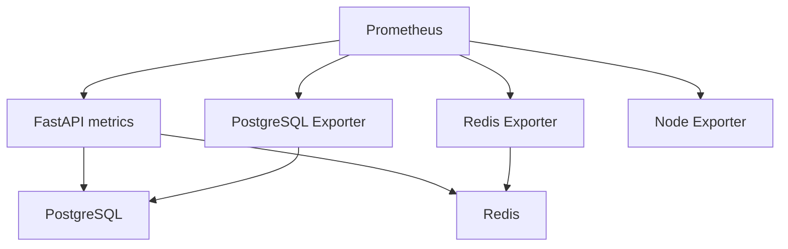

# Lab 15: PostgreSQL and Redis Exporters

## 1. Purpose and Learning Outcomes

**In Plain Language:** You will add observers for PostgreSQL and Redis without confusing those observers with the application. Inspect the real exporter metrics, then break only a monitoring credential and compare that with a real dependency outage. The result is a practical way to tell a working exporter endpoint, a reachable database, and a healthy application path apart.

> **Primary Objective:** Add real server-level dependency metrics, compare them with application observations, and distinguish exporter failures from database and cache failures.

The application dependency gauge answers whether this application can currently use a dependency. It does not describe the server's connection population, transaction activity, buffer behavior, memory or global cache statistics.

This lab adds PostgreSQL Exporter and Redis Exporter. You will inspect both observation paths, break only the PostgreSQL monitoring credential, and briefly stop Redis to compare a real optional-dependency outage. The larger failure investigations remain in the later incident labs; this exercise establishes measurement scope and failure semantics.

## 2. Starting Point and Lab Map

Use this guide inside the complete application repository. Run commands from the repository root in Bash unless a step says otherwise. Work through the starting checks in order; they load the helpers and state this lab needs.

Read the explanation before each step, run one complete code block at a time, and compare the actual result with the stated expectation. Save commands, observations, explanations, and unexpected results in your notebook.

### Key Terms

| **Term**            | **Plain-Language Meaning**                                                 |
| ------------------- | -------------------------------------------------------------------------- |
| Exporter            | A service that reads a dependency and exposes measurements for Prometheus. |
| Scrape health       | Whether Prometheus successfully fetched the exporter's metrics.            |
| Monitoring identity | A separate account with the permissions needed for observation.            |

### Lab Map

The arrows show the flow or dependency being studied. Branches identify paths to compare; this is a conceptual map, not a captured runtime trace.


```mermaid
flowchart TD
    P["Prometheus"] --> A["FastAPI metrics"]
    P --> E["PostgreSQL Exporter"]
    P --> R["Redis Exporter"]
    P --> N["Node Exporter"]
    A --> D["PostgreSQL"]
    A --> C["Redis"]
    E --> D
    R --> C
```

## 3. Guided Walkthrough

### Step 01. Inherited State and Starting Checks

**What You Are Doing:** Start with the healthy host-monitoring stage and retain existing application credentials. This lab adds monitoring access without replacing the app's working identity.

**Practical Walkthrough:** Verify the host-monitoring stage and existing business path before creating exporter access. Keep the app's database credentials unchanged. The upcoming fault depends on the exporter having its own identity so that monitoring can fail independently of the service it observes.

Verify current business requests and exporter-stage prerequisites before creating monitoring access. Keep application credentials unchanged throughout the credential experiment. This separation is essential: it allows a monitoring connection to fail while the database continues serving the application through its independent identity.

```bash
source lab-notes/session.sh
source lab-notes/evidence.sh
source lab-notes/raw-metrics.sh
source lab-notes/metrics-session.sh
metrics_check
start_lab 15
ITEM_ID=$(cat lab-notes/checkpoint-item-id.txt)
api -fsS "$APP_URL/api/v1/items/$ITEM_ID" > "$LAB_DIR/checkpoint-before.json"
api -fsS "$APP_URL/health/ready" > "$LAB_DIR/starting-readiness.json"
LAB_DATABASE=$(dc exec -T app python -c 'from app.config import Settings; print(Settings().postgres_db)')
printf '%s\n' "$LAB_DATABASE" > "$LAB_DIR/database-name.txt"
```

Complete [Lab 14](Lab-14.md). Five services should be running, with healthy FastAPI, Prometheus and Node Exporter targets. Preserve the existing application/database credentials and volumes.

`LAB_DATABASE` is a nonsecret validated database identifier. Do not dump the application's full environment or a rendered Compose model into evidence; those can expose credentials.

**Understanding the Result:** Start from a healthy known baseline. Otherwise an existing app failure could be mistaken for an effect of the exporter setup.

### Step 02. Learning Objectives and Explicit Exclusions

**What You Are Doing:** Keep endpoint health, downstream collection, and business behavior separate. Their independent checks are the main tool for diagnosing the upcoming faults.

**Practical Walkthrough:** For each objective, distinguish exporter HTTP reachability, successful collection from its dependency, and actual application behavior. These are separate connections with separate failure modes. Prepare to record all three rather than replacing them with one overall healthy or unhealthy label.

Prepare three independent observations: scrape reachability, exporter-to-dependency success, and business behavior. An exporter can return HTTP successfully while reporting a failed downstream connection. Recording all three avoids collapsing different failure boundaries into one green or red health label.

You will provision a separate PostgreSQL monitoring identity, run pinned exporters on the internal network, validate actual metric names, distinguish scrape health from downstream health, and explain why server statistics differ from application counters.

No database schema migration is needed. No application metric is removed or duplicated through OTel. This lab does not add custom SQL query collectors, query-text labels, key enumeration, public database ports, Grafana dashboards or alert rules.

**Understanding the Result:** The observer matrix is the central evidence. One successful scrape does not prove downstream database access succeeded.

### Step 03. Current Architecture and Independent Observers

**What You Are Doing:** Follow each observer's own connection path. An exporter and the app can reach the same database through different identities and fail independently.

**Practical Walkthrough:** Follow the application and exporter connections to PostgreSQL and Redis separately. They may use different credentials, commands, or observation intervals even when reaching the same server. A fault on one path therefore need not produce the same result on the others.

Trace each connection's caller, destination, credentials, and observed operations. Application and exporter traffic can differ even when both reach one database server. Use this map to predict why a monitoring password fault should affect exporter collection without changing the app's ability to commit an item.

The lab map in Section 2 shows this relationship.

| **Observation**                                    | **What It Can Establish**                                               |
| -------------------------------------------------- | ----------------------------------------------------------------------- |
| `up{job="postgres"}`                               | Prometheus successfully scraped the PostgreSQL exporter endpoint        |
| `pg_up{job="postgres"}`                            | The exporter could connect to PostgreSQL during collection              |
| `application_dependency_up{dependency="postgres"}` | The application observed its own PostgreSQL path working                |
| `up{job="redis"}`                                  | Prometheus successfully scraped Redis Exporter                          |
| `redis_up{job="redis"}`                            | Redis Exporter could collect from Redis                                 |
| Application readiness                              | The API's required business dependencies satisfy its readiness contract |

These observations have different identities, timing and failure domains. Agreement strengthens a hypothesis; disagreement can identify the failing layer.

**Understanding the Result:** Identify which connection produced each symptom. This prevents an exporter authentication problem from being misdiagnosed as a database outage.

### Step 04. Version and Access Decisions

**What You Are Doing:** Use the versions and access model selected by the lab. Check the documented compatibility and required permissions before interpreting absent metrics as a runtime failure.

**Practical Walkthrough:** Review the pinned exporter versions and their intended access requirements in the supplied lab. Inspect actual output under those versions before relying on a metric name or privilege assumption. Keep version changes outside this exercise so behavior can be compared against the documented contract.

Keep the supplied version pins and inspect the metrics those exact images expose. Version-specific names and defaults should come from that inventory, not memory of another deployment. Changing exporter versions during the exercise would add a second cause to any permission or schema discrepancy.

Use PostgreSQL Exporter `v0.17.1`, whose [release documentation includes PostgreSQL 17 in its tested versions](https://github.com/prometheus-community/postgres_exporter/tree/v0.17.1), and Redis Exporter `v1.69.0` with the repository's Redis 7.4 service. The [Redis Exporter versioned documentation](https://github.com/oliver006/redis_exporter/tree/v1.69.0) defines the environment options used below.

The PostgreSQL exporter gets a dedicated non-superuser role with `pg_monitor` and database `CONNECT`. `pg_monitor` exposes useful server statistics and can reveal operational details such as query activity; it is not an anonymous public-access role. We do not grant it access to item rows.

Redis initially reuses the existing password-authenticated server account because that is the current repository's authentication model. This is a deliberate learning-stage compromise, not a claim of least-privilege Redis ACLs. Production hardening should create a tested monitoring ACL for the enabled collector commands and manage its credential separately.

**Understanding the Result:** A missing family may reflect configuration, version, or permissions. Establish those facts before concluding the server has no activity.

### Step 05. Generate a Separate PostgreSQL Exporter Credential

**What You Are Doing:** Generate a dedicated exporter secret without printing it or overwriting an unexpected existing value. Separating credentials lets you test monitoring failure without breaking the app.

**Practical Walkthrough:** Generate the dedicated monitoring secret through the guarded block and preserve its file permissions. The guard prevents silently replacing an existing value that another configuration may already use. Use the secret through the documented file or environment path without printing it into the evidence transcript.

Read the existing-value guard before generating the credential and confirm the resulting file remains private and ignored by Git. The secret is an input to authentication, not evidence to display. Preserve it through the documented path so provisioning and exporter configuration reference the same value.

```bash
cat > lab-notes/exporter_password.py <<'PYTHON'
"""Create one private Compose credential without replacing an existing value."""
import os
import re
import secrets
from pathlib import Path

path = Path(".env")
text = path.read_text()
lines = [line for line in text.splitlines() if re.match(r"^\s*POSTGRES_EXPORTER_PASSWORD\s*=", line)]
if lines:
    if len(lines) != 1 or not re.fullmatch(r"POSTGRES_EXPORTER_PASSWORD=[0-9a-f]{48}", lines[0]):
        raise SystemExit("Existing exporter setting has another format; preserve it and review before proceeding")
    print("Existing exporter credential retained")
else:
    with path.open("a") as stream:
        stream.write(("" if text.endswith("\n") else "\n") + "POSTGRES_EXPORTER_PASSWORD=" + secrets.token_hex(24) + "\n")
    print("New exporter credential added without displaying it")
os.chmod(path, 0o600)
PYTHON
```

**Command Note:** `<<'PYTHON'` writes the following block literally until `PYTHON`. Quoting the delimiter prevents Bash from expanding `$variables` inside the generated file; creation and execution are separate steps.

```bash
python3 lab-notes/exporter_password.py
git check-ignore .env
```

The generated value is 48 hexadecimal characters, safe for this Compose `.env` representation. The script retains a value previously generated by this lab and refuses to overwrite an existing setting in another format. Review such a setting rather than replacing a secret silently.

Keep `.env` private and uncommitted. Do not source it as a shell script. The exporter containers receive credentials at runtime, which still makes them visible to administrators with Docker inspection access. A production secret manager or protected secret file is preferable.

**Understanding the Result:** Separate credentials make monitoring access independently testable. The application should continue using its established identity.

### Step 06. Provision the Monitoring Role without Changing Application Tables

**What You Are Doing:** Create the monitoring role and verify its privileges directly. The intended result permits observation while leaving application table access outside that role's contract.

**Practical Walkthrough:** Create the monitoring role and run the positive and negative privilege checks. The role needs enough access for the selected exporter observations, while ordinary application table operations remain outside its purpose. Verify effective permissions directly rather than inferring them from the role name.

Run both the intended monitoring-access check and the denied application-table operation. Successful login alone does not establish least privilege. Read the SQL-generation pipeline without redirecting its secret-bearing output into captured evidence, and verify effective permissions rather than trusting the monitoring role's name.

```bash
cat > lab-notes/exporter_role.py <<'PYTHON'
"""Write role SQL to psql stdin; never redirect this output into a lab evidence file."""
import re
from pathlib import Path

text = Path(".env").read_text()
values = re.findall(r"^POSTGRES_EXPORTER_PASSWORD=([0-9a-f]{48})$", text, re.MULTILINE)
if len(values) != 1:
    raise SystemExit("Expected exactly one generated exporter credential")
password = values[0]
print("""DO $role$
BEGIN
    IF NOT EXISTS (SELECT 1 FROM pg_roles WHERE rolname = 'observability_exporter') THEN
        CREATE ROLE observability_exporter LOGIN NOSUPERUSER NOCREATEDB NOCREATEROLE NOREPLICATION;
    END IF;
END
$role$;
ALTER ROLE observability_exporter LOGIN NOSUPERUSER NOCREATEDB NOCREATEROLE NOREPLICATION;
""")
print("ALTER ROLE observability_exporter PASSWORD '" + password + "';")
print("GRANT pg_monitor TO observability_exporter;")
print("SELECT format('GRANT CONNECT ON DATABASE %I TO observability_exporter', current_database()) \\gexec")
PYTHON
```

```bash
(
  set -euo pipefail
  python3 lab-notes/exporter_role.py | dbsql > "$LAB_DIR/role-command-status.txt"
)
printf '%s\n' "SELECT rolname, rolsuper, rolcreatedb, rolcreaterole, rolreplication FROM pg_roles WHERE rolname='observability_exporter';" \
  | dbsql > "$LAB_DIR/role-properties.txt"
printf '%s\n' "SELECT pg_has_role('observability_exporter','pg_monitor','member') AS monitoring_member, has_database_privilege('observability_exporter',current_database(),'CONNECT') AS can_connect, has_table_privilege('observability_exporter','public.items','SELECT') AS can_read_items;" \
  | dbsql > "$LAB_DIR/role-privileges.txt"
cat "$LAB_DIR/role-properties.txt" "$LAB_DIR/role-privileges.txt"
```

**Expected Result:** superuser/database-creation/role-creation/replication flags are false; monitoring membership and connection permission are true; item-table SELECT permission is false under the repository's original grants.

The SQL containing the password goes directly to `psql` stdin. Do not run the role script by itself, add `tee`, enable shell tracing, or use psql echo flags on this pipeline. The saved command-status output contains command tags, not the SQL input. Review server-side statement auditing separately if enabled.

This is server access provisioning. Alembic remains the sole authority for application table evolution. Do not add this role to an already-run `init.sql` and expect a persistent PostgreSQL volume to rerun initialization.

**Understanding the Result:** Successful monitoring access and denied unrelated access are complementary checks. Both help establish the intended role boundary.

### Step 07. Create the Two Exporter Services

**What You Are Doing:** Add the two internal exporter services with their scoped runtime settings. They must stay observable during a dependency fault, which is why their lifecycle is not equivalent to downstream health.

**Practical Walkthrough:** Add the exporter services with the supplied internal connectivity and runtime settings. Their HTTP processes should remain observable even when PostgreSQL or Redis becomes unavailable. This lets them report downstream failure instead of disappearing from the observer matrix at the same instant as the dependency.

Review each exporter's HTTP listener independently from its database connection settings. The exporter should remain reachable when its dependency fails so downstream status can still be observed. Confirm internal service names and ports before starting; an exporter endpoint and the database listener are different destinations.

```bash
cat > lab-notes/compose.db-exporters.yaml <<'YAML'
services:
  postgres-exporter:
    image: prometheuscommunity/postgres-exporter:v0.17.1
    user: "65534:65534"
    read_only: true
    restart: unless-stopped
    mem_limit: 128m
    cap_drop: [ALL]
    security_opt: ["no-new-privileges:true"]
    networks: [platform]
    environment:
      DATA_SOURCE_URI: "postgres:5432/${POSTGRES_DB:-items}?sslmode=disable"
      DATA_SOURCE_USER: observability_exporter
      DATA_SOURCE_PASS: "${POSTGRES_EXPORTER_PASSWORD:?Create the exporter credential first}"
    command:
      - --web.listen-address=0.0.0.0:9187
      - --disable-settings-metrics
    depends_on:
      postgres:
        condition: service_started
    logging:
      driver: json-file
      options:
        max-size: 10m
        max-file: "3"
  redis-exporter:
    image: oliver006/redis_exporter:v1.69.0
    user: "65534:65534"
    read_only: true
    restart: unless-stopped
    mem_limit: 128m
    cap_drop: [ALL]
    security_opt: ["no-new-privileges:true"]
    networks: [platform]
    environment:
      REDIS_ADDR: redis://redis:6379
      REDIS_PASSWORD: "${REDIS_PASSWORD:?Set the existing Redis credential}"
      REDIS_EXPORTER_WEB_LISTEN_ADDRESS: 0.0.0.0:9121
    depends_on:
      redis:
        condition: service_started
    logging:
      driver: json-file
      options:
        max-size: 10m
        max-file: "3"
YAML
```

Both services bind their receiver interfaces inside the Compose network and publish no host ports. They run as non-root with a read-only root filesystem and dropped capabilities. No host mounts are needed.

`service_started` deliberately permits exporters to run while their downstream service is unhealthy. Their job is to report that failure. A startup dependency is not ongoing health supervision, and restarting exporters is not a remedy for a database outage.

The PostgreSQL URI omits the password; separate environment fields supply it. Local `sslmode=disable` matches this isolated Compose network, not a production cross-host TLS policy. Redis key/client-list enumeration options remain disabled by default.

**Understanding the Result:** Exporter process health and dependency health are deliberately independent. Preserve that distinction in service configuration.

### Step 08. Add Real Scrape Jobs and Start Only the New Services

**What You Are Doing:** Add real scrape jobs, validate, and start only the new services. Keep the existing app, host, and Prometheus observations intact.

**Practical Walkthrough:** Append the two jobs while retaining existing app, host, and Prometheus observations. Validate the merged service model and Prometheus configuration before starting the exporters. Confirm current target labels so later queries select these actual jobs rather than assumed names.

Retain the existing scrape jobs when adding the two exporter jobs, then validate both Compose and Prometheus configuration. After startup, inspect active-target labels and fresh scrape times. A valid new job definition does not prove its mounted configuration was adopted or its endpoint is currently reachable.

```bash
python3 - <<'PYTHON'
from pathlib import Path
path = Path("lab-notes/prometheus/prometheus.yml")
text = path.read_text()
for job, target in (("postgres", "postgres-exporter:9187"), ("redis", "redis-exporter:9121")):
    if f"job_name: {job}\n" not in text:
        text = text.rstrip() + f'\n  - job_name: {job}\n    static_configs:\n      - targets: ["{target}"]\n'
path.write_text(text)
PYTHON
chmod 644 lab-notes/prometheus/prometheus.yml
dm config --quiet
record_change "add_postgres_and_redis_exporters" planned
dm up -d --no-deps postgres-exporter redis-exporter
reload_prometheus
wait_target postgres up
wait_target redis up
wait_metric 'pg_up{job="postgres"}' 1
wait_metric 'redis_up{job="redis"}' 1
metrics_check
record_change "database_exporter_targets_ready" completed
```

**Expected Result:** seven running services and five scrape jobs. Prometheus can reload the new jobs with SIGHUP because its container-level configuration has not changed in this step. A failed validation prevents the helper from sending the reload signal.

The `dm` helper from Lab 10 automatically includes the new overlay. Continue using explicit service names for startup commands; do not start the entire original platform prematurely.

**Understanding the Result:** The stage expands to seven services and five targets. Existing observations should remain healthy after the addition.

### Step 09. Inspect Raw Exporter Output Before Writing Queries

**What You Are Doing:** Inspect raw output to establish the metric names, types, and labels actually available. A query against a plausible but nonexistent name cannot measure the dependency.

**Practical Walkthrough:** Read each exporter's raw endpoint and identify the names, types, and labels present in this version. Use that inventory when constructing queries. A familiar-looking name copied from another exporter can return no data even though the dependency and collection path are functioning correctly.

Save the raw endpoint output and read metric metadata before selecting names in PromQL. Compare job labels added by Prometheus with the exporter's own dimensions. If a query is empty, check the observed name and label contract before interpreting absence as a healthy zero value.

```bash
for kind in postgres redis; do
  port=9187
  if [[ "$kind" == redis ]]; then port=9121; fi
  dm exec -T app python - "$kind-exporter" "$port" <<'PYTHON' > "$LAB_DIR/$kind-exporter.prom"
import sys, urllib.request
url = f"http://{sys.argv[1]}:{sys.argv[2]}/metrics"
with urllib.request.urlopen(url, timeout=10) as response:
    print(response.read().decode(), end="")
PYTHON
done
rg '^# (HELP|TYPE) (pg_stat_database_|pg_up|redis_up|redis_connected_clients|redis_commands_processed_total|redis_memory_used_bytes)' \
  "$LAB_DIR/postgres-exporter.prom" "$LAB_DIR/redis-exporter.prom"
```

Use `grep -E` with the same pattern if `rg` is not installed on the host. The application image has Python, so no shell or curl is assumed inside an exporter image.

Check names and labels against actual output. For this PostgreSQL exporter, counters such as `pg_stat_database_xact_commit` do not have a `_total` suffix. Read their TYPE metadata rather than inventing a new name to match a convention.

**Understanding the Result:** Raw exposition establishes the available schema. Empty selection is not evidence of zero server activity.

### Step 10. Inspect PostgreSQL Connections and Transaction Activity

**What You Are Doing:** Compare PostgreSQL server activity with native views and application traffic. Server transactions include more than committed item mutations, so totals need different interpretations.

**Practical Walkthrough:** Compare PostgreSQL exporter values with the supplied native database views and controlled app requests. Keep their populations explicit: server transaction counters can include monitoring and other clients, not just successful item changes. Observe direction and scope rather than expecting equality with the app business counter.

Compare exporter values with the native database view over the same interval. Monitoring queries and other clients can contribute transactions, so do not expect database commit counters to equal successful item mutations. State which database and client population each observation covers before reconciling their changes.

```bash
pq "pg_stat_database_numbackends{job=\"postgres\",datname=\"$LAB_DATABASE\"}" | jq .
pq "rate(pg_stat_database_xact_commit{job=\"postgres\",datname=\"$LAB_DATABASE\"}[2m])" | jq .
pq "rate(pg_stat_database_xact_rollback{job=\"postgres\",datname=\"$LAB_DATABASE\"}[2m])" | jq .
pq "rate(pg_stat_database_deadlocks{job=\"postgres\",datname=\"$LAB_DATABASE\"}[2m])" | jq .
printf '%s\n' "SELECT datname, numbackends, xact_commit, xact_rollback, deadlocks FROM pg_stat_database WHERE datname=current_database();" \
  | dbsql > "$LAB_DIR/postgres-native-statistics.txt"
```

Wait for at least two scrapes before interpreting rates. Compare exporter values with the native view, allowing for collection timing and the connection used by your own psql command.

Database commits include read transactions, probes, exporter queries and other clients. They are not equivalent to committed item mutations. Rollbacks can occur during normal read-session cleanup; a rollback counter is not automatically a failed user transaction. Deadlocks are a specific server event, not all database errors.

**Understanding the Result:** A server transaction is not necessarily one item mutation. Explain differences using observer boundaries before investigating an instrument defect.

### Step 11. Interpret Buffer Hits and Temporary Work

**What You Are Doing:** Interpret shared-buffer hits and temporary work at their own storage boundary. A PostgreSQL buffer miss does not by itself establish a physical disk read.

**Practical Walkthrough:** Read buffer-hit and temporary-work measurements at PostgreSQL's own boundary. A page absent from shared buffers may still be served by the operating system cache, so a database buffer miss does not prove physical disk access. Identify which layer each metric can actually establish.

Read the ratio's numerator and denominator as PostgreSQL shared-buffer observations. A block read outside those buffers may still be satisfied by the operating system cache. Use host I/O evidence for physical-device questions, and keep temporary-byte activity separate from both buffer-hit percentage and disk capacity.

```bash
pq "rate(pg_stat_database_blks_hit{job=\"postgres\",datname=\"$LAB_DATABASE\"}[2m]) / (rate(pg_stat_database_blks_hit{job=\"postgres\",datname=\"$LAB_DATABASE\"}[2m]) + rate(pg_stat_database_blks_read{job=\"postgres\",datname=\"$LAB_DATABASE\"}[2m]))" | jq .
pq "rate(pg_stat_database_temp_bytes{job=\"postgres\",datname=\"$LAB_DATABASE\"}[2m])" | jq .
pq 'pg_exporter_last_scrape_error{job="postgres"}' | jq .
```

The hit fraction describes PostgreSQL's shared-buffer observations, not Redis cache efficiency. A block not found in PostgreSQL buffers can still be served by the OS page cache; it is not proof of a physical disk read. No observed block activity gives an undefined fraction.

Temporary-byte growth can support an investigation of sorts or hashes spilling to temporary files, but it does not identify a particular SQL statement. Custom query analysis and tuning require additional evidence. Metric definitions are in the [pinned PostgreSQL database collector](https://github.com/prometheus-community/postgres_exporter/blob/v0.17.1/collector/pg_stat_database.go).

**Understanding the Result:** Use storage and host evidence for disk conclusions. Database counters alone cannot identify every lower-level I/O outcome.

### Step 12. Inspect Redis Server Behavior

**What You Are Doing:** Read Redis statistics as server-wide observations. Monitoring, probes, and other clients contribute activity beyond the application's item-cache behavior.

**Practical Walkthrough:** Inspect Redis's server-wide counters and identify contributors beyond item requests, including probes, exporter collection, and direct diagnostic commands. Use a bounded interval and known actions when comparing changes. Treat the server's cache-related terminology according to its command semantics, not automatically as the app's cache policy.

Identify which Redis commands the app, probes, exporter, and your own checks issue during the interval. Server-wide counters include these contributors. Compare controlled deltas with that inventory so an increase caused by diagnostic inspection is not mistaken for additional application cache traffic.

```bash
pq 'redis_connected_clients{job="redis"}' | jq .
pq 'redis_memory_used_bytes{job="redis"}' | jq .
pq 'rate(redis_commands_processed_total{job="redis"}[2m])' | jq .
pq 'rate(redis_keyspace_hits_total{job="redis"}[2m])' | jq .
pq 'rate(redis_keyspace_misses_total{job="redis"}[2m])' | jq .
pq 'rate(redis_evicted_keys_total{job="redis"}[2m])' | jq .
pq 'rate(redis_rejected_connections_total{job="redis"}[2m])' | jq .
rcli INFO stats > "$LAB_DIR/redis-native-stats.txt"
rcli INFO memory > "$LAB_DIR/redis-native-memory.txt"
```

Redis command totals include monitoring commands, health probes and all clients. Keyspace hits/misses are server-level lookup observations across databases; they are not specifically valid application cache results. The application can reject malformed cached JSON or bypass Redis after an invalidation failure, creating another difference in semantics.

Eviction is memory-policy removal; TTL expiration is a different mechanism. This repository uses a bounded Redis `maxmemory` and `allkeys-lru` policy. Do not deliberately exhaust the VM to make an eviction counter move.

**Understanding the Result:** The app and Redis observe different populations. A server-wide hit is not always an application item-cache hit.

### Step 13. Prove the Difference between Server Hits and Application Hits

**What You Are Doing:** Read the key directly through Redis and compare server and application hit counters. This controlled difference demonstrates why their measurement populations are not interchangeable.

**Practical Walkthrough:** Read the relevant key directly through Redis using the documented command, then compare the server and application hit counters. The direct client bypasses the application's instrumentation, creating a controlled difference between the two observers. Keep the key and window fixed so the contrast is interpretable.

Place the direct Redis read between the intended before-and-after observations and keep the item key fixed. Because this request bypasses the app, its server-side effect need not appear in the application's cache counter. That controlled difference demonstrates observer scope rather than a disagreement to eliminate.

```bash
api -fsS "$APP_URL/api/v1/items/$ITEM_ID" >/dev/null
KEY=$(cache_key "$ITEM_ID")
[[ $(rcli EXISTS "$KEY" | tr -d '\r') == 1 ]]
snapshot "$LAB_DIR/cache-before.json"
rcli INFO stats > "$LAB_DIR/redis-stats-before.txt"
for n in 1 2 3; do rcli GET "$KEY" >/dev/null; done
rcli INFO stats > "$LAB_DIR/redis-stats-after.txt"
snapshot "$LAB_DIR/cache-after.json"
metric_sum "$LAB_DIR/cache-before.json" application_cache_hits_total
metric_sum "$LAB_DIR/cache-after.json" application_cache_hits_total
python3 - "$LAB_DIR" <<'PYTHON'
import sys
from pathlib import Path
root = Path(sys.argv[1])
def value(filename):
    rows = (root / filename).read_text().splitlines()
    return int(next(line.split(":", 1)[1] for line in rows if line.startswith("keyspace_hits:")))
print("server_hit_delta", value("redis-stats-after.txt") - value("redis-stats-before.txt"))
PYTHON
```

Run the block promptly within the configured cache TTL. With no other item traffic and the key still present, server hits increase by three while application hits do not change. Your direct redis-cli requests bypassed the application.

If the key expires or the application is in its earlier invalidation-failure bypass window, wait for that bounded window to finish, warm the key again and repeat with fresh before/after evidence. Do not use a manual `SET` to hide a cache-path problem.

**Understanding the Result:** Redis activity can increase without an app hit increment. This demonstrates scope, not necessarily inconsistent instrumentation.

### Step 14. Predict a Monitoring-Credential Failure

**What You Are Doing:** Predict a failure affecting only the PostgreSQL exporter's password. The database and app remain unchanged, so the observer matrix should expose an identity-specific problem.

**Practical Walkthrough:** Predict the effect of changing only the exporter's PostgreSQL password. The real database and app credential remain valid, while the exporter process can still answer HTTP. Write expected scrape health, downstream collection, and business results before applying the fault.

Predict HTTP scrape success separately from PostgreSQL access failure inside the exporter. Keep the real database and application credential untouched. The independent business request is the control showing that the fault targets monitoring authentication, while the exporter status identifies the failed downstream connection.

The next fault changes only the PostgreSQL exporter's password. The application keeps its own working identity, and PostgreSQL remains running.

Predict all four observations: exporter HTTP `up`, `pg_up`, application PostgreSQL dependency gauge and application readiness. Write the expected matrix before running the experiment. A downstream failure from one monitoring identity does not prove that the database is globally unavailable.

**Understanding the Result:** This is an observer-identity failure. Its signature should differ from shutting down PostgreSQL itself.

### Step 15. Inject and Recover the Exporter-Only Fault

**What You Are Doing:** Apply the exporter-only fault, collect the independent health results, and restore its configuration. This proves that scrape success can coexist with failed downstream collection.

**Practical Walkthrough:** Apply the wrong credential within the supplied restoration path, then collect all independent health observations. A successful scrape can retrieve metrics that report failed downstream access. Restore the exporter credential and verify fresh successful collection, keeping the app identity unchanged throughout.

Apply the temporary credential through the complete restoration wrapper and wait for a scrape of the changed exporter. Capture the target status, downstream metric, and business response in one interval. Restore the approved configuration and verify a fresh successful downstream collection before declaring recovery.

```bash
cat > "$LAB_DIR/compose.exporter-fault.yaml" <<'YAML'
services:
  postgres-exporter:
    environment:
      DATA_SOURCE_PASS: deliberately-wrong-lab-password
YAML
(
  set -euo pipefail
  trap 'dm up -d --no-deps --force-recreate postgres-exporter >/dev/null' EXIT
  trap 'exit 130' INT
  trap 'exit 143' TERM
  record_change "replace_only_postgres_exporter_password_with_invalid_value" planned
  dm -f "$LAB_DIR/compose.exporter-fault.yaml" up -d --no-deps postgres-exporter
  wait_metric 'pg_up{job="postgres"}' 0
  wait_target postgres up
  pq 'up{job="postgres"}' > "$LAB_DIR/fault-exporter-up.json"
  pq 'pg_up{job="postgres"}' > "$LAB_DIR/fault-pg-up.json"
  api -fsS "$APP_URL/health/ready" > "$LAB_DIR/fault-application-readiness.json"
  api -fsS "$APP_URL/api/v1/items?limit=1" > "$LAB_DIR/fault-application-list.json"
  snapshot "$LAB_DIR/fault-application-metrics.json"
)
wait_metric 'pg_up{job="postgres"}' 1
wait_target postgres up
record_change "restore_postgres_exporter_credential_verified" completed
```

**Command Note:** `trap ... EXIT` schedules cleanup when that shell exits. Keep it in the same block as the fault; the explicit recovery checks afterward confirm that restoration actually succeeded.

Expected during the fault: exporter `up=1`, `pg_up=0`, application PostgreSQL gauge `1`, readiness `ready`, and a successful list response. Normal exporter configuration is restored by the exit trap, including on command failure or interruption.

A successful `/metrics` response can truthfully report downstream failure. Do not page the database owner solely because `pg_up=0` without checking this distinction and the error/change context. Do not save or share a full credential-bearing container inspection as evidence.

**Understanding the Result:** Interpret `up` at the scrape boundary. Use the exporter's downstream indicators and business checks to locate the actual failure.

### Step 16. Compare a Real Redis Outage with the Exporter Fault

**What You Are Doing:** Compare with a genuine Redis outage and its application fallback. The exporter can remain reachable while both its downstream check and the app's cache check fail.

**Practical Walkthrough:** Stop Redis briefly and observe the exporter endpoint, downstream status, app dependency gauge, and item behavior. The app may continue through PostgreSQL fallback even while cache access fails. Restore Redis and verify fresh recovery rather than assuming a successful item response proves the cache is healthy.

During the bounded Redis stop, compare exporter HTTP reachability with Redis-specific status and app fallback behavior. A successful item response can come from PostgreSQL despite the failed cache. After restoration, check fresh cache and exporter evidence rather than using business success alone as the cache recovery proof.

```bash
(
  set -euo pipefail
  trap 'dc start redis >/dev/null' EXIT
  trap 'exit 130' INT
  trap 'exit 143' TERM
  record_change "stop_redis_for_observer_comparison" planned
  dc stop redis
  wait_metric 'redis_up{job="redis"}' 0
  wait_target redis up
  api -fsS "$APP_URL/health/ready" > "$LAB_DIR/redis-down-readiness.json"
  api -fsS "$APP_URL/api/v1/items/$ITEM_ID" > "$LAB_DIR/redis-down-item.json"
  wait_metric 'application_dependency_up{job="fastapi",dependency="redis"}' 0
  pq 'up{job="redis"}' > "$LAB_DIR/redis-exporter-up-during-outage.json"
  pq 'redis_up{job="redis"}' > "$LAB_DIR/redis-server-up-during-outage.json"
)
wait_ready
wait_metric 'redis_up{job="redis"}' 1
wait_metric 'application_dependency_up{job="fastapi",dependency="redis"}' 1
record_change "redis_observer_comparison_recovered" completed
capture_app_logs
```

**Expected Result:** Redis Exporter remains scrapeable, Redis server health is zero, application cache health is zero, readiness returns HTTP 200 with degraded cache status, and the item is returned from PostgreSQL. This short comparison should take around one or two scrape periods plus recovery, not become an extended outage.

After recovery, other Redis metric families can reappear and server counters can have reset depending on server behavior. Use Lab 12's reset-aware functions; do not interpret a raw counter decrease as negative cache activity.

**Understanding the Result:** Useful business work and degraded cache health can coexist. Record both the availability result and the changed execution path.

### Step 17. Assemble the Observer Matrix

**What You Are Doing:** Fill the matrix from observed values across both experiments. Use it to identify which layer each symptom implicates rather than reducing everything to one red status.

**Practical Walkthrough:** Fill the matrix with actual observations from the credential fault and Redis outage. Compare which checks changed together and which remained healthy. Use those patterns to identify the affected connection or component, and retain unexpected results for investigation instead of forcing them into the predicted pattern.

Populate the matrix from saved artifacts, including timestamps and the selected target labels. Compare the credential fault with the real service outage one boundary at a time. If a row differs from prediction, preserve the actual result and inspect the affected connection instead of adjusting evidence to fit the model.

Fill the observed values rather than copying the predictions:

| **State**                          | **Exporter Scrape `up`** | **Exporter Downstream Health** | **Application Dependency**    | **Readiness**                 |
| ---------------------------------- | -----------------------: | -----------------------------: | ----------------------------: | ----------------------------- |
| PostgreSQL healthy                 | 1                        | `pg_up=1`                      | postgres=1                    | ready                         |
| PostgreSQL exporter password wrong | 1                        | `pg_up=0`                      | postgres=1                    | ready                         |
| Redis stopped                      | 1                        | `redis_up=0`                   | redis=0                       | degraded, HTTP 200            |
| Exporter process unreachable       | 0                        | May be absent/stale            | Must be checked independently | Must be checked independently |

The last row is a reasoning exercise, not an additional fault to inject now. A stale or absent downstream-health series must not be mistaken for a current successful connection. Keep scrape freshness and target health alongside downstream gauges.

**Understanding the Result:** The matrix should support a scoped diagnosis. A single red or green summary would hide the distinctions the experiments demonstrate.

### Step 18. Recovery and Proof of the Final Stage

**What You Are Doing:** Verify all seven services, five targets, dependency observations, and the checkpoint. Retain the monitoring role and exporters for the recording-rule labs.

**Practical Walkthrough:** Restore normal credentials and dependencies, then verify all seven services, five targets, dependency observations, and the checkpoint item. Keep the exporters and monitoring role because subsequent labs use their data. Remove only temporary fault inputs and disposable experiment artifacts named by the guide.

Check the complete final service and target inventories, then verify dependency status and the retained checkpoint. Remove only temporary fault configuration. Keep the dedicated monitoring role and approved exporter settings because the following rules and dashboards depend on these established observation paths.

```bash
metrics_check
api -fsS "$APP_URL/api/v1/items/$ITEM_ID" > "$LAB_DIR/checkpoint-after.json"
api -fsS "$APP_URL/health/ready" > "$LAB_DIR/recovered-readiness.json"
api -fsS "$PROM_URL/api/v1/targets?state=active" > "$LAB_DIR/final-targets.json"
jq '[.data.activeTargets[] | {job:.labels.job,health,scrapeUrl}]' "$LAB_DIR/final-targets.json"
pq 'pg_exporter_last_scrape_error{job="postgres"}' > "$LAB_DIR/final-pg-scrape-error.json"
dm ps --services --status running | sort > "$LAB_DIR/final-services.txt"
record_change "database_exporter_stage_recovery_verified" completed
```

**Expected Result:** seven running services, five healthy scrape jobs, `pg_up=1`, `redis_up=1`, ready application and the unchanged checkpoint item. Preserve both exporter services and the monitoring role for the next lab.

If pausing work, stop the named services without deleting volumes. On resume, start the same seven explicit service names and run `metrics_check`. If the project network was deleted, repeat Lab 14's gateway discovery before starting its host-bound exporter.

**Understanding the Result:** Fresh healthy observations close the fault experiments. Historical failed samples remain valid evidence in their original windows.

## 4. Troubleshooting and Diagnosis

Start with the first unexpected result. Record the exact symptom, identify which component produced it, and use the checks below before repeating the experiment. After a fix, repeat the original check and confirm recovery.

### Troubleshooting

| **Symptom**                                | **Check**                                                    | **Corrective Direction**                                           |
| ------------------------------------------ | ------------------------------------------------------------ | ------------------------------------------------------------------ |
| Compose requires exporter password         | Private `.env` and credential-generation step                | Do not place a literal production password in YAML                 |
| `up=1`, `pg_up=0`                          | Monitoring identity, CONNECT grant, server availability      | Separate authentication/authorization from global database failure |
| PostgreSQL exporter metrics partly missing | `pg_exporter_last_scrape_error`, collector output and grants | Verify the versioned collector instead of inventing metric names   |
| `up=1`, `redis_up=0`                       | Redis availability, address and password                     | Exporter HTTP health is not Redis health                           |
| Exporter `up=0`                            | Service DNS, port, process logs and Prometheus target error  | Fix the scrape hop before relying on downstream values             |
| Transaction count exceeds API writes       | Probes, reads, exporter and other clients                    | Server transaction scope is broader than business mutation scope   |
| Server cache hits differ from app hits     | Direct clients, TTL, decode/bypass semantics                 | Compare populations and observation boundaries                     |
| Rate empty immediately after startup       | Sample count and 15-second interval                          | Wait for sufficient successful scrapes                             |

Use targeted logs and sanitized errors. Exporter diagnostics may include connection metadata; do not paste them publicly without review.

## 5. Review and Practice

Answer the knowledge questions in your own words before reading the answer guide. For the scenario, name the evidence you would collect and the conclusion each observation would support.

### Knowledge Check

1. What does exporter up=1 prove?
2. Why can pg_up=0 while the API works?
3. Are PostgreSQL transaction commits the same as item creations?
4. Are Redis keyspace hits the same as application cache hits?
5. Why keep exporters running when a dependency is down?

#### Answer Guide

1. Only that Prometheus successfully scraped that exporter endpoint.
2. The exporter has its own credentials and observation path, which can fail independently.
3. No; server transactions include many other operations and clients.
4. No; server lookups cover a broader population and different semantics.
5. They need to report downstream failure rather than disappear with the service they observe.

### Professional Scenario Exercise

A page says “PostgreSQL down,” but users report successful requests. Construct an evidence-driven triage using exporter scrape health, pg_up, monitoring-role changes, application readiness, a business request and native server statistics. Identify which owner should act if only the monitoring password was rotated incorrectly.

## 6. Completion Checklist

Mark each item only after you can point to its result or evidence file. Complete any cleanup shown here before moving on.

### Observable Completion Criteria

- [ ] A dedicated PostgreSQL monitoring role has no item-table SELECT grant.
- [ ] Exporter credentials remain private and are absent from committed files and evidence.
- [ ] Both pinned exporters are reachable only through the intended internal network.
- [ ] Five scrape jobs and seven services are healthy.
- [ ] Actual PostgreSQL and Redis metric names are inspected before querying.
- [ ] A monitoring-credential failure is distinguished from a database outage.
- [ ] The Redis comparison proves application degradation and downstream recovery.
- [ ] Checkpoint data, application readiness and exporter health are verified after recovery.

## 7. Production Context and Next Lab

### Production Implications

Exporters are independent production clients with access, load, failure and update responsibilities. Restrict their credentials and endpoints, monitor collection errors, and test compatibility during database upgrades. Server statistics complement application health; neither replaces the other. Retain distinct metric ownership so business outcomes, dependency use and server behavior remain interpretable.

### End State and Transition

Seven services and five scrape jobs now form the metrics learning stage. Lab 16, Recording Rules and Query Cost, will build on these verified series to precompute stable queries and evaluate the cost of repeated expressions. Do not introduce its rules before this stage is healthy and its evidence is complete.
