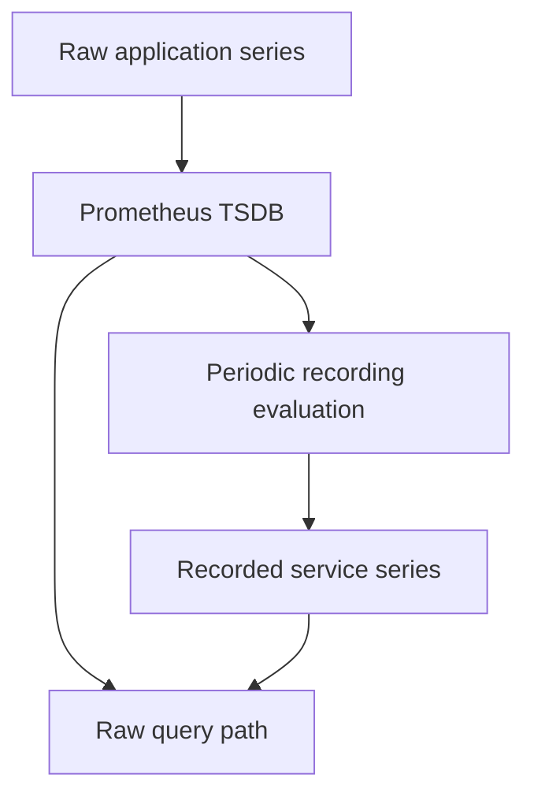

# Lab 16: Recording Rules and Query Cost

## Purpose and Scope

> **Primary Objective:** Precompute stable service-level RED queries, verify their output, and measure the tradeoff between query work and background rule work.

The earlier labs established the raw metric contracts and exporter boundaries. Repeating the same rate and aggregation expressions across many panels wastes query work and makes definitions drift.

This lab introduces six recording rules and tests them against deterministic counter/histogram inputs. You will compare raw and recorded results at the same evaluation time and inspect the rule engine's own health. No Grafana, alert rules or new telemetry transport is introduced here.

## 1. Inherited State and Starting Checks

```bash
source lab-notes/session.sh
source lab-notes/evidence.sh
source lab-notes/raw-metrics.sh
source lab-notes/metrics-session.sh
metrics_check
start_lab 16
```

Complete [Lab 15](Lab-15.md) first. Run commands from the repository root in the same Bash session. Keep the existing credentials, named volumes and checkpoint item. Seven services and five scrape jobs should be healthy. Prometheus stays pinned to `3.14.0`; use its bundled `promtool` so validation matches runtime.

## 2. Learning Objectives and Architecture

You will choose stable output labels, calculate rates before aggregation, preserve histogram boundaries, inspect generated series, compare query statistics, and reject an invalid candidate before it reaches runtime.



Configuration loading, scrape completion and rule evaluation are different operational events. A recorded value is another time-series sample, not a copied application request or an additional application export pipeline.

## 3. Choose the Output Contract

Each rule retains environment, service, normalized route and HTTP method. The status-specific rule also keeps status code; histogram buckets retain `le`. Instance and job disappear when the source is aggregated.

The names end with `rate2m` because their values already represent rates over two minutes. They are gauges, even though they are derived from counters. Do not apply `rate` to them again.

Always calculate `rate` on each source counter before summing. Otherwise a reset on one process can be hidden by growth on another. Aggregate bucket rates before calculating a service percentile; averaging process percentiles is not equivalent.

## 4. Install the Recording Rules

```bash
cat > lab-notes/prometheus/recording-rules.yml <<'YAML'
groups:
- name: fastapi-red
  interval: 15s
  limit: 2000
  rules:
  - record: service_route_status:application_http_requests:rate2m
    expr: sum by (environment, service, route, method, status_code) (rate(application_http_requests_total{job="fastapi"}[2m]))
  - record: service_route:application_http_requests:rate2m
    expr: sum by (environment, service, route, method) (rate(application_http_requests_total{job="fastapi"}[2m]))
  - record: service_route:application_http_server_errors:rate2m
    expr: sum by (environment, service, route, method) (rate(application_http_server_errors_total{job="fastapi"}[2m]))
  - record: service_route:application_http_request_duration_seconds_bucket:rate2m
    expr: sum by (environment, service, route, method, le) (rate(application_http_request_duration_seconds_bucket{job="fastapi"}[2m]))
  - record: service_route:application_http_request_duration_seconds_sum:rate2m
    expr: sum by (environment, service, route, method) (rate(application_http_request_duration_seconds_sum{job="fastapi"}[2m]))
  - record: service_route:application_http_request_duration_seconds_count:rate2m
    expr: sum by (environment, service, route, method) (rate(application_http_request_duration_seconds_count{job="fastapi"}[2m]))
YAML
```

## 5. Connect the Rules Without Losing Exporter Jobs

```bash
cat > lab-notes/prometheus/prometheus.yml <<'YAML'
global:
  scrape_interval: 15s
  scrape_timeout: 5s
  evaluation_interval: 15s
scrape_configs:
- job_name: fastapi
  metrics_path: /metrics
  file_sd_configs:
  - files:
    - /etc/prometheus/labs/app-targets.json
    refresh_interval: 5s
- job_name: prometheus
  static_configs:
  - targets:
    - prometheus:9090
- job_name: node
  static_configs:
  - targets:
    - host-metrics:9100
- job_name: postgres
  static_configs:
  - targets:
    - postgres-exporter:9187
- job_name: redis
  static_configs:
  - targets:
    - redis-exporter:9121
rule_files:
- /etc/prometheus/labs/recording-rules.yml
YAML
```

```bash
chmod 644 lab-notes/prometheus/recording-rules.yml lab-notes/prometheus/prometheus.yml
record_change "load_six_red_recording_rules" planned
reload_prometheus
wait_target fastapi up
api -fsS "$PROM_URL/api/v1/rules?type=record" > "$LAB_DIR/loaded-rules.json"
jq '.data.groups[].rules[] | {name,health,lastError,evaluationTime}' "$LAB_DIR/loaded-rules.json"
```

This complete configuration preserves FastAPI, Prometheus, Node Exporter, PostgreSQL Exporter and Redis Exporter. Only the explicit recording-rule path is added. Allow one evaluation interval before interpreting health/results.

The 2,000-series rule-group limit is a defensive bound. If a rule exceeds its output limit, Prometheus discards that rule's output for the evaluation; it does not produce a trustworthy truncated aggregate. See [recording-rule configuration](https://prometheus.io/docs/prometheus/latest/configuration/recording_rules/).

## 6. Install and Execute the Rule Tests

```bash
cat > lab-notes/prometheus/recording-tests.yml <<'YAML'
rule_files: [recording-rules.yml]
evaluation_interval: 15s
fuzzy_compare: true
tests:
  - name: aggregate rates and retain histogram boundaries
    interval: 15s
    input_series:
      - series: 'application_http_requests_total{job="fastapi",environment="local",service="fastapi-items",route="/api/v1/items",method="GET",status_code="200"}'
        values: '0+75x12'
      - series: 'application_http_requests_total{job="fastapi",environment="local",service="fastapi-items",route="/api/v1/items",method="GET",status_code="503"}'
        values: '0+15x12'
      - series: 'application_http_server_errors_total{job="fastapi",environment="local",service="fastapi-items",route="/api/v1/items",method="GET"}'
        values: '0+15x12'
      - series: 'application_http_request_duration_seconds_bucket{job="fastapi",environment="local",service="fastapi-items",route="/api/v1/items",method="GET",le="0.1"}'
        values: '0+45x12'
      - series: 'application_http_request_duration_seconds_bucket{job="fastapi",environment="local",service="fastapi-items",route="/api/v1/items",method="GET",le="0.5"}'
        values: '0+90x12'
      - series: 'application_http_request_duration_seconds_bucket{job="fastapi",environment="local",service="fastapi-items",route="/api/v1/items",method="GET",le="+Inf"}'
        values: '0+90x12'
    promql_expr_test:
      - expr: service_route:application_http_requests:rate2m
        eval_time: 3m
        exp_samples:
          - labels: 'service_route:application_http_requests:rate2m{environment="local",service="fastapi-items",route="/api/v1/items",method="GET"}'
            value: 6
      - expr: service_route:application_http_server_errors:rate2m
        eval_time: 3m
        exp_samples:
          - labels: 'service_route:application_http_server_errors:rate2m{environment="local",service="fastapi-items",route="/api/v1/items",method="GET"}'
            value: 1
      - expr: histogram_quantile(0.95, sum by (le) (service_route:application_http_request_duration_seconds_bucket:rate2m))
        eval_time: 3m
        exp_samples:
          - labels: '{}'
            value: 0.46
  - name: rate handles independent instance reset before aggregation
    interval: 15s
    input_series:
      - series: 'application_http_requests_total{job="fastapi",environment="local",service="fastapi-items",route="/api/v1/items",method="GET",status_code="200",instance="a"}'
        values: '0 15 30 45 60 75 15 30 45 60 75 90 105'
      - series: 'application_http_requests_total{job="fastapi",environment="local",service="fastapi-items",route="/api/v1/items",method="GET",status_code="200",instance="b"}'
        values: '0+30x12'
    promql_expr_test:
      - expr: service_route:application_http_requests:rate2m
        eval_time: 3m
        exp_samples:
          - labels: 'service_route:application_http_requests:rate2m{environment="local",service="fastapi-items",route="/api/v1/items",method="GET"}'
            value: 3
YAML
```

```bash
chmod 644 lab-notes/prometheus/recording-tests.yml
dm run --rm -T --no-deps --entrypoint promtool prometheus \
  check rules /etc/prometheus/labs/recording-rules.yml
dm run --rm -T --no-deps --entrypoint promtool prometheus \
  test rules /etc/prometheus/labs/recording-tests.yml
```

Expected: six rules validate and both fixtures pass. The first produces six requests/second, one server error/second and an interpolated p95 of 0.46 seconds. The second contains independent process counters and a reset; its aggregate remains three requests/second.

Predict these values before running the tests. These are synthetic rule inputs, not load generated against the API. The fixture checks expression semantics while the next steps verify real collection and rule loading.

## 7. Generate Enough Real Samples

```bash
for index in $(seq 1 45); do
  api -fsS "$APP_URL/api/v1/items?limit=1" >/dev/null
  sleep 1
done
pq 'service_route:application_http_requests:rate2m{route="/api/v1/items",method="GET"}' \
  > "$LAB_DIR/recorded-rate.json"
jq . "$LAB_DIR/recorded-rate.json"
```

The loop is sequential and finite. It creates at least several scrape/evaluation opportunities. Inspect the recorded labels and confirm that `job` and `instance` are absent. An empty initial rate is normal until enough samples exist; it is not the same as a measured zero.

The initial history can include earlier traffic. Do not claim exactly one request/second merely because the loop sleeps for one second: request duration and scheduler delay also contribute.

## 8. Compare the Same Expression at the Same Time

```bash
EVAL_AT=$(pq 'max(timestamp(service_route:application_http_requests:rate2m{route="/api/v1/items",method="GET"}))' \
  | jq -er '.data.result[0].value[1]')
RAW_QUERY='sum by (environment,service,route,method) (rate(application_http_requests_total{job="fastapi",route="/api/v1/items",method="GET"}[2m]))'
RECORDED_QUERY='service_route:application_http_requests:rate2m{route="/api/v1/items",method="GET"}'
api -fsS --get --data-urlencode "query=$RAW_QUERY" --data-urlencode "time=$EVAL_AT" \
  --data-urlencode stats=all "$PROM_URL/api/v1/query" > "$LAB_DIR/raw-query.json"
api -fsS --get --data-urlencode "query=$RECORDED_QUERY" --data-urlencode "time=$EVAL_AT" \
  --data-urlencode stats=all "$PROM_URL/api/v1/query" > "$LAB_DIR/recorded-query.json"
python3 - "$LAB_DIR/raw-query.json" "$LAB_DIR/recorded-query.json" <<'PYTHON'
import json, math, sys
raw, recorded = (json.load(open(p)) for p in sys.argv[1:])
def values(payload):
    return {tuple(sorted((k,v) for k,v in x["metric"].items() if k != "__name__")):float(x["value"][1]) for x in payload["data"]["result"]}
a, b = values(raw), values(recorded)
assert a and a.keys() == b.keys()
assert all(math.isclose(a[k], b[k], rel_tol=1e-9, abs_tol=1e-9) for k in a)
print("Matching values and labels at one rule evaluation timestamp")
for name, data in [("raw", raw), ("recorded", recorded)]:
    print(name, data["data"].get("stats", {}))
PYTHON
```

Querying both at “now” can compare a newly scraped source with an older recording evaluation. Using the recorded sample timestamp makes the comparison meaningful. Examine sample-processing and timing statistics rather than claiming a speedup from one noisy wall-clock measurement.

On a small VM the absolute difference may be tiny. Recording rules move repeated query work into scheduled background work and add stored series. Their value depends on query reuse and scale, not a guaranteed local benchmark multiplier.

## 9. Observe the Cost of the Rule Engine

Run these queries individually and explain their units:

```promql
prometheus_rule_group_last_duration_seconds
```

```promql
increase(prometheus_rule_evaluation_failures_total[5m])
```

```promql
increase(prometheus_rule_group_iterations_missed_total[5m])
```

Compare group duration with the 15-second interval. Repeatedly missed evaluations or errors undermine freshness even when the Prometheus process is reachable. These metrics describe Prometheus itself; they do not replace application latency measurements.

## 10. Reject a Broken Candidate Before Reload

```bash
cat > lab-notes/prometheus/invalid-candidate.yml <<'YAML'
groups:
  - name: intentionally-invalid
    rules:
      - record: learning_invalid
        expr: 'sum('
YAML
chmod 644 lab-notes/prometheus/invalid-candidate.yml
if dm run --rm -T --no-deps --entrypoint promtool prometheus \
  check rules /etc/prometheus/labs/invalid-candidate.yml > "$LAB_DIR/negative-check.txt" 2>&1; then
  printf 'Unexpected pass; inspect candidate\n' >&2
else
  printf 'Invalid candidate rejected; active configuration was not changed\n'
fi
rm lab-notes/prometheus/invalid-candidate.yml
metrics_check
record_change "recording_rules_verified_invalid_candidate_rejected" completed
```

Read the error to confirm a PromQL parse failure rather than a missing-file problem. The candidate was never named in `rule_files`, so no runtime recovery is required. This is the preferred failure boundary for a configuration typo.

## 11. Troubleshooting and Recovery

| Symptom | Check | Action |
|---|---|---|
| Recorded query is empty | Rule health and source samples | Generate bounded traffic, wait for two scrapes, remove nonexistent labels |
| Raw and recorded values differ | Evaluation timestamp | Compare the exact recorded timestamp and matching label population |
| p95 result is missing | Bucket input and `le` | Preserve `le` while summing, then calculate quantiles |
| Rule output suddenly disappears | Evaluation errors/output limit | Inspect rule API and logs; review cardinality before raising limits |
| Prometheus remains healthy but output is old | Rule duration/missed iterations | Reduce expensive work and verify freshness separately |

For an accidental runtime edit, restore the saved/reviewed valid rule file, run `promtool`, reload and inspect the rule API. Do not delete the TSDB to repair a query configuration.

## 12. Knowledge Check

1. Why rate before sum?
2. Why not rate a recorded rate?
3. What does recording cost?

### Answer Guide

1. Counter reset handling belongs to each source series.
2. The recorded value is already a rate gauge.
3. Scheduled evaluation work and additional stored output series.

## 13. Professional Scenario Exercise

A dashboard becomes slower as more replicas are added. Compare raw sample processing, recorded output cardinality and rule evaluation cost before proposing a recording rule. Explain which labels must remain for useful diagnosis.

## 14. Lab Notebook Template

Create a notebook in the evidence directory for this run:

```bash
test -e "$LAB_DIR/notebook.md" || printf '# Lab 16 Evidence\n' > "$LAB_DIR/notebook.md"
```

Use these headings and fill them with your predictions, commands, observed results and conclusions:

```markdown
# Lab 16 Evidence

## Starting state and operational question
## Prediction before the change
## Commands and timestamps
## Observed results and source evidence
## Unexpected findings and troubleshooting
## Recovery proof and remaining limitations
```

## 15. Observable Completion Criteria

- [ ] Six real recording rules are loaded and healthy.
- [ ] Counter-reset and histogram fixtures pass.
- [ ] Raw and recorded results match at one evaluation time.
- [ ] Query statistics and rule-engine cost are recorded.
- [ ] Seven services and five jobs remain healthy.

## 16. Production Implications

Treat recorded metrics as maintained APIs. Review labels, units, evaluation cadence, history availability and freshness. New rules do not backfill historical values automatically.

## 17. End State and Transition

Keep seven services and the six recording rules. [Lab 17](Lab-17.md) controls target metadata and ingestion before more telemetry reaches storage.
