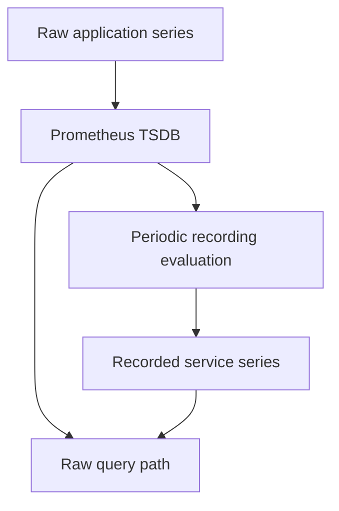

# Lab 16: Recording Rules and Query Cost

## 1. Purpose and Learning Outcomes

You will save repeated request-rate, error, and duration calculations as Prometheus recording rules. A recording rule runs a query on a schedule and stores the result as a new series. You will define the result's labels and units, test its calculations, and compare it with the original query at the same time. Then you will examine the work saved in queries and the background work added by the rules.

> **Primary Objective:** Calculate stable service-level RED results in advance, verify them, and compare the query work they save with the scheduled rule work they require.

Earlier labs established what the raw metrics and exporters measure. Repeating the same rate and grouping expressions across many panels uses extra query work and makes it easier for slightly different definitions to develop.

This lab adds six recording rules and tests them with fixed counter and histogram samples. You will compare raw and recorded results at the same evaluation time and check the rule engine's health. Grafana, alert rules, and new telemetry transport are outside this lab.

## 2. Starting Point and Lab Map

Open the complete application repository before using this guide. Unless a step says otherwise, run commands in Bash from the repository's top-level folder. Follow the starting checks in order because later commands depend on the helper functions and running services they prepare.

Read each explanation before running its commands. Run one complete code block, check the result, and then continue. In your notebook, save the commands, what happened, why you think it happened, and anything that differed from the expected result.

### Key Terms

| **Term**            | **Explanation**                                                                   |
| ------------------- | --------------------------------------------------------------------------------- |
| Recording rule      | A query that runs on a schedule and saves its result as a new time series.        |
| Output contract     | The agreed name, labels, units, and meaning of the saved result.                  |
| Evaluation interval | How often a rule group runs; this is separate from how often targets are scraped. |

### Lab Map

The arrows show how the parts connect and where a request can take different paths. Use this map to understand the design. It is not a recording of a request that actually ran.


```mermaid
flowchart TD
    A["Raw application series"] --> P["Prometheus TSDB"]
    P --> R["Periodic recording evaluation"]
    R --> S["Recorded service series"]
    P --> Q["Raw query path"]
    S --> Q
```

## 3. Guided Walkthrough

### Step 01. Inherited State and Starting Checks

**What You Are Doing:** Check the full exporter stage before adding rules. The rules need the existing source metrics and labels to be collected correctly.

**Practical Walkthrough:** Check every scrape job and required metric family before installing rules. A recording rule uses data already collected; it cannot repair a missing exporter or an incorrect source selector. Confirm the expected labels are still present and save a current baseline for comparison.

Check source metrics and target health first. A rule can only calculate from the data its selector finds. If that selector is empty, investigate collection and labels. Installing a rule does not create the missing measurements.

```bash
source lab-notes/session.sh
source lab-notes/evidence.sh
source lab-notes/raw-metrics.sh
source lab-notes/metrics-session.sh
metrics_check
start_lab 16
```

Complete [Lab 15](Lab-15.md) first. Use the repository root and the same Bash session. Keep the credentials, named volumes, and checkpoint item. All seven services and five scrape jobs should be healthy. Keep Prometheus at `3.14.0` and validate with its bundled `promtool` so the checker matches the running version.

**Understanding the Result:** Useful calculated output needs healthy input collection. Find missing source data before investigating the rule's arithmetic.

### Step 02. Learning Objectives and Architecture

**What You Are Doing:** Follow raw samples into a scheduled calculation and then into a query of its saved result. Calculating in advance moves work into the rule engine and adds another timing delay to consider.

**Practical Walkthrough:** Follow a measurement through scraping, scheduled rule evaluation, and a later query. The rule stores a calculated result at its evaluation time. This can save repeated dashboard calculations, but a new source observation may not appear in the recorded result until the next rule run.

Track when the source event occurred, when it was scraped, and when the rule evaluated it. A recorded series is a scheduled calculation, so it may lag a new raw query. This timing difference matters when comparing their results fairly.

You will choose stable output labels, calculate counter rates before combining series, keep histogram boundaries, inspect the generated results, and compare query statistics. You will also reject an invalid candidate before loading it into the running server.

The lab map in Section 2 shows this relationship.

Loading configuration, completing a scrape, and evaluating rules are separate events. A recorded value is a new time-series sample calculated from existing data. It is not a copy of an application request or another application export path.

**Understanding the Result:** Recorded metrics add another observation stage. Use their timestamps when comparing them with the original expression.

### Step 03. Choose the Output Contract

**What You Are Doing:** Choose which labels the saved result must keep. This lab deliberately combines instances, while retaining route, method, and histogram boundaries for later questions.

**Practical Walkthrough:** Review each proposed output label and the questions it helps answer. Combining instances removes individual-instance detail. Keeping route and method supports request analysis. Histogram recordings must keep bucket boundaries until the percentile is calculated. Write down these labels and units before writing the rules.

Record each rule's unit and retained labels beside its name. Identify which detail you deliberately remove by aggregation. Keep `le` on classic histogram buckets until the quantile calculation; a descriptive metric name cannot replace missing bucket boundaries.

Each rule keeps environment, service, normalized route, and HTTP method. The status-specific rule also keeps status code, while histogram buckets keep `le`. Aggregation removes instance and job from the output.

The names end in `rate2m` because the values already represent rates over two minutes. These results are gauges even though the inputs are counters. Do not apply `rate` to them again.

Apply `rate` to each original counter before summing, so growth in one process cannot hide another process's reset. For a service percentile, combine bucket rates first. Averaging process percentiles does not produce the same distribution.

**Understanding the Result:** Once a label is removed, the recorded result cannot recover that detail. Keep the labels needed to answer the questions promised by the rule.

### Step 04. Install the Recording Rules

**What You Are Doing:** Install the complete rules with the intended names and expressions. Understand each output as a calculated measurement whose units come from the calculation.

**Practical Walkthrough:** Read each full expression from source selection through calculation to saved output. Handle counter resets before combining series, as in earlier labs. The metric name is a naming convention; the expression determines the actual units and which requests are included.

Read each expression from the inside outward and confirm that rates are calculated per original series before aggregation. Then check the output labels and units against the planned definition. A name cannot enforce meaning: correctness depends on the selector, function, window, and grouping.

```bash
cat > lab-notes/prometheus/recording-rules.yml <<'YAML'
groups:
- name: fastapi-red
  interval: 15s
  limit: 2000
  rules:
  - record: service_route_status:application_http_requests:rate2m
    expr: sum by (environment, service, route, method, status_code) (rate(application_http_requests_total{job="fastapi"}[2m]))
  - record: service_route:application_http_requests:rate2m
    expr: sum by (environment, service, route, method) (rate(application_http_requests_total{job="fastapi"}[2m]))
  - record: service_route:application_http_server_errors:rate2m
    expr: sum by (environment, service, route, method) (rate(application_http_server_errors_total{job="fastapi"}[2m]))
  - record: service_route:application_http_request_duration_seconds_bucket:rate2m
    expr: sum by (environment, service, route, method, le) (rate(application_http_request_duration_seconds_bucket{job="fastapi"}[2m]))
  - record: service_route:application_http_request_duration_seconds_sum:rate2m
    expr: sum by (environment, service, route, method) (rate(application_http_request_duration_seconds_sum{job="fastapi"}[2m]))
  - record: service_route:application_http_request_duration_seconds_count:rate2m
    expr: sum by (environment, service, route, method) (rate(application_http_request_duration_seconds_count{job="fastapi"}[2m]))
YAML
```

**Command Note:** `<<'YAML'` writes the following text literally until the closing `YAML`. Its quoted delimiter prevents Bash from expanding `$variables` in the file. File creation and execution are separate steps.

**Understanding the Result:** Check the labels and the meaning of the number. A correctly named recording can still calculate the wrong set of data.

### Step 05. Connect the Rules without Losing Exporter Jobs

**What You Are Doing:** Add the rule-file path while keeping all existing scrape jobs. A valid rule file has no effect unless the running Prometheus configuration loads it.

**Practical Walkthrough:** Add the rule reference to the active configuration without removing any scrape job. Validate the full configuration and referenced rules before loading them. Merely editing a rules file does not activate it if its path is missing from the configuration.

Confirm that the active configuration names the exact mounted rule path and retains every exporter job. Validate before reloading, then inspect the running rule API. A file on disk is only input; the running evaluations show that Prometheus actually loaded it.

```bash
cat > lab-notes/prometheus/prometheus.yml <<'YAML'
global:
  scrape_interval: 15s
  scrape_timeout: 5s
  evaluation_interval: 15s
scrape_configs:
- job_name: fastapi
  metrics_path: /metrics
  file_sd_configs:
  - files:
    - /etc/prometheus/labs/app-targets.json
    refresh_interval: 5s
- job_name: prometheus
  static_configs:
  - targets:
    - prometheus:9090
- job_name: node
  static_configs:
  - targets:
    - host-metrics:9100
- job_name: postgres
  static_configs:
  - targets:
    - postgres-exporter:9187
- job_name: redis
  static_configs:
  - targets:
    - redis-exporter:9121
rule_files:
- /etc/prometheus/labs/recording-rules.yml
YAML
```

```bash
chmod 644 lab-notes/prometheus/recording-rules.yml lab-notes/prometheus/prometheus.yml
record_change "load_six_red_recording_rules" planned
reload_prometheus
wait_target fastapi up
api -fsS "$PROM_URL/api/v1/rules?type=record" > "$LAB_DIR/loaded-rules.json"
jq '.data.groups[].rules[] | {name,health,lastError,evaluationTime}' "$LAB_DIR/loaded-rules.json"
```

This complete configuration keeps FastAPI, Prometheus, Node Exporter, PostgreSQL Exporter, and Redis Exporter. It adds only the explicit recording-rule path. Wait one evaluation interval before checking rule health and results.

The rule group's 2,000-series limit prevents unexpectedly large output. If a rule exceeds the limit, Prometheus discards that rule's output for that evaluation. It does not return a reliable partial total. See [recording-rule configuration](https://prometheus.io/docs/prometheus/latest/configuration/recording_rules/).

**Understanding the Result:** Check the loaded rule groups after the reload. A file existing on disk and that file being active are separate facts.

### Step 06. Install and Execute the Rule Tests

**What You Are Doing:** Use fixed sample fixtures to test rates, quantiles, and independent resets. These check the rule definitions without depending on live request timing.

**Practical Walkthrough:** Run the supplied fixed-time tests. Known samples make their expected calculations repeatable and reviewable. If a case fails, inspect its expression and labels before changing the expected result to fit the implementation.

Read the sample values, evaluation times, and expected output labels first. The fixtures check that independent resets are handled before aggregation. On failure, determine whether the problem is syntax, selected samples, labels, or arithmetic before editing the expected values.

```bash
cat > lab-notes/prometheus/recording-tests.yml <<'YAML'
rule_files: [recording-rules.yml]
evaluation_interval: 15s
fuzzy_compare: true
tests:
  - name: aggregate rates and retain histogram boundaries
    interval: 15s
    input_series:
      - series: 'application_http_requests_total{job="fastapi",environment="local",service="items-info",route="/api/v1/items",method="GET",status_code="200"}'
        values: '0+75x12'
      - series: 'application_http_requests_total{job="fastapi",environment="local",service="items-info",route="/api/v1/items",method="GET",status_code="503"}'
        values: '0+15x12'
      - series: 'application_http_server_errors_total{job="fastapi",environment="local",service="items-info",route="/api/v1/items",method="GET"}'
        values: '0+15x12'
      - series: 'application_http_request_duration_seconds_bucket{job="fastapi",environment="local",service="items-info",route="/api/v1/items",method="GET",le="0.1"}'
        values: '0+45x12'
      - series: 'application_http_request_duration_seconds_bucket{job="fastapi",environment="local",service="items-info",route="/api/v1/items",method="GET",le="0.5"}'
        values: '0+90x12'
      - series: 'application_http_request_duration_seconds_bucket{job="fastapi",environment="local",service="items-info",route="/api/v1/items",method="GET",le="+Inf"}'
        values: '0+90x12'
    promql_expr_test:
      - expr: service_route:application_http_requests:rate2m
        eval_time: 3m
        exp_samples:
          - labels: 'service_route:application_http_requests:rate2m{environment="local",service="items-info",route="/api/v1/items",method="GET"}'
            value: 6
      - expr: service_route:application_http_server_errors:rate2m
        eval_time: 3m
        exp_samples:
          - labels: 'service_route:application_http_server_errors:rate2m{environment="local",service="items-info",route="/api/v1/items",method="GET"}'
            value: 1
      - expr: histogram_quantile(0.95, sum by (le) (service_route:application_http_request_duration_seconds_bucket:rate2m))
        eval_time: 3m
        exp_samples:
          - labels: '{}'
            value: 0.46
  - name: rate handles independent instance reset before aggregation
    interval: 15s
    input_series:
      - series: 'application_http_requests_total{job="fastapi",environment="local",service="items-info",route="/api/v1/items",method="GET",status_code="200",instance="a"}'
        values: '0 15 30 45 60 75 15 30 45 60 75 90 105'
      - series: 'application_http_requests_total{job="fastapi",environment="local",service="items-info",route="/api/v1/items",method="GET",status_code="200",instance="b"}'
        values: '0+30x12'
    promql_expr_test:
      - expr: service_route:application_http_requests:rate2m
        eval_time: 3m
        exp_samples:
          - labels: 'service_route:application_http_requests:rate2m{environment="local",service="items-info",route="/api/v1/items",method="GET"}'
            value: 3
YAML
```

```bash
chmod 644 lab-notes/prometheus/recording-tests.yml
dm run --rm -T --no-deps --entrypoint promtool prometheus \
  check rules /etc/prometheus/labs/recording-rules.yml
dm run --rm -T --no-deps --entrypoint promtool prometheus \
  test rules /etc/prometheus/labs/recording-tests.yml
```

**Expected Result:** All six rules validate and both fixtures pass. The first gives six requests per second, one server error per second, and an estimated p95 of 0.46 seconds. The second includes separate process counters and a reset; the combined rate remains three requests per second.

Predict the values before running the tests. The inputs are synthetic samples, not traffic sent to the API. They check how the expressions work; the next steps check real collection and loading.

**Understanding the Result:** Tests confirm the rule's behavior for known inputs. Live checks must still establish that the required source data is being collected.

### Step 07. Generate Enough Real Samples

**What You Are Doing:** Generate enough traffic and allow enough scrapes for meaningful rates. Check both values and labels to confirm that the recorded output matches its definition.

**Practical Walkthrough:** Run the limited workload and allow enough scrapes and rule evaluations for the chosen windows. Inspect the returned labels too. An early empty rate may simply lack enough samples. Labels that remain wrong after sufficient history point to a grouping problem in the rule.

Give the workload time to produce source samples and scheduled rule results. Check both the numbers and their labels. Distinguish a temporary lack of history from an output definition that keeps or removes the wrong labels.

```bash
for index in $(seq 1 45); do
  api -fsS "$APP_URL/api/v1/items?limit=1" >/dev/null
  sleep 1
done
pq 'service_route:application_http_requests:rate2m{route="/api/v1/items",method="GET"}' \
  > "$LAB_DIR/recorded-rate.json"
jq . "$LAB_DIR/recorded-rate.json"
```

The loop sends requests one at a time and ends after a fixed count, giving several scrape and evaluation opportunities. Confirm that `job` and `instance` are absent from the recorded output. An initially empty rate can be normal until enough samples exist; it is not a measured zero.

The window may include earlier traffic. A one-second sleep does not establish exactly one request per second, because request duration and scheduling also take time.

**Understanding the Result:** Allow the required scrapes and evaluations to occur before interpreting the result. Refreshing a query more often does not create more source samples.

### Step 08. Compare the Same Expression at the Same Time

**What You Are Doing:** Run the original expression at the recorded sample's timestamp. This avoids comparing a newer raw calculation with an older scheduled result.

**Practical Walkthrough:** Read the timestamp of the recorded sample, then evaluate its original expression at that same time. Keep the selector and window identical. This removes differences caused only by a newer query including additional traffic.

Use the recorded sample's timestamp as the raw query's evaluation time. Also use the same selection and window. You can then compare equivalent input data instead of a previous scheduled calculation with a changing present-time query.

```bash
EVAL_AT=$(pq 'max(timestamp(service_route:application_http_requests:rate2m{route="/api/v1/items",method="GET"}))' \
  | jq -er '.data.result[0].value[1]')
RAW_QUERY='sum by (environment,service,route,method) (rate(application_http_requests_total{job="fastapi",route="/api/v1/items",method="GET"}[2m]))'
RECORDED_QUERY='service_route:application_http_requests:rate2m{route="/api/v1/items",method="GET"}'
api -fsS --get --data-urlencode "query=$RAW_QUERY" --data-urlencode "time=$EVAL_AT" \
  --data-urlencode stats=all "$PROM_URL/api/v1/query" > "$LAB_DIR/raw-query.json"
api -fsS --get --data-urlencode "query=$RECORDED_QUERY" --data-urlencode "time=$EVAL_AT" \
  --data-urlencode stats=all "$PROM_URL/api/v1/query" > "$LAB_DIR/recorded-query.json"
python3 - "$LAB_DIR/raw-query.json" "$LAB_DIR/recorded-query.json" <<'PYTHON'
import json, math, sys
raw, recorded = (json.load(open(p)) for p in sys.argv[1:])
def values(payload):
    return {tuple(sorted((k,v) for k,v in x["metric"].items() if k != "__name__")):float(x["value"][1]) for x in payload["data"]["result"]}
a, b = values(raw), values(recorded)
assert a and a.keys() == b.keys()
assert all(math.isclose(a[k], b[k], rel_tol=1e-9, abs_tol=1e-9) for k in a)
print("Matching values and labels at one rule evaluation timestamp")
for name, data in [("raw", raw), ("recorded", recorded)]:
    print(name, data["data"].get("stats", {}))
PYTHON
```

Querying both at “now” may compare newly scraped data with an older rule result. Using the recorded timestamp makes the comparison meaningful. Inspect sample-processing and timing statistics; one noisy wall-clock measurement is not enough to establish a speed improvement.

On a small VM, the timing difference may be tiny. Recording rules replace repeated query work with scheduled background work and extra stored series. Their value depends on reuse and scale; there is no guaranteed speedup factor for this local experiment.

**Understanding the Result:** Compare results at the same evaluation time. Different times can legitimately produce different values.

### Step 09. Observe the Cost of the Rule Engine

**What You Are Doing:** Check rule duration, failures, and missed evaluations. Making panel queries cheaper is not a good trade if background rules cannot keep up.

**Practical Walkthrough:** Compare rule evaluation duration, failures, and missed iterations with the configured interval. Calculating results in advance moves work into the background; it does not remove the cost. Check whether each group finishes reliably before its next run.

Use a defined window to compare group duration with the interval and inspect failures or missed runs. A quick dashboard query does not prove low total cost if the rule engine is overloaded or failing in the background.

Run each query separately and explain its unit:

```promql
prometheus_rule_group_last_duration_seconds
```

```promql
increase(prometheus_rule_evaluation_failures_total[5m])
```

```promql
increase(prometheus_rule_group_iterations_missed_total[5m])
```

Compare group evaluation duration with the 15-second interval. Repeated errors or missed runs make recorded data less fresh even if Prometheus is reachable. These metrics describe Prometheus's own work, not application latency.

**Understanding the Result:** A fast panel may be reading delayed background output. Rule health and result freshness are part of whether the recording is useful.

### Step 10. Reject a Broken Candidate Before Reload

**What You Are Doing:** Check a deliberately broken candidate before loading it. Verify that validation catches the intended syntax error while the running rules remain unchanged.

**Practical Walkthrough:** Create the invalid candidate separately from the active rules. Read the validation error to confirm it found the intended defect. Then check that the running rules are healthy. This demonstrates how validation can prevent a bad file from affecting current results.

Keep the invalid candidate at its separate path and confirm why the validator rejects it. Do not replace the active file. Check current rule health and output afterward to show that the approved configuration continued working.

```bash
cat > lab-notes/prometheus/invalid-candidate.yml <<'YAML'
groups:
  - name: intentionally-invalid
    rules:
      - record: learning_invalid
        expr: 'sum('
YAML
chmod 644 lab-notes/prometheus/invalid-candidate.yml
if dm run --rm -T --no-deps --entrypoint promtool prometheus \
  check rules /etc/prometheus/labs/invalid-candidate.yml > "$LAB_DIR/negative-check.txt" 2>&1; then
  printf 'Unexpected pass; inspect candidate\n' >&2
else
  printf 'Invalid candidate rejected; active configuration was not changed\n'
fi
rm lab-notes/prometheus/invalid-candidate.yml
metrics_check
record_change "recording_rules_verified_invalid_candidate_rejected" completed
```

Read the error and confirm it is a PromQL parse failure, not a missing-file error. The candidate was never listed in `rule_files`, so the running system needs no recovery. Catching a configuration typo here is preferable to loading it.

**Understanding the Result:** The expected failure is in the candidate check. There is no need to load the broken file into the active system to repeat it.

## 4. Troubleshooting and Diagnosis

Begin with the first result that differed from your prediction. Save the exact error or symptom and identify which service or command produced it. Use the checks below, make the needed fix, and repeat the original check to confirm the problem is resolved.

### Troubleshooting and Recovery

| **Symptom**                                  | **Check**                          | **Action**                                                                              |
| -------------------------------------------- | ---------------------------------- | --------------------------------------------------------------------------------------- |
| Recorded query is empty                      | Rule health and source samples     | Send limited traffic, wait for two scrapes, and remove conditions on nonexistent labels |
| Raw and recorded values differ               | Evaluation timestamp               | Use the recorded sample's exact time and the same selected series                       |
| p95 result is missing                        | Bucket input and `le`              | Keep `le` when adding bucket rates, then calculate the quantile                         |
| Rule output suddenly disappears              | Evaluation errors and output limit | Inspect rule API and logs; review the number of series before raising limits            |
| Prometheus remains healthy but output is old | Rule duration and missed runs      | Reduce expensive calculations and check freshness separately                            |

If an accidental edit reaches runtime, restore the saved or reviewed valid file, run `promtool`, reload, and inspect the rule API. Do not delete the TSDB to fix a query configuration problem.

## 5. Review and Practice

Answer the questions in your own words before reading the answers. For the scenario, say what you would inspect and exactly what each result would tell you.

### Knowledge Check

1. Why rate before sum?
2. Why not rate a recorded rate?
3. What does recording cost?

#### Answer Guide

1. Each original counter needs its own reset handling before aggregation can hide its decrease.
2. The saved value is already a rate and behaves as a gauge. Applying rate again would not give the intended request rate.
3. Rules require scheduled calculation work and storage for the additional output series.

### Professional Scenario Exercise

A dashboard slows down as replicas are added. Before proposing a recording rule, compare the raw samples processed, the number of recorded output series, and the background evaluation cost. Explain which labels must remain to help diagnose problems.

## 6. Completion Checklist

Tick an item only when you can show its result or saved evidence. Finish the cleanup instructions before starting the next lab.

### Observable Completion Criteria

- [ ] All six recording rules are loaded and healthy.
- [ ] The counter-reset and histogram fixtures pass.
- [ ] Raw and recorded results agree at the same evaluation time.
- [ ] I have saved query statistics and rule-engine cost measurements.
- [ ] All seven services and five scrape jobs remain healthy.

## 7. Production Context and Next Lab

### Production Implications

Treat recorded metrics as definitions that need ongoing maintenance, like APIs. Review their labels, units, evaluation frequency, available history, and freshness. Adding a new rule does not automatically calculate and store its results for earlier history.

### End State and Transition

Keep all seven services and the six recording rules. [Lab 17](Lab-17.md) covers target metadata and ingestion controls before more telemetry is stored.
