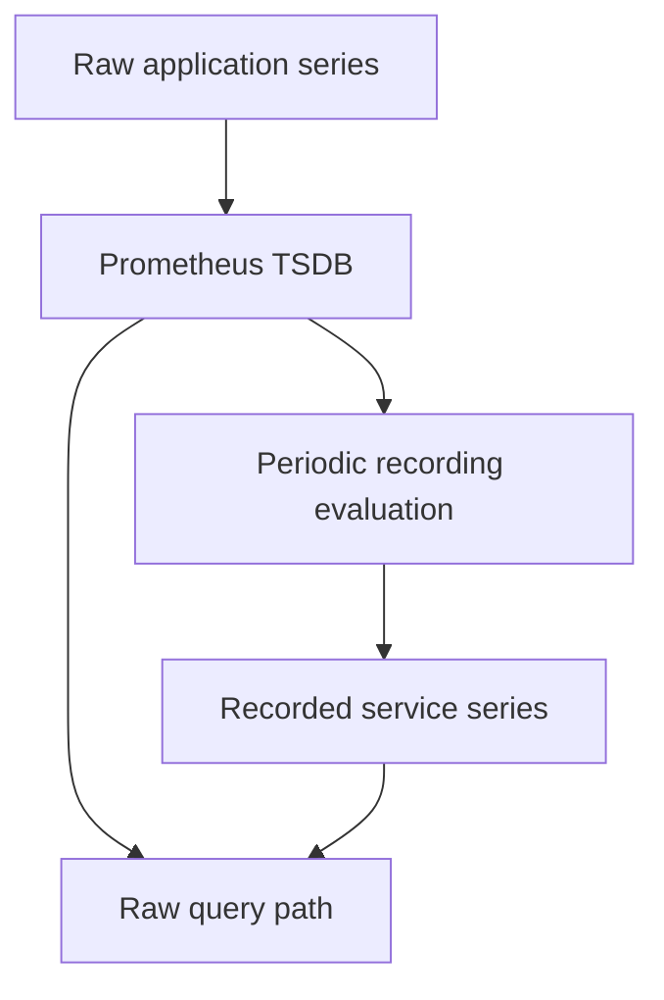

# Lab 16: Recording Rules and Query Cost

## 1. Purpose and Learning Outcomes

**In Plain Language:** You will move repeated RED calculations into Prometheus recording rules. A recording rule periodically evaluates an expression and stores its result as another series. You will define that result's labels and units, test its arithmetic, and compare it with the original expression at the same time before assessing the cost tradeoff.

> **Primary Objective:** Precompute stable service-level RED queries, verify their output, and measure the tradeoff between query work and background rule work.

The earlier labs established the raw metric contracts and exporter boundaries. Repeating the same rate and aggregation expressions across many panels wastes query work and makes definitions drift.

This lab introduces six recording rules and tests them against deterministic counter/histogram inputs. You will compare raw and recorded results at the same evaluation time and inspect the rule engine's own health. No Grafana, alert rules or new telemetry transport is introduced here.

## 2. Starting Point and Lab Map

Use this guide inside the complete application repository. Run commands from the repository root in Bash unless a step says otherwise. Work through the starting checks in order; they load the helpers and state this lab needs.

Read the explanation before each step, run one complete code block at a time, and compare the actual result with the stated expectation. Save commands, observations, explanations, and unexpected results in your notebook.

### Key Terms

| **Term**            | **Plain-Language Meaning**                                            |
| ------------------- | --------------------------------------------------------------------- |
| Recording rule      | A scheduled query whose result is saved as a new time series.         |
| Output contract     | The name, retained labels, units, and meaning of the recorded result. |
| Evaluation interval | How often a rule group runs, separate from the scrape interval.       |

### Lab Map

The arrows show the flow or dependency being studied. Branches identify paths to compare; this is a conceptual map, not a captured runtime trace.


```mermaid
flowchart TD
    A["Raw application series"] --> P["Prometheus TSDB"]
    P --> R["Periodic recording evaluation"]
    R --> S["Recorded service series"]
    P --> Q["Raw query path"]
    S --> Q
```

## 3. Guided Walkthrough

### Step 01. Inherited State and Starting Checks

**What You Are Doing:** Verify the complete exporter stage before adding rules. Recording expressions depend on the existing source names and labels being collected correctly.

**Practical Walkthrough:** Check all existing scrape jobs and source families before installing rules. Recording rules evaluate the data already collected, so they cannot repair a missing exporter or wrong metric selector. Confirm the earlier label contract is still active and retain a current baseline for comparison.

Check source families and current target health before loading derived rules. A recording rule can only calculate from available selected data. If an input selector is empty, inspect collection and label scope first; installing a rule does not create the missing underlying measurements.

```bash
source lab-notes/session.sh
source lab-notes/evidence.sh
source lab-notes/raw-metrics.sh
source lab-notes/metrics-session.sh
metrics_check
start_lab 16
```

Complete [Lab 15](Lab-15.md) first. Run commands from the repository root in the same Bash session. Keep the existing credentials, named volumes and checkpoint item. Seven services and five scrape jobs should be healthy. Prometheus stays pinned to `3.14.0`; use its bundled `promtool` so validation matches runtime.

**Understanding the Result:** Healthy input collection is necessary for meaningful derived output. Diagnose missing sources before debugging rule arithmetic.

### Step 02. Learning Objectives and Architecture

**What You Are Doing:** Follow raw samples into periodic rule output and then into queries. Precomputation changes where work happens, while introducing another freshness boundary.

**Practical Walkthrough:** Follow one raw measurement through scraping, scheduled rule evaluation, and a later query of the recorded series. The rule stores a derived result at its own evaluation time. This can reduce repeated dashboard computation while adding a delay between a new source observation and its recorded calculation.

Track three timestamps: source observation, scrape, and rule evaluation. The recorded series stores a scheduled derived value, so querying it can legitimately lag a fresh raw expression. This explains both the convenience of precomputation and the timing condition required for a fair comparison.

You will choose stable output labels, calculate rates before aggregation, preserve histogram boundaries, inspect generated series, compare query statistics, and reject an invalid candidate before it reaches runtime.

The lab map in Section 2 shows this relationship.

Configuration loading, scrape completion and rule evaluation are different operational events. A recorded value is another time-series sample, not a copied application request or an additional application export pipeline.

**Understanding the Result:** A recorded metric is another observation layer. Its timestamp matters when comparing it with the live source expression.

### Step 03. Choose the Output Contract

**What You Are Doing:** Choose which dimensions the recorded series must preserve. Dropping instance detail is intentional here, while route, method, and histogram boundaries remain necessary for later questions.

**Practical Walkthrough:** Read the proposed output labels and ask which later questions each preserves. Aggregating instances removes per-instance detail, while keeping route and method supports request analysis. Histogram recordings must retain bucket boundaries until percentile calculation. Record the intended units and dimensions before writing expressions.

Write each proposed recording's unit and retained labels beside its name. Decide which diagnostic detail is intentionally aggregated away. For classic histogram buckets, preserve `le` until the quantile calculation; removing it would discard distribution information regardless of how descriptive the output name appears.

Each rule retains environment, service, normalized route and HTTP method. The status-specific rule also keeps status code; histogram buckets retain `le`. Instance and job disappear when the source is aggregated.

The names end with `rate2m` because their values already represent rates over two minutes. They are gauges, even though they are derived from counters. Do not apply `rate` to them again.

Always calculate `rate` on each source counter before summing. Otherwise a reset on one process can be hidden by growth on another. Aggregate bucket rates before calculating a service percentile; averaging process percentiles is not equivalent.

**Understanding the Result:** Dropped dimensions cannot be recovered from the recorded result. Keep only the detail needed, but preserve enough to answer the promised questions.

### Step 04. Install the Recording Rules

**What You Are Doing:** Install the complete rule definitions with their intended names and expressions. Read each output as a derived measurement whose units follow its calculation.

**Practical Walkthrough:** Install the full rule definitions and read each expression from input selection through calculation to output name. Apply reset-aware functions before aggregation as established earlier. The output name is a convention; its actual units and population come from the expression, not from the name alone.

Read each expression inside out, checking original-series rate calculation before aggregation. Then compare the output labels and unit with the chosen contract. A recording name does not enforce meaning, so correctness depends on the actual selector, function, window, and grouping in the rule body.

```bash
cat > lab-notes/prometheus/recording-rules.yml <<'YAML'
groups:
- name: fastapi-red
  interval: 15s
  limit: 2000
  rules:
  - record: service_route_status:application_http_requests:rate2m
    expr: sum by (environment, service, route, method, status_code) (rate(application_http_requests_total{job="fastapi"}[2m]))
  - record: service_route:application_http_requests:rate2m
    expr: sum by (environment, service, route, method) (rate(application_http_requests_total{job="fastapi"}[2m]))
  - record: service_route:application_http_server_errors:rate2m
    expr: sum by (environment, service, route, method) (rate(application_http_server_errors_total{job="fastapi"}[2m]))
  - record: service_route:application_http_request_duration_seconds_bucket:rate2m
    expr: sum by (environment, service, route, method, le) (rate(application_http_request_duration_seconds_bucket{job="fastapi"}[2m]))
  - record: service_route:application_http_request_duration_seconds_sum:rate2m
    expr: sum by (environment, service, route, method) (rate(application_http_request_duration_seconds_sum{job="fastapi"}[2m]))
  - record: service_route:application_http_request_duration_seconds_count:rate2m
    expr: sum by (environment, service, route, method) (rate(application_http_request_duration_seconds_count{job="fastapi"}[2m]))
YAML
```

**Command Note:** `<<'YAML'` writes the following block literally until `YAML`. Quoting the delimiter prevents Bash from expanding `$variables` inside the generated file; creation and execution are separate steps.

**Understanding the Result:** Check both label shape and numeric meaning. A correctly named recording can still contain an incorrectly scoped calculation.

### Step 05. Connect the Rules without Losing Exporter Jobs

**What You Are Doing:** Add the rule-file path without discarding existing scrape jobs. A valid rule is useful only if the active Prometheus configuration actually loads it.

**Practical Walkthrough:** Add the rule-file reference to the active Prometheus configuration while keeping every existing scrape job. Validate the complete file and its referenced rules before loading it. Editing a valid rules file has no runtime effect if the active configuration does not include that path.

Confirm the active configuration references the exact mounted rule path and still includes every exporter job. Validate the complete configuration before reload, then inspect the running rule API. A correct file on disk is only an input; runtime evaluation proves the rule set was actually loaded.

```bash
cat > lab-notes/prometheus/prometheus.yml <<'YAML'
global:
  scrape_interval: 15s
  scrape_timeout: 5s
  evaluation_interval: 15s
scrape_configs:
- job_name: fastapi
  metrics_path: /metrics
  file_sd_configs:
  - files:
    - /etc/prometheus/labs/app-targets.json
    refresh_interval: 5s
- job_name: prometheus
  static_configs:
  - targets:
    - prometheus:9090
- job_name: node
  static_configs:
  - targets:
    - host-metrics:9100
- job_name: postgres
  static_configs:
  - targets:
    - postgres-exporter:9187
- job_name: redis
  static_configs:
  - targets:
    - redis-exporter:9121
rule_files:
- /etc/prometheus/labs/recording-rules.yml
YAML
```

```bash
chmod 644 lab-notes/prometheus/recording-rules.yml lab-notes/prometheus/prometheus.yml
record_change "load_six_red_recording_rules" planned
reload_prometheus
wait_target fastapi up
api -fsS "$PROM_URL/api/v1/rules?type=record" > "$LAB_DIR/loaded-rules.json"
jq '.data.groups[].rules[] | {name,health,lastError,evaluationTime}' "$LAB_DIR/loaded-rules.json"
```

This complete configuration preserves FastAPI, Prometheus, Node Exporter, PostgreSQL Exporter and Redis Exporter. Only the explicit recording-rule path is added. Allow one evaluation interval before interpreting health/results.

The 2,000-series rule-group limit is a defensive bound. If a rule exceeds its output limit, Prometheus discards that rule's output for the evaluation; it does not produce a trustworthy truncated aggregate. See [recording-rule configuration](https://prometheus.io/docs/prometheus/latest/configuration/recording_rules/).

**Understanding the Result:** Confirm loaded rule groups afterward. File presence and successful runtime loading are separate facts.

### Step 06. Install and Execute the Rule Tests

**What You Are Doing:** Run deterministic fixtures for expected rates, quantiles, and independent resets. They test the rule contract without relying on live workload timing.

**Practical Walkthrough:** Run the provided fixed-time fixtures for rates, quantiles, and independent counter resets. Their controlled samples remove live timing variability and make the expected output reviewable. If a case fails, inspect the expression and fixture labels before changing expected values to match the implementation.

Read fixture sample values, evaluation times, and expected labels before running the tests. Independent counter resets should be handled before aggregation, and the fixtures make that arithmetic reproducible. If a case fails, identify whether the error concerns parsing, sample selection, labels, or calculated values before editing expectations.

```bash
cat > lab-notes/prometheus/recording-tests.yml <<'YAML'
rule_files: [recording-rules.yml]
evaluation_interval: 15s
fuzzy_compare: true
tests:
  - name: aggregate rates and retain histogram boundaries
    interval: 15s
    input_series:
      - series: 'application_http_requests_total{job="fastapi",environment="local",service="items-info",route="/api/v1/items",method="GET",status_code="200"}'
        values: '0+75x12'
      - series: 'application_http_requests_total{job="fastapi",environment="local",service="items-info",route="/api/v1/items",method="GET",status_code="503"}'
        values: '0+15x12'
      - series: 'application_http_server_errors_total{job="fastapi",environment="local",service="items-info",route="/api/v1/items",method="GET"}'
        values: '0+15x12'
      - series: 'application_http_request_duration_seconds_bucket{job="fastapi",environment="local",service="items-info",route="/api/v1/items",method="GET",le="0.1"}'
        values: '0+45x12'
      - series: 'application_http_request_duration_seconds_bucket{job="fastapi",environment="local",service="items-info",route="/api/v1/items",method="GET",le="0.5"}'
        values: '0+90x12'
      - series: 'application_http_request_duration_seconds_bucket{job="fastapi",environment="local",service="items-info",route="/api/v1/items",method="GET",le="+Inf"}'
        values: '0+90x12'
    promql_expr_test:
      - expr: service_route:application_http_requests:rate2m
        eval_time: 3m
        exp_samples:
          - labels: 'service_route:application_http_requests:rate2m{environment="local",service="items-info",route="/api/v1/items",method="GET"}'
            value: 6
      - expr: service_route:application_http_server_errors:rate2m
        eval_time: 3m
        exp_samples:
          - labels: 'service_route:application_http_server_errors:rate2m{environment="local",service="items-info",route="/api/v1/items",method="GET"}'
            value: 1
      - expr: histogram_quantile(0.95, sum by (le) (service_route:application_http_request_duration_seconds_bucket:rate2m))
        eval_time: 3m
        exp_samples:
          - labels: '{}'
            value: 0.46
  - name: rate handles independent instance reset before aggregation
    interval: 15s
    input_series:
      - series: 'application_http_requests_total{job="fastapi",environment="local",service="items-info",route="/api/v1/items",method="GET",status_code="200",instance="a"}'
        values: '0 15 30 45 60 75 15 30 45 60 75 90 105'
      - series: 'application_http_requests_total{job="fastapi",environment="local",service="items-info",route="/api/v1/items",method="GET",status_code="200",instance="b"}'
        values: '0+30x12'
    promql_expr_test:
      - expr: service_route:application_http_requests:rate2m
        eval_time: 3m
        exp_samples:
          - labels: 'service_route:application_http_requests:rate2m{environment="local",service="items-info",route="/api/v1/items",method="GET"}'
            value: 3
YAML
```

```bash
chmod 644 lab-notes/prometheus/recording-tests.yml
dm run --rm -T --no-deps --entrypoint promtool prometheus \
  check rules /etc/prometheus/labs/recording-rules.yml
dm run --rm -T --no-deps --entrypoint promtool prometheus \
  test rules /etc/prometheus/labs/recording-tests.yml
```

**Expected Result:** six rules validate and both fixtures pass. The first produces six requests/second, one server error/second and an interpolated p95 of 0.46 seconds. The second contains independent process counters and a reset; its aggregate remains three requests/second.

Predict these values before running the tests. These are synthetic rule inputs, not load generated against the API. The fixture checks expression semantics while the next steps verify real collection and rule loading.

**Understanding the Result:** Tests validate the stated rule contract for known inputs. Live checks still need to verify that those inputs are actually collected.

### Step 07. Generate Enough Real Samples

**What You Are Doing:** Generate enough traffic and scrape opportunities for meaningful live rates. Inspect the recorded labels as well as the values to verify the output contract.

**Practical Walkthrough:** Generate the bounded traffic and allow enough scrapes and rule evaluations for the selected rate windows. Inspect output labels as well as values. An early empty rate can reflect insufficient samples, whereas a persistent wrong label set indicates the output contract was not implemented as intended.

Allow the bounded workload to produce enough scrapes and scheduled evaluations for the rate window. Inspect both recorded values and their dimensions. An early empty result can reflect insufficient history; a wrong label set after adequate history points to the rule's aggregation contract.

```bash
for index in $(seq 1 45); do
  api -fsS "$APP_URL/api/v1/items?limit=1" >/dev/null
  sleep 1
done
pq 'service_route:application_http_requests:rate2m{route="/api/v1/items",method="GET"}' \
  > "$LAB_DIR/recorded-rate.json"
jq . "$LAB_DIR/recorded-rate.json"
```

The loop is sequential and finite. It creates at least several scrape/evaluation opportunities. Inspect the recorded labels and confirm that `job` and `instance` are absent. An empty initial rate is normal until enough samples exist; it is not the same as a measured zero.

The initial history can include earlier traffic. Do not claim exactly one request/second merely because the loop sleeps for one second: request duration and scheduler delay also contribute.

**Understanding the Result:** Wait for the necessary observation cadence, then assess meaning. Repeatedly refreshing the query does not create more source samples.

### Step 08. Compare the Same Expression at the Same Time

**What You Are Doing:** Evaluate the source expression at the recorded result's timestamp. This avoids comparing a newer raw observation with an older scheduled calculation.

**Practical Walkthrough:** Take the timestamp of a recorded result and evaluate its source expression at that same time. Keep selector and window identical. This removes the common mismatch caused by comparing an older scheduled recording with a newer calculation that includes additional traffic.

Use the recorded sample's timestamp as the evaluation time for the raw expression. Keep the selector and window identical as well. This compares equivalent inputs instead of comparing a scheduled earlier value with a moving present-time query that may include additional requests.

```bash
EVAL_AT=$(pq 'max(timestamp(service_route:application_http_requests:rate2m{route="/api/v1/items",method="GET"}))' \
  | jq -er '.data.result[0].value[1]')
RAW_QUERY='sum by (environment,service,route,method) (rate(application_http_requests_total{job="fastapi",route="/api/v1/items",method="GET"}[2m]))'
RECORDED_QUERY='service_route:application_http_requests:rate2m{route="/api/v1/items",method="GET"}'
api -fsS --get --data-urlencode "query=$RAW_QUERY" --data-urlencode "time=$EVAL_AT" \
  --data-urlencode stats=all "$PROM_URL/api/v1/query" > "$LAB_DIR/raw-query.json"
api -fsS --get --data-urlencode "query=$RECORDED_QUERY" --data-urlencode "time=$EVAL_AT" \
  --data-urlencode stats=all "$PROM_URL/api/v1/query" > "$LAB_DIR/recorded-query.json"
python3 - "$LAB_DIR/raw-query.json" "$LAB_DIR/recorded-query.json" <<'PYTHON'
import json, math, sys
raw, recorded = (json.load(open(p)) for p in sys.argv[1:])
def values(payload):
    return {tuple(sorted((k,v) for k,v in x["metric"].items() if k != "__name__")):float(x["value"][1]) for x in payload["data"]["result"]}
a, b = values(raw), values(recorded)
assert a and a.keys() == b.keys()
assert all(math.isclose(a[k], b[k], rel_tol=1e-9, abs_tol=1e-9) for k in a)
print("Matching values and labels at one rule evaluation timestamp")
for name, data in [("raw", raw), ("recorded", recorded)]:
    print(name, data["data"].get("stats", {}))
PYTHON
```

Querying both at “now” can compare a newly scraped source with an older recording evaluation. Using the recorded sample timestamp makes the comparison meaningful. Examine sample-processing and timing statistics rather than claiming a speedup from one noisy wall-clock measurement.

On a small VM the absolute difference may be tiny. Recording rules move repeated query work into scheduled background work and add stored series. Their value depends on query reuse and scale, not a guaranteed local benchmark multiplier.

**Understanding the Result:** Agreement at aligned evaluation time is the relevant comparison. Different evaluation times can legitimately yield different results.

### Step 09. Observe the Cost of the Rule Engine

**What You Are Doing:** Inspect rule evaluation duration, errors, and missed work. A cheaper dashboard query can still be a poor trade if background evaluations cannot remain timely.

**Practical Walkthrough:** Inspect rule evaluation duration, failures, and missed iterations alongside the configured evaluation interval. Precomputation moves work into the background; it does not make that work free. Determine whether groups complete reliably before their next scheduled run instead of judging cost only by dashboard responsiveness.

Compare evaluation duration with the group interval and inspect failures or missed iterations over a defined window. Rules reduce repeated downstream calculation by performing work periodically. A quick dashboard query does not demonstrate low total cost if the background evaluator is overloaded or failing.

Run these queries individually and explain their units:

```promql
prometheus_rule_group_last_duration_seconds
```

```promql
increase(prometheus_rule_evaluation_failures_total[5m])
```

```promql
increase(prometheus_rule_group_iterations_missed_total[5m])
```

Compare group duration with the 15-second interval. Repeatedly missed evaluations or errors undermine freshness even when the Prometheus process is reachable. These metrics describe Prometheus itself; they do not replace application latency measurements.

**Understanding the Result:** A fast panel can hide delayed background output. Rule health and freshness are part of the operational contract.

### Step 10. Reject a Broken Candidate Before Reload

**What You Are Doing:** Validate a deliberately broken candidate before loading it. Confirm that the validator rejected the intended syntax error and that the running rules stayed unchanged.

**Practical Walkthrough:** Create and validate the deliberately invalid candidate without replacing the active rules. Read the validator error to confirm it rejected the intended defect. Then check the running rule set remains healthy, demonstrating that preflight validation can prevent a bad candidate from affecting current output.

Keep the invalid candidate at its separate path and confirm the validator rejects the intended defect. Do not replace the active rules with it. Afterward, check current rule health and output so the experiment demonstrates prevention of a bad deployment while the approved configuration continues operating.

```bash
cat > lab-notes/prometheus/invalid-candidate.yml <<'YAML'
groups:
  - name: intentionally-invalid
    rules:
      - record: learning_invalid
        expr: 'sum('
YAML
chmod 644 lab-notes/prometheus/invalid-candidate.yml
if dm run --rm -T --no-deps --entrypoint promtool prometheus \
  check rules /etc/prometheus/labs/invalid-candidate.yml > "$LAB_DIR/negative-check.txt" 2>&1; then
  printf 'Unexpected pass; inspect candidate\n' >&2
else
  printf 'Invalid candidate rejected; active configuration was not changed\n'
fi
rm lab-notes/prometheus/invalid-candidate.yml
metrics_check
record_change "recording_rules_verified_invalid_candidate_rejected" completed
```

Read the error to confirm a PromQL parse failure rather than a missing-file problem. The candidate was never named in `rule_files`, so no runtime recovery is required. This is the preferred failure boundary for a configuration typo.

**Understanding the Result:** The expected failure belongs to the candidate check. Do not load the broken file merely to reproduce the same error in production state.

## 4. Troubleshooting and Diagnosis

Start with the first unexpected result. Record the exact symptom, identify which component produced it, and use the checks below before repeating the experiment. After a fix, repeat the original check and confirm recovery.

### Troubleshooting and Recovery

| **Symptom**                                  | **Check**                       | **Action**                                                                |
| -------------------------------------------- | ------------------------------- | ------------------------------------------------------------------------- |
| Recorded query is empty                      | Rule health and source samples  | Generate bounded traffic, wait for two scrapes, remove nonexistent labels |
| Raw and recorded values differ               | Evaluation timestamp            | Compare the exact recorded timestamp and matching label population        |
| p95 result is missing                        | Bucket input and `le`           | Preserve `le` while summing, then calculate quantiles                     |
| Rule output suddenly disappears              | Evaluation errors/output limit  | Inspect rule API and logs; review cardinality before raising limits       |
| Prometheus remains healthy but output is old | Rule duration/missed iterations | Reduce expensive work and verify freshness separately                     |

For an accidental runtime edit, restore the saved/reviewed valid rule file, run `promtool`, reload and inspect the rule API. Do not delete the TSDB to repair a query configuration.

## 5. Review and Practice

Answer the knowledge questions in your own words before reading the answer guide. For the scenario, name the evidence you would collect and the conclusion each observation would support.

### Knowledge Check

1. Why rate before sum?
2. Why not rate a recorded rate?
3. What does recording cost?

#### Answer Guide

1. Counter reset handling belongs to each source series.
2. The recorded value is already a rate gauge.
3. Scheduled evaluation work and additional stored output series.

### Professional Scenario Exercise

A dashboard becomes slower as more replicas are added. Compare raw sample processing, recorded output cardinality and rule evaluation cost before proposing a recording rule. Explain which labels must remain for useful diagnosis.

## 6. Completion Checklist

Mark each item only after you can point to its result or evidence file. Complete any cleanup shown here before moving on.

### Observable Completion Criteria

- [ ] Six real recording rules are loaded and healthy.
- [ ] Counter-reset and histogram fixtures pass.
- [ ] Raw and recorded results match at one evaluation time.
- [ ] Query statistics and rule-engine cost are recorded.
- [ ] Seven services and five jobs remain healthy.

## 7. Production Context and Next Lab

### Production Implications

Treat recorded metrics as maintained APIs. Review labels, units, evaluation cadence, history availability and freshness. New rules do not backfill historical values automatically.

### End State and Transition

Keep seven services and the six recording rules. [Lab 17](Lab-17.md) controls target metadata and ingestion before more telemetry reaches storage.
