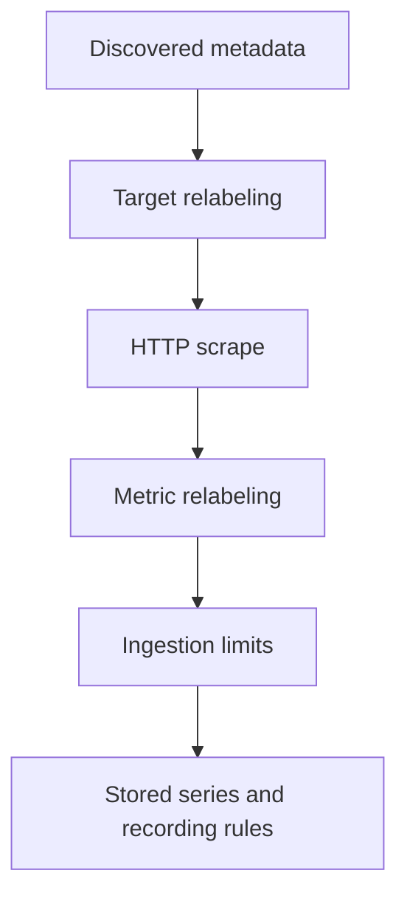

# Lab 17: Relabeling and Ingestion Guardrails

## Purpose and Scope

> **Primary Objective:** Normalize discovery metadata, reject unsafe sample dimensions, and demonstrate the difference between dropping targets, dropping samples and failing a scrape.

Labels carry meaning and create series identity. A careless relabeling rule can reduce cost while quietly destroying the evidence needed during an incident.

You will add bounded policies to the application job, test a disabled target and deliberately violate a sample limit. These changes do not alter FastAPI instrumentation or introduce duplicate metric ingestion. Other exporter jobs remain intact.

## 1. Inherited State and Starting Checks

```bash
source lab-notes/session.sh
source lab-notes/evidence.sh
source lab-notes/raw-metrics.sh
source lab-notes/metrics-session.sh
metrics_check
start_lab 17
```

Complete [Lab 16](Lab-16.md) first. Run commands from the repository root in the same Bash session. Keep the existing credentials, named volumes and checkpoint item. Expect seven services, five jobs and six healthy recording rules. Stop competing load generators during the experiments.

## 2. Learning Objectives and Pipeline Order

You will compare discovered/final labels, preserve instance identity, remove unnecessary samples, reject forbidden identifier labels and verify whole-scrape failure semantics.



Target rejection prevents an HTTP scrape. Metric relabeling acts on individual scraped samples. Limits protect ingestion but can make an entire scrape fail. Configuration changes and scrape failures are the operational events you will correlate with API behavior.

## 3. Capture the Existing Contract

```bash
cp lab-notes/prometheus/prometheus.yml "$LAB_DIR/prometheus-before.yml"
cp lab-notes/prometheus/app-targets.json "$LAB_DIR/targets-before.json"
snapshot "$LAB_DIR/raw-before.json"
api -fsS "$PROM_URL/api/v1/targets?state=any" > "$LAB_DIR/targets-before-api.json"
pq 'scrape_samples_scraped{job="fastapi"}' > "$LAB_DIR/scraped-before.json"
pq 'scrape_samples_post_metric_relabeling{job="fastapi"}' > "$LAB_DIR/retained-before.json"
```

Do not flatten every instance into a service label. Distinct instances need separate counter reset handling. Also do not “fix” high cardinality by simply dropping an identifier label from otherwise distinct samples: that can produce collisions rather than safe aggregation.

## 4. Install the Complete Policy

```bash
cat > lab-notes/prometheus/prometheus.yml <<'YAML'
global:
  scrape_interval: 15s
  scrape_timeout: 5s
  evaluation_interval: 15s
scrape_configs:
- job_name: fastapi
  metrics_path: /metrics
  file_sd_configs:
  - files:
    - /etc/prometheus/labs/app-targets.json
    refresh_interval: 5s
  sample_limit: 5000
  label_limit: 12
  label_name_length_limit: 80
  label_value_length_limit: 128
  body_size_limit: 2MB
  relabel_configs:
  - source_labels:
    - monitoring
    regex: disabled
    action: drop
  - source_labels:
    - environment
    target_label: environment
    action: lowercase
  - target_label: telemetry_role
    replacement: application
  - regex: monitoring|lab_discovery_note
    action: labeldrop
  metric_relabel_configs:
  - source_labels:
    - __name__
    regex: application_.*_created
    action: drop
  - source_labels:
    - request_id
    regex: .+
    action: drop
  - source_labels:
    - event_id
    regex: .+
    action: drop
  - source_labels:
    - item_id
    regex: .+
    action: drop
  - source_labels:
    - user_id
    regex: .+
    action: drop
  - source_labels:
    - trace_id
    regex: .+
    action: drop
- job_name: prometheus
  static_configs:
  - targets:
    - prometheus:9090
- job_name: node
  static_configs:
  - targets:
    - host-metrics:9100
- job_name: postgres
  static_configs:
  - targets:
    - postgres-exporter:9187
- job_name: redis
  static_configs:
  - targets:
    - redis-exporter:9121
rule_files:
- /etc/prometheus/labs/recording-rules.yml
YAML
```

```bash
chmod 644 lab-notes/prometheus/prometheus.yml
record_change "apply_ingestion_guardrails" planned
reload_prometheus
wait_target fastapi up
```

The application target policy drops `monitoring=disabled`, lowercases environment, adds bounded `telemetry_role=application`, and removes two temporary discovery labels. Sample policy drops application `_created` series and rejects entire samples with nonempty request/event/item/user/trace identifiers.

Those identifiers are already absent from the application metric contract. The rules defend the boundary; they do not repair a broken producer. The 5,000-sample, 12-label and length/body limits are generous for this app and intentionally not copied onto larger exporters.

Metric relabeling does not apply to automatically generated scrape series such as `up`. Limits and relabeling syntax are defined in the [Prometheus configuration reference](https://prometheus.io/docs/prometheus/latest/configuration/configuration/).

## 5. Observe Identity Changes and Dropped Samples

```bash
api -fsS "$APP_URL/api/v1/items?limit=1" >/dev/null
api -fsS "$APP_URL/metrics" > "$LAB_DIR/raw-after.prom"
rg '^application_.*_created' "$LAB_DIR/raw-after.prom"
sleep 20
pq 'scrape_samples_scraped{job="fastapi"}' | jq .
pq 'scrape_samples_post_metric_relabeling{job="fastapi"}' | jq .
pq '{job="fastapi",__name__=~"application_.*_created"}' | jq .
```

Creation-time samples still exist in producer exposition but should be absent from a current instant query after the policy takes effect. Compare scrape/post-relabel counts from the same scrape; newly instantiated route/status children can otherwise change the population.

Dropping samples saves ingestion/storage work, not the application's encoding or network transfer. Historical samples remain until retention removes them.

Adding a target label creates new source-series identities. A two-minute range can briefly contain both old and new identities, so an immediate aggregate spike is not necessarily more traffic. Let the window move beyond this change before taking a clean rate baseline.

## 6. Predict the Discovery Experiment

The next file contains one valid endpoint and one deliberately disabled wrong-port endpoint. Both carry uppercase environment and temporary metadata. Predict which becomes active, which is dropped, whether the wrong port gets an `up=0` series, and which labels survive.

## 7. Exercise Target Relabeling

```bash
python3 - "$LAB_ENVIRONMENT" "$LAB_SERVICE" <<'PYTHON'
import json, os, sys
from pathlib import Path
p=Path("lab-notes/prometheus/app-targets.json")
entries=[{"targets":["app:8000"],"labels":{"environment":sys.argv[1].upper(),"service":sys.argv[2],"lab_discovery_note":"accepted"}},
         {"targets":["app:8999"],"labels":{"environment":sys.argv[1].upper(),"service":sys.argv[2],"lab_discovery_note":"rejected","monitoring":"disabled"}}]
t=p.with_suffix(".json.new");t.write_text(json.dumps(entries,indent=2)+"\n");os.chmod(t,0o644);os.replace(t,p)
PYTHON
sleep 10
api -fsS "$PROM_URL/api/v1/targets?state=any" > "$LAB_DIR/discovery-experiment.json"
jq '.data.activeTargets[] | select(.labels.job=="fastapi") | {discoveredLabels,labels,scrapeUrl}' "$LAB_DIR/discovery-experiment.json"
jq '.data.droppedTargets[] | select(.discoveredLabels.job=="fastapi")' "$LAB_DIR/discovery-experiment.json"
api -fsS "$APP_URL/api/v1/items?limit=1" > "$LAB_DIR/business-during-discovery-test.json"
set_app_target app:8000
sleep 10
wait_target fastapi up
```

Expect the wrong-port candidate in dropped targets, with no scrape attempt and no newly generated `up=0` for it. The accepted target retains service/instance and lowercase environment while the note disappears. The business API remains independent of this discovery experiment.

If you interrupt before restoration, run `set_app_target app:8000` explicitly. The discovery directory mount makes atomic file replacement visible to Prometheus.

## 8. Predict and Force a Sample-Limit Failure

A sample limit of one is deliberately below this application's exposition size. Predict that FastAPI remains responsive while Prometheus marks the scrape down. The limit does not retain the first sample and call the scrape healthy.

## 9. Run the Bounded Limit Experiment

```bash
cp lab-notes/prometheus/prometheus.yml "$LAB_DIR/guarded-good.yml"
(
  set -euo pipefail
  trap 'cp "$LAB_DIR/guarded-good.yml" lab-notes/prometheus/prometheus.yml; chmod 644 lab-notes/prometheus/prometheus.yml; reload_prometheus >/dev/null' EXIT
  trap 'exit 130' INT
  trap 'exit 143' TERM
  python3 - <<'PYTHON'
from pathlib import Path
p=Path("lab-notes/prometheus/prometheus.yml");t=p.read_text()
assert t.count("sample_limit: 5000")==1
p.write_text(t.replace("sample_limit: 5000","sample_limit: 1"))
PYTHON
  record_change "temporary_application_sample_limit_one" planned
  reload_prometheus
  wait_target fastapi down
  api -fsS "$APP_URL/health/live" > "$LAB_DIR/live-during-rejection.json"
  api -fsS "$APP_URL/api/v1/items?limit=1" > "$LAB_DIR/business-during-rejection.json"
  api -fsS "$PROM_URL/api/v1/targets?state=active" > "$LAB_DIR/limit-failed-target.json"
  jq '.data.activeTargets[] | select(.labels.job=="fastapi") | {health,lastError}' "$LAB_DIR/limit-failed-target.json"
)
wait_target fastapi up
metrics_check
record_change "guarded_policy_restored" completed
```

The exit trap restores the valid configuration and reloads it even after an assertion failure. Inspect the target's error for a sample-limit failure, not a network timeout. Capture Prometheus logs if the error differs.

Do not interpret stale or missing application values during failed scrapes as healthy zeros. This is an observability-path outage while business traffic can still succeed.

## 10. Verify Recovery and Guard Against Accidental Data Loss

```bash
api -fsS "$PROM_URL/api/v1/rules?type=record" > "$LAB_DIR/rules-recovered.json"
pq 'up{job="fastapi"}' > "$LAB_DIR/up-recovered.json"
pq 'scrape_samples_post_metric_relabeling{job="fastapi"}' > "$LAB_DIR/samples-recovered.json"
dm logs --no-color --since 10m prometheus > "$LAB_DIR/prometheus.log"
```

Wait beyond two minutes from the label cutover, generate a few normal requests and compare the recording outputs again. Keep the valid guarded configuration for all later labs. Do not revert to the pre-policy copy during normal progression.

Review which families the dashboards/rules actually need before dropping more. A deny-list of common ID labels is defense in depth, not a complete cardinality guarantee; new unsafe dimensions can have other names.

## 11. Troubleshooting

| Symptom | Evidence | Corrective action |
|---|---|---|
| Target disappears entirely | Dropped-target discovery labels | Inspect target relabeling before testing application networking |
| Target up but family absent | Producer exposition and sample policy | Check metric drop rules and producer registration |
| Target down but API succeeds | Scrape error and limits | Restore the valid limit; keep business and scrape health separate |
| Rates spike after policy change | Old/new target-label identities | Let the range window pass the cutover before comparing |
| Exporter unexpectedly loses samples | Job scope | Keep application-specific rules scoped to the FastAPI job |

Validate before reloading. If you must restore after a mistake, restore the last known-good configuration, not the entire storage volume.

## 12. Knowledge Check

1. Why drop an entire unsafe sample rather than its ID label?
2. Why does a dropped target lack a new up=0?
3. Why can rates change after adding a label?

### Answer Guide

1. Dropping only the label can collapse distinct samples into one conflicting identity.
2. No scrape is attempted for a target rejected before scraping.
3. Series identities change and old/new samples can coexist in a range.

## 13. Professional Scenario Exercise

A new release causes the application scrape to fail at the sample limit. Decide how to distinguish a legitimate bounded expansion from an accidental request-ID label before raising the limit.

## 14. Lab Notebook Template

Create a notebook in the evidence directory for this run:

```bash
test -e "$LAB_DIR/notebook.md" || printf '# Lab 17 Evidence\n' > "$LAB_DIR/notebook.md"
```

Use these headings and fill them with your predictions, commands, observed results and conclusions:

```markdown
# Lab 17 Evidence

## Starting state and operational question
## Prediction before the change
## Commands and timestamps
## Observed results and source evidence
## Unexpected findings and troubleshooting
## Recovery proof and remaining limitations
```

## 15. Observable Completion Criteria

- [ ] Discovery normalization and target rejection are observed.
- [ ] Producer samples and retained samples are compared.
- [ ] The sample-limit failure is distinguished from a business outage.
- [ ] The valid policy and five scrape jobs are restored.

## 16. Production Implications

Relabeling is operational code that can remove evidence. Review producer contracts, cardinality, scrape failures and query dependencies together. Limits complement, rather than replace, instrumentation design.

## 17. End State and Transition

Keep seven services, five jobs and the guardrails. [Lab 18](Lab-18.md) examines the storage and capacity consequences of the samples that are retained.
