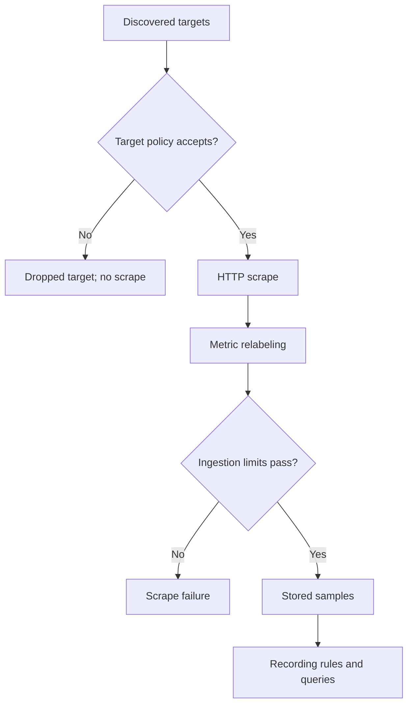

# Lab 17: Relabeling and Ingestion Guardrails

## 1. Purpose and Learning Outcomes

You will control which targets Prometheus scrapes and which returned samples it stores. Follow the stages in order: target relabeling, scraping, metric relabeling, and limits. Then test a dropped target and a failed scrape. These outcomes differ: rejecting a target, discarding one sample, and rejecting a whole scrape leave different evidence.

> **Primary Objective:** Make discovery labels consistent, reject samples carrying unsafe identifier labels, and show the difference between dropping a target, dropping samples, and failing a scrape.

Labels describe measurements and identify each series. A poorly chosen relabeling rule may reduce stored data while quietly removing information you need during an incident.

You will add limited policies to the app's scrape job, test a disabled target, and deliberately exceed a sample limit. FastAPI instrumentation stays unchanged, metrics are not ingested through a second path, and the other exporter jobs remain intact.

## 2. Starting Point and Lab Map

Open the complete application repository before using this guide. Unless a step says otherwise, run commands in Bash from the repository's top-level folder. Follow the starting checks in order because later commands depend on the helper functions and running services they prepare.

Read each explanation before running its commands. Run one complete code block, check the result, and then continue. In your notebook, save the commands, what happened, why you think it happened, and anything that differed from the expected result.

### Key Terms

| **Term**          | **Explanation**                                                                 |
| ----------------- | ------------------------------------------------------------------------------- |
| Target relabeling | Changing labels or rejecting a discovered target before making its HTTP scrape. |
| Metric relabeling | Filtering or changing scraped samples before storing them.                      |
| Sample limit      | A maximum sample count that can cause an oversized scrape to fail.              |

### Lab Map

The arrows show how the parts connect and where a request can take different paths. Use this map to understand the design. It is not a recording of a request that actually ran.


```mermaid
flowchart TD
    D["Discovered targets"] --> T{"Target policy accepts?"}
    T -->|"No"| X["Dropped target; no scrape"]
    T -->|"Yes"| S["HTTP scrape"]
    S --> M["Metric relabeling"]
    M --> L{"Ingestion limits pass?"}
    L -->|"No"| F["Scrape failure"]
    L -->|"Yes"| B["Stored samples"]
    B --> R["Recording rules and queries"]
```

## 3. Guided Walkthrough

### Step 01. Inherited State and Starting Checks

**What You Are Doing:** Start with healthy targets and recording rules, and stop unrelated workloads. Stable source behavior helps you identify changes caused by the new policy.

**Practical Walkthrough:** Verify targets and rules, then stop competing test traffic. Save current series identities before changing labels so you can recognize new series and old history afterward. This helps separate policy effects from traffic changes or process resets.

Save target and series labels before editing relabeling. Changing a label can create new series while old samples remain stored. Keep the workload and process stable so changes can be linked to the ingestion policy.

```bash
source lab-notes/session.sh
source lab-notes/evidence.sh
source lab-notes/raw-metrics.sh
source lab-notes/metrics-session.sh
metrics_check
start_lab 17
```

Complete [Lab 16](Lab-16.md) first, using the repository root and the same Bash session. Keep credentials, named volumes, and the checkpoint item. Expect seven services, five jobs, and six healthy recording rules. Stop competing load generators during the experiments.

**Understanding the Result:** You are changing collection policy. Keep the app's instruments and their meaning unchanged while observing the effect.

### Step 02. Learning Objectives and Pipeline Order

**What You Are Doing:** Follow the pipeline in execution order. A target dropped before scraping produces different evidence from a target whose scrape is attempted and fails.

**Practical Walkthrough:** Follow discovery, target relabeling, scraping, metric relabeling, and storage in order. A rule early in this path may prevent later stages from happening. Dropping a target prevents a scrape attempt. Dropping a sample happens after the endpoint has been scraped.

Identify where each rule runs. Target relabeling can prevent a scrape, while metric relabeling filters returned samples. Use this order to predict `up`, target lists, and raw endpoint output. “Drop” has different consequences at these different stages.

You will compare discovered and final labels, keep instance identities, remove unnecessary samples, reject prohibited identifier labels, and verify what happens when an entire scrape fails.

The lab map in Section 2 shows this relationship.

Rejecting a target prevents its HTTP scrape. Metric relabeling works on individual collected samples. Limits protect ingestion but can reject the whole scrape. Compare these configuration and scrape events with app behavior during the experiment.

**Understanding the Result:** Find the stage where data was removed before interpreting its absence. Missing data can have different causes at different points in the path.

### Step 03. Capture the Existing Contract

**What You Are Doing:** Save the current labels and metric definitions before changing them. Keep the identities needed to handle each process's counter resets separately.

**Practical Walkthrough:** Save example labels and the assumptions used by the recording rules. Separate instances may reset independently, so their counters need distinct identities. Do not simplify labels in a way that merges these producers before the rate calculation handles resets.

Keep the original configuration and representative labels. Identify which labels distinguish producers whose counters can reset independently. Removing these labels too early can mix incompatible histories. Check the effect on existing rule expressions before reducing labels.

```bash
cp lab-notes/prometheus/prometheus.yml "$LAB_DIR/prometheus-before.yml"
cp lab-notes/prometheus/app-targets.json "$LAB_DIR/targets-before.json"
snapshot "$LAB_DIR/raw-before.json"
api -fsS "$PROM_URL/api/v1/targets?state=any" > "$LAB_DIR/targets-before-api.json"
pq 'scrape_samples_scraped{job="fastapi"}' > "$LAB_DIR/scraped-before.json"
pq 'scrape_samples_post_metric_relabeling{job="fastapi"}' > "$LAB_DIR/retained-before.json"
```

Do not turn every instance into one service identity; each instance needs separate reset handling. Also, do not try to fix high cardinality by only removing an identifier label from otherwise distinct samples. They may then collide under the same label set instead of being safely added together.

**Understanding the Result:** Labels affect both query selection and series identity. Check downstream expressions against the new definition, not just the target display.

### Step 04. Install the Complete Policy

**What You Are Doing:** Install and validate the full policy. Identify the rules that change target labels, the rules that reject samples, and the limits that protect ingestion.

**Practical Walkthrough:** Read the purpose of each rule, then validate the resulting configuration together. Rule order and placement determine whether a target is contacted and which returned samples can be stored.

Read the policy in order and mark each rule's stage and purpose. Validate the complete configuration. Check that label normalization, sample dropping, and limits apply only to the intended jobs; a valid but overly broad rule can remove data needed by recording rules.

```bash
cat > lab-notes/prometheus/prometheus.yml <<'YAML'
global:
  scrape_interval: 15s
  scrape_timeout: 5s
  evaluation_interval: 15s
scrape_configs:
- job_name: fastapi
  metrics_path: /metrics
  file_sd_configs:
  - files:
    - /etc/prometheus/labs/app-targets.json
    refresh_interval: 5s
  sample_limit: 5000
  label_limit: 12
  label_name_length_limit: 80
  label_value_length_limit: 128
  body_size_limit: 2MB
  relabel_configs:
  - source_labels:
    - monitoring
    regex: disabled
    action: drop
  - source_labels:
    - environment
    target_label: environment
    action: lowercase
  - target_label: telemetry_role
    replacement: application
  - regex: monitoring|lab_discovery_note
    action: labeldrop
  metric_relabel_configs:
  - source_labels:
    - __name__
    regex: application_.*_created
    action: drop
  - source_labels:
    - request_id
    regex: .+
    action: drop
  - source_labels:
    - event_id
    regex: .+
    action: drop
  - source_labels:
    - item_id
    regex: .+
    action: drop
  - source_labels:
    - user_id
    regex: .+
    action: drop
  - source_labels:
    - trace_id
    regex: .+
    action: drop
- job_name: prometheus
  static_configs:
  - targets:
    - prometheus:9090
- job_name: node
  static_configs:
  - targets:
    - host-metrics:9100
- job_name: postgres
  static_configs:
  - targets:
    - postgres-exporter:9187
- job_name: redis
  static_configs:
  - targets:
    - redis-exporter:9121
rule_files:
- /etc/prometheus/labs/recording-rules.yml
YAML
```

**Command Note:** `<<'YAML'` writes the following text literally until the closing `YAML`. The quoted delimiter stops Bash from expanding `$variables` in the file. Creating the file and executing it are separate actions.

```bash
chmod 644 lab-notes/prometheus/prometheus.yml
record_change "apply_ingestion_guardrails" planned
reload_prometheus
wait_target fastapi up
```

The app target policy drops targets with `monitoring=disabled`, converts environment to lowercase, adds the fixed label `telemetry_role=application`, and removes two temporary discovery labels. The sample policy drops app `_created` series and rejects whole samples carrying nonempty request, event, item, user, or trace identifiers.

The app's metric definitions already exclude these identifiers. The rules add a collection safeguard; they do not fix faulty instrumentation. The 5,000-sample, 12-label, length, and body-size limits leave room for this app. They are intentionally not applied to larger exporters.

Metric relabeling does not process automatically generated scrape series such as `up`. See the [Prometheus configuration reference](https://prometheus.io/docs/prometheus/latest/configuration/configuration/) for limits and relabeling syntax.

**Understanding the Result:** Similar relabeling syntax can run at different stages. Keep target rules separate from sample rules when explaining their effects.

### Step 05. Observe Identity Changes and Dropped Samples

**What You Are Doing:** Compare what the producer exposes with what Prometheus stores after the policy starts. A metric can remain at the source endpoint while no longer being collected into current storage.

**Practical Walkthrough:** Inspect both current raw output and newly stored samples. A dropped metric still exists in the app's response, but this collection path should stop storing new samples for it. Use timestamps so older retained data is not mistaken for continued ingestion.

Compare source output and recent stored samples after activation. A dropped sample may still appear at the endpoint and in old history. Check times and current query results before deciding that a filter failed.

```bash
api -fsS "$APP_URL/api/v1/items?limit=1" >/dev/null
api -fsS "$APP_URL/metrics" > "$LAB_DIR/raw-after.prom"
rg '^application_.*_created' "$LAB_DIR/raw-after.prom"
sleep 20
pq 'scrape_samples_scraped{job="fastapi"}' | jq .
pq 'scrape_samples_post_metric_relabeling{job="fastapi"}' | jq .
pq '{job="fastapi",__name__=~"application_.*_created"}' | jq .
```

Creation-time samples still appear in the app's raw output, but should disappear from a current instant query after the policy takes effect. Compare scrape and post-relabel counts from the same scrape. New route or status combinations can otherwise change how many samples are present.

Dropping samples reduces ingestion and storage work. It does not save the app's work encoding those samples or the network transfer. Previously stored samples remain until retention removes them.

Adding a target label creates new series identities. For a short time, a two-minute range may contain both the old and new identities. A spike immediately after the change does not necessarily mean more traffic. Wait until the window moves past the change before taking a clean rate baseline.

**Understanding the Result:** Raw endpoint presence proves that the producer emits a sample. Recent stored presence shows that the collection policy accepted it. These are separate checks.

### Step 06. Predict the Discovery Experiment

**What You Are Doing:** Predict which fixture targets will be accepted or dropped before applying it. Decide whether the disabled target with the wrong port should be scraped at all.

**Practical Walkthrough:** Predict the result for each candidate before activating the fixture. The disabled wrong-port target tests filtering before network contact. Say whether you expect a scrape attempt and failure series, not just whether the address could be reached.

Classify each candidate as active, dropped, or scraped with a failure. The disabled wrong-port candidate tests the stage before scraping. No failed-scrape sample may be exactly the expected result when the policy prevents contact.

The next file defines one valid endpoint and one disabled endpoint with a wrong port. Both have uppercase environment values and temporary labels. Predict which becomes active, which is dropped, whether the wrong port gets an `up=0` series, and which labels remain.

**Understanding the Result:** A dropped candidate should appear in dropped-target evidence. It does not need to produce the same `up=0` sample as an active target with a bad address.

### Step 07. Exercise Target Relabeling

**What You Are Doing:** Check both active and dropped targets during the experiment. A target filtered before scraping will not generate a new failed-scrape series.

**Practical Walkthrough:** Apply the discovery fixture and inspect both target views. Check the final labels and the rule that excluded the bad candidate. Compare with your prediction, then restore normal discovery for later steps.

Read active and dropped targets together, including discovered and final labels. Explain each candidate's location using the configured rule. Restore the normal discovery file before the limit experiment so it uses the approved targets.

```bash
python3 - "$LAB_ENVIRONMENT" "$LAB_SERVICE" <<'PYTHON'
import json, os, sys
from pathlib import Path
p=Path("lab-notes/prometheus/app-targets.json")
entries=[{"targets":["app:8000"],"labels":{"environment":sys.argv[1].upper(),"service":sys.argv[2],"lab_discovery_note":"accepted"}},
         {"targets":["app:8999"],"labels":{"environment":sys.argv[1].upper(),"service":sys.argv[2],"lab_discovery_note":"rejected","monitoring":"disabled"}}]
t=p.with_suffix(".json.new");t.write_text(json.dumps(entries,indent=2)+"\n");os.chmod(t,0o644);os.replace(t,p)
PYTHON
sleep 10
api -fsS "$PROM_URL/api/v1/targets?state=any" > "$LAB_DIR/discovery-experiment.json"
jq '.data.activeTargets[] | select(.labels.job=="fastapi") | {discoveredLabels,labels,scrapeUrl}' "$LAB_DIR/discovery-experiment.json"
jq '.data.droppedTargets[] | select(.discoveredLabels.job=="fastapi")' "$LAB_DIR/discovery-experiment.json"
api -fsS "$APP_URL/api/v1/items?limit=1" > "$LAB_DIR/business-during-discovery-test.json"
set_app_target app:8000
sleep 10
wait_target fastapi up
```

Expect the wrong-port candidate in the dropped list, with no scrape attempt and no new `up=0` series. The accepted target keeps service and instance, has a lowercase environment, and loses the temporary note. This discovery test does not change the business API.

If interrupted before restoration, explicitly run `set_app_target app:8000`. Because the discovery directory is mounted, Prometheus can see the file's atomic replacement.

**Understanding the Result:** No scrape error is expected only if you also have evidence that the target was dropped before scraping.

### Step 08. Predict and Force a Sample-Limit Failure

**What You Are Doing:** Predict the effect of a sample limit that is too small. The expected result is a failed whole scrape, not a successful scrape containing only its first sample.

**Practical Walkthrough:** Predict what happens when `sample_limit` is below the endpoint's sample count. An over-limit scrape is rejected; the limit does not keep an arbitrary initial subset. Leave the endpoint unchanged so the temporary limit is the only planned cause.

Compare the proposed limit with the actual sample count first. Expect the whole scrape to fail instead of returning a successful partial result. Keep the app unchanged so you can connect the failure to the collection limit.

A limit of one is deliberately smaller than this app's metrics response. Predict that FastAPI still responds while Prometheus marks its scrape down. The limit does not retain the first sample and declare success.

**Understanding the Result:** Expect a failed scrape with a sample-limit error. This does not mean the app refused the metrics connection.

### Step 09. Run the Bounded Limit Experiment

**What You Are Doing:** Apply the temporary limit, save the exact target error, and restore the valid configuration. Use the error to explain `up=0` instead of assuming every failed scrape is a network failure.

**Practical Walkthrough:** Run the tiny-limit experiment inside the restoration block. Wait for a scrape and capture its exact error. Compare endpoint reachability with collection status, then restore the valid limit and check a fresh successful scrape. The error explains why `up=0` occurred.

Save the target error from a scrape under the temporary limit. The endpoint can still be reachable while ingestion fails. After restoration, verify a newer successful scrape. A successful reload or an old healthy sample does not prove current collection recovered.

```bash
cp lab-notes/prometheus/prometheus.yml "$LAB_DIR/guarded-good.yml"
(
  set -euo pipefail
  trap 'cp "$LAB_DIR/guarded-good.yml" lab-notes/prometheus/prometheus.yml; chmod 644 lab-notes/prometheus/prometheus.yml; reload_prometheus >/dev/null' EXIT
  trap 'exit 130' INT
  trap 'exit 143' TERM
  python3 - <<'PYTHON'
from pathlib import Path
p=Path("lab-notes/prometheus/prometheus.yml");t=p.read_text()
assert t.count("sample_limit: 5000")==1
p.write_text(t.replace("sample_limit: 5000","sample_limit: 1"))
PYTHON
  record_change "temporary_application_sample_limit_one" planned
  reload_prometheus
  wait_target fastapi down
  api -fsS "$APP_URL/health/live" > "$LAB_DIR/live-during-rejection.json"
  api -fsS "$APP_URL/api/v1/items?limit=1" > "$LAB_DIR/business-during-rejection.json"
  api -fsS "$PROM_URL/api/v1/targets?state=active" > "$LAB_DIR/limit-failed-target.json"
  jq '.data.activeTargets[] | select(.labels.job=="fastapi") | {health,lastError}' "$LAB_DIR/limit-failed-target.json"
)
wait_target fastapi up
metrics_check
record_change "guarded_policy_restored" completed
```

**Command Note:** `trap ... EXIT` schedules cleanup when the shell exits. Keep it in the same block as the fault. The recovery checks afterward verify that restoration actually succeeded.

The exit trap restores and reloads the valid configuration even if an assertion fails. Confirm the target error reports a sample-limit failure rather than a network timeout. If it differs, capture Prometheus logs and investigate.

Do not display stale or missing app values as healthy zeros during failed scrapes. Business traffic can succeed while the observability path is unavailable.

**Understanding the Result:** Different problems can all produce a failed-scrape signal. Here, the error message identifies the sample limit as the cause.

### Step 10. Verify Recovery and Guard Against Accidental Data Loss

**What You Are Doing:** Check fresh target and rule results after the label change. Keep the intended policy and confirm that it did not remove required metric families.

**Practical Walkthrough:** After restoring the intended policy, check current targets, required metrics, and recording-rule results. Confirm the expected labels and look for accidental omissions. Keep the approved policy and remove only the temporary discovery and limit faults.

Verify the required raw metric families and their stored labels, then inspect recordings. A green scrape can still omit samples filtered by policy, intentionally or accidentally. Keep the safeguards and remove only the temporary experiment settings.

```bash
api -fsS "$PROM_URL/api/v1/rules?type=record" > "$LAB_DIR/rules-recovered.json"
pq 'up{job="fastapi"}' > "$LAB_DIR/up-recovered.json"
pq 'scrape_samples_post_metric_relabeling{job="fastapi"}' > "$LAB_DIR/samples-recovered.json"
dm logs --no-color --since 10m prometheus > "$LAB_DIR/prometheus.log"
```

Wait more than two minutes after the label change, send a few normal requests, and compare recordings again. Keep the valid guarded configuration for later labs. Do not normally return to the saved pre-policy configuration.

Before dropping more families, check which ones dashboards and rules need. Rejecting common ID-label names is an extra safeguard, not a complete limit on series growth. New unsafe labels may use other names.

**Understanding the Result:** Fresh healthy output confirms the final state. Older label identities can remain in historical queries without implying a current configuration problem.

## 4. Troubleshooting and Diagnosis

Begin with the first result that differed from your prediction. Save the exact error or symptom and identify which service or command produced it. Use the checks below, make the needed fix, and repeat the original check to confirm the problem is resolved.

### Troubleshooting

| **Symptom**                         | **Evidence**                          | **Corrective Action**                                                        |
| ----------------------------------- | ------------------------------------- | ---------------------------------------------------------------------------- |
| Target disappears entirely          | Labels in the dropped-target view     | Check target relabeling before diagnosing app networking                     |
| Target up but family absent         | Raw producer output and sample policy | Check drop rules and whether the producer registered the metric              |
| Target down but API succeeds        | Scrape error and configured limits    | Restore the valid limit and keep business health separate from scrape health |
| Rates spike after policy change     | Old and new target-label identities   | Wait until the range window has moved past the label change                  |
| Exporter unexpectedly loses samples | Which job the policy applies to       | Apply app-specific rules only to the FastAPI job                             |

Validate before reloading. After a mistake, restore the last known-good configuration; do not replace or delete the whole storage volume.

## 5. Review and Practice

Answer the questions in your own words before reading the answers. For the scenario, say what you would inspect and exactly what each result would tell you.

### Knowledge Check

1. Why drop an entire unsafe sample rather than its ID label?
2. Why does a dropped target lack a new up=0?
3. Why can rates change after adding a label?

#### Answer Guide

1. Removing only the ID label can give distinct samples the same identity, causing conflicts instead of safely combining them.
2. A target rejected before scraping never receives a scrape attempt, so that attempt cannot generate a new failure sample.
3. Adding a label creates new series identities. A range can temporarily include samples under both the old and new identities.

### Professional Scenario Exercise

After a release, the app's scrape exceeds the sample limit. Before raising it, explain how you would distinguish an expected, limited increase in metrics from an accidental request-ID label that creates a new series for each request.

## 6. Completion Checklist

Tick an item only when you can show its result or saved evidence. Finish the cleanup instructions before starting the next lab.

### Observable Completion Criteria

- [ ] I have observed label normalization and target rejection.
- [ ] I have compared producer output with the samples Prometheus retains.
- [ ] I can distinguish the sample-limit failure from a business outage.
- [ ] The valid policy is restored and all five scrape jobs are healthy.

## 7. Production Context and Next Lab

### Production Implications

Relabeling is operational configuration that can remove evidence. Review metric definitions, series counts, scrape failures, and dependent queries together. Limits help protect collection, but do not replace careful instrumentation design.

### End State and Transition

Keep all seven services, five jobs, and the collection safeguards. [Lab 18](Lab-18.md) examines the storage and capacity effects of the samples that remain.
