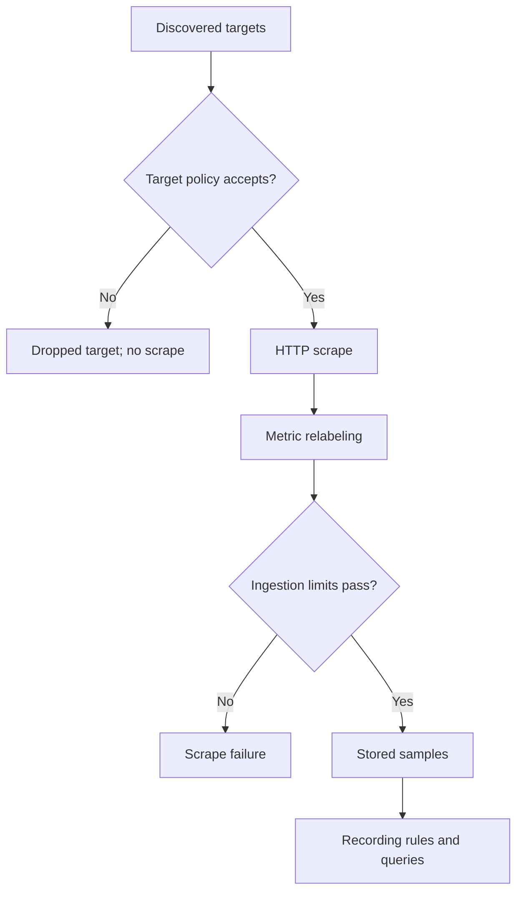

# Lab 17: Relabeling and Ingestion Guardrails

## 1. Purpose and Learning Outcomes

**In Plain Language:** You will control which targets are scraped and which returned samples are stored. Follow the order of target relabeling, scraping, metric relabeling, and limits, then test a dropped target and a failed scrape. The distinction matters: rejecting a target, discarding a sample, and failing an entire scrape produce different evidence.

> **Primary Objective:** Normalize discovery metadata, reject unsafe sample dimensions, and demonstrate the difference between dropping targets, dropping samples and failing a scrape.

Labels carry meaning and create series identity. A careless relabeling rule can reduce cost while quietly destroying the evidence needed during an incident.

You will add bounded policies to the application job, test a disabled target and deliberately violate a sample limit. These changes do not alter FastAPI instrumentation or introduce duplicate metric ingestion. Other exporter jobs remain intact.

## 2. Starting Point and Lab Map

Use this guide inside the complete application repository. Run commands from the repository root in Bash unless a step says otherwise. Work through the starting checks in order; they load the helpers and state this lab needs.

Read the explanation before each step, run one complete code block at a time, and compare the actual result with the stated expectation. Save commands, observations, explanations, and unexpected results in your notebook.

### Key Terms

| **Term**          | **Plain-Language Meaning**                                        |
| ----------------- | ----------------------------------------------------------------- |
| Target relabeling | Changing or rejecting a discovered target before its HTTP scrape. |
| Metric relabeling | Filtering or changing returned samples before ingestion.          |
| Sample limit      | A configured bound that can make an oversized scrape fail.        |

### Lab Map

The arrows show the flow or dependency being studied. Branches identify paths to compare; this is a conceptual map, not a captured runtime trace.


```mermaid
flowchart TD
    D["Discovered targets"] --> T{"Target policy accepts?"}
    T -->|"No"| X["Dropped target; no scrape"]
    T -->|"Yes"| S["HTTP scrape"]
    S --> M["Metric relabeling"]
    M --> L{"Ingestion limits pass?"}
    L -->|"No"| F["Scrape failure"]
    L -->|"Yes"| B["Stored samples"]
    B --> R["Recording rules and queries"]
```

## 3. Guided Walkthrough

### Step 01. Inherited State and Starting Checks

**What You Are Doing:** Start with healthy source targets and recording rules, and stop competing workloads. You need stable source identity to attribute changes to the new policy.

**Practical Walkthrough:** Verify targets and recording rules, then stop unrelated test traffic before changing labels. Capture the existing identities so new series can be distinguished from historical ones after the transition. Stable source behavior makes policy effects easier to isolate from workload or reset effects.

Save current target and series identities before changing relabeling. A label change can create new series while old samples remain in storage. Stable workload and process state help you attribute differences to the ingestion policy rather than an unrelated reset or traffic change.

```bash
source lab-notes/session.sh
source lab-notes/evidence.sh
source lab-notes/raw-metrics.sh
source lab-notes/metrics-session.sh
metrics_check
start_lab 17
```

Complete [Lab 16](Lab-16.md) first. Run commands from the repository root in the same Bash session. Keep the existing credentials, named volumes and checkpoint item. Expect seven services, five jobs and six healthy recording rules. Stop competing load generators during the experiments.

**Understanding the Result:** The experiment changes collection policy. Preserve the application instruments and their meaning while observing that change.

### Step 02. Learning Objectives and Pipeline Order

**What You Are Doing:** Read the pipeline in execution order. A target excluded before scraping cannot produce the same evidence as a target whose HTTP collection fails.

**Practical Walkthrough:** Read the pipeline from discovery through target relabeling, scraping, metric relabeling, and ingestion. A rule at an earlier boundary can prevent later stages from occurring. In particular, dropping a target means no scrape attempt is made, while dropping a sample happens after the endpoint was collected.

Identify the stage where each rule runs. Target relabeling can prevent a scrape; metric relabeling filters samples after collection. Use that order when predicting `up`, target inventory, and raw endpoint output, because the same word 'drop' has different consequences at different boundaries.

You will compare discovered/final labels, preserve instance identity, remove unnecessary samples, reject forbidden identifier labels and verify whole-scrape failure semantics.

The lab map in Section 2 shows this relationship.

Target rejection prevents an HTTP scrape. Metric relabeling acts on individual scraped samples. Limits protect ingestion but can make an entire scrape fail. Configuration changes and scrape failures are the operational events you will correlate with API behavior.

**Understanding the Result:** Locate the filter boundary before interpreting missing data. Absence has different causes at different stages.

### Step 03. Capture the Existing Contract

**What You Are Doing:** Save the current labels and source contract before changing them. In particular, preserve the distinctions needed to handle independent counter resets correctly.

**Practical Walkthrough:** Save representative labels and the existing recording-rule assumptions before applying normalization. Instance identity may be needed to distinguish counters that reset independently. Avoid simplifying labels in a way that merges distinct producers before reset-aware calculations can observe them separately.

Preserve the original configuration and representative labels before normalization. Check which labels distinguish independently resetting producers. Removing those identities too early can combine incompatible counter histories, so assess the effect on existing recording-rule expressions before simplifying the label set.

```bash
cp lab-notes/prometheus/prometheus.yml "$LAB_DIR/prometheus-before.yml"
cp lab-notes/prometheus/app-targets.json "$LAB_DIR/targets-before.json"
snapshot "$LAB_DIR/raw-before.json"
api -fsS "$PROM_URL/api/v1/targets?state=any" > "$LAB_DIR/targets-before-api.json"
pq 'scrape_samples_scraped{job="fastapi"}' > "$LAB_DIR/scraped-before.json"
pq 'scrape_samples_post_metric_relabeling{job="fastapi"}' > "$LAB_DIR/retained-before.json"
```

Do not flatten every instance into a service label. Distinct instances need separate counter reset handling. Also do not “fix” high cardinality by simply dropping an identifier label from otherwise distinct samples: that can produce collisions rather than safe aggregation.

**Understanding the Result:** Label changes affect both selection and identity. Validate downstream expressions against the new contract, not just the target display.

### Step 04. Install the Complete Policy

**What You Are Doing:** Install the complete policy and validate it as a whole. Identify separately the target-normalization rules, sample rejection rules, and ingestion limits.

**Practical Walkthrough:** Install the complete policy and identify each rule's purpose: normalize target labels, reject selected samples, or enforce a limit. Validate the resulting configuration as one unit. The order and stage of these rules determine whether a target is contacted and which collected samples are eligible for storage.

Read the policy in order and label each rule's purpose and stage. Validate the complete configuration rather than isolated fragments. Confirm that normalization, sample dropping, and limits apply to the intended jobs, since a syntactically valid broad rule can remove data needed by later recordings.

```bash
cat > lab-notes/prometheus/prometheus.yml <<'YAML'
global:
  scrape_interval: 15s
  scrape_timeout: 5s
  evaluation_interval: 15s
scrape_configs:
- job_name: fastapi
  metrics_path: /metrics
  file_sd_configs:
  - files:
    - /etc/prometheus/labs/app-targets.json
    refresh_interval: 5s
  sample_limit: 5000
  label_limit: 12
  label_name_length_limit: 80
  label_value_length_limit: 128
  body_size_limit: 2MB
  relabel_configs:
  - source_labels:
    - monitoring
    regex: disabled
    action: drop
  - source_labels:
    - environment
    target_label: environment
    action: lowercase
  - target_label: telemetry_role
    replacement: application
  - regex: monitoring|lab_discovery_note
    action: labeldrop
  metric_relabel_configs:
  - source_labels:
    - __name__
    regex: application_.*_created
    action: drop
  - source_labels:
    - request_id
    regex: .+
    action: drop
  - source_labels:
    - event_id
    regex: .+
    action: drop
  - source_labels:
    - item_id
    regex: .+
    action: drop
  - source_labels:
    - user_id
    regex: .+
    action: drop
  - source_labels:
    - trace_id
    regex: .+
    action: drop
- job_name: prometheus
  static_configs:
  - targets:
    - prometheus:9090
- job_name: node
  static_configs:
  - targets:
    - host-metrics:9100
- job_name: postgres
  static_configs:
  - targets:
    - postgres-exporter:9187
- job_name: redis
  static_configs:
  - targets:
    - redis-exporter:9121
rule_files:
- /etc/prometheus/labs/recording-rules.yml
YAML
```

**Command Note:** `<<'YAML'` writes the following block literally until `YAML`. Quoting the delimiter prevents Bash from expanding `$variables` inside the generated file; creation and execution are separate steps.

```bash
chmod 644 lab-notes/prometheus/prometheus.yml
record_change "apply_ingestion_guardrails" planned
reload_prometheus
wait_target fastapi up
```

The application target policy drops `monitoring=disabled`, lowercases environment, adds bounded `telemetry_role=application`, and removes two temporary discovery labels. Sample policy drops application `_created` series and rejects entire samples with nonempty request/event/item/user/trace identifiers.

Those identifiers are already absent from the application metric contract. The rules defend the boundary; they do not repair a broken producer. The 5,000-sample, 12-label and length/body limits are generous for this app and intentionally not copied onto larger exporters.

Metric relabeling does not apply to automatically generated scrape series such as `up`. Limits and relabeling syntax are defined in the [Prometheus configuration reference](https://prometheus.io/docs/prometheus/latest/configuration/configuration/).

**Understanding the Result:** Similar-looking relabel syntax can act at different boundaries. Keep target rules and metric rules conceptually separate.

### Step 05. Observe Identity Changes and Dropped Samples

**What You Are Doing:** Compare producer output with stored samples after the policy takes effect. A metric can still exist at the endpoint while intentionally being excluded from current storage.

**Practical Walkthrough:** Compare the producer's current raw output with newly stored samples after the policy takes effect. A dropped metric still exists at its source, but should no longer be newly ingested through this path. Use appropriate timestamps so retained historical samples are not mistaken for continued collection.

Compare source exposition with recent stored observations after policy activation. A dropped sample can remain visible at the producer and in older history. Use timestamps and current queries to distinguish retained old data from newly ingested data before concluding that a filtering rule failed.

```bash
api -fsS "$APP_URL/api/v1/items?limit=1" >/dev/null
api -fsS "$APP_URL/metrics" > "$LAB_DIR/raw-after.prom"
rg '^application_.*_created' "$LAB_DIR/raw-after.prom"
sleep 20
pq 'scrape_samples_scraped{job="fastapi"}' | jq .
pq 'scrape_samples_post_metric_relabeling{job="fastapi"}' | jq .
pq '{job="fastapi",__name__=~"application_.*_created"}' | jq .
```

Creation-time samples still exist in producer exposition but should be absent from a current instant query after the policy takes effect. Compare scrape/post-relabel counts from the same scrape; newly instantiated route/status children can otherwise change the population.

Dropping samples saves ingestion/storage work, not the application's encoding or network transfer. Historical samples remain until retention removes them.

Adding a target label creates new source-series identities. A two-minute range can briefly contain both old and new identities, so an immediate aggregate spike is not necessarily more traffic. Let the window move beyond this change before taking a clean rate baseline.

**Understanding the Result:** Endpoint presence proves emission; current stored presence proves collection under the policy. They are independent observations.

### Step 06. Predict the Discovery Experiment

**What You Are Doing:** Predict the accepted and dropped targets before installing the fixture. Decide whether the disabled wrong-port candidate should ever be scraped.

**Practical Walkthrough:** Predict which fixture targets the policy accepts and which it discards before activating them. The disabled wrong-port candidate tests filtering before network contact. Write down whether you expect an attempted scrape and a corresponding failure series, not merely whether the address is reachable.

For each discovery candidate, predict whether it becomes active, is dropped, or is scraped and fails. The disabled wrong-port candidate should test pre-scrape selection. Its lack of a failed scrape can be the expected result if the policy prevents network contact altogether.

The next file contains one valid endpoint and one deliberately disabled wrong-port endpoint. Both carry uppercase environment and temporary metadata. Predict which becomes active, which is dropped, whether the wrong port gets an `up=0` series, and which labels survive.

**Understanding the Result:** A deliberately dropped candidate should be visible as dropped discovery evidence. It need not create the same `up=0` evidence as an active bad target.

### Step 07. Exercise Target Relabeling

**What You Are Doing:** Inspect both active and dropped target views during the controlled experiment. The absence of a new failure series for a deliberately dropped target follows from the earlier filter boundary.

**Practical Walkthrough:** Apply the controlled discovery fixture and inspect both active and dropped target views. Check the final labels and rule responsible for exclusion. Compare the bad candidate with your prediction, then restore normal discovery so later collection reflects the intended service set.

Inspect active and dropped target views together, including discovered labels and final labels. Relate each candidate's placement to the configured rule. Restore the normal discovery fixture after the observation so the next guardrail test operates on the approved target population.

```bash
python3 - "$LAB_ENVIRONMENT" "$LAB_SERVICE" <<'PYTHON'
import json, os, sys
from pathlib import Path
p=Path("lab-notes/prometheus/app-targets.json")
entries=[{"targets":["app:8000"],"labels":{"environment":sys.argv[1].upper(),"service":sys.argv[2],"lab_discovery_note":"accepted"}},
         {"targets":["app:8999"],"labels":{"environment":sys.argv[1].upper(),"service":sys.argv[2],"lab_discovery_note":"rejected","monitoring":"disabled"}}]
t=p.with_suffix(".json.new");t.write_text(json.dumps(entries,indent=2)+"\n");os.chmod(t,0o644);os.replace(t,p)
PYTHON
sleep 10
api -fsS "$PROM_URL/api/v1/targets?state=any" > "$LAB_DIR/discovery-experiment.json"
jq '.data.activeTargets[] | select(.labels.job=="fastapi") | {discoveredLabels,labels,scrapeUrl}' "$LAB_DIR/discovery-experiment.json"
jq '.data.droppedTargets[] | select(.discoveredLabels.job=="fastapi")' "$LAB_DIR/discovery-experiment.json"
api -fsS "$APP_URL/api/v1/items?limit=1" > "$LAB_DIR/business-during-discovery-test.json"
set_app_target app:8000
sleep 10
wait_target fastapi up
```

Expect the wrong-port candidate in dropped targets, with no scrape attempt and no newly generated `up=0` for it. The accepted target retains service/instance and lowercase environment while the note disappears. The business API remains independent of this discovery experiment.

If you interrupt before restoration, run `set_app_target app:8000` explicitly. The discovery directory mount makes atomic file replacement visible to Prometheus.

**Understanding the Result:** The absence of a scrape error is meaningful here only with evidence that the candidate was dropped before scraping.

### Step 08. Predict and Force a Sample-Limit Failure

**What You Are Doing:** Predict what an impossibly low sample limit will do. The important distinction is whole-scrape failure, rather than successful ingestion of an arbitrary first sample.

**Practical Walkthrough:** Predict the result of setting `sample_limit` below the endpoint's sample count. The limit protects ingestion by rejecting an over-limit scrape; it does not promise to retain an arbitrary first subset. Keep the endpoint unchanged so the temporary limit is the only intended cause.

Compare the proposed tiny limit with the endpoint's actual sample count before applying it. Predict a failed over-limit scrape rather than a truncated successful subset. Keep the producer unchanged so the observed collection failure can be attributed to the ingestion guardrail.

A sample limit of one is deliberately below this application's exposition size. Predict that FastAPI remains responsive while Prometheus marks the scrape down. The limit does not retain the first sample and call the scrape healthy.

**Understanding the Result:** Expect a scrape-level failure with a specific error. Do not interpret this as the application refusing its metrics connection.

### Step 09. Run the Bounded Limit Experiment

**What You Are Doing:** Apply the temporary limit, capture the specific target error, and restore the valid configuration. Verify the cause instead of treating every `up=0` as a connection failure.

**Practical Walkthrough:** Apply the tiny limit within the restoration block, wait for a scrape, and capture the target's exact error. Compare reachability with collection status, then restore the valid limit and verify a fresh successful scrape. This demonstrates why an `up=0` needs its associated error context.

Wait for a scrape under the temporary limit and save the exact target error. The endpoint can remain reachable while ingestion fails. Restore the approved configuration and verify a newer successful scrape; an old healthy value or successful reload alone would not establish recovery of collection.

```bash
cp lab-notes/prometheus/prometheus.yml "$LAB_DIR/guarded-good.yml"
(
  set -euo pipefail
  trap 'cp "$LAB_DIR/guarded-good.yml" lab-notes/prometheus/prometheus.yml; chmod 644 lab-notes/prometheus/prometheus.yml; reload_prometheus >/dev/null' EXIT
  trap 'exit 130' INT
  trap 'exit 143' TERM
  python3 - <<'PYTHON'
from pathlib import Path
p=Path("lab-notes/prometheus/prometheus.yml");t=p.read_text()
assert t.count("sample_limit: 5000")==1
p.write_text(t.replace("sample_limit: 5000","sample_limit: 1"))
PYTHON
  record_change "temporary_application_sample_limit_one" planned
  reload_prometheus
  wait_target fastapi down
  api -fsS "$APP_URL/health/live" > "$LAB_DIR/live-during-rejection.json"
  api -fsS "$APP_URL/api/v1/items?limit=1" > "$LAB_DIR/business-during-rejection.json"
  api -fsS "$PROM_URL/api/v1/targets?state=active" > "$LAB_DIR/limit-failed-target.json"
  jq '.data.activeTargets[] | select(.labels.job=="fastapi") | {health,lastError}' "$LAB_DIR/limit-failed-target.json"
)
wait_target fastapi up
metrics_check
record_change "guarded_policy_restored" completed
```

**Command Note:** `trap ... EXIT` schedules cleanup when that shell exits. Keep it in the same block as the fault; the explicit recovery checks afterward confirm that restoration actually succeeded.

The exit trap restores the valid configuration and reloads it even after an assertion failure. Inspect the target's error for a sample-limit failure, not a network timeout. Capture Prometheus logs if the error differs.

Do not interpret stale or missing application values during failed scrapes as healthy zeros. This is an observability-path outage while business traffic can still succeed.

**Understanding the Result:** Different causes share the same failed-scrape indicator. The error message locates this failure at the sample-limit boundary.

### Step 10. Verify Recovery and Guard Against Accidental Data Loss

**What You Are Doing:** Confirm fresh targets and rule outputs after the label transition. Keep the intended policy while checking that required source families were not accidentally removed.

**Practical Walkthrough:** Check fresh targets, required metric families, and recording-rule output after restoring the intended policy. Inspect labels for both expected normalization and accidental loss. Preserve the approved policy while removing only temporary discovery and limit faults.

Verify both raw required families and their expected stored labels, then inspect recording output. A green scrape can still omit samples deliberately or accidentally filtered by policy. Keep the intended guardrails and remove only the temporary discovery and limit faults used for the experiment.

```bash
api -fsS "$PROM_URL/api/v1/rules?type=record" > "$LAB_DIR/rules-recovered.json"
pq 'up{job="fastapi"}' > "$LAB_DIR/up-recovered.json"
pq 'scrape_samples_post_metric_relabeling{job="fastapi"}' > "$LAB_DIR/samples-recovered.json"
dm logs --no-color --since 10m prometheus > "$LAB_DIR/prometheus.log"
```

Wait beyond two minutes from the label cutover, generate a few normal requests and compare the recording outputs again. Keep the valid guarded configuration for all later labs. Do not revert to the pre-policy copy during normal progression.

Review which families the dashboards/rules actually need before dropping more. A deny-list of common ID labels is defense in depth, not a complete cardinality guarantee; new unsafe dimensions can have other names.

**Understanding the Result:** Healthy current output completes the experiment. Old label identities may remain in historical queries without indicating a current configuration error.

## 4. Troubleshooting and Diagnosis

Start with the first unexpected result. Record the exact symptom, identify which component produced it, and use the checks below before repeating the experiment. After a fix, repeat the original check and confirm recovery.

### Troubleshooting

| **Symptom**                         | **Evidence**                          | **Corrective Action**                                             |
| ----------------------------------- | ------------------------------------- | ----------------------------------------------------------------- |
| Target disappears entirely          | Dropped-target discovery labels       | Inspect target relabeling before testing application networking   |
| Target up but family absent         | Producer exposition and sample policy | Check metric drop rules and producer registration                 |
| Target down but API succeeds        | Scrape error and limits               | Restore the valid limit; keep business and scrape health separate |
| Rates spike after policy change     | Old/new target-label identities       | Let the range window pass the cutover before comparing            |
| Exporter unexpectedly loses samples | Job scope                             | Keep application-specific rules scoped to the FastAPI job         |

Validate before reloading. If you must restore after a mistake, restore the last known-good configuration, not the entire storage volume.

## 5. Review and Practice

Answer the knowledge questions in your own words before reading the answer guide. For the scenario, name the evidence you would collect and the conclusion each observation would support.

### Knowledge Check

1. Why drop an entire unsafe sample rather than its ID label?
2. Why does a dropped target lack a new up=0?
3. Why can rates change after adding a label?

#### Answer Guide

1. Dropping only the label can collapse distinct samples into one conflicting identity.
2. No scrape is attempted for a target rejected before scraping.
3. Series identities change and old/new samples can coexist in a range.

### Professional Scenario Exercise

A new release causes the application scrape to fail at the sample limit. Decide how to distinguish a legitimate bounded expansion from an accidental request-ID label before raising the limit.

## 6. Completion Checklist

Mark each item only after you can point to its result or evidence file. Complete any cleanup shown here before moving on.

### Observable Completion Criteria

- [ ] Discovery normalization and target rejection are observed.
- [ ] Producer samples and retained samples are compared.
- [ ] The sample-limit failure is distinguished from a business outage.
- [ ] The valid policy and five scrape jobs are restored.

## 7. Production Context and Next Lab

### Production Implications

Relabeling is operational code that can remove evidence. Review producer contracts, cardinality, scrape failures and query dependencies together. Limits complement, rather than replace, instrumentation design.

### End State and Transition

Keep seven services, five jobs and the guardrails. [Lab 18](Lab-18.md) examines the storage and capacity consequences of the samples that are retained.
