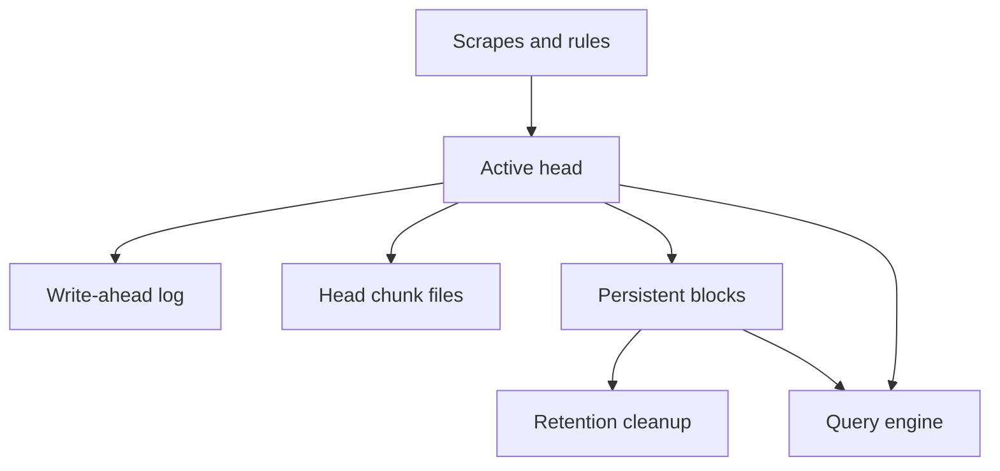

# Lab 18: Prometheus TSDB, Retention, and Capacity

## Purpose and Scope

> **Primary Objective:** Inspect the live storage boundary and compare isolated TSDB datasets to reason about series count, ingestion, retention and query pressure.

Prometheus storage cost depends on more than request volume. Label churn, active series, scrape frequency, retention, WAL/head overhead and repeated query work all matter.

This lab performs read-only inspection of the live TSDB and creates two offline datasets under the evidence directory. It never imports synthetic data into the live server, fills a disk or deletes the Prometheus volume. The local stack remains single-node.

## 1. Inherited State and Starting Checks

```bash
source lab-notes/session.sh
source lab-notes/evidence.sh
source lab-notes/raw-metrics.sh
source lab-notes/metrics-session.sh
metrics_check
start_lab 18
```

Complete [Lab 17](Lab-17.md) first. Run commands from the repository root in the same Bash session. Keep the existing credentials, named volumes and checkpoint item. Keep the existing three-day, 1 GB retention limits. Use a normal host account for the offline container so fixture outputs remain owned by you.

## 2. Learning Objectives and Storage Layers

You will distinguish head memory, WAL, head chunks and immutable blocks; inspect actual retention flags; estimate source ingestion separately from rule output; and compare stable labels with changing labels at equal sample counts.



Block creation, compaction, retention cleanup and series creation are storage events. They do not necessarily occur on the same schedule as HTTP traffic.

## 3. Inspect Runtime Flags and TSDB Statistics

```bash
api -fsS "$PROM_URL/api/v1/status/flags" > "$LAB_DIR/prometheus-flags.json"
api -fsS "$PROM_URL/api/v1/status/tsdb" > "$LAB_DIR/tsdb-before.json"
jq '.data | with_entries(select(.key|startswith("storage.tsdb")))' "$LAB_DIR/prometheus-flags.json"
jq '.data | {headStats,seriesCountByMetricName,labelValueCountByLabelName}' "$LAB_DIR/tsdb-before.json"
dm exec -T prometheus sh -c 'ls -lah /prometheus; du -sh /prometheus' > "$LAB_DIR/storage-layout.txt"
dm exec -T prometheus /bin/promtool tsdb list /prometheus > "$LAB_DIR/blocks-before.txt"
cat "$LAB_DIR/blocks-before.txt"
```

A newly started instance may have no persistent blocks yet. That is compatible with successful current queries from the head. Read-only inspection is appropriate; never run a repair/import/delete operation against a TSDB concurrently owned by a live server.

The WAL protects recent accepted data during recovery. Persistent blocks contain compacted time ranges. Filesystem byte counts, active-series gauges and compressed block bytes measure different things.

## 4. Interpret Retention Without Treating It as a Disk Quota

The runtime uses a three-day time limit and 1 GB size limit. Either can remove older persistent data. Size retention considers storage overhead but removes eligible persistent blocks; it cannot guarantee an absolute filesystem ceiling or immediately shrink an active head/WAL.

Cleanup and block compaction are asynchronous. Keep disk headroom for WAL segments, head chunks, compaction work, Docker logs and other services. A “1 GB retention” setting does not reserve a safe fixed 1 GB partition.

Prometheus local storage normally creates blocks covering roughly two hours before later compaction. See the [official local-storage documentation](https://prometheus.io/docs/prometheus/latest/storage/) for retention behavior and capacity factors.

## 5. Measure Ingestion and Rule Contributions

Run and save these expressions using the `pq` helper:

```promql
prometheus_tsdb_head_series
```

```promql
sum(rate(prometheus_tsdb_head_samples_appended_total[5m]))
```

```promql
sum(scrape_samples_post_metric_relabeling) / 15
```

```promql
prometheus_tsdb_storage_blocks_bytes
```

```promql
prometheus_tsdb_wal_storage_size_bytes
```

```promql
prometheus_tsdb_head_chunks_storage_size_bytes
```

The post-relabel sample sum divided by 15 seconds estimates source scrape ingestion when all current jobs use that interval. It excludes recording-rule output and scrape-generated series. The append counter measures actual appends across sample types; sum its `type` dimension.

Do not divide the number of retained historical samples by the scrape interval and call it current ingestion. Head-series count is neither total historical series nor the number of requests served.

## 6. Build a Capacity Worksheet

Record measured samples/second, active series, block bytes, WAL bytes and total volume bytes. For a deliberately rough payload estimate, evaluate:

`sample bytes ≈ samples/second × retention seconds × assumed bytes/sample`

Use more than one assumption rather than declaring a universal bytes/sample value. The calculation below uses 2 and 8 bytes/sample only as sensitivity scenarios; it excludes indexes, label strings, WAL/head memory, compaction and safety headroom.

```bash
SAMPLE_RATE=$(pq 'sum(rate(prometheus_tsdb_head_samples_appended_total[5m]))' | jq -er '.data.result[0].value[1]')
python3 - "$SAMPLE_RATE" <<'PYTHON'
import math, sys
rate=float(sys.argv[1]);assert math.isfinite(rate) and rate >= 0
for days in (3,7,30):
    for bytes_per_sample in (2,8):
        gib=rate*days*86400*bytes_per_sample/(1024**3)
        print(f"{days} days at {bytes_per_sample} bytes/sample: {gib:.3f} GiB payload scenario")
PYTHON
```

If the rate is missing because the server has just started, collect a few minutes of samples rather than replacing missing data with zero. This worksheet is a planning hypothesis that needs measured disk growth, not a purchase-size guarantee.

## 7. Predict the Equal-Sample Experiment

Both datasets will contain 1,200 samples across ten worker labels. Stable labels create ten series. The churn dataset adds a generation change every ten observations, creating 120 series.

Predict which dataset needs more chunks/index metadata even though sample count is equal. Also predict why a short experiment cannot establish full production memory usage or a universal storage multiplier.

## 8. Create the Offline Datasets

```bash
cat > lab-notes/capacity_fixture.py <<'PYTHON'
"""Write equal-size sample populations with stable versus changing label sets."""

import json
import sys
import time
from pathlib import Path

root = Path(sys.argv[1])
root.mkdir(parents=True, exist_ok=True)
start = ((int(time.time()) - 86400) // 7200) * 7200
for mode in ("stable", "churn"):
    lines = ["# TYPE learning_capacity gauge"]
    # Keep each series contiguous, with ascending timestamps for offline import.
    for worker in range(10):
        generations = range(12) if mode == "churn" else range(1)
        for generation in generations:
            ticks = (
                range(generation * 10, generation * 10 + 10)
                if mode == "churn"
                else range(120)
            )
            for tick in ticks:
                labels = f'worker="{worker}",generation="{generation}"'
                lines.append(
                    f"learning_capacity{{{labels}}} {tick % 7} {start + tick * 15}"
                )
    (root / f"{mode}.om").write_text("\n".join(lines) + "\n# EOF\n")
(root / "manifest.json").write_text(
    json.dumps(
        {"samples_per_dataset": 1200, "stable_series": 10, "churn_series": 120},
        indent=2,
    )
    + "\n"
)
print(root / "manifest.json")
PYTHON
```

```bash
python3 lab-notes/capacity_fixture.py "$LAB_DIR/tsdb-sandbox"
tsdb_tool() {
  if [[ "$(id -u)" = 0 ]]; then printf 'Run this fixture as a normal host user\n' >&2; return 1; fi
  docker run --rm --network none --read-only --user "$(id -u):$(id -g)" \
    --cap-drop ALL --security-opt no-new-privileges:true --tmpfs /tmp \
    -v "$LAB_DIR/tsdb-sandbox:/sandbox" --entrypoint /bin/promtool \
    prom/prometheus:v3.14.0 "$@"
}
tsdb_tool tsdb create-blocks-from openmetrics /sandbox/stable.om /sandbox/stable-db
tsdb_tool tsdb create-blocks-from openmetrics /sandbox/churn.om /sandbox/churn-db
tsdb_tool tsdb list /sandbox/stable-db > "$LAB_DIR/stable-blocks.txt"
tsdb_tool tsdb list /sandbox/churn-db > "$LAB_DIR/churn-blocks.txt"
cat "$LAB_DIR/stable-blocks.txt" "$LAB_DIR/churn-blocks.txt"
```

Only the isolated evidence subdirectory is mounted. No network and no live Prometheus data volume is available to the fixture container. OpenMetrics timestamps are seconds; the generator places samples within one old two-hour interval to keep the block comparison simple.

## 9. Verify Counts and Compare Bytes

```bash
python3 - "$LAB_DIR/tsdb-sandbox" <<'PYTHON'
import json, sys
from pathlib import Path
root=Path(sys.argv[1])
for name, expected in (("stable",10),("churn",120)):
    folder=root/(name+"-db")
    metadata=[json.loads(p.read_text()) for p in folder.glob("*/meta.json")]
    assert len(metadata)==1, metadata
    stats=metadata[0]["stats"]
    assert stats["numSamples"]==1200 and stats["numSeries"]==expected
    size=sum(p.stat().st_size for p in folder.rglob("*") if p.is_file())
    print(name, stats, {"logical_file_bytes":size})
PYTHON
```

Expect ten versus 120 series and a larger churn dataset. Filesystem allocated bytes can differ from logical file sizes, especially for small blocks. The same sample count does not imply equal index, chunk or label overhead.

This is an offline block experiment, not a benchmark of live WAL size or application latency. Do not overgeneralize its exact ratio to a production series distribution.

## 10. Connect Storage Decisions to Query Cost

Use Lab 16's query statistics to compare raw versus recorded series, then broaden only the time window on one existing query. Record the expression, window, step and processed sample count.

A long range and many series can increase query pressure even when dashboard refresh is slow. A shorter scrape interval increases source density; a finer Grafana step does not recover samples never collected. Recording rules trade repeated query work for periodic work and more storage.

The current three-day retention cannot support a complete rolling 30-day SLO report. Lab 25 will define the objective separately from the available learning data; it must not label a short partial result as month-long compliance.

## 11. Recovery, Evidence and Troubleshooting

```bash
metrics_check
api -fsS "$PROM_URL/api/v1/status/tsdb" > "$LAB_DIR/tsdb-after.json"
api -fsS "$APP_URL/api/v1/items?limit=1" > "$LAB_DIR/business-after.json"
record_change "offline_capacity_comparison_completed_live_tsdb_untouched" completed
```

| Symptom | Explanation or check | Action |
|---|---|---|
| No persistent blocks | Server too new or head not compacted | Inspect head statistics; do not force live compaction |
| Size exceeds configured retention | WAL/head/compaction overhead and asynchronous deletion | Inspect volume/free space and preserve headroom |
| Fixture permission denied | Numeric UID or host directory permissions | Use the normal account that owns the evidence directory |
| Churn bytes differ from another machine | Filesystem/block metadata variation | Compare populations and method, not an exact byte ratio |
| Ingestion metric initially absent | No completed append/scrape history | Wait for collection; do not invent zero |

No infrastructure rollback is needed because the live configuration and storage were not changed. Keep the small fixture/evidence files until your notebook comparison is complete. Never use `docker compose down -v` as lab cleanup.

## 12. Knowledge Check

1. Why is size retention not a hard quota?
2. Why does label churn cost more at equal sample count?
3. Can three days of data prove a 30-day SLO?

### Answer Guide

1. Deletion applies asynchronously to eligible persistent blocks while active storage and other overhead remain.
2. More series require additional label/index/chunk metadata and lifecycle work.
3. No; the measurement window is incomplete.

## 13. Professional Scenario Exercise

Disk use rises while request volume stays flat. Compare source sample count, new series, label churn, recording output and Docker logs before changing retention. Identify what evidence would justify dropping telemetry.

## 14. Lab Notebook Template

Create a notebook in the evidence directory for this run:

```bash
test -e "$LAB_DIR/notebook.md" || printf '# Lab 18 Evidence\n' > "$LAB_DIR/notebook.md"
```

Use these headings and fill them with your predictions, commands, observed results and conclusions:

```markdown
# Lab 18 Evidence

## Starting state and operational question
## Prediction before the change
## Commands and timestamps
## Observed results and source evidence
## Unexpected findings and troubleshooting
## Recovery proof and remaining limitations
```

## 15. Observable Completion Criteria

- [ ] Runtime retention and storage layers are documented.
- [ ] Current ingestion is distinguished from retained sample count.
- [ ] Both isolated datasets contain 1,200 samples with 10 versus 120 series.
- [ ] Capacity assumptions and omitted overheads are explicit.
- [ ] The live application and five jobs remain healthy.

## 16. Production Implications

Capacity planning needs measured growth, failure headroom and query limits. Local TSDB persistence is not replication or backup. Longer retention is an engineering decision with storage and recovery consequences.

## 17. End State and Transition

Keep the seven-service metrics stage. [Lab 19](Lab-19.md) adds Grafana as a query/visualization layer over the existing Prometheus source.
