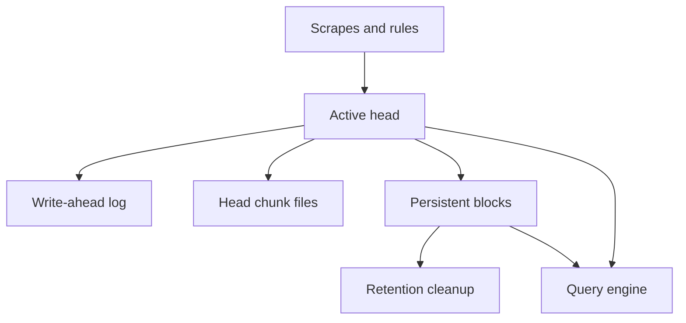

# Lab 18: Prometheus TSDB, Retention, and Capacity

## 1. Purpose and Learning Outcomes

**In Plain Language:** You will inspect Prometheus storage and build a rough capacity model from measured data. A separate offline experiment keeps the sample count equal while changing label churn. That comparison shows why storage and query cost depend on series identity and metadata as well as on the number of numeric samples.

> **Primary Objective:** Inspect the live storage boundary and compare isolated TSDB datasets to reason about series count, ingestion, retention and query pressure.

Prometheus storage cost depends on more than request volume. Label churn, active series, scrape frequency, retention, WAL/head overhead and repeated query work all matter.

This lab performs read-only inspection of the live TSDB and creates two offline datasets under the evidence directory. It never imports synthetic data into the live server, fills a disk or deletes the Prometheus volume. The local stack remains single-node.

## 2. Starting Point and Lab Map

Use this guide inside the complete application repository. Run commands from the repository root in Bash unless a step says otherwise. Work through the starting checks in order; they load the helpers and state this lab needs.

Read the explanation before each step, run one complete code block at a time, and compare the actual result with the stated expectation. Save commands, observations, explanations, and unexpected results in your notebook.

### Key Terms

| **Term**    | **Plain-Language Meaning**                                           |
| ----------- | -------------------------------------------------------------------- |
| TSDB        | Prometheus's time-series storage engine.                             |
| WAL         | The write-ahead log used as part of recovering recent storage state. |
| Label churn | Repeatedly creating new series identities as label values change.    |

### Lab Map

The arrows show the flow or dependency being studied. Branches identify paths to compare; this is a conceptual map, not a captured runtime trace.


```mermaid
flowchart TD
    S["Scrapes and rules"] --> H["Active head"]
    H --> W["Write-ahead log"]
    H --> C["Head chunk files"]
    H --> B["Persistent blocks"]
    B --> R["Retention cleanup"]
    H --> Q["Query engine"]
    B --> Q
```

## 3. Guided Walkthrough

### Step 01. Inherited State and Starting Checks

**What You Are Doing:** Keep the existing live retention settings and use an isolated workspace for generated data. The storage experiment must not modify files owned by the running TSDB.

**Practical Walkthrough:** Verify the live monitoring stage and create the separate workspace used by the storage exercise. Keep the running TSDB volume out of all offline commands. You will generate disposable data for comparison, not edit or repair files that Prometheus currently owns.

Read the offline tool's mount source and destination before running it. The sandbox must be separate from Prometheus's live data volume. This distinction permits repeatable storage experiments without competing with a running TSDB process or altering the course's retained monitoring history.

```bash
source lab-notes/session.sh
source lab-notes/evidence.sh
source lab-notes/raw-metrics.sh
source lab-notes/metrics-session.sh
metrics_check
start_lab 18
```

Complete [Lab 17](Lab-17.md) first. Run commands from the repository root in the same Bash session. Keep the existing credentials, named volumes and checkpoint item. Keep the existing three-day, 1 GB retention limits. Use a normal host account for the offline container so fixture outputs remain owned by you.

**Understanding the Result:** Isolation makes the experiment repeatable without changing live history. Check mounts and paths before running the offline container.

### Step 02. Learning Objectives and Storage Layers

**What You Are Doing:** Separate active head data, recovery files, and persistent blocks. Current query success does not require that every sample already lives in a completed block.

**Practical Walkthrough:** Follow samples through active head storage, recovery-related files, and completed persistent blocks. Different files serve different lifecycle purposes, so a sample can be queryable before it belongs to a finished block. Read the directory inventory with that model instead of equating block count with all retained data.

Identify which files support current ingestion, recovery, and completed historical blocks. Queryable data can still belong to the head rather than a completed block. Use that lifecycle model when reading directory sizes so the absence of many block directories is not mistaken for absence of stored samples.

You will distinguish head memory, WAL, head chunks and immutable blocks; inspect actual retention flags; estimate source ingestion separately from rule output; and compare stable labels with changing labels at equal sample counts.

The lab map in Section 2 shows this relationship.

Block creation, compaction, retention cleanup and series creation are storage events. They do not necessarily occur on the same schedule as HTTP traffic.

**Understanding the Result:** On-disk size includes more than compressed samples. Storage state changes as ingestion and compaction progress.

### Step 03. Inspect Runtime Flags and TSDB Statistics

**What You Are Doing:** Read the effective runtime flags and storage statistics. Inspect actual state rather than assuming the configuration file or visible block count tells the whole story.

**Practical Walkthrough:** Inspect the effective runtime flags and current TSDB statistics through the supplied commands. These describe the running process, while an edited local configuration may not yet be active. Record timestamps because head state and block layout can change during normal operation.

Save effective flags and TSDB statistics with an observation timestamp. Compare running settings with intended retention inputs, recognizing that editing a host file does not automatically alter process flags. Head series and block sizes evolve during normal ingestion, so record when each inventory was taken.

```bash
api -fsS "$PROM_URL/api/v1/status/flags" > "$LAB_DIR/prometheus-flags.json"
api -fsS "$PROM_URL/api/v1/status/tsdb" > "$LAB_DIR/tsdb-before.json"
jq '.data | with_entries(select(.key|startswith("storage.tsdb")))' "$LAB_DIR/prometheus-flags.json"
jq '.data | {headStats,seriesCountByMetricName,labelValueCountByLabelName}' "$LAB_DIR/tsdb-before.json"
dm exec -T prometheus sh -c 'ls -lah /prometheus; du -sh /prometheus' > "$LAB_DIR/storage-layout.txt"
dm exec -T prometheus /bin/promtool tsdb list /prometheus > "$LAB_DIR/blocks-before.txt"
cat "$LAB_DIR/blocks-before.txt"
```

A newly started instance may have no persistent blocks yet. That is compatible with successful current queries from the head. Read-only inspection is appropriate; never run a repair/import/delete operation against a TSDB concurrently owned by a live server.

The WAL protects recent accepted data during recovery. Persistent blocks contain compacted time ranges. Filesystem byte counts, active-series gauges and compressed block bytes measure different things.

**Understanding the Result:** Use measured runtime state in the worksheet. A remembered default is not evidence of the active retention policy.

### Step 04. Interpret Retention without Treating It as a Disk Quota

**What You Are Doing:** Relate retention to eligible data cleanup and storage overhead. A size-retention setting is not an immediate hard ceiling on every byte in the filesystem.

**Practical Walkthrough:** Read retention as a policy for eligible stored data, with cleanup timing and additional storage layers. A size setting is not an instantaneous quota for every file in the data directory. Account for head data, recovery files, and ongoing storage work when comparing the setting with filesystem usage.

Separate the retention policy's scope from total filesystem consumption. Head data, recovery files, and cleanup timing can leave usage above a simplistic size expectation. Use the inventory to explain those components instead of presenting a retention limit as a hard immediate quota on every byte.

The runtime uses a three-day time limit and 1 GB size limit. Either can remove older persistent data. Size retention considers storage overhead but removes eligible persistent blocks; it cannot guarantee an absolute filesystem ceiling or immediately shrink an active head/WAL.

Cleanup and block compaction are asynchronous. Keep disk headroom for WAL segments, head chunks, compaction work, Docker logs and other services. A “1 GB retention” setting does not reserve a safe fixed 1 GB partition.

Prometheus local storage normally creates blocks covering roughly two hours before later compaction. See the [official local-storage documentation](https://prometheus.io/docs/prometheus/latest/storage/) for retention behavior and capacity factors.

**Understanding the Result:** Do not promise a hard disk ceiling from retention alone. Capacity planning needs headroom for the complete storage lifecycle.

### Step 05. Measure Ingestion and Rule Contributions

**What You Are Doing:** Estimate source ingestion separately from recording-rule output. Both consume storage, but a scrape sample count alone does not measure all inserted samples.

**Practical Walkthrough:** Estimate incoming scrape samples separately from samples produced by recording rules. Rules create additional stored series on their own schedule, so scrape counts alone understate total insertion when rules are enabled. Keep the relevant intervals and populations explicit in each estimate.

Estimate scrape ingestion and rule-generated samples as separate contributions, then compare with the observed append rate. Keep each interval explicit. A rough scrape-count estimate can be useful, but it should not be treated as exact total insertion when recording rules add their own samples.

Run and save these expressions using the `pq` helper:

```promql
prometheus_tsdb_head_series
```

```promql
sum(rate(prometheus_tsdb_head_samples_appended_total[5m]))
```

```promql
sum(scrape_samples_post_metric_relabeling) / 15
```

```promql
prometheus_tsdb_storage_blocks_bytes
```

```promql
prometheus_tsdb_wal_storage_size_bytes
```

```promql
prometheus_tsdb_head_chunks_storage_size_bytes
```

The post-relabel sample sum divided by 15 seconds estimates source scrape ingestion when all current jobs use that interval. It excludes recording-rule output and scrape-generated series. The append counter measures actual appends across sample types; sum its `type` dimension.

Do not divide the number of retained historical samples by the scrape interval and call it current ingestion. Head-series count is neither total historical series nor the number of requests served.

**Understanding the Result:** Avoid counting only one source of ingestion. Derived measurements also consume storage and query resources.

### Step 06. Build a Capacity Worksheet

**What You Are Doing:** Build a worksheet using measured rates and several bytes-per-sample assumptions. Keep overhead and uncertainty explicit instead of presenting one estimate as a capacity guarantee.

**Practical Walkthrough:** Fill the worksheet using observed ingestion rates and several plausible bytes-per-sample assumptions. Preserve the formula and units so others can adjust it. Treat series overhead and workload growth as uncertainties rather than hiding them inside one apparently precise storage prediction.

Check the sample-rate input and units before multiplying by time and bytes per sample. Retain several storage assumptions in the worksheet rather than one falsely precise forecast. State that series overhead, retention behavior, and workload growth can change actual capacity needs beyond the simple sample calculation.

Record measured samples/second, active series, block bytes, WAL bytes and total volume bytes. For a deliberately rough payload estimate, evaluate:

`sample bytes ≈ samples/second × retention seconds × assumed bytes/sample`

Use more than one assumption rather than declaring a universal bytes/sample value. The calculation below uses 2 and 8 bytes/sample only as sensitivity scenarios; it excludes indexes, label strings, WAL/head memory, compaction and safety headroom.

```bash
SAMPLE_RATE=$(pq 'sum(rate(prometheus_tsdb_head_samples_appended_total[5m]))' | jq -er '.data.result[0].value[1]')
python3 - "$SAMPLE_RATE" <<'PYTHON'
import math, sys
rate=float(sys.argv[1]);assert math.isfinite(rate) and rate >= 0
for days in (3,7,30):
    for bytes_per_sample in (2,8):
        gib=rate*days*86400*bytes_per_sample/(1024**3)
        print(f"{days} days at {bytes_per_sample} bytes/sample: {gib:.3f} GiB payload scenario")
PYTHON
```

If the rate is missing because the server has just started, collect a few minutes of samples rather than replacing missing data with zero. This worksheet is a planning hypothesis that needs measured disk growth, not a purchase-size guarantee.

**Understanding the Result:** The worksheet is a sensitivity estimate. Actual storage measurements remain necessary before treating it as a capacity commitment.

### Step 07. Predict the Equal-Sample Experiment

**What You Are Doing:** Predict the stable-label and changing-label datasets at equal sample counts. More series should introduce additional identity, index, and chunk overhead.

**Practical Walkthrough:** Predict the two datasets before generating them: both contain 1,200 samples, but one uses 10 stable series and the other 120 changing series. More identities require additional indexing and chunk organization. Equal sample totals therefore need not produce equal storage size.

Hold total samples constant while varying the number of identities. Predict how extra series affect indexing and chunk organization before generating files. This isolates a cardinality-related storage effect without confusing it with simply inserting a larger number of samples.

Both datasets will contain 1,200 samples across ten worker labels. Stable labels create ten series. The churn dataset adds a generation change every ten observations, creating 120 series.

Predict which dataset needs more chunks/index metadata even though sample count is equal. Also predict why a short experiment cannot establish full production memory usage or a universal storage multiplier.

**Understanding the Result:** The comparison isolates series structure at equal sample count. It does not reproduce every aspect of a long-running production TSDB.

### Step 08. Create the Offline Datasets

**What You Are Doing:** Generate both datasets in an isolated directory and convert them offline. The container receives neither the live data volume nor a network path to the running server.

**Practical Walkthrough:** Generate and convert both datasets only in the isolated directory mounted into the offline tool. Check that the live data volume is absent and the container has no network path to the running service. The generated files should be disposable inputs and outputs owned by this experiment.

Inspect the isolated directory and tool mounts, then generate both fixtures with the same procedure. Confirm the offline container does not attach the live TSDB volume. Keep generated inputs and outputs together so the resulting comparison can be reproduced or discarded without changing the running service.

```bash
cat > lab-notes/capacity_fixture.py <<'PYTHON'
"""Write equal-size sample populations with stable versus changing label sets."""

import json
import sys
import time
from pathlib import Path

root = Path(sys.argv[1])
root.mkdir(parents=True, exist_ok=True)
start = ((int(time.time()) - 86400) // 7200) * 7200
for mode in ("stable", "churn"):
    lines = ["# TYPE learning_capacity gauge"]
    # Keep each series contiguous, with ascending timestamps for offline import.
    for worker in range(10):
        generations = range(12) if mode == "churn" else range(1)
        for generation in generations:
            ticks = (
                range(generation * 10, generation * 10 + 10)
                if mode == "churn"
                else range(120)
            )
            for tick in ticks:
                labels = f'worker="{worker}",generation="{generation}"'
                lines.append(
                    f"learning_capacity{{{labels}}} {tick % 7} {start + tick * 15}"
                )
    (root / f"{mode}.om").write_text("\n".join(lines) + "\n# EOF\n")
(root / "manifest.json").write_text(
    json.dumps(
        {"samples_per_dataset": 1200, "stable_series": 10, "churn_series": 120},
        indent=2,
    )
    + "\n"
)
print(root / "manifest.json")
PYTHON
```

**Command Note:** `<<'PYTHON'` writes the following block literally until `PYTHON`. Quoting the delimiter prevents Bash from expanding `$variables` inside the generated file; creation and execution are separate steps.

```bash
python3 lab-notes/capacity_fixture.py "$LAB_DIR/tsdb-sandbox"
tsdb_tool() {
  if [[ "$(id -u)" = 0 ]]; then printf 'Run this fixture as a normal host user\n' >&2; return 1; fi
  docker run --rm --network none --read-only --user "$(id -u):$(id -g)" \
    --cap-drop ALL --security-opt no-new-privileges:true --tmpfs /tmp \
    -v "$LAB_DIR/tsdb-sandbox:/sandbox" --entrypoint /bin/promtool \
    prom/prometheus:v3.14.0 "$@"
}
tsdb_tool tsdb create-blocks-from openmetrics /sandbox/stable.om /sandbox/stable-db
tsdb_tool tsdb create-blocks-from openmetrics /sandbox/churn.om /sandbox/churn-db
tsdb_tool tsdb list /sandbox/stable-db > "$LAB_DIR/stable-blocks.txt"
tsdb_tool tsdb list /sandbox/churn-db > "$LAB_DIR/churn-blocks.txt"
cat "$LAB_DIR/stable-blocks.txt" "$LAB_DIR/churn-blocks.txt"
```

Only the isolated evidence subdirectory is mounted. No network and no live Prometheus data volume is available to the fixture container. OpenMetrics timestamps are seconds; the generator places samples within one old two-hour interval to keep the block comparison simple.

**Understanding the Result:** Offline conversion creates independent blocks. It must not mutate active Prometheus storage to demonstrate the effect.

### Step 09. Verify Counts and Compare Bytes

**What You Are Doing:** Verify actual sample and series counts before comparing file sizes. Distinguish logical size from allocated filesystem bytes when interpreting small datasets.

**Practical Walkthrough:** Verify the resulting sample and series counts before comparing byte sizes. Then distinguish logical file length from allocated filesystem space, which can differ for small files and allocation units. Keep both datasets' measurements under the same method so the comparison is fair.

Verify 1,200 samples and the intended series counts before comparing bytes. Use the same size measurement for both outputs and label whether it reports logical length or allocated space. Small files and filesystem allocation can affect the latter, so preserve both measurements where supplied.

```bash
python3 - "$LAB_DIR/tsdb-sandbox" <<'PYTHON'
import json, sys
from pathlib import Path
root=Path(sys.argv[1])
for name, expected in (("stable",10),("churn",120)):
    folder=root/(name+"-db")
    metadata=[json.loads(p.read_text()) for p in folder.glob("*/meta.json")]
    assert len(metadata)==1, metadata
    stats=metadata[0]["stats"]
    assert stats["numSamples"]==1200 and stats["numSeries"]==expected
    size=sum(p.stat().st_size for p in folder.rglob("*") if p.is_file())
    print(name, stats, {"logical_file_bytes":size})
PYTHON
```

Expect ten versus 120 series and a larger churn dataset. Filesystem allocated bytes can differ from logical file sizes, especially for small blocks. The same sample count does not imply equal index, chunk or label overhead.

This is an offline block experiment, not a benchmark of live WAL size or application latency. Do not overgeneralize its exact ratio to a production series distribution.

**Understanding the Result:** Explain size differences alongside actual counts. Small experimental sizes should not be extrapolated as universal bytes-per-sample constants.

### Step 10. Connect Storage Decisions to Query Cost

**What You Are Doing:** Broaden one real query's time scope and inspect processed samples. Dashboard pixel count does not measure the amount of data the query engine must examine.

**Practical Walkthrough:** Run the selected real query over broader time ranges and inspect the amount of data processed. A graph's limited number of display points does not mean the engine examined only that many samples. Keep expression and scope controlled while changing the time range to expose query-work differences.

Keep the expression and label scope fixed while increasing the queried time range. Compare query work with the displayed resolution instead of assuming one plotted point means one processed sample. Aggregation can require reading substantially more input than the final graph exposes.

Use Lab 16's query statistics to compare raw versus recorded series, then broaden only the time window on one existing query. Record the expression, window, step and processed sample count.

A long range and many series can increase query pressure even when dashboard refresh is slow. A shorter scrape interval increases source density; a finer Grafana step does not recover samples never collected. Recording rules trade repeated query work for periodic work and more storage.

The current three-day retention cannot support a complete rolling 30-day SLO report. Lab 25 will define the objective separately from the available learning data; it must not label a short partial result as month-long compliance.

**Understanding the Result:** Query cost depends on selected data and computation, not just screen resolution. Record the range and processed-sample evidence together.

### Step 11. Recovery, Evidence and Troubleshooting

**What You Are Doing:** Confirm that live collection and the checkpoint remain intact after the offline work. Record storage observations without forcing compaction or repair on the running database.

**Practical Walkthrough:** Recheck live collection, rule output, and the business checkpoint after the offline experiment. Retain the generated-data comparison and worksheet without forcing live compaction or repair. Record any size uncertainty as an observation rather than changing storage state merely to obtain a tidier number.

Recheck current collection, recordings, and the business checkpoint after the offline tool exits. Keep the sandbox measurements and capacity assumptions as evidence. A clean finish means the live monitoring path is unchanged and usable, not that historical storage has been compacted or reset to match an expected size.

```bash
metrics_check
api -fsS "$PROM_URL/api/v1/status/tsdb" > "$LAB_DIR/tsdb-after.json"
api -fsS "$APP_URL/api/v1/items?limit=1" > "$LAB_DIR/business-after.json"
record_change "offline_capacity_comparison_completed_live_tsdb_untouched" completed
```

| **Symptom**                             | **Explanation or Check**                               | **Action**                                              |
| --------------------------------------- | ------------------------------------------------------ | ------------------------------------------------------- |
| No persistent blocks                    | Server too new or head not compacted                   | Inspect head statistics; do not force live compaction   |
| Size exceeds configured retention       | WAL/head/compaction overhead and asynchronous deletion | Inspect volume/free space and preserve headroom         |
| Fixture permission denied               | Numeric UID or host directory permissions              | Use the normal account that owns the evidence directory |
| Churn bytes differ from another machine | Filesystem/block metadata variation                    | Compare populations and method, not an exact byte ratio |
| Ingestion metric initially absent       | No completed append/scrape history                     | Wait for collection; do not invent zero                 |

No infrastructure rollback is needed because the live configuration and storage were not changed. Keep the small fixture/evidence files until your notebook comparison is complete. Never use `docker compose down -v` as lab cleanup.

**Understanding the Result:** A healthy unchanged live stage confirms the isolation boundary. Offline findings remain scoped to the generated datasets.

## 4. Troubleshooting and Diagnosis

Start with the first unexpected result. Record the exact symptom, identify which component produced it, and use the checks below before repeating the experiment. After a fix, repeat the original check and confirm recovery.

Use the recovery and troubleshooting checks in Step 11.

## 5. Review and Practice

Answer the knowledge questions in your own words before reading the answer guide. For the scenario, name the evidence you would collect and the conclusion each observation would support.

### Knowledge Check

1. Why is size retention not a hard quota?
2. Why does label churn cost more at equal sample count?
3. Can three days of data prove a 30-day SLO?

#### Answer Guide

1. Deletion applies asynchronously to eligible persistent blocks while active storage and other overhead remain.
2. More series require additional label/index/chunk metadata and lifecycle work.
3. No; the measurement window is incomplete.

### Professional Scenario Exercise

Disk use rises while request volume stays flat. Compare source sample count, new series, label churn, recording output and Docker logs before changing retention. Identify what evidence would justify dropping telemetry.

## 6. Completion Checklist

Mark each item only after you can point to its result or evidence file. Complete any cleanup shown here before moving on.

### Observable Completion Criteria

- [ ] Runtime retention and storage layers are documented.
- [ ] Current ingestion is distinguished from retained sample count.
- [ ] Both isolated datasets contain 1,200 samples with 10 versus 120 series.
- [ ] Capacity assumptions and omitted overheads are explicit.
- [ ] The live application and five jobs remain healthy.

## 7. Production Context and Next Lab

### Production Implications

Capacity planning needs measured growth, failure headroom and query limits. Local TSDB persistence is not replication or backup. Longer retention is an engineering decision with storage and recovery consequences.

### End State and Transition

Keep the seven-service metrics stage. [Lab 19](Lab-19.md) adds Grafana as a query/visualization layer over the existing Prometheus source.
