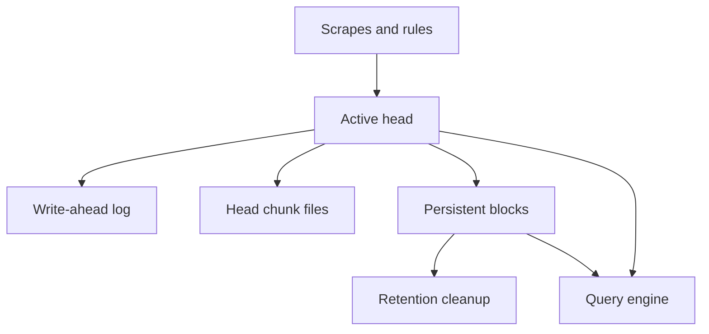

# Lab 18: Prometheus TSDB, Retention, and Capacity

## 1. Purpose and Learning Outcomes

You will inspect Prometheus storage and use real measurements to make a rough capacity estimate. In a separate offline experiment, you will keep the sample count the same while changing how often labels create new series. This shows why storage and query cost depend on series identities and their metadata, not just the number of numeric samples.

> **Primary Objective:** Inspect live storage and compare separate test datasets to understand series counts, incoming samples, retention, and query workload.

Prometheus storage depends on more than request volume. New series created by changing labels, active series, scrape frequency, retention, WAL and head overhead, and repeated queries all contribute to cost.

You will inspect the live TSDB without changing it and create two offline datasets in the evidence directory. The experiment does not import synthetic data into the running server, fill a disk, or delete the Prometheus volume. The local stack still uses one Prometheus node.

## 2. Starting Point and Lab Map

Open the complete application repository before using this guide. Unless a step says otherwise, run commands in Bash from the repository's top-level folder. Follow the starting checks in order because later commands depend on the helper functions and running services they prepare.

Read each explanation before running its commands. Run one complete code block, check the result, and then continue. In your notebook, save the commands, what happened, why you think it happened, and anything that differed from the expected result.

### Key Terms

| **Term**    | **Explanation**                                                        |
| ----------- | ---------------------------------------------------------------------- |
| TSDB        | The storage engine Prometheus uses for time-series data.               |
| WAL         | The write-ahead log, which helps recover recently accepted data.       |
| Label churn | Frequent label-value changes that keep creating new series identities. |

### Lab Map

The arrows show how the parts connect and where a request can take different paths. Use this map to understand the design. It is not a recording of a request that actually ran.


```mermaid
flowchart TD
    S["Scrapes and rules"] --> H["Active head"]
    H --> W["Write-ahead log"]
    H --> C["Head chunk files"]
    H --> B["Persistent blocks"]
    B --> R["Retention cleanup"]
    H --> Q["Query engine"]
    B --> Q
```

## 3. Guided Walkthrough

### Step 01. Inherited State and Starting Checks

**What You Are Doing:** Keep the live retention settings and create generated data in a separate workspace. Offline tools must not change files used by the running TSDB.

**Practical Walkthrough:** Check the live monitoring stage, then prepare the separate storage-experiment directory. Keep the live TSDB volume out of every offline command. You will create disposable comparison data, not edit or repair Prometheus's active files.

Check the offline tool's mount source and destination before starting it. The experiment directory must be separate from the live Prometheus volume. This lets you repeat the test without competing with the running database or changing the monitoring history retained from earlier labs.

```bash
source lab-notes/session.sh
source lab-notes/evidence.sh
source lab-notes/raw-metrics.sh
source lab-notes/metrics-session.sh
metrics_check
start_lab 18
```

Complete [Lab 17](Lab-17.md) first, using the repository root and the same Bash session. Keep existing credentials, named volumes, the checkpoint item, and the three-day and 1 GB retention limits. Run the offline container as your normal host account so its output files remain owned by you.

**Understanding the Result:** Separate storage makes the experiment repeatable without altering live history. Check paths and mounts before running the offline container.

### Step 02. Learning Objectives and Storage Layers

**What You Are Doing:** Distinguish recent head data, recovery files, and completed storage blocks. A sample can be queried before it has been written into a completed block.

**Practical Walkthrough:** Follow samples through the active head, recovery files, and completed persistent blocks. These files serve different stages of storage. Do not assume that the visible block count represents all queryable data; recent samples may still be in the head.

Identify files used for current ingestion, recovery, and completed historical blocks. Data in the head can already be queried. Use this model when reading directory sizes so a small number of block directories is not mistaken for a lack of samples.

You will distinguish head memory, WAL, head chunks, and immutable blocks. You will inspect active retention flags, estimate scrape ingestion separately from rule output, and compare stable and changing labels using equal sample counts.

The lab map in Section 2 shows this relationship.

Block creation, compaction, retention cleanup, and series creation are storage events. They do not necessarily happen on the same schedule as HTTP requests.

**Understanding the Result:** Disk usage includes more than compressed samples. Its layout and size change as Prometheus ingests data and compacts blocks.

### Step 03. Inspect Runtime Flags and TSDB Statistics

**What You Are Doing:** Read the flags and storage statistics of the running process. Do not assume a local configuration file or block count shows the complete active state.

**Practical Walkthrough:** Use the supplied commands to inspect effective runtime flags and current TSDB statistics. A local edit may not be active yet. Save observation times because head data and block layout can change during normal operation.

Save the effective flags and storage statistics with timestamps. Compare them with the intended retention settings. Editing a host file does not automatically change process flags. Head-series counts and block sizes evolve, so note when each measurement was taken.

```bash
api -fsS "$PROM_URL/api/v1/status/flags" > "$LAB_DIR/prometheus-flags.json"
api -fsS "$PROM_URL/api/v1/status/tsdb" > "$LAB_DIR/tsdb-before.json"
jq '.data | with_entries(select(.key|startswith("storage.tsdb")))' "$LAB_DIR/prometheus-flags.json"
jq '.data | {headStats,seriesCountByMetricName,labelValueCountByLabelName}' "$LAB_DIR/tsdb-before.json"
dm exec -T prometheus sh -c 'ls -lah /prometheus; du -sh /prometheus' > "$LAB_DIR/storage-layout.txt"
dm exec -T prometheus /bin/promtool tsdb list /prometheus > "$LAB_DIR/blocks-before.txt"
cat "$LAB_DIR/blocks-before.txt"
```

A new instance may have no persistent blocks yet while still answering queries from head data. Inspect the live store read-only. Never run repair, import, or deletion operations against files that a running Prometheus server owns.

The WAL helps recover recently accepted data. Persistent blocks hold compacted time ranges. Total filesystem bytes, active-series counts, and compressed block bytes describe different aspects of storage.

**Understanding the Result:** Use observed runtime settings in the worksheet. A default you remember does not establish the current retention policy.

### Step 04. Interpret Retention without Treating It as a Disk Quota

**What You Are Doing:** Understand which data retention can remove and which overhead remains. A size-retention value is not an immediate hard cap on every byte in the data directory.

**Practical Walkthrough:** Read retention as a cleanup policy with its own timing and eligible data. Include head data, recovery files, and ongoing storage work when comparing the setting with disk use. The configured size is not an instantaneous quota for all files.

Separate the scope of retention from total disk consumption. Active head data, recovery files, and cleanup timing can keep usage above a simple interpretation of the limit. Use the inventory to explain these parts rather than promising an immediate hard ceiling.

The running system uses a three-day time limit and a 1 GB size limit. Either can remove older persistent data. Size retention considers storage overhead but removes eligible persistent blocks. It cannot guarantee an absolute filesystem limit or immediately shrink the active head and WAL.

Cleanup and compaction run asynchronously. Leave free disk space for WAL segments, head chunks, compaction work, Docker logs, and other services. Setting retention to 1 GB does not mean a 1 GB partition is sufficient.

Prometheus normally first creates local blocks covering roughly two hours, then compacts them later. See the [official local-storage documentation](https://prometheus.io/docs/prometheus/latest/storage/) for retention behavior and capacity factors.

**Understanding the Result:** Retention alone cannot guarantee a hard disk limit. Plan for the full storage process and leave room for temporary and active data.

### Step 05. Measure Ingestion and Rule Contributions

**What You Are Doing:** Estimate samples from scrapes separately from samples created by recording rules. Both use storage, so scrape counts alone do not describe all inserted samples.

**Practical Walkthrough:** Calculate separate contributions from scrape samples and rule output. Rules create stored samples on their own schedule. When rules are enabled, scrape counts alone miss that extra work. State the interval and included sample sources for every estimate.

Estimate scrape and rule contributions separately, then compare them with the observed append rate. Keep the time intervals explicit. A scrape-count estimate is useful, but it is not the exact total insertion rate when rules also write samples.

Use the `pq` helper to run and save these expressions:

```promql
prometheus_tsdb_head_series
```

```promql
sum(rate(prometheus_tsdb_head_samples_appended_total[5m]))
```

```promql
sum(scrape_samples_post_metric_relabeling) / 15
```

```promql
prometheus_tsdb_storage_blocks_bytes
```

```promql
prometheus_tsdb_wal_storage_size_bytes
```

```promql
prometheus_tsdb_head_chunks_storage_size_bytes
```

Dividing the total post-relabel sample count by 15 seconds estimates source ingestion when all current jobs use that interval. It excludes rule output and automatically generated scrape series. The append counter measures actual appends across sample types; add together its `type` values.

Do not divide all retained historical samples by the scrape interval and call that current ingestion. The head-series count is also neither the count of all historical series nor the number of requests served.

**Understanding the Result:** Include every source of stored samples in your reasoning. Calculated rule results also consume storage and query resources.

### Step 06. Build a Capacity Worksheet

**What You Are Doing:** Build a worksheet from measured rates using several assumptions about bytes per sample. Show uncertainty and omitted overhead instead of presenting one estimate as a guarantee.

**Practical Walkthrough:** Enter the measured ingestion rate and try several bytes-per-sample assumptions. Keep formulas and units visible so another reader can adjust them. Explain how series overhead and workload growth could change the result.

Check the sample-rate input and units before multiplying by duration and bytes per sample. Keep more than one storage scenario. The simple calculation does not capture every effect of series overhead, retention behavior, or future growth.

Record samples per second, active series, block bytes, WAL bytes, and total volume bytes. For a deliberately rough estimate of sample payload size, calculate:

`sample bytes ≈ samples/second × retention seconds × assumed bytes/sample`

Use several assumptions rather than one supposedly universal bytes-per-sample value. The example uses 2 and 8 bytes per sample to show how the estimate changes. It leaves out indexes, label strings, WAL and head memory, compaction, and spare capacity.

```bash
SAMPLE_RATE=$(pq 'sum(rate(prometheus_tsdb_head_samples_appended_total[5m]))' | jq -er '.data.result[0].value[1]')
python3 - "$SAMPLE_RATE" <<'PYTHON'
import math, sys
rate=float(sys.argv[1]);assert math.isfinite(rate) and rate >= 0
for days in (3,7,30):
    for bytes_per_sample in (2,8):
        gib=rate*days*86400*bytes_per_sample/(1024**3)
        print(f"{days} days at {bytes_per_sample} bytes/sample: {gib:.3f} GiB payload scenario")
PYTHON
```

If the rate is missing just after startup, collect a few minutes of samples instead of substituting zero. Compare this planning estimate with measured disk growth. It is not a guaranteed purchase-size recommendation.

**Understanding the Result:** The worksheet shows how assumptions affect the answer. Actual storage measurements are still needed before committing to a capacity figure.

### Step 07. Predict the Equal-Sample Experiment

**What You Are Doing:** Predict the difference between stable and changing labels when both datasets contain the same number of samples. More series need more identity, index, and chunk information.

**Practical Walkthrough:** Predict both datasets before creating them. Each has 1,200 samples, but one has 10 stable series and the other has 120 series created by changing labels. Extra identities require more indexing and chunk structure, so equal sample counts may use different storage sizes.

Keep the total number of samples fixed and vary only the identities. Predict the extra indexing and chunk overhead before generating the files. This isolates the effect of more series instead of simply comparing more samples with fewer samples.

Both datasets have 1,200 samples across ten worker labels. Stable labels produce ten series. In the churn dataset, a generation label changes every ten observations, producing 120 series.

Predict which dataset needs more chunk and index metadata despite having the same sample count. Also explain why a short offline test cannot establish full production memory use or a universal storage multiplier.

**Understanding the Result:** This comparison tests series structure at equal sample count. It does not reproduce everything a long-running production TSDB does.

### Step 08. Create the Offline Datasets

**What You Are Doing:** Generate and convert both datasets in an isolated directory. The offline container receives neither the live data volume nor network access to the running server.

**Practical Walkthrough:** Use only the isolated directory mounted into the offline tool. Confirm that the live TSDB volume is absent and network access is disabled. All generated files should belong to this disposable experiment.

Inspect the test directory and mounts, then generate both fixtures using the same process. Confirm that no live TSDB volume is attached. Keep inputs and outputs together so the comparison can be repeated or removed without changing the running service.

```bash
cat > lab-notes/capacity_fixture.py <<'PYTHON'
"""Write equal-size sample populations with stable versus changing label sets."""

import json
import sys
import time
from pathlib import Path

root = Path(sys.argv[1])
root.mkdir(parents=True, exist_ok=True)
start = ((int(time.time()) - 86400) // 7200) * 7200
for mode in ("stable", "churn"):
    lines = ["# TYPE learning_capacity gauge"]
    # Keep each series contiguous, with ascending timestamps for offline import.
    for worker in range(10):
        generations = range(12) if mode == "churn" else range(1)
        for generation in generations:
            ticks = (
                range(generation * 10, generation * 10 + 10)
                if mode == "churn"
                else range(120)
            )
            for tick in ticks:
                labels = f'worker="{worker}",generation="{generation}"'
                lines.append(
                    f"learning_capacity{{{labels}}} {tick % 7} {start + tick * 15}"
                )
    (root / f"{mode}.om").write_text("\n".join(lines) + "\n# EOF\n")
(root / "manifest.json").write_text(
    json.dumps(
        {"samples_per_dataset": 1200, "stable_series": 10, "churn_series": 120},
        indent=2,
    )
    + "\n"
)
print(root / "manifest.json")
PYTHON
```

**Command Note:** `<<'PYTHON'` writes the following text literally until the closing `PYTHON`. Quoting the delimiter prevents Bash from expanding `$variables` inside the file. Creating the file and executing it are separate steps.

```bash
python3 lab-notes/capacity_fixture.py "$LAB_DIR/tsdb-sandbox"
tsdb_tool() {
  if [[ "$(id -u)" = 0 ]]; then printf 'Run this fixture as a normal host user\n' >&2; return 1; fi
  docker run --rm --network none --read-only --user "$(id -u):$(id -g)" \
    --cap-drop ALL --security-opt no-new-privileges:true --tmpfs /tmp \
    -v "$LAB_DIR/tsdb-sandbox:/sandbox" --entrypoint /bin/promtool \
    prom/prometheus:v3.14.0 "$@"
}
tsdb_tool tsdb create-blocks-from openmetrics /sandbox/stable.om /sandbox/stable-db
tsdb_tool tsdb create-blocks-from openmetrics /sandbox/churn.om /sandbox/churn-db
tsdb_tool tsdb list /sandbox/stable-db > "$LAB_DIR/stable-blocks.txt"
tsdb_tool tsdb list /sandbox/churn-db > "$LAB_DIR/churn-blocks.txt"
cat "$LAB_DIR/stable-blocks.txt" "$LAB_DIR/churn-blocks.txt"
```

Only the isolated evidence subdirectory is mounted. The fixture container has no network and no live Prometheus data volume. OpenMetrics timestamps use seconds. The generator puts samples in one older two-hour interval to keep the block comparison simple.

**Understanding the Result:** Offline conversion creates separate blocks. Demonstrating its storage effects does not require changing active Prometheus files.

### Step 09. Verify Counts and Compare Bytes

**What You Are Doing:** Verify sample and series counts before comparing sizes. Distinguish a file's logical length from the disk space allocated to it, especially for these small datasets.

**Practical Walkthrough:** Check the resulting counts first, then compare sizes using the same method for both datasets. A file's logical length can differ from allocated disk space because filesystems allocate storage in units. Label each measurement clearly.

Confirm 1,200 samples and the intended series counts. State whether each byte measurement is logical file length or allocated space, and use the same measure on both outputs. Keep both measurements where supplied, since allocation effects can matter for small files.

```bash
python3 - "$LAB_DIR/tsdb-sandbox" <<'PYTHON'
import json, sys
from pathlib import Path
root=Path(sys.argv[1])
for name, expected in (("stable",10),("churn",120)):
    folder=root/(name+"-db")
    metadata=[json.loads(p.read_text()) for p in folder.glob("*/meta.json")]
    assert len(metadata)==1, metadata
    stats=metadata[0]["stats"]
    assert stats["numSamples"]==1200 and stats["numSeries"]==expected
    size=sum(p.stat().st_size for p in folder.rglob("*") if p.is_file())
    print(name, stats, {"logical_file_bytes":size})
PYTHON
```

Expect ten versus 120 series and a larger churn dataset. Allocated disk space can differ from logical file length, especially for small blocks. Equal sample counts do not imply equal label, index, or chunk overhead.

This experiment compares offline blocks. It does not benchmark live WAL size or application latency. Its exact size ratio should not be treated as a general production rule.

**Understanding the Result:** Explain sizes together with the verified counts. Do not turn a small experiment's ratio into a universal bytes-per-sample constant.

### Step 10. Connect Storage Decisions to Query Cost

**What You Are Doing:** Increase a real query's time range and inspect how many samples it processes. The number of graph points does not show how much input the engine must read.

**Practical Walkthrough:** Keep the expression and selected labels fixed while extending the time range. Compare processed samples. A graph with few displayed points can still require many input samples, especially when calculations combine series.

Change only the queried time range and compare engine work with display resolution. One plotted point can depend on many input samples. Aggregation may read far more data than the final graph shows.

Use Lab 16's statistics to compare raw and recorded queries. Then extend only the time window for one existing query. Save the expression, window, step, and processed-sample count.

Longer ranges and more selected series can add query work even with slow dashboard refresh. Shorter scrape intervals collect denser data. A smaller Grafana step cannot recover measurements never collected. Recording rules replace repeated calculations with scheduled work and additional storage.

Three-day retention cannot provide a complete rolling 30-day SLO report. Lab 25 will distinguish the objective from the learning data available. A short partial result must not be labeled as month-long compliance.

**Understanding the Result:** Query cost depends on the selected data and calculations, not just screen resolution. Save the time range alongside the sample-processing evidence.

### Step 11. Recovery, Evidence and Troubleshooting

**What You Are Doing:** Check that live collection and the checkpoint still work after the offline test. Record storage observations without forcing compaction or repair on the live database.

**Practical Walkthrough:** Recheck collection, rules, and the business checkpoint. Keep the dataset comparison and worksheet as evidence. Explain uncertain sizes instead of changing the running storage to obtain a neater number.

After the tool exits, confirm current collection, recording output, and the checkpoint. Keep the offline measurements and assumptions. Successful completion means the live monitoring path remains unchanged and usable; it does not require resetting or compacting history to match an expected size.

```bash
metrics_check
api -fsS "$PROM_URL/api/v1/status/tsdb" > "$LAB_DIR/tsdb-after.json"
api -fsS "$APP_URL/api/v1/items?limit=1" > "$LAB_DIR/business-after.json"
record_change "offline_capacity_comparison_completed_live_tsdb_untouched" completed
```

| **Symptom**                             | **Explanation or Check**                               | **Action**                                                          |
| --------------------------------------- | ------------------------------------------------------ | ------------------------------------------------------------------- |
| No persistent blocks                    | The server is new or head data has not been compacted  | Inspect head statistics; do not force live compaction               |
| Size exceeds configured retention       | WAL, head, compaction overhead, and delayed cleanup    | Inspect total use and free space, and leave room for overhead       |
| Fixture permission denied               | Numeric UID and directory permissions                  | Use the normal account that owns the evidence directory             |
| Churn bytes differ from another machine | Filesystem allocation or block metadata differences    | Compare counts and measurement methods, not an exact expected ratio |
| Ingestion metric initially absent       | Too little append or scrape history                    | Wait for collection rather than substituting zero                   |

No infrastructure rollback is needed because the live configuration and storage were unchanged. Keep the small fixture files until your notebook comparison is complete. Never use `docker compose down -v` for this lab's cleanup.

**Understanding the Result:** A healthy, unchanged live stage confirms that the experiment stayed isolated. The offline findings describe the generated datasets only.

## 4. Troubleshooting and Diagnosis

Begin with the first result that differed from your prediction. Save the exact error or symptom and identify which service or command produced it. Use the checks below, make the needed fix, and repeat the original check to confirm the problem is resolved.

Use the recovery and troubleshooting checks in Step 11.

## 5. Review and Practice

Answer the questions in your own words before reading the answers. For the scenario, say what you would inspect and exactly what each result would tell you.

### Knowledge Check

1. Why is size retention not a hard quota?
2. Why does label churn cost more at equal sample count?
3. Can three days of data prove a 30-day SLO?

#### Answer Guide

1. Cleanup removes eligible persistent blocks asynchronously. Active storage and other overhead can remain beyond a simple reading of the size limit.
2. Extra series need additional labels, indexes, chunks, and work to manage their lifetimes, even with the same sample count.
3. No. Three days leave most of the 30-day measurement window unobserved.

### Professional Scenario Exercise

Disk use grows while request volume stays steady. Before changing retention, compare incoming sample counts, new series, changing labels, rule output, and Docker logs. Explain what evidence would justify removing some telemetry.

## 6. Completion Checklist

Tick an item only when you can show its result or saved evidence. Finish the cleanup instructions before starting the next lab.

### Observable Completion Criteria

- [ ] I have documented active retention settings and the different storage layers.
- [ ] I can distinguish current ingestion from all retained historical samples.
- [ ] Both isolated datasets have 1,200 samples, with 10 and 120 series respectively.
- [ ] My capacity estimate clearly states its assumptions and excluded overhead.
- [ ] The live application and all five scrape jobs remain healthy.

## 7. Production Context and Next Lab

### Production Implications

Capacity planning needs measured growth, spare room for failures, and query limits. Saving a local TSDB does not provide replication or a backup. Extending retention affects storage requirements and recovery, so it needs an engineering decision.

### End State and Transition

Keep the seven-service metrics stage. [Lab 19](Lab-19.md) adds Grafana to query and display data from the existing Prometheus source.
