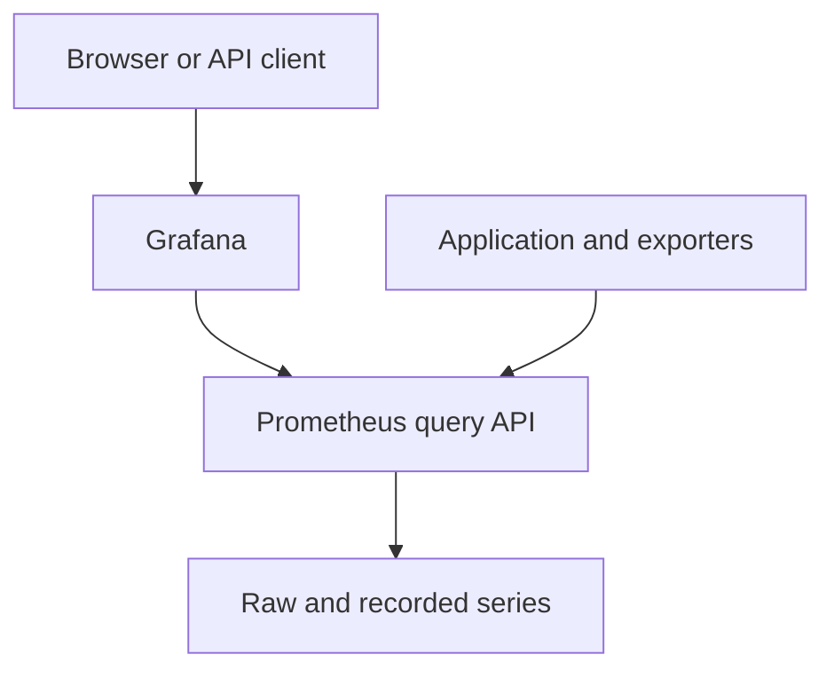

# Lab 19: Grafana Explore and Data Source Fundamentals

## Purpose and Scope

> **Primary Objective:** Query Prometheus through Grafana and separate visualization, query semantics, data-source connectivity and backend availability.

Grafana does not scrape this application or create missing metric history. It sends queries to the already configured Prometheus server.

You will provision one Prometheus data source, use Explore and Query Inspector, reproduce a query through Grafana's API, and observe a bounded source outage. Dashboards begin in Lab 20. Loki, Tempo, Collector, Pyroscope and Alertmanager remain stopped here.

## 1. Inherited State and Starting Checks

```bash
source lab-notes/session.sh
source lab-notes/evidence.sh
source lab-notes/raw-metrics.sh
source lab-notes/metrics-session.sh
metrics_check
start_lab 19
```

Complete [Lab 18](Lab-18.md) first. Run commands from the repository root in the same Bash session. Keep the existing credentials, named volumes and checkpoint item. Begin with seven services and five jobs. Keep Grafana pinned to `13.2.2` and its existing named volume. You need a browser and the current Grafana account credentials.

## 2. Learning Objectives and Networking Boundaries

You will verify the internal data-source URL, distinguish instant and range requests, inspect query step/time/labels, compare returned values across APIs and diagnose empty results separately from transport failures.



Grafana startup/provisioning and Prometheus stop/recovery are change events. Application requests remain independent business events. A healthy Grafana database does not prove that its Prometheus data source is healthy.

## 3. Create Focused Provisioning

```bash
mkdir -p lab-notes/grafana/provisioning/datasources \
  lab-notes/grafana/provisioning/dashboards lab-notes/grafana/dashboards
chmod 755 lab-notes/grafana lab-notes/grafana/provisioning \
  lab-notes/grafana/provisioning/datasources lab-notes/grafana/provisioning/dashboards \
  lab-notes/grafana/dashboards
```

```bash
cat > lab-notes/grafana/provisioning/datasources/datasources.yml <<'YAML'
apiVersion: 1
prune: false
datasources:
  - name: Prometheus
    uid: prometheus
    type: prometheus
    access: proxy
    url: http://prometheus:9090
    isDefault: true
    editable: false
    jsonData:
      httpMethod: POST
      timeInterval: 15s
YAML
```

```bash
cat > lab-notes/compose.grafana.yaml <<'YAML'
services:
  grafana:
    volumes:
      - ./lab-notes/grafana/provisioning:/etc/grafana/provisioning:ro
      - ./lab-notes/grafana/dashboards:/var/lib/grafana/dashboards:ro
YAML
```

The two mounts replace matching base destinations, preserving the pinned image, non-root user, loopback port, health check and Grafana database volume. The dashboard provider directory is intentionally empty until dashboard concepts are introduced.

An earlier full-stack run may have left objects in the persistent database. Validate the `prometheus` UID without deleting unrelated dashboards or changing stored credentials.

## 4. Extend the Stage Helper

```bash
cat > lab-notes/metrics-session.sh <<'BASH'
# Source after session.sh, evidence.sh and raw-metrics.sh.
export PROM_URL="${PROM_URL:-http://127.0.0.1:9090}"

dm() {
  local -a files=(
    -f "$LAB_ROOT/docker-compose.yml"
    -f "$LAB_ROOT/lab-notes/compose.baseline.yaml"
    -f "$LAB_ROOT/lab-notes/compose.metrics.yaml"
  )
  if [[ -f "$LAB_ROOT/lab-notes/compose.node-exporter.yaml" ]]; then
    LAB_NODE_BIND_IP=$(cat "$LAB_ROOT/lab-notes/node-exporter-address.txt") || return 1
    export LAB_NODE_BIND_IP
    files+=(-f "$LAB_ROOT/lab-notes/compose.node-exporter.yaml")
  fi
  if [[ -f "$LAB_ROOT/lab-notes/compose.db-exporters.yaml" ]]; then
    files+=(-f "$LAB_ROOT/lab-notes/compose.db-exporters.yaml")
  fi
  for extra in grafana alertmanager; do
    if [[ -f "$LAB_ROOT/lab-notes/compose.$extra.yaml" ]]; then files+=(-f "$LAB_ROOT/lab-notes/compose.$extra.yaml"); fi
  done
  docker compose --project-directory "$LAB_ROOT" --env-file "$LAB_ROOT/.env" "${files[@]}" "$@"
}

pq() {
  api -fsS --get --data-urlencode "query=$1" "$PROM_URL/api/v1/query"
}

wait_prometheus() {
  local attempt
  for attempt in {1..45}; do
    if api -fsS "$PROM_URL/-/ready" >/dev/null 2>&1; then return 0; fi
    sleep 1
  done
  echo 'Prometheus readiness deadline exceeded' >&2
  return 1
}

wait_target() {
  local job="$1" health="${2:-up}" attempt
  for attempt in {1..45}; do
    if api -fsS "$PROM_URL/api/v1/targets?state=active" \
      | jq -e --arg job "$job" --arg health "$health" \
        '[.data.activeTargets[] | select(.labels.job == $job)] as $targets |
         ($targets | length > 0) and all($targets[]; .health == $health)' >/dev/null; then
      return 0
    fi
    sleep 1
  done
  printf 'Target %s did not become %s\n' "$job" "$health" >&2
  return 1
}

wait_metric() {
  local query="$1" expected="$2" attempt
  for attempt in {1..45}; do
    if pq "$query" | jq -e --arg expected "$expected" \
      '.status == "success" and (.data.result | length > 0) and all(.data.result[]; .value[1] == $expected)' \
      >/dev/null; then return 0; fi
    sleep 1
  done
  printf 'Metric expectation not reached: %s = %s\n' "$query" "$expected" >&2
  return 1
}

set_app_target() {
  python3 - "$LAB_ROOT/lab-notes/prometheus/app-targets.json" "$1" "$LAB_ENVIRONMENT" "$LAB_SERVICE" <<'PYTHON'
import json, os, sys
from pathlib import Path
path = Path(sys.argv[1])
endpoint, environment, service = sys.argv[2:]
content = [] if not endpoint else [{"targets":[endpoint], "labels":{"environment":environment,"service":service}}]
temporary = path.with_suffix(".json.new")
temporary.write_text(json.dumps(content, indent=2) + "\n")
os.chmod(temporary, 0o644)
os.replace(temporary, path)
PYTHON
}

reload_prometheus() {
  dm run --rm -T --no-deps --entrypoint promtool prometheus \
    check config /etc/prometheus/labs/prometheus.yml || return 1
  dm kill -s HUP prometheus
}

metrics_check() {
  wait_ready && load_app_settings && wait_prometheus || return 1
  local actual expected
  expected=$'app\npostgres\nprometheus\nredis'
  if [[ -f "$LAB_ROOT/lab-notes/compose.node-exporter.yaml" ]]; then
    expected+=$'\nnode-exporter'
  fi
  if [[ -f "$LAB_ROOT/lab-notes/compose.db-exporters.yaml" ]]; then
    expected+=$'\npostgres-exporter\nredis-exporter'
  fi
  for extra in grafana alertmanager; do
    if [[ -f "$LAB_ROOT/lab-notes/compose.$extra.yaml" ]]; then expected+=$'\n'"$extra"; fi
  done
  actual=$(dm ps --services --status running | sort) || return 1
  expected=$(printf '%s\n' "$expected" | sort)
  if [[ "$actual" != "$expected" ]]; then
    printf 'Unexpected active services:\n%s\n' "$actual" >&2
    return 1
  fi
  wait_target fastapi && wait_target prometheus || return 1
  if [[ -f "$LAB_ROOT/lab-notes/compose.node-exporter.yaml" ]]; then
    wait_target node || return 1
  fi
  if [[ -f "$LAB_ROOT/lab-notes/compose.db-exporters.yaml" ]]; then
    wait_target postgres && wait_target redis || return 1
    wait_metric 'pg_up{job="postgres"}' 1 && wait_metric 'redis_up{job="redis"}' 1 || return 1
  fi
  if [[ -f "$LAB_ROOT/lab-notes/compose.grafana.yaml" ]]; then wait_grafana || return 1; fi
  if [[ -f "$LAB_ROOT/lab-notes/compose.alertmanager.yaml" ]]; then
    api -fsS "${ALERTMANAGER_URL:-http://127.0.0.1:9093}/-/ready" >/dev/null || return 1
    wait_target alertmanager || return 1
  fi
  echo 'Current learning-stage services and targets are ready' 
}

export GRAFANA_URL="${GRAFANA_URL:-http://127.0.0.1:3000}"
wait_grafana() {
  local attempt
  for attempt in {1..60}; do
    if api -fsS "$GRAFANA_URL/api/health" 2>/dev/null | jq -e '.database=="ok"' >/dev/null; then return 0; fi
    sleep 1
  done
  echo 'Grafana readiness deadline exceeded' >&2
  return 1
}
gapi() {
  : "${GRAFANA_USER:?Set the current Grafana username first}"
  local path="$1"
  shift
  api --user "$GRAFANA_USER" "$@" "$GRAFANA_URL$path"
}
BASH
```

This complete replacement preserves earlier commands and includes optional Grafana/Alertmanager overlays only when their files exist. The Alertmanager branch is used in Lab 24; it does not start that service now.

## 5. Start Grafana and Verify Its Health

```bash
chmod 644 lab-notes/grafana/provisioning/datasources/datasources.yml
source lab-notes/metrics-session.sh
dm config --quiet
record_change "start_grafana_with_prometheus_source" planned
dm up -d grafana
wait_grafana
metrics_check
api -fsS "$GRAFANA_URL/api/health" > "$LAB_DIR/grafana-health.json"
jq . "$LAB_DIR/grafana-health.json"
```

Expect eight running services, still five scrape jobs, and Grafana database health `ok`. Only the inherited volume initializer may run as a completed dependency. Do not issue an unqualified `dm up` that starts every full-platform service.

## 6. Access the UI and Respect Credential State

Browse `http://127.0.0.1:3000` on the Docker host. On a remote VM, tunnel the loopback port from your workstation:

```bash
read -r -p 'SSH destination (user@VM): ' LAB_SSH_DESTINATION
ssh -N -L 3000:127.0.0.1:3000 "$LAB_SSH_DESTINATION"
```

Keep the tunnel terminal open. If the workstation's port 3000 is occupied, choose another local port and browse that port. Use the current Grafana credentials from your private setup.

Changing initial-admin environment variables does not reset an existing Grafana database account. Do not expose Grafana publicly or enable anonymous admin access to work around an authentication problem.

## 7. Inspect the Provisioned Source

Open **Connections → Data sources → Prometheus**. Confirm UID `prometheus`, URL `http://prometheus:9090`, POST query method and a 15-second scrape-interval reference.

This URL is used by the Grafana server container. `127.0.0.1:9090` would refer to that container, not to the Prometheus service. The browser's Grafana URL and the server-side data-source URL have different networking roles.

The source is provisioned and not UI-editable. See [Grafana data-source provisioning](https://grafana.com/docs/grafana/latest/administration/provisioning/#data-sources).

## 8. Verify the Source Through the API

```bash
GRAFANA_USER=$(dm exec -T grafana sh -c 'printf "%s" "$GF_SECURITY_ADMIN_USER"')
export GRAFANA_USER
gapi /api/datasources/uid/prometheus -fsS > "$LAB_DIR/datasource.json"
gapi /api/datasources/uid/prometheus/health -fsS > "$LAB_DIR/datasource-health.json"
jq '{uid,name,type,url,access,jsonData}' "$LAB_DIR/datasource.json"
jq . "$LAB_DIR/datasource-health.json"
```

The helper gives curl only the username; curl prompts for the password without echo. Use the current account name if it differs from the initial environment value. Do not put a password in command arguments or enable shell tracing.

The source health endpoint tests its backend path; Grafana `/api/health` tests Grafana's own database. These compatibility HTTP endpoints are supported by the pinned version.

## 9. Use Explore With Raw and Recorded Values

Open **Explore**, choose Prometheus and Code mode. Run each expression separately:

```promql
up{job="fastapi"}
```

```promql
application_http_requests_total{job="fastapi",route="/api/v1/items",method="GET",status_code="200"}
```

```promql
service_route:application_http_requests:rate2m{route="/api/v1/items",method="GET"}
```

The first should be one currently healthy target. The second is a lifetime process counter. The third is a recorded requests/second gauge without job/instance labels. Do not take its rate again or filter it by a removed job label.

Switch between instant/table and range/time-series views. A historical zero or gap does not necessarily describe current health. Generate a few ordinary list requests if the selected route has no source history.

## 10. Inspect the Request Before Interpreting the Chart

Open Query Inspector and record the expression, start/end times, evaluation step, returned labels and point count. A scrape interval controls collection, a query step controls evaluation points and dashboard refresh controls how often the browser asks again.

Grafana can align time boundaries and choose a step based on display resolution. A finer step does not restore unsampled history. Compare actual query requests before claiming two graphs disagree. Keep an absolute UTC range when correlating with earlier fault timestamps.

## 11. Reproduce a Grafana Query

```bash
cat > lab-notes/grafana/query-up.json <<'JSON'
{"from":"now-5m","to":"now","queries":[{"refId":"A","datasource":{"type":"prometheus","uid":"prometheus"},"expr":"up{job=\"fastapi\"}","instant":true,"range":false,"format":"time_series","intervalMs":15000,"maxDataPoints":100}]}
JSON
gapi /api/ds/query --fail-with-body -sS -X POST -H 'Content-Type: application/json' \
  --data-binary @lab-notes/grafana/query-up.json > "$LAB_DIR/grafana-up-query.json"
pq 'up{job="fastapi"}' > "$LAB_DIR/direct-up-query.json"
jq '.results.A | {status,error,frames}' "$LAB_DIR/grafana-up-query.json"
```

Compare the numeric values and labels rather than JSON shape: Grafana wraps data frames while Prometheus returns a vector/matrix. An HTTP 200 can still carry a per-query error, so inspect the result's error/status fields and frames.

## 12. Distinguish Empty, Zero and Error

Query a deliberately nonexistent route selector in Explore:

```promql
application_http_requests_total{job="fastapi",route="/this-route-does-not-exist"}
```

Then run `up{job="fastapi"}` and finally a malformed expression such as `sum(`. Record the valid empty result, the valid numeric result and the explicit parse failure.

Do not replace all missing/error cases with zero. Such a transform can make a broken query path look healthy and can turn an undefined error fraction into false success.

## 13. Predict and Observe a Brief Source Outage

```bash
(
  set -euo pipefail
  trap 'dm start prometheus >/dev/null' EXIT
  trap 'exit 130' INT
  trap 'exit 143' TERM
  record_change "brief_prometheus_stop_for_source_boundary" planned
  dm stop prometheus
  api -fsS "$GRAFANA_URL/api/health" > "$LAB_DIR/grafana-with-source-down.json"
  api -fsS "$APP_URL/api/v1/items?limit=1" > "$LAB_DIR/business-with-source-down.json"
  if gapi /api/ds/query --fail-with-body -sS -X POST -H 'Content-Type: application/json' \
    --data-binary @lab-notes/grafana/query-up.json > "$LAB_DIR/source-down-query.json"; then
    jq -e '.results.A.error != null' "$LAB_DIR/source-down-query.json"
  else
    printf 'Source request failed as expected; inspect captured response\n'
  fi
)
wait_prometheus
wait_target fastapi up
metrics_check
gapi /api/datasources/uid/prometheus/health -fsS > "$LAB_DIR/source-recovered.json"
record_change "prometheus_query_path_recovered" completed
```

Before running it, predict which health checks will stay healthy. Expected: Grafana's database and the business API still work, while the Prometheus-backed query fails. The trap restarts only Prometheus.

Prometheus performs no scrapes/rule evaluations while stopped. Recovery resumes collection; it does not automatically backfill missing observations. This brief boundary exercise is distinct from the larger telemetry-backend incident lab later in the curriculum.

## 14. Troubleshooting and Evidence

| Symptom | Inspect | Corrective action |
|---|---|---|
| Login fails after changing `.env` | Existing Grafana account | Use/recover the current stored credential; do not erase the volume |
| Source health fails | Internal URL, DNS, Prometheus readiness | Use `http://prometheus:9090`, not container localhost |
| Raw metric works, recorded metric empty | Recording labels/health | Remove job/instance filters and inspect rule output |
| Grafana responds but panels fail | Per-query error and source path | Separate Grafana health from backend health |
| Direct and UI values differ | Time, step, population | Compare the actual Query Inspector request |

Save one successful frame response, one failed-source response and final source health. Review Grafana and Prometheus logs if the expected boundary is different. Keep eight services running after recovery.

## 15. Knowledge Check

1. Does Grafana scrape FastAPI here?
2. Why is datasource localhost wrong?
3. Does a finer display step add measurements?

### Answer Guide

1. No. Prometheus scrapes; Grafana queries Prometheus.
2. The request is made from the Grafana container, whose localhost is not Prometheus.
3. No. It changes query evaluation/display density, not source collection.

## 16. Professional Scenario Exercise

Grafana is reachable, the application is healthy and every panel is empty. Build a diagnostic sequence that separates credentials, data-source transport, missing labels, query errors and an inappropriate time window.

## 17. Lab Notebook Template

Create a notebook in the evidence directory for this run:

```bash
test -e "$LAB_DIR/notebook.md" || printf '# Lab 19 Evidence\n' > "$LAB_DIR/notebook.md"
```

Use these headings and fill them with your predictions, commands, observed results and conclusions:

```markdown
# Lab 19 Evidence

## Starting state and operational question
## Prediction before the change
## Commands and timestamps
## Observed results and source evidence
## Unexpected findings and troubleshooting
## Recovery proof and remaining limitations
```

## 18. Observable Completion Criteria

- [ ] Grafana provisions the correct internal Prometheus URL and UID.
- [ ] Instant/range and raw/recorded queries are distinguished.
- [ ] Query Inspector evidence captures scope and evaluation settings.
- [ ] Empty results and query failures remain distinct.
- [ ] Source outage and recovery are proven through both API and business evidence.

## 19. Production Implications

Provision stable data-source identities and keep administrative access private. Visualization health is only one layer; monitor the query backend and collection paths independently.

## 20. End State and Transition

Keep eight services and the single working source. [Lab 20](Lab-20.md) builds a RED dashboard from operational questions and verified metric populations.
