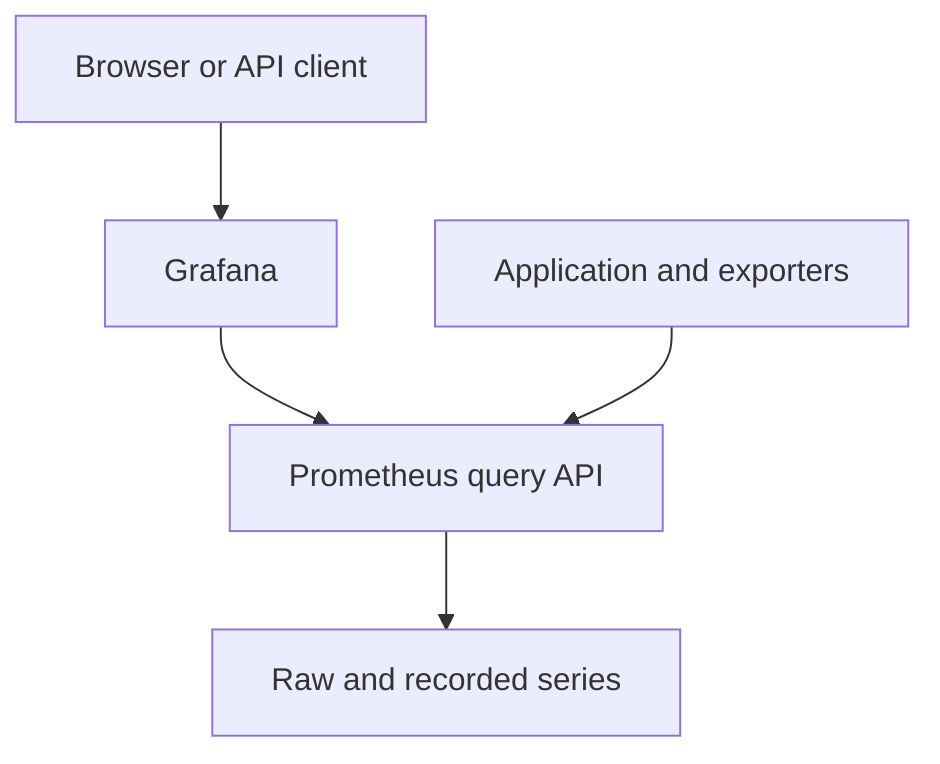

# Lab 19: Grafana Explore and Data Source Fundamentals

## 1. Purpose and Learning Outcomes

You will connect Grafana to the Prometheus data already being collected and learn how a chart is produced. You will check the server connection, repeat a query outside the panel, and distinguish no matching data from a query error. A short Prometheus outage shows why a healthy Grafana service does not guarantee that its data source is available.

> **Primary Objective:** Query Prometheus through Grafana while checking visualization, query meaning, data-source connectivity, and backend availability separately.

Grafana does not scrape the app or create missing history in this setup. It sends queries to the Prometheus server configured in earlier labs.

You will provision one Prometheus data source, use Explore and Query Inspector, repeat a query through Grafana's API, and observe a short source outage. Dashboards start in Lab 20. Loki, Tempo, Collector, Pyroscope, and Alertmanager remain stopped.

## 2. Starting Point and Lab Map

Open the complete application repository before using this guide. Unless a step says otherwise, run commands in Bash from the repository's top-level folder. Follow the starting checks in order because later commands depend on the helper functions and running services they prepare.

Read each explanation before running its commands. Run one complete code block, check the result, and then continue. In your notebook, save the commands, what happened, why you think it happened, and anything that differed from the expected result.

### Key Terms

| **Term**     | **Explanation**                                                                          |
| ------------ | ---------------------------------------------------------------------------------------- |
| Data source  | Grafana's saved connection settings for a backend such as Prometheus.                    |
| Query step   | Time between evaluations in a range query; it does not change how often scraping occurs. |
| Provisioning | Loading reviewed configuration files into Grafana.                                       |

### Lab Map

The arrows show how the parts connect and where a request can take different paths. Use this map to understand the design. It is not a recording of a request that actually ran.


```mermaid
flowchart TD
    B["Browser or API client"] --> G["Grafana"]
    G --> P["Prometheus query API"]
    P --> R["Raw and recorded series"]
    A["Application and exporters"] --> P
```

## 3. Guided Walkthrough

### Step 01. Inherited State and Starting Checks

**What You Are Doing:** Check existing collection and keep Grafana's data volume. Account settings already saved in that volume may not change when startup environment variables change.

**Practical Walkthrough:** Verify Prometheus and its targets before adding Grafana. Preserve the Grafana volume, which may contain existing accounts and settings. Startup variables can initialize new state without replacing values already stored in the database.

Check fresh Prometheus data first. Keep the existing Grafana volume and determine whether it already holds initialized account state. Changing a startup variable is not necessarily a password change for an account already stored there.

```bash
source lab-notes/session.sh
source lab-notes/evidence.sh
source lab-notes/raw-metrics.sh
source lab-notes/metrics-session.sh
metrics_check
start_lab 19
```

Complete [Lab 18](Lab-18.md) first, using the repository root and the same Bash session. Keep credentials, named volumes, and the checkpoint item. Start with seven services and five jobs. Keep Grafana at `13.2.2` with its existing volume. You will need a browser and the current Grafana account credentials.

**Understanding the Result:** Know whether Grafana is starting with fresh or existing data. A login mismatch may concern a saved account rather than a failed service startup.

### Step 02. Learning Objectives and Networking Boundaries

**What You Are Doing:** Treat the browser, Grafana server, and Prometheus as separate network participants. An address must work from the component making the request.

**Practical Walkthrough:** Identify who uses each URL. Your browser connects to Grafana; the Grafana server connects to Prometheus. A Docker hostname may not resolve in your browser, and the browser's loopback address refers to your own machine. Choose addresses using the caller shown in the diagram.

Label the two paths: browser to Grafana, and Grafana to Prometheus. They run in different network contexts. Diagnose each from its caller's location. Opening Grafana in a browser does not prove its container can reach the data source.

You will check the internal data-source URL, compare instant and range queries, inspect time settings and labels, compare API results, and distinguish empty data from connection failures.

The lab map in Section 2 shows this relationship.

Grafana startup and provisioning, and Prometheus stop and recovery, are configuration or service events. App requests are separate business events. Grafana's own database can be healthy while its Prometheus connection fails.

**Understanding the Result:** An address is correct only relative to its caller. Use the documented internal URL for Grafana's server-to-server connection.

### Step 03. Create Focused Provisioning

**What You Are Doing:** Create the focused data-source configuration and mounts. Add the source first so you can understand its queries before adding dashboards.

**Practical Walkthrough:** Create the provisioning file at the path mounted by the overlay. Its stable UID lets later dashboards identify the same source. Starting with the source alone makes it easier to validate queries before importing dashboard definitions.

Check the mounted destination and source UID before startup. Dashboards use that UID, while the URL tells Grafana where to send requests. A source can appear correctly in the list and still fail if its URL is unreachable.

```bash
mkdir -p lab-notes/grafana/provisioning/datasources \
  lab-notes/grafana/provisioning/dashboards lab-notes/grafana/dashboards
chmod 755 lab-notes/grafana lab-notes/grafana/provisioning \
  lab-notes/grafana/provisioning/datasources lab-notes/grafana/provisioning/dashboards \
  lab-notes/grafana/dashboards
```

```bash
cat > lab-notes/grafana/provisioning/datasources/datasources.yml <<'YAML'
apiVersion: 1
prune: false
datasources:
  - name: Prometheus
    uid: prometheus
    type: prometheus
    access: proxy
    url: http://prometheus:9090
    isDefault: true
    editable: false
    jsonData:
      httpMethod: POST
      timeInterval: 15s
YAML
```

**Command Note:** `<<'YAML'` writes the following text literally until the closing `YAML`. The quoted delimiter prevents Bash from expanding `$variables` inside the file. Creating the file and executing it are separate actions.

```bash
cat > lab-notes/compose.grafana.yaml <<'YAML'
services:
  grafana:
    volumes:
      - ./lab-notes/grafana/provisioning:/etc/grafana/provisioning:ro
      - ./lab-notes/grafana/dashboards:/var/lib/grafana/dashboards:ro
YAML
```

The two mounts replace the matching destinations in the base configuration. The pinned image, non-root user, loopback port, health check, and Grafana database volume remain. The dashboard-provider directory stays empty until dashboards are introduced.

A previous full-stack run may have left objects in Grafana's persistent database. Check the `prometheus` UID without deleting unrelated dashboards or changing saved credentials.

**Understanding the Result:** Provisioning must reach the running service to take effect. Check the mount and resulting source, not just the local file's existence.

### Step 04. Extend the Stage Helper

**What You Are Doing:** Extend the stage helper while keeping all earlier overlays. Use the same combined configuration for later service commands.

**Practical Walkthrough:** Update and source the helper without losing previous overlays. Use it for validation and service operations so Grafana joins the established stage. In a new terminal, source the helper again before using its functions.

Read the full overlay list and preserve its order. Source the updated file in the current terminal before calling its functions. This makes startup, inspection, and recovery commands use the same configuration for Grafana and the earlier services.

```bash
cat > lab-notes/metrics-session.sh <<'BASH'
# Source after session.sh, evidence.sh and raw-metrics.sh.
export PROM_URL="${PROM_URL:-http://127.0.0.1:9090}"

dm() {
  local -a files=(
    -f "$LAB_ROOT/docker-compose.yml"
    -f "$LAB_ROOT/lab-notes/compose.baseline.yaml"
    -f "$LAB_ROOT/lab-notes/compose.metrics.yaml"
  )
  if [[ -f "$LAB_ROOT/lab-notes/compose.node-exporter.yaml" ]]; then
    LAB_NODE_BIND_IP=$(cat "$LAB_ROOT/lab-notes/node-exporter-address.txt") || return 1
    export LAB_NODE_BIND_IP
    files+=(-f "$LAB_ROOT/lab-notes/compose.node-exporter.yaml")
  fi
  if [[ -f "$LAB_ROOT/lab-notes/compose.db-exporters.yaml" ]]; then
    files+=(-f "$LAB_ROOT/lab-notes/compose.db-exporters.yaml")
  fi
  for extra in grafana alertmanager; do
    if [[ -f "$LAB_ROOT/lab-notes/compose.$extra.yaml" ]]; then files+=(-f "$LAB_ROOT/lab-notes/compose.$extra.yaml"); fi
  done
  docker compose --project-directory "$LAB_ROOT" --env-file "$LAB_ROOT/.env" "${files[@]}" "$@"
}

pq() {
  api -fsS --get --data-urlencode "query=$1" "$PROM_URL/api/v1/query"
}

wait_prometheus() {
  local attempt
  for attempt in {1..45}; do
    if api -fsS "$PROM_URL/-/ready" >/dev/null 2>&1; then return 0; fi
    sleep 1
  done
  echo 'Prometheus readiness deadline exceeded' >&2
  return 1
}

wait_target() {
  local job="$1" health="${2:-up}" attempt
  for attempt in {1..45}; do
    if api -fsS "$PROM_URL/api/v1/targets?state=active" \
      | jq -e --arg job "$job" --arg health "$health" \
        '[.data.activeTargets[] | select(.labels.job == $job)] as $targets |
         ($targets | length > 0) and all($targets[]; .health == $health)' >/dev/null; then
      return 0
    fi
    sleep 1
  done
  printf 'Target %s did not become %s\n' "$job" "$health" >&2
  return 1
}

wait_metric() {
  local query="$1" expected="$2" attempt
  for attempt in {1..45}; do
    if pq "$query" | jq -e --arg expected "$expected" \
      '.status == "success" and (.data.result | length > 0) and all(.data.result[]; .value[1] == $expected)' \
      >/dev/null; then return 0; fi
    sleep 1
  done
  printf 'Metric expectation not reached: %s = %s\n' "$query" "$expected" >&2
  return 1
}

set_app_target() {
  python3 - "$LAB_ROOT/lab-notes/prometheus/app-targets.json" "$1" "$LAB_ENVIRONMENT" "$LAB_SERVICE" <<'PYTHON'
import json, os, sys
from pathlib import Path
path = Path(sys.argv[1])
endpoint, environment, service = sys.argv[2:]
content = [] if not endpoint else [{"targets":[endpoint], "labels":{"environment":environment,"service":service}}]
temporary = path.with_suffix(".json.new")
temporary.write_text(json.dumps(content, indent=2) + "\n")
os.chmod(temporary, 0o644)
os.replace(temporary, path)
PYTHON
}

reload_prometheus() {
  dm run --rm -T --no-deps --entrypoint promtool prometheus \
    check config /etc/prometheus/labs/prometheus.yml || return 1
  dm kill -s HUP prometheus
}

metrics_check() {
  wait_ready && load_app_settings && wait_prometheus || return 1
  local actual expected
  expected=$'app\npostgres\nprometheus\nredis'
  if [[ -f "$LAB_ROOT/lab-notes/compose.node-exporter.yaml" ]]; then
    expected+=$'\nnode-exporter'
  fi
  if [[ -f "$LAB_ROOT/lab-notes/compose.db-exporters.yaml" ]]; then
    expected+=$'\npostgres-exporter\nredis-exporter'
  fi
  for extra in grafana alertmanager; do
    if [[ -f "$LAB_ROOT/lab-notes/compose.$extra.yaml" ]]; then expected+=$'\n'"$extra"; fi
  done
  actual=$(dm ps --services --status running | sort) || return 1
  expected=$(printf '%s\n' "$expected" | sort)
  if [[ "$actual" != "$expected" ]]; then
    printf 'Unexpected active services:\n%s\n' "$actual" >&2
    return 1
  fi
  wait_target fastapi && wait_target prometheus || return 1
  if [[ -f "$LAB_ROOT/lab-notes/compose.node-exporter.yaml" ]]; then
    wait_target node || return 1
  fi
  if [[ -f "$LAB_ROOT/lab-notes/compose.db-exporters.yaml" ]]; then
    wait_target postgres && wait_target redis || return 1
    wait_metric 'pg_up{job="postgres"}' 1 && wait_metric 'redis_up{job="redis"}' 1 || return 1
  fi
  if [[ -f "$LAB_ROOT/lab-notes/compose.grafana.yaml" ]]; then wait_grafana || return 1; fi
  if [[ -f "$LAB_ROOT/lab-notes/compose.alertmanager.yaml" ]]; then
    api -fsS "${ALERTMANAGER_URL:-http://127.0.0.1:9093}/-/ready" >/dev/null || return 1
    wait_target alertmanager || return 1
  fi
  echo 'Current learning-stage services and targets are ready' 
}

export GRAFANA_URL="${GRAFANA_URL:-http://127.0.0.1:3000}"
wait_grafana() {
  local attempt
  for attempt in {1..60}; do
    if api -fsS "$GRAFANA_URL/api/health" 2>/dev/null | jq -e '.database=="ok"' >/dev/null; then return 0; fi
    sleep 1
  done
  echo 'Grafana readiness deadline exceeded' >&2
  return 1
}
gapi() {
  : "${GRAFANA_USER:?Set the current Grafana username first}"
  local path="$1"
  shift
  api --user "$GRAFANA_USER" "$@" "$GRAFANA_URL$path"
}
BASH
```

**Command Note:** `jq --arg` passes a shell value as a string variable without inserting it into the JSON query text. When used, `-e` makes a false or null final result return a failing exit status.

This replacement keeps earlier commands and includes the optional Grafana or Alertmanager overlays only when their files exist. The Alertmanager branch is for Lab 24; it does not start Alertmanager now.

**Understanding the Result:** A consistent overlay order keeps commands from accidentally using different configurations. Inspect the merged model if the effective settings are unclear.

### Step 05. Start Grafana and Verify Its Health

**What You Are Doing:** Start Grafana and check its own health separately from Prometheus. Confirm the expected services instead of starting the entire platform.

**Practical Walkthrough:** Start only Grafana, check readiness, and review the service list. Grafana can run while its Prometheus source is unavailable, so its health is only the first check. Avoid a full-stack startup that brings in services from later labs.

Start the named Grafana service and wait for its health check. Check the service list, then test the source connection separately. Grafana may serve its own API while metric queries fail, so both paths need verification.

```bash
chmod 644 lab-notes/grafana/provisioning/datasources/datasources.yml
source lab-notes/metrics-session.sh
dm config --quiet
record_change "start_grafana_with_prometheus_source" planned
dm up -d grafana
wait_grafana
metrics_check
api -fsS "$GRAFANA_URL/api/health" > "$LAB_DIR/grafana-health.json"
jq . "$LAB_DIR/grafana-health.json"
```

Expect eight running services, five scrape jobs, and Grafana database health `ok`. The inherited volume initializer may also appear as a completed dependency. Do not run an unqualified `dm up` that starts all platform services.

**Understanding the Result:** A healthy Grafana process does not prove metric queries work. The following steps check the data-source path.

### Step 06. Access the UI and Respect Credential State

**What You Are Doing:** Open Grafana through local loopback or the documented SSH tunnel. Use the account currently stored in Grafana, which may differ from the initial setup credentials.

**Practical Walkthrough:** Choose direct loopback access or an SSH tunnel based on where the browser and Docker host run. Sign in with the retained account's current credentials. Changing initialization variables after the first startup does not necessarily update that stored account.

Use loopback directly when the browser is on the Docker host. For a remote host, keep the documented SSH tunnel open. Resolve login problems using the existing account state; do not delete the data volume because new initialization values were not reapplied.

On the Docker host, open `http://127.0.0.1:3000`. For a remote VM, forward its loopback port to your workstation with a tunnel:

```bash
read -r -p 'SSH destination (user@VM): ' LAB_SSH_DESTINATION
ssh -N -L 3000:127.0.0.1:3000 "$LAB_SSH_DESTINATION"
```

Keep the tunnel terminal open. If local port 3000 is already used, choose another local port and open that port in your browser. Use the current Grafana credentials from your private setup.

Changing the initial-admin environment variables does not reset an existing database account. Do not expose Grafana publicly or enable anonymous administrator access to bypass a login problem.

**Understanding the Result:** Reaching Grafana and authenticating are separate checks. Keep passwords out of captured command arguments and shared evidence.

### Step 07. Inspect the Provisioned Source

**What You Are Doing:** Check the source URL and stable UID in Grafana. The Grafana container uses this URL; your browser does not resolve it for the server.

**Practical Walkthrough:** Inspect the source's URL and UID. The Grafana container must be able to reach that internal service address. Confirm that its UID is the one used by later API requests and dashboard definitions.

Compare the displayed UID and URL with the provisioning file. Interpret the URL from inside the Grafana server, where the internal Prometheus service name is available. Make lasting changes to the owning provisioning file rather than relying on a temporary UI change.

Open **Connections → Data sources → Prometheus**. Check UID `prometheus`, URL `http://prometheus:9090`, the POST query method, and the 15-second scrape-interval reference.

The Grafana server container uses this URL. From there, `127.0.0.1:9090` points back to Grafana's container, not to Prometheus. The browser's Grafana address and Grafana's data-source address serve different connection paths.

The source is managed by provisioning and cannot be edited in the UI. See [Grafana data-source provisioning](https://grafana.com/docs/grafana/latest/administration/provisioning/#data-sources).

**Understanding the Result:** The UID connects saved definitions to the intended source. A working browser address cannot fix an incorrect backend URL.

### Step 08. Verify the Source through the API

**What You Are Doing:** Check the data source through the API and save the response. This gives you a repeatable check alongside the UI without putting a password in command arguments.

**Practical Walkthrough:** Use the supplied protected credential input for the authenticated API check. Save the returned status and inspect its success and identity fields. A response containing JSON does not by itself prove the source is healthy; it may contain an error.

Use the documented credential-handling method and read the actual API status and source identity. Preserve the result without authentication secrets. Successful JSON parsing proves only that the body is JSON, not that login or source access succeeded.

```bash
GRAFANA_USER=$(dm exec -T grafana sh -c 'printf "%s" "$GF_SECURITY_ADMIN_USER"')
export GRAFANA_USER
gapi /api/datasources/uid/prometheus -fsS > "$LAB_DIR/datasource.json"
gapi /api/datasources/uid/prometheus/health -fsS > "$LAB_DIR/datasource-health.json"
jq '{uid,name,type,url,access,jsonData}' "$LAB_DIR/datasource.json"
jq . "$LAB_DIR/datasource-health.json"
```

The helper passes only the username to curl, which prompts for the password without echoing it. Use the current account name if it differs from the initial environment value. Do not include a password in command arguments or turn on shell tracing.

The source health endpoint checks Grafana's connection to the backend. Grafana `/api/health` checks its own database. The pinned version supports these compatibility HTTP endpoints.

**Understanding the Result:** Distinguish authentication errors, API errors, and successful source checks. Save the evidence without exposing the password.

### Step 09. Use Explore with Raw and Recorded Values

**What You Are Doing:** Query a target gauge, a raw counter, and a recorded rate in Explore. Explain their units and labels before displaying them in a panel.

**Practical Walkthrough:** Run the three examples separately and inspect their labels and units. The gauge shows observed state, the counter holds accumulated events, and the rate shows calculated change over time. Similar-looking graph lines do not make these measurements equivalent.

Inspect the results before choosing visualization settings. A cumulative request counter is not requests per second. A recording already representing a rate should not have a counter-rate function applied to it again.

Open **Explore**, select Prometheus, and use Code mode. Run one expression at a time:

```promql
up{job="fastapi"}
```

```promql
application_http_requests_total{job="fastapi",route="/api/v1/items",method="GET",status_code="200"}
```

```promql
service_route:application_http_requests:rate2m{route="/api/v1/items",method="GET"}
```

The first expression should show one healthy target. The second is a counter for the process's lifetime. The third is a recorded requests-per-second gauge with no job or instance labels. Do not calculate its rate again or filter it by a job label already removed during aggregation.

Switch between instant/table and range/time-series views. A past zero or gap may not describe current health. If the route has no source history, send a few normal list requests.

**Understanding the Result:** Describe each value in one sentence that includes its units and scope. Changing the display style should not change that meaning.

### Step 10. Inspect the Request Before Interpreting the Chart

**What You Are Doing:** Inspect the expression, time range, step, and returned labels behind a chart. These settings explain what it shows and how querying differs from collecting data.

**Practical Walkthrough:** Open Query Inspector and read the actual query and response settings. They determine which stored data appears. A panel refresh sends another query; it does not trigger a scrape or create new app requests.

Save the exact expression, source UID, time range, and step from Query Inspector. These describe the chart more reliably than its appearance alone. Refreshing only requests a new query result; it does not increase instrumentation or scrape frequency.

Record the expression, start and end times, step, labels, and point count. The scrape interval controls collection. The query step controls evaluation times. Dashboard refresh controls how often the browser requests results again.

Grafana may align the time boundaries and choose a step based on display size. A smaller step cannot recover unsampled history. Compare actual requests before concluding two graphs disagree. Use an absolute UTC range when matching earlier fault timestamps.

**Understanding the Result:** Save query settings with screenshots. A chart's appearance alone is not enough to reproduce the evidence.

### Step 11. Reproduce a Grafana Query

**What You Are Doing:** Repeat the query through the APIs and compare labels and values. Different JSON response structures can still contain the same measurements.

**Practical Walkthrough:** Use the inspected expression and matching times with the documented APIs. Compare the underlying series, labels, and values rather than the outer JSON format. Align evaluation time before treating a small difference as a defect.

Use matching labels and evaluation times when comparing Grafana with Prometheus. Their JSON structures differ. A moving `now` window can also produce valid differences between requests made seconds apart, so compare the actual measurement times.

```bash
cat > lab-notes/grafana/query-up.json <<'JSON'
{"from":"now-5m","to":"now","queries":[{"refId":"A","datasource":{"type":"prometheus","uid":"prometheus"},"expr":"up{job=\"fastapi\"}","instant":true,"range":false,"format":"time_series","intervalMs":15000,"maxDataPoints":100}]}
JSON
gapi /api/ds/query --fail-with-body -sS -X POST -H 'Content-Type: application/json' \
  --data-binary @lab-notes/grafana/query-up.json > "$LAB_DIR/grafana-up-query.json"
pq 'up{job="fastapi"}' > "$LAB_DIR/direct-up-query.json"
jq '.results.A | {status,error,frames}' "$LAB_DIR/grafana-up-query.json"
```

Compare values and labels, not the JSON shape. Grafana returns data frames, while Prometheus returns a vector or matrix. Even HTTP 200 can contain an individual query error, so inspect result error/status fields and frames.

**Understanding the Result:** The same data can appear in different response formats. Compare series identity, values, and time.

### Step 12. Distinguish Empty, Zero and Error

**What You Are Doing:** Deliberately query nonexistent data and submit invalid syntax. Learn how their UI and API results differ before investigating a real missing-data report.

**Practical Walkthrough:** Run the empty selector and malformed expression, then inspect both forms of feedback. A valid query with no matching series differs from an expression that could not be evaluated. Keep a measured zero separate from both when diagnosing later panels.

Check whether the query succeeded before interpreting an empty chart. Compare the nonexistent route, invalid syntax, and a returned numeric value. Each needs a different explanation. Do not use a setting that replaces every missing result or error with zero.

In Explore, select a route that deliberately does not exist:

```promql
application_http_requests_total{job="fastapi",route="/this-route-does-not-exist"}
```

Then run `up{job="fastapi"}` and a malformed expression such as `sum(`. Save the successful empty result, the successful numeric result, and the explicit parse error.

Do not replace all missing and error results with zero. That can make a failed query path appear healthy or make an undefined error fraction look like success.

**Understanding the Result:** Before changing how missing data is displayed, determine whether the source, selector, or expression caused it. A zero substitute can hide the problem.

### Step 13. Predict and Observe a Brief Source Outage

**What You Are Doing:** Briefly stop only Prometheus and compare Grafana health, query results, and business requests. Restore it and verify fresh collection before continuing.

**Practical Walkthrough:** Use the recovery wrapper to stop Prometheus temporarily. Grafana may remain available while queries fail, and the app can continue serving requests independently. Restore Prometheus and check new scrapes and successful queries.

Keep restoration in the fault block. Observe Grafana health, query errors, and business responses during the same interval. After restart, verify fresh scrapes and working queries; an old graph still being visible does not prove the source connection recovered.

```bash
(
  set -euo pipefail
  trap 'dm start prometheus >/dev/null' EXIT
  trap 'exit 130' INT
  trap 'exit 143' TERM
  record_change "brief_prometheus_stop_for_source_boundary" planned
  dm stop prometheus
  api -fsS "$GRAFANA_URL/api/health" > "$LAB_DIR/grafana-with-source-down.json"
  api -fsS "$APP_URL/api/v1/items?limit=1" > "$LAB_DIR/business-with-source-down.json"
  if gapi /api/ds/query --fail-with-body -sS -X POST -H 'Content-Type: application/json' \
    --data-binary @lab-notes/grafana/query-up.json > "$LAB_DIR/source-down-query.json"; then
    jq -e '.results.A.error != null' "$LAB_DIR/source-down-query.json"
  else
    printf 'Source request failed as expected; inspect captured response\n'
  fi
)
wait_prometheus
wait_target fastapi up
metrics_check
gapi /api/datasources/uid/prometheus/health -fsS > "$LAB_DIR/source-recovered.json"
record_change "prometheus_query_path_recovered" completed
```

**Command Note:** `trap ... EXIT` schedules cleanup when that shell exits. Keep it with the fault in the same block. The recovery checks afterward confirm that restoration actually worked.

Predict which checks remain healthy before running the block. Expect Grafana's database and the business API to work while the Prometheus-backed query fails. The trap restarts only Prometheus.

While stopped, Prometheus performs no scrapes or rule evaluations. Recovery resumes them but does not automatically fill the missing observations. This short connection-path experiment is separate from the larger backend incident lab later in the course.

**Understanding the Result:** Visualization, collection, and business requests can fail independently. Verify recovery at each path affected by the experiment.

## 4. Troubleshooting and Diagnosis

Begin with the first result that differed from your prediction. Save the exact error or symptom and identify which service or command produced it. Use the checks below, make the needed fix, and repeat the original check to confirm the problem is resolved.

### Troubleshooting and Evidence

| **Symptom**                             | **Inspect**                                 | **Corrective Action**                                                      |
| --------------------------------------- | ------------------------------------------- | -------------------------------------------------------------------------- |
| Login fails after changing `.env`       | The account stored in Grafana               | Use or recover its current credentials without deleting the volume         |
| Source health fails                     | Internal URL, DNS, and Prometheus readiness | Use `http://prometheus:9090` instead of Grafana container localhost        |
| Raw metric works, recorded metric empty | Recording labels and rule health            | Remove filters for dropped job/instance labels and inspect the rule output |
| Grafana responds but panels fail        | Query-specific errors and source path       | Check Grafana health and backend health separately                         |
| Direct and UI values differ             | Time, step, and selected series             | Compare the actual request captured by Query Inspector                     |

Save a successful frame response, a failed-source response, and the final source-health result. If the failure pattern differs from your prediction, review Grafana and Prometheus logs. Keep eight services running after recovery.

## 5. Review and Practice

Answer the questions in your own words before reading the answers. For the scenario, say what you would inspect and exactly what each result would tell you.

### Knowledge Check

1. Does Grafana scrape FastAPI here?
2. Why is datasource localhost wrong?
3. Does a finer display step add measurements?

#### Answer Guide

1. No. Prometheus scrapes FastAPI, and Grafana queries the stored data in Prometheus.
2. Grafana's container makes the request. Its localhost address refers to that container, not the separate Prometheus service.
3. No. A smaller step adds query evaluation or display points; it does not collect more source measurements.

### Professional Scenario Exercise

Grafana opens successfully, the app is healthy, and every panel is empty. Plan checks that separately examine authentication, the data-source connection, missing labels, query errors, and the selected time range.

## 6. Completion Checklist

Tick an item only when you can show its result or saved evidence. Finish the cleanup instructions before starting the next lab.

### Observable Completion Criteria

- [ ] Grafana uses the correct provisioned Prometheus URL and UID.
- [ ] I can distinguish instant from range queries and raw counters from recorded rates.
- [ ] My Query Inspector evidence includes the selected data and evaluation settings.
- [ ] I can distinguish a successful empty result from a query failure.
- [ ] API and business checks demonstrate the source outage and its recovery.

## 7. Production Context and Next Lab

### Production Implications

Provision stable data-source UIDs and keep administrator access private. A healthy visualization service is only one part of the system. Check the query backend and collection paths independently too.

### End State and Transition

Keep all eight services and the working data source. [Lab 20](Lab-20.md) builds a RED dashboard around operational questions and verified metric selections.
