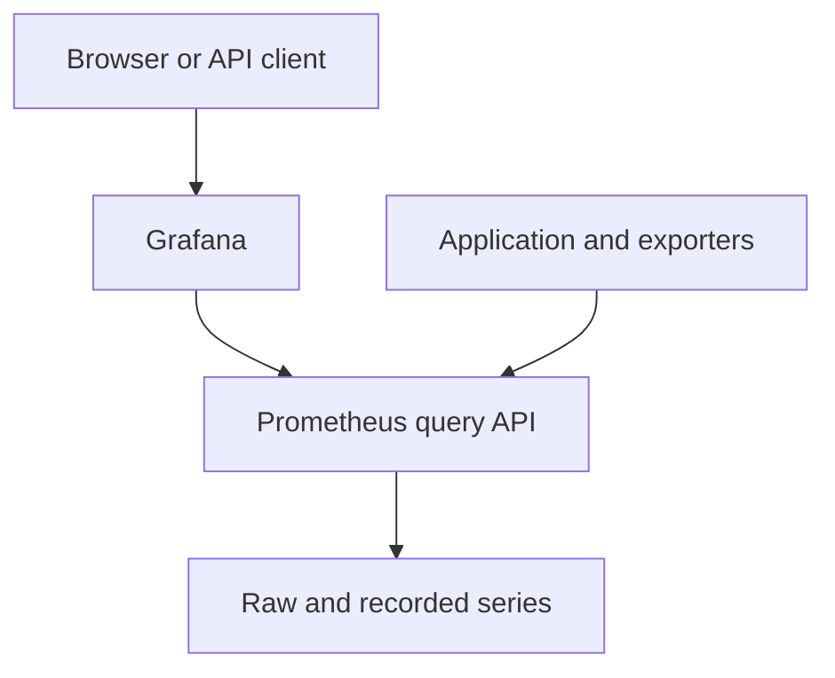

# Lab 19: Grafana Explore and Data Source Fundamentals

## 1. Purpose and Learning Outcomes

**In Plain Language:** You will connect Grafana to the existing Prometheus data and inspect how a chart is produced. Verify server-side connectivity, reproduce a query outside the panel, and distinguish empty results from query errors. A short Prometheus outage demonstrates that Grafana being healthy does not guarantee its data source is available.

> **Primary Objective:** Query Prometheus through Grafana and separate visualization, query semantics, data-source connectivity and backend availability.

Grafana does not scrape this application or create missing metric history. It sends queries to the already configured Prometheus server.

You will provision one Prometheus data source, use Explore and Query Inspector, reproduce a query through Grafana's API, and observe a bounded source outage. Dashboards begin in Lab 20. Loki, Tempo, Collector, Pyroscope and Alertmanager remain stopped here.

## 2. Starting Point and Lab Map

Use this guide inside the complete application repository. Run commands from the repository root in Bash unless a step says otherwise. Work through the starting checks in order; they load the helpers and state this lab needs.

Read the explanation before each step, run one complete code block at a time, and compare the actual result with the stated expectation. Save commands, observations, explanations, and unexpected results in your notebook.

### Key Terms

| **Term**     | **Plain-Language Meaning**                                                         |
| ------------ | ---------------------------------------------------------------------------------- |
| Data source  | Grafana's configured connection to a backend such as Prometheus.                   |
| Query step   | Spacing between evaluations in a range query; it does not change scrape frequency. |
| Provisioning | Loading reviewed configuration from files into Grafana.                            |

### Lab Map

The arrows show the flow or dependency being studied. Branches identify paths to compare; this is a conceptual map, not a captured runtime trace.


```mermaid
flowchart TD
    B["Browser or API client"] --> G["Grafana"]
    G --> P["Prometheus query API"]
    P --> R["Raw and recorded series"]
    A["Application and exporters"] --> P
```

## 3. Guided Walkthrough

### Step 01. Inherited State and Starting Checks

**What You Are Doing:** Begin with healthy collection and preserve Grafana's existing data volume. Stored account state and new environment settings can have different lifecycles.

**Practical Walkthrough:** Check Prometheus and existing targets before adding Grafana. Preserve Grafana's existing data volume because it can contain account state and prior settings. Startup environment variables may initialize new state without overriding values already stored in that volume.

Confirm fresh Prometheus observations before troubleshooting Grafana. Retain the existing Grafana volume and identify whether it already contains initialized account state. This prevents a changed startup variable from being mistaken for a completed password change in the persisted application database.

```bash
source lab-notes/session.sh
source lab-notes/evidence.sh
source lab-notes/raw-metrics.sh
source lab-notes/metrics-session.sh
metrics_check
start_lab 19
```

Complete [Lab 18](Lab-18.md) first. Run commands from the repository root in the same Bash session. Keep the existing credentials, named volumes and checkpoint item. Begin with seven services and five jobs. Keep Grafana pinned to `13.2.2` and its existing named volume. You need a browser and the current Grafana account credentials.

**Understanding the Result:** Know whether you are using a fresh or existing Grafana state. A login mismatch can be a persistence issue rather than failed startup.

### Step 02. Learning Objectives and Networking Boundaries

**What You Are Doing:** Identify the browser, Grafana server, and Prometheus as separate network callers. Each address must be correct from the component that actually uses it.

**Practical Walkthrough:** Identify who uses each URL: your browser reaches Grafana, while Grafana's server reaches Prometheus. A hostname valid inside Docker may not resolve in the browser, and browser loopback refers to your own machine. Follow the diagram's caller boundaries before choosing an address.

Write the caller beside each endpoint: browser-to-Grafana and Grafana-to-Prometheus use different network contexts. Resolve failures from that caller's location. A browser opening Grafana successfully does not prove that the Grafana container can reach its configured data source.

You will verify the internal data-source URL, distinguish instant and range requests, inspect query step/time/labels, compare returned values across APIs and diagnose empty results separately from transport failures.

The lab map in Section 2 shows this relationship.

Grafana startup/provisioning and Prometheus stop/recovery are change events. Application requests remain independent business events. A healthy Grafana database does not prove that its Prometheus data source is healthy.

**Understanding the Result:** Correct networking is relative to the caller. Use the documented internal URL for server-to-server data-source access.

### Step 03. Create Focused Provisioning

**What You Are Doing:** Create the focused data-source provisioning and mounts. This brings in the intended source without importing dashboards before their queries are understood.

**Practical Walkthrough:** Create the data-source provisioning file at the path mounted by the focused overlay. Its stable UID lets later dashboards refer to the same source consistently. Start with the source alone so you can understand and validate its queries before importing a large dashboard definition.

Check the provisioning file's mounted destination and stable UID before startup. Dashboards refer to that identity, while the URL determines where Grafana sends queries. A correctly named source pointing at an unreachable address would still fail despite appearing in the source list.

```bash
mkdir -p lab-notes/grafana/provisioning/datasources \
  lab-notes/grafana/provisioning/dashboards lab-notes/grafana/dashboards
chmod 755 lab-notes/grafana lab-notes/grafana/provisioning \
  lab-notes/grafana/provisioning/datasources lab-notes/grafana/provisioning/dashboards \
  lab-notes/grafana/dashboards
```

```bash
cat > lab-notes/grafana/provisioning/datasources/datasources.yml <<'YAML'
apiVersion: 1
prune: false
datasources:
  - name: Prometheus
    uid: prometheus
    type: prometheus
    access: proxy
    url: http://prometheus:9090
    isDefault: true
    editable: false
    jsonData:
      httpMethod: POST
      timeInterval: 15s
YAML
```

**Command Note:** `<<'YAML'` writes the following block literally until `YAML`. Quoting the delimiter prevents Bash from expanding `$variables` inside the generated file; creation and execution are separate steps.

```bash
cat > lab-notes/compose.grafana.yaml <<'YAML'
services:
  grafana:
    volumes:
      - ./lab-notes/grafana/provisioning:/etc/grafana/provisioning:ro
      - ./lab-notes/grafana/dashboards:/var/lib/grafana/dashboards:ro
YAML
```

The two mounts replace matching base destinations, preserving the pinned image, non-root user, loopback port, health check and Grafana database volume. The dashboard provider directory is intentionally empty until dashboard concepts are introduced.

An earlier full-stack run may have left objects in the persistent database. Validate the `prometheus` UID without deleting unrelated dashboards or changing stored credentials.

**Understanding the Result:** Provisioning is an active configuration input. Check the mounted file and resulting data source rather than merely confirming the file exists locally.

### Step 04. Extend the Stage Helper

**What You Are Doing:** Extend the cumulative helper without losing earlier overlays. All subsequent service operations must continue using the same effective configuration.

**Practical Walkthrough:** Extend and source the cumulative helper while preserving all earlier overlays. Use it for subsequent validation and service operations so Grafana joins the same effective monitoring stage. A new terminal needs the helper loaded again before its functions are available.

Read the complete overlay list in the replacement helper and preserve its order. Source the updated file in the current terminal before calling its functions. This ensures later start, inspect, and recovery commands use the same cumulative configuration containing Grafana and the earlier monitoring services.

```bash
cat > lab-notes/metrics-session.sh <<'BASH'
# Source after session.sh, evidence.sh and raw-metrics.sh.
export PROM_URL="${PROM_URL:-http://127.0.0.1:9090}"

dm() {
  local -a files=(
    -f "$LAB_ROOT/docker-compose.yml"
    -f "$LAB_ROOT/lab-notes/compose.baseline.yaml"
    -f "$LAB_ROOT/lab-notes/compose.metrics.yaml"
  )
  if [[ -f "$LAB_ROOT/lab-notes/compose.node-exporter.yaml" ]]; then
    LAB_NODE_BIND_IP=$(cat "$LAB_ROOT/lab-notes/node-exporter-address.txt") || return 1
    export LAB_NODE_BIND_IP
    files+=(-f "$LAB_ROOT/lab-notes/compose.node-exporter.yaml")
  fi
  if [[ -f "$LAB_ROOT/lab-notes/compose.db-exporters.yaml" ]]; then
    files+=(-f "$LAB_ROOT/lab-notes/compose.db-exporters.yaml")
  fi
  for extra in grafana alertmanager; do
    if [[ -f "$LAB_ROOT/lab-notes/compose.$extra.yaml" ]]; then files+=(-f "$LAB_ROOT/lab-notes/compose.$extra.yaml"); fi
  done
  docker compose --project-directory "$LAB_ROOT" --env-file "$LAB_ROOT/.env" "${files[@]}" "$@"
}

pq() {
  api -fsS --get --data-urlencode "query=$1" "$PROM_URL/api/v1/query"
}

wait_prometheus() {
  local attempt
  for attempt in {1..45}; do
    if api -fsS "$PROM_URL/-/ready" >/dev/null 2>&1; then return 0; fi
    sleep 1
  done
  echo 'Prometheus readiness deadline exceeded' >&2
  return 1
}

wait_target() {
  local job="$1" health="${2:-up}" attempt
  for attempt in {1..45}; do
    if api -fsS "$PROM_URL/api/v1/targets?state=active" \
      | jq -e --arg job "$job" --arg health "$health" \
        '[.data.activeTargets[] | select(.labels.job == $job)] as $targets |
         ($targets | length > 0) and all($targets[]; .health == $health)' >/dev/null; then
      return 0
    fi
    sleep 1
  done
  printf 'Target %s did not become %s\n' "$job" "$health" >&2
  return 1
}

wait_metric() {
  local query="$1" expected="$2" attempt
  for attempt in {1..45}; do
    if pq "$query" | jq -e --arg expected "$expected" \
      '.status == "success" and (.data.result | length > 0) and all(.data.result[]; .value[1] == $expected)' \
      >/dev/null; then return 0; fi
    sleep 1
  done
  printf 'Metric expectation not reached: %s = %s\n' "$query" "$expected" >&2
  return 1
}

set_app_target() {
  python3 - "$LAB_ROOT/lab-notes/prometheus/app-targets.json" "$1" "$LAB_ENVIRONMENT" "$LAB_SERVICE" <<'PYTHON'
import json, os, sys
from pathlib import Path
path = Path(sys.argv[1])
endpoint, environment, service = sys.argv[2:]
content = [] if not endpoint else [{"targets":[endpoint], "labels":{"environment":environment,"service":service}}]
temporary = path.with_suffix(".json.new")
temporary.write_text(json.dumps(content, indent=2) + "\n")
os.chmod(temporary, 0o644)
os.replace(temporary, path)
PYTHON
}

reload_prometheus() {
  dm run --rm -T --no-deps --entrypoint promtool prometheus \
    check config /etc/prometheus/labs/prometheus.yml || return 1
  dm kill -s HUP prometheus
}

metrics_check() {
  wait_ready && load_app_settings && wait_prometheus || return 1
  local actual expected
  expected=$'app\npostgres\nprometheus\nredis'
  if [[ -f "$LAB_ROOT/lab-notes/compose.node-exporter.yaml" ]]; then
    expected+=$'\nnode-exporter'
  fi
  if [[ -f "$LAB_ROOT/lab-notes/compose.db-exporters.yaml" ]]; then
    expected+=$'\npostgres-exporter\nredis-exporter'
  fi
  for extra in grafana alertmanager; do
    if [[ -f "$LAB_ROOT/lab-notes/compose.$extra.yaml" ]]; then expected+=$'\n'"$extra"; fi
  done
  actual=$(dm ps --services --status running | sort) || return 1
  expected=$(printf '%s\n' "$expected" | sort)
  if [[ "$actual" != "$expected" ]]; then
    printf 'Unexpected active services:\n%s\n' "$actual" >&2
    return 1
  fi
  wait_target fastapi && wait_target prometheus || return 1
  if [[ -f "$LAB_ROOT/lab-notes/compose.node-exporter.yaml" ]]; then
    wait_target node || return 1
  fi
  if [[ -f "$LAB_ROOT/lab-notes/compose.db-exporters.yaml" ]]; then
    wait_target postgres && wait_target redis || return 1
    wait_metric 'pg_up{job="postgres"}' 1 && wait_metric 'redis_up{job="redis"}' 1 || return 1
  fi
  if [[ -f "$LAB_ROOT/lab-notes/compose.grafana.yaml" ]]; then wait_grafana || return 1; fi
  if [[ -f "$LAB_ROOT/lab-notes/compose.alertmanager.yaml" ]]; then
    api -fsS "${ALERTMANAGER_URL:-http://127.0.0.1:9093}/-/ready" >/dev/null || return 1
    wait_target alertmanager || return 1
  fi
  echo 'Current learning-stage services and targets are ready' 
}

export GRAFANA_URL="${GRAFANA_URL:-http://127.0.0.1:3000}"
wait_grafana() {
  local attempt
  for attempt in {1..60}; do
    if api -fsS "$GRAFANA_URL/api/health" 2>/dev/null | jq -e '.database=="ok"' >/dev/null; then return 0; fi
    sleep 1
  done
  echo 'Grafana readiness deadline exceeded' >&2
  return 1
}
gapi() {
  : "${GRAFANA_USER:?Set the current Grafana username first}"
  local path="$1"
  shift
  api --user "$GRAFANA_USER" "$@" "$GRAFANA_URL$path"
}
BASH
```

**Command Note:** `jq --arg` passes a shell value as a JSON-query string variable without inserting it into the query text. Where used, `-e` turns a false or null final result into a failing exit status.

This complete replacement preserves earlier commands and includes optional Grafana/Alertmanager overlays only when their files exist. The Alertmanager branch is used in Lab 24; it does not start that service now.

**Understanding the Result:** Consistent overlay order avoids different commands accidentally controlling different configurations. Inspect the merged model when in doubt.

### Step 05. Start Grafana and Verify Its Health

**What You Are Doing:** Start Grafana and inspect its own health independently of Prometheus. Confirm the expected service set rather than starting every service defined by the full stack.

**Practical Walkthrough:** Start only Grafana and check its own readiness, then verify the expected service set. Grafana can be running while its Prometheus data source is unavailable, so service health is only the first boundary. Avoid starting later curriculum components through an unrestricted full-stack command.

Start the named Grafana service, wait for its health check, and inspect the service inventory. Then test the data source separately. The Grafana process can serve its own API while Prometheus queries fail, so those two successful boundaries must be verified independently.

```bash
chmod 644 lab-notes/grafana/provisioning/datasources/datasources.yml
source lab-notes/metrics-session.sh
dm config --quiet
record_change "start_grafana_with_prometheus_source" planned
dm up -d grafana
wait_grafana
metrics_check
api -fsS "$GRAFANA_URL/api/health" > "$LAB_DIR/grafana-health.json"
jq . "$LAB_DIR/grafana-health.json"
```

Expect eight running services, still five scrape jobs, and Grafana database health `ok`. Only the inherited volume initializer may run as a completed dependency. Do not issue an unqualified `dm up` that starts every full-platform service.

**Understanding the Result:** A healthy UI process does not prove successful metric queries. The next steps validate the data-source path separately.

### Step 06. Access the UI and Respect Credential State

**What You Are Doing:** Open the UI through the appropriate loopback path or SSH tunnel. Use the account currently stored in Grafana, which may differ from initial bootstrap credentials.

**Practical Walkthrough:** Open the UI through the documented loopback address or SSH tunnel appropriate to your host arrangement. Sign in using the credentials established in the retained Grafana state. If initialization variables were changed after first startup, do not assume the stored account changed with them.

Use the direct loopback address when the browser is on the Docker host, or keep the SSH tunnel open when accessing a remote host as documented. Resolve login against the retained account state. Do not delete the data volume simply because changed initialization variables were not reapplied.

Browse `http://127.0.0.1:3000` on the Docker host. On a remote VM, tunnel the loopback port from your workstation:

```bash
read -r -p 'SSH destination (user@VM): ' LAB_SSH_DESTINATION
ssh -N -L 3000:127.0.0.1:3000 "$LAB_SSH_DESTINATION"
```

Keep the tunnel terminal open. If the workstation's port 3000 is occupied, choose another local port and browse that port. Use the current Grafana credentials from your private setup.

Changing initial-admin environment variables does not reset an existing Grafana database account. Do not expose Grafana publicly or enable anonymous admin access to work around an authentication problem.

**Understanding the Result:** Reachability and authentication are separate checks. Keep passwords out of captured command arguments and shared evidence.

### Step 07. Inspect the Provisioned Source

**What You Are Doing:** Check the provisioned URL and stable data-source UID in the UI. The URL is resolved by the Grafana container, not by your browser.

**Practical Walkthrough:** Inspect the provisioned source's URL and UID in Grafana. The URL is contacted by the Grafana container, so it should use the reachable internal service address specified by the lab. Confirm the UID matches later API and dashboard references.

Compare the UI's source UID and URL with the provisioned file. Read the URL from Grafana's server-side viewpoint, where the internal Prometheus service name is relevant. If the source is provisioned, make lasting changes in its owning file rather than assuming an unpersisted UI edit is authoritative.

Open **Connections → Data sources → Prometheus**. Confirm UID `prometheus`, URL `http://prometheus:9090`, POST query method and a 15-second scrape-interval reference.

This URL is used by the Grafana server container. `127.0.0.1:9090` would refer to that container, not to the Prometheus service. The browser's Grafana URL and the server-side data-source URL have different networking roles.

The source is provisioned and not UI-editable. See [Grafana data-source provisioning](https://grafana.com/docs/grafana/latest/administration/provisioning/#data-sources).

**Understanding the Result:** A stable UID connects saved definitions to the intended source. A correct browser URL cannot compensate for an incorrect backend data-source URL.

### Step 08. Verify the Source through the API

**What You Are Doing:** Verify the data source through the API and preserve the result. This provides a reproducible check alongside the UI without exposing a password in command arguments.

**Practical Walkthrough:** Run the authenticated API check using the provided credential-handling pattern and save the returned status. This creates reproducible evidence of the configured source alongside the UI inspection. Check the response's success and identity fields rather than assuming any JSON response proves a healthy source.

Use the documented protected credential input and inspect the API's actual status and source identity. Preserve the response without exposing authentication material. A JSON error body is still JSON, so successful parsing alone is insufficient proof that authentication or source connectivity worked.

```bash
GRAFANA_USER=$(dm exec -T grafana sh -c 'printf "%s" "$GF_SECURITY_ADMIN_USER"')
export GRAFANA_USER
gapi /api/datasources/uid/prometheus -fsS > "$LAB_DIR/datasource.json"
gapi /api/datasources/uid/prometheus/health -fsS > "$LAB_DIR/datasource-health.json"
jq '{uid,name,type,url,access,jsonData}' "$LAB_DIR/datasource.json"
jq . "$LAB_DIR/datasource-health.json"
```

The helper gives curl only the username; curl prompts for the password without echo. Use the current account name if it differs from the initial environment value. Do not put a password in command arguments or enable shell tracing.

The source health endpoint tests its backend path; Grafana `/api/health` tests Grafana's own database. These compatibility HTTP endpoints are supported by the pinned version.

**Understanding the Result:** API errors, authentication failures, and successful source checks require different interpretations. Preserve the response without exposing the secret.

### Step 09. Use Explore with Raw and Recorded Values

**What You Are Doing:** Query a target gauge, a raw counter, and a recorded rate in Explore. Explain each result's units and retained labels before turning it into a panel.

**Practical Walkthrough:** In Explore, run the gauge, cumulative counter, and recorded-rate examples separately. Inspect labels and units before comparing graphs. The gauge represents current observed state, the counter accumulated events, and the rate derived change over time; similar-looking lines do not make those meanings interchangeable.

Run the three expressions separately and inspect their returned labels and units before selecting visualization options. The cumulative counter should not be labeled requests per second. The recording rule already represents a calculated rate, so applying another counter-rate operation to it would change the meaning incorrectly.

Open **Explore**, choose Prometheus and Code mode. Run each expression separately:

```promql
up{job="fastapi"}
```

```promql
application_http_requests_total{job="fastapi",route="/api/v1/items",method="GET",status_code="200"}
```

```promql
service_route:application_http_requests:rate2m{route="/api/v1/items",method="GET"}
```

The first should be one currently healthy target. The second is a lifetime process counter. The third is a recorded requests/second gauge without job/instance labels. Do not take its rate again or filter it by a removed job label.

Switch between instant/table and range/time-series views. A historical zero or gap does not necessarily describe current health. Generate a few ordinary list requests if the selected route has no source history.

**Understanding the Result:** Explain each value in a sentence with units and scope. That explanation should remain valid when the display style changes.

### Step 10. Inspect the Request Before Interpreting the Chart

**What You Are Doing:** Inspect the request's expression, time range, step, and returned labels. Those parameters explain what a chart represents and why it refreshes differently from collection.

**Practical Walkthrough:** Open Query Inspector and read the actual expression, time bounds, step, and response labels. These parameters determine which stored observations the graph can show. A refresh requests another query; it does not force Prometheus to scrape or the app to produce new business events.

Use Query Inspector to record the exact expression, data-source UID, time range, and evaluation step. These parameters explain the chart more reliably than its appearance. Refreshing the panel reevaluates a query; it does not increase the source's instrumentation or scrape frequency.

Open Query Inspector and record the expression, start/end times, evaluation step, returned labels and point count. A scrape interval controls collection, a query step controls evaluation points and dashboard refresh controls how often the browser asks again.

Grafana can align time boundaries and choose a step based on display resolution. A finer step does not restore unsampled history. Compare actual query requests before claiming two graphs disagree. Keep an absolute UTC range when correlating with earlier fault timestamps.

**Understanding the Result:** Save query settings with screenshots. Visual appearance alone is insufficient to reproduce the displayed evidence.

### Step 11. Reproduce a Grafana Query

**What You Are Doing:** Reproduce the same query through the APIs and compare values and labels. Different response wrappers should not be mistaken for different underlying measurements.

**Practical Walkthrough:** Reproduce the inspected expression through the documented APIs using matching time settings. Compare the returned label sets and values rather than the outer JSON shape, which differs between Grafana and Prometheus interfaces. Align evaluation time before treating small numeric differences as a defect.

Match evaluation time and selected labels before comparing Grafana and Prometheus responses. Their JSON wrappers differ, so compare the underlying series and values rather than file shape. A moving `now` window can introduce legitimate differences between requests made a few seconds apart.

```bash
cat > lab-notes/grafana/query-up.json <<'JSON'
{"from":"now-5m","to":"now","queries":[{"refId":"A","datasource":{"type":"prometheus","uid":"prometheus"},"expr":"up{job=\"fastapi\"}","instant":true,"range":false,"format":"time_series","intervalMs":15000,"maxDataPoints":100}]}
JSON
gapi /api/ds/query --fail-with-body -sS -X POST -H 'Content-Type: application/json' \
  --data-binary @lab-notes/grafana/query-up.json > "$LAB_DIR/grafana-up-query.json"
pq 'up{job="fastapi"}' > "$LAB_DIR/direct-up-query.json"
jq '.results.A | {status,error,frames}' "$LAB_DIR/grafana-up-query.json"
```

Compare the numeric values and labels rather than JSON shape: Grafana wraps data frames while Prometheus returns a vector/matrix. An HTTP 200 can still carry a per-query error, so inspect the result's error/status fields and frames.

**Understanding the Result:** Equivalent underlying data can have different response wrappers. The comparison concerns measurement identity, values, and time.

### Step 12. Distinguish Empty, Zero and Error

**What You Are Doing:** Deliberately produce a valid empty result and a syntax failure. Learn their different UI and API evidence before diagnosing a real missing-data report.

**Practical Walkthrough:** Run the deliberate empty selector and invalid expression, then inspect both UI and API feedback. A valid query with no matching series differs from a syntax error that prevented evaluation. Add the observed-zero example to keep all three cases distinct in later troubleshooting.

Inspect whether the query executed successfully before interpreting an empty display. Compare the deliberate nonexistent route with a syntax error and an observed zero. Each requires a different next check, and none should be hidden by a dashboard setting that indiscriminately replaces missing values with zero.

Query a deliberately nonexistent route selector in Explore:

```promql
application_http_requests_total{job="fastapi",route="/this-route-does-not-exist"}
```

Then run `up{job="fastapi"}` and finally a malformed expression such as `sum(`. Record the valid empty result, the valid numeric result and the explicit parse failure.

Do not replace all missing/error cases with zero. Such a transform can make a broken query path look healthy and can turn an undefined error fraction into false success.

**Understanding the Result:** Do not repair missing data by silently substituting zero. First establish whether the source, selection, or expression failed.

### Step 13. Predict and Observe a Brief Source Outage

**What You Are Doing:** Stop only Prometheus briefly and compare Grafana, query, and business health. Restore it and verify collection resumes before continuing.

**Practical Walkthrough:** Stop only Prometheus within the recovery wrapper and compare Grafana health, data queries, and business requests. Grafana may remain available while panels fail, and the application can continue serving work independently. Restore Prometheus and verify fresh collection and successful queries before finishing.

Keep Prometheus restoration attached to the fault block and observe Grafana health, query errors, and business requests during the same interval. After restart, verify fresh scrapes and working queries. The retained graph history alone cannot establish that the source connection recovered.

```bash
(
  set -euo pipefail
  trap 'dm start prometheus >/dev/null' EXIT
  trap 'exit 130' INT
  trap 'exit 143' TERM
  record_change "brief_prometheus_stop_for_source_boundary" planned
  dm stop prometheus
  api -fsS "$GRAFANA_URL/api/health" > "$LAB_DIR/grafana-with-source-down.json"
  api -fsS "$APP_URL/api/v1/items?limit=1" > "$LAB_DIR/business-with-source-down.json"
  if gapi /api/ds/query --fail-with-body -sS -X POST -H 'Content-Type: application/json' \
    --data-binary @lab-notes/grafana/query-up.json > "$LAB_DIR/source-down-query.json"; then
    jq -e '.results.A.error != null' "$LAB_DIR/source-down-query.json"
  else
    printf 'Source request failed as expected; inspect captured response\n'
  fi
)
wait_prometheus
wait_target fastapi up
metrics_check
gapi /api/datasources/uid/prometheus/health -fsS > "$LAB_DIR/source-recovered.json"
record_change "prometheus_query_path_recovered" completed
```

**Command Note:** `trap ... EXIT` schedules cleanup when that shell exits. Keep it in the same block as the fault; the explicit recovery checks afterward confirm that restoration actually succeeded.

Before running it, predict which health checks will stay healthy. Expected: Grafana's database and the business API still work, while the Prometheus-backed query fails. The trap restarts only Prometheus.

Prometheus performs no scrapes/rule evaluations while stopped. Recovery resumes collection; it does not automatically backfill missing observations. This brief boundary exercise is distinct from the larger telemetry-backend incident lab later in the curriculum.

**Understanding the Result:** The experiment separates visualization, collection, and business failure domains. Recovery needs evidence at each affected boundary.

## 4. Troubleshooting and Diagnosis

Start with the first unexpected result. Record the exact symptom, identify which component produced it, and use the checks below before repeating the experiment. After a fix, repeat the original check and confirm recovery.

### Troubleshooting and Evidence

| **Symptom**                             | **Inspect**                             | **Corrective Action**                                              |
| --------------------------------------- | --------------------------------------- | ------------------------------------------------------------------ |
| Login fails after changing `.env`       | Existing Grafana account                | Use/recover the current stored credential; do not erase the volume |
| Source health fails                     | Internal URL, DNS, Prometheus readiness | Use `http://prometheus:9090`, not container localhost              |
| Raw metric works, recorded metric empty | Recording labels/health                 | Remove job/instance filters and inspect rule output                |
| Grafana responds but panels fail        | Per-query error and source path         | Separate Grafana health from backend health                        |
| Direct and UI values differ             | Time, step, population                  | Compare the actual Query Inspector request                         |

Save one successful frame response, one failed-source response and final source health. Review Grafana and Prometheus logs if the expected boundary is different. Keep eight services running after recovery.

## 5. Review and Practice

Answer the knowledge questions in your own words before reading the answer guide. For the scenario, name the evidence you would collect and the conclusion each observation would support.

### Knowledge Check

1. Does Grafana scrape FastAPI here?
2. Why is datasource localhost wrong?
3. Does a finer display step add measurements?

#### Answer Guide

1. No. Prometheus scrapes; Grafana queries Prometheus.
2. The request is made from the Grafana container, whose localhost is not Prometheus.
3. No. It changes query evaluation/display density, not source collection.

### Professional Scenario Exercise

Grafana is reachable, the application is healthy and every panel is empty. Build a diagnostic sequence that separates credentials, data-source transport, missing labels, query errors and an inappropriate time window.

## 6. Completion Checklist

Mark each item only after you can point to its result or evidence file. Complete any cleanup shown here before moving on.

### Observable Completion Criteria

- [ ] Grafana provisions the correct internal Prometheus URL and UID.
- [ ] Instant/range and raw/recorded queries are distinguished.
- [ ] Query Inspector evidence captures scope and evaluation settings.
- [ ] Empty results and query failures remain distinct.
- [ ] Source outage and recovery are proven through both API and business evidence.

## 7. Production Context and Next Lab

### Production Implications

Provision stable data-source identities and keep administrative access private. Visualization health is only one layer; monitor the query backend and collection paths independently.

### End State and Transition

Keep eight services and the single working source. [Lab 20](Lab-20.md) builds a RED dashboard from operational questions and verified metric populations.
